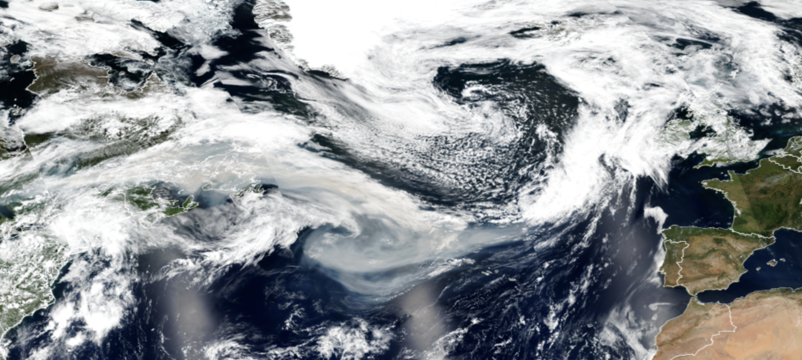

---
jupyter:
  jupytext:
    text_representation:
      extension: .md
      format_name: markdown
      format_version: '1.3'
      jupytext_version: 1.16.1
  kernelspec:
    display_name: Python 3 (ipykernel)
    language: python
    name: python3
---


## Long-range transport of aerosols over the Atlantic
 
During summer 2023 there were several major aerosol long-range transport episodes over the Northern Atlantic. Intense fires in Canada emitted loads of smoke that lead to several significant transport episodes, when smoke from Canadian fires were transported to Europe. Also several major dust outflow episodes from Sahara took place. This notebook demonstrates how these episodes can be analysed and identified using observations from TROPOMI.   


### Table of contents

1. [TROPOMI data](#paragraph1)
2. [Analysing the episodes using AVL](#paragraph2)
3. [References](#harp_references)


## 1. TROPOMI data <a name="paragraph1"></a>

The preparations needed to set up avl is shown in [Use case 6](https://atmospherictoolbox.org/media/usecases/Usecase_6_CO_European_wildfires_2022.html#paragraph1). In this usecase the files are downloaded using `eofetch`.

```python
import harp
import avl
import eofetch
import os
```

For this use case three products from TROPOMI are used:
- UVAI: Absorbing Aerosol Index
- ALH: Aerosol Layer Height 
- CO: Carbon Monoxide

The files for this case are:

- UVAI: S5P_OFFL_L2__AER_AI_20230624T142803_20230624T160933_29513_03_020500_20230626T041053.nc, S5P_OFFL_L2__AER_AI_20230624T160933_20230624T175103_29514_03_020500_20230626T060056.nc

- ALH: S5P_OFFL_L2__AER_LH_20230624T142803_20230624T160933_29513_03_020500_20230626T062234.nc,       S5P_OFFL_L2__AER_LH_20230624T160933_20230624T175103_29514_03_020500_20230626T081205.nc
  
- CO: S5P_OFFL_L2__CO_____20230624T142803_20230624T160933_29513_03_020500_20230626T041051.nc, S5P_OFFL_L2__CO_____20230624T160933_20230624T175103_29514_03_020500_20230626T060054.nc

The data is downloaded using `eofetch` as follows.  To be able to perform `eofetch.download`, you must have environment variables CDSE_S3_ACCESS and CDSE_S3_SECRET set as described in [eofetch README](https://github.com/stcorp/eofetch#readme) (replacing xxx and yyy with your personal credentials):

```python
os.environ["CDSE_S3_ACCESS"]="xxx"
os.environ["CDSE_S3_SECRET"]="yyy"
```

```python
eofetch.download(["S5P_OFFL_L2__AER_AI_20230624T142803_20230624T160933_29513_03_020500_20230626T041053.nc",
                 "S5P_OFFL_L2__AER_AI_20230624T160933_20230624T175103_29514_03_020500_20230626T060056.nc"])
eofetch.download(["S5P_OFFL_L2__AER_LH_20230624T142803_20230624T160933_29513_03_020500_20230626T062234.nc",
                 "S5P_OFFL_L2__AER_LH_20230624T160933_20230624T175103_29514_03_020500_20230626T081205.nc"])
eofetch.download(["S5P_OFFL_L2__CO_____20230624T142803_20230624T160933_29513_03_020500_20230626T041051.nc",
                 "S5P_OFFL_L2__CO_____20230624T160933_20230624T175103_29514_03_020500_20230626T060054.nc"])
```

## 2. Analysing the episodes using AVL <a name="paragraph2"></a>

To identify transport episodes, observations from several parameters and orbits are often needed. With the `avl.Geo` several orbits can be plotted onto a single map. First the data files are imported with HARP, taking into account only good quality data and cutting the latitude between 0N-65N and longitude between -112W-15E:

```python
uvai_file1=['S5P_OFFL_L2__AER_AI_20230624T142803_20230624T160933_29513_03_020500_20230626T041053.nc']
uvai_file2=['S5P_OFFL_L2__AER_AI_20230624T160933_20230624T175103_29514_03_020500_20230626T060056.nc']
```

```python
operations_uvai = ";".join([
    "absorbing_aerosol_index_validity>80",
    "latitude>0;latitude<65",
     "longitude>-112;longitude<15"])

uvai1=harp.import_product(uvai_file1, operations_uvai)
uvai2=harp.import_product(uvai_file2, operations_uvai)
```

```python
plot = avl.MapPlot()
plot.add(avl.Geo(uvai1, 'absorbing_aerosol_index',colormap='magma_r', colorrange=(0, 4), opacity=0.5, showcolorbar=True, zoom=8))
plot.add(avl.Geo(uvai2, 'absorbing_aerosol_index',colormap='magma_r', colorrange=(0, 4), opacity=0.5, showcolorbar=True, zoom=8))

```

Absorbing aerosol plumes, i.e. dust, smoke or volcanic ash, appear on the aerosol index as positive values. A significant plume typically has UVAI values > 1.0. From the maps we see that there are two clear aerosol plumes over the Atlantic, one in the north and the other in the south. 

Similarly to UVAI, the aerosol layer height files can be imported with harp and plotted with avl. If you are not sure which variable to plot, you can print the contents of the imported variables e.g. `print(ah1)`, to get the list and names of the variables that are included in the imported harp product. 

```python
ah_file1='S5P_OFFL_L2__AER_LH_20230624T142803_20230624T160933_29513_03_020500_20230626T062234.nc'
ah_file2='S5P_OFFL_L2__AER_LH_20230624T160933_20230624T175103_29514_03_020500_20230626T081205.nc'

operations_ah = ";".join([
    "aerosol_height_validity>50",
    "latitude>0;latitude<65",
    "longitude>-112;longitude<15"])

ah1=harp.import_product(ah_file1, operations_ah)
ah2=harp.import_product(ah_file2, operations_ah)
```

```python
plot = avl.MapPlot()
plot.add(avl.Geo(ah1, 'aerosol_height',colormap='RdYlBu_r', colorrange=(0, 8000), opacity=0.5, showcolorbar=True, zoom=8))
plot.add(avl.Geo(ah2, 'aerosol_height',colormap='RdYlBu_r', colorrange=(0, 8000), opacity=0.5, showcolorbar=True, zoom=8))

```

As the aerosol layer height map shows, there are much less data on the map than for UVAI. Good quality layer height can be obtained only when there are enough absorbing aerosols present. However, zooming in the map we can estimate that at the northern plume heights of the aerosol layer center range roughly between 4 and 8 km, whereas the center of the southern plume is most probably located at a bit lower level. UVAI and ALH observations can be used to analyse the plumes, but they can not be used direclty to identfy which kind of aerosols the plumes are. Some guesses can be done based on the location and probable origin of the plume.  

Typically for smoke transport there is also a clear CO plume present in addition to aerosols. The CO files are imported and plotted similar way as the aerosol observations. For CO we use the option to plot `corrected_co` instead of the default co variable. 

```python
co_file1=['S5P_OFFL_L2__CO_____20230624T142803_20230624T160933_29513_03_020500_20230626T041051.nc']
co_file2=['S5P_OFFL_L2__CO_____20230624T160933_20230624T175103_29514_03_020500_20230626T060054.nc']

co_operations = ";".join([
    "CO_column_number_density_validity>50",
    "derive(CO_column_volume_mixing_ratio {time} [ppbv])",
    "latitude>0;latitude<65",
    "longitude>-112;longitude<15"])

co1=harp.import_product(co_file1, co_operations, options="co=corrected")
co2=harp.import_product(co_file2, co_operations, options="co=corrected")
```

```python
plot = avl.MapPlot()
plot.add(avl.Geo(co1, 'CO_column_volume_mixing_ratio',colormap='RdYlBu_r', colorrange=(80, 150), opacity=0.5, showcolorbar=True, zoom=8))
plot.add(avl.Geo(co2, 'CO_column_volume_mixing_ratio',colormap='RdYlBu_r', colorrange=(80, 150), opacity=0.5, showcolorbar=True, zoom=8))

```

Now, when comparing the aerosol plumes and CO we can see that the northern plume is clearly associated also with elevated CO values, that indicate smoke. For the southern aerosol plume there is no significant CO plume visible, which indicates that it is mostly dust. The UVAI and CO variables can be also visualised as 2d scatterplots as a function of time. From the plots below we see that UVAI present elevated (>2) values around 15:15 -15:20, and 15:22-15:28, whereas the CO peaks only at 15:22-15:28. 

```python
from avl import vis

avl.Scatter(uvai1, 'absorbing_aerosol_index')

```

```python
avl.Scatter(co1, 'CO_column_volume_mixing_ratio')

```

### 4. References <a name="paragraph1"></a>

- [Readme for UVAI](https://sentinels.copernicus.eu/documents/247904/3541500/Sentinel-5P-Aerosol-Level-2-Product-Readme-File/ce074bd0-4c7b-47d9-8502-cdbe12d5532c)
- [Readme for ALH](https://sentinels.copernicus.eu/documents/247904/3942516/Sentinel-5P-Aerosol-Layer-Height-Product-Readme-File.pdf/8d8cdf67-2d2b-4a90-ab2d-3f80389f479a)
- [Readme for CO](https://sentinels.copernicus.eu/documents/247904/3541451/Sentinel-5P-Carbon-Monoxide-Level-2-Product-Readme-File.pdf/f8942626-ffb6-4951-90fc-a16b6589e39e?t=1678985415532)
 
