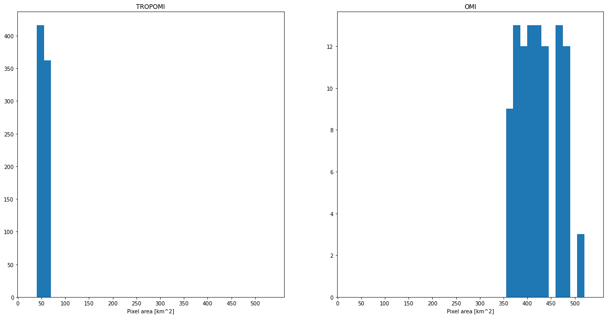

# Comparison of OMI and TROPOMI spatial resolution of NO2 observations at  city scale


This use case compares the spatial resolution of the Ozone Monitoring Instrument (OMI) and the TROPOspheric Monitoring Instrument nitrogen dioxide (NO2) observations. OMI was launched onboard NASA's Aura satellite in 2004, and since that it has been providing observations on atmospheric composition now for nearly 18 years. TROPOMI was launched in 2017 onboard ESA Copernicus Sentinel 5p satellite. TROPOMI, as the successor of the OMI instrument, is very similar in design but has e.g. much higher spatial resolution. The spatial resolution of OMI NO2 data is 13km x 24 km at nadir, whereas for TROPOMI the resolution (since August 2019) is 5.5 km × 3.5 km. Both instruments are on an afternoon orbit and their local overpassing times are very close to each other. It should be noted that OMI has been suffering from a so called [row anomaly](https://aura.gesdisc.eosdis.nasa.gov/data/Aura_OMI_Level2/OMNO2.003/doc/README.OMNO2.pdf) that affects certain pixels of the orbit, and hence data can not be obtained for those pixels affected.

This notebook illustrates how to compare the spatial resolution of these two instruments at a city scale. The new features introduced in this notebook are:

- Reading NO2 data from two different satellite instruments
- Differences in quality filtering of NO2 data for TROPOMI and OMI
- Derivation of a new parameter from the original data for pixel area 
- Plotting pixel-based data on a map

  

### Table of contents

1. [Importing Python modules](#paragraph1)
2. [Obtaining data files for OMI and TROPOMI](#paragraph2)
3. [HARP import for OMI and TROPOMI NO2](#paragraph3)
4. [Creating GeoDataFrames for plotting](#paragraph4)
5. [Plotting data on a map](#paragraph5)
6. [References](#paragraph6)

### 1. Importing Python modules <a name="paragraph1"></a>

In this notebook new modules "folium", "branca", and "geopandas" are used. Folium is used as a basemap for plotting, and geopandas are used to modify the output data from HARP import.


```python
import harp
import numpy as np
import matplotlib.pyplot as plt
import branca
import folium
import pyproj
import geopandas as gpd
from shapely.geometry import Polygon
import sentinelsat
```

### 2. Obtaining data files for OMI and TROPOMI <a name="paragraph2"></a>


The TROPOMI data file can be downloaded automatically using the sentinelsat library as in [use case 2](https://atmospherictoolbox.org/media//usecases/Usecase_2_S5P_AAI_Siberia_Smoke.html#paragraph3). The TROPOMI file used in this exercise is:

*S5P_OFFL_L2__NO2____20210713T113312_20210713T131441_19424_02_020200_20210715T052115.nc*

The OMI file needs to be downloaded manually. The OMI data can be found from [NASA GES DISC](https://disc.gsfc.nasa.gov/). The specific data set can be found by searching "OMNO2". To download the data one needs to have registered to NASA Earthdata. Note that currently there are two data sets for Level 2 OMI NO2 data available, make sure that the data file is named OMNO2. The OMI file that is used in this example is:

*OMI-Aura_L2-OMNO2_2021m0713t1219-o90393_v003-2021m0824t153120.he5*


```python
filename_tropomi = "S5P_OFFL_L2__NO2____20210713T113312_20210713T131441_19424_02_020200_20210715T052115.nc"
filename_omi="OMI-Aura_L2-OMNO2_2021m0713t1219-o90393_v003-2021m0824t153120.he5"
```

### 3. HARP import for OMI and TROPOMI NO2 <a name="paragraph3"></a>

The advantage of HARP is that for the most part same operations can be used to import both TROPOMI and OMI NO2 products because the naming conventions are similar even though the original file structures are different. Hence, for both data sets operations in HARP import are very similar, **the main difference is quality filtering which is different for OMI and TROPOMI**. For both data set the parameter we are interested in is called "tropospheric_NO2_column_number_density". For TROPOMI the data quality for each pixel is indicated with a qa value varying from 0 to 100 (or 0 to 1), whereas for OMI the data quality is indicated in bitwise manner. 

To follow the recommendations of the algorithm teams, the **following quality filters should be included in operations**:

- **TROPOMI NO2**: "tropospheric_NO2_column_number_density_validity>75"
- **OMI NO2**: "validity !& 1"

For this example we are interested only data in the vicinity of Madrid, therefore the imported data is restricted to area lat 39.5N...41N, lon -5W...-2W. **In the operations we also derive a new parameter, pixel area as km^2**, that can be derived from latitude and longitude bounds:

- "derive(area {time} [km2])"; where area is the name of the parameter, time is the dimension of the imported data and km2 are the units.


```python
operations_trop= ";".join([
    "tropospheric_NO2_column_number_density_validity>75",
    "latitude>39.5",
    "latitude<41",
    "longitude<-2",
    "longitude>-5",
    "keep(latitude_bounds,longitude_bounds,tropospheric_NO2_column_number_density)",
    "derive(tropospheric_NO2_column_number_density [Pmolec/cm2])",
    "derive(area {time} [km2])"
])
```


```python
tropomi_NO2 = harp.import_product(filename_tropomi,operations=operations_trop)
```


```python
print(tropomi_NO2)
```

    source product = 'S5P_OFFL_L2__NO2____20210713T113312_20210713T131441_19424_02_020200_20210715T052115.nc'
    history = "2022-03-25T12:04:07Z [harp-1.15] harp.import_product('S5P_OFFL_L2__NO2____20210713T113312_20210713T131441_19424_02_020200_20210715T052115.nc',operations='tropospheric_NO2_column_number_density_validity>75;latitude>39.5;latitude<41;longitude<-2;longitude>-5;keep(latitude_bounds,longitude_bounds,tropospheric_NO2_column_number_density);derive(tropospheric_NO2_column_number_density [Pmolec/cm2]);derive(area {time} [km2])')"
    
    float latitude_bounds {time=778, 4} [degree_north]
    float longitude_bounds {time=778, 4} [degree_east]
    double tropospheric_NO2_column_number_density {time=778} [Pmolec/cm2]
    double area {time=778} [km2]
    


```python
operations_omi= ";".join([
    "validity !& 1",
    "latitude>39.5",
    "latitude<41",
    "longitude<-2",
    "longitude>-5",
    "keep(latitude_bounds,longitude_bounds,tropospheric_NO2_column_number_density)",
    "derive(tropospheric_NO2_column_number_density [Pmolec/cm2])",
    "derive(area {time} [km2])"
])
```


```python
omi_NO2=harp.import_product(filename_omi,operations=operations_omi)
```


```python
print(omi_NO2)
```

    source product = 'OMI-Aura_L2-OMNO2_2021m0713t1219-o90393_v003-2021m0824t153120.he5'
    history = "2022-03-25T12:04:11Z [harp-1.15] harp.import_product('OMI-Aura_L2-OMNO2_2021m0713t1219-o90393_v003-2021m0824t153120.he5',operations='validity !& 1;latitude>39.5;latitude<41;longitude<-2;longitude>-5;keep(latitude_bounds,longitude_bounds,tropospheric_NO2_column_number_density);derive(tropospheric_NO2_column_number_density [Pmolec/cm2]);derive(area {time} [km2])')"
    
    double longitude_bounds {time=100, 4} [degree_east]
    double latitude_bounds {time=100, 4} [degree_north]
    double tropospheric_NO2_column_number_density {time=100} [Pmolec/cm2]
    double area {time=100} [km2]
    


### 4. Creating GeoDataFrames for plotting  <a name="paragraph4"></a>

This use case uses the [folium module](https://python-visualization.github.io/folium/quickstart.html) as a basemap for plotting. Folium makes it easy to visualize data that’s been manipulated in Python on an interactive Leaflet map. For plotting purposes the HARP-imported OMI and TROPOMI data are put into GeoDataFrames. 

**TROPOMI GeoDataFrame:**

First step is to create an empty GeoDataFrame for TROPMI data. For GeoDataFrame you need to define the The Coordinate Reference System (crs) that defines how the coordinates relate to places on the Earth. For that first an empty column named "geometry" is created to the data frame, and then the crs is set.


```python
crs = {'init': 'epsg:4326'}

tropomi= gpd.GeoDataFrame()
tropomi['geometry'] = None
tropomi.crs=crs
```

    /Users/sundstro/miniconda3/envs/avl/lib/python3.9/site-packages/pyproj/crs/crs.py:131: FutureWarning: '+init=<authority>:<code>' syntax is deprecated. '<authority>:<code>' is the preferred initialization method. When making the change, be mindful of axis order changes: https://pyproj4.github.io/pyproj/stable/gotchas.html#axis-order-changes-in-proj-6
      in_crs_string = _prepare_from_proj_string(in_crs_string)


The loop over imported TROPOMI data creates a polygon from each individual pixel using latitude and longitude bounds. Each pixel is represented as a polygon having a corresponding value for tropospheric NO2 and pixel area, as well as pixel id. 


```python
#index for the for loop to go through all TROPOMI pixels
idx=tropomi_NO2.latitude_bounds.data.shape[0]

# loop over pixels

for x in range(idx):
    lat_c=tropomi_NO2.latitude_bounds.data[x]
    lon_c=tropomi_NO2.longitude_bounds.data[x]
    poly = Polygon(zip(lon_c, lat_c))
    tropomi.loc[x, 'pixel_id'] = x
    tropomi.loc[x, 'geometry'] = poly
    tropomi.loc[x, 'NO2'] =tropomi_NO2.tropospheric_NO2_column_number_density.data[x]
    tropomi.loc[x, 'pixelarea'] =tropomi_NO2.area.data[x]

#print the tropomi GeoDataFrame
print(tropomi)    
```

                                                  geometry  pixel_id       NO2  \
    0    POLYGON ((-2.13517 39.46452, -2.04550 39.50186...       0.0  1.185136   
    1    POLYGON ((-2.04550 39.50186, -1.95687 39.53862...       1.0  0.617515   
    2    POLYGON ((-2.24938 39.47373, -2.15859 39.51170...       2.0  1.217406   
    3    POLYGON ((-2.15859 39.51170, -2.06888 39.54907...       3.0  1.040929   
    4    POLYGON ((-2.06888 39.54907, -1.98020 39.58585...       4.0  0.983635   
    ..                                                 ...       ...       ...   
    773  POLYGON ((-4.86402 40.87101, -4.75064 40.92185...     773.0  1.258333   
    774  POLYGON ((-4.75064 40.92185, -4.63892 40.97171...     774.0  1.009654   
    775  POLYGON ((-5.00508 40.86570, -4.88993 40.91758...     775.0  1.393554   
    776  POLYGON ((-4.88993 40.91758, -4.77650 40.96844...     776.0  1.096100   
    777  POLYGON ((-5.03110 40.91214, -4.91590 40.96405...     777.0  0.750597   
    
         pixelarea  
    0    48.723557  
    1    48.099241  
    2    49.369719  
    3    48.727886  
    4    48.102719  
    ..         ...  
    773  61.653107  
    774  60.652073  
    775  62.607019  
    776  61.577735  
    777  62.632193  
    
    [778 rows x 4 columns]


The GeoDataFrame for OMI is created similar way:


```python
omi= gpd.GeoDataFrame()
omi['geometry'] = None
omi.crs=crs


idx2=omi_NO2.latitude_bounds.data.shape[0]

# loop over pixels

for x in range(idx2):
    lat_c=omi_NO2.latitude_bounds.data[x]
    lon_c=omi_NO2.longitude_bounds.data[x]
    poly = Polygon(zip(lon_c, lat_c))
    omi.loc[x, 'pixel_id'] =x
    omi.loc[x, 'geometry'] = poly
    omi.loc[x, 'NO2'] =omi_NO2.tropospheric_NO2_column_number_density.data[x]
    omi.loc[x, 'pixelarea'] =omi_NO2.area.data[x]

#print the tropomi GeoDataFrame
print(omi)    
```

                                                 geometry  pixel_id       NO2  \
    0   POLYGON ((-2.30579 39.45745, -1.99512 39.52248...       0.0  0.012496   
    1   POLYGON ((-3.00057 39.43277, -2.66938 39.50672...       1.0  1.179602   
    2   POLYGON ((-2.66938 39.50672, -2.34890 39.57602...       2.0  1.327874   
    3   POLYGON ((-2.34890 39.57602, -2.03774 39.64116...       3.0 -0.913196   
    4   POLYGON ((-3.38886 39.47174, -3.04487 39.55107...       4.0  0.537193   
    ..                                                ...       ...       ...   
    95  POLYGON ((-4.68468 40.70724, -4.30332 40.80120...      95.0  0.616325   
    96  POLYGON ((-4.30332 40.80120, -3.93834 40.88830...      96.0 -0.096588   
    97  POLYGON ((-3.93834 40.88830, -3.58763 40.96935...      97.0 -1.720481   
    98  POLYGON ((-5.13347 40.72291, -4.73266 40.82484...      98.0  0.528854   
    99  POLYGON ((-4.73266 40.82484, -4.35069 40.91897...      99.0 -0.373166   
    
         pixelarea  
    0   378.216118  
    1   405.216951  
    2   390.802544  
    3   378.228071  
    4   421.727840  
    ..         ...  
    95  462.282766  
    96  440.643172  
    97  421.762061  
    98  487.117973  
    99  462.255545  
    
    [100 rows x 4 columns]


    /Users/sundstro/miniconda3/envs/avl/lib/python3.9/site-packages/pyproj/crs/crs.py:131: FutureWarning: '+init=<authority>:<code>' syntax is deprecated. '<authority>:<code>' is the preferred initialization method. When making the change, be mindful of axis order changes: https://pyproj4.github.io/pyproj/stable/gotchas.html#axis-order-changes-in-proj-6
      in_crs_string = _prepare_from_proj_string(in_crs_string)


Next we can compare the pixel areas of TROPOMI and OMI by plotting the "pixelarea" variable 


```python
fig=plt.figure(figsize=(20, 10))
plt.subplot(121)
plt.hist(tropomi.pixelarea, bins=range(25, 550, 15))
plt.xticks(np.arange(0,550, step = 50))
plt.xlabel('Pixel area [km^2]')
plt.title('TROPOMI')

plt.subplot(122)
plt.hist(omi.pixelarea, bins=range(25, 550, 15))
plt.xticks(np.arange(0,550, step = 50))
plt.xlabel('Pixel area [km^2]')
plt.title('OMI')

plt.show()

```


    

    


### 5. Plotting data on a map  <a name="paragraph5"></a>

In this use case we are illustrating the satellite data resolution at a city scale, and therefore we are using folium module for plotting. For the folium map the center location is given to Madrid and zoom_start level is set to 10. In the first plot both omi and tropomi pixels are plotted as polygons.  The styles (namely color of pixel edges) for each data (omi=plum, tropomi=purple) are defined with style function. The map can be zoomed.   


```python
madrid_map = folium.Map(location=[40.416775, -3.703790],
                          zoom_start = 8, tiles='Stamen Terrain')


style1 = {'fillColor': 'none', 'color': '#dd3497'}
style2 = {'fillColor': 'none', 'color': '#4a1486'}

folium.GeoJson(tropomi, style_function=lambda x:style1).add_to(madrid_map)
folium.GeoJson(omi, style_function=lambda x:style2).add_to(madrid_map)
display(madrid_map)
```


<div style="width:100%;"><div style="position:relative;width:100%;height:0;padding-bottom:60%;"><span style="color:#565656">Make this Notebook Trusted to load map: File -> Trust Notebook</span><iframe src="about:blank" style="position:absolute;width:100%;height:100%;left:0;top:0;border:none !important;" data-html=%3C%21DOCTYPE%20html%3E%0A%3Chead%3E%20%20%20%20%0A%20%20%20%20%3Cmeta%20http-equiv%3D%22content-type%22%20content%3D%22text/html%3B%20charset%3DUTF-8%22%20/%3E%0A%20%20%20%20%0A%20%20%20%20%20%20%20%20%3Cscript%3E%0A%20%20%20%20%20%20%20%20%20%20%20%20L_NO_TOUCH%20%3D%20false%3B%0A%20%20%20%20%20%20%20%20%20%20%20%20L_DISABLE_3D%20%3D%20false%3B%0A%20%20%20%20%20%20%20%20%3C/script%3E%0A%20%20%20%20%0A%20%20%20%20%3Cstyle%3Ehtml%2C%20body%20%7Bwidth%3A%20100%25%3Bheight%3A%20100%25%3Bmargin%3A%200%3Bpadding%3A%200%3B%7D%3C/style%3E%0A%20%20%20%20%3Cstyle%3E%23map%20%7Bposition%3Aabsolute%3Btop%3A0%3Bbottom%3A0%3Bright%3A0%3Bleft%3A0%3B%7D%3C/style%3E%0A%20%20%20%20%3Cscript%20src%3D%22https%3A//cdn.jsdelivr.net/npm/leaflet%401.6.0/dist/leaflet.js%22%3E%3C/script%3E%0A%20%20%20%20%3Cscript%20src%3D%22https%3A//code.jquery.com/jquery-1.12.4.min.js%22%3E%3C/script%3E%0A%20%20%20%20%3Cscript%20src%3D%22https%3A//maxcdn.bootstrapcdn.com/bootstrap/3.2.0/js/bootstrap.min.js%22%3E%3C/script%3E%0A%20%20%20%20%3Cscript%20src%3D%22https%3A//cdnjs.cloudflare.com/ajax/libs/Leaflet.awesome-markers/2.0.2/leaflet.awesome-markers.js%22%3E%3C/script%3E%0A%20%20%20%20%3Clink%20rel%3D%22stylesheet%22%20href%3D%22https%3A//cdn.jsdelivr.net/npm/leaflet%401.6.0/dist/leaflet.css%22/%3E%0A%20%20%20%20%3Clink%20rel%3D%22stylesheet%22%20href%3D%22https%3A//maxcdn.bootstrapcdn.com/bootstrap/3.2.0/css/bootstrap.min.css%22/%3E%0A%20%20%20%20%3Clink%20rel%3D%22stylesheet%22%20href%3D%22https%3A//maxcdn.bootstrapcdn.com/bootstrap/3.2.0/css/bootstrap-theme.min.css%22/%3E%0A%20%20%20%20%3Clink%20rel%3D%22stylesheet%22%20href%3D%22https%3A//maxcdn.bootstrapcdn.com/font-awesome/4.6.3/css/font-awesome.min.css%22/%3E%0A%20%20%20%20%3Clink%20rel%3D%22stylesheet%22%20href%3D%22https%3A//cdnjs.cloudflare.com/ajax/libs/Leaflet.awesome-markers/2.0.2/leaflet.awesome-markers.css%22/%3E%0A%20%20%20%20%3Clink%20rel%3D%22stylesheet%22%20href%3D%22https%3A//cdn.jsdelivr.net/gh/python-visualization/folium/folium/templates/leaflet.awesome.rotate.min.css%22/%3E%0A%20%20%20%20%0A%20%20%20%20%20%20%20%20%20%20%20%20%3Cmeta%20name%3D%22viewport%22%20content%3D%22width%3Ddevice-width%2C%0A%20%20%20%20%20%20%20%20%20%20%20%20%20%20%20%20initial-scale%3D1.0%2C%20maximum-scale%3D1.0%2C%20user-scalable%3Dno%22%20/%3E%0A%20%20%20%20%20%20%20%20%20%20%20%20%3Cstyle%3E%0A%20%20%20%20%20%20%20%20%20%20%20%20%20%20%20%20%23map_88f599890ab94ffe8dd38b44df45a6ee%20%7B%0A%20%20%20%20%20%20%20%20%20%20%20%20%20%20%20%20%20%20%20%20position%3A%20relative%3B%0A%20%20%20%20%20%20%20%20%20%20%20%20%20%20%20%20%20%20%20%20width%3A%20100.0%25%3B%0A%20%20%20%20%20%20%20%20%20%20%20%20%20%20%20%20%20%20%20%20height%3A%20100.0%25%3B%0A%20%20%20%20%20%20%20%20%20%20%20%20%20%20%20%20%20%20%20%20left%3A%200.0%25%3B%0A%20%20%20%20%20%20%20%20%20%20%20%20%20%20%20%20%20%20%20%20top%3A%200.0%25%3B%0A%20%20%20%20%20%20%20%20%20%20%20%20%20%20%20%20%7D%0A%20%20%20%20%20%20%20%20%20%20%20%20%3C/style%3E%0A%20%20%20%20%20%20%20%20%0A%3C/head%3E%0A%3Cbody%3E%20%20%20%20%0A%20%20%20%20%0A%20%20%20%20%20%20%20%20%20%20%20%20%3Cdiv%20class%3D%22folium-map%22%20id%3D%22map_88f599890ab94ffe8dd38b44df45a6ee%22%20%3E%3C/div%3E%0A%20%20%20%20%20%20%20%20%0A%3C/body%3E%0A%3Cscript%3E%20%20%20%20%0A%20%20%20%20%0A%20%20%20%20%20%20%20%20%20%20%20%20var%20map_88f599890ab94ffe8dd38b44df45a6ee%20%3D%20L.map%28%0A%20%20%20%20%20%20%20%20%20%20%20%20%20%20%20%20%22map_88f599890ab94ffe8dd38b44df45a6ee%22%2C%0A%20%20%20%20%20%20%20%20%20%20%20%20%20%20%20%20%7B%0A%20%20%20%20%20%20%20%20%20%20%20%20%20%20%20%20%20%20%20%20center%3A%20%5B40.416775%2C%20-3.70379%5D%2C%0A%20%20%20%20%20%20%20%20%20%20%20%20%20%20%20%20%20%20%20%20crs%3A%20L.CRS.EPSG3857%2C%0A%20%20%20%20%20%20%20%20%20%20%20%20%20%20%20%20%20%20%20%20zoom%3A%208%2C%0A%20%20%20%20%20%20%20%20%20%20%20%20%20%20%20%20%20%20%20%20zoomControl%3A%20true%2C%0A%20%20%20%20%20%20%20%20%20%20%20%20%20%20%20%20%20%20%20%20preferCanvas%3A%20false%2C%0A%20%20%20%20%20%20%20%20%20%20%20%20%20%20%20%20%7D%0A%20%20%20%20%20%20%20%20%20%20%20%20%29%3B%0A%0A%20%20%20%20%20%20%20%20%20%20%20%20%0A%0A%20%20%20%20%20%20%20%20%0A%20%20%20%20%0A%20%20%20%20%20%20%20%20%20%20%20%20var%20tile_layer_497fa2baa84445c88f35be80154aac46%20%3D%20L.tileLayer%28%0A%20%20%20%20%20%20%20%20%20%20%20%20%20%20%20%20%22https%3A//stamen-tiles-%7Bs%7D.a.ssl.fastly.net/terrain/%7Bz%7D/%7Bx%7D/%7By%7D.jpg%22%2C%0A%20%20%20%20%20%20%20%20%20%20%20%20%20%20%20%20%7B%22attribution%22%3A%20%22Map%20tiles%20by%20%5Cu003ca%20href%3D%5C%22http%3A//stamen.com%5C%22%5Cu003eStamen%20Design%5Cu003c/a%5Cu003e%2C%20under%20%5Cu003ca%20href%3D%5C%22http%3A//creativecommons.org/licenses/by/3.0%5C%22%5Cu003eCC%20BY%203.0%5Cu003c/a%5Cu003e.%20Data%20by%20%5Cu0026copy%3B%20%5Cu003ca%20href%3D%5C%22http%3A//openstreetmap.org%5C%22%5Cu003eOpenStreetMap%5Cu003c/a%5Cu003e%2C%20under%20%5Cu003ca%20href%3D%5C%22http%3A//creativecommons.org/licenses/by-sa/3.0%5C%22%5Cu003eCC%20BY%20SA%5Cu003c/a%5Cu003e.%22%2C%20%22detectRetina%22%3A%20false%2C%20%22maxNativeZoom%22%3A%2018%2C%20%22maxZoom%22%3A%2018%2C%20%22minZoom%22%3A%200%2C%20%22noWrap%22%3A%20false%2C%20%22opacity%22%3A%201%2C%20%22subdomains%22%3A%20%22abc%22%2C%20%22tms%22%3A%20false%7D%0A%20%20%20%20%20%20%20%20%20%20%20%20%29.addTo%28map_88f599890ab94ffe8dd38b44df45a6ee%29%3B%0A%20%20%20%20%20%20%20%20%0A%20%20%20%20%0A%20%20%20%20%20%20%20%20function%20geo_json_cfa247daf98448968df24695876cfb62_styler%28feature%29%20%7B%0A%20%20%20%20%20%20%20%20%20%20%20%20switch%28feature.id%29%20%7B%0A%20%20%20%20%20%20%20%20%20%20%20%20%20%20%20%20default%3A%0A%20%20%20%20%20%20%20%20%20%20%20%20%20%20%20%20%20%20%20%20return%20%7B%22color%22%3A%20%22%23dd3497%22%2C%20%22fillColor%22%3A%20%22none%22%7D%3B%0A%20%20%20%20%20%20%20%20%20%20%20%20%7D%0A%20%20%20%20%20%20%20%20%7D%0A%0A%20%20%20%20%20%20%20%20function%20geo_json_cfa247daf98448968df24695876cfb62_onEachFeature%28feature%2C%20layer%29%20%7B%0A%20%20%20%20%20%20%20%20%20%20%20%20layer.on%28%7B%0A%20%20%20%20%20%20%20%20%20%20%20%20%7D%29%3B%0A%20%20%20%20%20%20%20%20%7D%3B%0A%20%20%20%20%20%20%20%20var%20geo_json_cfa247daf98448968df24695876cfb62%20%3D%20L.geoJson%28null%2C%20%7B%0A%20%20%20%20%20%20%20%20%20%20%20%20%20%20%20%20onEachFeature%3A%20geo_json_cfa247daf98448968df24695876cfb62_onEachFeature%2C%0A%20%20%20%20%20%20%20%20%20%20%20%20%0A%20%20%20%20%20%20%20%20%20%20%20%20%20%20%20%20style%3A%20geo_json_cfa247daf98448968df24695876cfb62_styler%2C%0A%20%20%20%20%20%20%20%20%7D%29%3B%0A%0A%20%20%20%20%20%20%20%20function%20geo_json_cfa247daf98448968df24695876cfb62_add%20%28data%29%20%7B%0A%20%20%20%20%20%20%20%20%20%20%20%20geo_json_cfa247daf98448968df24695876cfb62%0A%20%20%20%20%20%20%20%20%20%20%20%20%20%20%20%20.addData%28data%29%0A%20%20%20%20%20%20%20%20%20%20%20%20%20%20%20%20.addTo%28map_88f599890ab94ffe8dd38b44df45a6ee%29%3B%0A%20%20%20%20%20%20%20%20%7D%0A%20%20%20%20%20%20%20%20%20%20%20%20geo_json_cfa247daf98448968df24695876cfb62_add%28%7B%22bbox%22%3A%20%5B-5.069918155670166%2C%2039.45646286010742%2C%20-1.9459432363510132%2C%2041.04180908203125%5D%2C%20%22features%22%3A%20%5B%7B%22bbox%22%3A%20%5B-2.1585922241210938%2C%2039.464515686035156%2C%20-2.045497179031372%2C%2039.549068450927734%5D%2C%20%22geometry%22%3A%20%7B%22coordinates%22%3A%20%5B%5B%5B-2.1351661682128906%2C%2039.464515686035156%5D%2C%20%5B-2.045497179031372%2C%2039.501861572265625%5D%2C%20%5B-2.068875312805176%2C%2039.549068450927734%5D%2C%20%5B-2.1585922241210938%2C%2039.51170349121094%5D%2C%20%5B-2.1351661682128906%2C%2039.464515686035156%5D%5D%5D%2C%20%22type%22%3A%20%22Polygon%22%7D%2C%20%22id%22%3A%20%220%22%2C%20%22properties%22%3A%20%7B%22NO2%22%3A%201.1851362073868585%2C%20%22area%22%3A%2048.72355705090747%2C%20%22pixel_id%22%3A%200.0%7D%2C%20%22type%22%3A%20%22Feature%22%7D%2C%20%7B%22bbox%22%3A%20%5B-2.068875312805176%2C%2039.501861572265625%2C%20-1.9568675756454468%2C%2039.585845947265625%5D%2C%20%22geometry%22%3A%20%7B%22coordinates%22%3A%20%5B%5B%5B-2.045497179031372%2C%2039.501861572265625%5D%2C%20%5B-1.9568675756454468%2C%2039.53861618041992%5D%2C%20%5B-1.9801980257034302%2C%2039.585845947265625%5D%2C%20%5B-2.068875312805176%2C%2039.549068450927734%5D%2C%20%5B-2.045497179031372%2C%2039.501861572265625%5D%5D%5D%2C%20%22type%22%3A%20%22Polygon%22%7D%2C%20%22id%22%3A%20%221%22%2C%20%22properties%22%3A%20%7B%22NO2%22%3A%200.617514842938605%2C%20%22area%22%3A%2048.099241056117606%2C%20%22pixel_id%22%3A%201.0%7D%2C%20%22type%22%3A%20%22Feature%22%7D%2C%20%7B%22bbox%22%3A%20%5B-2.272854804992676%2C%2039.473731994628906%2C%20-2.1585919857025146%2C%2039.558902740478516%5D%2C%20%22geometry%22%3A%20%7B%22coordinates%22%3A%20%5B%5B%5B-2.249375581741333%2C%2039.473731994628906%5D%2C%20%5B-2.1585919857025146%2C%2039.51170349121094%5D%2C%20%5B-2.182023525238037%2C%2039.558902740478516%5D%2C%20%5B-2.272854804992676%2C%2039.52090835571289%5D%2C%20%5B-2.249375581741333%2C%2039.473731994628906%5D%5D%5D%2C%20%22type%22%3A%20%22Polygon%22%7D%2C%20%22id%22%3A%20%222%22%2C%20%22properties%22%3A%20%7B%22NO2%22%3A%201.2174060017358446%2C%20%22area%22%3A%2049.369719122807076%2C%20%22pixel_id%22%3A%202.0%7D%2C%20%22type%22%3A%20%22Feature%22%7D%2C%20%7B%22bbox%22%3A%20%5B-2.182023525238037%2C%2039.51170349121094%2C%20-2.068875312805176%2C%2039.59628677368164%5D%2C%20%22geometry%22%3A%20%7B%22coordinates%22%3A%20%5B%5B%5B-2.1585919857025146%2C%2039.51170349121094%5D%2C%20%5B-2.068875312805176%2C%2039.549068450927734%5D%2C%20%5B-2.092259168624878%2C%2039.59628677368164%5D%2C%20%5B-2.182023525238037%2C%2039.558902740478516%5D%2C%20%5B-2.1585919857025146%2C%2039.51170349121094%5D%5D%5D%2C%20%22type%22%3A%20%22Polygon%22%7D%2C%20%22id%22%3A%20%223%22%2C%20%22properties%22%3A%20%7B%22NO2%22%3A%201.040928824908656%2C%20%22area%22%3A%2048.727886152537494%2C%20%22pixel_id%22%3A%203.0%7D%2C%20%22type%22%3A%20%22Feature%22%7D%2C%20%7B%22bbox%22%3A%20%5B-2.092259168624878%2C%2039.549068450927734%2C%20-1.9801979064941406%2C%2039.63308334350586%5D%2C%20%22geometry%22%3A%20%7B%22coordinates%22%3A%20%5B%5B%5B-2.068875312805176%2C%2039.549068450927734%5D%2C%20%5B-1.9801979064941406%2C%2039.585845947265625%5D%2C%20%5B-2.0035345554351807%2C%2039.63308334350586%5D%2C%20%5B-2.092259168624878%2C%2039.59628677368164%5D%2C%20%5B-2.068875312805176%2C%2039.549068450927734%5D%5D%5D%2C%20%22type%22%3A%20%22Polygon%22%7D%2C%20%22id%22%3A%20%224%22%2C%20%22properties%22%3A%20%7B%22NO2%22%3A%200.9836351188902307%2C%20%22area%22%3A%2048.10271870258047%2C%20%22pixel_id%22%3A%204.0%7D%2C%20%22type%22%3A%20%22Feature%22%7D%2C%20%7B%22bbox%22%3A%20%5B-2.388307571411133%2C%2039.48228454589844%2C%20-2.2728538513183594%2C%2039.56805419921875%5D%2C%20%22geometry%22%3A%20%7B%22coordinates%22%3A%20%5B%5B%5B-2.3647806644439697%2C%2039.48228454589844%5D%2C%20%5B-2.2728538513183594%2C%2039.520904541015625%5D%2C%20%5B-2.296332597732544%2C%2039.56805419921875%5D%2C%20%5B-2.388307571411133%2C%2039.529415130615234%5D%2C%20%5B-2.3647806644439697%2C%2039.48228454589844%5D%5D%5D%2C%20%22type%22%3A%20%22Polygon%22%7D%2C%20%22id%22%3A%20%225%22%2C%20%22properties%22%3A%20%7B%22NO2%22%3A%200.3648777944438814%2C%20%22area%22%3A%2049.99833374447049%2C%20%22pixel_id%22%3A%205.0%7D%2C%20%22type%22%3A%20%22Feature%22%7D%2C%20%7B%22bbox%22%3A%20%5B-2.296332597732544%2C%2039.520904541015625%2C%20-2.1820225715637207%2C%2039.6060676574707%5D%2C%20%22geometry%22%3A%20%7B%22coordinates%22%3A%20%5B%5B%5B-2.2728538513183594%2C%2039.520904541015625%5D%2C%20%5B-2.1820225715637207%2C%2039.55889892578125%5D%2C%20%5B-2.2054531574249268%2C%2039.6060676574707%5D%2C%20%5B-2.296332597732544%2C%2039.56805419921875%5D%2C%20%5B-2.2728538513183594%2C%2039.520904541015625%5D%5D%5D%2C%20%22type%22%3A%20%22Polygon%22%7D%2C%20%22id%22%3A%20%226%22%2C%20%22properties%22%3A%20%7B%22NO2%22%3A%20-0.012935841053201478%2C%20%22area%22%3A%2049.33738773056383%2C%20%22pixel_id%22%3A%206.0%7D%2C%20%22type%22%3A%20%22Feature%22%7D%2C%20%7B%22bbox%22%3A%20%5B-2.2054531574249268%2C%2039.55889892578125%2C%20-2.0922582149505615%2C%2039.64347839355469%5D%2C%20%22geometry%22%3A%20%7B%22coordinates%22%3A%20%5B%5B%5B-2.1820225715637207%2C%2039.55889892578125%5D%2C%20%5B-2.0922582149505615%2C%2039.59628677368164%5D%2C%20%5B-2.1156413555145264%2C%2039.64347839355469%5D%2C%20%5B-2.2054531574249268%2C%2039.6060676574707%5D%2C%20%5B-2.1820225715637207%2C%2039.55889892578125%5D%5D%5D%2C%20%22type%22%3A%20%22Polygon%22%7D%2C%20%22id%22%3A%20%227%22%2C%20%22properties%22%3A%20%7B%22NO2%22%3A%200.39288894713924627%2C%20%22area%22%3A%2048.696868812600314%2C%20%22pixel_id%22%3A%207.0%7D%2C%20%22type%22%3A%20%22Feature%22%7D%2C%20%7B%22bbox%22%3A%20%5B-2.1156413555145264%2C%2039.59628677368164%2C%20-2.0035336017608643%2C%2039.680294036865234%5D%2C%20%22geometry%22%3A%20%7B%22coordinates%22%3A%20%5B%5B%5B-2.0922582149505615%2C%2039.59628677368164%5D%2C%20%5B-2.0035336017608643%2C%2039.63308334350586%5D%2C%20%5B-2.026869773864746%2C%2039.680294036865234%5D%2C%20%5B-2.1156413555145264%2C%2039.64347839355469%5D%2C%20%5B-2.0922582149505615%2C%2039.59628677368164%5D%5D%5D%2C%20%22type%22%3A%20%22Polygon%22%7D%2C%20%22id%22%3A%20%228%22%2C%20%22properties%22%3A%20%7B%22NO2%22%3A%200.6966612709938095%2C%20%22area%22%3A%2048.07256266234868%2C%20%22pixel_id%22%3A%208.0%7D%2C%20%22type%22%3A%20%22Feature%22%7D%2C%20%7B%22bbox%22%3A%20%5B-2.5051071643829346%2C%2039.49013137817383%2C%20-2.3883073329925537%2C%2039.57656478881836%5D%2C%20%22geometry%22%3A%20%7B%22coordinates%22%3A%20%5B%5B%5B-2.481407642364502%2C%2039.49013137817383%5D%2C%20%5B-2.3883073329925537%2C%2039.529415130615234%5D%2C%20%5B-2.4119575023651123%2C%2039.57656478881836%5D%2C%20%5B-2.5051071643829346%2C%2039.537261962890625%5D%2C%20%5B-2.481407642364502%2C%2039.49013137817383%5D%5D%5D%2C%20%22type%22%3A%20%22Polygon%22%7D%2C%20%22id%22%3A%20%229%22%2C%20%22properties%22%3A%20%7B%22NO2%22%3A%200.699323254076877%2C%20%22area%22%3A%2050.733452043058996%2C%20%22pixel_id%22%3A%209.0%7D%2C%20%22type%22%3A%20%22Feature%22%7D%2C%20%7B%22bbox%22%3A%20%5B-2.4119575023651123%2C%2039.529415130615234%2C%20-2.296332359313965%2C%2039.61522674560547%5D%2C%20%22geometry%22%3A%20%7B%22coordinates%22%3A%20%5B%5B%5B-2.3883073329925537%2C%2039.529415130615234%5D%2C%20%5B-2.296332359313965%2C%2039.56805419921875%5D%2C%20%5B-2.3199331760406494%2C%2039.61522674560547%5D%2C%20%5B-2.4119575023651123%2C%2039.57656478881836%5D%2C%20%5B-2.3883073329925537%2C%2039.529415130615234%5D%5D%5D%2C%20%22type%22%3A%20%22Polygon%22%7D%2C%20%22id%22%3A%20%2210%22%2C%20%22properties%22%3A%20%7B%22NO2%22%3A%200.4779884143761114%2C%20%22area%22%3A%2050.054550182987775%2C%20%22pixel_id%22%3A%2010.0%7D%2C%20%22type%22%3A%20%22Feature%22%7D%2C%20%7B%22bbox%22%3A%20%5B-2.3199331760406494%2C%2039.56805419921875%2C%20-2.2054531574249268%2C%2039.653263092041016%5D%2C%20%22geometry%22%3A%20%7B%22coordinates%22%3A%20%5B%5B%5B-2.296332359313965%2C%2039.56805419921875%5D%2C%20%5B-2.2054531574249268%2C%2039.6060676574707%5D%2C%20%5B-2.2290050983428955%2C%2039.653263092041016%5D%2C%20%5B-2.3199331760406494%2C%2039.61522674560547%5D%2C%20%5B-2.296332359313965%2C%2039.56805419921875%5D%5D%5D%2C%20%22type%22%3A%20%22Polygon%22%7D%2C%20%22id%22%3A%20%2211%22%2C%20%22properties%22%3A%20%7B%22NO2%22%3A%201.0288964992508514%2C%20%22area%22%3A%2049.39574859664782%2C%20%22pixel_id%22%3A%2011.0%7D%2C%20%22type%22%3A%20%22Feature%22%7D%2C%20%7B%22bbox%22%3A%20%5B-2.2290050983428955%2C%2039.6060676574707%2C%20-2.1156413555145264%2C%2039.69069290161133%5D%2C%20%22geometry%22%3A%20%7B%22coordinates%22%3A%20%5B%5B%5B-2.2054531574249268%2C%2039.6060676574707%5D%2C%20%5B-2.1156413555145264%2C%2039.64347839355469%5D%2C%20%5B-2.1391448974609375%2C%2039.69069290161133%5D%2C%20%5B-2.2290050983428955%2C%2039.653263092041016%5D%2C%20%5B-2.2054531574249268%2C%2039.6060676574707%5D%5D%5D%2C%20%22type%22%3A%20%22Polygon%22%7D%2C%20%22id%22%3A%20%2212%22%2C%20%22properties%22%3A%20%7B%22NO2%22%3A%200.4676652196616245%2C%20%22area%22%3A%2048.75413944024893%2C%20%22pixel_id%22%3A%2012.0%7D%2C%20%22type%22%3A%20%22Feature%22%7D%2C%20%7B%22bbox%22%3A%20%5B-2.1391448974609375%2C%2039.64347839355469%2C%20-2.026869535446167%2C%2039.7275276184082%5D%2C%20%22geometry%22%3A%20%7B%22coordinates%22%3A%20%5B%5B%5B-2.1156413555145264%2C%2039.64347839355469%5D%2C%20%5B-2.026869535446167%2C%2039.680294036865234%5D%2C%20%5B-2.0503249168395996%2C%2039.7275276184082%5D%2C%20%5B-2.1391448974609375%2C%2039.69069290161133%5D%2C%20%5B-2.1156413555145264%2C%2039.64347839355469%5D%5D%5D%2C%20%22type%22%3A%20%22Polygon%22%7D%2C%20%22id%22%3A%20%2213%22%2C%20%22properties%22%3A%20%7B%22NO2%22%3A%201.0316938763955077%2C%20%22area%22%3A%2048.12676278671471%2C%20%22pixel_id%22%3A%2013.0%7D%2C%20%22type%22%3A%20%22Feature%22%7D%2C%20%7B%22bbox%22%3A%20%5B-2.718742847442627%2C%2039.45664978027344%2C%20-2.599412202835083%2C%2039.54438018798828%5D%2C%20%22geometry%22%3A%20%7B%22coordinates%22%3A%20%5B%5B%5B-2.694905996322632%2C%2039.45664978027344%5D%2C%20%5B-2.599412202835083%2C%2039.49729537963867%5D%2C%20%5B-2.6231987476348877%2C%2039.54438018798828%5D%2C%20%5B-2.718742847442627%2C%2039.50371551513672%5D%2C%20%5B-2.694905996322632%2C%2039.45664978027344%5D%5D%5D%2C%20%22type%22%3A%20%22Polygon%22%7D%2C%20%22id%22%3A%20%2214%22%2C%20%22properties%22%3A%20%7B%22NO2%22%3A%201.0904999209368262%2C%20%22area%22%3A%2052.13568837291977%2C%20%22pixel_id%22%3A%2014.0%7D%2C%20%22type%22%3A%20%22Feature%22%7D%2C%20%7B%22bbox%22%3A%20%5B-2.6231987476348877%2C%2039.49729537963867%2C%20-2.505106210708618%2C%2039.58436584472656%5D%2C%20%22geometry%22%3A%20%7B%22coordinates%22%3A%20%5B%5B%5B-2.599412202835083%2C%2039.49729537963867%5D%2C%20%5B-2.505106210708618%2C%2039.53725814819336%5D%2C%20%5B-2.5288429260253906%2C%2039.58436584472656%5D%2C%20%5B-2.6231987476348877%2C%2039.54438018798828%5D%2C%20%5B-2.599412202835083%2C%2039.49729537963867%5D%5D%5D%2C%20%22type%22%3A%20%22Polygon%22%7D%2C%20%22id%22%3A%20%2215%22%2C%20%22properties%22%3A%20%7B%22NO2%22%3A%200.45839423179065864%2C%20%22area%22%3A%2051.41734972040032%2C%20%22pixel_id%22%3A%2015.0%7D%2C%20%22type%22%3A%20%22Feature%22%7D%2C%20%7B%22bbox%22%3A%20%5B-2.5288429260253906%2C%2039.53725814819336%2C%20-2.411956548690796%2C%2039.62369155883789%5D%2C%20%22geometry%22%3A%20%7B%22coordinates%22%3A%20%5B%5B%5B-2.505106210708618%2C%2039.53725814819336%5D%2C%20%5B-2.411956548690796%2C%2039.57656478881836%5D%2C%20%5B-2.435643434524536%2C%2039.62369155883789%5D%2C%20%5B-2.5288429260253906%2C%2039.58436584472656%5D%2C%20%5B-2.505106210708618%2C%2039.53725814819336%5D%5D%5D%2C%20%22type%22%3A%20%22Polygon%22%7D%2C%20%22id%22%3A%20%2216%22%2C%20%22properties%22%3A%20%7B%22NO2%22%3A%200.9579425621140453%2C%20%22area%22%3A%2050.71996590747261%2C%20%22pixel_id%22%3A%2016.0%7D%2C%20%22type%22%3A%20%22Feature%22%7D%2C%20%7B%22bbox%22%3A%20%5B-2.435643434524536%2C%2039.57656478881836%2C%20-2.319932222366333%2C%2039.662376403808594%5D%2C%20%22geometry%22%3A%20%7B%22coordinates%22%3A%20%5B%5B%5B-2.411956548690796%2C%2039.57656478881836%5D%2C%20%5B-2.319932222366333%2C%2039.6152229309082%5D%2C%20%5B-2.3435699939727783%2C%2039.662376403808594%5D%2C%20%5B-2.435643434524536%2C%2039.62369155883789%5D%2C%20%5B-2.411956548690796%2C%2039.57656478881836%5D%5D%5D%2C%20%22type%22%3A%20%22Polygon%22%7D%2C%20%22id%22%3A%20%2217%22%2C%20%22properties%22%3A%20%7B%22NO2%22%3A%200.6961721106523652%2C%20%22area%22%3A%2050.042505592567174%2C%20%22pixel_id%22%3A%2017.0%7D%2C%20%22type%22%3A%20%22Feature%22%7D%2C%20%7B%22bbox%22%3A%20%5B-2.3435699939727783%2C%2039.6152229309082%2C%20-2.229004144668579%2C%2039.700435638427734%5D%2C%20%22geometry%22%3A%20%7B%22coordinates%22%3A%20%5B%5B%5B-2.319932222366333%2C%2039.6152229309082%5D%2C%20%5B-2.229004144668579%2C%2039.65325927734375%5D%2C%20%5B-2.2525932788848877%2C%2039.700435638427734%5D%2C%20%5B-2.3435699939727783%2C%2039.662376403808594%5D%2C%20%5B-2.319932222366333%2C%2039.6152229309082%5D%5D%5D%2C%20%22type%22%3A%20%22Polygon%22%7D%2C%20%22id%22%3A%20%2218%22%2C%20%22properties%22%3A%20%7B%22NO2%22%3A%200.4152774123044365%2C%20%22area%22%3A%2049.38601462582337%2C%20%22pixel_id%22%3A%2018.0%7D%2C%20%22type%22%3A%20%22Feature%22%7D%2C%20%7B%22bbox%22%3A%20%5B-2.2525932788848877%2C%2039.65325927734375%2C%20-2.139143943786621%2C%2039.737884521484375%5D%2C%20%22geometry%22%3A%20%7B%22coordinates%22%3A%20%5B%5B%5B-2.229004144668579%2C%2039.65325927734375%5D%2C%20%5B-2.139143943786621%2C%2039.69068908691406%5D%2C%20%5B-2.162684440612793%2C%2039.737884521484375%5D%2C%20%5B-2.2525932788848877%2C%2039.700435638427734%5D%2C%20%5B-2.229004144668579%2C%2039.65325927734375%5D%5D%5D%2C%20%22type%22%3A%20%22Polygon%22%7D%2C%20%22id%22%3A%20%2219%22%2C%20%22properties%22%3A%20%7B%22NO2%22%3A%200.05039775222130636%2C%20%22area%22%3A%2048.74380241966591%2C%20%22pixel_id%22%3A%2019.0%7D%2C%20%22type%22%3A%20%22Feature%22%7D%2C%20%7B%22bbox%22%3A%20%5B-2.162684440612793%2C%2039.69068908691406%2C%20-2.050323963165283%2C%2039.774742126464844%5D%2C%20%22geometry%22%3A%20%7B%22coordinates%22%3A%20%5B%5B%5B-2.139143943786621%2C%2039.69068908691406%5D%2C%20%5B-2.050323963165283%2C%2039.7275276184082%5D%2C%20%5B-2.0738162994384766%2C%2039.774742126464844%5D%2C%20%5B-2.162684440612793%2C%2039.737884521484375%5D%2C%20%5B-2.139143943786621%2C%2039.69068908691406%5D%5D%5D%2C%20%22type%22%3A%20%22Polygon%22%7D%2C%20%22id%22%3A%20%2220%22%2C%20%22properties%22%3A%20%7B%22NO2%22%3A%20-0.032168498695757955%2C%20%22area%22%3A%2048.117400895936605%2C%20%22pixel_id%22%3A%2020.0%7D%2C%20%22type%22%3A%20%22Feature%22%7D%2C%20%7B%22bbox%22%3A%20%5B-2.0738162994384766%2C%2039.7275276184082%2C%20-1.9625182151794434%2C%2039.81101989746094%5D%2C%20%22geometry%22%3A%20%7B%22coordinates%22%3A%20%5B%5B%5B-2.050323963165283%2C%2039.7275276184082%5D%2C%20%5B-1.9625182151794434%2C%2039.76378631591797%5D%2C%20%5B-1.9859626293182373%2C%2039.81101989746094%5D%2C%20%5B-2.0738162994384766%2C%2039.774742126464844%5D%2C%20%5B-2.050323963165283%2C%2039.7275276184082%5D%5D%5D%2C%20%22type%22%3A%20%22Polygon%22%7D%2C%20%22id%22%3A%20%2221%22%2C%20%22properties%22%3A%20%7B%22NO2%22%3A%200.63675608081011%2C%20%22area%22%3A%2047.50660319893156%2C%20%22pixel_id%22%3A%2021.0%7D%2C%20%22type%22%3A%20%22Feature%22%7D%2C%20%7B%22bbox%22%3A%20%5B-2.8394176959991455%2C%2039.462345123291016%2C%20-2.718742847442627%2C%2039.550750732421875%5D%2C%20%22geometry%22%3A%20%7B%22coordinates%22%3A%20%5B%5B%5B-2.8155083656311035%2C%2039.462345123291016%5D%2C%20%5B-2.718742847442627%2C%2039.50371170043945%5D%2C%20%5B-2.7426013946533203%2C%2039.550750732421875%5D%2C%20%5B-2.8394176959991455%2C%2039.50935745239258%5D%2C%20%5B-2.8155083656311035%2C%2039.462345123291016%5D%5D%5D%2C%20%22type%22%3A%20%22Polygon%22%7D%2C%20%22id%22%3A%20%2222%22%2C%20%22properties%22%3A%20%7B%22NO2%22%3A%200.8200400407247105%2C%20%22area%22%3A%2052.84975529500645%2C%20%22pixel_id%22%3A%2022.0%7D%2C%20%22type%22%3A%20%22Feature%22%7D%2C%20%7B%22bbox%22%3A%20%5B-2.7426013946533203%2C%2039.50371170043945%2C%20-2.6231985092163086%2C%2039.59143829345703%5D%2C%20%22geometry%22%3A%20%7B%22coordinates%22%3A%20%5B%5B%5B-2.718742847442627%2C%2039.50371170043945%5D%2C%20%5B-2.6231985092163086%2C%2039.54438018798828%5D%2C%20%5B-2.6470069885253906%2C%2039.59143829345703%5D%2C%20%5B-2.7426013946533203%2C%2039.550750732421875%5D%2C%20%5B-2.718742847442627%2C%2039.50371170043945%5D%5D%5D%2C%20%22type%22%3A%20%22Polygon%22%7D%2C%20%22id%22%3A%20%2223%22%2C%20%22properties%22%3A%20%7B%22NO2%22%3A%201.0892948480634126%2C%20%22area%22%3A%2052.11232498646152%2C%20%22pixel_id%22%3A%2023.0%7D%2C%20%22type%22%3A%20%22Feature%22%7D%2C%20%7B%22bbox%22%3A%20%5B-2.6470069885253906%2C%2039.54438018798828%2C%20-2.5288426876068115%2C%2039.63145065307617%5D%2C%20%22geometry%22%3A%20%7B%22coordinates%22%3A%20%5B%5B%5B-2.6231985092163086%2C%2039.54438018798828%5D%2C%20%5B-2.5288426876068115%2C%2039.58436584472656%5D%2C%20%5B-2.5526010990142822%2C%2039.63145065307617%5D%2C%20%5B-2.6470069885253906%2C%2039.59143829345703%5D%2C%20%5B-2.6231985092163086%2C%2039.54438018798828%5D%5D%5D%2C%20%22type%22%3A%20%22Polygon%22%7D%2C%20%22id%22%3A%20%2224%22%2C%20%22properties%22%3A%20%7B%22NO2%22%3A%200.6282908300103555%2C%20%22area%22%3A%2051.39650225434267%2C%20%22pixel_id%22%3A%2024.0%7D%2C%20%22type%22%3A%20%22Feature%22%7D%2C%20%7B%22bbox%22%3A%20%5B-2.5526010990142822%2C%2039.58436584472656%2C%20-2.435643434524536%2C%2039.67079544067383%5D%2C%20%22geometry%22%3A%20%7B%22coordinates%22%3A%20%5B%5B%5B-2.5288426876068115%2C%2039.58436584472656%5D%2C%20%5B-2.435643434524536%2C%2039.62369155883789%5D%2C%20%5B-2.4593522548675537%2C%2039.67079544067383%5D%2C%20%5B-2.5526010990142822%2C%2039.63145065307617%5D%2C%20%5B-2.5288426876068115%2C%2039.58436584472656%5D%5D%5D%2C%20%22type%22%3A%20%22Polygon%22%7D%2C%20%22id%22%3A%20%2225%22%2C%20%22properties%22%3A%20%7B%22NO2%22%3A%200.47901093530483424%2C%20%22area%22%3A%2050.69982617261359%2C%20%22pixel_id%22%3A%2025.0%7D%2C%20%22type%22%3A%20%22Feature%22%7D%2C%20%7B%22bbox%22%3A%20%5B-2.4593522548675537%2C%2039.62369155883789%2C%20-2.3435699939727783%2C%2039.709503173828125%5D%2C%20%22geometry%22%3A%20%7B%22coordinates%22%3A%20%5B%5B%5B-2.435643434524536%2C%2039.62369155883789%5D%2C%20%5B-2.3435699939727783%2C%2039.662376403808594%5D%2C%20%5B-2.367229700088501%2C%2039.709503173828125%5D%2C%20%5B-2.4593522548675537%2C%2039.67079544067383%5D%2C%20%5B-2.435643434524536%2C%2039.62369155883789%5D%5D%5D%2C%20%22type%22%3A%20%22Polygon%22%7D%2C%20%22id%22%3A%20%2226%22%2C%20%22properties%22%3A%20%7B%22NO2%22%3A%200.7183413546478509%2C%20%22area%22%3A%2050.02237693937187%2C%20%22pixel_id%22%3A%2026.0%7D%2C%20%22type%22%3A%20%22Feature%22%7D%2C%20%7B%22bbox%22%3A%20%5B-2.367229700088501%2C%2039.662376403808594%2C%20-2.2525930404663086%2C%2039.747581481933594%5D%2C%20%22geometry%22%3A%20%7B%22coordinates%22%3A%20%5B%5B%5B-2.3435699939727783%2C%2039.662376403808594%5D%2C%20%5B-2.2525930404663086%2C%2039.700435638427734%5D%2C%20%5B-2.2762041091918945%2C%2039.747581481933594%5D%2C%20%5B-2.367229700088501%2C%2039.709503173828125%5D%2C%20%5B-2.3435699939727783%2C%2039.662376403808594%5D%5D%5D%2C%20%22type%22%3A%20%22Polygon%22%7D%2C%20%22id%22%3A%20%2227%22%2C%20%22properties%22%3A%20%7B%22NO2%22%3A%200.2991650096297144%2C%20%22area%22%3A%2049.3621267779319%2C%20%22pixel_id%22%3A%2027.0%7D%2C%20%22type%22%3A%20%22Feature%22%7D%2C%20%7B%22bbox%22%3A%20%5B-2.2762041091918945%2C%2039.700435638427734%2C%20-2.162684202194214%2C%2039.78505325317383%5D%2C%20%22geometry%22%3A%20%7B%22coordinates%22%3A%20%5B%5B%5B-2.2525930404663086%2C%2039.700435638427734%5D%2C%20%5B-2.162684202194214%2C%2039.737884521484375%5D%2C%20%5B-2.186246633529663%2C%2039.78505325317383%5D%2C%20%5B-2.2762041091918945%2C%2039.747581481933594%5D%2C%20%5B-2.2525930404663086%2C%2039.700435638427734%5D%5D%5D%2C%20%22type%22%3A%20%22Polygon%22%7D%2C%20%22id%22%3A%20%2228%22%2C%20%22properties%22%3A%20%7B%22NO2%22%3A%200.4072859585636522%2C%20%22area%22%3A%2048.72034408308037%2C%20%22pixel_id%22%3A%2028.0%7D%2C%20%22type%22%3A%20%22Feature%22%7D%2C%20%7B%22bbox%22%3A%20%5B-2.186246633529663%2C%2039.737884521484375%2C%20-2.0738160610198975%2C%2039.821929931640625%5D%2C%20%22geometry%22%3A%20%7B%22coordinates%22%3A%20%5B%5B%5B-2.162684202194214%2C%2039.737884521484375%5D%2C%20%5B-2.0738160610198975%2C%2039.774742126464844%5D%2C%20%5B-2.0973305702209473%2C%2039.821929931640625%5D%2C%20%5B-2.186246633529663%2C%2039.78505325317383%5D%2C%20%5B-2.162684202194214%2C%2039.737884521484375%5D%5D%5D%2C%20%22type%22%3A%20%22Polygon%22%7D%2C%20%22id%22%3A%20%2229%22%2C%20%22properties%22%3A%20%7B%22NO2%22%3A%200.5970362172679835%2C%20%22area%22%3A%2048.09542858543849%2C%20%22pixel_id%22%3A%2029.0%7D%2C%20%22type%22%3A%20%22Feature%22%7D%2C%20%7B%22bbox%22%3A%20%5B-2.0973305702209473%2C%2039.774742126464844%2C%20-1.9859625101089478%2C%2039.85823059082031%5D%2C%20%22geometry%22%3A%20%7B%22coordinates%22%3A%20%5B%5B%5B-2.0738160610198975%2C%2039.774742126464844%5D%2C%20%5B-1.9859625101089478%2C%2039.81101989746094%5D%2C%20%5B-2.0094289779663086%2C%2039.85823059082031%5D%2C%20%5B-2.0973305702209473%2C%2039.821929931640625%5D%2C%20%5B-2.0738160610198975%2C%2039.774742126464844%5D%5D%5D%2C%20%22type%22%3A%20%22Polygon%22%7D%2C%20%22id%22%3A%20%2230%22%2C%20%22properties%22%3A%20%7B%22NO2%22%3A%200.7678048803131731%2C%20%22area%22%3A%2047.48707011732787%2C%20%22pixel_id%22%3A%2030.0%7D%2C%20%22type%22%3A%20%22Feature%22%7D%2C%20%7B%22bbox%22%3A%20%5B-2.9614555835723877%2C%2039.467247009277344%2C%20-2.83941650390625%2C%2039.55636978149414%5D%2C%20%22geometry%22%3A%20%7B%22coordinates%22%3A%20%5B%5B%5B-2.9374890327453613%2C%2039.467247009277344%5D%2C%20%5B-2.83941650390625%2C%2039.50935745239258%5D%2C%20%5B-2.863332509994507%2C%2039.55636978149414%5D%2C%20%5B-2.9614555835723877%2C%2039.51423263549805%5D%2C%20%5B-2.9374890327453613%2C%2039.467247009277344%5D%5D%5D%2C%20%22type%22%3A%20%22Polygon%22%7D%2C%20%22id%22%3A%20%2231%22%2C%20%22properties%22%3A%20%7B%22NO2%22%3A%200.48022504540323263%2C%20%22area%22%3A%2053.59951936368998%2C%20%22pixel_id%22%3A%2031.0%7D%2C%20%22type%22%3A%20%22Feature%22%7D%2C%20%7B%22bbox%22%3A%20%5B-2.863332509994507%2C%2039.50935745239258%2C%20-2.742600440979004%2C%2039.597782135009766%5D%2C%20%22geometry%22%3A%20%7B%22coordinates%22%3A%20%5B%5B%5B-2.83941650390625%2C%2039.50935745239258%5D%2C%20%5B-2.742600440979004%2C%2039.55074691772461%5D%2C%20%5B-2.766465902328491%2C%2039.597782135009766%5D%2C%20%5B-2.863332509994507%2C%2039.55636978149414%5D%2C%20%5B-2.83941650390625%2C%2039.50935745239258%5D%5D%5D%2C%20%22type%22%3A%20%22Polygon%22%7D%2C%20%22id%22%3A%20%2232%22%2C%20%22properties%22%3A%20%7B%22NO2%22%3A%200.6177621342768226%2C%20%22area%22%3A%2052.84227638154157%2C%20%22pixel_id%22%3A%2032.0%7D%2C%20%22type%22%3A%20%22Feature%22%7D%2C%20%7B%22bbox%22%3A%20%5B-2.766465902328491%2C%2039.55074691772461%2C%20-2.647006034851074%2C%2039.63849639892578%5D%2C%20%22geometry%22%3A%20%7B%22coordinates%22%3A%20%5B%5B%5B-2.742600440979004%2C%2039.55074691772461%5D%2C%20%5B-2.647006034851074%2C%2039.59143829345703%5D%2C%20%5B-2.67082142829895%2C%2039.63849639892578%5D%2C%20%5B-2.766465902328491%2C%2039.597782135009766%5D%2C%20%5B-2.742600440979004%2C%2039.55074691772461%5D%5D%5D%2C%20%22type%22%3A%20%22Polygon%22%7D%2C%20%22id%22%3A%20%2233%22%2C%20%22properties%22%3A%20%7B%22NO2%22%3A%200.5922898667060217%2C%20%22area%22%3A%2052.10599276961039%2C%20%22pixel_id%22%3A%2033.0%7D%2C%20%22type%22%3A%20%22Feature%22%7D%2C%20%7B%22bbox%22%3A%20%5B-2.67082142829895%2C%2039.59143829345703%2C%20-2.552600145339966%2C%2039.67852783203125%5D%2C%20%22geometry%22%3A%20%7B%22coordinates%22%3A%20%5B%5B%5B-2.647006034851074%2C%2039.59143829345703%5D%2C%20%5B-2.552600145339966%2C%2039.631446838378906%5D%2C%20%5B-2.5763659477233887%2C%2039.67852783203125%5D%2C%20%5B-2.67082142829895%2C%2039.63849639892578%5D%2C%20%5B-2.647006034851074%2C%2039.59143829345703%5D%5D%5D%2C%20%22type%22%3A%20%22Polygon%22%7D%2C%20%22id%22%3A%20%2234%22%2C%20%22properties%22%3A%20%7B%22NO2%22%3A%200.49027602794696845%2C%20%22area%22%3A%2051.38966998111603%2C%20%22pixel_id%22%3A%2034.0%7D%2C%20%22type%22%3A%20%22Feature%22%7D%2C%20%7B%22bbox%22%3A%20%5B-2.5763659477233887%2C%2039.631446838378906%2C%20-2.4593513011932373%2C%2039.717899322509766%5D%2C%20%22geometry%22%3A%20%7B%22coordinates%22%3A%20%5B%5B%5B-2.552600145339966%2C%2039.631446838378906%5D%2C%20%5B-2.4593513011932373%2C%2039.67079544067383%5D%2C%20%5B-2.483067750930786%2C%2039.717899322509766%5D%2C%20%5B-2.5763659477233887%2C%2039.67852783203125%5D%2C%20%5B-2.552600145339966%2C%2039.631446838378906%5D%5D%5D%2C%20%22type%22%3A%20%22Polygon%22%7D%2C%20%22id%22%3A%20%2235%22%2C%20%22properties%22%3A%20%7B%22NO2%22%3A%200.10025783063431874%2C%20%22area%22%3A%2050.69419566887195%2C%20%22pixel_id%22%3A%2035.0%7D%2C%20%22type%22%3A%20%22Feature%22%7D%2C%20%7B%22bbox%22%3A%20%5B-2.483067750930786%2C%2039.67079544067383%2C%20-2.3672287464141846%2C%2039.75662612915039%5D%2C%20%22geometry%22%3A%20%7B%22coordinates%22%3A%20%5B%5B%5B-2.4593513011932373%2C%2039.67079544067383%5D%2C%20%5B-2.3672287464141846%2C%2039.70949935913086%5D%2C%20%5B-2.3908960819244385%2C%2039.75662612915039%5D%2C%20%5B-2.483067750930786%2C%2039.717899322509766%5D%2C%20%5B-2.4593513011932373%2C%2039.67079544067383%5D%5D%5D%2C%20%22type%22%3A%20%22Polygon%22%7D%2C%20%22id%22%3A%20%2236%22%2C%20%22properties%22%3A%20%7B%22NO2%22%3A%200.44469886503695844%2C%20%22area%22%3A%2050.0173675125234%2C%20%22pixel_id%22%3A%2036.0%7D%2C%20%22type%22%3A%20%22Feature%22%7D%2C%20%7B%22bbox%22%3A%20%5B-2.3908960819244385%2C%2039.70949935913086%2C%20-2.276203155517578%2C%2039.79472351074219%5D%2C%20%22geometry%22%3A%20%7B%22coordinates%22%3A%20%5B%5B%5B-2.3672287464141846%2C%2039.70949935913086%5D%2C%20%5B-2.276203155517578%2C%2039.74757766723633%5D%2C%20%5B-2.2998218536376953%2C%2039.79472351074219%5D%2C%20%5B-2.3908960819244385%2C%2039.75662612915039%5D%2C%20%5B-2.3672287464141846%2C%2039.70949935913086%5D%5D%5D%2C%20%22type%22%3A%20%22Polygon%22%7D%2C%20%22id%22%3A%20%2237%22%2C%20%22properties%22%3A%20%7B%22NO2%22%3A%20-0.009373811979101358%2C%20%22area%22%3A%2049.3572344332214%2C%20%22pixel_id%22%3A%2037.0%7D%2C%20%22type%22%3A%20%22Feature%22%7D%2C%20%7B%22bbox%22%3A%20%5B-2.2998218536376953%2C%2039.74757766723633%2C%20-2.1862456798553467%2C%2039.832218170166016%5D%2C%20%22geometry%22%3A%20%7B%22coordinates%22%3A%20%5B%5B%5B-2.276203155517578%2C%2039.74757766723633%5D%2C%20%5B-2.1862456798553467%2C%2039.78504943847656%5D%2C%20%5B-2.2098162174224854%2C%2039.832218170166016%5D%2C%20%5B-2.2998218536376953%2C%2039.79472351074219%5D%2C%20%5B-2.276203155517578%2C%2039.74757766723633%5D%5D%5D%2C%20%22type%22%3A%20%22Polygon%22%7D%2C%20%22id%22%3A%20%2238%22%2C%20%22properties%22%3A%20%7B%22NO2%22%3A%200.36485544785119195%2C%20%22area%22%3A%2048.716604707460675%2C%20%22pixel_id%22%3A%2038.0%7D%2C%20%22type%22%3A%20%22Feature%22%7D%2C%20%7B%22bbox%22%3A%20%5B-2.2098162174224854%2C%2039.78504943847656%2C%20-2.097329616546631%2C%2039.86911392211914%5D%2C%20%22geometry%22%3A%20%7B%22coordinates%22%3A%20%5B%5B%5B-2.1862456798553467%2C%2039.78504943847656%5D%2C%20%5B-2.097329616546631%2C%2039.82192611694336%5D%2C%20%5B-2.120851993560791%2C%2039.86911392211914%5D%2C%20%5B-2.2098162174224854%2C%2039.832218170166016%5D%2C%20%5B-2.1862456798553467%2C%2039.78504943847656%5D%5D%5D%2C%20%22type%22%3A%20%22Polygon%22%7D%2C%20%22id%22%3A%20%2239%22%2C%20%22properties%22%3A%20%7B%22NO2%22%3A%200.8612324789997978%2C%20%22area%22%3A%2048.09102233748825%2C%20%22pixel_id%22%3A%2039.0%7D%2C%20%22type%22%3A%20%22Feature%22%7D%2C%20%7B%22bbox%22%3A%20%5B-2.120851993560791%2C%2039.82192611694336%2C%20-2.009428024291992%2C%2039.90543746948242%5D%2C%20%22geometry%22%3A%20%7B%22coordinates%22%3A%20%5B%5B%5B-2.097329616546631%2C%2039.82192611694336%5D%2C%20%5B-2.009428024291992%2C%2039.85822677612305%5D%2C%20%5B-2.032902956008911%2C%2039.90543746948242%5D%2C%20%5B-2.120851993560791%2C%2039.86911392211914%5D%2C%20%5B-2.097329616546631%2C%2039.82192611694336%5D%5D%5D%2C%20%22type%22%3A%20%22Polygon%22%7D%2C%20%22id%22%3A%20%2240%22%2C%20%22properties%22%3A%20%7B%22NO2%22%3A%200.562543210801702%2C%20%22area%22%3A%2047.483750009508285%2C%20%22pixel_id%22%3A%2040.0%7D%2C%20%22type%22%3A%20%22Feature%22%7D%2C%20%7B%22bbox%22%3A%20%5B-3.084866523742676%2C%2039.47135543823242%2C%20-2.9614553451538086%2C%2039.561256408691406%5D%2C%20%22geometry%22%3A%20%7B%22coordinates%22%3A%20%5B%5B%5B-3.060870885848999%2C%2039.47135543823242%5D%2C%20%5B-2.9614553451538086%2C%2039.51423263549805%5D%2C%20%5B-2.985400676727295%2C%2039.561256408691406%5D%2C%20%5B-3.084866523742676%2C%2039.51835632324219%5D%2C%20%5B-3.060870885848999%2C%2039.47135543823242%5D%5D%5D%2C%20%22type%22%3A%20%22Polygon%22%7D%2C%20%22id%22%3A%20%2241%22%2C%20%22properties%22%3A%20%7B%22NO2%22%3A%201.1121005317820627%2C%20%22area%22%3A%2054.39733499147609%2C%20%22pixel_id%22%3A%2041.0%7D%2C%20%22type%22%3A%20%22Feature%22%7D%2C%20%7B%22bbox%22%3A%20%5B-2.985400676727295%2C%2039.51423263549805%2C%20-2.8633322715759277%2C%2039.603416442871094%5D%2C%20%22geometry%22%3A%20%7B%22coordinates%22%3A%20%5B%5B%5B-2.9614553451538086%2C%2039.51423263549805%5D%2C%20%5B-2.8633322715759277%2C%2039.55636978149414%5D%2C%20%5B-2.8872275352478027%2C%2039.603416442871094%5D%2C%20%5B-2.985400676727295%2C%2039.561256408691406%5D%2C%20%5B-2.9614553451538086%2C%2039.51423263549805%5D%5D%5D%2C%20%22type%22%3A%20%22Polygon%22%7D%2C%20%22id%22%3A%20%2242%22%2C%20%22properties%22%3A%20%7B%22NO2%22%3A%200.7744427494499618%2C%20%22area%22%3A%2053.61690586660789%2C%20%22pixel_id%22%3A%2042.0%7D%2C%20%22type%22%3A%20%22Feature%22%7D%2C%20%7B%22bbox%22%3A%20%5B-2.8872275352478027%2C%2039.55636978149414%2C%20-2.766465663909912%2C%2039.64485168457031%5D%2C%20%22geometry%22%3A%20%7B%22coordinates%22%3A%20%5B%5B%5B-2.8633322715759277%2C%2039.55636978149414%5D%2C%20%5B-2.766465663909912%2C%2039.597782135009766%5D%2C%20%5B-2.790311098098755%2C%2039.64485168457031%5D%2C%20%5B-2.8872275352478027%2C%2039.603416442871094%5D%2C%20%5B-2.8633322715759277%2C%2039.55636978149414%5D%5D%5D%2C%20%22type%22%3A%20%22Polygon%22%7D%2C%20%22id%22%3A%20%2243%22%2C%20%22properties%22%3A%20%7B%22NO2%22%3A%200.8942861567668502%2C%20%22area%22%3A%2052.85776342588631%2C%20%22pixel_id%22%3A%2043.0%7D%2C%20%22type%22%3A%20%22Feature%22%7D%2C%20%7B%22bbox%22%3A%20%5B-2.790311098098755%2C%2039.597782135009766%2C%20-2.670821189880371%2C%2039.68558883666992%5D%2C%20%22geometry%22%3A%20%7B%22coordinates%22%3A%20%5B%5B%5B-2.766465663909912%2C%2039.597782135009766%5D%2C%20%5B-2.670821189880371%2C%2039.63849639892578%5D%2C%20%5B-2.69461727142334%2C%2039.68558883666992%5D%2C%20%5B-2.790311098098755%2C%2039.64485168457031%5D%2C%20%5B-2.766465663909912%2C%2039.597782135009766%5D%5D%5D%2C%20%22type%22%3A%20%22Polygon%22%7D%2C%20%22id%22%3A%20%2244%22%2C%20%22properties%22%3A%20%7B%22NO2%22%3A%200.13962207252691503%2C%20%22area%22%3A%2052.12168531899562%2C%20%22pixel_id%22%3A%2044.0%7D%2C%20%22type%22%3A%20%22Feature%22%7D%2C%20%7B%22bbox%22%3A%20%5B-2.69461727142334%2C%2039.63849639892578%2C%20-2.5763657093048096%2C%2039.725643157958984%5D%2C%20%22geometry%22%3A%20%7B%22coordinates%22%3A%20%5B%5B%5B-2.670821189880371%2C%2039.63849639892578%5D%2C%20%5B-2.5763657093048096%2C%2039.67852783203125%5D%2C%20%5B-2.6001126766204834%2C%2039.725643157958984%5D%2C%20%5B-2.69461727142334%2C%2039.68558883666992%5D%2C%20%5B-2.670821189880371%2C%2039.63849639892578%5D%5D%5D%2C%20%22type%22%3A%20%22Polygon%22%7D%2C%20%22id%22%3A%20%2245%22%2C%20%22properties%22%3A%20%7B%22NO2%22%3A%200.544854294327265%2C%20%22area%22%3A%2051.405548089583206%2C%20%22pixel_id%22%3A%2045.0%7D%2C%20%22type%22%3A%20%22Feature%22%7D%2C%20%7B%22bbox%22%3A%20%5B-2.6001126766204834%2C%2039.67852783203125%2C%20-2.483067512512207%2C%2039.76503372192383%5D%2C%20%22geometry%22%3A%20%7B%22coordinates%22%3A%20%5B%5B%5B-2.5763657093048096%2C%2039.67852783203125%5D%2C%20%5B-2.483067512512207%2C%2039.717899322509766%5D%2C%20%5B-2.506765604019165%2C%2039.76503372192383%5D%2C%20%5B-2.6001126766204834%2C%2039.725643157958984%5D%2C%20%5B-2.5763657093048096%2C%2039.67852783203125%5D%5D%5D%2C%20%22type%22%3A%20%22Polygon%22%7D%2C%20%22id%22%3A%20%2246%22%2C%20%22properties%22%3A%20%7B%22NO2%22%3A%200.7981259751001563%2C%20%22area%22%3A%2050.70815105262246%2C%20%22pixel_id%22%3A%2046.0%7D%2C%20%22type%22%3A%20%22Feature%22%7D%2C%20%7B%22bbox%22%3A%20%5B-2.506765604019165%2C%2039.717899322509766%2C%20-2.3908960819244385%2C%2039.80377960205078%5D%2C%20%22geometry%22%3A%20%7B%22coordinates%22%3A%20%5B%5B%5B-2.483067512512207%2C%2039.717899322509766%5D%2C%20%5B-2.3908960819244385%2C%2039.75662612915039%5D%2C%20%5B-2.414545774459839%2C%2039.80377960205078%5D%2C%20%5B-2.506765604019165%2C%2039.76503372192383%5D%2C%20%5B-2.483067512512207%2C%2039.717899322509766%5D%5D%5D%2C%20%22type%22%3A%20%22Polygon%22%7D%2C%20%22id%22%3A%20%2247%22%2C%20%22properties%22%3A%20%7B%22NO2%22%3A%201.4369165817240936%2C%20%22area%22%3A%2050.02807033209207%2C%20%22pixel_id%22%3A%2047.0%7D%2C%20%22type%22%3A%20%22Feature%22%7D%2C%20%7B%22bbox%22%3A%20%5B-2.414545774459839%2C%2039.75662612915039%2C%20-2.299821615219116%2C%2039.84190368652344%5D%2C%20%22geometry%22%3A%20%7B%22coordinates%22%3A%20%5B%5B%5B-2.3908960819244385%2C%2039.75662612915039%5D%2C%20%5B-2.299821615219116%2C%2039.79472351074219%5D%2C%20%5B-2.323423385620117%2C%2039.84190368652344%5D%2C%20%5B-2.414545774459839%2C%2039.80377960205078%5D%2C%20%5B-2.3908960819244385%2C%2039.75662612915039%5D%5D%5D%2C%20%22type%22%3A%20%22Polygon%22%7D%2C%20%22id%22%3A%20%2248%22%2C%20%22properties%22%3A%20%7B%22NO2%22%3A%200.9208882965449802%2C%20%22area%22%3A%2049.370450009951426%2C%20%22pixel_id%22%3A%2048.0%7D%2C%20%22type%22%3A%20%22Feature%22%7D%2C%20%7B%22bbox%22%3A%20%5B-2.323423385620117%2C%2039.79472351074219%2C%20-2.2098159790039062%2C%2039.87941360473633%5D%2C%20%22geometry%22%3A%20%7B%22coordinates%22%3A%20%5B%5B%5B-2.299821615219116%2C%2039.79472351074219%5D%2C%20%5B-2.2098159790039062%2C%2039.832218170166016%5D%2C%20%5B-2.233369827270508%2C%2039.87941360473633%5D%2C%20%5B-2.323423385620117%2C%2039.84190368652344%5D%2C%20%5B-2.299821615219116%2C%2039.79472351074219%5D%5D%5D%2C%20%22type%22%3A%20%22Polygon%22%7D%2C%20%22id%22%3A%20%2249%22%2C%20%22properties%22%3A%20%7B%22NO2%22%3A%200.8614131687284312%2C%20%22area%22%3A%2048.72906395588776%2C%20%22pixel_id%22%3A%2049.0%7D%2C%20%22type%22%3A%20%22Feature%22%7D%2C%20%7B%22bbox%22%3A%20%5B-2.233369827270508%2C%2039.832218170166016%2C%20-2.120851993560791%2C%2039.91633224487305%5D%2C%20%22geometry%22%3A%20%7B%22coordinates%22%3A%20%5B%5B%5B-2.2098159790039062%2C%2039.832218170166016%5D%2C%20%5B-2.120851993560791%2C%2039.86911392211914%5D%2C%20%5B-2.1443583965301514%2C%2039.91633224487305%5D%2C%20%5B-2.233369827270508%2C%2039.87941360473633%5D%2C%20%5B-2.2098159790039062%2C%2039.832218170166016%5D%5D%5D%2C%20%22type%22%3A%20%22Polygon%22%7D%2C%20%22id%22%3A%20%2250%22%2C%20%22properties%22%3A%20%7B%22NO2%22%3A%200.02954396874850764%2C%20%22area%22%3A%2048.102393586001%2C%20%22pixel_id%22%3A%2050.0%7D%2C%20%22type%22%3A%20%22Feature%22%7D%2C%20%7B%22bbox%22%3A%20%5B-2.1443583965301514%2C%2039.86911392211914%2C%20-2.032902717590332%2C%2039.952674865722656%5D%2C%20%22geometry%22%3A%20%7B%22coordinates%22%3A%20%5B%5B%5B-2.120851993560791%2C%2039.86911392211914%5D%2C%20%5B-2.032902717590332%2C%2039.90543746948242%5D%2C%20%5B-2.0563619136810303%2C%2039.952674865722656%5D%2C%20%5B-2.1443583965301514%2C%2039.91633224487305%5D%2C%20%5B-2.120851993560791%2C%2039.86911392211914%5D%5D%5D%2C%20%22type%22%3A%20%22Polygon%22%7D%2C%20%22id%22%3A%20%2251%22%2C%20%22properties%22%3A%20%7B%22NO2%22%3A%201.1260062467936642%2C%20%22area%22%3A%2047.49543787219595%2C%20%22pixel_id%22%3A%2051.0%7D%2C%20%22type%22%3A%20%22Feature%22%7D%2C%20%7B%22bbox%22%3A%20%5B-2.0563619136810303%2C%2039.90543746948242%2C%20-1.9459432363510132%2C%2039.98845291137695%5D%2C%20%22geometry%22%3A%20%7B%22coordinates%22%3A%20%5B%5B%5B-2.032902717590332%2C%2039.90543746948242%5D%2C%20%5B-1.9459432363510132%2C%2039.94119644165039%5D%2C%20%5B-1.969355583190918%2C%2039.98845291137695%5D%2C%20%5B-2.0563619136810303%2C%2039.952674865722656%5D%2C%20%5B-2.032902717590332%2C%2039.90543746948242%5D%5D%5D%2C%20%22type%22%3A%20%22Polygon%22%7D%2C%20%22id%22%3A%20%2252%22%2C%20%22properties%22%3A%20%7B%22NO2%22%3A%200.6222640963667742%2C%20%22area%22%3A%2046.901353824547535%2C%20%22pixel_id%22%3A%2052.0%7D%2C%20%22type%22%3A%20%22Feature%22%7D%2C%20%7B%22bbox%22%3A%20%5B-3.209831714630127%2C%2039.47468566894531%2C%20-3.0848655700683594%2C%2039.56531524658203%5D%2C%20%22geometry%22%3A%20%7B%22coordinates%22%3A%20%5B%5B%5B-3.185661554336548%2C%2039.47468566894531%5D%2C%20%5B-3.0848655700683594%2C%2039.51835250854492%5D%2C%20%5B-3.1089837551116943%2C%2039.56531524658203%5D%2C%20%5B-3.209831714630127%2C%2039.52162551879883%5D%2C%20%5B-3.185661554336548%2C%2039.47468566894531%5D%5D%5D%2C%20%22type%22%3A%20%22Polygon%22%7D%2C%20%22id%22%3A%20%2253%22%2C%20%22properties%22%3A%20%7B%22NO2%22%3A%200.38067450770523503%2C%20%22area%22%3A%2055.20800194851637%2C%20%22pixel_id%22%3A%2053.0%7D%2C%20%22type%22%3A%20%22Feature%22%7D%2C%20%7B%22bbox%22%3A%20%5B-3.1089837551116943%2C%2039.51835250854492%2C%20-2.9853997230529785%2C%2039.60824203491211%5D%2C%20%22geometry%22%3A%20%7B%22coordinates%22%3A%20%5B%5B%5B-3.0848655700683594%2C%2039.51835250854492%5D%2C%20%5B-2.9853997230529785%2C%2039.561256408691406%5D%2C%20%5B-3.0094661712646484%2C%2039.60824203491211%5D%2C%20%5B-3.1089837551116943%2C%2039.56531524658203%5D%2C%20%5B-3.0848655700683594%2C%2039.51835250854492%5D%5D%5D%2C%20%22type%22%3A%20%22Polygon%22%7D%2C%20%22id%22%3A%20%2254%22%2C%20%22properties%22%3A%20%7B%22NO2%22%3A%200.776005422577467%2C%20%22area%22%3A%2054.40314578774214%2C%20%22pixel_id%22%3A%2054.0%7D%2C%20%22type%22%3A%20%22Feature%22%7D%2C%20%7B%22bbox%22%3A%20%5B-3.0094661712646484%2C%2039.561256408691406%2C%20-2.8872265815734863%2C%2039.65042495727539%5D%2C%20%22geometry%22%3A%20%7B%22coordinates%22%3A%20%5B%5B%5B-2.9853997230529785%2C%2039.561256408691406%5D%2C%20%5B-2.8872265815734863%2C%2039.60341262817383%5D%2C%20%5B-2.9112415313720703%2C%2039.65042495727539%5D%2C%20%5B-3.0094661712646484%2C%2039.60824203491211%5D%2C%20%5B-2.9853997230529785%2C%2039.561256408691406%5D%5D%5D%2C%20%22type%22%3A%20%22Polygon%22%7D%2C%20%22id%22%3A%20%2255%22%2C%20%22properties%22%3A%20%7B%22NO2%22%3A%200.8489715937064712%2C%20%22area%22%3A%2053.62253882636932%2C%20%22pixel_id%22%3A%2055.0%7D%2C%20%22type%22%3A%20%22Feature%22%7D%2C%20%7B%22bbox%22%3A%20%5B-2.9112415313720703%2C%2039.60341262817383%2C%20-2.7903101444244385%2C%2039.69188690185547%5D%2C%20%22geometry%22%3A%20%7B%22coordinates%22%3A%20%5B%5B%5B-2.8872265815734863%2C%2039.60341262817383%5D%2C%20%5B-2.7903101444244385%2C%2039.64484786987305%5D%2C%20%5B-2.814274311065674%2C%2039.69188690185547%5D%2C%20%5B-2.9112415313720703%2C%2039.65042495727539%5D%2C%20%5B-2.8872265815734863%2C%2039.60341262817383%5D%5D%5D%2C%20%22type%22%3A%20%22Polygon%22%7D%2C%20%22id%22%3A%20%2256%22%2C%20%22properties%22%3A%20%7B%22NO2%22%3A%200.8591434012096993%2C%20%22area%22%3A%2052.86713936586548%2C%20%22pixel_id%22%3A%2056.0%7D%2C%20%22type%22%3A%20%22Feature%22%7D%2C%20%7B%22bbox%22%3A%20%5B-2.814274311065674%2C%2039.64484786987305%2C%20-2.6946160793304443%2C%2039.732643127441406%5D%2C%20%22geometry%22%3A%20%7B%22coordinates%22%3A%20%5B%5B%5B-2.7903101444244385%2C%2039.64484786987305%5D%2C%20%5B-2.6946160793304443%2C%2039.685585021972656%5D%2C%20%5B-2.71852970123291%2C%2039.732643127441406%5D%2C%20%5B-2.814274311065674%2C%2039.69188690185547%5D%2C%20%5B-2.7903101444244385%2C%2039.64484786987305%5D%5D%5D%2C%20%22type%22%3A%20%22Polygon%22%7D%2C%20%22id%22%3A%20%2257%22%2C%20%22properties%22%3A%20%7B%22NO2%22%3A%200.6760282457036009%2C%20%22area%22%3A%2052.12970504235152%2C%20%22pixel_id%22%3A%2057.0%7D%2C%20%22type%22%3A%20%22Feature%22%7D%2C%20%7B%22bbox%22%3A%20%5B-2.71852970123291%2C%2039.685585021972656%2C%20-2.600111722946167%2C%2039.77272033691406%5D%2C%20%22geometry%22%3A%20%7B%22coordinates%22%3A%20%5B%5B%5B-2.6946160793304443%2C%2039.685585021972656%5D%2C%20%5B-2.600111722946167%2C%2039.72563934326172%5D%2C%20%5B-2.6239750385284424%2C%2039.77272033691406%5D%2C%20%5B-2.71852970123291%2C%2039.732643127441406%5D%2C%20%5B-2.6946160793304443%2C%2039.685585021972656%5D%5D%5D%2C%20%22type%22%3A%20%22Polygon%22%7D%2C%20%22id%22%3A%20%2258%22%2C%20%22properties%22%3A%20%7B%22NO2%22%3A%200.8805084964947287%2C%20%22area%22%3A%2051.411513947123666%2C%20%22pixel_id%22%3A%2058.0%7D%2C%20%22type%22%3A%20%22Feature%22%7D%2C%20%7B%22bbox%22%3A%20%5B-2.6239750385284424%2C%2039.72563934326172%2C%20-2.5067646503448486%2C%2039.8121337890625%5D%2C%20%22geometry%22%3A%20%7B%22coordinates%22%3A%20%5B%5B%5B-2.600111722946167%2C%2039.72563934326172%5D%2C%20%5B-2.5067646503448486%2C%2039.76502990722656%5D%2C%20%5B-2.530578374862671%2C%2039.8121337890625%5D%2C%20%5B-2.6239750385284424%2C%2039.77272033691406%5D%2C%20%5B-2.600111722946167%2C%2039.72563934326172%5D%5D%5D%2C%20%22type%22%3A%20%22Polygon%22%7D%2C%20%22id%22%3A%20%2259%22%2C%20%22properties%22%3A%20%7B%22NO2%22%3A%200.4898308487671163%2C%20%22area%22%3A%2050.71493516848739%2C%20%22pixel_id%22%3A%2059.0%7D%2C%20%22type%22%3A%20%22Feature%22%7D%2C%20%7B%22bbox%22%3A%20%5B-2.530578374862671%2C%2039.76502990722656%2C%20-2.4145448207855225%2C%2039.85090637207031%5D%2C%20%22geometry%22%3A%20%7B%22coordinates%22%3A%20%5B%5B%5B-2.5067646503448486%2C%2039.76502990722656%5D%2C%20%5B-2.4145448207855225%2C%2039.80377960205078%5D%2C%20%5B-2.4383089542388916%2C%2039.85090637207031%5D%2C%20%5B-2.530578374862671%2C%2039.8121337890625%5D%2C%20%5B-2.5067646503448486%2C%2039.76502990722656%5D%5D%5D%2C%20%22type%22%3A%20%22Polygon%22%7D%2C%20%22id%22%3A%20%2260%22%2C%20%22properties%22%3A%20%7B%22NO2%22%3A%200.5674233670644978%2C%20%22area%22%3A%2050.03861850521308%2C%20%22pixel_id%22%3A%2060.0%7D%2C%20%22type%22%3A%20%22Feature%22%7D%2C%20%7B%22bbox%22%3A%20%5B-2.4383089542388916%2C%2039.80377960205078%2C%20-2.3234221935272217%2C%2039.88904571533203%5D%2C%20%22geometry%22%3A%20%7B%22coordinates%22%3A%20%5B%5B%5B-2.4145448207855225%2C%2039.80377960205078%5D%2C%20%5B-2.3234221935272217%2C%2039.84189987182617%5D%2C%20%5B-2.347137212753296%2C%2039.88904571533203%5D%2C%20%5B-2.4383089542388916%2C%2039.85090637207031%5D%2C%20%5B-2.4145448207855225%2C%2039.80377960205078%5D%5D%5D%2C%20%22type%22%3A%20%22Polygon%22%7D%2C%20%22id%22%3A%20%2261%22%2C%20%22properties%22%3A%20%7B%22NO2%22%3A%200.8416548372746201%2C%20%22area%22%3A%2049.37749598103892%2C%20%22pixel_id%22%3A%2061.0%7D%2C%20%22type%22%3A%20%22Feature%22%7D%2C%20%7B%22bbox%22%3A%20%5B-2.347137212753296%2C%2039.84189987182617%2C%20-2.2333688735961914%2C%2039.92658233642578%5D%2C%20%22geometry%22%3A%20%7B%22coordinates%22%3A%20%5B%5B%5B-2.3234221935272217%2C%2039.84189987182617%5D%2C%20%5B-2.2333688735961914%2C%2039.87941360473633%5D%2C%20%5B-2.257035255432129%2C%2039.92658233642578%5D%2C%20%5B-2.347137212753296%2C%2039.88904571533203%5D%2C%20%5B-2.3234221935272217%2C%2039.84189987182617%5D%5D%5D%2C%20%22type%22%3A%20%22Polygon%22%7D%2C%20%22id%22%3A%20%2262%22%2C%20%22properties%22%3A%20%7B%22NO2%22%3A%200.6539333808082922%2C%20%22area%22%3A%2048.73631686802047%2C%20%22pixel_id%22%3A%2062.0%7D%2C%20%22type%22%3A%20%22Feature%22%7D%2C%20%7B%22bbox%22%3A%20%5B-2.257035255432129%2C%2039.87941360473633%2C%20-2.144357442855835%2C%2039.96352005004883%5D%2C%20%22geometry%22%3A%20%7B%22coordinates%22%3A%20%5B%5B%5B-2.2333688735961914%2C%2039.87941360473633%5D%2C%20%5B-2.144357442855835%2C%2039.91633224487305%5D%2C%20%5B-2.1679751873016357%2C%2039.96352005004883%5D%2C%20%5B-2.257035255432129%2C%2039.92658233642578%5D%2C%20%5B-2.2333688735961914%2C%2039.87941360473633%5D%5D%5D%2C%20%22type%22%3A%20%22Polygon%22%7D%2C%20%22id%22%3A%20%2263%22%2C%20%22properties%22%3A%20%7B%22NO2%22%3A%201.008771311233722%2C%20%22area%22%3A%2048.11050752717393%2C%20%22pixel_id%22%3A%2063.0%7D%2C%20%22type%22%3A%20%22Feature%22%7D%2C%20%7B%22bbox%22%3A%20%5B-2.1679751873016357%2C%2039.91633224487305%2C%20-2.056360960006714%2C%2039.999881744384766%5D%2C%20%22geometry%22%3A%20%7B%22coordinates%22%3A%20%5B%5B%5B-2.144357442855835%2C%2039.91633224487305%5D%2C%20%5B-2.056360960006714%2C%2039.952674865722656%5D%2C%20%5B-2.0799307823181152%2C%2039.999881744384766%5D%2C%20%5B-2.1679751873016357%2C%2039.96352005004883%5D%2C%20%5B-2.144357442855835%2C%2039.91633224487305%5D%5D%5D%2C%20%22type%22%3A%20%22Polygon%22%7D%2C%20%22id%22%3A%20%2264%22%2C%20%22properties%22%3A%20%7B%22NO2%22%3A%201.2036932999414918%2C%20%22area%22%3A%2047.50099951903721%2C%20%22pixel_id%22%3A%2064.0%7D%2C%20%22type%22%3A%20%22Feature%22%7D%2C%20%7B%22bbox%22%3A%20%5B-2.0799307823181152%2C%2039.952674865722656%2C%20-1.9693546295166016%2C%2040.03567886352539%5D%2C%20%22geometry%22%3A%20%7B%22coordinates%22%3A%20%5B%5B%5B-2.056360960006714%2C%2039.952674865722656%5D%2C%20%5B-1.9693546295166016%2C%2039.98845291137695%5D%2C%20%5B-1.9928765296936035%2C%2040.03567886352539%5D%2C%20%5B-2.0799307823181152%2C%2039.999881744384766%5D%2C%20%5B-2.056360960006714%2C%2039.952674865722656%5D%5D%5D%2C%20%22type%22%3A%20%22Polygon%22%7D%2C%20%22id%22%3A%20%2265%22%2C%20%22properties%22%3A%20%7B%22NO2%22%3A%200.8861472319456338%2C%20%22area%22%3A%2046.90655784024381%2C%20%22pixel_id%22%3A%2065.0%7D%2C%20%22type%22%3A%20%22Feature%22%7D%2C%20%7B%22bbox%22%3A%20%5B-3.3362438678741455%2C%2039.477142333984375%2C%20-3.209831714630127%2C%2039.56855392456055%5D%2C%20%22geometry%22%3A%20%7B%22coordinates%22%3A%20%5B%5B%5B-3.31204891204834%2C%2039.477142333984375%5D%2C%20%5B-3.209831714630127%2C%2039.52162551879883%5D%2C%20%5B-3.2339746952056885%2C%2039.56855392456055%5D%2C%20%5B-3.3362438678741455%2C%2039.5240478515625%5D%2C%20%5B-3.31204891204834%2C%2039.477142333984375%5D%5D%5D%2C%20%22type%22%3A%20%22Polygon%22%7D%2C%20%22id%22%3A%20%2266%22%2C%20%22properties%22%3A%20%7B%22NO2%22%3A%200.5473270981673196%2C%20%22area%22%3A%2056.00717878089238%2C%20%22pixel_id%22%3A%2066.0%7D%2C%20%22type%22%3A%20%22Feature%22%7D%2C%20%7B%22bbox%22%3A%20%5B-3.2339746952056885%2C%2039.52162551879883%2C%20-3.1089837551116943%2C%2039.61227035522461%5D%2C%20%22geometry%22%3A%20%7B%22coordinates%22%3A%20%5B%5B%5B-3.209831714630127%2C%2039.52162551879883%5D%2C%20%5B-3.1089837551116943%2C%2039.56531524658203%5D%2C%20%5B-3.133075475692749%2C%2039.61227035522461%5D%2C%20%5B-3.2339746952056885%2C%2039.56855392456055%5D%2C%20%5B-3.209831714630127%2C%2039.52162551879883%5D%5D%5D%2C%20%22type%22%3A%20%22Polygon%22%7D%2C%20%22id%22%3A%20%2267%22%2C%20%22properties%22%3A%20%7B%22NO2%22%3A%200.3924889814698479%2C%20%22area%22%3A%2055.17912562491296%2C%20%22pixel_id%22%3A%2067.0%7D%2C%20%22type%22%3A%20%22Feature%22%7D%2C%20%7B%22bbox%22%3A%20%5B-3.133075475692749%2C%2039.56531524658203%2C%20-3.0094661712646484%2C%2039.65522003173828%5D%2C%20%22geometry%22%3A%20%7B%22coordinates%22%3A%20%5B%5B%5B-3.1089837551116943%2C%2039.56531524658203%5D%2C%20%5B-3.0094661712646484%2C%2039.60824203491211%5D%2C%20%5B-3.0335066318511963%2C%2039.65522003173828%5D%2C%20%5B-3.133075475692749%2C%2039.61227035522461%5D%2C%20%5B-3.1089837551116943%2C%2039.56531524658203%5D%5D%5D%2C%20%22type%22%3A%20%22Polygon%22%7D%2C%20%22id%22%3A%20%2268%22%2C%20%22properties%22%3A%20%7B%22NO2%22%3A%200.26651337883235987%2C%20%22area%22%3A%2054.3766156448816%2C%20%22pixel_id%22%3A%2068.0%7D%2C%20%22type%22%3A%20%22Feature%22%7D%2C%20%7B%22bbox%22%3A%20%5B-3.0335066318511963%2C%2039.60824203491211%2C%20-2.9112415313720703%2C%2039.697425842285156%5D%2C%20%22geometry%22%3A%20%7B%22coordinates%22%3A%20%5B%5B%5B-3.0094661712646484%2C%2039.60824203491211%5D%2C%20%5B-2.9112415313720703%2C%2039.65042495727539%5D%2C%20%5B-2.9352314472198486%2C%2039.697425842285156%5D%2C%20%5B-3.0335066318511963%2C%2039.65522003173828%5D%2C%20%5B-3.0094661712646484%2C%2039.60824203491211%5D%5D%5D%2C%20%22type%22%3A%20%22Polygon%22%7D%2C%20%22id%22%3A%20%2269%22%2C%20%22properties%22%3A%20%7B%22NO2%22%3A%200.38206498061848626%2C%20%22area%22%3A%2053.59546463649122%2C%20%22pixel_id%22%3A%2069.0%7D%2C%20%22type%22%3A%20%22Feature%22%7D%2C%20%7B%22bbox%22%3A%20%5B-2.9352314472198486%2C%2039.65042495727539%2C%20-2.8142740726470947%2C%2039.73891067504883%5D%2C%20%22geometry%22%3A%20%7B%22coordinates%22%3A%20%5B%5B%5B-2.9112415313720703%2C%2039.65042495727539%5D%2C%20%5B-2.8142740726470947%2C%2039.6918830871582%5D%2C%20%5B-2.8382139205932617%2C%2039.73891067504883%5D%2C%20%5B-2.9352314472198486%2C%2039.697425842285156%5D%2C%20%5B-2.9112415313720703%2C%2039.65042495727539%5D%5D%5D%2C%20%22type%22%3A%20%22Polygon%22%7D%2C%20%22id%22%3A%20%2270%22%2C%20%22properties%22%3A%20%7B%22NO2%22%3A%201.503524763835532%2C%20%22area%22%3A%2052.8387607113936%2C%20%22pixel_id%22%3A%2070.0%7D%2C%20%22type%22%3A%20%22Feature%22%7D%2C%20%7B%22bbox%22%3A%20%5B-2.8382139205932617%2C%2039.6918830871582%2C%20-2.71852970123291%2C%2039.779693603515625%5D%2C%20%22geometry%22%3A%20%7B%22coordinates%22%3A%20%5B%5B%5B-2.8142740726470947%2C%2039.6918830871582%5D%2C%20%5B-2.71852970123291%2C%2039.732643127441406%5D%2C%20%5B-2.742419481277466%2C%2039.779693603515625%5D%2C%20%5B-2.8382139205932617%2C%2039.73891067504883%5D%2C%20%5B-2.8142740726470947%2C%2039.6918830871582%5D%5D%5D%2C%20%22type%22%3A%20%22Polygon%22%7D%2C%20%22id%22%3A%20%2271%22%2C%20%22properties%22%3A%20%7B%22NO2%22%3A%200.6163558872981435%2C%20%22area%22%3A%2052.10419001555379%2C%20%22pixel_id%22%3A%2071.0%7D%2C%20%22type%22%3A%20%22Feature%22%7D%2C%20%7B%22bbox%22%3A%20%5B-2.742419481277466%2C%2039.732643127441406%2C%20-2.6239750385284424%2C%2039.81978988647461%5D%2C%20%22geometry%22%3A%20%7B%22coordinates%22%3A%20%5B%5B%5B-2.71852970123291%2C%2039.732643127441406%5D%2C%20%5B-2.6239750385284424%2C%2039.77272033691406%5D%2C%20%5B-2.647815227508545%2C%2039.81978988647461%5D%2C%20%5B-2.742419481277466%2C%2039.779693603515625%5D%2C%20%5B-2.71852970123291%2C%2039.732643127441406%5D%5D%5D%2C%20%22type%22%3A%20%22Polygon%22%7D%2C%20%22id%22%3A%20%2272%22%2C%20%22properties%22%3A%20%7B%22NO2%22%3A%200.6366020098168862%2C%20%22area%22%3A%2051.38599073111638%2C%20%22pixel_id%22%3A%2072.0%7D%2C%20%22type%22%3A%20%22Feature%22%7D%2C%20%7B%22bbox%22%3A%20%5B-2.647815227508545%2C%2039.77272033691406%2C%20-2.530578136444092%2C%2039.85922622680664%5D%2C%20%22geometry%22%3A%20%7B%22coordinates%22%3A%20%5B%5B%5B-2.6239750385284424%2C%2039.77272033691406%5D%2C%20%5B-2.530578136444092%2C%2039.8121337890625%5D%2C%20%5B-2.5543692111968994%2C%2039.85922622680664%5D%2C%20%5B-2.647815227508545%2C%2039.81978988647461%5D%2C%20%5B-2.6239750385284424%2C%2039.77272033691406%5D%5D%5D%2C%20%22type%22%3A%20%22Polygon%22%7D%2C%20%22id%22%3A%20%2273%22%2C%20%22properties%22%3A%20%7B%22NO2%22%3A%200.516878441580401%2C%20%22area%22%3A%2050.68886999521556%2C%20%22pixel_id%22%3A%2073.0%7D%2C%20%22type%22%3A%20%22Feature%22%7D%2C%20%7B%22bbox%22%3A%20%5B-2.5543692111968994%2C%2039.8121337890625%2C%20-2.4383087158203125%2C%2039.89801788330078%5D%2C%20%22geometry%22%3A%20%7B%22coordinates%22%3A%20%5B%5B%5B-2.530578136444092%2C%2039.8121337890625%5D%2C%20%5B-2.4383087158203125%2C%2039.85090255737305%5D%2C%20%5B-2.4620509147644043%2C%2039.89801788330078%5D%2C%20%5B-2.5543692111968994%2C%2039.85922622680664%5D%2C%20%5B-2.530578136444092%2C%2039.8121337890625%5D%5D%5D%2C%20%22type%22%3A%20%22Polygon%22%7D%2C%20%22id%22%3A%20%2274%22%2C%20%22properties%22%3A%20%7B%22NO2%22%3A%200.40788279881006567%2C%20%22area%22%3A%2050.01240207427284%2C%20%22pixel_id%22%3A%2074.0%7D%2C%20%22type%22%3A%20%22Feature%22%7D%2C%20%7B%22bbox%22%3A%20%5B-2.4620509147644043%2C%2039.85090255737305%2C%20-2.347137212753296%2C%2039.93618392944336%5D%2C%20%22geometry%22%3A%20%7B%22coordinates%22%3A%20%5B%5B%5B-2.4383087158203125%2C%2039.85090255737305%5D%2C%20%5B-2.347137212753296%2C%2039.88904571533203%5D%2C%20%5B-2.370830774307251%2C%2039.93618392944336%5D%2C%20%5B-2.4620509147644043%2C%2039.89801788330078%5D%2C%20%5B-2.4383087158203125%2C%2039.85090255737305%5D%5D%5D%2C%20%22type%22%3A%20%22Polygon%22%7D%2C%20%22id%22%3A%20%2275%22%2C%20%22properties%22%3A%20%7B%22NO2%22%3A%200.4301714163319401%2C%20%22area%22%3A%2049.35481801595459%2C%20%22pixel_id%22%3A%2075.0%7D%2C%20%22type%22%3A%20%22Feature%22%7D%2C%20%7B%22bbox%22%3A%20%5B-2.370830774307251%2C%2039.88904571533203%2C%20-2.25703501701355%2C%2039.97373962402344%5D%2C%20%22geometry%22%3A%20%7B%22coordinates%22%3A%20%5B%5B%5B-2.347137212753296%2C%2039.88904571533203%5D%2C%20%5B-2.25703501701355%2C%2039.92658233642578%5D%2C%20%5B-2.2806804180145264%2C%2039.97373962402344%5D%2C%20%5B-2.370830774307251%2C%2039.93618392944336%5D%2C%20%5B-2.347137212753296%2C%2039.88904571533203%5D%5D%5D%2C%20%22type%22%3A%20%22Polygon%22%7D%2C%20%22id%22%3A%20%2276%22%2C%20%22properties%22%3A%20%7B%22NO2%22%3A%200.7146654496925611%2C%20%22area%22%3A%2048.71353499815368%2C%20%22pixel_id%22%3A%2076.0%7D%2C%20%22type%22%3A%20%22Feature%22%7D%2C%20%7B%22bbox%22%3A%20%5B-2.2806804180145264%2C%2039.92658233642578%2C%20-2.1679749488830566%2C%2040.01069641113281%5D%2C%20%22geometry%22%3A%20%7B%22coordinates%22%3A%20%5B%5B%5B-2.25703501701355%2C%2039.92658233642578%5D%2C%20%5B-2.1679749488830566%2C%2039.96352005004883%5D%2C%20%5B-2.191572666168213%2C%2040.01069641113281%5D%2C%20%5B-2.2806804180145264%2C%2039.97373962402344%5D%2C%20%5B-2.25703501701355%2C%2039.92658233642578%5D%5D%5D%2C%20%22type%22%3A%20%22Polygon%22%7D%2C%20%22id%22%3A%20%2277%22%2C%20%22properties%22%3A%20%7B%22NO2%22%3A%200.28767237061667766%2C%20%22area%22%3A%2048.08631568926393%2C%20%22pixel_id%22%3A%2077.0%7D%2C%20%22type%22%3A%20%22Feature%22%7D%2C%20%7B%22bbox%22%3A%20%5B-2.191572666168213%2C%2039.96352005004883%2C%20-2.079930543899536%2C%2040.047080993652344%5D%2C%20%22geometry%22%3A%20%7B%22coordinates%22%3A%20%5B%5B%5B-2.1679749488830566%2C%2039.96352005004883%5D%2C%20%5B-2.079930543899536%2C%2039.999881744384766%5D%2C%20%5B-2.103480577468872%2C%2040.047080993652344%5D%2C%20%5B-2.191572666168213%2C%2040.01069641113281%5D%2C%20%5B-2.1679749488830566%2C%2039.96352005004883%5D%5D%5D%2C%20%22type%22%3A%20%22Polygon%22%7D%2C%20%22id%22%3A%20%2278%22%2C%20%22properties%22%3A%20%7B%22NO2%22%3A%200.22804575973951405%2C%20%22area%22%3A%2047.47943859711652%2C%20%22pixel_id%22%3A%2078.0%7D%2C%20%22type%22%3A%20%22Feature%22%7D%2C%20%7B%22bbox%22%3A%20%5B-2.103480577468872%2C%2039.999881744384766%2C%20-1.992876410484314%2C%2040.0828971862793%5D%2C%20%22geometry%22%3A%20%7B%22coordinates%22%3A%20%5B%5B%5B-2.079930543899536%2C%2039.999881744384766%5D%2C%20%5B-1.992876410484314%2C%2040.03567886352539%5D%2C%20%5B-2.0163791179656982%2C%2040.0828971862793%5D%2C%20%5B-2.103480577468872%2C%2040.047080993652344%5D%2C%20%5B-2.079930543899536%2C%2039.999881744384766%5D%5D%5D%2C%20%22type%22%3A%20%22Polygon%22%7D%2C%20%22id%22%3A%20%2279%22%2C%20%22properties%22%3A%20%7B%22NO2%22%3A%200.06338695911499985%2C%20%22area%22%3A%2046.88671174002083%2C%20%22pixel_id%22%3A%2079.0%7D%2C%20%22type%22%3A%20%22Feature%22%7D%2C%20%7B%22bbox%22%3A%20%5B-3.46427583694458%2C%2039.478721618652344%2C%20-3.336242914199829%2C%2039.5709342956543%5D%2C%20%22geometry%22%3A%20%7B%22coordinates%22%3A%20%5B%5B%5B-3.4399220943450928%2C%2039.478721618652344%5D%2C%20%5B-3.336242914199829%2C%2039.524044036865234%5D%2C%20%5B-3.3605434894561768%2C%2039.5709342956543%5D%2C%20%5B-3.46427583694458%2C%2039.52558517456055%5D%2C%20%5B-3.4399220943450928%2C%2039.478721618652344%5D%5D%5D%2C%20%22type%22%3A%20%22Polygon%22%7D%2C%20%22id%22%3A%20%2280%22%2C%20%22properties%22%3A%20%7B%22NO2%22%3A%200.82754334738867%2C%20%22area%22%3A%2056.882690200048266%2C%20%22pixel_id%22%3A%2080.0%7D%2C%20%22type%22%3A%20%22Feature%22%7D%2C%20%7B%22bbox%22%3A%20%5B-3.3605434894561768%2C%2039.524044036865234%2C%20-3.233973741531372%2C%2039.6154670715332%5D%2C%20%22geometry%22%3A%20%7B%22coordinates%22%3A%20%5B%5B%5B-3.336242914199829%2C%2039.524044036865234%5D%2C%20%5B-3.233973741531372%2C%2039.56855010986328%5D%2C%20%5B-3.2582218647003174%2C%2039.6154670715332%5D%2C%20%5B-3.3605434894561768%2C%2039.5709342956543%5D%2C%20%5B-3.336242914199829%2C%2039.524044036865234%5D%5D%5D%2C%20%22type%22%3A%20%22Polygon%22%7D%2C%20%22id%22%3A%20%2281%22%2C%20%22properties%22%3A%20%7B%22NO2%22%3A%200.8837386745595613%2C%20%22area%22%3A%2056.03009579052883%2C%20%22pixel_id%22%3A%2081.0%7D%2C%20%22type%22%3A%20%22Feature%22%7D%2C%20%7B%22bbox%22%3A%20%5B-3.2582218647003174%2C%2039.56855010986328%2C%20-3.1330745220184326%2C%2039.65920639038086%5D%2C%20%22geometry%22%3A%20%7B%22coordinates%22%3A%20%5B%5B%5B-3.233973741531372%2C%2039.56855010986328%5D%2C%20%5B-3.1330745220184326%2C%2039.61227035522461%5D%2C%20%5B-3.1572701930999756%2C%2039.65920639038086%5D%2C%20%5B-3.2582218647003174%2C%2039.6154670715332%5D%2C%20%5B-3.233973741531372%2C%2039.56855010986328%5D%5D%5D%2C%20%22type%22%3A%20%22Polygon%22%7D%2C%20%22id%22%3A%20%2282%22%2C%20%22properties%22%3A%20%7B%22NO2%22%3A%201.136013905428534%2C%20%22area%22%3A%2055.199962033132486%2C%20%22pixel_id%22%3A%2082.0%7D%2C%20%22type%22%3A%20%22Feature%22%7D%2C%20%7B%22bbox%22%3A%20%5B-3.1572701930999756%2C%2039.61227035522461%2C%20-3.03350567817688%2C%2039.70218276977539%5D%2C%20%22geometry%22%3A%20%7B%22coordinates%22%3A%20%5B%5B%5B-3.1330745220184326%2C%2039.61227035522461%5D%2C%20%5B-3.03350567817688%2C%2039.65522003173828%5D%2C%20%5B-3.057649612426758%2C%2039.70218276977539%5D%2C%20%5B-3.1572701930999756%2C%2039.65920639038086%5D%2C%20%5B-3.1330745220184326%2C%2039.61227035522461%5D%5D%5D%2C%20%22type%22%3A%20%22Polygon%22%7D%2C%20%22id%22%3A%20%2283%22%2C%20%22properties%22%3A%20%7B%22NO2%22%3A%200.3320656570536926%2C%20%22area%22%3A%2054.3945538792301%2C%20%22pixel_id%22%3A%2083.0%7D%2C%20%22type%22%3A%20%22Feature%22%7D%2C%20%7B%22bbox%22%3A%20%5B-3.057649612426758%2C%2039.65522003173828%2C%20-2.9352304935455322%2C%2039.74441146850586%5D%2C%20%22geometry%22%3A%20%7B%22coordinates%22%3A%20%5B%5B%5B-3.03350567817688%2C%2039.65522003173828%5D%2C%20%5B-2.9352304935455322%2C%2039.697425842285156%5D%2C%20%5B-2.959322929382324%2C%2039.74441146850586%5D%2C%20%5B-3.057649612426758%2C%2039.70218276977539%5D%2C%20%5B-3.03350567817688%2C%2039.65522003173828%5D%5D%5D%2C%20%22type%22%3A%20%22Polygon%22%7D%2C%20%22id%22%3A%20%2284%22%2C%20%22properties%22%3A%20%7B%22NO2%22%3A%200.856642773670904%2C%20%22area%22%3A%2053.6141582245597%2C%20%22pixel_id%22%3A%2084.0%7D%2C%20%22type%22%3A%20%22Feature%22%7D%2C%20%7B%22bbox%22%3A%20%5B-2.959322929382324%2C%2039.697425842285156%2C%20-2.8382129669189453%2C%2039.785919189453125%5D%2C%20%22geometry%22%3A%20%7B%22coordinates%22%3A%20%5B%5B%5B-2.9352304935455322%2C%2039.697425842285156%5D%2C%20%5B-2.8382129669189453%2C%2039.73891067504883%5D%2C%20%5B-2.8622541427612305%2C%2039.785919189453125%5D%2C%20%5B-2.959322929382324%2C%2039.74441146850586%5D%2C%20%5B-2.9352304935455322%2C%2039.697425842285156%5D%5D%5D%2C%20%22type%22%3A%20%22Polygon%22%7D%2C%20%22id%22%3A%20%2285%22%2C%20%22properties%22%3A%20%7B%22NO2%22%3A%200.44339227400288334%2C%20%22area%22%3A%2052.855427318660865%2C%20%22pixel_id%22%3A%2085.0%7D%2C%20%22type%22%3A%20%22Feature%22%7D%2C%20%7B%22bbox%22%3A%20%5B-2.8622541427612305%2C%2039.73891067504883%2C%20-2.7424185276031494%2C%2039.826725006103516%5D%2C%20%22geometry%22%3A%20%7B%22coordinates%22%3A%20%5B%5B%5B-2.8382129669189453%2C%2039.73891067504883%5D%2C%20%5B-2.7424185276031494%2C%2039.77968978881836%5D%2C%20%5B-2.766408920288086%2C%2039.826725006103516%5D%2C%20%5B-2.8622541427612305%2C%2039.785919189453125%5D%2C%20%5B-2.8382129669189453%2C%2039.73891067504883%5D%5D%5D%2C%20%22type%22%3A%20%22Polygon%22%7D%2C%20%22id%22%3A%20%2286%22%2C%20%22properties%22%3A%20%7B%22NO2%22%3A%200.6640493218297968%2C%20%22area%22%3A%2052.11943446892942%2C%20%22pixel_id%22%3A%2086.0%7D%2C%20%22type%22%3A%20%22Feature%22%7D%2C%20%7B%22bbox%22%3A%20%5B-2.766408920288086%2C%2039.77968978881836%2C%20-2.6478142738342285%2C%2039.86684799194336%5D%2C%20%22geometry%22%3A%20%7B%22coordinates%22%3A%20%5B%5B%5B-2.7424185276031494%2C%2039.77968978881836%5D%2C%20%5B-2.6478142738342285%2C%2039.81978988647461%5D%2C%20%5B-2.6717543601989746%2C%2039.86684799194336%5D%2C%20%5B-2.766408920288086%2C%2039.826725006103516%5D%2C%20%5B-2.7424185276031494%2C%2039.77968978881836%5D%5D%5D%2C%20%22type%22%3A%20%22Polygon%22%7D%2C%20%22id%22%3A%20%2287%22%2C%20%22properties%22%3A%20%7B%22NO2%22%3A%200.6869355190074017%2C%20%22area%22%3A%2051.404971819627136%2C%20%22pixel_id%22%3A%2087.0%7D%2C%20%22type%22%3A%20%22Feature%22%7D%2C%20%7B%22bbox%22%3A%20%5B-2.6717543601989746%2C%2039.81978988647461%2C%20-2.554368257522583%2C%2039.906307220458984%5D%2C%20%22geometry%22%3A%20%7B%22coordinates%22%3A%20%5B%5B%5B-2.6478142738342285%2C%2039.81978988647461%5D%2C%20%5B-2.554368257522583%2C%2039.85922622680664%5D%2C%20%5B-2.5782582759857178%2C%2039.906307220458984%5D%2C%20%5B-2.6717543601989746%2C%2039.86684799194336%5D%2C%20%5B-2.6478142738342285%2C%2039.81978988647461%5D%5D%5D%2C%20%22type%22%3A%20%22Polygon%22%7D%2C%20%22id%22%3A%20%2288%22%2C%20%22properties%22%3A%20%7B%22NO2%22%3A%200.38404183250559293%2C%20%22area%22%3A%2050.70854239935809%2C%20%22pixel_id%22%3A%2088.0%7D%2C%20%22type%22%3A%20%22Feature%22%7D%2C%20%7B%22bbox%22%3A%20%5B-2.5782582759857178%2C%2039.85922622680664%2C%20-2.462049961090088%2C%2039.94512176513672%5D%2C%20%22geometry%22%3A%20%7B%22coordinates%22%3A%20%5B%5B%5B-2.554368257522583%2C%2039.85922622680664%5D%2C%20%5B-2.462049961090088%2C%2039.89801788330078%5D%2C%20%5B-2.4858903884887695%2C%2039.94512176513672%5D%2C%20%5B-2.5782582759857178%2C%2039.906307220458984%5D%2C%20%5B-2.554368257522583%2C%2039.85922622680664%5D%5D%5D%2C%20%22type%22%3A%20%22Polygon%22%7D%2C%20%22id%22%3A%20%2289%22%2C%20%22properties%22%3A%20%7B%22NO2%22%3A%200.24007700366887344%2C%20%22area%22%3A%2050.03148335676389%2C%20%22pixel_id%22%3A%2089.0%7D%2C%20%22type%22%3A%20%22Feature%22%7D%2C%20%7B%22bbox%22%3A%20%5B-2.4858903884887695%2C%2039.89801788330078%2C%20-2.3708298206329346%2C%2039.983306884765625%5D%2C%20%22geometry%22%3A%20%7B%22coordinates%22%3A%20%5B%5B%5B-2.462049961090088%2C%2039.89801788330078%5D%2C%20%5B-2.3708298206329346%2C%2039.93618392944336%5D%2C%20%5B-2.3946211338043213%2C%2039.983306884765625%5D%2C%20%5B-2.4858903884887695%2C%2039.94512176513672%5D%2C%20%5B-2.462049961090088%2C%2039.89801788330078%5D%5D%5D%2C%20%22type%22%3A%20%22Polygon%22%7D%2C%20%22id%22%3A%20%2290%22%2C%20%22properties%22%3A%20%7B%22NO2%22%3A%200.4999212664744217%2C%20%22area%22%3A%2049.3713314914949%2C%20%22pixel_id%22%3A%2090.0%7D%2C%20%22type%22%3A%20%22Feature%22%7D%2C%20%7B%22bbox%22%3A%20%5B-2.3946211338043213%2C%2039.93618392944336%2C%20-2.28067946434021%2C%2040.02088165283203%5D%2C%20%22geometry%22%3A%20%7B%22coordinates%22%3A%20%5B%5B%5B-2.3708298206329346%2C%2039.93618392944336%5D%2C%20%5B-2.28067946434021%2C%2039.97373580932617%5D%2C%20%5B-2.3044216632843018%2C%2040.02088165283203%5D%2C%20%5B-2.3946211338043213%2C%2039.983306884765625%5D%2C%20%5B-2.3708298206329346%2C%2039.93618392944336%5D%5D%5D%2C%20%22type%22%3A%20%22Polygon%22%7D%2C%20%22id%22%3A%20%2291%22%2C%20%22properties%22%3A%20%7B%22NO2%22%3A%20-0.10461506019686383%2C%20%22area%22%3A%2048.72876129165418%2C%20%22pixel_id%22%3A%2091.0%7D%2C%20%22type%22%3A%20%22Feature%22%7D%2C%20%7B%22bbox%22%3A%20%5B-2.3044216632843018%2C%2039.97373580932617%2C%20-2.1915714740753174%2C%2040.057861328125%5D%2C%20%22geometry%22%3A%20%7B%22coordinates%22%3A%20%5B%5B%5B-2.28067946434021%2C%2039.97373580932617%5D%2C%20%5B-2.1915714740753174%2C%2040.01069641113281%5D%2C%20%5B-2.2152652740478516%2C%2040.057861328125%5D%2C%20%5B-2.3044216632843018%2C%2040.02088165283203%5D%2C%20%5B-2.28067946434021%2C%2039.97373580932617%5D%5D%5D%2C%20%22type%22%3A%20%22Polygon%22%7D%2C%20%22id%22%3A%20%2292%22%2C%20%22properties%22%3A%20%7B%22NO2%22%3A%200.49036848149711487%2C%20%22area%22%3A%2048.10391206080679%2C%20%22pixel_id%22%3A%2092.0%7D%2C%20%22type%22%3A%20%22Feature%22%7D%2C%20%7B%22bbox%22%3A%20%5B-2.2152652740478516%2C%2040.01069641113281%2C%20-2.1034796237945557%2C%2040.09426498413086%5D%2C%20%22geometry%22%3A%20%7B%22coordinates%22%3A%20%5B%5B%5B-2.1915714740753174%2C%2040.01069641113281%5D%2C%20%5B-2.1034796237945557%2C%2040.04707717895508%5D%2C%20%5B-2.1271250247955322%2C%2040.09426498413086%5D%2C%20%5B-2.2152652740478516%2C%2040.057861328125%5D%2C%20%5B-2.1915714740753174%2C%2040.01069641113281%5D%5D%5D%2C%20%22type%22%3A%20%22Polygon%22%7D%2C%20%22id%22%3A%20%2293%22%2C%20%22properties%22%3A%20%7B%22NO2%22%3A%20-0.05370416817918217%2C%20%22area%22%3A%2047.49564664589097%2C%20%22pixel_id%22%3A%2093.0%7D%2C%20%22type%22%3A%20%22Feature%22%7D%2C%20%7B%22bbox%22%3A%20%5B-2.1271250247955322%2C%2040.04707717895508%2C%20-2.016378164291382%2C%2040.130104064941406%5D%2C%20%22geometry%22%3A%20%7B%22coordinates%22%3A%20%5B%5B%5B-2.1034796237945557%2C%2040.04707717895508%5D%2C%20%5B-2.016378164291382%2C%2040.0828971862793%5D%2C%20%5B-2.039975643157959%2C%2040.130104064941406%5D%2C%20%5B-2.1271250247955322%2C%2040.09426498413086%5D%2C%20%5B-2.1034796237945557%2C%2040.04707717895508%5D%5D%5D%2C%20%22type%22%3A%20%22Polygon%22%7D%2C%20%22id%22%3A%20%2294%22%2C%20%22properties%22%3A%20%7B%22NO2%22%3A%20-0.46722573667206574%2C%20%22area%22%3A%2046.90338249615727%2C%20%22pixel_id%22%3A%2094.0%7D%2C%20%22type%22%3A%20%22Feature%22%7D%2C%20%7B%22bbox%22%3A%20%5B-3.5938901901245117%2C%2039.479393005371094%2C%20-3.4642748832702637%2C%2039.57245635986328%5D%2C%20%22geometry%22%3A%20%7B%22coordinates%22%3A%20%5B%5B%5B-3.569460153579712%2C%2039.479393005371094%5D%2C%20%5B-3.4642748832702637%2C%2039.52558135986328%5D%2C%20%5B-3.4886515140533447%2C%2039.57245635986328%5D%2C%20%5B-3.5938901901245117%2C%2039.52623748779297%5D%2C%20%5B-3.569460153579712%2C%2039.479393005371094%5D%5D%5D%2C%20%22type%22%3A%20%22Polygon%22%7D%2C%20%22id%22%3A%20%2295%22%2C%20%22properties%22%3A%20%7B%22NO2%22%3A%200.9299777731214048%2C%20%22area%22%3A%2057.77285753779524%2C%20%22pixel_id%22%3A%2095.0%7D%2C%20%22type%22%3A%20%22Feature%22%7D%2C%20%7B%22bbox%22%3A%20%5B-3.4886515140533447%2C%2039.52558135986328%2C%20-3.3605425357818604%2C%2039.617828369140625%5D%2C%20%22geometry%22%3A%20%7B%22coordinates%22%3A%20%5B%5B%5B-3.4642748832702637%2C%2039.52558135986328%5D%2C%20%5B-3.3605425357818604%2C%2039.57093048095703%5D%2C%20%5B-3.384866237640381%2C%2039.617828369140625%5D%2C%20%5B-3.4886515140533447%2C%2039.57245635986328%5D%2C%20%5B-3.4642748832702637%2C%2039.52558135986328%5D%5D%5D%2C%20%22type%22%3A%20%22Polygon%22%7D%2C%20%22id%22%3A%20%2296%22%2C%20%22properties%22%3A%20%7B%22NO2%22%3A%200.7527519854391204%2C%20%22area%22%3A%2056.89310644547934%2C%20%22pixel_id%22%3A%2096.0%7D%2C%20%22type%22%3A%20%22Feature%22%7D%2C%20%7B%22bbox%22%3A%20%5B-3.384866237640381%2C%2039.57093048095703%2C%20-3.258220911026001%2C%2039.66238784790039%5D%2C%20%22geometry%22%3A%20%7B%22coordinates%22%3A%20%5B%5B%5B-3.3605425357818604%2C%2039.57093048095703%5D%2C%20%5B-3.258220911026001%2C%2039.61546325683594%5D%2C%20%5B-3.282491683959961%2C%2039.66238784790039%5D%2C%20%5B-3.384866237640381%2C%2039.617828369140625%5D%2C%20%5B-3.3605425357818604%2C%2039.57093048095703%5D%5D%5D%2C%20%22type%22%3A%20%22Polygon%22%7D%2C%20%22id%22%3A%20%2297%22%2C%20%22properties%22%3A%20%7B%22NO2%22%3A%200.659384908774363%2C%20%22area%22%3A%2056.03902586997084%2C%20%22pixel_id%22%3A%2097.0%7D%2C%20%22type%22%3A%20%22Feature%22%7D%2C%20%7B%22bbox%22%3A%20%5B-3.282491683959961%2C%2039.61546325683594%2C%20-3.157269239425659%2C%2039.706153869628906%5D%2C%20%22geometry%22%3A%20%7B%22coordinates%22%3A%20%5B%5B%5B-3.258220911026001%2C%2039.61546325683594%5D%2C%20%5B-3.157269239425659%2C%2039.65920639038086%5D%2C%20%5B-3.181487798690796%2C%2039.706153869628906%5D%2C%20%5B-3.282491683959961%2C%2039.66238784790039%5D%2C%20%5B-3.258220911026001%2C%2039.61546325683594%5D%5D%5D%2C%20%22type%22%3A%20%22Polygon%22%7D%2C%20%22id%22%3A%20%2298%22%2C%20%22properties%22%3A%20%7B%22NO2%22%3A%200.5044565293691653%2C%20%22area%22%3A%2055.2102623663672%2C%20%22pixel_id%22%3A%2098.0%7D%2C%20%22type%22%3A%20%22Feature%22%7D%2C%20%7B%22bbox%22%3A%20%5B-3.181487798690796%2C%2039.65920639038086%2C%20-3.0576486587524414%2C%2039.74915313720703%5D%2C%20%22geometry%22%3A%20%7B%22coordinates%22%3A%20%5B%5B%5B-3.157269239425659%2C%2039.65920639038086%5D%2C%20%5B-3.0576486587524414%2C%2039.70218276977539%5D%2C%20%5B-3.081815481185913%2C%2039.74915313720703%5D%2C%20%5B-3.181487798690796%2C%2039.706153869628906%5D%2C%20%5B-3.157269239425659%2C%2039.65920639038086%5D%5D%5D%2C%20%22type%22%3A%20%22Polygon%22%7D%2C%20%22id%22%3A%20%2299%22%2C%20%22properties%22%3A%20%7B%22NO2%22%3A%201.1874707690701776%2C%20%22area%22%3A%2054.404793344061865%2C%20%22pixel_id%22%3A%2099.0%7D%2C%20%22type%22%3A%20%22Feature%22%7D%2C%20%7B%22bbox%22%3A%20%5B-3.081815481185913%2C%2039.70218276977539%2C%20-2.959321975708008%2C%2039.79140853881836%5D%2C%20%22geometry%22%3A%20%7B%22coordinates%22%3A%20%5B%5B%5B-3.0576486587524414%2C%2039.70218276977539%5D%2C%20%5B-2.959321975708008%2C%2039.74441146850586%5D%2C%20%5B-2.9834372997283936%2C%2039.79140853881836%5D%2C%20%5B-3.081815481185913%2C%2039.74915313720703%5D%2C%20%5B-3.0576486587524414%2C%2039.70218276977539%5D%5D%5D%2C%20%22type%22%3A%20%22Polygon%22%7D%2C%20%22id%22%3A%20%22100%22%2C%20%22properties%22%3A%20%7B%22NO2%22%3A%201.1260233353645446%2C%20%22area%22%3A%2053.62443481291007%2C%20%22pixel_id%22%3A%20100.0%7D%2C%20%22type%22%3A%20%22Feature%22%7D%2C%20%7B%22bbox%22%3A%20%5B-2.9834372997283936%2C%2039.74441146850586%2C%20-2.862253189086914%2C%2039.83293914794922%5D%2C%20%22geometry%22%3A%20%7B%22coordinates%22%3A%20%5B%5B%5B-2.959321975708008%2C%2039.74441146850586%5D%2C%20%5B-2.862253189086914%2C%2039.785919189453125%5D%2C%20%5B-2.886317491531372%2C%2039.83293914794922%5D%2C%20%5B-2.9834372997283936%2C%2039.79140853881836%5D%2C%20%5B-2.959321975708008%2C%2039.74441146850586%5D%5D%5D%2C%20%22type%22%3A%20%22Polygon%22%7D%2C%20%22id%22%3A%20%22101%22%2C%20%22properties%22%3A%20%7B%22NO2%22%3A%200.555624913835085%2C%20%22area%22%3A%2052.86706094233124%2C%20%22pixel_id%22%3A%20101.0%7D%2C%20%22type%22%3A%20%22Feature%22%7D%2C%20%7B%22bbox%22%3A%20%5B-2.886317491531372%2C%2039.785919189453125%2C%20-2.7664079666137695%2C%2039.8737678527832%5D%2C%20%22geometry%22%3A%20%7B%22coordinates%22%3A%20%5B%5B%5B-2.862253189086914%2C%2039.785919189453125%5D%2C%20%5B-2.7664079666137695%2C%2039.826725006103516%5D%2C%20%5B-2.790421485900879%2C%2039.8737678527832%5D%2C%20%5B-2.886317491531372%2C%2039.83293914794922%5D%2C%20%5B-2.862253189086914%2C%2039.785919189453125%5D%5D%5D%2C%20%22type%22%3A%20%22Polygon%22%7D%2C%20%22id%22%3A%20%22102%22%2C%20%22properties%22%3A%20%7B%22NO2%22%3A%200.7075719401033621%2C%20%22area%22%3A%2052.12976705676929%2C%20%22pixel_id%22%3A%20102.0%7D%2C%20%22type%22%3A%20%22Feature%22%7D%2C%20%7B%22bbox%22%3A%20%5B-2.790421485900879%2C%2039.826725006103516%2C%20-2.671753406524658%2C%2039.91391372680664%5D%2C%20%22geometry%22%3A%20%7B%22coordinates%22%3A%20%5B%5B%5B-2.7664079666137695%2C%2039.826725006103516%5D%2C%20%5B-2.671753406524658%2C%2039.866844177246094%5D%2C%20%5B-2.695716619491577%2C%2039.91391372680664%5D%2C%20%5B-2.790421485900879%2C%2039.8737678527832%5D%2C%20%5B-2.7664079666137695%2C%2039.826725006103516%5D%5D%5D%2C%20%22type%22%3A%20%22Polygon%22%7D%2C%20%22id%22%3A%20%22103%22%2C%20%22properties%22%3A%20%7B%22NO2%22%3A%200.8128949915675685%2C%20%22area%22%3A%2051.414365983589185%2C%20%22pixel_id%22%3A%20103.0%7D%2C%20%22type%22%3A%20%22Feature%22%7D%2C%20%7B%22bbox%22%3A%20%5B-2.695716619491577%2C%2039.866844177246094%2C%20-2.5782573223114014%2C%2039.953392028808594%5D%2C%20%22geometry%22%3A%20%7B%22coordinates%22%3A%20%5B%5B%5B-2.671753406524658%2C%2039.866844177246094%5D%2C%20%5B-2.5782573223114014%2C%2039.90630340576172%5D%2C%20%5B-2.602170705795288%2C%2039.953392028808594%5D%2C%20%5B-2.695716619491577%2C%2039.91391372680664%5D%2C%20%5B-2.671753406524658%2C%2039.866844177246094%5D%5D%5D%2C%20%22type%22%3A%20%22Polygon%22%7D%2C%20%22id%22%3A%20%22104%22%2C%20%22properties%22%3A%20%7B%22NO2%22%3A%200.8832322065629948%2C%20%22area%22%3A%2050.71794539126266%2C%20%22pixel_id%22%3A%20104.0%7D%2C%20%22type%22%3A%20%22Feature%22%7D%2C%20%7B%22bbox%22%3A%20%5B-2.602170705795288%2C%2039.90630340576172%2C%20-2.485889434814453%2C%2039.99222946166992%5D%2C%20%22geometry%22%3A%20%7B%22coordinates%22%3A%20%5B%5B%5B-2.5782573223114014%2C%2039.90630340576172%5D%2C%20%5B-2.485889434814453%2C%2039.94511795043945%5D%2C%20%5B-2.5097532272338867%2C%2039.99222946166992%5D%2C%20%5B-2.602170705795288%2C%2039.953392028808594%5D%2C%20%5B-2.5782573223114014%2C%2039.90630340576172%5D%5D%5D%2C%20%22type%22%3A%20%22Polygon%22%7D%2C%20%22id%22%3A%20%22105%22%2C%20%22properties%22%3A%20%7B%22NO2%22%3A%200.531698449905151%2C%20%22area%22%3A%2050.039678808911994%2C%20%22pixel_id%22%3A%20105.0%7D%2C%20%22type%22%3A%20%22Feature%22%7D%2C%20%7B%22bbox%22%3A%20%5B-2.5097532272338867%2C%2039.94511795043945%2C%20-2.394619941711426%2C%2040.03043746948242%5D%2C%20%22geometry%22%3A%20%7B%22coordinates%22%3A%20%5B%5B%5B-2.485889434814453%2C%2039.94511795043945%5D%2C%20%5B-2.394619941711426%2C%2039.98330307006836%5D%2C%20%5B-2.4184343814849854%2C%2040.03043746948242%5D%2C%20%5B-2.5097532272338867%2C%2039.99222946166992%5D%2C%20%5B-2.485889434814453%2C%2039.94511795043945%5D%5D%5D%2C%20%22type%22%3A%20%22Polygon%22%7D%2C%20%22id%22%3A%20%22106%22%2C%20%22properties%22%3A%20%7B%22NO2%22%3A%200.8945123064757097%2C%20%22area%22%3A%2049.380800175139676%2C%20%22pixel_id%22%3A%20106.0%7D%2C%20%22type%22%3A%20%22Feature%22%7D%2C%20%7B%22bbox%22%3A%20%5B-2.4184343814849854%2C%2039.98330307006836%2C%20-2.3044207096099854%2C%2040.068031311035156%5D%2C%20%22geometry%22%3A%20%7B%22coordinates%22%3A%20%5B%5B%5B-2.394619941711426%2C%2039.98330307006836%5D%2C%20%5B-2.3044207096099854%2C%2040.020877838134766%5D%2C%20%5B-2.328186273574829%2C%2040.068031311035156%5D%2C%20%5B-2.4184343814849854%2C%2040.03043746948242%5D%2C%20%5B-2.394619941711426%2C%2039.98330307006836%5D%5D%5D%2C%20%22type%22%3A%20%22Polygon%22%7D%2C%20%22id%22%3A%20%22107%22%2C%20%22properties%22%3A%20%7B%22NO2%22%3A%200.9245138121245977%2C%20%22area%22%3A%2048.738034185081666%2C%20%22pixel_id%22%3A%20107.0%7D%2C%20%22type%22%3A%20%22Feature%22%7D%2C%20%7B%22bbox%22%3A%20%5B-2.328186273574829%2C%2040.020877838134766%2C%20-2.215264320373535%2C%2040.10503387451172%5D%2C%20%22geometry%22%3A%20%7B%22coordinates%22%3A%20%5B%5B%5B-2.3044207096099854%2C%2040.020877838134766%5D%2C%20%5B-2.215264320373535%2C%2040.057861328125%5D%2C%20%5B-2.238981008529663%2C%2040.10503387451172%5D%2C%20%5B-2.328186273574829%2C%2040.068031311035156%5D%2C%20%5B-2.3044207096099854%2C%2040.020877838134766%5D%5D%5D%2C%20%22type%22%3A%20%22Polygon%22%7D%2C%20%22id%22%3A%20%22108%22%2C%20%22properties%22%3A%20%7B%22NO2%22%3A%200.11883151197390505%2C%20%22area%22%3A%2048.11202722345947%2C%20%22pixel_id%22%3A%20108.0%7D%2C%20%22type%22%3A%20%22Feature%22%7D%2C%20%7B%22bbox%22%3A%20%5B-2.238981008529663%2C%2040.057861328125%2C%20-2.127124071121216%2C%2040.141456604003906%5D%2C%20%22geometry%22%3A%20%7B%22coordinates%22%3A%20%5B%5B%5B-2.215264320373535%2C%2040.057861328125%5D%2C%20%5B-2.127124071121216%2C%2040.094261169433594%5D%2C%20%5B-2.1507925987243652%2C%2040.141456604003906%5D%2C%20%5B-2.238981008529663%2C%2040.10503387451172%5D%2C%20%5B-2.215264320373535%2C%2040.057861328125%5D%5D%5D%2C%20%22type%22%3A%20%22Polygon%22%7D%2C%20%22id%22%3A%20%22109%22%2C%20%22properties%22%3A%20%7B%22NO2%22%3A%200.08084172930574245%2C%20%22area%22%3A%2047.50284775263964%2C%20%22pixel_id%22%3A%20109.0%7D%2C%20%22type%22%3A%20%22Feature%22%7D%2C%20%7B%22bbox%22%3A%20%5B-2.1507925987243652%2C%2040.094261169433594%2C%20-2.0399746894836426%2C%2040.17731475830078%5D%2C%20%22geometry%22%3A%20%7B%22coordinates%22%3A%20%5B%5B%5B-2.127124071121216%2C%2040.094261169433594%5D%2C%20%5B-2.0399746894836426%2C%2040.13010025024414%5D%2C%20%5B-2.0635952949523926%2C%2040.17731475830078%5D%2C%20%5B-2.1507925987243652%2C%2040.141456604003906%5D%2C%20%5B-2.127124071121216%2C%2040.094261169433594%5D%5D%5D%2C%20%22type%22%3A%20%22Polygon%22%7D%2C%20%22id%22%3A%20%22110%22%2C%20%22properties%22%3A%20%7B%22NO2%22%3A%20-0.10057364056923845%2C%20%22area%22%3A%2046.91060756343525%2C%20%22pixel_id%22%3A%20110.0%7D%2C%20%22type%22%3A%20%22Feature%22%7D%2C%20%7B%22bbox%22%3A%20%5B-2.0635952949523926%2C%2040.13010025024414%2C%20-1.9537913799285889%2C%2040.212623596191406%5D%2C%20%22geometry%22%3A%20%7B%22coordinates%22%3A%20%5B%5B%5B-2.0399746894836426%2C%2040.13010025024414%5D%2C%20%5B-1.9537913799285889%2C%2040.16539001464844%5D%2C%20%5B-1.9773645401000977%2C%2040.212623596191406%5D%2C%20%5B-2.0635952949523926%2C%2040.17731475830078%5D%2C%20%5B-2.0399746894836426%2C%2040.13010025024414%5D%5D%5D%2C%20%22type%22%3A%20%22Polygon%22%7D%2C%20%22id%22%3A%20%22111%22%2C%20%22properties%22%3A%20%7B%22NO2%22%3A%200.7622087019762869%2C%20%22area%22%3A%2046.33200880616145%2C%20%22pixel_id%22%3A%20111.0%7D%2C%20%22type%22%3A%20%22Feature%22%7D%2C%20%7B%22bbox%22%3A%20%5B-3.72511887550354%2C%2039.47915267944336%2C%20-3.5938901901245117%2C%2039.573089599609375%5D%2C%20%22geometry%22%3A%20%7B%22coordinates%22%3A%20%5B%5B%5B-3.7006263732910156%2C%2039.47915267944336%5D%2C%20%5B-3.5938901901245117%2C%2039.52623748779297%5D%2C%20%5B-3.6183290481567383%2C%2039.573089599609375%5D%2C%20%5B-3.72511887550354%2C%2039.525978088378906%5D%2C%20%5B-3.7006263732910156%2C%2039.47915267944336%5D%5D%5D%2C%20%22type%22%3A%20%22Polygon%22%7D%2C%20%22id%22%3A%20%22112%22%2C%20%22properties%22%3A%20%7B%22NO2%22%3A%200.403287452061939%2C%20%22area%22%3A%2058.680697064297824%2C%20%22pixel_id%22%3A%20112.0%7D%2C%20%22type%22%3A%20%22Feature%22%7D%2C%20%7B%22bbox%22%3A%20%5B-3.6183290481567383%2C%2039.52623748779297%2C%20-3.4886515140533447%2C%2039.61933135986328%5D%2C%20%22geometry%22%3A%20%7B%22coordinates%22%3A%20%5B%5B%5B-3.5938901901245117%2C%2039.52623748779297%5D%2C%20%5B-3.4886515140533447%2C%2039.572452545166016%5D%2C%20%5B-3.5130369663238525%2C%2039.61933135986328%5D%2C%20%5B-3.6183290481567383%2C%2039.573089599609375%5D%2C%20%5B-3.5938901901245117%2C%2039.52623748779297%5D%5D%5D%2C%20%22type%22%3A%20%22Polygon%22%7D%2C%20%22id%22%3A%20%22113%22%2C%20%22properties%22%3A%20%7B%22NO2%22%3A%201.527144016887047%2C%20%22area%22%3A%2057.773099364779775%2C%20%22pixel_id%22%3A%20113.0%7D%2C%20%22type%22%3A%20%22Feature%22%7D%2C%20%7B%22bbox%22%3A%20%5B-3.5130369663238525%2C%2039.572452545166016%2C%20-3.3848659992218018%2C%2039.66473388671875%5D%2C%20%22geometry%22%3A%20%7B%22coordinates%22%3A%20%5B%5B%5B-3.4886515140533447%2C%2039.572452545166016%5D%2C%20%5B-3.3848659992218018%2C%2039.617828369140625%5D%2C%20%5B-3.409198760986328%2C%2039.66473388671875%5D%2C%20%5B-3.5130369663238525%2C%2039.61933135986328%5D%2C%20%5B-3.4886515140533447%2C%2039.572452545166016%5D%5D%5D%2C%20%22type%22%3A%20%22Polygon%22%7D%2C%20%22id%22%3A%20%22114%22%2C%20%22properties%22%3A%20%7B%22NO2%22%3A%200.8062627090789521%2C%20%22area%22%3A%2056.89445329217073%2C%20%22pixel_id%22%3A%20114.0%7D%2C%20%22type%22%3A%20%22Feature%22%7D%2C%20%7B%22bbox%22%3A%20%5B-3.409198760986328%2C%2039.617828369140625%2C%20-3.282491683959961%2C%2039.70931625366211%5D%2C%20%22geometry%22%3A%20%7B%22coordinates%22%3A%20%5B%5B%5B-3.3848659992218018%2C%2039.617828369140625%5D%2C%20%5B-3.282491683959961%2C%2039.66238784790039%5D%2C%20%5B-3.306771993637085%2C%2039.70931625366211%5D%2C%20%5B-3.409198760986328%2C%2039.66473388671875%5D%2C%20%5B-3.3848659992218018%2C%2039.617828369140625%5D%5D%5D%2C%20%22type%22%3A%20%22Polygon%22%7D%2C%20%22id%22%3A%20%22115%22%2C%20%22properties%22%3A%20%7B%22NO2%22%3A%201.079354338748732%2C%20%22area%22%3A%2056.039702507427215%2C%20%22pixel_id%22%3A%20115.0%7D%2C%20%22type%22%3A%20%22Feature%22%7D%2C%20%7B%22bbox%22%3A%20%5B-3.306771993637085%2C%2039.66238784790039%2C%20-3.181487798690796%2C%2039.753108978271484%5D%2C%20%22geometry%22%3A%20%7B%22coordinates%22%3A%20%5B%5B%5B-3.282491683959961%2C%2039.66238784790039%5D%2C%20%5B-3.181487798690796%2C%2039.706153869628906%5D%2C%20%5B-3.2057158946990967%2C%2039.753108978271484%5D%2C%20%5B-3.306771993637085%2C%2039.70931625366211%5D%2C%20%5B-3.282491683959961%2C%2039.66238784790039%5D%5D%5D%2C%20%22type%22%3A%20%22Polygon%22%7D%2C%20%22id%22%3A%20%22116%22%2C%20%22properties%22%3A%20%7B%22NO2%22%3A%200.39073808759288886%2C%20%22area%22%3A%2055.211242188468596%2C%20%22pixel_id%22%3A%20116.0%7D%2C%20%22type%22%3A%20%22Feature%22%7D%2C%20%7B%22bbox%22%3A%20%5B-3.2057158946990967%2C%2039.706153869628906%2C%20-3.081815242767334%2C%2039.7961311340332%5D%2C%20%22geometry%22%3A%20%7B%22coordinates%22%3A%20%5B%5B%5B-3.181487798690796%2C%2039.706153869628906%5D%2C%20%5B-3.081815242767334%2C%2039.74915313720703%5D%2C%20%5B-3.105991840362549%2C%2039.7961311340332%5D%2C%20%5B-3.2057158946990967%2C%2039.753108978271484%5D%2C%20%5B-3.181487798690796%2C%2039.706153869628906%5D%5D%5D%2C%20%22type%22%3A%20%22Polygon%22%7D%2C%20%22id%22%3A%20%22117%22%2C%20%22properties%22%3A%20%7B%22NO2%22%3A%201.1316522667956177%2C%20%22area%22%3A%2054.40733653704857%2C%20%22pixel_id%22%3A%20117.0%7D%2C%20%22type%22%3A%20%22Feature%22%7D%2C%20%7B%22bbox%22%3A%20%5B-3.105991840362549%2C%2039.74915313720703%2C%20-2.9834370613098145%2C%2039.838409423828125%5D%2C%20%22geometry%22%3A%20%7B%22coordinates%22%3A%20%5B%5B%5B-3.081815242767334%2C%2039.74915313720703%5D%2C%20%5B-2.9834370613098145%2C%2039.79140853881836%5D%2C%20%5B-3.0075623989105225%2C%2039.838409423828125%5D%2C%20%5B-3.105991840362549%2C%2039.7961311340332%5D%2C%20%5B-3.081815242767334%2C%2039.74915313720703%5D%5D%5D%2C%20%22type%22%3A%20%22Polygon%22%7D%2C%20%22id%22%3A%20%22118%22%2C%20%22properties%22%3A%20%7B%22NO2%22%3A%200.7035979162656983%2C%20%22area%22%3A%2053.62578977969303%2C%20%22pixel_id%22%3A%20118.0%7D%2C%20%22type%22%3A%20%22Feature%22%7D%2C%20%7B%22bbox%22%3A%20%5B-3.0075623989105225%2C%2039.79140853881836%2C%20-2.886317253112793%2C%2039.87996292114258%5D%2C%20%22geometry%22%3A%20%7B%22coordinates%22%3A%20%5B%5B%5B-2.9834370613098145%2C%2039.79140853881836%5D%2C%20%5B-2.886317253112793%2C%2039.83293914794922%5D%2C%20%5B-2.9103915691375732%2C%2039.87996292114258%5D%2C%20%5B-3.0075623989105225%2C%2039.838409423828125%5D%2C%20%5B-2.9834370613098145%2C%2039.79140853881836%5D%5D%5D%2C%20%22type%22%3A%20%22Polygon%22%7D%2C%20%22id%22%3A%20%22119%22%2C%20%22properties%22%3A%20%7B%22NO2%22%3A%200.2971951136672929%2C%20%22area%22%3A%2052.866391143206485%2C%20%22pixel_id%22%3A%20119.0%7D%2C%20%22type%22%3A%20%22Feature%22%7D%2C%20%7B%22bbox%22%3A%20%5B-2.9103915691375732%2C%2039.83293914794922%2C%20-2.790421485900879%2C%2039.920814514160156%5D%2C%20%22geometry%22%3A%20%7B%22coordinates%22%3A%20%5B%5B%5B-2.886317253112793%2C%2039.83293914794922%5D%2C%20%5B-2.790421485900879%2C%2039.8737678527832%5D%2C%20%5B-2.8144452571868896%2C%2039.920814514160156%5D%2C%20%5B-2.9103915691375732%2C%2039.87996292114258%5D%2C%20%5B-2.886317253112793%2C%2039.83293914794922%5D%5D%5D%2C%20%22type%22%3A%20%22Polygon%22%7D%2C%20%22id%22%3A%20%22120%22%2C%20%22properties%22%3A%20%7B%22NO2%22%3A%200.3077571102056178%2C%20%22area%22%3A%2052.12918732210252%2C%20%22pixel_id%22%3A%20120.0%7D%2C%20%22type%22%3A%20%22Feature%22%7D%2C%20%7B%22bbox%22%3A%20%5B-2.8144452571868896%2C%2039.8737678527832%2C%20-2.695716619491577%2C%2039.96098327636719%5D%2C%20%22geometry%22%3A%20%7B%22coordinates%22%3A%20%5B%5B%5B-2.790421485900879%2C%2039.8737678527832%5D%2C%20%5B-2.695716619491577%2C%2039.913909912109375%5D%2C%20%5B-2.7196900844573975%2C%2039.96098327636719%5D%2C%20%5B-2.8144452571868896%2C%2039.920814514160156%5D%2C%20%5B-2.790421485900879%2C%2039.8737678527832%5D%5D%5D%2C%20%22type%22%3A%20%22Polygon%22%7D%2C%20%22id%22%3A%20%22121%22%2C%20%22properties%22%3A%20%7B%22NO2%22%3A%200.6033729551140701%2C%20%22area%22%3A%2051.41405759297489%2C%20%22pixel_id%22%3A%20121.0%7D%2C%20%22type%22%3A%20%22Feature%22%7D%2C%20%7B%22bbox%22%3A%20%5B-2.7196900844573975%2C%2039.913909912109375%2C%20-2.602170467376709%2C%2040.000484466552734%5D%2C%20%22geometry%22%3A%20%7B%22coordinates%22%3A%20%5B%5B%5B-2.695716619491577%2C%2039.913909912109375%5D%2C%20%5B-2.602170467376709%2C%2039.953392028808594%5D%2C%20%5B-2.626094341278076%2C%2040.000484466552734%5D%2C%20%5B-2.7196900844573975%2C%2039.96098327636719%5D%2C%20%5B-2.695716619491577%2C%2039.913909912109375%5D%5D%5D%2C%20%22type%22%3A%20%22Polygon%22%7D%2C%20%22id%22%3A%20%22122%22%2C%20%22properties%22%3A%20%7B%22NO2%22%3A%200.5050515073995213%2C%20%22area%22%3A%2050.717821409639335%2C%20%22pixel_id%22%3A%20122.0%7D%2C%20%22type%22%3A%20%22Feature%22%7D%2C%20%7B%22bbox%22%3A%20%5B-2.626094341278076%2C%2039.953392028808594%2C%20-2.5097529888153076%2C%2040.039344787597656%5D%2C%20%22geometry%22%3A%20%7B%22coordinates%22%3A%20%5B%5B%5B-2.602170467376709%2C%2039.953392028808594%5D%2C%20%5B-2.5097529888153076%2C%2039.99222946166992%5D%2C%20%5B-2.5336272716522217%2C%2040.039344787597656%5D%2C%20%5B-2.626094341278076%2C%2040.000484466552734%5D%2C%20%5B-2.602170467376709%2C%2039.953392028808594%5D%5D%5D%2C%20%22type%22%3A%20%22Polygon%22%7D%2C%20%22id%22%3A%20%22123%22%2C%20%22properties%22%3A%20%7B%22NO2%22%3A%20-0.08280009595992587%2C%20%22area%22%3A%2050.039705156982315%2C%20%22pixel_id%22%3A%20123.0%7D%2C%20%22type%22%3A%20%22Feature%22%7D%2C%20%7B%22bbox%22%3A%20%5B-2.5336272716522217%2C%2039.99222946166992%2C%20-2.4184343814849854%2C%2040.077571868896484%5D%2C%20%22geometry%22%3A%20%7B%22coordinates%22%3A%20%5B%5B%5B-2.5097529888153076%2C%2039.99222946166992%5D%2C%20%5B-2.4184343814849854%2C%2040.03043746948242%5D%2C%20%5B-2.4422593116760254%2C%2040.077571868896484%5D%2C%20%5B-2.5336272716522217%2C%2040.039344787597656%5D%2C%20%5B-2.5097529888153076%2C%2039.99222946166992%5D%5D%5D%2C%20%22type%22%3A%20%22Polygon%22%7D%2C%20%22id%22%3A%20%22124%22%2C%20%22properties%22%3A%20%7B%22NO2%22%3A%200.6928233532415213%2C%20%22area%22%3A%2049.37880872732266%2C%20%22pixel_id%22%3A%20124.0%7D%2C%20%22type%22%3A%20%22Feature%22%7D%2C%20%7B%22bbox%22%3A%20%5B-2.4422593116760254%2C%2040.03043746948242%2C%20-2.32818603515625%2C%2040.11518859863281%5D%2C%20%22geometry%22%3A%20%7B%22coordinates%22%3A%20%5B%5B%5B-2.4184343814849854%2C%2040.03043746948242%5D%2C%20%5B-2.32818603515625%2C%2040.068031311035156%5D%2C%20%5B-2.3519623279571533%2C%2040.11518859863281%5D%2C%20%5B-2.4422593116760254%2C%2040.077571868896484%5D%2C%20%5B-2.4184343814849854%2C%2040.03043746948242%5D%5D%5D%2C%20%22type%22%3A%20%22Polygon%22%7D%2C%20%22id%22%3A%20%22125%22%2C%20%22properties%22%3A%20%7B%22NO2%22%3A%200.5233461918032354%2C%20%22area%22%3A%2048.736310326757355%2C%20%22pixel_id%22%3A%20125.0%7D%2C%20%22type%22%3A%20%22Feature%22%7D%2C%20%7B%22bbox%22%3A%20%5B-2.3519623279571533%2C%2040.068031311035156%2C%20-2.238981008529663%2C%2040.1522102355957%5D%2C%20%22geometry%22%3A%20%7B%22coordinates%22%3A%20%5B%5B%5B-2.32818603515625%2C%2040.068031311035156%5D%2C%20%5B-2.238981008529663%2C%2040.10503387451172%5D%2C%20%5B-2.262708902359009%2C%2040.1522102355957%5D%2C%20%5B-2.3519623279571533%2C%2040.11518859863281%5D%2C%20%5B-2.32818603515625%2C%2040.068031311035156%5D%5D%5D%2C%20%22type%22%3A%20%22Polygon%22%7D%2C%20%22id%22%3A%20%22126%22%2C%20%22properties%22%3A%20%7B%22NO2%22%3A%200.7051736796766661%2C%20%22area%22%3A%2048.111632960339584%2C%20%22pixel_id%22%3A%20126.0%7D%2C%20%22type%22%3A%20%22Feature%22%7D%2C%20%7B%22bbox%22%3A%20%5B-2.262708902359009%2C%2040.10503387451172%2C%20-2.1507925987243652%2C%2040.188655853271484%5D%2C%20%22geometry%22%3A%20%7B%22coordinates%22%3A%20%5B%5B%5B-2.238981008529663%2C%2040.10503387451172%5D%2C%20%5B-2.1507925987243652%2C%2040.141456604003906%5D%2C%20%5B-2.1744720935821533%2C%2040.188655853271484%5D%2C%20%5B-2.262708902359009%2C%2040.1522102355957%5D%2C%20%5B-2.238981008529663%2C%2040.10503387451172%5D%5D%5D%2C%20%22type%22%3A%20%22Polygon%22%7D%2C%20%22id%22%3A%20%22127%22%2C%20%22properties%22%3A%20%7B%22NO2%22%3A%200.6873117961931281%2C%20%22area%22%3A%2047.503541229735546%2C%20%22pixel_id%22%3A%20127.0%7D%2C%20%22type%22%3A%20%22Feature%22%7D%2C%20%7B%22bbox%22%3A%20%5B-2.1744720935821533%2C%2040.141456604003906%2C%20-2.0635950565338135%2C%2040.22453308105469%5D%2C%20%22geometry%22%3A%20%7B%22coordinates%22%3A%20%5B%5B%5B-2.1507925987243652%2C%2040.141456604003906%5D%2C%20%5B-2.0635950565338135%2C%2040.17731475830078%5D%2C%20%5B-2.0872271060943604%2C%2040.22453308105469%5D%2C%20%5B-2.1744720935821533%2C%2040.188655853271484%5D%2C%20%5B-2.1507925987243652%2C%2040.141456604003906%5D%5D%5D%2C%20%22type%22%3A%20%22Polygon%22%7D%2C%20%22id%22%3A%20%22128%22%2C%20%22properties%22%3A%20%7B%22NO2%22%3A%200.35422589120972386%2C%20%22area%22%3A%2046.91057228636495%2C%20%22pixel_id%22%3A%20128.0%7D%2C%20%22type%22%3A%20%22Feature%22%7D%2C%20%7B%22bbox%22%3A%20%5B-2.0872271060943604%2C%2040.17731475830078%2C%20-1.977364420890808%2C%2040.25986099243164%5D%2C%20%22geometry%22%3A%20%7B%22coordinates%22%3A%20%5B%5B%5B-2.0635950565338135%2C%2040.17731475830078%5D%2C%20%5B-1.977364420890808%2C%2040.212623596191406%5D%2C%20%5B-2.000948667526245%2C%2040.25986099243164%5D%2C%20%5B-2.0872271060943604%2C%2040.22453308105469%5D%2C%20%5B-2.0635950565338135%2C%2040.17731475830078%5D%5D%5D%2C%20%22type%22%3A%20%22Polygon%22%7D%2C%20%22id%22%3A%20%22129%22%2C%20%22properties%22%3A%20%7B%22NO2%22%3A%200.35808848332477333%2C%20%22area%22%3A%2046.332047252949984%2C%20%22pixel_id%22%3A%20129.0%7D%2C%20%22type%22%3A%20%22Feature%22%7D%2C%20%7B%22bbox%22%3A%20%5B-3.858062267303467%2C%2039.477970123291016%2C%20-3.7251179218292236%2C%2039.572784423828125%5D%2C%20%22geometry%22%3A%20%7B%22coordinates%22%3A%20%5B%5B%5B-3.833451747894287%2C%2039.477970123291016%5D%2C%20%5B-3.7251179218292236%2C%2039.525978088378906%5D%2C%20%5B-3.74967360496521%2C%2039.572784423828125%5D%2C%20%5B-3.858062267303467%2C%2039.524749755859375%5D%2C%20%5B-3.833451747894287%2C%2039.477970123291016%5D%5D%5D%2C%20%22type%22%3A%20%22Polygon%22%7D%2C%20%22id%22%3A%20%22130%22%2C%20%22properties%22%3A%20%7B%22NO2%22%3A%201.284525307383993%2C%20%22area%22%3A%2059.61714289343311%2C%20%22pixel_id%22%3A%20130.0%7D%2C%20%22type%22%3A%20%22Feature%22%7D%2C%20%7B%22bbox%22%3A%20%5B-3.74967360496521%2C%2039.525978088378906%2C%20-3.618328094482422%2C%2039.61992263793945%5D%2C%20%22geometry%22%3A%20%7B%22coordinates%22%3A%20%5B%5B%5B-3.7251179218292236%2C%2039.525978088378906%5D%2C%20%5B-3.618328094482422%2C%2039.573089599609375%5D%2C%20%5B-3.642829418182373%2C%2039.61992263793945%5D%2C%20%5B-3.74967360496521%2C%2039.572784423828125%5D%2C%20%5B-3.7251179218292236%2C%2039.525978088378906%5D%5D%5D%2C%20%22type%22%3A%20%22Polygon%22%7D%2C%20%22id%22%3A%20%22131%22%2C%20%22properties%22%3A%20%7B%22NO2%22%3A%201.3162201151397106%2C%20%22area%22%3A%2058.680230735951646%2C%20%22pixel_id%22%3A%20131.0%7D%2C%20%22type%22%3A%20%22Feature%22%7D%2C%20%7B%22bbox%22%3A%20%5B-3.642829418182373%2C%2039.573089599609375%2C%20-3.513036012649536%2C%2039.66619110107422%5D%2C%20%22geometry%22%3A%20%7B%22coordinates%22%3A%20%5B%5B%5B-3.618328094482422%2C%2039.573089599609375%5D%2C%20%5B-3.513036012649536%2C%2039.61933135986328%5D%2C%20%5B-3.5374836921691895%2C%2039.66619110107422%5D%2C%20%5B-3.642829418182373%2C%2039.61992263793945%5D%2C%20%5B-3.618328094482422%2C%2039.573089599609375%5D%5D%5D%2C%20%22type%22%3A%20%22Polygon%22%7D%2C%20%22id%22%3A%20%22132%22%2C%20%22properties%22%3A%20%7B%22NO2%22%3A%201.3585136708153571%2C%20%22area%22%3A%2057.77247145302169%2C%20%22pixel_id%22%3A%20132.0%7D%2C%20%22type%22%3A%20%22Feature%22%7D%2C%20%7B%22bbox%22%3A%20%5B-3.5374836921691895%2C%2039.61933135986328%2C%20-3.4091978073120117%2C%2039.71161651611328%5D%2C%20%22geometry%22%3A%20%7B%22coordinates%22%3A%20%5B%5B%5B-3.513036012649536%2C%2039.61933135986328%5D%2C%20%5B-3.4091978073120117%2C%2039.664730072021484%5D%2C%20%5B-3.4335920810699463%2C%2039.71161651611328%5D%2C%20%5B-3.5374836921691895%2C%2039.66619110107422%5D%2C%20%5B-3.513036012649536%2C%2039.61933135986328%5D%5D%5D%2C%20%22type%22%3A%20%22Polygon%22%7D%2C%20%22id%22%3A%20%22133%22%2C%20%22properties%22%3A%20%7B%22NO2%22%3A%201.2042070524891066%2C%20%22area%22%3A%2056.89276168069305%2C%20%22pixel_id%22%3A%20133.0%7D%2C%20%22type%22%3A%20%22Feature%22%7D%2C%20%7B%22bbox%22%3A%20%5B-3.4335920810699463%2C%2039.664730072021484%2C%20-3.3067710399627686%2C%2039.7562255859375%5D%2C%20%22geometry%22%3A%20%7B%22coordinates%22%3A%20%5B%5B%5B-3.4091978073120117%2C%2039.664730072021484%5D%2C%20%5B-3.3067710399627686%2C%2039.709312438964844%5D%2C%20%5B-3.3311123847961426%2C%2039.7562255859375%5D%2C%20%5B-3.4335920810699463%2C%2039.71161651611328%5D%2C%20%5B-3.4091978073120117%2C%2039.664730072021484%5D%5D%5D%2C%20%22type%22%3A%20%22Polygon%22%7D%2C%20%22id%22%3A%20%22134%22%2C%20%22properties%22%3A%20%7B%22NO2%22%3A%200.47342927129898404%2C%20%22area%22%3A%2056.04015866273769%2C%20%22pixel_id%22%3A%20134.0%7D%2C%20%22type%22%3A%20%22Feature%22%7D%2C%20%7B%22bbox%22%3A%20%5B-3.3311123847961426%2C%2039.709312438964844%2C%20-3.2057149410247803%2C%2039.800045013427734%5D%2C%20%22geometry%22%3A%20%7B%22coordinates%22%3A%20%5B%5B%5B-3.3067710399627686%2C%2039.709312438964844%5D%2C%20%5B-3.2057149410247803%2C%2039.75310516357422%5D%2C%20%5B-3.230003595352173%2C%2039.800045013427734%5D%2C%20%5B-3.3311123847961426%2C%2039.7562255859375%5D%2C%20%5B-3.3067710399627686%2C%2039.709312438964844%5D%5D%5D%2C%20%22type%22%3A%20%22Polygon%22%7D%2C%20%22id%22%3A%20%22135%22%2C%20%22properties%22%3A%20%7B%22NO2%22%3A%201.4769989201446971%2C%20%22area%22%3A%2055.21388531949421%2C%20%22pixel_id%22%3A%20135.0%7D%2C%20%22type%22%3A%20%22Feature%22%7D%2C%20%7B%22bbox%22%3A%20%5B-3.230003595352173%2C%2039.75310516357422%2C%20-3.1059908866882324%2C%2039.84309005737305%5D%2C%20%22geometry%22%3A%20%7B%22coordinates%22%3A%20%5B%5B%5B-3.2057149410247803%2C%2039.75310516357422%5D%2C%20%5B-3.1059908866882324%2C%2039.7961311340332%5D%2C%20%5B-3.130227565765381%2C%2039.84309005737305%5D%2C%20%5B-3.230003595352173%2C%2039.800045013427734%5D%2C%20%5B-3.2057149410247803%2C%2039.75310516357422%5D%5D%5D%2C%20%22type%22%3A%20%22Polygon%22%7D%2C%20%22id%22%3A%20%22136%22%2C%20%22properties%22%3A%20%7B%22NO2%22%3A%200.6624873607260785%2C%20%22area%22%3A%2054.407411401298056%2C%20%22pixel_id%22%3A%20136.0%7D%2C%20%22type%22%3A%20%22Feature%22%7D%2C%20%7B%22bbox%22%3A%20%5B-3.130227565765381%2C%2039.7961311340332%2C%20-3.007561206817627%2C%2039.88539505004883%5D%2C%20%22geometry%22%3A%20%7B%22coordinates%22%3A%20%5B%5B%5B-3.1059908866882324%2C%2039.7961311340332%5D%2C%20%5B-3.007561206817627%2C%2039.838409423828125%5D%2C%20%5B-3.0317461490631104%2C%2039.88539505004883%5D%2C%20%5B-3.130227565765381%2C%2039.84309005737305%5D%2C%20%5B-3.1059908866882324%2C%2039.7961311340332%5D%5D%5D%2C%20%22type%22%3A%20%22Polygon%22%7D%2C%20%22id%22%3A%20%22137%22%2C%20%22properties%22%3A%20%7B%22NO2%22%3A%201.1112507040071384%2C%20%22area%22%3A%2053.62589287712164%2C%20%22pixel_id%22%3A%20137.0%7D%2C%20%22type%22%3A%20%22Feature%22%7D%2C%20%7B%22bbox%22%3A%20%5B-3.0317461490631104%2C%2039.838409423828125%2C%20-2.910390615463257%2C%2039.926971435546875%5D%2C%20%22geometry%22%3A%20%7B%22coordinates%22%3A%20%5B%5B%5B-3.007561206817627%2C%2039.838409423828125%5D%2C%20%5B-2.910390615463257%2C%2039.87996292114258%5D%2C%20%5B-2.9345242977142334%2C%2039.926971435546875%5D%2C%20%5B-3.0317461490631104%2C%2039.88539505004883%5D%2C%20%5B-3.007561206817627%2C%2039.838409423828125%5D%5D%5D%2C%20%22type%22%3A%20%22Polygon%22%7D%2C%20%22id%22%3A%20%22138%22%2C%20%22properties%22%3A%20%7B%22NO2%22%3A%201.1545108593587239%2C%20%22area%22%3A%2052.86751892941468%2C%20%22pixel_id%22%3A%20138.0%7D%2C%20%22type%22%3A%20%22Feature%22%7D%2C%20%7B%22bbox%22%3A%20%5B-2.9345242977142334%2C%2039.87996292114258%2C%20-2.8144443035125732%2C%2039.96784591674805%5D%2C%20%22geometry%22%3A%20%7B%22coordinates%22%3A%20%5B%5B%5B-2.910390615463257%2C%2039.87996292114258%5D%2C%20%5B-2.8144443035125732%2C%2039.920814514160156%5D%2C%20%5B-2.838526725769043%2C%2039.96784591674805%5D%2C%20%5B-2.9345242977142334%2C%2039.926971435546875%5D%2C%20%5B-2.910390615463257%2C%2039.87996292114258%5D%5D%5D%2C%20%22type%22%3A%20%22Polygon%22%7D%2C%20%22id%22%3A%20%22139%22%2C%20%22properties%22%3A%20%7B%22NO2%22%3A%200.6377076184444077%2C%20%22area%22%3A%2052.1303201526288%2C%20%22pixel_id%22%3A%20139.0%7D%2C%20%22type%22%3A%20%22Feature%22%7D%2C%20%7B%22bbox%22%3A%20%5B-2.838526725769043%2C%2039.920814514160156%2C%20-2.719689130783081%2C%2040.008033752441406%5D%2C%20%22geometry%22%3A%20%7B%22coordinates%22%3A%20%5B%5B%5B-2.8144443035125732%2C%2039.920814514160156%5D%2C%20%5B-2.719689130783081%2C%2039.96097946166992%5D%2C%20%5B-2.7437210083007812%2C%2040.008033752441406%5D%2C%20%5B-2.838526725769043%2C%2039.96784591674805%5D%2C%20%5B-2.8144443035125732%2C%2039.920814514160156%5D%5D%5D%2C%20%22type%22%3A%20%22Polygon%22%7D%2C%20%22id%22%3A%20%22140%22%2C%20%22properties%22%3A%20%7B%22NO2%22%3A%201.194480478936791%2C%20%22area%22%3A%2051.41284484028717%2C%20%22pixel_id%22%3A%20140.0%7D%2C%20%22type%22%3A%20%22Feature%22%7D%2C%20%7B%22bbox%22%3A%20%5B-2.7437210083007812%2C%2039.96097946166992%2C%20-2.6260933876037598%2C%2040.04756164550781%5D%2C%20%22geometry%22%3A%20%7B%22coordinates%22%3A%20%5B%5B%5B-2.719689130783081%2C%2039.96097946166992%5D%2C%20%5B-2.6260933876037598%2C%2040.000484466552734%5D%2C%20%5B-2.6500749588012695%2C%2040.04756164550781%5D%2C%20%5B-2.7437210083007812%2C%2040.008033752441406%5D%2C%20%5B-2.719689130783081%2C%2039.96097946166992%5D%5D%5D%2C%20%22type%22%3A%20%22Polygon%22%7D%2C%20%22id%22%3A%20%22141%22%2C%20%22properties%22%3A%20%7B%22NO2%22%3A%200.18075704226675868%2C%20%22area%22%3A%2050.717295448750455%2C%20%22pixel_id%22%3A%20141.0%7D%2C%20%22type%22%3A%20%22Feature%22%7D%2C%20%7B%22bbox%22%3A%20%5B-2.6500749588012695%2C%2040.000484466552734%2C%20-2.5336263179779053%2C%2040.08644104003906%5D%2C%20%22geometry%22%3A%20%7B%22coordinates%22%3A%20%5B%5B%5B-2.6260933876037598%2C%2040.000484466552734%5D%2C%20%5B-2.5336263179779053%2C%2040.03934097290039%5D%2C%20%5B-2.557558059692383%2C%2040.08644104003906%5D%2C%20%5B-2.6500749588012695%2C%2040.04756164550781%5D%2C%20%5B-2.6260933876037598%2C%2040.000484466552734%5D%5D%5D%2C%20%22type%22%3A%20%22Polygon%22%7D%2C%20%22id%22%3A%20%22142%22%2C%20%22properties%22%3A%20%7B%22NO2%22%3A%200.23460740125283344%2C%20%22area%22%3A%2050.03948828347653%2C%20%22pixel_id%22%3A%20142.0%7D%2C%20%22type%22%3A%20%22Feature%22%7D%2C%20%7B%22bbox%22%3A%20%5B-2.557558059692383%2C%2040.03934097290039%2C%20-2.442258358001709%2C%2040.124691009521484%5D%2C%20%22geometry%22%3A%20%7B%22coordinates%22%3A%20%5B%5B%5B-2.5336263179779053%2C%2040.03934097290039%5D%2C%20%5B-2.442258358001709%2C%2040.077571868896484%5D%2C%20%5B-2.4661407470703125%2C%2040.124691009521484%5D%2C%20%5B-2.557558059692383%2C%2040.08644104003906%5D%2C%20%5B-2.5336263179779053%2C%2040.03934097290039%5D%5D%5D%2C%20%22type%22%3A%20%22Polygon%22%7D%2C%20%22id%22%3A%20%22143%22%2C%20%22properties%22%3A%20%7B%22NO2%22%3A%20-0.11238777886110568%2C%20%22area%22%3A%2049.37943288419312%2C%20%22pixel_id%22%3A%20143.0%7D%2C%20%22type%22%3A%20%22Feature%22%7D%2C%20%7B%22bbox%22%3A%20%5B-2.4661407470703125%2C%2040.077571868896484%2C%20-2.351961374282837%2C%2040.162330627441406%5D%2C%20%22geometry%22%3A%20%7B%22coordinates%22%3A%20%5B%5B%5B-2.442258358001709%2C%2040.077571868896484%5D%2C%20%5B-2.351961374282837%2C%2040.11518859863281%5D%2C%20%5B-2.3757946491241455%2C%2040.162330627441406%5D%2C%20%5B-2.4661407470703125%2C%2040.124691009521484%5D%2C%20%5B-2.442258358001709%2C%2040.077571868896484%5D%5D%5D%2C%20%22type%22%3A%20%22Polygon%22%7D%2C%20%22id%22%3A%20%22144%22%2C%20%22properties%22%3A%20%7B%22NO2%22%3A%200.26107488637869136%2C%20%22area%22%3A%2048.736832545405214%2C%20%22pixel_id%22%3A%20144.0%7D%2C%20%22type%22%3A%20%22Feature%22%7D%2C%20%7B%22bbox%22%3A%20%5B-2.3757946491241455%2C%2040.11518859863281%2C%20-2.2627077102661133%2C%2040.199371337890625%5D%2C%20%22geometry%22%3A%20%7B%22coordinates%22%3A%20%5B%5B%5B-2.351961374282837%2C%2040.11518859863281%5D%2C%20%5B-2.2627077102661133%2C%2040.1522102355957%5D%2C%20%5B-2.286492109298706%2C%2040.199371337890625%5D%2C%20%5B-2.3757946491241455%2C%2040.162330627441406%5D%2C%20%5B-2.351961374282837%2C%2040.11518859863281%5D%5D%5D%2C%20%22type%22%3A%20%22Polygon%22%7D%2C%20%22id%22%3A%20%22145%22%2C%20%22properties%22%3A%20%7B%22NO2%22%3A%200.25867807738509896%2C%20%22area%22%3A%2048.11130384352256%2C%20%22pixel_id%22%3A%20145.0%7D%2C%20%22type%22%3A%20%22Feature%22%7D%2C%20%7B%22bbox%22%3A%20%5B-2.286492109298706%2C%2040.1522102355957%2C%20-2.174471139907837%2C%2040.235836029052734%5D%2C%20%22geometry%22%3A%20%7B%22coordinates%22%3A%20%5B%5B%5B-2.2627077102661133%2C%2040.1522102355957%5D%2C%20%5B-2.174471139907837%2C%2040.18865203857422%5D%2C%20%5B-2.198206901550293%2C%2040.235836029052734%5D%2C%20%5B-2.286492109298706%2C%2040.199371337890625%5D%2C%20%5B-2.2627077102661133%2C%2040.1522102355957%5D%5D%5D%2C%20%22type%22%3A%20%22Polygon%22%7D%2C%20%22id%22%3A%20%22146%22%2C%20%22properties%22%3A%20%7B%22NO2%22%3A%200.27853661249411915%2C%20%22area%22%3A%2047.50301955778142%2C%20%22pixel_id%22%3A%20146.0%7D%2C%20%22type%22%3A%20%22Feature%22%7D%2C%20%7B%22bbox%22%3A%20%5B-2.198206901550293%2C%2040.18865203857422%2C%20-2.087226152420044%2C%2040.271732330322266%5D%2C%20%22geometry%22%3A%20%7B%22coordinates%22%3A%20%5B%5B%5B-2.174471139907837%2C%2040.18865203857422%5D%2C%20%5B-2.087226152420044%2C%2040.22453308105469%5D%2C%20%5B-2.1109135150909424%2C%2040.271732330322266%5D%2C%20%5B-2.198206901550293%2C%2040.235836029052734%5D%2C%20%5B-2.174471139907837%2C%2040.18865203857422%5D%5D%5D%2C%20%22type%22%3A%20%22Polygon%22%7D%2C%20%22id%22%3A%20%22147%22%2C%20%22properties%22%3A%20%7B%22NO2%22%3A%200.49894195991244383%2C%20%22area%22%3A%2046.90871733917203%2C%20%22pixel_id%22%3A%20147.0%7D%2C%20%22type%22%3A%20%22Feature%22%7D%2C%20%7B%22bbox%22%3A%20%5B-2.1109135150909424%2C%2040.22453308105469%2C%20-2.0009477138519287%2C%2040.30708312988281%5D%2C%20%22geometry%22%3A%20%7B%22coordinates%22%3A%20%5B%5B%5B-2.087226152420044%2C%2040.22453308105469%5D%2C%20%5B-2.0009477138519287%2C%2040.25986099243164%5D%2C%20%5B-2.024587392807007%2C%2040.30708312988281%5D%2C%20%5B-2.1109135150909424%2C%2040.271732330322266%5D%2C%20%5B-2.087226152420044%2C%2040.22453308105469%5D%5D%5D%2C%20%22type%22%3A%20%22Polygon%22%7D%2C%20%22id%22%3A%20%22148%22%2C%20%22properties%22%3A%20%7B%22NO2%22%3A%200.7101440986471879%2C%20%22area%22%3A%2046.33016954255186%2C%20%22pixel_id%22%3A%20148.0%7D%2C%20%22type%22%3A%20%22Feature%22%7D%2C%20%7B%22bbox%22%3A%20%5B-3.992643356323242%2C%2039.47578430175781%2C%20-3.8580620288848877%2C%2039.571556091308594%5D%2C%20%22geometry%22%3A%20%7B%22coordinates%22%3A%20%5B%5B%5B-3.968043327331543%2C%2039.47578430175781%5D%2C%20%5B-3.8580620288848877%2C%2039.524749755859375%5D%2C%20%5B-3.882608413696289%2C%2039.571556091308594%5D%2C%20%5B-3.992643356323242%2C%2039.52256393432617%5D%2C%20%5B-3.968043327331543%2C%2039.47578430175781%5D%5D%5D%2C%20%22type%22%3A%20%22Polygon%22%7D%2C%20%22id%22%3A%20%22149%22%2C%20%22properties%22%3A%20%7B%22NO2%22%3A%201.3982809660958884%2C%20%22area%22%3A%2060.5734473020964%2C%20%22pixel_id%22%3A%20149.0%7D%2C%20%22type%22%3A%20%22Feature%22%7D%2C%20%7B%22bbox%22%3A%20%5B-3.882608413696289%2C%2039.524749755859375%2C%20-3.74967360496521%2C%2039.6196174621582%5D%2C%20%22geometry%22%3A%20%7B%22coordinates%22%3A%20%5B%5B%5B-3.8580620288848877%2C%2039.524749755859375%5D%2C%20%5B-3.74967360496521%2C%2039.572784423828125%5D%2C%20%5B-3.7741665840148926%2C%2039.6196174621582%5D%2C%20%5B-3.882608413696289%2C%2039.571556091308594%5D%2C%20%5B-3.8580620288848877%2C%2039.524749755859375%5D%5D%5D%2C%20%22type%22%3A%20%22Polygon%22%7D%2C%20%22id%22%3A%20%22150%22%2C%20%22properties%22%3A%20%7B%22NO2%22%3A%200.45972577104279755%2C%20%22area%22%3A%2059.605770097519766%2C%20%22pixel_id%22%3A%20150.0%7D%2C%20%22type%22%3A%20%22Feature%22%7D%2C%20%7B%22bbox%22%3A%20%5B-3.7741665840148926%2C%2039.572784423828125%2C%20-3.642829418182373%2C%2039.66678237915039%5D%2C%20%22geometry%22%3A%20%7B%22coordinates%22%3A%20%5B%5B%5B-3.74967360496521%2C%2039.572784423828125%5D%2C%20%5B-3.642829418182373%2C%2039.61992263793945%5D%2C%20%5B-3.6672699451446533%2C%2039.66678237915039%5D%2C%20%5B-3.7741665840148926%2C%2039.6196174621582%5D%2C%20%5B-3.74967360496521%2C%2039.572784423828125%5D%5D%5D%2C%20%22type%22%3A%20%22Polygon%22%7D%2C%20%22id%22%3A%20%22151%22%2C%20%22properties%22%3A%20%7B%22NO2%22%3A%201.2010495008505147%2C%20%22area%22%3A%2058.670072076400466%2C%20%22pixel_id%22%3A%20151.0%7D%2C%20%22type%22%3A%20%22Feature%22%7D%2C%20%7B%22bbox%22%3A%20%5B-3.6672699451446533%2C%2039.61992263793945%2C%20-3.5374836921691895%2C%2039.713077545166016%5D%2C%20%22geometry%22%3A%20%7B%22coordinates%22%3A%20%5B%5B%5B-3.642829418182373%2C%2039.61992263793945%5D%2C%20%5B-3.5374836921691895%2C%2039.66619110107422%5D%2C%20%5B-3.5618717670440674%2C%2039.713077545166016%5D%2C%20%5B-3.6672699451446533%2C%2039.66678237915039%5D%2C%20%5B-3.642829418182373%2C%2039.61992263793945%5D%5D%5D%2C%20%22type%22%3A%20%22Polygon%22%7D%2C%20%22id%22%3A%20%22152%22%2C%20%22properties%22%3A%20%7B%22NO2%22%3A%200.9050976354858132%2C%20%22area%22%3A%2057.76346644880464%2C%20%22pixel_id%22%3A%20152.0%7D%2C%20%22type%22%3A%20%22Feature%22%7D%2C%20%7B%22bbox%22%3A%20%5B-3.5618717670440674%2C%2039.66619110107422%2C%20-3.4335920810699463%2C%2039.75852966308594%5D%2C%20%22geometry%22%3A%20%7B%22coordinates%22%3A%20%5B%5B%5B-3.5374836921691895%2C%2039.66619110107422%5D%2C%20%5B-3.4335920810699463%2C%2039.71161651611328%5D%2C%20%5B-3.45792818069458%2C%2039.75852966308594%5D%2C%20%5B-3.5618717670440674%2C%2039.713077545166016%5D%2C%20%5B-3.5374836921691895%2C%2039.66619110107422%5D%5D%5D%2C%20%22type%22%3A%20%22Polygon%22%7D%2C%20%22id%22%3A%20%22153%22%2C%20%22properties%22%3A%20%7B%22NO2%22%3A%200.807447845286339%2C%20%22area%22%3A%2056.88477933146787%2C%20%22pixel_id%22%3A%20153.0%7D%2C%20%22type%22%3A%20%22Feature%22%7D%2C%20%7B%22bbox%22%3A%20%5B-3.45792818069458%2C%2039.71161651611328%2C%20-3.3311121463775635%2C%2039.803165435791016%5D%2C%20%22geometry%22%3A%20%7B%22coordinates%22%3A%20%5B%5B%5B-3.4335920810699463%2C%2039.71161651611328%5D%2C%20%5B-3.3311121463775635%2C%2039.7562255859375%5D%2C%20%5B-3.3553967475891113%2C%2039.803165435791016%5D%2C%20%5B-3.45792818069458%2C%2039.75852966308594%5D%2C%20%5B-3.4335920810699463%2C%2039.71161651611328%5D%5D%5D%2C%20%22type%22%3A%20%22Polygon%22%7D%2C%20%22id%22%3A%20%22154%22%2C%20%22properties%22%3A%20%7B%22NO2%22%3A%200.8698787481545489%2C%20%22area%22%3A%2056.03323857162084%2C%20%22pixel_id%22%3A%20154.0%7D%2C%20%22type%22%3A%20%22Feature%22%7D%2C%20%7B%22bbox%22%3A%20%5B-3.3553967475891113%2C%2039.7562255859375%2C%20-3.230003595352173%2C%2039.84700393676758%5D%2C%20%22geometry%22%3A%20%7B%22coordinates%22%3A%20%5B%5B%5B-3.3311121463775635%2C%2039.7562255859375%5D%2C%20%5B-3.230003595352173%2C%2039.80004119873047%5D%2C%20%5B-3.254236936569214%2C%2039.84700393676758%5D%2C%20%5B-3.3553967475891113%2C%2039.803165435791016%5D%2C%20%5B-3.3311121463775635%2C%2039.7562255859375%5D%5D%5D%2C%20%22type%22%3A%20%22Polygon%22%7D%2C%20%22id%22%3A%20%22155%22%2C%20%22properties%22%3A%20%7B%22NO2%22%3A%201.0910747979879738%2C%20%22area%22%3A%2055.20465088128707%2C%20%22pixel_id%22%3A%20155.0%7D%2C%20%22type%22%3A%20%22Feature%22%7D%2C%20%7B%22bbox%22%3A%20%5B-3.254236936569214%2C%2039.80004119873047%2C%20-3.1302273273468018%2C%2039.89007568359375%5D%2C%20%22geometry%22%3A%20%7B%22coordinates%22%3A%20%5B%5B%5B-3.230003595352173%2C%2039.80004119873047%5D%2C%20%5B-3.1302273273468018%2C%2039.84309005737305%5D%2C%20%5B-3.154409885406494%2C%2039.89007568359375%5D%2C%20%5B-3.254236936569214%2C%2039.84700393676758%5D%2C%20%5B-3.230003595352173%2C%2039.80004119873047%5D%5D%5D%2C%20%22type%22%3A%20%22Polygon%22%7D%2C%20%22id%22%3A%20%22156%22%2C%20%22properties%22%3A%20%7B%22NO2%22%3A%201.4719269008569231%2C%20%22area%22%3A%2054.4000838416511%2C%20%22pixel_id%22%3A%20156.0%7D%2C%20%22type%22%3A%20%22Feature%22%7D%2C%20%7B%22bbox%22%3A%20%5B-3.154409885406494%2C%2039.84309005737305%2C%20-3.0317461490631104%2C%2039.932403564453125%5D%2C%20%22geometry%22%3A%20%7B%22coordinates%22%3A%20%5B%5B%5B-3.1302273273468018%2C%2039.84309005737305%5D%2C%20%5B-3.0317461490631104%2C%2039.88539505004883%5D%2C%20%5B-3.055878162384033%2C%2039.932403564453125%5D%2C%20%5B-3.154409885406494%2C%2039.89007568359375%5D%2C%20%5B-3.1302273273468018%2C%2039.84309005737305%5D%5D%5D%2C%20%22type%22%3A%20%22Polygon%22%7D%2C%20%22id%22%3A%20%22157%22%2C%20%22properties%22%3A%20%7B%22NO2%22%3A%200.3517810479960613%2C%20%22area%22%3A%2053.61924331674704%2C%20%22pixel_id%22%3A%20157.0%7D%2C%20%22type%22%3A%20%22Feature%22%7D%2C%20%7B%22bbox%22%3A%20%5B-3.055878162384033%2C%2039.88539505004883%2C%20-2.9345240592956543%2C%2039.974002838134766%5D%2C%20%22geometry%22%3A%20%7B%22coordinates%22%3A%20%5B%5B%5B-3.0317461490631104%2C%2039.88539505004883%5D%2C%20%5B-2.9345240592956543%2C%2039.926971435546875%5D%2C%20%5B-2.958606004714966%2C%2039.974002838134766%5D%2C%20%5B-3.055878162384033%2C%2039.932403564453125%5D%2C%20%5B-3.0317461490631104%2C%2039.88539505004883%5D%5D%5D%2C%20%22type%22%3A%20%22Polygon%22%7D%2C%20%22id%22%3A%20%22158%22%2C%20%22properties%22%3A%20%7B%22NO2%22%3A%201.526633331518821%2C%20%22area%22%3A%2052.85965012500131%2C%20%22pixel_id%22%3A%20158.0%7D%2C%20%22type%22%3A%20%22Feature%22%7D%2C%20%7B%22bbox%22%3A%20%5B-2.958606004714966%2C%2039.926971435546875%2C%20-2.838526725769043%2C%2040.01490020751953%5D%2C%20%22geometry%22%3A%20%7B%22coordinates%22%3A%20%5B%5B%5B-2.9345240592956543%2C%2039.926971435546875%5D%2C%20%5B-2.838526725769043%2C%2039.96784591674805%5D%2C%20%5B-2.8625588417053223%2C%2040.01490020751953%5D%2C%20%5B-2.958606004714966%2C%2039.974002838134766%5D%2C%20%5B-2.9345240592956543%2C%2039.926971435546875%5D%5D%5D%2C%20%22type%22%3A%20%22Polygon%22%7D%2C%20%22id%22%3A%20%22159%22%2C%20%22properties%22%3A%20%7B%22NO2%22%3A%200.431624273483116%2C%20%22area%22%3A%2052.12318771123729%2C%20%22pixel_id%22%3A%20159.0%7D%2C%20%22type%22%3A%20%22Feature%22%7D%2C%20%7B%22bbox%22%3A%20%5B-2.8625588417053223%2C%2039.96784591674805%2C%20-2.7437210083007812%2C%2040.05511474609375%5D%2C%20%22geometry%22%3A%20%7B%22coordinates%22%3A%20%5B%5B%5B-2.838526725769043%2C%2039.96784591674805%5D%2C%20%5B-2.7437210083007812%2C%2040.008033752441406%5D%2C%20%5B-2.7677035331726074%2C%2040.05511474609375%5D%2C%20%5B-2.8625588417053223%2C%2040.01490020751953%5D%2C%20%5B-2.838526725769043%2C%2039.96784591674805%5D%5D%5D%2C%20%22type%22%3A%20%22Polygon%22%7D%2C%20%22id%22%3A%20%22160%22%2C%20%22properties%22%3A%20%7B%22NO2%22%3A%200.5112853851939639%2C%20%22area%22%3A%2051.40869712979494%2C%20%22pixel_id%22%3A%20160.0%7D%2C%20%22type%22%3A%20%22Feature%22%7D%2C%20%7B%22bbox%22%3A%20%5B-2.7677035331726074%2C%2040.008033752441406%2C%20-2.6500749588012695%2C%2040.094661712646484%5D%2C%20%22geometry%22%3A%20%7B%22coordinates%22%3A%20%5B%5B%5B-2.7437210083007812%2C%2040.008033752441406%5D%2C%20%5B-2.6500749588012695%2C%2040.04756164550781%5D%2C%20%5B-2.674008369445801%2C%2040.094661712646484%5D%2C%20%5B-2.7677035331726074%2C%2040.05511474609375%5D%2C%20%5B-2.7437210083007812%2C%2040.008033752441406%5D%5D%5D%2C%20%22type%22%3A%20%22Polygon%22%7D%2C%20%22id%22%3A%20%22161%22%2C%20%22properties%22%3A%20%7B%22NO2%22%3A%200.553111305554948%2C%20%22area%22%3A%2050.71295161963588%2C%20%22pixel_id%22%3A%20161.0%7D%2C%20%22type%22%3A%20%22Feature%22%7D%2C%20%7B%22bbox%22%3A%20%5B-2.674008369445801%2C%2040.04756164550781%2C%20-2.557558059692383%2C%2040.13356018066406%5D%2C%20%22geometry%22%3A%20%7B%22coordinates%22%3A%20%5B%5B%5B-2.6500749588012695%2C%2040.04756164550781%5D%2C%20%5B-2.557558059692383%2C%2040.08644104003906%5D%2C%20%5B-2.5814428329467773%2C%2040.13356018066406%5D%2C%20%5B-2.674008369445801%2C%2040.094661712646484%5D%2C%20%5B-2.6500749588012695%2C%2040.04756164550781%5D%5D%5D%2C%20%22type%22%3A%20%22Polygon%22%7D%2C%20%22id%22%3A%20%22162%22%2C%20%22properties%22%3A%20%7B%22NO2%22%3A%200.6342211118163729%2C%20%22area%22%3A%2050.03245171524063%2C%20%22pixel_id%22%3A%20162.0%7D%2C%20%22type%22%3A%20%22Feature%22%7D%2C%20%7B%22bbox%22%3A%20%5B-2.5814428329467773%2C%2040.08644104003906%2C%20-2.4661407470703125%2C%2040.17183303833008%5D%2C%20%22geometry%22%3A%20%7B%22coordinates%22%3A%20%5B%5B%5B-2.557558059692383%2C%2040.08644104003906%5D%2C%20%5B-2.4661407470703125%2C%2040.124691009521484%5D%2C%20%5B-2.4899768829345703%2C%2040.17183303833008%5D%2C%20%5B-2.5814428329467773%2C%2040.13356018066406%5D%2C%20%5B-2.557558059692383%2C%2040.08644104003906%5D%5D%5D%2C%20%22type%22%3A%20%22Polygon%22%7D%2C%20%22id%22%3A%20%22163%22%2C%20%22properties%22%3A%20%7B%22NO2%22%3A%200.5040952594540195%2C%20%22area%22%3A%2049.37308656098083%2C%20%22pixel_id%22%3A%20163.0%7D%2C%20%22type%22%3A%20%22Feature%22%7D%2C%20%7B%22bbox%22%3A%20%5B-2.4899768829345703%2C%2040.124691009521484%2C%20-2.3757944107055664%2C%2040.20949172973633%5D%2C%20%22geometry%22%3A%20%7B%22coordinates%22%3A%20%5B%5B%5B-2.4661407470703125%2C%2040.124691009521484%5D%2C%20%5B-2.3757944107055664%2C%2040.162330627441406%5D%2C%20%5B-2.399582624435425%2C%2040.20949172973633%5D%2C%20%5B-2.4899768829345703%2C%2040.17183303833008%5D%2C%20%5B-2.4661407470703125%2C%2040.124691009521484%5D%5D%5D%2C%20%22type%22%3A%20%22Polygon%22%7D%2C%20%22id%22%3A%20%22164%22%2C%20%22properties%22%3A%20%7B%22NO2%22%3A%200.9649443849479449%2C%20%22area%22%3A%2048.73113420431401%2C%20%22pixel_id%22%3A%20164.0%7D%2C%20%22type%22%3A%20%22Feature%22%7D%2C%20%7B%22bbox%22%3A%20%5B-2.399582624435425%2C%2040.162330627441406%2C%20-2.286492109298706%2C%2040.24655532836914%5D%2C%20%22geometry%22%3A%20%7B%22coordinates%22%3A%20%5B%5B%5B-2.3757944107055664%2C%2040.162330627441406%5D%2C%20%5B-2.286492109298706%2C%2040.199371337890625%5D%2C%20%5B-2.310232400894165%2C%2040.24655532836914%5D%2C%20%5B-2.399582624435425%2C%2040.20949172973633%5D%2C%20%5B-2.3757944107055664%2C%2040.162330627441406%5D%5D%5D%2C%20%22type%22%3A%20%22Polygon%22%7D%2C%20%22id%22%3A%20%22165%22%2C%20%22properties%22%3A%20%7B%22NO2%22%3A%200.6385134102866794%2C%20%22area%22%3A%2048.10613757258713%2C%20%22pixel_id%22%3A%20165.0%7D%2C%20%22type%22%3A%20%22Feature%22%7D%2C%20%7B%22bbox%22%3A%20%5B-2.310232400894165%2C%2040.199371337890625%2C%20-2.198206901550293%2C%2040.28303909301758%5D%2C%20%22geometry%22%3A%20%7B%22coordinates%22%3A%20%5B%5B%5B-2.286492109298706%2C%2040.199371337890625%5D%2C%20%5B-2.198206901550293%2C%2040.235836029052734%5D%2C%20%5B-2.2218995094299316%2C%2040.28303909301758%5D%2C%20%5B-2.310232400894165%2C%2040.24655532836914%5D%2C%20%5B-2.286492109298706%2C%2040.199371337890625%5D%5D%5D%2C%20%22type%22%3A%20%22Polygon%22%7D%2C%20%22id%22%3A%20%22166%22%2C%20%22properties%22%3A%20%7B%22NO2%22%3A%200.40211904841353896%2C%20%22area%22%3A%2047.49855811244874%2C%20%22pixel_id%22%3A%20166.0%7D%2C%20%22type%22%3A%20%22Feature%22%7D%2C%20%7B%22bbox%22%3A%20%5B-2.2218995094299316%2C%2040.235836029052734%2C%20-2.1109135150909424%2C%2040.3189582824707%5D%2C%20%22geometry%22%3A%20%7B%22coordinates%22%3A%20%5B%5B%5B-2.198206901550293%2C%2040.235836029052734%5D%2C%20%5B-2.1109135150909424%2C%2040.271732330322266%5D%2C%20%5B-2.134558916091919%2C%2040.3189582824707%5D%2C%20%5B-2.2218995094299316%2C%2040.28303909301758%5D%2C%20%5B-2.198206901550293%2C%2040.235836029052734%5D%5D%5D%2C%20%22type%22%3A%20%22Polygon%22%7D%2C%20%22id%22%3A%20%22167%22%2C%20%22properties%22%3A%20%7B%22NO2%22%3A%201.6579576842273263%2C%20%22area%22%3A%2046.90599423619942%2C%20%22pixel_id%22%3A%20167.0%7D%2C%20%22type%22%3A%20%22Feature%22%7D%2C%20%7B%22bbox%22%3A%20%5B-2.134558916091919%2C%2040.271732330322266%2C%20-2.024587392807007%2C%2040.35432434082031%5D%2C%20%22geometry%22%3A%20%7B%22coordinates%22%3A%20%5B%5B%5B-2.1109135150909424%2C%2040.271732330322266%5D%2C%20%5B-2.024587392807007%2C%2040.30708312988281%5D%2C%20%5B-2.0481858253479004%2C%2040.35432434082031%5D%2C%20%5B-2.134558916091919%2C%2040.3189582824707%5D%2C%20%5B-2.1109135150909424%2C%2040.271732330322266%5D%5D%5D%2C%20%22type%22%3A%20%22Polygon%22%7D%2C%20%22id%22%3A%20%22168%22%2C%20%22properties%22%3A%20%7B%22NO2%22%3A%200.6337130554590514%2C%20%22area%22%3A%2046.32789112557162%2C%20%22pixel_id%22%3A%20168.0%7D%2C%20%22type%22%3A%20%22Feature%22%7D%2C%20%7B%22bbox%22%3A%20%5B-4.129111289978027%2C%2039.47261428833008%2C%20-3.992642402648926%2C%2039.569271087646484%5D%2C%20%22geometry%22%3A%20%7B%22coordinates%22%3A%20%5B%5B%5B-4.104321002960205%2C%2039.47261428833008%5D%2C%20%5B-3.992642402648926%2C%2039.52256393432617%5D%2C%20%5B-4.017376899719238%2C%2039.569271087646484%5D%2C%20%5B-4.129111289978027%2C%2039.519290924072266%5D%2C%20%5B-4.104321002960205%2C%2039.47261428833008%5D%5D%5D%2C%20%22type%22%3A%20%22Polygon%22%7D%2C%20%22id%22%3A%20%22169%22%2C%20%22properties%22%3A%20%7B%22NO2%22%3A%201.266870841906619%2C%20%22area%22%3A%2061.547372564339064%2C%20%22pixel_id%22%3A%20169.0%7D%2C%20%22type%22%3A%20%22Feature%22%7D%2C%20%7B%22bbox%22%3A%20%5B-4.017376899719238%2C%2039.52256393432617%2C%20-3.8826074600219727%2C%2039.618289947509766%5D%2C%20%22geometry%22%3A%20%7B%22coordinates%22%3A%20%5B%5B%5B-3.992642402648926%2C%2039.52256393432617%5D%2C%20%5B-3.8826074600219727%2C%2039.57155227661133%5D%2C%20%5B-3.907287120819092%2C%2039.618289947509766%5D%2C%20%5B-4.017376899719238%2C%2039.569271087646484%5D%2C%20%5B-3.992642402648926%2C%2039.52256393432617%5D%5D%5D%2C%20%22type%22%3A%20%22Polygon%22%7D%2C%20%22id%22%3A%20%22170%22%2C%20%22properties%22%3A%20%7B%22NO2%22%3A%201.021164030469704%2C%20%22area%22%3A%2060.55113933776375%2C%20%22pixel_id%22%3A%20170.0%7D%2C%20%22type%22%3A%20%22Feature%22%7D%2C%20%7B%22bbox%22%3A%20%5B-3.907287120819092%2C%2039.57155227661133%2C%20-3.774165630340576%2C%2039.6663818359375%5D%2C%20%22geometry%22%3A%20%7B%22coordinates%22%3A%20%5B%5B%5B-3.8826074600219727%2C%2039.57155227661133%5D%2C%20%5B-3.774165630340576%2C%2039.6196174621582%5D%2C%20%5B-3.798790454864502%2C%2039.6663818359375%5D%2C%20%5B-3.907287120819092%2C%2039.618289947509766%5D%2C%20%5B-3.8826074600219727%2C%2039.57155227661133%5D%5D%5D%2C%20%22type%22%3A%20%22Polygon%22%7D%2C%20%22id%22%3A%20%22171%22%2C%20%22properties%22%3A%20%7B%22NO2%22%3A%201.2859963485272594%2C%20%22area%22%3A%2059.58655476900629%2C%20%22pixel_id%22%3A%20171.0%7D%2C%20%22type%22%3A%20%22Feature%22%7D%2C%20%7B%22bbox%22%3A%20%5B-3.798790454864502%2C%2039.6196174621582%2C%20-3.667268753051758%2C%2039.71357345581055%5D%2C%20%22geometry%22%3A%20%7B%22coordinates%22%3A%20%5B%5B%5B-3.774165630340576%2C%2039.6196174621582%5D%2C%20%5B-3.667268753051758%2C%2039.66678237915039%5D%2C%20%5B-3.6918394565582275%2C%2039.71357345581055%5D%2C%20%5B-3.798790454864502%2C%2039.6663818359375%5D%2C%20%5B-3.774165630340576%2C%2039.6196174621582%5D%5D%5D%2C%20%22type%22%3A%20%22Polygon%22%7D%2C%20%22id%22%3A%20%22172%22%2C%20%22properties%22%3A%20%7B%22NO2%22%3A%200.9786795428771081%2C%20%22area%22%3A%2058.649398098621546%2C%20%22pixel_id%22%3A%20172.0%7D%2C%20%22type%22%3A%20%22Feature%22%7D%2C%20%7B%22bbox%22%3A%20%5B-3.6918394565582275%2C%2039.66678237915039%2C%20-3.561870813369751%2C%2039.75989532470703%5D%2C%20%22geometry%22%3A%20%7B%22coordinates%22%3A%20%5B%5B%5B-3.667268753051758%2C%2039.66678237915039%5D%2C%20%5B-3.561870813369751%2C%2039.713077545166016%5D%2C%20%5B-3.5863873958587646%2C%2039.75989532470703%5D%2C%20%5B-3.6918394565582275%2C%2039.71357345581055%5D%2C%20%5B-3.667268753051758%2C%2039.66678237915039%5D%5D%5D%2C%20%22type%22%3A%20%22Polygon%22%7D%2C%20%22id%22%3A%20%22173%22%2C%20%22properties%22%3A%20%7B%22NO2%22%3A%201.352678800196754%2C%20%22area%22%3A%2057.742262643479286%2C%20%22pixel_id%22%3A%20173.0%7D%2C%20%22type%22%3A%20%22Feature%22%7D%2C%20%7B%22bbox%22%3A%20%5B-3.5863873958587646%2C%2039.713077545166016%2C%20-3.4579272270202637%2C%2039.80537414550781%5D%2C%20%22geometry%22%3A%20%7B%22coordinates%22%3A%20%5B%5B%5B-3.561870813369751%2C%2039.713077545166016%5D%2C%20%5B-3.4579272270202637%2C%2039.75852584838867%5D%2C%20%5B-3.4823904037475586%2C%2039.80537414550781%5D%2C%20%5B-3.5863873958587646%2C%2039.75989532470703%5D%2C%20%5B-3.561870813369751%2C%2039.713077545166016%5D%5D%5D%2C%20%22type%22%3A%20%22Polygon%22%7D%2C%20%22id%22%3A%20%22174%22%2C%20%22properties%22%3A%20%7B%22NO2%22%3A%201.3435112200880373%2C%20%22area%22%3A%2056.86459830692396%2C%20%22pixel_id%22%3A%20174.0%7D%2C%20%22type%22%3A%20%22Feature%22%7D%2C%20%7B%22bbox%22%3A%20%5B-3.4823904037475586%2C%2039.75852584838867%2C%20-3.355395793914795%2C%2039.850032806396484%5D%2C%20%22geometry%22%3A%20%7B%22coordinates%22%3A%20%5B%5B%5B-3.4579272270202637%2C%2039.75852584838867%5D%2C%20%5B-3.355395793914795%2C%2039.80316162109375%5D%2C%20%5B-3.3798060417175293%2C%2039.850032806396484%5D%2C%20%5B-3.4823904037475586%2C%2039.80537414550781%5D%2C%20%5B-3.4579272270202637%2C%2039.75852584838867%5D%5D%5D%2C%20%22type%22%3A%20%22Polygon%22%7D%2C%20%22id%22%3A%20%22175%22%2C%20%22properties%22%3A%20%7B%22NO2%22%3A%200.871859488786952%2C%20%22area%22%3A%2056.01262663944552%2C%20%22pixel_id%22%3A%20175.0%7D%2C%20%22type%22%3A%20%22Feature%22%7D%2C%20%7B%22bbox%22%3A%20%5B-3.3798060417175293%2C%2039.80316162109375%2C%20-3.2542359828948975%2C%2039.89390182495117%5D%2C%20%22geometry%22%3A%20%7B%22coordinates%22%3A%20%5B%5B%5B-3.355395793914795%2C%2039.80316162109375%5D%2C%20%5B-3.2542359828948975%2C%2039.84700393676758%5D%2C%20%5B-3.2785937786102295%2C%2039.89390182495117%5D%2C%20%5B-3.3798060417175293%2C%2039.850032806396484%5D%2C%20%5B-3.355395793914795%2C%2039.80316162109375%5D%5D%5D%2C%20%22type%22%3A%20%22Polygon%22%7D%2C%20%22id%22%3A%20%22176%22%2C%20%22properties%22%3A%20%7B%22NO2%22%3A%200.8127118371412121%2C%20%22area%22%3A%2055.18460217961713%2C%20%22pixel_id%22%3A%20176.0%7D%2C%20%22type%22%3A%20%22Feature%22%7D%2C%20%7B%22bbox%22%3A%20%5B-3.2785937786102295%2C%2039.84700393676758%2C%20-3.1544089317321777%2C%2039.93699645996094%5D%2C%20%22geometry%22%3A%20%7B%22coordinates%22%3A%20%5B%5B%5B-3.2542359828948975%2C%2039.84700393676758%5D%2C%20%5B-3.1544089317321777%2C%2039.89007568359375%5D%2C%20%5B-3.1787145137786865%2C%2039.93699645996094%5D%2C%20%5B-3.2785937786102295%2C%2039.89390182495117%5D%2C%20%5B-3.2542359828948975%2C%2039.84700393676758%5D%5D%5D%2C%20%22type%22%3A%20%22Polygon%22%7D%2C%20%22id%22%3A%20%22177%22%2C%20%22properties%22%3A%20%7B%22NO2%22%3A%201.141505690124082%2C%20%22area%22%3A%2054.38021997533099%2C%20%22pixel_id%22%3A%20177.0%7D%2C%20%22type%22%3A%20%22Feature%22%7D%2C%20%7B%22bbox%22%3A%20%5B-3.1787145137786865%2C%2039.89007568359375%2C%20-3.055877208709717%2C%2039.979347229003906%5D%2C%20%22geometry%22%3A%20%7B%22coordinates%22%3A%20%5B%5B%5B-3.1544089317321777%2C%2039.89007568359375%5D%2C%20%5B-3.055877208709717%2C%2039.93239974975586%5D%2C%20%5B-3.0801310539245605%2C%2039.979347229003906%5D%2C%20%5B-3.1787145137786865%2C%2039.93699645996094%5D%2C%20%5B-3.1544089317321777%2C%2039.89007568359375%5D%5D%5D%2C%20%22type%22%3A%20%22Polygon%22%7D%2C%20%22id%22%3A%20%22178%22%2C%20%22properties%22%3A%20%7B%22NO2%22%3A%201.161991928972115%2C%20%22area%22%3A%2053.60040961223456%2C%20%22pixel_id%22%3A%20178.0%7D%2C%20%22type%22%3A%20%22Feature%22%7D%2C%20%7B%22bbox%22%3A%20%5B-3.0801310539245605%2C%2039.93239974975586%2C%20-2.9586050510406494%2C%2040.020973205566406%5D%2C%20%22geometry%22%3A%20%7B%22coordinates%22%3A%20%5B%5B%5B-3.055877208709717%2C%2039.93239974975586%5D%2C%20%5B-2.9586050510406494%2C%2039.974002838134766%5D%2C%20%5B-2.9828073978424072%2C%2040.020973205566406%5D%2C%20%5B-3.0801310539245605%2C%2039.979347229003906%5D%2C%20%5B-3.055877208709717%2C%2039.93239974975586%5D%5D%5D%2C%20%22type%22%3A%20%22Polygon%22%7D%2C%20%22id%22%3A%20%22179%22%2C%20%22properties%22%3A%20%7B%22NO2%22%3A%200.9333040196263778%2C%20%22area%22%3A%2052.84355963475569%2C%20%22pixel_id%22%3A%20179.0%7D%2C%20%22type%22%3A%20%22Feature%22%7D%2C%20%7B%22bbox%22%3A%20%5B-2.9828073978424072%2C%2039.974002838134766%2C%20-2.862557888031006%2C%2040.061893463134766%5D%2C%20%22geometry%22%3A%20%7B%22coordinates%22%3A%20%5B%5B%5B-2.9586050510406494%2C%2039.974002838134766%5D%2C%20%5B-2.862557888031006%2C%2040.01490020751953%5D%2C%20%5B-2.886709213256836%2C%2040.061893463134766%5D%2C%20%5B-2.9828073978424072%2C%2040.020973205566406%5D%2C%20%5B-2.9586050510406494%2C%2039.974002838134766%5D%5D%5D%2C%20%22type%22%3A%20%22Polygon%22%7D%2C%20%22id%22%3A%20%22180%22%2C%20%22properties%22%3A%20%7B%22NO2%22%3A%200.94771877687439%2C%20%22area%22%3A%2052.105892683880526%2C%20%22pixel_id%22%3A%20180.0%7D%2C%20%22type%22%3A%20%22Feature%22%7D%2C%20%7B%22bbox%22%3A%20%5B-2.886709213256836%2C%2040.01490020751953%2C%20-2.767702579498291%2C%2040.10212707519531%5D%2C%20%22geometry%22%3A%20%7B%22coordinates%22%3A%20%5B%5B%5B-2.862557888031006%2C%2040.01490020751953%5D%2C%20%5B-2.767702579498291%2C%2040.055110931396484%5D%2C%20%5B-2.7918033599853516%2C%2040.10212707519531%5D%2C%20%5B-2.886709213256836%2C%2040.061893463134766%5D%2C%20%5B-2.862557888031006%2C%2040.01490020751953%5D%5D%5D%2C%20%22type%22%3A%20%22Polygon%22%7D%2C%20%22id%22%3A%20%22181%22%2C%20%22properties%22%3A%20%7B%22NO2%22%3A%201.066991414969669%2C%20%22area%22%3A%2051.38899675940113%2C%20%22pixel_id%22%3A%20181.0%7D%2C%20%22type%22%3A%20%22Feature%22%7D%2C%20%7B%22bbox%22%3A%20%5B-2.7918033599853516%2C%2040.055110931396484%2C%20-2.6740074157714844%2C%2040.14169692993164%5D%2C%20%22geometry%22%3A%20%7B%22coordinates%22%3A%20%5B%5B%5B-2.767702579498291%2C%2040.055110931396484%5D%2C%20%5B-2.6740074157714844%2C%2040.09465789794922%5D%2C%20%5B-2.6980578899383545%2C%2040.14169692993164%5D%2C%20%5B-2.7918033599853516%2C%2040.10212707519531%5D%2C%20%5B-2.767702579498291%2C%2040.055110931396484%5D%5D%5D%2C%20%22type%22%3A%20%22Polygon%22%7D%2C%20%22id%22%3A%20%22182%22%2C%20%22properties%22%3A%20%7B%22NO2%22%3A%200.5875580304750958%2C%20%22area%22%3A%2050.6930526977126%2C%20%22pixel_id%22%3A%20182.0%7D%2C%20%22type%22%3A%20%22Feature%22%7D%2C%20%7B%22bbox%22%3A%20%5B-2.6980578899383545%2C%2040.09465789794922%2C%20-2.581441879272461%2C%2040.18062210083008%5D%2C%20%22geometry%22%3A%20%7B%22coordinates%22%3A%20%5B%5B%5B-2.6740074157714844%2C%2040.09465789794922%5D%2C%20%5B-2.581441879272461%2C%2040.13356018066406%5D%2C%20%5B-2.6054422855377197%2C%2040.18062210083008%5D%2C%20%5B-2.6980578899383545%2C%2040.14169692993164%5D%2C%20%5B-2.6740074157714844%2C%2040.09465789794922%5D%5D%5D%2C%20%22type%22%3A%20%22Polygon%22%7D%2C%20%22id%22%3A%20%22183%22%2C%20%22properties%22%3A%20%7B%22NO2%22%3A%200.33853735079288405%2C%20%22area%22%3A%2050.01645453936369%2C%20%22pixel_id%22%3A%20183.0%7D%2C%20%22type%22%3A%20%22Feature%22%7D%2C%20%7B%22bbox%22%3A%20%5B-2.6054422855377197%2C%2040.13356018066406%2C%20-2.489975929260254%2C%2040.21891403198242%5D%2C%20%22geometry%22%3A%20%7B%22coordinates%22%3A%20%5B%5B%5B-2.581441879272461%2C%2040.13356018066406%5D%2C%20%5B-2.489975929260254%2C%2040.17183303833008%5D%2C%20%5B-2.5139269828796387%2C%2040.21891403198242%5D%2C%20%5B-2.6054422855377197%2C%2040.18062210083008%5D%2C%20%5B-2.581441879272461%2C%2040.13356018066406%5D%5D%5D%2C%20%22type%22%3A%20%22Polygon%22%7D%2C%20%22id%22%3A%20%22184%22%2C%20%22properties%22%3A%20%7B%22NO2%22%3A%200.9227686965945229%2C%20%22area%22%3A%2049.355986064219316%2C%20%22pixel_id%22%3A%20184.0%7D%2C%20%22type%22%3A%20%22Feature%22%7D%2C%20%7B%22bbox%22%3A%20%5B-2.5139269828796387%2C%2040.17183303833008%2C%20-2.3995816707611084%2C%2040.256595611572266%5D%2C%20%22geometry%22%3A%20%7B%22coordinates%22%3A%20%5B%5B%5B-2.489975929260254%2C%2040.17183303833008%5D%2C%20%5B-2.3995816707611084%2C%2040.20949172973633%5D%2C%20%5B-2.423483371734619%2C%2040.256595611572266%5D%2C%20%5B-2.5139269828796387%2C%2040.21891403198242%5D%2C%20%5B-2.489975929260254%2C%2040.17183303833008%5D%5D%5D%2C%20%22type%22%3A%20%22Polygon%22%7D%2C%20%22id%22%3A%20%22185%22%2C%20%22properties%22%3A%20%7B%22NO2%22%3A%200.09442451414455758%2C%20%22area%22%3A%2048.71380170282306%2C%20%22pixel_id%22%3A%20185.0%7D%2C%20%22type%22%3A%20%22Feature%22%7D%2C%20%7B%22bbox%22%3A%20%5B-2.423483371734619%2C%2040.20949172973633%2C%20-2.3102312088012695%2C%2040.29368209838867%5D%2C%20%22geometry%22%3A%20%7B%22coordinates%22%3A%20%5B%5B%5B-2.3995816707611084%2C%2040.20949172973633%5D%2C%20%5B-2.3102312088012695%2C%2040.24655532836914%5D%2C%20%5B-2.3340840339660645%2C%2040.29368209838867%5D%2C%20%5B-2.423483371734619%2C%2040.256595611572266%5D%2C%20%5B-2.3995816707611084%2C%2040.20949172973633%5D%5D%5D%2C%20%22type%22%3A%20%22Polygon%22%7D%2C%20%22id%22%3A%20%22186%22%2C%20%22properties%22%3A%20%7B%22NO2%22%3A%200.44438606751036697%2C%20%22area%22%3A%2048.09072832425123%2C%20%22pixel_id%22%3A%20186.0%7D%2C%20%22type%22%3A%20%22Feature%22%7D%2C%20%7B%22bbox%22%3A%20%5B-2.3340840339660645%2C%2040.24655532836914%2C%20-2.2218985557556152%2C%2040.33018493652344%5D%2C%20%22geometry%22%3A%20%7B%22coordinates%22%3A%20%5B%5B%5B-2.3102312088012695%2C%2040.24655532836914%5D%2C%20%5B-2.2218985557556152%2C%2040.28303909301758%5D%2C%20%5B-2.2457027435302734%2C%2040.33018493652344%5D%2C%20%5B-2.3340840339660645%2C%2040.29368209838867%5D%2C%20%5B-2.3102312088012695%2C%2040.24655532836914%5D%5D%5D%2C%20%22type%22%3A%20%22Polygon%22%7D%2C%20%22id%22%3A%20%22187%22%2C%20%22properties%22%3A%20%7B%22NO2%22%3A%20-0.04423314954883919%2C%20%22area%22%3A%2047.48192834683505%2C%20%22pixel_id%22%3A%20187.0%7D%2C%20%22type%22%3A%20%22Feature%22%7D%2C%20%7B%22bbox%22%3A%20%5B-2.2457027435302734%2C%2040.28303909301758%2C%20-2.1345579624176025%2C%2040.36612319946289%5D%2C%20%22geometry%22%3A%20%7B%22coordinates%22%3A%20%5B%5B%5B-2.2218985557556152%2C%2040.28303909301758%5D%2C%20%5B-2.1345579624176025%2C%2040.31895446777344%5D%2C%20%5B-2.1583139896392822%2C%2040.36612319946289%5D%2C%20%5B-2.2457027435302734%2C%2040.33018493652344%5D%2C%20%5B-2.2218985557556152%2C%2040.28303909301758%5D%5D%5D%2C%20%22type%22%3A%20%22Polygon%22%7D%2C%20%22id%22%3A%20%22188%22%2C%20%22properties%22%3A%20%7B%22NO2%22%3A%200.5994237425668189%2C%20%22area%22%3A%2046.88922938076112%2C%20%22pixel_id%22%3A%20188.0%7D%2C%20%22type%22%3A%20%22Feature%22%7D%2C%20%7B%22bbox%22%3A%20%5B-2.1583139896392822%2C%2040.31895446777344%2C%20-2.048184871673584%2C%2040.401512145996094%5D%2C%20%22geometry%22%3A%20%7B%22coordinates%22%3A%20%5B%5B%5B-2.1345579624176025%2C%2040.31895446777344%5D%2C%20%5B-2.048184871673584%2C%2040.35432434082031%5D%2C%20%5B-2.0718929767608643%2C%2040.401512145996094%5D%2C%20%5B-2.1583139896392822%2C%2040.36612319946289%5D%2C%20%5B-2.1345579624176025%2C%2040.31895446777344%5D%5D%5D%2C%20%22type%22%3A%20%22Polygon%22%7D%2C%20%22id%22%3A%20%22189%22%2C%20%22properties%22%3A%20%7B%22NO2%22%3A%200.2507477481478475%2C%20%22area%22%3A%2046.31297162883724%2C%20%22pixel_id%22%3A%20189.0%7D%2C%20%22type%22%3A%20%22Feature%22%7D%2C%20%7B%22bbox%22%3A%20%5B-2.0718929767608643%2C%2040.35432434082031%2C%20-1.962755560874939%2C%2040.436363220214844%5D%2C%20%22geometry%22%3A%20%7B%22coordinates%22%3A%20%5B%5B%5B-2.048184871673584%2C%2040.35432434082031%5D%2C%20%5B-1.962755560874939%2C%2040.389156341552734%5D%2C%20%5B-1.986415982246399%2C%2040.436363220214844%5D%2C%20%5B-2.0718929767608643%2C%2040.401512145996094%5D%2C%20%5B-2.048184871673584%2C%2040.35432434082031%5D%5D%5D%2C%20%22type%22%3A%20%22Polygon%22%7D%2C%20%22id%22%3A%20%22190%22%2C%20%22properties%22%3A%20%7B%22NO2%22%3A%200.9777134909117744%2C%20%22area%22%3A%2045.74897325668998%2C%20%22pixel_id%22%3A%20190.0%7D%2C%20%22type%22%3A%20%22Feature%22%7D%2C%20%7B%22bbox%22%3A%20%5B-4.267435550689697%2C%2039.468318939208984%2C%20-4.129111289978027%2C%2039.56596755981445%5D%2C%20%22geometry%22%3A%20%7B%22coordinates%22%3A%20%5B%5B%5B-4.242542266845703%2C%2039.468318939208984%5D%2C%20%5B-4.129111289978027%2C%2039.519290924072266%5D%2C%20%5B-4.153947830200195%2C%2039.56596755981445%5D%2C%20%5B-4.267435550689697%2C%2039.51496505737305%5D%2C%20%5B-4.242542266845703%2C%2039.468318939208984%5D%5D%5D%2C%20%22type%22%3A%20%22Polygon%22%7D%2C%20%22id%22%3A%20%22191%22%2C%20%22properties%22%3A%20%7B%22NO2%22%3A%200.8041450955663263%2C%20%22area%22%3A%2062.58969354365807%2C%20%22pixel_id%22%3A%20191.0%7D%2C%20%22type%22%3A%20%22Feature%22%7D%2C%20%7B%22bbox%22%3A%20%5B-4.153947830200195%2C%2039.519290924072266%2C%20-4.017376899719238%2C%2039.6159782409668%5D%2C%20%22geometry%22%3A%20%7B%22coordinates%22%3A%20%5B%5B%5B-4.129111289978027%2C%2039.519290924072266%5D%2C%20%5B-4.017376899719238%2C%2039.569271087646484%5D%2C%20%5B-4.0421576499938965%2C%2039.6159782409668%5D%2C%20%5B-4.153947830200195%2C%2039.56596755981445%5D%2C%20%5B-4.129111289978027%2C%2039.519290924072266%5D%5D%5D%2C%20%22type%22%3A%20%22Polygon%22%7D%2C%20%22id%22%3A%20%22192%22%2C%20%22properties%22%3A%20%7B%22NO2%22%3A%201.1315147914337293%2C%20%22area%22%3A%2061.560047125289564%2C%20%22pixel_id%22%3A%20192.0%7D%2C%20%22type%22%3A%20%22Feature%22%7D%2C%20%7B%22bbox%22%3A%20%5B-4.0421576499938965%2C%2039.569271087646484%2C%20-3.9072868824005127%2C%2039.66502380371094%5D%2C%20%22geometry%22%3A%20%7B%22coordinates%22%3A%20%5B%5B%5B-4.017376899719238%2C%2039.569271087646484%5D%2C%20%5B-3.9072868824005127%2C%2039.618289947509766%5D%2C%20%5B-3.9320123195648193%2C%2039.66502380371094%5D%2C%20%5B-4.0421576499938965%2C%2039.6159782409668%5D%2C%20%5B-4.017376899719238%2C%2039.569271087646484%5D%5D%5D%2C%20%22type%22%3A%20%22Polygon%22%7D%2C%20%22id%22%3A%20%22193%22%2C%20%22properties%22%3A%20%7B%22NO2%22%3A%200.6104899067171687%2C%20%22area%22%3A%2060.56114675575433%2C%20%22pixel_id%22%3A%20193.0%7D%2C%20%22type%22%3A%20%22Feature%22%7D%2C%20%7B%22bbox%22%3A%20%5B-3.9320123195648193%2C%2039.618289947509766%2C%20-3.798790454864502%2C%2039.71314239501953%5D%2C%20%22geometry%22%3A%20%7B%22coordinates%22%3A%20%5B%5B%5B-3.9072868824005127%2C%2039.618289947509766%5D%2C%20%5B-3.798790454864502%2C%2039.6663818359375%5D%2C%20%5B-3.8234610557556152%2C%2039.71314239501953%5D%2C%20%5B-3.9320123195648193%2C%2039.66502380371094%5D%2C%20%5B-3.9072868824005127%2C%2039.618289947509766%5D%5D%5D%2C%20%22type%22%3A%20%22Polygon%22%7D%2C%20%22id%22%3A%20%22194%22%2C%20%22properties%22%3A%20%7B%22NO2%22%3A%201.4574182660111912%2C%20%22area%22%3A%2059.59386884275211%2C%20%22pixel_id%22%3A%20194.0%7D%2C%20%22type%22%3A%20%22Feature%22%7D%2C%20%7B%22bbox%22%3A%20%5B-3.8234610557556152%2C%2039.6663818359375%2C%20-3.6918394565582275%2C%2039.7603645324707%5D%2C%20%22geometry%22%3A%20%7B%22coordinates%22%3A%20%5B%5B%5B-3.798790454864502%2C%2039.6663818359375%5D%2C%20%5B-3.6918394565582275%2C%2039.71357345581055%5D%2C%20%5B-3.7164554595947266%2C%2039.7603645324707%5D%2C%20%5B-3.8234610557556152%2C%2039.71314239501953%5D%2C%20%5B-3.798790454864502%2C%2039.6663818359375%5D%5D%5D%2C%20%22type%22%3A%20%22Polygon%22%7D%2C%20%22id%22%3A%20%22195%22%2C%20%22properties%22%3A%20%7B%22NO2%22%3A%201.051889719080699%2C%20%22area%22%3A%2058.659060084980936%2C%20%22pixel_id%22%3A%20195.0%7D%2C%20%22type%22%3A%20%22Feature%22%7D%2C%20%7B%22bbox%22%3A%20%5B-3.7164554595947266%2C%2039.71357345581055%2C%20-3.5863873958587646%2C%2039.80671310424805%5D%2C%20%22geometry%22%3A%20%7B%22coordinates%22%3A%20%5B%5B%5B-3.6918394565582275%2C%2039.71357345581055%5D%2C%20%5B-3.5863873958587646%2C%2039.75989532470703%5D%2C%20%5B-3.6109492778778076%2C%2039.80671310424805%5D%2C%20%5B-3.7164554595947266%2C%2039.7603645324707%5D%2C%20%5B-3.6918394565582275%2C%2039.71357345581055%5D%5D%5D%2C%20%22type%22%3A%20%22Polygon%22%7D%2C%20%22id%22%3A%20%22196%22%2C%20%22properties%22%3A%20%7B%22NO2%22%3A%201.431426659244603%2C%20%22area%22%3A%2057.75332027283599%2C%20%22pixel_id%22%3A%20196.0%7D%2C%20%22type%22%3A%20%22Feature%22%7D%2C%20%7B%22bbox%22%3A%20%5B-3.6109492778778076%2C%2039.75989532470703%2C%20-3.4823904037475586%2C%2039.85221862792969%5D%2C%20%22geometry%22%3A%20%7B%22coordinates%22%3A%20%5B%5B%5B-3.5863873958587646%2C%2039.75989532470703%5D%2C%20%5B-3.4823904037475586%2C%2039.80537414550781%5D%2C%20%5B-3.5068986415863037%2C%2039.85221862792969%5D%2C%20%5B-3.6109492778778076%2C%2039.80671310424805%5D%2C%20%5B-3.5863873958587646%2C%2039.75989532470703%5D%5D%5D%2C%20%22type%22%3A%20%22Polygon%22%7D%2C%20%22id%22%3A%20%22197%22%2C%20%22properties%22%3A%20%7B%22NO2%22%3A%201.4952887299240256%2C%20%22area%22%3A%2056.87401063533242%2C%20%22pixel_id%22%3A%20197.0%7D%2C%20%22type%22%3A%20%22Feature%22%7D%2C%20%7B%22bbox%22%3A%20%5B-3.5068986415863037%2C%2039.80537414550781%2C%20-3.3798060417175293%2C%2039.89690399169922%5D%2C%20%22geometry%22%3A%20%7B%22coordinates%22%3A%20%5B%5B%5B-3.4823904037475586%2C%2039.80537414550781%5D%2C%20%5B-3.3798060417175293%2C%2039.850032806396484%5D%2C%20%5B-3.4042611122131348%2C%2039.89690399169922%5D%2C%20%5B-3.5068986415863037%2C%2039.85221862792969%5D%2C%20%5B-3.4823904037475586%2C%2039.80537414550781%5D%5D%5D%2C%20%22type%22%3A%20%22Polygon%22%7D%2C%20%22id%22%3A%20%22198%22%2C%20%22properties%22%3A%20%7B%22NO2%22%3A%201.431286007161205%2C%20%22area%22%3A%2056.02098716200046%2C%20%22pixel_id%22%3A%20198.0%7D%2C%20%22type%22%3A%20%22Feature%22%7D%2C%20%7B%22bbox%22%3A%20%5B-3.4042611122131348%2C%2039.850032806396484%2C%20-3.2785935401916504%2C%2039.9407958984375%5D%2C%20%22geometry%22%3A%20%7B%22coordinates%22%3A%20%5B%5B%5B-3.3798060417175293%2C%2039.850032806396484%5D%2C%20%5B-3.2785935401916504%2C%2039.89390182495117%5D%2C%20%5B-3.3029959201812744%2C%2039.9407958984375%5D%2C%20%5B-3.4042611122131348%2C%2039.89690399169922%5D%2C%20%5B-3.3798060417175293%2C%2039.850032806396484%5D%5D%5D%2C%20%22type%22%3A%20%22Polygon%22%7D%2C%20%22id%22%3A%20%22199%22%2C%20%22properties%22%3A%20%7B%22NO2%22%3A%200.49436550918019423%2C%20%22area%22%3A%2055.192893436916236%2C%20%22pixel_id%22%3A%20199.0%7D%2C%20%22type%22%3A%20%22Feature%22%7D%2C%20%7B%22bbox%22%3A%20%5B-3.3029959201812744%2C%2039.89390182495117%2C%20-3.1787142753601074%2C%2039.983917236328125%5D%2C%20%22geometry%22%3A%20%7B%22coordinates%22%3A%20%5B%5B%5B-3.2785935401916504%2C%2039.89390182495117%5D%2C%20%5B-3.1787142753601074%2C%2039.93699645996094%5D%2C%20%5B-3.203064203262329%2C%2039.983917236328125%5D%2C%20%5B-3.3029959201812744%2C%2039.9407958984375%5D%2C%20%5B-3.2785935401916504%2C%2039.89390182495117%5D%5D%5D%2C%20%22type%22%3A%20%22Polygon%22%7D%2C%20%22id%22%3A%20%22200%22%2C%20%22properties%22%3A%20%7B%22NO2%22%3A%200.7478181535370215%2C%20%22area%22%3A%2054.38834710424518%2C%20%22pixel_id%22%3A%20200.0%7D%2C%20%22type%22%3A%20%22Feature%22%7D%2C%20%7B%22bbox%22%3A%20%5B-3.203064203262329%2C%2039.93699645996094%2C%20-3.0801308155059814%2C%2040.02629089355469%5D%2C%20%22geometry%22%3A%20%7B%22coordinates%22%3A%20%5B%5B%5B-3.1787142753601074%2C%2039.93699645996094%5D%2C%20%5B-3.0801308155059814%2C%2039.979347229003906%5D%2C%20%5B-3.104428768157959%2C%2040.02629089355469%5D%2C%20%5B-3.203064203262329%2C%2039.983917236328125%5D%2C%20%5B-3.1787142753601074%2C%2039.93699645996094%5D%5D%5D%2C%20%22type%22%3A%20%22Polygon%22%7D%2C%20%22id%22%3A%20%22201%22%2C%20%22properties%22%3A%20%7B%22NO2%22%3A%200.24650991949722145%2C%20%22area%22%3A%2053.608370241941195%2C%20%22pixel_id%22%3A%20201.0%7D%2C%20%22type%22%3A%20%22Feature%22%7D%2C%20%7B%22bbox%22%3A%20%5B-3.104428768157959%2C%2039.979347229003906%2C%20-2.982807159423828%2C%2040.06793975830078%5D%2C%20%22geometry%22%3A%20%7B%22coordinates%22%3A%20%5B%5B%5B-3.0801308155059814%2C%2039.979347229003906%5D%2C%20%5B-2.982807159423828%2C%2040.020973205566406%5D%2C%20%5B-3.0070536136627197%2C%2040.06793975830078%5D%2C%20%5B-3.104428768157959%2C%2040.02629089355469%5D%2C%20%5B-3.0801308155059814%2C%2039.979347229003906%5D%5D%5D%2C%20%22type%22%3A%20%22Polygon%22%7D%2C%20%22id%22%3A%20%22202%22%2C%20%22properties%22%3A%20%7B%22NO2%22%3A%200.17895089808250686%2C%20%22area%22%3A%2052.849248921243266%2C%20%22pixel_id%22%3A%20202.0%7D%2C%20%22type%22%3A%20%22Feature%22%7D%2C%20%7B%22bbox%22%3A%20%5B-3.0070536136627197%2C%2040.020973205566406%2C%20-2.886708974838257%2C%2040.108882904052734%5D%2C%20%22geometry%22%3A%20%7B%22coordinates%22%3A%20%5B%5B%5B-2.982807159423828%2C%2040.020973205566406%5D%2C%20%5B-2.886708974838257%2C%2040.061893463134766%5D%2C%20%5B-2.9109041690826416%2C%2040.108882904052734%5D%2C%20%5B-3.0070536136627197%2C%2040.06793975830078%5D%2C%20%5B-2.982807159423828%2C%2040.020973205566406%5D%5D%5D%2C%20%22type%22%3A%20%22Polygon%22%7D%2C%20%22id%22%3A%20%22203%22%2C%20%22properties%22%3A%20%7B%22NO2%22%3A%200.468459783436491%2C%20%22area%22%3A%2052.1115360465502%2C%20%22pixel_id%22%3A%20203.0%7D%2C%20%22type%22%3A%20%22Feature%22%7D%2C%20%7B%22bbox%22%3A%20%5B-2.9109041690826416%2C%2040.061893463134766%2C%20-2.7918031215667725%2C%2040.14914321899414%5D%2C%20%22geometry%22%3A%20%7B%22coordinates%22%3A%20%5B%5B%5B-2.886708974838257%2C%2040.061893463134766%5D%2C%20%5B-2.7918031215667725%2C%2040.10212707519531%5D%2C%20%5B-2.8159475326538086%2C%2040.14914321899414%5D%2C%20%5B-2.9109041690826416%2C%2040.108882904052734%5D%2C%20%5B-2.886708974838257%2C%2040.061893463134766%5D%5D%5D%2C%20%22type%22%3A%20%22Polygon%22%7D%2C%20%22id%22%3A%20%22204%22%2C%20%22properties%22%3A%20%7B%22NO2%22%3A%200.4561456606723455%2C%20%22area%22%3A%2051.396652031182654%2C%20%22pixel_id%22%3A%20204.0%7D%2C%20%22type%22%3A%20%22Feature%22%7D%2C%20%7B%22bbox%22%3A%20%5B-2.8159475326538086%2C%2040.10212707519531%2C%20-2.6980578899383545%2C%2040.18873596191406%5D%2C%20%22geometry%22%3A%20%7B%22coordinates%22%3A%20%5B%5B%5B-2.7918031215667725%2C%2040.10212707519531%5D%2C%20%5B-2.6980578899383545%2C%2040.14169692993164%5D%2C%20%5B-2.722151517868042%2C%2040.18873596191406%5D%2C%20%5B-2.8159475326538086%2C%2040.14914321899414%5D%2C%20%5B-2.7918031215667725%2C%2040.10212707519531%5D%5D%5D%2C%20%22type%22%3A%20%22Polygon%22%7D%2C%20%22id%22%3A%20%22205%22%2C%20%22properties%22%3A%20%7B%22NO2%22%3A%200.3624740021400735%2C%20%22area%22%3A%2050.70180374274719%2C%20%22pixel_id%22%3A%20205.0%7D%2C%20%22type%22%3A%20%22Feature%22%7D%2C%20%7B%22bbox%22%3A%20%5B-2.722151517868042%2C%2040.14169692993164%2C%20-2.6054420471191406%2C%2040.22768020629883%5D%2C%20%22geometry%22%3A%20%7B%22coordinates%22%3A%20%5B%5B%5B-2.6980578899383545%2C%2040.14169692993164%5D%2C%20%5B-2.6054420471191406%2C%2040.18062210083008%5D%2C%20%5B-2.629485845565796%2C%2040.22768020629883%5D%2C%20%5B-2.722151517868042%2C%2040.18873596191406%5D%2C%20%5B-2.6980578899383545%2C%2040.14169692993164%5D%5D%5D%2C%20%22type%22%3A%20%22Polygon%22%7D%2C%20%22id%22%3A%20%22206%22%2C%20%22properties%22%3A%20%7B%22NO2%22%3A%200.1036202739639084%2C%20%22area%22%3A%2050.02311720322303%2C%20%22pixel_id%22%3A%20206.0%7D%2C%20%22type%22%3A%20%22Feature%22%7D%2C%20%7B%22bbox%22%3A%20%5B-2.629485845565796%2C%2040.18062210083008%2C%20-2.5139267444610596%2C%2040.26599884033203%5D%2C%20%22geometry%22%3A%20%7B%22coordinates%22%3A%20%5B%5B%5B-2.6054420471191406%2C%2040.18062210083008%5D%2C%20%5B-2.5139267444610596%2C%2040.21891403198242%5D%2C%20%5B-2.5379207134246826%2C%2040.26599884033203%5D%2C%20%5B-2.629485845565796%2C%2040.22768020629883%5D%2C%20%5B-2.6054420471191406%2C%2040.18062210083008%5D%5D%5D%2C%20%22type%22%3A%20%22Polygon%22%7D%2C%20%22id%22%3A%20%22207%22%2C%20%22properties%22%3A%20%7B%22NO2%22%3A%200.2547161853373389%2C%20%22area%22%3A%2049.36455272095851%2C%20%22pixel_id%22%3A%20207.0%7D%2C%20%22type%22%3A%20%22Feature%22%7D%2C%20%7B%22bbox%22%3A%20%5B-2.5379207134246826%2C%2040.21891403198242%2C%20-2.42348313331604%2C%2040.3036994934082%5D%2C%20%22geometry%22%3A%20%7B%22coordinates%22%3A%20%5B%5B%5B-2.5139267444610596%2C%2040.21891403198242%5D%2C%20%5B-2.42348313331604%2C%2040.256595611572266%5D%2C%20%5B-2.447427749633789%2C%2040.3036994934082%5D%2C%20%5B-2.5379207134246826%2C%2040.26599884033203%5D%2C%20%5B-2.5139267444610596%2C%2040.21891403198242%5D%5D%5D%2C%20%22type%22%3A%20%22Polygon%22%7D%2C%20%22id%22%3A%20%22208%22%2C%20%22properties%22%3A%20%7B%22NO2%22%3A%200.7721005745892314%2C%20%22area%22%3A%2048.723490352333506%2C%20%22pixel_id%22%3A%20208.0%7D%2C%20%22type%22%3A%20%22Feature%22%7D%2C%20%7B%22bbox%22%3A%20%5B-2.447427749633789%2C%2040.256595611572266%2C%20-2.3340840339660645%2C%2040.34080505371094%5D%2C%20%22geometry%22%3A%20%7B%22coordinates%22%3A%20%5B%5B%5B-2.42348313331604%2C%2040.256595611572266%5D%2C%20%5B-2.3340840339660645%2C%2040.29368209838867%5D%2C%20%5B-2.3579792976379395%2C%2040.34080505371094%5D%2C%20%5B-2.447427749633789%2C%2040.3036994934082%5D%2C%20%5B-2.42348313331604%2C%2040.256595611572266%5D%5D%5D%2C%20%22type%22%3A%20%22Polygon%22%7D%2C%20%22id%22%3A%20%22209%22%2C%20%22properties%22%3A%20%7B%22NO2%22%3A%200.3811810852439226%2C%20%22area%22%3A%2048.09698497884527%2C%20%22pixel_id%22%3A%20209.0%7D%2C%20%22type%22%3A%20%22Feature%22%7D%2C%20%7B%22bbox%22%3A%20%5B-2.3579792976379395%2C%2040.29368209838867%2C%20-2.2457027435302734%2C%2040.3773307800293%5D%2C%20%22geometry%22%3A%20%7B%22coordinates%22%3A%20%5B%5B%5B-2.3340840339660645%2C%2040.29368209838867%5D%2C%20%5B-2.2457027435302734%2C%2040.33018493652344%5D%2C%20%5B-2.2695493698120117%2C%2040.3773307800293%5D%2C%20%5B-2.3579792976379395%2C%2040.34080505371094%5D%2C%20%5B-2.3340840339660645%2C%2040.29368209838867%5D%5D%5D%2C%20%22type%22%3A%20%22Polygon%22%7D%2C%20%22id%22%3A%20%22210%22%2C%20%22properties%22%3A%20%7B%22NO2%22%3A%200.28865151286547397%2C%20%22area%22%3A%2047.488139979936236%2C%20%22pixel_id%22%3A%20210.0%7D%2C%20%22type%22%3A%20%22Feature%22%7D%2C%20%7B%22bbox%22%3A%20%5B-2.2695493698120117%2C%2040.33018493652344%2C%20-2.1583139896392822%2C%2040.41328811645508%5D%2C%20%22geometry%22%3A%20%7B%22coordinates%22%3A%20%5B%5B%5B-2.2457027435302734%2C%2040.33018493652344%5D%2C%20%5B-2.1583139896392822%2C%2040.36612319946289%5D%2C%20%5B-2.182112216949463%2C%2040.41328811645508%5D%2C%20%5B-2.2695493698120117%2C%2040.3773307800293%5D%2C%20%5B-2.2457027435302734%2C%2040.33018493652344%5D%5D%5D%2C%20%22type%22%3A%20%22Polygon%22%7D%2C%20%22id%22%3A%20%22211%22%2C%20%22properties%22%3A%20%7B%22NO2%22%3A%200.45594851224002786%2C%20%22area%22%3A%2046.89536175681516%2C%20%22pixel_id%22%3A%20211.0%7D%2C%20%22type%22%3A%20%22Feature%22%7D%2C%20%7B%22bbox%22%3A%20%5B-2.182112216949463%2C%2040.36612319946289%2C%20-2.0718929767608643%2C%2040.44869613647461%5D%2C%20%22geometry%22%3A%20%7B%22coordinates%22%3A%20%5B%5B%5B-2.1583139896392822%2C%2040.36612319946289%5D%2C%20%5B-2.0718929767608643%2C%2040.401512145996094%5D%2C%20%5B-2.0956430435180664%2C%2040.44869613647461%5D%2C%20%5B-2.182112216949463%2C%2040.41328811645508%5D%2C%20%5B-2.1583139896392822%2C%2040.36612319946289%5D%5D%5D%2C%20%22type%22%3A%20%22Polygon%22%7D%2C%20%22id%22%3A%20%22212%22%2C%20%22properties%22%3A%20%7B%22NO2%22%3A%200.3850340102667914%2C%20%22area%22%3A%2046.31706958110151%2C%20%22pixel_id%22%3A%20212.0%7D%2C%20%22type%22%3A%20%22Feature%22%7D%2C%20%7B%22bbox%22%3A%20%5B-2.0956430435180664%2C%2040.401512145996094%2C%20-1.986415982246399%2C%2040.48357009887695%5D%2C%20%22geometry%22%3A%20%7B%22coordinates%22%3A%20%5B%5B%5B-2.0718929767608643%2C%2040.401512145996094%5D%2C%20%5B-1.986415982246399%2C%2040.436363220214844%5D%2C%20%5B-2.010118246078491%2C%2040.48357009887695%5D%2C%20%5B-2.0956430435180664%2C%2040.44869613647461%5D%2C%20%5B-2.0718929767608643%2C%2040.401512145996094%5D%5D%5D%2C%20%22type%22%3A%20%22Polygon%22%7D%2C%20%22id%22%3A%20%22213%22%2C%20%22properties%22%3A%20%7B%22NO2%22%3A%201.2900156680319677%2C%20%22area%22%3A%2045.754977829747816%2C%20%22pixel_id%22%3A%20213.0%7D%2C%20%22type%22%3A%20%22Feature%22%7D%2C%20%7B%22bbox%22%3A%20%5B-4.407622337341309%2C%2039.46293640136719%2C%20-4.267434597015381%2C%2039.5616455078125%5D%2C%20%22geometry%22%3A%20%7B%22coordinates%22%3A%20%5B%5B%5B-4.3826751708984375%2C%2039.46293640136719%5D%2C%20%5B-4.267434597015381%2C%2039.51496505737305%5D%2C%20%5B-4.292325496673584%2C%2039.5616455078125%5D%2C%20%5B-4.407622337341309%2C%2039.509586334228516%5D%2C%20%5B-4.3826751708984375%2C%2039.46293640136719%5D%5D%5D%2C%20%22type%22%3A%20%22Polygon%22%7D%2C%20%22id%22%3A%20%22214%22%2C%20%22properties%22%3A%20%7B%22NO2%22%3A%201.0903937746215515%2C%20%22area%22%3A%2063.68109649859101%2C%20%22pixel_id%22%3A%20214.0%7D%2C%20%22type%22%3A%20%22Feature%22%7D%2C%20%7B%22bbox%22%3A%20%5B-4.292325496673584%2C%2039.51496505737305%2C%20-4.153946876525879%2C%2039.612674713134766%5D%2C%20%22geometry%22%3A%20%7B%22coordinates%22%3A%20%5B%5B%5B-4.267434597015381%2C%2039.51496505737305%5D%2C%20%5B-4.153946876525879%2C%2039.56596755981445%5D%2C%20%5B-4.178781986236572%2C%2039.612674713134766%5D%2C%20%5B-4.292325496673584%2C%2039.5616455078125%5D%2C%20%5B-4.267434597015381%2C%2039.51496505737305%5D%5D%5D%2C%20%22type%22%3A%20%22Polygon%22%7D%2C%20%22id%22%3A%20%22215%22%2C%20%22properties%22%3A%20%7B%22NO2%22%3A%201.0571740309990227%2C%20%22area%22%3A%2062.61357475446808%2C%20%22pixel_id%22%3A%20215.0%7D%2C%20%22type%22%3A%20%22Feature%22%7D%2C%20%7B%22bbox%22%3A%20%5B-4.178781986236572%2C%2039.56596755981445%2C%20-4.04215669631958%2C%2039.662715911865234%5D%2C%20%22geometry%22%3A%20%7B%22coordinates%22%3A%20%5B%5B%5B-4.153946876525879%2C%2039.56596755981445%5D%2C%20%5B-4.04215669631958%2C%2039.61597442626953%5D%2C%20%5B-4.066936492919922%2C%2039.662715911865234%5D%2C%20%5B-4.178781986236572%2C%2039.612674713134766%5D%2C%20%5B-4.153946876525879%2C%2039.56596755981445%5D%5D%5D%2C%20%22type%22%3A%20%22Polygon%22%7D%2C%20%22id%22%3A%20%22216%22%2C%20%22properties%22%3A%20%7B%22NO2%22%3A%201.0070973980823146%2C%20%22area%22%3A%2061.584001365629796%2C%20%22pixel_id%22%3A%20216.0%7D%2C%20%22type%22%3A%20%22Feature%22%7D%2C%20%7B%22bbox%22%3A%20%5B-4.066936492919922%2C%2039.61597442626953%2C%20-3.932011365890503%2C%2039.7117919921875%5D%2C%20%22geometry%22%3A%20%7B%22coordinates%22%3A%20%5B%5B%5B-4.04215669631958%2C%2039.61597442626953%5D%2C%20%5B-3.932011365890503%2C%2039.66502380371094%5D%2C%20%5B-3.9567363262176514%2C%2039.7117919921875%5D%2C%20%5B-4.066936492919922%2C%2039.662715911865234%5D%2C%20%5B-4.04215669631958%2C%2039.61597442626953%5D%5D%5D%2C%20%22type%22%3A%20%22Polygon%22%7D%2C%20%22id%22%3A%20%22217%22%2C%20%22properties%22%3A%20%7B%22NO2%22%3A%200.5995155388642391%2C%20%22area%22%3A%2060.58758296011266%2C%20%22pixel_id%22%3A%20217.0%7D%2C%20%22type%22%3A%20%22Feature%22%7D%2C%20%7B%22bbox%22%3A%20%5B-3.9567363262176514%2C%2039.66502380371094%2C%20-3.8234598636627197%2C%2039.75993728637695%5D%2C%20%22geometry%22%3A%20%7B%22coordinates%22%3A%20%5B%5B%5B-3.932011365890503%2C%2039.66502380371094%5D%2C%20%5B-3.8234598636627197%2C%2039.71314239501953%5D%2C%20%5B-3.848130464553833%2C%2039.75993728637695%5D%2C%20%5B-3.9567363262176514%2C%2039.7117919921875%5D%2C%20%5B-3.932011365890503%2C%2039.66502380371094%5D%5D%5D%2C%20%22type%22%3A%20%22Polygon%22%7D%2C%20%22id%22%3A%20%22218%22%2C%20%22properties%22%3A%20%7B%22NO2%22%3A%201.1697146485044907%2C%20%22area%22%3A%2059.6195110924386%2C%20%22pixel_id%22%3A%20218.0%7D%2C%20%22type%22%3A%20%22Feature%22%7D%2C%20%7B%22bbox%22%3A%20%5B-3.848130464553833%2C%2039.71314239501953%2C%20-3.716454267501831%2C%2039.807186126708984%5D%2C%20%22geometry%22%3A%20%7B%22coordinates%22%3A%20%5B%5B%5B-3.8234598636627197%2C%2039.71314239501953%5D%2C%20%5B-3.716454267501831%2C%2039.76036071777344%5D%2C%20%5B-3.7410707473754883%2C%2039.807186126708984%5D%2C%20%5B-3.848130464553833%2C%2039.75993728637695%5D%2C%20%5B-3.8234598636627197%2C%2039.71314239501953%5D%5D%5D%2C%20%22type%22%3A%20%22Polygon%22%7D%2C%20%22id%22%3A%20%22219%22%2C%20%22properties%22%3A%20%7B%22NO2%22%3A%201.122444375186363%2C%20%22area%22%3A%2058.68471158874439%2C%20%22pixel_id%22%3A%20219.0%7D%2C%20%22type%22%3A%20%22Feature%22%7D%2C%20%7B%22bbox%22%3A%20%5B-3.7410707473754883%2C%2039.76036071777344%2C%20-3.610948324203491%2C%2039.85355758666992%5D%2C%20%22geometry%22%3A%20%7B%22coordinates%22%3A%20%5B%5B%5B-3.716454267501831%2C%2039.76036071777344%5D%2C%20%5B-3.610948324203491%2C%2039.80670928955078%5D%2C%20%5B-3.6355111598968506%2C%2039.85355758666992%5D%2C%20%5B-3.7410707473754883%2C%2039.807186126708984%5D%2C%20%5B-3.716454267501831%2C%2039.76036071777344%5D%5D%5D%2C%20%22type%22%3A%20%22Polygon%22%7D%2C%20%22id%22%3A%20%22220%22%2C%20%22properties%22%3A%20%7B%22NO2%22%3A%201.6422478104824165%2C%20%22area%22%3A%2057.77649647501216%2C%20%22pixel_id%22%3A%20220.0%7D%2C%20%22type%22%3A%20%22Feature%22%7D%2C%20%7B%22bbox%22%3A%20%5B-3.6355111598968506%2C%2039.80670928955078%2C%20-3.5068976879119873%2C%2039.89908981323242%5D%2C%20%22geometry%22%3A%20%7B%22coordinates%22%3A%20%5B%5B%5B-3.610948324203491%2C%2039.80670928955078%5D%2C%20%5B-3.5068976879119873%2C%2039.85221481323242%5D%2C%20%5B-3.531407356262207%2C%2039.89908981323242%5D%2C%20%5B-3.6355111598968506%2C%2039.85355758666992%5D%2C%20%5B-3.610948324203491%2C%2039.80670928955078%5D%5D%5D%2C%20%22type%22%3A%20%22Polygon%22%7D%2C%20%22id%22%3A%20%22221%22%2C%20%22properties%22%3A%20%7B%22NO2%22%3A%200.6038092066110586%2C%20%22area%22%3A%2056.895857345910734%2C%20%22pixel_id%22%3A%20221.0%7D%2C%20%22type%22%3A%20%22Feature%22%7D%2C%20%7B%22bbox%22%3A%20%5B-3.531407356262207%2C%2039.85221481323242%2C%20-3.4042601585388184%2C%2039.94380187988281%5D%2C%20%22geometry%22%3A%20%7B%22coordinates%22%3A%20%5B%5B%5B-3.5068976879119873%2C%2039.85221481323242%5D%2C%20%5B-3.4042601585388184%2C%2039.89690017700195%5D%2C%20%5B-3.4287168979644775%2C%2039.94380187988281%5D%2C%20%5B-3.531407356262207%2C%2039.89908981323242%5D%2C%20%5B-3.5068976879119873%2C%2039.85221481323242%5D%5D%5D%2C%20%22type%22%3A%20%22Polygon%22%7D%2C%20%22id%22%3A%20%22222%22%2C%20%22properties%22%3A%20%7B%22NO2%22%3A%201.095543349731012%2C%20%22area%22%3A%2056.04287953534271%2C%20%22pixel_id%22%3A%20222.0%7D%2C%20%22type%22%3A%20%22Feature%22%7D%2C%20%7B%22bbox%22%3A%20%5B-3.4287168979644775%2C%2039.89690017700195%2C%20-3.302994966506958%2C%2039.98771667480469%5D%2C%20%22geometry%22%3A%20%7B%22coordinates%22%3A%20%5B%5B%5B-3.4042601585388184%2C%2039.89690017700195%5D%2C%20%5B-3.302994966506958%2C%2039.940792083740234%5D%2C%20%5B-3.327399253845215%2C%2039.98771667480469%5D%2C%20%5B-3.4287168979644775%2C%2039.94380187988281%5D%2C%20%5B-3.4042601585388184%2C%2039.89690017700195%5D%5D%5D%2C%20%22type%22%3A%20%22Polygon%22%7D%2C%20%22id%22%3A%20%22223%22%2C%20%22properties%22%3A%20%7B%22NO2%22%3A%200.7469820732982859%2C%20%22area%22%3A%2055.21381898194245%2C%20%22pixel_id%22%3A%20223.0%7D%2C%20%22type%22%3A%20%22Feature%22%7D%2C%20%7B%22bbox%22%3A%20%5B-3.327399253845215%2C%2039.940792083740234%2C%20-3.2030632495880127%2C%2040.03086471557617%5D%2C%20%22geometry%22%3A%20%7B%22coordinates%22%3A%20%5B%5B%5B-3.302994966506958%2C%2039.940792083740234%5D%2C%20%5B-3.2030632495880127%2C%2039.98391342163086%5D%2C%20%5B-3.2274155616760254%2C%2040.03086471557617%5D%2C%20%5B-3.327399253845215%2C%2039.98771667480469%5D%2C%20%5B-3.302994966506958%2C%2039.940792083740234%5D%5D%5D%2C%20%22type%22%3A%20%22Polygon%22%7D%2C%20%22id%22%3A%20%22224%22%2C%20%22properties%22%3A%20%7B%22NO2%22%3A%200.6455477123594635%2C%20%22area%22%3A%2054.41018114521188%2C%20%22pixel_id%22%3A%20224.0%7D%2C%20%22type%22%3A%20%22Feature%22%7D%2C%20%7B%22bbox%22%3A%20%5B-3.2274155616760254%2C%2039.98391342163086%2C%20-3.1044278144836426%2C%2040.073265075683594%5D%2C%20%22geometry%22%3A%20%7B%22coordinates%22%3A%20%5B%5B%5B-3.2030632495880127%2C%2039.98391342163086%5D%2C%20%5B-3.1044278144836426%2C%2040.02629089355469%5D%2C%20%5B-3.1287283897399902%2C%2040.073265075683594%5D%2C%20%5B-3.2274155616760254%2C%2040.03086471557617%5D%2C%20%5B-3.2030632495880127%2C%2039.98391342163086%5D%5D%5D%2C%20%22type%22%3A%20%22Polygon%22%7D%2C%20%22id%22%3A%20%22225%22%2C%20%22properties%22%3A%20%7B%22NO2%22%3A%200.7611078036599694%2C%20%22area%22%3A%2053.6302183472068%2C%20%22pixel_id%22%3A%20225.0%7D%2C%20%22type%22%3A%20%22Feature%22%7D%2C%20%7B%22bbox%22%3A%20%5B-3.1287283897399902%2C%2040.02629089355469%2C%20-3.0070526599884033%2C%2040.11493682861328%5D%2C%20%22geometry%22%3A%20%7B%22coordinates%22%3A%20%5B%5B%5B-3.1044278144836426%2C%2040.02629089355469%5D%2C%20%5B-3.0070526599884033%2C%2040.06793975830078%5D%2C%20%5B-3.031301975250244%2C%2040.11493682861328%5D%2C%20%5B-3.1287283897399902%2C%2040.073265075683594%5D%2C%20%5B-3.1044278144836426%2C%2040.02629089355469%5D%5D%5D%2C%20%22type%22%3A%20%22Polygon%22%7D%2C%20%22id%22%3A%20%22226%22%2C%20%22properties%22%3A%20%7B%22NO2%22%3A%200.18054910393551993%2C%20%22area%22%3A%2052.8701391779795%2C%20%22pixel_id%22%3A%20226.0%7D%2C%20%22type%22%3A%20%22Feature%22%7D%2C%20%7B%22bbox%22%3A%20%5B-3.031301975250244%2C%2040.06793975830078%2C%20-2.910903215408325%2C%2040.15590286254883%5D%2C%20%22geometry%22%3A%20%7B%22coordinates%22%3A%20%5B%5B%5B-3.0070526599884033%2C%2040.06793975830078%5D%2C%20%5B-2.910903215408325%2C%2040.108882904052734%5D%2C%20%5B-2.9351017475128174%2C%2040.15590286254883%5D%2C%20%5B-3.031301975250244%2C%2040.11493682861328%5D%2C%20%5B-3.0070526599884033%2C%2040.06793975830078%5D%5D%5D%2C%20%22type%22%3A%20%22Polygon%22%7D%2C%20%22id%22%3A%20%22227%22%2C%20%22properties%22%3A%20%7B%22NO2%22%3A%200.5045616350342903%2C%20%22area%22%3A%2052.13243371848435%2C%20%22pixel_id%22%3A%20227.0%7D%2C%20%22type%22%3A%20%22Feature%22%7D%2C%20%7B%22bbox%22%3A%20%5B-2.9351017475128174%2C%2040.108882904052734%2C%20-2.815946578979492%2C%2040.19618606567383%5D%2C%20%22geometry%22%3A%20%7B%22coordinates%22%3A%20%5B%5B%5B-2.910903215408325%2C%2040.108882904052734%5D%2C%20%5B-2.815946578979492%2C%2040.14914321899414%5D%2C%20%5B-2.840094566345215%2C%2040.19618606567383%5D%2C%20%5B-2.9351017475128174%2C%2040.15590286254883%5D%2C%20%5B-2.910903215408325%2C%2040.108882904052734%5D%5D%5D%2C%20%22type%22%3A%20%22Polygon%22%7D%2C%20%22id%22%3A%20%22228%22%2C%20%22properties%22%3A%20%7B%22NO2%22%3A%201.203211971861701%2C%20%22area%22%3A%2051.41627582415168%2C%20%22pixel_id%22%3A%20228.0%7D%2C%20%22type%22%3A%20%22Feature%22%7D%2C%20%7B%22bbox%22%3A%20%5B-2.840094566345215%2C%2040.14914321899414%2C%20-2.7221505641937256%2C%2040.235801696777344%5D%2C%20%22geometry%22%3A%20%7B%22coordinates%22%3A%20%5B%5B%5B-2.815946578979492%2C%2040.14914321899414%5D%2C%20%5B-2.7221505641937256%2C%2040.18873596191406%5D%2C%20%5B-2.746248483657837%2C%2040.235801696777344%5D%2C%20%5B-2.840094566345215%2C%2040.19618606567383%5D%2C%20%5B-2.815946578979492%2C%2040.14914321899414%5D%5D%5D%2C%20%22type%22%3A%20%22Polygon%22%7D%2C%20%22id%22%3A%20%22229%22%2C%20%22properties%22%3A%20%7B%22NO2%22%3A%200.5110292209439432%2C%20%22area%22%3A%2050.719414506233775%2C%20%22pixel_id%22%3A%20229.0%7D%2C%20%22type%22%3A%20%22Feature%22%7D%2C%20%7B%22bbox%22%3A%20%5B-2.746248483657837%2C%2040.18873596191406%2C%20-2.6294848918914795%2C%2040.2747688293457%5D%2C%20%22geometry%22%3A%20%7B%22coordinates%22%3A%20%5B%5B%5B-2.7221505641937256%2C%2040.18873596191406%5D%2C%20%5B-2.6294848918914795%2C%2040.22768020629883%5D%2C%20%5B-2.6535327434539795%2C%2040.2747688293457%5D%2C%20%5B-2.746248483657837%2C%2040.235801696777344%5D%2C%20%5B-2.7221505641937256%2C%2040.18873596191406%5D%5D%5D%2C%20%22type%22%3A%20%22Polygon%22%7D%2C%20%22id%22%3A%20%22230%22%2C%20%22properties%22%3A%20%7B%22NO2%22%3A%200.18505355810872476%2C%20%22area%22%3A%2050.041915693404334%2C%20%22pixel_id%22%3A%20230.0%7D%2C%20%22type%22%3A%20%22Feature%22%7D%2C%20%7B%22bbox%22%3A%20%5B-2.6535327434539795%2C%2040.22768020629883%2C%20-2.537919759750366%2C%2040.31310272216797%5D%2C%20%22geometry%22%3A%20%7B%22coordinates%22%3A%20%5B%5B%5B-2.6294848918914795%2C%2040.22768020629883%5D%2C%20%5B-2.537919759750366%2C%2040.265995025634766%5D%2C%20%5B-2.561918258666992%2C%2040.31310272216797%5D%2C%20%5B-2.6535327434539795%2C%2040.2747688293457%5D%2C%20%5B-2.6294848918914795%2C%2040.22768020629883%5D%5D%5D%2C%20%22type%22%3A%20%22Polygon%22%7D%2C%20%22id%22%3A%20%22231%22%2C%20%22properties%22%3A%20%7B%22NO2%22%3A%200.057799256599728024%2C%20%22area%22%3A%2049.3811982617558%2C%20%22pixel_id%22%3A%20231.0%7D%2C%20%22type%22%3A%20%22Feature%22%7D%2C%20%7B%22bbox%22%3A%20%5B-2.561918258666992%2C%2040.265995025634766%2C%20-2.4474267959594727%2C%2040.350826263427734%5D%2C%20%22geometry%22%3A%20%7B%22coordinates%22%3A%20%5B%5B%5B-2.537919759750366%2C%2040.265995025634766%5D%2C%20%5B-2.4474267959594727%2C%2040.3036994934082%5D%2C%20%5B-2.4713759422302246%2C%2040.350826263427734%5D%2C%20%5B-2.561918258666992%2C%2040.31310272216797%5D%2C%20%5B-2.537919759750366%2C%2040.265995025634766%5D%5D%5D%2C%20%22type%22%3A%20%22Polygon%22%7D%2C%20%22id%22%3A%20%22232%22%2C%20%22properties%22%3A%20%7B%22NO2%22%3A%200.4473791142687072%2C%20%22area%22%3A%2048.73778179709019%2C%20%22pixel_id%22%3A%20232.0%7D%2C%20%22type%22%3A%20%22Feature%22%7D%2C%20%7B%22bbox%22%3A%20%5B-2.4713759422302246%2C%2040.3036994934082%2C%20-2.357978343963623%2C%2040.38795471191406%5D%2C%20%22geometry%22%3A%20%7B%22coordinates%22%3A%20%5B%5B%5B-2.4474267959594727%2C%2040.3036994934082%5D%2C%20%5B-2.357978343963623%2C%2040.34080505371094%5D%2C%20%5B-2.3818788528442383%2C%2040.38795471191406%5D%2C%20%5B-2.4713759422302246%2C%2040.350826263427734%5D%2C%20%5B-2.4474267959594727%2C%2040.3036994934082%5D%5D%5D%2C%20%22type%22%3A%20%22Polygon%22%7D%2C%20%22id%22%3A%20%22233%22%2C%20%22properties%22%3A%20%7B%22NO2%22%3A%200.709185386003963%2C%20%22area%22%3A%2048.11251976568098%2C%20%22pixel_id%22%3A%20233.0%7D%2C%20%22type%22%3A%20%22Feature%22%7D%2C%20%7B%22bbox%22%3A%20%5B-2.3818788528442383%2C%2040.34080505371094%2C%20-2.2695484161376953%2C%2040.42449951171875%5D%2C%20%22geometry%22%3A%20%7B%22coordinates%22%3A%20%5B%5B%5B-2.357978343963623%2C%2040.34080505371094%5D%2C%20%5B-2.2695484161376953%2C%2040.37732696533203%5D%2C%20%5B-2.293400287628174%2C%2040.42449951171875%5D%2C%20%5B-2.3818788528442383%2C%2040.38795471191406%5D%2C%20%5B-2.357978343963623%2C%2040.34080505371094%5D%5D%5D%2C%20%22type%22%3A%20%22Polygon%22%7D%2C%20%22id%22%3A%20%22234%22%2C%20%22properties%22%3A%20%7B%22NO2%22%3A%200.7808401736310973%2C%20%22area%22%3A%2047.504875995094935%2C%20%22pixel_id%22%3A%20234.0%7D%2C%20%22type%22%3A%20%22Feature%22%7D%2C%20%7B%22bbox%22%3A%20%5B-2.293400287628174%2C%2040.37732696533203%2C%20-2.1821112632751465%2C%2040.460479736328125%5D%2C%20%22geometry%22%3A%20%7B%22coordinates%22%3A%20%5B%5B%5B-2.2695484161376953%2C%2040.37732696533203%5D%2C%20%5B-2.1821112632751465%2C%2040.41328811645508%5D%2C%20%5B-2.2059149742126465%2C%2040.460479736328125%5D%2C%20%5B-2.293400287628174%2C%2040.42449951171875%5D%2C%20%5B-2.2695484161376953%2C%2040.37732696533203%5D%5D%5D%2C%20%22type%22%3A%20%22Polygon%22%7D%2C%20%22id%22%3A%20%22235%22%2C%20%22properties%22%3A%20%7B%22NO2%22%3A%200.45078732566573826%2C%20%22area%22%3A%2046.912884999640674%2C%20%22pixel_id%22%3A%20235.0%7D%2C%20%22type%22%3A%20%22Feature%22%7D%2C%20%7B%22bbox%22%3A%20%5B-2.2059149742126465%2C%2040.41328811645508%2C%20-2.09564208984375%2C%2040.495906829833984%5D%2C%20%22geometry%22%3A%20%7B%22coordinates%22%3A%20%5B%5B%5B-2.1821112632751465%2C%2040.41328811645508%5D%2C%20%5B-2.09564208984375%2C%2040.44869613647461%5D%2C%20%5B-2.1193978786468506%2C%2040.495906829833984%5D%2C%20%5B-2.2059149742126465%2C%2040.460479736328125%5D%2C%20%5B-2.1821112632751465%2C%2040.41328811645508%5D%5D%5D%2C%20%22type%22%3A%20%22Polygon%22%7D%2C%20%22id%22%3A%20%22236%22%2C%20%22properties%22%3A%20%7B%22NO2%22%3A%200.33035608794189086%2C%20%22area%22%3A%2046.333757814278115%2C%20%22pixel_id%22%3A%20236.0%7D%2C%20%22type%22%3A%20%22Feature%22%7D%2C%20%7B%22bbox%22%3A%20%5B-2.1193978786468506%2C%2040.44869613647461%2C%20-2.010117292404175%2C%2040.53079605102539%5D%2C%20%22geometry%22%3A%20%7B%22coordinates%22%3A%20%5B%5B%5B-2.09564208984375%2C%2040.44869613647461%5D%2C%20%5B-2.010117292404175%2C%2040.48356628417969%5D%2C%20%5B-2.033825635910034%2C%2040.53079605102539%5D%2C%20%5B-2.1193978786468506%2C%2040.495906829833984%5D%2C%20%5B-2.09564208984375%2C%2040.44869613647461%5D%5D%5D%2C%20%22type%22%3A%20%22Polygon%22%7D%2C%20%22id%22%3A%20%22237%22%2C%20%22properties%22%3A%20%7B%22NO2%22%3A%201.194183510246688%2C%20%22area%22%3A%2045.76968290128172%2C%20%22pixel_id%22%3A%20237.0%7D%2C%20%22type%22%3A%20%22Feature%22%7D%2C%20%7B%22bbox%22%3A%20%5B-4.5497727394104%2C%2039.45646286010742%2C%20-4.407622337341309%2C%2039.556243896484375%5D%2C%20%22geometry%22%3A%20%7B%22coordinates%22%3A%20%5B%5B%5B-4.524730682373047%2C%2039.45646286010742%5D%2C%20%5B-4.407622337341309%2C%2039.509586334228516%5D%2C%20%5B-4.432607173919678%2C%2039.556243896484375%5D%2C%20%5B-4.5497727394104%2C%2039.503089904785156%5D%2C%20%5B-4.524730682373047%2C%2039.45646286010742%5D%5D%5D%2C%20%22type%22%3A%20%22Polygon%22%7D%2C%20%22id%22%3A%20%22238%22%2C%20%22properties%22%3A%20%7B%22NO2%22%3A%200.9476608290923669%2C%20%22area%22%3A%2064.8007817586815%2C%20%22pixel_id%22%3A%20238.0%7D%2C%20%22type%22%3A%20%22Feature%22%7D%2C%20%7B%22bbox%22%3A%20%5B-4.432607173919678%2C%2039.509586334228516%2C%20-4.292325496673584%2C%2039.608333587646484%5D%2C%20%22geometry%22%3A%20%7B%22coordinates%22%3A%20%5B%5B%5B-4.407622337341309%2C%2039.509586334228516%5D%2C%20%5B-4.292325496673584%2C%2039.5616455078125%5D%2C%20%5B-4.317254066467285%2C%2039.608333587646484%5D%2C%20%5B-4.432607173919678%2C%2039.556243896484375%5D%2C%20%5B-4.407622337341309%2C%2039.509586334228516%5D%5D%5D%2C%20%22type%22%3A%20%22Polygon%22%7D%2C%20%22id%22%3A%20%22239%22%2C%20%22properties%22%3A%20%7B%22NO2%22%3A%200.8547236504815784%2C%20%22area%22%3A%2063.69766551818296%2C%20%22pixel_id%22%3A%20239.0%7D%2C%20%22type%22%3A%20%22Feature%22%7D%2C%20%7B%22bbox%22%3A%20%5B-4.317254066467285%2C%2039.5616455078125%2C%20-4.178781986236572%2C%2039.659393310546875%5D%2C%20%22geometry%22%3A%20%7B%22coordinates%22%3A%20%5B%5B%5B-4.292325496673584%2C%2039.5616455078125%5D%2C%20%5B-4.178781986236572%2C%2039.612674713134766%5D%2C%20%5B-4.203654766082764%2C%2039.659393310546875%5D%2C%20%5B-4.317254066467285%2C%2039.608333587646484%5D%2C%20%5B-4.292325496673584%2C%2039.5616455078125%5D%5D%5D%2C%20%22type%22%3A%20%22Polygon%22%7D%2C%20%22id%22%3A%20%22240%22%2C%20%22properties%22%3A%20%7B%22NO2%22%3A%200.5283833766965229%2C%20%22area%22%3A%2062.63161035120602%2C%20%22pixel_id%22%3A%20240.0%7D%2C%20%22type%22%3A%20%22Feature%22%7D%2C%20%7B%22bbox%22%3A%20%5B-4.203654766082764%2C%2039.612674713134766%2C%20-4.066936492919922%2C%2039.70945739746094%5D%2C%20%22geometry%22%3A%20%7B%22coordinates%22%3A%20%5B%5B%5B-4.178781986236572%2C%2039.612674713134766%5D%2C%20%5B-4.066936492919922%2C%2039.66271209716797%5D%2C%20%5B-4.0917534828186035%2C%2039.70945739746094%5D%2C%20%5B-4.203654766082764%2C%2039.659393310546875%5D%2C%20%5B-4.178781986236572%2C%2039.612674713134766%5D%5D%5D%2C%20%22type%22%3A%20%22Polygon%22%7D%2C%20%22id%22%3A%20%22241%22%2C%20%22properties%22%3A%20%7B%22NO2%22%3A%200.30233061261420174%2C%20%22area%22%3A%2061.59937867164131%2C%20%22pixel_id%22%3A%20241.0%7D%2C%20%22type%22%3A%20%22Feature%22%7D%2C%20%7B%22bbox%22%3A%20%5B-4.0917534828186035%2C%2039.66271209716797%2C%20-3.9567360877990723%2C%2039.75856399536133%5D%2C%20%22geometry%22%3A%20%7B%22coordinates%22%3A%20%5B%5B%5B-4.066936492919922%2C%2039.66271209716797%5D%2C%20%5B-3.9567360877990723%2C%2039.7117919921875%5D%2C%20%5B-3.9814982414245605%2C%2039.75856399536133%5D%2C%20%5B-4.0917534828186035%2C%2039.70945739746094%5D%2C%20%5B-4.066936492919922%2C%2039.66271209716797%5D%5D%5D%2C%20%22type%22%3A%20%22Polygon%22%7D%2C%20%22id%22%3A%20%22242%22%2C%20%22properties%22%3A%20%7B%22NO2%22%3A%201.3430973699547988%2C%20%22area%22%3A%2060.59961024506905%2C%20%22pixel_id%22%3A%20242.0%7D%2C%20%22type%22%3A%20%22Feature%22%7D%2C%20%7B%22bbox%22%3A%20%5B-3.9814982414245605%2C%2039.7117919921875%2C%20-3.848130226135254%2C%2039.80673599243164%5D%2C%20%22geometry%22%3A%20%7B%22coordinates%22%3A%20%5B%5B%5B-3.9567360877990723%2C%2039.7117919921875%5D%2C%20%5B-3.848130226135254%2C%2039.75993728637695%5D%2C%20%5B-3.872837781906128%2C%2039.80673599243164%5D%2C%20%5B-3.9814982414245605%2C%2039.75856399536133%5D%2C%20%5B-3.9567360877990723%2C%2039.7117919921875%5D%5D%5D%2C%20%22type%22%3A%20%22Polygon%22%7D%2C%20%22id%22%3A%20%22243%22%2C%20%22properties%22%3A%20%7B%22NO2%22%3A%201.6431563528342112%2C%20%22area%22%3A%2059.63046672016138%2C%20%22pixel_id%22%3A%20243.0%7D%2C%20%22type%22%3A%20%22Feature%22%7D%2C%20%7B%22bbox%22%3A%20%5B-3.872837781906128%2C%2039.75993728637695%2C%20-3.741070508956909%2C%2039.85401153564453%5D%2C%20%22geometry%22%3A%20%7B%22coordinates%22%3A%20%5B%5B%5B-3.848130226135254%2C%2039.75993728637695%5D%2C%20%5B-3.741070508956909%2C%2039.80718231201172%5D%2C%20%5B-3.7657241821289062%2C%2039.85401153564453%5D%2C%20%5B-3.872837781906128%2C%2039.80673599243164%5D%2C%20%5B-3.848130226135254%2C%2039.75993728637695%5D%5D%5D%2C%20%22type%22%3A%20%22Polygon%22%7D%2C%20%22id%22%3A%20%22244%22%2C%20%22properties%22%3A%20%7B%22NO2%22%3A%201.3406210607668712%2C%20%22area%22%3A%2058.6955807052187%2C%20%22pixel_id%22%3A%20244.0%7D%2C%20%22type%22%3A%20%22Feature%22%7D%2C%20%7B%22bbox%22%3A%20%5B-3.7657241821289062%2C%2039.80718231201172%2C%20-3.6355109214782715%2C%2039.900413513183594%5D%2C%20%22geometry%22%3A%20%7B%22coordinates%22%3A%20%5B%5B%5B-3.741070508956909%2C%2039.80718231201172%5D%2C%20%5B-3.6355109214782715%2C%2039.85355758666992%5D%2C%20%5B-3.6601107120513916%2C%2039.900413513183594%5D%2C%20%5B-3.7657241821289062%2C%2039.85401153564453%5D%2C%20%5B-3.741070508956909%2C%2039.80718231201172%5D%5D%5D%2C%20%22type%22%3A%20%22Polygon%22%7D%2C%20%22id%22%3A%20%22245%22%2C%20%22properties%22%3A%20%7B%22NO2%22%3A%201.8082240605037527%2C%20%22area%22%3A%2057.789756922035586%2C%20%22pixel_id%22%3A%20245.0%7D%2C%20%22type%22%3A%20%22Feature%22%7D%2C%20%7B%22bbox%22%3A%20%5B-3.6601107120513916%2C%2039.85355758666992%2C%20-3.531407117843628%2C%2039.94596862792969%5D%2C%20%22geometry%22%3A%20%7B%22coordinates%22%3A%20%5B%5B%5B-3.6355109214782715%2C%2039.85355758666992%5D%2C%20%5B-3.531407117843628%2C%2039.89908981323242%5D%2C%20%5B-3.5559535026550293%2C%2039.94596862792969%5D%2C%20%5B-3.6601107120513916%2C%2039.900413513183594%5D%2C%20%5B-3.6355109214782715%2C%2039.85355758666992%5D%5D%5D%2C%20%22type%22%3A%20%22Polygon%22%7D%2C%20%22id%22%3A%20%22246%22%2C%20%22properties%22%3A%20%7B%22NO2%22%3A%201.265965257192092%2C%20%22area%22%3A%2056.90801916309074%2C%20%22pixel_id%22%3A%20246.0%7D%2C%20%22type%22%3A%20%22Feature%22%7D%2C%20%7B%22bbox%22%3A%20%5B-3.5559535026550293%2C%2039.89908981323242%2C%20-3.4287166595458984%2C%2039.99070739746094%5D%2C%20%22geometry%22%3A%20%7B%22coordinates%22%3A%20%5B%5B%5B-3.531407117843628%2C%2039.89908981323242%5D%2C%20%5B-3.4287166595458984%2C%2039.94380187988281%5D%2C%20%5B-3.4532103538513184%2C%2039.99070739746094%5D%2C%20%5B-3.5559535026550293%2C%2039.94596862792969%5D%2C%20%5B-3.531407117843628%2C%2039.89908981323242%5D%5D%5D%2C%20%22type%22%3A%20%22Polygon%22%7D%2C%20%22id%22%3A%20%22247%22%2C%20%22properties%22%3A%20%7B%22NO2%22%3A%201.4100393269090052%2C%20%22area%22%3A%2056.05351014540252%2C%20%22pixel_id%22%3A%20247.0%7D%2C%20%22type%22%3A%20%22Feature%22%7D%2C%20%7B%22bbox%22%3A%20%5B-3.4532103538513184%2C%2039.94380187988281%2C%20-3.327399253845215%2C%2040.03464889526367%5D%2C%20%22geometry%22%3A%20%7B%22coordinates%22%3A%20%5B%5B%5B-3.4287166595458984%2C%2039.94380187988281%5D%2C%20%5B-3.327399253845215%2C%2039.98771667480469%5D%2C%20%5B-3.3518402576446533%2C%2040.03464889526367%5D%2C%20%5B-3.4532103538513184%2C%2039.99070739746094%5D%2C%20%5B-3.4287166595458984%2C%2039.94380187988281%5D%5D%5D%2C%20%22type%22%3A%20%22Polygon%22%7D%2C%20%22id%22%3A%20%22248%22%2C%20%22properties%22%3A%20%7B%22NO2%22%3A%200.9412536008913996%2C%20%22area%22%3A%2055.22576183984744%2C%20%22pixel_id%22%3A%20248.0%7D%2C%20%22type%22%3A%20%22Feature%22%7D%2C%20%7B%22bbox%22%3A%20%5B-3.3518402576446533%2C%2039.98771667480469%2C%20-3.2274155616760254%2C%2040.07781982421875%5D%2C%20%22geometry%22%3A%20%7B%22coordinates%22%3A%20%5B%5B%5B-3.327399253845215%2C%2039.98771667480469%5D%2C%20%5B-3.2274155616760254%2C%2040.03086471557617%5D%2C%20%5B-3.2518043518066406%2C%2040.07781982421875%5D%2C%20%5B-3.3518402576446533%2C%2040.03464889526367%5D%2C%20%5B-3.327399253845215%2C%2039.98771667480469%5D%5D%5D%2C%20%22type%22%3A%20%22Polygon%22%7D%2C%20%22id%22%3A%20%22249%22%2C%20%22properties%22%3A%20%7B%22NO2%22%3A%201.2349693281685243%2C%20%22area%22%3A%2054.42201666393381%2C%20%22pixel_id%22%3A%20249.0%7D%2C%20%22type%22%3A%20%22Feature%22%7D%2C%20%7B%22bbox%22%3A%20%5B-3.2518043518066406%2C%2040.03086471557617%2C%20-3.1287283897399902%2C%2040.120243072509766%5D%2C%20%22geometry%22%3A%20%7B%22coordinates%22%3A%20%5B%5B%5B-3.2274155616760254%2C%2040.03086471557617%5D%2C%20%5B-3.1287283897399902%2C%2040.073265075683594%5D%2C%20%5B-3.1530656814575195%2C%2040.120243072509766%5D%2C%20%5B-3.2518043518066406%2C%2040.07781982421875%5D%2C%20%5B-3.2274155616760254%2C%2040.03086471557617%5D%5D%5D%2C%20%22type%22%3A%20%22Polygon%22%7D%2C%20%22id%22%3A%20%22250%22%2C%20%22properties%22%3A%20%7B%22NO2%22%3A%200.712649819894611%2C%20%22area%22%3A%2053.63973247610357%2C%20%22pixel_id%22%3A%20250.0%7D%2C%20%22type%22%3A%20%22Feature%22%7D%2C%20%7B%22bbox%22%3A%20%5B-3.1530656814575195%2C%2040.073265075683594%2C%20-3.031301975250244%2C%2040.16193771362305%5D%2C%20%22geometry%22%3A%20%7B%22coordinates%22%3A%20%5B%5B%5B-3.1287283897399902%2C%2040.073265075683594%5D%2C%20%5B-3.031301975250244%2C%2040.11493682861328%5D%2C%20%5B-3.0555877685546875%2C%2040.16193771362305%5D%2C%20%5B-3.1530656814575195%2C%2040.120243072509766%5D%2C%20%5B-3.1287283897399902%2C%2040.073265075683594%5D%5D%5D%2C%20%22type%22%3A%20%22Polygon%22%7D%2C%20%22id%22%3A%20%22251%22%2C%20%22properties%22%3A%20%7B%22NO2%22%3A%200.7639885971297876%2C%20%22area%22%3A%2052.87966173346162%2C%20%22pixel_id%22%3A%20251.0%7D%2C%20%22type%22%3A%20%22Feature%22%7D%2C%20%7B%22bbox%22%3A%20%5B-3.0555877685546875%2C%2040.11493682861328%2C%20-2.9351015090942383%2C%2040.20292663574219%5D%2C%20%22geometry%22%3A%20%7B%22coordinates%22%3A%20%5B%5B%5B-3.031301975250244%2C%2040.11493682861328%5D%2C%20%5B-2.9351015090942383%2C%2040.15590286254883%5D%2C%20%5B-2.959336519241333%2C%2040.20292663574219%5D%2C%20%5B-3.0555877685546875%2C%2040.16193771362305%5D%2C%20%5B-3.031301975250244%2C%2040.11493682861328%5D%5D%5D%2C%20%22type%22%3A%20%22Polygon%22%7D%2C%20%22id%22%3A%20%22252%22%2C%20%22properties%22%3A%20%7B%22NO2%22%3A%200.22326138436879084%2C%20%22area%22%3A%2052.14187796638727%2C%20%22pixel_id%22%3A%20252.0%7D%2C%20%22type%22%3A%20%22Feature%22%7D%2C%20%7B%22bbox%22%3A%20%5B-2.959336519241333%2C%2040.15590286254883%2C%20-2.8400943279266357%2C%2040.24323272705078%5D%2C%20%22geometry%22%3A%20%7B%22coordinates%22%3A%20%5B%5B%5B-2.9351015090942383%2C%2040.15590286254883%5D%2C%20%5B-2.8400943279266357%2C%2040.19618606567383%5D%2C%20%5B-2.864278554916382%2C%2040.24323272705078%5D%2C%20%5B-2.959336519241333%2C%2040.20292663574219%5D%2C%20%5B-2.9351015090942383%2C%2040.15590286254883%5D%5D%5D%2C%20%22type%22%3A%20%22Polygon%22%7D%2C%20%22id%22%3A%20%22253%22%2C%20%22properties%22%3A%20%7B%22NO2%22%3A%200.7236663066930753%2C%20%22area%22%3A%2051.425641124886496%2C%20%22pixel_id%22%3A%20253.0%7D%2C%20%22type%22%3A%20%22Feature%22%7D%2C%20%7B%22bbox%22%3A%20%5B-2.864278554916382%2C%2040.19618606567383%2C%20-2.746248245239258%2C%2040.28287124633789%5D%2C%20%22geometry%22%3A%20%7B%22coordinates%22%3A%20%5B%5B%5B-2.8400943279266357%2C%2040.19618606567383%5D%2C%20%5B-2.746248245239258%2C%2040.23579788208008%5D%2C%20%5B-2.7703824043273926%2C%2040.28287124633789%5D%2C%20%5B-2.864278554916382%2C%2040.24323272705078%5D%2C%20%5B-2.8400943279266357%2C%2040.19618606567383%5D%5D%5D%2C%20%22type%22%3A%20%22Polygon%22%7D%2C%20%22id%22%3A%20%22254%22%2C%20%22properties%22%3A%20%7B%22NO2%22%3A%200.7639931431278103%2C%20%22area%22%3A%2050.7298418597616%2C%20%22pixel_id%22%3A%20254.0%7D%2C%20%22type%22%3A%20%22Feature%22%7D%2C%20%7B%22bbox%22%3A%20%5B-2.7703824043273926%2C%2040.23579788208008%2C%20-2.6535327434539795%2C%2040.32185745239258%5D%2C%20%22geometry%22%3A%20%7B%22coordinates%22%3A%20%5B%5B%5B-2.746248245239258%2C%2040.23579788208008%5D%2C%20%5B-2.6535327434539795%2C%2040.27476501464844%5D%2C%20%5B-2.677616834640503%2C%2040.32185745239258%5D%2C%20%5B-2.7703824043273926%2C%2040.28287124633789%5D%2C%20%5B-2.746248245239258%2C%2040.23579788208008%5D%5D%5D%2C%20%22type%22%3A%20%22Polygon%22%7D%2C%20%22id%22%3A%20%22255%22%2C%20%22properties%22%3A%20%7B%22NO2%22%3A%200.37752040664345543%2C%20%22area%22%3A%2050.05233977856038%2C%20%22pixel_id%22%3A%20255.0%7D%2C%20%22type%22%3A%20%22Feature%22%7D%2C%20%7B%22bbox%22%3A%20%5B-2.677616834640503%2C%2040.27476501464844%2C%20-2.561918020248413%2C%2040.3602180480957%5D%2C%20%22geometry%22%3A%20%7B%22coordinates%22%3A%20%5B%5B%5B-2.6535327434539795%2C%2040.27476501464844%5D%2C%20%5B-2.561918020248413%2C%2040.31310272216797%5D%2C%20%5B-2.5859525203704834%2C%2040.3602180480957%5D%2C%20%5B-2.677616834640503%2C%2040.32185745239258%5D%2C%20%5B-2.6535327434539795%2C%2040.27476501464844%5D%5D%5D%2C%20%22type%22%3A%20%22Polygon%22%7D%2C%20%22id%22%3A%20%22256%22%2C%20%22properties%22%3A%20%7B%22NO2%22%3A%201.088675058742644%2C%20%22area%22%3A%2049.392474217817785%2C%20%22pixel_id%22%3A%20256.0%7D%2C%20%22type%22%3A%20%22Feature%22%7D%2C%20%7B%22bbox%22%3A%20%5B-2.5859525203704834%2C%2040.31310272216797%2C%20-2.4713759422302246%2C%2040.3979606628418%5D%2C%20%22geometry%22%3A%20%7B%22coordinates%22%3A%20%5B%5B%5B-2.561918020248413%2C%2040.31310272216797%5D%2C%20%5B-2.4713759422302246%2C%2040.350826263427734%5D%2C%20%5B-2.495361089706421%2C%2040.3979606628418%5D%2C%20%5B-2.5859525203704834%2C%2040.3602180480957%5D%2C%20%5B-2.561918020248413%2C%2040.31310272216797%5D%5D%5D%2C%20%22type%22%3A%20%22Polygon%22%7D%2C%20%22id%22%3A%20%22257%22%2C%20%22properties%22%3A%20%7B%22NO2%22%3A%200.6836143662110565%2C%20%22area%22%3A%2048.74918837187569%2C%20%22pixel_id%22%3A%20257.0%7D%2C%20%22type%22%3A%20%22Feature%22%7D%2C%20%7B%22bbox%22%3A%20%5B-2.495361089706421%2C%2040.350826263427734%2C%20-2.3818788528442383%2C%2040.43510818481445%5D%2C%20%22geometry%22%3A%20%7B%22coordinates%22%3A%20%5B%5B%5B-2.4713759422302246%2C%2040.350826263427734%5D%2C%20%5B-2.3818788528442383%2C%2040.38795471191406%5D%2C%20%5B-2.4058151245117188%2C%2040.43510818481445%5D%2C%20%5B-2.495361089706421%2C%2040.3979606628418%5D%2C%20%5B-2.4713759422302246%2C%2040.350826263427734%5D%5D%5D%2C%20%22type%22%3A%20%22Polygon%22%7D%2C%20%22id%22%3A%20%22258%22%2C%20%22properties%22%3A%20%7B%22NO2%22%3A%200.3991544278356051%2C%20%22area%22%3A%2048.12262628962008%2C%20%22pixel_id%22%3A%20258.0%7D%2C%20%22type%22%3A%20%22Feature%22%7D%2C%20%7B%22bbox%22%3A%20%5B-2.4058151245117188%2C%2040.38795471191406%2C%20-2.293400287628174%2C%2040.471675872802734%5D%2C%20%22geometry%22%3A%20%7B%22coordinates%22%3A%20%5B%5B%5B-2.3818788528442383%2C%2040.38795471191406%5D%2C%20%5B-2.293400287628174%2C%2040.42449951171875%5D%2C%20%5B-2.3172881603240967%2C%2040.471675872802734%5D%2C%20%5B-2.4058151245117188%2C%2040.43510818481445%5D%2C%20%5B-2.3818788528442383%2C%2040.38795471191406%5D%5D%5D%2C%20%22type%22%3A%20%22Polygon%22%7D%2C%20%22id%22%3A%20%22259%22%2C%20%22properties%22%3A%20%7B%22NO2%22%3A%200.723842340881565%2C%20%22area%22%3A%2047.51379861157343%2C%20%22pixel_id%22%3A%20259.0%7D%2C%20%22type%22%3A%20%22Feature%22%7D%2C%20%7B%22bbox%22%3A%20%5B-2.3172881603240967%2C%2040.42449951171875%2C%20-2.2059147357940674%2C%2040.50767517089844%5D%2C%20%22geometry%22%3A%20%7B%22coordinates%22%3A%20%5B%5B%5B-2.293400287628174%2C%2040.42449951171875%5D%2C%20%5B-2.2059147357940674%2C%2040.460479736328125%5D%2C%20%5B-2.2297544479370117%2C%2040.50767517089844%5D%2C%20%5B-2.3172881603240967%2C%2040.471675872802734%5D%2C%20%5B-2.293400287628174%2C%2040.42449951171875%5D%5D%5D%2C%20%22type%22%3A%20%22Polygon%22%7D%2C%20%22id%22%3A%20%22260%22%2C%20%22properties%22%3A%20%7B%22NO2%22%3A%20-0.11440167652426703%2C%20%22area%22%3A%2046.92105747124544%2C%20%22pixel_id%22%3A%20260.0%7D%2C%20%22type%22%3A%20%22Feature%22%7D%2C%20%7B%22bbox%22%3A%20%5B-2.2297544479370117%2C%2040.460479736328125%2C%20-2.1193978786468506%2C%2040.543121337890625%5D%2C%20%22geometry%22%3A%20%7B%22coordinates%22%3A%20%5B%5B%5B-2.2059147357940674%2C%2040.460479736328125%5D%2C%20%5B-2.1193978786468506%2C%2040.495906829833984%5D%2C%20%5B-2.1431894302368164%2C%2040.543121337890625%5D%2C%20%5B-2.2297544479370117%2C%2040.50767517089844%5D%2C%20%5B-2.2059147357940674%2C%2040.460479736328125%5D%5D%5D%2C%20%22type%22%3A%20%22Polygon%22%7D%2C%20%22id%22%3A%20%22261%22%2C%20%22properties%22%3A%20%7B%22NO2%22%3A%200.8341891035581727%2C%20%22area%22%3A%2046.3417310410183%2C%20%22pixel_id%22%3A%20261.0%7D%2C%20%22type%22%3A%20%22Feature%22%7D%2C%20%7B%22bbox%22%3A%20%5B-2.1431894302368164%2C%2040.495906829833984%2C%20-2.033825635910034%2C%2040.578033447265625%5D%2C%20%22geometry%22%3A%20%7B%22coordinates%22%3A%20%5B%5B%5B-2.1193978786468506%2C%2040.495906829833984%5D%2C%20%5B-2.033825635910034%2C%2040.53079605102539%5D%2C%20%5B-2.0575695037841797%2C%2040.578033447265625%5D%2C%20%5B-2.1431894302368164%2C%2040.543121337890625%5D%2C%20%5B-2.1193978786468506%2C%2040.495906829833984%5D%5D%5D%2C%20%22type%22%3A%20%22Polygon%22%7D%2C%20%22id%22%3A%20%22262%22%2C%20%22properties%22%3A%20%7B%22NO2%22%3A%200.6722373215212332%2C%20%22area%22%3A%2045.77953550533144%2C%20%22pixel_id%22%3A%20262.0%7D%2C%20%22type%22%3A%20%22Feature%22%7D%2C%20%7B%22bbox%22%3A%20%5B-2.0575695037841797%2C%2040.53079605102539%2C%20-1.9491748809814453%2C%2040.61241912841797%5D%2C%20%22geometry%22%3A%20%7B%22coordinates%22%3A%20%5B%5B%5B-2.033825635910034%2C%2040.53079605102539%5D%2C%20%5B-1.9491748809814453%2C%2040.565162658691406%5D%2C%20%5B-1.9728714227676392%2C%2040.61241912841797%5D%2C%20%5B-2.0575695037841797%2C%2040.578033447265625%5D%2C%20%5B-2.033825635910034%2C%2040.53079605102539%5D%5D%5D%2C%20%22type%22%3A%20%22Polygon%22%7D%2C%20%22id%22%3A%20%22263%22%2C%20%22properties%22%3A%20%7B%22NO2%22%3A%200.37782419433059244%2C%20%22area%22%3A%2045.23132092116513%2C%20%22pixel_id%22%3A%20263.0%7D%2C%20%22type%22%3A%20%22Feature%22%7D%2C%20%7B%22bbox%22%3A%20%5B-4.574896812438965%2C%2039.503089904785156%2C%20-4.432606220245361%2C%2039.60285949707031%5D%2C%20%22geometry%22%3A%20%7B%22coordinates%22%3A%20%5B%5B%5B-4.549771308898926%2C%2039.503089904785156%5D%2C%20%5B-4.432606220245361%2C%2039.55624008178711%5D%2C%20%5B-4.4576735496521%2C%2039.60285949707031%5D%2C%20%5B-4.574896812438965%2C%2039.54967498779297%5D%2C%20%5B-4.549771308898926%2C%2039.503089904785156%5D%5D%5D%2C%20%22type%22%3A%20%22Polygon%22%7D%2C%20%22id%22%3A%20%22264%22%2C%20%22properties%22%3A%20%7B%22NO2%22%3A%201.232419187591025%2C%20%22area%22%3A%2064.78685499874818%2C%20%22pixel_id%22%3A%20264.0%7D%2C%20%22type%22%3A%20%22Feature%22%7D%2C%20%7B%22bbox%22%3A%20%5B-4.4576735496521%2C%2039.55624008178711%2C%20-4.317253112792969%2C%2039.65497970581055%5D%2C%20%22geometry%22%3A%20%7B%22coordinates%22%3A%20%5B%5B%5B-4.432606220245361%2C%2039.55624008178711%5D%2C%20%5B-4.317253112792969%2C%2039.60832977294922%5D%2C%20%5B-4.342263221740723%2C%2039.65497970581055%5D%2C%20%5B-4.4576735496521%2C%2039.60285949707031%5D%2C%20%5B-4.432606220245361%2C%2039.55624008178711%5D%5D%5D%2C%20%22type%22%3A%20%22Polygon%22%7D%2C%20%22id%22%3A%20%22265%22%2C%20%22properties%22%3A%20%7B%22NO2%22%3A%201.6204879253932072%2C%20%22area%22%3A%2063.686066885805566%2C%20%22pixel_id%22%3A%20265.0%7D%2C%20%22type%22%3A%20%22Feature%22%7D%2C%20%7B%22bbox%22%3A%20%5B-4.342263221740723%2C%2039.60832977294922%2C%20-4.203653335571289%2C%2039.70606994628906%5D%2C%20%22geometry%22%3A%20%7B%22coordinates%22%3A%20%5B%5B%5B-4.317253112792969%2C%2039.60832977294922%5D%2C%20%5B-4.203653335571289%2C%2039.65938949584961%5D%2C%20%5B-4.228607177734375%2C%2039.70606994628906%5D%2C%20%5B-4.342263221740723%2C%2039.65497970581055%5D%2C%20%5B-4.317253112792969%2C%2039.60832977294922%5D%5D%5D%2C%20%22type%22%3A%20%22Polygon%22%7D%2C%20%22id%22%3A%20%22266%22%2C%20%22properties%22%3A%20%7B%22NO2%22%3A%200.9485756153450601%2C%20%22area%22%3A%2062.61998083710953%2C%20%22pixel_id%22%3A%20266.0%7D%2C%20%22type%22%3A%20%22Feature%22%7D%2C%20%7B%22bbox%22%3A%20%5B-4.228607177734375%2C%2039.65938949584961%2C%20-4.091752529144287%2C%2039.75616455078125%5D%2C%20%22geometry%22%3A%20%7B%22coordinates%22%3A%20%5B%5B%5B-4.203653335571289%2C%2039.65938949584961%5D%2C%20%5B-4.091752529144287%2C%2039.70945739746094%5D%2C%20%5B-4.116650104522705%2C%2039.75616455078125%5D%2C%20%5B-4.228607177734375%2C%2039.70606994628906%5D%2C%20%5B-4.203653335571289%2C%2039.65938949584961%5D%5D%5D%2C%20%22type%22%3A%20%22Polygon%22%7D%2C%20%22id%22%3A%20%22267%22%2C%20%22properties%22%3A%20%7B%22NO2%22%3A%200.9435223277599817%2C%20%22area%22%3A%2061.58751273522066%2C%20%22pixel_id%22%3A%20267.0%7D%2C%20%22type%22%3A%20%22Feature%22%7D%2C%20%7B%22bbox%22%3A%20%5B-4.116650104522705%2C%2039.70945739746094%2C%20-3.981497287750244%2C%2039.8052978515625%5D%2C%20%22geometry%22%3A%20%7B%22coordinates%22%3A%20%5B%5B%5B-4.091752529144287%2C%2039.70945739746094%5D%2C%20%5B-3.981497287750244%2C%2039.75856018066406%5D%2C%20%5B-4.006339073181152%2C%2039.8052978515625%5D%2C%20%5B-4.116650104522705%2C%2039.75616455078125%5D%2C%20%5B-4.091752529144287%2C%2039.70945739746094%5D%5D%5D%2C%20%22type%22%3A%20%22Polygon%22%7D%2C%20%22id%22%3A%20%22268%22%2C%20%22properties%22%3A%20%7B%22NO2%22%3A%201.2499758319543224%2C%20%22area%22%3A%2060.58838154244515%2C%20%22pixel_id%22%3A%20268.0%7D%2C%20%22type%22%3A%20%22Feature%22%7D%2C%20%7B%22bbox%22%3A%20%5B-4.006339073181152%2C%2039.75856018066406%2C%20-3.8728368282318115%2C%2039.85350036621094%5D%2C%20%22geometry%22%3A%20%7B%22coordinates%22%3A%20%5B%5B%5B-3.981497287750244%2C%2039.75856018066406%5D%2C%20%5B-3.8728368282318115%2C%2039.80673599243164%5D%2C%20%5B-3.897623300552368%2C%2039.85350036621094%5D%2C%20%5B-4.006339073181152%2C%2039.8052978515625%5D%2C%20%5B-3.981497287750244%2C%2039.75856018066406%5D%5D%5D%2C%20%22type%22%3A%20%22Polygon%22%7D%2C%20%22id%22%3A%20%22269%22%2C%20%22properties%22%3A%20%7B%22NO2%22%3A%201.8348110286981203%2C%20%22area%22%3A%2059.622386143817195%2C%20%22pixel_id%22%3A%20269.0%7D%2C%20%22type%22%3A%20%22Feature%22%7D%2C%20%7B%22bbox%22%3A%20%5B-3.897623300552368%2C%2039.80673599243164%2C%20-3.7657229900360107%2C%2039.90080261230469%5D%2C%20%22geometry%22%3A%20%7B%22coordinates%22%3A%20%5B%5B%5B-3.8728368282318115%2C%2039.80673599243164%5D%2C%20%5B-3.7657229900360107%2C%2039.85401153564453%5D%2C%20%5B-3.790454864501953%2C%2039.90080261230469%5D%2C%20%5B-3.897623300552368%2C%2039.85350036621094%5D%2C%20%5B-3.8728368282318115%2C%2039.80673599243164%5D%5D%5D%2C%20%22type%22%3A%20%22Polygon%22%7D%2C%20%22id%22%3A%20%22270%22%2C%20%22properties%22%3A%20%7B%22NO2%22%3A%202.14460315765711%2C%20%22area%22%3A%2058.68492424799264%2C%20%22pixel_id%22%3A%20270.0%7D%2C%20%22type%22%3A%20%22Feature%22%7D%2C%20%7B%22bbox%22%3A%20%5B-3.790454864501953%2C%2039.85401153564453%2C%20-3.660109758377075%2C%2039.94723129272461%5D%2C%20%22geometry%22%3A%20%7B%22coordinates%22%3A%20%5B%5B%5B-3.7657229900360107%2C%2039.85401153564453%5D%2C%20%5B-3.660109758377075%2C%2039.90040969848633%5D%2C%20%5B-3.6847870349884033%2C%2039.94723129272461%5D%2C%20%5B-3.790454864501953%2C%2039.90080261230469%5D%2C%20%5B-3.7657229900360107%2C%2039.85401153564453%5D%5D%5D%2C%20%22type%22%3A%20%22Polygon%22%7D%2C%20%22id%22%3A%20%22271%22%2C%20%22properties%22%3A%20%7B%22NO2%22%3A%201.808180572281705%2C%20%22area%22%3A%2057.77805861701238%2C%20%22pixel_id%22%3A%20271.0%7D%2C%20%22type%22%3A%20%22Feature%22%7D%2C%20%7B%22bbox%22%3A%20%5B-3.6847870349884033%2C%2039.90040969848633%2C%20-3.555952548980713%2C%2039.99281311035156%5D%2C%20%22geometry%22%3A%20%7B%22coordinates%22%3A%20%5B%5B%5B-3.660109758377075%2C%2039.90040969848633%5D%2C%20%5B-3.555952548980713%2C%2039.94596862792969%5D%2C%20%5B-3.580575942993164%2C%2039.99281311035156%5D%2C%20%5B-3.6847870349884033%2C%2039.94723129272461%5D%2C%20%5B-3.660109758377075%2C%2039.90040969848633%5D%5D%5D%2C%20%22type%22%3A%20%22Polygon%22%7D%2C%20%22id%22%3A%20%22272%22%2C%20%22properties%22%3A%20%7B%22NO2%22%3A%201.775120541071633%2C%20%22area%22%3A%2056.89860900524714%2C%20%22pixel_id%22%3A%20272.0%7D%2C%20%22type%22%3A%20%22Feature%22%7D%2C%20%7B%22bbox%22%3A%20%5B-3.580575942993164%2C%2039.94596862792969%2C%20-3.453209400177002%2C%2040.037574768066406%5D%2C%20%22geometry%22%3A%20%7B%22coordinates%22%3A%20%5B%5B%5B-3.555952548980713%2C%2039.94596862792969%5D%2C%20%5B-3.453209400177002%2C%2039.99070358276367%5D%2C%20%5B-3.4777791500091553%2C%2040.037574768066406%5D%2C%20%5B-3.580575942993164%2C%2039.99281311035156%5D%2C%20%5B-3.555952548980713%2C%2039.94596862792969%5D%5D%5D%2C%20%22type%22%3A%20%22Polygon%22%7D%2C%20%22id%22%3A%20%22273%22%2C%20%22properties%22%3A%20%7B%22NO2%22%3A%201.1980844147185665%2C%20%22area%22%3A%2056.04303871310897%2C%20%22pixel_id%22%3A%20273.0%7D%2C%20%22type%22%3A%20%22Feature%22%7D%2C%20%7B%22bbox%22%3A%20%5B-3.4777791500091553%2C%2039.99070358276367%2C%20-3.351839303970337%2C%2040.08154296875%5D%2C%20%22geometry%22%3A%20%7B%22coordinates%22%3A%20%5B%5B%5B-3.453209400177002%2C%2039.99070358276367%5D%2C%20%5B-3.351839303970337%2C%2040.034645080566406%5D%2C%20%5B-3.3763558864593506%2C%2040.08154296875%5D%2C%20%5B-3.4777791500091553%2C%2040.037574768066406%5D%2C%20%5B-3.453209400177002%2C%2039.99070358276367%5D%5D%5D%2C%20%22type%22%3A%20%22Polygon%22%7D%2C%20%22id%22%3A%20%22274%22%2C%20%22properties%22%3A%20%7B%22NO2%22%3A%200.9742311468843385%2C%20%22area%22%3A%2055.216117927846945%2C%20%22pixel_id%22%3A%20274.0%7D%2C%20%22type%22%3A%20%22Feature%22%7D%2C%20%7B%22bbox%22%3A%20%5B-3.3763558864593506%2C%2040.034645080566406%2C%20-3.251803398132324%2C%2040.12474060058594%5D%2C%20%22geometry%22%3A%20%7B%22coordinates%22%3A%20%5B%5B%5B-3.351839303970337%2C%2040.034645080566406%5D%2C%20%5B-3.251803398132324%2C%2040.077816009521484%5D%2C%20%5B-3.2762675285339355%2C%2040.12474060058594%5D%2C%20%5B-3.3763558864593506%2C%2040.08154296875%5D%2C%20%5B-3.351839303970337%2C%2040.034645080566406%5D%5D%5D%2C%20%22type%22%3A%20%22Polygon%22%7D%2C%20%22id%22%3A%20%22275%22%2C%20%22properties%22%3A%20%7B%22NO2%22%3A%201.540426546772128%2C%20%22area%22%3A%2054.41365851948141%2C%20%22pixel_id%22%3A%20275.0%7D%2C%20%22type%22%3A%20%22Feature%22%7D%2C%20%7B%22bbox%22%3A%20%5B-3.2762675285339355%2C%2040.077816009521484%2C%20-3.153064727783203%2C%2040.16718673706055%5D%2C%20%22geometry%22%3A%20%7B%22coordinates%22%3A%20%5B%5B%5B-3.251803398132324%2C%2040.077816009521484%5D%2C%20%5B-3.153064727783203%2C%2040.1202392578125%5D%2C%20%5B-3.177476406097412%2C%2040.16718673706055%5D%2C%20%5B-3.2762675285339355%2C%2040.12474060058594%5D%2C%20%5B-3.251803398132324%2C%2040.077816009521484%5D%5D%5D%2C%20%22type%22%3A%20%22Polygon%22%7D%2C%20%22id%22%3A%20%22276%22%2C%20%22properties%22%3A%20%7B%22NO2%22%3A%200.4791869147222635%2C%20%22area%22%3A%2053.632619420634924%2C%20%22pixel_id%22%3A%20276.0%7D%2C%20%22type%22%3A%20%22Feature%22%7D%2C%20%7B%22bbox%22%3A%20%5B-3.177476406097412%2C%2040.1202392578125%2C%20-3.055586814880371%2C%2040.20890808105469%5D%2C%20%22geometry%22%3A%20%7B%22coordinates%22%3A%20%5B%5B%5B-3.153064727783203%2C%2040.1202392578125%5D%2C%20%5B-3.055586814880371%2C%2040.16193771362305%5D%2C%20%5B-3.079946517944336%2C%2040.20890808105469%5D%2C%20%5B-3.177476406097412%2C%2040.16718673706055%5D%2C%20%5B-3.153064727783203%2C%2040.1202392578125%5D%5D%5D%2C%20%22type%22%3A%20%22Polygon%22%7D%2C%20%22id%22%3A%20%22277%22%2C%20%22properties%22%3A%20%7B%22NO2%22%3A%200.2293513101234394%2C%20%22area%22%3A%2052.87333082955517%2C%20%22pixel_id%22%3A%20277.0%7D%2C%20%22type%22%3A%20%22Feature%22%7D%2C%20%7B%22bbox%22%3A%20%5B-3.079946517944336%2C%2040.16193771362305%2C%20-2.9593355655670166%2C%2040.24991989135742%5D%2C%20%22geometry%22%3A%20%7B%22coordinates%22%3A%20%5B%5B%5B-3.055586814880371%2C%2040.16193771362305%5D%2C%20%5B-2.9593355655670166%2C%2040.20292663574219%5D%2C%20%5B-2.9836437702178955%2C%2040.24991989135742%5D%2C%20%5B-3.079946517944336%2C%2040.20890808105469%5D%2C%20%5B-3.055586814880371%2C%2040.16193771362305%5D%5D%5D%2C%20%22type%22%3A%20%22Polygon%22%7D%2C%20%22id%22%3A%20%22278%22%2C%20%22properties%22%3A%20%7B%22NO2%22%3A%201.019100914162289%2C%20%22area%22%3A%2052.134451627852414%2C%20%22pixel_id%22%3A%20278.0%7D%2C%20%22type%22%3A%20%22Feature%22%7D%2C%20%7B%22bbox%22%3A%20%5B-2.9836437702178955%2C%2040.20292663574219%2C%20-2.8642776012420654%2C%2040.29024887084961%5D%2C%20%22geometry%22%3A%20%7B%22coordinates%22%3A%20%5B%5B%5B-2.9593355655670166%2C%2040.20292663574219%5D%2C%20%5B-2.8642776012420654%2C%2040.243228912353516%5D%2C%20%5B-2.8885347843170166%2C%2040.29024887084961%5D%2C%20%5B-2.9836437702178955%2C%2040.24991989135742%5D%2C%20%5B-2.9593355655670166%2C%2040.20292663574219%5D%5D%5D%2C%20%22type%22%3A%20%22Polygon%22%7D%2C%20%22id%22%3A%20%22279%22%2C%20%22properties%22%3A%20%7B%22NO2%22%3A%201.0198022028211013%2C%20%22area%22%3A%2051.41947777981152%2C%20%22pixel_id%22%3A%20279.0%7D%2C%20%22type%22%3A%20%22Feature%22%7D%2C%20%7B%22bbox%22%3A%20%5B-2.8885347843170166%2C%2040.243228912353516%2C%20-2.770381212234497%2C%2040.32990646362305%5D%2C%20%22geometry%22%3A%20%7B%22coordinates%22%3A%20%5B%5B%5B-2.8642776012420654%2C%2040.243228912353516%5D%2C%20%5B-2.770381212234497%2C%2040.282867431640625%5D%2C%20%5B-2.7945876121520996%2C%2040.32990646362305%5D%2C%20%5B-2.8885347843170166%2C%2040.29024887084961%5D%2C%20%5B-2.8642776012420654%2C%2040.243228912353516%5D%5D%5D%2C%20%22type%22%3A%20%22Polygon%22%7D%2C%20%22id%22%3A%20%22280%22%2C%20%22properties%22%3A%20%7B%22NO2%22%3A%200.6430154819187519%2C%20%22area%22%3A%2050.722399355962864%2C%20%22pixel_id%22%3A%20280.0%7D%2C%20%22type%22%3A%20%22Feature%22%7D%2C%20%7B%22bbox%22%3A%20%5B-2.7945876121520996%2C%2040.282867431640625%2C%20-2.6776158809661865%2C%2040.368919372558594%5D%2C%20%22geometry%22%3A%20%7B%22coordinates%22%3A%20%5B%5B%5B-2.770381212234497%2C%2040.282867431640625%5D%2C%20%5B-2.6776158809661865%2C%2040.32185745239258%5D%2C%20%5B-2.7017717361450195%2C%2040.368919372558594%5D%2C%20%5B-2.7945876121520996%2C%2040.32990646362305%5D%2C%20%5B-2.770381212234497%2C%2040.282867431640625%5D%5D%5D%2C%20%22type%22%3A%20%22Polygon%22%7D%2C%20%22id%22%3A%20%22281%22%2C%20%22properties%22%3A%20%7B%22NO2%22%3A%200.5813894397847851%2C%20%22area%22%3A%2050.043443280971694%2C%20%22pixel_id%22%3A%20281.0%7D%2C%20%22type%22%3A%20%22Feature%22%7D%2C%20%7B%22bbox%22%3A%20%5B-2.7017717361450195%2C%2040.32185745239258%2C%20-2.585951566696167%2C%2040.40729904174805%5D%2C%20%22geometry%22%3A%20%7B%22coordinates%22%3A%20%5B%5B%5B-2.6776158809661865%2C%2040.32185745239258%5D%2C%20%5B-2.585951566696167%2C%2040.36021423339844%5D%2C%20%5B-2.6100573539733887%2C%2040.40729904174805%5D%2C%20%5B-2.7017717361450195%2C%2040.368919372558594%5D%2C%20%5B-2.6776158809661865%2C%2040.32185745239258%5D%5D%5D%2C%20%22type%22%3A%20%22Polygon%22%7D%2C%20%22id%22%3A%20%22282%22%2C%20%22properties%22%3A%20%7B%22NO2%22%3A%200.6932056552439041%2C%20%22area%22%3A%2049.383944485529845%2C%20%22pixel_id%22%3A%20282.0%7D%2C%20%22type%22%3A%20%22Feature%22%7D%2C%20%7B%22bbox%22%3A%20%5B-2.6100573539733887%2C%2040.36021423339844%2C%20-2.4953601360321045%2C%2040.445064544677734%5D%2C%20%22geometry%22%3A%20%7B%22coordinates%22%3A%20%5B%5B%5B-2.585951566696167%2C%2040.36021423339844%5D%2C%20%5B-2.4953601360321045%2C%2040.3979606628418%5D%2C%20%5B-2.519416332244873%2C%2040.445064544677734%5D%2C%20%5B-2.6100573539733887%2C%2040.40729904174805%5D%2C%20%5B-2.585951566696167%2C%2040.36021423339844%5D%5D%5D%2C%20%22type%22%3A%20%22Polygon%22%7D%2C%20%22id%22%3A%20%22283%22%2C%20%22properties%22%3A%20%7B%22NO2%22%3A%200.7667194274359205%2C%20%22area%22%3A%2048.741499908125306%2C%20%22pixel_id%22%3A%20283.0%7D%2C%20%22type%22%3A%20%22Feature%22%7D%2C%20%7B%22bbox%22%3A%20%5B-2.519416332244873%2C%2040.3979606628418%2C%20-2.4058141708374023%2C%2040.482234954833984%5D%2C%20%22geometry%22%3A%20%7B%22coordinates%22%3A%20%5B%5B%5B-2.4953601360321045%2C%2040.3979606628418%5D%2C%20%5B-2.4058141708374023%2C%2040.43510818481445%5D%2C%20%5B-2.4298207759857178%2C%2040.482234954833984%5D%2C%20%5B-2.519416332244873%2C%2040.445064544677734%5D%2C%20%5B-2.4953601360321045%2C%2040.3979606628418%5D%5D%5D%2C%20%22type%22%3A%20%22Polygon%22%7D%2C%20%22id%22%3A%20%22284%22%2C%20%22properties%22%3A%20%7B%22NO2%22%3A%200.7480765086294627%2C%20%22area%22%3A%2048.11609983406142%2C%20%22pixel_id%22%3A%20284.0%7D%2C%20%22type%22%3A%20%22Feature%22%7D%2C%20%7B%22bbox%22%3A%20%5B-2.4298207759857178%2C%2040.43510818481445%2C%20-2.317286968231201%2C%2040.518821716308594%5D%2C%20%22geometry%22%3A%20%7B%22coordinates%22%3A%20%5B%5B%5B-2.4058141708374023%2C%2040.43510818481445%5D%2C%20%5B-2.317286968231201%2C%2040.47167205810547%5D%2C%20%5B-2.341244697570801%2C%2040.518821716308594%5D%2C%20%5B-2.4298207759857178%2C%2040.482234954833984%5D%2C%20%5B-2.4058141708374023%2C%2040.43510818481445%5D%5D%5D%2C%20%22type%22%3A%20%22Polygon%22%7D%2C%20%22id%22%3A%20%22285%22%2C%20%22properties%22%3A%20%7B%22NO2%22%3A%200.7471521922122403%2C%20%22area%22%3A%2047.508317476050074%2C%20%22pixel_id%22%3A%20285.0%7D%2C%20%22type%22%3A%20%22Feature%22%7D%2C%20%7B%22bbox%22%3A%20%5B-2.341244697570801%2C%2040.47167205810547%2C%20-2.2297534942626953%2C%2040.554840087890625%5D%2C%20%22geometry%22%3A%20%7B%22coordinates%22%3A%20%5B%5B%5B-2.317286968231201%2C%2040.47167205810547%5D%2C%20%5B-2.2297534942626953%2C%2040.50767135620117%5D%2C%20%5B-2.253662347793579%2C%2040.554840087890625%5D%2C%20%5B-2.341244697570801%2C%2040.518821716308594%5D%2C%20%5B-2.317286968231201%2C%2040.47167205810547%5D%5D%5D%2C%20%22type%22%3A%20%22Polygon%22%7D%2C%20%22id%22%3A%20%22286%22%2C%20%22properties%22%3A%20%7B%22NO2%22%3A%200.27017093548237775%2C%20%22area%22%3A%2046.91532234025115%2C%20%22pixel_id%22%3A%20286.0%7D%2C%20%22type%22%3A%20%22Feature%22%7D%2C%20%7B%22bbox%22%3A%20%5B-2.253662347793579%2C%2040.50767135620117%2C%20-2.1431884765625%2C%2040.590309143066406%5D%2C%20%22geometry%22%3A%20%7B%22coordinates%22%3A%20%5B%5B%5B-2.2297534942626953%2C%2040.50767135620117%5D%2C%20%5B-2.1431884765625%2C%2040.543121337890625%5D%2C%20%5B-2.167048931121826%2C%2040.590309143066406%5D%2C%20%5B-2.253662347793579%2C%2040.554840087890625%5D%2C%20%5B-2.2297534942626953%2C%2040.50767135620117%5D%5D%5D%2C%20%22type%22%3A%20%22Polygon%22%7D%2C%20%22id%22%3A%20%22287%22%2C%20%22properties%22%3A%20%7B%22NO2%22%3A%200.27293101353482463%2C%20%22area%22%3A%2046.33692042311715%2C%20%22pixel_id%22%3A%20287.0%7D%2C%20%22type%22%3A%20%22Feature%22%7D%2C%20%7B%22bbox%22%3A%20%5B-2.167048931121826%2C%2040.543121337890625%2C%20-2.0575685501098633%2C%2040.62523651123047%5D%2C%20%22geometry%22%3A%20%7B%22coordinates%22%3A%20%5B%5B%5B-2.1431884765625%2C%2040.543121337890625%5D%2C%20%5B-2.0575685501098633%2C%2040.57802963256836%5D%2C%20%5B-2.081380844116211%2C%2040.62523651123047%5D%2C%20%5B-2.167048931121826%2C%2040.590309143066406%5D%2C%20%5B-2.1431884765625%2C%2040.543121337890625%5D%5D%5D%2C%20%22type%22%3A%20%22Polygon%22%7D%2C%20%22id%22%3A%20%22288%22%2C%20%22properties%22%3A%20%7B%22NO2%22%3A%200.7657638367431449%2C%20%22area%22%3A%2045.77185127301908%2C%20%22pixel_id%22%3A%20288.0%7D%2C%20%22type%22%3A%20%22Feature%22%7D%2C%20%7B%22bbox%22%3A%20%5B-2.081380844116211%2C%2040.57802963256836%2C%20-1.9728704690933228%2C%2040.65964126586914%5D%2C%20%22geometry%22%3A%20%7B%22coordinates%22%3A%20%5B%5B%5B-2.0575685501098633%2C%2040.57802963256836%5D%2C%20%5B-1.9728704690933228%2C%2040.6124153137207%5D%2C%20%5B-1.9966349601745605%2C%2040.65964126586914%5D%2C%20%5B-2.081380844116211%2C%2040.62523651123047%5D%2C%20%5B-2.0575685501098633%2C%2040.57802963256836%5D%5D%5D%2C%20%22type%22%3A%20%22Polygon%22%7D%2C%20%22id%22%3A%20%22289%22%2C%20%22properties%22%3A%20%7B%22NO2%22%3A%200.2960597095828521%2C%20%22area%22%3A%2045.22246443124392%2C%20%22pixel_id%22%3A%20289.0%7D%2C%20%22type%22%3A%20%22Feature%22%7D%2C%20%7B%22bbox%22%3A%20%5B-4.719176292419434%2C%2039.49538803100586%2C%20-4.574896812438965%2C%2039.59624481201172%5D%2C%20%22geometry%22%3A%20%7B%22coordinates%22%3A%20%5B%5B%5B-4.693993091583252%2C%2039.49538803100586%5D%2C%20%5B-4.574896812438965%2C%2039.54967498779297%5D%2C%20%5B-4.600022315979004%2C%2039.59624481201172%5D%2C%20%5B-4.719176292419434%2C%2039.54192352294922%5D%2C%20%5B-4.693993091583252%2C%2039.49538803100586%5D%5D%5D%2C%20%22type%22%3A%20%22Polygon%22%7D%2C%20%22id%22%3A%20%22290%22%2C%20%22properties%22%3A%20%7B%22NO2%22%3A%200.41617812239457774%2C%20%22area%22%3A%2065.89718308723455%2C%20%22pixel_id%22%3A%20290.0%7D%2C%20%22type%22%3A%20%22Feature%22%7D%2C%20%7B%22bbox%22%3A%20%5B-4.600022315979004%2C%2039.54967498779297%2C%20-4.4576735496521%2C%2039.64945983886719%5D%2C%20%22geometry%22%3A%20%7B%22coordinates%22%3A%20%5B%5B%5B-4.574896812438965%2C%2039.54967498779297%5D%2C%20%5B-4.4576735496521%2C%2039.60285949707031%5D%2C%20%5B-4.482741832733154%2C%2039.64945983886719%5D%2C%20%5B-4.600022315979004%2C%2039.59624481201172%5D%2C%20%5B-4.574896812438965%2C%2039.54967498779297%5D%5D%5D%2C%20%22type%22%3A%20%22Polygon%22%7D%2C%20%22id%22%3A%20%22291%22%2C%20%22properties%22%3A%20%7B%22NO2%22%3A%201.0392192010257937%2C%20%22area%22%3A%2064.75775643478315%2C%20%22pixel_id%22%3A%20291.0%7D%2C%20%22type%22%3A%20%22Feature%22%7D%2C%20%7B%22bbox%22%3A%20%5B-4.482741832733154%2C%2039.60285949707031%2C%20-4.342263221740723%2C%2039.70161056518555%5D%2C%20%22geometry%22%3A%20%7B%22coordinates%22%3A%20%5B%5B%5B-4.4576735496521%2C%2039.60285949707031%5D%2C%20%5B-4.342263221740723%2C%2039.65497970581055%5D%2C%20%5B-4.367275238037109%2C%2039.70161056518555%5D%2C%20%5B-4.482741832733154%2C%2039.64945983886719%5D%2C%20%5B-4.4576735496521%2C%2039.60285949707031%5D%5D%5D%2C%20%22type%22%3A%20%22Polygon%22%7D%2C%20%22id%22%3A%20%22292%22%2C%20%22properties%22%3A%20%7B%22NO2%22%3A%200.8236012550792855%2C%20%22area%22%3A%2063.65537475715392%2C%20%22pixel_id%22%3A%20292.0%7D%2C%20%22type%22%3A%20%22Feature%22%7D%2C%20%7B%22bbox%22%3A%20%5B-4.367275238037109%2C%2039.65497970581055%2C%20-4.228607177734375%2C%2039.75273132324219%5D%2C%20%22geometry%22%3A%20%7B%22coordinates%22%3A%20%5B%5B%5B-4.342263221740723%2C%2039.65497970581055%5D%2C%20%5B-4.228607177734375%2C%2039.70606994628906%5D%2C%20%5B-4.253562927246094%2C%2039.75273132324219%5D%2C%20%5B-4.367275238037109%2C%2039.70161056518555%5D%2C%20%5B-4.342263221740723%2C%2039.65497970581055%5D%5D%5D%2C%20%22type%22%3A%20%22Polygon%22%7D%2C%20%22id%22%3A%20%22293%22%2C%20%22properties%22%3A%20%7B%22NO2%22%3A%200.9018646093258339%2C%20%22area%22%3A%2062.590230984930706%2C%20%22pixel_id%22%3A%20293.0%7D%2C%20%22type%22%3A%20%22Feature%22%7D%2C%20%7B%22bbox%22%3A%20%5B-4.253562927246094%2C%2039.70606994628906%2C%20-4.116650104522705%2C%2039.8028564453125%5D%2C%20%22geometry%22%3A%20%7B%22coordinates%22%3A%20%5B%5B%5B-4.228607177734375%2C%2039.70606994628906%5D%2C%20%5B-4.116650104522705%2C%2039.75616455078125%5D%2C%20%5B-4.141550064086914%2C%2039.8028564453125%5D%2C%20%5B-4.253562927246094%2C%2039.75273132324219%5D%2C%20%5B-4.228607177734375%2C%2039.70606994628906%5D%5D%5D%2C%20%22type%22%3A%20%22Polygon%22%7D%2C%20%22id%22%3A%20%22294%22%2C%20%22properties%22%3A%20%7B%22NO2%22%3A%201.1029316371678937%2C%20%22area%22%3A%2061.56021580178519%2C%20%22pixel_id%22%3A%20294.0%7D%2C%20%22type%22%3A%20%22Feature%22%7D%2C%20%7B%22bbox%22%3A%20%5B-4.141550064086914%2C%2039.75616455078125%2C%20-4.006339073181152%2C%2039.85201644897461%5D%2C%20%22geometry%22%3A%20%7B%22coordinates%22%3A%20%5B%5B%5B-4.116650104522705%2C%2039.75616455078125%5D%2C%20%5B-4.006339073181152%2C%2039.8052978515625%5D%2C%20%5B-4.03118371963501%2C%2039.85201644897461%5D%2C%20%5B-4.141550064086914%2C%2039.8028564453125%5D%2C%20%5B-4.116650104522705%2C%2039.75616455078125%5D%5D%5D%2C%20%22type%22%3A%20%22Polygon%22%7D%2C%20%22id%22%3A%20%22295%22%2C%20%22properties%22%3A%20%7B%22NO2%22%3A%201.2771350481889332%2C%20%22area%22%3A%2060.561905183352174%2C%20%22pixel_id%22%3A%20295.0%7D%2C%20%22type%22%3A%20%22Feature%22%7D%2C%20%7B%22bbox%22%3A%20%5B-4.03118371963501%2C%2039.8052978515625%2C%20-3.897623300552368%2C%2039.90024948120117%5D%2C%20%22geometry%22%3A%20%7B%22coordinates%22%3A%20%5B%5B%5B-4.006339073181152%2C%2039.8052978515625%5D%2C%20%5B-3.897623300552368%2C%2039.85350036621094%5D%2C%20%5B-3.9224131107330322%2C%2039.90024948120117%5D%2C%20%5B-4.03118371963501%2C%2039.85201644897461%5D%2C%20%5B-4.006339073181152%2C%2039.8052978515625%5D%5D%5D%2C%20%22type%22%3A%20%22Polygon%22%7D%2C%20%22id%22%3A%20%22296%22%2C%20%22properties%22%3A%20%7B%22NO2%22%3A%201.2922491223375792%2C%20%22area%22%3A%2059.59670307919081%2C%20%22pixel_id%22%3A%20296.0%7D%2C%20%22type%22%3A%20%22Feature%22%7D%2C%20%7B%22bbox%22%3A%20%5B-3.9224131107330322%2C%2039.85350036621094%2C%20-3.790454626083374%2C%2039.94757843017578%5D%2C%20%22geometry%22%3A%20%7B%22coordinates%22%3A%20%5B%5B%5B-3.897623300552368%2C%2039.85350036621094%5D%2C%20%5B-3.790454626083374%2C%2039.90080261230469%5D%2C%20%5B-3.815190315246582%2C%2039.94757843017578%5D%2C%20%5B-3.9224131107330322%2C%2039.90024948120117%5D%2C%20%5B-3.897623300552368%2C%2039.85350036621094%5D%5D%5D%2C%20%22type%22%3A%20%22Polygon%22%7D%2C%20%22id%22%3A%20%22297%22%2C%20%22properties%22%3A%20%7B%22NO2%22%3A%203.15103957858115%2C%20%22area%22%3A%2058.66151240351867%2C%20%22pixel_id%22%3A%20297.0%7D%2C%20%22type%22%3A%20%22Feature%22%7D%2C%20%7B%22bbox%22%3A%20%5B-3.815190315246582%2C%2039.90080261230469%2C%20-3.6847870349884033%2C%2039.99403381347656%5D%2C%20%22geometry%22%3A%20%7B%22coordinates%22%3A%20%5B%5B%5B-3.790454626083374%2C%2039.90080261230469%5D%2C%20%5B-3.6847870349884033%2C%2039.94723129272461%5D%2C%20%5B-3.7094686031341553%2C%2039.99403381347656%5D%2C%20%5B-3.815190315246582%2C%2039.94757843017578%5D%2C%20%5B-3.790454626083374%2C%2039.90080261230469%5D%5D%5D%2C%20%22type%22%3A%20%22Polygon%22%7D%2C%20%22id%22%3A%20%22298%22%2C%20%22properties%22%3A%20%7B%22NO2%22%3A%203.1150591544245088%2C%20%22area%22%3A%2057.75387254177708%2C%20%22pixel_id%22%3A%20298.0%7D%2C%20%22type%22%3A%20%22Feature%22%7D%2C%20%7B%22bbox%22%3A%20%5B-3.7094686031341553%2C%2039.94723129272461%2C%20-3.580575942993164%2C%2040.039642333984375%5D%2C%20%22geometry%22%3A%20%7B%22coordinates%22%3A%20%5B%5B%5B-3.6847870349884033%2C%2039.94723129272461%5D%2C%20%5B-3.580575942993164%2C%2039.99281311035156%5D%2C%20%5B-3.605203866958618%2C%2040.039642333984375%5D%2C%20%5B-3.7094686031341553%2C%2039.99403381347656%5D%2C%20%5B-3.6847870349884033%2C%2039.94723129272461%5D%5D%5D%2C%20%22type%22%3A%20%22Polygon%22%7D%2C%20%22id%22%3A%20%22299%22%2C%20%22properties%22%3A%20%7B%22NO2%22%3A%201.7252978267914647%2C%20%22area%22%3A%2056.87424019097871%2C%20%22pixel_id%22%3A%20299.0%7D%2C%20%22type%22%3A%20%22Feature%22%7D%2C%20%7B%22bbox%22%3A%20%5B-3.605203866958618%2C%2039.99281311035156%2C%20-3.4777791500091553%2C%2040.08443069458008%5D%2C%20%22geometry%22%3A%20%7B%22coordinates%22%3A%20%5B%5B%5B-3.580575942993164%2C%2039.99281311035156%5D%2C%20%5B-3.4777791500091553%2C%2040.037574768066406%5D%2C%20%5B-3.5023539066314697%2C%2040.08443069458008%5D%2C%20%5B-3.605203866958618%2C%2040.039642333984375%5D%2C%20%5B-3.580575942993164%2C%2039.99281311035156%5D%5D%5D%2C%20%22type%22%3A%20%22Polygon%22%7D%2C%20%22id%22%3A%20%22300%22%2C%20%22properties%22%3A%20%7B%22NO2%22%3A%201.707920941048772%2C%20%22area%22%3A%2056.02165814659264%2C%20%22pixel_id%22%3A%20300.0%7D%2C%20%22type%22%3A%20%22Feature%22%7D%2C%20%7B%22bbox%22%3A%20%5B-3.5023539066314697%2C%2040.037574768066406%2C%20-3.3763558864593506%2C%2040.128421783447266%5D%2C%20%22geometry%22%3A%20%7B%22coordinates%22%3A%20%5B%5B%5B-3.4777791500091553%2C%2040.037574768066406%5D%2C%20%5B-3.3763558864593506%2C%2040.08154296875%5D%2C%20%5B-3.4008781909942627%2C%2040.128421783447266%5D%2C%20%5B-3.5023539066314697%2C%2040.08443069458008%5D%2C%20%5B-3.4777791500091553%2C%2040.037574768066406%5D%5D%5D%2C%20%22type%22%3A%20%22Polygon%22%7D%2C%20%22id%22%3A%20%22301%22%2C%20%22properties%22%3A%20%7B%22NO2%22%3A%201.4252157305245154%2C%20%22area%22%3A%2055.193079795640834%2C%20%22pixel_id%22%3A%20301.0%7D%2C%20%22type%22%3A%20%22Feature%22%7D%2C%20%7B%22bbox%22%3A%20%5B-3.4008781909942627%2C%2040.08154296875%2C%20-3.2762672901153564%2C%2040.17164611816406%5D%2C%20%22geometry%22%3A%20%7B%22coordinates%22%3A%20%5B%5B%5B-3.3763558864593506%2C%2040.08154296875%5D%2C%20%5B-3.2762672901153564%2C%2040.12474060058594%5D%2C%20%5B-3.3007373809814453%2C%2040.17164611816406%5D%2C%20%5B-3.4008781909942627%2C%2040.128421783447266%5D%2C%20%5B-3.3763558864593506%2C%2040.08154296875%5D%5D%5D%2C%20%22type%22%3A%20%22Polygon%22%7D%2C%20%22id%22%3A%20%22302%22%2C%20%22properties%22%3A%20%7B%22NO2%22%3A%201.5247062665257207%2C%20%22area%22%3A%2054.389996815227676%2C%20%22pixel_id%22%3A%20302.0%7D%2C%20%22type%22%3A%20%22Feature%22%7D%2C%20%7B%22bbox%22%3A%20%5B-3.3007373809814453%2C%2040.12474060058594%2C%20-3.177476167678833%2C%2040.214115142822266%5D%2C%20%22geometry%22%3A%20%7B%22coordinates%22%3A%20%5B%5B%5B-3.2762672901153564%2C%2040.12474060058594%5D%2C%20%5B-3.177476167678833%2C%2040.16718673706055%5D%2C%20%5B-3.2018942832946777%2C%2040.214115142822266%5D%2C%20%5B-3.3007373809814453%2C%2040.17164611816406%5D%2C%20%5B-3.2762672901153564%2C%2040.12474060058594%5D%5D%5D%2C%20%22type%22%3A%20%22Polygon%22%7D%2C%20%22id%22%3A%20%22303%22%2C%20%22properties%22%3A%20%7B%22NO2%22%3A%201.307225830666458%2C%20%22area%22%3A%2053.60870255765665%2C%20%22pixel_id%22%3A%20303.0%7D%2C%20%22type%22%3A%20%22Feature%22%7D%2C%20%7B%22bbox%22%3A%20%5B-3.2018942832946777%2C%2040.16718673706055%2C%20-3.079946517944336%2C%2040.255859375%5D%2C%20%22geometry%22%3A%20%7B%22coordinates%22%3A%20%5B%5B%5B-3.177476167678833%2C%2040.16718673706055%5D%2C%20%5B-3.079946517944336%2C%2040.20890426635742%5D%2C%20%5B-3.1043128967285156%2C%2040.255859375%5D%2C%20%5B-3.2018942832946777%2C%2040.214115142822266%5D%2C%20%5B-3.177476167678833%2C%2040.16718673706055%5D%5D%5D%2C%20%22type%22%3A%20%22Polygon%22%7D%2C%20%22id%22%3A%20%22304%22%2C%20%22properties%22%3A%20%7B%22NO2%22%3A%200.7897458385284394%2C%20%22area%22%3A%2052.85123011948035%2C%20%22pixel_id%22%3A%20304.0%7D%2C%20%22type%22%3A%20%22Feature%22%7D%2C%20%7B%22bbox%22%3A%20%5B-3.1043128967285156%2C%2040.20890426635742%2C%20-2.9836437702178955%2C%2040.296897888183594%5D%2C%20%22geometry%22%3A%20%7B%22coordinates%22%3A%20%5B%5B%5B-3.079946517944336%2C%2040.20890426635742%5D%2C%20%5B-2.9836437702178955%2C%2040.24991989135742%5D%2C%20%5B-3.0079588890075684%2C%2040.296897888183594%5D%2C%20%5B-3.1043128967285156%2C%2040.255859375%5D%2C%20%5B-3.079946517944336%2C%2040.20890426635742%5D%5D%5D%2C%20%22type%22%3A%20%22Polygon%22%7D%2C%20%22id%22%3A%20%22305%22%2C%20%22properties%22%3A%20%7B%22NO2%22%3A%200.9970809760777626%2C%20%22area%22%3A%2052.11597863936573%2C%20%22pixel_id%22%3A%20305.0%7D%2C%20%22type%22%3A%20%22Feature%22%7D%2C%20%7B%22bbox%22%3A%20%5B-3.0079588890075684%2C%2040.24991989135742%2C%20-2.8885345458984375%2C%2040.337249755859375%5D%2C%20%22geometry%22%3A%20%7B%22coordinates%22%3A%20%5B%5B%5B-2.9836437702178955%2C%2040.24991989135742%5D%2C%20%5B-2.8885345458984375%2C%2040.29024887084961%5D%2C%20%5B-2.912799119949341%2C%2040.337249755859375%5D%2C%20%5B-3.0079588890075684%2C%2040.296897888183594%5D%2C%20%5B-2.9836437702178955%2C%2040.24991989135742%5D%5D%5D%2C%20%22type%22%3A%20%22Polygon%22%7D%2C%20%22id%22%3A%20%22306%22%2C%20%22properties%22%3A%20%7B%22NO2%22%3A%200.7865952428145326%2C%20%22area%22%3A%2051.39937146363086%2C%20%22pixel_id%22%3A%20306.0%7D%2C%20%22type%22%3A%20%22Feature%22%7D%2C%20%7B%22bbox%22%3A%20%5B-2.912799119949341%2C%2040.29024887084961%2C%20-2.7945876121520996%2C%2040.376930236816406%5D%2C%20%22geometry%22%3A%20%7B%22coordinates%22%3A%20%5B%5B%5B-2.8885345458984375%2C%2040.29024887084961%5D%2C%20%5B-2.7945876121520996%2C%2040.32990646362305%5D%2C%20%5B-2.8188014030456543%2C%2040.376930236816406%5D%2C%20%5B-2.912799119949341%2C%2040.337249755859375%5D%2C%20%5B-2.8885345458984375%2C%2040.29024887084961%5D%5D%5D%2C%20%22type%22%3A%20%22Polygon%22%7D%2C%20%22id%22%3A%20%22307%22%2C%20%22properties%22%3A%20%7B%22NO2%22%3A%200.8563348507686982%2C%20%22area%22%3A%2050.70185250544357%2C%20%22pixel_id%22%3A%20307.0%7D%2C%20%22type%22%3A%20%22Feature%22%7D%2C%20%7B%22bbox%22%3A%20%5B-2.8188014030456543%2C%2040.32990646362305%2C%20-2.7017714977264404%2C%2040.41596603393555%5D%2C%20%22geometry%22%3A%20%7B%22coordinates%22%3A%20%5B%5B%5B-2.7945876121520996%2C%2040.32990646362305%5D%2C%20%5B-2.7017714977264404%2C%2040.368919372558594%5D%2C%20%5B-2.725935459136963%2C%2040.41596603393555%5D%2C%20%5B-2.8188014030456543%2C%2040.376930236816406%5D%2C%20%5B-2.7945876121520996%2C%2040.32990646362305%5D%5D%5D%2C%20%22type%22%3A%20%22Polygon%22%7D%2C%20%22id%22%3A%20%22308%22%2C%20%22properties%22%3A%20%7B%22NO2%22%3A%201.207489920314153%2C%20%22area%22%3A%2050.02561789106641%2C%20%22pixel_id%22%3A%20308.0%7D%2C%20%22type%22%3A%20%22Feature%22%7D%2C%20%7B%22bbox%22%3A%20%5B-2.725935459136963%2C%2040.368919372558594%2C%20-2.6100573539733887%2C%2040.454368591308594%5D%2C%20%22geometry%22%3A%20%7B%22coordinates%22%3A%20%5B%5B%5B-2.7017714977264404%2C%2040.368919372558594%5D%2C%20%5B-2.6100573539733887%2C%2040.40729904174805%5D%2C%20%5B-2.6341712474823%2C%2040.454368591308594%5D%2C%20%5B-2.725935459136963%2C%2040.41596603393555%5D%2C%20%5B-2.7017714977264404%2C%2040.368919372558594%5D%5D%5D%2C%20%22type%22%3A%20%22Polygon%22%7D%2C%20%22id%22%3A%20%22309%22%2C%20%22properties%22%3A%20%7B%22NO2%22%3A%201.0304790542733226%2C%20%22area%22%3A%2049.366477918833645%2C%20%22pixel_id%22%3A%20309.0%7D%2C%20%22type%22%3A%20%22Feature%22%7D%2C%20%7B%22bbox%22%3A%20%5B-2.6341712474823%2C%2040.40729904174805%2C%20-2.519416093826294%2C%2040.49215316772461%5D%2C%20%22geometry%22%3A%20%7B%22coordinates%22%3A%20%5B%5B%5B-2.6100573539733887%2C%2040.40729904174805%5D%2C%20%5B-2.519416093826294%2C%2040.445064544677734%5D%2C%20%5B-2.54348087310791%2C%2040.49215316772461%5D%2C%20%5B-2.6341712474823%2C%2040.454368591308594%5D%2C%20%5B-2.6100573539733887%2C%2040.40729904174805%5D%5D%5D%2C%20%22type%22%3A%20%22Polygon%22%7D%2C%20%22id%22%3A%20%22310%22%2C%20%22properties%22%3A%20%7B%22NO2%22%3A%200.9366987299569923%2C%20%22area%22%3A%2048.723628552688616%2C%20%22pixel_id%22%3A%20310.0%7D%2C%20%22type%22%3A%20%22Feature%22%7D%2C%20%7B%22bbox%22%3A%20%5B-2.54348087310791%2C%2040.445064544677734%2C%20-2.4298207759857178%2C%2040.52934646606445%5D%2C%20%22geometry%22%3A%20%7B%22coordinates%22%3A%20%5B%5B%5B-2.519416093826294%2C%2040.445064544677734%5D%2C%20%5B-2.4298207759857178%2C%2040.482234954833984%5D%2C%20%5B-2.45383620262146%2C%2040.52934646606445%5D%2C%20%5B-2.54348087310791%2C%2040.49215316772461%5D%2C%20%5B-2.519416093826294%2C%2040.445064544677734%5D%5D%5D%2C%20%22type%22%3A%20%22Polygon%22%7D%2C%20%22id%22%3A%20%22311%22%2C%20%22properties%22%3A%20%7B%22NO2%22%3A%200.9109708458467758%2C%20%22area%22%3A%2048.09953917915184%2C%20%22pixel_id%22%3A%20311.0%7D%2C%20%22type%22%3A%20%22Feature%22%7D%2C%20%7B%22bbox%22%3A%20%5B-2.45383620262146%2C%2040.482234954833984%2C%20-2.3412444591522217%2C%2040.56595230102539%5D%2C%20%22geometry%22%3A%20%7B%22coordinates%22%3A%20%5B%5B%5B-2.4298207759857178%2C%2040.482234954833984%5D%2C%20%5B-2.3412444591522217%2C%2040.518821716308594%5D%2C%20%5B-2.365211248397827%2C%2040.56595230102539%5D%2C%20%5B-2.45383620262146%2C%2040.52934646606445%5D%2C%20%5B-2.4298207759857178%2C%2040.482234954833984%5D%5D%5D%2C%20%22type%22%3A%20%22Polygon%22%7D%2C%20%22id%22%3A%20%22312%22%2C%20%22properties%22%3A%20%7B%22NO2%22%3A%200.8422072034198967%2C%20%22area%22%3A%2047.490171371529726%2C%20%22pixel_id%22%3A%20312.0%7D%2C%20%22type%22%3A%20%22Feature%22%7D%2C%20%7B%22bbox%22%3A%20%5B-2.365211248397827%2C%2040.518821716308594%2C%20-2.253662109375%2C%2040.601993560791016%5D%2C%20%22geometry%22%3A%20%7B%22coordinates%22%3A%20%5B%5B%5B-2.3412444591522217%2C%2040.518821716308594%5D%2C%20%5B-2.253662109375%2C%2040.554840087890625%5D%2C%20%5B-2.277580499649048%2C%2040.601993560791016%5D%2C%20%5B-2.365211248397827%2C%2040.56595230102539%5D%2C%20%5B-2.3412444591522217%2C%2040.518821716308594%5D%5D%5D%2C%20%22type%22%3A%20%22Polygon%22%7D%2C%20%22id%22%3A%20%22313%22%2C%20%22properties%22%3A%20%7B%22NO2%22%3A%200.4114952788772811%2C%20%22area%22%3A%2046.89760235113929%2C%20%22pixel_id%22%3A%20313.0%7D%2C%20%22type%22%3A%20%22Feature%22%7D%2C%20%7B%22bbox%22%3A%20%5B-2.277580499649048%2C%2040.554840087890625%2C%20-2.167048692703247%2C%2040.637481689453125%5D%2C%20%22geometry%22%3A%20%7B%22coordinates%22%3A%20%5B%5B%5B-2.253662109375%2C%2040.554840087890625%5D%2C%20%5B-2.167048692703247%2C%2040.590309143066406%5D%2C%20%5B-2.1909189224243164%2C%2040.637481689453125%5D%2C%20%5B-2.277580499649048%2C%2040.601993560791016%5D%2C%20%5B-2.253662109375%2C%2040.554840087890625%5D%5D%5D%2C%20%22type%22%3A%20%22Polygon%22%7D%2C%20%22id%22%3A%20%22314%22%2C%20%22properties%22%3A%20%7B%22NO2%22%3A%201.2172961309884547%2C%20%22area%22%3A%2046.32072891247779%2C%20%22pixel_id%22%3A%20314.0%7D%2C%20%22type%22%3A%20%22Feature%22%7D%2C%20%7B%22bbox%22%3A%20%5B-2.1909189224243164%2C%2040.590309143066406%2C%20-2.081380605697632%2C%2040.672428131103516%5D%2C%20%22geometry%22%3A%20%7B%22coordinates%22%3A%20%5B%5B%5B-2.167048692703247%2C%2040.590309143066406%5D%2C%20%5B-2.081380605697632%2C%2040.62523651123047%5D%2C%20%5B-2.105203151702881%2C%2040.672428131103516%5D%2C%20%5B-2.1909189224243164%2C%2040.637481689453125%5D%2C%20%5B-2.167048692703247%2C%2040.590309143066406%5D%5D%5D%2C%20%22type%22%3A%20%22Polygon%22%7D%2C%20%22id%22%3A%20%22315%22%2C%20%22properties%22%3A%20%7B%22NO2%22%3A%200.446942890157249%2C%20%22area%22%3A%2045.7560383909999%2C%20%22pixel_id%22%3A%20315.0%7D%2C%20%22type%22%3A%20%22Feature%22%7D%2C%20%7B%22bbox%22%3A%20%5B-2.105203151702881%2C%2040.62523651123047%2C%20-1.9966349601745605%2C%2040.70685577392578%5D%2C%20%22geometry%22%3A%20%7B%22coordinates%22%3A%20%5B%5B%5B-2.081380605697632%2C%2040.62523651123047%5D%2C%20%5B-1.9966349601745605%2C%2040.65964126586914%5D%2C%20%5B-2.0204098224639893%2C%2040.70685577392578%5D%2C%20%5B-2.105203151702881%2C%2040.672428131103516%5D%2C%20%5B-2.081380605697632%2C%2040.62523651123047%5D%5D%5D%2C%20%22type%22%3A%20%22Polygon%22%7D%2C%20%22id%22%3A%20%22316%22%2C%20%22properties%22%3A%20%7B%22NO2%22%3A%200.5871661983081836%2C%20%22area%22%3A%2045.20892636107775%2C%20%22pixel_id%22%3A%20316.0%7D%2C%20%22type%22%3A%20%22Feature%22%7D%2C%20%7B%22bbox%22%3A%20%5B-4.865453243255615%2C%2039.48645782470703%2C%20-4.719175338745117%2C%2039.5885124206543%5D%2C%20%22geometry%22%3A%20%7B%22coordinates%22%3A%20%5B%5B%5B-4.840268135070801%2C%2039.48645782470703%5D%2C%20%5B-4.719175338745117%2C%2039.54192352294922%5D%2C%20%5B-4.7443037033081055%2C%2039.5885124206543%5D%2C%20%5B-4.865453243255615%2C%2039.533016204833984%5D%2C%20%5B-4.840268135070801%2C%2039.48645782470703%5D%5D%5D%2C%20%22type%22%3A%20%22Polygon%22%7D%2C%20%22id%22%3A%20%22317%22%2C%20%22properties%22%3A%20%7B%22NO2%22%3A%200.7464293237555857%2C%20%22area%22%3A%2067.09889531657085%2C%20%22pixel_id%22%3A%20317.0%7D%2C%20%22type%22%3A%20%22Feature%22%7D%2C%20%7B%22bbox%22%3A%20%5B-4.7443037033081055%2C%2039.54192352294922%2C%20-4.6000213623046875%2C%2039.64286422729492%5D%2C%20%22geometry%22%3A%20%7B%22coordinates%22%3A%20%5B%5B%5B-4.719175338745117%2C%2039.54192352294922%5D%2C%20%5B-4.6000213623046875%2C%2039.59624099731445%5D%2C%20%5B-4.625093460083008%2C%2039.64286422729492%5D%2C%20%5B-4.7443037033081055%2C%2039.5885124206543%5D%2C%20%5B-4.719175338745117%2C%2039.54192352294922%5D%5D%5D%2C%20%22type%22%3A%20%22Polygon%22%7D%2C%20%22id%22%3A%20%22318%22%2C%20%22properties%22%3A%20%7B%22NO2%22%3A%201.2808393245535687%2C%20%22area%22%3A%2065.91814736233358%2C%20%22pixel_id%22%3A%20318.0%7D%2C%20%22type%22%3A%20%22Feature%22%7D%2C%20%7B%22bbox%22%3A%20%5B-4.625093460083008%2C%2039.59624099731445%2C%20-4.482740879058838%2C%2039.696109771728516%5D%2C%20%22geometry%22%3A%20%7B%22coordinates%22%3A%20%5B%5B%5B-4.6000213623046875%2C%2039.59624099731445%5D%2C%20%5B-4.482740879058838%2C%2039.64945983886719%5D%2C%20%5B-4.507757663726807%2C%2039.696109771728516%5D%2C%20%5B-4.625093460083008%2C%2039.64286422729492%5D%2C%20%5B-4.6000213623046875%2C%2039.59624099731445%5D%5D%5D%2C%20%22type%22%3A%20%22Polygon%22%7D%2C%20%22id%22%3A%20%22319%22%2C%20%22properties%22%3A%20%7B%22NO2%22%3A%200.6663742985775261%2C%20%22area%22%3A%2064.77779330881813%2C%20%22pixel_id%22%3A%20319.0%7D%2C%20%22type%22%3A%20%22Feature%22%7D%2C%20%7B%22bbox%22%3A%20%5B-4.507757663726807%2C%2039.64945983886719%2C%20-4.367273807525635%2C%2039.748291015625%5D%2C%20%22geometry%22%3A%20%7B%22coordinates%22%3A%20%5B%5B%5B-4.482740879058838%2C%2039.64945983886719%5D%2C%20%5B-4.367273807525635%2C%2039.70160675048828%5D%2C%20%5B-4.392235279083252%2C%2039.748291015625%5D%2C%20%5B-4.507757663726807%2C%2039.696109771728516%5D%2C%20%5B-4.482740879058838%2C%2039.64945983886719%5D%5D%5D%2C%20%22type%22%3A%20%22Polygon%22%7D%2C%20%22id%22%3A%20%22320%22%2C%20%22properties%22%3A%20%7B%22NO2%22%3A%201.0554783189655308%2C%20%22area%22%3A%2063.67544093257229%2C%20%22pixel_id%22%3A%20320.0%7D%2C%20%22type%22%3A%20%22Feature%22%7D%2C%20%7B%22bbox%22%3A%20%5B-4.392235279083252%2C%2039.70160675048828%2C%20-4.253561973571777%2C%2039.7994384765625%5D%2C%20%22geometry%22%3A%20%7B%22coordinates%22%3A%20%5B%5B%5B-4.367273807525635%2C%2039.70160675048828%5D%2C%20%5B-4.253561973571777%2C%2039.75272750854492%5D%2C%20%5B-4.278468132019043%2C%2039.7994384765625%5D%2C%20%5B-4.392235279083252%2C%2039.748291015625%5D%2C%20%5B-4.367273807525635%2C%2039.70160675048828%5D%5D%5D%2C%20%22type%22%3A%20%22Polygon%22%7D%2C%20%22id%22%3A%20%22321%22%2C%20%22properties%22%3A%20%7B%22NO2%22%3A%201.2974365990209151%2C%20%22area%22%3A%2062.61053714638291%2C%20%22pixel_id%22%3A%20321.0%7D%2C%20%22type%22%3A%20%22Feature%22%7D%2C%20%7B%22bbox%22%3A%20%5B-4.278468132019043%2C%2039.75272750854492%2C%20-4.141549110412598%2C%2039.84959411621094%5D%2C%20%22geometry%22%3A%20%7B%22coordinates%22%3A%20%5B%5B%5B-4.253561973571777%2C%2039.75272750854492%5D%2C%20%5B-4.141549110412598%2C%2039.802852630615234%5D%2C%20%5B-4.166400909423828%2C%2039.84959411621094%5D%2C%20%5B-4.278468132019043%2C%2039.7994384765625%5D%2C%20%5B-4.253561973571777%2C%2039.75272750854492%5D%5D%5D%2C%20%22type%22%3A%20%22Polygon%22%7D%2C%20%22id%22%3A%20%22322%22%2C%20%22properties%22%3A%20%7B%22NO2%22%3A%201.5190258502977652%2C%20%22area%22%3A%2061.57960510821557%2C%20%22pixel_id%22%3A%20322.0%7D%2C%20%22type%22%3A%20%22Feature%22%7D%2C%20%7B%22bbox%22%3A%20%5B-4.166400909423828%2C%2039.802852630615234%2C%20-4.031182765960693%2C%2039.89878463745117%5D%2C%20%22geometry%22%3A%20%7B%22coordinates%22%3A%20%5B%5B%5B-4.141549110412598%2C%2039.802852630615234%5D%2C%20%5B-4.031182765960693%2C%2039.85201644897461%5D%2C%20%5B-4.055980682373047%2C%2039.89878463745117%5D%2C%20%5B-4.166400909423828%2C%2039.84959411621094%5D%2C%20%5B-4.141549110412598%2C%2039.802852630615234%5D%5D%5D%2C%20%22type%22%3A%20%22Polygon%22%7D%2C%20%22id%22%3A%20%22323%22%2C%20%22properties%22%3A%20%7B%22NO2%22%3A%202.082641971403862%2C%20%22area%22%3A%2060.581957937271994%2C%20%22pixel_id%22%3A%20323.0%7D%2C%20%22type%22%3A%20%22Feature%22%7D%2C%20%7B%22bbox%22%3A%20%5B-4.055980682373047%2C%2039.85201644897461%2C%20-3.922412157058716%2C%2039.94704055786133%5D%2C%20%22geometry%22%3A%20%7B%22coordinates%22%3A%20%5B%5B%5B-4.031182765960693%2C%2039.85201644897461%5D%2C%20%5B-3.922412157058716%2C%2039.900245666503906%5D%2C%20%5B-3.9471564292907715%2C%2039.94704055786133%5D%2C%20%5B-4.055980682373047%2C%2039.89878463745117%5D%2C%20%5B-4.031182765960693%2C%2039.85201644897461%5D%5D%5D%2C%20%22type%22%3A%20%22Polygon%22%7D%2C%20%22id%22%3A%20%22324%22%2C%20%22properties%22%3A%20%7B%22NO2%22%3A%201.4281271410171608%2C%20%22area%22%3A%2059.614069587777266%2C%20%22pixel_id%22%3A%20324.0%7D%2C%20%22type%22%3A%20%22Feature%22%7D%2C%20%7B%22bbox%22%3A%20%5B-3.9471564292907715%2C%2039.900245666503906%2C%20-3.8151891231536865%2C%2039.9943962097168%5D%2C%20%22geometry%22%3A%20%7B%22coordinates%22%3A%20%5B%5B%5B-3.922412157058716%2C%2039.900245666503906%5D%2C%20%5B-3.8151891231536865%2C%2039.947574615478516%5D%2C%20%5B-3.8398802280426025%2C%2039.9943962097168%5D%2C%20%5B-3.9471564292907715%2C%2039.94704055786133%5D%2C%20%5B-3.922412157058716%2C%2039.900245666503906%5D%5D%5D%2C%20%22type%22%3A%20%22Polygon%22%7D%2C%20%22id%22%3A%20%22325%22%2C%20%22properties%22%3A%20%7B%22NO2%22%3A%202.9116124883163272%2C%20%22area%22%3A%2058.677910625343905%2C%20%22pixel_id%22%3A%20325.0%7D%2C%20%22type%22%3A%20%22Feature%22%7D%2C%20%7B%22bbox%22%3A%20%5B-3.8398802280426025%2C%2039.947574615478516%2C%20-3.709467649459839%2C%2040.04087829589844%5D%2C%20%22geometry%22%3A%20%7B%22coordinates%22%3A%20%5B%5B%5B-3.8151891231536865%2C%2039.947574615478516%5D%2C%20%5B-3.709467649459839%2C%2039.9940299987793%5D%2C%20%5B-3.7341055870056152%2C%2040.04087829589844%5D%2C%20%5B-3.8398802280426025%2C%2039.9943962097168%5D%2C%20%5B-3.8151891231536865%2C%2039.947574615478516%5D%5D%5D%2C%20%22type%22%3A%20%22Polygon%22%7D%2C%20%22id%22%3A%20%22326%22%2C%20%22properties%22%3A%20%7B%22NO2%22%3A%202.2344283541516536%2C%20%22area%22%3A%2057.77069223972673%2C%20%22pixel_id%22%3A%20326.0%7D%2C%20%22type%22%3A%20%22Feature%22%7D%2C%20%7B%22bbox%22%3A%20%5B-3.7341055870056152%2C%2039.9940299987793%2C%20-3.6052029132843018%2C%2040.08651351928711%5D%2C%20%22geometry%22%3A%20%7B%22coordinates%22%3A%20%5B%5B%5B-3.709467649459839%2C%2039.9940299987793%5D%2C%20%5B-3.6052029132843018%2C%2040.03963851928711%5D%2C%20%5B-3.629788637161255%2C%2040.08651351928711%5D%2C%20%5B-3.7341055870056152%2C%2040.04087829589844%5D%2C%20%5B-3.709467649459839%2C%2039.9940299987793%5D%5D%5D%2C%20%22type%22%3A%20%22Polygon%22%7D%2C%20%22id%22%3A%20%22327%22%2C%20%22properties%22%3A%20%7B%22NO2%22%3A%202.6436501136925576%2C%20%22area%22%3A%2056.89156352561862%2C%20%22pixel_id%22%3A%20327.0%7D%2C%20%22type%22%3A%20%22Feature%22%7D%2C%20%7B%22bbox%22%3A%20%5B-3.629788637161255%2C%2040.03963851928711%2C%20-3.5023529529571533%2C%2040.13132858276367%5D%2C%20%22geometry%22%3A%20%7B%22coordinates%22%3A%20%5B%5B%5B-3.6052029132843018%2C%2040.03963851928711%5D%2C%20%5B-3.5023529529571533%2C%2040.08442687988281%5D%2C%20%5B-3.526886463165283%2C%2040.13132858276367%5D%2C%20%5B-3.629788637161255%2C%2040.08651351928711%5D%2C%20%5B-3.6052029132843018%2C%2040.03963851928711%5D%5D%5D%2C%20%22type%22%3A%20%22Polygon%22%7D%2C%20%22id%22%3A%20%22328%22%2C%20%22properties%22%3A%20%7B%22NO2%22%3A%201.7153831694173465%2C%20%22area%22%3A%2056.039572638032716%2C%20%22pixel_id%22%3A%20328.0%7D%2C%20%22type%22%3A%20%22Feature%22%7D%2C%20%7B%22bbox%22%3A%20%5B-3.526886463165283%2C%2040.08442687988281%2C%20-3.400876998901367%2C%2040.17534637451172%5D%2C%20%22geometry%22%3A%20%7B%22coordinates%22%3A%20%5B%5B%5B-3.5023529529571533%2C%2040.08442687988281%5D%2C%20%5B-3.400876998901367%2C%2040.128421783447266%5D%2C%20%5B-3.425359010696411%2C%2040.17534637451172%5D%2C%20%5B-3.526886463165283%2C%2040.13132858276367%5D%2C%20%5B-3.5023529529571533%2C%2040.08442687988281%5D%5D%5D%2C%20%22type%22%3A%20%22Polygon%22%7D%2C%20%22id%22%3A%20%22329%22%2C%20%22properties%22%3A%20%7B%22NO2%22%3A%201.4361587693308315%2C%20%22area%22%3A%2055.21134019446593%2C%20%22pixel_id%22%3A%20329.0%7D%2C%20%22type%22%3A%20%22Feature%22%7D%2C%20%7B%22bbox%22%3A%20%5B-3.425359010696411%2C%2040.128421783447266%2C%20-3.300736427307129%2C%2040.218589782714844%5D%2C%20%22geometry%22%3A%20%7B%22coordinates%22%3A%20%5B%5B%5B-3.400876998901367%2C%2040.128421783447266%5D%2C%20%5B-3.300736427307129%2C%2040.1716423034668%5D%2C%20%5B-3.325166702270508%2C%2040.218589782714844%5D%2C%20%5B-3.425359010696411%2C%2040.17534637451172%5D%2C%20%5B-3.400876998901367%2C%2040.128421783447266%5D%5D%5D%2C%20%22type%22%3A%20%22Polygon%22%7D%2C%20%22id%22%3A%20%22330%22%2C%20%22properties%22%3A%20%7B%22NO2%22%3A%200.8543945311789539%2C%20%22area%22%3A%2054.405369278024914%2C%20%22pixel_id%22%3A%20330.0%7D%2C%20%22type%22%3A%20%22Feature%22%7D%2C%20%7B%22bbox%22%3A%20%5B-3.325166702270508%2C%2040.1716423034668%2C%20-3.2018933296203613%2C%2040.261085510253906%5D%2C%20%22geometry%22%3A%20%7B%22coordinates%22%3A%20%5B%5B%5B-3.300736427307129%2C%2040.1716423034668%5D%2C%20%5B-3.2018933296203613%2C%2040.214115142822266%5D%2C%20%5B-3.2262725830078125%2C%2040.261085510253906%5D%2C%20%5B-3.325166702270508%2C%2040.218589782714844%5D%2C%20%5B-3.300736427307129%2C%2040.1716423034668%5D%5D%5D%2C%20%22type%22%3A%20%22Polygon%22%7D%2C%20%22id%22%3A%20%22331%22%2C%20%22properties%22%3A%20%7B%22NO2%22%3A%201.4540600332068785%2C%20%22area%22%3A%2053.623978000173395%2C%20%22pixel_id%22%3A%20331.0%7D%2C%20%22type%22%3A%20%22Feature%22%7D%2C%20%7B%22bbox%22%3A%20%5B-3.2262725830078125%2C%2040.214115142822266%2C%20-3.104311943054199%2C%2040.302852630615234%5D%2C%20%22geometry%22%3A%20%7B%22coordinates%22%3A%20%5B%5B%5B-3.2018933296203613%2C%2040.214115142822266%5D%2C%20%5B-3.104311943054199%2C%2040.255859375%5D%2C%20%5B-3.128640651702881%2C%2040.302852630615234%5D%2C%20%5B-3.2262725830078125%2C%2040.261085510253906%5D%2C%20%5B-3.2018933296203613%2C%2040.214115142822266%5D%5D%5D%2C%20%22type%22%3A%20%22Polygon%22%7D%2C%20%22id%22%3A%20%22332%22%2C%20%22properties%22%3A%20%7B%22NO2%22%3A%200.4014686694554737%2C%20%22area%22%3A%2052.86477202963122%2C%20%22pixel_id%22%3A%20332.0%7D%2C%20%22type%22%3A%20%22Feature%22%7D%2C%20%7B%22bbox%22%3A%20%5B-3.128640651702881%2C%2040.255859375%2C%20-3.007957935333252%2C%2040.34391403198242%5D%2C%20%22geometry%22%3A%20%7B%22coordinates%22%3A%20%5B%5B%5B-3.104311943054199%2C%2040.255859375%5D%2C%20%5B-3.007957935333252%2C%2040.29689407348633%5D%2C%20%5B-3.032236337661743%2C%2040.34391403198242%5D%2C%20%5B-3.128640651702881%2C%2040.302852630615234%5D%2C%20%5B-3.104311943054199%2C%2040.255859375%5D%5D%5D%2C%20%22type%22%3A%20%22Polygon%22%7D%2C%20%22id%22%3A%20%22333%22%2C%20%22properties%22%3A%20%7B%22NO2%22%3A%201.130669126259404%2C%20%22area%22%3A%2052.12908676942578%2C%20%22pixel_id%22%3A%20333.0%7D%2C%20%22type%22%3A%20%22Feature%22%7D%2C%20%7B%22bbox%22%3A%20%5B-3.032236337661743%2C%2040.29689407348633%2C%20-2.9127981662750244%2C%2040.3842887878418%5D%2C%20%22geometry%22%3A%20%7B%22coordinates%22%3A%20%5B%5B%5B-3.007957935333252%2C%2040.29689407348633%5D%2C%20%5B-2.9127981662750244%2C%2040.33724594116211%5D%2C%20%5B-2.9370265007019043%2C%2040.3842887878418%5D%2C%20%5B-3.032236337661743%2C%2040.34391403198242%5D%2C%20%5B-3.007957935333252%2C%2040.29689407348633%5D%5D%5D%2C%20%22type%22%3A%20%22Polygon%22%7D%2C%20%22id%22%3A%20%22334%22%2C%20%22properties%22%3A%20%7B%22NO2%22%3A%200.916709045543573%2C%20%22area%22%3A%2051.4148821534935%2C%20%22pixel_id%22%3A%20334.0%7D%2C%20%22type%22%3A%20%22Feature%22%7D%2C%20%7B%22bbox%22%3A%20%5B-2.9370265007019043%2C%2040.33724594116211%2C%20-2.818800449371338%2C%2040.42399215698242%5D%2C%20%22geometry%22%3A%20%7B%22coordinates%22%3A%20%5B%5B%5B-2.9127981662750244%2C%2040.33724594116211%5D%2C%20%5B-2.818800449371338%2C%2040.376930236816406%5D%2C%20%5B-2.8429791927337646%2C%2040.42399215698242%5D%2C%20%5B-2.9370265007019043%2C%2040.3842887878418%5D%2C%20%5B-2.9127981662750244%2C%2040.33724594116211%5D%5D%5D%2C%20%22type%22%3A%20%22Polygon%22%7D%2C%20%22id%22%3A%20%22335%22%2C%20%22properties%22%3A%20%7B%22NO2%22%3A%200.8257808694324125%2C%20%22area%22%3A%2050.71652605615025%2C%20%22pixel_id%22%3A%20335.0%7D%2C%20%22type%22%3A%20%22Feature%22%7D%2C%20%7B%22bbox%22%3A%20%5B-2.8429791927337646%2C%2040.376930236816406%2C%20-2.7259345054626465%2C%2040.46304702758789%5D%2C%20%22geometry%22%3A%20%7B%22coordinates%22%3A%20%5B%5B%5B-2.818800449371338%2C%2040.376930236816406%5D%2C%20%5B-2.7259345054626465%2C%2040.41596221923828%5D%2C%20%5B-2.750063896179199%2C%2040.46304702758789%5D%2C%20%5B-2.8429791927337646%2C%2040.42399215698242%5D%2C%20%5B-2.818800449371338%2C%2040.376930236816406%5D%5D%5D%2C%20%22type%22%3A%20%22Polygon%22%7D%2C%20%22id%22%3A%20%22336%22%2C%20%22properties%22%3A%20%7B%22NO2%22%3A%200.7989503343319421%2C%20%22area%22%3A%2050.03752744415881%2C%20%22pixel_id%22%3A%20336.0%7D%2C%20%22type%22%3A%20%22Feature%22%7D%2C%20%7B%22bbox%22%3A%20%5B-2.750063896179199%2C%2040.41596221923828%2C%20-2.6341702938079834%2C%2040.50147247314453%5D%2C%20%22geometry%22%3A%20%7B%22coordinates%22%3A%20%5B%5B%5B-2.7259345054626465%2C%2040.41596221923828%5D%2C%20%5B-2.6341702938079834%2C%2040.45436477661133%5D%2C%20%5B-2.6582508087158203%2C%2040.50147247314453%5D%2C%20%5B-2.750063896179199%2C%2040.46304702758789%5D%2C%20%5B-2.7259345054626465%2C%2040.41596221923828%5D%5D%5D%2C%20%22type%22%3A%20%22Polygon%22%7D%2C%20%22id%22%3A%20%22337%22%2C%20%22properties%22%3A%20%7B%22NO2%22%3A%200.6914097669407334%2C%20%22area%22%3A%2049.37969871385062%2C%20%22pixel_id%22%3A%20337.0%7D%2C%20%22type%22%3A%20%22Feature%22%7D%2C%20%7B%22bbox%22%3A%20%5B-2.6582508087158203%2C%2040.45436477661133%2C%20-2.5434796810150146%2C%2040.53927993774414%5D%2C%20%22geometry%22%3A%20%7B%22coordinates%22%3A%20%5B%5B%5B-2.6341702938079834%2C%2040.45436477661133%5D%2C%20%5B-2.5434796810150146%2C%2040.49215316772461%5D%2C%20%5B-2.567511558532715%2C%2040.53927993774414%5D%2C%20%5B-2.6582508087158203%2C%2040.50147247314453%5D%2C%20%5B-2.6341702938079834%2C%2040.45436477661133%5D%5D%5D%2C%20%22type%22%3A%20%22Polygon%22%7D%2C%20%22id%22%3A%20%22338%22%2C%20%22properties%22%3A%20%7B%22NO2%22%3A%201.4334203258472873%2C%20%22area%22%3A%2048.73715213252708%2C%20%22pixel_id%22%3A%20338.0%7D%2C%20%22type%22%3A%20%22Feature%22%7D%2C%20%7B%22bbox%22%3A%20%5B-2.567511558532715%2C%2040.49215316772461%2C%20-2.4538352489471436%2C%2040.57649230957031%5D%2C%20%22geometry%22%3A%20%7B%22coordinates%22%3A%20%5B%5B%5B-2.5434796810150146%2C%2040.49215316772461%5D%2C%20%5B-2.4538352489471436%2C%2040.52934265136719%5D%2C%20%5B-2.477818727493286%2C%2040.57649230957031%5D%2C%20%5B-2.567511558532715%2C%2040.53927993774414%5D%2C%20%5B-2.5434796810150146%2C%2040.49215316772461%5D%5D%5D%2C%20%22type%22%3A%20%22Polygon%22%7D%2C%20%22id%22%3A%20%22339%22%2C%20%22properties%22%3A%20%7B%22NO2%22%3A%20-0.08509066278888759%2C%20%22area%22%3A%2048.11239302203586%2C%20%22pixel_id%22%3A%20339.0%7D%2C%20%22type%22%3A%20%22Feature%22%7D%2C%20%7B%22bbox%22%3A%20%5B-2.477818727493286%2C%2040.52934265136719%2C%20-2.3652102947235107%2C%2040.61311721801758%5D%2C%20%22geometry%22%3A%20%7B%22coordinates%22%3A%20%5B%5B%5B-2.4538352489471436%2C%2040.52934265136719%5D%2C%20%5B-2.3652102947235107%2C%2040.565948486328125%5D%2C%20%5B-2.389145851135254%2C%2040.61311721801758%5D%2C%20%5B-2.477818727493286%2C%2040.57649230957031%5D%2C%20%5B-2.4538352489471436%2C%2040.52934265136719%5D%5D%5D%2C%20%22type%22%3A%20%22Polygon%22%7D%2C%20%22id%22%3A%20%22340%22%2C%20%22properties%22%3A%20%7B%22NO2%22%3A%20-0.2429153221812636%2C%20%22area%22%3A%2047.50331968821656%2C%20%22pixel_id%22%3A%20340.0%7D%2C%20%22type%22%3A%20%22Feature%22%7D%2C%20%7B%22bbox%22%3A%20%5B-2.389145851135254%2C%2040.565948486328125%2C%20-2.2775795459747314%2C%2040.64917755126953%5D%2C%20%22geometry%22%3A%20%7B%22coordinates%22%3A%20%5B%5B%5B-2.3652102947235107%2C%2040.565948486328125%5D%2C%20%5B-2.2775795459747314%2C%2040.60198974609375%5D%2C%20%5B-2.301467180252075%2C%2040.64917755126953%5D%2C%20%5B-2.389145851135254%2C%2040.61311721801758%5D%2C%20%5B-2.3652102947235107%2C%2040.565948486328125%5D%5D%5D%2C%20%22type%22%3A%20%22Polygon%22%7D%2C%20%22id%22%3A%20%22341%22%2C%20%22properties%22%3A%20%7B%22NO2%22%3A%200.055015972733579895%2C%20%22area%22%3A%2046.90990590113446%2C%20%22pixel_id%22%3A%20341.0%7D%2C%20%22type%22%3A%20%22Feature%22%7D%2C%20%7B%22bbox%22%3A%20%5B-2.301467180252075%2C%2040.60198974609375%2C%20-2.19091796875%2C%2040.68468475341797%5D%2C%20%22geometry%22%3A%20%7B%22coordinates%22%3A%20%5B%5B%5B-2.2775795459747314%2C%2040.60198974609375%5D%2C%20%5B-2.19091796875%2C%2040.63747787475586%5D%2C%20%5B-2.2147581577301025%2C%2040.68468475341797%5D%2C%20%5B-2.301467180252075%2C%2040.64917755126953%5D%2C%20%5B-2.2775795459747314%2C%2040.60198974609375%5D%5D%5D%2C%20%22type%22%3A%20%22Polygon%22%7D%2C%20%22id%22%3A%20%22342%22%2C%20%22properties%22%3A%20%7B%22NO2%22%3A%200.19132244830360054%2C%20%22area%22%3A%2046.33125754401194%2C%20%22pixel_id%22%3A%20342.0%7D%2C%20%22type%22%3A%20%22Feature%22%7D%2C%20%7B%22bbox%22%3A%20%5B-2.2147581577301025%2C%2040.63747787475586%2C%20-2.1052019596099854%2C%2040.71965408325195%5D%2C%20%22geometry%22%3A%20%7B%22coordinates%22%3A%20%5B%5B%5B-2.19091796875%2C%2040.63747787475586%5D%2C%20%5B-2.1052019596099854%2C%2040.672428131103516%5D%2C%20%5B-2.128994941711426%2C%2040.71965408325195%5D%2C%20%5B-2.2147581577301025%2C%2040.68468475341797%5D%2C%20%5B-2.19091796875%2C%2040.63747787475586%5D%5D%5D%2C%20%22type%22%3A%20%22Polygon%22%7D%2C%20%22id%22%3A%20%22343%22%2C%20%22properties%22%3A%20%7B%22NO2%22%3A%200.9836976674413369%2C%20%22area%22%3A%2045.76772466562635%2C%20%22pixel_id%22%3A%20343.0%7D%2C%20%22type%22%3A%20%22Feature%22%7D%2C%20%7B%22bbox%22%3A%20%5B-2.128994941711426%2C%2040.672428131103516%2C%20-2.020408868789673%2C%2040.75409698486328%5D%2C%20%22geometry%22%3A%20%7B%22coordinates%22%3A%20%5B%5B%5B-2.1052019596099854%2C%2040.672428131103516%5D%2C%20%5B-2.020408868789673%2C%2040.706851959228516%5D%2C%20%5B-2.0441548824310303%2C%2040.75409698486328%5D%2C%20%5B-2.128994941711426%2C%2040.71965408325195%5D%2C%20%5B-2.1052019596099854%2C%2040.672428131103516%5D%5D%5D%2C%20%22type%22%3A%20%22Polygon%22%7D%2C%20%22id%22%3A%20%22344%22%2C%20%22properties%22%3A%20%7B%22NO2%22%3A%201.157546490616613%2C%20%22area%22%3A%2045.21791388563177%2C%20%22pixel_id%22%3A%20344.0%7D%2C%20%22type%22%3A%20%22Feature%22%7D%2C%20%7B%22bbox%22%3A%20%5B-5.0140228271484375%2C%2039.47633361816406%2C%20-4.865452766418457%2C%2039.579505920410156%5D%2C%20%22geometry%22%3A%20%7B%22coordinates%22%3A%20%5B%5B%5B-4.988608360290527%2C%2039.47633361816406%5D%2C%20%5B-4.865452766418457%2C%2039.533016204833984%5D%2C%20%5B-4.890807628631592%2C%2039.579505920410156%5D%2C%20%5B-5.0140228271484375%2C%2039.522789001464844%5D%2C%20%5B-4.988608360290527%2C%2039.47633361816406%5D%5D%5D%2C%20%22type%22%3A%20%22Polygon%22%7D%2C%20%22id%22%3A%20%22345%22%2C%20%22properties%22%3A%20%7B%22NO2%22%3A%200.8202254955356085%2C%20%22area%22%3A%2068.3219016333312%2C%20%22pixel_id%22%3A%20345.0%7D%2C%20%22type%22%3A%20%22Feature%22%7D%2C%20%7B%22bbox%22%3A%20%5B-4.890807628631592%2C%2039.533016204833984%2C%20-4.7443037033081055%2C%2039.63503646850586%5D%2C%20%22geometry%22%3A%20%7B%22coordinates%22%3A%20%5B%5B%5B-4.865452766418457%2C%2039.533016204833984%5D%2C%20%5B-4.7443037033081055%2C%2039.5885124206543%5D%2C%20%5B-4.769599437713623%2C%2039.63503646850586%5D%2C%20%5B-4.890807628631592%2C%2039.579505920410156%5D%2C%20%5B-4.865452766418457%2C%2039.533016204833984%5D%5D%5D%2C%20%22type%22%3A%20%22Polygon%22%7D%2C%20%22id%22%3A%20%22346%22%2C%20%22properties%22%3A%20%7B%22NO2%22%3A%201.0731587459255882%2C%20%22area%22%3A%2067.099241821268%2C%20%22pixel_id%22%3A%20346.0%7D%2C%20%22type%22%3A%20%22Feature%22%7D%2C%20%7B%22bbox%22%3A%20%5B-4.769599437713623%2C%2039.5885124206543%2C%20-4.625093460083008%2C%2039.68941879272461%5D%2C%20%22geometry%22%3A%20%7B%22coordinates%22%3A%20%5B%5B%5B-4.7443037033081055%2C%2039.5885124206543%5D%2C%20%5B-4.625093460083008%2C%2039.64286422729492%5D%2C%20%5B-4.650330543518066%2C%2039.68941879272461%5D%2C%20%5B-4.769599437713623%2C%2039.63503646850586%5D%2C%20%5B-4.7443037033081055%2C%2039.5885124206543%5D%5D%5D%2C%20%22type%22%3A%20%22Polygon%22%7D%2C%20%22id%22%3A%20%22347%22%2C%20%22properties%22%3A%20%7B%22NO2%22%3A%200.7068586565822973%2C%20%22area%22%3A%2065.91728868483195%2C%20%22pixel_id%22%3A%20347.0%7D%2C%20%22type%22%3A%20%22Feature%22%7D%2C%20%7B%22bbox%22%3A%20%5B-4.650330543518066%2C%2039.64286422729492%2C%20-4.507757663726807%2C%2039.742698669433594%5D%2C%20%22geometry%22%3A%20%7B%22coordinates%22%3A%20%5B%5B%5B-4.625093460083008%2C%2039.64286422729492%5D%2C%20%5B-4.507757663726807%2C%2039.696109771728516%5D%2C%20%5B-4.5329365730285645%2C%2039.742698669433594%5D%2C%20%5B-4.650330543518066%2C%2039.68941879272461%5D%2C%20%5B-4.625093460083008%2C%2039.64286422729492%5D%5D%5D%2C%20%22type%22%3A%20%22Polygon%22%7D%2C%20%22id%22%3A%20%22348%22%2C%20%22properties%22%3A%20%7B%22NO2%22%3A%200.4152751940764857%2C%20%22area%22%3A%2064.77702171808575%2C%20%22pixel_id%22%3A%20348.0%7D%2C%20%22type%22%3A%20%22Feature%22%7D%2C%20%7B%22bbox%22%3A%20%5B-4.5329365730285645%2C%2039.696109771728516%2C%20-4.392235279083252%2C%2039.79490661621094%5D%2C%20%22geometry%22%3A%20%7B%22coordinates%22%3A%20%5B%5B%5B-4.507757663726807%2C%2039.696109771728516%5D%2C%20%5B-4.392235279083252%2C%2039.748291015625%5D%2C%20%5B-4.417356967926025%2C%2039.79490661621094%5D%2C%20%5B-4.5329365730285645%2C%2039.742698669433594%5D%2C%20%5B-4.507757663726807%2C%2039.696109771728516%5D%5D%5D%2C%20%22type%22%3A%20%22Polygon%22%7D%2C%20%22id%22%3A%20%22349%22%2C%20%22properties%22%3A%20%7B%22NO2%22%3A%201.121142357535841%2C%20%22area%22%3A%2063.67334246292042%2C%20%22pixel_id%22%3A%20349.0%7D%2C%20%22type%22%3A%20%22Feature%22%7D%2C%20%7B%22bbox%22%3A%20%5B-4.417356967926025%2C%2039.748291015625%2C%20-4.278468132019043%2C%2039.84608840942383%5D%2C%20%22geometry%22%3A%20%7B%22coordinates%22%3A%20%5B%5B%5B-4.392235279083252%2C%2039.748291015625%5D%2C%20%5B-4.278468132019043%2C%2039.7994384765625%5D%2C%20%5B-4.303532600402832%2C%2039.84608840942383%5D%2C%20%5B-4.417356967926025%2C%2039.79490661621094%5D%2C%20%5B-4.392235279083252%2C%2039.748291015625%5D%5D%5D%2C%20%22type%22%3A%20%22Polygon%22%7D%2C%20%22id%22%3A%20%22350%22%2C%20%22properties%22%3A%20%7B%22NO2%22%3A%200.8825144865860285%2C%20%22area%22%3A%2062.60760691488046%2C%20%22pixel_id%22%3A%20350.0%7D%2C%20%22type%22%3A%20%22Feature%22%7D%2C%20%7B%22bbox%22%3A%20%5B-4.303532600402832%2C%2039.7994384765625%2C%20-4.166400909423828%2C%2039.896270751953125%5D%2C%20%22geometry%22%3A%20%7B%22coordinates%22%3A%20%5B%5B%5B-4.278468132019043%2C%2039.7994384765625%5D%2C%20%5B-4.166400909423828%2C%2039.84959411621094%5D%2C%20%5B-4.191409111022949%2C%2039.896270751953125%5D%2C%20%5B-4.303532600402832%2C%2039.84608840942383%5D%2C%20%5B-4.278468132019043%2C%2039.7994384765625%5D%5D%5D%2C%20%22type%22%3A%20%22Polygon%22%7D%2C%20%22id%22%3A%20%22351%22%2C%20%22properties%22%3A%20%7B%22NO2%22%3A%200.9782644877805382%2C%20%22area%22%3A%2061.577023842868286%2C%20%22pixel_id%22%3A%20351.0%7D%2C%20%22type%22%3A%20%22Feature%22%7D%2C%20%7B%22bbox%22%3A%20%5B-4.191409111022949%2C%2039.84959411621094%2C%20-4.055980205535889%2C%2039.94548797607422%5D%2C%20%22geometry%22%3A%20%7B%22coordinates%22%3A%20%5B%5B%5B-4.166400909423828%2C%2039.84959411621094%5D%2C%20%5B-4.055980205535889%2C%2039.89878463745117%5D%2C%20%5B-4.0809326171875%2C%2039.94548797607422%5D%2C%20%5B-4.191409111022949%2C%2039.896270751953125%5D%2C%20%5B-4.166400909423828%2C%2039.84959411621094%5D%5D%5D%2C%20%22type%22%3A%20%22Polygon%22%7D%2C%20%22id%22%3A%20%22352%22%2C%20%22properties%22%3A%20%7B%22NO2%22%3A%200.8075478024717758%2C%20%22area%22%3A%2060.576128799781905%2C%20%22pixel_id%22%3A%20352.0%7D%2C%20%22type%22%3A%20%22Feature%22%7D%2C%20%7B%22bbox%22%3A%20%5B-4.0809326171875%2C%2039.89878463745117%2C%20-3.9471561908721924%2C%2039.9937744140625%5D%2C%20%22geometry%22%3A%20%7B%22coordinates%22%3A%20%5B%5B%5B-4.055980205535889%2C%2039.89878463745117%5D%2C%20%5B-3.9471561908721924%2C%2039.94704055786133%5D%2C%20%5B-3.972052812576294%2C%2039.9937744140625%5D%2C%20%5B-4.0809326171875%2C%2039.94548797607422%5D%2C%20%5B-4.055980205535889%2C%2039.89878463745117%5D%5D%5D%2C%20%22type%22%3A%20%22Polygon%22%7D%2C%20%22id%22%3A%20%22353%22%2C%20%22properties%22%3A%20%7B%22NO2%22%3A%201.3226466227539784%2C%20%22area%22%3A%2059.6095172154145%2C%20%22pixel_id%22%3A%20353.0%7D%2C%20%22type%22%3A%20%22Feature%22%7D%2C%20%7B%22bbox%22%3A%20%5B-3.972052812576294%2C%2039.94704055786133%2C%20-3.8398799896240234%2C%2040.041160583496094%5D%2C%20%22geometry%22%3A%20%7B%22coordinates%22%3A%20%5B%5B%5B-3.9471561908721924%2C%2039.94704055786133%5D%2C%20%5B-3.8398799896240234%2C%2039.9943962097168%5D%2C%20%5B-3.8647215366363525%2C%2040.041160583496094%5D%2C%20%5B-3.972052812576294%2C%2039.9937744140625%5D%2C%20%5B-3.9471561908721924%2C%2039.94704055786133%5D%5D%5D%2C%20%22type%22%3A%20%22Polygon%22%7D%2C%20%22id%22%3A%20%22354%22%2C%20%22properties%22%3A%20%7B%22NO2%22%3A%202.7522834732831276%2C%20%22area%22%3A%2058.67630085813348%2C%20%22pixel_id%22%3A%20354.0%7D%2C%20%22type%22%3A%20%22Feature%22%7D%2C%20%7B%22bbox%22%3A%20%5B-3.8647215366363525%2C%2039.9943962097168%2C%20-3.7341055870056152%2C%2040.087669372558594%5D%2C%20%22geometry%22%3A%20%7B%22coordinates%22%3A%20%5B%5B%5B-3.8398799896240234%2C%2039.9943962097168%5D%2C%20%5B-3.7341055870056152%2C%2040.04087829589844%5D%2C%20%5B-3.758892297744751%2C%2040.087669372558594%5D%2C%20%5B-3.8647215366363525%2C%2040.041160583496094%5D%2C%20%5B-3.8398799896240234%2C%2039.9943962097168%5D%5D%5D%2C%20%22type%22%3A%20%22Polygon%22%7D%2C%20%22id%22%3A%20%22355%22%2C%20%22properties%22%3A%20%7B%22NO2%22%3A%203.588368531872029%2C%20%22area%22%3A%2057.76968485860732%2C%20%22pixel_id%22%3A%20355.0%7D%2C%20%22type%22%3A%20%22Feature%22%7D%2C%20%7B%22bbox%22%3A%20%5B-3.758892297744751%2C%2040.04087829589844%2C%20-3.629788398742676%2C%2040.13332748413086%5D%2C%20%22geometry%22%3A%20%7B%22coordinates%22%3A%20%5B%5B%5B-3.7341055870056152%2C%2040.04087829589844%5D%2C%20%5B-3.629788398742676%2C%2040.08651351928711%5D%2C%20%5B-3.6545209884643555%2C%2040.13332748413086%5D%2C%20%5B-3.758892297744751%2C%2040.087669372558594%5D%2C%20%5B-3.7341055870056152%2C%2040.04087829589844%5D%5D%5D%2C%20%22type%22%3A%20%22Polygon%22%7D%2C%20%22id%22%3A%20%22356%22%2C%20%22properties%22%3A%20%7B%22NO2%22%3A%203.4755708190085115%2C%20%22area%22%3A%2056.88738931222271%2C%20%22pixel_id%22%3A%20356.0%7D%2C%20%22type%22%3A%20%22Feature%22%7D%2C%20%7B%22bbox%22%3A%20%5B-3.6545209884643555%2C%2040.08651351928711%2C%20-3.526886463165283%2C%2040.17816925048828%5D%2C%20%22geometry%22%3A%20%7B%22coordinates%22%3A%20%5B%5B%5B-3.629788398742676%2C%2040.08651351928711%5D%2C%20%5B-3.526886463165283%2C%2040.13132858276367%5D%2C%20%5B-3.551564931869507%2C%2040.17816925048828%5D%2C%20%5B-3.6545209884643555%2C%2040.13332748413086%5D%2C%20%5B-3.629788398742676%2C%2040.08651351928711%5D%5D%5D%2C%20%22type%22%3A%20%22Polygon%22%7D%2C%20%22id%22%3A%20%22357%22%2C%20%22properties%22%3A%20%7B%22NO2%22%3A%202.6695206764154116%2C%20%22area%22%3A%2056.0330795591683%2C%20%22pixel_id%22%3A%20357.0%7D%2C%20%22type%22%3A%20%22Feature%22%7D%2C%20%7B%22bbox%22%3A%20%5B-3.551564931869507%2C%2040.13132858276367%2C%20-3.425358772277832%2C%2040.22221374511719%5D%2C%20%22geometry%22%3A%20%7B%22coordinates%22%3A%20%5B%5B%5B-3.526886463165283%2C%2040.13132858276367%5D%2C%20%5B-3.425358772277832%2C%2040.17534637451172%5D%2C%20%5B-3.449984073638916%2C%2040.22221374511719%5D%2C%20%5B-3.551564931869507%2C%2040.17816925048828%5D%2C%20%5B-3.526886463165283%2C%2040.13132858276367%5D%5D%5D%2C%20%22type%22%3A%20%22Polygon%22%7D%2C%20%22id%22%3A%20%22358%22%2C%20%22properties%22%3A%20%7B%22NO2%22%3A%202.580189076718214%2C%20%22area%22%3A%2055.20550584946191%2C%20%22pixel_id%22%3A%20358.0%7D%2C%20%22type%22%3A%20%22Feature%22%7D%2C%20%7B%22bbox%22%3A%20%5B-3.449984073638916%2C%2040.17534637451172%2C%20-3.325166702270508%2C%2040.26548385620117%5D%2C%20%22geometry%22%3A%20%7B%22coordinates%22%3A%20%5B%5B%5B-3.425358772277832%2C%2040.17534637451172%5D%2C%20%5B-3.325166702270508%2C%2040.218589782714844%5D%2C%20%5B-3.349738836288452%2C%2040.26548385620117%5D%2C%20%5B-3.449984073638916%2C%2040.22221374511719%5D%2C%20%5B-3.425358772277832%2C%2040.17534637451172%5D%5D%5D%2C%20%22type%22%3A%20%22Polygon%22%7D%2C%20%22id%22%3A%20%22359%22%2C%20%22properties%22%3A%20%7B%22NO2%22%3A%202.0904163948173626%2C%20%22area%22%3A%2054.402497405526894%2C%20%22pixel_id%22%3A%20359.0%7D%2C%20%22type%22%3A%20%22Feature%22%7D%2C%20%7B%22bbox%22%3A%20%5B-3.349738836288452%2C%2040.218589782714844%2C%20-3.2262725830078125%2C%2040.30800247192383%5D%2C%20%22geometry%22%3A%20%7B%22coordinates%22%3A%20%5B%5B%5B-3.325166702270508%2C%2040.218589782714844%5D%2C%20%5B-3.2262725830078125%2C%2040.261085510253906%5D%2C%20%5B-3.2507920265197754%2C%2040.30800247192383%5D%2C%20%5B-3.349738836288452%2C%2040.26548385620117%5D%2C%20%5B-3.325166702270508%2C%2040.218589782714844%5D%5D%5D%2C%20%22type%22%3A%20%22Polygon%22%7D%2C%20%22id%22%3A%20%22360%22%2C%20%22properties%22%3A%20%7B%22NO2%22%3A%201.0231216577145705%2C%20%22area%22%3A%2053.6217820609499%2C%20%22pixel_id%22%3A%20360.0%7D%2C%20%22type%22%3A%20%22Feature%22%7D%2C%20%7B%22bbox%22%3A%20%5B-3.2507920265197754%2C%2040.261085510253906%2C%20-3.128640651702881%2C%2040.34979248046875%5D%2C%20%22geometry%22%3A%20%7B%22coordinates%22%3A%20%5B%5B%5B-3.2262725830078125%2C%2040.261085510253906%5D%2C%20%5B-3.128640651702881%2C%2040.302852630615234%5D%2C%20%5B-3.1531078815460205%2C%2040.34979248046875%5D%2C%20%5B-3.2507920265197754%2C%2040.30800247192383%5D%2C%20%5B-3.2262725830078125%2C%2040.261085510253906%5D%5D%5D%2C%20%22type%22%3A%20%22Polygon%22%7D%2C%20%22id%22%3A%20%22361%22%2C%20%22properties%22%3A%20%7B%22NO2%22%3A%200.5520370807451006%2C%20%22area%22%3A%2052.86179680251556%2C%20%22pixel_id%22%3A%20361.0%7D%2C%20%22type%22%3A%20%22Feature%22%7D%2C%20%7B%22bbox%22%3A%20%5B-3.1531078815460205%2C%2040.302852630615234%2C%20-3.032236337661743%2C%2040.39087677001953%5D%2C%20%22geometry%22%3A%20%7B%22coordinates%22%3A%20%5B%5B%5B-3.128640651702881%2C%2040.302852630615234%5D%2C%20%5B-3.032236337661743%2C%2040.34391403198242%5D%2C%20%5B-3.0566518306732178%2C%2040.39087677001953%5D%2C%20%5B-3.1531078815460205%2C%2040.34979248046875%5D%2C%20%5B-3.128640651702881%2C%2040.302852630615234%5D%5D%5D%2C%20%22type%22%3A%20%22Polygon%22%7D%2C%20%22id%22%3A%20%22362%22%2C%20%22properties%22%3A%20%7B%22NO2%22%3A%201.5044744940248327%2C%20%22area%22%3A%2052.12417555703539%2C%20%22pixel_id%22%3A%20362.0%7D%2C%20%22type%22%3A%20%22Feature%22%7D%2C%20%7B%22bbox%22%3A%20%5B-3.0566518306732178%2C%2040.34391403198242%2C%20-2.9370265007019043%2C%2040.4312744140625%5D%2C%20%22geometry%22%3A%20%7B%22coordinates%22%3A%20%5B%5B%5B-3.032236337661743%2C%2040.34391403198242%5D%2C%20%5B-2.9370265007019043%2C%2040.38428497314453%5D%2C%20%5B-2.961390495300293%2C%2040.4312744140625%5D%2C%20%5B-3.0566518306732178%2C%2040.39087677001953%5D%2C%20%5B-3.032236337661743%2C%2040.34391403198242%5D%5D%5D%2C%20%22type%22%3A%20%22Polygon%22%7D%2C%20%22id%22%3A%20%22363%22%2C%20%22properties%22%3A%20%7B%22NO2%22%3A%201.1363496520294807%2C%20%22area%22%3A%2051.40859221423896%2C%20%22pixel_id%22%3A%20363.0%7D%2C%20%22type%22%3A%20%22Feature%22%7D%2C%20%7B%22bbox%22%3A%20%5B-2.961390495300293%2C%2040.38428497314453%2C%20-2.8429791927337646%2C%2040.47100067138672%5D%2C%20%22geometry%22%3A%20%7B%22coordinates%22%3A%20%5B%5B%5B-2.9370265007019043%2C%2040.38428497314453%5D%2C%20%5B-2.8429791927337646%2C%2040.42399215698242%5D%2C%20%5B-2.8672921657562256%2C%2040.47100067138672%5D%2C%20%5B-2.961390495300293%2C%2040.4312744140625%5D%2C%20%5B-2.9370265007019043%2C%2040.38428497314453%5D%5D%5D%2C%20%22type%22%3A%20%22Polygon%22%7D%2C%20%22id%22%3A%20%22364%22%2C%20%22properties%22%3A%20%7B%22NO2%22%3A%200.13547619079412565%2C%20%22area%22%3A%2050.71175998971567%2C%20%22pixel_id%22%3A%20364.0%7D%2C%20%22type%22%3A%20%22Feature%22%7D%2C%20%7B%22bbox%22%3A%20%5B-2.8672921657562256%2C%2040.42399215698242%2C%20-2.750063896179199%2C%2040.51007843017578%5D%2C%20%22geometry%22%3A%20%7B%22coordinates%22%3A%20%5B%5B%5B-2.8429791927337646%2C%2040.42399215698242%5D%2C%20%5B-2.750063896179199%2C%2040.46304702758789%5D%2C%20%5B-2.7743260860443115%2C%2040.51007843017578%5D%2C%20%5B-2.8672921657562256%2C%2040.47100067138672%5D%2C%20%5B-2.8429791927337646%2C%2040.42399215698242%5D%5D%5D%2C%20%22type%22%3A%20%22Polygon%22%7D%2C%20%22id%22%3A%20%22365%22%2C%20%22properties%22%3A%20%7B%22NO2%22%3A%201.1657127461970256%2C%20%22area%22%3A%2050.03226627899537%2C%20%22pixel_id%22%3A%20365.0%7D%2C%20%22type%22%3A%20%22Feature%22%7D%2C%20%7B%22bbox%22%3A%20%5B-2.7743260860443115%2C%2040.46304702758789%2C%20-2.6582508087158203%2C%2040.548526763916016%5D%2C%20%22geometry%22%3A%20%7B%22coordinates%22%3A%20%5B%5B%5B-2.750063896179199%2C%2040.46304702758789%5D%2C%20%5B-2.6582508087158203%2C%2040.50147247314453%5D%2C%20%5B-2.682462453842163%2C%2040.548526763916016%5D%2C%20%5B-2.7743260860443115%2C%2040.51007843017578%5D%2C%20%5B-2.750063896179199%2C%2040.46304702758789%5D%5D%5D%2C%20%22type%22%3A%20%22Polygon%22%7D%2C%20%22id%22%3A%20%22366%22%2C%20%22properties%22%3A%20%7B%22NO2%22%3A%201.04838141357058%2C%20%22area%22%3A%2049.37385071937444%2C%20%22pixel_id%22%3A%20366.0%7D%2C%20%22type%22%3A%20%22Feature%22%7D%2C%20%7B%22bbox%22%3A%20%5B-2.682462453842163%2C%2040.50147247314453%2C%20-2.567511558532715%2C%2040.58635711669922%5D%2C%20%22geometry%22%3A%20%7B%22coordinates%22%3A%20%5B%5B%5B-2.6582508087158203%2C%2040.50147247314453%5D%2C%20%5B-2.567511558532715%2C%2040.53927993774414%5D%2C%20%5B-2.5916733741760254%2C%2040.58635711669922%5D%2C%20%5B-2.682462453842163%2C%2040.548526763916016%5D%2C%20%5B-2.6582508087158203%2C%2040.50147247314453%5D%5D%5D%2C%20%22type%22%3A%20%22Polygon%22%7D%2C%20%22id%22%3A%20%22367%22%2C%20%22properties%22%3A%20%7B%22NO2%22%3A%200.997547844597578%2C%20%22area%22%3A%2048.731932525378%2C%20%22pixel_id%22%3A%20367.0%7D%2C%20%22type%22%3A%20%22Feature%22%7D%2C%20%7B%22bbox%22%3A%20%5B-2.5916733741760254%2C%2040.53927993774414%2C%20-2.477818727493286%2C%2040.62358856201172%5D%2C%20%22geometry%22%3A%20%7B%22coordinates%22%3A%20%5B%5B%5B-2.567511558532715%2C%2040.53927993774414%5D%2C%20%5B-2.477818727493286%2C%2040.57649230957031%5D%2C%20%5B-2.5019307136535645%2C%2040.62358856201172%5D%2C%20%5B-2.5916733741760254%2C%2040.58635711669922%5D%2C%20%5B-2.567511558532715%2C%2040.53927993774414%5D%5D%5D%2C%20%22type%22%3A%20%22Polygon%22%7D%2C%20%22id%22%3A%20%22368%22%2C%20%22properties%22%3A%20%7B%22NO2%22%3A%200.5387052021344969%2C%20%22area%22%3A%2048.10680373129846%2C%20%22pixel_id%22%3A%20368.0%7D%2C%20%22type%22%3A%20%22Feature%22%7D%2C%20%7B%22bbox%22%3A%20%5B-2.5019307136535645%2C%2040.57649230957031%2C%20-2.389145612716675%2C%2040.66023635864258%5D%2C%20%22geometry%22%3A%20%7B%22coordinates%22%3A%20%5B%5B%5B-2.477818727493286%2C%2040.57649230957031%5D%2C%20%5B-2.389145612716675%2C%2040.61311721801758%5D%2C%20%5B-2.413208246231079%2C%2040.66023635864258%5D%2C%20%5B-2.5019307136535645%2C%2040.62358856201172%5D%2C%20%5B-2.477818727493286%2C%2040.57649230957031%5D%5D%5D%2C%20%22type%22%3A%20%22Polygon%22%7D%2C%20%22id%22%3A%20%22369%22%2C%20%22properties%22%3A%20%7B%22NO2%22%3A%20-0.5473366831029094%2C%20%22area%22%3A%2047.49726174736758%2C%20%22pixel_id%22%3A%20369.0%7D%2C%20%22type%22%3A%20%22Feature%22%7D%2C%20%7B%22bbox%22%3A%20%5B-2.413208246231079%2C%2040.61311721801758%2C%20-2.301466941833496%2C%2040.696319580078125%5D%2C%20%22geometry%22%3A%20%7B%22coordinates%22%3A%20%5B%5B%5B-2.389145612716675%2C%2040.61311721801758%5D%2C%20%5B-2.301466941833496%2C%2040.64917755126953%5D%2C%20%5B-2.3254806995391846%2C%2040.696319580078125%5D%2C%20%5B-2.413208246231079%2C%2040.66023635864258%5D%2C%20%5B-2.389145612716675%2C%2040.61311721801758%5D%5D%5D%2C%20%22type%22%3A%20%22Polygon%22%7D%2C%20%22id%22%3A%20%22370%22%2C%20%22properties%22%3A%20%7B%22NO2%22%3A%200.40333321328299787%2C%20%22area%22%3A%2046.906530313844065%2C%20%22pixel_id%22%3A%20370.0%7D%2C%20%22type%22%3A%20%22Feature%22%7D%2C%20%7B%22bbox%22%3A%20%5B-2.3254806995391846%2C%2040.64917755126953%2C%20-2.2147579193115234%2C%2040.73184585571289%5D%2C%20%22geometry%22%3A%20%7B%22coordinates%22%3A%20%5B%5B%5B-2.301466941833496%2C%2040.64917755126953%5D%2C%20%5B-2.2147579193115234%2C%2040.68468475341797%5D%2C%20%5B-2.238723039627075%2C%2040.73184585571289%5D%2C%20%5B-2.3254806995391846%2C%2040.696319580078125%5D%2C%20%5B-2.301466941833496%2C%2040.64917755126953%5D%5D%5D%2C%20%22type%22%3A%20%22Polygon%22%7D%2C%20%22id%22%3A%20%22371%22%2C%20%22properties%22%3A%20%7B%22NO2%22%3A%200.35467605455608275%2C%20%22area%22%3A%2046.32859023288002%2C%20%22pixel_id%22%3A%20371.0%7D%2C%20%22type%22%3A%20%22Feature%22%7D%2C%20%7B%22bbox%22%3A%20%5B-2.238723039627075%2C%2040.68468475341797%2C%20-2.128994941711426%2C%2040.7668342590332%5D%2C%20%22geometry%22%3A%20%7B%22coordinates%22%3A%20%5B%5B%5B-2.2147579193115234%2C%2040.68468475341797%5D%2C%20%5B-2.128994941711426%2C%2040.71965408325195%5D%2C%20%5B-2.152911424636841%2C%2040.7668342590332%5D%2C%20%5B-2.238723039627075%2C%2040.73184585571289%5D%2C%20%5B-2.2147579193115234%2C%2040.68468475341797%5D%5D%5D%2C%20%22type%22%3A%20%22Polygon%22%7D%2C%20%22id%22%3A%20%22372%22%2C%20%22properties%22%3A%20%7B%22NO2%22%3A%200.39588363702940194%2C%20%22area%22%3A%2045.76458315241658%2C%20%22pixel_id%22%3A%20372.0%7D%2C%20%22type%22%3A%20%22Feature%22%7D%2C%20%7B%22bbox%22%3A%20%5B-2.152911424636841%2C%2040.71965408325195%2C%20-2.044154644012451%2C%2040.80129623413086%5D%2C%20%22geometry%22%3A%20%7B%22coordinates%22%3A%20%5B%5B%5B-2.128994941711426%2C%2040.71965408325195%5D%2C%20%5B-2.044154644012451%2C%2040.75409698486328%5D%2C%20%5B-2.068023204803467%2C%2040.80129623413086%5D%2C%20%5B-2.152911424636841%2C%2040.7668342590332%5D%2C%20%5B-2.128994941711426%2C%2040.71965408325195%5D%5D%5D%2C%20%22type%22%3A%20%22Polygon%22%7D%2C%20%22id%22%3A%20%22373%22%2C%20%22properties%22%3A%20%7B%22NO2%22%3A%200.34725550696455887%2C%20%22area%22%3A%2045.214482949515265%2C%20%22pixel_id%22%3A%20373.0%7D%2C%20%22type%22%3A%20%22Feature%22%7D%2C%20%7B%22bbox%22%3A%20%5B-2.068023204803467%2C%2040.75409698486328%2C%20-1.9602150917053223%2C%2040.83524703979492%5D%2C%20%22geometry%22%3A%20%7B%22coordinates%22%3A%20%5B%5B%5B-2.044154644012451%2C%2040.75409698486328%5D%2C%20%5B-1.9602150917053223%2C%2040.788028717041016%5D%2C%20%5B-1.984035849571228%2C%2040.83524703979492%5D%2C%20%5B-2.068023204803467%2C%2040.80129623413086%5D%2C%20%5B-2.044154644012451%2C%2040.75409698486328%5D%5D%5D%2C%20%22type%22%3A%20%22Polygon%22%7D%2C%20%22id%22%3A%20%22374%22%2C%20%22properties%22%3A%20%7B%22NO2%22%3A%200.8766928705640694%2C%20%22area%22%3A%2044.67877745669951%2C%20%22pixel_id%22%3A%20374.0%7D%2C%20%22type%22%3A%20%22Feature%22%7D%2C%20%7B%22bbox%22%3A%20%5B-5.039527893066406%2C%2039.522789001464844%2C%20-4.890806674957275%2C%2039.625946044921875%5D%2C%20%22geometry%22%3A%20%7B%22coordinates%22%3A%20%5B%5B%5B-5.014021873474121%2C%2039.522789001464844%5D%2C%20%5B-4.890806674957275%2C%2039.579505920410156%5D%2C%20%5B-4.916252613067627%2C%2039.625946044921875%5D%2C%20%5B-5.039527893066406%2C%2039.56919479370117%5D%2C%20%5B-5.014021873474121%2C%2039.522789001464844%5D%5D%5D%2C%20%22type%22%3A%20%22Polygon%22%7D%2C%20%22id%22%3A%20%22375%22%2C%20%22properties%22%3A%20%7B%22NO2%22%3A%200.9228780196313074%2C%20%22area%22%3A%2068.30210876318156%2C%20%22pixel_id%22%3A%20375.0%7D%2C%20%22type%22%3A%20%22Feature%22%7D%2C%20%7B%22bbox%22%3A%20%5B-4.916252613067627%2C%2039.579505920410156%2C%20-4.769598484039307%2C%2039.68151092529297%5D%2C%20%22geometry%22%3A%20%7B%22coordinates%22%3A%20%5B%5B%5B-4.890806674957275%2C%2039.579505920410156%5D%2C%20%5B-4.769598484039307%2C%2039.635032653808594%5D%2C%20%5B-4.794984340667725%2C%2039.68151092529297%5D%2C%20%5B-4.916252613067627%2C%2039.625946044921875%5D%2C%20%5B-4.890806674957275%2C%2039.579505920410156%5D%5D%5D%2C%20%22type%22%3A%20%22Polygon%22%7D%2C%20%22id%22%3A%20%22376%22%2C%20%22properties%22%3A%20%7B%22NO2%22%3A%200.8623994312150942%2C%20%22area%22%3A%2067.0813097493209%2C%20%22pixel_id%22%3A%20376.0%7D%2C%20%22type%22%3A%20%22Feature%22%7D%2C%20%7B%22bbox%22%3A%20%5B-4.794984340667725%2C%2039.635032653808594%2C%20-4.65032958984375%2C%2039.735923767089844%5D%2C%20%22geometry%22%3A%20%7B%22coordinates%22%3A%20%5B%5B%5B-4.769598484039307%2C%2039.635032653808594%5D%2C%20%5B-4.65032958984375%2C%2039.68941879272461%5D%2C%20%5B-4.675655841827393%2C%2039.735923767089844%5D%2C%20%5B-4.794984340667725%2C%2039.68151092529297%5D%2C%20%5B-4.769598484039307%2C%2039.635032653808594%5D%5D%5D%2C%20%22type%22%3A%20%22Polygon%22%7D%2C%20%22id%22%3A%20%22377%22%2C%20%22properties%22%3A%20%7B%22NO2%22%3A%200.4496792797260239%2C%20%22area%22%3A%2065.89918513868845%2C%20%22pixel_id%22%3A%20377.0%7D%2C%20%22type%22%3A%20%22Feature%22%7D%2C%20%7B%22bbox%22%3A%20%5B-4.675655841827393%2C%2039.68941879272461%2C%20-4.532935619354248%2C%2039.78923416137695%5D%2C%20%22geometry%22%3A%20%7B%22coordinates%22%3A%20%5B%5B%5B-4.65032958984375%2C%2039.68941879272461%5D%2C%20%5B-4.532935619354248%2C%2039.74269485473633%5D%2C%20%5B-4.558202743530273%2C%2039.78923416137695%5D%2C%20%5B-4.675655841827393%2C%2039.735923767089844%5D%2C%20%5B-4.65032958984375%2C%2039.68941879272461%5D%5D%5D%2C%20%22type%22%3A%20%22Polygon%22%7D%2C%20%22id%22%3A%20%22378%22%2C%20%22properties%22%3A%20%7B%22NO2%22%3A%201.053260091014742%2C%20%22area%22%3A%2064.75618607638121%2C%20%22pixel_id%22%3A%20378.0%7D%2C%20%22type%22%3A%20%22Feature%22%7D%2C%20%7B%22bbox%22%3A%20%5B-4.558202743530273%2C%2039.74269485473633%2C%20-4.417356014251709%2C%2039.84147644042969%5D%2C%20%22geometry%22%3A%20%7B%22coordinates%22%3A%20%5B%5B%5B-4.532935619354248%2C%2039.74269485473633%5D%2C%20%5B-4.417356014251709%2C%2039.79490661621094%5D%2C%20%5B-4.442564487457275%2C%2039.84147644042969%5D%2C%20%5B-4.558202743530273%2C%2039.78923416137695%5D%2C%20%5B-4.532935619354248%2C%2039.74269485473633%5D%5D%5D%2C%20%22type%22%3A%20%22Polygon%22%7D%2C%20%22id%22%3A%20%22379%22%2C%20%22properties%22%3A%20%7B%22NO2%22%3A%201.127281645708777%2C%20%22area%22%3A%2063.65472321835993%2C%20%22pixel_id%22%3A%20379.0%7D%2C%20%22type%22%3A%20%22Feature%22%7D%2C%20%7B%22bbox%22%3A%20%5B-4.442564487457275%2C%2039.79490661621094%2C%20-4.303531646728516%2C%2039.8926887512207%5D%2C%20%22geometry%22%3A%20%7B%22coordinates%22%3A%20%5B%5B%5B-4.417356014251709%2C%2039.79490661621094%5D%2C%20%5B-4.303531646728516%2C%2039.84608459472656%5D%2C%20%5B-4.328682899475098%2C%2039.8926887512207%5D%2C%20%5B-4.442564487457275%2C%2039.84147644042969%5D%2C%20%5B-4.417356014251709%2C%2039.79490661621094%5D%5D%5D%2C%20%22type%22%3A%20%22Polygon%22%7D%2C%20%22id%22%3A%20%22380%22%2C%20%22properties%22%3A%20%7B%22NO2%22%3A%201.0185315142171927%2C%20%22area%22%3A%2062.59045111737639%2C%20%22pixel_id%22%3A%20380.0%7D%2C%20%22type%22%3A%20%22Feature%22%7D%2C%20%7B%22bbox%22%3A%20%5B-4.328682899475098%2C%2039.84608459472656%2C%20-4.191408157348633%2C%2039.942901611328125%5D%2C%20%22geometry%22%3A%20%7B%22coordinates%22%3A%20%5B%5B%5B-4.303531646728516%2C%2039.84608459472656%5D%2C%20%5B-4.191408157348633%2C%2039.89626693725586%5D%2C%20%5B-4.216501712799072%2C%2039.942901611328125%5D%2C%20%5B-4.328682899475098%2C%2039.8926887512207%5D%2C%20%5B-4.303531646728516%2C%2039.84608459472656%5D%5D%5D%2C%20%22type%22%3A%20%22Polygon%22%7D%2C%20%22id%22%3A%20%22381%22%2C%20%22properties%22%3A%20%7B%22NO2%22%3A%200.7183156670204701%2C%20%22area%22%3A%2061.561507560724216%2C%20%22pixel_id%22%3A%20381.0%7D%2C%20%22type%22%3A%20%22Feature%22%7D%2C%20%7B%22bbox%22%3A%20%5B-4.216501712799072%2C%2039.89626693725586%2C%20-4.080931663513184%2C%2039.992149353027344%5D%2C%20%22geometry%22%3A%20%7B%22coordinates%22%3A%20%5B%5B%5B-4.191408157348633%2C%2039.89626693725586%5D%2C%20%5B-4.080931663513184%2C%2039.94548797607422%5D%2C%20%5B-4.105967998504639%2C%2039.992149353027344%5D%2C%20%5B-4.216501712799072%2C%2039.942901611328125%5D%2C%20%5B-4.191408157348633%2C%2039.89626693725586%5D%5D%5D%2C%20%22type%22%3A%20%22Polygon%22%7D%2C%20%22id%22%3A%20%22382%22%2C%20%22properties%22%3A%20%7B%22NO2%22%3A%200.6529560460044929%2C%20%22area%22%3A%2060.56264549901102%2C%20%22pixel_id%22%3A%20382.0%7D%2C%20%22type%22%3A%20%22Feature%22%7D%2C%20%7B%22bbox%22%3A%20%5B-4.105967998504639%2C%2039.94548797607422%2C%20-3.9720518589019775%2C%2040.040462493896484%5D%2C%20%22geometry%22%3A%20%7B%22coordinates%22%3A%20%5B%5B%5B-4.080931663513184%2C%2039.94548797607422%5D%2C%20%5B-3.9720518589019775%2C%2039.9937744140625%5D%2C%20%5B-3.9970319271087646%2C%2040.040462493896484%5D%2C%20%5B-4.105967998504639%2C%2039.992149353027344%5D%2C%20%5B-4.080931663513184%2C%2039.94548797607422%5D%5D%5D%2C%20%22type%22%3A%20%22Polygon%22%7D%2C%20%22id%22%3A%20%22383%22%2C%20%22properties%22%3A%20%7B%22NO2%22%3A%201.3806406315521267%2C%20%22area%22%3A%2059.59338750491329%2C%20%22pixel_id%22%3A%20383.0%7D%2C%20%22type%22%3A%20%22Feature%22%7D%2C%20%7B%22bbox%22%3A%20%5B-3.9970319271087646%2C%2039.9937744140625%2C%20-3.864720582962036%2C%2040.08787536621094%5D%2C%20%22geometry%22%3A%20%7B%22coordinates%22%3A%20%5B%5B%5B-3.9720518589019775%2C%2039.9937744140625%5D%2C%20%5B-3.864720582962036%2C%2040.04115676879883%5D%2C%20%5B-3.8896448612213135%2C%2040.08787536621094%5D%2C%20%5B-3.9970319271087646%2C%2040.040462493896484%5D%2C%20%5B-3.9720518589019775%2C%2039.9937744140625%5D%5D%5D%2C%20%22type%22%3A%20%22Polygon%22%7D%2C%20%22id%22%3A%20%22384%22%2C%20%22properties%22%3A%20%7B%22NO2%22%3A%202.0896375503368634%2C%20%22area%22%3A%2058.65770680469049%2C%20%22pixel_id%22%3A%20384.0%7D%2C%20%22type%22%3A%20%22Feature%22%7D%2C%20%7B%22bbox%22%3A%20%5B-3.8896448612213135%2C%2040.04115676879883%2C%20-3.7588913440704346%2C%2040.1344108581543%5D%2C%20%22geometry%22%3A%20%7B%22coordinates%22%3A%20%5B%5B%5B-3.864720582962036%2C%2040.04115676879883%5D%2C%20%5B-3.7588913440704346%2C%2040.08766555786133%5D%2C%20%5B-3.7837600708007812%2C%2040.1344108581543%5D%2C%20%5B-3.8896448612213135%2C%2040.08787536621094%5D%2C%20%5B-3.864720582962036%2C%2040.04115676879883%5D%5D%5D%2C%20%22type%22%3A%20%22Polygon%22%7D%2C%20%22id%22%3A%20%22385%22%2C%20%22properties%22%3A%20%7B%22NO2%22%3A%204.779200491383787%2C%20%22area%22%3A%2057.75116702193324%2C%20%22pixel_id%22%3A%20385.0%7D%2C%20%22type%22%3A%20%22Feature%22%7D%2C%20%7B%22bbox%22%3A%20%5B-3.7837600708007812%2C%2040.08766555786133%2C%20-3.654520034790039%2C%2040.18009948730469%5D%2C%20%22geometry%22%3A%20%7B%22coordinates%22%3A%20%5B%5B%5B-3.7588913440704346%2C%2040.08766555786133%5D%2C%20%5B-3.654520034790039%2C%2040.13332748413086%5D%2C%20%5B-3.6793336868286133%2C%2040.18009948730469%5D%2C%20%5B-3.7837600708007812%2C%2040.1344108581543%5D%2C%20%5B-3.7588913440704346%2C%2040.08766555786133%5D%5D%5D%2C%20%22type%22%3A%20%22Polygon%22%7D%2C%20%22id%22%3A%20%22386%22%2C%20%22properties%22%3A%20%7B%22NO2%22%3A%205.094846551290439%2C%20%22area%22%3A%2056.87103479858477%2C%20%22pixel_id%22%3A%20386.0%7D%2C%20%22type%22%3A%20%22Feature%22%7D%2C%20%7B%22bbox%22%3A%20%5B-3.6793336868286133%2C%2040.13332748413086%2C%20-3.5515639781951904%2C%2040.22496795654297%5D%2C%20%22geometry%22%3A%20%7B%22coordinates%22%3A%20%5B%5B%5B-3.654520034790039%2C%2040.13332748413086%5D%2C%20%5B-3.5515639781951904%2C%2040.178165435791016%5D%2C%20%5B-3.5763232707977295%2C%2040.22496795654297%5D%2C%20%5B-3.6793336868286133%2C%2040.18009948730469%5D%2C%20%5B-3.654520034790039%2C%2040.13332748413086%5D%5D%5D%2C%20%22type%22%3A%20%22Polygon%22%7D%2C%20%22id%22%3A%20%22387%22%2C%20%22properties%22%3A%20%7B%22NO2%22%3A%203.684535121752803%2C%20%22area%22%3A%2056.019588720784185%2C%20%22pixel_id%22%3A%20387.0%7D%2C%20%22type%22%3A%20%22Feature%22%7D%2C%20%7B%22bbox%22%3A%20%5B-3.5763232707977295%2C%2040.178165435791016%2C%20-3.4499828815460205%2C%2040.26903533935547%5D%2C%20%22geometry%22%3A%20%7B%22coordinates%22%3A%20%5B%5B%5B-3.5515639781951904%2C%2040.178165435791016%5D%2C%20%5B-3.4499828815460205%2C%2040.22220993041992%5D%2C%20%5B-3.4746880531311035%2C%2040.26903533935547%5D%2C%20%5B-3.5763232707977295%2C%2040.22496795654297%5D%2C%20%5B-3.5515639781951904%2C%2040.178165435791016%5D%5D%5D%2C%20%22type%22%3A%20%22Polygon%22%7D%2C%20%22id%22%3A%20%22388%22%2C%20%22properties%22%3A%20%7B%22NO2%22%3A%203.0652429031294806%2C%20%22area%22%3A%2055.191989196222856%2C%20%22pixel_id%22%3A%20388.0%7D%2C%20%22type%22%3A%20%22Feature%22%7D%2C%20%7B%22bbox%22%3A%20%5B-3.4746880531311035%2C%2040.22220993041992%2C%20-3.3497378826141357%2C%2040.31233215332031%5D%2C%20%22geometry%22%3A%20%7B%22coordinates%22%3A%20%5B%5B%5B-3.4499828815460205%2C%2040.22220993041992%5D%2C%20%5B-3.3497378826141357%2C%2040.265480041503906%5D%2C%20%5B-3.374389171600342%2C%2040.31233215332031%5D%2C%20%5B-3.4746880531311035%2C%2040.26903533935547%5D%2C%20%5B-3.4499828815460205%2C%2040.22220993041992%5D%5D%5D%2C%20%22type%22%3A%20%22Polygon%22%7D%2C%20%22id%22%3A%20%22389%22%2C%20%22properties%22%3A%20%7B%22NO2%22%3A%201.8039773315557932%2C%20%22area%22%3A%2054.387399816036236%2C%20%22pixel_id%22%3A%20389.0%7D%2C%20%22type%22%3A%20%22Feature%22%7D%2C%20%7B%22bbox%22%3A%20%5B-3.374389171600342%2C%2040.265480041503906%2C%20-3.250791072845459%2C%2040.35487747192383%5D%2C%20%22geometry%22%3A%20%7B%22coordinates%22%3A%20%5B%5B%5B-3.3497378826141357%2C%2040.265480041503906%5D%2C%20%5B-3.250791072845459%2C%2040.30800247192383%5D%2C%20%5B-3.2753891944885254%2C%2040.35487747192383%5D%2C%20%5B-3.374389171600342%2C%2040.31233215332031%5D%2C%20%5B-3.3497378826141357%2C%2040.265480041503906%5D%5D%5D%2C%20%22type%22%3A%20%22Polygon%22%7D%2C%20%22id%22%3A%20%22390%22%2C%20%22properties%22%3A%20%7B%22NO2%22%3A%201.501029942029151%2C%20%22area%22%3A%2053.606673122887486%2C%20%22pixel_id%22%3A%20390.0%7D%2C%20%22type%22%3A%20%22Feature%22%7D%2C%20%7B%22bbox%22%3A%20%5B-3.2753891944885254%2C%2040.30800247192383%2C%20-3.153106927871704%2C%2040.39669418334961%5D%2C%20%22geometry%22%3A%20%7B%22coordinates%22%3A%20%5B%5B%5B-3.250791072845459%2C%2040.30800247192383%5D%2C%20%5B-3.153106927871704%2C%2040.34979248046875%5D%2C%20%5B-3.17765212059021%2C%2040.39669418334961%5D%2C%20%5B-3.2753891944885254%2C%2040.35487747192383%5D%2C%20%5B-3.250791072845459%2C%2040.30800247192383%5D%5D%5D%2C%20%22type%22%3A%20%22Polygon%22%7D%2C%20%22id%22%3A%20%22391%22%2C%20%22properties%22%3A%20%7B%22NO2%22%3A%201.5232796994835913%2C%20%22area%22%3A%2052.84801683180543%2C%20%22pixel_id%22%3A%20391.0%7D%2C%20%22type%22%3A%20%22Feature%22%7D%2C%20%7B%22bbox%22%3A%20%5B-3.17765212059021%2C%2040.34979248046875%2C%20-3.0566506385803223%2C%2040.437801361083984%5D%2C%20%22geometry%22%3A%20%7B%22coordinates%22%3A%20%5B%5B%5B-3.153106927871704%2C%2040.34979248046875%5D%2C%20%5B-3.0566506385803223%2C%2040.39087677001953%5D%2C%20%5B-3.081143379211426%2C%2040.437801361083984%5D%2C%20%5B-3.17765212059021%2C%2040.39669418334961%5D%2C%20%5B-3.153106927871704%2C%2040.34979248046875%5D%5D%5D%2C%20%22type%22%3A%20%22Polygon%22%7D%2C%20%22id%22%3A%20%22392%22%2C%20%22properties%22%3A%20%7B%22NO2%22%3A%200.819514676712267%2C%20%22area%22%3A%2052.1116647604463%2C%20%22pixel_id%22%3A%20392.0%7D%2C%20%22type%22%3A%20%22Feature%22%7D%2C%20%7B%22bbox%22%3A%20%5B-3.081143379211426%2C%2040.39087677001953%2C%20-2.9613895416259766%2C%2040.47822189331055%5D%2C%20%22geometry%22%3A%20%7B%22coordinates%22%3A%20%5B%5B%5B-3.0566506385803223%2C%2040.39087677001953%5D%2C%20%5B-2.9613895416259766%2C%2040.431270599365234%5D%2C%20%5B-2.985830068588257%2C%2040.47822189331055%5D%2C%20%5B-3.081143379211426%2C%2040.437801361083984%5D%2C%20%5B-3.0566506385803223%2C%2040.39087677001953%5D%5D%5D%2C%20%22type%22%3A%20%22Polygon%22%7D%2C%20%22id%22%3A%20%22393%22%2C%20%22properties%22%3A%20%7B%22NO2%22%3A%200.25321775866381596%2C%20%22area%22%3A%2051.39583693293%2C%20%22pixel_id%22%3A%20393.0%7D%2C%20%22type%22%3A%20%22Feature%22%7D%2C%20%7B%22bbox%22%3A%20%5B-2.985830068588257%2C%2040.431270599365234%2C%20-2.867291212081909%2C%2040.51797103881836%5D%2C%20%22geometry%22%3A%20%7B%22coordinates%22%3A%20%5B%5B%5B-2.9613895416259766%2C%2040.431270599365234%5D%2C%20%5B-2.867291212081909%2C%2040.47100067138672%5D%2C%20%5B-2.8916800022125244%2C%2040.51797103881836%5D%2C%20%5B-2.985830068588257%2C%2040.47822189331055%5D%2C%20%5B-2.9613895416259766%2C%2040.431270599365234%5D%5D%5D%2C%20%22type%22%3A%20%22Polygon%22%7D%2C%20%22id%22%3A%20%22394%22%2C%20%22properties%22%3A%20%7B%22NO2%22%3A%200.9404427701115607%2C%20%22area%22%3A%2050.69897065188102%2C%20%22pixel_id%22%3A%20394.0%7D%2C%20%22type%22%3A%20%22Feature%22%7D%2C%20%7B%22bbox%22%3A%20%5B-2.8916800022125244%2C%2040.47100067138672%2C%20-2.774324893951416%2C%2040.55707550048828%5D%2C%20%22geometry%22%3A%20%7B%22coordinates%22%3A%20%5B%5B%5B-2.867291212081909%2C%2040.47100067138672%5D%2C%20%5B-2.774324893951416%2C%2040.51007843017578%5D%2C%20%5B-2.7986624240875244%2C%2040.55707550048828%5D%2C%20%5B-2.8916800022125244%2C%2040.51797103881836%5D%2C%20%5B-2.867291212081909%2C%2040.47100067138672%5D%5D%5D%2C%20%22type%22%3A%20%22Polygon%22%7D%2C%20%22id%22%3A%20%22395%22%2C%20%22properties%22%3A%20%7B%22NO2%22%3A%201.0100786964481747%2C%20%22area%22%3A%2050.02164694427026%2C%20%22pixel_id%22%3A%20395.0%7D%2C%20%22type%22%3A%20%22Feature%22%7D%2C%20%7B%22bbox%22%3A%20%5B-2.7986624240875244%2C%2040.51007843017578%2C%20-2.6824615001678467%2C%2040.595542907714844%5D%2C%20%22geometry%22%3A%20%7B%22coordinates%22%3A%20%5B%5B%5B-2.774324893951416%2C%2040.51007843017578%5D%2C%20%5B-2.6824615001678467%2C%2040.54852294921875%5D%2C%20%5B-2.7067480087280273%2C%2040.595542907714844%5D%2C%20%5B-2.7986624240875244%2C%2040.55707550048828%5D%2C%20%5B-2.774324893951416%2C%2040.51007843017578%5D%5D%5D%2C%20%22type%22%3A%20%22Polygon%22%7D%2C%20%22id%22%3A%20%22396%22%2C%20%22properties%22%3A%20%7B%22NO2%22%3A%200.0921172969131998%2C%20%22area%22%3A%2049.36339766130606%2C%20%22pixel_id%22%3A%20396.0%7D%2C%20%22type%22%3A%20%22Feature%22%7D%2C%20%7B%22bbox%22%3A%20%5B-2.7067480087280273%2C%2040.54852294921875%2C%20-2.59167218208313%2C%2040.63339614868164%5D%2C%20%22geometry%22%3A%20%7B%22coordinates%22%3A%20%5B%5B%5B-2.6824615001678467%2C%2040.54852294921875%5D%2C%20%5B-2.59167218208313%2C%2040.58635330200195%5D%2C%20%5B-2.615908145904541%2C%2040.63339614868164%5D%2C%20%5B-2.7067480087280273%2C%2040.595542907714844%5D%2C%20%5B-2.6824615001678467%2C%2040.54852294921875%5D%5D%5D%2C%20%22type%22%3A%20%22Polygon%22%7D%2C%20%22id%22%3A%20%22397%22%2C%20%22properties%22%3A%20%7B%22NO2%22%3A%200.757301653122779%2C%20%22area%22%3A%2048.722368493916775%2C%20%22pixel_id%22%3A%20397.0%7D%2C%20%22type%22%3A%20%22Feature%22%7D%2C%20%7B%22bbox%22%3A%20%5B-2.615908145904541%2C%2040.58635330200195%2C%20-2.501929759979248%2C%2040.67064666748047%5D%2C%20%22geometry%22%3A%20%7B%22coordinates%22%3A%20%5B%5B%5B-2.59167218208313%2C%2040.58635330200195%5D%2C%20%5B-2.501929759979248%2C%2040.62358474731445%5D%2C%20%5B-2.5261154174804688%2C%2040.67064666748047%5D%2C%20%5B-2.615908145904541%2C%2040.63339614868164%5D%2C%20%5B-2.59167218208313%2C%2040.58635330200195%5D%5D%5D%2C%20%22type%22%3A%20%22Polygon%22%7D%2C%20%22id%22%3A%20%22398%22%2C%20%22properties%22%3A%20%7B%22NO2%22%3A%200.7466912937380208%2C%20%22area%22%3A%2048.0961852434073%2C%20%22pixel_id%22%3A%20398.0%7D%2C%20%22type%22%3A%20%22Feature%22%7D%2C%20%7B%22bbox%22%3A%20%5B-2.5261154174804688%2C%2040.62358474731445%2C%20-2.4132072925567627%2C%2040.70731735229492%5D%2C%20%22geometry%22%3A%20%7B%22coordinates%22%3A%20%5B%5B%5B-2.501929759979248%2C%2040.62358474731445%5D%2C%20%5B-2.4132072925567627%2C%2040.66023635864258%5D%2C%20%5B-2.437343120574951%2C%2040.70731735229492%5D%2C%20%5B-2.5261154174804688%2C%2040.67064666748047%5D%2C%20%5B-2.501929759979248%2C%2040.62358474731445%5D%5D%5D%2C%20%22type%22%3A%20%22Polygon%22%7D%2C%20%22id%22%3A%20%22399%22%2C%20%22properties%22%3A%20%7B%22NO2%22%3A%20-0.021820621060531602%2C%20%22area%22%3A%2047.48636629636732%2C%20%22pixel_id%22%3A%20399.0%7D%2C%20%22type%22%3A%20%22Feature%22%7D%2C%20%7B%22bbox%22%3A%20%5B-2.437343120574951%2C%2040.66023635864258%2C%20-2.325479745864868%2C%2040.7434196472168%5D%2C%20%22geometry%22%3A%20%7B%22coordinates%22%3A%20%5B%5B%5B-2.4132072925567627%2C%2040.66023635864258%5D%2C%20%5B-2.325479745864868%2C%2040.69631576538086%5D%2C%20%5B-2.3495659828186035%2C%2040.7434196472168%5D%2C%20%5B-2.437343120574951%2C%2040.70731735229492%5D%2C%20%5B-2.4132072925567627%2C%2040.66023635864258%5D%5D%5D%2C%20%22type%22%3A%20%22Polygon%22%7D%2C%20%22id%22%3A%20%22400%22%2C%20%22properties%22%3A%20%7B%22NO2%22%3A%20-0.2273739105257276%2C%20%22area%22%3A%2046.89269746297313%2C%20%22pixel_id%22%3A%20400.0%7D%2C%20%22type%22%3A%20%22Feature%22%7D%2C%20%7B%22bbox%22%3A%20%5B-2.3495659828186035%2C%2040.69631576538086%2C%20-2.238722085952759%2C%2040.778968811035156%5D%2C%20%22geometry%22%3A%20%7B%22coordinates%22%3A%20%5B%5B%5B-2.325479745864868%2C%2040.69631576538086%5D%2C%20%5B-2.238722085952759%2C%2040.731842041015625%5D%2C%20%5B-2.26275897026062%2C%2040.778968811035156%5D%2C%20%5B-2.3495659828186035%2C%2040.7434196472168%5D%2C%20%5B-2.325479745864868%2C%2040.69631576538086%5D%5D%5D%2C%20%22type%22%3A%20%22Polygon%22%7D%2C%20%22id%22%3A%20%22401%22%2C%20%22properties%22%3A%20%7B%22NO2%22%3A%20-0.24772137319918494%2C%20%22area%22%3A%2046.3167184140087%2C%20%22pixel_id%22%3A%20401.0%7D%2C%20%22type%22%3A%20%22Feature%22%7D%2C%20%7B%22bbox%22%3A%20%5B-2.26275897026062%2C%2040.731842041015625%2C%20-2.1529104709625244%2C%2040.8139762878418%5D%2C%20%22geometry%22%3A%20%7B%22coordinates%22%3A%20%5B%5B%5B-2.238722085952759%2C%2040.731842041015625%5D%2C%20%5B-2.1529104709625244%2C%2040.76683044433594%5D%2C%20%5B-2.176898717880249%2C%2040.8139762878418%5D%2C%20%5B-2.26275897026062%2C%2040.778968811035156%5D%2C%20%5B-2.238722085952759%2C%2040.731842041015625%5D%5D%5D%2C%20%22type%22%3A%20%22Polygon%22%7D%2C%20%22id%22%3A%20%22402%22%2C%20%22properties%22%3A%20%7B%22NO2%22%3A%200.14103003110123513%2C%20%22area%22%3A%2045.75382196115947%2C%20%22pixel_id%22%3A%20402.0%7D%2C%20%22type%22%3A%20%22Feature%22%7D%2C%20%7B%22bbox%22%3A%20%5B-2.176898717880249%2C%2040.76683044433594%2C%20-2.0680222511291504%2C%2040.84845733642578%5D%2C%20%22geometry%22%3A%20%7B%22coordinates%22%3A%20%5B%5B%5B-2.1529104709625244%2C%2040.76683044433594%5D%2C%20%5B-2.0680222511291504%2C%2040.80129623413086%5D%2C%20%5B-2.0919618606567383%2C%2040.84845733642578%5D%2C%20%5B-2.176898717880249%2C%2040.8139762878418%5D%2C%20%5B-2.1529104709625244%2C%2040.76683044433594%5D%5D%5D%2C%20%22type%22%3A%20%22Polygon%22%7D%2C%20%22id%22%3A%20%22403%22%2C%20%22properties%22%3A%20%7B%22NO2%22%3A%200.503475579675372%2C%20%22area%22%3A%2045.20263590168022%2C%20%22pixel_id%22%3A%20403.0%7D%2C%20%22type%22%3A%20%22Feature%22%7D%2C%20%7B%22bbox%22%3A%20%5B-2.0919618606567383%2C%2040.80129623413086%2C%20-1.9840348958969116%2C%2040.88243103027344%5D%2C%20%22geometry%22%3A%20%7B%22coordinates%22%3A%20%5B%5B%5B-2.0680222511291504%2C%2040.80129623413086%5D%2C%20%5B-1.9840348958969116%2C%2040.83524703979492%5D%2C%20%5B-2.0079262256622314%2C%2040.88243103027344%5D%2C%20%5B-2.0919618606567383%2C%2040.84845733642578%5D%2C%20%5B-2.0680222511291504%2C%2040.80129623413086%5D%5D%5D%2C%20%22type%22%3A%20%22Polygon%22%7D%2C%20%22id%22%3A%20%22404%22%2C%20%22properties%22%3A%20%7B%22NO2%22%3A%200.3754538671447582%2C%20%22area%22%3A%2044.6669204843142%2C%20%22pixel_id%22%3A%20404.0%7D%2C%20%22type%22%3A%20%22Feature%22%7D%2C%20%7B%22bbox%22%3A%20%5B-5.064979076385498%2C%2039.56919479370117%2C%20-4.916252136230469%2C%2039.67245864868164%5D%2C%20%22geometry%22%3A%20%7B%22coordinates%22%3A%20%5B%5B%5B-5.039527893066406%2C%2039.56919479370117%5D%2C%20%5B-4.916252136230469%2C%2039.625946044921875%5D%2C%20%5B-4.941644191741943%2C%2039.67245864868164%5D%2C%20%5B-5.064979076385498%2C%2039.61567306518555%5D%2C%20%5B-5.039527893066406%2C%2039.56919479370117%5D%5D%5D%2C%20%22type%22%3A%20%22Polygon%22%7D%2C%20%22id%22%3A%20%22405%22%2C%20%22properties%22%3A%20%7B%22NO2%22%3A%200.6990624890577732%2C%20%22area%22%3A%2068.34693585445261%2C%20%22pixel_id%22%3A%20405.0%7D%2C%20%22type%22%3A%20%22Feature%22%7D%2C%20%7B%22bbox%22%3A%20%5B-4.941644191741943%2C%2039.625946044921875%2C%20-4.794983863830566%2C%2039.72805404663086%5D%2C%20%22geometry%22%3A%20%7B%22coordinates%22%3A%20%5B%5B%5B-4.916252136230469%2C%2039.625946044921875%5D%2C%20%5B-4.794983863830566%2C%2039.68151092529297%5D%2C%20%5B-4.82031774520874%2C%2039.72805404663086%5D%2C%20%5B-4.941644191741943%2C%2039.67245864868164%5D%2C%20%5B-4.916252136230469%2C%2039.625946044921875%5D%5D%5D%2C%20%22type%22%3A%20%22Polygon%22%7D%2C%20%22id%22%3A%20%22406%22%2C%20%22properties%22%3A%20%7B%22NO2%22%3A%200.9590009580874044%2C%20%22area%22%3A%2067.12191028820494%2C%20%22pixel_id%22%3A%20406.0%7D%2C%20%22type%22%3A%20%22Feature%22%7D%2C%20%7B%22bbox%22%3A%20%5B-4.82031774520874%2C%2039.68151092529297%2C%20-4.675655841827393%2C%2039.782501220703125%5D%2C%20%22geometry%22%3A%20%7B%22coordinates%22%3A%20%5B%5B%5B-4.794983863830566%2C%2039.68151092529297%5D%2C%20%5B-4.675655841827393%2C%2039.735923767089844%5D%2C%20%5B-4.700931549072266%2C%2039.782501220703125%5D%2C%20%5B-4.82031774520874%2C%2039.72805404663086%5D%2C%20%5B-4.794983863830566%2C%2039.68151092529297%5D%5D%5D%2C%20%22type%22%3A%20%22Polygon%22%7D%2C%20%22id%22%3A%20%22407%22%2C%20%22properties%22%3A%20%7B%22NO2%22%3A%200.8403531482504609%2C%20%22area%22%3A%2065.9393396604703%2C%20%22pixel_id%22%3A%20407.0%7D%2C%20%22type%22%3A%20%22Feature%22%7D%2C%20%7B%22bbox%22%3A%20%5B-4.700931549072266%2C%2039.735923767089844%2C%20-4.558202743530273%2C%2039.83584213256836%5D%2C%20%22geometry%22%3A%20%7B%22coordinates%22%3A%20%5B%5B%5B-4.675655841827393%2C%2039.735923767089844%5D%2C%20%5B-4.558202743530273%2C%2039.78923416137695%5D%2C%20%5B-4.583421230316162%2C%2039.83584213256836%5D%2C%20%5B-4.700931549072266%2C%2039.782501220703125%5D%2C%20%5B-4.675655841827393%2C%2039.735923767089844%5D%5D%5D%2C%20%22type%22%3A%20%22Polygon%22%7D%2C%20%22id%22%3A%20%22408%22%2C%20%22properties%22%3A%20%7B%22NO2%22%3A%200.7707098825917382%2C%20%22area%22%3A%2064.79957682891452%2C%20%22pixel_id%22%3A%20408.0%7D%2C%20%22type%22%3A%20%22Feature%22%7D%2C%20%7B%22bbox%22%3A%20%5B-4.583421230316162%2C%2039.78923416137695%2C%20-4.442564487457275%2C%2039.88811492919922%5D%2C%20%22geometry%22%3A%20%7B%22coordinates%22%3A%20%5B%5B%5B-4.558202743530273%2C%2039.78923416137695%5D%2C%20%5B-4.442564487457275%2C%2039.84147644042969%5D%2C%20%5B-4.46772575378418%2C%2039.88811492919922%5D%2C%20%5B-4.583421230316162%2C%2039.83584213256836%5D%2C%20%5B-4.558202743530273%2C%2039.78923416137695%5D%5D%5D%2C%20%22type%22%3A%20%22Polygon%22%7D%2C%20%22id%22%3A%20%22409%22%2C%20%22properties%22%3A%20%7B%22NO2%22%3A%200.9247435219523905%2C%20%22area%22%3A%2063.696134263818635%2C%20%22pixel_id%22%3A%20409.0%7D%2C%20%22type%22%3A%20%22Feature%22%7D%2C%20%7B%22bbox%22%3A%20%5B-4.46772575378418%2C%2039.84147644042969%2C%20-4.3286824226379395%2C%2039.939353942871094%5D%2C%20%22geometry%22%3A%20%7B%22coordinates%22%3A%20%5B%5B%5B-4.442564487457275%2C%2039.84147644042969%5D%2C%20%5B-4.3286824226379395%2C%2039.8926887512207%5D%2C%20%5B-4.353787422180176%2C%2039.939353942871094%5D%2C%20%5B-4.46772575378418%2C%2039.88811492919922%5D%2C%20%5B-4.442564487457275%2C%2039.84147644042969%5D%5D%5D%2C%20%22type%22%3A%20%22Polygon%22%7D%2C%20%22id%22%3A%20%22410%22%2C%20%22properties%22%3A%20%7B%22NO2%22%3A%201.331933275148251%2C%20%22area%22%3A%2062.62788199878295%2C%20%22pixel_id%22%3A%20410.0%7D%2C%20%22type%22%3A%20%22Feature%22%7D%2C%20%7B%22bbox%22%3A%20%5B-4.353787422180176%2C%2039.8926887512207%2C%20-4.216501235961914%2C%2039.98959732055664%5D%2C%20%22geometry%22%3A%20%7B%22coordinates%22%3A%20%5B%5B%5B-4.3286824226379395%2C%2039.8926887512207%5D%2C%20%5B-4.216501235961914%2C%2039.942901611328125%5D%2C%20%5B-4.241550445556641%2C%2039.98959732055664%5D%2C%20%5B-4.353787422180176%2C%2039.939353942871094%5D%2C%20%5B-4.3286824226379395%2C%2039.8926887512207%5D%5D%5D%2C%20%22type%22%3A%20%22Polygon%22%7D%2C%20%22id%22%3A%20%22411%22%2C%20%22properties%22%3A%20%7B%22NO2%22%3A%200.5930441189803504%2C%20%22area%22%3A%2061.59528233439717%2C%20%22pixel_id%22%3A%20411.0%7D%2C%20%22type%22%3A%20%22Feature%22%7D%2C%20%7B%22bbox%22%3A%20%5B-4.241550445556641%2C%2039.942901611328125%2C%20-4.105967998504639%2C%2040.038875579833984%5D%2C%20%22geometry%22%3A%20%7B%22coordinates%22%3A%20%5B%5B%5B-4.216501235961914%2C%2039.942901611328125%5D%2C%20%5B-4.105967998504639%2C%2039.992149353027344%5D%2C%20%5B-4.1309614181518555%2C%2040.038875579833984%5D%2C%20%5B-4.241550445556641%2C%2039.98959732055664%5D%2C%20%5B-4.216501235961914%2C%2039.942901611328125%5D%5D%5D%2C%20%22type%22%3A%20%22Polygon%22%7D%2C%20%22id%22%3A%20%22412%22%2C%20%22properties%22%3A%20%7B%22NO2%22%3A%200.9491572840077114%2C%20%22area%22%3A%2060.59842154358123%2C%20%22pixel_id%22%3A%20412.0%7D%2C%20%22type%22%3A%20%22Feature%22%7D%2C%20%7B%22bbox%22%3A%20%5B-4.1309614181518555%2C%2039.992149353027344%2C%20-3.9970319271087646%2C%2040.08721923828125%5D%2C%20%22geometry%22%3A%20%7B%22coordinates%22%3A%20%5B%5B%5B-4.105967998504639%2C%2039.992149353027344%5D%2C%20%5B-3.9970319271087646%2C%2040.040462493896484%5D%2C%20%5B-4.021970272064209%2C%2040.08721923828125%5D%2C%20%5B-4.1309614181518555%2C%2040.038875579833984%5D%2C%20%5B-4.105967998504639%2C%2039.992149353027344%5D%5D%5D%2C%20%22type%22%3A%20%22Polygon%22%7D%2C%20%22id%22%3A%20%22413%22%2C%20%22properties%22%3A%20%7B%22NO2%22%3A%200.7409563255337939%2C%20%22area%22%3A%2059.63347926605198%2C%20%22pixel_id%22%3A%20413.0%7D%2C%20%22type%22%3A%20%22Feature%22%7D%2C%20%7B%22bbox%22%3A%20%5B-4.021970272064209%2C%2040.040462493896484%2C%20-3.8896446228027344%2C%2040.1346549987793%5D%2C%20%22geometry%22%3A%20%7B%22coordinates%22%3A%20%5B%5B%5B-3.9970319271087646%2C%2040.040462493896484%5D%2C%20%5B-3.8896446228027344%2C%2040.08787536621094%5D%2C%20%5B-3.9145281314849854%2C%2040.1346549987793%5D%2C%20%5B-4.021970272064209%2C%2040.08721923828125%5D%2C%20%5B-3.9970319271087646%2C%2040.040462493896484%5D%5D%5D%2C%20%22type%22%3A%20%22Polygon%22%7D%2C%20%22id%22%3A%20%22414%22%2C%20%22properties%22%3A%20%7B%22NO2%22%3A%202.0313896229021755%2C%20%22area%22%3A%2058.69571308787889%2C%20%22pixel_id%22%3A%20414.0%7D%2C%20%22type%22%3A%20%22Feature%22%7D%2C%20%7B%22bbox%22%3A%20%5B-3.9145281314849854%2C%2040.08787536621094%2C%20-3.783759832382202%2C%2040.18122100830078%5D%2C%20%22geometry%22%3A%20%7B%22coordinates%22%3A%20%5B%5B%5B-3.8896446228027344%2C%2040.08787536621094%5D%2C%20%5B-3.783759832382202%2C%2040.1344108581543%5D%2C%20%5B-3.808589220046997%2C%2040.18122100830078%5D%2C%20%5B-3.9145281314849854%2C%2040.1346549987793%5D%2C%20%5B-3.8896446228027344%2C%2040.08787536621094%5D%5D%5D%2C%20%22type%22%3A%20%22Polygon%22%7D%2C%20%22id%22%3A%20%22415%22%2C%20%22properties%22%3A%20%7B%22NO2%22%3A%204.123899367652356%2C%20%22area%22%3A%2057.78782439020015%2C%20%22pixel_id%22%3A%20415.0%7D%2C%20%22type%22%3A%20%22Feature%22%7D%2C%20%7B%22bbox%22%3A%20%5B-3.808589220046997%2C%2040.1344108581543%2C%20-3.6793336868286133%2C%2040.22693634033203%5D%2C%20%22geometry%22%3A%20%7B%22coordinates%22%3A%20%5B%5B%5B-3.783759832382202%2C%2040.1344108581543%5D%2C%20%5B-3.6793336868286133%2C%2040.18009948730469%5D%2C%20%5B-3.704108953475952%2C%2040.22693634033203%5D%2C%20%5B-3.808589220046997%2C%2040.18122100830078%5D%2C%20%5B-3.783759832382202%2C%2040.1344108581543%5D%5D%5D%2C%20%22type%22%3A%20%22Polygon%22%7D%2C%20%22id%22%3A%20%22416%22%2C%20%22properties%22%3A%20%7B%22NO2%22%3A%206.953685644235745%2C%20%22area%22%3A%2056.90934506094168%2C%20%22pixel_id%22%3A%20416.0%7D%2C%20%22type%22%3A%20%22Feature%22%7D%2C%20%7B%22bbox%22%3A%20%5B-3.704108953475952%2C%2040.18009948730469%2C%20-3.5763230323791504%2C%2040.271827697753906%5D%2C%20%22geometry%22%3A%20%7B%22coordinates%22%3A%20%5B%5B%5B-3.6793336868286133%2C%2040.18009948730469%5D%2C%20%5B-3.5763230323791504%2C%2040.22496795654297%5D%2C%20%5B-3.6010451316833496%2C%2040.271827697753906%5D%2C%20%5B-3.704108953475952%2C%2040.22693634033203%5D%2C%20%5B-3.6793336868286133%2C%2040.18009948730469%5D%5D%5D%2C%20%22type%22%3A%20%22Polygon%22%7D%2C%20%22id%22%3A%20%22417%22%2C%20%22properties%22%3A%20%7B%22NO2%22%3A%206.041694030134183%2C%20%22area%22%3A%2056.054373374686165%2C%20%22pixel_id%22%3A%20417.0%7D%2C%20%22type%22%3A%20%22Feature%22%7D%2C%20%7B%22bbox%22%3A%20%5B-3.6010451316833496%2C%2040.22496795654297%2C%20-3.4746878147125244%2C%2040.315921783447266%5D%2C%20%22geometry%22%3A%20%7B%22coordinates%22%3A%20%5B%5B%5B-3.5763230323791504%2C%2040.22496795654297%5D%2C%20%5B-3.4746878147125244%2C%2040.26903533935547%5D%2C%20%5B-3.499356746673584%2C%2040.315921783447266%5D%2C%20%5B-3.6010451316833496%2C%2040.271827697753906%5D%2C%20%5B-3.5763230323791504%2C%2040.22496795654297%5D%5D%5D%2C%20%22type%22%3A%20%22Polygon%22%7D%2C%20%22id%22%3A%20%22418%22%2C%20%22properties%22%3A%20%7B%22NO2%22%3A%203.938747331176829%2C%20%22area%22%3A%2055.22471932619117%2C%20%22pixel_id%22%3A%20418.0%7D%2C%20%22type%22%3A%20%22Feature%22%7D%2C%20%7B%22bbox%22%3A%20%5B-3.499356746673584%2C%2040.26903533935547%2C%20-3.3743889331817627%2C%2040.3592414855957%5D%2C%20%22geometry%22%3A%20%7B%22coordinates%22%3A%20%5B%5B%5B-3.4746878147125244%2C%2040.26903533935547%5D%2C%20%5B-3.3743889331817627%2C%2040.31233215332031%5D%2C%20%5B-3.39900541305542%2C%2040.3592414855957%5D%2C%20%5B-3.499356746673584%2C%2040.315921783447266%5D%2C%20%5B-3.4746878147125244%2C%2040.26903533935547%5D%5D%5D%2C%20%22type%22%3A%20%22Polygon%22%7D%2C%20%22id%22%3A%20%22419%22%2C%20%22properties%22%3A%20%7B%22NO2%22%3A%201.343053224480025%2C%20%22area%22%3A%2054.42036222838093%2C%20%22pixel_id%22%3A%20419.0%7D%2C%20%22type%22%3A%20%22Feature%22%7D%2C%20%7B%22bbox%22%3A%20%5B-3.39900541305542%2C%2040.31233215332031%2C%20-3.2753889560699463%2C%2040.40181350708008%5D%2C%20%22geometry%22%3A%20%7B%22coordinates%22%3A%20%5B%5B%5B-3.3743889331817627%2C%2040.31233215332031%5D%2C%20%5B-3.2753889560699463%2C%2040.35487747192383%5D%2C%20%5B-3.299952983856201%2C%2040.40181350708008%5D%2C%20%5B-3.39900541305542%2C%2040.3592414855957%5D%2C%20%5B-3.3743889331817627%2C%2040.31233215332031%5D%5D%5D%2C%20%22type%22%3A%20%22Polygon%22%7D%2C%20%22id%22%3A%20%22420%22%2C%20%22properties%22%3A%20%7B%22NO2%22%3A%201.778899306078567%2C%20%22area%22%3A%2053.63986316997626%2C%20%22pixel_id%22%3A%20420.0%7D%2C%20%22type%22%3A%20%22Feature%22%7D%2C%20%7B%22bbox%22%3A%20%5B-3.299952983856201%2C%2040.35487747192383%2C%20-3.177651882171631%2C%2040.44365310668945%5D%2C%20%22geometry%22%3A%20%7B%22coordinates%22%3A%20%5B%5B%5B-3.2753889560699463%2C%2040.35487747192383%5D%2C%20%5B-3.177651882171631%2C%2040.39669418334961%5D%2C%20%5B-3.2021639347076416%2C%2040.44365310668945%5D%2C%20%5B-3.299952983856201%2C%2040.40181350708008%5D%2C%20%5B-3.2753889560699463%2C%2040.35487747192383%5D%5D%5D%2C%20%22type%22%3A%20%22Polygon%22%7D%2C%20%22id%22%3A%20%22421%22%2C%20%22properties%22%3A%20%7B%22NO2%22%3A%201.400857287240313%2C%20%22area%22%3A%2052.88130952903844%2C%20%22pixel_id%22%3A%20421.0%7D%2C%20%22type%22%3A%20%22Feature%22%7D%2C%20%7B%22bbox%22%3A%20%5B-3.2021639347076416%2C%2040.39669418334961%2C%20-3.081143379211426%2C%2040.48478317260742%5D%2C%20%22geometry%22%3A%20%7B%22coordinates%22%3A%20%5B%5B%5B-3.177651882171631%2C%2040.39669418334961%5D%2C%20%5B-3.081143379211426%2C%2040.437801361083984%5D%2C%20%5B-3.1056039333343506%2C%2040.48478317260742%5D%2C%20%5B-3.2021639347076416%2C%2040.44365310668945%5D%2C%20%5B-3.177651882171631%2C%2040.39669418334961%5D%5D%5D%2C%20%22type%22%3A%20%22Polygon%22%7D%2C%20%22id%22%3A%20%22422%22%2C%20%22properties%22%3A%20%7B%22NO2%22%3A%201.5827293039859411%2C%20%22area%22%3A%2052.14278465942364%2C%20%22pixel_id%22%3A%20422.0%7D%2C%20%22type%22%3A%20%22Feature%22%7D%2C%20%7B%22bbox%22%3A%20%5B-3.1056039333343506%2C%2040.437801361083984%2C%20-2.9858298301696777%2C%2040.52522659301758%5D%2C%20%22geometry%22%3A%20%7B%22coordinates%22%3A%20%5B%5B%5B-3.081143379211426%2C%2040.437801361083984%5D%2C%20%5B-2.9858298301696777%2C%2040.47822189331055%5D%2C%20%5B-3.010239362716675%2C%2040.52522659301758%5D%2C%20%5B-3.1056039333343506%2C%2040.48478317260742%5D%2C%20%5B-3.081143379211426%2C%2040.437801361083984%5D%5D%5D%2C%20%22type%22%3A%20%22Polygon%22%7D%2C%20%22id%22%3A%20%22423%22%2C%20%22properties%22%3A%20%7B%22NO2%22%3A%20-0.007331634476960918%2C%20%22area%22%3A%2051.42609839850253%2C%20%22pixel_id%22%3A%20423.0%7D%2C%20%22type%22%3A%20%22Feature%22%7D%2C%20%7B%22bbox%22%3A%20%5B-3.010239362716675%2C%2040.47822189331055%2C%20-2.8916797637939453%2C%2040.564998626708984%5D%2C%20%22geometry%22%3A%20%7B%22coordinates%22%3A%20%5B%5B%5B-2.9858298301696777%2C%2040.47822189331055%5D%2C%20%5B-2.8916797637939453%2C%2040.51797103881836%5D%2C%20%5B-2.9160385131835938%2C%2040.564998626708984%5D%2C%20%5B-3.010239362716675%2C%2040.52522659301758%5D%2C%20%5B-2.9858298301696777%2C%2040.47822189331055%5D%5D%5D%2C%20%22type%22%3A%20%22Polygon%22%7D%2C%20%22id%22%3A%20%22424%22%2C%20%22properties%22%3A%20%7B%22NO2%22%3A%200.8956686331052665%2C%20%22area%22%3A%2050.728466186245875%2C%20%22pixel_id%22%3A%20424.0%7D%2C%20%22type%22%3A%20%22Feature%22%7D%2C%20%7B%22bbox%22%3A%20%5B-2.9160385131835938%2C%2040.51797103881836%2C%20-2.7986624240875244%2C%2040.604122161865234%5D%2C%20%22geometry%22%3A%20%7B%22coordinates%22%3A%20%5B%5B%5B-2.8916797637939453%2C%2040.51797103881836%5D%2C%20%5B-2.7986624240875244%2C%2040.557071685791016%5D%2C%20%5B-2.8229706287384033%2C%2040.604122161865234%5D%2C%20%5B-2.9160385131835938%2C%2040.564998626708984%5D%2C%20%5B-2.8916797637939453%2C%2040.51797103881836%5D%5D%5D%2C%20%22type%22%3A%20%22Polygon%22%7D%2C%20%22id%22%3A%20%22425%22%2C%20%22properties%22%3A%20%7B%22NO2%22%3A%200.8350128055372322%2C%20%22area%22%3A%2050.05115704448278%2C%20%22pixel_id%22%3A%20425.0%7D%2C%20%22type%22%3A%20%22Feature%22%7D%2C%20%7B%22bbox%22%3A%20%5B-2.8229706287384033%2C%2040.557071685791016%2C%20-2.7067480087280273%2C%2040.64261245727539%5D%2C%20%22geometry%22%3A%20%7B%22coordinates%22%3A%20%5B%5B%5B-2.7986624240875244%2C%2040.557071685791016%5D%2C%20%5B-2.7067480087280273%2C%2040.595542907714844%5D%2C%20%5B-2.731006145477295%2C%2040.64261245727539%5D%2C%20%5B-2.8229706287384033%2C%2040.604122161865234%5D%2C%20%5B-2.7986624240875244%2C%2040.557071685791016%5D%5D%5D%2C%20%22type%22%3A%20%22Polygon%22%7D%2C%20%22id%22%3A%20%22426%22%2C%20%22properties%22%3A%20%7B%22NO2%22%3A%200.9637721747108392%2C%20%22area%22%3A%2049.39070542037143%2C%20%22pixel_id%22%3A%20426.0%7D%2C%20%22type%22%3A%20%22Feature%22%7D%2C%20%7B%22bbox%22%3A%20%5B-2.731006145477295%2C%2040.595542907714844%2C%20-2.615908145904541%2C%2040.68048858642578%5D%2C%20%22geometry%22%3A%20%7B%22coordinates%22%3A%20%5B%5B%5B-2.7067480087280273%2C%2040.595542907714844%5D%2C%20%5B-2.615908145904541%2C%2040.633392333984375%5D%2C%20%5B-2.6401164531707764%2C%2040.68048858642578%5D%2C%20%5B-2.731006145477295%2C%2040.64261245727539%5D%2C%20%5B-2.7067480087280273%2C%2040.595542907714844%5D%5D%5D%2C%20%22type%22%3A%20%22Polygon%22%7D%2C%20%22id%22%3A%20%22427%22%2C%20%22properties%22%3A%20%7B%22NO2%22%3A%200.7221498603406434%2C%20%22area%22%3A%2048.74893850844771%2C%20%22pixel_id%22%3A%20427.0%7D%2C%20%22type%22%3A%20%22Feature%22%7D%2C%20%7B%22bbox%22%3A%20%5B-2.6401164531707764%2C%2040.633392333984375%2C%20-2.5261151790618896%2C%2040.7177619934082%5D%2C%20%22geometry%22%3A%20%7B%22coordinates%22%3A%20%5B%5B%5B-2.615908145904541%2C%2040.633392333984375%5D%2C%20%5B-2.5261151790618896%2C%2040.67064666748047%5D%2C%20%5B-2.550274133682251%2C%2040.7177619934082%5D%2C%20%5B-2.6401164531707764%2C%2040.68048858642578%5D%2C%20%5B-2.615908145904541%2C%2040.633392333984375%5D%5D%5D%2C%20%22type%22%3A%20%22Polygon%22%7D%2C%20%22id%22%3A%20%22428%22%2C%20%22properties%22%3A%20%7B%22NO2%22%3A%200.21633744598294108%2C%20%22area%22%3A%2048.125034772565854%2C%20%22pixel_id%22%3A%20428.0%7D%2C%20%22type%22%3A%20%22Feature%22%7D%2C%20%7B%22bbox%22%3A%20%5B-2.550274133682251%2C%2040.67064666748047%2C%20-2.437343120574951%2C%2040.754451751708984%5D%2C%20%22geometry%22%3A%20%7B%22coordinates%22%3A%20%5B%5B%5B-2.5261151790618896%2C%2040.67064666748047%5D%2C%20%5B-2.437343120574951%2C%2040.70731735229492%5D%2C%20%5B-2.4614527225494385%2C%2040.754451751708984%5D%2C%20%5B-2.550274133682251%2C%2040.7177619934082%5D%2C%20%5B-2.5261151790618896%2C%2040.67064666748047%5D%5D%5D%2C%20%22type%22%3A%20%22Polygon%22%7D%2C%20%22id%22%3A%20%22429%22%2C%20%22properties%22%3A%20%7B%22NO2%22%3A%200.27384464959524707%2C%20%22area%22%3A%2047.51425301620554%2C%20%22pixel_id%22%3A%20429.0%7D%2C%20%22type%22%3A%20%22Feature%22%7D%2C%20%7B%22bbox%22%3A%20%5B-2.4614527225494385%2C%2040.70731735229492%2C%20-2.3495657444000244%2C%2040.79057312011719%5D%2C%20%22geometry%22%3A%20%7B%22coordinates%22%3A%20%5B%5B%5B-2.437343120574951%2C%2040.70731735229492%5D%2C%20%5B-2.3495657444000244%2C%2040.7434196472168%5D%2C%20%5B-2.373626708984375%2C%2040.79057312011719%5D%2C%20%5B-2.4614527225494385%2C%2040.754451751708984%5D%2C%20%5B-2.437343120574951%2C%2040.70731735229492%5D%5D%5D%2C%20%22type%22%3A%20%22Polygon%22%7D%2C%20%22id%22%3A%20%22430%22%2C%20%22properties%22%3A%20%7B%22NO2%22%3A%200.10634358009560317%2C%20%22area%22%3A%2046.91966763143822%2C%20%22pixel_id%22%3A%20430.0%7D%2C%20%22type%22%3A%20%22Feature%22%7D%2C%20%7B%22bbox%22%3A%20%5B-2.373626708984375%2C%2040.7434196472168%2C%20-2.26275897026062%2C%2040.826141357421875%5D%2C%20%22geometry%22%3A%20%7B%22coordinates%22%3A%20%5B%5B%5B-2.3495657444000244%2C%2040.7434196472168%5D%2C%20%5B-2.26275897026062%2C%2040.778968811035156%5D%2C%20%5B-2.286771535873413%2C%2040.826141357421875%5D%2C%20%5B-2.373626708984375%2C%2040.79057312011719%5D%2C%20%5B-2.3495657444000244%2C%2040.7434196472168%5D%5D%5D%2C%20%22type%22%3A%20%22Polygon%22%7D%2C%20%22id%22%3A%20%22431%22%2C%20%22properties%22%3A%20%7B%22NO2%22%3A%200.8620630821324821%2C%20%22area%22%3A%2046.340565170530134%2C%20%22pixel_id%22%3A%20431.0%7D%2C%20%22type%22%3A%20%22Feature%22%7D%2C%20%7B%22bbox%22%3A%20%5B-2.286771535873413%2C%2040.778968811035156%2C%20-2.17689847946167%2C%2040.86117172241211%5D%2C%20%22geometry%22%3A%20%7B%22coordinates%22%3A%20%5B%5B%5B-2.26275897026062%2C%2040.778968811035156%5D%2C%20%5B-2.17689847946167%2C%2040.8139762878418%5D%2C%20%5B-2.2008628845214844%2C%2040.86117172241211%5D%2C%20%5B-2.286771535873413%2C%2040.826141357421875%5D%2C%20%5B-2.26275897026062%2C%2040.778968811035156%5D%5D%5D%2C%20%22type%22%3A%20%22Polygon%22%7D%2C%20%22id%22%3A%20%22432%22%2C%20%22properties%22%3A%20%7B%22NO2%22%3A%200.8094894913380329%2C%20%22area%22%3A%2045.77793338543363%2C%20%22pixel_id%22%3A%20432.0%7D%2C%20%22type%22%3A%20%22Feature%22%7D%2C%20%7B%22bbox%22%3A%20%5B-2.2008628845214844%2C%2040.8139762878418%2C%20-2.091961622238159%2C%2040.89567565917969%5D%2C%20%22geometry%22%3A%20%7B%22coordinates%22%3A%20%5B%5B%5B-2.17689847946167%2C%2040.8139762878418%5D%2C%20%5B-2.091961622238159%2C%2040.84845733642578%5D%2C%20%5B-2.115878105163574%2C%2040.89567565917969%5D%2C%20%5B-2.2008628845214844%2C%2040.86117172241211%5D%2C%20%5B-2.17689847946167%2C%2040.8139762878418%5D%5D%5D%2C%20%22type%22%3A%20%22Polygon%22%7D%2C%20%22id%22%3A%20%22433%22%2C%20%22properties%22%3A%20%7B%22NO2%22%3A%201.07272145377845%2C%20%22area%22%3A%2045.230902820942326%2C%20%22pixel_id%22%3A%20433.0%7D%2C%20%22type%22%3A%20%22Feature%22%7D%2C%20%7B%22bbox%22%3A%20%5B-2.115878105163574%2C%2040.84845733642578%2C%20-2.0079262256622314%2C%2040.929664611816406%5D%2C%20%22geometry%22%3A%20%7B%22coordinates%22%3A%20%5B%5B%5B-2.091961622238159%2C%2040.84845733642578%5D%2C%20%5B-2.0079262256622314%2C%2040.88242721557617%5D%2C%20%5B-2.031795024871826%2C%2040.929664611816406%5D%2C%20%5B-2.115878105163574%2C%2040.89567565917969%5D%2C%20%5B-2.091961622238159%2C%2040.84845733642578%5D%5D%5D%2C%20%22type%22%3A%20%22Polygon%22%7D%2C%20%22id%22%3A%20%22434%22%2C%20%22properties%22%3A%20%7B%22NO2%22%3A%201.2043347786022236%2C%20%22area%22%3A%2044.69619050569673%2C%20%22pixel_id%22%3A%20434.0%7D%2C%20%22type%22%3A%20%22Feature%22%7D%2C%20%7B%22bbox%22%3A%20%5B-4.966969966888428%2C%2039.672454833984375%2C%20-4.820316791534424%2C%2039.7746696472168%5D%2C%20%22geometry%22%3A%20%7B%22coordinates%22%3A%20%5B%5B%5B-4.941643238067627%2C%2039.672454833984375%5D%2C%20%5B-4.820316791534424%2C%2039.728050231933594%5D%2C%20%5B-4.845586776733398%2C%2039.7746696472168%5D%2C%20%5B-4.966969966888428%2C%2039.71904373168945%5D%2C%20%5B-4.941643238067627%2C%2039.672454833984375%5D%5D%5D%2C%20%22type%22%3A%20%22Polygon%22%7D%2C%20%22id%22%3A%20%22435%22%2C%20%22properties%22%3A%20%7B%22NO2%22%3A%200.7297337900056785%2C%20%22area%22%3A%2067.16330455382133%2C%20%22pixel_id%22%3A%20435.0%7D%2C%20%22type%22%3A%20%22Feature%22%7D%2C%20%7B%22bbox%22%3A%20%5B-4.845586776733398%2C%2039.728050231933594%2C%20-4.700930118560791%2C%2039.82914733886719%5D%2C%20%22geometry%22%3A%20%7B%22coordinates%22%3A%20%5B%5B%5B-4.820316791534424%2C%2039.728050231933594%5D%2C%20%5B-4.700930118560791%2C%2039.78249740600586%5D%2C%20%5B-4.726144313812256%2C%2039.82914733886719%5D%2C%20%5B-4.845586776733398%2C%2039.7746696472168%5D%2C%20%5B-4.820316791534424%2C%2039.728050231933594%5D%5D%5D%2C%20%22type%22%3A%20%22Polygon%22%7D%2C%20%22id%22%3A%20%22436%22%2C%20%22properties%22%3A%20%7B%22NO2%22%3A%200.7933566754638394%2C%20%22area%22%3A%2065.97992218868512%2C%20%22pixel_id%22%3A%20436.0%7D%2C%20%22type%22%3A%20%22Feature%22%7D%2C%20%7B%22bbox%22%3A%20%5B-4.726144313812256%2C%2039.78249740600586%2C%20-4.583420276641846%2C%2039.88251876831055%5D%2C%20%22geometry%22%3A%20%7B%22coordinates%22%3A%20%5B%5B%5B-4.700930118560791%2C%2039.78249740600586%5D%2C%20%5B-4.583420276641846%2C%2039.83584213256836%5D%2C%20%5B-4.608578205108643%2C%2039.88251876831055%5D%2C%20%5B-4.726144313812256%2C%2039.82914733886719%5D%2C%20%5B-4.700930118560791%2C%2039.78249740600586%5D%5D%5D%2C%20%22type%22%3A%20%22Polygon%22%7D%2C%20%22id%22%3A%20%22437%22%2C%20%22properties%22%3A%20%7B%22NO2%22%3A%200.6161555347587859%2C%20%22area%22%3A%2064.83613918381997%2C%20%22pixel_id%22%3A%20437.0%7D%2C%20%22type%22%3A%20%22Feature%22%7D%2C%20%7B%22bbox%22%3A%20%5B-4.608578205108643%2C%2039.83584213256836%2C%20-4.467724800109863%2C%2039.93482208251953%5D%2C%20%22geometry%22%3A%20%7B%22coordinates%22%3A%20%5B%5B%5B-4.583420276641846%2C%2039.83584213256836%5D%2C%20%5B-4.467724800109863%2C%2039.88811492919922%5D%2C%20%5B-4.492827892303467%2C%2039.93482208251953%5D%2C%20%5B-4.608578205108643%2C%2039.88251876831055%5D%2C%20%5B-4.583420276641846%2C%2039.83584213256836%5D%5D%5D%2C%20%22type%22%3A%20%22Polygon%22%7D%2C%20%22id%22%3A%20%22438%22%2C%20%22properties%22%3A%20%7B%22NO2%22%3A%200.43843650629104886%2C%20%22area%22%3A%2063.730848063903%2C%20%22pixel_id%22%3A%20438.0%7D%2C%20%22type%22%3A%20%22Feature%22%7D%2C%20%7B%22bbox%22%3A%20%5B-4.492827892303467%2C%2039.88811492919922%2C%20-4.353786468505859%2C%2039.98609161376953%5D%2C%20%22geometry%22%3A%20%7B%22coordinates%22%3A%20%5B%5B%5B-4.467724800109863%2C%2039.88811492919922%5D%2C%20%5B-4.353786468505859%2C%2039.939353942871094%5D%2C%20%5B-4.378834247589111%2C%2039.98609161376953%5D%2C%20%5B-4.492827892303467%2C%2039.93482208251953%5D%2C%20%5B-4.467724800109863%2C%2039.88811492919922%5D%5D%5D%2C%20%22type%22%3A%20%22Polygon%22%7D%2C%20%22id%22%3A%20%22439%22%2C%20%22properties%22%3A%20%7B%22NO2%22%3A%200.7288761847401611%2C%20%22area%22%3A%2062.664916348190076%2C%20%22pixel_id%22%3A%20439.0%7D%2C%20%22type%22%3A%20%22Feature%22%7D%2C%20%7B%22bbox%22%3A%20%5B-4.378834247589111%2C%2039.939353942871094%2C%20-4.241549491882324%2C%2040.03636169433594%5D%2C%20%22geometry%22%3A%20%7B%22coordinates%22%3A%20%5B%5B%5B-4.353786468505859%2C%2039.939353942871094%5D%2C%20%5B-4.241549491882324%2C%2039.989593505859375%5D%2C%20%5B-4.266542911529541%2C%2040.03636169433594%5D%2C%20%5B-4.378834247589111%2C%2039.98609161376953%5D%2C%20%5B-4.353786468505859%2C%2039.939353942871094%5D%5D%5D%2C%20%22type%22%3A%20%22Polygon%22%7D%2C%20%22id%22%3A%20%22440%22%2C%20%22properties%22%3A%20%7B%22NO2%22%3A%200.6282144243809393%2C%20%22area%22%3A%2061.634089724274716%2C%20%22pixel_id%22%3A%20440.0%7D%2C%20%22type%22%3A%20%22Feature%22%7D%2C%20%7B%22bbox%22%3A%20%5B-4.266542911529541%2C%2039.989593505859375%2C%20-4.130960464477539%2C%2040.08566665649414%5D%2C%20%22geometry%22%3A%20%7B%22coordinates%22%3A%20%5B%5B%5B-4.241549491882324%2C%2039.989593505859375%5D%2C%20%5B-4.130960464477539%2C%2040.03887176513672%5D%2C%20%5B-4.155900001525879%2C%2040.08566665649414%5D%2C%20%5B-4.266542911529541%2C%2040.03636169433594%5D%2C%20%5B-4.241549491882324%2C%2039.989593505859375%5D%5D%5D%2C%20%22type%22%3A%20%22Polygon%22%7D%2C%20%22id%22%3A%20%22441%22%2C%20%22properties%22%3A%20%7B%22NO2%22%3A%201.6188715218553387%2C%20%22area%22%3A%2060.636262935542135%2C%20%22pixel_id%22%3A%20441.0%7D%2C%20%22type%22%3A%20%22Feature%22%7D%2C%20%7B%22bbox%22%3A%20%5B-4.155900001525879%2C%2040.03887176513672%2C%20-4.021969318389893%2C%2040.134037017822266%5D%2C%20%22geometry%22%3A%20%7B%22coordinates%22%3A%20%5B%5B%5B-4.130960464477539%2C%2040.03887176513672%5D%2C%20%5B-4.021969318389893%2C%2040.087215423583984%5D%2C%20%5B-4.0468549728393555%2C%2040.134037017822266%5D%2C%20%5B-4.155900001525879%2C%2040.08566665649414%5D%2C%20%5B-4.130960464477539%2C%2040.03887176513672%5D%5D%5D%2C%20%22type%22%3A%20%22Polygon%22%7D%2C%20%22id%22%3A%20%22442%22%2C%20%22properties%22%3A%20%7B%22NO2%22%3A%201.3607961999911886%2C%20%22area%22%3A%2059.66787008952009%2C%20%22pixel_id%22%3A%20442.0%7D%2C%20%22type%22%3A%20%22Feature%22%7D%2C%20%7B%22bbox%22%3A%20%5B-4.0468549728393555%2C%2040.087215423583984%2C%20-3.914527177810669%2C%2040.18150329589844%5D%2C%20%22geometry%22%3A%20%7B%22coordinates%22%3A%20%5B%5B%5B-4.021969318389893%2C%2040.087215423583984%5D%2C%20%5B-3.914527177810669%2C%2040.1346549987793%5D%2C%20%5B-3.939359664916992%2C%2040.18150329589844%5D%2C%20%5B-4.0468549728393555%2C%2040.134037017822266%5D%2C%20%5B-4.021969318389893%2C%2040.087215423583984%5D%5D%5D%2C%20%22type%22%3A%20%22Polygon%22%7D%2C%20%22id%22%3A%20%22443%22%2C%20%22properties%22%3A%20%7B%22NO2%22%3A%202.2789613889495683%2C%20%22area%22%3A%2058.7305108237581%2C%20%22pixel_id%22%3A%20443.0%7D%2C%20%22type%22%3A%20%22Feature%22%7D%2C%20%7B%22bbox%22%3A%20%5B-3.939359664916992%2C%2040.1346549987793%2C%20-3.8085882663726807%2C%2040.228092193603516%5D%2C%20%22geometry%22%3A%20%7B%22coordinates%22%3A%20%5B%5B%5B-3.914527177810669%2C%2040.1346549987793%5D%2C%20%5B-3.8085882663726807%2C%2040.181217193603516%5D%2C%20%5B-3.8333675861358643%2C%2040.228092193603516%5D%2C%20%5B-3.939359664916992%2C%2040.18150329589844%5D%2C%20%5B-3.914527177810669%2C%2040.1346549987793%5D%5D%5D%2C%20%22type%22%3A%20%22Polygon%22%7D%2C%20%22id%22%3A%20%22444%22%2C%20%22properties%22%3A%20%7B%22NO2%22%3A%203.5181419544188395%2C%20%22area%22%3A%2057.82209675125873%2C%20%22pixel_id%22%3A%20444.0%7D%2C%20%22type%22%3A%20%22Feature%22%7D%2C%20%7B%22bbox%22%3A%20%5B-3.8333675861358643%2C%2040.181217193603516%2C%20-3.7041079998016357%2C%2040.27383041381836%5D%2C%20%22geometry%22%3A%20%7B%22coordinates%22%3A%20%5B%5B%5B-3.8085882663726807%2C%2040.181217193603516%5D%2C%20%5B-3.7041079998016357%2C%2040.226932525634766%5D%2C%20%5B-3.728834867477417%2C%2040.27383041381836%5D%2C%20%5B-3.8333675861358643%2C%2040.228092193603516%5D%2C%20%5B-3.8085882663726807%2C%2040.181217193603516%5D%5D%5D%2C%20%22type%22%3A%20%22Polygon%22%7D%2C%20%22id%22%3A%20%22445%22%2C%20%22properties%22%3A%20%7B%22NO2%22%3A%209.27912553605266%2C%20%22area%22%3A%2056.94023858782138%2C%20%22pixel_id%22%3A%20445.0%7D%2C%20%22type%22%3A%20%22Feature%22%7D%2C%20%7B%22bbox%22%3A%20%5B-3.728834867477417%2C%2040.226932525634766%2C%20-3.601044178009033%2C%2040.318748474121094%5D%2C%20%22geometry%22%3A%20%7B%22coordinates%22%3A%20%5B%5B%5B-3.7041079998016357%2C%2040.226932525634766%5D%2C%20%5B-3.601044178009033%2C%2040.27182388305664%5D%2C%20%5B-3.625718832015991%2C%2040.318748474121094%5D%2C%20%5B-3.728834867477417%2C%2040.27383041381836%5D%2C%20%5B-3.7041079998016357%2C%2040.226932525634766%5D%5D%5D%2C%20%22type%22%3A%20%22Polygon%22%7D%2C%20%22id%22%3A%20%22446%22%2C%20%22properties%22%3A%20%7B%22NO2%22%3A%209.307780878576253%2C%20%22area%22%3A%2056.085543416498346%2C%20%22pixel_id%22%3A%20446.0%7D%2C%20%22type%22%3A%20%22Feature%22%7D%2C%20%7B%22bbox%22%3A%20%5B-3.625718832015991%2C%2040.27182388305664%2C%20-3.4993557929992676%2C%2040.36286926269531%5D%2C%20%22geometry%22%3A%20%7B%22coordinates%22%3A%20%5B%5B%5B-3.601044178009033%2C%2040.27182388305664%5D%2C%20%5B-3.4993557929992676%2C%2040.31591796875%5D%2C%20%5B-3.5239787101745605%2C%2040.36286926269531%5D%2C%20%5B-3.625718832015991%2C%2040.318748474121094%5D%2C%20%5B-3.601044178009033%2C%2040.27182388305664%5D%5D%5D%2C%20%22type%22%3A%20%22Polygon%22%7D%2C%20%22id%22%3A%20%22447%22%2C%20%22properties%22%3A%20%7B%22NO2%22%3A%206.631288284325982%2C%20%22area%22%3A%2055.258555753667835%2C%20%22pixel_id%22%3A%20447.0%7D%2C%20%22type%22%3A%20%22Feature%22%7D%2C%20%7B%22bbox%22%3A%20%5B-3.5239787101745605%2C%2040.31591796875%2C%20-3.3990042209625244%2C%2040.406211853027344%5D%2C%20%22geometry%22%3A%20%7B%22coordinates%22%3A%20%5B%5B%5B-3.4993557929992676%2C%2040.31591796875%5D%2C%20%5B-3.3990042209625244%2C%2040.3592414855957%5D%2C%20%5B-3.4235756397247314%2C%2040.406211853027344%5D%2C%20%5B-3.5239787101745605%2C%2040.36286926269531%5D%2C%20%5B-3.4993557929992676%2C%2040.31591796875%5D%5D%5D%2C%20%22type%22%3A%20%22Polygon%22%7D%2C%20%22id%22%3A%20%22448%22%2C%20%22properties%22%3A%20%7B%22NO2%22%3A%203.130797728205127%2C%20%22area%22%3A%2054.45227999719152%2C%20%22pixel_id%22%3A%20448.0%7D%2C%20%22type%22%3A%20%22Feature%22%7D%2C%20%7B%22bbox%22%3A%20%5B-3.4235756397247314%2C%2040.3592414855957%2C%20-3.2999520301818848%2C%2040.44880676269531%5D%2C%20%22geometry%22%3A%20%7B%22coordinates%22%3A%20%5B%5B%5B-3.3990042209625244%2C%2040.3592414855957%5D%2C%20%5B-3.2999520301818848%2C%2040.40180969238281%5D%2C%20%5B-3.324472427368164%2C%2040.44880676269531%5D%2C%20%5B-3.4235756397247314%2C%2040.406211853027344%5D%2C%20%5B-3.3990042209625244%2C%2040.3592414855957%5D%5D%5D%2C%20%22type%22%3A%20%22Polygon%22%7D%2C%20%22id%22%3A%20%22449%22%2C%20%22properties%22%3A%20%7B%22NO2%22%3A%202.0021256643541596%2C%20%22area%22%3A%2053.66969922616386%2C%20%22pixel_id%22%3A%20449.0%7D%2C%20%22type%22%3A%20%22Feature%22%7D%2C%20%7B%22bbox%22%3A%20%5B-3.324472427368164%2C%2040.40180969238281%2C%20-3.202162981033325%2C%2040.49066925048828%5D%2C%20%22geometry%22%3A%20%7B%22coordinates%22%3A%20%5B%5B%5B-3.2999520301818848%2C%2040.40180969238281%5D%2C%20%5B-3.202162981033325%2C%2040.44364929199219%5D%2C%20%5B-3.226632595062256%2C%2040.49066925048828%5D%2C%20%5B-3.324472427368164%2C%2040.44880676269531%5D%2C%20%5B-3.2999520301818848%2C%2040.40180969238281%5D%5D%5D%2C%20%22type%22%3A%20%22Polygon%22%7D%2C%20%22id%22%3A%20%22450%22%2C%20%22properties%22%3A%20%7B%22NO2%22%3A%201.2145625073582358%2C%20%22area%22%3A%2052.91160843608618%2C%20%22pixel_id%22%3A%20450.0%7D%2C%20%22type%22%3A%20%22Feature%22%7D%2C%20%7B%22bbox%22%3A%20%5B-3.226632595062256%2C%2040.44364929199219%2C%20-3.105602979660034%2C%2040.531822204589844%5D%2C%20%22geometry%22%3A%20%7B%22coordinates%22%3A%20%5B%5B%5B-3.202162981033325%2C%2040.44364929199219%5D%2C%20%5B-3.105602979660034%2C%2040.48478317260742%5D%2C%20%5B-3.1300220489501953%2C%2040.531822204589844%5D%2C%20%5B-3.226632595062256%2C%2040.49066925048828%5D%2C%20%5B-3.202162981033325%2C%2040.44364929199219%5D%5D%5D%2C%20%22type%22%3A%20%22Polygon%22%7D%2C%20%22id%22%3A%20%22451%22%2C%20%22properties%22%3A%20%7B%22NO2%22%3A%200.6986444215528752%2C%20%22area%22%3A%2052.17203051855475%2C%20%22pixel_id%22%3A%20451.0%7D%2C%20%22type%22%3A%20%22Feature%22%7D%2C%20%7B%22bbox%22%3A%20%5B-3.1300220489501953%2C%2040.48478317260742%2C%20-3.0102384090423584%2C%2040.572288513183594%5D%2C%20%22geometry%22%3A%20%7B%22coordinates%22%3A%20%5B%5B%5B-3.105602979660034%2C%2040.48478317260742%5D%2C%20%5B-3.0102384090423584%2C%2040.52522277832031%5D%2C%20%5B-3.034607410430908%2C%2040.572288513183594%5D%2C%20%5B-3.1300220489501953%2C%2040.531822204589844%5D%2C%20%5B-3.105602979660034%2C%2040.48478317260742%5D%5D%5D%2C%20%22type%22%3A%20%22Polygon%22%7D%2C%20%22id%22%3A%20%22452%22%2C%20%22properties%22%3A%20%7B%22NO2%22%3A%201.0256577769005786%2C%20%22area%22%3A%2051.45461398811193%2C%20%22pixel_id%22%3A%20452.0%7D%2C%20%22type%22%3A%20%22Feature%22%7D%2C%20%7B%22bbox%22%3A%20%5B-3.034607410430908%2C%2040.52522277832031%2C%20-2.9160375595092773%2C%2040.612083435058594%5D%2C%20%22geometry%22%3A%20%7B%22coordinates%22%3A%20%5B%5B%5B-3.0102384090423584%2C%2040.52522277832031%5D%2C%20%5B-2.9160375595092773%2C%2040.564998626708984%5D%2C%20%5B-2.940356731414795%2C%2040.612083435058594%5D%2C%20%5B-3.034607410430908%2C%2040.572288513183594%5D%2C%20%5B-3.0102384090423584%2C%2040.52522277832031%5D%5D%5D%2C%20%22type%22%3A%20%22Polygon%22%7D%2C%20%22id%22%3A%20%22453%22%2C%20%22properties%22%3A%20%7B%22NO2%22%3A%200.10861444988192781%2C%20%22area%22%3A%2050.75810783114221%2C%20%22pixel_id%22%3A%20453.0%7D%2C%20%22type%22%3A%20%22Feature%22%7D%2C%20%7B%22bbox%22%3A%20%5B-2.940356731414795%2C%2040.564998626708984%2C%20-2.822969675064087%2C%2040.65122985839844%5D%2C%20%22geometry%22%3A%20%7B%22coordinates%22%3A%20%5B%5B%5B-2.9160375595092773%2C%2040.564998626708984%5D%2C%20%5B-2.822969675064087%2C%2040.604122161865234%5D%2C%20%5B-2.8472392559051514%2C%2040.65122985839844%5D%2C%20%5B-2.940356731414795%2C%2040.612083435058594%5D%2C%20%5B-2.9160375595092773%2C%2040.564998626708984%5D%5D%5D%2C%20%22type%22%3A%20%22Polygon%22%7D%2C%20%22id%22%3A%20%22454%22%2C%20%22properties%22%3A%20%7B%22NO2%22%3A%201.2515047113374906%2C%20%22area%22%3A%2050.07892114570185%2C%20%22pixel_id%22%3A%20454.0%7D%2C%20%22type%22%3A%20%22Feature%22%7D%2C%20%7B%22bbox%22%3A%20%5B-2.8472392559051514%2C%2040.604122161865234%2C%20-2.7310051918029785%2C%2040.68973922729492%5D%2C%20%22geometry%22%3A%20%7B%22coordinates%22%3A%20%5B%5B%5B-2.822969675064087%2C%2040.604122161865234%5D%2C%20%5B-2.7310051918029785%2C%2040.64261245727539%5D%2C%20%5B-2.755225658416748%2C%2040.68973922729492%5D%2C%20%5B-2.8472392559051514%2C%2040.65122985839844%5D%2C%20%5B-2.822969675064087%2C%2040.604122161865234%5D%5D%5D%2C%20%22type%22%3A%20%22Polygon%22%7D%2C%20%22id%22%3A%20%22455%22%2C%20%22properties%22%3A%20%7B%22NO2%22%3A%200.8765092231981684%2C%20%22area%22%3A%2049.41772878806181%2C%20%22pixel_id%22%3A%20455.0%7D%2C%20%22type%22%3A%20%22Feature%22%7D%2C%20%7B%22bbox%22%3A%20%5B-2.755225658416748%2C%2040.64261245727539%2C%20-2.64011549949646%2C%2040.72763442993164%5D%2C%20%22geometry%22%3A%20%7B%22coordinates%22%3A%20%5B%5B%5B-2.7310051918029785%2C%2040.64261245727539%5D%2C%20%5B-2.64011549949646%2C%2040.680484771728516%5D%2C%20%5B-2.6642870903015137%2C%2040.72763442993164%5D%2C%20%5B-2.755225658416748%2C%2040.68973922729492%5D%2C%20%5B-2.7310051918029785%2C%2040.64261245727539%5D%5D%5D%2C%20%22type%22%3A%20%22Polygon%22%7D%2C%20%22id%22%3A%20%22456%22%2C%20%22properties%22%3A%20%7B%22NO2%22%3A%200.5793119734595155%2C%20%22area%22%3A%2048.7750150368561%2C%20%22pixel_id%22%3A%20456.0%7D%2C%20%22type%22%3A%20%22Feature%22%7D%2C%20%7B%22bbox%22%3A%20%5B-2.6642870903015137%2C%2040.680484771728516%2C%20-2.5502731800079346%2C%2040.764930725097656%5D%2C%20%22geometry%22%3A%20%7B%22coordinates%22%3A%20%5B%5B%5B-2.64011549949646%2C%2040.680484771728516%5D%2C%20%5B-2.5502731800079346%2C%2040.71775817871094%5D%2C%20%5B-2.5743963718414307%2C%2040.764930725097656%5D%2C%20%5B-2.6642870903015137%2C%2040.72763442993164%5D%2C%20%5B-2.64011549949646%2C%2040.680484771728516%5D%5D%5D%2C%20%22type%22%3A%20%22Polygon%22%7D%2C%20%22id%22%3A%20%22457%22%2C%20%22properties%22%3A%20%7B%22NO2%22%3A%200.3164606972751961%2C%20%22area%22%3A%2048.151246264329345%2C%20%22pixel_id%22%3A%20457.0%7D%2C%20%22type%22%3A%20%22Feature%22%7D%2C%20%7B%22bbox%22%3A%20%5B-2.5743963718414307%2C%2040.71775817871094%2C%20-2.461451768875122%2C%2040.80164337158203%5D%2C%20%22geometry%22%3A%20%7B%22coordinates%22%3A%20%5B%5B%5B-2.5502731800079346%2C%2040.71775817871094%5D%2C%20%5B-2.461451768875122%2C%2040.754451751708984%5D%2C%20%5B-2.4855268001556396%2C%2040.80164337158203%5D%2C%20%5B-2.5743963718414307%2C%2040.764930725097656%5D%2C%20%5B-2.5502731800079346%2C%2040.71775817871094%5D%5D%5D%2C%20%22type%22%3A%20%22Polygon%22%7D%2C%20%22id%22%3A%20%22458%22%2C%20%22properties%22%3A%20%7B%22NO2%22%3A%20-0.12898067164361093%2C%20%22area%22%3A%2047.54280140980156%2C%20%22pixel_id%22%3A%20458.0%7D%2C%20%22type%22%3A%20%22Feature%22%7D%2C%20%7B%22bbox%22%3A%20%5B-2.4855268001556396%2C%2040.754451751708984%2C%20-2.3736257553100586%2C%2040.83778381347656%5D%2C%20%22geometry%22%3A%20%7B%22coordinates%22%3A%20%5B%5B%5B-2.461451768875122%2C%2040.754451751708984%5D%2C%20%5B-2.3736257553100586%2C%2040.79057312011719%5D%2C%20%5B-2.3976528644561768%2C%2040.83778381347656%5D%2C%20%5B-2.4855268001556396%2C%2040.80164337158203%5D%2C%20%5B-2.461451768875122%2C%2040.754451751708984%5D%5D%5D%2C%20%22type%22%3A%20%22Polygon%22%7D%2C%20%22id%22%3A%20%22459%22%2C%20%22properties%22%3A%20%7B%22NO2%22%3A%200.35727039537941635%2C%20%22area%22%3A%2046.94744912049561%2C%20%22pixel_id%22%3A%20459.0%7D%2C%20%22type%22%3A%20%22Feature%22%7D%2C%20%7B%22bbox%22%3A%20%5B-2.3976528644561768%2C%2040.79057312011719%2C%20-2.2867705821990967%2C%2040.87337112426758%5D%2C%20%22geometry%22%3A%20%7B%22coordinates%22%3A%20%5B%5B%5B-2.3736257553100586%2C%2040.79057312011719%5D%2C%20%5B-2.2867705821990967%2C%2040.826141357421875%5D%2C%20%5B-2.3107497692108154%2C%2040.87337112426758%5D%2C%20%5B-2.3976528644561768%2C%2040.83778381347656%5D%2C%20%5B-2.3736257553100586%2C%2040.79057312011719%5D%5D%5D%2C%20%22type%22%3A%20%22Polygon%22%7D%2C%20%22id%22%3A%20%22460%22%2C%20%22properties%22%3A%20%7B%22NO2%22%3A%201.2413010818481043%2C%20%22area%22%3A%2046.368481977149195%2C%20%22pixel_id%22%3A%20460.0%7D%2C%20%22type%22%3A%20%22Feature%22%7D%2C%20%7B%22bbox%22%3A%20%5B-2.3107497692108154%2C%2040.826141357421875%2C%20-2.200861930847168%2C%2040.90842056274414%5D%2C%20%22geometry%22%3A%20%7B%22coordinates%22%3A%20%5B%5B%5B-2.2867705821990967%2C%2040.826141357421875%5D%2C%20%5B-2.200861930847168%2C%2040.861167907714844%5D%2C%20%5B-2.2247939109802246%2C%2040.90842056274414%5D%2C%20%5B-2.3107497692108154%2C%2040.87337112426758%5D%2C%20%5B-2.2867705821990967%2C%2040.826141357421875%5D%5D%5D%2C%20%22type%22%3A%20%22Polygon%22%7D%2C%20%22id%22%3A%20%22461%22%2C%20%22properties%22%3A%20%7B%22NO2%22%3A%200.948027466571443%2C%20%22area%22%3A%2045.805850159843686%2C%20%22pixel_id%22%3A%20461.0%7D%2C%20%22type%22%3A%20%22Feature%22%7D%2C%20%7B%22bbox%22%3A%20%5B-2.2247939109802246%2C%2040.861167907714844%2C%20-2.115877151489258%2C%2040.94293975830078%5D%2C%20%22geometry%22%3A%20%7B%22coordinates%22%3A%20%5B%5B%5B-2.200861930847168%2C%2040.861167907714844%5D%2C%20%5B-2.115877151489258%2C%2040.89567184448242%5D%2C%20%5B-2.1397621631622314%2C%2040.94293975830078%5D%2C%20%5B-2.2247939109802246%2C%2040.90842056274414%5D%2C%20%5B-2.200861930847168%2C%2040.861167907714844%5D%5D%5D%2C%20%22type%22%3A%20%22Polygon%22%7D%2C%20%22id%22%3A%20%22462%22%2C%20%22properties%22%3A%20%7B%22NO2%22%3A%200.22460408322450934%2C%20%22area%22%3A%2045.25596123368678%2C%20%22pixel_id%22%3A%20462.0%7D%2C%20%22type%22%3A%20%22Feature%22%7D%2C%20%7B%22bbox%22%3A%20%5B-2.1397621631622314%2C%2040.89567184448242%2C%20-2.0317940711975098%2C%2040.97694778442383%5D%2C%20%22geometry%22%3A%20%7B%22coordinates%22%3A%20%5B%5B%5B-2.115877151489258%2C%2040.89567184448242%5D%2C%20%5B-2.0317940711975098%2C%2040.92966079711914%5D%2C%20%5B-2.0556321144104004%2C%2040.97694778442383%5D%2C%20%5B-2.1397621631622314%2C%2040.94293975830078%5D%2C%20%5B-2.115877151489258%2C%2040.89567184448242%5D%5D%5D%2C%20%22type%22%3A%20%22Polygon%22%7D%2C%20%22id%22%3A%20%22463%22%2C%20%22properties%22%3A%20%7B%22NO2%22%3A%200.33397147087531354%2C%20%22area%22%3A%2044.718466726004415%2C%20%22pixel_id%22%3A%20463.0%7D%2C%20%22type%22%3A%20%22Feature%22%7D%2C%20%7B%22bbox%22%3A%20%5B-2.0556321144104004%2C%2040.92966079711914%2C%20-1.9485909938812256%2C%2041.01045608520508%5D%2C%20%22geometry%22%3A%20%7B%22coordinates%22%3A%20%5B%5B%5B-2.0317940711975098%2C%2040.92966079711914%5D%2C%20%5B-1.9485909938812256%2C%2040.96315002441406%5D%2C%20%5B-1.9723824262619019%2C%2041.01045608520508%5D%2C%20%5B-2.0556321144104004%2C%2040.97694778442383%5D%2C%20%5B-2.0317940711975098%2C%2040.92966079711914%5D%5D%5D%2C%20%22type%22%3A%20%22Polygon%22%7D%2C%20%22id%22%3A%20%22464%22%2C%20%22properties%22%3A%20%7B%22NO2%22%3A%201.1458608657718579%2C%20%22area%22%3A%2044.195993837156145%2C%20%22pixel_id%22%3A%20464.0%7D%2C%20%22type%22%3A%20%22Feature%22%7D%2C%20%7B%22bbox%22%3A%20%5B-4.9924845695495605%2C%2039.71904373168945%2C%20-4.84558629989624%2C%2039.82110595703125%5D%2C%20%22geometry%22%3A%20%7B%22coordinates%22%3A%20%5B%5B%5B-4.966969966888428%2C%2039.71904373168945%5D%2C%20%5B-4.84558629989624%2C%2039.7746696472168%5D%2C%20%5B-4.871041297912598%2C%2039.82110595703125%5D%2C%20%5B-4.9924845695495605%2C%2039.765445709228516%5D%2C%20%5B-4.966969966888428%2C%2039.71904373168945%5D%5D%5D%2C%20%22type%22%3A%20%22Polygon%22%7D%2C%20%22id%22%3A%20%22465%22%2C%20%22properties%22%3A%20%7B%22NO2%22%3A%200.8356017039798713%2C%20%22area%22%3A%2067.03686570955665%2C%20%22pixel_id%22%3A%20465.0%7D%2C%20%22type%22%3A%20%22Feature%22%7D%2C%20%7B%22bbox%22%3A%20%5B-4.871041297912598%2C%2039.7746696472168%2C%20-4.726143836975098%2C%2039.87561798095703%5D%2C%20%22geometry%22%3A%20%7B%22coordinates%22%3A%20%5B%5B%5B-4.84558629989624%2C%2039.7746696472168%5D%2C%20%5B-4.726143836975098%2C%2039.82914733886719%5D%2C%20%5B-4.751539707183838%2C%2039.87561798095703%5D%2C%20%5B-4.871041297912598%2C%2039.82110595703125%5D%2C%20%5B-4.84558629989624%2C%2039.7746696472168%5D%5D%5D%2C%20%22type%22%3A%20%22Polygon%22%7D%2C%20%22id%22%3A%20%22466%22%2C%20%22properties%22%3A%20%7B%22NO2%22%3A%200.9535849765396068%2C%20%22area%22%3A%2065.85781184339471%2C%20%22pixel_id%22%3A%20466.0%7D%2C%20%22type%22%3A%20%22Feature%22%7D%2C%20%7B%22bbox%22%3A%20%5B-4.751539707183838%2C%2039.82914733886719%2C%20-4.608578205108643%2C%2039.929019927978516%5D%2C%20%22geometry%22%3A%20%7B%22coordinates%22%3A%20%5B%5B%5B-4.726143836975098%2C%2039.82914733886719%5D%2C%20%5B-4.608578205108643%2C%2039.88251876831055%5D%2C%20%5B-4.633915424346924%2C%2039.929019927978516%5D%2C%20%5B-4.751539707183838%2C%2039.87561798095703%5D%2C%20%5B-4.726143836975098%2C%2039.82914733886719%5D%5D%5D%2C%20%22type%22%3A%20%22Polygon%22%7D%2C%20%22id%22%3A%20%22467%22%2C%20%22properties%22%3A%20%7B%22NO2%22%3A%200.5234283483940053%2C%20%22area%22%3A%2064.71772568412855%2C%20%22pixel_id%22%3A%20467.0%7D%2C%20%22type%22%3A%20%22Feature%22%7D%2C%20%7B%22bbox%22%3A%20%5B-4.633915424346924%2C%2039.88251876831055%2C%20-4.492827892303467%2C%2039.981353759765625%5D%2C%20%22geometry%22%3A%20%7B%22coordinates%22%3A%20%5B%5B%5B-4.608578205108643%2C%2039.88251876831055%5D%2C%20%5B-4.492827892303467%2C%2039.93482208251953%5D%2C%20%5B-4.518106937408447%2C%2039.981353759765625%5D%2C%20%5B-4.633915424346924%2C%2039.929019927978516%5D%2C%20%5B-4.608578205108643%2C%2039.88251876831055%5D%5D%5D%2C%20%22type%22%3A%20%22Polygon%22%7D%2C%20%22id%22%3A%20%22468%22%2C%20%22properties%22%3A%20%7B%22NO2%22%3A%200.8766699214897143%2C%20%22area%22%3A%2063.615281956929564%2C%20%22pixel_id%22%3A%20468.0%7D%2C%20%22type%22%3A%20%22Feature%22%7D%2C%20%7B%22bbox%22%3A%20%5B-4.518106937408447%2C%2039.93482208251953%2C%20-4.378834247589111%2C%2040.03265380859375%5D%2C%20%22geometry%22%3A%20%7B%22coordinates%22%3A%20%5B%5B%5B-4.492827892303467%2C%2039.93482208251953%5D%2C%20%5B-4.378834247589111%2C%2039.98609161376953%5D%2C%20%5B-4.404056072235107%2C%2040.03265380859375%5D%2C%20%5B-4.518106937408447%2C%2039.981353759765625%5D%2C%20%5B-4.492827892303467%2C%2039.93482208251953%5D%5D%5D%2C%20%22type%22%3A%20%22Polygon%22%7D%2C%20%22id%22%3A%20%22469%22%2C%20%22properties%22%3A%20%7B%22NO2%22%3A%200.8872599060399616%2C%20%22area%22%3A%2062.54981681478073%2C%20%22pixel_id%22%3A%20469.0%7D%2C%20%22type%22%3A%20%22Feature%22%7D%2C%20%7B%22bbox%22%3A%20%5B-4.404056072235107%2C%2039.98609161376953%2C%20-4.266542911529541%2C%2040.08295440673828%5D%2C%20%22geometry%22%3A%20%7B%22coordinates%22%3A%20%5B%5B%5B-4.378834247589111%2C%2039.98609161376953%5D%2C%20%5B-4.266542911529541%2C%2040.03636169433594%5D%2C%20%5B-4.2917070388793945%2C%2040.08295440673828%5D%2C%20%5B-4.404056072235107%2C%2040.03265380859375%5D%2C%20%5B-4.378834247589111%2C%2039.98609161376953%5D%5D%5D%2C%20%22type%22%3A%20%22Polygon%22%7D%2C%20%22id%22%3A%20%22470%22%2C%20%22properties%22%3A%20%7B%22NO2%22%3A%201.1938934427102095%2C%20%22area%22%3A%2061.51946536356002%2C%20%22pixel_id%22%3A%20470.0%7D%2C%20%22type%22%3A%20%22Feature%22%7D%2C%20%7B%22bbox%22%3A%20%5B-4.2917070388793945%2C%2040.03636169433594%2C%20-4.155899524688721%2C%2040.13228988647461%5D%2C%20%22geometry%22%3A%20%7B%22coordinates%22%3A%20%5B%5B%5B-4.266542911529541%2C%2040.03636169433594%5D%2C%20%5B-4.155899524688721%2C%2040.08566665649414%5D%2C%20%5B-4.181007385253906%2C%2040.13228988647461%5D%2C%20%5B-4.2917070388793945%2C%2040.08295440673828%5D%2C%20%5B-4.266542911529541%2C%2040.03636169433594%5D%5D%5D%2C%20%22type%22%3A%20%22Polygon%22%7D%2C%20%22id%22%3A%20%22471%22%2C%20%22properties%22%3A%20%7B%22NO2%22%3A%201.408180835283668%2C%20%22area%22%3A%2060.52343730642496%2C%20%22pixel_id%22%3A%20471.0%7D%2C%20%22type%22%3A%20%22Feature%22%7D%2C%20%7B%22bbox%22%3A%20%5B-4.181007385253906%2C%2040.08566665649414%2C%20-4.0468549728393555%2C%2040.180686950683594%5D%2C%20%22geometry%22%3A%20%7B%22coordinates%22%3A%20%5B%5B%5B-4.155899524688721%2C%2040.08566665649414%5D%2C%20%5B-4.0468549728393555%2C%2040.134037017822266%5D%2C%20%5B-4.071906566619873%2C%2040.180686950683594%5D%2C%20%5B-4.181007385253906%2C%2040.13228988647461%5D%2C%20%5B-4.155899524688721%2C%2040.08566665649414%5D%5D%5D%2C%20%22type%22%3A%20%22Polygon%22%7D%2C%20%22id%22%3A%20%22472%22%2C%20%22properties%22%3A%20%7B%22NO2%22%3A%201.3206351007855668%2C%20%22area%22%3A%2059.55679378224158%2C%20%22pixel_id%22%3A%20472.0%7D%2C%20%22type%22%3A%20%22Feature%22%7D%2C%20%7B%22bbox%22%3A%20%5B-4.071906566619873%2C%2040.134037017822266%2C%20-3.939359426498413%2C%2040.228179931640625%5D%2C%20%22geometry%22%3A%20%7B%22coordinates%22%3A%20%5B%5B%5B-4.0468549728393555%2C%2040.134037017822266%5D%2C%20%5B-3.939359426498413%2C%2040.18149948120117%5D%2C%20%5B-3.964355230331421%2C%2040.228179931640625%5D%2C%20%5B-4.071906566619873%2C%2040.180686950683594%5D%2C%20%5B-4.0468549728393555%2C%2040.134037017822266%5D%5D%5D%2C%20%22type%22%3A%20%22Polygon%22%7D%2C%20%22id%22%3A%20%22473%22%2C%20%22properties%22%3A%20%7B%22NO2%22%3A%201.208984293929198%2C%20%22area%22%3A%2058.62153101884659%2C%20%22pixel_id%22%3A%20473.0%7D%2C%20%22type%22%3A%20%22Feature%22%7D%2C%20%7B%22bbox%22%3A%20%5B-3.964355230331421%2C%2040.18149948120117%2C%20-3.8333675861358643%2C%2040.27479934692383%5D%2C%20%22geometry%22%3A%20%7B%22coordinates%22%3A%20%5B%5B%5B-3.939359426498413%2C%2040.18149948120117%5D%2C%20%5B-3.8333675861358643%2C%2040.228092193603516%5D%2C%20%5B-3.8583083152770996%2C%2040.27479934692383%5D%2C%20%5B-3.964355230331421%2C%2040.228179931640625%5D%2C%20%5B-3.939359426498413%2C%2040.18149948120117%5D%5D%5D%2C%20%22type%22%3A%20%22Polygon%22%7D%2C%20%22id%22%3A%20%22474%22%2C%20%22properties%22%3A%20%7B%22NO2%22%3A%203.2609804329282936%2C%20%22area%22%3A%2057.71664795195817%2C%20%22pixel_id%22%3A%20474.0%7D%2C%20%22type%22%3A%20%22Feature%22%7D%2C%20%7B%22bbox%22%3A%20%5B-3.8583083152770996%2C%2040.228092193603516%2C%20-3.728834867477417%2C%2040.3205680847168%5D%2C%20%22geometry%22%3A%20%7B%22coordinates%22%3A%20%5B%5B%5B-3.8333675861358643%2C%2040.228092193603516%5D%2C%20%5B-3.728834867477417%2C%2040.27383041381836%5D%2C%20%5B-3.75372052192688%2C%2040.3205680847168%5D%2C%20%5B-3.8583083152770996%2C%2040.27479934692383%5D%2C%20%5B-3.8333675861358643%2C%2040.228092193603516%5D%5D%5D%2C%20%22type%22%3A%20%22Polygon%22%7D%2C%20%22id%22%3A%20%22475%22%2C%20%22properties%22%3A%20%7B%22NO2%22%3A%208.58147718100628%2C%20%22area%22%3A%2056.83819324255081%2C%20%22pixel_id%22%3A%20475.0%7D%2C%20%22type%22%3A%20%22Feature%22%7D%2C%20%7B%22bbox%22%3A%20%5B-3.75372052192688%2C%2040.27383041381836%2C%20-3.625718593597412%2C%2040.365509033203125%5D%2C%20%22geometry%22%3A%20%7B%22coordinates%22%3A%20%5B%5B%5B-3.728834867477417%2C%2040.27383041381836%5D%2C%20%5B-3.625718593597412%2C%2040.318748474121094%5D%2C%20%5B-3.650550127029419%2C%2040.365509033203125%5D%2C%20%5B-3.75372052192688%2C%2040.3205680847168%5D%2C%20%5B-3.728834867477417%2C%2040.27383041381836%5D%5D%5D%2C%20%22type%22%3A%20%22Polygon%22%7D%2C%20%22id%22%3A%20%22476%22%2C%20%22properties%22%3A%20%7B%22NO2%22%3A%2011.413088429325972%2C%20%22area%22%3A%2055.98529011900798%2C%20%22pixel_id%22%3A%20476.0%7D%2C%20%22type%22%3A%20%22Feature%22%7D%2C%20%7B%22bbox%22%3A%20%5B-3.650550127029419%2C%2040.318748474121094%2C%20-3.5239787101745605%2C%2040.4096565246582%5D%2C%20%22geometry%22%3A%20%7B%22coordinates%22%3A%20%5B%5B%5B-3.625718593597412%2C%2040.318748474121094%5D%2C%20%5B-3.5239787101745605%2C%2040.36286926269531%5D%2C%20%5B-3.5487561225891113%2C%2040.4096565246582%5D%2C%20%5B-3.650550127029419%2C%2040.365509033203125%5D%2C%20%5B-3.625718593597412%2C%2040.318748474121094%5D%5D%5D%2C%20%22type%22%3A%20%22Polygon%22%7D%2C%20%22id%22%3A%20%22477%22%2C%20%22properties%22%3A%20%7B%22NO2%22%3A%208.861276677228185%2C%20%22area%22%3A%2055.15716170336398%2C%20%22pixel_id%22%3A%20477.0%7D%2C%20%22type%22%3A%20%22Feature%22%7D%2C%20%7B%22bbox%22%3A%20%5B-3.5487561225891113%2C%2040.36286926269531%2C%20-3.4235756397247314%2C%2040.453025817871094%5D%2C%20%22geometry%22%3A%20%7B%22coordinates%22%3A%20%5B%5B%5B-3.5239787101745605%2C%2040.36286926269531%5D%2C%20%5B-3.4235756397247314%2C%2040.406211853027344%5D%2C%20%5B-3.4482996463775635%2C%2040.453025817871094%5D%2C%20%5B-3.5487561225891113%2C%2040.4096565246582%5D%2C%20%5B-3.5239787101745605%2C%2040.36286926269531%5D%5D%5D%2C%20%22type%22%3A%20%22Polygon%22%7D%2C%20%22id%22%3A%20%22478%22%2C%20%22properties%22%3A%20%7B%22NO2%22%3A%204.511591280558207%2C%20%22area%22%3A%2054.354071078795734%2C%20%22pixel_id%22%3A%20478.0%7D%2C%20%22type%22%3A%20%22Feature%22%7D%2C%20%7B%22bbox%22%3A%20%5B-3.4482996463775635%2C%2040.406211853027344%2C%20-3.324472188949585%2C%2040.495643615722656%5D%2C%20%22geometry%22%3A%20%7B%22coordinates%22%3A%20%5B%5B%5B-3.4235756397247314%2C%2040.406211853027344%5D%2C%20%5B-3.324472188949585%2C%2040.44880676269531%5D%2C%20%5B-3.3491430282592773%2C%2040.495643615722656%5D%2C%20%5B-3.4482996463775635%2C%2040.453025817871094%5D%2C%20%5B-3.4235756397247314%2C%2040.406211853027344%5D%5D%5D%2C%20%22type%22%3A%20%22Polygon%22%7D%2C%20%22id%22%3A%20%22479%22%2C%20%22properties%22%3A%20%7B%22NO2%22%3A%201.8307218213201972%2C%20%22area%22%3A%2053.57422852795898%2C%20%22pixel_id%22%3A%20479.0%7D%2C%20%22type%22%3A%20%22Feature%22%7D%2C%20%7B%22bbox%22%3A%20%5B-3.3491430282592773%2C%2040.44880676269531%2C%20-3.2266323566436768%2C%2040.537532806396484%5D%2C%20%22geometry%22%3A%20%7B%22coordinates%22%3A%20%5B%5B%5B-3.324472188949585%2C%2040.44880676269531%5D%2C%20%5B-3.2266323566436768%2C%2040.49066925048828%5D%2C%20%5B-3.2512505054473877%2C%2040.537532806396484%5D%2C%20%5B-3.3491430282592773%2C%2040.495643615722656%5D%2C%20%5B-3.324472188949585%2C%2040.44880676269531%5D%5D%5D%2C%20%22type%22%3A%20%22Polygon%22%7D%2C%20%22id%22%3A%20%22480%22%2C%20%22properties%22%3A%20%7B%22NO2%22%3A%202.28143813630598%2C%20%22area%22%3A%2052.81640792683695%2C%20%22pixel_id%22%3A%20480.0%7D%2C%20%22type%22%3A%20%22Feature%22%7D%2C%20%7B%22bbox%22%3A%20%5B-3.2512505054473877%2C%2040.49066925048828%2C%20-3.130021810531616%2C%2040.578712463378906%5D%2C%20%22geometry%22%3A%20%7B%22coordinates%22%3A%20%5B%5B%5B-3.2266323566436768%2C%2040.49066925048828%5D%2C%20%5B-3.130021810531616%2C%2040.531822204589844%5D%2C%20%5B-3.154587745666504%2C%2040.578712463378906%5D%2C%20%5B-3.2512505054473877%2C%2040.537532806396484%5D%2C%20%5B-3.2266323566436768%2C%2040.49066925048828%5D%5D%5D%2C%20%22type%22%3A%20%22Polygon%22%7D%2C%20%22id%22%3A%20%22481%22%2C%20%22properties%22%3A%20%7B%22NO2%22%3A%200.9499728250987545%2C%20%22area%22%3A%2052.08204420118403%2C%20%22pixel_id%22%3A%20481.0%7D%2C%20%22type%22%3A%20%22Feature%22%7D%2C%20%7B%22bbox%22%3A%20%5B-3.154587745666504%2C%2040.531822204589844%2C%20-3.034607172012329%2C%2040.61920166015625%5D%2C%20%22geometry%22%3A%20%7B%22coordinates%22%3A%20%5B%5B%5B-3.130021810531616%2C%2040.531822204589844%5D%2C%20%5B-3.034607172012329%2C%2040.572288513183594%5D%2C%20%5B-3.0591211318969727%2C%2040.61920166015625%5D%2C%20%5B-3.154587745666504%2C%2040.578712463378906%5D%2C%20%5B-3.130021810531616%2C%2040.531822204589844%5D%5D%5D%2C%20%22type%22%3A%20%22Polygon%22%7D%2C%20%22id%22%3A%20%22482%22%2C%20%22properties%22%3A%20%7B%22NO2%22%3A%200.7828918975579255%2C%20%22area%22%3A%2051.367172444926176%2C%20%22pixel_id%22%3A%20482.0%7D%2C%20%22type%22%3A%20%22Feature%22%7D%2C%20%7B%22bbox%22%3A%20%5B-3.0591211318969727%2C%2040.572288513183594%2C%20-2.940356492996216%2C%2040.659019470214844%5D%2C%20%22geometry%22%3A%20%7B%22coordinates%22%3A%20%5B%5B%5B-3.034607172012329%2C%2040.572288513183594%5D%2C%20%5B-2.940356492996216%2C%2040.612083435058594%5D%2C%20%5B-2.9648187160491943%2C%2040.659019470214844%5D%2C%20%5B-3.0591211318969727%2C%2040.61920166015625%5D%2C%20%5B-3.034607172012329%2C%2040.572288513183594%5D%5D%5D%2C%20%22type%22%3A%20%22Polygon%22%7D%2C%20%22id%22%3A%20%22483%22%2C%20%22properties%22%3A%20%7B%22NO2%22%3A%200.9897678345359053%2C%20%22area%22%3A%2050.67014454743885%2C%20%22pixel_id%22%3A%20483.0%7D%2C%20%22type%22%3A%20%22Feature%22%7D%2C%20%7B%22bbox%22%3A%20%5B-2.9648187160491943%2C%2040.612083435058594%2C%20-2.8472392559051514%2C%2040.69818878173828%5D%2C%20%22geometry%22%3A%20%7B%22coordinates%22%3A%20%5B%5B%5B-2.940356492996216%2C%2040.612083435058594%5D%2C%20%5B-2.8472392559051514%2C%2040.65122985839844%5D%2C%20%5B-2.871650218963623%2C%2040.69818878173828%5D%2C%20%5B-2.9648187160491943%2C%2040.659019470214844%5D%2C%20%5B-2.940356492996216%2C%2040.612083435058594%5D%5D%5D%2C%20%22type%22%3A%20%22Polygon%22%7D%2C%20%22id%22%3A%20%22484%22%2C%20%22properties%22%3A%20%7B%22NO2%22%3A%201.2966586308773842%2C%20%22area%22%3A%2049.99330847637455%2C%20%22pixel_id%22%3A%20484.0%7D%2C%20%22type%22%3A%20%22Feature%22%7D%2C%20%7B%22bbox%22%3A%20%5B-2.871650218963623%2C%2040.65122985839844%2C%20-2.755225419998169%2C%2040.73672103881836%5D%2C%20%22geometry%22%3A%20%7B%22coordinates%22%3A%20%5B%5B%5B-2.8472392559051514%2C%2040.65122985839844%5D%2C%20%5B-2.755225419998169%2C%2040.68973922729492%5D%2C%20%5B-2.779585838317871%2C%2040.73672103881836%5D%2C%20%5B-2.871650218963623%2C%2040.69818878173828%5D%2C%20%5B-2.8472392559051514%2C%2040.65122985839844%5D%5D%5D%2C%20%22type%22%3A%20%22Polygon%22%7D%2C%20%22id%22%3A%20%22485%22%2C%20%22properties%22%3A%20%7B%22NO2%22%3A%201.4366936635078045%2C%20%22area%22%3A%2049.33383954202941%2C%20%22pixel_id%22%3A%20485.0%7D%2C%20%22type%22%3A%20%22Feature%22%7D%2C%20%7B%22bbox%22%3A%20%5B-2.779585838317871%2C%2040.68973922729492%2C%20-2.6642870903015137%2C%2040.77463912963867%5D%2C%20%22geometry%22%3A%20%7B%22coordinates%22%3A%20%5B%5B%5B-2.755225419998169%2C%2040.68973922729492%5D%2C%20%5B-2.6642870903015137%2C%2040.72763442993164%5D%2C%20%5B-2.688596725463867%2C%2040.77463912963867%5D%2C%20%5B-2.779585838317871%2C%2040.73672103881836%5D%2C%20%5B-2.755225419998169%2C%2040.68973922729492%5D%5D%5D%2C%20%22type%22%3A%20%22Polygon%22%7D%2C%20%22id%22%3A%20%22486%22%2C%20%22properties%22%3A%20%7B%22NO2%22%3A%200.690226602491525%2C%20%22area%22%3A%2048.693472036523644%2C%20%22pixel_id%22%3A%20486.0%7D%2C%20%22type%22%3A%20%22Feature%22%7D%2C%20%7B%22bbox%22%3A%20%5B-2.688596725463867%2C%2040.72763442993164%2C%20-2.5743963718414307%2C%2040.811954498291016%5D%2C%20%22geometry%22%3A%20%7B%22coordinates%22%3A%20%5B%5B%5B-2.6642870903015137%2C%2040.72763442993164%5D%2C%20%5B-2.5743963718414307%2C%2040.764930725097656%5D%2C%20%5B-2.598655939102173%2C%2040.811954498291016%5D%2C%20%5B-2.688596725463867%2C%2040.77463912963867%5D%2C%20%5B-2.6642870903015137%2C%2040.72763442993164%5D%5D%5D%2C%20%22type%22%3A%20%22Polygon%22%7D%2C%20%22id%22%3A%20%22487%22%2C%20%22properties%22%3A%20%7B%22NO2%22%3A%200.800852314179327%2C%20%22area%22%3A%2048.06792576763764%2C%20%22pixel_id%22%3A%20487.0%7D%2C%20%22type%22%3A%20%22Feature%22%7D%2C%20%7B%22bbox%22%3A%20%5B-2.598655939102173%2C%2040.764930725097656%2C%20-2.4855265617370605%2C%2040.84868621826172%5D%2C%20%22geometry%22%3A%20%7B%22coordinates%22%3A%20%5B%5B%5B-2.5743963718414307%2C%2040.764930725097656%5D%2C%20%5B-2.4855265617370605%2C%2040.80164337158203%5D%2C%20%5B-2.5097365379333496%2C%2040.84868621826172%5D%2C%20%5B-2.598655939102173%2C%2040.811954498291016%5D%2C%20%5B-2.5743963718414307%2C%2040.764930725097656%5D%5D%5D%2C%20%22type%22%3A%20%22Polygon%22%7D%2C%20%22id%22%3A%20%22488%22%2C%20%22properties%22%3A%20%7B%22NO2%22%3A%200.6793632008071955%2C%20%22area%22%3A%2047.457932083636024%2C%20%22pixel_id%22%3A%20488.0%7D%2C%20%22type%22%3A%20%22Feature%22%7D%2C%20%7B%22bbox%22%3A%20%5B-2.5097365379333496%2C%2040.80164337158203%2C%20-2.3976526260375977%2C%2040.884849548339844%5D%2C%20%22geometry%22%3A%20%7B%22coordinates%22%3A%20%5B%5B%5B-2.4855265617370605%2C%2040.80164337158203%5D%2C%20%5B-2.3976526260375977%2C%2040.83778381347656%5D%2C%20%5B-2.4218130111694336%2C%2040.884849548339844%5D%2C%20%5B-2.5097365379333496%2C%2040.84868621826172%5D%2C%20%5B-2.4855265617370605%2C%2040.80164337158203%5D%5D%5D%2C%20%22type%22%3A%20%22Polygon%22%7D%2C%20%22id%22%3A%20%22489%22%2C%20%22properties%22%3A%20%7B%22NO2%22%3A%200.41620454943127544%2C%20%22area%22%3A%2046.86495782056129%2C%20%22pixel_id%22%3A%20489.0%7D%2C%20%22type%22%3A%20%22Feature%22%7D%2C%20%7B%22bbox%22%3A%20%5B-2.4218130111694336%2C%2040.83778381347656%2C%20-2.3107497692108154%2C%2040.92045974731445%5D%2C%20%22geometry%22%3A%20%7B%22coordinates%22%3A%20%5B%5B%5B-2.3976526260375977%2C%2040.83778381347656%5D%2C%20%5B-2.3107497692108154%2C%2040.87337112426758%5D%2C%20%5B-2.3348608016967773%2C%2040.92045974731445%5D%2C%20%5B-2.4218130111694336%2C%2040.884849548339844%5D%2C%20%5B-2.3976526260375977%2C%2040.83778381347656%5D%5D%5D%2C%20%22type%22%3A%20%22Polygon%22%7D%2C%20%22id%22%3A%20%22490%22%2C%20%22properties%22%3A%20%7B%22NO2%22%3A%200.005472903228233762%2C%20%22area%22%3A%2046.28942977948547%2C%20%22pixel_id%22%3A%20490.0%7D%2C%20%22type%22%3A%20%22Feature%22%7D%2C%20%7B%22bbox%22%3A%20%5B-2.3348608016967773%2C%2040.87337112426758%2C%20-2.2247939109802246%2C%2040.955528259277344%5D%2C%20%22geometry%22%3A%20%7B%22coordinates%22%3A%20%5B%5B%5B-2.3107497692108154%2C%2040.87337112426758%5D%2C%20%5B-2.2247939109802246%2C%2040.90842056274414%5D%2C%20%5B-2.2488560676574707%2C%2040.955528259277344%5D%2C%20%5B-2.3348608016967773%2C%2040.92045974731445%5D%2C%20%5B-2.3107497692108154%2C%2040.87337112426758%5D%5D%5D%2C%20%22type%22%3A%20%22Polygon%22%7D%2C%20%22id%22%3A%20%22491%22%2C%20%22properties%22%3A%20%7B%22NO2%22%3A%200.7019130489021881%2C%20%22area%22%3A%2045.72709351197196%2C%20%22pixel_id%22%3A%20491.0%7D%2C%20%22type%22%3A%20%22Feature%22%7D%2C%20%7B%22bbox%22%3A%20%5B-2.2488560676574707%2C%2040.90842056274414%2C%20-2.1397619247436523%2C%2040.99007034301758%5D%2C%20%22geometry%22%3A%20%7B%22coordinates%22%3A%20%5B%5B%5B-2.2247939109802246%2C%2040.90842056274414%5D%2C%20%5B-2.1397619247436523%2C%2040.94293975830078%5D%2C%20%5B-2.16377592086792%2C%2040.99007034301758%5D%2C%20%5B-2.2488560676574707%2C%2040.955528259277344%5D%2C%20%5B-2.2247939109802246%2C%2040.90842056274414%5D%5D%5D%2C%20%22type%22%3A%20%22Polygon%22%7D%2C%20%22id%22%3A%20%22492%22%2C%20%22properties%22%3A%20%7B%22NO2%22%3A%200.7735296611001445%2C%20%22area%22%3A%2045.17869785909781%2C%20%22pixel_id%22%3A%20492.0%7D%2C%20%22type%22%3A%20%22Feature%22%7D%2C%20%7B%22bbox%22%3A%20%5B-2.16377592086792%2C%2040.94293975830078%2C%20-2.0556321144104004%2C%2041.02409744262695%5D%2C%20%22geometry%22%3A%20%7B%22coordinates%22%3A%20%5B%5B%5B-2.1397619247436523%2C%2040.94293975830078%5D%2C%20%5B-2.0556321144104004%2C%2040.97694778442383%5D%2C%20%5B-2.0795977115631104%2C%2041.02409744262695%5D%2C%20%5B-2.16377592086792%2C%2040.99007034301758%5D%2C%20%5B-2.1397619247436523%2C%2040.94293975830078%5D%5D%5D%2C%20%22type%22%3A%20%22Polygon%22%7D%2C%20%22id%22%3A%20%22493%22%2C%20%22properties%22%3A%20%7B%22NO2%22%3A%200.45412627905675024%2C%20%22area%22%3A%2044.64453768964855%2C%20%22pixel_id%22%3A%20493.0%7D%2C%20%22type%22%3A%20%22Feature%22%7D%2C%20%7B%22bbox%22%3A%20%5B-5.018063545227051%2C%2039.76544189453125%2C%20-4.871040344238281%2C%2039.867591857910156%5D%2C%20%22geometry%22%3A%20%7B%22coordinates%22%3A%20%5B%5B%5B-4.992483615875244%2C%2039.76544189453125%5D%2C%20%5B-4.871040344238281%2C%2039.821102142333984%5D%2C%20%5B-4.8965606689453125%2C%2039.867591857910156%5D%2C%20%5B-5.018063545227051%2C%2039.81189727783203%5D%2C%20%5B-4.992483615875244%2C%2039.76544189453125%5D%5D%5D%2C%20%22type%22%3A%20%22Polygon%22%7D%2C%20%22id%22%3A%20%22494%22%2C%20%22properties%22%3A%20%7B%22NO2%22%3A%201.3358738338679412%2C%20%22area%22%3A%2067.12236410723419%2C%20%22pixel_id%22%3A%20494.0%7D%2C%20%22type%22%3A%20%22Feature%22%7D%2C%20%7B%22bbox%22%3A%20%5B-4.8965606689453125%2C%2039.821102142333984%2C%20-4.7515387535095215%2C%2039.92213439941406%5D%2C%20%22geometry%22%3A%20%7B%22coordinates%22%3A%20%5B%5B%5B-4.871040344238281%2C%2039.821102142333984%5D%2C%20%5B-4.7515387535095215%2C%2039.875614166259766%5D%2C%20%5B-4.7769999504089355%2C%2039.92213439941406%5D%2C%20%5B-4.8965606689453125%2C%2039.867591857910156%5D%2C%20%5B-4.871040344238281%2C%2039.821102142333984%5D%5D%5D%2C%20%22type%22%3A%20%22Polygon%22%7D%2C%20%22id%22%3A%20%22495%22%2C%20%22properties%22%3A%20%7B%22NO2%22%3A%201.4843156765765484%2C%20%22area%22%3A%2065.93933430665493%2C%20%22pixel_id%22%3A%20495.0%7D%2C%20%22type%22%3A%20%22Feature%22%7D%2C%20%7B%22bbox%22%3A%20%5B-4.7769999504089355%2C%2039.875614166259766%2C%20-4.633914470672607%2C%2039.97557067871094%5D%2C%20%22geometry%22%3A%20%7B%22coordinates%22%3A%20%5B%5B%5B-4.7515387535095215%2C%2039.875614166259766%5D%2C%20%5B-4.633914470672607%2C%2039.929019927978516%5D%2C%20%5B-4.659316539764404%2C%2039.97557067871094%5D%2C%20%5B-4.7769999504089355%2C%2039.92213439941406%5D%2C%20%5B-4.7515387535095215%2C%2039.875614166259766%5D%5D%5D%2C%20%22type%22%3A%20%22Polygon%22%7D%2C%20%22id%22%3A%20%22496%22%2C%20%22properties%22%3A%20%7B%22NO2%22%3A%200.9983706154686088%2C%20%22area%22%3A%2064.79631746241341%2C%20%22pixel_id%22%3A%20496.0%7D%2C%20%22type%22%3A%20%22Feature%22%7D%2C%20%7B%22bbox%22%3A%20%5B-4.659316539764404%2C%2039.929019927978516%2C%20-4.518105506896973%2C%2040.02793502807617%5D%2C%20%22geometry%22%3A%20%7B%22coordinates%22%3A%20%5B%5B%5B-4.633914470672607%2C%2039.929019927978516%5D%2C%20%5B-4.518105506896973%2C%2039.981353759765625%5D%2C%20%5B-4.543449401855469%2C%2040.02793502807617%5D%2C%20%5B-4.659316539764404%2C%2039.97557067871094%5D%2C%20%5B-4.633914470672607%2C%2039.929019927978516%5D%5D%5D%2C%20%22type%22%3A%20%22Polygon%22%7D%2C%20%22id%22%3A%20%22497%22%2C%20%22properties%22%3A%20%7B%22NO2%22%3A%201.1639698215093712%2C%20%22area%22%3A%2063.6917648100996%2C%20%22pixel_id%22%3A%20497.0%7D%2C%20%22type%22%3A%20%22Feature%22%7D%2C%20%7B%22bbox%22%3A%20%5B-4.543449401855469%2C%2039.981353759765625%2C%20-4.404054641723633%2C%2040.07926559448242%5D%2C%20%22geometry%22%3A%20%7B%22coordinates%22%3A%20%5B%5B%5B-4.518105506896973%2C%2039.981353759765625%5D%2C%20%5B-4.404054641723633%2C%2040.03265380859375%5D%2C%20%5B-4.429340839385986%2C%2040.07926559448242%5D%2C%20%5B-4.543449401855469%2C%2040.02793502807617%5D%2C%20%5B-4.518105506896973%2C%2039.981353759765625%5D%5D%5D%2C%20%22type%22%3A%20%22Polygon%22%7D%2C%20%22id%22%3A%20%22498%22%2C%20%22properties%22%3A%20%7B%22NO2%22%3A%200.6030649226697433%2C%20%22area%22%3A%2062.62472533292673%2C%20%22pixel_id%22%3A%20498.0%7D%2C%20%22type%22%3A%20%22Feature%22%7D%2C%20%7B%22bbox%22%3A%20%5B-4.429340839385986%2C%2040.03265380859375%2C%20-4.291706085205078%2C%2040.12959671020508%5D%2C%20%22geometry%22%3A%20%7B%22coordinates%22%3A%20%5B%5B%5B-4.404054641723633%2C%2040.03265380859375%5D%2C%20%5B-4.291706085205078%2C%2040.08295440673828%5D%2C%20%5B-4.316934585571289%2C%2040.12959671020508%5D%2C%20%5B-4.429340839385986%2C%2040.07926559448242%5D%2C%20%5B-4.404054641723633%2C%2040.03265380859375%5D%5D%5D%2C%20%22type%22%3A%20%22Polygon%22%7D%2C%20%22id%22%3A%20%22499%22%2C%20%22properties%22%3A%20%7B%22NO2%22%3A%201.1639279764191393%2C%20%22area%22%3A%2061.59326055047881%2C%20%22pixel_id%22%3A%20499.0%7D%2C%20%22type%22%3A%20%22Feature%22%7D%2C%20%7B%22bbox%22%3A%20%5B-4.316934585571289%2C%2040.08295440673828%2C%20-4.18100643157959%2C%2040.178958892822266%5D%2C%20%22geometry%22%3A%20%7B%22coordinates%22%3A%20%5B%5B%5B-4.291706085205078%2C%2040.08295440673828%5D%2C%20%5B-4.18100643157959%2C%2040.132286071777344%5D%2C%20%5B-4.206178188323975%2C%2040.178958892822266%5D%2C%20%5B-4.316934585571289%2C%2040.12959671020508%5D%2C%20%5B-4.291706085205078%2C%2040.08295440673828%5D%5D%5D%2C%20%22type%22%3A%20%22Polygon%22%7D%2C%20%22id%22%3A%20%22500%22%2C%20%22properties%22%3A%20%7B%22NO2%22%3A%201.0417025209094668%2C%20%22area%22%3A%2060.59502753543325%2C%20%22pixel_id%22%3A%20500.0%7D%2C%20%22type%22%3A%20%22Feature%22%7D%2C%20%7B%22bbox%22%3A%20%5B-4.206178188323975%2C%2040.132286071777344%2C%20-4.071905136108398%2C%2040.227386474609375%5D%2C%20%22geometry%22%3A%20%7B%22coordinates%22%3A%20%5B%5B%5B-4.18100643157959%2C%2040.132286071777344%5D%2C%20%5B-4.071905136108398%2C%2040.180686950683594%5D%2C%20%5B-4.097020626068115%2C%2040.227386474609375%5D%2C%20%5B-4.206178188323975%2C%2040.178958892822266%5D%2C%20%5B-4.18100643157959%2C%2040.132286071777344%5D%5D%5D%2C%20%22type%22%3A%20%22Polygon%22%7D%2C%20%22id%22%3A%20%22501%22%2C%20%22properties%22%3A%20%7B%22NO2%22%3A%201.0030067666568179%2C%20%22area%22%3A%2059.628458246224675%2C%20%22pixel_id%22%3A%20501.0%7D%2C%20%22type%22%3A%20%22Feature%22%7D%2C%20%7B%22bbox%22%3A%20%5B-4.097020626068115%2C%2040.180686950683594%2C%20-3.9643542766571045%2C%2040.27490997314453%5D%2C%20%22geometry%22%3A%20%7B%22coordinates%22%3A%20%5B%5B%5B-4.071905136108398%2C%2040.180686950683594%5D%2C%20%5B-3.9643542766571045%2C%2040.228179931640625%5D%2C%20%5B-3.9894139766693115%2C%2040.27490997314453%5D%2C%20%5B-4.097020626068115%2C%2040.227386474609375%5D%2C%20%5B-4.071905136108398%2C%2040.180686950683594%5D%5D%5D%2C%20%22type%22%3A%20%22Polygon%22%7D%2C%20%22id%22%3A%20%22502%22%2C%20%22properties%22%3A%20%7B%22NO2%22%3A%201.497613104190089%2C%20%22area%22%3A%2058.69176828699748%2C%20%22pixel_id%22%3A%20502.0%7D%2C%20%22type%22%3A%20%22Feature%22%7D%2C%20%7B%22bbox%22%3A%20%5B-3.9894139766693115%2C%2040.228179931640625%2C%20-3.858307123184204%2C%2040.321556091308594%5D%2C%20%22geometry%22%3A%20%7B%22coordinates%22%3A%20%5B%5B%5B-3.9643542766571045%2C%2040.228179931640625%5D%2C%20%5B-3.858307123184204%2C%2040.27479553222656%5D%2C%20%5B-3.8833112716674805%2C%2040.321556091308594%5D%2C%20%5B-3.9894139766693115%2C%2040.27490997314453%5D%2C%20%5B-3.9643542766571045%2C%2040.228179931640625%5D%5D%5D%2C%20%22type%22%3A%20%22Polygon%22%7D%2C%20%22id%22%3A%20%22503%22%2C%20%22properties%22%3A%20%7B%22NO2%22%3A%203.2978735620373283%2C%20%22area%22%3A%2057.78666860106163%2C%20%22pixel_id%22%3A%20503.0%7D%2C%20%22type%22%3A%20%22Feature%22%7D%2C%20%7B%22bbox%22%3A%20%5B-3.8833112716674805%2C%2040.27479553222656%2C%20-3.7537195682525635%2C%2040.367347717285156%5D%2C%20%22geometry%22%3A%20%7B%22coordinates%22%3A%20%5B%5B%5B-3.858307123184204%2C%2040.27479553222656%5D%2C%20%5B-3.7537195682525635%2C%2040.32056427001953%5D%2C%20%5B-3.7786688804626465%2C%2040.367347717285156%5D%2C%20%5B-3.8833112716674805%2C%2040.321556091308594%5D%2C%20%5B-3.858307123184204%2C%2040.27479553222656%5D%5D%5D%2C%20%22type%22%3A%20%22Polygon%22%7D%2C%20%22id%22%3A%20%22504%22%2C%20%22properties%22%3A%20%7B%22NO2%22%3A%208.382947422542498%2C%20%22area%22%3A%2056.90558108925575%2C%20%22pixel_id%22%3A%20504.0%7D%2C%20%22type%22%3A%20%22Feature%22%7D%2C%20%7B%22bbox%22%3A%20%5B-3.7786688804626465%2C%2040.32056427001953%2C%20-3.6505491733551025%2C%2040.41231918334961%5D%2C%20%22geometry%22%3A%20%7B%22coordinates%22%3A%20%5B%5B%5B-3.7537195682525635%2C%2040.32056427001953%5D%2C%20%5B-3.6505491733551025%2C%2040.365509033203125%5D%2C%20%5B-3.6754438877105713%2C%2040.41231918334961%5D%2C%20%5B-3.7786688804626465%2C%2040.367347717285156%5D%2C%20%5B-3.7537195682525635%2C%2040.32056427001953%5D%5D%5D%2C%20%22type%22%3A%20%22Polygon%22%7D%2C%20%22id%22%3A%20%22505%22%2C%20%22properties%22%3A%20%7B%22NO2%22%3A%2011.466897271848177%2C%20%22area%22%3A%2056.050342526656976%2C%20%22pixel_id%22%3A%20505.0%7D%2C%20%22type%22%3A%20%22Feature%22%7D%2C%20%7B%22bbox%22%3A%20%5B-3.6754438877105713%2C%2040.365509033203125%2C%20-3.548755168914795%2C%2040.45648956298828%5D%2C%20%22geometry%22%3A%20%7B%22coordinates%22%3A%20%5B%5B%5B-3.6505491733551025%2C%2040.365509033203125%5D%2C%20%5B-3.548755168914795%2C%2040.40965270996094%5D%2C%20%5B-3.5735955238342285%2C%2040.45648956298828%5D%2C%20%5B-3.6754438877105713%2C%2040.41231918334961%5D%2C%20%5B-3.6505491733551025%2C%2040.365509033203125%5D%5D%5D%2C%20%22type%22%3A%20%22Polygon%22%7D%2C%20%22id%22%3A%20%22506%22%2C%20%22properties%22%3A%20%7B%22NO2%22%3A%2010.279517641822695%2C%20%22area%22%3A%2055.22182662378923%2C%20%22pixel_id%22%3A%20506.0%7D%2C%20%22type%22%3A%20%22Feature%22%7D%2C%20%7B%22bbox%22%3A%20%5B-3.5735955238342285%2C%2040.40965270996094%2C%20-3.448298692703247%2C%2040.49988555908203%5D%2C%20%22geometry%22%3A%20%7B%22coordinates%22%3A%20%5B%5B%5B-3.548755168914795%2C%2040.40965270996094%5D%2C%20%5B-3.448298692703247%2C%2040.453025817871094%5D%2C%20%5B-3.473085403442383%2C%2040.49988555908203%5D%2C%20%5B-3.5735955238342285%2C%2040.45648956298828%5D%2C%20%5B-3.548755168914795%2C%2040.40965270996094%5D%5D%5D%2C%20%22type%22%3A%20%22Polygon%22%7D%2C%20%22id%22%3A%20%22507%22%2C%20%22properties%22%3A%20%7B%22NO2%22%3A%204.557235291547574%2C%20%22area%22%3A%2054.41719787246443%2C%20%22pixel_id%22%3A%20507.0%7D%2C%20%22type%22%3A%20%22Feature%22%7D%2C%20%7B%22bbox%22%3A%20%5B-3.473085403442383%2C%2040.453025817871094%2C%20-3.349142074584961%2C%2040.54253005981445%5D%2C%20%22geometry%22%3A%20%7B%22coordinates%22%3A%20%5B%5B%5B-3.448298692703247%2C%2040.453025817871094%5D%2C%20%5B-3.349142074584961%2C%2040.495643615722656%5D%2C%20%5B-3.373875379562378%2C%2040.54253005981445%5D%2C%20%5B-3.473085403442383%2C%2040.49988555908203%5D%2C%20%5B-3.448298692703247%2C%2040.453025817871094%5D%5D%5D%2C%20%22type%22%3A%20%22Polygon%22%7D%2C%20%22id%22%3A%20%22508%22%2C%20%22properties%22%3A%20%7B%22NO2%22%3A%201.7071071526316652%2C%20%22area%22%3A%2053.63563276675126%2C%20%22pixel_id%22%3A%20508.0%7D%2C%20%22type%22%3A%20%22Feature%22%7D%2C%20%7B%22bbox%22%3A%20%5B-3.373875379562378%2C%2040.495643615722656%2C%20-3.2512495517730713%2C%2040.584442138671875%5D%2C%20%22geometry%22%3A%20%7B%22coordinates%22%3A%20%5B%5B%5B-3.349142074584961%2C%2040.495643615722656%5D%2C%20%5B-3.2512495517730713%2C%2040.537532806396484%5D%2C%20%5B-3.275930166244507%2C%2040.584442138671875%5D%2C%20%5B-3.373875379562378%2C%2040.54253005981445%5D%2C%20%5B-3.349142074584961%2C%2040.495643615722656%5D%5D%5D%2C%20%22type%22%3A%20%22Polygon%22%7D%2C%20%22id%22%3A%20%22509%22%2C%20%22properties%22%3A%20%7B%22NO2%22%3A%201.786939916846162%2C%20%22area%22%3A%2052.87689248876418%2C%20%22pixel_id%22%3A%20509.0%7D%2C%20%22type%22%3A%20%22Feature%22%7D%2C%20%7B%22bbox%22%3A%20%5B-3.275930166244507%2C%2040.537532806396484%2C%20-3.1545865535736084%2C%2040.62564468383789%5D%2C%20%22geometry%22%3A%20%7B%22coordinates%22%3A%20%5B%5B%5B-3.2512495517730713%2C%2040.537532806396484%5D%2C%20%5B-3.1545865535736084%2C%2040.57870864868164%5D%2C%20%5B-3.1792147159576416%2C%2040.62564468383789%5D%2C%20%5B-3.275930166244507%2C%2040.584442138671875%5D%2C%20%5B-3.2512495517730713%2C%2040.537532806396484%5D%5D%5D%2C%20%22type%22%3A%20%22Polygon%22%7D%2C%20%22id%22%3A%20%22510%22%2C%20%22properties%22%3A%20%7B%22NO2%22%3A%202.2309076703818587%2C%20%22area%22%3A%2052.13968034949915%2C%20%22pixel_id%22%3A%20510.0%7D%2C%20%22type%22%3A%20%22Feature%22%7D%2C%20%7B%22bbox%22%3A%20%5B-3.1792147159576416%2C%2040.57870864868164%2C%20-3.059119939804077%2C%2040.66615676879883%5D%2C%20%22geometry%22%3A%20%7B%22coordinates%22%3A%20%5B%5B%5B-3.1545865535736084%2C%2040.57870864868164%5D%2C%20%5B-3.059119939804077%2C%2040.619197845458984%5D%2C%20%5B-3.083695888519287%2C%2040.66615676879883%5D%2C%20%5B-3.1792147159576416%2C%2040.62564468383789%5D%2C%20%5B-3.1545865535736084%2C%2040.57870864868164%5D%5D%5D%2C%20%22type%22%3A%20%22Polygon%22%7D%2C%20%22id%22%3A%20%22511%22%2C%20%22properties%22%3A%20%7B%22NO2%22%3A%200.4310451790603088%2C%20%22area%22%3A%2051.42395323809638%2C%20%22pixel_id%22%3A%20511.0%7D%2C%20%22type%22%3A%20%22Feature%22%7D%2C%20%7B%22bbox%22%3A%20%5B-3.083695888519287%2C%2040.619197845458984%2C%20-2.964817762374878%2C%2040.70600128173828%5D%2C%20%22geometry%22%3A%20%7B%22coordinates%22%3A%20%5B%5B%5B-3.059119939804077%2C%2040.619197845458984%5D%2C%20%5B-2.964817762374878%2C%2040.659019470214844%5D%2C%20%5B-2.989341974258423%2C%2040.70600128173828%5D%2C%20%5B-3.083695888519287%2C%2040.66615676879883%5D%2C%20%5B-3.059119939804077%2C%2040.619197845458984%5D%5D%5D%2C%20%22type%22%3A%20%22Polygon%22%7D%2C%20%22id%22%3A%20%22512%22%2C%20%22properties%22%3A%20%7B%22NO2%22%3A%200.42020694467828507%2C%20%22area%22%3A%2050.726980451827245%2C%20%22pixel_id%22%3A%20512.0%7D%2C%20%22type%22%3A%20%22Feature%22%7D%2C%20%7B%22bbox%22%3A%20%5B-2.989341974258423%2C%2040.659019470214844%2C%20-2.8716492652893066%2C%2040.74518966674805%5D%2C%20%22geometry%22%3A%20%7B%22coordinates%22%3A%20%5B%5B%5B-2.964817762374878%2C%2040.659019470214844%5D%2C%20%5B-2.8716492652893066%2C%2040.698184967041016%5D%2C%20%5B-2.8961219787597656%2C%2040.74518966674805%5D%2C%20%5B-2.989341974258423%2C%2040.70600128173828%5D%2C%20%5B-2.964817762374878%2C%2040.659019470214844%5D%5D%5D%2C%20%22type%22%3A%20%22Polygon%22%7D%2C%20%22id%22%3A%20%22513%22%2C%20%22properties%22%3A%20%7B%22NO2%22%3A%200.7959314082475093%2C%20%22area%22%3A%2050.04778805310496%2C%20%22pixel_id%22%3A%20513.0%7D%2C%20%22type%22%3A%20%22Feature%22%7D%2C%20%7B%22bbox%22%3A%20%5B-2.8961219787597656%2C%2040.698184967041016%2C%20-2.7795846462249756%2C%2040.783748626708984%5D%2C%20%22geometry%22%3A%20%7B%22coordinates%22%3A%20%5B%5B%5B-2.8716492652893066%2C%2040.698184967041016%5D%2C%20%5B-2.7795846462249756%2C%2040.73672103881836%5D%2C%20%5B-2.804006338119507%2C%2040.783748626708984%5D%2C%20%5B-2.8961219787597656%2C%2040.74518966674805%5D%2C%20%5B-2.8716492652893066%2C%2040.698184967041016%5D%5D%5D%2C%20%22type%22%3A%20%22Polygon%22%7D%2C%20%22id%22%3A%20%22514%22%2C%20%22properties%22%3A%20%7B%22NO2%22%3A%200.8140936014558416%2C%20%22area%22%3A%2049.389279828053624%2C%20%22pixel_id%22%3A%20514.0%7D%2C%20%22type%22%3A%20%22Feature%22%7D%2C%20%7B%22bbox%22%3A%20%5B-2.804006338119507%2C%2040.73672103881836%2C%20-2.688595771789551%2C%2040.821685791015625%5D%2C%20%22geometry%22%3A%20%7B%22coordinates%22%3A%20%5B%5B%5B-2.7795846462249756%2C%2040.73672103881836%5D%2C%20%5B-2.688595771789551%2C%2040.774635314941406%5D%2C%20%5B-2.7129666805267334%2C%2040.821685791015625%5D%2C%20%5B-2.804006338119507%2C%2040.783748626708984%5D%2C%20%5B-2.7795846462249756%2C%2040.73672103881836%5D%5D%5D%2C%20%22type%22%3A%20%22Polygon%22%7D%2C%20%22id%22%3A%20%22515%22%2C%20%22properties%22%3A%20%7B%22NO2%22%3A%200.22479046914343612%2C%20%22area%22%3A%2048.74639708348817%2C%20%22pixel_id%22%3A%20515.0%7D%2C%20%22type%22%3A%20%22Feature%22%7D%2C%20%7B%22bbox%22%3A%20%5B-2.7129666805267334%2C%2040.774635314941406%2C%20-2.5986547470092773%2C%2040.85902404785156%5D%2C%20%22geometry%22%3A%20%7B%22coordinates%22%3A%20%5B%5B%5B-2.688595771789551%2C%2040.774635314941406%5D%2C%20%5B-2.5986547470092773%2C%2040.811954498291016%5D%2C%20%5B-2.6229755878448486%2C%2040.85902404785156%5D%2C%20%5B-2.7129666805267334%2C%2040.821685791015625%5D%2C%20%5B-2.688595771789551%2C%2040.774635314941406%5D%5D%5D%2C%20%22type%22%3A%20%22Polygon%22%7D%2C%20%22id%22%3A%20%22516%22%2C%20%22properties%22%3A%20%7B%22NO2%22%3A%200.6858613489686147%2C%20%22area%22%3A%2048.121158484613254%2C%20%22pixel_id%22%3A%20516.0%7D%2C%20%22type%22%3A%20%22Feature%22%7D%2C%20%7B%22bbox%22%3A%20%5B-2.6229755878448486%2C%2040.811954498291016%2C%20-2.509735584259033%2C%2040.89577865600586%5D%2C%20%22geometry%22%3A%20%7B%22coordinates%22%3A%20%5B%5B%5B-2.5986547470092773%2C%2040.811954498291016%5D%2C%20%5B-2.509735584259033%2C%2040.84868621826172%5D%2C%20%5B-2.534006118774414%2C%2040.89577865600586%5D%2C%20%5B-2.6229755878448486%2C%2040.85902404785156%5D%2C%20%5B-2.5986547470092773%2C%2040.811954498291016%5D%5D%5D%2C%20%22type%22%3A%20%22Polygon%22%7D%2C%20%22id%22%3A%20%22517%22%2C%20%22properties%22%3A%20%7B%22NO2%22%3A%200.1045916798004072%2C%20%22area%22%3A%2047.51148589458129%2C%20%22pixel_id%22%3A%20517.0%7D%2C%20%22type%22%3A%20%22Feature%22%7D%2C%20%7B%22bbox%22%3A%20%5B-2.534006118774414%2C%2040.84868621826172%2C%20-2.421812057495117%2C%2040.93196105957031%5D%2C%20%22geometry%22%3A%20%7B%22coordinates%22%3A%20%5B%5B%5B-2.509735584259033%2C%2040.84868621826172%5D%2C%20%5B-2.421812057495117%2C%2040.884849548339844%5D%2C%20%5B-2.446033000946045%2C%2040.93196105957031%5D%2C%20%5B-2.534006118774414%2C%2040.89577865600586%5D%2C%20%5B-2.509735584259033%2C%2040.84868621826172%5D%5D%5D%2C%20%22type%22%3A%20%22Polygon%22%7D%2C%20%22id%22%3A%20%22518%22%2C%20%22properties%22%3A%20%7B%22NO2%22%3A%200.564365170129677%2C%20%22area%22%3A%2046.91787262544583%2C%20%22pixel_id%22%3A%20518.0%7D%2C%20%22type%22%3A%20%22Feature%22%7D%2C%20%7B%22bbox%22%3A%20%5B-2.446033000946045%2C%2040.884849548339844%2C%20-2.334859848022461%2C%2040.96759033203125%5D%2C%20%22geometry%22%3A%20%7B%22coordinates%22%3A%20%5B%5B%5B-2.421812057495117%2C%2040.884849548339844%5D%2C%20%5B-2.334859848022461%2C%2040.92045593261719%5D%2C%20%5B-2.3590314388275146%2C%2040.96759033203125%5D%2C%20%5B-2.446033000946045%2C%2040.93196105957031%5D%2C%20%5B-2.421812057495117%2C%2040.884849548339844%5D%5D%5D%2C%20%22type%22%3A%20%22Polygon%22%7D%2C%20%22id%22%3A%20%22519%22%2C%20%22properties%22%3A%20%7B%22NO2%22%3A%200.9234936463514769%2C%20%22area%22%3A%2046.33983216923069%2C%20%22pixel_id%22%3A%20519.0%7D%2C%20%22type%22%3A%20%22Feature%22%7D%2C%20%7B%22bbox%22%3A%20%5B-2.3590314388275146%2C%2040.92045593261719%2C%20-2.2488551139831543%2C%2041.00267791748047%5D%2C%20%22geometry%22%3A%20%7B%22coordinates%22%3A%20%5B%5B%5B-2.334859848022461%2C%2040.92045593261719%5D%2C%20%5B-2.2488551139831543%2C%2040.95552444458008%5D%2C%20%5B-2.272977828979492%2C%2041.00267791748047%5D%2C%20%5B-2.3590314388275146%2C%2040.96759033203125%5D%2C%20%5B-2.334859848022461%2C%2040.92045593261719%5D%5D%5D%2C%20%22type%22%3A%20%22Polygon%22%7D%2C%20%22id%22%3A%20%22520%22%2C%20%22properties%22%3A%20%7B%22NO2%22%3A%200.2626212103446332%2C%20%22area%22%3A%2045.77687799575796%2C%20%22pixel_id%22%3A%20520.0%7D%2C%20%22type%22%3A%20%22Feature%22%7D%2C%20%7B%22bbox%22%3A%20%5B-2.272977828979492%2C%2040.95552444458008%2C%20-2.1637749671936035%2C%2041.03723907470703%5D%2C%20%22geometry%22%3A%20%7B%22coordinates%22%3A%20%5B%5B%5B-2.2488551139831543%2C%2040.95552444458008%5D%2C%20%5B-2.1637749671936035%2C%2040.99006652832031%5D%2C%20%5B-2.1878488063812256%2C%2041.03723907470703%5D%2C%20%5B-2.272977828979492%2C%2041.00267791748047%5D%2C%20%5B-2.2488551139831543%2C%2040.95552444458008%5D%5D%5D%2C%20%22type%22%3A%20%22Polygon%22%7D%2C%20%22id%22%3A%20%22521%22%2C%20%22properties%22%3A%20%7B%22NO2%22%3A%200.264189935674325%2C%20%22area%22%3A%2045.22671402227498%2C%20%22pixel_id%22%3A%20521.0%7D%2C%20%22type%22%3A%20%22Feature%22%7D%2C%20%7B%22bbox%22%3A%20%5B-5.043508529663086%2C%2039.81189727783203%2C%20-4.8965606689453125%2C%2039.914127349853516%5D%2C%20%22geometry%22%3A%20%7B%22coordinates%22%3A%20%5B%5B%5B-5.018063545227051%2C%2039.81189727783203%5D%2C%20%5B-4.8965606689453125%2C%2039.867591857910156%5D%2C%20%5B-4.921948432922363%2C%2039.914127349853516%5D%2C%20%5B-5.043508529663086%2C%2039.858402252197266%5D%2C%20%5B-5.018063545227051%2C%2039.81189727783203%5D%5D%5D%2C%20%22type%22%3A%20%22Polygon%22%7D%2C%20%22id%22%3A%20%22522%22%2C%20%22properties%22%3A%20%7B%22NO2%22%3A%200.8434094829692242%2C%20%22area%22%3A%2067.09482950653558%2C%20%22pixel_id%22%3A%20522.0%7D%2C%20%22type%22%3A%20%22Feature%22%7D%2C%20%7B%22bbox%22%3A%20%5B-4.921948432922363%2C%2039.867591857910156%2C%20-4.776999473571777%2C%2039.96870422363281%5D%2C%20%22geometry%22%3A%20%7B%22coordinates%22%3A%20%5B%5B%5B-4.8965606689453125%2C%2039.867591857910156%5D%2C%20%5B-4.776999473571777%2C%2039.92213439941406%5D%2C%20%5B-4.802330493927002%2C%2039.96870422363281%5D%2C%20%5B-4.921948432922363%2C%2039.914127349853516%5D%2C%20%5B-4.8965606689453125%2C%2039.867591857910156%5D%5D%5D%2C%20%22type%22%3A%20%22Polygon%22%7D%2C%20%22id%22%3A%20%22523%22%2C%20%22properties%22%3A%20%7B%22NO2%22%3A%201.014637510898939%2C%20%22area%22%3A%2065.91430124085039%2C%20%22pixel_id%22%3A%20523.0%7D%2C%20%22type%22%3A%20%22Feature%22%7D%2C%20%7B%22bbox%22%3A%20%5B-4.802330493927002%2C%2039.92213439941406%2C%20-4.659316539764404%2C%2040.02217102050781%5D%2C%20%22geometry%22%3A%20%7B%22coordinates%22%3A%20%5B%5B%5B-4.776999473571777%2C%2039.92213439941406%5D%2C%20%5B-4.659316539764404%2C%2039.97557067871094%5D%2C%20%5B-4.684590816497803%2C%2040.02217102050781%5D%2C%20%5B-4.802330493927002%2C%2039.96870422363281%5D%2C%20%5B-4.776999473571777%2C%2039.92213439941406%5D%5D%5D%2C%20%22type%22%3A%20%22Polygon%22%7D%2C%20%22id%22%3A%20%22524%22%2C%20%22properties%22%3A%20%7B%22NO2%22%3A%201.5833644292036533%2C%20%22area%22%3A%2064.77490170725632%2C%20%22pixel_id%22%3A%20524.0%7D%2C%20%22type%22%3A%20%22Feature%22%7D%2C%20%7B%22bbox%22%3A%20%5B-4.684590816497803%2C%2039.97557067871094%2C%20-4.543449401855469%2C%2040.07456588745117%5D%2C%20%22geometry%22%3A%20%7B%22coordinates%22%3A%20%5B%5B%5B-4.659316539764404%2C%2039.97557067871094%5D%2C%20%5B-4.543449401855469%2C%2040.02793502807617%5D%2C%20%5B-4.568667888641357%2C%2040.07456588745117%5D%2C%20%5B-4.684590816497803%2C%2040.02217102050781%5D%2C%20%5B-4.659316539764404%2C%2039.97557067871094%5D%5D%5D%2C%20%22type%22%3A%20%22Polygon%22%7D%2C%20%22id%22%3A%20%22525%22%2C%20%22properties%22%3A%20%7B%22NO2%22%3A%201.3201298925233922%2C%20%22area%22%3A%2063.67240135698661%2C%20%22pixel_id%22%3A%20525.0%7D%2C%20%22type%22%3A%20%22Feature%22%7D%2C%20%7B%22bbox%22%3A%20%5B-4.568667888641357%2C%2040.02793502807617%2C%20-4.429340839385986%2C%2040.12592697143555%5D%2C%20%22geometry%22%3A%20%7B%22coordinates%22%3A%20%5B%5B%5B-4.543449401855469%2C%2040.02793502807617%5D%2C%20%5B-4.429340839385986%2C%2040.07926559448242%5D%2C%20%5B-4.454503536224365%2C%2040.12592697143555%5D%2C%20%5B-4.568667888641357%2C%2040.07456588745117%5D%2C%20%5B-4.543449401855469%2C%2040.02793502807617%5D%5D%5D%2C%20%22type%22%3A%20%22Polygon%22%7D%2C%20%22id%22%3A%20%22526%22%2C%20%22properties%22%3A%20%7B%22NO2%22%3A%201.0704094577720624%2C%20%22area%22%3A%2062.60732095530919%2C%20%22pixel_id%22%3A%20526.0%7D%2C%20%22type%22%3A%20%22Feature%22%7D%2C%20%7B%22bbox%22%3A%20%5B-4.454503536224365%2C%2040.07926559448242%2C%20-4.316934585571289%2C%2040.17628479003906%5D%2C%20%22geometry%22%3A%20%7B%22coordinates%22%3A%20%5B%5B%5B-4.429340839385986%2C%2040.07926559448242%5D%2C%20%5B-4.316934585571289%2C%2040.12959671020508%5D%2C%20%5B-4.342042446136475%2C%2040.17628479003906%5D%2C%20%5B-4.454503536224365%2C%2040.12592697143555%5D%2C%20%5B-4.429340839385986%2C%2040.07926559448242%5D%5D%5D%2C%20%22type%22%3A%20%22Polygon%22%7D%2C%20%22id%22%3A%20%22527%22%2C%20%22properties%22%3A%20%7B%22NO2%22%3A%200.9648076763809037%2C%20%22area%22%3A%2061.575255363794405%2C%20%22pixel_id%22%3A%20527.0%7D%2C%20%22type%22%3A%20%22Feature%22%7D%2C%20%7B%22bbox%22%3A%20%5B-4.342042446136475%2C%2040.12959671020508%2C%20-4.206178188323975%2C%2040.225677490234375%5D%2C%20%22geometry%22%3A%20%7B%22coordinates%22%3A%20%5B%5B%5B-4.316934585571289%2C%2040.12959671020508%5D%2C%20%5B-4.206178188323975%2C%2040.178958892822266%5D%2C%20%5B-4.231231212615967%2C%2040.225677490234375%5D%2C%20%5B-4.342042446136475%2C%2040.17628479003906%5D%2C%20%5B-4.316934585571289%2C%2040.12959671020508%5D%5D%5D%2C%20%22type%22%3A%20%22Polygon%22%7D%2C%20%22id%22%3A%20%22528%22%2C%20%22properties%22%3A%20%7B%22NO2%22%3A%200.8210806908744633%2C%20%22area%22%3A%2060.57732491333542%2C%20%22pixel_id%22%3A%20528.0%7D%2C%20%22type%22%3A%20%22Feature%22%7D%2C%20%7B%22bbox%22%3A%20%5B-4.231231212615967%2C%2040.178958892822266%2C%20-4.097020626068115%2C%2040.274131774902344%5D%2C%20%22geometry%22%3A%20%7B%22coordinates%22%3A%20%5B%5B%5B-4.206178188323975%2C%2040.178958892822266%5D%2C%20%5B-4.097020626068115%2C%2040.227386474609375%5D%2C%20%5B-4.122019290924072%2C%2040.274131774902344%5D%2C%20%5B-4.231231212615967%2C%2040.225677490234375%5D%2C%20%5B-4.206178188323975%2C%2040.178958892822266%5D%5D%5D%2C%20%22type%22%3A%20%22Polygon%22%7D%2C%20%22id%22%3A%20%22529%22%2C%20%22properties%22%3A%20%7B%22NO2%22%3A%201.4947279838064904%2C%20%22area%22%3A%2059.61143080744746%2C%20%22pixel_id%22%3A%20529.0%7D%2C%20%22type%22%3A%20%22Feature%22%7D%2C%20%7B%22bbox%22%3A%20%5B-4.122019290924072%2C%2040.227386474609375%2C%20-3.9894137382507324%2C%2040.32168197631836%5D%2C%20%22geometry%22%3A%20%7B%22coordinates%22%3A%20%5B%5B%5B-4.097020626068115%2C%2040.227386474609375%5D%2C%20%5B-3.9894137382507324%2C%2040.27490997314453%5D%2C%20%5B-4.0143585205078125%2C%2040.32168197631836%5D%2C%20%5B-4.122019290924072%2C%2040.274131774902344%5D%2C%20%5B-4.097020626068115%2C%2040.227386474609375%5D%5D%5D%2C%20%22type%22%3A%20%22Polygon%22%7D%2C%20%22id%22%3A%20%22530%22%2C%20%22properties%22%3A%20%7B%22NO2%22%3A%201.60889278234042%2C%20%22area%22%3A%2058.67486855490522%2C%20%22pixel_id%22%3A%20530.0%7D%2C%20%22type%22%3A%20%22Feature%22%7D%2C%20%7B%22bbox%22%3A%20%5B-4.0143585205078125%2C%2040.27490997314453%2C%20-3.8833112716674805%2C%2040.368350982666016%5D%2C%20%22geometry%22%3A%20%7B%22coordinates%22%3A%20%5B%5B%5B-3.9894137382507324%2C%2040.27490997314453%5D%2C%20%5B-3.8833112716674805%2C%2040.321556091308594%5D%2C%20%5B-3.9082024097442627%2C%2040.368350982666016%5D%2C%20%5B-4.0143585205078125%2C%2040.32168197631836%5D%2C%20%5B-3.9894137382507324%2C%2040.27490997314453%5D%5D%5D%2C%20%22type%22%3A%20%22Polygon%22%7D%2C%20%22id%22%3A%20%22531%22%2C%20%22properties%22%3A%20%7B%22NO2%22%3A%203.3822722609404563%2C%20%22area%22%3A%2057.76497742206126%2C%20%22pixel_id%22%3A%20531.0%7D%2C%20%22type%22%3A%20%22Feature%22%7D%2C%20%7B%22bbox%22%3A%20%5B-3.9082024097442627%2C%2040.321556091308594%2C%20-3.7786686420440674%2C%2040.4141731262207%5D%2C%20%22geometry%22%3A%20%7B%22coordinates%22%3A%20%5B%5B%5B-3.8833112716674805%2C%2040.321556091308594%5D%2C%20%5B-3.7786686420440674%2C%2040.367347717285156%5D%2C%20%5B-3.80350661277771%2C%2040.4141731262207%5D%2C%20%5B-3.9082024097442627%2C%2040.368350982666016%5D%2C%20%5B-3.8833112716674805%2C%2040.321556091308594%5D%5D%5D%2C%20%22type%22%3A%20%22Polygon%22%7D%2C%20%22id%22%3A%20%22532%22%2C%20%22properties%22%3A%20%7B%22NO2%22%3A%206.216765562464358%2C%20%22area%22%3A%2056.88551651149879%2C%20%22pixel_id%22%3A%20532.0%7D%2C%20%22type%22%3A%20%22Feature%22%7D%2C%20%7B%22bbox%22%3A%20%5B-3.80350661277771%2C%2040.367347717285156%2C%20-3.675443649291992%2C%2040.45916748046875%5D%2C%20%22geometry%22%3A%20%7B%22coordinates%22%3A%20%5B%5B%5B-3.7786686420440674%2C%2040.367347717285156%5D%2C%20%5B-3.675443649291992%2C%2040.41231918334961%5D%2C%20%5B-3.700228691101074%2C%2040.45916748046875%5D%2C%20%5B-3.80350661277771%2C%2040.4141731262207%5D%2C%20%5B-3.7786686420440674%2C%2040.367347717285156%5D%5D%5D%2C%20%22type%22%3A%20%22Polygon%22%7D%2C%20%22id%22%3A%20%22533%22%2C%20%22properties%22%3A%20%7B%22NO2%22%3A%208.093566057910156%2C%20%22area%22%3A%2056.03303138962974%2C%20%22pixel_id%22%3A%20533.0%7D%2C%20%22type%22%3A%20%22Feature%22%7D%2C%20%7B%22bbox%22%3A%20%5B-3.700228691101074%2C%2040.41231918334961%2C%20-3.5735955238342285%2C%2040.50336456298828%5D%2C%20%22geometry%22%3A%20%7B%22coordinates%22%3A%20%5B%5B%5B-3.675443649291992%2C%2040.41231918334961%5D%2C%20%5B-3.5735955238342285%2C%2040.45648956298828%5D%2C%20%5B-3.598328113555908%2C%2040.50336456298828%5D%2C%20%5B-3.700228691101074%2C%2040.45916748046875%5D%2C%20%5B-3.675443649291992%2C%2040.41231918334961%5D%5D%5D%2C%20%22type%22%3A%20%22Polygon%22%7D%2C%20%22id%22%3A%20%22534%22%2C%20%22properties%22%3A%20%7B%22NO2%22%3A%208.877846456623153%2C%20%22area%22%3A%2055.20440712406197%2C%20%22pixel_id%22%3A%20534.0%7D%2C%20%22type%22%3A%20%22Feature%22%7D%2C%20%7B%22bbox%22%3A%20%5B-3.598328113555908%2C%2040.45648956298828%2C%20-3.4730851650238037%2C%2040.546783447265625%5D%2C%20%22geometry%22%3A%20%7B%22coordinates%22%3A%20%5B%5B%5B-3.5735955238342285%2C%2040.45648956298828%5D%2C%20%5B-3.4730851650238037%2C%2040.49988555908203%5D%2C%20%5B-3.4977657794952393%2C%2040.546783447265625%5D%2C%20%5B-3.598328113555908%2C%2040.50336456298828%5D%2C%20%5B-3.5735955238342285%2C%2040.45648956298828%5D%5D%5D%2C%20%22type%22%3A%20%22Polygon%22%7D%2C%20%22id%22%3A%20%22535%22%2C%20%22properties%22%3A%20%7B%22NO2%22%3A%204.502547044877766%2C%20%22area%22%3A%2054.40034186413918%2C%20%22pixel_id%22%3A%20535.0%7D%2C%20%22type%22%3A%20%22Feature%22%7D%2C%20%7B%22bbox%22%3A%20%5B-3.4977657794952393%2C%2040.49988555908203%2C%20-3.373875379562378%2C%2040.58945083618164%5D%2C%20%22geometry%22%3A%20%7B%22coordinates%22%3A%20%5B%5B%5B-3.4730851650238037%2C%2040.49988555908203%5D%2C%20%5B-3.373875379562378%2C%2040.54253005981445%5D%2C%20%5B-3.3985042572021484%2C%2040.58945083618164%5D%2C%20%5B-3.4977657794952393%2C%2040.546783447265625%5D%2C%20%5B-3.4730851650238037%2C%2040.49988555908203%5D%5D%5D%2C%20%22type%22%3A%20%22Polygon%22%7D%2C%20%22id%22%3A%20%22536%22%2C%20%22properties%22%3A%20%7B%22NO2%22%3A%201.1252771344361112%2C%20%22area%22%3A%2053.61854349361465%2C%20%22pixel_id%22%3A%20536.0%7D%2C%20%22type%22%3A%20%22Feature%22%7D%2C%20%7B%22bbox%22%3A%20%5B-3.3985042572021484%2C%2040.54253005981445%2C%20-3.2759299278259277%2C%2040.63138961791992%5D%2C%20%22geometry%22%3A%20%7B%22coordinates%22%3A%20%5B%5B%5B-3.373875379562378%2C%2040.54253005981445%5D%2C%20%5B-3.2759299278259277%2C%2040.584442138671875%5D%2C%20%5B-3.3005075454711914%2C%2040.63138961791992%5D%2C%20%5B-3.3985042572021484%2C%2040.58945083618164%5D%2C%20%5B-3.373875379562378%2C%2040.54253005981445%5D%5D%5D%2C%20%22type%22%3A%20%22Polygon%22%7D%2C%20%22id%22%3A%20%22537%22%2C%20%22properties%22%3A%20%7B%22NO2%22%3A%200.642482723813139%2C%20%22area%22%3A%2052.861097934828436%2C%20%22pixel_id%22%3A%20537.0%7D%2C%20%22type%22%3A%20%22Feature%22%7D%2C%20%7B%22bbox%22%3A%20%5B-3.3005075454711914%2C%2040.584442138671875%2C%20-3.1792144775390625%2C%2040.67261505126953%5D%2C%20%22geometry%22%3A%20%7B%22coordinates%22%3A%20%5B%5B%5B-3.2759299278259277%2C%2040.584442138671875%5D%2C%20%5B-3.1792144775390625%2C%2040.62564468383789%5D%2C%20%5B-3.2037410736083984%2C%2040.67261505126953%5D%2C%20%5B-3.3005075454711914%2C%2040.63138961791992%5D%2C%20%5B-3.2759299278259277%2C%2040.584442138671875%5D%5D%5D%2C%20%22type%22%3A%20%22Polygon%22%7D%2C%20%22id%22%3A%20%22538%22%2C%20%22properties%22%3A%20%7B%22NO2%22%3A%201.7883140132123196%2C%20%22area%22%3A%2052.12493322610229%2C%20%22pixel_id%22%3A%20538.0%7D%2C%20%22type%22%3A%20%22Feature%22%7D%2C%20%7B%22bbox%22%3A%20%5B-3.2037410736083984%2C%2040.62564468383789%2C%20-3.083695888519287%2C%2040.71315002441406%5D%2C%20%22geometry%22%3A%20%7B%22coordinates%22%3A%20%5B%5B%5B-3.1792144775390625%2C%2040.62564468383789%5D%2C%20%5B-3.083695888519287%2C%2040.66615676879883%5D%2C%20%5B-3.1081717014312744%2C%2040.71315002441406%5D%2C%20%5B-3.2037410736083984%2C%2040.67261505126953%5D%2C%20%5B-3.1792144775390625%2C%2040.62564468383789%5D%5D%5D%2C%20%22type%22%3A%20%22Polygon%22%7D%2C%20%22id%22%3A%20%22539%22%2C%20%22properties%22%3A%20%7B%22NO2%22%3A%200.5962773642245717%2C%20%22area%22%3A%2051.40807267027475%2C%20%22pixel_id%22%3A%20539.0%7D%2C%20%22type%22%3A%20%22Feature%22%7D%2C%20%7B%22bbox%22%3A%20%5B-3.1081717014312744%2C%2040.66615676879883%2C%20-2.9893417358398438%2C%2040.753013610839844%5D%2C%20%22geometry%22%3A%20%7B%22coordinates%22%3A%20%5B%5B%5B-3.083695888519287%2C%2040.66615676879883%5D%2C%20%5B-2.9893417358398438%2C%2040.70600128173828%5D%2C%20%5B-3.0137674808502197%2C%2040.753013610839844%5D%2C%20%5B-3.1081717014312744%2C%2040.71315002441406%5D%2C%20%5B-3.083695888519287%2C%2040.66615676879883%5D%5D%5D%2C%20%22type%22%3A%20%22Polygon%22%7D%2C%20%22id%22%3A%20%22540%22%2C%20%22properties%22%3A%20%7B%22NO2%22%3A%200.35987856589552963%2C%20%22area%22%3A%2050.71015898141449%2C%20%22pixel_id%22%3A%20540.0%7D%2C%20%22type%22%3A%20%22Feature%22%7D%2C%20%7B%22bbox%22%3A%20%5B-3.0137674808502197%2C%2040.70600128173828%2C%20-2.8961217403411865%2C%2040.79222869873047%5D%2C%20%22geometry%22%3A%20%7B%22coordinates%22%3A%20%5B%5B%5B-2.9893417358398438%2C%2040.70600128173828%5D%2C%20%5B-2.8961217403411865%2C%2040.74518966674805%5D%2C%20%5B-2.920497417449951%2C%2040.79222869873047%5D%2C%20%5B-3.0137674808502197%2C%2040.753013610839844%5D%2C%20%5B-2.9893417358398438%2C%2040.70600128173828%5D%5D%5D%2C%20%22type%22%3A%20%22Polygon%22%7D%2C%20%22id%22%3A%20%22541%22%2C%20%22properties%22%3A%20%7B%22NO2%22%3A%202.0262880272417245%2C%20%22area%22%3A%2050.03291765860148%2C%20%22pixel_id%22%3A%20541.0%7D%2C%20%22type%22%3A%20%22Feature%22%7D%2C%20%7B%22bbox%22%3A%20%5B-2.920497417449951%2C%2040.74518966674805%2C%20-2.804006338119507%2C%2040.830806732177734%5D%2C%20%22geometry%22%3A%20%7B%22coordinates%22%3A%20%5B%5B%5B-2.8961217403411865%2C%2040.74518966674805%5D%2C%20%5B-2.804006338119507%2C%2040.783748626708984%5D%2C%20%5B-2.8283321857452393%2C%2040.830806732177734%5D%2C%20%5B-2.920497417449951%2C%2040.79222869873047%5D%2C%20%5B-2.8961217403411865%2C%2040.74518966674805%5D%5D%5D%2C%20%22type%22%3A%20%22Polygon%22%7D%2C%20%22id%22%3A%20%22542%22%2C%20%22properties%22%3A%20%7B%22NO2%22%3A%200.8294901299635549%2C%20%22area%22%3A%2049.37438026752905%2C%20%22pixel_id%22%3A%20542.0%7D%2C%20%22type%22%3A%20%22Feature%22%7D%2C%20%7B%22bbox%22%3A%20%5B-2.8283321857452393%2C%2040.783748626708984%2C%20-2.7129666805267334%2C%2040.86876678466797%5D%2C%20%22geometry%22%3A%20%7B%22coordinates%22%3A%20%5B%5B%5B-2.804006338119507%2C%2040.783748626708984%5D%2C%20%5B-2.7129666805267334%2C%2040.821685791015625%5D%2C%20%5B-2.737243175506592%2C%2040.86876678466797%5D%2C%20%5B-2.8283321857452393%2C%2040.830806732177734%5D%2C%20%5B-2.804006338119507%2C%2040.783748626708984%5D%5D%5D%2C%20%22type%22%3A%20%22Polygon%22%7D%2C%20%22id%22%3A%20%22543%22%2C%20%22properties%22%3A%20%7B%22NO2%22%3A%200.5991759035179962%2C%20%22area%22%3A%2048.731340031826264%2C%20%22pixel_id%22%3A%20543.0%7D%2C%20%22type%22%3A%20%22Feature%22%7D%2C%20%7B%22bbox%22%3A%20%5B-2.737243175506592%2C%2040.821685791015625%2C%20-2.6229753494262695%2C%2040.906124114990234%5D%2C%20%22geometry%22%3A%20%7B%22coordinates%22%3A%20%5B%5B%5B-2.7129666805267334%2C%2040.821685791015625%5D%2C%20%5B-2.6229753494262695%2C%2040.85902404785156%5D%2C%20%5B-2.647202968597412%2C%2040.906124114990234%5D%2C%20%5B-2.737243175506592%2C%2040.86876678466797%5D%2C%20%5B-2.7129666805267334%2C%2040.821685791015625%5D%5D%5D%2C%20%22type%22%3A%20%22Polygon%22%7D%2C%20%22id%22%3A%20%22544%22%2C%20%22properties%22%3A%20%7B%22NO2%22%3A%200.305196042801546%2C%20%22area%22%3A%2048.10612621137755%2C%20%22pixel_id%22%3A%20544.0%7D%2C%20%22type%22%3A%20%22Feature%22%7D%2C%20%7B%22bbox%22%3A%20%5B-2.647202968597412%2C%2040.85902404785156%2C%20-2.534005880355835%2C%2040.94289779663086%5D%2C%20%22geometry%22%3A%20%7B%22coordinates%22%3A%20%5B%5B%5B-2.6229753494262695%2C%2040.85902404785156%5D%2C%20%5B-2.534005880355835%2C%2040.89577865600586%5D%2C%20%5B-2.558184862136841%2C%2040.94289779663086%5D%2C%20%5B-2.647202968597412%2C%2040.906124114990234%5D%2C%20%5B-2.6229753494262695%2C%2040.85902404785156%5D%5D%5D%2C%20%22type%22%3A%20%22Polygon%22%7D%2C%20%22id%22%3A%20%22545%22%2C%20%22properties%22%3A%20%7B%22NO2%22%3A%200.01073471279866451%2C%20%22area%22%3A%2047.49627595637403%2C%20%22pixel_id%22%3A%20545.0%7D%2C%20%22type%22%3A%20%22Feature%22%7D%2C%20%7B%22bbox%22%3A%20%5B-2.558184862136841%2C%2040.89577865600586%2C%20-2.446033000946045%2C%2040.979103088378906%5D%2C%20%22geometry%22%3A%20%7B%22coordinates%22%3A%20%5B%5B%5B-2.534005880355835%2C%2040.89577865600586%5D%2C%20%5B-2.446033000946045%2C%2040.93196105957031%5D%2C%20%5B-2.470163345336914%2C%2040.979103088378906%5D%2C%20%5B-2.558184862136841%2C%2040.94289779663086%5D%2C%20%5B-2.534005880355835%2C%2040.89577865600586%5D%5D%5D%2C%20%22type%22%3A%20%22Polygon%22%7D%2C%20%22id%22%3A%20%22546%22%2C%20%22properties%22%3A%20%7B%22NO2%22%3A%200.5292555510641367%2C%20%22area%22%3A%2046.90343332778347%2C%20%22pixel_id%22%3A%20546.0%7D%2C%20%22type%22%3A%20%22Feature%22%7D%2C%20%7B%22bbox%22%3A%20%5B-2.470163345336914%2C%2040.93196105957031%2C%20-2.3590314388275146%2C%2041.01475143432617%5D%2C%20%22geometry%22%3A%20%7B%22coordinates%22%3A%20%5B%5B%5B-2.446033000946045%2C%2040.93196105957031%5D%2C%20%5B-2.3590314388275146%2C%2040.96759033203125%5D%2C%20%5B-2.3831138610839844%2C%2041.01475143432617%5D%2C%20%5B-2.470163345336914%2C%2040.979103088378906%5D%2C%20%5B-2.446033000946045%2C%2040.93196105957031%5D%5D%5D%2C%20%22type%22%3A%20%22Polygon%22%7D%2C%20%22id%22%3A%20%22547%22%2C%20%22properties%22%3A%20%7B%22NO2%22%3A%201.1760742258828114%2C%20%22area%22%3A%2046.326230781224154%2C%20%22pixel_id%22%3A%20547.0%7D%2C%20%22type%22%3A%20%22Feature%22%7D%2C%20%7B%22bbox%22%3A%20%5B-5.069154739379883%2C%2039.858402252197266%2C%20-4.921947479248047%2C%2039.96062469482422%5D%2C%20%22geometry%22%3A%20%7B%22coordinates%22%3A%20%5B%5B%5B-5.0435075759887695%2C%2039.858402252197266%5D%2C%20%5B-4.921947479248047%2C%2039.914127349853516%5D%2C%20%5B-4.947534561157227%2C%2039.96062469482422%5D%2C%20%5B-5.069154739379883%2C%2039.90486526489258%5D%2C%20%5B-5.0435075759887695%2C%2039.858402252197266%5D%5D%5D%2C%20%22type%22%3A%20%22Polygon%22%7D%2C%20%22id%22%3A%20%22548%22%2C%20%22properties%22%3A%20%7B%22NO2%22%3A%200.6664207992079019%2C%20%22area%22%3A%2067.14297338674714%2C%20%22pixel_id%22%3A%20548.0%7D%2C%20%22type%22%3A%20%22Feature%22%7D%2C%20%7B%22bbox%22%3A%20%5B-4.947534561157227%2C%2039.914127349853516%2C%20-4.8023295402526855%2C%2040.01523208618164%5D%2C%20%22geometry%22%3A%20%7B%22coordinates%22%3A%20%5B%5B%5B-4.921947479248047%2C%2039.914127349853516%5D%2C%20%5B-4.8023295402526855%2C%2039.96870422363281%5D%2C%20%5B-4.827857494354248%2C%2040.01523208618164%5D%2C%20%5B-4.947534561157227%2C%2039.96062469482422%5D%2C%20%5B-4.921947479248047%2C%2039.914127349853516%5D%5D%5D%2C%20%22type%22%3A%20%22Polygon%22%7D%2C%20%22id%22%3A%20%22549%22%2C%20%22properties%22%3A%20%7B%22NO2%22%3A%201.1729953254871166%2C%20%22area%22%3A%2065.9599174291875%2C%20%22pixel_id%22%3A%20549.0%7D%2C%20%22type%22%3A%20%22Feature%22%7D%2C%20%7B%22bbox%22%3A%20%5B-4.827857494354248%2C%2039.96870422363281%2C%20-4.684589862823486%2C%2040.068729400634766%5D%2C%20%22geometry%22%3A%20%7B%22coordinates%22%3A%20%5B%5B%5B-4.8023295402526855%2C%2039.96870422363281%5D%2C%20%5B-4.684589862823486%2C%2040.02216720581055%5D%2C%20%5B-4.71005916595459%2C%2040.068729400634766%5D%2C%20%5B-4.827857494354248%2C%2040.01523208618164%5D%2C%20%5B-4.8023295402526855%2C%2039.96870422363281%5D%5D%5D%2C%20%22type%22%3A%20%22Polygon%22%7D%2C%20%22id%22%3A%20%22550%22%2C%20%22properties%22%3A%20%7B%22NO2%22%3A%201.2600466963930246%2C%20%22area%22%3A%2064.81764312820214%2C%20%22pixel_id%22%3A%20550.0%7D%2C%20%22type%22%3A%20%22Feature%22%7D%2C%20%7B%22bbox%22%3A%20%5B-4.71005916595459%2C%2040.02216720581055%2C%20-4.568666934967041%2C%2040.12115478515625%5D%2C%20%22geometry%22%3A%20%7B%22coordinates%22%3A%20%5B%5B%5B-4.684589862823486%2C%2040.02216720581055%5D%2C%20%5B-4.568666934967041%2C%2040.074562072753906%5D%2C%20%5B-4.594078063964844%2C%2040.12115478515625%5D%2C%20%5B-4.71005916595459%2C%2040.068729400634766%5D%2C%20%5B-4.684589862823486%2C%2040.02216720581055%5D%5D%5D%2C%20%22type%22%3A%20%22Polygon%22%7D%2C%20%22id%22%3A%20%22551%22%2C%20%22properties%22%3A%20%7B%22NO2%22%3A%201.569665420174429%2C%20%22area%22%3A%2063.715585623847645%2C%20%22pixel_id%22%3A%20551.0%7D%2C%20%22type%22%3A%20%22Feature%22%7D%2C%20%7B%22bbox%22%3A%20%5B-4.594078063964844%2C%2040.074562072753906%2C%20-4.454502582550049%2C%2040.17254638671875%5D%2C%20%22geometry%22%3A%20%7B%22coordinates%22%3A%20%5B%5B%5B-4.568666934967041%2C%2040.074562072753906%5D%2C%20%5B-4.454502582550049%2C%2040.12592315673828%5D%2C%20%5B-4.479856014251709%2C%2040.17254638671875%5D%2C%20%5B-4.594078063964844%2C%2040.12115478515625%5D%2C%20%5B-4.568666934967041%2C%2040.074562072753906%5D%5D%5D%2C%20%22type%22%3A%20%22Polygon%22%7D%2C%20%22id%22%3A%20%22552%22%2C%20%22properties%22%3A%20%7B%22NO2%22%3A%200.3110391290792262%2C%20%22area%22%3A%2062.648651997630665%2C%20%22pixel_id%22%3A%20552.0%7D%2C%20%22type%22%3A%20%22Feature%22%7D%2C%20%7B%22bbox%22%3A%20%5B-4.479856014251709%2C%2040.12592315673828%2C%20-4.342041492462158%2C%2040.22293472290039%5D%2C%20%22geometry%22%3A%20%7B%22coordinates%22%3A%20%5B%5B%5B-4.454502582550049%2C%2040.12592315673828%5D%2C%20%5B-4.342041492462158%2C%2040.1762809753418%5D%2C%20%5B-4.367337703704834%2C%2040.22293472290039%5D%2C%20%5B-4.479856014251709%2C%2040.17254638671875%5D%2C%20%5B-4.454502582550049%2C%2040.12592315673828%5D%5D%5D%2C%20%22type%22%3A%20%22Polygon%22%7D%2C%20%22id%22%3A%20%22553%22%2C%20%22properties%22%3A%20%7B%22NO2%22%3A%200.8484903203977409%2C%20%22area%22%3A%2061.61616588179073%2C%20%22pixel_id%22%3A%20553.0%7D%2C%20%22type%22%3A%20%22Feature%22%7D%2C%20%7B%22bbox%22%3A%20%5B-4.367337703704834%2C%2040.1762809753418%2C%20-4.23123025894165%2C%2040.27235794067383%5D%2C%20%22geometry%22%3A%20%7B%22coordinates%22%3A%20%5B%5B%5B-4.342041492462158%2C%2040.1762809753418%5D%2C%20%5B-4.23123025894165%2C%2040.22567367553711%5D%2C%20%5B-4.2564697265625%2C%2040.27235794067383%5D%2C%20%5B-4.367337703704834%2C%2040.22293472290039%5D%2C%20%5B-4.342041492462158%2C%2040.1762809753418%5D%5D%5D%2C%20%22type%22%3A%20%22Polygon%22%7D%2C%20%22id%22%3A%20%22554%22%2C%20%22properties%22%3A%20%7B%22NO2%22%3A%201.206918439068757%2C%20%22area%22%3A%2060.61893752316102%2C%20%22pixel_id%22%3A%20554.0%7D%2C%20%22type%22%3A%20%22Feature%22%7D%2C%20%7B%22bbox%22%3A%20%5B-4.2564697265625%2C%2040.22567367553711%2C%20-4.122018337249756%2C%2040.320838928222656%5D%2C%20%22geometry%22%3A%20%7B%22coordinates%22%3A%20%5B%5B%5B-4.23123025894165%2C%2040.22567367553711%5D%2C%20%5B-4.122018337249756%2C%2040.274131774902344%5D%2C%20%5B-4.1472015380859375%2C%2040.320838928222656%5D%2C%20%5B-4.2564697265625%2C%2040.27235794067383%5D%2C%20%5B-4.23123025894165%2C%2040.22567367553711%5D%5D%5D%2C%20%22type%22%3A%20%22Polygon%22%7D%2C%20%22id%22%3A%20%22555%22%2C%20%22properties%22%3A%20%7B%22NO2%22%3A%201.0964073084395491%2C%20%22area%22%3A%2059.6489021905065%2C%20%22pixel_id%22%3A%20555.0%7D%2C%20%22type%22%3A%20%22Feature%22%7D%2C%20%7B%22bbox%22%3A%20%5B-4.1472015380859375%2C%2040.274131774902344%2C%20-4.014357566833496%2C%2040.36841583251953%5D%2C%20%22geometry%22%3A%20%7B%22coordinates%22%3A%20%5B%5B%5B-4.122018337249756%2C%2040.274131774902344%5D%2C%20%5B-4.014357566833496%2C%2040.321678161621094%5D%2C%20%5B-4.039484977722168%2C%2040.36841583251953%5D%2C%20%5B-4.1472015380859375%2C%2040.320838928222656%5D%2C%20%5B-4.122018337249756%2C%2040.274131774902344%5D%5D%5D%2C%20%22type%22%3A%20%22Polygon%22%7D%2C%20%22id%22%3A%20%22556%22%2C%20%22properties%22%3A%20%7B%22NO2%22%3A%201.6712123904136669%2C%20%22area%22%3A%2058.70983009505722%2C%20%22pixel_id%22%3A%20556.0%7D%2C%20%22type%22%3A%20%22Feature%22%7D%2C%20%7B%22bbox%22%3A%20%5B-4.039484977722168%2C%2040.321678161621094%2C%20-3.9082014560699463%2C%2040.41511535644531%5D%2C%20%22geometry%22%3A%20%7B%22coordinates%22%3A%20%5B%5B%5B-4.014357566833496%2C%2040.321678161621094%5D%2C%20%5B-3.9082014560699463%2C%2040.368350982666016%5D%2C%20%5B-3.9332735538482666%2C%2040.41511535644531%5D%2C%20%5B-4.039484977722168%2C%2040.36841583251953%5D%2C%20%5B-4.014357566833496%2C%2040.321678161621094%5D%5D%5D%2C%20%22type%22%3A%20%22Polygon%22%7D%2C%20%22id%22%3A%20%22557%22%2C%20%22properties%22%3A%20%7B%22NO2%22%3A%202.273908210906611%2C%20%22area%22%3A%2057.80318744321244%2C%20%22pixel_id%22%3A%20557.0%7D%2C%20%22type%22%3A%20%22Feature%22%7D%2C%20%7B%22bbox%22%3A%20%5B-3.9332735538482666%2C%2040.368350982666016%2C%20-3.8035056591033936%2C%2040.46096420288086%5D%2C%20%22geometry%22%3A%20%7B%22coordinates%22%3A%20%5B%5B%5B-3.9082014560699463%2C%2040.368350982666016%5D%2C%20%5B-3.8035056591033936%2C%2040.41416931152344%5D%2C%20%5B-3.8285229206085205%2C%2040.46096420288086%5D%2C%20%5B-3.9332735538482666%2C%2040.41511535644531%5D%2C%20%5B-3.9082014560699463%2C%2040.368350982666016%5D%5D%5D%2C%20%22type%22%3A%20%22Polygon%22%7D%2C%20%22id%22%3A%20%22558%22%2C%20%22properties%22%3A%20%7B%22NO2%22%3A%204.315586248899847%2C%20%22area%22%3A%2056.92367747092346%2C%20%22pixel_id%22%3A%20558.0%7D%2C%20%22type%22%3A%20%22Feature%22%7D%2C%20%7B%22bbox%22%3A%20%5B-3.8285229206085205%2C%2040.41416931152344%2C%20-3.700227737426758%2C%2040.505985260009766%5D%2C%20%22geometry%22%3A%20%7B%22coordinates%22%3A%20%5B%5B%5B-3.8035056591033936%2C%2040.41416931152344%5D%2C%20%5B-3.700227737426758%2C%2040.45916748046875%5D%2C%20%5B-3.7251906394958496%2C%2040.505985260009766%5D%2C%20%5B-3.8285229206085205%2C%2040.46096420288086%5D%2C%20%5B-3.8035056591033936%2C%2040.41416931152344%5D%5D%5D%2C%20%22type%22%3A%20%22Polygon%22%7D%2C%20%22id%22%3A%20%22559%22%2C%20%22properties%22%3A%20%7B%22NO2%22%3A%206.39704604173359%2C%20%22area%22%3A%2056.06985189991784%2C%20%22pixel_id%22%3A%20559.0%7D%2C%20%22type%22%3A%20%22Feature%22%7D%2C%20%7B%22bbox%22%3A%20%5B-3.7251906394958496%2C%2040.45916748046875%2C%20-3.598327159881592%2C%2040.550209045410156%5D%2C%20%22geometry%22%3A%20%7B%22coordinates%22%3A%20%5B%5B%5B-3.700227737426758%2C%2040.45916748046875%5D%2C%20%5B-3.598327159881592%2C%2040.50336456298828%5D%2C%20%5B-3.6232359409332275%2C%2040.550209045410156%5D%2C%20%5B-3.7251906394958496%2C%2040.505985260009766%5D%2C%20%5B-3.700227737426758%2C%2040.45916748046875%5D%5D%5D%2C%20%22type%22%3A%20%22Polygon%22%7D%2C%20%22id%22%3A%20%22560%22%2C%20%22properties%22%3A%20%7B%22NO2%22%3A%205.996861945345866%2C%20%22area%22%3A%2055.239926690413554%2C%20%22pixel_id%22%3A%20560.0%7D%2C%20%22type%22%3A%20%22Feature%22%7D%2C%20%7B%22bbox%22%3A%20%5B-3.6232359409332275%2C%2040.50336456298828%2C%20-3.497764825820923%2C%2040.59365463256836%5D%2C%20%22geometry%22%3A%20%7B%22coordinates%22%3A%20%5B%5B%5B-3.598327159881592%2C%2040.50336456298828%5D%2C%20%5B-3.497764825820923%2C%2040.546783447265625%5D%2C%20%5B-3.5226199626922607%2C%2040.59365463256836%5D%2C%20%5B-3.6232359409332275%2C%2040.550209045410156%5D%2C%20%5B-3.598327159881592%2C%2040.50336456298828%5D%5D%5D%2C%20%22type%22%3A%20%22Polygon%22%7D%2C%20%22id%22%3A%20%22561%22%2C%20%22properties%22%3A%20%7B%22NO2%22%3A%202.601516270429368%2C%20%22area%22%3A%2054.435844009958274%2C%20%22pixel_id%22%3A%20561.0%7D%2C%20%22type%22%3A%20%22Feature%22%7D%2C%20%7B%22bbox%22%3A%20%5B-3.5226199626922607%2C%2040.546783447265625%2C%20-3.398503303527832%2C%2040.63634490966797%5D%2C%20%22geometry%22%3A%20%7B%22coordinates%22%3A%20%5B%5B%5B-3.497764825820923%2C%2040.546783447265625%5D%2C%20%5B-3.398503303527832%2C%2040.58945083618164%5D%2C%20%5B-3.423305034637451%2C%2040.63634490966797%5D%2C%20%5B-3.5226199626922607%2C%2040.59365463256836%5D%2C%20%5B-3.497764825820923%2C%2040.546783447265625%5D%5D%5D%2C%20%22type%22%3A%20%22Polygon%22%7D%2C%20%22id%22%3A%20%22562%22%2C%20%22properties%22%3A%20%7B%22NO2%22%3A%201.5206454305571435%2C%20%22area%22%3A%2053.65414353313084%2C%20%22pixel_id%22%3A%20562.0%7D%2C%20%22type%22%3A%20%22Feature%22%7D%2C%20%7B%22bbox%22%3A%20%5B-3.423305034637451%2C%2040.58945083618164%2C%20-3.300506591796875%2C%2040.678306579589844%5D%2C%20%22geometry%22%3A%20%7B%22coordinates%22%3A%20%5B%5B%5B-3.398503303527832%2C%2040.58945083618164%5D%2C%20%5B-3.300506591796875%2C%2040.631385803222656%5D%2C%20%5B-3.3252553939819336%2C%2040.678306579589844%5D%2C%20%5B-3.423305034637451%2C%2040.63634490966797%5D%2C%20%5B-3.398503303527832%2C%2040.58945083618164%5D%5D%5D%2C%20%22type%22%3A%20%22Polygon%22%7D%2C%20%22id%22%3A%20%22563%22%2C%20%22properties%22%3A%20%7B%22NO2%22%3A%200.7804526136069051%2C%20%22area%22%3A%2052.89537297596267%2C%20%22pixel_id%22%3A%20563.0%7D%2C%20%22type%22%3A%20%22Feature%22%7D%2C%20%7B%22bbox%22%3A%20%5B-3.3252553939819336%2C%2040.631385803222656%2C%20-3.203740119934082%2C%2040.71955490112305%5D%2C%20%22geometry%22%3A%20%7B%22coordinates%22%3A%20%5B%5B%5B-3.300506591796875%2C%2040.631385803222656%5D%2C%20%5B-3.203740119934082%2C%2040.672611236572266%5D%2C%20%5B-3.2284364700317383%2C%2040.71955490112305%5D%2C%20%5B-3.3252553939819336%2C%2040.678306579589844%5D%2C%20%5B-3.300506591796875%2C%2040.631385803222656%5D%5D%5D%2C%20%22type%22%3A%20%22Polygon%22%7D%2C%20%22id%22%3A%20%22564%22%2C%20%22properties%22%3A%20%7B%22NO2%22%3A%201.1389103086505987%2C%20%22area%22%3A%2052.15800734427742%2C%20%22pixel_id%22%3A%20564.0%7D%2C%20%22type%22%3A%20%22Feature%22%7D%2C%20%7B%22bbox%22%3A%20%5B-3.2284364700317383%2C%2040.672611236572266%2C%20-3.108170747756958%2C%2040.76011657714844%5D%2C%20%22geometry%22%3A%20%7B%22coordinates%22%3A%20%5B%5B%5B-3.203740119934082%2C%2040.672611236572266%5D%2C%20%5B-3.108170747756958%2C%2040.71315002441406%5D%2C%20%5B-3.132814884185791%2C%2040.76011657714844%5D%2C%20%5B-3.2284364700317383%2C%2040.71955490112305%5D%2C%20%5B-3.203740119934082%2C%2040.672611236572266%5D%5D%5D%2C%20%22type%22%3A%20%22Polygon%22%7D%2C%20%22id%22%3A%20%22565%22%2C%20%22properties%22%3A%20%7B%22NO2%22%3A%20-0.021563833789697544%2C%20%22area%22%3A%2051.440963200143685%2C%20%22pixel_id%22%3A%20565.0%7D%2C%20%22type%22%3A%20%22Feature%22%7D%2C%20%7B%22bbox%22%3A%20%5B-3.132814884185791%2C%2040.71315002441406%2C%20-3.0137665271759033%2C%2040.80000305175781%5D%2C%20%22geometry%22%3A%20%7B%22coordinates%22%3A%20%5B%5B%5B-3.108170747756958%2C%2040.71315002441406%5D%2C%20%5B-3.0137665271759033%2C%2040.753013610839844%5D%2C%20%5B-3.0383589267730713%2C%2040.80000305175781%5D%2C%20%5B-3.132814884185791%2C%2040.76011657714844%5D%2C%20%5B-3.108170747756958%2C%2040.71315002441406%5D%5D%5D%2C%20%22type%22%3A%20%22Polygon%22%7D%2C%20%22id%22%3A%20%22566%22%2C%20%22properties%22%3A%20%7B%22NO2%22%3A%201.1915810085353378%2C%20%22area%22%3A%2050.74219184681841%2C%20%22pixel_id%22%3A%20566.0%7D%2C%20%22type%22%3A%20%22Feature%22%7D%2C%20%7B%22bbox%22%3A%20%5B-3.0383589267730713%2C%2040.753013610839844%2C%20-2.9204964637756348%2C%2040.839237213134766%5D%2C%20%22geometry%22%3A%20%7B%22coordinates%22%3A%20%5B%5B%5B-3.0137665271759033%2C%2040.753013610839844%5D%2C%20%5B-2.9204964637756348%2C%2040.7922248840332%5D%2C%20%5B-2.945037603378296%2C%2040.839237213134766%5D%2C%20%5B-3.0383589267730713%2C%2040.80000305175781%5D%2C%20%5B-3.0137665271759033%2C%2040.753013610839844%5D%5D%5D%2C%20%22type%22%3A%20%22Polygon%22%7D%2C%20%22id%22%3A%20%22567%22%2C%20%22properties%22%3A%20%7B%22NO2%22%3A%200.7443153251329537%2C%20%22area%22%3A%2050.06393508416821%2C%20%22pixel_id%22%3A%20567.0%7D%2C%20%22type%22%3A%20%22Feature%22%7D%2C%20%7B%22bbox%22%3A%20%5B-2.945037603378296%2C%2040.7922248840332%2C%20-2.828331232070923%2C%2040.877838134765625%5D%2C%20%22geometry%22%3A%20%7B%22coordinates%22%3A%20%5B%5B%5B-2.9204964637756348%2C%2040.7922248840332%5D%2C%20%5B-2.828331232070923%2C%2040.83080291748047%5D%2C%20%5B-2.8528213500976562%2C%2040.877838134765625%5D%2C%20%5B-2.945037603378296%2C%2040.839237213134766%5D%2C%20%5B-2.9204964637756348%2C%2040.7922248840332%5D%5D%5D%2C%20%22type%22%3A%20%22Polygon%22%7D%2C%20%22id%22%3A%20%22568%22%2C%20%22properties%22%3A%20%7B%22NO2%22%3A%200.5434128295566759%2C%20%22area%22%3A%2049.404502610019584%2C%20%22pixel_id%22%3A%20568.0%7D%2C%20%22type%22%3A%20%22Feature%22%7D%2C%20%7B%22bbox%22%3A%20%5B-2.8528213500976562%2C%2040.83080291748047%2C%20-2.7372422218322754%2C%2040.91582107543945%5D%2C%20%22geometry%22%3A%20%7B%22coordinates%22%3A%20%5B%5B%5B-2.828331232070923%2C%2040.83080291748047%5D%2C%20%5B-2.7372422218322754%2C%2040.8687629699707%5D%2C%20%5B-2.76168155670166%2C%2040.91582107543945%5D%2C%20%5B-2.8528213500976562%2C%2040.877838134765625%5D%2C%20%5B-2.828331232070923%2C%2040.83080291748047%5D%5D%5D%2C%20%22type%22%3A%20%22Polygon%22%7D%2C%20%22id%22%3A%20%22569%22%2C%20%22properties%22%3A%20%7B%22NO2%22%3A%200.5446615001942582%2C%20%22area%22%3A%2048.76253840575496%2C%20%22pixel_id%22%3A%20569.0%7D%2C%20%22type%22%3A%20%22Feature%22%7D%2C%20%7B%22bbox%22%3A%20%5B-2.76168155670166%2C%2040.8687629699707%2C%20-2.6472020149230957%2C%2040.95320129394531%5D%2C%20%22geometry%22%3A%20%7B%22coordinates%22%3A%20%5B%5B%5B-2.7372422218322754%2C%2040.8687629699707%5D%2C%20%5B-2.6472020149230957%2C%2040.906124114990234%5D%2C%20%5B-2.67159104347229%2C%2040.95320129394531%5D%2C%20%5B-2.76168155670166%2C%2040.91582107543945%5D%2C%20%5B-2.7372422218322754%2C%2040.8687629699707%5D%5D%5D%2C%20%22type%22%3A%20%22Polygon%22%7D%2C%20%22id%22%3A%20%22570%22%2C%20%22properties%22%3A%20%7B%22NO2%22%3A%200.9423852805437255%2C%20%22area%22%3A%2048.136278361984324%2C%20%22pixel_id%22%3A%20570.0%7D%2C%20%22type%22%3A%20%22Feature%22%7D%2C%20%7B%22bbox%22%3A%20%5B-2.67159104347229%2C%2040.906124114990234%2C%20-2.5581839084625244%2C%2040.98999786376953%5D%2C%20%22geometry%22%3A%20%7B%22coordinates%22%3A%20%5B%5B%5B-2.6472020149230957%2C%2040.906124114990234%5D%2C%20%5B-2.5581839084625244%2C%2040.94289779663086%5D%2C%20%5B-2.5825228691101074%2C%2040.98999786376953%5D%2C%20%5B-2.67159104347229%2C%2040.95320129394531%5D%2C%20%5B-2.6472020149230957%2C%2040.906124114990234%5D%5D%5D%2C%20%22type%22%3A%20%22Polygon%22%7D%2C%20%22id%22%3A%20%22571%22%2C%20%22properties%22%3A%20%7B%22NO2%22%3A%200.8316874901402881%2C%20%22area%22%3A%2047.526651577183586%2C%20%22pixel_id%22%3A%20571.0%7D%2C%20%22type%22%3A%20%22Feature%22%7D%2C%20%7B%22bbox%22%3A%20%5B-2.5825228691101074%2C%2040.94289779663086%2C%20-2.4701623916625977%2C%2041.026222229003906%5D%2C%20%22geometry%22%3A%20%7B%22coordinates%22%3A%20%5B%5B%5B-2.5581839084625244%2C%2040.94289779663086%5D%2C%20%5B-2.4701623916625977%2C%2040.97909927368164%5D%2C%20%5B-2.4944517612457275%2C%2041.026222229003906%5D%2C%20%5B-2.5825228691101074%2C%2040.98999786376953%5D%2C%20%5B-2.5581839084625244%2C%2040.94289779663086%5D%5D%5D%2C%20%22type%22%3A%20%22Polygon%22%7D%2C%20%22id%22%3A%20%22572%22%2C%20%22properties%22%3A%20%7B%22NO2%22%3A%200.7685944599215329%2C%20%22area%22%3A%2046.934099284427305%2C%20%22pixel_id%22%3A%20572.0%7D%2C%20%22type%22%3A%20%22Feature%22%7D%2C%20%7B%22bbox%22%3A%20%5B-4.973214149475098%2C%2039.96062088012695%2C%20-4.827856540679932%2C%2040.061710357666016%5D%2C%20%22geometry%22%3A%20%7B%22coordinates%22%3A%20%5B%5B%5B-4.94753360748291%2C%2039.96062088012695%5D%2C%20%5B-4.827856540679932%2C%2040.015228271484375%5D%2C%20%5B-4.853476524353027%2C%2040.061710357666016%5D%2C%20%5B-4.973214149475098%2C%2040.0070686340332%5D%2C%20%5B-4.94753360748291%2C%2039.96062088012695%5D%5D%5D%2C%20%22type%22%3A%20%22Polygon%22%7D%2C%20%22id%22%3A%20%22573%22%2C%20%22properties%22%3A%20%7B%22NO2%22%3A%201.1636115092314934%2C%20%22area%22%3A%2065.94318581332854%2C%20%22pixel_id%22%3A%20573.0%7D%2C%20%22type%22%3A%20%22Feature%22%7D%2C%20%7B%22bbox%22%3A%20%5B-4.853476524353027%2C%2040.015228271484375%2C%20-4.710058212280273%2C%2040.11524200439453%5D%2C%20%22geometry%22%3A%20%7B%22coordinates%22%3A%20%5B%5B%5B-4.827856540679932%2C%2040.015228271484375%5D%2C%20%5B-4.710058212280273%2C%2040.068729400634766%5D%2C%20%5B-4.735618591308594%2C%2040.11524200439453%5D%2C%20%5B-4.853476524353027%2C%2040.061710357666016%5D%2C%20%5B-4.827856540679932%2C%2040.015228271484375%5D%5D%5D%2C%20%22type%22%3A%20%22Polygon%22%7D%2C%20%22id%22%3A%20%22574%22%2C%20%22properties%22%3A%20%7B%22NO2%22%3A%200.8847886905606619%2C%20%22area%22%3A%2064.80141773895231%2C%20%22pixel_id%22%3A%20574.0%7D%2C%20%22type%22%3A%20%22Feature%22%7D%2C%20%7B%22bbox%22%3A%20%5B-4.735618591308594%2C%2040.068729400634766%2C%20-4.594077110290527%2C%2040.16769790649414%5D%2C%20%22geometry%22%3A%20%7B%22coordinates%22%3A%20%5B%5B%5B-4.710058212280273%2C%2040.068729400634766%5D%2C%20%5B-4.594077110290527%2C%2040.12115478515625%5D%2C%20%5B-4.6195783615112305%2C%2040.16769790649414%5D%2C%20%5B-4.735618591308594%2C%2040.11524200439453%5D%2C%20%5B-4.710058212280273%2C%2040.068729400634766%5D%5D%5D%2C%20%22type%22%3A%20%22Polygon%22%7D%2C%20%22id%22%3A%20%22575%22%2C%20%22properties%22%3A%20%7B%22NO2%22%3A%200.8568162883906101%2C%20%22area%22%3A%2063.695708937130156%2C%20%22pixel_id%22%3A%20575.0%7D%2C%20%22type%22%3A%20%22Feature%22%7D%2C%20%7B%22bbox%22%3A%20%5B-4.6195783615112305%2C%2040.12115478515625%2C%20-4.479855060577393%2C%2040.219120025634766%5D%2C%20%22geometry%22%3A%20%7B%22coordinates%22%3A%20%5B%5B%5B-4.594077110290527%2C%2040.12115478515625%5D%2C%20%5B-4.479855060577393%2C%2040.172542572021484%5D%2C%20%5B-4.505297660827637%2C%2040.219120025634766%5D%2C%20%5B-4.6195783615112305%2C%2040.16769790649414%5D%2C%20%5B-4.594077110290527%2C%2040.12115478515625%5D%5D%5D%2C%20%22type%22%3A%20%22Polygon%22%7D%2C%20%22id%22%3A%20%22576%22%2C%20%22properties%22%3A%20%7B%22NO2%22%3A%201.2986251310340537%2C%20%22area%22%3A%2062.63024976109112%2C%20%22pixel_id%22%3A%20576.0%7D%2C%20%22type%22%3A%20%22Feature%22%7D%2C%20%7B%22bbox%22%3A%20%5B-4.505297660827637%2C%2040.172542572021484%2C%20-4.367336750030518%2C%2040.26953887939453%5D%2C%20%22geometry%22%3A%20%7B%22coordinates%22%3A%20%5B%5B%5B-4.479855060577393%2C%2040.172542572021484%5D%2C%20%5B-4.367336750030518%2C%2040.22293472290039%5D%2C%20%5B-4.392721176147461%2C%2040.26953887939453%5D%2C%20%5B-4.505297660827637%2C%2040.219120025634766%5D%2C%20%5B-4.479855060577393%2C%2040.172542572021484%5D%5D%5D%2C%20%22type%22%3A%20%22Polygon%22%7D%2C%20%22id%22%3A%20%22577%22%2C%20%22properties%22%3A%20%7B%22NO2%22%3A%201.7228827516491911%2C%20%22area%22%3A%2061.59851467533108%2C%20%22pixel_id%22%3A%20577.0%7D%2C%20%22type%22%3A%20%22Feature%22%7D%2C%20%7B%22bbox%22%3A%20%5B-4.392721176147461%2C%2040.22293472290039%2C%20-4.256468772888184%2C%2040.318992614746094%5D%2C%20%22geometry%22%3A%20%7B%22coordinates%22%3A%20%5B%5B%5B-4.367336750030518%2C%2040.22293472290039%5D%2C%20%5B-4.256468772888184%2C%2040.27235412597656%5D%2C%20%5B-4.281795501708984%2C%2040.318992614746094%5D%2C%20%5B-4.392721176147461%2C%2040.26953887939453%5D%2C%20%5B-4.367336750030518%2C%2040.22293472290039%5D%5D%5D%2C%20%22type%22%3A%20%22Polygon%22%7D%2C%20%22id%22%3A%20%22578%22%2C%20%22properties%22%3A%20%7B%22NO2%22%3A%201.186855251892129%2C%20%22area%22%3A%2060.60023111653028%2C%20%22pixel_id%22%3A%20578.0%7D%2C%20%22type%22%3A%20%22Feature%22%7D%2C%20%7B%22bbox%22%3A%20%5B-4.281795501708984%2C%2040.27235412597656%2C%20-4.147200584411621%2C%2040.36750411987305%5D%2C%20%22geometry%22%3A%20%7B%22coordinates%22%3A%20%5B%5B%5B-4.256468772888184%2C%2040.27235412597656%5D%2C%20%5B-4.147200584411621%2C%2040.320838928222656%5D%2C%20%5B-4.172470569610596%2C%2040.36750411987305%5D%2C%20%5B-4.281795501708984%2C%2040.318992614746094%5D%2C%20%5B-4.256468772888184%2C%2040.27235412597656%5D%5D%5D%2C%20%22type%22%3A%20%22Polygon%22%7D%2C%20%22id%22%3A%20%22579%22%2C%20%22properties%22%3A%20%7B%22NO2%22%3A%201.1760382960671147%2C%20%22area%22%3A%2059.63397144751421%2C%20%22pixel_id%22%3A%20579.0%7D%2C%20%22type%22%3A%20%22Feature%22%7D%2C%20%7B%22bbox%22%3A%20%5B-4.172470569610596%2C%2040.320838928222656%2C%20-4.039484024047852%2C%2040.41511154174805%5D%2C%20%22geometry%22%3A%20%7B%22coordinates%22%3A%20%5B%5B%5B-4.147200584411621%2C%2040.320838928222656%5D%2C%20%5B-4.039484024047852%2C%2040.36841583251953%5D%2C%20%5B-4.064697265625%2C%2040.41511154174805%5D%2C%20%5B-4.172470569610596%2C%2040.36750411987305%5D%2C%20%5B-4.147200584411621%2C%2040.320838928222656%5D%5D%5D%2C%20%22type%22%3A%20%22Polygon%22%7D%2C%20%22id%22%3A%20%22580%22%2C%20%22properties%22%3A%20%7B%22NO2%22%3A%201.5245273842420843%2C%20%22area%22%3A%2058.69729544930829%2C%20%22pixel_id%22%3A%20580.0%7D%2C%20%22type%22%3A%20%22Feature%22%7D%2C%20%7B%22bbox%22%3A%20%5B-4.064697265625%2C%2040.36841583251953%2C%20-3.93327260017395%2C%2040.46183776855469%5D%2C%20%22geometry%22%3A%20%7B%22coordinates%22%3A%20%5B%5B%5B-4.039484024047852%2C%2040.36841583251953%5D%2C%20%5B-3.93327260017395%2C%2040.41511535644531%5D%2C%20%5B-3.9584295749664307%2C%2040.46183776855469%5D%2C%20%5B-4.064697265625%2C%2040.41511154174805%5D%2C%20%5B-4.039484024047852%2C%2040.36841583251953%5D%5D%5D%2C%20%22type%22%3A%20%22Polygon%22%7D%2C%20%22id%22%3A%20%22581%22%2C%20%22properties%22%3A%20%7B%22NO2%22%3A%202.193135356209464%2C%20%22area%22%3A%2057.7895245823143%2C%20%22pixel_id%22%3A%20581.0%7D%2C%20%22type%22%3A%20%22Feature%22%7D%2C%20%7B%22bbox%22%3A%20%5B-3.9584295749664307%2C%2040.41511535644531%2C%20-3.828521728515625%2C%2040.507713317871094%5D%2C%20%22geometry%22%3A%20%7B%22coordinates%22%3A%20%5B%5B%5B-3.93327260017395%2C%2040.41511535644531%5D%2C%20%5B-3.828521728515625%2C%2040.460960388183594%5D%2C%20%5B-3.853623151779175%2C%2040.507713317871094%5D%2C%20%5B-3.9584295749664307%2C%2040.46183776855469%5D%2C%20%5B-3.93327260017395%2C%2040.41511535644531%5D%5D%5D%2C%20%22type%22%3A%20%22Polygon%22%7D%2C%20%22id%22%3A%20%22582%22%2C%20%22properties%22%3A%20%7B%22NO2%22%3A%203.5562420186173456%2C%20%22area%22%3A%2056.90989204605234%2C%20%22pixel_id%22%3A%20582.0%7D%2C%20%22type%22%3A%20%22Feature%22%7D%2C%20%7B%22bbox%22%3A%20%5B-3.853623151779175%2C%2040.460960388183594%2C%20-3.725189447402954%2C%2040.55276107788086%5D%2C%20%22geometry%22%3A%20%7B%22coordinates%22%3A%20%5B%5B%5B-3.828521728515625%2C%2040.460960388183594%5D%2C%20%5B-3.725189447402954%2C%2040.505985260009766%5D%2C%20%5B-3.7502355575561523%2C%2040.55276107788086%5D%2C%20%5B-3.853623151779175%2C%2040.507713317871094%5D%2C%20%5B-3.828521728515625%2C%2040.460960388183594%5D%5D%5D%2C%20%22type%22%3A%20%22Polygon%22%7D%2C%20%22id%22%3A%20%22583%22%2C%20%22properties%22%3A%20%7B%22NO2%22%3A%204.145515095310294%2C%20%22area%22%3A%2056.0558493471948%2C%20%22pixel_id%22%3A%20583.0%7D%2C%20%22type%22%3A%20%22Feature%22%7D%2C%20%7B%22bbox%22%3A%20%5B-3.7502355575561523%2C%2040.505985260009766%2C%20-3.623234748840332%2C%2040.59701156616211%5D%2C%20%22geometry%22%3A%20%7B%22coordinates%22%3A%20%5B%5B%5B-3.725189447402954%2C%2040.505985260009766%5D%2C%20%5B-3.623234748840332%2C%2040.55020523071289%5D%2C%20%5B-3.648226022720337%2C%2040.59701156616211%5D%2C%20%5B-3.7502355575561523%2C%2040.55276107788086%5D%2C%20%5B-3.725189447402954%2C%2040.505985260009766%5D%5D%5D%2C%20%22type%22%3A%20%22Polygon%22%7D%2C%20%22id%22%3A%20%22584%22%2C%20%22properties%22%3A%20%7B%22NO2%22%3A%204.292189804522501%2C%20%22area%22%3A%2055.22719129167272%2C%20%22pixel_id%22%3A%20584.0%7D%2C%20%22type%22%3A%20%22Feature%22%7D%2C%20%7B%22bbox%22%3A%20%5B-3.648226022720337%2C%2040.55020523071289%2C%20-3.5226187705993652%2C%2040.640480041503906%5D%2C%20%22geometry%22%3A%20%7B%22coordinates%22%3A%20%5B%5B%5B-3.623234748840332%2C%2040.55020523071289%5D%2C%20%5B-3.5226187705993652%2C%2040.593650817871094%5D%2C%20%5B-3.547555685043335%2C%2040.640480041503906%5D%2C%20%5B-3.648226022720337%2C%2040.59701156616211%5D%2C%20%5B-3.623234748840332%2C%2040.55020523071289%5D%5D%5D%2C%20%22type%22%3A%20%22Polygon%22%7D%2C%20%22id%22%3A%20%22585%22%2C%20%22properties%22%3A%20%7B%22NO2%22%3A%202.2608917588335036%2C%20%22area%22%3A%2054.42296874294643%2C%20%22pixel_id%22%3A%20585.0%7D%2C%20%22type%22%3A%20%22Feature%22%7D%2C%20%7B%22bbox%22%3A%20%5B-3.547555685043335%2C%2040.593650817871094%2C%20-3.4233040809631348%2C%2040.68320083618164%5D%2C%20%22geometry%22%3A%20%7B%22coordinates%22%3A%20%5B%5B%5B-3.5226187705993652%2C%2040.593650817871094%5D%2C%20%5B-3.4233040809631348%2C%2040.63634490966797%5D%2C%20%5B-3.4481868743896484%2C%2040.68320083618164%5D%2C%20%5B-3.547555685043335%2C%2040.640480041503906%5D%2C%20%5B-3.5226187705993652%2C%2040.593650817871094%5D%5D%5D%2C%20%22type%22%3A%20%22Polygon%22%7D%2C%20%22id%22%3A%20%22586%22%2C%20%22properties%22%3A%20%7B%22NO2%22%3A%201.0071917138485185%2C%20%22area%22%3A%2053.642032327016466%2C%20%22pixel_id%22%3A%20586.0%7D%2C%20%22type%22%3A%20%22Feature%22%7D%2C%20%7B%22bbox%22%3A%20%5B-3.4481868743896484%2C%2040.63634490966797%2C%20-3.325254440307617%2C%2040.72518539428711%5D%2C%20%22geometry%22%3A%20%7B%22coordinates%22%3A%20%5B%5B%5B-3.4233040809631348%2C%2040.63634490966797%5D%2C%20%5B-3.325254440307617%2C%2040.678306579589844%5D%2C%20%5B-3.350083589553833%2C%2040.72518539428711%5D%2C%20%5B-3.4481868743896484%2C%2040.68320083618164%5D%2C%20%5B-3.4233040809631348%2C%2040.63634490966797%5D%5D%5D%2C%20%22type%22%3A%20%22Polygon%22%7D%2C%20%22id%22%3A%20%22587%22%2C%20%22properties%22%3A%20%7B%22NO2%22%3A%201.5880720018547718%2C%20%22area%22%3A%2052.88232890672393%2C%20%22pixel_id%22%3A%20587.0%7D%2C%20%22type%22%3A%20%22Feature%22%7D%2C%20%7B%22bbox%22%3A%20%5B-3.350083589553833%2C%2040.678306579589844%2C%20-3.228435516357422%2C%2040.76646041870117%5D%2C%20%22geometry%22%3A%20%7B%22coordinates%22%3A%20%5B%5B%5B-3.325254440307617%2C%2040.678306579589844%5D%2C%20%5B-3.228435516357422%2C%2040.71955490112305%5D%2C%20%5B-3.253211498260498%2C%2040.76646041870117%5D%2C%20%5B-3.350083589553833%2C%2040.72518539428711%5D%2C%20%5B-3.325254440307617%2C%2040.678306579589844%5D%5D%5D%2C%20%22type%22%3A%20%22Polygon%22%7D%2C%20%22id%22%3A%20%22588%22%2C%20%22properties%22%3A%20%7B%22NO2%22%3A%200.17316692347188561%2C%20%22area%22%3A%2052.144839326315264%2C%20%22pixel_id%22%3A%20588.0%7D%2C%20%22type%22%3A%20%22Feature%22%7D%2C%20%7B%22bbox%22%3A%20%5B-3.253211498260498%2C%2040.71955490112305%2C%20-3.1328139305114746%2C%2040.80704116821289%5D%2C%20%22geometry%22%3A%20%7B%22coordinates%22%3A%20%5B%5B%5B-3.228435516357422%2C%2040.71955490112305%5D%2C%20%5B-3.1328139305114746%2C%2040.76011276245117%5D%2C%20%5B-3.1575372219085693%2C%2040.80704116821289%5D%2C%20%5B-3.253211498260498%2C%2040.76646041870117%5D%2C%20%5B-3.228435516357422%2C%2040.71955490112305%5D%5D%5D%2C%20%22type%22%3A%20%22Polygon%22%7D%2C%20%22id%22%3A%20%22589%22%2C%20%22properties%22%3A%20%7B%22NO2%22%3A%200.316695226956314%2C%20%22area%22%3A%2051.42814711351524%2C%20%22pixel_id%22%3A%20589.0%7D%2C%20%22type%22%3A%20%22Feature%22%7D%2C%20%7B%22bbox%22%3A%20%5B-3.1575372219085693%2C%2040.76011276245117%2C%20-3.038357973098755%2C%2040.846954345703125%5D%2C%20%22geometry%22%3A%20%7B%22coordinates%22%3A%20%5B%5B%5B-3.1328139305114746%2C%2040.76011276245117%5D%2C%20%5B-3.038357973098755%2C%2040.80000305175781%5D%2C%20%5B-3.0630288124084473%2C%2040.846954345703125%5D%2C%20%5B-3.1575372219085693%2C%2040.80704116821289%5D%2C%20%5B-3.1328139305114746%2C%2040.76011276245117%5D%5D%5D%2C%20%22type%22%3A%20%22Polygon%22%7D%2C%20%22id%22%3A%20%22590%22%2C%20%22properties%22%3A%20%7B%22NO2%22%3A%200.22342053537787737%2C%20%22area%22%3A%2050.73108231686661%2C%20%22pixel_id%22%3A%20590.0%7D%2C%20%22type%22%3A%20%22Feature%22%7D%2C%20%7B%22bbox%22%3A%20%5B-3.0630288124084473%2C%2040.80000305175781%2C%20-2.9450366497039795%2C%2040.88621139526367%5D%2C%20%22geometry%22%3A%20%7B%22coordinates%22%3A%20%5B%5B%5B-3.038357973098755%2C%2040.80000305175781%5D%2C%20%5B-2.9450366497039795%2C%2040.839237213134766%5D%2C%20%5B-2.9696552753448486%2C%2040.88621139526367%5D%2C%20%5B-3.0630288124084473%2C%2040.846954345703125%5D%2C%20%5B-3.038357973098755%2C%2040.80000305175781%5D%5D%5D%2C%20%22type%22%3A%20%22Polygon%22%7D%2C%20%22id%22%3A%20%22591%22%2C%20%22properties%22%3A%20%7B%22NO2%22%3A%200.8472533159960479%2C%20%22area%22%3A%2050.05180330347521%2C%20%22pixel_id%22%3A%20591.0%7D%2C%20%22type%22%3A%20%22Feature%22%7D%2C%20%7B%22bbox%22%3A%20%5B-2.9696552753448486%2C%2040.839237213134766%2C%20-2.85282039642334%2C%2040.924835205078125%5D%2C%20%22geometry%22%3A%20%7B%22coordinates%22%3A%20%5B%5B%5B-2.9450366497039795%2C%2040.839237213134766%5D%2C%20%5B-2.85282039642334%2C%2040.877838134765625%5D%2C%20%5B-2.877387523651123%2C%2040.924835205078125%5D%2C%20%5B-2.9696552753448486%2C%2040.88621139526367%5D%2C%20%5B-2.9450366497039795%2C%2040.839237213134766%5D%5D%5D%2C%20%22type%22%3A%20%22Polygon%22%7D%2C%20%22id%22%3A%20%22592%22%2C%20%22properties%22%3A%20%7B%22NO2%22%3A%200.8700594926542428%2C%20%22area%22%3A%2049.3922234780115%2C%20%22pixel_id%22%3A%20592.0%7D%2C%20%22type%22%3A%20%22Feature%22%7D%2C%20%7B%22bbox%22%3A%20%5B-2.877387523651123%2C%2040.877838134765625%2C%20-2.7616806030273438%2C%2040.96284103393555%5D%2C%20%22geometry%22%3A%20%7B%22coordinates%22%3A%20%5B%5B%5B-2.85282039642334%2C%2040.877838134765625%5D%2C%20%5B-2.7616806030273438%2C%2040.91582107543945%5D%2C%20%5B-2.78619647026062%2C%2040.96284103393555%5D%2C%20%5B-2.877387523651123%2C%2040.924835205078125%5D%2C%20%5B-2.85282039642334%2C%2040.877838134765625%5D%5D%5D%2C%20%22type%22%3A%20%22Polygon%22%7D%2C%20%22id%22%3A%20%22593%22%2C%20%22properties%22%3A%20%7B%22NO2%22%3A%200.9314448707483142%2C%20%22area%22%3A%2048.750309350917206%2C%20%22pixel_id%22%3A%20593.0%7D%2C%20%22type%22%3A%20%22Feature%22%7D%2C%20%7B%22bbox%22%3A%20%5B-2.78619647026062%2C%2040.91582107543945%2C%20-2.6715900897979736%2C%2041.000244140625%5D%2C%20%22geometry%22%3A%20%7B%22coordinates%22%3A%20%5B%5B%5B-2.7616806030273438%2C%2040.91582107543945%5D%2C%20%5B-2.6715900897979736%2C%2040.95320129394531%5D%2C%20%5B-2.6960549354553223%2C%2041.000244140625%5D%2C%20%5B-2.78619647026062%2C%2040.96284103393555%5D%2C%20%5B-2.7616806030273438%2C%2040.91582107543945%5D%5D%5D%2C%20%22type%22%3A%20%22Polygon%22%7D%2C%20%22id%22%3A%20%22594%22%2C%20%22properties%22%3A%20%7B%22NO2%22%3A%20-0.1253041368211252%2C%20%22area%22%3A%2048.125161012039364%2C%20%22pixel_id%22%3A%20594.0%7D%2C%20%22type%22%3A%20%22Feature%22%7D%2C%20%7B%22bbox%22%3A%20%5B-2.6960549354553223%2C%2040.95320129394531%2C%20-2.582521915435791%2C%2041.03705978393555%5D%2C%20%22geometry%22%3A%20%7B%22coordinates%22%3A%20%5B%5B%5B-2.6715900897979736%2C%2040.95320129394531%5D%2C%20%5B-2.582521915435791%2C%2040.989994049072266%5D%2C%20%5B-2.606936454772949%2C%2041.03705978393555%5D%2C%20%5B-2.6960549354553223%2C%2041.000244140625%5D%2C%20%5B-2.6715900897979736%2C%2040.95320129394531%5D%5D%5D%2C%20%22type%22%3A%20%22Polygon%22%7D%2C%20%22id%22%3A%20%22595%22%2C%20%22properties%22%3A%20%7B%22NO2%22%3A%200.7141608986831125%2C%20%22area%22%3A%2047.51660550110857%2C%20%22pixel_id%22%3A%20595.0%7D%2C%20%22type%22%3A%20%22Feature%22%7D%2C%20%7B%22bbox%22%3A%20%5B-4.998834133148193%2C%2040.0070686340332%2C%20-4.853476524353027%2C%2040.10820007324219%5D%2C%20%22geometry%22%3A%20%7B%22coordinates%22%3A%20%5B%5B%5B-4.9732136726379395%2C%2040.0070686340332%5D%2C%20%5B-4.853476524353027%2C%2040.061710357666016%5D%2C%20%5B-4.879037857055664%2C%2040.10820007324219%5D%2C%20%5B-4.998834133148193%2C%2040.053524017333984%5D%2C%20%5B-4.9732136726379395%2C%2040.0070686340332%5D%5D%5D%2C%20%22type%22%3A%20%22Polygon%22%7D%2C%20%22id%22%3A%20%22596%22%2C%20%22properties%22%3A%20%7B%22NO2%22%3A%201.8678340346712854%2C%20%22area%22%3A%2065.91064212980804%2C%20%22pixel_id%22%3A%20596.0%7D%2C%20%22type%22%3A%20%22Feature%22%7D%2C%20%7B%22bbox%22%3A%20%5B-4.879037857055664%2C%2040.061710357666016%2C%20-4.735618591308594%2C%2040.16176223754883%5D%2C%20%22geometry%22%3A%20%7B%22coordinates%22%3A%20%5B%5B%5B-4.853476524353027%2C%2040.061710357666016%5D%2C%20%5B-4.735618591308594%2C%2040.11524200439453%5D%2C%20%5B-4.7611212730407715%2C%2040.16176223754883%5D%2C%20%5B-4.879037857055664%2C%2040.10820007324219%5D%2C%20%5B-4.853476524353027%2C%2040.061710357666016%5D%5D%5D%2C%20%22type%22%3A%20%22Polygon%22%7D%2C%20%22id%22%3A%20%22597%22%2C%20%22properties%22%3A%20%7B%22NO2%22%3A%200.110228142252301%2C%20%22area%22%3A%2064.7695924135681%2C%20%22pixel_id%22%3A%20597.0%7D%2C%20%22type%22%3A%20%22Feature%22%7D%2C%20%7B%22bbox%22%3A%20%5B-4.7611212730407715%2C%2040.11524200439453%2C%20-4.6195783615112305%2C%2040.21425247192383%5D%2C%20%22geometry%22%3A%20%7B%22coordinates%22%3A%20%5B%5B%5B-4.735618591308594%2C%2040.11524200439453%5D%2C%20%5B-4.6195783615112305%2C%2040.16769790649414%5D%2C%20%5B-4.645022869110107%2C%2040.21425247192383%5D%2C%20%5B-4.7611212730407715%2C%2040.16176223754883%5D%2C%20%5B-4.735618591308594%2C%2040.11524200439453%5D%5D%5D%2C%20%22type%22%3A%20%22Polygon%22%7D%2C%20%22id%22%3A%20%22598%22%2C%20%22properties%22%3A%20%7B%22NO2%22%3A%201.2038843414005622%2C%20%22area%22%3A%2063.66780070204244%2C%20%22pixel_id%22%3A%20598.0%7D%2C%20%22type%22%3A%20%22Feature%22%7D%2C%20%7B%22bbox%22%3A%20%5B-4.645022869110107%2C%2040.16769790649414%2C%20-4.505297660827637%2C%2040.26570510864258%5D%2C%20%22geometry%22%3A%20%7B%22coordinates%22%3A%20%5B%5B%5B-4.6195783615112305%2C%2040.16769790649414%5D%2C%20%5B-4.505297660827637%2C%2040.219120025634766%5D%2C%20%5B-4.530684471130371%2C%2040.26570510864258%5D%2C%20%5B-4.645022869110107%2C%2040.21425247192383%5D%2C%20%5B-4.6195783615112305%2C%2040.16769790649414%5D%5D%5D%2C%20%22type%22%3A%20%22Polygon%22%7D%2C%20%22id%22%3A%20%22599%22%2C%20%22properties%22%3A%20%7B%22NO2%22%3A%201.2321463181675478%2C%20%22area%22%3A%2062.603596239565526%2C%20%22pixel_id%22%3A%20599.0%7D%2C%20%22type%22%3A%20%22Feature%22%7D%2C%20%7B%22bbox%22%3A%20%5B-4.530684471130371%2C%2040.219120025634766%2C%20-4.392721176147461%2C%2040.31615447998047%5D%2C%20%22geometry%22%3A%20%7B%22coordinates%22%3A%20%5B%5B%5B-4.505297660827637%2C%2040.219120025634766%5D%2C%20%5B-4.392721176147461%2C%2040.26953887939453%5D%2C%20%5B-4.418051242828369%2C%2040.31615447998047%5D%2C%20%5B-4.530684471130371%2C%2040.26570510864258%5D%2C%20%5B-4.505297660827637%2C%2040.219120025634766%5D%5D%5D%2C%20%22type%22%3A%20%22Polygon%22%7D%2C%20%22id%22%3A%20%22600%22%2C%20%22properties%22%3A%20%7B%22NO2%22%3A%200.7412770100930992%2C%20%22area%22%3A%2061.57216932486917%2C%20%22pixel_id%22%3A%20600.0%7D%2C%20%22type%22%3A%20%22Feature%22%7D%2C%20%7B%22bbox%22%3A%20%5B-4.418051242828369%2C%2040.26953887939453%2C%20-4.281795501708984%2C%2040.36563491821289%5D%2C%20%22geometry%22%3A%20%7B%22coordinates%22%3A%20%5B%5B%5B-4.392721176147461%2C%2040.26953887939453%5D%2C%20%5B-4.281795501708984%2C%2040.318992614746094%5D%2C%20%5B-4.307068824768066%2C%2040.36563491821289%5D%2C%20%5B-4.418051242828369%2C%2040.31615447998047%5D%2C%20%5B-4.392721176147461%2C%2040.26953887939453%5D%5D%5D%2C%20%22type%22%3A%20%22Polygon%22%7D%2C%20%22id%22%3A%20%22601%22%2C%20%22properties%22%3A%20%7B%22NO2%22%3A%201.1412329302427258%2C%20%22area%22%3A%2060.57372687804669%2C%20%22pixel_id%22%3A%20601.0%7D%2C%20%22type%22%3A%20%22Feature%22%7D%2C%20%7B%22bbox%22%3A%20%5B-4.307068824768066%2C%2040.318992614746094%2C%20-4.172470569610596%2C%2040.41417694091797%5D%2C%20%22geometry%22%3A%20%7B%22coordinates%22%3A%20%5B%5B%5B-4.281795501708984%2C%2040.318992614746094%5D%2C%20%5B-4.172470569610596%2C%2040.36750411987305%5D%2C%20%5B-4.19768762588501%2C%2040.41417694091797%5D%2C%20%5B-4.307068824768066%2C%2040.36563491821289%5D%2C%20%5B-4.281795501708984%2C%2040.318992614746094%5D%5D%5D%2C%20%22type%22%3A%20%22Polygon%22%7D%2C%20%22id%22%3A%20%22602%22%2C%20%22properties%22%3A%20%7B%22NO2%22%3A%201.068394211371536%2C%20%22area%22%3A%2059.6059867655045%2C%20%22pixel_id%22%3A%20602.0%7D%2C%20%22type%22%3A%20%22Feature%22%7D%2C%20%7B%22bbox%22%3A%20%5B-4.19768762588501%2C%2040.36750411987305%2C%20-4.064697265625%2C%2040.46181106567383%5D%2C%20%22geometry%22%3A%20%7B%22coordinates%22%3A%20%5B%5B%5B-4.172470569610596%2C%2040.36750411987305%5D%2C%20%5B-4.064697265625%2C%2040.41511154174805%5D%2C%20%5B-4.089858531951904%2C%2040.46181106567383%5D%2C%20%5B-4.19768762588501%2C%2040.41417694091797%5D%2C%20%5B-4.172470569610596%2C%2040.36750411987305%5D%5D%5D%2C%20%22type%22%3A%20%22Polygon%22%7D%2C%20%22id%22%3A%20%22603%22%2C%20%22properties%22%3A%20%7B%22NO2%22%3A%201.8661838921601406%2C%20%22area%22%3A%2058.67043511192418%2C%20%22pixel_id%22%3A%20603.0%7D%2C%20%22type%22%3A%20%22Feature%22%7D%2C%20%7B%22bbox%22%3A%20%5B-4.089858531951904%2C%2040.41511154174805%2C%20-3.9584293365478516%2C%2040.50856399536133%5D%2C%20%22geometry%22%3A%20%7B%22coordinates%22%3A%20%5B%5B%5B-4.064697265625%2C%2040.41511154174805%5D%2C%20%5B-3.9584293365478516%2C%2040.46183776855469%5D%2C%20%5B-3.9835357666015625%2C%2040.50856399536133%5D%2C%20%5B-4.089858531951904%2C%2040.46181106567383%5D%2C%20%5B-4.064697265625%2C%2040.41511154174805%5D%5D%5D%2C%20%22type%22%3A%20%22Polygon%22%7D%2C%20%22id%22%3A%20%22604%22%2C%20%22properties%22%3A%20%7B%22NO2%22%3A%201.121360346356684%2C%20%22area%22%3A%2057.761500521247285%2C%20%22pixel_id%22%3A%20604.0%7D%2C%20%22type%22%3A%20%22Feature%22%7D%2C%20%7B%22bbox%22%3A%20%5B-3.9835357666015625%2C%2040.46183776855469%2C%20-3.8536229133605957%2C%2040.554466247558594%5D%2C%20%22geometry%22%3A%20%7B%22coordinates%22%3A%20%5B%5B%5B-3.9584293365478516%2C%2040.46183776855469%5D%2C%20%5B-3.8536229133605957%2C%2040.507713317871094%5D%2C%20%5B-3.8786745071411133%2C%2040.554466247558594%5D%2C%20%5B-3.9835357666015625%2C%2040.50856399536133%5D%2C%20%5B-3.9584293365478516%2C%2040.46183776855469%5D%5D%5D%2C%20%22type%22%3A%20%22Polygon%22%7D%2C%20%22id%22%3A%20%22605%22%2C%20%22properties%22%3A%20%7B%22NO2%22%3A%202.4642510103291055%2C%20%22area%22%3A%2056.88151605231158%2C%20%22pixel_id%22%3A%20605.0%7D%2C%20%22type%22%3A%20%22Feature%22%7D%2C%20%7B%22bbox%22%3A%20%5B-3.8786745071411133%2C%2040.507713317871094%2C%20-3.7502353191375732%2C%2040.59954071044922%5D%2C%20%22geometry%22%3A%20%7B%22coordinates%22%3A%20%5B%5B%5B-3.8536229133605957%2C%2040.507713317871094%5D%2C%20%5B-3.7502353191375732%2C%2040.55276107788086%5D%2C%20%5B-3.7752325534820557%2C%2040.59954071044922%5D%2C%20%5B-3.8786745071411133%2C%2040.554466247558594%5D%2C%20%5B-3.8536229133605957%2C%2040.507713317871094%5D%5D%5D%2C%20%22type%22%3A%20%22Polygon%22%7D%2C%20%22id%22%3A%20%22606%22%2C%20%22properties%22%3A%20%7B%22NO2%22%3A%203.2381152678379257%2C%20%22area%22%3A%2056.02763332786934%2C%20%22pixel_id%22%3A%20606.0%7D%2C%20%22type%22%3A%20%22Feature%22%7D%2C%20%7B%22bbox%22%3A%20%5B-3.7752325534820557%2C%2040.55276107788086%2C%20-3.648226022720337%2C%2040.64381790161133%5D%2C%20%22geometry%22%3A%20%7B%22coordinates%22%3A%20%5B%5B%5B-3.7502353191375732%2C%2040.55276107788086%5D%2C%20%5B-3.648226022720337%2C%2040.59701156616211%5D%2C%20%5B-3.673168897628784%2C%2040.64381790161133%5D%2C%20%5B-3.7752325534820557%2C%2040.59954071044922%5D%2C%20%5B-3.7502353191375732%2C%2040.55276107788086%5D%5D%5D%2C%20%22type%22%3A%20%22Polygon%22%7D%2C%20%22id%22%3A%20%22607%22%2C%20%22properties%22%3A%20%7B%22NO2%22%3A%202.3343419418242637%2C%20%22area%22%3A%2055.2007956309213%2C%20%22pixel_id%22%3A%20607.0%7D%2C%20%22type%22%3A%20%22Feature%22%7D%2C%20%7B%22bbox%22%3A%20%5B-3.673168897628784%2C%2040.59701156616211%2C%20-3.547555446624756%2C%2040.687313079833984%5D%2C%20%22geometry%22%3A%20%7B%22coordinates%22%3A%20%5B%5B%5B-3.648226022720337%2C%2040.59701156616211%5D%2C%20%5B-3.547555446624756%2C%2040.640480041503906%5D%2C%20%5B-3.5724449157714844%2C%2040.687313079833984%5D%2C%20%5B-3.673168897628784%2C%2040.64381790161133%5D%2C%20%5B-3.648226022720337%2C%2040.59701156616211%5D%5D%5D%2C%20%22type%22%3A%20%22Polygon%22%7D%2C%20%22id%22%3A%20%22608%22%2C%20%22properties%22%3A%20%7B%22NO2%22%3A%201.5723692483477287%2C%20%22area%22%3A%2054.39667708174844%2C%20%22pixel_id%22%3A%20608.0%7D%2C%20%22type%22%3A%20%22Feature%22%7D%2C%20%7B%22bbox%22%3A%20%5B-3.5724449157714844%2C%2040.640480041503906%2C%20-3.4481866359710693%2C%2040.73005676269531%5D%2C%20%22geometry%22%3A%20%7B%22coordinates%22%3A%20%5B%5B%5B-3.547555446624756%2C%2040.640480041503906%5D%2C%20%5B-3.4481866359710693%2C%2040.68320083618164%5D%2C%20%5B-3.473022937774658%2C%2040.73005676269531%5D%2C%20%5B-3.5724449157714844%2C%2040.687313079833984%5D%2C%20%5B-3.547555446624756%2C%2040.640480041503906%5D%5D%5D%2C%20%22type%22%3A%20%22Polygon%22%7D%2C%20%22id%22%3A%20%22609%22%2C%20%22properties%22%3A%20%7B%22NO2%22%3A%200.30122355255357663%2C%20%22area%22%3A%2053.616680612118294%2C%20%22pixel_id%22%3A%20609.0%7D%2C%20%22type%22%3A%20%22Feature%22%7D%2C%20%7B%22bbox%22%3A%20%5B-3.473022937774658%2C%2040.68320083618164%2C%20-3.350083589553833%2C%2040.772064208984375%5D%2C%20%22geometry%22%3A%20%7B%22coordinates%22%3A%20%5B%5B%5B-3.4481866359710693%2C%2040.68320083618164%5D%2C%20%5B-3.350083589553833%2C%2040.72518539428711%5D%2C%20%5B-3.3748669624328613%2C%2040.772064208984375%5D%2C%20%5B-3.473022937774658%2C%2040.73005676269531%5D%2C%20%5B-3.4481866359710693%2C%2040.68320083618164%5D%5D%5D%2C%20%22type%22%3A%20%22Polygon%22%7D%2C%20%22id%22%3A%20%22610%22%2C%20%22properties%22%3A%20%7B%22NO2%22%3A%200.34973836129421765%2C%20%22area%22%3A%2052.85560208146474%2C%20%22pixel_id%22%3A%20610.0%7D%2C%20%22type%22%3A%20%22Feature%22%7D%2C%20%7B%22bbox%22%3A%20%5B-3.3748669624328613%2C%2040.72518539428711%2C%20-3.253211259841919%2C%2040.8133659362793%5D%2C%20%22geometry%22%3A%20%7B%22coordinates%22%3A%20%5B%5B%5B-3.350083589553833%2C%2040.72518539428711%5D%2C%20%5B-3.253211259841919%2C%2040.76646041870117%5D%2C%20%5B-3.277942419052124%2C%2040.8133659362793%5D%2C%20%5B-3.3748669624328613%2C%2040.772064208984375%5D%2C%20%5B-3.350083589553833%2C%2040.72518539428711%5D%5D%5D%2C%20%22type%22%3A%20%22Polygon%22%7D%2C%20%22id%22%3A%20%22611%22%2C%20%22properties%22%3A%20%7B%22NO2%22%3A%200.6322030720917602%2C%20%22area%22%3A%2052.12001121039265%2C%20%22pixel_id%22%3A%20611.0%7D%2C%20%22type%22%3A%20%22Feature%22%7D%2C%20%7B%22bbox%22%3A%20%5B-3.277942419052124%2C%2040.76646041870117%2C%20-3.1575369834899902%2C%2040.85396957397461%5D%2C%20%22geometry%22%3A%20%7B%22coordinates%22%3A%20%5B%5B%5B-3.253211259841919%2C%2040.76646041870117%5D%2C%20%5B-3.1575369834899902%2C%2040.80704116821289%5D%2C%20%5B-3.182216167449951%2C%2040.85396957397461%5D%2C%20%5B-3.277942419052124%2C%2040.8133659362793%5D%2C%20%5B-3.253211259841919%2C%2040.76646041870117%5D%5D%5D%2C%20%22type%22%3A%20%22Polygon%22%7D%2C%20%22id%22%3A%20%22612%22%2C%20%22properties%22%3A%20%7B%22NO2%22%3A%200.9725595341174725%2C%20%22area%22%3A%2051.403217142539575%2C%20%22pixel_id%22%3A%20612.0%7D%2C%20%22type%22%3A%20%22Feature%22%7D%2C%20%7B%22bbox%22%3A%20%5B-3.182216167449951%2C%2040.80704116821289%2C%20-3.063028573989868%2C%2040.89390563964844%5D%2C%20%22geometry%22%3A%20%7B%22coordinates%22%3A%20%5B%5B%5B-3.1575369834899902%2C%2040.80704116821289%5D%2C%20%5B-3.063028573989868%2C%2040.846954345703125%5D%2C%20%5B-3.087656021118164%2C%2040.89390563964844%5D%2C%20%5B-3.182216167449951%2C%2040.85396957397461%5D%2C%20%5B-3.1575369834899902%2C%2040.80704116821289%5D%5D%5D%2C%20%22type%22%3A%20%22Polygon%22%7D%2C%20%22id%22%3A%20%22613%22%2C%20%22properties%22%3A%20%7B%22NO2%22%3A%201.1874678114329098%2C%20%22area%22%3A%2050.707004741913806%2C%20%22pixel_id%22%3A%20613.0%7D%2C%20%22type%22%3A%20%22Feature%22%7D%2C%20%7B%22bbox%22%3A%20%5B-3.087656021118164%2C%2040.846954345703125%2C%20-2.9696552753448486%2C%2040.93318557739258%5D%2C%20%22geometry%22%3A%20%7B%22coordinates%22%3A%20%5B%5B%5B-3.063028573989868%2C%2040.846954345703125%5D%2C%20%5B-2.9696552753448486%2C%2040.88621139526367%5D%2C%20%5B-2.9942312240600586%2C%2040.93318557739258%5D%2C%20%5B-3.087656021118164%2C%2040.89390563964844%5D%2C%20%5B-3.063028573989868%2C%2040.846954345703125%5D%5D%5D%2C%20%22type%22%3A%20%22Polygon%22%7D%2C%20%22id%22%3A%20%22614%22%2C%20%22properties%22%3A%20%7B%22NO2%22%3A%200.9969042846365467%2C%20%22area%22%3A%2050.028453763645466%2C%20%22pixel_id%22%3A%20614.0%7D%2C%20%22type%22%3A%20%22Feature%22%7D%2C%20%7B%22bbox%22%3A%20%5B-2.9942312240600586%2C%2040.88621139526367%2C%20-2.877387523651123%2C%2040.971832275390625%5D%2C%20%22geometry%22%3A%20%7B%22coordinates%22%3A%20%5B%5B%5B-2.9696552753448486%2C%2040.88621139526367%5D%2C%20%5B-2.877387523651123%2C%2040.924835205078125%5D%2C%20%5B-2.9019124507904053%2C%2040.971832275390625%5D%2C%20%5B-2.9942312240600586%2C%2040.93318557739258%5D%2C%20%5B-2.9696552753448486%2C%2040.88621139526367%5D%5D%5D%2C%20%22type%22%3A%20%22Polygon%22%7D%2C%20%22id%22%3A%20%22615%22%2C%20%22properties%22%3A%20%7B%22NO2%22%3A%201.4379077188351423%2C%20%22area%22%3A%2049.36958732402466%2C%20%22pixel_id%22%3A%20615.0%7D%2C%20%22type%22%3A%20%22Feature%22%7D%2C%20%7B%22bbox%22%3A%20%5B-2.9019124507904053%2C%2040.924835205078125%2C%20-2.78619647026062%2C%2041.009857177734375%5D%2C%20%22geometry%22%3A%20%7B%22coordinates%22%3A%20%5B%5B%5B-2.877387523651123%2C%2040.924835205078125%5D%2C%20%5B-2.78619647026062%2C%2040.96284103393555%5D%2C%20%5B-2.810670852661133%2C%2041.009857177734375%5D%2C%20%5B-2.9019124507904053%2C%2040.971832275390625%5D%2C%20%5B-2.877387523651123%2C%2040.924835205078125%5D%5D%5D%2C%20%22type%22%3A%20%22Polygon%22%7D%2C%20%22id%22%3A%20%22616%22%2C%20%22properties%22%3A%20%7B%22NO2%22%3A%20-0.20933047466935314%2C%20%22area%22%3A%2048.72629035598816%2C%20%22pixel_id%22%3A%20616.0%7D%2C%20%22type%22%3A%20%22Feature%22%7D%2C%20%7B%22bbox%22%3A%20%5B-5.024399757385254%2C%2040.053524017333984%2C%20-4.879036903381348%2C%2040.15476608276367%5D%2C%20%22geometry%22%3A%20%7B%22coordinates%22%3A%20%5B%5B%5B-4.998833179473877%2C%2040.053524017333984%5D%2C%20%5B-4.879036903381348%2C%2040.10820007324219%5D%2C%20%5B-4.90454626083374%2C%2040.15476608276367%5D%2C%20%5B-5.024399757385254%2C%2040.100059509277344%5D%2C%20%5B-4.998833179473877%2C%2040.053524017333984%5D%5D%5D%2C%20%22type%22%3A%20%22Polygon%22%7D%2C%20%22id%22%3A%20%22617%22%2C%20%22properties%22%3A%20%7B%22NO2%22%3A%201.0774258497080587%2C%20%22area%22%3A%2065.96028652589784%2C%20%22pixel_id%22%3A%20617.0%7D%2C%20%22type%22%3A%20%22Feature%22%7D%2C%20%7B%22bbox%22%3A%20%5B-4.90454626083374%2C%2040.10820007324219%2C%20-4.761119842529297%2C%2040.20835876464844%5D%2C%20%22geometry%22%3A%20%7B%22coordinates%22%3A%20%5B%5B%5B-4.879036903381348%2C%2040.10820007324219%5D%2C%20%5B-4.761119842529297%2C%2040.16176223754883%5D%2C%20%5B-4.786572456359863%2C%2040.20835876464844%5D%2C%20%5B-4.90454626083374%2C%2040.15476608276367%5D%2C%20%5B-4.879036903381348%2C%2040.10820007324219%5D%5D%5D%2C%20%22type%22%3A%20%22Polygon%22%7D%2C%20%22id%22%3A%20%22618%22%2C%20%22properties%22%3A%20%7B%22NO2%22%3A%200.2220755772159127%2C%20%22area%22%3A%2064.81737710022429%2C%20%22pixel_id%22%3A%20618.0%7D%2C%20%22type%22%3A%20%22Feature%22%7D%2C%20%7B%22bbox%22%3A%20%5B-4.786572456359863%2C%2040.16176223754883%2C%20-4.645021915435791%2C%2040.26087951660156%5D%2C%20%22geometry%22%3A%20%7B%22coordinates%22%3A%20%5B%5B%5B-4.761119842529297%2C%2040.16176223754883%5D%2C%20%5B-4.645021915435791%2C%2040.21424865722656%5D%2C%20%5B-4.670417785644531%2C%2040.26087951660156%5D%2C%20%5B-4.786572456359863%2C%2040.20835876464844%5D%2C%20%5B-4.761119842529297%2C%2040.16176223754883%5D%5D%5D%2C%20%22type%22%3A%20%22Polygon%22%7D%2C%20%22id%22%3A%20%22619%22%2C%20%22properties%22%3A%20%7B%22NO2%22%3A%201.037269570355762%2C%20%22area%22%3A%2063.715664561246115%2C%20%22pixel_id%22%3A%20619.0%7D%2C%20%22type%22%3A%20%22Feature%22%7D%2C%20%7B%22bbox%22%3A%20%5B-4.670417785644531%2C%2040.21424865722656%2C%20-4.530683517456055%2C%2040.31236267089844%5D%2C%20%22geometry%22%3A%20%7B%22coordinates%22%3A%20%5B%5B%5B-4.645021915435791%2C%2040.21424865722656%5D%2C%20%5B-4.530683517456055%2C%2040.26570129394531%5D%2C%20%5B-4.556023120880127%2C%2040.31236267089844%5D%2C%20%5B-4.670417785644531%2C%2040.26087951660156%5D%2C%20%5B-4.645021915435791%2C%2040.21424865722656%5D%5D%5D%2C%20%22type%22%3A%20%22Polygon%22%7D%2C%20%22id%22%3A%20%22620%22%2C%20%22properties%22%3A%20%7B%22NO2%22%3A%201.8841148419509859%2C%20%22area%22%3A%2062.651929426455766%2C%20%22pixel_id%22%3A%20620.0%7D%2C%20%22type%22%3A%20%22Feature%22%7D%2C%20%7B%22bbox%22%3A%20%5B-4.556023120880127%2C%2040.26570129394531%2C%20-4.4180498123168945%2C%2040.36283874511719%5D%2C%20%22geometry%22%3A%20%7B%22coordinates%22%3A%20%5B%5B%5B-4.530683517456055%2C%2040.26570129394531%5D%2C%20%5B-4.4180498123168945%2C%2040.3161506652832%5D%2C%20%5B-4.443334102630615%2C%2040.36283874511719%5D%2C%20%5B-4.556023120880127%2C%2040.31236267089844%5D%2C%20%5B-4.530683517456055%2C%2040.26570129394531%5D%5D%5D%2C%20%22type%22%3A%20%22Polygon%22%7D%2C%20%22id%22%3A%20%22621%22%2C%20%22properties%22%3A%20%7B%22NO2%22%3A%201.314270374927558%2C%20%22area%22%3A%2061.618259921620435%2C%20%22pixel_id%22%3A%20621.0%7D%2C%20%22type%22%3A%20%22Feature%22%7D%2C%20%7B%22bbox%22%3A%20%5B-4.443334102630615%2C%2040.3161506652832%2C%20-4.30706787109375%2C%2040.412349700927734%5D%2C%20%22geometry%22%3A%20%7B%22coordinates%22%3A%20%5B%5B%5B-4.4180498123168945%2C%2040.3161506652832%5D%2C%20%5B-4.30706787109375%2C%2040.365631103515625%5D%2C%20%5B-4.332296848297119%2C%2040.412349700927734%5D%2C%20%5B-4.443334102630615%2C%2040.36283874511719%5D%2C%20%5B-4.4180498123168945%2C%2040.3161506652832%5D%5D%5D%2C%20%22type%22%3A%20%22Polygon%22%7D%2C%20%22id%22%3A%20%22622%22%2C%20%22properties%22%3A%20%7B%22NO2%22%3A%200.646822234937608%2C%20%22area%22%3A%2060.619845715819174%2C%20%22pixel_id%22%3A%20622.0%7D%2C%20%22type%22%3A%20%22Feature%22%7D%2C%20%7B%22bbox%22%3A%20%5B-4.332296848297119%2C%2040.365631103515625%2C%20-4.197686672210693%2C%2040.46091842651367%5D%2C%20%22geometry%22%3A%20%7B%22coordinates%22%3A%20%5B%5B%5B-4.30706787109375%2C%2040.365631103515625%5D%2C%20%5B-4.197686672210693%2C%2040.4141731262207%5D%2C%20%5B-4.222860336303711%2C%2040.46091842651367%5D%2C%20%5B-4.332296848297119%2C%2040.412349700927734%5D%2C%20%5B-4.30706787109375%2C%2040.365631103515625%5D%5D%5D%2C%20%22type%22%3A%20%22Polygon%22%7D%2C%20%22id%22%3A%20%22623%22%2C%20%22properties%22%3A%20%7B%22NO2%22%3A%200.9345972739072179%2C%20%22area%22%3A%2059.65254914771801%2C%20%22pixel_id%22%3A%20623.0%7D%2C%20%22type%22%3A%20%22Feature%22%7D%2C%20%7B%22bbox%22%3A%20%5B-4.222860336303711%2C%2040.4141731262207%2C%20-4.089857578277588%2C%2040.50857925415039%5D%2C%20%22geometry%22%3A%20%7B%22coordinates%22%3A%20%5B%5B%5B-4.197686672210693%2C%2040.4141731262207%5D%2C%20%5B-4.089857578277588%2C%2040.46180725097656%5D%2C%20%5B-4.11497688293457%2C%2040.50857925415039%5D%2C%20%5B-4.222860336303711%2C%2040.46091842651367%5D%2C%20%5B-4.197686672210693%2C%2040.4141731262207%5D%5D%5D%2C%20%22type%22%3A%20%22Polygon%22%7D%2C%20%22id%22%3A%20%22624%22%2C%20%22properties%22%3A%20%7B%22NO2%22%3A%201.327392425605335%2C%20%22area%22%3A%2058.71460571228631%2C%20%22pixel_id%22%3A%20624.0%7D%2C%20%22type%22%3A%20%22Feature%22%7D%2C%20%7B%22bbox%22%3A%20%5B-4.11497688293457%2C%2040.46180725097656%2C%20-3.983534574508667%2C%2040.55535888671875%5D%2C%20%22geometry%22%3A%20%7B%22coordinates%22%3A%20%5B%5B%5B-4.089857578277588%2C%2040.46180725097656%5D%2C%20%5B-3.983534574508667%2C%2040.50856018066406%5D%2C%20%5B-4.008600234985352%2C%2040.55535888671875%5D%2C%20%5B-4.11497688293457%2C%2040.50857925415039%5D%2C%20%5B-4.089857578277588%2C%2040.46180725097656%5D%5D%5D%2C%20%22type%22%3A%20%22Polygon%22%7D%2C%20%22id%22%3A%20%22625%22%2C%20%22properties%22%3A%20%7B%22NO2%22%3A%201.3042589918605731%2C%20%22area%22%3A%2057.80579562207313%2C%20%22pixel_id%22%3A%20625.0%7D%2C%20%22type%22%3A%20%22Feature%22%7D%2C%20%7B%22bbox%22%3A%20%5B-4.008600234985352%2C%2040.50856018066406%2C%20-3.878673553466797%2C%2040.601287841796875%5D%2C%20%22geometry%22%3A%20%7B%22coordinates%22%3A%20%5B%5B%5B-3.983534574508667%2C%2040.50856018066406%5D%2C%20%5B-3.878673553466797%2C%2040.55446243286133%5D%2C%20%5B-3.9036850929260254%2C%2040.601287841796875%5D%2C%20%5B-4.008600234985352%2C%2040.55535888671875%5D%2C%20%5B-3.983534574508667%2C%2040.50856018066406%5D%5D%5D%2C%20%22type%22%3A%20%22Polygon%22%7D%2C%20%22id%22%3A%20%22626%22%2C%20%22properties%22%3A%20%7B%22NO2%22%3A%203.002837414033349%2C%20%22area%22%3A%2056.92592054479703%2C%20%22pixel_id%22%3A%20626.0%7D%2C%20%22type%22%3A%20%22Feature%22%7D%2C%20%7B%22bbox%22%3A%20%5B-3.9036850929260254%2C%2040.55446243286133%2C%20-3.77523136138916%2C%2040.64638900756836%5D%2C%20%22geometry%22%3A%20%7B%22coordinates%22%3A%20%5B%5B%5B-3.878673553466797%2C%2040.55446243286133%5D%2C%20%5B-3.77523136138916%2C%2040.59954071044922%5D%2C%20%5B-3.800189733505249%2C%2040.64638900756836%5D%2C%20%5B-3.9036850929260254%2C%2040.601287841796875%5D%2C%20%5B-3.878673553466797%2C%2040.55446243286133%5D%5D%5D%2C%20%22type%22%3A%20%22Polygon%22%7D%2C%20%22id%22%3A%20%22627%22%2C%20%22properties%22%3A%20%7B%22NO2%22%3A%202.2277162702278694%2C%20%22area%22%3A%2056.070730809896844%2C%20%22pixel_id%22%3A%20627.0%7D%2C%20%22type%22%3A%20%22Feature%22%7D%2C%20%7B%22bbox%22%3A%20%5B-3.800189733505249%2C%2040.59954071044922%2C%20-3.6731679439544678%2C%2040.69068908691406%5D%2C%20%22geometry%22%3A%20%7B%22coordinates%22%3A%20%5B%5B%5B-3.77523136138916%2C%2040.59954071044922%5D%2C%20%5B-3.6731679439544678%2C%2040.64381408691406%5D%2C%20%5B-3.698073387145996%2C%2040.69068908691406%5D%2C%20%5B-3.800189733505249%2C%2040.64638900756836%5D%2C%20%5B-3.77523136138916%2C%2040.59954071044922%5D%5D%5D%2C%20%22type%22%3A%20%22Polygon%22%7D%2C%20%22id%22%3A%20%22628%22%2C%20%22properties%22%3A%20%7B%22NO2%22%3A%200.8542601229964543%2C%20%22area%22%3A%2055.24082938743487%2C%20%22pixel_id%22%3A%20628.0%7D%2C%20%22type%22%3A%20%22Feature%22%7D%2C%20%7B%22bbox%22%3A%20%5B-3.698073387145996%2C%2040.64381408691406%2C%20-3.572443962097168%2C%2040.73421096801758%5D%2C%20%22geometry%22%3A%20%7B%22coordinates%22%3A%20%5B%5B%5B-3.6731679439544678%2C%2040.64381408691406%5D%2C%20%5B-3.572443962097168%2C%2040.687313079833984%5D%2C%20%5B-3.597296953201294%2C%2040.73421096801758%5D%2C%20%5B-3.698073387145996%2C%2040.69068908691406%5D%2C%20%5B-3.6731679439544678%2C%2040.64381408691406%5D%5D%5D%2C%20%22type%22%3A%20%22Polygon%22%7D%2C%20%22id%22%3A%20%22629%22%2C%20%22properties%22%3A%20%7B%22NO2%22%3A%201.4518048895613038%2C%20%22area%22%3A%2054.43637532528081%2C%20%22pixel_id%22%3A%20629.0%7D%2C%20%22type%22%3A%20%22Feature%22%7D%2C%20%7B%22bbox%22%3A%20%5B-3.597296953201294%2C%2040.687313079833984%2C%20-3.473021984100342%2C%2040.7769775390625%5D%2C%20%22geometry%22%3A%20%7B%22coordinates%22%3A%20%5B%5B%5B-3.572443962097168%2C%2040.687313079833984%5D%2C%20%5B-3.473021984100342%2C%2040.73005294799805%5D%2C%20%5B-3.4978227615356445%2C%2040.7769775390625%5D%2C%20%5B-3.597296953201294%2C%2040.73421096801758%5D%2C%20%5B-3.572443962097168%2C%2040.687313079833984%5D%5D%5D%2C%20%22type%22%3A%20%22Polygon%22%7D%2C%20%22id%22%3A%20%22630%22%2C%20%22properties%22%3A%20%7B%22NO2%22%3A%201.26752929959611%2C%20%22area%22%3A%2053.65474175808564%2C%20%22pixel_id%22%3A%20630.0%7D%2C%20%22type%22%3A%20%22Feature%22%7D%2C%20%7B%22bbox%22%3A%20%5B-3.4978227615356445%2C%2040.73005294799805%2C%20-3.374866008758545%2C%2040.81901168823242%5D%2C%20%22geometry%22%3A%20%7B%22coordinates%22%3A%20%5B%5B%5B-3.473021984100342%2C%2040.73005294799805%5D%2C%20%5B-3.374866008758545%2C%2040.772064208984375%5D%2C%20%5B-3.3996148109436035%2C%2040.81901168823242%5D%2C%20%5B-3.4978227615356445%2C%2040.7769775390625%5D%2C%20%5B-3.473021984100342%2C%2040.73005294799805%5D%5D%5D%2C%20%22type%22%3A%20%22Polygon%22%7D%2C%20%22id%22%3A%20%22631%22%2C%20%22properties%22%3A%20%7B%22NO2%22%3A%201.1851909784473718%2C%20%22area%22%3A%2052.89689170736668%2C%20%22pixel_id%22%3A%20631.0%7D%2C%20%22type%22%3A%20%22Feature%22%7D%2C%20%7B%22bbox%22%3A%20%5B-3.3996148109436035%2C%2040.772064208984375%2C%20-3.2779414653778076%2C%2040.86033248901367%5D%2C%20%22geometry%22%3A%20%7B%22coordinates%22%3A%20%5B%5B%5B-3.374866008758545%2C%2040.772064208984375%5D%2C%20%5B-3.2779414653778076%2C%2040.81336212158203%5D%2C%20%5B-3.3026387691497803%2C%2040.86033248901367%5D%2C%20%5B-3.3996148109436035%2C%2040.81901168823242%5D%2C%20%5B-3.374866008758545%2C%2040.772064208984375%5D%5D%5D%2C%20%22type%22%3A%20%22Polygon%22%7D%2C%20%22id%22%3A%20%22632%22%2C%20%22properties%22%3A%20%7B%22NO2%22%3A%200.2329618321252415%2C%20%22area%22%3A%2052.15813954837658%2C%20%22pixel_id%22%3A%20632.0%7D%2C%20%22type%22%3A%20%22Feature%22%7D%2C%20%7B%22bbox%22%3A%20%5B-3.3026387691497803%2C%2040.81336212158203%2C%20-3.1822149753570557%2C%2040.900962829589844%5D%2C%20%22geometry%22%3A%20%7B%22coordinates%22%3A%20%5B%5B%5B-3.2779414653778076%2C%2040.81336212158203%5D%2C%20%5B-3.1822149753570557%2C%2040.85396957397461%5D%2C%20%5B-3.2068612575531006%2C%2040.900962829589844%5D%2C%20%5B-3.3026387691497803%2C%2040.86033248901367%5D%2C%20%5B-3.2779414653778076%2C%2040.81336212158203%5D%5D%5D%2C%20%22type%22%3A%20%22Polygon%22%7D%2C%20%22id%22%3A%20%22633%22%2C%20%22properties%22%3A%20%7B%22NO2%22%3A%200.8953862882883205%2C%20%22area%22%3A%2051.4410904084264%2C%20%22pixel_id%22%3A%20633.0%7D%2C%20%22type%22%3A%20%22Feature%22%7D%2C%20%7B%22bbox%22%3A%20%5B-3.2068612575531006%2C%2040.85396957397461%2C%20-3.0876548290252686%2C%2040.94091796875%5D%2C%20%22geometry%22%3A%20%7B%22coordinates%22%3A%20%5B%5B%5B-3.1822149753570557%2C%2040.85396957397461%5D%2C%20%5B-3.0876548290252686%2C%2040.89390563964844%5D%2C%20%5B-3.112250328063965%2C%2040.94091796875%5D%2C%20%5B-3.2068612575531006%2C%2040.900962829589844%5D%2C%20%5B-3.1822149753570557%2C%2040.85396957397461%5D%5D%5D%2C%20%22type%22%3A%20%22Polygon%22%7D%2C%20%22id%22%3A%20%22634%22%2C%20%22properties%22%3A%20%7B%22NO2%22%3A%200.45060704672005875%2C%20%22area%22%3A%2050.74190574673378%2C%20%22pixel_id%22%3A%20634.0%7D%2C%20%22type%22%3A%20%22Feature%22%7D%2C%20%7B%22bbox%22%3A%20%5B-3.112250328063965%2C%2040.89390563964844%2C%20-2.994230270385742%2C%2040.980220794677734%5D%2C%20%22geometry%22%3A%20%7B%22coordinates%22%3A%20%5B%5B%5B-3.0876548290252686%2C%2040.89390563964844%5D%2C%20%5B-2.994230270385742%2C%2040.93318557739258%5D%2C%20%5B-3.018775224685669%2C%2040.980220794677734%5D%2C%20%5B-3.112250328063965%2C%2040.94091796875%5D%2C%20%5B-3.0876548290252686%2C%2040.89390563964844%5D%5D%5D%2C%20%22type%22%3A%20%22Polygon%22%7D%2C%20%22id%22%3A%20%22635%22%2C%20%22properties%22%3A%20%7B%22NO2%22%3A%201.088585343745523%2C%20%22area%22%3A%2050.06216580007728%2C%20%22pixel_id%22%3A%20635.0%7D%2C%20%22type%22%3A%20%22Feature%22%7D%2C%20%7B%22bbox%22%3A%20%5B-3.018775224685669%2C%2040.93318557739258%2C%20-2.901911497116089%2C%2041.018890380859375%5D%2C%20%22geometry%22%3A%20%7B%22coordinates%22%3A%20%5B%5B%5B-2.994230270385742%2C%2040.93318557739258%5D%2C%20%5B-2.901911497116089%2C%2040.97182846069336%5D%2C%20%5B-2.9264063835144043%2C%2041.018890380859375%5D%2C%20%5B-3.018775224685669%2C%2040.980220794677734%5D%2C%20%5B-2.994230270385742%2C%2040.93318557739258%5D%5D%5D%2C%20%22type%22%3A%20%22Polygon%22%7D%2C%20%22id%22%3A%20%22636%22%2C%20%22properties%22%3A%20%7B%22NO2%22%3A%200.8434742771338115%2C%20%22area%22%3A%2049.40466915073049%2C%20%22pixel_id%22%3A%20636.0%7D%2C%20%22type%22%3A%20%22Feature%22%7D%2C%20%7B%22bbox%22%3A%20%5B-5.050149440765381%2C%2040.100059509277344%2C%20-4.904545783996582%2C%2040.201255798339844%5D%2C%20%22geometry%22%3A%20%7B%22coordinates%22%3A%20%5B%5B%5B-5.024399757385254%2C%2040.100059509277344%5D%2C%20%5B-4.904545783996582%2C%2040.15476608276367%5D%2C%20%5B-4.930235862731934%2C%2040.201255798339844%5D%2C%20%5B-5.050149440765381%2C%2040.146514892578125%5D%2C%20%5B-5.024399757385254%2C%2040.100059509277344%5D%5D%5D%2C%20%22type%22%3A%20%22Polygon%22%7D%2C%20%22id%22%3A%20%22637%22%2C%20%22properties%22%3A%20%7B%22NO2%22%3A%200.6142349875218869%2C%20%22area%22%3A%2065.95438551395016%2C%20%22pixel_id%22%3A%20637.0%7D%2C%20%22type%22%3A%20%22Feature%22%7D%2C%20%7B%22bbox%22%3A%20%5B-4.930235862731934%2C%2040.15476608276367%2C%20-4.786572456359863%2C%2040.254878997802734%5D%2C%20%22geometry%22%3A%20%7B%22coordinates%22%3A%20%5B%5B%5B-4.904545783996582%2C%2040.15476608276367%5D%2C%20%5B-4.786572456359863%2C%2040.20835876464844%5D%2C%20%5B-4.8122029304504395%2C%2040.254878997802734%5D%2C%20%5B-4.930235862731934%2C%2040.201255798339844%5D%2C%20%5B-4.904545783996582%2C%2040.15476608276367%5D%5D%5D%2C%20%22type%22%3A%20%22Polygon%22%7D%2C%20%22id%22%3A%20%22638%22%2C%20%22properties%22%3A%20%7B%22NO2%22%3A%201.3452369466626903%2C%20%22area%22%3A%2064.8113954589067%2C%20%22pixel_id%22%3A%20638.0%7D%2C%20%22type%22%3A%20%22Feature%22%7D%2C%20%7B%22bbox%22%3A%20%5B-4.8122029304504395%2C%2040.20835876464844%2C%20-4.670417308807373%2C%2040.307430267333984%5D%2C%20%22geometry%22%3A%20%7B%22coordinates%22%3A%20%5B%5B%5B-4.786572456359863%2C%2040.20835876464844%5D%2C%20%5B-4.670417308807373%2C%2040.26087951660156%5D%2C%20%5B-4.69598913192749%2C%2040.307430267333984%5D%2C%20%5B-4.8122029304504395%2C%2040.254878997802734%5D%2C%20%5B-4.786572456359863%2C%2040.20835876464844%5D%5D%5D%2C%20%22type%22%3A%20%22Polygon%22%7D%2C%20%22id%22%3A%20%22639%22%2C%20%22properties%22%3A%20%7B%22NO2%22%3A%200.8040840806049144%2C%20%22area%22%3A%2063.70718025884938%2C%20%22pixel_id%22%3A%20639.0%7D%2C%20%22type%22%3A%20%22Feature%22%7D%2C%20%7B%22bbox%22%3A%20%5B-4.69598913192749%2C%2040.26087951660156%2C%20-4.556023120880127%2C%2040.358943939208984%5D%2C%20%22geometry%22%3A%20%7B%22coordinates%22%3A%20%5B%5B%5B-4.670417308807373%2C%2040.26087951660156%5D%2C%20%5B-4.556023120880127%2C%2040.31236267089844%5D%2C%20%5B-4.581536293029785%2C%2040.358943939208984%5D%2C%20%5B-4.69598913192749%2C%2040.307430267333984%5D%2C%20%5B-4.670417308807373%2C%2040.26087951660156%5D%5D%5D%2C%20%22type%22%3A%20%22Polygon%22%7D%2C%20%22id%22%3A%20%22640%22%2C%20%22properties%22%3A%20%7B%22NO2%22%3A%200.6429691456015577%2C%20%22area%22%3A%2062.63954093840544%2C%20%22pixel_id%22%3A%20640.0%7D%2C%20%22type%22%3A%20%22Feature%22%7D%2C%20%7B%22bbox%22%3A%20%5B-4.581536293029785%2C%2040.31236267089844%2C%20-4.443334102630615%2C%2040.40945053100586%5D%2C%20%22geometry%22%3A%20%7B%22coordinates%22%3A%20%5B%5B%5B-4.556023120880127%2C%2040.31236267089844%5D%2C%20%5B-4.443334102630615%2C%2040.36283874511719%5D%2C%20%5B-4.468789577484131%2C%2040.40945053100586%5D%2C%20%5B-4.581536293029785%2C%2040.358943939208984%5D%2C%20%5B-4.556023120880127%2C%2040.31236267089844%5D%5D%5D%2C%20%22type%22%3A%20%22Polygon%22%7D%2C%20%22id%22%3A%20%22641%22%2C%20%22properties%22%3A%20%7B%22NO2%22%3A%200.9475450430704417%2C%20%22area%22%3A%2061.60630355095991%2C%20%22pixel_id%22%3A%20641.0%7D%2C%20%22type%22%3A%20%22Feature%22%7D%2C%20%7B%22bbox%22%3A%20%5B-4.468789577484131%2C%2040.36283874511719%2C%20-4.332296371459961%2C%2040.458988189697266%5D%2C%20%22geometry%22%3A%20%7B%22coordinates%22%3A%20%5B%5B%5B-4.443334102630615%2C%2040.36283874511719%5D%2C%20%5B-4.332296371459961%2C%2040.412349700927734%5D%2C%20%5B-4.357694625854492%2C%2040.458988189697266%5D%2C%20%5B-4.468789577484131%2C%2040.40945053100586%5D%2C%20%5B-4.443334102630615%2C%2040.36283874511719%5D%5D%5D%2C%20%22type%22%3A%20%22Polygon%22%7D%2C%20%22id%22%3A%20%22642%22%2C%20%22properties%22%3A%20%7B%22NO2%22%3A%200.611905136149772%2C%20%22area%22%3A%2060.60721070815339%2C%20%22pixel_id%22%3A%20642.0%7D%2C%20%22type%22%3A%20%22Feature%22%7D%2C%20%7B%22bbox%22%3A%20%5B-4.357694625854492%2C%2040.412349700927734%2C%20-4.222860336303711%2C%2040.50758743286133%5D%2C%20%22geometry%22%3A%20%7B%22coordinates%22%3A%20%5B%5B%5B-4.332296371459961%2C%2040.412349700927734%5D%2C%20%5B-4.222860336303711%2C%2040.46091842651367%5D%2C%20%5B-4.248201370239258%2C%2040.50758743286133%5D%2C%20%5B-4.357694625854492%2C%2040.458988189697266%5D%2C%20%5B-4.332296371459961%2C%2040.412349700927734%5D%5D%5D%2C%20%22type%22%3A%20%22Polygon%22%7D%2C%20%22id%22%3A%20%22643%22%2C%20%22properties%22%3A%20%7B%22NO2%22%3A%200.8526784990820115%2C%20%22area%22%3A%2059.638848353391694%2C%20%22pixel_id%22%3A%20643.0%7D%2C%20%22type%22%3A%20%22Feature%22%7D%2C%20%7B%22bbox%22%3A%20%5B-4.248201370239258%2C%2040.46091842651367%2C%20-4.11497688293457%2C%2040.555274963378906%5D%2C%20%22geometry%22%3A%20%7B%22coordinates%22%3A%20%5B%5B%5B-4.222860336303711%2C%2040.46091842651367%5D%2C%20%5B-4.11497688293457%2C%2040.50857925415039%5D%2C%20%5B-4.140261650085449%2C%2040.555274963378906%5D%2C%20%5B-4.248201370239258%2C%2040.50758743286133%5D%2C%20%5B-4.222860336303711%2C%2040.46091842651367%5D%5D%5D%2C%20%22type%22%3A%20%22Polygon%22%7D%2C%20%22id%22%3A%20%22644%22%2C%20%22properties%22%3A%20%7B%22NO2%22%3A%201.1000654675712325%2C%20%22area%22%3A%2058.70156401667896%2C%20%22pixel_id%22%3A%20644.0%7D%2C%20%22type%22%3A%20%22Feature%22%7D%2C%20%7B%22bbox%22%3A%20%5B-4.140261650085449%2C%2040.50857925415039%2C%20-4.008599758148193%2C%2040.60208511352539%5D%2C%20%22geometry%22%3A%20%7B%22coordinates%22%3A%20%5B%5B%5B-4.11497688293457%2C%2040.50857925415039%5D%2C%20%5B-4.008599758148193%2C%2040.55535888671875%5D%2C%20%5B-4.0338287353515625%2C%2040.60208511352539%5D%2C%20%5B-4.140261650085449%2C%2040.555274963378906%5D%2C%20%5B-4.11497688293457%2C%2040.50857925415039%5D%5D%5D%2C%20%22type%22%3A%20%22Polygon%22%7D%2C%20%22id%22%3A%20%22645%22%2C%20%22properties%22%3A%20%7B%22NO2%22%3A%201.6175252491879217%2C%20%22area%22%3A%2057.7943952202365%2C%20%22pixel_id%22%3A%20645.0%7D%2C%20%22type%22%3A%20%22Feature%22%7D%2C%20%7B%22bbox%22%3A%20%5B-4.0338287353515625%2C%2040.55535888671875%2C%20-3.9036850929260254%2C%2040.648040771484375%5D%2C%20%22geometry%22%3A%20%7B%22coordinates%22%3A%20%5B%5B%5B-4.008599758148193%2C%2040.55535888671875%5D%2C%20%5B-3.9036850929260254%2C%2040.601287841796875%5D%2C%20%5B-3.9288582801818848%2C%2040.648040771484375%5D%2C%20%5B-4.0338287353515625%2C%2040.60208511352539%5D%2C%20%5B-4.008599758148193%2C%2040.55535888671875%5D%5D%5D%2C%20%22type%22%3A%20%22Polygon%22%7D%2C%20%22id%22%3A%20%22646%22%2C%20%22properties%22%3A%20%7B%22NO2%22%3A%203.074463720709016%2C%20%22area%22%3A%2056.915021690695305%2C%20%22pixel_id%22%3A%20646.0%7D%2C%20%22type%22%3A%20%22Feature%22%7D%2C%20%7B%22bbox%22%3A%20%5B-3.9288582801818848%2C%2040.601287841796875%2C%20-3.800189733505249%2C%2040.69316864013672%5D%2C%20%22geometry%22%3A%20%7B%22coordinates%22%3A%20%5B%5B%5B-3.9036850929260254%2C%2040.601287841796875%5D%2C%20%5B-3.800189733505249%2C%2040.64638900756836%5D%2C%20%5B-3.825307846069336%2C%2040.69316864013672%5D%2C%20%5B-3.9288582801818848%2C%2040.648040771484375%5D%2C%20%5B-3.9036850929260254%2C%2040.601287841796875%5D%5D%5D%2C%20%22type%22%3A%20%22Polygon%22%7D%2C%20%22id%22%3A%20%22647%22%2C%20%22properties%22%3A%20%7B%22NO2%22%3A%201.8511803460116103%2C%20%22area%22%3A%2056.060524477387446%2C%20%22pixel_id%22%3A%20647.0%7D%2C%20%22type%22%3A%20%22Feature%22%7D%2C%20%7B%22bbox%22%3A%20%5B-3.825307846069336%2C%2040.64638900756836%2C%20-3.698073387145996%2C%2040.73749542236328%5D%2C%20%22geometry%22%3A%20%7B%22coordinates%22%3A%20%5B%5B%5B-3.800189733505249%2C%2040.64638900756836%5D%2C%20%5B-3.698073387145996%2C%2040.69068908691406%5D%2C%20%5B-3.7231366634368896%2C%2040.73749542236328%5D%2C%20%5B-3.825307846069336%2C%2040.69316864013672%5D%2C%20%5B-3.800189733505249%2C%2040.64638900756836%5D%5D%5D%2C%20%22type%22%3A%20%22Polygon%22%7D%2C%20%22id%22%3A%20%22648%22%2C%20%22properties%22%3A%20%7B%22NO2%22%3A%201.5826069454367544%2C%20%22area%22%3A%2055.232184471914074%2C%20%22pixel_id%22%3A%20648.0%7D%2C%20%22type%22%3A%20%22Feature%22%7D%2C%20%7B%22bbox%22%3A%20%5B-3.7231366634368896%2C%2040.69068908691406%2C%20-3.597296714782715%2C%2040.78104019165039%5D%2C%20%22geometry%22%3A%20%7B%22coordinates%22%3A%20%5B%5B%5B-3.698073387145996%2C%2040.69068908691406%5D%2C%20%5B-3.597296714782715%2C%2040.73421096801758%5D%2C%20%5B-3.6223058700561523%2C%2040.78104019165039%5D%2C%20%5B-3.7231366634368896%2C%2040.73749542236328%5D%2C%20%5B-3.698073387145996%2C%2040.69068908691406%5D%5D%5D%2C%20%22type%22%3A%20%22Polygon%22%7D%2C%20%22id%22%3A%20%22649%22%2C%20%22properties%22%3A%20%7B%22NO2%22%3A%200.4460006088321781%2C%20%22area%22%3A%2054.42611092531587%2C%20%22pixel_id%22%3A%20649.0%7D%2C%20%22type%22%3A%20%22Feature%22%7D%2C%20%7B%22bbox%22%3A%20%5B-3.6223058700561523%2C%2040.73421096801758%2C%20-3.4978225231170654%2C%2040.82383346557617%5D%2C%20%22geometry%22%3A%20%7B%22coordinates%22%3A%20%5B%5B%5B-3.597296714782715%2C%2040.73421096801758%5D%2C%20%5B-3.4978225231170654%2C%2040.7769775390625%5D%2C%20%5B-3.522777795791626%2C%2040.82383346557617%5D%2C%20%5B-3.6223058700561523%2C%2040.78104019165039%5D%2C%20%5B-3.597296714782715%2C%2040.73421096801758%5D%5D%5D%2C%20%22type%22%3A%20%22Polygon%22%7D%2C%20%22id%22%3A%20%22650%22%2C%20%22properties%22%3A%20%7B%22NO2%22%3A%200.6930804485995707%2C%20%22area%22%3A%2053.64468334842064%2C%20%22pixel_id%22%3A%20650.0%7D%2C%20%22type%22%3A%20%22Feature%22%7D%2C%20%7B%22bbox%22%3A%20%5B-3.522777795791626%2C%2040.7769775390625%2C%20-3.3996148109436035%2C%2040.86589050292969%5D%2C%20%22geometry%22%3A%20%7B%22coordinates%22%3A%20%5B%5B%5B-3.4978225231170654%2C%2040.7769775390625%5D%2C%20%5B-3.3996148109436035%2C%2040.81901168823242%5D%2C%20%5B-3.4245166778564453%2C%2040.86589050292969%5D%2C%20%5B-3.522777795791626%2C%2040.82383346557617%5D%2C%20%5B-3.4978225231170654%2C%2040.7769775390625%5D%5D%5D%2C%20%22type%22%3A%20%22Polygon%22%7D%2C%20%22id%22%3A%20%22651%22%2C%20%22properties%22%3A%20%7B%22NO2%22%3A%201.4386822911729213%2C%20%22area%22%3A%2052.885257008348546%2C%20%22pixel_id%22%3A%20651.0%7D%2C%20%22type%22%3A%20%22Feature%22%7D%2C%20%7B%22bbox%22%3A%20%5B-3.4245166778564453%2C%2040.81901168823242%2C%20-3.3026387691497803%2C%2040.9072380065918%5D%2C%20%22geometry%22%3A%20%7B%22coordinates%22%3A%20%5B%5B%5B-3.3996148109436035%2C%2040.81901168823242%5D%2C%20%5B-3.3026387691497803%2C%2040.86033248901367%5D%2C%20%5B-3.3274874687194824%2C%2040.9072380065918%5D%2C%20%5B-3.4245166778564453%2C%2040.86589050292969%5D%2C%20%5B-3.3996148109436035%2C%2040.81901168823242%5D%5D%5D%2C%20%22type%22%3A%20%22Polygon%22%7D%2C%20%22id%22%3A%20%22652%22%2C%20%22properties%22%3A%20%7B%22NO2%22%3A%200.7345604349423528%2C%20%22area%22%3A%2052.148228993058495%2C%20%22pixel_id%22%3A%20652.0%7D%2C%20%22type%22%3A%20%22Feature%22%7D%2C%20%7B%22bbox%22%3A%20%5B-3.3274874687194824%2C%2040.86033248901367%2C%20-3.2068612575531006%2C%2040.94789123535156%5D%2C%20%22geometry%22%3A%20%7B%22coordinates%22%3A%20%5B%5B%5B-3.3026387691497803%2C%2040.86033248901367%5D%2C%20%5B-3.2068612575531006%2C%2040.900962829589844%5D%2C%20%5B-3.2316572666168213%2C%2040.94789123535156%5D%2C%20%5B-3.3274874687194824%2C%2040.9072380065918%5D%2C%20%5B-3.3026387691497803%2C%2040.86033248901367%5D%5D%5D%2C%20%22type%22%3A%20%22Polygon%22%7D%2C%20%22id%22%3A%20%22653%22%2C%20%22properties%22%3A%20%7B%22NO2%22%3A%201.0808147543062587%2C%20%22area%22%3A%2051.43177950826435%2C%20%22pixel_id%22%3A%20653.0%7D%2C%20%22type%22%3A%20%22Feature%22%7D%2C%20%7B%22bbox%22%3A%20%5B-3.2316572666168213%2C%2040.900962829589844%2C%20-3.112250328063965%2C%2040.98786926269531%5D%2C%20%22geometry%22%3A%20%7B%22coordinates%22%3A%20%5B%5B%5B-3.2068612575531006%2C%2040.900962829589844%5D%2C%20%5B-3.112250328063965%2C%2040.94091796875%5D%2C%20%5B-3.1369941234588623%2C%2040.98786926269531%5D%2C%20%5B-3.2316572666168213%2C%2040.94789123535156%5D%2C%20%5B-3.2068612575531006%2C%2040.900962829589844%5D%5D%5D%2C%20%22type%22%3A%20%22Polygon%22%7D%2C%20%22id%22%3A%20%22654%22%2C%20%22properties%22%3A%20%7B%22NO2%22%3A%200.3918581283948557%2C%20%22area%22%3A%2050.73327242065581%2C%20%22pixel_id%22%3A%20654.0%7D%2C%20%22type%22%3A%20%22Feature%22%7D%2C%20%7B%22bbox%22%3A%20%5B-3.1369941234588623%2C%2040.94091796875%2C%20-3.018775224685669%2C%2041.02719497680664%5D%2C%20%22geometry%22%3A%20%7B%22coordinates%22%3A%20%5B%5B%5B-3.112250328063965%2C%2040.94091796875%5D%2C%20%5B-3.018775224685669%2C%2040.980220794677734%5D%2C%20%5B-3.0434670448303223%2C%2041.02719497680664%5D%2C%20%5B-3.1369941234588623%2C%2040.98786926269531%5D%2C%20%5B-3.112250328063965%2C%2040.94091796875%5D%5D%5D%2C%20%22type%22%3A%20%22Polygon%22%7D%2C%20%22id%22%3A%20%22655%22%2C%20%22properties%22%3A%20%7B%22NO2%22%3A%200.3022742258074033%2C%20%22area%22%3A%2050.05516979963476%2C%20%22pixel_id%22%3A%20655.0%7D%2C%20%22type%22%3A%20%22Feature%22%7D%2C%20%7B%22bbox%22%3A%20%5B-4.955687522888184%2C%2040.20125198364258%2C%20-4.812201499938965%2C%2040.30149459838867%5D%2C%20%22geometry%22%3A%20%7B%22coordinates%22%3A%20%5B%5B%5B-4.930234909057617%2C%2040.20125198364258%5D%2C%20%5B-4.812201499938965%2C%2040.254878997802734%5D%2C%20%5B-4.837599754333496%2C%2040.30149459838867%5D%2C%20%5B-4.955687522888184%2C%2040.24783706665039%5D%2C%20%5B-4.930234909057617%2C%2040.20125198364258%5D%5D%5D%2C%20%22type%22%3A%20%22Polygon%22%7D%2C%20%22id%22%3A%20%22656%22%2C%20%22properties%22%3A%20%7B%22NO2%22%3A%200.6506328219307%2C%20%22area%22%3A%2064.78776106932222%2C%20%22pixel_id%22%3A%20656.0%7D%2C%20%22type%22%3A%20%22Feature%22%7D%2C%20%7B%22bbox%22%3A%20%5B-4.837599754333496%2C%2040.254878997802734%2C%20-4.695988178253174%2C%2040.35407638549805%5D%2C%20%22geometry%22%3A%20%7B%22coordinates%22%3A%20%5B%5B%5B-4.812201499938965%2C%2040.254878997802734%5D%2C%20%5B-4.695988178253174%2C%2040.30742645263672%5D%2C%20%5B-4.7213311195373535%2C%2040.35407638549805%5D%2C%20%5B-4.837599754333496%2C%2040.30149459838867%5D%2C%20%5B-4.812201499938965%2C%2040.254878997802734%5D%5D%5D%2C%20%22type%22%3A%20%22Polygon%22%7D%2C%20%22id%22%3A%20%22657%22%2C%20%22properties%22%3A%20%7B%22NO2%22%3A%201.1594978739605812%2C%20%22area%22%3A%2063.687362136018145%2C%20%22pixel_id%22%3A%20657.0%7D%2C%20%22type%22%3A%20%22Feature%22%7D%2C%20%7B%22bbox%22%3A%20%5B-4.7213311195373535%2C%2040.30742645263672%2C%20-4.581535339355469%2C%2040.405616760253906%5D%2C%20%22geometry%22%3A%20%7B%22coordinates%22%3A%20%5B%5B%5B-4.695988178253174%2C%2040.30742645263672%5D%2C%20%5B-4.581535339355469%2C%2040.35894012451172%5D%2C%20%5B-4.6068243980407715%2C%2040.405616760253906%5D%2C%20%5B-4.7213311195373535%2C%2040.35407638549805%5D%2C%20%5B-4.695988178253174%2C%2040.30742645263672%5D%5D%5D%2C%20%22type%22%3A%20%22Polygon%22%7D%2C%20%22id%22%3A%20%22658%22%2C%20%22properties%22%3A%20%7B%22NO2%22%3A%200.8222675797557866%2C%20%22area%22%3A%2062.62281323874866%2C%20%22pixel_id%22%3A%20658.0%7D%2C%20%22type%22%3A%20%22Feature%22%7D%2C%20%7B%22bbox%22%3A%20%5B-4.6068243980407715%2C%2040.35894012451172%2C%20-4.468788146972656%2C%2040.456153869628906%5D%2C%20%22geometry%22%3A%20%7B%22coordinates%22%3A%20%5B%5B%5B-4.581535339355469%2C%2040.35894012451172%5D%2C%20%5B-4.468788146972656%2C%2040.40945053100586%5D%2C%20%5B-4.494023323059082%2C%2040.456153869628906%5D%2C%20%5B-4.6068243980407715%2C%2040.405616760253906%5D%2C%20%5B-4.581535339355469%2C%2040.35894012451172%5D%5D%5D%2C%20%22type%22%3A%20%22Polygon%22%7D%2C%20%22id%22%3A%20%22659%22%2C%20%22properties%22%3A%20%7B%22NO2%22%3A%200.4723265107666092%2C%20%22area%22%3A%2061.58965485541457%2C%20%22pixel_id%22%3A%20659.0%7D%2C%20%22type%22%3A%20%22Feature%22%7D%2C%20%7B%22bbox%22%3A%20%5B-4.494023323059082%2C%2040.40945053100586%2C%20-4.357693672180176%2C%2040.50571823120117%5D%2C%20%22geometry%22%3A%20%7B%22coordinates%22%3A%20%5B%5B%5B-4.468788146972656%2C%2040.40945053100586%5D%2C%20%5B-4.357693672180176%2C%2040.458988189697266%5D%2C%20%5B-4.382874488830566%2C%2040.50571823120117%5D%2C%20%5B-4.494023323059082%2C%2040.456153869628906%5D%2C%20%5B-4.468788146972656%2C%2040.40945053100586%5D%5D%5D%2C%20%22type%22%3A%20%22Polygon%22%7D%2C%20%22id%22%3A%20%22660%22%2C%20%22properties%22%3A%20%7B%22NO2%22%3A%200.6672790617261453%2C%20%22area%22%3A%2060.5894947856543%2C%20%22pixel_id%22%3A%20660.0%7D%2C%20%22type%22%3A%20%22Feature%22%7D%2C%20%7B%22bbox%22%3A%20%5B-4.382874488830566%2C%2040.458988189697266%2C%20-4.248200416564941%2C%2040.554344177246094%5D%2C%20%22geometry%22%3A%20%7B%22coordinates%22%3A%20%5B%5B%5B-4.357693672180176%2C%2040.458988189697266%5D%2C%20%5B-4.248200416564941%2C%2040.50758361816406%5D%2C%20%5B-4.2733283042907715%2C%2040.554344177246094%5D%2C%20%5B-4.382874488830566%2C%2040.50571823120117%5D%2C%20%5B-4.357693672180176%2C%2040.458988189697266%5D%5D%5D%2C%20%22type%22%3A%20%22Polygon%22%7D%2C%20%22id%22%3A%20%22661%22%2C%20%22properties%22%3A%20%7B%22NO2%22%3A%201.0640035440765474%2C%20%22area%22%3A%2059.62377278698027%2C%20%22pixel_id%22%3A%20661.0%7D%2C%20%22type%22%3A%20%22Feature%22%7D%2C%20%7B%22bbox%22%3A%20%5B-4.2733283042907715%2C%2040.50758361816406%2C%20-4.140260696411133%2C%2040.60205841064453%5D%2C%20%22geometry%22%3A%20%7B%22coordinates%22%3A%20%5B%5B%5B-4.248200416564941%2C%2040.50758361816406%5D%2C%20%5B-4.140260696411133%2C%2040.555274963378906%5D%2C%20%5B-4.165335655212402%2C%2040.60205841064453%5D%2C%20%5B-4.2733283042907715%2C%2040.554344177246094%5D%2C%20%5B-4.248200416564941%2C%2040.50758361816406%5D%5D%5D%2C%20%22type%22%3A%20%22Polygon%22%7D%2C%20%22id%22%3A%20%22662%22%2C%20%22properties%22%3A%20%7B%22NO2%22%3A%201.7519596122544936%2C%20%22area%22%3A%2058.68754739745335%2C%20%22pixel_id%22%3A%20662.0%7D%2C%20%22type%22%3A%20%22Feature%22%7D%2C%20%7B%22bbox%22%3A%20%5B-4.165335655212402%2C%2040.555274963378906%2C%20-4.033827781677246%2C%2040.648895263671875%5D%2C%20%22geometry%22%3A%20%7B%22coordinates%22%3A%20%5B%5B%5B-4.140260696411133%2C%2040.555274963378906%5D%2C%20%5B-4.033827781677246%2C%2040.602081298828125%5D%2C%20%5B-4.058849811553955%2C%2040.648895263671875%5D%2C%20%5B-4.165335655212402%2C%2040.60205841064453%5D%2C%20%5B-4.140260696411133%2C%2040.555274963378906%5D%5D%5D%2C%20%22type%22%3A%20%22Polygon%22%7D%2C%20%22id%22%3A%20%22663%22%2C%20%22properties%22%3A%20%7B%22NO2%22%3A%201.1546108713152212%2C%20%22area%22%3A%2057.7802779024486%2C%20%22pixel_id%22%3A%20663.0%7D%2C%20%22type%22%3A%20%22Feature%22%7D%2C%20%7B%22bbox%22%3A%20%5B-4.058849811553955%2C%2040.602081298828125%2C%20-3.9288573265075684%2C%2040.69487380981445%5D%2C%20%22geometry%22%3A%20%7B%22coordinates%22%3A%20%5B%5B%5B-4.033827781677246%2C%2040.602081298828125%5D%2C%20%5B-3.9288573265075684%2C%2040.64803695678711%5D%2C%20%5B-3.953827381134033%2C%2040.69487380981445%5D%2C%20%5B-4.058849811553955%2C%2040.648895263671875%5D%2C%20%5B-4.033827781677246%2C%2040.602081298828125%5D%5D%5D%2C%20%22type%22%3A%20%22Polygon%22%7D%2C%20%22id%22%3A%20%22664%22%2C%20%22properties%22%3A%20%7B%22NO2%22%3A%201.6617956019796145%2C%20%22area%22%3A%2056.90077992201802%2C%20%22pixel_id%22%3A%20664.0%7D%2C%20%22type%22%3A%20%22Feature%22%7D%2C%20%7B%22bbox%22%3A%20%5B-3.953827381134033%2C%2040.64803695678711%2C%20-3.8253068923950195%2C%2040.740028381347656%5D%2C%20%22geometry%22%3A%20%7B%22coordinates%22%3A%20%5B%5B%5B-3.9288573265075684%2C%2040.64803695678711%5D%2C%20%5B-3.8253068923950195%2C%2040.69316482543945%5D%2C%20%5B-3.8502249717712402%2C%2040.740028381347656%5D%2C%20%5B-3.953827381134033%2C%2040.69487380981445%5D%2C%20%5B-3.9288573265075684%2C%2040.64803695678711%5D%5D%5D%2C%20%22type%22%3A%20%22Polygon%22%7D%2C%20%22id%22%3A%20%22665%22%2C%20%22properties%22%3A%20%7B%22NO2%22%3A%201.7776453774191754%2C%20%22area%22%3A%2056.047137371586025%2C%20%22pixel_id%22%3A%20665.0%7D%2C%20%22type%22%3A%20%22Feature%22%7D%2C%20%7B%22bbox%22%3A%20%5B-3.8502249717712402%2C%2040.69316482543945%2C%20-3.7231357097625732%2C%2040.78437805175781%5D%2C%20%22geometry%22%3A%20%7B%22coordinates%22%3A%20%5B%5B%5B-3.8253068923950195%2C%2040.69316482543945%5D%2C%20%5B-3.7231357097625732%2C%2040.737491607666016%5D%2C%20%5B-3.748002290725708%2C%2040.78437805175781%5D%2C%20%5B-3.8502249717712402%2C%2040.740028381347656%5D%2C%20%5B-3.8253068923950195%2C%2040.69316482543945%5D%5D%5D%2C%20%22type%22%3A%20%22Polygon%22%7D%2C%20%22id%22%3A%20%22666%22%2C%20%22properties%22%3A%20%7B%22NO2%22%3A%201.5615410096842486%2C%20%22area%22%3A%2055.218604624105915%2C%20%22pixel_id%22%3A%20666.0%7D%2C%20%22type%22%3A%20%22Feature%22%7D%2C%20%7B%22bbox%22%3A%20%5B-3.748002290725708%2C%2040.737491607666016%2C%20-3.622304916381836%2C%2040.82794952392578%5D%2C%20%22geometry%22%3A%20%7B%22coordinates%22%3A%20%5B%5B%5B-3.7231357097625732%2C%2040.737491607666016%5D%2C%20%5B-3.622304916381836%2C%2040.78104019165039%5D%2C%20%5B-3.647120237350464%2C%2040.82794952392578%5D%2C%20%5B-3.748002290725708%2C%2040.78437805175781%5D%2C%20%5B-3.7231357097625732%2C%2040.737491607666016%5D%5D%5D%2C%20%22type%22%3A%20%22Polygon%22%7D%2C%20%22id%22%3A%20%22667%22%2C%20%22properties%22%3A%20%7B%22NO2%22%3A%200.5285768280822558%2C%20%22area%22%3A%2054.413129290430895%2C%20%22pixel_id%22%3A%20667.0%7D%2C%20%22type%22%3A%20%22Feature%22%7D%2C%20%7B%22bbox%22%3A%20%5B-3.647120237350464%2C%2040.78104019165039%2C%20-3.5227768421173096%2C%2040.870765686035156%5D%2C%20%22geometry%22%3A%20%7B%22coordinates%22%3A%20%5B%5B%5B-3.622304916381836%2C%2040.78104019165039%5D%2C%20%5B-3.5227768421173096%2C%2040.823829650878906%5D%2C%20%5B-3.547541379928589%2C%2040.870765686035156%5D%2C%20%5B-3.647120237350464%2C%2040.82794952392578%5D%2C%20%5B-3.622304916381836%2C%2040.78104019165039%5D%5D%5D%2C%20%22type%22%3A%20%22Polygon%22%7D%2C%20%22id%22%3A%20%22668%22%2C%20%22properties%22%3A%20%7B%22NO2%22%3A%201.002151023607358%2C%20%22area%22%3A%2053.63269749176248%2C%20%22pixel_id%22%3A%20668.0%7D%2C%20%22type%22%3A%20%22Feature%22%7D%2C%20%7B%22bbox%22%3A%20%5B-3.547541379928589%2C%2040.823829650878906%2C%20-3.42451548576355%2C%2040.912845611572266%5D%2C%20%22geometry%22%3A%20%7B%22coordinates%22%3A%20%5B%5B%5B-3.5227768421173096%2C%2040.823829650878906%5D%2C%20%5B-3.42451548576355%2C%2040.86589050292969%5D%2C%20%5B-3.4492294788360596%2C%2040.912845611572266%5D%2C%20%5B-3.547541379928589%2C%2040.870765686035156%5D%2C%20%5B-3.5227768421173096%2C%2040.823829650878906%5D%5D%5D%2C%20%22type%22%3A%20%22Polygon%22%7D%2C%20%22id%22%3A%20%22669%22%2C%20%22properties%22%3A%20%7B%22NO2%22%3A%201.378386254701399%2C%20%22area%22%3A%2052.87389824068105%2C%20%22pixel_id%22%3A%20669.0%7D%2C%20%22type%22%3A%20%22Feature%22%7D%2C%20%7B%22bbox%22%3A%20%5B-3.4492294788360596%2C%2040.86589050292969%2C%20-3.327486515045166%2C%2040.95421600341797%5D%2C%20%22geometry%22%3A%20%7B%22coordinates%22%3A%20%5B%5B%5B-3.42451548576355%2C%2040.86589050292969%5D%2C%20%5B-3.327486515045166%2C%2040.90723419189453%5D%2C%20%5B-3.3521499633789062%2C%2040.95421600341797%5D%2C%20%5B-3.4492294788360596%2C%2040.912845611572266%5D%2C%20%5B-3.42451548576355%2C%2040.86589050292969%5D%5D%5D%2C%20%22type%22%3A%20%22Polygon%22%7D%2C%20%22id%22%3A%20%22670%22%2C%20%22properties%22%3A%20%7B%22NO2%22%3A%200.8573993811008348%2C%20%22area%22%3A%2052.136288194936384%2C%20%22pixel_id%22%3A%20670.0%7D%2C%20%22type%22%3A%20%22Feature%22%7D%2C%20%7B%22bbox%22%3A%20%5B-3.3521499633789062%2C%2040.90723419189453%2C%20-3.231656312942505%2C%2040.99489212036133%5D%2C%20%22geometry%22%3A%20%7B%22coordinates%22%3A%20%5B%5B%5B-3.327486515045166%2C%2040.90723419189453%5D%2C%20%5B-3.231656312942505%2C%2040.9478874206543%5D%2C%20%5B-3.256269931793213%2C%2040.99489212036133%5D%2C%20%5B-3.3521499633789062%2C%2040.95421600341797%5D%2C%20%5B-3.327486515045166%2C%2040.90723419189453%5D%5D%5D%2C%20%22type%22%3A%20%22Polygon%22%7D%2C%20%22id%22%3A%20%22671%22%2C%20%22properties%22%3A%20%7B%22NO2%22%3A%201.1594867006642364%2C%20%22area%22%3A%2051.421504473526205%2C%20%22pixel_id%22%3A%20671.0%7D%2C%20%22type%22%3A%20%22Feature%22%7D%2C%20%7B%22bbox%22%3A%20%5B-3.256269931793213%2C%2040.9478874206543%2C%20-3.136993169784546%2C%2041.03489303588867%5D%2C%20%22geometry%22%3A%20%7B%22coordinates%22%3A%20%5B%5B%5B-3.231656312942505%2C%2040.9478874206543%5D%2C%20%5B-3.136993169784546%2C%2040.98786926269531%5D%2C%20%5B-3.1615569591522217%2C%2041.03489303588867%5D%2C%20%5B-3.256269931793213%2C%2040.99489212036133%5D%2C%20%5B-3.231656312942505%2C%2040.9478874206543%5D%5D%5D%2C%20%22type%22%3A%20%22Polygon%22%7D%2C%20%22id%22%3A%20%22672%22%2C%20%22properties%22%3A%20%7B%22NO2%22%3A%200.2067786088034476%2C%20%22area%22%3A%2050.72336018936848%2C%20%22pixel_id%22%3A%20672.0%7D%2C%20%22type%22%3A%20%22Feature%22%7D%2C%20%7B%22bbox%22%3A%20%5B-4.981351852416992%2C%2040.24783706665039%2C%20-4.837599277496338%2C%2040.34800720214844%5D%2C%20%22geometry%22%3A%20%7B%22coordinates%22%3A%20%5B%5B%5B-4.955687522888184%2C%2040.24783706665039%5D%2C%20%5B-4.837599277496338%2C%2040.30149459838867%5D%2C%20%5B-4.863205909729004%2C%2040.34800720214844%5D%2C%20%5B-4.981351852416992%2C%2040.29431915283203%5D%2C%20%5B-4.955687522888184%2C%2040.24783706665039%5D%5D%5D%2C%20%22type%22%3A%20%22Polygon%22%7D%2C%20%22id%22%3A%20%22673%22%2C%20%22properties%22%3A%20%7B%22NO2%22%3A%201.2551259547743883%2C%20%22area%22%3A%2064.76691954837514%2C%20%22pixel_id%22%3A%20673.0%7D%2C%20%22type%22%3A%20%22Feature%22%7D%2C%20%7B%22bbox%22%3A%20%5B-4.863205909729004%2C%2040.30149459838867%2C%20-4.7213311195373535%2C%2040.40061950683594%5D%2C%20%22geometry%22%3A%20%7B%22coordinates%22%3A%20%5B%5B%5B-4.837599277496338%2C%2040.30149459838867%5D%2C%20%5B-4.7213311195373535%2C%2040.35407257080078%5D%2C%20%5B-4.746880531311035%2C%2040.40061950683594%5D%2C%20%5B-4.863205909729004%2C%2040.34800720214844%5D%2C%20%5B-4.837599277496338%2C%2040.30149459838867%5D%5D%5D%2C%20%22type%22%3A%20%22Polygon%22%7D%2C%20%22id%22%3A%20%22674%22%2C%20%22properties%22%3A%20%7B%22NO2%22%3A%200.4878418377045757%2C%20%22area%22%3A%2063.6651555819362%2C%20%22pixel_id%22%3A%20674.0%7D%2C%20%22type%22%3A%20%22Feature%22%7D%2C%20%7B%22bbox%22%3A%20%5B-4.746880531311035%2C%2040.35407257080078%2C%20-4.6068243980407715%2C%2040.45219039916992%5D%2C%20%22geometry%22%3A%20%7B%22coordinates%22%3A%20%5B%5B%5B-4.7213311195373535%2C%2040.35407257080078%5D%2C%20%5B-4.6068243980407715%2C%2040.405616760253906%5D%2C%20%5B-4.632316589355469%2C%2040.45219039916992%5D%2C%20%5B-4.746880531311035%2C%2040.40061950683594%5D%2C%20%5B-4.7213311195373535%2C%2040.35407257080078%5D%5D%5D%2C%20%22type%22%3A%20%22Polygon%22%7D%2C%20%22id%22%3A%20%22675%22%2C%20%22properties%22%3A%20%7B%22NO2%22%3A%200.9589744488941159%2C%20%22area%22%3A%2062.59953330556417%2C%20%22pixel_id%22%3A%20675.0%7D%2C%20%22type%22%3A%20%22Feature%22%7D%2C%20%7B%22bbox%22%3A%20%5B-4.632316589355469%2C%2040.405616760253906%2C%20-4.494022846221924%2C%2040.50275802612305%5D%2C%20%22geometry%22%3A%20%7B%22coordinates%22%3A%20%5B%5B%5B-4.6068243980407715%2C%2040.405616760253906%5D%2C%20%5B-4.494022846221924%2C%2040.456153869628906%5D%2C%20%5B-4.519458770751953%2C%2040.50275802612305%5D%2C%20%5B-4.632316589355469%2C%2040.45219039916992%5D%2C%20%5B-4.6068243980407715%2C%2040.405616760253906%5D%5D%5D%2C%20%22type%22%3A%20%22Polygon%22%7D%2C%20%22id%22%3A%20%22676%22%2C%20%22properties%22%3A%20%7B%22NO2%22%3A%201.0363960814826958%2C%20%22area%22%3A%2061.566900648608055%2C%20%22pixel_id%22%3A%20676.0%7D%2C%20%22type%22%3A%20%22Feature%22%7D%2C%20%7B%22bbox%22%3A%20%5B-4.519458770751953%2C%2040.456153869628906%2C%20-4.382874488830566%2C%2040.55235290527344%5D%2C%20%22geometry%22%3A%20%7B%22coordinates%22%3A%20%5B%5B%5B-4.494022846221924%2C%2040.456153869628906%5D%2C%20%5B-4.382874488830566%2C%2040.50571823120117%5D%2C%20%5B-4.408254146575928%2C%2040.55235290527344%5D%2C%20%5B-4.519458770751953%2C%2040.50275802612305%5D%2C%20%5B-4.494022846221924%2C%2040.456153869628906%5D%5D%5D%2C%20%22type%22%3A%20%22Polygon%22%7D%2C%20%22id%22%3A%20%22677%22%2C%20%22properties%22%3A%20%7B%22NO2%22%3A%201.8248562789077065%2C%20%22area%22%3A%2060.56970563827133%2C%20%22pixel_id%22%3A%20677.0%7D%2C%20%22type%22%3A%20%22Feature%22%7D%2C%20%7B%22bbox%22%3A%20%5B-4.408254146575928%2C%2040.50571823120117%2C%20-4.2733283042907715%2C%2040.60100555419922%5D%2C%20%22geometry%22%3A%20%7B%22coordinates%22%3A%20%5B%5B%5B-4.382874488830566%2C%2040.50571823120117%5D%2C%20%5B-4.2733283042907715%2C%2040.554344177246094%5D%2C%20%5B-4.298652172088623%2C%2040.60100555419922%5D%2C%20%5B-4.408254146575928%2C%2040.55235290527344%5D%2C%20%5B-4.382874488830566%2C%2040.50571823120117%5D%5D%5D%2C%20%22type%22%3A%20%22Polygon%22%7D%2C%20%22id%22%3A%20%22678%22%2C%20%22properties%22%3A%20%7B%22NO2%22%3A%200.9491623229452786%2C%20%22area%22%3A%2059.602941717874344%2C%20%22pixel_id%22%3A%20678.0%7D%2C%20%22type%22%3A%20%22Feature%22%7D%2C%20%7B%22bbox%22%3A%20%5B-4.298652172088623%2C%2040.554344177246094%2C%20-4.165335655212402%2C%2040.64875030517578%5D%2C%20%22geometry%22%3A%20%7B%22coordinates%22%3A%20%5B%5B%5B-4.2733283042907715%2C%2040.554344177246094%5D%2C%20%5B-4.165335655212402%2C%2040.60205841064453%5D%2C%20%5B-4.190604209899902%2C%2040.64875030517578%5D%2C%20%5B-4.298652172088623%2C%2040.60100555419922%5D%2C%20%5B-4.2733283042907715%2C%2040.554344177246094%5D%5D%5D%2C%20%22type%22%3A%20%22Polygon%22%7D%2C%20%22id%22%3A%20%22679%22%2C%20%22properties%22%3A%20%7B%22NO2%22%3A%200.17747336656856974%2C%20%22area%22%3A%2058.667206497736274%2C%20%22pixel_id%22%3A%20679.0%7D%2C%20%22type%22%3A%20%22Feature%22%7D%2C%20%7B%22bbox%22%3A%20%5B-4.190604209899902%2C%2040.60205841064453%2C%20-4.058849811553955%2C%2040.69561004638672%5D%2C%20%22geometry%22%3A%20%7B%22coordinates%22%3A%20%5B%5B%5B-4.165335655212402%2C%2040.60205841064453%5D%2C%20%5B-4.058849811553955%2C%2040.64889144897461%5D%2C%20%5B-4.08406400680542%2C%2040.69561004638672%5D%2C%20%5B-4.190604209899902%2C%2040.64875030517578%5D%2C%20%5B-4.165335655212402%2C%2040.60205841064453%5D%5D%5D%2C%20%22type%22%3A%20%22Polygon%22%7D%2C%20%22id%22%3A%20%22680%22%2C%20%22properties%22%3A%20%7B%22NO2%22%3A%201.1276096148191308%2C%20%22area%22%3A%2057.7605992674622%2C%20%22pixel_id%22%3A%20680.0%7D%2C%20%22type%22%3A%20%22Feature%22%7D%2C%20%7B%22bbox%22%3A%20%5B-4.08406400680542%2C%2040.64889144897461%2C%20-3.953827142715454%2C%2040.74161911010742%5D%2C%20%22geometry%22%3A%20%7B%22coordinates%22%3A%20%5B%5B%5B-4.058849811553955%2C%2040.64889144897461%5D%2C%20%5B-3.953827142715454%2C%2040.69487380981445%5D%2C%20%5B-3.978986978530884%2C%2040.74161911010742%5D%2C%20%5B-4.08406400680542%2C%2040.69561004638672%5D%2C%20%5B-4.058849811553955%2C%2040.64889144897461%5D%5D%5D%2C%20%22type%22%3A%20%22Polygon%22%7D%2C%20%22id%22%3A%20%22681%22%2C%20%22properties%22%3A%20%7B%22NO2%22%3A%201.622381032328789%2C%20%22area%22%3A%2056.88134230599451%2C%20%22pixel_id%22%3A%20681.0%7D%2C%20%22type%22%3A%20%22Feature%22%7D%2C%20%7B%22bbox%22%3A%20%5B-3.978986978530884%2C%2040.69487380981445%2C%20-3.8502249717712402%2C%2040.78679656982422%5D%2C%20%22geometry%22%3A%20%7B%22coordinates%22%3A%20%5B%5B%5B-3.953827142715454%2C%2040.69487380981445%5D%2C%20%5B-3.8502249717712402%2C%2040.740028381347656%5D%2C%20%5B-3.875330686569214%2C%2040.78679656982422%5D%2C%20%5B-3.978986978530884%2C%2040.74161911010742%5D%2C%20%5B-3.953827142715454%2C%2040.69487380981445%5D%5D%5D%2C%20%22type%22%3A%20%22Polygon%22%7D%2C%20%22id%22%3A%20%22682%22%2C%20%22properties%22%3A%20%7B%22NO2%22%3A%200.8080490672175935%2C%20%22area%22%3A%2056.02582366662719%2C%20%22pixel_id%22%3A%20682.0%7D%2C%20%22type%22%3A%20%22Feature%22%7D%2C%20%7B%22bbox%22%3A%20%5B-3.875330686569214%2C%2040.740028381347656%2C%20-3.748002290725708%2C%2040.831172943115234%5D%2C%20%22geometry%22%3A%20%7B%22coordinates%22%3A%20%5B%5B%5B-3.8502249717712402%2C%2040.740028381347656%5D%2C%20%5B-3.748002290725708%2C%2040.78437805175781%5D%2C%20%5B-3.773054361343384%2C%2040.831172943115234%5D%2C%20%5B-3.875330686569214%2C%2040.78679656982422%5D%2C%20%5B-3.8502249717712402%2C%2040.740028381347656%5D%5D%5D%2C%20%22type%22%3A%20%22Polygon%22%7D%2C%20%22id%22%3A%20%22683%22%2C%20%22properties%22%3A%20%7B%22NO2%22%3A%201.0078855536431008%2C%20%22area%22%3A%2055.19658496116742%2C%20%22pixel_id%22%3A%20683.0%7D%2C%20%22type%22%3A%20%22Feature%22%7D%2C%20%7B%22bbox%22%3A%20%5B-3.773054361343384%2C%2040.78437805175781%2C%20-3.647120237350464%2C%2040.87477111816406%5D%2C%20%22geometry%22%3A%20%7B%22coordinates%22%3A%20%5B%5B%5B-3.748002290725708%2C%2040.78437805175781%5D%2C%20%5B-3.647120237350464%2C%2040.82794952392578%5D%2C%20%5B-3.672119140625%2C%2040.87477111816406%5D%2C%20%5B-3.773054361343384%2C%2040.831172943115234%5D%2C%20%5B-3.748002290725708%2C%2040.78437805175781%5D%5D%5D%2C%20%22type%22%3A%20%22Polygon%22%7D%2C%20%22id%22%3A%20%22684%22%2C%20%22properties%22%3A%20%7B%22NO2%22%3A%200.893433261812537%2C%20%22area%22%3A%2054.39401669777262%2C%20%22pixel_id%22%3A%20684.0%7D%2C%20%22type%22%3A%20%22Feature%22%7D%2C%20%7B%22bbox%22%3A%20%5B-3.672119140625%2C%2040.82794952392578%2C%20-3.5475411415100098%2C%2040.91761016845703%5D%2C%20%22geometry%22%3A%20%7B%22coordinates%22%3A%20%5B%5B%5B-3.647120237350464%2C%2040.82794952392578%5D%2C%20%5B-3.5475411415100098%2C%2040.870765686035156%5D%2C%20%5B-3.5724873542785645%2C%2040.91761016845703%5D%2C%20%5B-3.672119140625%2C%2040.87477111816406%5D%2C%20%5B-3.647120237350464%2C%2040.82794952392578%5D%5D%5D%2C%20%22type%22%3A%20%22Polygon%22%7D%2C%20%22id%22%3A%20%22685%22%2C%20%22properties%22%3A%20%7B%22NO2%22%3A%201.3032484657941028%2C%20%22area%22%3A%2053.61296054793567%2C%20%22pixel_id%22%3A%20685.0%7D%2C%20%22type%22%3A%20%22Feature%22%7D%2C%20%7B%22bbox%22%3A%20%5B-3.5724873542785645%2C%2040.870765686035156%2C%20-3.4492292404174805%2C%2040.959716796875%5D%2C%20%22geometry%22%3A%20%7B%22coordinates%22%3A%20%5B%5B%5B-3.5475411415100098%2C%2040.870765686035156%5D%2C%20%5B-3.4492292404174805%2C%2040.912845611572266%5D%2C%20%5B-3.474123001098633%2C%2040.959716796875%5D%2C%20%5B-3.5724873542785645%2C%2040.91761016845703%5D%2C%20%5B-3.5475411415100098%2C%2040.870765686035156%5D%5D%5D%2C%20%22type%22%3A%20%22Polygon%22%7D%2C%20%22id%22%3A%20%22686%22%2C%20%22properties%22%3A%20%7B%22NO2%22%3A%200.06897142329131882%2C%20%22area%22%3A%2052.854773548089966%2C%20%22pixel_id%22%3A%20686.0%7D%2C%20%22type%22%3A%20%22Feature%22%7D%2C%20%7B%22bbox%22%3A%20%5B-3.474123001098633%2C%2040.912845611572266%2C%20-3.3521499633789062%2C%2041.0011100769043%5D%2C%20%22geometry%22%3A%20%7B%22coordinates%22%3A%20%5B%5B%5B-3.4492292404174805%2C%2040.912845611572266%5D%2C%20%5B-3.3521499633789062%2C%2040.95421600341797%5D%2C%20%5B-3.3769915103912354%2C%2041.0011100769043%5D%2C%20%5B-3.474123001098633%2C%2040.959716796875%5D%2C%20%5B-3.4492292404174805%2C%2040.912845611572266%5D%5D%5D%2C%20%22type%22%3A%20%22Polygon%22%7D%2C%20%22id%22%3A%20%22687%22%2C%20%22properties%22%3A%20%7B%22NO2%22%3A%200.47463516573830544%2C%20%22area%22%3A%2052.11873339568278%2C%20%22pixel_id%22%3A%20687.0%7D%2C%20%22type%22%3A%20%22Feature%22%7D%2C%20%7B%22bbox%22%3A%20%5B-3.3769915103912354%2C%2040.95421600341797%2C%20-3.256269693374634%2C%2041.04180908203125%5D%2C%20%22geometry%22%3A%20%7B%22coordinates%22%3A%20%5B%5B%5B-3.3521499633789062%2C%2040.95421600341797%5D%2C%20%5B-3.256269693374634%2C%2040.99489212036133%5D%2C%20%5B-3.281059503555298%2C%2041.04180908203125%5D%2C%20%5B-3.3769915103912354%2C%2041.0011100769043%5D%2C%20%5B-3.3521499633789062%2C%2040.95421600341797%5D%5D%5D%2C%20%22type%22%3A%20%22Polygon%22%7D%2C%20%22id%22%3A%20%22688%22%2C%20%22properties%22%3A%20%7B%22NO2%22%3A%201.329227256132531%2C%20%22area%22%3A%2051.40129142097114%2C%20%22pixel_id%22%3A%20688.0%7D%2C%20%22type%22%3A%20%22Feature%22%7D%2C%20%7B%22bbox%22%3A%20%5B-5.007112979888916%2C%2040.29431915283203%2C%20-4.8632049560546875%2C%2040.39449691772461%5D%2C%20%22geometry%22%3A%20%7B%22coordinates%22%3A%20%5B%5B%5B-4.981350898742676%2C%2040.29431915283203%5D%2C%20%5B-4.8632049560546875%2C%2040.34800338745117%5D%2C%20%5B-4.888908386230469%2C%2040.39449691772461%5D%2C%20%5B-5.007112979888916%2C%2040.34077835083008%5D%2C%20%5B-4.981350898742676%2C%2040.29431915283203%5D%5D%5D%2C%20%22type%22%3A%20%22Polygon%22%7D%2C%20%22id%22%3A%20%22689%22%2C%20%22properties%22%3A%20%7B%22NO2%22%3A%200.13829984435506334%2C%20%22area%22%3A%2064.78060868820363%2C%20%22pixel_id%22%3A%20689.0%7D%2C%20%22type%22%3A%20%22Feature%22%7D%2C%20%7B%22bbox%22%3A%20%5B-4.888908386230469%2C%2040.34800338745117%2C%20-4.7468791007995605%2C%2040.447139739990234%5D%2C%20%22geometry%22%3A%20%7B%22coordinates%22%3A%20%5B%5B%5B-4.8632049560546875%2C%2040.34800338745117%5D%2C%20%5B-4.7468791007995605%2C%2040.40061569213867%5D%2C%20%5B-4.772524356842041%2C%2040.447139739990234%5D%2C%20%5B-4.888908386230469%2C%2040.39449691772461%5D%2C%20%5B-4.8632049560546875%2C%2040.34800338745117%5D%5D%5D%2C%20%22type%22%3A%20%22Polygon%22%7D%2C%20%22id%22%3A%20%22690%22%2C%20%22properties%22%3A%20%7B%22NO2%22%3A%200.49713347426535504%2C%20%22area%22%3A%2063.67926408789377%2C%20%22pixel_id%22%3A%20690.0%7D%2C%20%22type%22%3A%20%22Feature%22%7D%2C%20%7B%22bbox%22%3A%20%5B-4.772524356842041%2C%2040.40061569213867%2C%20-4.632315158843994%2C%2040.498741149902344%5D%2C%20%22geometry%22%3A%20%7B%22coordinates%22%3A%20%5B%5B%5B-4.7468791007995605%2C%2040.40061569213867%5D%2C%20%5B-4.632315158843994%2C%2040.452186584472656%5D%2C%20%5B-4.657902240753174%2C%2040.498741149902344%5D%2C%20%5B-4.772524356842041%2C%2040.447139739990234%5D%2C%20%5B-4.7468791007995605%2C%2040.40061569213867%5D%5D%5D%2C%20%22type%22%3A%20%22Polygon%22%7D%2C%20%22id%22%3A%20%22691%22%2C%20%22properties%22%3A%20%7B%22NO2%22%3A%201.4229280528689958%2C%20%22area%22%3A%2062.612043882896415%2C%20%22pixel_id%22%3A%20691.0%7D%2C%20%22type%22%3A%20%22Feature%22%7D%2C%20%7B%22bbox%22%3A%20%5B-4.657902240753174%2C%2040.452186584472656%2C%20-4.519457817077637%2C%2040.549339294433594%5D%2C%20%22geometry%22%3A%20%7B%22coordinates%22%3A%20%5B%5B%5B-4.632315158843994%2C%2040.452186584472656%5D%2C%20%5B-4.519457817077637%2C%2040.50275421142578%5D%2C%20%5B-4.544987201690674%2C%2040.549339294433594%5D%2C%20%5B-4.657902240753174%2C%2040.498741149902344%5D%2C%20%5B-4.632315158843994%2C%2040.452186584472656%5D%5D%5D%2C%20%22type%22%3A%20%22Polygon%22%7D%2C%20%22id%22%3A%20%22692%22%2C%20%22properties%22%3A%20%7B%22NO2%22%3A%201.0510915951868993%2C%20%22area%22%3A%2061.580803022688464%2C%20%22pixel_id%22%3A%20692.0%7D%2C%20%22type%22%3A%20%22Feature%22%7D%2C%20%7B%22bbox%22%3A%20%5B-4.544987201690674%2C%2040.50275421142578%2C%20-4.408253192901611%2C%2040.59896469116211%5D%2C%20%22geometry%22%3A%20%7B%22coordinates%22%3A%20%5B%5B%5B-4.519457817077637%2C%2040.50275421142578%5D%2C%20%5B-4.408253192901611%2C%2040.55234909057617%5D%2C%20%5B-4.433725833892822%2C%2040.59896469116211%5D%2C%20%5B-4.544987201690674%2C%2040.549339294433594%5D%2C%20%5B-4.519457817077637%2C%2040.50275421142578%5D%5D%5D%2C%20%22type%22%3A%20%22Polygon%22%7D%2C%20%22id%22%3A%20%22693%22%2C%20%22properties%22%3A%20%7B%22NO2%22%3A%200.8171085840239175%2C%20%22area%22%3A%2060.58314407866807%2C%20%22pixel_id%22%3A%20693.0%7D%2C%20%22type%22%3A%20%22Feature%22%7D%2C%20%7B%22bbox%22%3A%20%5B-4.433725833892822%2C%2040.55234909057617%2C%20-4.298651218414307%2C%2040.647647857666016%5D%2C%20%22geometry%22%3A%20%7B%22coordinates%22%3A%20%5B%5B%5B-4.408253192901611%2C%2040.55234909057617%5D%2C%20%5B-4.298651218414307%2C%2040.60100173950195%5D%2C%20%5B-4.32406759262085%2C%2040.647647857666016%5D%2C%20%5B-4.433725833892822%2C%2040.59896469116211%5D%2C%20%5B-4.408253192901611%2C%2040.55234909057617%5D%5D%5D%2C%20%22type%22%3A%20%22Polygon%22%7D%2C%20%22id%22%3A%20%22694%22%2C%20%22properties%22%3A%20%7B%22NO2%22%3A%200.6708806971233792%2C%20%22area%22%3A%2059.61747117949428%2C%20%22pixel_id%22%3A%20694.0%7D%2C%20%22type%22%3A%20%22Feature%22%7D%2C%20%7B%22bbox%22%3A%20%5B-4.32406759262085%2C%2040.60100173950195%2C%20-4.190603256225586%2C%2040.69541931152344%5D%2C%20%22geometry%22%3A%20%7B%22coordinates%22%3A%20%5B%5B%5B-4.298651218414307%2C%2040.60100173950195%5D%2C%20%5B-4.190603256225586%2C%2040.648746490478516%5D%2C%20%5B-4.215963363647461%2C%2040.69541931152344%5D%2C%20%5B-4.32406759262085%2C%2040.647647857666016%5D%2C%20%5B-4.298651218414307%2C%2040.60100173950195%5D%5D%5D%2C%20%22type%22%3A%20%22Polygon%22%7D%2C%20%22id%22%3A%20%22695%22%2C%20%22properties%22%3A%20%7B%22NO2%22%3A%200.8652556324787419%2C%20%22area%22%3A%2058.68126572361594%2C%20%22pixel_id%22%3A%20695.0%7D%2C%20%22type%22%3A%20%22Feature%22%7D%2C%20%7B%22bbox%22%3A%20%5B-4.215963363647461%2C%2040.648746490478516%2C%20-4.0840630531311035%2C%2040.7423095703125%5D%2C%20%22geometry%22%3A%20%7B%22coordinates%22%3A%20%5B%5B%5B-4.190603256225586%2C%2040.648746490478516%5D%2C%20%5B-4.0840630531311035%2C%2040.69561004638672%5D%2C%20%5B-4.109367370605469%2C%2040.7423095703125%5D%2C%20%5B-4.215963363647461%2C%2040.69541931152344%5D%2C%20%5B-4.190603256225586%2C%2040.648746490478516%5D%5D%5D%2C%20%22type%22%3A%20%22Polygon%22%7D%2C%20%22id%22%3A%20%22696%22%2C%20%22properties%22%3A%20%7B%22NO2%22%3A%201.5342078405614477%2C%20%22area%22%3A%2057.772367160528745%2C%20%22pixel_id%22%3A%20696.0%7D%2C%20%22type%22%3A%20%22Feature%22%7D%2C%20%7B%22bbox%22%3A%20%5B-4.109367370605469%2C%2040.69561004638672%2C%20-3.9789857864379883%2C%2040.78834533691406%5D%2C%20%22geometry%22%3A%20%7B%22coordinates%22%3A%20%5B%5B%5B-4.0840630531311035%2C%2040.69561004638672%5D%2C%20%5B-3.9789857864379883%2C%2040.741615295410156%5D%2C%20%5B-4.00423526763916%2C%2040.78834533691406%5D%2C%20%5B-4.109367370605469%2C%2040.7423095703125%5D%2C%20%5B-4.0840630531311035%2C%2040.69561004638672%5D%5D%5D%2C%20%22type%22%3A%20%22Polygon%22%7D%2C%20%22id%22%3A%20%22697%22%2C%20%22properties%22%3A%20%7B%22NO2%22%3A%202.858042885786444%2C%20%22area%22%3A%2056.893137851375805%2C%20%22pixel_id%22%3A%20697.0%7D%2C%20%22type%22%3A%20%22Feature%22%7D%2C%20%7B%22bbox%22%3A%20%5B-4.00423526763916%2C%2040.741615295410156%2C%20-3.8753294944763184%2C%2040.83354949951172%5D%2C%20%22geometry%22%3A%20%7B%22coordinates%22%3A%20%5B%5B%5B-3.9789857864379883%2C%2040.741615295410156%5D%2C%20%5B-3.8753294944763184%2C%2040.78679656982422%5D%2C%20%5B-3.900524139404297%2C%2040.83354949951172%5D%2C%20%5B-4.00423526763916%2C%2040.78834533691406%5D%2C%20%5B-3.9789857864379883%2C%2040.741615295410156%5D%5D%5D%2C%20%22type%22%3A%20%22Polygon%22%7D%2C%20%22id%22%3A%20%22698%22%2C%20%22properties%22%3A%20%7B%22NO2%22%3A%200.3510284114680178%2C%20%22area%22%3A%2056.03952071308285%2C%20%22pixel_id%22%3A%20698.0%7D%2C%20%22type%22%3A%20%22Feature%22%7D%2C%20%7B%22bbox%22%3A%20%5B-3.900524139404297%2C%2040.78679656982422%2C%20-3.7730534076690674%2C%2040.877952575683594%5D%2C%20%22geometry%22%3A%20%7B%22coordinates%22%3A%20%5B%5B%5B-3.8753294944763184%2C%2040.78679656982422%5D%2C%20%5B-3.7730534076690674%2C%2040.831172943115234%5D%2C%20%5B-3.7981936931610107%2C%2040.877952575683594%5D%2C%20%5B-3.900524139404297%2C%2040.83354949951172%5D%2C%20%5B-3.8753294944763184%2C%2040.78679656982422%5D%5D%5D%2C%20%22type%22%3A%20%22Polygon%22%7D%2C%20%22id%22%3A%20%22699%22%2C%20%22properties%22%3A%20%7B%22NO2%22%3A%200.26046076586268596%2C%20%22area%22%3A%2055.209667725292874%2C%20%22pixel_id%22%3A%20699.0%7D%2C%20%22type%22%3A%20%22Feature%22%7D%2C%20%7B%22bbox%22%3A%20%5B-3.7981936931610107%2C%2040.831172943115234%2C%20-3.6721179485321045%2C%2040.921573638916016%5D%2C%20%22geometry%22%3A%20%7B%22coordinates%22%3A%20%5B%5B%5B-3.7730534076690674%2C%2040.831172943115234%5D%2C%20%5B-3.6721179485321045%2C%2040.87477111816406%5D%2C%20%5B-3.697204351425171%2C%2040.921573638916016%5D%2C%20%5B-3.7981936931610107%2C%2040.877952575683594%5D%2C%20%5B-3.7730534076690674%2C%2040.831172943115234%5D%5D%5D%2C%20%22type%22%3A%20%22Polygon%22%7D%2C%20%22id%22%3A%20%22700%22%2C%20%22properties%22%3A%20%7B%22NO2%22%3A%200.9529200558649753%2C%20%22area%22%3A%2054.40455205337652%2C%20%22pixel_id%22%3A%20700.0%7D%2C%20%22type%22%3A%20%22Feature%22%7D%2C%20%7B%22bbox%22%3A%20%5B-3.697204351425171%2C%2040.87477111816406%2C%20-3.572486162185669%2C%2040.964439392089844%5D%2C%20%22geometry%22%3A%20%7B%22coordinates%22%3A%20%5B%5B%5B-3.6721179485321045%2C%2040.87477111816406%5D%2C%20%5B-3.572486162185669%2C%2040.91761016845703%5D%2C%20%5B-3.5975189208984375%2C%2040.964439392089844%5D%2C%20%5B-3.697204351425171%2C%2040.921573638916016%5D%2C%20%5B-3.6721179485321045%2C%2040.87477111816406%5D%5D%5D%2C%20%22type%22%3A%20%22Polygon%22%7D%2C%20%22id%22%3A%20%22701%22%2C%20%22properties%22%3A%20%7B%22NO2%22%3A%200.6759274669522565%2C%20%22area%22%3A%2053.62292989896318%2C%20%22pixel_id%22%3A%20701.0%7D%2C%20%22type%22%3A%20%22Feature%22%7D%2C%20%7B%22bbox%22%3A%20%5B-3.5975189208984375%2C%2040.91761016845703%2C%20-3.4741218090057373%2C%2041.00657272338867%5D%2C%20%22geometry%22%3A%20%7B%22coordinates%22%3A%20%5B%5B%5B-3.572486162185669%2C%2040.91761016845703%5D%2C%20%5B-3.4741218090057373%2C%2040.959716796875%5D%2C%20%5B-3.499101400375366%2C%2041.00657272338867%5D%2C%20%5B-3.5975189208984375%2C%2040.964439392089844%5D%2C%20%5B-3.572486162185669%2C%2040.91761016845703%5D%5D%5D%2C%20%22type%22%3A%20%22Polygon%22%7D%2C%20%22id%22%3A%20%22702%22%2C%20%22properties%22%3A%20%7B%22NO2%22%3A%200.7249295464327541%2C%20%22area%22%3A%2052.86650111967242%2C%20%22pixel_id%22%3A%20702.0%7D%2C%20%22type%22%3A%20%22Feature%22%7D%2C%20%7B%22bbox%22%3A%20%5B-5.032911777496338%2C%2040.34077835083008%2C%20-4.888908386230469%2C%2040.441001892089844%5D%2C%20%22geometry%22%3A%20%7B%22coordinates%22%3A%20%5B%5B%5B-5.007112979888916%2C%2040.34077835083008%5D%2C%20%5B-4.888908386230469%2C%2040.39449691772461%5D%2C%20%5B-4.914648056030273%2C%2040.441001892089844%5D%2C%20%5B-5.032911777496338%2C%2040.38724899291992%5D%2C%20%5B-5.007112979888916%2C%2040.34077835083008%5D%5D%5D%2C%20%22type%22%3A%20%22Polygon%22%7D%2C%20%22id%22%3A%20%22703%22%2C%20%22properties%22%3A%20%7B%22NO2%22%3A%201.0315739277729836%2C%20%22area%22%3A%2064.80124006218126%2C%20%22pixel_id%22%3A%20703.0%7D%2C%20%22type%22%3A%20%22Feature%22%7D%2C%20%7B%22bbox%22%3A%20%5B-4.914648056030273%2C%2040.39449691772461%2C%20-4.772523880004883%2C%2040.493675231933594%5D%2C%20%22geometry%22%3A%20%7B%22coordinates%22%3A%20%5B%5B%5B-4.888908386230469%2C%2040.39449691772461%5D%2C%20%5B-4.772523880004883%2C%2040.447139739990234%5D%2C%20%5B-4.798205852508545%2C%2040.493675231933594%5D%2C%20%5B-4.914648056030273%2C%2040.441001892089844%5D%2C%20%5B-4.888908386230469%2C%2040.39449691772461%5D%5D%5D%2C%20%22type%22%3A%20%22Polygon%22%7D%2C%20%22id%22%3A%20%22704%22%2C%20%22properties%22%3A%20%7B%22NO2%22%3A%200.6972965057536428%2C%20%22area%22%3A%2063.69879629878181%2C%20%22pixel_id%22%3A%20704.0%7D%2C%20%22type%22%3A%20%22Feature%22%7D%2C%20%7B%22bbox%22%3A%20%5B-4.798205852508545%2C%2040.447139739990234%2C%20-4.657902240753174%2C%2040.54530715942383%5D%2C%20%22geometry%22%3A%20%7B%22coordinates%22%3A%20%5B%5B%5B-4.772523880004883%2C%2040.447139739990234%5D%2C%20%5B-4.657902240753174%2C%2040.498741149902344%5D%2C%20%5B-4.683526039123535%2C%2040.54530715942383%5D%2C%20%5B-4.798205852508545%2C%2040.493675231933594%5D%2C%20%5B-4.772523880004883%2C%2040.447139739990234%5D%5D%5D%2C%20%22type%22%3A%20%22Polygon%22%7D%2C%20%22id%22%3A%20%22705%22%2C%20%22properties%22%3A%20%7B%22NO2%22%3A%200.8855438191719588%2C%20%22area%22%3A%2062.63141008998775%2C%20%22pixel_id%22%3A%20705.0%7D%2C%20%22type%22%3A%20%22Feature%22%7D%2C%20%7B%22bbox%22%3A%20%5B-4.683526039123535%2C%2040.498741149902344%2C%20-4.544987201690674%2C%2040.5959358215332%5D%2C%20%22geometry%22%3A%20%7B%22coordinates%22%3A%20%5B%5B%5B-4.657902240753174%2C%2040.498741149902344%5D%2C%20%5B-4.544987201690674%2C%2040.549339294433594%5D%2C%20%5B-4.570553302764893%2C%2040.5959358215332%5D%2C%20%5B-4.683526039123535%2C%2040.54530715942383%5D%2C%20%5B-4.657902240753174%2C%2040.498741149902344%5D%5D%5D%2C%20%22type%22%3A%20%22Polygon%22%7D%2C%20%22id%22%3A%20%22706%22%2C%20%22properties%22%3A%20%7B%22NO2%22%3A%200.775596227984372%2C%20%22area%22%3A%2061.60020290941531%2C%20%22pixel_id%22%3A%20706.0%7D%2C%20%22type%22%3A%20%22Feature%22%7D%2C%20%7B%22bbox%22%3A%20%5B-4.570553302764893%2C%2040.549339294433594%2C%20-4.433725833892822%2C%2040.64558792114258%5D%2C%20%22geometry%22%3A%20%7B%22coordinates%22%3A%20%5B%5B%5B-4.544987201690674%2C%2040.549339294433594%5D%2C%20%5B-4.433725833892822%2C%2040.598960876464844%5D%2C%20%5B-4.459235191345215%2C%2040.64558792114258%5D%2C%20%5B-4.570553302764893%2C%2040.5959358215332%5D%2C%20%5B-4.544987201690674%2C%2040.549339294433594%5D%5D%5D%2C%20%22type%22%3A%20%22Polygon%22%7D%2C%20%22id%22%3A%20%22707%22%2C%20%22properties%22%3A%20%7B%22NO2%22%3A%200.819203850943854%2C%20%22area%22%3A%2060.60125564721007%2C%20%22pixel_id%22%3A%20707.0%7D%2C%20%22type%22%3A%20%22Feature%22%7D%2C%20%7B%22bbox%22%3A%20%5B-4.459235191345215%2C%2040.598960876464844%2C%20-4.32406759262085%2C%2040.69430160522461%5D%2C%20%22geometry%22%3A%20%7B%22coordinates%22%3A%20%5B%5B%5B-4.433725833892822%2C%2040.598960876464844%5D%2C%20%5B-4.32406759262085%2C%2040.647647857666016%5D%2C%20%5B-4.349520206451416%2C%2040.69430160522461%5D%2C%20%5B-4.459235191345215%2C%2040.64558792114258%5D%2C%20%5B-4.433725833892822%2C%2040.598960876464844%5D%5D%5D%2C%20%22type%22%3A%20%22Polygon%22%7D%2C%20%22id%22%3A%20%22708%22%2C%20%22properties%22%3A%20%7B%22NO2%22%3A%200.38911478290139556%2C%20%22area%22%3A%2059.6347887646232%2C%20%22pixel_id%22%3A%20708.0%7D%2C%20%22type%22%3A%20%22Feature%22%7D%2C%20%7B%22bbox%22%3A%20%5B-4.349520206451416%2C%2040.647647857666016%2C%20-4.215963363647461%2C%2040.742103576660156%5D%2C%20%22geometry%22%3A%20%7B%22coordinates%22%3A%20%5B%5B%5B-4.32406759262085%2C%2040.647647857666016%5D%2C%20%5B-4.215963363647461%2C%2040.69541931152344%5D%2C%20%5B-4.241359710693359%2C%2040.742103576660156%5D%2C%20%5B-4.349520206451416%2C%2040.69430160522461%5D%2C%20%5B-4.32406759262085%2C%2040.647647857666016%5D%5D%5D%2C%20%22type%22%3A%20%22Polygon%22%7D%2C%20%22id%22%3A%20%22709%22%2C%20%22properties%22%3A%20%7B%22NO2%22%3A%201.1102957157960285%2C%20%22area%22%3A%2058.69754420651624%2C%20%22pixel_id%22%3A%20709.0%7D%2C%20%22type%22%3A%20%22Feature%22%7D%2C%20%7B%22bbox%22%3A%20%5B-4.241359710693359%2C%2040.69541931152344%2C%20-4.109367370605469%2C%2040.78902053833008%5D%2C%20%22geometry%22%3A%20%7B%22coordinates%22%3A%20%5B%5B%5B-4.215963363647461%2C%2040.69541931152344%5D%2C%20%5B-4.109367370605469%2C%2040.7423095703125%5D%2C%20%5B-4.134708404541016%2C%2040.78902053833008%5D%2C%20%5B-4.241359710693359%2C%2040.742103576660156%5D%2C%20%5B-4.215963363647461%2C%2040.69541931152344%5D%5D%5D%2C%20%22type%22%3A%20%22Polygon%22%7D%2C%20%22id%22%3A%20%22710%22%2C%20%22properties%22%3A%20%7B%22NO2%22%3A%20-0.4677361481849892%2C%20%22area%22%3A%2057.789949358658625%2C%20%22pixel_id%22%3A%20710.0%7D%2C%20%22type%22%3A%20%22Feature%22%7D%2C%20%7B%22bbox%22%3A%20%5B-4.134708404541016%2C%2040.7423095703125%2C%20-4.00423526763916%2C%2040.8350830078125%5D%2C%20%22geometry%22%3A%20%7B%22coordinates%22%3A%20%5B%5B%5B-4.109367370605469%2C%2040.7423095703125%5D%2C%20%5B-4.00423526763916%2C%2040.7883415222168%5D%2C%20%5B-4.029520511627197%2C%2040.8350830078125%5D%2C%20%5B-4.134708404541016%2C%2040.78902053833008%5D%2C%20%5B-4.109367370605469%2C%2040.7423095703125%5D%5D%5D%2C%20%22type%22%3A%20%22Polygon%22%7D%2C%20%22id%22%3A%20%22711%22%2C%20%22properties%22%3A%20%7B%22NO2%22%3A%200.04300717809264838%2C%20%22area%22%3A%2056.910550852581025%2C%20%22pixel_id%22%3A%20711.0%7D%2C%20%22type%22%3A%20%22Feature%22%7D%2C%20%7B%22bbox%22%3A%20%5B-4.029520511627197%2C%2040.7883415222168%2C%20-3.900524139404297%2C%2040.880313873291016%5D%2C%20%22geometry%22%3A%20%7B%22coordinates%22%3A%20%5B%5B%5B-4.00423526763916%2C%2040.7883415222168%5D%2C%20%5B-3.900524139404297%2C%2040.83354949951172%5D%2C%20%5B-3.9257547855377197%2C%2040.880313873291016%5D%2C%20%5B-4.029520511627197%2C%2040.8350830078125%5D%2C%20%5B-4.00423526763916%2C%2040.7883415222168%5D%5D%5D%2C%20%22type%22%3A%20%22Polygon%22%7D%2C%20%22id%22%3A%20%22712%22%2C%20%22properties%22%3A%20%7B%22NO2%22%3A%200.3170478156583684%2C%20%22area%22%3A%2056.05656843710668%2C%20%22pixel_id%22%3A%20712.0%7D%2C%20%22type%22%3A%20%22Feature%22%7D%2C%20%7B%22bbox%22%3A%20%5B-3.9257547855377197%2C%2040.83354949951172%2C%20-3.7981934547424316%2C%2040.92474365234375%5D%2C%20%22geometry%22%3A%20%7B%22coordinates%22%3A%20%5B%5B%5B-3.900524139404297%2C%2040.83354949951172%5D%2C%20%5B-3.7981934547424316%2C%2040.877952575683594%5D%2C%20%5B-3.8233697414398193%2C%2040.92474365234375%5D%2C%20%5B-3.9257547855377197%2C%2040.880313873291016%5D%2C%20%5B-3.900524139404297%2C%2040.83354949951172%5D%5D%5D%2C%20%22type%22%3A%20%22Polygon%22%7D%2C%20%22id%22%3A%20%22713%22%2C%20%22properties%22%3A%20%7B%22NO2%22%3A%201.1525131396975616%2C%20%22area%22%3A%2055.226748633305945%2C%20%22pixel_id%22%3A%20713.0%7D%2C%20%22type%22%3A%20%22Feature%22%7D%2C%20%7B%22bbox%22%3A%20%5B-3.8233697414398193%2C%2040.877952575683594%2C%20-3.697204351425171%2C%2040.96839141845703%5D%2C%20%22geometry%22%3A%20%7B%22coordinates%22%3A%20%5B%5B%5B-3.7981934547424316%2C%2040.877952575683594%5D%2C%20%5B-3.697204351425171%2C%2040.921573638916016%5D%2C%20%5B-3.7223265171051025%2C%2040.96839141845703%5D%2C%20%5B-3.8233697414398193%2C%2040.92474365234375%5D%2C%20%5B-3.7981934547424316%2C%2040.877952575683594%5D%5D%5D%2C%20%22type%22%3A%20%22Polygon%22%7D%2C%20%22id%22%3A%20%22714%22%2C%20%22properties%22%3A%20%7B%22NO2%22%3A%201.2249118278685875%2C%20%22area%22%3A%2054.42261679078952%2C%20%22pixel_id%22%3A%20714.0%7D%2C%20%22type%22%3A%20%22Feature%22%7D%2C%20%7B%22bbox%22%3A%20%5B-3.7223265171051025%2C%2040.921573638916016%2C%20-3.5975189208984375%2C%2041.01128387451172%5D%2C%20%22geometry%22%3A%20%7B%22coordinates%22%3A%20%5B%5B%5B-3.697204351425171%2C%2040.921573638916016%5D%2C%20%5B-3.5975189208984375%2C%2040.964439392089844%5D%2C%20%5B-3.6225876808166504%2C%2041.01128387451172%5D%2C%20%5B-3.7223265171051025%2C%2040.96839141845703%5D%2C%20%5B-3.697204351425171%2C%2040.921573638916016%5D%5D%5D%2C%20%22type%22%3A%20%22Polygon%22%7D%2C%20%22id%22%3A%20%22715%22%2C%20%22properties%22%3A%20%7B%22NO2%22%3A%201.0646125982694554%2C%20%22area%22%3A%2053.64314465992093%2C%20%22pixel_id%22%3A%20715.0%7D%2C%20%22type%22%3A%20%22Feature%22%7D%2C%20%7B%22bbox%22%3A%20%5B-5.058807849884033%2C%2040.38724899291992%2C%20-4.914647102355957%2C%2040.48746871948242%5D%2C%20%22geometry%22%3A%20%7B%22coordinates%22%3A%20%5B%5B%5B-5.0329108238220215%2C%2040.38724899291992%5D%2C%20%5B-4.914647102355957%2C%2040.44099807739258%5D%2C%20%5B-4.940484046936035%2C%2040.48746871948242%5D%2C%20%5B-5.058807849884033%2C%2040.433685302734375%5D%2C%20%5B-5.0329108238220215%2C%2040.38724899291992%5D%5D%5D%2C%20%22type%22%3A%20%22Polygon%22%7D%2C%20%22id%22%3A%20%22716%22%2C%20%22properties%22%3A%20%7B%22NO2%22%3A%200.9505398151171882%2C%20%22area%22%3A%2064.80122628615929%2C%20%22pixel_id%22%3A%20716.0%7D%2C%20%22type%22%3A%20%22Feature%22%7D%2C%20%7B%22bbox%22%3A%20%5B-4.940484046936035%2C%2040.44099807739258%2C%20-4.79820442199707%2C%2040.5401725769043%5D%2C%20%22geometry%22%3A%20%7B%22coordinates%22%3A%20%5B%5B%5B-4.914647102355957%2C%2040.44099807739258%5D%2C%20%5B-4.79820442199707%2C%2040.493675231933594%5D%2C%20%5B-4.823982238769531%2C%2040.5401725769043%5D%2C%20%5B-4.940484046936035%2C%2040.48746871948242%5D%2C%20%5B-4.914647102355957%2C%2040.44099807739258%5D%5D%5D%2C%20%22type%22%3A%20%22Polygon%22%7D%2C%20%22id%22%3A%20%22717%22%2C%20%22properties%22%3A%20%7B%22NO2%22%3A%200.6553264827324482%2C%20%22area%22%3A%2063.69646522513555%2C%20%22pixel_id%22%3A%20717.0%7D%2C%20%22type%22%3A%20%22Feature%22%7D%2C%20%7B%22bbox%22%3A%20%5B-4.823982238769531%2C%2040.493675231933594%2C%20-4.683525085449219%2C%2040.59183883666992%5D%2C%20%22geometry%22%3A%20%7B%22coordinates%22%3A%20%5B%5B%5B-4.79820442199707%2C%2040.493675231933594%5D%2C%20%5B-4.683525085449219%2C%2040.54530715942383%5D%2C%20%5B-4.7092437744140625%2C%2040.59183883666992%5D%2C%20%5B-4.823982238769531%2C%2040.5401725769043%5D%2C%20%5B-4.79820442199707%2C%2040.493675231933594%5D%5D%5D%2C%20%22type%22%3A%20%22Polygon%22%7D%2C%20%22id%22%3A%20%22718%22%2C%20%22properties%22%3A%20%7B%22NO2%22%3A%200.6623095190925917%2C%20%22area%22%3A%2062.62843581524785%2C%20%22pixel_id%22%3A%20718.0%7D%2C%20%22type%22%3A%20%22Feature%22%7D%2C%20%7B%22bbox%22%3A%20%5B-4.7092437744140625%2C%2040.54530715942383%2C%20-4.570552349090576%2C%2040.64249801635742%5D%2C%20%22geometry%22%3A%20%7B%22coordinates%22%3A%20%5B%5B%5B-4.683525085449219%2C%2040.54530715942383%5D%2C%20%5B-4.570552349090576%2C%2040.59593200683594%5D%2C%20%5B-4.596212863922119%2C%2040.64249801635742%5D%2C%20%5B-4.7092437744140625%2C%2040.59183883666992%5D%2C%20%5B-4.683525085449219%2C%2040.54530715942383%5D%5D%5D%2C%20%22type%22%3A%20%22Polygon%22%7D%2C%20%22id%22%3A%20%22719%22%2C%20%22properties%22%3A%20%7B%22NO2%22%3A%200.2610564285312984%2C%20%22area%22%3A%2061.60016452075503%2C%20%22pixel_id%22%3A%20719.0%7D%2C%20%22type%22%3A%20%22Feature%22%7D%2C%20%7B%22bbox%22%3A%20%5B-4.596212863922119%2C%2040.59593200683594%2C%20-4.459234237670898%2C%2040.69218063354492%5D%2C%20%22geometry%22%3A%20%7B%22coordinates%22%3A%20%5B%5B%5B-4.570552349090576%2C%2040.59593200683594%5D%2C%20%5B-4.459234237670898%2C%2040.64558792114258%5D%2C%20%5B-4.484836578369141%2C%2040.69218063354492%5D%2C%20%5B-4.596212863922119%2C%2040.64249801635742%5D%2C%20%5B-4.570552349090576%2C%2040.59593200683594%5D%5D%5D%2C%20%22type%22%3A%20%22Polygon%22%7D%2C%20%22id%22%3A%20%22720%22%2C%20%22properties%22%3A%20%7B%22NO2%22%3A%200.7095073302976601%2C%20%22area%22%3A%2060.6016824931267%2C%20%22pixel_id%22%3A%20720.0%7D%2C%20%22type%22%3A%20%22Feature%22%7D%2C%20%7B%22bbox%22%3A%20%5B-4.484836578369141%2C%2040.64558792114258%2C%20-4.349518775939941%2C%2040.74092102050781%5D%2C%20%22geometry%22%3A%20%7B%22coordinates%22%3A%20%5B%5B%5B-4.459234237670898%2C%2040.64558792114258%5D%2C%20%5B-4.349518775939941%2C%2040.69430160522461%5D%2C%20%5B-4.375063896179199%2C%2040.74092102050781%5D%2C%20%5B-4.484836578369141%2C%2040.69218063354492%5D%2C%20%5B-4.459234237670898%2C%2040.64558792114258%5D%5D%5D%2C%20%22type%22%3A%20%22Polygon%22%7D%2C%20%22id%22%3A%20%22721%22%2C%20%22properties%22%3A%20%7B%22NO2%22%3A%200.2733973069585046%2C%20%22area%22%3A%2059.63166034465215%2C%20%22pixel_id%22%3A%20721.0%7D%2C%20%22type%22%3A%20%22Feature%22%7D%2C%20%7B%22bbox%22%3A%20%5B-4.375063896179199%2C%2040.69430160522461%2C%20-4.241358757019043%2C%2040.78874969482422%5D%2C%20%22geometry%22%3A%20%7B%22coordinates%22%3A%20%5B%5B%5B-4.349518775939941%2C%2040.69430160522461%5D%2C%20%5B-4.241358757019043%2C%2040.74209976196289%5D%2C%20%5B-4.266846656799316%2C%2040.78874969482422%5D%2C%20%5B-4.375063896179199%2C%2040.74092102050781%5D%2C%20%5B-4.349518775939941%2C%2040.69430160522461%5D%5D%5D%2C%20%22type%22%3A%20%22Polygon%22%7D%2C%20%22id%22%3A%20%22722%22%2C%20%22properties%22%3A%20%7B%22NO2%22%3A%200.7656306335239765%2C%20%22area%22%3A%2058.693811081192784%2C%20%22pixel_id%22%3A%20722.0%7D%2C%20%22type%22%3A%20%22Feature%22%7D%2C%20%7B%22bbox%22%3A%20%5B-4.266846656799316%2C%2040.74209976196289%2C%20-4.134706974029541%2C%2040.835697174072266%5D%2C%20%22geometry%22%3A%20%7B%22coordinates%22%3A%20%5B%5B%5B-4.241358757019043%2C%2040.74209976196289%5D%2C%20%5B-4.134706974029541%2C%2040.78901672363281%5D%2C%20%5B-4.1601386070251465%2C%2040.835697174072266%5D%2C%20%5B-4.266846656799316%2C%2040.78874969482422%5D%2C%20%5B-4.241358757019043%2C%2040.74209976196289%5D%5D%5D%2C%20%22type%22%3A%20%22Polygon%22%7D%2C%20%22id%22%3A%20%22723%22%2C%20%22properties%22%3A%20%7B%22NO2%22%3A%200.4693231944344227%2C%20%22area%22%3A%2057.788393459439284%2C%20%22pixel_id%22%3A%20723.0%7D%2C%20%22type%22%3A%20%22Feature%22%7D%2C%20%7B%22bbox%22%3A%20%5B-4.1601386070251465%2C%2040.78901672363281%2C%20-4.029519557952881%2C%2040.88178634643555%5D%2C%20%22geometry%22%3A%20%7B%22coordinates%22%3A%20%5B%5B%5B-4.134706974029541%2C%2040.78901672363281%5D%2C%20%5B-4.029519557952881%2C%2040.835079193115234%5D%2C%20%5B-4.054895401000977%2C%2040.88178634643555%5D%2C%20%5B-4.1601386070251465%2C%2040.835697174072266%5D%2C%20%5B-4.134706974029541%2C%2040.78901672363281%5D%5D%5D%2C%20%22type%22%3A%20%22Polygon%22%7D%2C%20%22id%22%3A%20%22724%22%2C%20%22properties%22%3A%20%7B%22NO2%22%3A%200.6475661902525602%2C%20%22area%22%3A%2056.90859171374686%2C%20%22pixel_id%22%3A%20724.0%7D%2C%20%22type%22%3A%20%22Feature%22%7D%2C%20%7B%22bbox%22%3A%20%5B-4.054895401000977%2C%2040.835079193115234%2C%20-3.9257538318634033%2C%2040.92704772949219%5D%2C%20%22geometry%22%3A%20%7B%22coordinates%22%3A%20%5B%5B%5B-4.029519557952881%2C%2040.835079193115234%5D%2C%20%5B-3.9257538318634033%2C%2040.880313873291016%5D%2C%20%5B-3.95107364654541%2C%2040.92704772949219%5D%2C%20%5B-4.054895401000977%2C%2040.88178634643555%5D%2C%20%5B-4.029519557952881%2C%2040.835079193115234%5D%5D%5D%2C%20%22type%22%3A%20%22Polygon%22%7D%2C%20%22id%22%3A%20%22725%22%2C%20%22properties%22%3A%20%7B%22NO2%22%3A%201.0409615780028427%2C%20%22area%22%3A%2056.054526875150934%2C%20%22pixel_id%22%3A%20725.0%7D%2C%20%22type%22%3A%20%22Feature%22%7D%2C%20%7B%22bbox%22%3A%20%5B-3.95107364654541%2C%2040.880313873291016%2C%20-3.823368787765503%2C%2040.971500396728516%5D%2C%20%22geometry%22%3A%20%7B%22coordinates%22%3A%20%5B%5B%5B-3.9257538318634033%2C%2040.880313873291016%5D%2C%20%5B-3.823368787765503%2C%2040.924739837646484%5D%2C%20%5B-3.8486335277557373%2C%2040.971500396728516%5D%2C%20%5B-3.95107364654541%2C%2040.92704772949219%5D%2C%20%5B-3.9257538318634033%2C%2040.880313873291016%5D%5D%5D%2C%20%22type%22%3A%20%22Polygon%22%7D%2C%20%22id%22%3A%20%22726%22%2C%20%22properties%22%3A%20%7B%22NO2%22%3A%200.8267828512134427%2C%20%22area%22%3A%2055.22469336409744%2C%20%22pixel_id%22%3A%20726.0%7D%2C%20%22type%22%3A%20%22Feature%22%7D%2C%20%7B%22bbox%22%3A%20%5B-3.8486335277557373%2C%2040.924739837646484%2C%20-3.722325563430786%2C%2041.015174865722656%5D%2C%20%22geometry%22%3A%20%7B%22coordinates%22%3A%20%5B%5B%5B-3.823368787765503%2C%2040.924739837646484%5D%2C%20%5B-3.722325563430786%2C%2040.96839141845703%5D%2C%20%5B-3.747535467147827%2C%2041.015174865722656%5D%2C%20%5B-3.8486335277557373%2C%2040.971500396728516%5D%2C%20%5B-3.823368787765503%2C%2040.924739837646484%5D%5D%5D%2C%20%22type%22%3A%20%22Polygon%22%7D%2C%20%22id%22%3A%20%22727%22%2C%20%22properties%22%3A%20%7B%22NO2%22%3A%200.22140361846000522%2C%20%22area%22%3A%2054.41990807911153%2C%20%22pixel_id%22%3A%20727.0%7D%2C%20%22type%22%3A%20%22Feature%22%7D%2C%20%7B%22bbox%22%3A%20%5B-4.966312885284424%2C%2040.48746871948242%2C%20-4.823982238769531%2C%2040.586673736572266%5D%2C%20%22geometry%22%3A%20%7B%22coordinates%22%3A%20%5B%5B%5B-4.940484046936035%2C%2040.48746871948242%5D%2C%20%5B-4.823982238769531%2C%2040.5401725769043%5D%2C%20%5B-4.849751949310303%2C%2040.586673736572266%5D%2C%20%5B-4.966312885284424%2C%2040.533935546875%5D%2C%20%5B-4.940484046936035%2C%2040.48746871948242%5D%5D%5D%2C%20%22type%22%3A%20%22Polygon%22%7D%2C%20%22id%22%3A%20%22728%22%2C%20%22properties%22%3A%20%7B%22NO2%22%3A%200.7089642752326708%2C%20%22area%22%3A%2063.68153494318324%2C%20%22pixel_id%22%3A%20728.0%7D%2C%20%22type%22%3A%20%22Feature%22%7D%2C%20%7B%22bbox%22%3A%20%5B-4.849751949310303%2C%2040.5401725769043%2C%20-4.709243297576904%2C%2040.638370513916016%5D%2C%20%22geometry%22%3A%20%7B%22coordinates%22%3A%20%5B%5B%5B-4.823982238769531%2C%2040.5401725769043%5D%2C%20%5B-4.709243297576904%2C%2040.59183883666992%5D%2C%20%5B-4.734954833984375%2C%2040.638370513916016%5D%2C%20%5B-4.849751949310303%2C%2040.586673736572266%5D%2C%20%5B-4.823982238769531%2C%2040.5401725769043%5D%5D%5D%2C%20%22type%22%3A%20%22Polygon%22%7D%2C%20%22id%22%3A%20%22729%22%2C%20%22properties%22%3A%20%7B%22NO2%22%3A%201.014900740615766%2C%20%22area%22%3A%2062.616941038607784%2C%20%22pixel_id%22%3A%20729.0%7D%2C%20%22type%22%3A%20%22Feature%22%7D%2C%20%7B%22bbox%22%3A%20%5B-4.734954833984375%2C%2040.59183883666992%2C%20-4.596212387084961%2C%2040.689056396484375%5D%2C%20%22geometry%22%3A%20%7B%22coordinates%22%3A%20%5B%5B%5B-4.709243297576904%2C%2040.59183883666992%5D%2C%20%5B-4.596212387084961%2C%2040.64249801635742%5D%2C%20%5B-4.621866226196289%2C%2040.689056396484375%5D%2C%20%5B-4.734954833984375%2C%2040.638370513916016%5D%2C%20%5B-4.709243297576904%2C%2040.59183883666992%5D%5D%5D%2C%20%22type%22%3A%20%22Polygon%22%7D%2C%20%22id%22%3A%20%22730%22%2C%20%22properties%22%3A%20%7B%22NO2%22%3A%200.9654925337215621%2C%20%22area%22%3A%2061.582586078359924%2C%20%22pixel_id%22%3A%20730.0%7D%2C%20%22type%22%3A%20%22Feature%22%7D%2C%20%7B%22bbox%22%3A%20%5B-4.621866226196289%2C%2040.64249801635742%2C%20-4.484836101531982%2C%2040.73876953125%5D%2C%20%22geometry%22%3A%20%7B%22coordinates%22%3A%20%5B%5B%5B-4.596212387084961%2C%2040.64249801635742%5D%2C%20%5B-4.484836101531982%2C%2040.69218063354492%5D%2C%20%5B-4.510432243347168%2C%2040.73876953125%5D%2C%20%5B-4.621866226196289%2C%2040.689056396484375%5D%2C%20%5B-4.596212387084961%2C%2040.64249801635742%5D%5D%5D%2C%20%22type%22%3A%20%22Polygon%22%7D%2C%20%22id%22%3A%20%22731%22%2C%20%22properties%22%3A%20%7B%22NO2%22%3A%200.5542313189713846%2C%20%22area%22%3A%2060.58256765674901%2C%20%22pixel_id%22%3A%20731.0%7D%2C%20%22type%22%3A%20%22Feature%22%7D%2C%20%7B%22bbox%22%3A%20%5B-4.510432243347168%2C%2040.69218063354492%2C%20-4.375063896179199%2C%2040.787540435791016%5D%2C%20%22geometry%22%3A%20%7B%22coordinates%22%3A%20%5B%5B%5B-4.484836101531982%2C%2040.69218063354492%5D%2C%20%5B-4.375063896179199%2C%2040.74092102050781%5D%2C%20%5B-4.4006028175354%2C%2040.787540435791016%5D%2C%20%5B-4.510432243347168%2C%2040.73876953125%5D%2C%20%5B-4.484836101531982%2C%2040.69218063354492%5D%5D%5D%2C%20%22type%22%3A%20%22Polygon%22%7D%2C%20%22id%22%3A%20%22732%22%2C%20%22properties%22%3A%20%7B%22NO2%22%3A%200.9652550464031764%2C%20%22area%22%3A%2059.61676587855685%2C%20%22pixel_id%22%3A%20732.0%7D%2C%20%22type%22%3A%20%22Feature%22%7D%2C%20%7B%22bbox%22%3A%20%5B-4.4006028175354%2C%2040.74092102050781%2C%20-4.266846656799316%2C%2040.83539962768555%5D%2C%20%22geometry%22%3A%20%7B%22coordinates%22%3A%20%5B%5B%5B-4.375063896179199%2C%2040.74092102050781%5D%2C%20%5B-4.266846656799316%2C%2040.78874969482422%5D%2C%20%5B-4.292328834533691%2C%2040.83539962768555%5D%2C%20%5B-4.4006028175354%2C%2040.787540435791016%5D%2C%20%5B-4.375063896179199%2C%2040.74092102050781%5D%5D%5D%2C%20%22type%22%3A%20%22Polygon%22%7D%2C%20%22id%22%3A%20%22733%22%2C%20%22properties%22%3A%20%7B%22NO2%22%3A%200.7459824466728576%2C%20%22area%22%3A%2058.68213442918197%2C%20%22pixel_id%22%3A%20733.0%7D%2C%20%22type%22%3A%20%22Feature%22%7D%2C%20%7B%22bbox%22%3A%20%5B-4.292328834533691%2C%2040.78874969482422%2C%20-4.1601386070251465%2C%2040.88237380981445%5D%2C%20%22geometry%22%3A%20%7B%22coordinates%22%3A%20%5B%5B%5B-4.266846656799316%2C%2040.78874969482422%5D%2C%20%5B-4.1601386070251465%2C%2040.835697174072266%5D%2C%20%5B-4.1855645179748535%2C%2040.88237380981445%5D%2C%20%5B-4.292328834533691%2C%2040.83539962768555%5D%2C%20%5B-4.266846656799316%2C%2040.78874969482422%5D%5D%5D%2C%20%22type%22%3A%20%22Polygon%22%7D%2C%20%22id%22%3A%20%22734%22%2C%20%22properties%22%3A%20%7B%22NO2%22%3A%200.991360138807148%2C%20%22area%22%3A%2057.77472927801618%2C%20%22pixel_id%22%3A%20734.0%7D%2C%20%22type%22%3A%20%22Feature%22%7D%2C%20%7B%22bbox%22%3A%20%5B-4.1855645179748535%2C%2040.835697174072266%2C%20-4.054894924163818%2C%2040.928489685058594%5D%2C%20%22geometry%22%3A%20%7B%22coordinates%22%3A%20%5B%5B%5B-4.1601386070251465%2C%2040.835697174072266%5D%2C%20%5B-4.054894924163818%2C%2040.88178634643555%5D%2C%20%5B-4.080265522003174%2C%2040.928489685058594%5D%2C%20%5B-4.1855645179748535%2C%2040.88237380981445%5D%2C%20%5B-4.1601386070251465%2C%2040.835697174072266%5D%5D%5D%2C%20%22type%22%3A%20%22Polygon%22%7D%2C%20%22id%22%3A%20%22735%22%2C%20%22properties%22%3A%20%7B%22NO2%22%3A%200.873481698057235%2C%20%22area%22%3A%2056.89316475476092%2C%20%22pixel_id%22%3A%20735.0%7D%2C%20%22type%22%3A%20%22Feature%22%7D%2C%20%7B%22bbox%22%3A%20%5B-4.080265522003174%2C%2040.88178634643555%2C%20-3.95107364654541%2C%2040.973777770996094%5D%2C%20%22geometry%22%3A%20%7B%22coordinates%22%3A%20%5B%5B%5B-4.054894924163818%2C%2040.88178634643555%5D%2C%20%5B-3.95107364654541%2C%2040.92704772949219%5D%2C%20%5B-3.976388454437256%2C%2040.973777770996094%5D%2C%20%5B-4.080265522003174%2C%2040.928489685058594%5D%2C%20%5B-4.054894924163818%2C%2040.88178634643555%5D%5D%5D%2C%20%22type%22%3A%20%22Polygon%22%7D%2C%20%22id%22%3A%20%22736%22%2C%20%22properties%22%3A%20%7B%22NO2%22%3A%200.03756064456265831%2C%20%22area%22%3A%2056.03959496619199%2C%20%22pixel_id%22%3A%20736.0%7D%2C%20%22type%22%3A%20%22Feature%22%7D%2C%20%7B%22bbox%22%3A%20%5B-3.976388454437256%2C%2040.92704772949219%2C%20-3.848633289337158%2C%2041.01825714111328%5D%2C%20%22geometry%22%3A%20%7B%22coordinates%22%3A%20%5B%5B%5B-3.95107364654541%2C%2040.92704772949219%5D%2C%20%5B-3.848633289337158%2C%2040.971500396728516%5D%2C%20%5B-3.8738934993743896%2C%2041.01825714111328%5D%2C%20%5B-3.976388454437256%2C%2040.973777770996094%5D%2C%20%5B-3.95107364654541%2C%2040.92704772949219%5D%5D%5D%2C%20%22type%22%3A%20%22Polygon%22%7D%2C%20%22id%22%3A%20%22737%22%2C%20%22properties%22%3A%20%7B%22NO2%22%3A%201.1528098893034227%2C%20%22area%22%3A%2055.210315884633864%2C%20%22pixel_id%22%3A%20737.0%7D%2C%20%22type%22%3A%20%22Feature%22%7D%2C%20%7B%22bbox%22%3A%20%5B-4.992198467254639%2C%2040.533935546875%2C%20-4.849750995635986%2C%2040.633201599121094%5D%2C%20%22geometry%22%3A%20%7B%22coordinates%22%3A%20%5B%5B%5B-4.966311931610107%2C%2040.533935546875%5D%2C%20%5B-4.849750995635986%2C%2040.586673736572266%5D%2C%20%5B-4.875578880310059%2C%2040.633201599121094%5D%2C%20%5B-4.992198467254639%2C%2040.5804328918457%5D%2C%20%5B-4.966311931610107%2C%2040.533935546875%5D%5D%5D%2C%20%22type%22%3A%20%22Polygon%22%7D%2C%20%22id%22%3A%20%22738%22%2C%20%22properties%22%3A%20%7B%22NO2%22%3A%201.4955871226617021%2C%20%22area%22%3A%2063.7308921736103%2C%20%22pixel_id%22%3A%20738.0%7D%2C%20%22type%22%3A%20%22Feature%22%7D%2C%20%7B%22bbox%22%3A%20%5B-4.875578880310059%2C%2040.586673736572266%2C%20-4.734953880310059%2C%2040.68492889404297%5D%2C%20%22geometry%22%3A%20%7B%22coordinates%22%3A%20%5B%5B%5B-4.849750995635986%2C%2040.586673736572266%5D%2C%20%5B-4.734953880310059%2C%2040.63836669921875%5D%2C%20%5B-4.76072359085083%2C%2040.68492889404297%5D%2C%20%5B-4.875578880310059%2C%2040.633201599121094%5D%2C%20%5B-4.849750995635986%2C%2040.586673736572266%5D%5D%5D%2C%20%22type%22%3A%20%22Polygon%22%7D%2C%20%22id%22%3A%20%22739%22%2C%20%22properties%22%3A%20%7B%22NO2%22%3A%201.0004233252745265%2C%20%22area%22%3A%2062.66470065117971%2C%20%22pixel_id%22%3A%20739.0%7D%2C%20%22type%22%3A%20%22Feature%22%7D%2C%20%7B%22bbox%22%3A%20%5B-4.76072359085083%2C%2040.63836669921875%2C%20-4.6218647956848145%2C%2040.73564910888672%5D%2C%20%22geometry%22%3A%20%7B%22coordinates%22%3A%20%5B%5B%5B-4.734953880310059%2C%2040.63836669921875%5D%2C%20%5B-4.6218647956848145%2C%2040.689056396484375%5D%2C%20%5B-4.647576808929443%2C%2040.73564910888672%5D%2C%20%5B-4.76072359085083%2C%2040.68492889404297%5D%2C%20%5B-4.734953880310059%2C%2040.63836669921875%5D%5D%5D%2C%20%22type%22%3A%20%22Polygon%22%7D%2C%20%22id%22%3A%20%22740%22%2C%20%22properties%22%3A%20%7B%22NO2%22%3A%200.8067300705383121%2C%20%22area%22%3A%2061.63485369918726%2C%20%22pixel_id%22%3A%20740.0%7D%2C%20%22type%22%3A%20%22Feature%22%7D%2C%20%7B%22bbox%22%3A%20%5B-4.647576808929443%2C%2040.689056396484375%2C%20-4.510431289672852%2C%2040.7853889465332%5D%2C%20%22geometry%22%3A%20%7B%22coordinates%22%3A%20%5B%5B%5B-4.6218647956848145%2C%2040.689056396484375%5D%2C%20%5B-4.510431289672852%2C%2040.73876953125%5D%2C%20%5B-4.536085605621338%2C%2040.7853889465332%5D%2C%20%5B-4.647576808929443%2C%2040.73564910888672%5D%2C%20%5B-4.6218647956848145%2C%2040.689056396484375%5D%5D%5D%2C%20%22type%22%3A%20%22Polygon%22%7D%2C%20%22id%22%3A%20%22741%22%2C%20%22properties%22%3A%20%7B%22NO2%22%3A%200.8880069285343025%2C%20%22area%22%3A%2060.63298831975329%2C%20%22pixel_id%22%3A%20741.0%7D%2C%20%22type%22%3A%20%22Feature%22%7D%2C%20%7B%22bbox%22%3A%20%5B-4.536085605621338%2C%2040.73876953125%2C%20-4.400601387023926%2C%2040.834190368652344%5D%2C%20%22geometry%22%3A%20%7B%22coordinates%22%3A%20%5B%5B%5B-4.510431289672852%2C%2040.73876953125%5D%2C%20%5B-4.400601387023926%2C%2040.787540435791016%5D%2C%20%5B-4.426198959350586%2C%2040.834190368652344%5D%2C%20%5B-4.536085605621338%2C%2040.7853889465332%5D%2C%20%5B-4.510431289672852%2C%2040.73876953125%5D%5D%5D%2C%20%22type%22%3A%20%22Polygon%22%7D%2C%20%22id%22%3A%20%22742%22%2C%20%22properties%22%3A%20%7B%22NO2%22%3A%200.7676124148065293%2C%20%22area%22%3A%2059.665399288577156%2C%20%22pixel_id%22%3A%20742.0%7D%2C%20%22type%22%3A%20%22Feature%22%7D%2C%20%7B%22bbox%22%3A%20%5B-4.426198959350586%2C%2040.787540435791016%2C%20-4.292327880859375%2C%2040.882076263427734%5D%2C%20%22geometry%22%3A%20%7B%22coordinates%22%3A%20%5B%5B%5B-4.400601387023926%2C%2040.787540435791016%5D%2C%20%5B-4.292327880859375%2C%2040.83539581298828%5D%2C%20%5B-4.317868709564209%2C%2040.882076263427734%5D%2C%20%5B-4.426198959350586%2C%2040.834190368652344%5D%2C%20%5B-4.400601387023926%2C%2040.787540435791016%5D%5D%5D%2C%20%22type%22%3A%20%22Polygon%22%7D%2C%20%22id%22%3A%20%22743%22%2C%20%22properties%22%3A%20%7B%22NO2%22%3A%201.7268456569615707%2C%20%22area%22%3A%2058.72899510279203%2C%20%22pixel_id%22%3A%20743.0%7D%2C%20%22type%22%3A%20%22Feature%22%7D%2C%20%7B%22bbox%22%3A%20%5B-4.317868709564209%2C%2040.83539581298828%2C%20-4.185563564300537%2C%2040.9290771484375%5D%2C%20%22geometry%22%3A%20%7B%22coordinates%22%3A%20%5B%5B%5B-4.292327880859375%2C%2040.83539581298828%5D%2C%20%5B-4.185563564300537%2C%2040.88236999511719%5D%2C%20%5B-4.211048126220703%2C%2040.9290771484375%5D%2C%20%5B-4.317868709564209%2C%2040.882076263427734%5D%2C%20%5B-4.292327880859375%2C%2040.83539581298828%5D%5D%5D%2C%20%22type%22%3A%20%22Polygon%22%7D%2C%20%22id%22%3A%20%22744%22%2C%20%22properties%22%3A%20%7B%22NO2%22%3A%200.7848256446204083%2C%20%22area%22%3A%2057.82115746191424%2C%20%22pixel_id%22%3A%20744.0%7D%2C%20%22type%22%3A%20%22Feature%22%7D%2C%20%7B%22bbox%22%3A%20%5B-4.211048126220703%2C%2040.88236999511719%2C%20-4.080264091491699%2C%2040.975223541259766%5D%2C%20%22geometry%22%3A%20%7B%22coordinates%22%3A%20%5B%5B%5B-4.185563564300537%2C%2040.88236999511719%5D%2C%20%5B-4.080264091491699%2C%2040.928489685058594%5D%2C%20%5B-4.105693340301514%2C%2040.975223541259766%5D%2C%20%5B-4.211048126220703%2C%2040.9290771484375%5D%2C%20%5B-4.185563564300537%2C%2040.88236999511719%5D%5D%5D%2C%20%22type%22%3A%20%22Polygon%22%7D%2C%20%22id%22%3A%20%22745%22%2C%20%22properties%22%3A%20%7B%22NO2%22%3A%200.9517218841451863%2C%20%22area%22%3A%2056.93988582721376%2C%20%22pixel_id%22%3A%20745.0%7D%2C%20%22type%22%3A%20%22Feature%22%7D%2C%20%7B%22bbox%22%3A%20%5B-4.105693340301514%2C%2040.928489685058594%2C%20-3.9763875007629395%2C%2041.02053451538086%5D%2C%20%22geometry%22%3A%20%7B%22coordinates%22%3A%20%5B%5B%5B-4.080264091491699%2C%2040.928489685058594%5D%2C%20%5B-3.9763875007629395%2C%2040.97377395629883%5D%2C%20%5B-4.001761436462402%2C%2041.02053451538086%5D%2C%20%5B-4.105693340301514%2C%2040.975223541259766%5D%2C%20%5B-4.080264091491699%2C%2040.928489685058594%5D%5D%5D%2C%20%22type%22%3A%20%22Polygon%22%7D%2C%20%22id%22%3A%20%22746%22%2C%20%22properties%22%3A%20%7B%22NO2%22%3A%200.874652977186312%2C%20%22area%22%3A%2056.08388042342057%2C%20%22pixel_id%22%3A%20746.0%7D%2C%20%22type%22%3A%20%22Feature%22%7D%2C%20%7B%22bbox%22%3A%20%5B-5.018105983734131%2C%2040.5804328918457%2C%20-4.875578880310059%2C%2040.67969512939453%5D%2C%20%22geometry%22%3A%20%7B%22coordinates%22%3A%20%5B%5B%5B-4.992198467254639%2C%2040.5804328918457%5D%2C%20%5B-4.875578880310059%2C%2040.633201599121094%5D%2C%20%5B-4.901427268981934%2C%2040.67969512939453%5D%2C%20%5B-5.018105983734131%2C%2040.62689208984375%5D%2C%20%5B-4.992198467254639%2C%2040.5804328918457%5D%5D%5D%2C%20%22type%22%3A%20%22Polygon%22%7D%2C%20%22id%22%3A%20%22747%22%2C%20%22properties%22%3A%20%7B%22NO2%22%3A%201.1572142493635396%2C%20%22area%22%3A%2063.6907587856%2C%20%22pixel_id%22%3A%20747.0%7D%2C%20%22type%22%3A%20%22Feature%22%7D%2C%20%7B%22bbox%22%3A%20%5B-4.901427268981934%2C%2040.633201599121094%2C%20-4.760723114013672%2C%2040.73145294189453%5D%2C%20%22geometry%22%3A%20%7B%22coordinates%22%3A%20%5B%5B%5B-4.875578880310059%2C%2040.633201599121094%5D%2C%20%5B-4.760723114013672%2C%2040.68492889404297%5D%2C%20%5B-4.786513328552246%2C%2040.73145294189453%5D%2C%20%5B-4.901427268981934%2C%2040.67969512939453%5D%2C%20%5B-4.875578880310059%2C%2040.633201599121094%5D%5D%5D%2C%20%22type%22%3A%20%22Polygon%22%7D%2C%20%22id%22%3A%20%22748%22%2C%20%22properties%22%3A%20%7B%22NO2%22%3A%201.671518122473452%2C%20%22area%22%3A%2062.625353890908954%2C%20%22pixel_id%22%3A%20748.0%7D%2C%20%22type%22%3A%20%22Feature%22%7D%2C%20%7B%22bbox%22%3A%20%5B-4.786513328552246%2C%2040.68492889404297%2C%20-4.647576332092285%2C%2040.78219985961914%5D%2C%20%22geometry%22%3A%20%7B%22coordinates%22%3A%20%5B%5B%5B-4.760723114013672%2C%2040.68492889404297%5D%2C%20%5B-4.647576332092285%2C%2040.73564910888672%5D%2C%20%5B-4.673308849334717%2C%2040.78219985961914%5D%2C%20%5B-4.786513328552246%2C%2040.73145294189453%5D%2C%20%5B-4.760723114013672%2C%2040.68492889404297%5D%5D%5D%2C%20%22type%22%3A%20%22Polygon%22%7D%2C%20%22id%22%3A%20%22749%22%2C%20%22properties%22%3A%20%7B%22NO2%22%3A%200.813151977383497%2C%20%22area%22%3A%2061.59112685708588%2C%20%22pixel_id%22%3A%20749.0%7D%2C%20%22type%22%3A%20%22Feature%22%7D%2C%20%7B%22bbox%22%3A%20%5B-4.673308849334717%2C%2040.73564910888672%2C%20-4.53608512878418%2C%2040.831974029541016%5D%2C%20%22geometry%22%3A%20%7B%22coordinates%22%3A%20%5B%5B%5B-4.647576332092285%2C%2040.73564910888672%5D%2C%20%5B-4.53608512878418%2C%2040.7853889465332%5D%2C%20%5B-4.561759948730469%2C%2040.831974029541016%5D%2C%20%5B-4.673308849334717%2C%2040.78219985961914%5D%2C%20%5B-4.647576332092285%2C%2040.73564910888672%5D%5D%5D%2C%20%22type%22%3A%20%22Polygon%22%7D%2C%20%22id%22%3A%20%22750%22%2C%20%22properties%22%3A%20%7B%22NO2%22%3A%201.1609523742435723%2C%20%22area%22%3A%2060.59274875865311%2C%20%22pixel_id%22%3A%20750.0%7D%2C%20%22type%22%3A%20%22Feature%22%7D%2C%20%7B%22bbox%22%3A%20%5B-4.561759948730469%2C%2040.7853889465332%2C%20-4.426198959350586%2C%2040.880802154541016%5D%2C%20%22geometry%22%3A%20%7B%22coordinates%22%3A%20%5B%5B%5B-4.53608512878418%2C%2040.7853889465332%5D%2C%20%5B-4.426198959350586%2C%2040.834190368652344%5D%2C%20%5B-4.451816082000732%2C%2040.880802154541016%5D%2C%20%5B-4.561759948730469%2C%2040.831974029541016%5D%2C%20%5B-4.53608512878418%2C%2040.7853889465332%5D%5D%5D%2C%20%22type%22%3A%20%22Polygon%22%7D%2C%20%22id%22%3A%20%22751%22%2C%20%22properties%22%3A%20%7B%22NO2%22%3A%201.1646878701127008%2C%20%22area%22%3A%2059.626993811916684%2C%20%22pixel_id%22%3A%20751.0%7D%2C%20%22type%22%3A%20%22Feature%22%7D%2C%20%7B%22bbox%22%3A%20%5B-4.451816082000732%2C%2040.834190368652344%2C%20-4.317868709564209%2C%2040.928714752197266%5D%2C%20%22geometry%22%3A%20%7B%22coordinates%22%3A%20%5B%5B%5B-4.426198959350586%2C%2040.834190368652344%5D%2C%20%5B-4.317868709564209%2C%2040.882076263427734%5D%2C%20%5B-4.343429088592529%2C%2040.928714752197266%5D%2C%20%5B-4.451816082000732%2C%2040.880802154541016%5D%2C%20%5B-4.426198959350586%2C%2040.834190368652344%5D%5D%5D%2C%20%22type%22%3A%20%22Polygon%22%7D%2C%20%22id%22%3A%20%22752%22%2C%20%22properties%22%3A%20%7B%22NO2%22%3A%200.12661404150436137%2C%20%22area%22%3A%2058.687428178747325%2C%20%22pixel_id%22%3A%20752.0%7D%2C%20%22type%22%3A%20%22Feature%22%7D%2C%20%7B%22bbox%22%3A%20%5B-4.343429088592529%2C%2040.882076263427734%2C%20-4.211048126220703%2C%2040.975746154785156%5D%2C%20%22geometry%22%3A%20%7B%22coordinates%22%3A%20%5B%5B%5B-4.317868709564209%2C%2040.882076263427734%5D%2C%20%5B-4.211048126220703%2C%2040.9290771484375%5D%2C%20%5B-4.236552715301514%2C%2040.975746154785156%5D%2C%20%5B-4.343429088592529%2C%2040.928714752197266%5D%2C%20%5B-4.317868709564209%2C%2040.882076263427734%5D%5D%5D%2C%20%22type%22%3A%20%22Polygon%22%7D%2C%20%22id%22%3A%20%22753%22%2C%20%22properties%22%3A%20%7B%22NO2%22%3A%201.0610890664045136%2C%20%22area%22%3A%2057.78033377869983%2C%20%22pixel_id%22%3A%20753.0%7D%2C%20%22type%22%3A%20%22Feature%22%7D%2C%20%7B%22bbox%22%3A%20%5B-4.236552715301514%2C%2040.9290771484375%2C%20-4.105693340301514%2C%2041.02191925048828%5D%2C%20%22geometry%22%3A%20%7B%22coordinates%22%3A%20%5B%5B%5B-4.211048126220703%2C%2040.9290771484375%5D%2C%20%5B-4.105693340301514%2C%2040.975223541259766%5D%2C%20%5B-4.1311421394348145%2C%2041.02191925048828%5D%2C%20%5B-4.236552715301514%2C%2040.975746154785156%5D%2C%20%5B-4.211048126220703%2C%2040.9290771484375%5D%5D%5D%2C%20%22type%22%3A%20%22Polygon%22%7D%2C%20%22id%22%3A%20%22754%22%2C%20%22properties%22%3A%20%7B%22NO2%22%3A%200.9269138799962907%2C%20%22area%22%3A%2056.90119263158578%2C%20%22pixel_id%22%3A%20754.0%7D%2C%20%22type%22%3A%20%22Feature%22%7D%2C%20%7B%22bbox%22%3A%20%5B-5.043990135192871%2C%2040.62689208984375%2C%20-4.901426315307617%2C%2040.72620391845703%5D%2C%20%22geometry%22%3A%20%7B%22coordinates%22%3A%20%5B%5B%5B-5.0181050300598145%2C%2040.62689208984375%5D%2C%20%5B-4.901426315307617%2C%2040.679691314697266%5D%2C%20%5B-4.927253246307373%2C%2040.72620391845703%5D%2C%20%5B-5.043990135192871%2C%2040.673370361328125%5D%2C%20%5B-5.0181050300598145%2C%2040.62689208984375%5D%5D%5D%2C%20%22type%22%3A%20%22Polygon%22%7D%2C%20%22id%22%3A%20%22755%22%2C%20%22properties%22%3A%20%7B%22NO2%22%3A%201.212508263962624%2C%20%22area%22%3A%2063.68937774330531%2C%20%22pixel_id%22%3A%20755.0%7D%2C%20%22type%22%3A%20%22Feature%22%7D%2C%20%7B%22bbox%22%3A%20%5B-4.927253246307373%2C%2040.679691314697266%2C%20-4.78651237487793%2C%2040.777992248535156%5D%2C%20%22geometry%22%3A%20%7B%22coordinates%22%3A%20%5B%5B%5B-4.901426315307617%2C%2040.679691314697266%5D%2C%20%5B-4.78651237487793%2C%2040.731449127197266%5D%2C%20%5B-4.812281608581543%2C%2040.777992248535156%5D%2C%20%5B-4.927253246307373%2C%2040.72620391845703%5D%2C%20%5B-4.901426315307617%2C%2040.679691314697266%5D%5D%5D%2C%20%22type%22%3A%20%22Polygon%22%7D%2C%20%22id%22%3A%20%22756%22%2C%20%22properties%22%3A%20%7B%22NO2%22%3A%200.9600186043917415%2C%20%22area%22%3A%2062.62450899352528%2C%20%22pixel_id%22%3A%20756.0%7D%2C%20%22type%22%3A%20%22Feature%22%7D%2C%20%7B%22bbox%22%3A%20%5B-4.812281608581543%2C%2040.731449127197266%2C%20-4.673307418823242%2C%2040.82876968383789%5D%2C%20%22geometry%22%3A%20%7B%22coordinates%22%3A%20%5B%5B%5B-4.78651237487793%2C%2040.731449127197266%5D%2C%20%5B-4.673307418823242%2C%2040.78219985961914%5D%2C%20%5B-4.699019432067871%2C%2040.82876968383789%5D%2C%20%5B-4.812281608581543%2C%2040.777992248535156%5D%2C%20%5B-4.78651237487793%2C%2040.731449127197266%5D%5D%5D%2C%20%22type%22%3A%20%22Polygon%22%7D%2C%20%22id%22%3A%20%22757%22%2C%20%22properties%22%3A%20%7B%22NO2%22%3A%200.8766484512339932%2C%20%22area%22%3A%2061.590987005543184%2C%20%22pixel_id%22%3A%20757.0%7D%2C%20%22type%22%3A%20%22Feature%22%7D%2C%20%7B%22bbox%22%3A%20%5B-4.699019432067871%2C%2040.78219985961914%2C%20-4.561758995056152%2C%2040.878570556640625%5D%2C%20%22geometry%22%3A%20%7B%22coordinates%22%3A%20%5B%5B%5B-4.673307418823242%2C%2040.78219985961914%5D%2C%20%5B-4.561758995056152%2C%2040.83197021484375%5D%2C%20%5B-4.587413787841797%2C%2040.878570556640625%5D%2C%20%5B-4.699019432067871%2C%2040.82876968383789%5D%2C%20%5B-4.673307418823242%2C%2040.78219985961914%5D%5D%5D%2C%20%22type%22%3A%20%22Polygon%22%7D%2C%20%22id%22%3A%20%22758%22%2C%20%22properties%22%3A%20%7B%22NO2%22%3A%200.5392294159546698%2C%20%22area%22%3A%2060.5904158086335%2C%20%22pixel_id%22%3A%20758.0%7D%2C%20%22type%22%3A%20%22Feature%22%7D%2C%20%7B%22bbox%22%3A%20%5B-4.587413787841797%2C%2040.83197021484375%2C%20-4.451815128326416%2C%2040.92742919921875%5D%2C%20%22geometry%22%3A%20%7B%22coordinates%22%3A%20%5B%5B%5B-4.561758995056152%2C%2040.83197021484375%5D%2C%20%5B-4.451815128326416%2C%2040.88079833984375%5D%2C%20%5B-4.477414131164551%2C%2040.92742919921875%5D%2C%20%5B-4.587413787841797%2C%2040.878570556640625%5D%2C%20%5B-4.561758995056152%2C%2040.83197021484375%5D%5D%5D%2C%20%22type%22%3A%20%22Polygon%22%7D%2C%20%22id%22%3A%20%22759%22%2C%20%22properties%22%3A%20%7B%22NO2%22%3A%201.1970665493299872%2C%20%22area%22%3A%2059.6255778069206%2C%20%22pixel_id%22%3A%20759.0%7D%2C%20%22type%22%3A%20%22Feature%22%7D%2C%20%7B%22bbox%22%3A%20%5B-4.477414131164551%2C%2040.88079833984375%2C%20-4.343428134918213%2C%2040.975372314453125%5D%2C%20%22geometry%22%3A%20%7B%22coordinates%22%3A%20%5B%5B%5B-4.451815128326416%2C%2040.88079833984375%5D%2C%20%5B-4.343428134918213%2C%2040.928714752197266%5D%2C%20%5B-4.368971347808838%2C%2040.975372314453125%5D%2C%20%5B-4.477414131164551%2C%2040.92742919921875%5D%2C%20%5B-4.451815128326416%2C%2040.88079833984375%5D%5D%5D%2C%20%22type%22%3A%20%22Polygon%22%7D%2C%20%22id%22%3A%20%22760%22%2C%20%22properties%22%3A%20%7B%22NO2%22%3A%201.0235012211639278%2C%20%22area%22%3A%2058.689282707601734%2C%20%22pixel_id%22%3A%20760.0%7D%2C%20%22type%22%3A%20%22Feature%22%7D%2C%20%7B%22bbox%22%3A%20%5B-4.368971347808838%2C%2040.928714752197266%2C%20-4.236551761627197%2C%2041.022430419921875%5D%2C%20%22geometry%22%3A%20%7B%22coordinates%22%3A%20%5B%5B%5B-4.343428134918213%2C%2040.928714752197266%5D%2C%20%5B-4.236551761627197%2C%2040.97574234008789%5D%2C%20%5B-4.2620391845703125%2C%2041.022430419921875%5D%2C%20%5B-4.368971347808838%2C%2040.975372314453125%5D%2C%20%5B-4.343428134918213%2C%2040.928714752197266%5D%5D%5D%2C%20%22type%22%3A%20%22Polygon%22%7D%2C%20%22id%22%3A%20%22761%22%2C%20%22properties%22%3A%20%7B%22NO2%22%3A%200.7336206730860656%2C%20%22area%22%3A%2057.78167189225598%2C%20%22pixel_id%22%3A%20761.0%7D%2C%20%22type%22%3A%20%22Feature%22%7D%2C%20%7B%22bbox%22%3A%20%5B-5.069918155670166%2C%2040.673370361328125%2C%20-4.927253246307373%2C%2040.772705078125%5D%2C%20%22geometry%22%3A%20%7B%22coordinates%22%3A%20%5B%5B%5B-5.043990135192871%2C%2040.673370361328125%5D%2C%20%5B-4.927253246307373%2C%2040.72620391845703%5D%2C%20%5B-4.953123092651367%2C%2040.772705078125%5D%2C%20%5B-5.069918155670166%2C%2040.71984100341797%5D%2C%20%5B-5.043990135192871%2C%2040.673370361328125%5D%5D%5D%2C%20%22type%22%3A%20%22Polygon%22%7D%2C%20%22id%22%3A%20%22762%22%2C%20%22properties%22%3A%20%7B%22NO2%22%3A%200.21121821404100466%2C%20%22area%22%3A%2063.688955961667396%2C%20%22pixel_id%22%3A%20762.0%7D%2C%20%22type%22%3A%20%22Feature%22%7D%2C%20%7B%22bbox%22%3A%20%5B-4.953123092651367%2C%2040.72620391845703%2C%20-4.812281608581543%2C%2040.82452392578125%5D%2C%20%22geometry%22%3A%20%7B%22coordinates%22%3A%20%5B%5B%5B-4.927253246307373%2C%2040.72620391845703%5D%2C%20%5B-4.812281608581543%2C%2040.777992248535156%5D%2C%20%5B-4.8380937576293945%2C%2040.82452392578125%5D%2C%20%5B-4.953123092651367%2C%2040.772705078125%5D%2C%20%5B-4.927253246307373%2C%2040.72620391845703%5D%5D%5D%2C%20%22type%22%3A%20%22Polygon%22%7D%2C%20%22id%22%3A%20%22763%22%2C%20%22properties%22%3A%20%7B%22NO2%22%3A%200.9415891284081042%2C%20%22area%22%3A%2062.621712589062355%2C%20%22pixel_id%22%3A%20763.0%7D%2C%20%22type%22%3A%20%22Feature%22%7D%2C%20%7B%22bbox%22%3A%20%5B-4.8380937576293945%2C%2040.777992248535156%2C%20-4.699019432067871%2C%2040.875335693359375%5D%2C%20%22geometry%22%3A%20%7B%22coordinates%22%3A%20%5B%5B%5B-4.812281608581543%2C%2040.777992248535156%5D%2C%20%5B-4.699019432067871%2C%2040.82876968383789%5D%2C%20%5B-4.724774360656738%2C%2040.875335693359375%5D%2C%20%5B-4.8380937576293945%2C%2040.82452392578125%5D%2C%20%5B-4.812281608581543%2C%2040.777992248535156%5D%5D%5D%2C%20%22type%22%3A%20%22Polygon%22%7D%2C%20%22id%22%3A%20%22764%22%2C%20%22properties%22%3A%20%7B%22NO2%22%3A%200.9191105374628393%2C%20%22area%22%3A%2061.592378384837374%2C%20%22pixel_id%22%3A%20764.0%7D%2C%20%22type%22%3A%20%22Feature%22%7D%2C%20%7B%22bbox%22%3A%20%5B-4.724774360656738%2C%2040.82876968383789%2C%20-4.587413787841797%2C%2040.925167083740234%5D%2C%20%22geometry%22%3A%20%7B%22coordinates%22%3A%20%5B%5B%5B-4.699019432067871%2C%2040.82876968383789%5D%2C%20%5B-4.587413787841797%2C%2040.878570556640625%5D%2C%20%5B-4.613111972808838%2C%2040.925167083740234%5D%2C%20%5B-4.724774360656738%2C%2040.875335693359375%5D%2C%20%5B-4.699019432067871%2C%2040.82876968383789%5D%5D%5D%2C%20%22type%22%3A%20%22Polygon%22%7D%2C%20%22id%22%3A%20%22765%22%2C%20%22properties%22%3A%20%7B%22NO2%22%3A%200.935779123850974%2C%20%22area%22%3A%2060.596089370163114%2C%20%22pixel_id%22%3A%20765.0%7D%2C%20%22type%22%3A%20%22Feature%22%7D%2C%20%7B%22bbox%22%3A%20%5B-4.613111972808838%2C%2040.878570556640625%2C%20-4.477414131164551%2C%2040.97405242919922%5D%2C%20%22geometry%22%3A%20%7B%22coordinates%22%3A%20%5B%5B%5B-4.587413787841797%2C%2040.878570556640625%5D%2C%20%5B-4.477414131164551%2C%2040.92742919921875%5D%2C%20%5B-4.503055572509766%2C%2040.97405242919922%5D%2C%20%5B-4.613111972808838%2C%2040.925167083740234%5D%2C%20%5B-4.587413787841797%2C%2040.878570556640625%5D%5D%5D%2C%20%22type%22%3A%20%22Polygon%22%7D%2C%20%22id%22%3A%20%22766%22%2C%20%22properties%22%3A%20%7B%22NO2%22%3A%200.9666646344165467%2C%20%22area%22%3A%2059.628632515106254%2C%20%22pixel_id%22%3A%20766.0%7D%2C%20%22type%22%3A%20%22Feature%22%7D%2C%20%7B%22bbox%22%3A%20%5B-4.503055572509766%2C%2040.92742919921875%2C%20-4.368971347808838%2C%2041.02202224731445%5D%2C%20%22geometry%22%3A%20%7B%22coordinates%22%3A%20%5B%5B%5B-4.477414131164551%2C%2040.92742919921875%5D%2C%20%5B-4.368971347808838%2C%2040.975372314453125%5D%2C%20%5B-4.394556999206543%2C%2041.02202224731445%5D%2C%20%5B-4.503055572509766%2C%2040.97405242919922%5D%2C%20%5B-4.477414131164551%2C%2040.92742919921875%5D%5D%5D%2C%20%22type%22%3A%20%22Polygon%22%7D%2C%20%22id%22%3A%20%22767%22%2C%20%22properties%22%3A%20%7B%22NO2%22%3A%201.3107813488307394%2C%20%22area%22%3A%2058.68977834036121%2C%20%22pixel_id%22%3A%20767.0%7D%2C%20%22type%22%3A%20%22Feature%22%7D%2C%20%7B%22bbox%22%3A%20%5B-4.979106903076172%2C%2040.772705078125%2C%20-4.838092803955078%2C%2040.87101364135742%5D%2C%20%22geometry%22%3A%20%7B%22coordinates%22%3A%20%5B%5B%5B-4.953122138977051%2C%2040.772705078125%5D%2C%20%5B-4.838092803955078%2C%2040.82452392578125%5D%2C%20%5B-4.86401891708374%2C%2040.87101364135742%5D%2C%20%5B-4.979106903076172%2C%2040.81916427612305%5D%2C%20%5B-4.953122138977051%2C%2040.772705078125%5D%5D%5D%2C%20%22type%22%3A%20%22Polygon%22%7D%2C%20%22id%22%3A%20%22768%22%2C%20%22properties%22%3A%20%7B%22NO2%22%3A%200.8909719598951902%2C%20%22area%22%3A%2062.620895988434164%2C%20%22pixel_id%22%3A%20768.0%7D%2C%20%22type%22%3A%20%22Feature%22%7D%2C%20%7B%22bbox%22%3A%20%5B-4.86401891708374%2C%2040.82452392578125%2C%20-4.724773406982422%2C%2040.921852111816406%5D%2C%20%22geometry%22%3A%20%7B%22coordinates%22%3A%20%5B%5B%5B-4.838092803955078%2C%2040.82452392578125%5D%2C%20%5B-4.724773406982422%2C%2040.87533187866211%5D%2C%20%5B-4.750640869140625%2C%2040.921852111816406%5D%2C%20%5B-4.86401891708374%2C%2040.87101364135742%5D%2C%20%5B-4.838092803955078%2C%2040.82452392578125%5D%5D%5D%2C%20%22type%22%3A%20%22Polygon%22%7D%2C%20%22id%22%3A%20%22769%22%2C%20%22properties%22%3A%20%7B%22NO2%22%3A%201.371213984327182%2C%20%22area%22%3A%2061.58858479327896%2C%20%22pixel_id%22%3A%20769.0%7D%2C%20%22type%22%3A%20%22Feature%22%7D%2C%20%7B%22bbox%22%3A%20%5B-4.750640869140625%2C%2040.87533187866211%2C%20-4.6131110191345215%2C%2040.97171401977539%5D%2C%20%22geometry%22%3A%20%7B%22coordinates%22%3A%20%5B%5B%5B-4.724773406982422%2C%2040.87533187866211%5D%2C%20%5B-4.6131110191345215%2C%2040.92516326904297%5D%2C%20%5B-4.638920783996582%2C%2040.97171401977539%5D%2C%20%5B-4.750640869140625%2C%2040.921852111816406%5D%2C%20%5B-4.724773406982422%2C%2040.87533187866211%5D%5D%5D%2C%20%22type%22%3A%20%22Polygon%22%7D%2C%20%22id%22%3A%20%22770%22%2C%20%22properties%22%3A%20%7B%22NO2%22%3A%200.7092591626224743%2C%20%22area%22%3A%2060.590104078887975%2C%20%22pixel_id%22%3A%20770.0%7D%2C%20%22type%22%3A%20%22Feature%22%7D%2C%20%7B%22bbox%22%3A%20%5B-4.638920783996582%2C%2040.92516326904297%2C%20-4.503054618835449%2C%2041.0206298828125%5D%2C%20%22geometry%22%3A%20%7B%22coordinates%22%3A%20%5B%5B%5B-4.6131110191345215%2C%2040.92516326904297%5D%2C%20%5B-4.503054618835449%2C%2040.97404861450195%5D%2C%20%5B-4.528806686401367%2C%2041.0206298828125%5D%2C%20%5B-4.638920783996582%2C%2040.97171401977539%5D%2C%20%5B-4.6131110191345215%2C%2040.92516326904297%5D%5D%5D%2C%20%22type%22%3A%20%22Polygon%22%7D%2C%20%22id%22%3A%20%22771%22%2C%20%22properties%22%3A%20%7B%22NO2%22%3A%200.9220338880466764%2C%20%22area%22%3A%2059.62397177930634%2C%20%22pixel_id%22%3A%20771.0%7D%2C%20%22type%22%3A%20%22Feature%22%7D%2C%20%7B%22bbox%22%3A%20%5B-5.00507926940918%2C%2040.81916427612305%2C%20-4.86401891708374%2C%2040.917579650878906%5D%2C%20%22geometry%22%3A%20%7B%22coordinates%22%3A%20%5B%5B%5B-4.979106903076172%2C%2040.81916427612305%5D%2C%20%5B-4.86401891708374%2C%2040.87101364135742%5D%2C%20%5B-4.889932632446289%2C%2040.917579650878906%5D%2C%20%5B-5.00507926940918%2C%2040.86569595336914%5D%2C%20%5B-4.979106903076172%2C%2040.81916427612305%5D%5D%5D%2C%20%22type%22%3A%20%22Polygon%22%7D%2C%20%22id%22%3A%20%22772%22%2C%20%22properties%22%3A%20%7B%22NO2%22%3A%200.6948143908333009%2C%20%22area%22%3A%2062.684364472103624%2C%20%22pixel_id%22%3A%20772.0%7D%2C%20%22type%22%3A%20%22Feature%22%7D%2C%20%7B%22bbox%22%3A%20%5B-4.889932632446289%2C%2040.87101364135742%2C%20-4.750640869140625%2C%2040.968448638916016%5D%2C%20%22geometry%22%3A%20%7B%22coordinates%22%3A%20%5B%5B%5B-4.86401891708374%2C%2040.87101364135742%5D%2C%20%5B-4.750640869140625%2C%2040.921852111816406%5D%2C%20%5B-4.7764973640441895%2C%2040.968448638916016%5D%2C%20%5B-4.889932632446289%2C%2040.917579650878906%5D%2C%20%5B-4.86401891708374%2C%2040.87101364135742%5D%5D%5D%2C%20%22type%22%3A%20%22Polygon%22%7D%2C%20%22id%22%3A%20%22773%22%2C%20%22properties%22%3A%20%7B%22NO2%22%3A%201.2583330194516842%2C%20%22area%22%3A%2061.6531065184876%2C%20%22pixel_id%22%3A%20773.0%7D%2C%20%22type%22%3A%20%22Feature%22%7D%2C%20%7B%22bbox%22%3A%20%5B-4.7764973640441895%2C%2040.921852111816406%2C%20-4.638920307159424%2C%2041.01833724975586%5D%2C%20%22geometry%22%3A%20%7B%22coordinates%22%3A%20%5B%5B%5B-4.750640869140625%2C%2040.921852111816406%5D%2C%20%5B-4.638920307159424%2C%2040.97171401977539%5D%2C%20%5B-4.664719581604004%2C%2041.01833724975586%5D%2C%20%5B-4.7764973640441895%2C%2040.968448638916016%5D%2C%20%5B-4.750640869140625%2C%2040.921852111816406%5D%5D%5D%2C%20%22type%22%3A%20%22Polygon%22%7D%2C%20%22id%22%3A%20%22774%22%2C%20%22properties%22%3A%20%7B%22NO2%22%3A%201.0096536730185914%2C%20%22area%22%3A%2060.65207328447029%2C%20%22pixel_id%22%3A%20774.0%7D%2C%20%22type%22%3A%20%22Feature%22%7D%2C%20%7B%22bbox%22%3A%20%5B-5.0311055183410645%2C%2040.86569595336914%2C%20-4.889931678771973%2C%2040.964054107666016%5D%2C%20%22geometry%22%3A%20%7B%22coordinates%22%3A%20%5B%5B%5B-5.005077838897705%2C%2040.86569595336914%5D%2C%20%5B-4.889931678771973%2C%2040.91757583618164%5D%2C%20%5B-4.915900707244873%2C%2040.964054107666016%5D%2C%20%5B-5.0311055183410645%2C%2040.91214370727539%5D%2C%20%5B-5.005077838897705%2C%2040.86569595336914%5D%5D%5D%2C%20%22type%22%3A%20%22Polygon%22%7D%2C%20%22id%22%3A%20%22775%22%2C%20%22properties%22%3A%20%7B%22NO2%22%3A%201.393553566320864%2C%20%22area%22%3A%2062.607018577568034%2C%20%22pixel_id%22%3A%20775.0%7D%2C%20%22type%22%3A%20%22Feature%22%7D%2C%20%7B%22bbox%22%3A%20%5B-4.915900707244873%2C%2040.91757583618164%2C%20-4.776496410369873%2C%2041.014957427978516%5D%2C%20%22geometry%22%3A%20%7B%22coordinates%22%3A%20%5B%5B%5B-4.889931678771973%2C%2040.91757583618164%5D%2C%20%5B-4.776496410369873%2C%2040.96844482421875%5D%2C%20%5B-4.8024067878723145%2C%2041.014957427978516%5D%2C%20%5B-4.915900707244873%2C%2040.964054107666016%5D%2C%20%5B-4.889931678771973%2C%2040.91757583618164%5D%5D%5D%2C%20%22type%22%3A%20%22Polygon%22%7D%2C%20%22id%22%3A%20%22776%22%2C%20%22properties%22%3A%20%7B%22NO2%22%3A%201.0960998237058273%2C%20%22area%22%3A%2061.57773487307222%2C%20%22pixel_id%22%3A%20776.0%7D%2C%20%22type%22%3A%20%22Feature%22%7D%2C%20%7B%22bbox%22%3A%20%5B-5.057147979736328%2C%2040.91214370727539%2C%20-4.915899753570557%2C%2041.01055908203125%5D%2C%20%22geometry%22%3A%20%7B%22coordinates%22%3A%20%5B%5B%5B-5.031104564666748%2C%2040.91214370727539%5D%2C%20%5B-4.915899753570557%2C%2040.964054107666016%5D%2C%20%5B-4.941884517669678%2C%2041.01055908203125%5D%2C%20%5B-5.057147979736328%2C%2040.9586181640625%5D%2C%20%5B-5.031104564666748%2C%2040.91214370727539%5D%5D%5D%2C%20%22type%22%3A%20%22Polygon%22%7D%2C%20%22id%22%3A%20%22777%22%2C%20%22properties%22%3A%20%7B%22NO2%22%3A%200.750596963292164%2C%20%22area%22%3A%2062.63219342381253%2C%20%22pixel_id%22%3A%20777.0%7D%2C%20%22type%22%3A%20%22Feature%22%7D%5D%2C%20%22type%22%3A%20%22FeatureCollection%22%7D%29%3B%0A%0A%20%20%20%20%20%20%20%20%0A%20%20%20%20%0A%20%20%20%20%20%20%20%20function%20geo_json_d3e7fef074274ded814cdce0a1095619_styler%28feature%29%20%7B%0A%20%20%20%20%20%20%20%20%20%20%20%20switch%28feature.id%29%20%7B%0A%20%20%20%20%20%20%20%20%20%20%20%20%20%20%20%20default%3A%0A%20%20%20%20%20%20%20%20%20%20%20%20%20%20%20%20%20%20%20%20return%20%7B%22color%22%3A%20%22%234a1486%22%2C%20%22fillColor%22%3A%20%22none%22%7D%3B%0A%20%20%20%20%20%20%20%20%20%20%20%20%7D%0A%20%20%20%20%20%20%20%20%7D%0A%0A%20%20%20%20%20%20%20%20function%20geo_json_d3e7fef074274ded814cdce0a1095619_onEachFeature%28feature%2C%20layer%29%20%7B%0A%20%20%20%20%20%20%20%20%20%20%20%20layer.on%28%7B%0A%20%20%20%20%20%20%20%20%20%20%20%20%7D%29%3B%0A%20%20%20%20%20%20%20%20%7D%3B%0A%20%20%20%20%20%20%20%20var%20geo_json_d3e7fef074274ded814cdce0a1095619%20%3D%20L.geoJson%28null%2C%20%7B%0A%20%20%20%20%20%20%20%20%20%20%20%20%20%20%20%20onEachFeature%3A%20geo_json_d3e7fef074274ded814cdce0a1095619_onEachFeature%2C%0A%20%20%20%20%20%20%20%20%20%20%20%20%0A%20%20%20%20%20%20%20%20%20%20%20%20%20%20%20%20style%3A%20geo_json_d3e7fef074274ded814cdce0a1095619_styler%2C%0A%20%20%20%20%20%20%20%20%7D%29%3B%0A%0A%20%20%20%20%20%20%20%20function%20geo_json_d3e7fef074274ded814cdce0a1095619_add%20%28data%29%20%7B%0A%20%20%20%20%20%20%20%20%20%20%20%20geo_json_d3e7fef074274ded814cdce0a1095619%0A%20%20%20%20%20%20%20%20%20%20%20%20%20%20%20%20.addData%28data%29%0A%20%20%20%20%20%20%20%20%20%20%20%20%20%20%20%20.addTo%28map_88f599890ab94ffe8dd38b44df45a6ee%29%3B%0A%20%20%20%20%20%20%20%20%7D%0A%20%20%20%20%20%20%20%20%20%20%20%20geo_json_d3e7fef074274ded814cdce0a1095619_add%28%7B%22bbox%22%3A%20%5B-5.214473442140592%2C%2039.4123533103678%2C%20-1.8618316330682976%2C%2041.08743027752454%5D%2C%20%22features%22%3A%20%5B%7B%22bbox%22%3A%20%5B-2.348904621350155%2C%2039.45745394102748%2C%20-1.9951241262562047%2C%2039.64116181010796%5D%2C%20%22geometry%22%3A%20%7B%22coordinates%22%3A%20%5B%5B%5B-2.3057867080748733%2C%2039.45745394102748%5D%2C%20%5B-1.9951241262562047%2C%2039.5224838156131%5D%2C%20%5B-2.037742060217392%2C%2039.64116181010796%5D%2C%20%5B-2.348904621350155%2C%2039.57601750222708%5D%2C%20%5B-2.3057867080748733%2C%2039.45745394102748%5D%5D%5D%2C%20%22type%22%3A%20%22Polygon%22%7D%2C%20%22id%22%3A%20%220%22%2C%20%22properties%22%3A%20%7B%22NO2%22%3A%200.012496213639167999%2C%20%22area%22%3A%20378.2161184086894%2C%20%22pixel_id%22%3A%200.0%7D%2C%20%22type%22%3A%20%22Feature%22%7D%2C%20%7B%22bbox%22%3A%20%5B-3.044868696512291%2C%2039.43277109796681%2C%20-2.6693815507797276%2C%2039.625150195309914%5D%2C%20%22geometry%22%3A%20%7B%22coordinates%22%3A%20%5B%5B%5B-3.000567833097226%2C%2039.43277109796681%5D%2C%20%5B-2.6693815507797276%2C%2039.50672396607979%5D%2C%20%5B-2.71316135987708%2C%2039.625150195309914%5D%2C%20%5B-3.044868696512291%2C%2039.55106898950324%5D%2C%20%5B-3.000567833097226%2C%2039.43277109796681%5D%5D%5D%2C%20%22type%22%3A%20%22Polygon%22%7D%2C%20%22id%22%3A%20%221%22%2C%20%22properties%22%3A%20%7B%22NO2%22%3A%201.179602433081344%2C%20%22area%22%3A%20405.2169505754171%2C%20%22pixel_id%22%3A%201.0%7D%2C%20%22type%22%3A%20%22Feature%22%7D%2C%20%7B%22bbox%22%3A%20%5B-2.71316135987708%2C%2039.50672396607979%2C%20-2.348904621350155%2C%2039.69456545641201%5D%2C%20%22geometry%22%3A%20%7B%22coordinates%22%3A%20%5B%5B%5B-2.6693815507797276%2C%2039.50672396607979%5D%2C%20%5B-2.348904621350155%2C%2039.57601750222708%5D%2C%20%5B-2.3921683574586217%2C%2039.69456545641201%5D%2C%20%5B-2.71316135987708%2C%2039.625150195309914%5D%2C%20%5B-2.6693815507797276%2C%2039.50672396607979%5D%5D%5D%2C%20%22type%22%3A%20%22Polygon%22%7D%2C%20%22id%22%3A%20%222%22%2C%20%22properties%22%3A%20%7B%22NO2%22%3A%201.32787369672704%2C%20%22area%22%3A%20390.8025441478918%2C%20%22pixel_id%22%3A%202.0%7D%2C%20%22type%22%3A%20%22Feature%22%7D%2C%20%7B%22bbox%22%3A%20%5B-2.3921683574586217%2C%2039.57601750222708%2C%20-2.037742060217392%2C%2039.75982574068305%5D%2C%20%22geometry%22%3A%20%7B%22coordinates%22%3A%20%5B%5B%5B-2.348904621350155%2C%2039.57601750222708%5D%2C%20%5B-2.037742060217392%2C%2039.64116181010796%5D%2C%20%5B-2.08050054832561%2C%2039.75982574068305%5D%2C%20%5B-2.3921683574586217%2C%2039.69456545641201%5D%2C%20%5B-2.348904621350155%2C%2039.57601750222708%5D%5D%5D%2C%20%22type%22%3A%20%22Polygon%22%7D%2C%20%22id%22%3A%20%223%22%2C%20%22properties%22%3A%20%7B%22NO2%22%3A%20-0.9131958793666559%2C%20%22area%22%3A%20378.2280707379677%2C%20%22pixel_id%22%3A%203.0%7D%2C%20%22type%22%3A%20%22Feature%22%7D%2C%20%7B%22bbox%22%3A%20%5B-3.4338570980528225%2C%2039.4717385050375%2C%20-3.044868696512291%2C%2039.66935413916815%5D%2C%20%22geometry%22%3A%20%7B%22coordinates%22%3A%20%5B%5B%5B-3.388861152475474%2C%2039.4717385050375%5D%2C%20%5B-3.044868696512291%2C%2039.55106898950324%5D%2C%20%5B-3.089319002643856%2C%2039.66935413916815%5D%2C%20%5B-3.4338570980528225%2C%2039.589882711934145%5D%2C%20%5B-3.388861152475474%2C%2039.4717385050375%5D%5D%5D%2C%20%22type%22%3A%20%22Polygon%22%7D%2C%20%22id%22%3A%20%224%22%2C%20%22properties%22%3A%20%7B%22NO2%22%3A%200.5371933029826559%2C%20%22area%22%3A%20421.72783970024403%2C%20%22pixel_id%22%3A%204.0%7D%2C%20%22type%22%3A%20%22Feature%22%7D%2C%20%7B%22bbox%22%3A%20%5B-3.089319002643856%2C%2039.55106898950324%2C%20-2.71316135987708%2C%2039.74356663370645%5D%2C%20%22geometry%22%3A%20%7B%22coordinates%22%3A%20%5B%5B%5B-3.044868696512291%2C%2039.55106898950324%5D%2C%20%5B-2.71316135987708%2C%2039.625150195309914%5D%2C%20%5B-2.7570802379423376%2C%2039.74356663370645%5D%2C%20%5B-3.089319002643856%2C%2039.66935413916815%5D%2C%20%5B-3.044868696512291%2C%2039.55106898950324%5D%5D%5D%2C%20%22type%22%3A%20%22Polygon%22%7D%2C%20%22id%22%3A%20%225%22%2C%20%22properties%22%3A%20%7B%22NO2%22%3A%200.553312449462272%2C%20%22area%22%3A%20405.23902344674656%2C%20%22pixel_id%22%3A%205.0%7D%2C%20%22type%22%3A%20%22Feature%22%7D%2C%20%7B%22bbox%22%3A%20%5B-2.7570802379423376%2C%2039.625150195309914%2C%20-2.3921683574586217%2C%2039.81310393152441%5D%2C%20%22geometry%22%3A%20%7B%22coordinates%22%3A%20%5B%5B%5B-2.71316135987708%2C%2039.625150195309914%5D%2C%20%5B-2.3921683574586217%2C%2039.69456545641201%5D%2C%20%5B-2.4355706623697624%2C%2039.81310393152441%5D%2C%20%5B-2.7570802379423376%2C%2039.74356663370645%5D%2C%20%5B-2.71316135987708%2C%2039.625150195309914%5D%5D%5D%2C%20%22type%22%3A%20%22Polygon%22%7D%2C%20%22id%22%3A%20%226%22%2C%20%22properties%22%3A%20%7B%22NO2%22%3A%200.5576309384151039%2C%20%22area%22%3A%20390.82769931316926%2C%20%22pixel_id%22%3A%206.0%7D%2C%20%22type%22%3A%20%22Feature%22%7D%2C%20%7B%22bbox%22%3A%20%5B-2.4355706623697624%2C%2039.69456545641201%2C%20-2.08050054832561%2C%2039.87847896867118%5D%2C%20%22geometry%22%3A%20%7B%22coordinates%22%3A%20%5B%5B%5B-2.3921683574586217%2C%2039.69456545641201%5D%2C%20%5B-2.08050054832561%2C%2039.75982574068305%5D%2C%20%5B-2.1233991778055485%2C%2039.87847896867118%5D%2C%20%5B-2.4355706623697624%2C%2039.81310393152441%5D%2C%20%5B-2.3921683574586217%2C%2039.69456545641201%5D%5D%5D%2C%20%22type%22%3A%20%22Polygon%22%7D%2C%20%22id%22%3A%20%227%22%2C%20%22properties%22%3A%20%7B%22NO2%22%3A%20-0.634708320845824%2C%20%22area%22%3A%20378.2502036829841%2C%20%22pixel_id%22%3A%207.0%7D%2C%20%22type%22%3A%20%22Feature%22%7D%2C%20%7B%22bbox%22%3A%20%5B-4.213540469693692%2C%2039.4123533103678%2C%20-3.792484974755074%2C%2039.622443816897515%5D%2C%20%22geometry%22%3A%20%7B%22coordinates%22%3A%20%5B%5B%5B-4.167287812394497%2C%2039.4123533103678%5D%2C%20%5B-3.792484974755074%2C%2039.504479108967075%5D%2C%20%5B-3.8381628347168495%2C%2039.622443816897515%5D%2C%20%5B-4.213540469693692%2C%2039.530157550182395%5D%2C%20%5B-4.167287812394497%2C%2039.4123533103678%5D%5D%5D%2C%20%22type%22%3A%20%22Polygon%22%7D%2C%20%22id%22%3A%20%228%22%2C%20%22properties%22%3A%20%7B%22NO2%22%3A%200.570742567600128%2C%20%22area%22%3A%20462.1817502764606%2C%20%22pixel_id%22%3A%208.0%7D%2C%20%22type%22%3A%20%22Feature%22%7D%2C%20%7B%22bbox%22%3A%20%5B-3.8381628347168495%2C%2039.504479108967075%2C%20-3.4338570980528225%2C%2039.70799956774203%5D%2C%20%22geometry%22%3A%20%7B%22coordinates%22%3A%20%5B%5B%5B-3.792484974755074%2C%2039.504479108967075%5D%2C%20%5B-3.4338570980528225%2C%2039.589882711934145%5D%2C%20%5B-3.478968256468824%2C%2039.70799956774203%5D%2C%20%5B-3.8381628347168495%2C%2039.622443816897515%5D%2C%20%5B-3.792484974755074%2C%2039.504479108967075%5D%5D%5D%2C%20%22type%22%3A%20%22Polygon%22%7D%2C%20%22id%22%3A%20%229%22%2C%20%22properties%22%3A%20%7B%22NO2%22%3A%200.42393568647577595%2C%20%22area%22%3A%20440.5457565035176%2C%20%22pixel_id%22%3A%209.0%7D%2C%20%22type%22%3A%20%22Feature%22%7D%2C%20%7B%22bbox%22%3A%20%5B-3.478968256468824%2C%2039.589882711934145%2C%20-3.089319002643856%2C%2039.78761201590523%5D%2C%20%22geometry%22%3A%20%7B%22coordinates%22%3A%20%5B%5B%5B-3.4338570980528225%2C%2039.589882711934145%5D%2C%20%5B-3.089319002643856%2C%2039.66935413916815%5D%2C%20%5B-3.133884628302611%2C%2039.78761201590523%5D%2C%20%5B-3.478968256468824%2C%2039.70799956774203%5D%2C%20%5B-3.4338570980528225%2C%2039.589882711934145%5D%5D%5D%2C%20%22type%22%3A%20%22Polygon%22%7D%2C%20%22id%22%3A%20%2210%22%2C%20%22properties%22%3A%20%7B%22NO2%22%3A%200.4872341091778559%2C%20%22area%22%3A%20421.6792372480448%2C%20%22pixel_id%22%3A%2010.0%7D%2C%20%22type%22%3A%20%22Feature%22%7D%2C%20%7B%22bbox%22%3A%20%5B-3.133884628302611%2C%2039.66935413916815%2C%20-2.7570802379423376%2C%2039.861954761142265%5D%2C%20%22geometry%22%3A%20%7B%22coordinates%22%3A%20%5B%5B%5B-3.089319002643856%2C%2039.66935413916815%5D%2C%20%5B-2.7570802379423376%2C%2039.74356663370645%5D%2C%20%5B-2.8011196829285407%2C%2039.861954761142265%5D%2C%20%5B-3.133884628302611%2C%2039.78761201590523%5D%2C%20%5B-3.089319002643856%2C%2039.66935413916815%5D%5D%5D%2C%20%22type%22%3A%20%22Polygon%22%7D%2C%20%22id%22%3A%20%2211%22%2C%20%22properties%22%3A%20%7B%22NO2%22%3A%201.8144520180858879%2C%20%22area%22%3A%20405.1897363750032%2C%20%22pixel_id%22%3A%2011.0%7D%2C%20%22type%22%3A%20%22Feature%22%7D%2C%20%7B%22bbox%22%3A%20%5B-2.8011196829285407%2C%2039.74356663370645%2C%20-2.4355706623697624%2C%2039.93161570463791%5D%2C%20%22geometry%22%3A%20%7B%22coordinates%22%3A%20%5B%5B%5B-2.7570802379423376%2C%2039.74356663370645%5D%2C%20%5B-2.4355706623697624%2C%2039.81310393152441%5D%2C%20%5B-2.4790889944038916%2C%2039.93161570463791%5D%2C%20%5B-2.8011196829285407%2C%2039.861954761142265%5D%2C%20%5B-2.7570802379423376%2C%2039.74356663370645%5D%5D%5D%2C%20%22type%22%3A%20%22Polygon%22%7D%2C%20%22id%22%3A%20%2212%22%2C%20%22properties%22%3A%20%7B%22NO2%22%3A%20-0.4489086396006399%2C%20%22area%22%3A%20390.7842177231301%2C%20%22pixel_id%22%3A%2012.0%7D%2C%20%22type%22%3A%20%22Feature%22%7D%2C%20%7B%22bbox%22%3A%20%5B-2.4790889944038916%2C%2039.81310393152441%2C%20-2.1233991778055485%2C%2039.997106706173845%5D%2C%20%22geometry%22%3A%20%7B%22coordinates%22%3A%20%5B%5B%5B-2.4355706623697624%2C%2039.81310393152441%5D%2C%20%5B-2.1233991778055485%2C%2039.87847896867118%5D%2C%20%5B-2.1664071463135834%2C%2039.997106706173845%5D%2C%20%5B-2.4790889944038916%2C%2039.93161570463791%5D%2C%20%5B-2.4355706623697624%2C%2039.81310393152441%5D%5D%5D%2C%20%22type%22%3A%20%22Polygon%22%7D%2C%20%22id%22%3A%20%2213%22%2C%20%22properties%22%3A%20%7B%22NO2%22%3A%20-0.7014510388838399%2C%20%22area%22%3A%20378.20760754066424%2C%20%22pixel_id%22%3A%2013.0%7D%2C%20%22type%22%3A%20%22Feature%22%7D%2C%20%7B%22bbox%22%3A%20%5B-4.654520626197691%2C%2039.43021828275656%2C%20-4.213540469693692%2C%2039.64794107214661%5D%2C%20%22geometry%22%3A%20%7B%22coordinates%22%3A%20%5B%5B%5B-4.607517740018843%2C%2039.43021828275656%5D%2C%20%5B-4.213540469693692%2C%2039.530157550182395%5D%2C%20%5B-4.259941714492015%2C%2039.64794107214661%5D%2C%20%5B-4.654520626197691%2C%2039.547826292928654%5D%2C%20%5B-4.607517740018843%2C%2039.43021828275656%5D%5D%5D%2C%20%22type%22%3A%20%22Polygon%22%7D%2C%20%22id%22%3A%20%2214%22%2C%20%22properties%22%3A%20%7B%22NO2%22%3A%20-0.8030431886704639%2C%20%22area%22%3A%20487.02720251076215%2C%20%22pixel_id%22%3A%2014.0%7D%2C%20%22type%22%3A%20%22Feature%22%7D%2C%20%7B%22bbox%22%3A%20%5B-4.259941714492015%2C%2039.530157550182395%2C%20-3.8381628347168495%2C%2039.740391191236775%5D%2C%20%22geometry%22%3A%20%7B%22coordinates%22%3A%20%5B%5B%5B-4.213540469693692%2C%2039.530157550182395%5D%2C%20%5B-3.8381628347168495%2C%2039.622443816897515%5D%2C%20%5B-3.883978594783654%2C%2039.740391191236775%5D%2C%20%5B-4.259941714492015%2C%2039.64794107214661%5D%2C%20%5B-4.213540469693692%2C%2039.530157550182395%5D%5D%5D%2C%20%22type%22%3A%20%22Polygon%22%7D%2C%20%22id%22%3A%20%2215%22%2C%20%22properties%22%3A%20%7B%22NO2%22%3A%201.9746163146096638%2C%20%22area%22%3A%20462.1766094503738%2C%20%22pixel_id%22%3A%2015.0%7D%2C%20%22type%22%3A%20%22Feature%22%7D%2C%20%7B%22bbox%22%3A%20%5B-3.883978594783654%2C%2039.622443816897515%2C%20-3.478968256468824%2C%2039.826097763087844%5D%2C%20%22geometry%22%3A%20%7B%22coordinates%22%3A%20%5B%5B%5B-3.8381628347168495%2C%2039.622443816897515%5D%2C%20%5B-3.478968256468824%2C%2039.70799956774203%5D%2C%20%5B-3.5242221194069376%2C%2039.826097763087844%5D%2C%20%5B-3.883978594783654%2C%2039.740391191236775%5D%2C%20%5B-3.8381628347168495%2C%2039.622443816897515%5D%5D%5D%2C%20%22type%22%3A%20%22Polygon%22%7D%2C%20%22id%22%3A%20%2216%22%2C%20%22properties%22%3A%20%7B%22NO2%22%3A%201.8996068582686718%2C%20%22area%22%3A%20440.5454330163267%2C%20%22pixel_id%22%3A%2016.0%7D%2C%20%22type%22%3A%20%22Feature%22%7D%2C%20%7B%22bbox%22%3A%20%5B-3.5242221194069376%2C%2039.70799956774203%2C%20-3.133884628302611%2C%2039.9058511024738%5D%2C%20%22geometry%22%3A%20%7B%22coordinates%22%3A%20%5B%5B%5B-3.478968256468824%2C%2039.70799956774203%5D%2C%20%5B-3.133884628302611%2C%2039.78761201590523%5D%2C%20%5B-3.1785879478983907%2C%2039.9058511024738%5D%2C%20%5B-3.5242221194069376%2C%2039.826097763087844%5D%2C%20%5B-3.478968256468824%2C%2039.70799956774203%5D%5D%5D%2C%20%22type%22%3A%20%22Polygon%22%7D%2C%20%22id%22%3A%20%2217%22%2C%20%22properties%22%3A%20%7B%22NO2%22%3A%201.3242566631751678%2C%20%22area%22%3A%20421.67648715499035%2C%20%22pixel_id%22%3A%2017.0%7D%2C%20%22type%22%3A%20%22Feature%22%7D%2C%20%7B%22bbox%22%3A%20%5B-3.1785879478983907%2C%2039.78761201590523%2C%20-2.8011196829285407%2C%2039.98032538293782%5D%2C%20%22geometry%22%3A%20%7B%22coordinates%22%3A%20%5B%5B%5B-3.133884628302611%2C%2039.78761201590523%5D%2C%20%5B-2.8011196829285407%2C%2039.861954761142265%5D%2C%20%5B-2.845289074493391%2C%2039.98032538293782%5D%2C%20%5B-3.1785879478983907%2C%2039.9058511024738%5D%2C%20%5B-3.133884628302611%2C%2039.78761201590523%5D%5D%5D%2C%20%22type%22%3A%20%22Polygon%22%7D%2C%20%22id%22%3A%20%2218%22%2C%20%22properties%22%3A%20%7B%22NO2%22%3A%200.8474004029439999%2C%20%22area%22%3A%20405.1798190504946%2C%20%22pixel_id%22%3A%2018.0%7D%2C%20%22type%22%3A%20%22Feature%22%7D%2C%20%7B%22bbox%22%3A%20%5B-2.845289074493391%2C%2039.861954761142265%2C%20-2.4790889944038916%2C%2040.05011059161933%5D%2C%20%22geometry%22%3A%20%7B%22coordinates%22%3A%20%5B%5B%5B-2.8011196829285407%2C%2039.861954761142265%5D%2C%20%5B-2.4790889944038916%2C%2039.93161570463791%5D%2C%20%5B-2.522739259288909%2C%2040.05011059161933%5D%2C%20%5B-2.845289074493391%2C%2039.98032538293782%5D%2C%20%5B-2.8011196829285407%2C%2039.861954761142265%5D%5D%5D%2C%20%22type%22%3A%20%22Polygon%22%7D%2C%20%22id%22%3A%20%2219%22%2C%20%22properties%22%3A%20%7B%22NO2%22%3A%201.0050920733736959%2C%20%22area%22%3A%20390.7787643742353%2C%20%22pixel_id%22%3A%2019.0%7D%2C%20%22type%22%3A%20%22Feature%22%7D%2C%20%7B%22bbox%22%3A%20%5B-2.522739259288909%2C%2039.93161570463791%2C%20-2.1664071463135834%2C%2040.1157175938243%5D%2C%20%22geometry%22%3A%20%7B%22coordinates%22%3A%20%5B%5B%5B-2.4790889944038916%2C%2039.93161570463791%5D%2C%20%5B-2.1664071463135834%2C%2039.997106706173845%5D%2C%20%5B-2.2095443481399157%2C%2040.1157175938243%5D%2C%20%5B-2.522739259288909%2C%2040.05011059161933%5D%2C%20%5B-2.4790889944038916%2C%2039.93161570463791%5D%5D%5D%2C%20%22type%22%3A%20%22Polygon%22%7D%2C%20%22id%22%3A%20%2220%22%2C%20%22properties%22%3A%20%7B%22NO2%22%3A%200.544571217936384%2C%20%22area%22%3A%20378.205363637015%2C%20%22pixel_id%22%3A%2020.0%7D%2C%20%22type%22%3A%20%22Feature%22%7D%2C%20%7B%22bbox%22%3A%20%5B-2.2095443481399157%2C%2039.997106706173845%2C%20-1.8618316330682976%2C%2040.17759549789684%5D%2C%20%22geometry%22%3A%20%7B%22coordinates%22%3A%20%5B%5B%5B-2.1664071463135834%2C%2039.997106706173845%5D%2C%20%5B-1.8618316330682976%2C%2040.058874360115865%5D%2C%20%5B-1.9044650499968132%2C%2040.17759549789684%5D%2C%20%5B-2.2095443481399157%2C%2040.1157175938243%5D%2C%20%5B-2.1664071463135834%2C%2039.997106706173845%5D%5D%5D%2C%20%22type%22%3A%20%22Polygon%22%7D%2C%20%22id%22%3A%20%2221%22%2C%20%22properties%22%3A%20%7B%22NO2%22%3A%201.9704867035545597%2C%20%22area%22%3A%20367.2552765038696%2C%20%22pixel_id%22%3A%2021.0%7D%2C%20%22type%22%3A%20%22Feature%22%7D%2C%20%7B%22bbox%22%3A%20%5B-5.118374095289949%2C%2039.438954988632126%2C%20-4.654520626197691%2C%2039.665422956839386%5D%2C%20%22geometry%22%3A%20%7B%22coordinates%22%3A%20%5B%5B%5B-5.070569068907399%2C%2039.438954988632126%5D%2C%20%5B-4.654520626197691%2C%2039.547826292928654%5D%2C%20%5B-4.701699077581679%2C%2039.665422956839386%5D%2C%20%5B-5.118374095289949%2C%2039.556360917685396%5D%2C%20%5B-5.070569068907399%2C%2039.438954988632126%5D%5D%5D%2C%20%22type%22%3A%20%22Polygon%22%7D%2C%20%22id%22%3A%20%2222%22%2C%20%22properties%22%3A%20%7B%22NO2%22%3A%205.154826727981056%2C%20%22area%22%3A%20515.7431056177674%2C%20%22pixel_id%22%3A%2022.0%7D%2C%20%22type%22%3A%20%22Feature%22%7D%2C%20%7B%22bbox%22%3A%20%5B-4.701699077581679%2C%2039.547826292928654%2C%20-4.259941714492015%2C%2039.7657167070487%5D%2C%20%22geometry%22%3A%20%7B%22coordinates%22%3A%20%5B%5B%5B-4.654520626197691%2C%2039.547826292928654%5D%2C%20%5B-4.259941714492015%2C%2039.64794107214661%5D%2C%20%5B-4.306506162096443%2C%2039.7657167070487%5D%2C%20%5B-4.701699077581679%2C%2039.665422956839386%5D%2C%20%5B-4.654520626197691%2C%2039.547826292928654%5D%5D%5D%2C%20%22type%22%3A%20%22Polygon%22%7D%2C%20%22id%22%3A%20%2223%22%2C%20%22properties%22%3A%20%7B%22NO2%22%3A%201.4358505167257598%2C%20%22area%22%3A%20487.08559374711484%2C%20%22pixel_id%22%3A%2023.0%7D%2C%20%22type%22%3A%20%22Feature%22%7D%2C%20%7B%22bbox%22%3A%20%5B-4.306506162096443%2C%2039.64794107214661%2C%20-3.883978594783654%2C%2039.858329361479434%5D%2C%20%22geometry%22%3A%20%7B%22coordinates%22%3A%20%5B%5B%5B-4.259941714492015%2C%2039.64794107214661%5D%2C%20%5B-3.883978594783654%2C%2039.740391191236775%5D%2C%20%5B-3.9299641888960166%2C%2039.858329361479434%5D%2C%20%5B-4.306506162096443%2C%2039.7657167070487%5D%2C%20%5B-4.259941714492015%2C%2039.64794107214661%5D%5D%5D%2C%20%22type%22%3A%20%22Polygon%22%7D%2C%20%22id%22%3A%20%2224%22%2C%20%22properties%22%3A%20%7B%22NO2%22%3A%20-0.022412796100607996%2C%20%22area%22%3A%20462.2278096964068%2C%20%22pixel_id%22%3A%2024.0%7D%2C%20%22type%22%3A%20%22Feature%22%7D%2C%20%7B%22bbox%22%3A%20%5B-3.9299641888960166%2C%2039.740391191236775%2C%20-3.5242221194069376%2C%2039.9441914773264%5D%2C%20%22geometry%22%3A%20%7B%22coordinates%22%3A%20%5B%5B%5B-3.883978594783654%2C%2039.740391191236775%5D%2C%20%5B-3.5242221194069376%2C%2039.826097763087844%5D%2C%20%5B-3.5696295612752524%2C%2039.9441914773264%5D%2C%20%5B-3.9299641888960166%2C%2039.858329361479434%5D%2C%20%5B-3.883978594783654%2C%2039.740391191236775%5D%5D%5D%2C%20%22type%22%3A%20%22Polygon%22%7D%2C%20%22id%22%3A%20%2225%22%2C%20%22properties%22%3A%20%7B%22NO2%22%3A%201.4584102351011838%2C%20%22area%22%3A%20440.60371760333834%2C%20%22pixel_id%22%3A%2025.0%7D%2C%20%22type%22%3A%20%22Feature%22%7D%2C%20%7B%22bbox%22%3A%20%5B-3.5696295612752524%2C%2039.826097763087844%2C%20-3.1785879478983907%2C%2040.0240830560042%5D%2C%20%22geometry%22%3A%20%7B%22coordinates%22%3A%20%5B%5B%5B-3.5242221194069376%2C%2039.826097763087844%5D%2C%20%5B-3.1785879478983907%2C%2039.9058511024738%5D%2C%20%5B-3.223453893358961%2C%2040.0240830560042%5D%2C%20%5B-3.5696295612752524%2C%2039.9441914773264%5D%2C%20%5B-3.5242221194069376%2C%2039.826097763087844%5D%5D%5D%2C%20%22type%22%3A%20%22Polygon%22%7D%2C%20%22id%22%3A%20%2226%22%2C%20%22properties%22%3A%20%7B%22NO2%22%3A%201.1995371211325438%2C%20%22area%22%3A%20421.7227596040536%2C%20%22pixel_id%22%3A%2026.0%7D%2C%20%22type%22%3A%20%22Feature%22%7D%2C%20%7B%22bbox%22%3A%20%5B-3.223453893358961%2C%2039.9058511024738%2C%20-2.845289074493391%2C%2040.09869189117881%5D%2C%20%22geometry%22%3A%20%7B%22coordinates%22%3A%20%5B%5B%5B-3.1785879478983907%2C%2039.9058511024738%5D%2C%20%5B-2.845289074493391%2C%2039.98032538293782%5D%2C%20%5B-2.8896104689460302%2C%2040.09869189117881%5D%2C%20%5B-3.223453893358961%2C%2040.0240830560042%5D%2C%20%5B-3.1785879478983907%2C%2039.9058511024738%5D%5D%5D%2C%20%22type%22%3A%20%22Polygon%22%7D%2C%20%22id%22%3A%20%2227%22%2C%20%22properties%22%3A%20%7B%22NO2%22%3A%200.030702921842687997%2C%20%22area%22%3A%20405.2333836805016%2C%20%22pixel_id%22%3A%2027.0%7D%2C%20%22type%22%3A%20%22Feature%22%7D%2C%20%7B%22bbox%22%3A%20%5B-2.8896104689460302%2C%2039.98032538293782%2C%20-2.522739259288909%2C%2040.16860103215775%5D%2C%20%22geometry%22%3A%20%7B%22coordinates%22%3A%20%5B%5B%5B-2.845289074493391%2C%2039.98032538293782%5D%2C%20%5B-2.522739259288909%2C%2040.05011059161933%5D%2C%20%5B-2.5665360151126246%2C%2040.16860103215775%5D%2C%20%5B-2.8896104689460302%2C%2040.09869189117881%5D%2C%20%5B-2.845289074493391%2C%2039.98032538293782%5D%5D%5D%2C%20%22type%22%3A%20%22Polygon%22%7D%2C%20%22id%22%3A%20%2228%22%2C%20%22properties%22%3A%20%7B%22NO2%22%3A%200.50874206388224%2C%20%22area%22%3A%20390.82311394545485%2C%20%22pixel_id%22%3A%2028.0%7D%2C%20%22type%22%3A%20%22Feature%22%7D%2C%20%7B%22bbox%22%3A%20%5B-2.5665360151126246%2C%2040.05011059161933%2C%20-2.2095443481399157%2C%2040.23432345908861%5D%2C%20%22geometry%22%3A%20%7B%22coordinates%22%3A%20%5B%5B%5B-2.522739259288909%2C%2040.05011059161933%5D%2C%20%5B-2.2095443481399157%2C%2040.1157175938243%5D%2C%20%5B-2.2528339336561336%2C%2040.23432345908861%5D%2C%20%5B-2.5665360151126246%2C%2040.16860103215775%5D%2C%20%5B-2.522739259288909%2C%2040.05011059161933%5D%5D%5D%2C%20%22type%22%3A%20%22Polygon%22%7D%2C%20%22id%22%3A%20%2229%22%2C%20%22properties%22%3A%20%7B%22NO2%22%3A%200.46345693534617594%2C%20%22area%22%3A%20378.2451505898499%2C%20%22pixel_id%22%3A%2029.0%7D%2C%20%22type%22%3A%20%22Feature%22%7D%2C%20%7B%22bbox%22%3A%20%5B-2.2528339336561336%2C%2040.1157175938243%2C%20-1.9044650499968132%2C%2040.29631278437563%5D%2C%20%22geometry%22%3A%20%7B%22coordinates%22%3A%20%5B%5B%5B-2.2095443481399157%2C%2040.1157175938243%5D%2C%20%5B-1.9044650499968132%2C%2040.17759549789684%5D%2C%20%5B-1.9472431341161403%2C%2040.29631278437563%5D%2C%20%5B-2.2528339336561336%2C%2040.23432345908861%5D%2C%20%5B-2.2095443481399157%2C%2040.1157175938243%5D%5D%5D%2C%20%22type%22%3A%20%22Polygon%22%7D%2C%20%22id%22%3A%20%2230%22%2C%20%22properties%22%3A%20%7B%22NO2%22%3A%200.12870945760870398%2C%20%22area%22%3A%20367.3020932080987%2C%20%22pixel_id%22%3A%2030.0%7D%2C%20%22type%22%3A%20%22Feature%22%7D%2C%20%7B%22bbox%22%3A%20%5B-5.166357263416662%2C%2039.556360917685396%2C%20-4.701699077581679%2C%2039.783002353794096%5D%2C%20%22geometry%22%3A%20%7B%22coordinates%22%3A%20%5B%5B%5B-5.118374095289949%2C%2039.556360917685396%5D%2C%20%5B-4.701699077581679%2C%2039.665422956839386%5D%2C%20%5B-4.749039617379157%2C%2039.783002353794096%5D%2C%20%5B-5.166357263416662%2C%2039.67374401080707%5D%2C%20%5B-5.118374095289949%2C%2039.556360917685396%5D%5D%5D%2C%20%22type%22%3A%20%22Polygon%22%7D%2C%20%22id%22%3A%20%2231%22%2C%20%22properties%22%3A%20%7B%22NO2%22%3A%201.3957728347095038%2C%20%22area%22%3A%20515.7629540921575%2C%20%22pixel_id%22%3A%2031.0%7D%2C%20%22type%22%3A%20%22Feature%22%7D%2C%20%7B%22bbox%22%3A%20%5B-4.749039617379157%2C%2039.665422956839386%2C%20-4.306506162096443%2C%2039.88347356144276%5D%2C%20%22geometry%22%3A%20%7B%22coordinates%22%3A%20%5B%5B%5B-4.701699077581679%2C%2039.665422956839386%5D%2C%20%5B-4.306506162096443%2C%2039.7657167070487%5D%2C%20%5B-4.35323807639572%2C%2039.88347356144276%5D%2C%20%5B-4.749039617379157%2C%2039.783002353794096%5D%2C%20%5B-4.701699077581679%2C%2039.665422956839386%5D%5D%5D%2C%20%22type%22%3A%20%22Polygon%22%7D%2C%20%22id%22%3A%20%2232%22%2C%20%22properties%22%3A%20%7B%22NO2%22%3A%201.9691727119974398%2C%20%22area%22%3A%20487.10776385147176%2C%20%22pixel_id%22%3A%2032.0%7D%2C%20%22type%22%3A%20%22Feature%22%7D%2C%20%7B%22bbox%22%3A%20%5B-4.35323807639572%2C%2039.7657167070487%2C%20-3.9299641888960166%2C%2039.97625348313189%5D%2C%20%22geometry%22%3A%20%7B%22coordinates%22%3A%20%5B%5B%5B-4.306506162096443%2C%2039.7657167070487%5D%2C%20%5B-3.9299641888960166%2C%2039.858329361479434%5D%2C%20%5B-3.9760977921639475%2C%2039.97625348313189%5D%2C%20%5B-4.35323807639572%2C%2039.88347356144276%5D%2C%20%5B-4.306506162096443%2C%2039.7657167070487%5D%5D%5D%2C%20%22type%22%3A%20%22Polygon%22%7D%2C%20%22id%22%3A%20%2233%22%2C%20%22properties%22%3A%20%7B%22NO2%22%3A%201.411623008862208%2C%20%22area%22%3A%20462.24682241483026%2C%20%22pixel_id%22%3A%2033.0%7D%2C%20%22type%22%3A%20%22Feature%22%7D%2C%20%7B%22bbox%22%3A%20%5B-3.9760977921639475%2C%2039.858329361479434%2C%20-3.5696295612752524%2C%2040.062265352845486%5D%2C%20%22geometry%22%3A%20%7B%22coordinates%22%3A%20%5B%5B%5B-3.9299641888960166%2C%2039.858329361479434%5D%2C%20%5B-3.5696295612752524%2C%2039.9441914773264%5D%2C%20%5B-3.615204943277193%2C%2040.062265352845486%5D%2C%20%5B-3.9760977921639475%2C%2039.97625348313189%5D%2C%20%5B-3.9299641888960166%2C%2039.858329361479434%5D%5D%5D%2C%20%22type%22%3A%20%22Polygon%22%7D%2C%20%22id%22%3A%20%2234%22%2C%20%22properties%22%3A%20%7B%22NO2%22%3A%200.49271801066291193%2C%20%22area%22%3A%20440.61786273057373%2C%20%22pixel_id%22%3A%2034.0%7D%2C%20%22type%22%3A%20%22Feature%22%7D%2C%20%7B%22bbox%22%3A%20%5B-3.615204943277193%2C%2039.9441914773264%2C%20-3.223453893358961%2C%2040.14230280921768%5D%2C%20%22geometry%22%3A%20%7B%22coordinates%22%3A%20%5B%5B%5B-3.5696295612752524%2C%2039.9441914773264%5D%2C%20%5B-3.223453893358961%2C%2040.0240830560042%5D%2C%20%5B-3.268464464106567%2C%2040.14230280921768%5D%2C%20%5B-3.615204943277193%2C%2040.062265352845486%5D%2C%20%5B-3.5696295612752524%2C%2039.9441914773264%5D%5D%5D%2C%20%22type%22%3A%20%22Polygon%22%7D%2C%20%22id%22%3A%20%2235%22%2C%20%22properties%22%3A%20%7B%22NO2%22%3A%201.1484064749977598%2C%20%22area%22%3A%20421.7392636085474%2C%20%22pixel_id%22%3A%2035.0%7D%2C%20%22type%22%3A%20%22Feature%22%7D%2C%20%7B%22bbox%22%3A%20%5B-3.268464464106567%2C%2040.0240830560042%2C%20-2.8896104689460302%2C%2040.21704379553235%5D%2C%20%22geometry%22%3A%20%7B%22coordinates%22%3A%20%5B%5B%5B-3.223453893358961%2C%2040.0240830560042%5D%2C%20%5B-2.8896104689460302%2C%2040.09869189117881%5D%2C%20%5B-2.934085695443006%2C%2040.21704379553235%5D%2C%20%5B-3.268464464106567%2C%2040.14230280921768%5D%2C%20%5B-3.223453893358961%2C%2040.0240830560042%5D%5D%5D%2C%20%22type%22%3A%20%22Polygon%22%7D%2C%20%22id%22%3A%20%2236%22%2C%20%22properties%22%3A%20%7B%22NO2%22%3A%201.213965929545728%2C%20%22area%22%3A%20405.2535949684764%2C%20%22pixel_id%22%3A%2036.0%7D%2C%20%22type%22%3A%20%22Feature%22%7D%2C%20%7B%22bbox%22%3A%20%5B-2.934085695443006%2C%2040.09869189117881%2C%20-2.5665360151126246%2C%2040.28707686850213%5D%2C%20%22geometry%22%3A%20%7B%22coordinates%22%3A%20%5B%5B%5B-2.8896104689460302%2C%2040.09869189117881%5D%2C%20%5B-2.5665360151126246%2C%2040.16860103215775%5D%2C%20%5B-2.6104833385775295%2C%2040.28707686850213%5D%2C%20%5B-2.934085695443006%2C%2040.21704379553235%5D%2C%20%5B-2.8896104689460302%2C%2040.09869189117881%5D%5D%5D%2C%20%22type%22%3A%20%22Polygon%22%7D%2C%20%22id%22%3A%20%2237%22%2C%20%22properties%22%3A%20%7B%22NO2%22%3A%200.9176295606845439%2C%20%22area%22%3A%20390.8389035438729%2C%20%22pixel_id%22%3A%2037.0%7D%2C%20%22type%22%3A%20%22Feature%22%7D%2C%20%7B%22bbox%22%3A%20%5B-2.6104833385775295%2C%2040.16860103215775%2C%20-2.2528339336561336%2C%2040.35291877630274%5D%2C%20%22geometry%22%3A%20%7B%22coordinates%22%3A%20%5B%5B%5B-2.5665360151126246%2C%2040.16860103215775%5D%2C%20%5B-2.2528339336561336%2C%2040.23432345908861%5D%2C%20%5B-2.296259820845251%2C%2040.35291877630274%5D%2C%20%5B-2.6104833385775295%2C%2040.28707686850213%5D%2C%20%5B-2.5665360151126246%2C%2040.16860103215775%5D%5D%5D%2C%20%22type%22%3A%20%22Polygon%22%7D%2C%20%22id%22%3A%20%2238%22%2C%20%22properties%22%3A%20%7B%22NO2%22%3A%200.42945820911206395%2C%20%22area%22%3A%20378.2596967874203%2C%20%22pixel_id%22%3A%2038.0%7D%2C%20%22type%22%3A%20%22Feature%22%7D%2C%20%7B%22bbox%22%3A%20%5B-2.296259820845251%2C%2040.23432345908861%2C%20-1.9472431341161403%2C%2040.415017891100845%5D%2C%20%22geometry%22%3A%20%7B%22coordinates%22%3A%20%5B%5B%5B-2.2528339336561336%2C%2040.23432345908861%5D%2C%20%5B-1.9472431341161403%2C%2040.29631278437563%5D%2C%20%5B-1.9901680537170152%2C%2040.415017891100845%5D%2C%20%5B-2.296259820845251%2C%2040.35291877630274%5D%2C%20%5B-2.2528339336561336%2C%2040.23432345908861%5D%5D%5D%2C%20%22type%22%3A%20%22Polygon%22%7D%2C%20%22id%22%3A%20%2239%22%2C%20%22properties%22%3A%20%7B%22NO2%22%3A%205.4313420912066555%2C%20%22area%22%3A%20367.31949866654065%2C%20%22pixel_id%22%3A%2039.0%7D%2C%20%22type%22%3A%20%22Feature%22%7D%2C%20%7B%22bbox%22%3A%20%5B-5.214473442140592%2C%2039.67374401080707%2C%20-4.749039617379157%2C%2039.90056840836192%5D%2C%20%22geometry%22%3A%20%7B%22coordinates%22%3A%20%5B%5B%5B-5.166357263416662%2C%2039.67374401080707%5D%2C%20%5B-4.749039617379157%2C%2039.783002353794096%5D%2C%20%5B-4.796517377910127%2C%2039.90056840836192%5D%2C%20%5B-5.214473442140592%2C%2039.79111367935627%5D%2C%20%5B-5.166357263416662%2C%2039.67374401080707%5D%5D%5D%2C%20%22type%22%3A%20%22Polygon%22%7D%2C%20%22id%22%3A%20%2240%22%2C%20%22properties%22%3A%20%7B%22NO2%22%3A%200.8702417101127679%2C%20%22area%22%3A%20515.7760135133477%2C%20%22pixel_id%22%3A%2040.0%7D%2C%20%22type%22%3A%20%22Feature%22%7D%2C%20%7B%22bbox%22%3A%20%5B-4.796517377910127%2C%2039.783002353794096%2C%20-4.35323807639572%2C%2040.001218836381476%5D%2C%20%22geometry%22%3A%20%7B%22coordinates%22%3A%20%5B%5B%5B-4.749039617379157%2C%2039.783002353794096%5D%2C%20%5B-4.35323807639572%2C%2039.88347356144276%5D%2C%20%5B-4.400102027163771%2C%2040.001218836381476%5D%2C%20%5B-4.796517377910127%2C%2039.90056840836192%5D%2C%20%5B-4.749039617379157%2C%2039.783002353794096%5D%5D%5D%2C%20%22type%22%3A%20%22Polygon%22%7D%2C%20%22id%22%3A%20%2241%22%2C%20%22properties%22%3A%20%7B%22NO2%22%3A%20-0.27415321509887997%2C%20%22area%22%3A%20487.11754177459574%2C%20%22pixel_id%22%3A%2041.0%7D%2C%20%22type%22%3A%20%22Feature%22%7D%2C%20%7B%22bbox%22%3A%20%5B-4.400102027163771%2C%2039.88347356144276%2C%20-3.9760977921639475%2C%2040.09416291444666%5D%2C%20%22geometry%22%3A%20%7B%22coordinates%22%3A%20%5B%5B%5B-4.35323807639572%2C%2039.88347356144276%5D%2C%20%5B-3.9760977921639475%2C%2039.97625348313189%5D%2C%20%5B-4.022372217394699%2C%2040.09416291444666%5D%2C%20%5B-4.400102027163771%2C%2040.001218836381476%5D%2C%20%5B-4.35323807639572%2C%2039.88347356144276%5D%5D%5D%2C%20%22type%22%3A%20%22Polygon%22%7D%2C%20%22id%22%3A%20%2242%22%2C%20%22properties%22%3A%20%7B%22NO2%22%3A%200.43224376383897595%2C%20%22area%22%3A%20462.26071669115174%2C%20%22pixel_id%22%3A%2042.0%7D%2C%20%22type%22%3A%20%22Feature%22%7D%2C%20%7B%22bbox%22%3A%20%5B-4.022372217394699%2C%2039.97625348313189%2C%20-3.615204943277193%2C%2040.1803304912316%5D%2C%20%22geometry%22%3A%20%7B%22coordinates%22%3A%20%5B%5B%5B-3.9760977921639475%2C%2039.97625348313189%5D%2C%20%5B-3.615204943277193%2C%2040.062265352845486%5D%2C%20%5B-3.6608980725264995%2C%2040.1803304912316%5D%2C%20%5B-4.022372217394699%2C%2040.09416291444666%5D%2C%20%5B-3.9760977921639475%2C%2039.97625348313189%5D%5D%5D%2C%20%22type%22%3A%20%22Polygon%22%7D%2C%20%22id%22%3A%20%2243%22%2C%20%22properties%22%3A%20%7B%22NO2%22%3A%203.2168360154234876%2C%20%22area%22%3A%20440.62424928300754%2C%20%22pixel_id%22%3A%2043.0%7D%2C%20%22type%22%3A%20%22Feature%22%7D%2C%20%7B%22bbox%22%3A%20%5B-3.6608980725264995%2C%2040.062265352845486%2C%20-3.268464464106567%2C%2040.2605097872178%5D%2C%20%22geometry%22%3A%20%7B%22coordinates%22%3A%20%5B%5B%5B-3.615204943277193%2C%2040.062265352845486%5D%2C%20%5B-3.268464464106567%2C%2040.14230280921768%5D%2C%20%5B-3.3136084159680244%2C%2040.2605097872178%5D%2C%20%5B-3.6608980725264995%2C%2040.1803304912316%5D%2C%20%5B-3.615204943277193%2C%2040.062265352845486%5D%5D%5D%2C%20%22type%22%3A%20%22Polygon%22%7D%2C%20%22id%22%3A%20%2244%22%2C%20%22properties%22%3A%20%7B%22NO2%22%3A%203.3307326425333756%2C%20%22area%22%3A%20421.7506877759375%2C%20%22pixel_id%22%3A%2044.0%7D%2C%20%22type%22%3A%20%22Feature%22%7D%2C%20%7B%22bbox%22%3A%20%5B-3.3136084159680244%2C%2040.14230280921768%2C%20-2.934085695443006%2C%2040.33538554182403%5D%2C%20%22geometry%22%3A%20%7B%22coordinates%22%3A%20%5B%5B%5B-3.268464464106567%2C%2040.14230280921768%5D%2C%20%5B-2.934085695443006%2C%2040.21704379553235%5D%2C%20%5B-2.9786820287964346%2C%2040.33538554182403%5D%2C%20%5B-3.3136084159680244%2C%2040.2605097872178%5D%2C%20%5B-3.268464464106567%2C%2040.14230280921768%5D%5D%5D%2C%20%22type%22%3A%20%22Polygon%22%7D%2C%20%22id%22%3A%20%2245%22%2C%20%22properties%22%3A%20%7B%22NO2%22%3A%201.3843637909585917%2C%20%22area%22%3A%20405.2622822853579%2C%20%22pixel_id%22%3A%2045.0%7D%2C%20%22type%22%3A%20%22Feature%22%7D%2C%20%7B%22bbox%22%3A%20%5B-2.9786820287964346%2C%2040.21704379553235%2C%20-2.6104833385775295%2C%2040.40554323276132%5D%2C%20%22geometry%22%3A%20%7B%22coordinates%22%3A%20%5B%5B%5B-2.934085695443006%2C%2040.21704379553235%5D%2C%20%5B-2.6104833385775295%2C%2040.28707686850213%5D%2C%20%5B-2.6545545255864464%2C%2040.40554323276132%5D%2C%20%5B-2.9786820287964346%2C%2040.33538554182403%5D%2C%20%5B-2.934085695443006%2C%2040.21704379553235%5D%5D%5D%2C%20%22type%22%3A%20%22Polygon%22%7D%2C%20%22id%22%3A%20%2246%22%2C%20%22properties%22%3A%20%7B%22NO2%22%3A%201.2279758444298239%2C%20%22area%22%3A%20390.846272641227%2C%20%22pixel_id%22%3A%2046.0%7D%2C%20%22type%22%3A%20%22Feature%22%7D%2C%20%7B%22bbox%22%3A%20%5B-2.6545545255864464%2C%2040.28707686850213%2C%20-2.296259820845251%2C%2040.47150492456021%5D%2C%20%22geometry%22%3A%20%7B%22coordinates%22%3A%20%5B%5B%5B-2.6104833385775295%2C%2040.28707686850213%5D%2C%20%5B-2.296259820845251%2C%2040.35291877630274%5D%2C%20%5B-2.3398093974588297%2C%2040.47150492456021%5D%2C%20%5B-2.6545545255864464%2C%2040.40554323276132%5D%2C%20%5B-2.6104833385775295%2C%2040.28707686850213%5D%5D%5D%2C%20%22type%22%3A%20%22Polygon%22%7D%2C%20%22id%22%3A%20%2247%22%2C%20%22properties%22%3A%20%7B%22NO2%22%3A%20-0.38017896231731196%2C%20%22area%22%3A%20378.2768862143442%2C%20%22pixel_id%22%3A%2047.0%7D%2C%20%22type%22%3A%20%22Feature%22%7D%2C%20%7B%22bbox%22%3A%20%5B-2.3398093974588297%2C%2040.35291877630274%2C%20-1.9901680537170152%2C%2040.5337161660888%5D%2C%20%22geometry%22%3A%20%7B%22coordinates%22%3A%20%5B%5B%5B-2.296259820845251%2C%2040.35291877630274%5D%2C%20%5B-1.9901680537170152%2C%2040.415017891100845%5D%2C%20%5B-2.0332054113301856%2C%2040.5337161660888%5D%2C%20%5B-2.3398093974588297%2C%2040.47150492456021%5D%2C%20%5B-2.296259820845251%2C%2040.35291877630274%5D%5D%5D%2C%20%22type%22%3A%20%22Polygon%22%7D%2C%20%22id%22%3A%20%2248%22%2C%20%22properties%22%3A%20%7B%22NO2%22%3A%20-0.07390419012812799%2C%20%22area%22%3A%20367.32976943015603%2C%20%22pixel_id%22%3A%2048.0%7D%2C%20%22type%22%3A%20%22Feature%22%7D%2C%20%7B%22bbox%22%3A%20%5B-4.8441817226562875%2C%2039.90056840836192%2C%20-4.400102027163771%2C%2040.118969934719075%5D%2C%20%22geometry%22%3A%20%7B%22coordinates%22%3A%20%5B%5B%5B-4.796517377910127%2C%2039.90056840836192%5D%2C%20%5B-4.400102027163771%2C%2040.001218836381476%5D%2C%20%5B-4.4471512131289215%2C%2040.118969934719075%5D%2C%20%5B-4.8441817226562875%2C%2040.01814021382097%5D%2C%20%5B-4.796517377910127%2C%2039.90056840836192%5D%5D%5D%2C%20%22type%22%3A%20%22Polygon%22%7D%2C%20%22id%22%3A%20%2249%22%2C%20%22properties%22%3A%20%7B%22NO2%22%3A%20-0.28433971989708795%2C%20%22area%22%3A%20487.2442260005364%2C%20%22pixel_id%22%3A%2049.0%7D%2C%20%22type%22%3A%20%22Feature%22%7D%2C%20%7B%22bbox%22%3A%20%5B-4.4471512131289215%2C%2040.001218836381476%2C%20-4.022372217394699%2C%2040.212081639626504%5D%2C%20%22geometry%22%3A%20%7B%22coordinates%22%3A%20%5B%5B%5B-4.400102027163771%2C%2040.001218836381476%5D%2C%20%5B-4.022372217394699%2C%2040.09416291444666%5D%2C%20%5B-4.068822515301645%2C%2040.212081639626504%5D%2C%20%5B-4.4471512131289215%2C%2040.118969934719075%5D%2C%20%5B-4.400102027163771%2C%2040.001218836381476%5D%5D%5D%2C%20%22type%22%3A%20%22Polygon%22%7D%2C%20%22id%22%3A%20%2250%22%2C%20%22properties%22%3A%20%7B%22NO2%22%3A%201.21715078201344%2C%20%22area%22%3A%20462.38341526090426%2C%20%22pixel_id%22%3A%2050.0%7D%2C%20%22type%22%3A%20%22Feature%22%7D%2C%20%7B%22bbox%22%3A%20%5B-4.068822515301645%2C%2040.09416291444666%2C%20-3.6608980725264995%2C%2040.29840194505623%5D%2C%20%22geometry%22%3A%20%7B%22coordinates%22%3A%20%5B%5B%5B-4.022372217394699%2C%2040.09416291444666%5D%2C%20%5B-3.6608980725264995%2C%2040.1803304912316%5D%2C%20%5B-3.706773607301339%2C%2040.29840194505623%5D%2C%20%5B-4.068822515301645%2C%2040.212081639626504%5D%2C%20%5B-4.022372217394699%2C%2040.09416291444666%5D%5D%5D%2C%20%22type%22%3A%20%22Polygon%22%7D%2C%20%22id%22%3A%20%2251%22%2C%20%22properties%22%3A%20%7B%22NO2%22%3A%204.967191954849792%2C%20%22area%22%3A%20440.7434478534289%2C%20%22pixel_id%22%3A%2051.0%7D%2C%20%22type%22%3A%20%22Feature%22%7D%2C%20%7B%22bbox%22%3A%20%5B-3.706773607301339%2C%2040.1803304912316%2C%20-3.3136084159680244%2C%2040.378725629530884%5D%2C%20%22geometry%22%3A%20%7B%22coordinates%22%3A%20%5B%5B%5B-3.6608980725264995%2C%2040.1803304912316%5D%2C%20%5B-3.3136084159680244%2C%2040.2605097872178%5D%2C%20%5B-3.3589181365068495%2C%2040.378725629530884%5D%2C%20%5B-3.706773607301339%2C%2040.29840194505623%5D%2C%20%5B-3.6608980725264995%2C%2040.1803304912316%5D%5D%5D%2C%20%22type%22%3A%20%22Polygon%22%7D%2C%20%22id%22%3A%20%2252%22%2C%20%22properties%22%3A%20%7B%22NO2%22%3A%205.6065477658542076%2C%20%22area%22%3A%20421.855168884439%2C%20%22pixel_id%22%3A%2052.0%7D%2C%20%22type%22%3A%20%22Feature%22%7D%2C%20%7B%22bbox%22%3A%20%5B-3.3589181365068495%2C%2040.2605097872178%2C%20-2.9786820287964346%2C%2040.45373384818181%5D%2C%20%22geometry%22%3A%20%7B%22coordinates%22%3A%20%5B%5B%5B-3.3136084159680244%2C%2040.2605097872178%5D%2C%20%5B-2.9786820287964346%2C%2040.33538554182403%5D%2C%20%5B-3.023453081057066%2C%2040.45373384818181%5D%2C%20%5B-3.3589181365068495%2C%2040.378725629530884%5D%2C%20%5B-3.3136084159680244%2C%2040.2605097872178%5D%5D%5D%2C%20%22type%22%3A%20%22Polygon%22%7D%2C%20%22id%22%3A%20%2253%22%2C%20%22properties%22%3A%20%7B%22NO2%22%3A%202.2824068243783677%2C%20%22area%22%3A%20405.3597533274975%2C%20%22pixel_id%22%3A%2053.0%7D%2C%20%22type%22%3A%20%22Feature%22%7D%2C%20%7B%22bbox%22%3A%20%5B-3.023453081057066%2C%2040.33538554182403%2C%20-2.6545545255864464%2C%2040.52402024357627%5D%2C%20%22geometry%22%3A%20%7B%22coordinates%22%3A%20%5B%5B%5B-2.9786820287964346%2C%2040.33538554182403%5D%2C%20%5B-2.6545545255864464%2C%2040.40554323276132%5D%2C%20%5B-2.698784771628898%2C%2040.52402024357627%5D%2C%20%5B-3.023453081057066%2C%2040.45373384818181%5D%2C%20%5B-2.9786820287964346%2C%2040.33538554182403%5D%5D%5D%2C%20%22type%22%3A%20%22Polygon%22%7D%2C%20%22id%22%3A%20%2254%22%2C%20%22properties%22%3A%20%7B%22NO2%22%3A%200.4271791585361919%2C%20%22area%22%3A%20390.9435507549159%2C%20%22pixel_id%22%3A%2054.0%7D%2C%20%22type%22%3A%20%22Feature%22%7D%2C%20%7B%22bbox%22%3A%20%5B-2.698784771628898%2C%2040.40554323276132%2C%20-2.3398093974588297%2C%2040.59010048190142%5D%2C%20%22geometry%22%3A%20%7B%22coordinates%22%3A%20%5B%5B%5B-2.6545545255864464%2C%2040.40554323276132%5D%2C%20%5B-2.3398093974588297%2C%2040.47150492456021%5D%2C%20%5B-2.3835193389851765%2C%2040.59010048190142%5D%2C%20%5B-2.698784771628898%2C%2040.52402024357627%5D%2C%20%5B-2.6545545255864464%2C%2040.40554323276132%5D%5D%5D%2C%20%22type%22%3A%20%22Polygon%22%7D%2C%20%22id%22%3A%20%2255%22%2C%20%22properties%22%3A%20%7B%22NO2%22%3A%20-0.7110450562990079%2C%20%22area%22%3A%20378.3690320876492%2C%20%22pixel_id%22%3A%2055.0%7D%2C%20%22type%22%3A%20%22Feature%22%7D%2C%20%7B%22bbox%22%3A%20%5B-2.3835193389851765%2C%2040.47150492456021%2C%20-2.0332054113301856%2C%2040.65242272298252%5D%2C%20%22geometry%22%3A%20%7B%22coordinates%22%3A%20%5B%5B%5B-2.3398093974588297%2C%2040.47150492456021%5D%2C%20%5B-2.0332054113301856%2C%2040.5337161660888%5D%2C%20%5B-2.076404264681462%2C%2040.65242272298252%5D%2C%20%5B-2.3835193389851765%2C%2040.59010048190142%5D%2C%20%5B-2.3398093974588297%2C%2040.47150492456021%5D%5D%5D%2C%20%22type%22%3A%20%22Polygon%22%7D%2C%20%22id%22%3A%20%2256%22%2C%20%22properties%22%3A%20%7B%22NO2%22%3A%20-0.36631004315647997%2C%20%22area%22%3A%20367.41581021644305%2C%20%22pixel_id%22%3A%2056.0%7D%2C%20%22type%22%3A%20%22Feature%22%7D%2C%20%7B%22bbox%22%3A%20%5B-4.892016238922654%2C%2040.01814021382097%2C%20-4.4471512131289215%2C%2040.2367056824024%5D%2C%20%22geometry%22%3A%20%7B%22coordinates%22%3A%20%5B%5B%5B-4.8441817226562875%2C%2040.01814021382097%5D%2C%20%5B-4.4471512131289215%2C%2040.118969934719075%5D%2C%20%5B-4.494363778681897%2C%2040.2367056824024%5D%2C%20%5B-4.892016238922654%2C%2040.135694813314764%5D%2C%20%5B-4.8441817226562875%2C%2040.01814021382097%5D%5D%5D%2C%20%22type%22%3A%20%22Polygon%22%7D%2C%20%22id%22%3A%20%2257%22%2C%20%22properties%22%3A%20%7B%22NO2%22%3A%20-0.8660605594501118%2C%20%22area%22%3A%20487.2701068727773%2C%20%22pixel_id%22%3A%2057.0%7D%2C%20%22type%22%3A%20%22Feature%22%7D%2C%20%7B%22bbox%22%3A%20%5B-4.494363778681897%2C%2040.118969934719075%2C%20-4.068822515301645%2C%2040.32998516311137%5D%2C%20%22geometry%22%3A%20%7B%22coordinates%22%3A%20%5B%5B%5B-4.4471512131289215%2C%2040.118969934719075%5D%2C%20%5B-4.068822515301645%2C%2040.212081639626504%5D%2C%20%5B-4.115434771003509%2C%2040.32998516311137%5D%2C%20%5B-4.494363778681897%2C%2040.2367056824024%5D%2C%20%5B-4.4471512131289215%2C%2040.118969934719075%5D%5D%5D%2C%20%22type%22%3A%20%22Polygon%22%7D%2C%20%22id%22%3A%20%2258%22%2C%20%22properties%22%3A%20%7B%22NO2%22%3A%200.28850748234137596%2C%20%22area%22%3A%20462.4110645046551%2C%20%22pixel_id%22%3A%2058.0%7D%2C%20%22type%22%3A%20%22Feature%22%7D%2C%20%7B%22bbox%22%3A%20%5B-4.115434771003509%2C%2040.212081639626504%2C%20-3.706773607301339%2C%2040.416460177271524%5D%2C%20%22geometry%22%3A%20%7B%22coordinates%22%3A%20%5B%5B%5B-4.068822515301645%2C%2040.212081639626504%5D%2C%20%5B-3.706773607301339%2C%2040.29840194505623%5D%2C%20%5B-3.7528077526641748%2C%2040.416460177271524%5D%2C%20%5B-4.115434771003509%2C%2040.32998516311137%5D%2C%20%5B-4.068822515301645%2C%2040.212081639626504%5D%5D%5D%2C%20%22type%22%3A%20%22Polygon%22%7D%2C%20%22id%22%3A%20%2259%22%2C%20%22properties%22%3A%20%7B%22NO2%22%3A%203.7164937201582076%2C%20%22area%22%3A%20440.7657955371147%2C%20%22pixel_id%22%3A%2059.0%7D%2C%20%22type%22%3A%20%22Feature%22%7D%2C%20%7B%22bbox%22%3A%20%5B-3.7528077526641748%2C%2040.29840194505623%2C%20-3.3589181365068495%2C%2040.496928549170484%5D%2C%20%22geometry%22%3A%20%7B%22coordinates%22%3A%20%5B%5B%5B-3.706773607301339%2C%2040.29840194505623%5D%2C%20%5B-3.3589181365068495%2C%2040.378725629530884%5D%2C%20%5B-3.4043855322351213%2C%2040.496928549170484%5D%2C%20%5B-3.7528077526641748%2C%2040.416460177271524%5D%2C%20%5B-3.706773607301339%2C%2040.29840194505623%5D%5D%5D%2C%20%22type%22%3A%20%22Polygon%22%7D%2C%20%22id%22%3A%20%2260%22%2C%20%22properties%22%3A%20%7B%22NO2%22%3A%209.297919148556288%2C%20%22area%22%3A%20421.88603895809104%2C%20%22pixel_id%22%3A%2060.0%7D%2C%20%22type%22%3A%20%22Feature%22%7D%2C%20%7B%22bbox%22%3A%20%5B-3.4043855322351213%2C%2040.378725629530884%2C%20-3.023453081057066%2C%2040.572071831675636%5D%2C%20%22geometry%22%3A%20%7B%22coordinates%22%3A%20%5B%5B%5B-3.3589181365068495%2C%2040.378725629530884%5D%2C%20%5B-3.023453081057066%2C%2040.45373384818181%5D%2C%20%5B-3.0683684975134358%2C%2040.572071831675636%5D%2C%20%5B-3.4043855322351213%2C%2040.496928549170484%5D%2C%20%5B-3.3589181365068495%2C%2040.378725629530884%5D%5D%5D%2C%20%22type%22%3A%20%22Polygon%22%7D%2C%20%22id%22%3A%20%2261%22%2C%20%22properties%22%3A%20%7B%22NO2%22%3A%200.8168173501153279%2C%20%22area%22%3A%20405.38109961637196%2C%20%22pixel_id%22%3A%2061.0%7D%2C%20%22type%22%3A%20%22Feature%22%7D%2C%20%7B%22bbox%22%3A%20%5B-3.0683684975134358%2C%2040.45373384818181%2C%20-2.698784771628898%2C%2040.64248438059582%5D%2C%20%22geometry%22%3A%20%7B%22coordinates%22%3A%20%5B%5B%5B-3.023453081057066%2C%2040.45373384818181%5D%2C%20%5B-2.698784771628898%2C%2040.52402024357627%5D%2C%20%5B-2.743165853066921%2C%2040.64248438059582%5D%2C%20%5B-3.0683684975134358%2C%2040.572071831675636%5D%2C%20%5B-3.023453081057066%2C%2040.45373384818181%5D%5D%5D%2C%20%22type%22%3A%20%22Polygon%22%7D%2C%20%22id%22%3A%20%2262%22%2C%20%22properties%22%3A%20%7B%22NO2%22%3A%200.628646846922752%2C%20%22area%22%3A%20390.96786108133074%2C%20%22pixel_id%22%3A%2062.0%7D%2C%20%22type%22%3A%20%22Feature%22%7D%2C%20%7B%22bbox%22%3A%20%5B-2.743165853066921%2C%2040.52402024357627%2C%20-2.3835193389851765%2C%2040.70868321741096%5D%2C%20%22geometry%22%3A%20%7B%22coordinates%22%3A%20%5B%5B%5B-2.698784771628898%2C%2040.52402024357627%5D%2C%20%5B-2.3835193389851765%2C%2040.59010048190142%5D%2C%20%5B-2.427376918312381%2C%2040.70868321741096%5D%2C%20%5B-2.743165853066921%2C%2040.64248438059582%5D%2C%20%5B-2.698784771628898%2C%2040.52402024357627%5D%5D%5D%2C%20%22type%22%3A%20%22Polygon%22%7D%2C%20%22id%22%3A%20%2263%22%2C%20%22properties%22%3A%20%7B%22NO2%22%3A%20-1.5123324757606398%2C%20%22area%22%3A%20378.38390723067187%2C%20%22pixel_id%22%3A%2063.0%7D%2C%20%22type%22%3A%20%22Feature%22%7D%2C%20%7B%22bbox%22%3A%20%5B-2.427376918312381%2C%2040.59010048190142%2C%20-2.076404264681462%2C%2040.771119493274824%5D%2C%20%22geometry%22%3A%20%7B%22coordinates%22%3A%20%5B%5B%5B-2.3835193389851765%2C%2040.59010048190142%5D%2C%20%5B-2.076404264681462%2C%2040.65242272298252%5D%2C%20%5B-2.119743047894578%2C%2040.771119493274824%5D%2C%20%5B-2.427376918312381%2C%2040.70868321741096%5D%2C%20%5B-2.3835193389851765%2C%2040.59010048190142%5D%5D%5D%2C%20%22type%22%3A%20%22Polygon%22%7D%2C%20%22id%22%3A%20%2264%22%2C%20%22properties%22%3A%20%7B%22NO2%22%3A%201.8299811434332158%2C%20%22area%22%3A%20367.43406304081856%2C%20%22pixel_id%22%3A%2064.0%7D%2C%20%22type%22%3A%20%22Feature%22%7D%2C%20%7B%22bbox%22%3A%20%5B-4.9399737470110825%2C%2040.135694813314764%2C%20-4.494363778681897%2C%2040.354380220743096%5D%2C%20%22geometry%22%3A%20%7B%22coordinates%22%3A%20%5B%5B%5B-4.892016238922654%2C%2040.135694813314764%5D%2C%20%5B-4.494363778681897%2C%2040.2367056824024%5D%2C%20%5B-4.541689247459677%2C%2040.354380220743096%5D%2C%20%5B-4.9399737470110825%2C%2040.25318471403247%5D%2C%20%5B-4.892016238922654%2C%2040.135694813314764%5D%5D%5D%2C%20%22type%22%3A%20%22Polygon%22%7D%2C%20%22id%22%3A%20%2265%22%2C%20%22properties%22%3A%20%7B%22NO2%22%3A%20-1.247876709613568%2C%20%22area%22%3A%20487.08027903613385%2C%20%22pixel_id%22%3A%2065.0%7D%2C%20%22type%22%3A%20%22Feature%22%7D%2C%20%7B%22bbox%22%3A%20%5B-4.541689247459677%2C%2040.2367056824024%2C%20-4.115434771003509%2C%2040.44782589558651%5D%2C%20%22geometry%22%3A%20%7B%22coordinates%22%3A%20%5B%5B%5B-4.494363778681897%2C%2040.2367056824024%5D%2C%20%5B-4.115434771003509%2C%2040.32998516311137%5D%2C%20%5B-4.162164131027584%2C%2040.44782589558651%5D%2C%20%5B-4.541689247459677%2C%2040.354380220743096%5D%2C%20%5B-4.494363778681897%2C%2040.2367056824024%5D%5D%5D%2C%20%22type%22%3A%20%22Polygon%22%7D%2C%20%22id%22%3A%20%2266%22%2C%20%22properties%22%3A%20%7B%22NO2%22%3A%20-0.5766196934737919%2C%20%22area%22%3A%20462.223676983084%2C%20%22pixel_id%22%3A%2066.0%7D%2C%20%22type%22%3A%20%22Feature%22%7D%2C%20%7B%22bbox%22%3A%20%5B-4.162164131027584%2C%2040.32998516311137%2C%20-3.7528077526641748%2C%2040.53445871458263%5D%2C%20%22geometry%22%3A%20%7B%22coordinates%22%3A%20%5B%5B%5B-4.115434771003509%2C%2040.32998516311137%5D%2C%20%5B-3.7528077526641748%2C%2040.416460177271524%5D%2C%20%5B-3.798948905188603%2C%2040.53445871458263%5D%2C%20%5B-4.162164131027584%2C%2040.44782589558651%5D%2C%20%5B-4.115434771003509%2C%2040.32998516311137%5D%5D%5D%2C%20%22type%22%3A%20%22Polygon%22%7D%2C%20%22id%22%3A%20%2267%22%2C%20%22properties%22%3A%20%7B%22NO2%22%3A%204.452476094775295%2C%20%22area%22%3A%20440.5927362716757%2C%20%22pixel_id%22%3A%2067.0%7D%2C%20%22type%22%3A%20%22Feature%22%7D%2C%20%7B%22bbox%22%3A%20%5B-3.798948905188603%2C%2040.416460177271524%2C%20-3.4043855322351213%2C%2040.61507059131971%5D%2C%20%22geometry%22%3A%20%7B%22coordinates%22%3A%20%5B%5B%5B-3.7528077526641748%2C%2040.416460177271524%5D%2C%20%5B-3.4043855322351213%2C%2040.496928549170484%5D%2C%20%5B-3.449965912326683%2C%2040.61507059131971%5D%2C%20%5B-3.798948905188603%2C%2040.53445871458263%5D%2C%20%5B-3.7528077526641748%2C%2040.416460177271524%5D%5D%5D%2C%20%22type%22%3A%20%22Polygon%22%7D%2C%20%22id%22%3A%20%2268%22%2C%20%22properties%22%3A%20%7B%22NO2%22%3A%206.189651316441087%2C%20%22area%22%3A%20421.7187298402132%2C%20%22pixel_id%22%3A%2068.0%7D%2C%20%22type%22%3A%20%22Feature%22%7D%2C%20%7B%22bbox%22%3A%20%5B-3.449965912326683%2C%2040.496928549170484%2C%20-3.0683684975134358%2C%2040.690349304358904%5D%2C%20%22geometry%22%3A%20%7B%22coordinates%22%3A%20%5B%5B%5B-3.4043855322351213%2C%2040.496928549170484%5D%2C%20%5B-3.0683684975134358%2C%2040.572071831675636%5D%2C%20%5B-3.113397509038692%2C%2040.690349304358904%5D%2C%20%5B-3.449965912326683%2C%2040.61507059131971%5D%2C%20%5B-3.4043855322351213%2C%2040.496928549170484%5D%5D%5D%2C%20%22type%22%3A%20%22Polygon%22%7D%2C%20%22id%22%3A%20%2269%22%2C%20%22properties%22%3A%20%7B%22NO2%22%3A%203.3912189353983995%2C%20%22area%22%3A%20405.2246878953774%2C%20%22pixel_id%22%3A%2069.0%7D%2C%20%22type%22%3A%20%22Feature%22%7D%2C%20%7B%22bbox%22%3A%20%5B-3.113397509038692%2C%2040.572071831675636%2C%20-2.743165853066921%2C%2040.7608893011079%5D%2C%20%22geometry%22%3A%20%7B%22coordinates%22%3A%20%5B%5B%5B-3.0683684975134358%2C%2040.572071831675636%5D%2C%20%5B-2.743165853066921%2C%2040.64248438059582%5D%2C%20%5B-2.7876536114120447%2C%2040.7608893011079%5D%2C%20%5B-3.113397509038692%2C%2040.690349304358904%5D%2C%20%5B-3.0683684975134358%2C%2040.572071831675636%5D%5D%5D%2C%20%22type%22%3A%20%22Polygon%22%7D%2C%20%22id%22%3A%20%2270%22%2C%20%22properties%22%3A%20%7B%22NO2%22%3A%203.0901280377405436%2C%20%22area%22%3A%20390.81634695429716%2C%20%22pixel_id%22%3A%2070.0%7D%2C%20%22type%22%3A%20%22Feature%22%7D%2C%20%7B%22bbox%22%3A%20%5B-2.7876536114120447%2C%2040.64248438059582%2C%20-2.427376918312381%2C%2040.827207916208906%5D%2C%20%22geometry%22%3A%20%7B%22coordinates%22%3A%20%5B%5B%5B-2.743165853066921%2C%2040.64248438059582%5D%2C%20%5B-2.427376918312381%2C%2040.70868321741096%5D%2C%20%5B-2.4713345124703534%2C%2040.827207916208906%5D%2C%20%5B-2.7876536114120447%2C%2040.7608893011079%5D%2C%20%5B-2.743165853066921%2C%2040.64248438059582%5D%5D%5D%2C%20%22type%22%3A%20%22Polygon%22%7D%2C%20%22id%22%3A%20%2271%22%2C%20%22properties%22%3A%20%7B%22NO2%22%3A%200.026760691318783995%2C%20%22area%22%3A%20378.2368390420057%2C%20%22pixel_id%22%3A%2071.0%7D%2C%20%22type%22%3A%20%22Feature%22%7D%2C%20%7B%22bbox%22%3A%20%5B-2.4713345124703534%2C%2040.70868321741096%2C%20-2.119743047894578%2C%2040.88975743878492%5D%2C%20%22geometry%22%3A%20%7B%22coordinates%22%3A%20%5B%5B%5B-2.427376918312381%2C%2040.70868321741096%5D%2C%20%5B-2.119743047894578%2C%2040.771119493274824%5D%2C%20%5B-2.1631867258433712%2C%2040.88975743878492%5D%2C%20%5B-2.4713345124703534%2C%2040.827207916208906%5D%2C%20%5B-2.427376918312381%2C%2040.70868321741096%5D%5D%5D%2C%20%22type%22%3A%20%22Polygon%22%7D%2C%20%22id%22%3A%20%2272%22%2C%20%22properties%22%3A%20%7B%22NO2%22%3A%201.092032613318656%2C%20%22area%22%3A%20367.2907616293251%2C%20%22pixel_id%22%3A%2072.0%7D%2C%20%22type%22%3A%20%22Feature%22%7D%2C%20%7B%22bbox%22%3A%20%5B-4.988087905200648%2C%2040.25318471403247%2C%20-4.541689247459677%2C%2040.472015007066545%5D%2C%20%22geometry%22%3A%20%7B%22coordinates%22%3A%20%5B%5B%5B-4.9399737470110825%2C%2040.25318471403247%5D%2C%20%5B-4.541689247459677%2C%2040.354380220743096%5D%2C%20%5B-4.589181818260123%2C%2040.472015007066545%5D%2C%20%5B-4.988087905200648%2C%2040.370638184730545%5D%2C%20%5B-4.9399737470110825%2C%2040.25318471403247%5D%5D%5D%2C%20%22type%22%3A%20%22Polygon%22%7D%2C%20%22id%22%3A%20%2273%22%2C%20%22properties%22%3A%20%7B%22NO2%22%3A%201.5478380308725759%2C%20%22area%22%3A%20487.02120617474986%2C%20%22pixel_id%22%3A%2073.0%7D%2C%20%22type%22%3A%20%22Feature%22%7D%2C%20%7B%22bbox%22%3A%20%5B-4.589181818260123%2C%2040.354380220743096%2C%20-4.162164131027584%2C%2040.565630048410554%5D%2C%20%22geometry%22%3A%20%7B%22coordinates%22%3A%20%5B%5B%5B-4.541689247459677%2C%2040.354380220743096%5D%2C%20%5B-4.162164131027584%2C%2040.44782589558651%5D%2C%20%5B-4.209046015127365%2C%2040.565630048410554%5D%2C%20%5B-4.589181818260123%2C%2040.472015007066545%5D%2C%20%5B-4.541689247459677%2C%2040.354380220743096%5D%5D%5D%2C%20%22type%22%3A%20%22Polygon%22%7D%2C%20%22id%22%3A%20%2274%22%2C%20%22properties%22%3A%20%7B%22NO2%22%3A%200.728391623901184%2C%20%22area%22%3A%20462.1629382177587%2C%20%22pixel_id%22%3A%2074.0%7D%2C%20%22type%22%3A%20%22Feature%22%7D%2C%20%7B%22bbox%22%3A%20%5B-4.209046015127365%2C%2040.44782589558651%2C%20-3.798948905188603%2C%2040.65241772770984%5D%2C%20%22geometry%22%3A%20%7B%22coordinates%22%3A%20%5B%5B%5B-4.162164131027584%2C%2040.44782589558651%5D%2C%20%5B-3.798948905188603%2C%2040.53445871458263%5D%2C%20%5B-3.845250182181045%2C%2040.65241772770984%5D%2C%20%5B-4.209046015127365%2C%2040.565630048410554%5D%2C%20%5B-4.162164131027584%2C%2040.44782589558651%5D%5D%5D%2C%20%22type%22%3A%20%22Polygon%22%7D%2C%20%22id%22%3A%20%2275%22%2C%20%22properties%22%3A%20%7B%22NO2%22%3A%200.9529064758968319%2C%20%22area%22%3A%20440.5323233241192%2C%20%22pixel_id%22%3A%2075.0%7D%2C%20%22type%22%3A%20%22Feature%22%7D%2C%20%7B%22bbox%22%3A%20%5B-3.845250182181045%2C%2040.53445871458263%2C%20-3.449965912326683%2C%2040.73317617754109%5D%2C%20%22geometry%22%3A%20%7B%22coordinates%22%3A%20%5B%5B%5B-3.798948905188603%2C%2040.53445871458263%5D%2C%20%5B-3.449965912326683%2C%2040.61507059131971%5D%2C%20%5B-3.495695236442946%2C%2040.73317617754109%5D%2C%20%5B-3.845250182181045%2C%2040.65241772770984%5D%2C%20%5B-3.798948905188603%2C%2040.53445871458263%5D%5D%5D%2C%20%22type%22%3A%20%22Polygon%22%7D%2C%20%22id%22%3A%20%2276%22%2C%20%22properties%22%3A%20%7B%22NO2%22%3A%201.4447970678210558%2C%20%22area%22%3A%20421.65769642174405%2C%20%22pixel_id%22%3A%2076.0%7D%2C%20%22type%22%3A%20%22Feature%22%7D%2C%20%7B%22bbox%22%3A%20%5B-3.495695236442946%2C%2040.61507059131971%2C%20-3.113397509038692%2C%2040.80859216113434%5D%2C%20%22geometry%22%3A%20%7B%22coordinates%22%3A%20%5B%5B%5B-3.449965912326683%2C%2040.61507059131971%5D%2C%20%5B-3.113397509038692%2C%2040.690349304358904%5D%2C%20%5B-3.1585722522125987%2C%2040.80859216113434%5D%2C%20%5B-3.495695236442946%2C%2040.73317617754109%5D%2C%20%5B-3.449965912326683%2C%2040.61507059131971%5D%5D%5D%2C%20%22type%22%3A%20%22Polygon%22%7D%2C%20%22id%22%3A%20%2277%22%2C%20%22properties%22%3A%20%7B%22NO2%22%3A%201.3336874718330878%2C%20%22area%22%3A%20405.1699122592221%2C%20%22pixel_id%22%3A%2077.0%7D%2C%20%22type%22%3A%20%22Feature%22%7D%2C%20%7B%22bbox%22%3A%20%5B-3.1585722522125987%2C%2040.690349304358904%2C%20-2.7876536114120447%2C%2040.879260258535034%5D%2C%20%22geometry%22%3A%20%7B%22coordinates%22%3A%20%5B%5B%5B-3.113397509038692%2C%2040.690349304358904%5D%2C%20%5B-2.7876536114120447%2C%2040.7608893011079%5D%2C%20%5B-2.832288941621113%2C%2040.879260258535034%5D%2C%20%5B-3.1585722522125987%2C%2040.80859216113434%5D%2C%20%5B-3.113397509038692%2C%2040.690349304358904%5D%5D%5D%2C%20%22type%22%3A%20%22Polygon%22%7D%2C%20%22id%22%3A%20%2278%22%2C%20%22properties%22%3A%20%7B%22NO2%22%3A%200.527855037448192%2C%20%22area%22%3A%20390.76657492059314%2C%20%22pixel_id%22%3A%2078.0%7D%2C%20%22type%22%3A%20%22Feature%22%7D%2C%20%7B%22bbox%22%3A%20%5B-2.832288941621113%2C%2040.7608893011079%2C%20-2.4713345124703534%2C%2040.945699031258584%5D%2C%20%22geometry%22%3A%20%7B%22coordinates%22%3A%20%5B%5B%5B-2.7876536114120447%2C%2040.7608893011079%5D%2C%20%5B-2.4713345124703534%2C%2040.827207916208906%5D%2C%20%5B-2.515438915084008%2C%2040.945699031258584%5D%2C%20%5B-2.832288941621113%2C%2040.879260258535034%5D%2C%20%5B-2.7876536114120447%2C%2040.7608893011079%5D%5D%5D%2C%20%22type%22%3A%20%22Polygon%22%7D%2C%20%22id%22%3A%20%2279%22%2C%20%22properties%22%3A%20%7B%22NO2%22%3A%20-0.13561512748646398%2C%20%22area%22%3A%20378.1914278893803%2C%20%22pixel_id%22%3A%2079.0%7D%2C%20%22type%22%3A%20%22Feature%22%7D%2C%20%7B%22bbox%22%3A%20%5B-2.515438915084008%2C%2040.827207916208906%2C%20-2.1631867258433712%2C%2041.00836377641075%5D%2C%20%22geometry%22%3A%20%7B%22coordinates%22%3A%20%5B%5B%5B-2.4713345124703534%2C%2040.827207916208906%5D%2C%20%5B-2.1631867258433712%2C%2040.88975743878492%5D%2C%20%5B-2.2067629366398984%2C%2041.00836377641075%5D%2C%20%5B-2.515438915084008%2C%2040.945699031258584%5D%2C%20%5B-2.4713345124703534%2C%2040.827207916208906%5D%5D%5D%2C%20%22type%22%3A%20%22Polygon%22%7D%2C%20%22id%22%3A%20%2280%22%2C%20%22properties%22%3A%20%7B%22NO2%22%3A%202.4500079909928956%2C%20%22area%22%3A%20367.2456552774167%2C%20%22pixel_id%22%3A%2080.0%7D%2C%20%22type%22%3A%20%22Feature%22%7D%2C%20%7B%22bbox%22%3A%20%5B-2.2067629366398984%2C%2040.88975743878492%2C%20-1.862065866244806%2C%2041.06764877870061%5D%2C%20%22geometry%22%3A%20%7B%22coordinates%22%3A%20%5B%5B%5B-2.1631867258433712%2C%2040.88975743878492%5D%2C%20%5B-1.862065866244806%2C%2040.948936436427545%5D%2C%20%5B-1.9051352364798644%2C%2041.06764877870061%5D%2C%20%5B-2.2067629366398984%2C%2041.00836377641075%5D%2C%20%5B-2.1631867258433712%2C%2040.88975743878492%5D%5D%5D%2C%20%22type%22%3A%20%22Polygon%22%7D%2C%20%22id%22%3A%20%2281%22%2C%20%22properties%22%3A%20%7B%22NO2%22%3A%20-0.21788711347814396%2C%20%22area%22%3A%20357.76300960202246%2C%20%22pixel_id%22%3A%2081.0%7D%2C%20%22type%22%3A%20%22Feature%22%7D%2C%20%7B%22bbox%22%3A%20%5B-5.036377110821493%2C%2040.370638184730545%2C%20-4.589181818260123%2C%2040.58964024469507%5D%2C%20%22geometry%22%3A%20%7B%22coordinates%22%3A%20%5B%5B%5B-4.988087905200648%2C%2040.370638184730545%5D%2C%20%5B-4.589181818260123%2C%2040.472015007066545%5D%2C%20%5B-4.636843163113622%2C%2040.58964024469507%5D%2C%20%5B-5.036377110821493%2C%2040.48808028140796%5D%2C%20%5B-4.988087905200648%2C%2040.370638184730545%5D%5D%5D%2C%20%22type%22%3A%20%22Polygon%22%7D%2C%20%22id%22%3A%20%2282%22%2C%20%22properties%22%3A%20%7B%22NO2%22%3A%20-0.9231206092636159%2C%20%22area%22%3A%20487.06833857724047%2C%20%22pixel_id%22%3A%2082.0%7D%2C%20%22type%22%3A%20%22Feature%22%7D%2C%20%7B%22bbox%22%3A%20%5B-4.636843163113622%2C%2040.472015007066545%2C%20-4.209046015127365%2C%2040.68342502242169%5D%2C%20%22geometry%22%3A%20%7B%22coordinates%22%3A%20%5B%5B%5B-4.589181818260123%2C%2040.472015007066545%5D%2C%20%5B-4.209046015127365%2C%2040.565630048410554%5D%2C%20%5B-4.256098711758979%2C%2040.68342502242169%5D%2C%20%5B-4.636843163113622%2C%2040.58964024469507%5D%2C%20%5B-4.589181818260123%2C%2040.472015007066545%5D%5D%5D%2C%20%22type%22%3A%20%22Polygon%22%7D%2C%20%22id%22%3A%20%2283%22%2C%20%22properties%22%3A%20%7B%22NO2%22%3A%200.5588144032317439%2C%20%22area%22%3A%20462.2172156939033%2C%20%22pixel_id%22%3A%2083.0%7D%2C%20%22type%22%3A%20%22Feature%22%7D%2C%20%7B%22bbox%22%3A%20%5B-4.256098711758979%2C%2040.565630048410554%2C%20-3.845250182181045%2C%2040.77037075808653%5D%2C%20%22geometry%22%3A%20%7B%22coordinates%22%3A%20%5B%5B%5B-4.209046015127365%2C%2040.565630048410554%5D%2C%20%5B-3.845250182181045%2C%2040.65241772770984%5D%2C%20%5B-3.891710894804194%2C%2040.77037075808653%5D%2C%20%5B-4.256098711758979%2C%2040.68342502242169%5D%2C%20%5B-4.209046015127365%2C%2040.565630048410554%5D%5D%5D%2C%20%22type%22%3A%20%22Polygon%22%7D%2C%20%22id%22%3A%20%2284%22%2C%20%22properties%22%3A%20%7B%22NO2%22%3A%201.5887641031475197%2C%20%22area%22%3A%20440.58113912843424%2C%20%22pixel_id%22%3A%2084.0%7D%2C%20%22type%22%3A%20%22Feature%22%7D%2C%20%7B%22bbox%22%3A%20%5B-3.891710894804194%2C%2040.65241772770984%2C%20-3.495695236442946%2C%2040.851276026986156%5D%2C%20%22geometry%22%3A%20%7B%22coordinates%22%3A%20%5B%5B%5B-3.845250182181045%2C%2040.65241772770984%5D%2C%20%5B-3.495695236442946%2C%2040.73317617754109%5D%2C%20%5B-3.5415835657308103%2C%2040.851276026986156%5D%2C%20%5B-3.891710894804194%2C%2040.77037075808653%5D%2C%20%5B-3.845250182181045%2C%2040.65241772770984%5D%5D%5D%2C%20%22type%22%3A%20%22Polygon%22%7D%2C%20%22id%22%3A%20%2285%22%2C%20%22properties%22%3A%20%7B%22NO2%22%3A%200.312770625011712%2C%20%22area%22%3A%20421.70855326112%2C%20%22pixel_id%22%3A%2085.0%7D%2C%20%22type%22%3A%20%22Feature%22%7D%2C%20%7B%22bbox%22%3A%20%5B-3.5415835657308103%2C%2040.73317617754109%2C%20-3.1585722522125987%2C%2040.92682900037478%5D%2C%20%22geometry%22%3A%20%7B%22coordinates%22%3A%20%5B%5B%5B-3.495695236442946%2C%2040.73317617754109%5D%2C%20%5B-3.1585722522125987%2C%2040.80859216113434%5D%2C%20%5B-3.203900342993448%2C%2040.92682900037478%5D%2C%20%5B-3.5415835657308103%2C%2040.851276026986156%5D%2C%20%5B-3.495695236442946%2C%2040.73317617754109%5D%5D%5D%2C%20%22type%22%3A%20%22Polygon%22%7D%2C%20%22id%22%3A%20%2286%22%2C%20%22properties%22%3A%20%7B%22NO2%22%3A%202.070832843063296%2C%20%22area%22%3A%20405.21629691536856%2C%20%22pixel_id%22%3A%2086.0%7D%2C%20%22type%22%3A%20%22Feature%22%7D%2C%20%7B%22bbox%22%3A%20%5B-3.203900342993448%2C%2040.80859216113434%2C%20-2.832288941621113%2C%2040.99762515094926%5D%2C%20%22geometry%22%3A%20%7B%22coordinates%22%3A%20%5B%5B%5B-3.1585722522125987%2C%2040.80859216113434%5D%2C%20%5B-2.832288941621113%2C%2040.879260258535034%5D%2C%20%5B-2.8770745014792207%2C%2040.99762515094926%5D%2C%20%5B-3.203900342993448%2C%2040.92682900037478%5D%2C%20%5B-3.1585722522125987%2C%2040.80859216113434%5D%5D%5D%2C%20%22type%22%3A%20%22Polygon%22%7D%2C%20%22id%22%3A%20%2287%22%2C%20%22properties%22%3A%20%7B%22NO2%22%3A%201.0538403548364799%2C%20%22area%22%3A%20390.8034032114768%2C%20%22pixel_id%22%3A%2087.0%7D%2C%20%22type%22%3A%20%22Feature%22%7D%2C%20%7B%22bbox%22%3A%20%5B-2.8770745014792207%2C%2040.879260258535034%2C%20-2.515438915084008%2C%2041.06418595923265%5D%2C%20%22geometry%22%3A%20%7B%22coordinates%22%3A%20%5B%5B%5B-2.832288941621113%2C%2040.879260258535034%5D%2C%20%5B-2.515438915084008%2C%2040.945699031258584%5D%2C%20%5B-2.559690629066643%2C%2041.06418595923265%5D%2C%20%5B-2.8770745014792207%2C%2040.99762515094926%5D%2C%20%5B-2.832288941621113%2C%2040.879260258535034%5D%5D%5D%2C%20%22type%22%3A%20%22Polygon%22%7D%2C%20%22id%22%3A%20%2288%22%2C%20%22properties%22%3A%20%7B%22NO2%22%3A%200.5140277928919039%2C%20%22area%22%3A%20378.23055619639933%2C%20%22pixel_id%22%3A%2088.0%7D%2C%20%22type%22%3A%20%22Feature%22%7D%2C%20%7B%22bbox%22%3A%20%5B-5.084844430490678%2C%2040.48808028140796%2C%20-4.636843163113622%2C%2040.707240554785436%5D%2C%20%22geometry%22%3A%20%7B%22coordinates%22%3A%20%5B%5B%5B-5.036377110821493%2C%2040.48808028140796%5D%2C%20%5B-4.636843163113622%2C%2040.58964024469507%5D%2C%20%5B-4.684675756779986%2C%2040.707240554785436%5D%2C%20%5B-5.084844430490678%2C%2040.60549567986853%5D%2C%20%5B-5.036377110821493%2C%2040.48808028140796%5D%5D%5D%2C%20%22type%22%3A%20%22Polygon%22%7D%2C%20%22id%22%3A%20%2289%22%2C%20%22properties%22%3A%20%7B%22NO2%22%3A%200.185213300768768%2C%20%22area%22%3A%20487.06395873502447%2C%20%22pixel_id%22%3A%2089.0%7D%2C%20%22type%22%3A%20%22Feature%22%7D%2C%20%7B%22bbox%22%3A%20%5B-4.684675756779986%2C%2040.58964024469507%2C%20-4.256098711758979%2C%2040.80119689483014%5D%2C%20%22geometry%22%3A%20%7B%22coordinates%22%3A%20%5B%5B%5B-4.636843163113622%2C%2040.58964024469507%5D%2C%20%5B-4.256098711758979%2C%2040.68342502242169%5D%2C%20%5B-4.303318536992439%2C%2040.80119689483014%5D%2C%20%5B-4.684675756779986%2C%2040.707240554785436%5D%2C%20%5B-4.636843163113622%2C%2040.58964024469507%5D%5D%5D%2C%20%22type%22%3A%20%22Polygon%22%7D%2C%20%22id%22%3A%20%2290%22%2C%20%22properties%22%3A%20%7B%22NO2%22%3A%200.816222094491648%2C%20%22area%22%3A%20462.2158329327718%2C%20%22pixel_id%22%3A%2090.0%7D%2C%20%22type%22%3A%20%22Feature%22%7D%2C%20%7B%22bbox%22%3A%20%5B-4.303318536992439%2C%2040.68342502242169%2C%20-3.891710894804194%2C%2040.888300898669726%5D%2C%20%22geometry%22%3A%20%7B%22coordinates%22%3A%20%5B%5B%5B-4.256098711758979%2C%2040.68342502242169%5D%2C%20%5B-3.891710894804194%2C%2040.77037075808653%5D%2C%20%5B-3.938337802382038%2C%2040.888300898669726%5D%2C%20%5B-4.303318536992439%2C%2040.80119689483014%5D%2C%20%5B-4.256098711758979%2C%2040.68342502242169%5D%5D%5D%2C%20%22type%22%3A%20%22Polygon%22%7D%2C%20%22id%22%3A%20%2291%22%2C%20%22properties%22%3A%20%7B%22NO2%22%3A%201.183793515855872%2C%20%22area%22%3A%20440.58180750197965%2C%20%22pixel_id%22%3A%2091.0%7D%2C%20%22type%22%3A%20%22Feature%22%7D%2C%20%7B%22bbox%22%3A%20%5B-3.938337802382038%2C%2040.77037075808653%2C%20-3.5415835657308103%2C%2040.96935297405096%5D%2C%20%22geometry%22%3A%20%7B%22coordinates%22%3A%20%5B%5B%5B-3.891710894804194%2C%2040.77037075808653%5D%2C%20%5B-3.5415835657308103%2C%2040.851276026986156%5D%2C%20%5B-3.5876344133217692%2C%2040.96935297405096%5D%2C%20%5B-3.938337802382038%2C%2040.888300898669726%5D%2C%20%5B-3.891710894804194%2C%2040.77037075808653%5D%5D%5D%2C%20%22type%22%3A%20%22Polygon%22%7D%2C%20%22id%22%3A%20%2292%22%2C%20%22properties%22%3A%20%7B%22NO2%22%3A%20-0.6257217728675839%2C%20%22area%22%3A%20421.70565332894523%2C%20%22pixel_id%22%3A%2092.0%7D%2C%20%22type%22%3A%20%22Feature%22%7D%2C%20%7B%22bbox%22%3A%20%5B-3.5876344133217692%2C%2040.851276026986156%2C%20-3.203900342993448%2C%2041.04504192115147%5D%2C%20%22geometry%22%3A%20%7B%22coordinates%22%3A%20%5B%5B%5B-3.5415835657308103%2C%2040.851276026986156%5D%2C%20%5B-3.203900342993448%2C%2040.92682900037478%5D%2C%20%5B-3.249394858537128%2C%2041.04504192115147%5D%2C%20%5B-3.5876344133217692%2C%2040.96935297405096%5D%2C%20%5B-3.5415835657308103%2C%2040.851276026986156%5D%5D%5D%2C%20%22type%22%3A%20%22Polygon%22%7D%2C%20%22id%22%3A%20%2293%22%2C%20%22properties%22%3A%20%7B%22NO2%22%3A%201.2900888561582078%2C%20%22area%22%3A%20405.2098422029979%2C%20%22pixel_id%22%3A%2093.0%7D%2C%20%22type%22%3A%20%22Feature%22%7D%2C%20%7B%22bbox%22%3A%20%5B-5.133467982242059%2C%2040.60549567986853%2C%20-4.684675756779986%2C%2040.8248409100976%5D%2C%20%22geometry%22%3A%20%7B%22coordinates%22%3A%20%5B%5B%5B-5.084844430490678%2C%2040.60549567986853%5D%2C%20%5B-4.684675756779986%2C%2040.707240554785436%5D%2C%20%5B-4.732659126529692%2C%2040.8248409100976%5D%2C%20%5B-5.133467982242059%2C%2040.72290923790254%5D%2C%20%5B-5.084844430490678%2C%2040.60549567986853%5D%5D%5D%2C%20%22type%22%3A%20%22Polygon%22%7D%2C%20%22id%22%3A%20%2294%22%2C%20%22properties%22%3A%20%7B%22NO2%22%3A%201.9448547413852157%2C%20%22area%22%3A%20487.13584178531346%2C%20%22pixel_id%22%3A%2094.0%7D%2C%20%22type%22%3A%20%22Feature%22%7D%2C%20%7B%22bbox%22%3A%20%5B-4.732659126529692%2C%2040.707240554785436%2C%20-4.303318536992439%2C%2040.918968881535974%5D%2C%20%22geometry%22%3A%20%7B%22coordinates%22%3A%20%5B%5B%5B-4.684675756779986%2C%2040.707240554785436%5D%2C%20%5B-4.303318536992439%2C%2040.80119689483014%5D%2C%20%5B-4.3506868691435745%2C%2040.918968881535974%5D%2C%20%5B-4.732659126529692%2C%2040.8248409100976%5D%2C%20%5B-4.684675756779986%2C%2040.707240554785436%5D%5D%5D%2C%20%22type%22%3A%20%22Polygon%22%7D%2C%20%22id%22%3A%20%2295%22%2C%20%22properties%22%3A%20%7B%22NO2%22%3A%200.6163251897303039%2C%20%22area%22%3A%20462.2827663056232%2C%20%22pixel_id%22%3A%2095.0%7D%2C%20%22type%22%3A%20%22Feature%22%7D%2C%20%7B%22bbox%22%3A%20%5B-4.3506868691435745%2C%2040.80119689483014%2C%20-3.938337802382038%2C%2041.00623110826166%5D%2C%20%22geometry%22%3A%20%7B%22coordinates%22%3A%20%5B%5B%5B-4.303318536992439%2C%2040.80119689483014%5D%2C%20%5B-3.938337802382038%2C%2040.888300898669726%5D%2C%20%5B-3.985110176984015%2C%2041.00623110826166%5D%2C%20%5B-4.3506868691435745%2C%2040.918968881535974%5D%2C%20%5B-4.303318536992439%2C%2040.80119689483014%5D%5D%5D%2C%20%22type%22%3A%20%22Polygon%22%7D%2C%20%22id%22%3A%20%2296%22%2C%20%22properties%22%3A%20%7B%22NO2%22%3A%20-0.09658800957030399%2C%20%22area%22%3A%20440.64317179745973%2C%20%22pixel_id%22%3A%2096.0%7D%2C%20%22type%22%3A%20%22Feature%22%7D%2C%20%7B%22bbox%22%3A%20%5B-3.985110176984015%2C%2040.888300898669726%2C%20-3.5876344133217692%2C%2041.08743027752454%5D%2C%20%22geometry%22%3A%20%7B%22coordinates%22%3A%20%5B%5B%5B-3.938337802382038%2C%2040.888300898669726%5D%2C%20%5B-3.5876344133217692%2C%2040.96935297405096%5D%2C%20%5B-3.6338306803952913%2C%2041.08743027752454%5D%2C%20%5B-3.985110176984015%2C%2041.00623110826166%5D%2C%20%5B-3.938337802382038%2C%2040.888300898669726%5D%5D%5D%2C%20%22type%22%3A%20%22Polygon%22%7D%2C%20%22id%22%3A%20%2297%22%2C%20%22properties%22%3A%20%7B%22NO2%22%3A%20-1.7204810864394238%2C%20%22area%22%3A%20421.7620608663614%2C%20%22pixel_id%22%3A%2097.0%7D%2C%20%22type%22%3A%20%22Feature%22%7D%2C%20%7B%22bbox%22%3A%20%5B-5.182246614610357%2C%2040.72290923790254%2C%20-4.732659126529692%2C%2040.94241628650775%5D%2C%20%22geometry%22%3A%20%7B%22coordinates%22%3A%20%5B%5B%5B-5.133467982242059%2C%2040.72290923790254%5D%2C%20%5B-4.732659126529692%2C%2040.8248409100976%5D%2C%20%5B-4.780794725105337%2C%2040.94241628650775%5D%2C%20%5B-5.182246614610357%2C%2040.84029793359461%5D%2C%20%5B-5.133467982242059%2C%2040.72290923790254%5D%5D%5D%2C%20%22type%22%3A%20%22Polygon%22%7D%2C%20%22id%22%3A%20%2298%22%2C%20%22properties%22%3A%20%7B%22NO2%22%3A%200.5288541877698559%2C%20%22area%22%3A%20487.11797296372913%2C%20%22pixel_id%22%3A%2098.0%7D%2C%20%22type%22%3A%20%22Feature%22%7D%2C%20%7B%22bbox%22%3A%20%5B-4.780794725105337%2C%2040.8248409100976%2C%20-4.3506868691435745%2C%2041.03671420221162%5D%2C%20%22geometry%22%3A%20%7B%22coordinates%22%3A%20%5B%5B%5B-4.732659126529692%2C%2040.8248409100976%5D%2C%20%5B-4.3506868691435745%2C%2040.918968881535974%5D%2C%20%5B-4.39821002834841%2C%2041.03671420221162%5D%2C%20%5B-4.780794725105337%2C%2040.94241628650775%5D%2C%20%5B-4.732659126529692%2C%2040.8248409100976%5D%5D%5D%2C%20%22type%22%3A%20%22Polygon%22%7D%2C%20%22id%22%3A%20%2299%22%2C%20%22properties%22%3A%20%7B%22NO2%22%3A%20-0.37316622024703994%2C%20%22area%22%3A%20462.2555451349006%2C%20%22pixel_id%22%3A%2099.0%7D%2C%20%22type%22%3A%20%22Feature%22%7D%5D%2C%20%22type%22%3A%20%22FeatureCollection%22%7D%29%3B%0A%0A%20%20%20%20%20%20%20%20%0A%3C/script%3E onload="this.contentDocument.open();this.contentDocument.write(    decodeURIComponent(this.getAttribute('data-html')));this.contentDocument.close();" allowfullscreen webkitallowfullscreen mozallowfullscreen></iframe></div></div>


We can also plot choropleth maps, where each pixel is colored either by the value of pixel area or tropospheric NO2. In this case, since all the needed information (geometry, values) is included in the "omi" and "tropomi" GeoDataFrames, we can use those directly to create a choropleth map. The input that is needed for choropleth includes:

- geo_data: geopandas dataframe, that includes pixel geometry. In this example it is either "omi" or "tropomi"
- data: dataframe of the values we want to show. In this case an additional dataframe is not needed, we will use "omi" or "tropomi" 
- columns: column names from the input dataframe that give the keys and value information. Key in this case is variable "pixel_id", and value can be either "NO2" or "area".


First for choropleth map we choose a gray-scaled basemap, and define the colormap for NO2 values. As a colormap we use ColorBrewer palette.    


```python
map_omi =folium.Map(location=[40.416775, -3.703790],
                      zoom_start = 8, tiles='cartodbpositron')

colormap = branca.colormap.linear.YlGnBu_09.scale(0, 8)
colormap.caption = 'Tropospheric NO2 [Pmol/cm2]'  

style_function = lambda x: {"weight":0.5, 
                            'color':' ',
                            'fillColor':colormap(x['properties']['NO2']), 
                            'fillOpacity':0.6,}
```


```python

folium.GeoJson(
    omi,
    tooltip=folium.GeoJsonTooltip(fields= ["pixel_id","NO2"]),
    style_function=style_function
).add_to(map_omi)
# Add the legend to the same canvas
colormap.add_to(map_omi)
display(map_omi)

```


<div style="width:100%;"><div style="position:relative;width:100%;height:0;padding-bottom:60%;"><span style="color:#565656">Make this Notebook Trusted to load map: File -> Trust Notebook</span><iframe src="about:blank" style="position:absolute;width:100%;height:100%;left:0;top:0;border:none !important;" data-html=%3C%21DOCTYPE%20html%3E%0A%3Chead%3E%20%20%20%20%0A%20%20%20%20%3Cmeta%20http-equiv%3D%22content-type%22%20content%3D%22text/html%3B%20charset%3DUTF-8%22%20/%3E%0A%20%20%20%20%0A%20%20%20%20%20%20%20%20%3Cscript%3E%0A%20%20%20%20%20%20%20%20%20%20%20%20L_NO_TOUCH%20%3D%20false%3B%0A%20%20%20%20%20%20%20%20%20%20%20%20L_DISABLE_3D%20%3D%20false%3B%0A%20%20%20%20%20%20%20%20%3C/script%3E%0A%20%20%20%20%0A%20%20%20%20%3Cstyle%3Ehtml%2C%20body%20%7Bwidth%3A%20100%25%3Bheight%3A%20100%25%3Bmargin%3A%200%3Bpadding%3A%200%3B%7D%3C/style%3E%0A%20%20%20%20%3Cstyle%3E%23map%20%7Bposition%3Aabsolute%3Btop%3A0%3Bbottom%3A0%3Bright%3A0%3Bleft%3A0%3B%7D%3C/style%3E%0A%20%20%20%20%3Cscript%20src%3D%22https%3A//cdn.jsdelivr.net/npm/leaflet%401.6.0/dist/leaflet.js%22%3E%3C/script%3E%0A%20%20%20%20%3Cscript%20src%3D%22https%3A//code.jquery.com/jquery-1.12.4.min.js%22%3E%3C/script%3E%0A%20%20%20%20%3Cscript%20src%3D%22https%3A//maxcdn.bootstrapcdn.com/bootstrap/3.2.0/js/bootstrap.min.js%22%3E%3C/script%3E%0A%20%20%20%20%3Cscript%20src%3D%22https%3A//cdnjs.cloudflare.com/ajax/libs/Leaflet.awesome-markers/2.0.2/leaflet.awesome-markers.js%22%3E%3C/script%3E%0A%20%20%20%20%3Clink%20rel%3D%22stylesheet%22%20href%3D%22https%3A//cdn.jsdelivr.net/npm/leaflet%401.6.0/dist/leaflet.css%22/%3E%0A%20%20%20%20%3Clink%20rel%3D%22stylesheet%22%20href%3D%22https%3A//maxcdn.bootstrapcdn.com/bootstrap/3.2.0/css/bootstrap.min.css%22/%3E%0A%20%20%20%20%3Clink%20rel%3D%22stylesheet%22%20href%3D%22https%3A//maxcdn.bootstrapcdn.com/bootstrap/3.2.0/css/bootstrap-theme.min.css%22/%3E%0A%20%20%20%20%3Clink%20rel%3D%22stylesheet%22%20href%3D%22https%3A//maxcdn.bootstrapcdn.com/font-awesome/4.6.3/css/font-awesome.min.css%22/%3E%0A%20%20%20%20%3Clink%20rel%3D%22stylesheet%22%20href%3D%22https%3A//cdnjs.cloudflare.com/ajax/libs/Leaflet.awesome-markers/2.0.2/leaflet.awesome-markers.css%22/%3E%0A%20%20%20%20%3Clink%20rel%3D%22stylesheet%22%20href%3D%22https%3A//cdn.jsdelivr.net/gh/python-visualization/folium/folium/templates/leaflet.awesome.rotate.min.css%22/%3E%0A%20%20%20%20%0A%20%20%20%20%20%20%20%20%20%20%20%20%3Cmeta%20name%3D%22viewport%22%20content%3D%22width%3Ddevice-width%2C%0A%20%20%20%20%20%20%20%20%20%20%20%20%20%20%20%20initial-scale%3D1.0%2C%20maximum-scale%3D1.0%2C%20user-scalable%3Dno%22%20/%3E%0A%20%20%20%20%20%20%20%20%20%20%20%20%3Cstyle%3E%0A%20%20%20%20%20%20%20%20%20%20%20%20%20%20%20%20%23map_757e0e525b1b4e3c8e8bb0595e1c208d%20%7B%0A%20%20%20%20%20%20%20%20%20%20%20%20%20%20%20%20%20%20%20%20position%3A%20relative%3B%0A%20%20%20%20%20%20%20%20%20%20%20%20%20%20%20%20%20%20%20%20width%3A%20100.0%25%3B%0A%20%20%20%20%20%20%20%20%20%20%20%20%20%20%20%20%20%20%20%20height%3A%20100.0%25%3B%0A%20%20%20%20%20%20%20%20%20%20%20%20%20%20%20%20%20%20%20%20left%3A%200.0%25%3B%0A%20%20%20%20%20%20%20%20%20%20%20%20%20%20%20%20%20%20%20%20top%3A%200.0%25%3B%0A%20%20%20%20%20%20%20%20%20%20%20%20%20%20%20%20%7D%0A%20%20%20%20%20%20%20%20%20%20%20%20%3C/style%3E%0A%20%20%20%20%20%20%20%20%0A%20%20%20%20%0A%20%20%20%20%20%20%20%20%20%20%20%20%20%20%20%20%20%20%20%20%3Cstyle%3E%0A%20%20%20%20%20%20%20%20%20%20%20%20%20%20%20%20%20%20%20%20%20%20%20%20.foliumtooltip%20%7B%0A%20%20%20%20%20%20%20%20%20%20%20%20%20%20%20%20%20%20%20%20%20%20%20%20%20%20%20%20%0A%20%20%20%20%20%20%20%20%20%20%20%20%20%20%20%20%20%20%20%20%20%20%20%20%7D%0A%20%20%20%20%20%20%20%20%20%20%20%20%20%20%20%20%20%20%20%20%20%20%20.foliumtooltip%20table%7B%0A%20%20%20%20%20%20%20%20%20%20%20%20%20%20%20%20%20%20%20%20%20%20%20%20%20%20%20%20margin%3A%20auto%3B%0A%20%20%20%20%20%20%20%20%20%20%20%20%20%20%20%20%20%20%20%20%20%20%20%20%7D%0A%20%20%20%20%20%20%20%20%20%20%20%20%20%20%20%20%20%20%20%20%20%20%20%20.foliumtooltip%20tr%7B%0A%20%20%20%20%20%20%20%20%20%20%20%20%20%20%20%20%20%20%20%20%20%20%20%20%20%20%20%20text-align%3A%20left%3B%0A%20%20%20%20%20%20%20%20%20%20%20%20%20%20%20%20%20%20%20%20%20%20%20%20%7D%0A%20%20%20%20%20%20%20%20%20%20%20%20%20%20%20%20%20%20%20%20%20%20%20%20.foliumtooltip%20th%7B%0A%20%20%20%20%20%20%20%20%20%20%20%20%20%20%20%20%20%20%20%20%20%20%20%20%20%20%20%20padding%3A%202px%3B%20padding-right%3A%208px%3B%0A%20%20%20%20%20%20%20%20%20%20%20%20%20%20%20%20%20%20%20%20%20%20%20%20%7D%0A%20%20%20%20%20%20%20%20%20%20%20%20%20%20%20%20%20%20%20%20%3C/style%3E%0A%20%20%20%20%20%20%20%20%20%20%20%20%0A%20%20%20%20%3Cscript%20src%3D%22https%3A//cdnjs.cloudflare.com/ajax/libs/d3/3.5.5/d3.min.js%22%3E%3C/script%3E%0A%3C/head%3E%0A%3Cbody%3E%20%20%20%20%0A%20%20%20%20%0A%20%20%20%20%20%20%20%20%20%20%20%20%3Cdiv%20class%3D%22folium-map%22%20id%3D%22map_757e0e525b1b4e3c8e8bb0595e1c208d%22%20%3E%3C/div%3E%0A%20%20%20%20%20%20%20%20%0A%3C/body%3E%0A%3Cscript%3E%20%20%20%20%0A%20%20%20%20%0A%20%20%20%20%20%20%20%20%20%20%20%20var%20map_757e0e525b1b4e3c8e8bb0595e1c208d%20%3D%20L.map%28%0A%20%20%20%20%20%20%20%20%20%20%20%20%20%20%20%20%22map_757e0e525b1b4e3c8e8bb0595e1c208d%22%2C%0A%20%20%20%20%20%20%20%20%20%20%20%20%20%20%20%20%7B%0A%20%20%20%20%20%20%20%20%20%20%20%20%20%20%20%20%20%20%20%20center%3A%20%5B40.416775%2C%20-3.70379%5D%2C%0A%20%20%20%20%20%20%20%20%20%20%20%20%20%20%20%20%20%20%20%20crs%3A%20L.CRS.EPSG3857%2C%0A%20%20%20%20%20%20%20%20%20%20%20%20%20%20%20%20%20%20%20%20zoom%3A%208%2C%0A%20%20%20%20%20%20%20%20%20%20%20%20%20%20%20%20%20%20%20%20zoomControl%3A%20true%2C%0A%20%20%20%20%20%20%20%20%20%20%20%20%20%20%20%20%20%20%20%20preferCanvas%3A%20false%2C%0A%20%20%20%20%20%20%20%20%20%20%20%20%20%20%20%20%7D%0A%20%20%20%20%20%20%20%20%20%20%20%20%29%3B%0A%0A%20%20%20%20%20%20%20%20%20%20%20%20%0A%0A%20%20%20%20%20%20%20%20%0A%20%20%20%20%0A%20%20%20%20%20%20%20%20%20%20%20%20var%20tile_layer_3aad45eb45a94f39acd18e8a8ab179b9%20%3D%20L.tileLayer%28%0A%20%20%20%20%20%20%20%20%20%20%20%20%20%20%20%20%22https%3A//cartodb-basemaps-%7Bs%7D.global.ssl.fastly.net/light_all/%7Bz%7D/%7Bx%7D/%7By%7D.png%22%2C%0A%20%20%20%20%20%20%20%20%20%20%20%20%20%20%20%20%7B%22attribution%22%3A%20%22%5Cu0026copy%3B%20%5Cu003ca%20href%3D%5C%22http%3A//www.openstreetmap.org/copyright%5C%22%5Cu003eOpenStreetMap%5Cu003c/a%5Cu003e%20contributors%20%5Cu0026copy%3B%20%5Cu003ca%20href%3D%5C%22http%3A//cartodb.com/attributions%5C%22%5Cu003eCartoDB%5Cu003c/a%5Cu003e%2C%20CartoDB%20%5Cu003ca%20href%20%3D%5C%22http%3A//cartodb.com/attributions%5C%22%5Cu003eattributions%5Cu003c/a%5Cu003e%22%2C%20%22detectRetina%22%3A%20false%2C%20%22maxNativeZoom%22%3A%2018%2C%20%22maxZoom%22%3A%2018%2C%20%22minZoom%22%3A%200%2C%20%22noWrap%22%3A%20false%2C%20%22opacity%22%3A%201%2C%20%22subdomains%22%3A%20%22abc%22%2C%20%22tms%22%3A%20false%7D%0A%20%20%20%20%20%20%20%20%20%20%20%20%29.addTo%28map_757e0e525b1b4e3c8e8bb0595e1c208d%29%3B%0A%20%20%20%20%20%20%20%20%0A%20%20%20%20%0A%20%20%20%20%20%20%20%20function%20geo_json_7239cd279e9641c882ef4ae1a318618b_styler%28feature%29%20%7B%0A%20%20%20%20%20%20%20%20%20%20%20%20switch%28feature.id%29%20%7B%0A%20%20%20%20%20%20%20%20%20%20%20%20%20%20%20%20case%20%221%22%3A%20%0A%20%20%20%20%20%20%20%20%20%20%20%20%20%20%20%20%20%20%20%20return%20%7B%22color%22%3A%20%22%20%22%2C%20%22fillColor%22%3A%20%22%23e7f6b2ff%22%2C%20%22fillOpacity%22%3A%200.6%2C%20%22weight%22%3A%200.5%7D%3B%0A%20%20%20%20%20%20%20%20%20%20%20%20%20%20%20%20case%20%222%22%3A%20case%20%2217%22%3A%20%0A%20%20%20%20%20%20%20%20%20%20%20%20%20%20%20%20%20%20%20%20return%20%7B%22color%22%3A%20%22%20%22%2C%20%22fillColor%22%3A%20%22%23e1f4b2ff%22%2C%20%22fillOpacity%22%3A%200.6%2C%20%22weight%22%3A%200.5%7D%3B%0A%20%20%20%20%20%20%20%20%20%20%20%20%20%20%20%20case%20%224%22%3A%20case%20%2278%22%3A%20case%20%2298%22%3A%20%0A%20%20%20%20%20%20%20%20%20%20%20%20%20%20%20%20%20%20%20%20return%20%7B%22color%22%3A%20%22%20%22%2C%20%22fillColor%22%3A%20%22%23f6fcc4ff%22%2C%20%22fillOpacity%22%3A%200.6%2C%20%22weight%22%3A%200.5%7D%3B%0A%20%20%20%20%20%20%20%20%20%20%20%20%20%20%20%20case%20%225%22%3A%20case%20%2220%22%3A%20%0A%20%20%20%20%20%20%20%20%20%20%20%20%20%20%20%20%20%20%20%20return%20%7B%22color%22%3A%20%22%20%22%2C%20%22fillColor%22%3A%20%22%23f6fcc3ff%22%2C%20%22fillOpacity%22%3A%200.6%2C%20%22weight%22%3A%200.5%7D%3B%0A%20%20%20%20%20%20%20%20%20%20%20%20%20%20%20%20case%20%226%22%3A%20case%20%2283%22%3A%20%0A%20%20%20%20%20%20%20%20%20%20%20%20%20%20%20%20%20%20%20%20return%20%7B%22color%22%3A%20%22%20%22%2C%20%22fillColor%22%3A%20%22%23f5fcc3ff%22%2C%20%22fillOpacity%22%3A%200.6%2C%20%22weight%22%3A%200.5%7D%3B%0A%20%20%20%20%20%20%20%20%20%20%20%20%20%20%20%20case%20%228%22%3A%20%0A%20%20%20%20%20%20%20%20%20%20%20%20%20%20%20%20%20%20%20%20return%20%7B%22color%22%3A%20%22%20%22%2C%20%22fillColor%22%3A%20%22%23f5fbc2ff%22%2C%20%22fillOpacity%22%3A%200.6%2C%20%22weight%22%3A%200.5%7D%3B%0A%20%20%20%20%20%20%20%20%20%20%20%20%20%20%20%20case%20%229%22%3A%20%0A%20%20%20%20%20%20%20%20%20%20%20%20%20%20%20%20%20%20%20%20return%20%7B%22color%22%3A%20%22%20%22%2C%20%22fillColor%22%3A%20%22%23f8fdc8ff%22%2C%20%22fillOpacity%22%3A%200.6%2C%20%22weight%22%3A%200.5%7D%3B%0A%20%20%20%20%20%20%20%20%20%20%20%20%20%20%20%20case%20%2210%22%3A%20case%20%2234%22%3A%20%0A%20%20%20%20%20%20%20%20%20%20%20%20%20%20%20%20%20%20%20%20return%20%7B%22color%22%3A%20%22%20%22%2C%20%22fillColor%22%3A%20%22%23f7fcc6ff%22%2C%20%22fillOpacity%22%3A%200.6%2C%20%22weight%22%3A%200.5%7D%3B%0A%20%20%20%20%20%20%20%20%20%20%20%20%20%20%20%20case%20%2211%22%3A%20case%20%2264%22%3A%20%0A%20%20%20%20%20%20%20%20%20%20%20%20%20%20%20%20%20%20%20%20return%20%7B%22color%22%3A%20%22%20%22%2C%20%22fillColor%22%3A%20%22%23ceecb4ff%22%2C%20%22fillOpacity%22%3A%200.6%2C%20%22weight%22%3A%200.5%7D%3B%0A%20%20%20%20%20%20%20%20%20%20%20%20%20%20%20%20case%20%2215%22%3A%20case%20%2221%22%3A%20case%20%2232%22%3A%20%0A%20%20%20%20%20%20%20%20%20%20%20%20%20%20%20%20%20%20%20%20return%20%7B%22color%22%3A%20%22%20%22%2C%20%22fillColor%22%3A%20%22%23c8eab4ff%22%2C%20%22fillOpacity%22%3A%200.6%2C%20%22weight%22%3A%200.5%7D%3B%0A%20%20%20%20%20%20%20%20%20%20%20%20%20%20%20%20case%20%2216%22%3A%20%0A%20%20%20%20%20%20%20%20%20%20%20%20%20%20%20%20%20%20%20%20return%20%7B%22color%22%3A%20%22%20%22%2C%20%22fillColor%22%3A%20%22%23cbebb4ff%22%2C%20%22fillOpacity%22%3A%200.6%2C%20%22weight%22%3A%200.5%7D%3B%0A%20%20%20%20%20%20%20%20%20%20%20%20%20%20%20%20case%20%2218%22%3A%20%0A%20%20%20%20%20%20%20%20%20%20%20%20%20%20%20%20%20%20%20%20return%20%7B%22color%22%3A%20%22%20%22%2C%20%22fillColor%22%3A%20%22%23f0fab7ff%22%2C%20%22fillOpacity%22%3A%200.6%2C%20%22weight%22%3A%200.5%7D%3B%0A%20%20%20%20%20%20%20%20%20%20%20%20%20%20%20%20case%20%2219%22%3A%20%0A%20%20%20%20%20%20%20%20%20%20%20%20%20%20%20%20%20%20%20%20return%20%7B%22color%22%3A%20%22%20%22%2C%20%22fillColor%22%3A%20%22%23edf8b1ff%22%2C%20%22fillOpacity%22%3A%200.6%2C%20%22weight%22%3A%200.5%7D%3B%0A%20%20%20%20%20%20%20%20%20%20%20%20%20%20%20%20case%20%2222%22%3A%20%0A%20%20%20%20%20%20%20%20%20%20%20%20%20%20%20%20%20%20%20%20return%20%7B%22color%22%3A%20%22%20%22%2C%20%22fillColor%22%3A%20%22%231d89bdff%22%2C%20%22fillOpacity%22%3A%200.6%2C%20%22weight%22%3A%200.5%7D%3B%0A%20%20%20%20%20%20%20%20%20%20%20%20%20%20%20%20case%20%2223%22%3A%20%0A%20%20%20%20%20%20%20%20%20%20%20%20%20%20%20%20%20%20%20%20return%20%7B%22color%22%3A%20%22%20%22%2C%20%22fillColor%22%3A%20%22%23ddf2b3ff%22%2C%20%22fillOpacity%22%3A%200.6%2C%20%22weight%22%3A%200.5%7D%3B%0A%20%20%20%20%20%20%20%20%20%20%20%20%20%20%20%20case%20%2225%22%3A%20case%20%2276%22%3A%20%0A%20%20%20%20%20%20%20%20%20%20%20%20%20%20%20%20%20%20%20%20return%20%7B%22color%22%3A%20%22%20%22%2C%20%22fillColor%22%3A%20%22%23dcf2b3ff%22%2C%20%22fillOpacity%22%3A%200.6%2C%20%22weight%22%3A%200.5%7D%3B%0A%20%20%20%20%20%20%20%20%20%20%20%20%20%20%20%20case%20%2226%22%3A%20%0A%20%20%20%20%20%20%20%20%20%20%20%20%20%20%20%20%20%20%20%20return%20%7B%22color%22%3A%20%22%20%22%2C%20%22fillColor%22%3A%20%22%23e6f5b2ff%22%2C%20%22fillOpacity%22%3A%200.6%2C%20%22weight%22%3A%200.5%7D%3B%0A%20%20%20%20%20%20%20%20%20%20%20%20%20%20%20%20case%20%2227%22%3A%20case%20%2271%22%3A%20%0A%20%20%20%20%20%20%20%20%20%20%20%20%20%20%20%20%20%20%20%20return%20%7B%22color%22%3A%20%22%20%22%2C%20%22fillColor%22%3A%20%22%23ffffd8ff%22%2C%20%22fillOpacity%22%3A%200.6%2C%20%22weight%22%3A%200.5%7D%3B%0A%20%20%20%20%20%20%20%20%20%20%20%20%20%20%20%20case%20%2228%22%3A%20case%20%2288%22%3A%20%0A%20%20%20%20%20%20%20%20%20%20%20%20%20%20%20%20%20%20%20%20return%20%7B%22color%22%3A%20%22%20%22%2C%20%22fillColor%22%3A%20%22%23f6fcc5ff%22%2C%20%22fillOpacity%22%3A%200.6%2C%20%22weight%22%3A%200.5%7D%3B%0A%20%20%20%20%20%20%20%20%20%20%20%20%20%20%20%20case%20%2229%22%3A%20%0A%20%20%20%20%20%20%20%20%20%20%20%20%20%20%20%20%20%20%20%20return%20%7B%22color%22%3A%20%22%20%22%2C%20%22fillColor%22%3A%20%22%23f7fcc7ff%22%2C%20%22fillOpacity%22%3A%200.6%2C%20%22weight%22%3A%200.5%7D%3B%0A%20%20%20%20%20%20%20%20%20%20%20%20%20%20%20%20case%20%2230%22%3A%20%0A%20%20%20%20%20%20%20%20%20%20%20%20%20%20%20%20%20%20%20%20return%20%7B%22color%22%3A%20%22%20%22%2C%20%22fillColor%22%3A%20%22%23fdffd4ff%22%2C%20%22fillOpacity%22%3A%200.6%2C%20%22weight%22%3A%200.5%7D%3B%0A%20%20%20%20%20%20%20%20%20%20%20%20%20%20%20%20case%20%2231%22%3A%20%0A%20%20%20%20%20%20%20%20%20%20%20%20%20%20%20%20%20%20%20%20return%20%7B%22color%22%3A%20%22%20%22%2C%20%22fillColor%22%3A%20%22%23def3b2ff%22%2C%20%22fillOpacity%22%3A%200.6%2C%20%22weight%22%3A%200.5%7D%3B%0A%20%20%20%20%20%20%20%20%20%20%20%20%20%20%20%20case%20%2233%22%3A%20%0A%20%20%20%20%20%20%20%20%20%20%20%20%20%20%20%20%20%20%20%20return%20%7B%22color%22%3A%20%22%20%22%2C%20%22fillColor%22%3A%20%22%23def2b2ff%22%2C%20%22fillOpacity%22%3A%200.6%2C%20%22weight%22%3A%200.5%7D%3B%0A%20%20%20%20%20%20%20%20%20%20%20%20%20%20%20%20case%20%2235%22%3A%20%0A%20%20%20%20%20%20%20%20%20%20%20%20%20%20%20%20%20%20%20%20return%20%7B%22color%22%3A%20%22%20%22%2C%20%22fillColor%22%3A%20%22%23e8f6b2ff%22%2C%20%22fillOpacity%22%3A%200.6%2C%20%22weight%22%3A%200.5%7D%3B%0A%20%20%20%20%20%20%20%20%20%20%20%20%20%20%20%20case%20%2236%22%3A%20case%20%2246%22%3A%20case%20%2250%22%3A%20%0A%20%20%20%20%20%20%20%20%20%20%20%20%20%20%20%20%20%20%20%20return%20%7B%22color%22%3A%20%22%20%22%2C%20%22fillColor%22%3A%20%22%23e5f5b2ff%22%2C%20%22fillOpacity%22%3A%200.6%2C%20%22weight%22%3A%200.5%7D%3B%0A%20%20%20%20%20%20%20%20%20%20%20%20%20%20%20%20case%20%2237%22%3A%20%0A%20%20%20%20%20%20%20%20%20%20%20%20%20%20%20%20%20%20%20%20return%20%7B%22color%22%3A%20%22%20%22%2C%20%22fillColor%22%3A%20%22%23eff9b5ff%22%2C%20%22fillOpacity%22%3A%200.6%2C%20%22weight%22%3A%200.5%7D%3B%0A%20%20%20%20%20%20%20%20%20%20%20%20%20%20%20%20case%20%2238%22%3A%20case%20%2242%22%3A%20case%20%2254%22%3A%20%0A%20%20%20%20%20%20%20%20%20%20%20%20%20%20%20%20%20%20%20%20return%20%7B%22color%22%3A%20%22%20%22%2C%20%22fillColor%22%3A%20%22%23f8fcc8ff%22%2C%20%22fillOpacity%22%3A%200.6%2C%20%22weight%22%3A%200.5%7D%3B%0A%20%20%20%20%20%20%20%20%20%20%20%20%20%20%20%20case%20%2239%22%3A%20%0A%20%20%20%20%20%20%20%20%20%20%20%20%20%20%20%20%20%20%20%20return%20%7B%22color%22%3A%20%22%20%22%2C%20%22fillColor%22%3A%20%22%231f7bb6ff%22%2C%20%22fillOpacity%22%3A%200.6%2C%20%22weight%22%3A%200.5%7D%3B%0A%20%20%20%20%20%20%20%20%20%20%20%20%20%20%20%20case%20%2240%22%3A%20%0A%20%20%20%20%20%20%20%20%20%20%20%20%20%20%20%20%20%20%20%20return%20%7B%22color%22%3A%20%22%20%22%2C%20%22fillColor%22%3A%20%22%23f0f9b6ff%22%2C%20%22fillOpacity%22%3A%200.6%2C%20%22weight%22%3A%200.5%7D%3B%0A%20%20%20%20%20%20%20%20%20%20%20%20%20%20%20%20case%20%2243%22%3A%20%0A%20%20%20%20%20%20%20%20%20%20%20%20%20%20%20%20%20%20%20%20return%20%7B%22color%22%3A%20%22%20%22%2C%20%22fillColor%22%3A%20%22%2372c8bdff%22%2C%20%22fillOpacity%22%3A%200.6%2C%20%22weight%22%3A%200.5%7D%3B%0A%20%20%20%20%20%20%20%20%20%20%20%20%20%20%20%20case%20%2244%22%3A%20%0A%20%20%20%20%20%20%20%20%20%20%20%20%20%20%20%20%20%20%20%20return%20%7B%22color%22%3A%20%22%20%22%2C%20%22fillColor%22%3A%20%22%236ac6beff%22%2C%20%22fillOpacity%22%3A%200.6%2C%20%22weight%22%3A%200.5%7D%3B%0A%20%20%20%20%20%20%20%20%20%20%20%20%20%20%20%20case%20%2245%22%3A%20%0A%20%20%20%20%20%20%20%20%20%20%20%20%20%20%20%20%20%20%20%20return%20%7B%22color%22%3A%20%22%20%22%2C%20%22fillColor%22%3A%20%22%23dff3b2ff%22%2C%20%22fillOpacity%22%3A%200.6%2C%20%22weight%22%3A%200.5%7D%3B%0A%20%20%20%20%20%20%20%20%20%20%20%20%20%20%20%20case%20%2251%22%3A%20%0A%20%20%20%20%20%20%20%20%20%20%20%20%20%20%20%20%20%20%20%20return%20%7B%22color%22%3A%20%22%20%22%2C%20%22fillColor%22%3A%20%22%231e92c0ff%22%2C%20%22fillOpacity%22%3A%200.6%2C%20%22weight%22%3A%200.5%7D%3B%0A%20%20%20%20%20%20%20%20%20%20%20%20%20%20%20%20case%20%2252%22%3A%20%0A%20%20%20%20%20%20%20%20%20%20%20%20%20%20%20%20%20%20%20%20return%20%7B%22color%22%3A%20%22%20%22%2C%20%22fillColor%22%3A%20%22%232072b2ff%22%2C%20%22fillOpacity%22%3A%200.6%2C%20%22weight%22%3A%200.5%7D%3B%0A%20%20%20%20%20%20%20%20%20%20%20%20%20%20%20%20case%20%2253%22%3A%20%0A%20%20%20%20%20%20%20%20%20%20%20%20%20%20%20%20%20%20%20%20return%20%7B%22color%22%3A%20%22%20%22%2C%20%22fillColor%22%3A%20%22%23b3e1b6ff%22%2C%20%22fillOpacity%22%3A%200.6%2C%20%22weight%22%3A%200.5%7D%3B%0A%20%20%20%20%20%20%20%20%20%20%20%20%20%20%20%20case%20%2258%22%3A%20%0A%20%20%20%20%20%20%20%20%20%20%20%20%20%20%20%20%20%20%20%20return%20%7B%22color%22%3A%20%22%20%22%2C%20%22fillColor%22%3A%20%22%23fafdceff%22%2C%20%22fillOpacity%22%3A%200.6%2C%20%22weight%22%3A%200.5%7D%3B%0A%20%20%20%20%20%20%20%20%20%20%20%20%20%20%20%20case%20%2259%22%3A%20%0A%20%20%20%20%20%20%20%20%20%20%20%20%20%20%20%20%20%20%20%20return%20%7B%22color%22%3A%20%22%20%22%2C%20%22fillColor%22%3A%20%22%2352bdc2ff%22%2C%20%22fillOpacity%22%3A%200.6%2C%20%22weight%22%3A%200.5%7D%3B%0A%20%20%20%20%20%20%20%20%20%20%20%20%20%20%20%20case%20%2260%22%3A%20%0A%20%20%20%20%20%20%20%20%20%20%20%20%20%20%20%20%20%20%20%20return%20%7B%22color%22%3A%20%22%20%22%2C%20%22fillColor%22%3A%20%22%23081d58ff%22%2C%20%22fillOpacity%22%3A%200.6%2C%20%22weight%22%3A%200.5%7D%3B%0A%20%20%20%20%20%20%20%20%20%20%20%20%20%20%20%20case%20%2261%22%3A%20case%20%2290%22%3A%20%0A%20%20%20%20%20%20%20%20%20%20%20%20%20%20%20%20%20%20%20%20return%20%7B%22color%22%3A%20%22%20%22%2C%20%22fillColor%22%3A%20%22%23f1fab9ff%22%2C%20%22fillOpacity%22%3A%200.6%2C%20%22weight%22%3A%200.5%7D%3B%0A%20%20%20%20%20%20%20%20%20%20%20%20%20%20%20%20case%20%2262%22%3A%20%0A%20%20%20%20%20%20%20%20%20%20%20%20%20%20%20%20%20%20%20%20return%20%7B%22color%22%3A%20%22%20%22%2C%20%22fillColor%22%3A%20%22%23f4fbc0ff%22%2C%20%22fillOpacity%22%3A%200.6%2C%20%22weight%22%3A%200.5%7D%3B%0A%20%20%20%20%20%20%20%20%20%20%20%20%20%20%20%20case%20%2267%22%3A%20%0A%20%20%20%20%20%20%20%20%20%20%20%20%20%20%20%20%20%20%20%20return%20%7B%22color%22%3A%20%22%20%22%2C%20%22fillColor%22%3A%20%22%2330a5c2ff%22%2C%20%22fillOpacity%22%3A%200.6%2C%20%22weight%22%3A%200.5%7D%3B%0A%20%20%20%20%20%20%20%20%20%20%20%20%20%20%20%20case%20%2268%22%3A%20%0A%20%20%20%20%20%20%20%20%20%20%20%20%20%20%20%20%20%20%20%20return%20%7B%22color%22%3A%20%22%20%22%2C%20%22fillColor%22%3A%20%22%232256a4ff%22%2C%20%22fillOpacity%22%3A%200.6%2C%20%22weight%22%3A%200.5%7D%3B%0A%20%20%20%20%20%20%20%20%20%20%20%20%20%20%20%20case%20%2269%22%3A%20%0A%20%20%20%20%20%20%20%20%20%20%20%20%20%20%20%20%20%20%20%20return%20%7B%22color%22%3A%20%22%20%22%2C%20%22fillColor%22%3A%20%22%2367c4bfff%22%2C%20%22fillOpacity%22%3A%200.6%2C%20%22weight%22%3A%200.5%7D%3B%0A%20%20%20%20%20%20%20%20%20%20%20%20%20%20%20%20case%20%2270%22%3A%20%0A%20%20%20%20%20%20%20%20%20%20%20%20%20%20%20%20%20%20%20%20return%20%7B%22color%22%3A%20%22%20%22%2C%20%22fillColor%22%3A%20%22%2379cbbcff%22%2C%20%22fillOpacity%22%3A%200.6%2C%20%22weight%22%3A%200.5%7D%3B%0A%20%20%20%20%20%20%20%20%20%20%20%20%20%20%20%20case%20%2272%22%3A%20%0A%20%20%20%20%20%20%20%20%20%20%20%20%20%20%20%20%20%20%20%20return%20%7B%22color%22%3A%20%22%20%22%2C%20%22fillColor%22%3A%20%22%23eaf7b1ff%22%2C%20%22fillOpacity%22%3A%200.6%2C%20%22weight%22%3A%200.5%7D%3B%0A%20%20%20%20%20%20%20%20%20%20%20%20%20%20%20%20case%20%2273%22%3A%20%0A%20%20%20%20%20%20%20%20%20%20%20%20%20%20%20%20%20%20%20%20return%20%7B%22color%22%3A%20%22%20%22%2C%20%22fillColor%22%3A%20%22%23d9f0b3ff%22%2C%20%22fillOpacity%22%3A%200.6%2C%20%22weight%22%3A%200.5%7D%3B%0A%20%20%20%20%20%20%20%20%20%20%20%20%20%20%20%20case%20%2274%22%3A%20%0A%20%20%20%20%20%20%20%20%20%20%20%20%20%20%20%20%20%20%20%20return%20%7B%22color%22%3A%20%22%20%22%2C%20%22fillColor%22%3A%20%22%23f2fabcff%22%2C%20%22fillOpacity%22%3A%200.6%2C%20%22weight%22%3A%200.5%7D%3B%0A%20%20%20%20%20%20%20%20%20%20%20%20%20%20%20%20case%20%2275%22%3A%20%0A%20%20%20%20%20%20%20%20%20%20%20%20%20%20%20%20%20%20%20%20return%20%7B%22color%22%3A%20%22%20%22%2C%20%22fillColor%22%3A%20%22%23eef9b3ff%22%2C%20%22fillOpacity%22%3A%200.6%2C%20%22weight%22%3A%200.5%7D%3B%0A%20%20%20%20%20%20%20%20%20%20%20%20%20%20%20%20case%20%2277%22%3A%20%0A%20%20%20%20%20%20%20%20%20%20%20%20%20%20%20%20%20%20%20%20return%20%7B%22color%22%3A%20%22%20%22%2C%20%22fillColor%22%3A%20%22%23e1f3b2ff%22%2C%20%22fillOpacity%22%3A%200.6%2C%20%22weight%22%3A%200.5%7D%3B%0A%20%20%20%20%20%20%20%20%20%20%20%20%20%20%20%20case%20%2280%22%3A%20%0A%20%20%20%20%20%20%20%20%20%20%20%20%20%20%20%20%20%20%20%20return%20%7B%22color%22%3A%20%22%20%22%2C%20%22fillColor%22%3A%20%22%23a7ddb7ff%22%2C%20%22fillOpacity%22%3A%200.6%2C%20%22weight%22%3A%200.5%7D%3B%0A%20%20%20%20%20%20%20%20%20%20%20%20%20%20%20%20case%20%2284%22%3A%20%0A%20%20%20%20%20%20%20%20%20%20%20%20%20%20%20%20%20%20%20%20return%20%7B%22color%22%3A%20%22%20%22%2C%20%22fillColor%22%3A%20%22%23d7f0b3ff%22%2C%20%22fillOpacity%22%3A%200.6%2C%20%22weight%22%3A%200.5%7D%3B%0A%20%20%20%20%20%20%20%20%20%20%20%20%20%20%20%20case%20%2285%22%3A%20%0A%20%20%20%20%20%20%20%20%20%20%20%20%20%20%20%20%20%20%20%20return%20%7B%22color%22%3A%20%22%20%22%2C%20%22fillColor%22%3A%20%22%23fafdcdff%22%2C%20%22fillOpacity%22%3A%200.6%2C%20%22weight%22%3A%200.5%7D%3B%0A%20%20%20%20%20%20%20%20%20%20%20%20%20%20%20%20case%20%2286%22%3A%20%0A%20%20%20%20%20%20%20%20%20%20%20%20%20%20%20%20%20%20%20%20return%20%7B%22color%22%3A%20%22%20%22%2C%20%22fillColor%22%3A%20%22%23c2e7b5ff%22%2C%20%22fillOpacity%22%3A%200.6%2C%20%22weight%22%3A%200.5%7D%3B%0A%20%20%20%20%20%20%20%20%20%20%20%20%20%20%20%20case%20%2287%22%3A%20%0A%20%20%20%20%20%20%20%20%20%20%20%20%20%20%20%20%20%20%20%20return%20%7B%22color%22%3A%20%22%20%22%2C%20%22fillColor%22%3A%20%22%23ebf8b1ff%22%2C%20%22fillOpacity%22%3A%200.6%2C%20%22weight%22%3A%200.5%7D%3B%0A%20%20%20%20%20%20%20%20%20%20%20%20%20%20%20%20case%20%2289%22%3A%20%0A%20%20%20%20%20%20%20%20%20%20%20%20%20%20%20%20%20%20%20%20return%20%7B%22color%22%3A%20%22%20%22%2C%20%22fillColor%22%3A%20%22%23fcfed2ff%22%2C%20%22fillOpacity%22%3A%200.6%2C%20%22weight%22%3A%200.5%7D%3B%0A%20%20%20%20%20%20%20%20%20%20%20%20%20%20%20%20case%20%2291%22%3A%20%0A%20%20%20%20%20%20%20%20%20%20%20%20%20%20%20%20%20%20%20%20return%20%7B%22color%22%3A%20%22%20%22%2C%20%22fillColor%22%3A%20%22%23e6f6b2ff%22%2C%20%22fillOpacity%22%3A%200.6%2C%20%22weight%22%3A%200.5%7D%3B%0A%20%20%20%20%20%20%20%20%20%20%20%20%20%20%20%20case%20%2293%22%3A%20%0A%20%20%20%20%20%20%20%20%20%20%20%20%20%20%20%20%20%20%20%20return%20%7B%22color%22%3A%20%22%20%22%2C%20%22fillColor%22%3A%20%22%23e2f4b2ff%22%2C%20%22fillOpacity%22%3A%200.6%2C%20%22weight%22%3A%200.5%7D%3B%0A%20%20%20%20%20%20%20%20%20%20%20%20%20%20%20%20case%20%2294%22%3A%20%0A%20%20%20%20%20%20%20%20%20%20%20%20%20%20%20%20%20%20%20%20return%20%7B%22color%22%3A%20%22%20%22%2C%20%22fillColor%22%3A%20%22%23c9eab4ff%22%2C%20%22fillOpacity%22%3A%200.6%2C%20%22weight%22%3A%200.5%7D%3B%0A%20%20%20%20%20%20%20%20%20%20%20%20%20%20%20%20case%20%2295%22%3A%20%0A%20%20%20%20%20%20%20%20%20%20%20%20%20%20%20%20%20%20%20%20return%20%7B%22color%22%3A%20%22%20%22%2C%20%22fillColor%22%3A%20%22%23f4fbc1ff%22%2C%20%22fillOpacity%22%3A%200.6%2C%20%22weight%22%3A%200.5%7D%3B%0A%20%20%20%20%20%20%20%20%20%20%20%20%20%20%20%20default%3A%0A%20%20%20%20%20%20%20%20%20%20%20%20%20%20%20%20%20%20%20%20return%20%7B%22color%22%3A%20%22%20%22%2C%20%22fillColor%22%3A%20%22%23ffffd9ff%22%2C%20%22fillOpacity%22%3A%200.6%2C%20%22weight%22%3A%200.5%7D%3B%0A%20%20%20%20%20%20%20%20%20%20%20%20%7D%0A%20%20%20%20%20%20%20%20%7D%0A%0A%20%20%20%20%20%20%20%20function%20geo_json_7239cd279e9641c882ef4ae1a318618b_onEachFeature%28feature%2C%20layer%29%20%7B%0A%20%20%20%20%20%20%20%20%20%20%20%20layer.on%28%7B%0A%20%20%20%20%20%20%20%20%20%20%20%20%7D%29%3B%0A%20%20%20%20%20%20%20%20%7D%3B%0A%20%20%20%20%20%20%20%20var%20geo_json_7239cd279e9641c882ef4ae1a318618b%20%3D%20L.geoJson%28null%2C%20%7B%0A%20%20%20%20%20%20%20%20%20%20%20%20%20%20%20%20onEachFeature%3A%20geo_json_7239cd279e9641c882ef4ae1a318618b_onEachFeature%2C%0A%20%20%20%20%20%20%20%20%20%20%20%20%0A%20%20%20%20%20%20%20%20%20%20%20%20%20%20%20%20style%3A%20geo_json_7239cd279e9641c882ef4ae1a318618b_styler%2C%0A%20%20%20%20%20%20%20%20%7D%29%3B%0A%0A%20%20%20%20%20%20%20%20function%20geo_json_7239cd279e9641c882ef4ae1a318618b_add%20%28data%29%20%7B%0A%20%20%20%20%20%20%20%20%20%20%20%20geo_json_7239cd279e9641c882ef4ae1a318618b%0A%20%20%20%20%20%20%20%20%20%20%20%20%20%20%20%20.addData%28data%29%0A%20%20%20%20%20%20%20%20%20%20%20%20%20%20%20%20.addTo%28map_757e0e525b1b4e3c8e8bb0595e1c208d%29%3B%0A%20%20%20%20%20%20%20%20%7D%0A%20%20%20%20%20%20%20%20%20%20%20%20geo_json_7239cd279e9641c882ef4ae1a318618b_add%28%7B%22bbox%22%3A%20%5B-5.214473442140592%2C%2039.4123533103678%2C%20-1.8618316330682976%2C%2041.08743027752454%5D%2C%20%22features%22%3A%20%5B%7B%22bbox%22%3A%20%5B-2.348904621350155%2C%2039.45745394102748%2C%20-1.9951241262562047%2C%2039.64116181010796%5D%2C%20%22geometry%22%3A%20%7B%22coordinates%22%3A%20%5B%5B%5B-2.3057867080748733%2C%2039.45745394102748%5D%2C%20%5B-1.9951241262562047%2C%2039.5224838156131%5D%2C%20%5B-2.037742060217392%2C%2039.64116181010796%5D%2C%20%5B-2.348904621350155%2C%2039.57601750222708%5D%2C%20%5B-2.3057867080748733%2C%2039.45745394102748%5D%5D%5D%2C%20%22type%22%3A%20%22Polygon%22%7D%2C%20%22id%22%3A%20%220%22%2C%20%22properties%22%3A%20%7B%22NO2%22%3A%200.012496213639167999%2C%20%22area%22%3A%20378.2161184086894%2C%20%22pixel_id%22%3A%200.0%7D%2C%20%22type%22%3A%20%22Feature%22%7D%2C%20%7B%22bbox%22%3A%20%5B-3.044868696512291%2C%2039.43277109796681%2C%20-2.6693815507797276%2C%2039.625150195309914%5D%2C%20%22geometry%22%3A%20%7B%22coordinates%22%3A%20%5B%5B%5B-3.000567833097226%2C%2039.43277109796681%5D%2C%20%5B-2.6693815507797276%2C%2039.50672396607979%5D%2C%20%5B-2.71316135987708%2C%2039.625150195309914%5D%2C%20%5B-3.044868696512291%2C%2039.55106898950324%5D%2C%20%5B-3.000567833097226%2C%2039.43277109796681%5D%5D%5D%2C%20%22type%22%3A%20%22Polygon%22%7D%2C%20%22id%22%3A%20%221%22%2C%20%22properties%22%3A%20%7B%22NO2%22%3A%201.179602433081344%2C%20%22area%22%3A%20405.2169505754171%2C%20%22pixel_id%22%3A%201.0%7D%2C%20%22type%22%3A%20%22Feature%22%7D%2C%20%7B%22bbox%22%3A%20%5B-2.71316135987708%2C%2039.50672396607979%2C%20-2.348904621350155%2C%2039.69456545641201%5D%2C%20%22geometry%22%3A%20%7B%22coordinates%22%3A%20%5B%5B%5B-2.6693815507797276%2C%2039.50672396607979%5D%2C%20%5B-2.348904621350155%2C%2039.57601750222708%5D%2C%20%5B-2.3921683574586217%2C%2039.69456545641201%5D%2C%20%5B-2.71316135987708%2C%2039.625150195309914%5D%2C%20%5B-2.6693815507797276%2C%2039.50672396607979%5D%5D%5D%2C%20%22type%22%3A%20%22Polygon%22%7D%2C%20%22id%22%3A%20%222%22%2C%20%22properties%22%3A%20%7B%22NO2%22%3A%201.32787369672704%2C%20%22area%22%3A%20390.8025441478918%2C%20%22pixel_id%22%3A%202.0%7D%2C%20%22type%22%3A%20%22Feature%22%7D%2C%20%7B%22bbox%22%3A%20%5B-2.3921683574586217%2C%2039.57601750222708%2C%20-2.037742060217392%2C%2039.75982574068305%5D%2C%20%22geometry%22%3A%20%7B%22coordinates%22%3A%20%5B%5B%5B-2.348904621350155%2C%2039.57601750222708%5D%2C%20%5B-2.037742060217392%2C%2039.64116181010796%5D%2C%20%5B-2.08050054832561%2C%2039.75982574068305%5D%2C%20%5B-2.3921683574586217%2C%2039.69456545641201%5D%2C%20%5B-2.348904621350155%2C%2039.57601750222708%5D%5D%5D%2C%20%22type%22%3A%20%22Polygon%22%7D%2C%20%22id%22%3A%20%223%22%2C%20%22properties%22%3A%20%7B%22NO2%22%3A%20-0.9131958793666559%2C%20%22area%22%3A%20378.2280707379677%2C%20%22pixel_id%22%3A%203.0%7D%2C%20%22type%22%3A%20%22Feature%22%7D%2C%20%7B%22bbox%22%3A%20%5B-3.4338570980528225%2C%2039.4717385050375%2C%20-3.044868696512291%2C%2039.66935413916815%5D%2C%20%22geometry%22%3A%20%7B%22coordinates%22%3A%20%5B%5B%5B-3.388861152475474%2C%2039.4717385050375%5D%2C%20%5B-3.044868696512291%2C%2039.55106898950324%5D%2C%20%5B-3.089319002643856%2C%2039.66935413916815%5D%2C%20%5B-3.4338570980528225%2C%2039.589882711934145%5D%2C%20%5B-3.388861152475474%2C%2039.4717385050375%5D%5D%5D%2C%20%22type%22%3A%20%22Polygon%22%7D%2C%20%22id%22%3A%20%224%22%2C%20%22properties%22%3A%20%7B%22NO2%22%3A%200.5371933029826559%2C%20%22area%22%3A%20421.72783970024403%2C%20%22pixel_id%22%3A%204.0%7D%2C%20%22type%22%3A%20%22Feature%22%7D%2C%20%7B%22bbox%22%3A%20%5B-3.089319002643856%2C%2039.55106898950324%2C%20-2.71316135987708%2C%2039.74356663370645%5D%2C%20%22geometry%22%3A%20%7B%22coordinates%22%3A%20%5B%5B%5B-3.044868696512291%2C%2039.55106898950324%5D%2C%20%5B-2.71316135987708%2C%2039.625150195309914%5D%2C%20%5B-2.7570802379423376%2C%2039.74356663370645%5D%2C%20%5B-3.089319002643856%2C%2039.66935413916815%5D%2C%20%5B-3.044868696512291%2C%2039.55106898950324%5D%5D%5D%2C%20%22type%22%3A%20%22Polygon%22%7D%2C%20%22id%22%3A%20%225%22%2C%20%22properties%22%3A%20%7B%22NO2%22%3A%200.553312449462272%2C%20%22area%22%3A%20405.23902344674656%2C%20%22pixel_id%22%3A%205.0%7D%2C%20%22type%22%3A%20%22Feature%22%7D%2C%20%7B%22bbox%22%3A%20%5B-2.7570802379423376%2C%2039.625150195309914%2C%20-2.3921683574586217%2C%2039.81310393152441%5D%2C%20%22geometry%22%3A%20%7B%22coordinates%22%3A%20%5B%5B%5B-2.71316135987708%2C%2039.625150195309914%5D%2C%20%5B-2.3921683574586217%2C%2039.69456545641201%5D%2C%20%5B-2.4355706623697624%2C%2039.81310393152441%5D%2C%20%5B-2.7570802379423376%2C%2039.74356663370645%5D%2C%20%5B-2.71316135987708%2C%2039.625150195309914%5D%5D%5D%2C%20%22type%22%3A%20%22Polygon%22%7D%2C%20%22id%22%3A%20%226%22%2C%20%22properties%22%3A%20%7B%22NO2%22%3A%200.5576309384151039%2C%20%22area%22%3A%20390.82769931316926%2C%20%22pixel_id%22%3A%206.0%7D%2C%20%22type%22%3A%20%22Feature%22%7D%2C%20%7B%22bbox%22%3A%20%5B-2.4355706623697624%2C%2039.69456545641201%2C%20-2.08050054832561%2C%2039.87847896867118%5D%2C%20%22geometry%22%3A%20%7B%22coordinates%22%3A%20%5B%5B%5B-2.3921683574586217%2C%2039.69456545641201%5D%2C%20%5B-2.08050054832561%2C%2039.75982574068305%5D%2C%20%5B-2.1233991778055485%2C%2039.87847896867118%5D%2C%20%5B-2.4355706623697624%2C%2039.81310393152441%5D%2C%20%5B-2.3921683574586217%2C%2039.69456545641201%5D%5D%5D%2C%20%22type%22%3A%20%22Polygon%22%7D%2C%20%22id%22%3A%20%227%22%2C%20%22properties%22%3A%20%7B%22NO2%22%3A%20-0.634708320845824%2C%20%22area%22%3A%20378.2502036829841%2C%20%22pixel_id%22%3A%207.0%7D%2C%20%22type%22%3A%20%22Feature%22%7D%2C%20%7B%22bbox%22%3A%20%5B-4.213540469693692%2C%2039.4123533103678%2C%20-3.792484974755074%2C%2039.622443816897515%5D%2C%20%22geometry%22%3A%20%7B%22coordinates%22%3A%20%5B%5B%5B-4.167287812394497%2C%2039.4123533103678%5D%2C%20%5B-3.792484974755074%2C%2039.504479108967075%5D%2C%20%5B-3.8381628347168495%2C%2039.622443816897515%5D%2C%20%5B-4.213540469693692%2C%2039.530157550182395%5D%2C%20%5B-4.167287812394497%2C%2039.4123533103678%5D%5D%5D%2C%20%22type%22%3A%20%22Polygon%22%7D%2C%20%22id%22%3A%20%228%22%2C%20%22properties%22%3A%20%7B%22NO2%22%3A%200.570742567600128%2C%20%22area%22%3A%20462.1817502764606%2C%20%22pixel_id%22%3A%208.0%7D%2C%20%22type%22%3A%20%22Feature%22%7D%2C%20%7B%22bbox%22%3A%20%5B-3.8381628347168495%2C%2039.504479108967075%2C%20-3.4338570980528225%2C%2039.70799956774203%5D%2C%20%22geometry%22%3A%20%7B%22coordinates%22%3A%20%5B%5B%5B-3.792484974755074%2C%2039.504479108967075%5D%2C%20%5B-3.4338570980528225%2C%2039.589882711934145%5D%2C%20%5B-3.478968256468824%2C%2039.70799956774203%5D%2C%20%5B-3.8381628347168495%2C%2039.622443816897515%5D%2C%20%5B-3.792484974755074%2C%2039.504479108967075%5D%5D%5D%2C%20%22type%22%3A%20%22Polygon%22%7D%2C%20%22id%22%3A%20%229%22%2C%20%22properties%22%3A%20%7B%22NO2%22%3A%200.42393568647577595%2C%20%22area%22%3A%20440.5457565035176%2C%20%22pixel_id%22%3A%209.0%7D%2C%20%22type%22%3A%20%22Feature%22%7D%2C%20%7B%22bbox%22%3A%20%5B-3.478968256468824%2C%2039.589882711934145%2C%20-3.089319002643856%2C%2039.78761201590523%5D%2C%20%22geometry%22%3A%20%7B%22coordinates%22%3A%20%5B%5B%5B-3.4338570980528225%2C%2039.589882711934145%5D%2C%20%5B-3.089319002643856%2C%2039.66935413916815%5D%2C%20%5B-3.133884628302611%2C%2039.78761201590523%5D%2C%20%5B-3.478968256468824%2C%2039.70799956774203%5D%2C%20%5B-3.4338570980528225%2C%2039.589882711934145%5D%5D%5D%2C%20%22type%22%3A%20%22Polygon%22%7D%2C%20%22id%22%3A%20%2210%22%2C%20%22properties%22%3A%20%7B%22NO2%22%3A%200.4872341091778559%2C%20%22area%22%3A%20421.6792372480448%2C%20%22pixel_id%22%3A%2010.0%7D%2C%20%22type%22%3A%20%22Feature%22%7D%2C%20%7B%22bbox%22%3A%20%5B-3.133884628302611%2C%2039.66935413916815%2C%20-2.7570802379423376%2C%2039.861954761142265%5D%2C%20%22geometry%22%3A%20%7B%22coordinates%22%3A%20%5B%5B%5B-3.089319002643856%2C%2039.66935413916815%5D%2C%20%5B-2.7570802379423376%2C%2039.74356663370645%5D%2C%20%5B-2.8011196829285407%2C%2039.861954761142265%5D%2C%20%5B-3.133884628302611%2C%2039.78761201590523%5D%2C%20%5B-3.089319002643856%2C%2039.66935413916815%5D%5D%5D%2C%20%22type%22%3A%20%22Polygon%22%7D%2C%20%22id%22%3A%20%2211%22%2C%20%22properties%22%3A%20%7B%22NO2%22%3A%201.8144520180858879%2C%20%22area%22%3A%20405.1897363750032%2C%20%22pixel_id%22%3A%2011.0%7D%2C%20%22type%22%3A%20%22Feature%22%7D%2C%20%7B%22bbox%22%3A%20%5B-2.8011196829285407%2C%2039.74356663370645%2C%20-2.4355706623697624%2C%2039.93161570463791%5D%2C%20%22geometry%22%3A%20%7B%22coordinates%22%3A%20%5B%5B%5B-2.7570802379423376%2C%2039.74356663370645%5D%2C%20%5B-2.4355706623697624%2C%2039.81310393152441%5D%2C%20%5B-2.4790889944038916%2C%2039.93161570463791%5D%2C%20%5B-2.8011196829285407%2C%2039.861954761142265%5D%2C%20%5B-2.7570802379423376%2C%2039.74356663370645%5D%5D%5D%2C%20%22type%22%3A%20%22Polygon%22%7D%2C%20%22id%22%3A%20%2212%22%2C%20%22properties%22%3A%20%7B%22NO2%22%3A%20-0.4489086396006399%2C%20%22area%22%3A%20390.7842177231301%2C%20%22pixel_id%22%3A%2012.0%7D%2C%20%22type%22%3A%20%22Feature%22%7D%2C%20%7B%22bbox%22%3A%20%5B-2.4790889944038916%2C%2039.81310393152441%2C%20-2.1233991778055485%2C%2039.997106706173845%5D%2C%20%22geometry%22%3A%20%7B%22coordinates%22%3A%20%5B%5B%5B-2.4355706623697624%2C%2039.81310393152441%5D%2C%20%5B-2.1233991778055485%2C%2039.87847896867118%5D%2C%20%5B-2.1664071463135834%2C%2039.997106706173845%5D%2C%20%5B-2.4790889944038916%2C%2039.93161570463791%5D%2C%20%5B-2.4355706623697624%2C%2039.81310393152441%5D%5D%5D%2C%20%22type%22%3A%20%22Polygon%22%7D%2C%20%22id%22%3A%20%2213%22%2C%20%22properties%22%3A%20%7B%22NO2%22%3A%20-0.7014510388838399%2C%20%22area%22%3A%20378.20760754066424%2C%20%22pixel_id%22%3A%2013.0%7D%2C%20%22type%22%3A%20%22Feature%22%7D%2C%20%7B%22bbox%22%3A%20%5B-4.654520626197691%2C%2039.43021828275656%2C%20-4.213540469693692%2C%2039.64794107214661%5D%2C%20%22geometry%22%3A%20%7B%22coordinates%22%3A%20%5B%5B%5B-4.607517740018843%2C%2039.43021828275656%5D%2C%20%5B-4.213540469693692%2C%2039.530157550182395%5D%2C%20%5B-4.259941714492015%2C%2039.64794107214661%5D%2C%20%5B-4.654520626197691%2C%2039.547826292928654%5D%2C%20%5B-4.607517740018843%2C%2039.43021828275656%5D%5D%5D%2C%20%22type%22%3A%20%22Polygon%22%7D%2C%20%22id%22%3A%20%2214%22%2C%20%22properties%22%3A%20%7B%22NO2%22%3A%20-0.8030431886704639%2C%20%22area%22%3A%20487.02720251076215%2C%20%22pixel_id%22%3A%2014.0%7D%2C%20%22type%22%3A%20%22Feature%22%7D%2C%20%7B%22bbox%22%3A%20%5B-4.259941714492015%2C%2039.530157550182395%2C%20-3.8381628347168495%2C%2039.740391191236775%5D%2C%20%22geometry%22%3A%20%7B%22coordinates%22%3A%20%5B%5B%5B-4.213540469693692%2C%2039.530157550182395%5D%2C%20%5B-3.8381628347168495%2C%2039.622443816897515%5D%2C%20%5B-3.883978594783654%2C%2039.740391191236775%5D%2C%20%5B-4.259941714492015%2C%2039.64794107214661%5D%2C%20%5B-4.213540469693692%2C%2039.530157550182395%5D%5D%5D%2C%20%22type%22%3A%20%22Polygon%22%7D%2C%20%22id%22%3A%20%2215%22%2C%20%22properties%22%3A%20%7B%22NO2%22%3A%201.9746163146096638%2C%20%22area%22%3A%20462.1766094503738%2C%20%22pixel_id%22%3A%2015.0%7D%2C%20%22type%22%3A%20%22Feature%22%7D%2C%20%7B%22bbox%22%3A%20%5B-3.883978594783654%2C%2039.622443816897515%2C%20-3.478968256468824%2C%2039.826097763087844%5D%2C%20%22geometry%22%3A%20%7B%22coordinates%22%3A%20%5B%5B%5B-3.8381628347168495%2C%2039.622443816897515%5D%2C%20%5B-3.478968256468824%2C%2039.70799956774203%5D%2C%20%5B-3.5242221194069376%2C%2039.826097763087844%5D%2C%20%5B-3.883978594783654%2C%2039.740391191236775%5D%2C%20%5B-3.8381628347168495%2C%2039.622443816897515%5D%5D%5D%2C%20%22type%22%3A%20%22Polygon%22%7D%2C%20%22id%22%3A%20%2216%22%2C%20%22properties%22%3A%20%7B%22NO2%22%3A%201.8996068582686718%2C%20%22area%22%3A%20440.5454330163267%2C%20%22pixel_id%22%3A%2016.0%7D%2C%20%22type%22%3A%20%22Feature%22%7D%2C%20%7B%22bbox%22%3A%20%5B-3.5242221194069376%2C%2039.70799956774203%2C%20-3.133884628302611%2C%2039.9058511024738%5D%2C%20%22geometry%22%3A%20%7B%22coordinates%22%3A%20%5B%5B%5B-3.478968256468824%2C%2039.70799956774203%5D%2C%20%5B-3.133884628302611%2C%2039.78761201590523%5D%2C%20%5B-3.1785879478983907%2C%2039.9058511024738%5D%2C%20%5B-3.5242221194069376%2C%2039.826097763087844%5D%2C%20%5B-3.478968256468824%2C%2039.70799956774203%5D%5D%5D%2C%20%22type%22%3A%20%22Polygon%22%7D%2C%20%22id%22%3A%20%2217%22%2C%20%22properties%22%3A%20%7B%22NO2%22%3A%201.3242566631751678%2C%20%22area%22%3A%20421.67648715499035%2C%20%22pixel_id%22%3A%2017.0%7D%2C%20%22type%22%3A%20%22Feature%22%7D%2C%20%7B%22bbox%22%3A%20%5B-3.1785879478983907%2C%2039.78761201590523%2C%20-2.8011196829285407%2C%2039.98032538293782%5D%2C%20%22geometry%22%3A%20%7B%22coordinates%22%3A%20%5B%5B%5B-3.133884628302611%2C%2039.78761201590523%5D%2C%20%5B-2.8011196829285407%2C%2039.861954761142265%5D%2C%20%5B-2.845289074493391%2C%2039.98032538293782%5D%2C%20%5B-3.1785879478983907%2C%2039.9058511024738%5D%2C%20%5B-3.133884628302611%2C%2039.78761201590523%5D%5D%5D%2C%20%22type%22%3A%20%22Polygon%22%7D%2C%20%22id%22%3A%20%2218%22%2C%20%22properties%22%3A%20%7B%22NO2%22%3A%200.8474004029439999%2C%20%22area%22%3A%20405.1798190504946%2C%20%22pixel_id%22%3A%2018.0%7D%2C%20%22type%22%3A%20%22Feature%22%7D%2C%20%7B%22bbox%22%3A%20%5B-2.845289074493391%2C%2039.861954761142265%2C%20-2.4790889944038916%2C%2040.05011059161933%5D%2C%20%22geometry%22%3A%20%7B%22coordinates%22%3A%20%5B%5B%5B-2.8011196829285407%2C%2039.861954761142265%5D%2C%20%5B-2.4790889944038916%2C%2039.93161570463791%5D%2C%20%5B-2.522739259288909%2C%2040.05011059161933%5D%2C%20%5B-2.845289074493391%2C%2039.98032538293782%5D%2C%20%5B-2.8011196829285407%2C%2039.861954761142265%5D%5D%5D%2C%20%22type%22%3A%20%22Polygon%22%7D%2C%20%22id%22%3A%20%2219%22%2C%20%22properties%22%3A%20%7B%22NO2%22%3A%201.0050920733736959%2C%20%22area%22%3A%20390.7787643742353%2C%20%22pixel_id%22%3A%2019.0%7D%2C%20%22type%22%3A%20%22Feature%22%7D%2C%20%7B%22bbox%22%3A%20%5B-2.522739259288909%2C%2039.93161570463791%2C%20-2.1664071463135834%2C%2040.1157175938243%5D%2C%20%22geometry%22%3A%20%7B%22coordinates%22%3A%20%5B%5B%5B-2.4790889944038916%2C%2039.93161570463791%5D%2C%20%5B-2.1664071463135834%2C%2039.997106706173845%5D%2C%20%5B-2.2095443481399157%2C%2040.1157175938243%5D%2C%20%5B-2.522739259288909%2C%2040.05011059161933%5D%2C%20%5B-2.4790889944038916%2C%2039.93161570463791%5D%5D%5D%2C%20%22type%22%3A%20%22Polygon%22%7D%2C%20%22id%22%3A%20%2220%22%2C%20%22properties%22%3A%20%7B%22NO2%22%3A%200.544571217936384%2C%20%22area%22%3A%20378.205363637015%2C%20%22pixel_id%22%3A%2020.0%7D%2C%20%22type%22%3A%20%22Feature%22%7D%2C%20%7B%22bbox%22%3A%20%5B-2.2095443481399157%2C%2039.997106706173845%2C%20-1.8618316330682976%2C%2040.17759549789684%5D%2C%20%22geometry%22%3A%20%7B%22coordinates%22%3A%20%5B%5B%5B-2.1664071463135834%2C%2039.997106706173845%5D%2C%20%5B-1.8618316330682976%2C%2040.058874360115865%5D%2C%20%5B-1.9044650499968132%2C%2040.17759549789684%5D%2C%20%5B-2.2095443481399157%2C%2040.1157175938243%5D%2C%20%5B-2.1664071463135834%2C%2039.997106706173845%5D%5D%5D%2C%20%22type%22%3A%20%22Polygon%22%7D%2C%20%22id%22%3A%20%2221%22%2C%20%22properties%22%3A%20%7B%22NO2%22%3A%201.9704867035545597%2C%20%22area%22%3A%20367.2552765038696%2C%20%22pixel_id%22%3A%2021.0%7D%2C%20%22type%22%3A%20%22Feature%22%7D%2C%20%7B%22bbox%22%3A%20%5B-5.118374095289949%2C%2039.438954988632126%2C%20-4.654520626197691%2C%2039.665422956839386%5D%2C%20%22geometry%22%3A%20%7B%22coordinates%22%3A%20%5B%5B%5B-5.070569068907399%2C%2039.438954988632126%5D%2C%20%5B-4.654520626197691%2C%2039.547826292928654%5D%2C%20%5B-4.701699077581679%2C%2039.665422956839386%5D%2C%20%5B-5.118374095289949%2C%2039.556360917685396%5D%2C%20%5B-5.070569068907399%2C%2039.438954988632126%5D%5D%5D%2C%20%22type%22%3A%20%22Polygon%22%7D%2C%20%22id%22%3A%20%2222%22%2C%20%22properties%22%3A%20%7B%22NO2%22%3A%205.154826727981056%2C%20%22area%22%3A%20515.7431056177674%2C%20%22pixel_id%22%3A%2022.0%7D%2C%20%22type%22%3A%20%22Feature%22%7D%2C%20%7B%22bbox%22%3A%20%5B-4.701699077581679%2C%2039.547826292928654%2C%20-4.259941714492015%2C%2039.7657167070487%5D%2C%20%22geometry%22%3A%20%7B%22coordinates%22%3A%20%5B%5B%5B-4.654520626197691%2C%2039.547826292928654%5D%2C%20%5B-4.259941714492015%2C%2039.64794107214661%5D%2C%20%5B-4.306506162096443%2C%2039.7657167070487%5D%2C%20%5B-4.701699077581679%2C%2039.665422956839386%5D%2C%20%5B-4.654520626197691%2C%2039.547826292928654%5D%5D%5D%2C%20%22type%22%3A%20%22Polygon%22%7D%2C%20%22id%22%3A%20%2223%22%2C%20%22properties%22%3A%20%7B%22NO2%22%3A%201.4358505167257598%2C%20%22area%22%3A%20487.08559374711484%2C%20%22pixel_id%22%3A%2023.0%7D%2C%20%22type%22%3A%20%22Feature%22%7D%2C%20%7B%22bbox%22%3A%20%5B-4.306506162096443%2C%2039.64794107214661%2C%20-3.883978594783654%2C%2039.858329361479434%5D%2C%20%22geometry%22%3A%20%7B%22coordinates%22%3A%20%5B%5B%5B-4.259941714492015%2C%2039.64794107214661%5D%2C%20%5B-3.883978594783654%2C%2039.740391191236775%5D%2C%20%5B-3.9299641888960166%2C%2039.858329361479434%5D%2C%20%5B-4.306506162096443%2C%2039.7657167070487%5D%2C%20%5B-4.259941714492015%2C%2039.64794107214661%5D%5D%5D%2C%20%22type%22%3A%20%22Polygon%22%7D%2C%20%22id%22%3A%20%2224%22%2C%20%22properties%22%3A%20%7B%22NO2%22%3A%20-0.022412796100607996%2C%20%22area%22%3A%20462.2278096964068%2C%20%22pixel_id%22%3A%2024.0%7D%2C%20%22type%22%3A%20%22Feature%22%7D%2C%20%7B%22bbox%22%3A%20%5B-3.9299641888960166%2C%2039.740391191236775%2C%20-3.5242221194069376%2C%2039.9441914773264%5D%2C%20%22geometry%22%3A%20%7B%22coordinates%22%3A%20%5B%5B%5B-3.883978594783654%2C%2039.740391191236775%5D%2C%20%5B-3.5242221194069376%2C%2039.826097763087844%5D%2C%20%5B-3.5696295612752524%2C%2039.9441914773264%5D%2C%20%5B-3.9299641888960166%2C%2039.858329361479434%5D%2C%20%5B-3.883978594783654%2C%2039.740391191236775%5D%5D%5D%2C%20%22type%22%3A%20%22Polygon%22%7D%2C%20%22id%22%3A%20%2225%22%2C%20%22properties%22%3A%20%7B%22NO2%22%3A%201.4584102351011838%2C%20%22area%22%3A%20440.60371760333834%2C%20%22pixel_id%22%3A%2025.0%7D%2C%20%22type%22%3A%20%22Feature%22%7D%2C%20%7B%22bbox%22%3A%20%5B-3.5696295612752524%2C%2039.826097763087844%2C%20-3.1785879478983907%2C%2040.0240830560042%5D%2C%20%22geometry%22%3A%20%7B%22coordinates%22%3A%20%5B%5B%5B-3.5242221194069376%2C%2039.826097763087844%5D%2C%20%5B-3.1785879478983907%2C%2039.9058511024738%5D%2C%20%5B-3.223453893358961%2C%2040.0240830560042%5D%2C%20%5B-3.5696295612752524%2C%2039.9441914773264%5D%2C%20%5B-3.5242221194069376%2C%2039.826097763087844%5D%5D%5D%2C%20%22type%22%3A%20%22Polygon%22%7D%2C%20%22id%22%3A%20%2226%22%2C%20%22properties%22%3A%20%7B%22NO2%22%3A%201.1995371211325438%2C%20%22area%22%3A%20421.7227596040536%2C%20%22pixel_id%22%3A%2026.0%7D%2C%20%22type%22%3A%20%22Feature%22%7D%2C%20%7B%22bbox%22%3A%20%5B-3.223453893358961%2C%2039.9058511024738%2C%20-2.845289074493391%2C%2040.09869189117881%5D%2C%20%22geometry%22%3A%20%7B%22coordinates%22%3A%20%5B%5B%5B-3.1785879478983907%2C%2039.9058511024738%5D%2C%20%5B-2.845289074493391%2C%2039.98032538293782%5D%2C%20%5B-2.8896104689460302%2C%2040.09869189117881%5D%2C%20%5B-3.223453893358961%2C%2040.0240830560042%5D%2C%20%5B-3.1785879478983907%2C%2039.9058511024738%5D%5D%5D%2C%20%22type%22%3A%20%22Polygon%22%7D%2C%20%22id%22%3A%20%2227%22%2C%20%22properties%22%3A%20%7B%22NO2%22%3A%200.030702921842687997%2C%20%22area%22%3A%20405.2333836805016%2C%20%22pixel_id%22%3A%2027.0%7D%2C%20%22type%22%3A%20%22Feature%22%7D%2C%20%7B%22bbox%22%3A%20%5B-2.8896104689460302%2C%2039.98032538293782%2C%20-2.522739259288909%2C%2040.16860103215775%5D%2C%20%22geometry%22%3A%20%7B%22coordinates%22%3A%20%5B%5B%5B-2.845289074493391%2C%2039.98032538293782%5D%2C%20%5B-2.522739259288909%2C%2040.05011059161933%5D%2C%20%5B-2.5665360151126246%2C%2040.16860103215775%5D%2C%20%5B-2.8896104689460302%2C%2040.09869189117881%5D%2C%20%5B-2.845289074493391%2C%2039.98032538293782%5D%5D%5D%2C%20%22type%22%3A%20%22Polygon%22%7D%2C%20%22id%22%3A%20%2228%22%2C%20%22properties%22%3A%20%7B%22NO2%22%3A%200.50874206388224%2C%20%22area%22%3A%20390.82311394545485%2C%20%22pixel_id%22%3A%2028.0%7D%2C%20%22type%22%3A%20%22Feature%22%7D%2C%20%7B%22bbox%22%3A%20%5B-2.5665360151126246%2C%2040.05011059161933%2C%20-2.2095443481399157%2C%2040.23432345908861%5D%2C%20%22geometry%22%3A%20%7B%22coordinates%22%3A%20%5B%5B%5B-2.522739259288909%2C%2040.05011059161933%5D%2C%20%5B-2.2095443481399157%2C%2040.1157175938243%5D%2C%20%5B-2.2528339336561336%2C%2040.23432345908861%5D%2C%20%5B-2.5665360151126246%2C%2040.16860103215775%5D%2C%20%5B-2.522739259288909%2C%2040.05011059161933%5D%5D%5D%2C%20%22type%22%3A%20%22Polygon%22%7D%2C%20%22id%22%3A%20%2229%22%2C%20%22properties%22%3A%20%7B%22NO2%22%3A%200.46345693534617594%2C%20%22area%22%3A%20378.2451505898499%2C%20%22pixel_id%22%3A%2029.0%7D%2C%20%22type%22%3A%20%22Feature%22%7D%2C%20%7B%22bbox%22%3A%20%5B-2.2528339336561336%2C%2040.1157175938243%2C%20-1.9044650499968132%2C%2040.29631278437563%5D%2C%20%22geometry%22%3A%20%7B%22coordinates%22%3A%20%5B%5B%5B-2.2095443481399157%2C%2040.1157175938243%5D%2C%20%5B-1.9044650499968132%2C%2040.17759549789684%5D%2C%20%5B-1.9472431341161403%2C%2040.29631278437563%5D%2C%20%5B-2.2528339336561336%2C%2040.23432345908861%5D%2C%20%5B-2.2095443481399157%2C%2040.1157175938243%5D%5D%5D%2C%20%22type%22%3A%20%22Polygon%22%7D%2C%20%22id%22%3A%20%2230%22%2C%20%22properties%22%3A%20%7B%22NO2%22%3A%200.12870945760870398%2C%20%22area%22%3A%20367.3020932080987%2C%20%22pixel_id%22%3A%2030.0%7D%2C%20%22type%22%3A%20%22Feature%22%7D%2C%20%7B%22bbox%22%3A%20%5B-5.166357263416662%2C%2039.556360917685396%2C%20-4.701699077581679%2C%2039.783002353794096%5D%2C%20%22geometry%22%3A%20%7B%22coordinates%22%3A%20%5B%5B%5B-5.118374095289949%2C%2039.556360917685396%5D%2C%20%5B-4.701699077581679%2C%2039.665422956839386%5D%2C%20%5B-4.749039617379157%2C%2039.783002353794096%5D%2C%20%5B-5.166357263416662%2C%2039.67374401080707%5D%2C%20%5B-5.118374095289949%2C%2039.556360917685396%5D%5D%5D%2C%20%22type%22%3A%20%22Polygon%22%7D%2C%20%22id%22%3A%20%2231%22%2C%20%22properties%22%3A%20%7B%22NO2%22%3A%201.3957728347095038%2C%20%22area%22%3A%20515.7629540921575%2C%20%22pixel_id%22%3A%2031.0%7D%2C%20%22type%22%3A%20%22Feature%22%7D%2C%20%7B%22bbox%22%3A%20%5B-4.749039617379157%2C%2039.665422956839386%2C%20-4.306506162096443%2C%2039.88347356144276%5D%2C%20%22geometry%22%3A%20%7B%22coordinates%22%3A%20%5B%5B%5B-4.701699077581679%2C%2039.665422956839386%5D%2C%20%5B-4.306506162096443%2C%2039.7657167070487%5D%2C%20%5B-4.35323807639572%2C%2039.88347356144276%5D%2C%20%5B-4.749039617379157%2C%2039.783002353794096%5D%2C%20%5B-4.701699077581679%2C%2039.665422956839386%5D%5D%5D%2C%20%22type%22%3A%20%22Polygon%22%7D%2C%20%22id%22%3A%20%2232%22%2C%20%22properties%22%3A%20%7B%22NO2%22%3A%201.9691727119974398%2C%20%22area%22%3A%20487.10776385147176%2C%20%22pixel_id%22%3A%2032.0%7D%2C%20%22type%22%3A%20%22Feature%22%7D%2C%20%7B%22bbox%22%3A%20%5B-4.35323807639572%2C%2039.7657167070487%2C%20-3.9299641888960166%2C%2039.97625348313189%5D%2C%20%22geometry%22%3A%20%7B%22coordinates%22%3A%20%5B%5B%5B-4.306506162096443%2C%2039.7657167070487%5D%2C%20%5B-3.9299641888960166%2C%2039.858329361479434%5D%2C%20%5B-3.9760977921639475%2C%2039.97625348313189%5D%2C%20%5B-4.35323807639572%2C%2039.88347356144276%5D%2C%20%5B-4.306506162096443%2C%2039.7657167070487%5D%5D%5D%2C%20%22type%22%3A%20%22Polygon%22%7D%2C%20%22id%22%3A%20%2233%22%2C%20%22properties%22%3A%20%7B%22NO2%22%3A%201.411623008862208%2C%20%22area%22%3A%20462.24682241483026%2C%20%22pixel_id%22%3A%2033.0%7D%2C%20%22type%22%3A%20%22Feature%22%7D%2C%20%7B%22bbox%22%3A%20%5B-3.9760977921639475%2C%2039.858329361479434%2C%20-3.5696295612752524%2C%2040.062265352845486%5D%2C%20%22geometry%22%3A%20%7B%22coordinates%22%3A%20%5B%5B%5B-3.9299641888960166%2C%2039.858329361479434%5D%2C%20%5B-3.5696295612752524%2C%2039.9441914773264%5D%2C%20%5B-3.615204943277193%2C%2040.062265352845486%5D%2C%20%5B-3.9760977921639475%2C%2039.97625348313189%5D%2C%20%5B-3.9299641888960166%2C%2039.858329361479434%5D%5D%5D%2C%20%22type%22%3A%20%22Polygon%22%7D%2C%20%22id%22%3A%20%2234%22%2C%20%22properties%22%3A%20%7B%22NO2%22%3A%200.49271801066291193%2C%20%22area%22%3A%20440.61786273057373%2C%20%22pixel_id%22%3A%2034.0%7D%2C%20%22type%22%3A%20%22Feature%22%7D%2C%20%7B%22bbox%22%3A%20%5B-3.615204943277193%2C%2039.9441914773264%2C%20-3.223453893358961%2C%2040.14230280921768%5D%2C%20%22geometry%22%3A%20%7B%22coordinates%22%3A%20%5B%5B%5B-3.5696295612752524%2C%2039.9441914773264%5D%2C%20%5B-3.223453893358961%2C%2040.0240830560042%5D%2C%20%5B-3.268464464106567%2C%2040.14230280921768%5D%2C%20%5B-3.615204943277193%2C%2040.062265352845486%5D%2C%20%5B-3.5696295612752524%2C%2039.9441914773264%5D%5D%5D%2C%20%22type%22%3A%20%22Polygon%22%7D%2C%20%22id%22%3A%20%2235%22%2C%20%22properties%22%3A%20%7B%22NO2%22%3A%201.1484064749977598%2C%20%22area%22%3A%20421.7392636085474%2C%20%22pixel_id%22%3A%2035.0%7D%2C%20%22type%22%3A%20%22Feature%22%7D%2C%20%7B%22bbox%22%3A%20%5B-3.268464464106567%2C%2040.0240830560042%2C%20-2.8896104689460302%2C%2040.21704379553235%5D%2C%20%22geometry%22%3A%20%7B%22coordinates%22%3A%20%5B%5B%5B-3.223453893358961%2C%2040.0240830560042%5D%2C%20%5B-2.8896104689460302%2C%2040.09869189117881%5D%2C%20%5B-2.934085695443006%2C%2040.21704379553235%5D%2C%20%5B-3.268464464106567%2C%2040.14230280921768%5D%2C%20%5B-3.223453893358961%2C%2040.0240830560042%5D%5D%5D%2C%20%22type%22%3A%20%22Polygon%22%7D%2C%20%22id%22%3A%20%2236%22%2C%20%22properties%22%3A%20%7B%22NO2%22%3A%201.213965929545728%2C%20%22area%22%3A%20405.2535949684764%2C%20%22pixel_id%22%3A%2036.0%7D%2C%20%22type%22%3A%20%22Feature%22%7D%2C%20%7B%22bbox%22%3A%20%5B-2.934085695443006%2C%2040.09869189117881%2C%20-2.5665360151126246%2C%2040.28707686850213%5D%2C%20%22geometry%22%3A%20%7B%22coordinates%22%3A%20%5B%5B%5B-2.8896104689460302%2C%2040.09869189117881%5D%2C%20%5B-2.5665360151126246%2C%2040.16860103215775%5D%2C%20%5B-2.6104833385775295%2C%2040.28707686850213%5D%2C%20%5B-2.934085695443006%2C%2040.21704379553235%5D%2C%20%5B-2.8896104689460302%2C%2040.09869189117881%5D%5D%5D%2C%20%22type%22%3A%20%22Polygon%22%7D%2C%20%22id%22%3A%20%2237%22%2C%20%22properties%22%3A%20%7B%22NO2%22%3A%200.9176295606845439%2C%20%22area%22%3A%20390.8389035438729%2C%20%22pixel_id%22%3A%2037.0%7D%2C%20%22type%22%3A%20%22Feature%22%7D%2C%20%7B%22bbox%22%3A%20%5B-2.6104833385775295%2C%2040.16860103215775%2C%20-2.2528339336561336%2C%2040.35291877630274%5D%2C%20%22geometry%22%3A%20%7B%22coordinates%22%3A%20%5B%5B%5B-2.5665360151126246%2C%2040.16860103215775%5D%2C%20%5B-2.2528339336561336%2C%2040.23432345908861%5D%2C%20%5B-2.296259820845251%2C%2040.35291877630274%5D%2C%20%5B-2.6104833385775295%2C%2040.28707686850213%5D%2C%20%5B-2.5665360151126246%2C%2040.16860103215775%5D%5D%5D%2C%20%22type%22%3A%20%22Polygon%22%7D%2C%20%22id%22%3A%20%2238%22%2C%20%22properties%22%3A%20%7B%22NO2%22%3A%200.42945820911206395%2C%20%22area%22%3A%20378.2596967874203%2C%20%22pixel_id%22%3A%2038.0%7D%2C%20%22type%22%3A%20%22Feature%22%7D%2C%20%7B%22bbox%22%3A%20%5B-2.296259820845251%2C%2040.23432345908861%2C%20-1.9472431341161403%2C%2040.415017891100845%5D%2C%20%22geometry%22%3A%20%7B%22coordinates%22%3A%20%5B%5B%5B-2.2528339336561336%2C%2040.23432345908861%5D%2C%20%5B-1.9472431341161403%2C%2040.29631278437563%5D%2C%20%5B-1.9901680537170152%2C%2040.415017891100845%5D%2C%20%5B-2.296259820845251%2C%2040.35291877630274%5D%2C%20%5B-2.2528339336561336%2C%2040.23432345908861%5D%5D%5D%2C%20%22type%22%3A%20%22Polygon%22%7D%2C%20%22id%22%3A%20%2239%22%2C%20%22properties%22%3A%20%7B%22NO2%22%3A%205.4313420912066555%2C%20%22area%22%3A%20367.31949866654065%2C%20%22pixel_id%22%3A%2039.0%7D%2C%20%22type%22%3A%20%22Feature%22%7D%2C%20%7B%22bbox%22%3A%20%5B-5.214473442140592%2C%2039.67374401080707%2C%20-4.749039617379157%2C%2039.90056840836192%5D%2C%20%22geometry%22%3A%20%7B%22coordinates%22%3A%20%5B%5B%5B-5.166357263416662%2C%2039.67374401080707%5D%2C%20%5B-4.749039617379157%2C%2039.783002353794096%5D%2C%20%5B-4.796517377910127%2C%2039.90056840836192%5D%2C%20%5B-5.214473442140592%2C%2039.79111367935627%5D%2C%20%5B-5.166357263416662%2C%2039.67374401080707%5D%5D%5D%2C%20%22type%22%3A%20%22Polygon%22%7D%2C%20%22id%22%3A%20%2240%22%2C%20%22properties%22%3A%20%7B%22NO2%22%3A%200.8702417101127679%2C%20%22area%22%3A%20515.7760135133477%2C%20%22pixel_id%22%3A%2040.0%7D%2C%20%22type%22%3A%20%22Feature%22%7D%2C%20%7B%22bbox%22%3A%20%5B-4.796517377910127%2C%2039.783002353794096%2C%20-4.35323807639572%2C%2040.001218836381476%5D%2C%20%22geometry%22%3A%20%7B%22coordinates%22%3A%20%5B%5B%5B-4.749039617379157%2C%2039.783002353794096%5D%2C%20%5B-4.35323807639572%2C%2039.88347356144276%5D%2C%20%5B-4.400102027163771%2C%2040.001218836381476%5D%2C%20%5B-4.796517377910127%2C%2039.90056840836192%5D%2C%20%5B-4.749039617379157%2C%2039.783002353794096%5D%5D%5D%2C%20%22type%22%3A%20%22Polygon%22%7D%2C%20%22id%22%3A%20%2241%22%2C%20%22properties%22%3A%20%7B%22NO2%22%3A%20-0.27415321509887997%2C%20%22area%22%3A%20487.11754177459574%2C%20%22pixel_id%22%3A%2041.0%7D%2C%20%22type%22%3A%20%22Feature%22%7D%2C%20%7B%22bbox%22%3A%20%5B-4.400102027163771%2C%2039.88347356144276%2C%20-3.9760977921639475%2C%2040.09416291444666%5D%2C%20%22geometry%22%3A%20%7B%22coordinates%22%3A%20%5B%5B%5B-4.35323807639572%2C%2039.88347356144276%5D%2C%20%5B-3.9760977921639475%2C%2039.97625348313189%5D%2C%20%5B-4.022372217394699%2C%2040.09416291444666%5D%2C%20%5B-4.400102027163771%2C%2040.001218836381476%5D%2C%20%5B-4.35323807639572%2C%2039.88347356144276%5D%5D%5D%2C%20%22type%22%3A%20%22Polygon%22%7D%2C%20%22id%22%3A%20%2242%22%2C%20%22properties%22%3A%20%7B%22NO2%22%3A%200.43224376383897595%2C%20%22area%22%3A%20462.26071669115174%2C%20%22pixel_id%22%3A%2042.0%7D%2C%20%22type%22%3A%20%22Feature%22%7D%2C%20%7B%22bbox%22%3A%20%5B-4.022372217394699%2C%2039.97625348313189%2C%20-3.615204943277193%2C%2040.1803304912316%5D%2C%20%22geometry%22%3A%20%7B%22coordinates%22%3A%20%5B%5B%5B-3.9760977921639475%2C%2039.97625348313189%5D%2C%20%5B-3.615204943277193%2C%2040.062265352845486%5D%2C%20%5B-3.6608980725264995%2C%2040.1803304912316%5D%2C%20%5B-4.022372217394699%2C%2040.09416291444666%5D%2C%20%5B-3.9760977921639475%2C%2039.97625348313189%5D%5D%5D%2C%20%22type%22%3A%20%22Polygon%22%7D%2C%20%22id%22%3A%20%2243%22%2C%20%22properties%22%3A%20%7B%22NO2%22%3A%203.2168360154234876%2C%20%22area%22%3A%20440.62424928300754%2C%20%22pixel_id%22%3A%2043.0%7D%2C%20%22type%22%3A%20%22Feature%22%7D%2C%20%7B%22bbox%22%3A%20%5B-3.6608980725264995%2C%2040.062265352845486%2C%20-3.268464464106567%2C%2040.2605097872178%5D%2C%20%22geometry%22%3A%20%7B%22coordinates%22%3A%20%5B%5B%5B-3.615204943277193%2C%2040.062265352845486%5D%2C%20%5B-3.268464464106567%2C%2040.14230280921768%5D%2C%20%5B-3.3136084159680244%2C%2040.2605097872178%5D%2C%20%5B-3.6608980725264995%2C%2040.1803304912316%5D%2C%20%5B-3.615204943277193%2C%2040.062265352845486%5D%5D%5D%2C%20%22type%22%3A%20%22Polygon%22%7D%2C%20%22id%22%3A%20%2244%22%2C%20%22properties%22%3A%20%7B%22NO2%22%3A%203.3307326425333756%2C%20%22area%22%3A%20421.7506877759375%2C%20%22pixel_id%22%3A%2044.0%7D%2C%20%22type%22%3A%20%22Feature%22%7D%2C%20%7B%22bbox%22%3A%20%5B-3.3136084159680244%2C%2040.14230280921768%2C%20-2.934085695443006%2C%2040.33538554182403%5D%2C%20%22geometry%22%3A%20%7B%22coordinates%22%3A%20%5B%5B%5B-3.268464464106567%2C%2040.14230280921768%5D%2C%20%5B-2.934085695443006%2C%2040.21704379553235%5D%2C%20%5B-2.9786820287964346%2C%2040.33538554182403%5D%2C%20%5B-3.3136084159680244%2C%2040.2605097872178%5D%2C%20%5B-3.268464464106567%2C%2040.14230280921768%5D%5D%5D%2C%20%22type%22%3A%20%22Polygon%22%7D%2C%20%22id%22%3A%20%2245%22%2C%20%22properties%22%3A%20%7B%22NO2%22%3A%201.3843637909585917%2C%20%22area%22%3A%20405.2622822853579%2C%20%22pixel_id%22%3A%2045.0%7D%2C%20%22type%22%3A%20%22Feature%22%7D%2C%20%7B%22bbox%22%3A%20%5B-2.9786820287964346%2C%2040.21704379553235%2C%20-2.6104833385775295%2C%2040.40554323276132%5D%2C%20%22geometry%22%3A%20%7B%22coordinates%22%3A%20%5B%5B%5B-2.934085695443006%2C%2040.21704379553235%5D%2C%20%5B-2.6104833385775295%2C%2040.28707686850213%5D%2C%20%5B-2.6545545255864464%2C%2040.40554323276132%5D%2C%20%5B-2.9786820287964346%2C%2040.33538554182403%5D%2C%20%5B-2.934085695443006%2C%2040.21704379553235%5D%5D%5D%2C%20%22type%22%3A%20%22Polygon%22%7D%2C%20%22id%22%3A%20%2246%22%2C%20%22properties%22%3A%20%7B%22NO2%22%3A%201.2279758444298239%2C%20%22area%22%3A%20390.846272641227%2C%20%22pixel_id%22%3A%2046.0%7D%2C%20%22type%22%3A%20%22Feature%22%7D%2C%20%7B%22bbox%22%3A%20%5B-2.6545545255864464%2C%2040.28707686850213%2C%20-2.296259820845251%2C%2040.47150492456021%5D%2C%20%22geometry%22%3A%20%7B%22coordinates%22%3A%20%5B%5B%5B-2.6104833385775295%2C%2040.28707686850213%5D%2C%20%5B-2.296259820845251%2C%2040.35291877630274%5D%2C%20%5B-2.3398093974588297%2C%2040.47150492456021%5D%2C%20%5B-2.6545545255864464%2C%2040.40554323276132%5D%2C%20%5B-2.6104833385775295%2C%2040.28707686850213%5D%5D%5D%2C%20%22type%22%3A%20%22Polygon%22%7D%2C%20%22id%22%3A%20%2247%22%2C%20%22properties%22%3A%20%7B%22NO2%22%3A%20-0.38017896231731196%2C%20%22area%22%3A%20378.2768862143442%2C%20%22pixel_id%22%3A%2047.0%7D%2C%20%22type%22%3A%20%22Feature%22%7D%2C%20%7B%22bbox%22%3A%20%5B-2.3398093974588297%2C%2040.35291877630274%2C%20-1.9901680537170152%2C%2040.5337161660888%5D%2C%20%22geometry%22%3A%20%7B%22coordinates%22%3A%20%5B%5B%5B-2.296259820845251%2C%2040.35291877630274%5D%2C%20%5B-1.9901680537170152%2C%2040.415017891100845%5D%2C%20%5B-2.0332054113301856%2C%2040.5337161660888%5D%2C%20%5B-2.3398093974588297%2C%2040.47150492456021%5D%2C%20%5B-2.296259820845251%2C%2040.35291877630274%5D%5D%5D%2C%20%22type%22%3A%20%22Polygon%22%7D%2C%20%22id%22%3A%20%2248%22%2C%20%22properties%22%3A%20%7B%22NO2%22%3A%20-0.07390419012812799%2C%20%22area%22%3A%20367.32976943015603%2C%20%22pixel_id%22%3A%2048.0%7D%2C%20%22type%22%3A%20%22Feature%22%7D%2C%20%7B%22bbox%22%3A%20%5B-4.8441817226562875%2C%2039.90056840836192%2C%20-4.400102027163771%2C%2040.118969934719075%5D%2C%20%22geometry%22%3A%20%7B%22coordinates%22%3A%20%5B%5B%5B-4.796517377910127%2C%2039.90056840836192%5D%2C%20%5B-4.400102027163771%2C%2040.001218836381476%5D%2C%20%5B-4.4471512131289215%2C%2040.118969934719075%5D%2C%20%5B-4.8441817226562875%2C%2040.01814021382097%5D%2C%20%5B-4.796517377910127%2C%2039.90056840836192%5D%5D%5D%2C%20%22type%22%3A%20%22Polygon%22%7D%2C%20%22id%22%3A%20%2249%22%2C%20%22properties%22%3A%20%7B%22NO2%22%3A%20-0.28433971989708795%2C%20%22area%22%3A%20487.2442260005364%2C%20%22pixel_id%22%3A%2049.0%7D%2C%20%22type%22%3A%20%22Feature%22%7D%2C%20%7B%22bbox%22%3A%20%5B-4.4471512131289215%2C%2040.001218836381476%2C%20-4.022372217394699%2C%2040.212081639626504%5D%2C%20%22geometry%22%3A%20%7B%22coordinates%22%3A%20%5B%5B%5B-4.400102027163771%2C%2040.001218836381476%5D%2C%20%5B-4.022372217394699%2C%2040.09416291444666%5D%2C%20%5B-4.068822515301645%2C%2040.212081639626504%5D%2C%20%5B-4.4471512131289215%2C%2040.118969934719075%5D%2C%20%5B-4.400102027163771%2C%2040.001218836381476%5D%5D%5D%2C%20%22type%22%3A%20%22Polygon%22%7D%2C%20%22id%22%3A%20%2250%22%2C%20%22properties%22%3A%20%7B%22NO2%22%3A%201.21715078201344%2C%20%22area%22%3A%20462.38341526090426%2C%20%22pixel_id%22%3A%2050.0%7D%2C%20%22type%22%3A%20%22Feature%22%7D%2C%20%7B%22bbox%22%3A%20%5B-4.068822515301645%2C%2040.09416291444666%2C%20-3.6608980725264995%2C%2040.29840194505623%5D%2C%20%22geometry%22%3A%20%7B%22coordinates%22%3A%20%5B%5B%5B-4.022372217394699%2C%2040.09416291444666%5D%2C%20%5B-3.6608980725264995%2C%2040.1803304912316%5D%2C%20%5B-3.706773607301339%2C%2040.29840194505623%5D%2C%20%5B-4.068822515301645%2C%2040.212081639626504%5D%2C%20%5B-4.022372217394699%2C%2040.09416291444666%5D%5D%5D%2C%20%22type%22%3A%20%22Polygon%22%7D%2C%20%22id%22%3A%20%2251%22%2C%20%22properties%22%3A%20%7B%22NO2%22%3A%204.967191954849792%2C%20%22area%22%3A%20440.7434478534289%2C%20%22pixel_id%22%3A%2051.0%7D%2C%20%22type%22%3A%20%22Feature%22%7D%2C%20%7B%22bbox%22%3A%20%5B-3.706773607301339%2C%2040.1803304912316%2C%20-3.3136084159680244%2C%2040.378725629530884%5D%2C%20%22geometry%22%3A%20%7B%22coordinates%22%3A%20%5B%5B%5B-3.6608980725264995%2C%2040.1803304912316%5D%2C%20%5B-3.3136084159680244%2C%2040.2605097872178%5D%2C%20%5B-3.3589181365068495%2C%2040.378725629530884%5D%2C%20%5B-3.706773607301339%2C%2040.29840194505623%5D%2C%20%5B-3.6608980725264995%2C%2040.1803304912316%5D%5D%5D%2C%20%22type%22%3A%20%22Polygon%22%7D%2C%20%22id%22%3A%20%2252%22%2C%20%22properties%22%3A%20%7B%22NO2%22%3A%205.6065477658542076%2C%20%22area%22%3A%20421.855168884439%2C%20%22pixel_id%22%3A%2052.0%7D%2C%20%22type%22%3A%20%22Feature%22%7D%2C%20%7B%22bbox%22%3A%20%5B-3.3589181365068495%2C%2040.2605097872178%2C%20-2.9786820287964346%2C%2040.45373384818181%5D%2C%20%22geometry%22%3A%20%7B%22coordinates%22%3A%20%5B%5B%5B-3.3136084159680244%2C%2040.2605097872178%5D%2C%20%5B-2.9786820287964346%2C%2040.33538554182403%5D%2C%20%5B-3.023453081057066%2C%2040.45373384818181%5D%2C%20%5B-3.3589181365068495%2C%2040.378725629530884%5D%2C%20%5B-3.3136084159680244%2C%2040.2605097872178%5D%5D%5D%2C%20%22type%22%3A%20%22Polygon%22%7D%2C%20%22id%22%3A%20%2253%22%2C%20%22properties%22%3A%20%7B%22NO2%22%3A%202.2824068243783677%2C%20%22area%22%3A%20405.3597533274975%2C%20%22pixel_id%22%3A%2053.0%7D%2C%20%22type%22%3A%20%22Feature%22%7D%2C%20%7B%22bbox%22%3A%20%5B-3.023453081057066%2C%2040.33538554182403%2C%20-2.6545545255864464%2C%2040.52402024357627%5D%2C%20%22geometry%22%3A%20%7B%22coordinates%22%3A%20%5B%5B%5B-2.9786820287964346%2C%2040.33538554182403%5D%2C%20%5B-2.6545545255864464%2C%2040.40554323276132%5D%2C%20%5B-2.698784771628898%2C%2040.52402024357627%5D%2C%20%5B-3.023453081057066%2C%2040.45373384818181%5D%2C%20%5B-2.9786820287964346%2C%2040.33538554182403%5D%5D%5D%2C%20%22type%22%3A%20%22Polygon%22%7D%2C%20%22id%22%3A%20%2254%22%2C%20%22properties%22%3A%20%7B%22NO2%22%3A%200.4271791585361919%2C%20%22area%22%3A%20390.9435507549159%2C%20%22pixel_id%22%3A%2054.0%7D%2C%20%22type%22%3A%20%22Feature%22%7D%2C%20%7B%22bbox%22%3A%20%5B-2.698784771628898%2C%2040.40554323276132%2C%20-2.3398093974588297%2C%2040.59010048190142%5D%2C%20%22geometry%22%3A%20%7B%22coordinates%22%3A%20%5B%5B%5B-2.6545545255864464%2C%2040.40554323276132%5D%2C%20%5B-2.3398093974588297%2C%2040.47150492456021%5D%2C%20%5B-2.3835193389851765%2C%2040.59010048190142%5D%2C%20%5B-2.698784771628898%2C%2040.52402024357627%5D%2C%20%5B-2.6545545255864464%2C%2040.40554323276132%5D%5D%5D%2C%20%22type%22%3A%20%22Polygon%22%7D%2C%20%22id%22%3A%20%2255%22%2C%20%22properties%22%3A%20%7B%22NO2%22%3A%20-0.7110450562990079%2C%20%22area%22%3A%20378.3690320876492%2C%20%22pixel_id%22%3A%2055.0%7D%2C%20%22type%22%3A%20%22Feature%22%7D%2C%20%7B%22bbox%22%3A%20%5B-2.3835193389851765%2C%2040.47150492456021%2C%20-2.0332054113301856%2C%2040.65242272298252%5D%2C%20%22geometry%22%3A%20%7B%22coordinates%22%3A%20%5B%5B%5B-2.3398093974588297%2C%2040.47150492456021%5D%2C%20%5B-2.0332054113301856%2C%2040.5337161660888%5D%2C%20%5B-2.076404264681462%2C%2040.65242272298252%5D%2C%20%5B-2.3835193389851765%2C%2040.59010048190142%5D%2C%20%5B-2.3398093974588297%2C%2040.47150492456021%5D%5D%5D%2C%20%22type%22%3A%20%22Polygon%22%7D%2C%20%22id%22%3A%20%2256%22%2C%20%22properties%22%3A%20%7B%22NO2%22%3A%20-0.36631004315647997%2C%20%22area%22%3A%20367.41581021644305%2C%20%22pixel_id%22%3A%2056.0%7D%2C%20%22type%22%3A%20%22Feature%22%7D%2C%20%7B%22bbox%22%3A%20%5B-4.892016238922654%2C%2040.01814021382097%2C%20-4.4471512131289215%2C%2040.2367056824024%5D%2C%20%22geometry%22%3A%20%7B%22coordinates%22%3A%20%5B%5B%5B-4.8441817226562875%2C%2040.01814021382097%5D%2C%20%5B-4.4471512131289215%2C%2040.118969934719075%5D%2C%20%5B-4.494363778681897%2C%2040.2367056824024%5D%2C%20%5B-4.892016238922654%2C%2040.135694813314764%5D%2C%20%5B-4.8441817226562875%2C%2040.01814021382097%5D%5D%5D%2C%20%22type%22%3A%20%22Polygon%22%7D%2C%20%22id%22%3A%20%2257%22%2C%20%22properties%22%3A%20%7B%22NO2%22%3A%20-0.8660605594501118%2C%20%22area%22%3A%20487.2701068727773%2C%20%22pixel_id%22%3A%2057.0%7D%2C%20%22type%22%3A%20%22Feature%22%7D%2C%20%7B%22bbox%22%3A%20%5B-4.494363778681897%2C%2040.118969934719075%2C%20-4.068822515301645%2C%2040.32998516311137%5D%2C%20%22geometry%22%3A%20%7B%22coordinates%22%3A%20%5B%5B%5B-4.4471512131289215%2C%2040.118969934719075%5D%2C%20%5B-4.068822515301645%2C%2040.212081639626504%5D%2C%20%5B-4.115434771003509%2C%2040.32998516311137%5D%2C%20%5B-4.494363778681897%2C%2040.2367056824024%5D%2C%20%5B-4.4471512131289215%2C%2040.118969934719075%5D%5D%5D%2C%20%22type%22%3A%20%22Polygon%22%7D%2C%20%22id%22%3A%20%2258%22%2C%20%22properties%22%3A%20%7B%22NO2%22%3A%200.28850748234137596%2C%20%22area%22%3A%20462.4110645046551%2C%20%22pixel_id%22%3A%2058.0%7D%2C%20%22type%22%3A%20%22Feature%22%7D%2C%20%7B%22bbox%22%3A%20%5B-4.115434771003509%2C%2040.212081639626504%2C%20-3.706773607301339%2C%2040.416460177271524%5D%2C%20%22geometry%22%3A%20%7B%22coordinates%22%3A%20%5B%5B%5B-4.068822515301645%2C%2040.212081639626504%5D%2C%20%5B-3.706773607301339%2C%2040.29840194505623%5D%2C%20%5B-3.7528077526641748%2C%2040.416460177271524%5D%2C%20%5B-4.115434771003509%2C%2040.32998516311137%5D%2C%20%5B-4.068822515301645%2C%2040.212081639626504%5D%5D%5D%2C%20%22type%22%3A%20%22Polygon%22%7D%2C%20%22id%22%3A%20%2259%22%2C%20%22properties%22%3A%20%7B%22NO2%22%3A%203.7164937201582076%2C%20%22area%22%3A%20440.7657955371147%2C%20%22pixel_id%22%3A%2059.0%7D%2C%20%22type%22%3A%20%22Feature%22%7D%2C%20%7B%22bbox%22%3A%20%5B-3.7528077526641748%2C%2040.29840194505623%2C%20-3.3589181365068495%2C%2040.496928549170484%5D%2C%20%22geometry%22%3A%20%7B%22coordinates%22%3A%20%5B%5B%5B-3.706773607301339%2C%2040.29840194505623%5D%2C%20%5B-3.3589181365068495%2C%2040.378725629530884%5D%2C%20%5B-3.4043855322351213%2C%2040.496928549170484%5D%2C%20%5B-3.7528077526641748%2C%2040.416460177271524%5D%2C%20%5B-3.706773607301339%2C%2040.29840194505623%5D%5D%5D%2C%20%22type%22%3A%20%22Polygon%22%7D%2C%20%22id%22%3A%20%2260%22%2C%20%22properties%22%3A%20%7B%22NO2%22%3A%209.297919148556288%2C%20%22area%22%3A%20421.88603895809104%2C%20%22pixel_id%22%3A%2060.0%7D%2C%20%22type%22%3A%20%22Feature%22%7D%2C%20%7B%22bbox%22%3A%20%5B-3.4043855322351213%2C%2040.378725629530884%2C%20-3.023453081057066%2C%2040.572071831675636%5D%2C%20%22geometry%22%3A%20%7B%22coordinates%22%3A%20%5B%5B%5B-3.3589181365068495%2C%2040.378725629530884%5D%2C%20%5B-3.023453081057066%2C%2040.45373384818181%5D%2C%20%5B-3.0683684975134358%2C%2040.572071831675636%5D%2C%20%5B-3.4043855322351213%2C%2040.496928549170484%5D%2C%20%5B-3.3589181365068495%2C%2040.378725629530884%5D%5D%5D%2C%20%22type%22%3A%20%22Polygon%22%7D%2C%20%22id%22%3A%20%2261%22%2C%20%22properties%22%3A%20%7B%22NO2%22%3A%200.8168173501153279%2C%20%22area%22%3A%20405.38109961637196%2C%20%22pixel_id%22%3A%2061.0%7D%2C%20%22type%22%3A%20%22Feature%22%7D%2C%20%7B%22bbox%22%3A%20%5B-3.0683684975134358%2C%2040.45373384818181%2C%20-2.698784771628898%2C%2040.64248438059582%5D%2C%20%22geometry%22%3A%20%7B%22coordinates%22%3A%20%5B%5B%5B-3.023453081057066%2C%2040.45373384818181%5D%2C%20%5B-2.698784771628898%2C%2040.52402024357627%5D%2C%20%5B-2.743165853066921%2C%2040.64248438059582%5D%2C%20%5B-3.0683684975134358%2C%2040.572071831675636%5D%2C%20%5B-3.023453081057066%2C%2040.45373384818181%5D%5D%5D%2C%20%22type%22%3A%20%22Polygon%22%7D%2C%20%22id%22%3A%20%2262%22%2C%20%22properties%22%3A%20%7B%22NO2%22%3A%200.628646846922752%2C%20%22area%22%3A%20390.96786108133074%2C%20%22pixel_id%22%3A%2062.0%7D%2C%20%22type%22%3A%20%22Feature%22%7D%2C%20%7B%22bbox%22%3A%20%5B-2.743165853066921%2C%2040.52402024357627%2C%20-2.3835193389851765%2C%2040.70868321741096%5D%2C%20%22geometry%22%3A%20%7B%22coordinates%22%3A%20%5B%5B%5B-2.698784771628898%2C%2040.52402024357627%5D%2C%20%5B-2.3835193389851765%2C%2040.59010048190142%5D%2C%20%5B-2.427376918312381%2C%2040.70868321741096%5D%2C%20%5B-2.743165853066921%2C%2040.64248438059582%5D%2C%20%5B-2.698784771628898%2C%2040.52402024357627%5D%5D%5D%2C%20%22type%22%3A%20%22Polygon%22%7D%2C%20%22id%22%3A%20%2263%22%2C%20%22properties%22%3A%20%7B%22NO2%22%3A%20-1.5123324757606398%2C%20%22area%22%3A%20378.38390723067187%2C%20%22pixel_id%22%3A%2063.0%7D%2C%20%22type%22%3A%20%22Feature%22%7D%2C%20%7B%22bbox%22%3A%20%5B-2.427376918312381%2C%2040.59010048190142%2C%20-2.076404264681462%2C%2040.771119493274824%5D%2C%20%22geometry%22%3A%20%7B%22coordinates%22%3A%20%5B%5B%5B-2.3835193389851765%2C%2040.59010048190142%5D%2C%20%5B-2.076404264681462%2C%2040.65242272298252%5D%2C%20%5B-2.119743047894578%2C%2040.771119493274824%5D%2C%20%5B-2.427376918312381%2C%2040.70868321741096%5D%2C%20%5B-2.3835193389851765%2C%2040.59010048190142%5D%5D%5D%2C%20%22type%22%3A%20%22Polygon%22%7D%2C%20%22id%22%3A%20%2264%22%2C%20%22properties%22%3A%20%7B%22NO2%22%3A%201.8299811434332158%2C%20%22area%22%3A%20367.43406304081856%2C%20%22pixel_id%22%3A%2064.0%7D%2C%20%22type%22%3A%20%22Feature%22%7D%2C%20%7B%22bbox%22%3A%20%5B-4.9399737470110825%2C%2040.135694813314764%2C%20-4.494363778681897%2C%2040.354380220743096%5D%2C%20%22geometry%22%3A%20%7B%22coordinates%22%3A%20%5B%5B%5B-4.892016238922654%2C%2040.135694813314764%5D%2C%20%5B-4.494363778681897%2C%2040.2367056824024%5D%2C%20%5B-4.541689247459677%2C%2040.354380220743096%5D%2C%20%5B-4.9399737470110825%2C%2040.25318471403247%5D%2C%20%5B-4.892016238922654%2C%2040.135694813314764%5D%5D%5D%2C%20%22type%22%3A%20%22Polygon%22%7D%2C%20%22id%22%3A%20%2265%22%2C%20%22properties%22%3A%20%7B%22NO2%22%3A%20-1.247876709613568%2C%20%22area%22%3A%20487.08027903613385%2C%20%22pixel_id%22%3A%2065.0%7D%2C%20%22type%22%3A%20%22Feature%22%7D%2C%20%7B%22bbox%22%3A%20%5B-4.541689247459677%2C%2040.2367056824024%2C%20-4.115434771003509%2C%2040.44782589558651%5D%2C%20%22geometry%22%3A%20%7B%22coordinates%22%3A%20%5B%5B%5B-4.494363778681897%2C%2040.2367056824024%5D%2C%20%5B-4.115434771003509%2C%2040.32998516311137%5D%2C%20%5B-4.162164131027584%2C%2040.44782589558651%5D%2C%20%5B-4.541689247459677%2C%2040.354380220743096%5D%2C%20%5B-4.494363778681897%2C%2040.2367056824024%5D%5D%5D%2C%20%22type%22%3A%20%22Polygon%22%7D%2C%20%22id%22%3A%20%2266%22%2C%20%22properties%22%3A%20%7B%22NO2%22%3A%20-0.5766196934737919%2C%20%22area%22%3A%20462.223676983084%2C%20%22pixel_id%22%3A%2066.0%7D%2C%20%22type%22%3A%20%22Feature%22%7D%2C%20%7B%22bbox%22%3A%20%5B-4.162164131027584%2C%2040.32998516311137%2C%20-3.7528077526641748%2C%2040.53445871458263%5D%2C%20%22geometry%22%3A%20%7B%22coordinates%22%3A%20%5B%5B%5B-4.115434771003509%2C%2040.32998516311137%5D%2C%20%5B-3.7528077526641748%2C%2040.416460177271524%5D%2C%20%5B-3.798948905188603%2C%2040.53445871458263%5D%2C%20%5B-4.162164131027584%2C%2040.44782589558651%5D%2C%20%5B-4.115434771003509%2C%2040.32998516311137%5D%5D%5D%2C%20%22type%22%3A%20%22Polygon%22%7D%2C%20%22id%22%3A%20%2267%22%2C%20%22properties%22%3A%20%7B%22NO2%22%3A%204.452476094775295%2C%20%22area%22%3A%20440.5927362716757%2C%20%22pixel_id%22%3A%2067.0%7D%2C%20%22type%22%3A%20%22Feature%22%7D%2C%20%7B%22bbox%22%3A%20%5B-3.798948905188603%2C%2040.416460177271524%2C%20-3.4043855322351213%2C%2040.61507059131971%5D%2C%20%22geometry%22%3A%20%7B%22coordinates%22%3A%20%5B%5B%5B-3.7528077526641748%2C%2040.416460177271524%5D%2C%20%5B-3.4043855322351213%2C%2040.496928549170484%5D%2C%20%5B-3.449965912326683%2C%2040.61507059131971%5D%2C%20%5B-3.798948905188603%2C%2040.53445871458263%5D%2C%20%5B-3.7528077526641748%2C%2040.416460177271524%5D%5D%5D%2C%20%22type%22%3A%20%22Polygon%22%7D%2C%20%22id%22%3A%20%2268%22%2C%20%22properties%22%3A%20%7B%22NO2%22%3A%206.189651316441087%2C%20%22area%22%3A%20421.7187298402132%2C%20%22pixel_id%22%3A%2068.0%7D%2C%20%22type%22%3A%20%22Feature%22%7D%2C%20%7B%22bbox%22%3A%20%5B-3.449965912326683%2C%2040.496928549170484%2C%20-3.0683684975134358%2C%2040.690349304358904%5D%2C%20%22geometry%22%3A%20%7B%22coordinates%22%3A%20%5B%5B%5B-3.4043855322351213%2C%2040.496928549170484%5D%2C%20%5B-3.0683684975134358%2C%2040.572071831675636%5D%2C%20%5B-3.113397509038692%2C%2040.690349304358904%5D%2C%20%5B-3.449965912326683%2C%2040.61507059131971%5D%2C%20%5B-3.4043855322351213%2C%2040.496928549170484%5D%5D%5D%2C%20%22type%22%3A%20%22Polygon%22%7D%2C%20%22id%22%3A%20%2269%22%2C%20%22properties%22%3A%20%7B%22NO2%22%3A%203.3912189353983995%2C%20%22area%22%3A%20405.2246878953774%2C%20%22pixel_id%22%3A%2069.0%7D%2C%20%22type%22%3A%20%22Feature%22%7D%2C%20%7B%22bbox%22%3A%20%5B-3.113397509038692%2C%2040.572071831675636%2C%20-2.743165853066921%2C%2040.7608893011079%5D%2C%20%22geometry%22%3A%20%7B%22coordinates%22%3A%20%5B%5B%5B-3.0683684975134358%2C%2040.572071831675636%5D%2C%20%5B-2.743165853066921%2C%2040.64248438059582%5D%2C%20%5B-2.7876536114120447%2C%2040.7608893011079%5D%2C%20%5B-3.113397509038692%2C%2040.690349304358904%5D%2C%20%5B-3.0683684975134358%2C%2040.572071831675636%5D%5D%5D%2C%20%22type%22%3A%20%22Polygon%22%7D%2C%20%22id%22%3A%20%2270%22%2C%20%22properties%22%3A%20%7B%22NO2%22%3A%203.0901280377405436%2C%20%22area%22%3A%20390.81634695429716%2C%20%22pixel_id%22%3A%2070.0%7D%2C%20%22type%22%3A%20%22Feature%22%7D%2C%20%7B%22bbox%22%3A%20%5B-2.7876536114120447%2C%2040.64248438059582%2C%20-2.427376918312381%2C%2040.827207916208906%5D%2C%20%22geometry%22%3A%20%7B%22coordinates%22%3A%20%5B%5B%5B-2.743165853066921%2C%2040.64248438059582%5D%2C%20%5B-2.427376918312381%2C%2040.70868321741096%5D%2C%20%5B-2.4713345124703534%2C%2040.827207916208906%5D%2C%20%5B-2.7876536114120447%2C%2040.7608893011079%5D%2C%20%5B-2.743165853066921%2C%2040.64248438059582%5D%5D%5D%2C%20%22type%22%3A%20%22Polygon%22%7D%2C%20%22id%22%3A%20%2271%22%2C%20%22properties%22%3A%20%7B%22NO2%22%3A%200.026760691318783995%2C%20%22area%22%3A%20378.2368390420057%2C%20%22pixel_id%22%3A%2071.0%7D%2C%20%22type%22%3A%20%22Feature%22%7D%2C%20%7B%22bbox%22%3A%20%5B-2.4713345124703534%2C%2040.70868321741096%2C%20-2.119743047894578%2C%2040.88975743878492%5D%2C%20%22geometry%22%3A%20%7B%22coordinates%22%3A%20%5B%5B%5B-2.427376918312381%2C%2040.70868321741096%5D%2C%20%5B-2.119743047894578%2C%2040.771119493274824%5D%2C%20%5B-2.1631867258433712%2C%2040.88975743878492%5D%2C%20%5B-2.4713345124703534%2C%2040.827207916208906%5D%2C%20%5B-2.427376918312381%2C%2040.70868321741096%5D%5D%5D%2C%20%22type%22%3A%20%22Polygon%22%7D%2C%20%22id%22%3A%20%2272%22%2C%20%22properties%22%3A%20%7B%22NO2%22%3A%201.092032613318656%2C%20%22area%22%3A%20367.2907616293251%2C%20%22pixel_id%22%3A%2072.0%7D%2C%20%22type%22%3A%20%22Feature%22%7D%2C%20%7B%22bbox%22%3A%20%5B-4.988087905200648%2C%2040.25318471403247%2C%20-4.541689247459677%2C%2040.472015007066545%5D%2C%20%22geometry%22%3A%20%7B%22coordinates%22%3A%20%5B%5B%5B-4.9399737470110825%2C%2040.25318471403247%5D%2C%20%5B-4.541689247459677%2C%2040.354380220743096%5D%2C%20%5B-4.589181818260123%2C%2040.472015007066545%5D%2C%20%5B-4.988087905200648%2C%2040.370638184730545%5D%2C%20%5B-4.9399737470110825%2C%2040.25318471403247%5D%5D%5D%2C%20%22type%22%3A%20%22Polygon%22%7D%2C%20%22id%22%3A%20%2273%22%2C%20%22properties%22%3A%20%7B%22NO2%22%3A%201.5478380308725759%2C%20%22area%22%3A%20487.02120617474986%2C%20%22pixel_id%22%3A%2073.0%7D%2C%20%22type%22%3A%20%22Feature%22%7D%2C%20%7B%22bbox%22%3A%20%5B-4.589181818260123%2C%2040.354380220743096%2C%20-4.162164131027584%2C%2040.565630048410554%5D%2C%20%22geometry%22%3A%20%7B%22coordinates%22%3A%20%5B%5B%5B-4.541689247459677%2C%2040.354380220743096%5D%2C%20%5B-4.162164131027584%2C%2040.44782589558651%5D%2C%20%5B-4.209046015127365%2C%2040.565630048410554%5D%2C%20%5B-4.589181818260123%2C%2040.472015007066545%5D%2C%20%5B-4.541689247459677%2C%2040.354380220743096%5D%5D%5D%2C%20%22type%22%3A%20%22Polygon%22%7D%2C%20%22id%22%3A%20%2274%22%2C%20%22properties%22%3A%20%7B%22NO2%22%3A%200.728391623901184%2C%20%22area%22%3A%20462.1629382177587%2C%20%22pixel_id%22%3A%2074.0%7D%2C%20%22type%22%3A%20%22Feature%22%7D%2C%20%7B%22bbox%22%3A%20%5B-4.209046015127365%2C%2040.44782589558651%2C%20-3.798948905188603%2C%2040.65241772770984%5D%2C%20%22geometry%22%3A%20%7B%22coordinates%22%3A%20%5B%5B%5B-4.162164131027584%2C%2040.44782589558651%5D%2C%20%5B-3.798948905188603%2C%2040.53445871458263%5D%2C%20%5B-3.845250182181045%2C%2040.65241772770984%5D%2C%20%5B-4.209046015127365%2C%2040.565630048410554%5D%2C%20%5B-4.162164131027584%2C%2040.44782589558651%5D%5D%5D%2C%20%22type%22%3A%20%22Polygon%22%7D%2C%20%22id%22%3A%20%2275%22%2C%20%22properties%22%3A%20%7B%22NO2%22%3A%200.9529064758968319%2C%20%22area%22%3A%20440.5323233241192%2C%20%22pixel_id%22%3A%2075.0%7D%2C%20%22type%22%3A%20%22Feature%22%7D%2C%20%7B%22bbox%22%3A%20%5B-3.845250182181045%2C%2040.53445871458263%2C%20-3.449965912326683%2C%2040.73317617754109%5D%2C%20%22geometry%22%3A%20%7B%22coordinates%22%3A%20%5B%5B%5B-3.798948905188603%2C%2040.53445871458263%5D%2C%20%5B-3.449965912326683%2C%2040.61507059131971%5D%2C%20%5B-3.495695236442946%2C%2040.73317617754109%5D%2C%20%5B-3.845250182181045%2C%2040.65241772770984%5D%2C%20%5B-3.798948905188603%2C%2040.53445871458263%5D%5D%5D%2C%20%22type%22%3A%20%22Polygon%22%7D%2C%20%22id%22%3A%20%2276%22%2C%20%22properties%22%3A%20%7B%22NO2%22%3A%201.4447970678210558%2C%20%22area%22%3A%20421.65769642174405%2C%20%22pixel_id%22%3A%2076.0%7D%2C%20%22type%22%3A%20%22Feature%22%7D%2C%20%7B%22bbox%22%3A%20%5B-3.495695236442946%2C%2040.61507059131971%2C%20-3.113397509038692%2C%2040.80859216113434%5D%2C%20%22geometry%22%3A%20%7B%22coordinates%22%3A%20%5B%5B%5B-3.449965912326683%2C%2040.61507059131971%5D%2C%20%5B-3.113397509038692%2C%2040.690349304358904%5D%2C%20%5B-3.1585722522125987%2C%2040.80859216113434%5D%2C%20%5B-3.495695236442946%2C%2040.73317617754109%5D%2C%20%5B-3.449965912326683%2C%2040.61507059131971%5D%5D%5D%2C%20%22type%22%3A%20%22Polygon%22%7D%2C%20%22id%22%3A%20%2277%22%2C%20%22properties%22%3A%20%7B%22NO2%22%3A%201.3336874718330878%2C%20%22area%22%3A%20405.1699122592221%2C%20%22pixel_id%22%3A%2077.0%7D%2C%20%22type%22%3A%20%22Feature%22%7D%2C%20%7B%22bbox%22%3A%20%5B-3.1585722522125987%2C%2040.690349304358904%2C%20-2.7876536114120447%2C%2040.879260258535034%5D%2C%20%22geometry%22%3A%20%7B%22coordinates%22%3A%20%5B%5B%5B-3.113397509038692%2C%2040.690349304358904%5D%2C%20%5B-2.7876536114120447%2C%2040.7608893011079%5D%2C%20%5B-2.832288941621113%2C%2040.879260258535034%5D%2C%20%5B-3.1585722522125987%2C%2040.80859216113434%5D%2C%20%5B-3.113397509038692%2C%2040.690349304358904%5D%5D%5D%2C%20%22type%22%3A%20%22Polygon%22%7D%2C%20%22id%22%3A%20%2278%22%2C%20%22properties%22%3A%20%7B%22NO2%22%3A%200.527855037448192%2C%20%22area%22%3A%20390.76657492059314%2C%20%22pixel_id%22%3A%2078.0%7D%2C%20%22type%22%3A%20%22Feature%22%7D%2C%20%7B%22bbox%22%3A%20%5B-2.832288941621113%2C%2040.7608893011079%2C%20-2.4713345124703534%2C%2040.945699031258584%5D%2C%20%22geometry%22%3A%20%7B%22coordinates%22%3A%20%5B%5B%5B-2.7876536114120447%2C%2040.7608893011079%5D%2C%20%5B-2.4713345124703534%2C%2040.827207916208906%5D%2C%20%5B-2.515438915084008%2C%2040.945699031258584%5D%2C%20%5B-2.832288941621113%2C%2040.879260258535034%5D%2C%20%5B-2.7876536114120447%2C%2040.7608893011079%5D%5D%5D%2C%20%22type%22%3A%20%22Polygon%22%7D%2C%20%22id%22%3A%20%2279%22%2C%20%22properties%22%3A%20%7B%22NO2%22%3A%20-0.13561512748646398%2C%20%22area%22%3A%20378.1914278893803%2C%20%22pixel_id%22%3A%2079.0%7D%2C%20%22type%22%3A%20%22Feature%22%7D%2C%20%7B%22bbox%22%3A%20%5B-2.515438915084008%2C%2040.827207916208906%2C%20-2.1631867258433712%2C%2041.00836377641075%5D%2C%20%22geometry%22%3A%20%7B%22coordinates%22%3A%20%5B%5B%5B-2.4713345124703534%2C%2040.827207916208906%5D%2C%20%5B-2.1631867258433712%2C%2040.88975743878492%5D%2C%20%5B-2.2067629366398984%2C%2041.00836377641075%5D%2C%20%5B-2.515438915084008%2C%2040.945699031258584%5D%2C%20%5B-2.4713345124703534%2C%2040.827207916208906%5D%5D%5D%2C%20%22type%22%3A%20%22Polygon%22%7D%2C%20%22id%22%3A%20%2280%22%2C%20%22properties%22%3A%20%7B%22NO2%22%3A%202.4500079909928956%2C%20%22area%22%3A%20367.2456552774167%2C%20%22pixel_id%22%3A%2080.0%7D%2C%20%22type%22%3A%20%22Feature%22%7D%2C%20%7B%22bbox%22%3A%20%5B-2.2067629366398984%2C%2040.88975743878492%2C%20-1.862065866244806%2C%2041.06764877870061%5D%2C%20%22geometry%22%3A%20%7B%22coordinates%22%3A%20%5B%5B%5B-2.1631867258433712%2C%2040.88975743878492%5D%2C%20%5B-1.862065866244806%2C%2040.948936436427545%5D%2C%20%5B-1.9051352364798644%2C%2041.06764877870061%5D%2C%20%5B-2.2067629366398984%2C%2041.00836377641075%5D%2C%20%5B-2.1631867258433712%2C%2040.88975743878492%5D%5D%5D%2C%20%22type%22%3A%20%22Polygon%22%7D%2C%20%22id%22%3A%20%2281%22%2C%20%22properties%22%3A%20%7B%22NO2%22%3A%20-0.21788711347814396%2C%20%22area%22%3A%20357.76300960202246%2C%20%22pixel_id%22%3A%2081.0%7D%2C%20%22type%22%3A%20%22Feature%22%7D%2C%20%7B%22bbox%22%3A%20%5B-5.036377110821493%2C%2040.370638184730545%2C%20-4.589181818260123%2C%2040.58964024469507%5D%2C%20%22geometry%22%3A%20%7B%22coordinates%22%3A%20%5B%5B%5B-4.988087905200648%2C%2040.370638184730545%5D%2C%20%5B-4.589181818260123%2C%2040.472015007066545%5D%2C%20%5B-4.636843163113622%2C%2040.58964024469507%5D%2C%20%5B-5.036377110821493%2C%2040.48808028140796%5D%2C%20%5B-4.988087905200648%2C%2040.370638184730545%5D%5D%5D%2C%20%22type%22%3A%20%22Polygon%22%7D%2C%20%22id%22%3A%20%2282%22%2C%20%22properties%22%3A%20%7B%22NO2%22%3A%20-0.9231206092636159%2C%20%22area%22%3A%20487.06833857724047%2C%20%22pixel_id%22%3A%2082.0%7D%2C%20%22type%22%3A%20%22Feature%22%7D%2C%20%7B%22bbox%22%3A%20%5B-4.636843163113622%2C%2040.472015007066545%2C%20-4.209046015127365%2C%2040.68342502242169%5D%2C%20%22geometry%22%3A%20%7B%22coordinates%22%3A%20%5B%5B%5B-4.589181818260123%2C%2040.472015007066545%5D%2C%20%5B-4.209046015127365%2C%2040.565630048410554%5D%2C%20%5B-4.256098711758979%2C%2040.68342502242169%5D%2C%20%5B-4.636843163113622%2C%2040.58964024469507%5D%2C%20%5B-4.589181818260123%2C%2040.472015007066545%5D%5D%5D%2C%20%22type%22%3A%20%22Polygon%22%7D%2C%20%22id%22%3A%20%2283%22%2C%20%22properties%22%3A%20%7B%22NO2%22%3A%200.5588144032317439%2C%20%22area%22%3A%20462.2172156939033%2C%20%22pixel_id%22%3A%2083.0%7D%2C%20%22type%22%3A%20%22Feature%22%7D%2C%20%7B%22bbox%22%3A%20%5B-4.256098711758979%2C%2040.565630048410554%2C%20-3.845250182181045%2C%2040.77037075808653%5D%2C%20%22geometry%22%3A%20%7B%22coordinates%22%3A%20%5B%5B%5B-4.209046015127365%2C%2040.565630048410554%5D%2C%20%5B-3.845250182181045%2C%2040.65241772770984%5D%2C%20%5B-3.891710894804194%2C%2040.77037075808653%5D%2C%20%5B-4.256098711758979%2C%2040.68342502242169%5D%2C%20%5B-4.209046015127365%2C%2040.565630048410554%5D%5D%5D%2C%20%22type%22%3A%20%22Polygon%22%7D%2C%20%22id%22%3A%20%2284%22%2C%20%22properties%22%3A%20%7B%22NO2%22%3A%201.5887641031475197%2C%20%22area%22%3A%20440.58113912843424%2C%20%22pixel_id%22%3A%2084.0%7D%2C%20%22type%22%3A%20%22Feature%22%7D%2C%20%7B%22bbox%22%3A%20%5B-3.891710894804194%2C%2040.65241772770984%2C%20-3.495695236442946%2C%2040.851276026986156%5D%2C%20%22geometry%22%3A%20%7B%22coordinates%22%3A%20%5B%5B%5B-3.845250182181045%2C%2040.65241772770984%5D%2C%20%5B-3.495695236442946%2C%2040.73317617754109%5D%2C%20%5B-3.5415835657308103%2C%2040.851276026986156%5D%2C%20%5B-3.891710894804194%2C%2040.77037075808653%5D%2C%20%5B-3.845250182181045%2C%2040.65241772770984%5D%5D%5D%2C%20%22type%22%3A%20%22Polygon%22%7D%2C%20%22id%22%3A%20%2285%22%2C%20%22properties%22%3A%20%7B%22NO2%22%3A%200.312770625011712%2C%20%22area%22%3A%20421.70855326112%2C%20%22pixel_id%22%3A%2085.0%7D%2C%20%22type%22%3A%20%22Feature%22%7D%2C%20%7B%22bbox%22%3A%20%5B-3.5415835657308103%2C%2040.73317617754109%2C%20-3.1585722522125987%2C%2040.92682900037478%5D%2C%20%22geometry%22%3A%20%7B%22coordinates%22%3A%20%5B%5B%5B-3.495695236442946%2C%2040.73317617754109%5D%2C%20%5B-3.1585722522125987%2C%2040.80859216113434%5D%2C%20%5B-3.203900342993448%2C%2040.92682900037478%5D%2C%20%5B-3.5415835657308103%2C%2040.851276026986156%5D%2C%20%5B-3.495695236442946%2C%2040.73317617754109%5D%5D%5D%2C%20%22type%22%3A%20%22Polygon%22%7D%2C%20%22id%22%3A%20%2286%22%2C%20%22properties%22%3A%20%7B%22NO2%22%3A%202.070832843063296%2C%20%22area%22%3A%20405.21629691536856%2C%20%22pixel_id%22%3A%2086.0%7D%2C%20%22type%22%3A%20%22Feature%22%7D%2C%20%7B%22bbox%22%3A%20%5B-3.203900342993448%2C%2040.80859216113434%2C%20-2.832288941621113%2C%2040.99762515094926%5D%2C%20%22geometry%22%3A%20%7B%22coordinates%22%3A%20%5B%5B%5B-3.1585722522125987%2C%2040.80859216113434%5D%2C%20%5B-2.832288941621113%2C%2040.879260258535034%5D%2C%20%5B-2.8770745014792207%2C%2040.99762515094926%5D%2C%20%5B-3.203900342993448%2C%2040.92682900037478%5D%2C%20%5B-3.1585722522125987%2C%2040.80859216113434%5D%5D%5D%2C%20%22type%22%3A%20%22Polygon%22%7D%2C%20%22id%22%3A%20%2287%22%2C%20%22properties%22%3A%20%7B%22NO2%22%3A%201.0538403548364799%2C%20%22area%22%3A%20390.8034032114768%2C%20%22pixel_id%22%3A%2087.0%7D%2C%20%22type%22%3A%20%22Feature%22%7D%2C%20%7B%22bbox%22%3A%20%5B-2.8770745014792207%2C%2040.879260258535034%2C%20-2.515438915084008%2C%2041.06418595923265%5D%2C%20%22geometry%22%3A%20%7B%22coordinates%22%3A%20%5B%5B%5B-2.832288941621113%2C%2040.879260258535034%5D%2C%20%5B-2.515438915084008%2C%2040.945699031258584%5D%2C%20%5B-2.559690629066643%2C%2041.06418595923265%5D%2C%20%5B-2.8770745014792207%2C%2040.99762515094926%5D%2C%20%5B-2.832288941621113%2C%2040.879260258535034%5D%5D%5D%2C%20%22type%22%3A%20%22Polygon%22%7D%2C%20%22id%22%3A%20%2288%22%2C%20%22properties%22%3A%20%7B%22NO2%22%3A%200.5140277928919039%2C%20%22area%22%3A%20378.23055619639933%2C%20%22pixel_id%22%3A%2088.0%7D%2C%20%22type%22%3A%20%22Feature%22%7D%2C%20%7B%22bbox%22%3A%20%5B-5.084844430490678%2C%2040.48808028140796%2C%20-4.636843163113622%2C%2040.707240554785436%5D%2C%20%22geometry%22%3A%20%7B%22coordinates%22%3A%20%5B%5B%5B-5.036377110821493%2C%2040.48808028140796%5D%2C%20%5B-4.636843163113622%2C%2040.58964024469507%5D%2C%20%5B-4.684675756779986%2C%2040.707240554785436%5D%2C%20%5B-5.084844430490678%2C%2040.60549567986853%5D%2C%20%5B-5.036377110821493%2C%2040.48808028140796%5D%5D%5D%2C%20%22type%22%3A%20%22Polygon%22%7D%2C%20%22id%22%3A%20%2289%22%2C%20%22properties%22%3A%20%7B%22NO2%22%3A%200.185213300768768%2C%20%22area%22%3A%20487.06395873502447%2C%20%22pixel_id%22%3A%2089.0%7D%2C%20%22type%22%3A%20%22Feature%22%7D%2C%20%7B%22bbox%22%3A%20%5B-4.684675756779986%2C%2040.58964024469507%2C%20-4.256098711758979%2C%2040.80119689483014%5D%2C%20%22geometry%22%3A%20%7B%22coordinates%22%3A%20%5B%5B%5B-4.636843163113622%2C%2040.58964024469507%5D%2C%20%5B-4.256098711758979%2C%2040.68342502242169%5D%2C%20%5B-4.303318536992439%2C%2040.80119689483014%5D%2C%20%5B-4.684675756779986%2C%2040.707240554785436%5D%2C%20%5B-4.636843163113622%2C%2040.58964024469507%5D%5D%5D%2C%20%22type%22%3A%20%22Polygon%22%7D%2C%20%22id%22%3A%20%2290%22%2C%20%22properties%22%3A%20%7B%22NO2%22%3A%200.816222094491648%2C%20%22area%22%3A%20462.2158329327718%2C%20%22pixel_id%22%3A%2090.0%7D%2C%20%22type%22%3A%20%22Feature%22%7D%2C%20%7B%22bbox%22%3A%20%5B-4.303318536992439%2C%2040.68342502242169%2C%20-3.891710894804194%2C%2040.888300898669726%5D%2C%20%22geometry%22%3A%20%7B%22coordinates%22%3A%20%5B%5B%5B-4.256098711758979%2C%2040.68342502242169%5D%2C%20%5B-3.891710894804194%2C%2040.77037075808653%5D%2C%20%5B-3.938337802382038%2C%2040.888300898669726%5D%2C%20%5B-4.303318536992439%2C%2040.80119689483014%5D%2C%20%5B-4.256098711758979%2C%2040.68342502242169%5D%5D%5D%2C%20%22type%22%3A%20%22Polygon%22%7D%2C%20%22id%22%3A%20%2291%22%2C%20%22properties%22%3A%20%7B%22NO2%22%3A%201.183793515855872%2C%20%22area%22%3A%20440.58180750197965%2C%20%22pixel_id%22%3A%2091.0%7D%2C%20%22type%22%3A%20%22Feature%22%7D%2C%20%7B%22bbox%22%3A%20%5B-3.938337802382038%2C%2040.77037075808653%2C%20-3.5415835657308103%2C%2040.96935297405096%5D%2C%20%22geometry%22%3A%20%7B%22coordinates%22%3A%20%5B%5B%5B-3.891710894804194%2C%2040.77037075808653%5D%2C%20%5B-3.5415835657308103%2C%2040.851276026986156%5D%2C%20%5B-3.5876344133217692%2C%2040.96935297405096%5D%2C%20%5B-3.938337802382038%2C%2040.888300898669726%5D%2C%20%5B-3.891710894804194%2C%2040.77037075808653%5D%5D%5D%2C%20%22type%22%3A%20%22Polygon%22%7D%2C%20%22id%22%3A%20%2292%22%2C%20%22properties%22%3A%20%7B%22NO2%22%3A%20-0.6257217728675839%2C%20%22area%22%3A%20421.70565332894523%2C%20%22pixel_id%22%3A%2092.0%7D%2C%20%22type%22%3A%20%22Feature%22%7D%2C%20%7B%22bbox%22%3A%20%5B-3.5876344133217692%2C%2040.851276026986156%2C%20-3.203900342993448%2C%2041.04504192115147%5D%2C%20%22geometry%22%3A%20%7B%22coordinates%22%3A%20%5B%5B%5B-3.5415835657308103%2C%2040.851276026986156%5D%2C%20%5B-3.203900342993448%2C%2040.92682900037478%5D%2C%20%5B-3.249394858537128%2C%2041.04504192115147%5D%2C%20%5B-3.5876344133217692%2C%2040.96935297405096%5D%2C%20%5B-3.5415835657308103%2C%2040.851276026986156%5D%5D%5D%2C%20%22type%22%3A%20%22Polygon%22%7D%2C%20%22id%22%3A%20%2293%22%2C%20%22properties%22%3A%20%7B%22NO2%22%3A%201.2900888561582078%2C%20%22area%22%3A%20405.2098422029979%2C%20%22pixel_id%22%3A%2093.0%7D%2C%20%22type%22%3A%20%22Feature%22%7D%2C%20%7B%22bbox%22%3A%20%5B-5.133467982242059%2C%2040.60549567986853%2C%20-4.684675756779986%2C%2040.8248409100976%5D%2C%20%22geometry%22%3A%20%7B%22coordinates%22%3A%20%5B%5B%5B-5.084844430490678%2C%2040.60549567986853%5D%2C%20%5B-4.684675756779986%2C%2040.707240554785436%5D%2C%20%5B-4.732659126529692%2C%2040.8248409100976%5D%2C%20%5B-5.133467982242059%2C%2040.72290923790254%5D%2C%20%5B-5.084844430490678%2C%2040.60549567986853%5D%5D%5D%2C%20%22type%22%3A%20%22Polygon%22%7D%2C%20%22id%22%3A%20%2294%22%2C%20%22properties%22%3A%20%7B%22NO2%22%3A%201.9448547413852157%2C%20%22area%22%3A%20487.13584178531346%2C%20%22pixel_id%22%3A%2094.0%7D%2C%20%22type%22%3A%20%22Feature%22%7D%2C%20%7B%22bbox%22%3A%20%5B-4.732659126529692%2C%2040.707240554785436%2C%20-4.303318536992439%2C%2040.918968881535974%5D%2C%20%22geometry%22%3A%20%7B%22coordinates%22%3A%20%5B%5B%5B-4.684675756779986%2C%2040.707240554785436%5D%2C%20%5B-4.303318536992439%2C%2040.80119689483014%5D%2C%20%5B-4.3506868691435745%2C%2040.918968881535974%5D%2C%20%5B-4.732659126529692%2C%2040.8248409100976%5D%2C%20%5B-4.684675756779986%2C%2040.707240554785436%5D%5D%5D%2C%20%22type%22%3A%20%22Polygon%22%7D%2C%20%22id%22%3A%20%2295%22%2C%20%22properties%22%3A%20%7B%22NO2%22%3A%200.6163251897303039%2C%20%22area%22%3A%20462.2827663056232%2C%20%22pixel_id%22%3A%2095.0%7D%2C%20%22type%22%3A%20%22Feature%22%7D%2C%20%7B%22bbox%22%3A%20%5B-4.3506868691435745%2C%2040.80119689483014%2C%20-3.938337802382038%2C%2041.00623110826166%5D%2C%20%22geometry%22%3A%20%7B%22coordinates%22%3A%20%5B%5B%5B-4.303318536992439%2C%2040.80119689483014%5D%2C%20%5B-3.938337802382038%2C%2040.888300898669726%5D%2C%20%5B-3.985110176984015%2C%2041.00623110826166%5D%2C%20%5B-4.3506868691435745%2C%2040.918968881535974%5D%2C%20%5B-4.303318536992439%2C%2040.80119689483014%5D%5D%5D%2C%20%22type%22%3A%20%22Polygon%22%7D%2C%20%22id%22%3A%20%2296%22%2C%20%22properties%22%3A%20%7B%22NO2%22%3A%20-0.09658800957030399%2C%20%22area%22%3A%20440.64317179745973%2C%20%22pixel_id%22%3A%2096.0%7D%2C%20%22type%22%3A%20%22Feature%22%7D%2C%20%7B%22bbox%22%3A%20%5B-3.985110176984015%2C%2040.888300898669726%2C%20-3.5876344133217692%2C%2041.08743027752454%5D%2C%20%22geometry%22%3A%20%7B%22coordinates%22%3A%20%5B%5B%5B-3.938337802382038%2C%2040.888300898669726%5D%2C%20%5B-3.5876344133217692%2C%2040.96935297405096%5D%2C%20%5B-3.6338306803952913%2C%2041.08743027752454%5D%2C%20%5B-3.985110176984015%2C%2041.00623110826166%5D%2C%20%5B-3.938337802382038%2C%2040.888300898669726%5D%5D%5D%2C%20%22type%22%3A%20%22Polygon%22%7D%2C%20%22id%22%3A%20%2297%22%2C%20%22properties%22%3A%20%7B%22NO2%22%3A%20-1.7204810864394238%2C%20%22area%22%3A%20421.7620608663614%2C%20%22pixel_id%22%3A%2097.0%7D%2C%20%22type%22%3A%20%22Feature%22%7D%2C%20%7B%22bbox%22%3A%20%5B-5.182246614610357%2C%2040.72290923790254%2C%20-4.732659126529692%2C%2040.94241628650775%5D%2C%20%22geometry%22%3A%20%7B%22coordinates%22%3A%20%5B%5B%5B-5.133467982242059%2C%2040.72290923790254%5D%2C%20%5B-4.732659126529692%2C%2040.8248409100976%5D%2C%20%5B-4.780794725105337%2C%2040.94241628650775%5D%2C%20%5B-5.182246614610357%2C%2040.84029793359461%5D%2C%20%5B-5.133467982242059%2C%2040.72290923790254%5D%5D%5D%2C%20%22type%22%3A%20%22Polygon%22%7D%2C%20%22id%22%3A%20%2298%22%2C%20%22properties%22%3A%20%7B%22NO2%22%3A%200.5288541877698559%2C%20%22area%22%3A%20487.11797296372913%2C%20%22pixel_id%22%3A%2098.0%7D%2C%20%22type%22%3A%20%22Feature%22%7D%2C%20%7B%22bbox%22%3A%20%5B-4.780794725105337%2C%2040.8248409100976%2C%20-4.3506868691435745%2C%2041.03671420221162%5D%2C%20%22geometry%22%3A%20%7B%22coordinates%22%3A%20%5B%5B%5B-4.732659126529692%2C%2040.8248409100976%5D%2C%20%5B-4.3506868691435745%2C%2040.918968881535974%5D%2C%20%5B-4.39821002834841%2C%2041.03671420221162%5D%2C%20%5B-4.780794725105337%2C%2040.94241628650775%5D%2C%20%5B-4.732659126529692%2C%2040.8248409100976%5D%5D%5D%2C%20%22type%22%3A%20%22Polygon%22%7D%2C%20%22id%22%3A%20%2299%22%2C%20%22properties%22%3A%20%7B%22NO2%22%3A%20-0.37316622024703994%2C%20%22area%22%3A%20462.2555451349006%2C%20%22pixel_id%22%3A%2099.0%7D%2C%20%22type%22%3A%20%22Feature%22%7D%5D%2C%20%22type%22%3A%20%22FeatureCollection%22%7D%29%3B%0A%0A%20%20%20%20%20%20%20%20%0A%20%20%20%20%0A%20%20%20%20geo_json_7239cd279e9641c882ef4ae1a318618b.bindTooltip%28%0A%20%20%20%20function%28layer%29%7B%0A%20%20%20%20let%20div%20%3D%20L.DomUtil.create%28%27div%27%29%3B%0A%20%20%20%20%0A%20%20%20%20let%20handleObject%20%3D%20feature%3D%3Etypeof%28feature%29%3D%3D%27object%27%20%3F%20JSON.stringify%28feature%29%20%3A%20feature%3B%0A%20%20%20%20let%20fields%20%3D%20%5B%22pixel_id%22%2C%20%22NO2%22%5D%3B%0A%20%20%20%20let%20aliases%20%3D%20%5B%22pixel_id%22%2C%20%22NO2%22%5D%3B%0A%20%20%20%20let%20table%20%3D%20%27%3Ctable%3E%27%20%2B%0A%20%20%20%20%20%20%20%20String%28%0A%20%20%20%20%20%20%20%20fields.map%28%0A%20%20%20%20%20%20%20%20%28v%2Ci%29%3D%3E%0A%20%20%20%20%20%20%20%20%60%3Ctr%3E%0A%20%20%20%20%20%20%20%20%20%20%20%20%3Cth%3E%24%7Baliases%5Bi%5D%7D%3C/th%3E%0A%20%20%20%20%20%20%20%20%20%20%20%20%0A%20%20%20%20%20%20%20%20%20%20%20%20%3Ctd%3E%24%7BhandleObject%28layer.feature.properties%5Bv%5D%29%7D%3C/td%3E%0A%20%20%20%20%20%20%20%20%3C/tr%3E%60%29.join%28%27%27%29%29%0A%20%20%20%20%2B%27%3C/table%3E%27%3B%0A%20%20%20%20div.innerHTML%3Dtable%3B%0A%20%20%20%20%0A%20%20%20%20return%20div%0A%20%20%20%20%7D%0A%20%20%20%20%2C%7B%22className%22%3A%20%22foliumtooltip%22%2C%20%22sticky%22%3A%20true%7D%29%3B%0A%20%20%20%20%20%20%20%20%20%20%20%20%20%20%20%20%20%20%20%20%20%0A%20%20%20%20%0A%20%20%20%20var%20color_map_0a5ee8329ba14b749bff51eca6669ee0%20%3D%20%7B%7D%3B%0A%0A%20%20%20%20%0A%20%20%20%20color_map_0a5ee8329ba14b749bff51eca6669ee0.color%20%3D%20d3.scale.threshold%28%29%0A%20%20%20%20%20%20%20%20%20%20%20%20%20%20.domain%28%5B0.0%2C%200.01603206412825651%2C%200.03206412825651302%2C%200.04809619238476954%2C%200.06412825651302605%2C%200.08016032064128256%2C%200.09619238476953908%2C%200.11222444889779559%2C%200.1282565130260521%2C%200.14428857715430862%2C%200.16032064128256512%2C%200.17635270541082165%2C%200.19238476953907815%2C%200.20841683366733466%2C%200.22444889779559118%2C%200.24048096192384769%2C%200.2565130260521042%2C%200.2725450901803607%2C%200.28857715430861725%2C%200.3046092184368738%2C%200.32064128256513025%2C%200.3366733466933868%2C%200.3527054108216433%2C%200.3687374749498998%2C%200.3847695390781563%2C%200.40080160320641284%2C%200.4168336673346693%2C%200.43286573146292584%2C%200.44889779559118237%2C%200.4649298597194389%2C%200.48096192384769537%2C%200.4969939879759519%2C%200.5130260521042084%2C%200.5290581162324649%2C%200.5450901803607214%2C%200.561122244488978%2C%200.5771543086172345%2C%200.593186372745491%2C%200.6092184368737475%2C%200.625250501002004%2C%200.6412825651302605%2C%200.657314629258517%2C%200.6733466933867736%2C%200.6893787575150301%2C%200.7054108216432866%2C%200.7214428857715431%2C%200.7374749498997996%2C%200.7535070140280561%2C%200.7695390781563126%2C%200.7855711422845691%2C%200.8016032064128257%2C%200.8176352705410822%2C%200.8336673346693386%2C%200.8496993987975952%2C%200.8657314629258517%2C%200.8817635270541082%2C%200.8977955911823647%2C%200.9138276553106213%2C%200.9298597194388778%2C%200.9458917835671342%2C%200.9619238476953907%2C%200.9779559118236473%2C%200.9939879759519038%2C%201.0100200400801602%2C%201.0260521042084167%2C%201.0420841683366733%2C%201.0581162324649298%2C%201.0741482965931863%2C%201.0901803607214429%2C%201.1062124248496994%2C%201.122244488977956%2C%201.1382765531062125%2C%201.154308617234469%2C%201.1703406813627255%2C%201.186372745490982%2C%201.2024048096192386%2C%201.218436873747495%2C%201.2344689378757514%2C%201.250501002004008%2C%201.2665330661322645%2C%201.282565130260521%2C%201.2985971943887775%2C%201.314629258517034%2C%201.3306613226452906%2C%201.346693386773547%2C%201.3627254509018036%2C%201.3787575150300602%2C%201.3947895791583167%2C%201.4108216432865732%2C%201.4268537074148298%2C%201.4428857715430863%2C%201.4589178356713426%2C%201.4749498997995991%2C%201.4909819639278556%2C%201.5070140280561122%2C%201.5230460921843687%2C%201.5390781563126252%2C%201.5551102204408818%2C%201.5711422845691383%2C%201.5871743486973948%2C%201.6032064128256514%2C%201.6192384769539079%2C%201.6352705410821644%2C%201.651302605210421%2C%201.6673346693386772%2C%201.6833667334669338%2C%201.6993987975951903%2C%201.7154308617234468%2C%201.7314629258517034%2C%201.74749498997996%2C%201.7635270541082164%2C%201.779559118236473%2C%201.7955911823647295%2C%201.811623246492986%2C%201.8276553106212425%2C%201.843687374749499%2C%201.8597194388777556%2C%201.8757515030060121%2C%201.8917835671342684%2C%201.907815631262525%2C%201.9238476953907815%2C%201.939879759519038%2C%201.9559118236472945%2C%201.971943887775551%2C%201.9879759519038076%2C%202.004008016032064%2C%202.0200400801603204%2C%202.036072144288577%2C%202.0521042084168335%2C%202.06813627254509%2C%202.0841683366733466%2C%202.100200400801603%2C%202.1162324649298596%2C%202.132264529058116%2C%202.1482965931863727%2C%202.164328657314629%2C%202.1803607214428857%2C%202.1963927855711423%2C%202.212424849699399%2C%202.2284569138276553%2C%202.244488977955912%2C%202.2605210420841684%2C%202.276553106212425%2C%202.2925851703406814%2C%202.308617234468938%2C%202.3246492985971945%2C%202.340681362725451%2C%202.3567134268537075%2C%202.372745490981964%2C%202.3887775551102206%2C%202.404809619238477%2C%202.4208416833667337%2C%202.43687374749499%2C%202.4529058116232463%2C%202.468937875751503%2C%202.4849699398797593%2C%202.501002004008016%2C%202.5170340681362724%2C%202.533066132264529%2C%202.5490981963927855%2C%202.565130260521042%2C%202.5811623246492985%2C%202.597194388777555%2C%202.6132264529058116%2C%202.629258517034068%2C%202.6452905811623246%2C%202.661322645290581%2C%202.6773547094188377%2C%202.693386773547094%2C%202.7094188376753507%2C%202.7254509018036073%2C%202.741482965931864%2C%202.7575150300601203%2C%202.773547094188377%2C%202.7895791583166334%2C%202.80561122244489%2C%202.8216432865731464%2C%202.837675350701403%2C%202.8537074148296595%2C%202.869739478957916%2C%202.8857715430861726%2C%202.9018036072144286%2C%202.917835671342685%2C%202.9338677354709417%2C%202.9498997995991982%2C%202.9659318637274548%2C%202.9819639278557113%2C%202.997995991983968%2C%203.0140280561122244%2C%203.030060120240481%2C%203.0460921843687374%2C%203.062124248496994%2C%203.0781563126252505%2C%203.094188376753507%2C%203.1102204408817635%2C%203.12625250501002%2C%203.1422845691382766%2C%203.158316633266533%2C%203.1743486973947896%2C%203.190380761523046%2C%203.2064128256513027%2C%203.2224448897795592%2C%203.2384769539078158%2C%203.2545090180360723%2C%203.270541082164329%2C%203.2865731462925853%2C%203.302605210420842%2C%203.3186372745490984%2C%203.3346693386773545%2C%203.350701402805611%2C%203.3667334669338675%2C%203.382765531062124%2C%203.3987975951903806%2C%203.414829659318637%2C%203.4308617234468937%2C%203.44689378757515%2C%203.4629258517034067%2C%203.4789579158316633%2C%203.49498997995992%2C%203.5110220440881763%2C%203.527054108216433%2C%203.5430861723446894%2C%203.559118236472946%2C%203.5751503006012024%2C%203.591182364729459%2C%203.6072144288577155%2C%203.623246492985972%2C%203.6392785571142285%2C%203.655310621242485%2C%203.6713426853707416%2C%203.687374749498998%2C%203.7034068136272547%2C%203.719438877755511%2C%203.7354709418837677%2C%203.7515030060120242%2C%203.7675350701402808%2C%203.783567134268537%2C%203.7995991983967934%2C%203.81563126252505%2C%203.8316633266533064%2C%203.847695390781563%2C%203.8637274549098195%2C%203.879759519038076%2C%203.8957915831663326%2C%203.911823647294589%2C%203.9278557114228456%2C%203.943887775551102%2C%203.9599198396793587%2C%203.975951903807615%2C%203.9919839679358717%2C%204.008016032064128%2C%204.024048096192384%2C%204.040080160320641%2C%204.056112224448897%2C%204.072144288577154%2C%204.0881763527054105%2C%204.104208416833667%2C%204.1202404809619235%2C%204.13627254509018%2C%204.152304609218437%2C%204.168336673346693%2C%204.18436873747495%2C%204.200400801603206%2C%204.216432865731463%2C%204.232464929859719%2C%204.248496993987976%2C%204.264529058116232%2C%204.280561122244489%2C%204.296593186372745%2C%204.312625250501002%2C%204.328657314629258%2C%204.344689378757515%2C%204.3607214428857715%2C%204.376753507014028%2C%204.3927855711422845%2C%204.408817635270541%2C%204.424849699398798%2C%204.440881763527054%2C%204.456913827655311%2C%204.472945891783567%2C%204.488977955911824%2C%204.50501002004008%2C%204.521042084168337%2C%204.537074148296593%2C%204.55310621242485%2C%204.569138276553106%2C%204.585170340681363%2C%204.601202404809619%2C%204.617234468937876%2C%204.6332665330661325%2C%204.649298597194389%2C%204.6653306613226455%2C%204.681362725450902%2C%204.697394789579159%2C%204.713426853707415%2C%204.729458917835672%2C%204.745490981963928%2C%204.761523046092185%2C%204.777555110220441%2C%204.793587174348698%2C%204.809619238476954%2C%204.825651302605211%2C%204.841683366733467%2C%204.857715430861724%2C%204.87374749498998%2C%204.889779559118236%2C%204.905811623246493%2C%204.921843687374749%2C%204.937875751503006%2C%204.953907815631262%2C%204.969939879759519%2C%204.985971943887775%2C%205.002004008016032%2C%205.018036072144288%2C%205.034068136272545%2C%205.050100200400801%2C%205.066132264529058%2C%205.082164328657314%2C%205.098196392785571%2C%205.114228456913827%2C%205.130260521042084%2C%205.1462925851703405%2C%205.162324649298597%2C%205.1783567134268536%2C%205.19438877755511%2C%205.210420841683367%2C%205.226452905811623%2C%205.24248496993988%2C%205.258517034068136%2C%205.274549098196393%2C%205.290581162324649%2C%205.306613226452906%2C%205.322645290581162%2C%205.338677354709419%2C%205.354709418837675%2C%205.370741482965932%2C%205.386773547094188%2C%205.402805611222445%2C%205.4188376753507015%2C%205.434869739478958%2C%205.4509018036072145%2C%205.466933867735471%2C%205.482965931863728%2C%205.498997995991984%2C%205.515030060120241%2C%205.531062124248497%2C%205.547094188376754%2C%205.56312625250501%2C%205.579158316633267%2C%205.595190380761523%2C%205.61122244488978%2C%205.627254509018036%2C%205.643286573146293%2C%205.659318637274549%2C%205.675350701402806%2C%205.6913827655310625%2C%205.707414829659319%2C%205.7234468937875755%2C%205.739478957915832%2C%205.755511022044089%2C%205.771543086172345%2C%205.787575150300601%2C%205.803607214428857%2C%205.819639278557114%2C%205.83567134268537%2C%205.851703406813627%2C%205.867735470941883%2C%205.88376753507014%2C%205.8997995991983965%2C%205.915831663326653%2C%205.9318637274549095%2C%205.947895791583166%2C%205.963927855711423%2C%205.979959919839679%2C%205.995991983967936%2C%206.012024048096192%2C%206.028056112224449%2C%206.044088176352705%2C%206.060120240480962%2C%206.076152304609218%2C%206.092184368737475%2C%206.108216432865731%2C%206.124248496993988%2C%206.140280561122244%2C%206.156312625250501%2C%206.1723446893787575%2C%206.188376753507014%2C%206.2044088176352705%2C%206.220440881763527%2C%206.236472945891784%2C%206.25250501002004%2C%206.268537074148297%2C%206.284569138276553%2C%206.30060120240481%2C%206.316633266533066%2C%206.332665330661323%2C%206.348697394789579%2C%206.364729458917836%2C%206.380761523046092%2C%206.396793587174349%2C%206.412825651302605%2C%206.428857715430862%2C%206.4448897795591185%2C%206.460921843687375%2C%206.4769539078156315%2C%206.492985971943888%2C%206.509018036072145%2C%206.525050100200401%2C%206.541082164328658%2C%206.557114228456914%2C%206.573146292585171%2C%206.589178356713427%2C%206.605210420841684%2C%206.62124248496994%2C%206.637274549098197%2C%206.653306613226453%2C%206.669338677354709%2C%206.6853707414829655%2C%206.701402805611222%2C%206.717434869739479%2C%206.733466933867735%2C%206.749498997995992%2C%206.765531062124248%2C%206.781563126252505%2C%206.797595190380761%2C%206.813627254509018%2C%206.829659318637274%2C%206.845691382765531%2C%206.861723446893787%2C%206.877755511022044%2C%206.8937875751503%2C%206.909819639278557%2C%206.925851703406813%2C%206.94188376753507%2C%206.9579158316633265%2C%206.973947895791583%2C%206.98997995991984%2C%207.006012024048096%2C%207.022044088176353%2C%207.038076152304609%2C%207.054108216432866%2C%207.070140280561122%2C%207.086172344689379%2C%207.102204408817635%2C%207.118236472945892%2C%207.134268537074148%2C%207.150300601202405%2C%207.166332665330661%2C%207.182364729458918%2C%207.198396793587174%2C%207.214428857715431%2C%207.2304609218436875%2C%207.246492985971944%2C%207.2625250501002006%2C%207.278557114228457%2C%207.294589178356714%2C%207.31062124248497%2C%207.326653306613227%2C%207.342685370741483%2C%207.35871743486974%2C%207.374749498997996%2C%207.390781563126253%2C%207.406813627254509%2C%207.422845691382766%2C%207.438877755511022%2C%207.454909819639279%2C%207.470941883767535%2C%207.486973947895792%2C%207.5030060120240485%2C%207.519038076152305%2C%207.5350701402805615%2C%207.551102204408818%2C%207.567134268537074%2C%207.58316633266533%2C%207.599198396793587%2C%207.615230460921843%2C%207.6312625250501%2C%207.647294589178356%2C%207.663326653306613%2C%207.679358717434869%2C%207.695390781563126%2C%207.7114228456913825%2C%207.727454909819639%2C%207.7434869739478955%2C%207.759519038076152%2C%207.775551102204409%2C%207.791583166332665%2C%207.807615230460922%2C%207.823647294589178%2C%207.839679358717435%2C%207.855711422845691%2C%207.871743486973948%2C%207.887775551102204%2C%207.903807615230461%2C%207.919839679358717%2C%207.935871743486974%2C%207.95190380761523%2C%207.967935871743487%2C%207.9839679358717435%2C%208.0%5D%29%0A%20%20%20%20%20%20%20%20%20%20%20%20%20%20.range%28%5B%27%23ffffd9ff%27%2C%20%27%23ffffd9ff%27%2C%20%27%23ffffd8ff%27%2C%20%27%23ffffd7ff%27%2C%20%27%23feffd7ff%27%2C%20%27%23feffd6ff%27%2C%20%27%23feffd5ff%27%2C%20%27%23fdffd5ff%27%2C%20%27%23fdffd4ff%27%2C%20%27%23fdfed4ff%27%2C%20%27%23fdfed3ff%27%2C%20%27%23fcfed2ff%27%2C%20%27%23fcfed2ff%27%2C%20%27%23fcfed1ff%27%2C%20%27%23fbfed0ff%27%2C%20%27%23fbfed0ff%27%2C%20%27%23fbfecfff%27%2C%20%27%23fbfeceff%27%2C%20%27%23fafdceff%27%2C%20%27%23fafdcdff%27%2C%20%27%23fafdccff%27%2C%20%27%23f9fdccff%27%2C%20%27%23f9fdcbff%27%2C%20%27%23f9fdcbff%27%2C%20%27%23f9fdcaff%27%2C%20%27%23f8fdc9ff%27%2C%20%27%23f8fdc9ff%27%2C%20%27%23f8fcc8ff%27%2C%20%27%23f7fcc7ff%27%2C%20%27%23f7fcc7ff%27%2C%20%27%23f7fcc6ff%27%2C%20%27%23f7fcc5ff%27%2C%20%27%23f6fcc5ff%27%2C%20%27%23f6fcc4ff%27%2C%20%27%23f6fcc3ff%27%2C%20%27%23f5fcc3ff%27%2C%20%27%23f5fbc2ff%27%2C%20%27%23f5fbc2ff%27%2C%20%27%23f4fbc1ff%27%2C%20%27%23f4fbc0ff%27%2C%20%27%23f4fbc0ff%27%2C%20%27%23f4fbbfff%27%2C%20%27%23f3fbbeff%27%2C%20%27%23f3fbbeff%27%2C%20%27%23f3fbbdff%27%2C%20%27%23f2fabcff%27%2C%20%27%23f2fabcff%27%2C%20%27%23f2fabbff%27%2C%20%27%23f2fabaff%27%2C%20%27%23f1fabaff%27%2C%20%27%23f1fab9ff%27%2C%20%27%23f1fab9ff%27%2C%20%27%23f0fab8ff%27%2C%20%27%23f0fab7ff%27%2C%20%27%23f0f9b7ff%27%2C%20%27%23f0f9b6ff%27%2C%20%27%23eff9b5ff%27%2C%20%27%23eff9b5ff%27%2C%20%27%23eff9b4ff%27%2C%20%27%23eef9b3ff%27%2C%20%27%23eef9b3ff%27%2C%20%27%23eef9b2ff%27%2C%20%27%23eef9b1ff%27%2C%20%27%23edf8b1ff%27%2C%20%27%23ecf8b1ff%27%2C%20%27%23ecf8b1ff%27%2C%20%27%23ebf8b1ff%27%2C%20%27%23ebf7b1ff%27%2C%20%27%23eaf7b1ff%27%2C%20%27%23e9f7b2ff%27%2C%20%27%23e9f7b2ff%27%2C%20%27%23e8f6b2ff%27%2C%20%27%23e8f6b2ff%27%2C%20%27%23e7f6b2ff%27%2C%20%27%23e6f6b2ff%27%2C%20%27%23e6f5b2ff%27%2C%20%27%23e5f5b2ff%27%2C%20%27%23e4f5b2ff%27%2C%20%27%23e4f5b2ff%27%2C%20%27%23e3f4b2ff%27%2C%20%27%23e3f4b2ff%27%2C%20%27%23e2f4b2ff%27%2C%20%27%23e1f4b2ff%27%2C%20%27%23e1f3b2ff%27%2C%20%27%23e0f3b2ff%27%2C%20%27%23e0f3b2ff%27%2C%20%27%23dff3b2ff%27%2C%20%27%23def3b2ff%27%2C%20%27%23def2b2ff%27%2C%20%27%23ddf2b2ff%27%2C%20%27%23ddf2b3ff%27%2C%20%27%23dcf2b3ff%27%2C%20%27%23dbf1b3ff%27%2C%20%27%23dbf1b3ff%27%2C%20%27%23daf1b3ff%27%2C%20%27%23d9f1b3ff%27%2C%20%27%23d9f0b3ff%27%2C%20%27%23d8f0b3ff%27%2C%20%27%23d8f0b3ff%27%2C%20%27%23d7f0b3ff%27%2C%20%27%23d6efb3ff%27%2C%20%27%23d6efb3ff%27%2C%20%27%23d5efb3ff%27%2C%20%27%23d5efb3ff%27%2C%20%27%23d4eeb3ff%27%2C%20%27%23d3eeb3ff%27%2C%20%27%23d3eeb3ff%27%2C%20%27%23d2eeb3ff%27%2C%20%27%23d2edb3ff%27%2C%20%27%23d1edb3ff%27%2C%20%27%23d0edb3ff%27%2C%20%27%23d0edb4ff%27%2C%20%27%23cfecb4ff%27%2C%20%27%23ceecb4ff%27%2C%20%27%23ceecb4ff%27%2C%20%27%23cdecb4ff%27%2C%20%27%23cdecb4ff%27%2C%20%27%23ccebb4ff%27%2C%20%27%23cbebb4ff%27%2C%20%27%23cbebb4ff%27%2C%20%27%23caebb4ff%27%2C%20%27%23caeab4ff%27%2C%20%27%23c9eab4ff%27%2C%20%27%23c8eab4ff%27%2C%20%27%23c8eab4ff%27%2C%20%27%23c7e9b4ff%27%2C%20%27%23c6e9b4ff%27%2C%20%27%23c5e8b4ff%27%2C%20%27%23c4e8b5ff%27%2C%20%27%23c2e7b5ff%27%2C%20%27%23c1e7b5ff%27%2C%20%27%23c0e7b5ff%27%2C%20%27%23bfe6b5ff%27%2C%20%27%23bee6b5ff%27%2C%20%27%23bde5b5ff%27%2C%20%27%23bbe5b5ff%27%2C%20%27%23bae4b5ff%27%2C%20%27%23b9e4b6ff%27%2C%20%27%23b8e3b6ff%27%2C%20%27%23b7e3b6ff%27%2C%20%27%23b6e3b6ff%27%2C%20%27%23b4e2b6ff%27%2C%20%27%23b3e2b6ff%27%2C%20%27%23b2e1b6ff%27%2C%20%27%23b1e1b6ff%27%2C%20%27%23b0e0b6ff%27%2C%20%27%23afe0b7ff%27%2C%20%27%23addfb7ff%27%2C%20%27%23acdfb7ff%27%2C%20%27%23abdeb7ff%27%2C%20%27%23aadeb7ff%27%2C%20%27%23a9deb7ff%27%2C%20%27%23a8ddb7ff%27%2C%20%27%23a7ddb7ff%27%2C%20%27%23a5dcb8ff%27%2C%20%27%23a4dcb8ff%27%2C%20%27%23a3dbb8ff%27%2C%20%27%23a2dbb8ff%27%2C%20%27%23a1dab8ff%27%2C%20%27%23a0dab8ff%27%2C%20%27%239edab8ff%27%2C%20%27%239dd9b8ff%27%2C%20%27%239cd9b8ff%27%2C%20%27%239bd8b9ff%27%2C%20%27%239ad8b9ff%27%2C%20%27%2399d7b9ff%27%2C%20%27%2397d7b9ff%27%2C%20%27%2396d6b9ff%27%2C%20%27%2395d6b9ff%27%2C%20%27%2394d5b9ff%27%2C%20%27%2393d5b9ff%27%2C%20%27%2392d5b9ff%27%2C%20%27%2391d4baff%27%2C%20%27%238fd4baff%27%2C%20%27%238ed3baff%27%2C%20%27%238dd3baff%27%2C%20%27%238cd2baff%27%2C%20%27%238bd2baff%27%2C%20%27%238ad1baff%27%2C%20%27%2388d1baff%27%2C%20%27%2387d1baff%27%2C%20%27%2386d0bbff%27%2C%20%27%2385d0bbff%27%2C%20%27%2384cfbbff%27%2C%20%27%2383cfbbff%27%2C%20%27%2381cebbff%27%2C%20%27%2380cebbff%27%2C%20%27%237fcdbbff%27%2C%20%27%237ecdbbff%27%2C%20%27%237dcdbcff%27%2C%20%27%237cccbcff%27%2C%20%27%237bccbcff%27%2C%20%27%237acbbcff%27%2C%20%27%2379cbbcff%27%2C%20%27%2378cbbcff%27%2C%20%27%2377cabcff%27%2C%20%27%2376cabdff%27%2C%20%27%2375cabdff%27%2C%20%27%2374c9bdff%27%2C%20%27%2373c9bdff%27%2C%20%27%2372c9bdff%27%2C%20%27%2371c8bdff%27%2C%20%27%2370c8bdff%27%2C%20%27%236fc7beff%27%2C%20%27%236ec7beff%27%2C%20%27%236dc7beff%27%2C%20%27%236cc6beff%27%2C%20%27%236bc6beff%27%2C%20%27%236ac6beff%27%2C%20%27%2369c5beff%27%2C%20%27%2368c5bfff%27%2C%20%27%2367c4bfff%27%2C%20%27%2366c4bfff%27%2C%20%27%2365c4bfff%27%2C%20%27%2364c3bfff%27%2C%20%27%2363c3bfff%27%2C%20%27%2362c3bfff%27%2C%20%27%2361c2c0ff%27%2C%20%27%2360c2c0ff%27%2C%20%27%235fc2c0ff%27%2C%20%27%235ec1c0ff%27%2C%20%27%235dc1c0ff%27%2C%20%27%235cc0c0ff%27%2C%20%27%235bc0c0ff%27%2C%20%27%235ac0c1ff%27%2C%20%27%2359bfc1ff%27%2C%20%27%2358bfc1ff%27%2C%20%27%2357bfc1ff%27%2C%20%27%2356bec1ff%27%2C%20%27%2355bec1ff%27%2C%20%27%2354bdc1ff%27%2C%20%27%2353bdc2ff%27%2C%20%27%2352bdc2ff%27%2C%20%27%2351bcc2ff%27%2C%20%27%2350bcc2ff%27%2C%20%27%234fbcc2ff%27%2C%20%27%234ebbc2ff%27%2C%20%27%234dbbc2ff%27%2C%20%27%234cbac3ff%27%2C%20%27%234bbac3ff%27%2C%20%27%234abac3ff%27%2C%20%27%2349b9c3ff%27%2C%20%27%2348b9c3ff%27%2C%20%27%2347b9c3ff%27%2C%20%27%2346b8c3ff%27%2C%20%27%2345b8c4ff%27%2C%20%27%2344b8c4ff%27%2C%20%27%2343b7c4ff%27%2C%20%27%2342b7c4ff%27%2C%20%27%2341b6c4ff%27%2C%20%27%2340b6c4ff%27%2C%20%27%2340b5c4ff%27%2C%20%27%233fb5c4ff%27%2C%20%27%233fb4c4ff%27%2C%20%27%233eb4c4ff%27%2C%20%27%233eb3c4ff%27%2C%20%27%233db2c4ff%27%2C%20%27%233cb2c4ff%27%2C%20%27%233cb1c4ff%27%2C%20%27%233bb1c4ff%27%2C%20%27%233bb0c4ff%27%2C%20%27%233aafc4ff%27%2C%20%27%233aafc3ff%27%2C%20%27%2339aec3ff%27%2C%20%27%2338aec3ff%27%2C%20%27%2338adc3ff%27%2C%20%27%2337acc3ff%27%2C%20%27%2337acc3ff%27%2C%20%27%2336abc3ff%27%2C%20%27%2335abc3ff%27%2C%20%27%2335aac3ff%27%2C%20%27%2334a9c3ff%27%2C%20%27%2334a9c3ff%27%2C%20%27%2333a8c3ff%27%2C%20%27%2333a8c3ff%27%2C%20%27%2332a7c3ff%27%2C%20%27%2331a6c3ff%27%2C%20%27%2331a6c2ff%27%2C%20%27%2330a5c2ff%27%2C%20%27%2330a5c2ff%27%2C%20%27%232fa4c2ff%27%2C%20%27%232fa3c2ff%27%2C%20%27%232ea3c2ff%27%2C%20%27%232da2c2ff%27%2C%20%27%232da2c2ff%27%2C%20%27%232ca1c2ff%27%2C%20%27%232ca0c2ff%27%2C%20%27%232ba0c2ff%27%2C%20%27%232a9fc2ff%27%2C%20%27%232a9fc2ff%27%2C%20%27%23299ec2ff%27%2C%20%27%23299dc2ff%27%2C%20%27%23289dc2ff%27%2C%20%27%23289cc1ff%27%2C%20%27%23279cc1ff%27%2C%20%27%23269bc1ff%27%2C%20%27%23269bc1ff%27%2C%20%27%23259ac1ff%27%2C%20%27%232599c1ff%27%2C%20%27%232499c1ff%27%2C%20%27%232398c1ff%27%2C%20%27%232398c1ff%27%2C%20%27%232297c1ff%27%2C%20%27%232296c1ff%27%2C%20%27%232196c1ff%27%2C%20%27%232195c1ff%27%2C%20%27%232095c1ff%27%2C%20%27%231f94c1ff%27%2C%20%27%231f93c1ff%27%2C%20%27%231e93c0ff%27%2C%20%27%231e92c0ff%27%2C%20%27%231d92c0ff%27%2C%20%27%231d91c0ff%27%2C%20%27%231d90c0ff%27%2C%20%27%231d8fbfff%27%2C%20%27%231d8fbfff%27%2C%20%27%231d8ebfff%27%2C%20%27%231d8dbeff%27%2C%20%27%231d8cbeff%27%2C%20%27%231d8bbeff%27%2C%20%27%231d8abdff%27%2C%20%27%231d8abdff%27%2C%20%27%231d89bcff%27%2C%20%27%231e88bcff%27%2C%20%27%231e87bcff%27%2C%20%27%231e86bbff%27%2C%20%27%231e85bbff%27%2C%20%27%231e85baff%27%2C%20%27%231e84baff%27%2C%20%27%231e83baff%27%2C%20%27%231e82b9ff%27%2C%20%27%231e81b9ff%27%2C%20%27%231e81b8ff%27%2C%20%27%231e80b8ff%27%2C%20%27%231e7fb8ff%27%2C%20%27%231e7eb7ff%27%2C%20%27%231f7db7ff%27%2C%20%27%231f7cb7ff%27%2C%20%27%231f7cb6ff%27%2C%20%27%231f7bb6ff%27%2C%20%27%231f7ab5ff%27%2C%20%27%231f79b5ff%27%2C%20%27%231f78b5ff%27%2C%20%27%231f78b4ff%27%2C%20%27%231f77b4ff%27%2C%20%27%231f76b3ff%27%2C%20%27%231f75b3ff%27%2C%20%27%231f74b3ff%27%2C%20%27%232073b2ff%27%2C%20%27%232073b2ff%27%2C%20%27%232072b2ff%27%2C%20%27%232071b1ff%27%2C%20%27%232070b1ff%27%2C%20%27%23206fb0ff%27%2C%20%27%23206eb0ff%27%2C%20%27%23206eb0ff%27%2C%20%27%23206dafff%27%2C%20%27%23206cafff%27%2C%20%27%23206baeff%27%2C%20%27%23206aaeff%27%2C%20%27%23206aaeff%27%2C%20%27%232169adff%27%2C%20%27%232168adff%27%2C%20%27%232167adff%27%2C%20%27%232166acff%27%2C%20%27%232165acff%27%2C%20%27%232165abff%27%2C%20%27%232164abff%27%2C%20%27%232163abff%27%2C%20%27%232162aaff%27%2C%20%27%232161aaff%27%2C%20%27%232161a9ff%27%2C%20%27%232160a9ff%27%2C%20%27%23225fa9ff%27%2C%20%27%23225ea8ff%27%2C%20%27%23225da8ff%27%2C%20%27%23225da8ff%27%2C%20%27%23225ca7ff%27%2C%20%27%23225ba7ff%27%2C%20%27%23225ba7ff%27%2C%20%27%23225aa6ff%27%2C%20%27%232259a6ff%27%2C%20%27%232259a6ff%27%2C%20%27%232258a5ff%27%2C%20%27%232257a5ff%27%2C%20%27%232257a5ff%27%2C%20%27%232256a4ff%27%2C%20%27%232255a4ff%27%2C%20%27%232255a4ff%27%2C%20%27%232254a3ff%27%2C%20%27%232253a3ff%27%2C%20%27%232253a3ff%27%2C%20%27%232252a2ff%27%2C%20%27%232351a2ff%27%2C%20%27%232351a2ff%27%2C%20%27%232350a1ff%27%2C%20%27%23234fa1ff%27%2C%20%27%23234ea1ff%27%2C%20%27%23234ea1ff%27%2C%20%27%23234da0ff%27%2C%20%27%23234ca0ff%27%2C%20%27%23234ca0ff%27%2C%20%27%23234b9fff%27%2C%20%27%23234a9fff%27%2C%20%27%23234a9fff%27%2C%20%27%2323499eff%27%2C%20%27%2323489eff%27%2C%20%27%2323489eff%27%2C%20%27%2323479dff%27%2C%20%27%2323469dff%27%2C%20%27%2323469dff%27%2C%20%27%2323459cff%27%2C%20%27%2323449cff%27%2C%20%27%2324449cff%27%2C%20%27%2324439bff%27%2C%20%27%2324429bff%27%2C%20%27%2324429bff%27%2C%20%27%2324419aff%27%2C%20%27%2324409aff%27%2C%20%27%2324409aff%27%2C%20%27%23243f99ff%27%2C%20%27%23243e99ff%27%2C%20%27%23243e99ff%27%2C%20%27%23243d98ff%27%2C%20%27%23243c98ff%27%2C%20%27%23243c98ff%27%2C%20%27%23243b98ff%27%2C%20%27%23243a97ff%27%2C%20%27%23243a97ff%27%2C%20%27%23243997ff%27%2C%20%27%23243896ff%27%2C%20%27%23243896ff%27%2C%20%27%23243796ff%27%2C%20%27%23243695ff%27%2C%20%27%23253595ff%27%2C%20%27%23253595ff%27%2C%20%27%23253494ff%27%2C%20%27%23243494ff%27%2C%20%27%23243393ff%27%2C%20%27%23243392ff%27%2C%20%27%23233291ff%27%2C%20%27%23233290ff%27%2C%20%27%2322328fff%27%2C%20%27%2322318eff%27%2C%20%27%2321318dff%27%2C%20%27%2321318cff%27%2C%20%27%2320308bff%27%2C%20%27%2320308aff%27%2C%20%27%231f2f89ff%27%2C%20%27%231f2f88ff%27%2C%20%27%231e2f87ff%27%2C%20%27%231e2e86ff%27%2C%20%27%231d2e85ff%27%2C%20%27%231d2e84ff%27%2C%20%27%231d2d83ff%27%2C%20%27%231c2d82ff%27%2C%20%27%231c2d81ff%27%2C%20%27%231b2c80ff%27%2C%20%27%231b2c7fff%27%2C%20%27%231a2b7eff%27%2C%20%27%231a2b7eff%27%2C%20%27%23192b7dff%27%2C%20%27%23192a7cff%27%2C%20%27%23182a7bff%27%2C%20%27%23182a7aff%27%2C%20%27%23172979ff%27%2C%20%27%23172978ff%27%2C%20%27%23162877ff%27%2C%20%27%23162876ff%27%2C%20%27%23162875ff%27%2C%20%27%23152774ff%27%2C%20%27%23152773ff%27%2C%20%27%23142772ff%27%2C%20%27%23142671ff%27%2C%20%27%23132670ff%27%2C%20%27%2313256fff%27%2C%20%27%2312256eff%27%2C%20%27%2312256dff%27%2C%20%27%2311246cff%27%2C%20%27%2311246bff%27%2C%20%27%2310246aff%27%2C%20%27%23102369ff%27%2C%20%27%230f2368ff%27%2C%20%27%230f2367ff%27%2C%20%27%230f2266ff%27%2C%20%27%230e2265ff%27%2C%20%27%230e2164ff%27%2C%20%27%230d2163ff%27%2C%20%27%230d2162ff%27%2C%20%27%230c2062ff%27%2C%20%27%230c2061ff%27%2C%20%27%230b2060ff%27%2C%20%27%230b1f5fff%27%2C%20%27%230a1f5eff%27%2C%20%27%230a1e5dff%27%2C%20%27%23091e5cff%27%2C%20%27%23091e5bff%27%2C%20%27%23081d5aff%27%2C%20%27%23081d59ff%27%2C%20%27%23081d58ff%27%5D%29%3B%0A%20%20%20%20%0A%0A%20%20%20%20color_map_0a5ee8329ba14b749bff51eca6669ee0.x%20%3D%20d3.scale.linear%28%29%0A%20%20%20%20%20%20%20%20%20%20%20%20%20%20.domain%28%5B0.0%2C%208.0%5D%29%0A%20%20%20%20%20%20%20%20%20%20%20%20%20%20.range%28%5B0%2C%20400%5D%29%3B%0A%0A%20%20%20%20color_map_0a5ee8329ba14b749bff51eca6669ee0.legend%20%3D%20L.control%28%7Bposition%3A%20%27topright%27%7D%29%3B%0A%20%20%20%20color_map_0a5ee8329ba14b749bff51eca6669ee0.legend.onAdd%20%3D%20function%20%28map%29%20%7Bvar%20div%20%3D%20L.DomUtil.create%28%27div%27%2C%20%27legend%27%29%3B%20return%20div%7D%3B%0A%20%20%20%20color_map_0a5ee8329ba14b749bff51eca6669ee0.legend.addTo%28map_757e0e525b1b4e3c8e8bb0595e1c208d%29%3B%0A%0A%20%20%20%20color_map_0a5ee8329ba14b749bff51eca6669ee0.xAxis%20%3D%20d3.svg.axis%28%29%0A%20%20%20%20%20%20%20%20.scale%28color_map_0a5ee8329ba14b749bff51eca6669ee0.x%29%0A%20%20%20%20%20%20%20%20.orient%28%22top%22%29%0A%20%20%20%20%20%20%20%20.tickSize%281%29%0A%20%20%20%20%20%20%20%20.tickValues%28%5B0.0%2C%201.0%2C%202.0%2C%203.0%2C%204.0%2C%205.0%2C%206.0%2C%207.0%2C%208.0%5D%29%3B%0A%0A%20%20%20%20color_map_0a5ee8329ba14b749bff51eca6669ee0.svg%20%3D%20d3.select%28%22.legend.leaflet-control%22%29.append%28%22svg%22%29%0A%20%20%20%20%20%20%20%20.attr%28%22id%22%2C%20%27legend%27%29%0A%20%20%20%20%20%20%20%20.attr%28%22width%22%2C%20450%29%0A%20%20%20%20%20%20%20%20.attr%28%22height%22%2C%2040%29%3B%0A%0A%20%20%20%20color_map_0a5ee8329ba14b749bff51eca6669ee0.g%20%3D%20color_map_0a5ee8329ba14b749bff51eca6669ee0.svg.append%28%22g%22%29%0A%20%20%20%20%20%20%20%20.attr%28%22class%22%2C%20%22key%22%29%0A%20%20%20%20%20%20%20%20.attr%28%22transform%22%2C%20%22translate%2825%2C16%29%22%29%3B%0A%0A%20%20%20%20color_map_0a5ee8329ba14b749bff51eca6669ee0.g.selectAll%28%22rect%22%29%0A%20%20%20%20%20%20%20%20.data%28color_map_0a5ee8329ba14b749bff51eca6669ee0.color.range%28%29.map%28function%28d%2C%20i%29%20%7B%0A%20%20%20%20%20%20%20%20%20%20return%20%7B%0A%20%20%20%20%20%20%20%20%20%20%20%20x0%3A%20i%20%3F%20color_map_0a5ee8329ba14b749bff51eca6669ee0.x%28color_map_0a5ee8329ba14b749bff51eca6669ee0.color.domain%28%29%5Bi%20-%201%5D%29%20%3A%20color_map_0a5ee8329ba14b749bff51eca6669ee0.x.range%28%29%5B0%5D%2C%0A%20%20%20%20%20%20%20%20%20%20%20%20x1%3A%20i%20%3C%20color_map_0a5ee8329ba14b749bff51eca6669ee0.color.domain%28%29.length%20%3F%20color_map_0a5ee8329ba14b749bff51eca6669ee0.x%28color_map_0a5ee8329ba14b749bff51eca6669ee0.color.domain%28%29%5Bi%5D%29%20%3A%20color_map_0a5ee8329ba14b749bff51eca6669ee0.x.range%28%29%5B1%5D%2C%0A%20%20%20%20%20%20%20%20%20%20%20%20z%3A%20d%0A%20%20%20%20%20%20%20%20%20%20%7D%3B%0A%20%20%20%20%20%20%20%20%7D%29%29%0A%20%20%20%20%20%20.enter%28%29.append%28%22rect%22%29%0A%20%20%20%20%20%20%20%20.attr%28%22height%22%2C%2010%29%0A%20%20%20%20%20%20%20%20.attr%28%22x%22%2C%20function%28d%29%20%7B%20return%20d.x0%3B%20%7D%29%0A%20%20%20%20%20%20%20%20.attr%28%22width%22%2C%20function%28d%29%20%7B%20return%20d.x1%20-%20d.x0%3B%20%7D%29%0A%20%20%20%20%20%20%20%20.style%28%22fill%22%2C%20function%28d%29%20%7B%20return%20d.z%3B%20%7D%29%3B%0A%0A%20%20%20%20color_map_0a5ee8329ba14b749bff51eca6669ee0.g.call%28color_map_0a5ee8329ba14b749bff51eca6669ee0.xAxis%29.append%28%22text%22%29%0A%20%20%20%20%20%20%20%20.attr%28%22class%22%2C%20%22caption%22%29%0A%20%20%20%20%20%20%20%20.attr%28%22y%22%2C%2021%29%0A%20%20%20%20%20%20%20%20.text%28%27Tropospheric%20NO2%20%5BPmol/cm2%5D%27%29%3B%0A%3C/script%3E onload="this.contentDocument.open();this.contentDocument.write(    decodeURIComponent(this.getAttribute('data-html')));this.contentDocument.close();" allowfullscreen webkitallowfullscreen mozallowfullscreen></iframe></div></div>


### 

Similarly, the TROPOMI NO2 values can be plotted on the map, using same styling and colorscale:


```python
map_tropomi =folium.Map(location=[40.416775, -3.703790],
                      zoom_start = 8, tiles='cartodbpositron')


folium.GeoJson(
    tropomi,
    tooltip=folium.GeoJsonTooltip(fields= ["pixel_id","NO2"]),
    style_function=style_function
).add_to(map_tropomi)
colormap.add_to(map_tropomi)
display(map_tropomi)
```


<div style="width:100%;"><div style="position:relative;width:100%;height:0;padding-bottom:60%;"><span style="color:#565656">Make this Notebook Trusted to load map: File -> Trust Notebook</span><iframe src="about:blank" style="position:absolute;width:100%;height:100%;left:0;top:0;border:none !important;" data-html=%3C%21DOCTYPE%20html%3E%0A%3Chead%3E%20%20%20%20%0A%20%20%20%20%3Cmeta%20http-equiv%3D%22content-type%22%20content%3D%22text/html%3B%20charset%3DUTF-8%22%20/%3E%0A%20%20%20%20%0A%20%20%20%20%20%20%20%20%3Cscript%3E%0A%20%20%20%20%20%20%20%20%20%20%20%20L_NO_TOUCH%20%3D%20false%3B%0A%20%20%20%20%20%20%20%20%20%20%20%20L_DISABLE_3D%20%3D%20false%3B%0A%20%20%20%20%20%20%20%20%3C/script%3E%0A%20%20%20%20%0A%20%20%20%20%3Cstyle%3Ehtml%2C%20body%20%7Bwidth%3A%20100%25%3Bheight%3A%20100%25%3Bmargin%3A%200%3Bpadding%3A%200%3B%7D%3C/style%3E%0A%20%20%20%20%3Cstyle%3E%23map%20%7Bposition%3Aabsolute%3Btop%3A0%3Bbottom%3A0%3Bright%3A0%3Bleft%3A0%3B%7D%3C/style%3E%0A%20%20%20%20%3Cscript%20src%3D%22https%3A//cdn.jsdelivr.net/npm/leaflet%401.6.0/dist/leaflet.js%22%3E%3C/script%3E%0A%20%20%20%20%3Cscript%20src%3D%22https%3A//code.jquery.com/jquery-1.12.4.min.js%22%3E%3C/script%3E%0A%20%20%20%20%3Cscript%20src%3D%22https%3A//maxcdn.bootstrapcdn.com/bootstrap/3.2.0/js/bootstrap.min.js%22%3E%3C/script%3E%0A%20%20%20%20%3Cscript%20src%3D%22https%3A//cdnjs.cloudflare.com/ajax/libs/Leaflet.awesome-markers/2.0.2/leaflet.awesome-markers.js%22%3E%3C/script%3E%0A%20%20%20%20%3Clink%20rel%3D%22stylesheet%22%20href%3D%22https%3A//cdn.jsdelivr.net/npm/leaflet%401.6.0/dist/leaflet.css%22/%3E%0A%20%20%20%20%3Clink%20rel%3D%22stylesheet%22%20href%3D%22https%3A//maxcdn.bootstrapcdn.com/bootstrap/3.2.0/css/bootstrap.min.css%22/%3E%0A%20%20%20%20%3Clink%20rel%3D%22stylesheet%22%20href%3D%22https%3A//maxcdn.bootstrapcdn.com/bootstrap/3.2.0/css/bootstrap-theme.min.css%22/%3E%0A%20%20%20%20%3Clink%20rel%3D%22stylesheet%22%20href%3D%22https%3A//maxcdn.bootstrapcdn.com/font-awesome/4.6.3/css/font-awesome.min.css%22/%3E%0A%20%20%20%20%3Clink%20rel%3D%22stylesheet%22%20href%3D%22https%3A//cdnjs.cloudflare.com/ajax/libs/Leaflet.awesome-markers/2.0.2/leaflet.awesome-markers.css%22/%3E%0A%20%20%20%20%3Clink%20rel%3D%22stylesheet%22%20href%3D%22https%3A//cdn.jsdelivr.net/gh/python-visualization/folium/folium/templates/leaflet.awesome.rotate.min.css%22/%3E%0A%20%20%20%20%0A%20%20%20%20%20%20%20%20%20%20%20%20%3Cmeta%20name%3D%22viewport%22%20content%3D%22width%3Ddevice-width%2C%0A%20%20%20%20%20%20%20%20%20%20%20%20%20%20%20%20initial-scale%3D1.0%2C%20maximum-scale%3D1.0%2C%20user-scalable%3Dno%22%20/%3E%0A%20%20%20%20%20%20%20%20%20%20%20%20%3Cstyle%3E%0A%20%20%20%20%20%20%20%20%20%20%20%20%20%20%20%20%23map_d1035e0e960646adbc2395e36ebe1863%20%7B%0A%20%20%20%20%20%20%20%20%20%20%20%20%20%20%20%20%20%20%20%20position%3A%20relative%3B%0A%20%20%20%20%20%20%20%20%20%20%20%20%20%20%20%20%20%20%20%20width%3A%20100.0%25%3B%0A%20%20%20%20%20%20%20%20%20%20%20%20%20%20%20%20%20%20%20%20height%3A%20100.0%25%3B%0A%20%20%20%20%20%20%20%20%20%20%20%20%20%20%20%20%20%20%20%20left%3A%200.0%25%3B%0A%20%20%20%20%20%20%20%20%20%20%20%20%20%20%20%20%20%20%20%20top%3A%200.0%25%3B%0A%20%20%20%20%20%20%20%20%20%20%20%20%20%20%20%20%7D%0A%20%20%20%20%20%20%20%20%20%20%20%20%3C/style%3E%0A%20%20%20%20%20%20%20%20%0A%20%20%20%20%0A%20%20%20%20%20%20%20%20%20%20%20%20%20%20%20%20%20%20%20%20%3Cstyle%3E%0A%20%20%20%20%20%20%20%20%20%20%20%20%20%20%20%20%20%20%20%20%20%20%20%20.foliumtooltip%20%7B%0A%20%20%20%20%20%20%20%20%20%20%20%20%20%20%20%20%20%20%20%20%20%20%20%20%20%20%20%20%0A%20%20%20%20%20%20%20%20%20%20%20%20%20%20%20%20%20%20%20%20%20%20%20%20%7D%0A%20%20%20%20%20%20%20%20%20%20%20%20%20%20%20%20%20%20%20%20%20%20%20.foliumtooltip%20table%7B%0A%20%20%20%20%20%20%20%20%20%20%20%20%20%20%20%20%20%20%20%20%20%20%20%20%20%20%20%20margin%3A%20auto%3B%0A%20%20%20%20%20%20%20%20%20%20%20%20%20%20%20%20%20%20%20%20%20%20%20%20%7D%0A%20%20%20%20%20%20%20%20%20%20%20%20%20%20%20%20%20%20%20%20%20%20%20%20.foliumtooltip%20tr%7B%0A%20%20%20%20%20%20%20%20%20%20%20%20%20%20%20%20%20%20%20%20%20%20%20%20%20%20%20%20text-align%3A%20left%3B%0A%20%20%20%20%20%20%20%20%20%20%20%20%20%20%20%20%20%20%20%20%20%20%20%20%7D%0A%20%20%20%20%20%20%20%20%20%20%20%20%20%20%20%20%20%20%20%20%20%20%20%20.foliumtooltip%20th%7B%0A%20%20%20%20%20%20%20%20%20%20%20%20%20%20%20%20%20%20%20%20%20%20%20%20%20%20%20%20padding%3A%202px%3B%20padding-right%3A%208px%3B%0A%20%20%20%20%20%20%20%20%20%20%20%20%20%20%20%20%20%20%20%20%20%20%20%20%7D%0A%20%20%20%20%20%20%20%20%20%20%20%20%20%20%20%20%20%20%20%20%3C/style%3E%0A%20%20%20%20%20%20%20%20%20%20%20%20%0A%20%20%20%20%3Cscript%20src%3D%22https%3A//cdnjs.cloudflare.com/ajax/libs/d3/3.5.5/d3.min.js%22%3E%3C/script%3E%0A%3C/head%3E%0A%3Cbody%3E%20%20%20%20%0A%20%20%20%20%0A%20%20%20%20%20%20%20%20%20%20%20%20%3Cdiv%20class%3D%22folium-map%22%20id%3D%22map_d1035e0e960646adbc2395e36ebe1863%22%20%3E%3C/div%3E%0A%20%20%20%20%20%20%20%20%0A%3C/body%3E%0A%3Cscript%3E%20%20%20%20%0A%20%20%20%20%0A%20%20%20%20%20%20%20%20%20%20%20%20var%20map_d1035e0e960646adbc2395e36ebe1863%20%3D%20L.map%28%0A%20%20%20%20%20%20%20%20%20%20%20%20%20%20%20%20%22map_d1035e0e960646adbc2395e36ebe1863%22%2C%0A%20%20%20%20%20%20%20%20%20%20%20%20%20%20%20%20%7B%0A%20%20%20%20%20%20%20%20%20%20%20%20%20%20%20%20%20%20%20%20center%3A%20%5B40.416775%2C%20-3.70379%5D%2C%0A%20%20%20%20%20%20%20%20%20%20%20%20%20%20%20%20%20%20%20%20crs%3A%20L.CRS.EPSG3857%2C%0A%20%20%20%20%20%20%20%20%20%20%20%20%20%20%20%20%20%20%20%20zoom%3A%208%2C%0A%20%20%20%20%20%20%20%20%20%20%20%20%20%20%20%20%20%20%20%20zoomControl%3A%20true%2C%0A%20%20%20%20%20%20%20%20%20%20%20%20%20%20%20%20%20%20%20%20preferCanvas%3A%20false%2C%0A%20%20%20%20%20%20%20%20%20%20%20%20%20%20%20%20%7D%0A%20%20%20%20%20%20%20%20%20%20%20%20%29%3B%0A%0A%20%20%20%20%20%20%20%20%20%20%20%20%0A%0A%20%20%20%20%20%20%20%20%0A%20%20%20%20%0A%20%20%20%20%20%20%20%20%20%20%20%20var%20tile_layer_b86ffca0c51b4d9d91f7a21bd3d248c0%20%3D%20L.tileLayer%28%0A%20%20%20%20%20%20%20%20%20%20%20%20%20%20%20%20%22https%3A//cartodb-basemaps-%7Bs%7D.global.ssl.fastly.net/light_all/%7Bz%7D/%7Bx%7D/%7By%7D.png%22%2C%0A%20%20%20%20%20%20%20%20%20%20%20%20%20%20%20%20%7B%22attribution%22%3A%20%22%5Cu0026copy%3B%20%5Cu003ca%20href%3D%5C%22http%3A//www.openstreetmap.org/copyright%5C%22%5Cu003eOpenStreetMap%5Cu003c/a%5Cu003e%20contributors%20%5Cu0026copy%3B%20%5Cu003ca%20href%3D%5C%22http%3A//cartodb.com/attributions%5C%22%5Cu003eCartoDB%5Cu003c/a%5Cu003e%2C%20CartoDB%20%5Cu003ca%20href%20%3D%5C%22http%3A//cartodb.com/attributions%5C%22%5Cu003eattributions%5Cu003c/a%5Cu003e%22%2C%20%22detectRetina%22%3A%20false%2C%20%22maxNativeZoom%22%3A%2018%2C%20%22maxZoom%22%3A%2018%2C%20%22minZoom%22%3A%200%2C%20%22noWrap%22%3A%20false%2C%20%22opacity%22%3A%201%2C%20%22subdomains%22%3A%20%22abc%22%2C%20%22tms%22%3A%20false%7D%0A%20%20%20%20%20%20%20%20%20%20%20%20%29.addTo%28map_d1035e0e960646adbc2395e36ebe1863%29%3B%0A%20%20%20%20%20%20%20%20%0A%20%20%20%20%0A%20%20%20%20%20%20%20%20function%20geo_json_5feabafd0d74407ca60af9a23502f6d5_styler%28feature%29%20%7B%0A%20%20%20%20%20%20%20%20%20%20%20%20switch%28feature.id%29%20%7B%0A%20%20%20%20%20%20%20%20%20%20%20%20%20%20%20%20case%20%220%22%3A%20case%20%2299%22%3A%20case%20%22140%22%3A%20case%20%22237%22%3A%20case%20%22470%22%3A%20case%20%22566%22%3A%20case%20%22578%22%3A%20case%20%22613%22%3A%20case%20%22631%22%3A%20case%20%22759%22%3A%20%0A%20%20%20%20%20%20%20%20%20%20%20%20%20%20%20%20%20%20%20%20return%20%7B%22color%22%3A%20%22%20%22%2C%20%22fillColor%22%3A%20%22%23e6f6b2ff%22%2C%20%22fillOpacity%22%3A%200.6%2C%20%22weight%22%3A%200.5%7D%3B%0A%20%20%20%20%20%20%20%20%20%20%20%20%20%20%20%20case%20%221%22%3A%20case%20%2232%22%3A%20case%20%2271%22%3A%20case%20%22193%22%3A%20case%20%22437%22%3A%20case%20%22637%22%3A%20case%20%22642%22%3A%20%0A%20%20%20%20%20%20%20%20%20%20%20%20%20%20%20%20%20%20%20%20return%20%7B%22color%22%3A%20%22%20%22%2C%20%22fillColor%22%3A%20%22%23f4fbc1ff%22%2C%20%22fillOpacity%22%3A%200.6%2C%20%22weight%22%3A%200.5%7D%3B%0A%20%20%20%20%20%20%20%20%20%20%20%20%20%20%20%20case%20%222%22%3A%20case%20%22264%22%3A%20case%20%22314%22%3A%20case%20%22450%22%3A%20case%20%22473%22%3A%20case%20%22599%22%3A%20case%20%22714%22%3A%20case%20%22755%22%3A%20%0A%20%20%20%20%20%20%20%20%20%20%20%20%20%20%20%20%20%20%20%20return%20%7B%22color%22%3A%20%22%20%22%2C%20%22fillColor%22%3A%20%22%23e5f5b2ff%22%2C%20%22fillOpacity%22%3A%200.6%2C%20%22weight%22%3A%200.5%7D%3B%0A%20%20%20%20%20%20%20%20%20%20%20%20%20%20%20%20case%20%223%22%3A%20case%20%2211%22%3A%20case%20%2213%22%3A%20case%20%22291%22%3A%20case%20%22309%22%3A%20case%20%22366%22%3A%20case%20%22452%22%3A%20case%20%22500%22%3A%20case%20%22619%22%3A%20case%20%22676%22%3A%20case%20%22703%22%3A%20case%20%22725%22%3A%20%0A%20%20%20%20%20%20%20%20%20%20%20%20%20%20%20%20%20%20%20%20return%20%7B%22color%22%3A%20%22%20%22%2C%20%22fillColor%22%3A%20%22%23ecf8b1ff%22%2C%20%22fillOpacity%22%3A%200.6%2C%20%22weight%22%3A%200.5%7D%3B%0A%20%20%20%20%20%20%20%20%20%20%20%20%20%20%20%20case%20%224%22%3A%20case%20%22172%22%3A%20case%20%22190%22%3A%20case%20%22274%22%3A%20case%20%22343%22%3A%20case%20%22351%22%3A%20case%20%22483%22%3A%20case%20%22612%22%3A%20case%20%22734%22%3A%20%0A%20%20%20%20%20%20%20%20%20%20%20%20%20%20%20%20%20%20%20%20return%20%7B%22color%22%3A%20%22%20%22%2C%20%22fillColor%22%3A%20%22%23eef9b2ff%22%2C%20%22fillOpacity%22%3A%200.6%2C%20%22weight%22%3A%200.5%7D%3B%0A%20%20%20%20%20%20%20%20%20%20%20%20%20%20%20%20case%20%225%22%3A%20case%20%2238%22%3A%20case%20%22128%22%3A%20case%20%22129%22%3A%20case%20%22157%22%3A%20case%20%22205%22%3A%20case%20%22371%22%3A%20case%20%22373%22%3A%20case%20%22459%22%3A%20case%20%22540%22%3A%20case%20%22610%22%3A%20case%20%22698%22%3A%20%0A%20%20%20%20%20%20%20%20%20%20%20%20%20%20%20%20%20%20%20%20return%20%7B%22color%22%3A%20%22%20%22%2C%20%22fillColor%22%3A%20%22%23f9fdcbff%22%2C%20%22fillOpacity%22%3A%200.6%2C%20%22weight%22%3A%200.5%7D%3B%0A%20%20%20%20%20%20%20%20%20%20%20%20%20%20%20%20case%20%227%22%3A%20case%20%2267%22%3A%20case%20%22116%22%3A%20case%20%22654%22%3A%20case%20%22708%22%3A%20%0A%20%20%20%20%20%20%20%20%20%20%20%20%20%20%20%20%20%20%20%20return%20%7B%22color%22%3A%20%22%20%22%2C%20%22fillColor%22%3A%20%22%23f8fdcaff%22%2C%20%22fillOpacity%22%3A%200.6%2C%20%22weight%22%3A%200.5%7D%3B%0A%20%20%20%20%20%20%20%20%20%20%20%20%20%20%20%20case%20%228%22%3A%20case%20%229%22%3A%20case%20%2217%22%3A%20case%20%22102%22%3A%20case%20%22118%22%3A%20case%20%22126%22%3A%20case%20%22148%22%3A%20case%20%22233%22%3A%20case%20%22347%22%3A%20case%20%22405%22%3A%20case%20%22451%22%3A%20case%20%22491%22%3A%20case%20%22704%22%3A%20case%20%22720%22%3A%20case%20%22728%22%3A%20case%20%22770%22%3A%20case%20%22772%22%3A%20%0A%20%20%20%20%20%20%20%20%20%20%20%20%20%20%20%20%20%20%20%20return%20%7B%22color%22%3A%20%22%20%22%2C%20%22fillColor%22%3A%20%22%23f3fbbdff%22%2C%20%22fillOpacity%22%3A%200.6%2C%20%22weight%22%3A%200.5%7D%3B%0A%20%20%20%20%20%20%20%20%20%20%20%20%20%20%20%20case%20%2210%22%3A%20case%20%2225%22%3A%20case%20%2231%22%3A%20case%20%2234%22%3A%20case%20%2259%22%3A%20case%20%2292%22%3A%20case%20%22134%22%3A%20case%20%22276%22%3A%20case%20%22659%22%3A%20case%20%22674%22%3A%20case%20%22687%22%3A%20%0A%20%20%20%20%20%20%20%20%20%20%20%20%20%20%20%20%20%20%20%20return%20%7B%22color%22%3A%20%22%20%22%2C%20%22fillColor%22%3A%20%22%23f7fcc6ff%22%2C%20%22fillOpacity%22%3A%200.6%2C%20%22weight%22%3A%200.5%7D%3B%0A%20%20%20%20%20%20%20%20%20%20%20%20%20%20%20%20case%20%2212%22%3A%20case%20%2215%22%3A%20case%20%2236%22%3A%20case%20%22150%22%3A%20case%20%22203%22%3A%20case%20%22204%22%3A%20case%20%22211%22%3A%20case%20%22232%22%3A%20case%20%22235%22%3A%20case%20%22315%22%3A%20case%20%22377%22%3A%20case%20%22493%22%3A%20case%20%22634%22%3A%20case%20%22649%22%3A%20case%20%22723%22%3A%20%0A%20%20%20%20%20%20%20%20%20%20%20%20%20%20%20%20%20%20%20%20return%20%7B%22color%22%3A%20%22%20%22%2C%20%22fillColor%22%3A%20%22%23f7fcc7ff%22%2C%20%22fillOpacity%22%3A%200.6%2C%20%22weight%22%3A%200.5%7D%3B%0A%20%20%20%20%20%20%20%20%20%20%20%20%20%20%20%20case%20%2214%22%3A%20case%20%2223%22%3A%20case%20%22115%22%3A%20case%20%22155%22%3A%20case%20%22214%22%3A%20case%20%22222%22%3A%20case%20%22256%22%3A%20case%20%22555%22%3A%20case%20%22617%22%3A%20case%20%22635%22%3A%20case%20%22644%22%3A%20case%20%22653%22%3A%20case%20%22776%22%3A%20%0A%20%20%20%20%20%20%20%20%20%20%20%20%20%20%20%20%20%20%20%20return%20%7B%22color%22%3A%20%22%20%22%2C%20%22fillColor%22%3A%20%22%23eaf7b1ff%22%2C%20%22fillOpacity%22%3A%200.6%2C%20%22weight%22%3A%200.5%7D%3B%0A%20%20%20%20%20%20%20%20%20%20%20%20%20%20%20%20case%20%2216%22%3A%20case%20%22164%22%3A%20case%20%22180%22%3A%20case%20%22238%22%3A%20case%20%22266%22%3A%20case%20%22267%22%3A%20case%20%22406%22%3A%20case%20%22412%22%3A%20case%20%22426%22%3A%20case%20%22461%22%3A%20case%20%22466%22%3A%20case%20%22481%22%3A%20case%20%22527%22%3A%20case%20%22641%22%3A%20case%20%22675%22%3A%20case%20%22678%22%3A%20case%20%22700%22%3A%20case%20%22716%22%3A%20case%20%22730%22%3A%20case%20%22732%22%3A%20case%20%22745%22%3A%20case%20%22756%22%3A%20case%20%22766%22%3A%20%0A%20%20%20%20%20%20%20%20%20%20%20%20%20%20%20%20%20%20%20%20return%20%7B%22color%22%3A%20%22%20%22%2C%20%22fillColor%22%3A%20%22%23eef9b3ff%22%2C%20%22fillOpacity%22%3A%200.6%2C%20%22weight%22%3A%200.5%7D%3B%0A%20%20%20%20%20%20%20%20%20%20%20%20%20%20%20%20case%20%2218%22%3A%20case%20%2228%22%3A%20case%20%2274%22%3A%20case%20%22112%22%3A%20case%20%22166%22%3A%20case%20%22258%22%3A%20case%20%22290%22%3A%20case%20%22313%22%3A%20case%20%22332%22%3A%20case%20%22348%22%3A%20case%20%22370%22%3A%20case%20%22372%22%3A%20case%20%22489%22%3A%20%0A%20%20%20%20%20%20%20%20%20%20%20%20%20%20%20%20%20%20%20%20return%20%7B%22color%22%3A%20%22%20%22%2C%20%22fillColor%22%3A%20%22%23f8fdc9ff%22%2C%20%22fillOpacity%22%3A%200.6%2C%20%22weight%22%3A%200.5%7D%3B%0A%20%20%20%20%20%20%20%20%20%20%20%20%20%20%20%20case%20%2219%22%3A%20case%20%22341%22%3A%20%0A%20%20%20%20%20%20%20%20%20%20%20%20%20%20%20%20%20%20%20%20return%20%7B%22color%22%3A%20%22%20%22%2C%20%22fillColor%22%3A%20%22%23ffffd7ff%22%2C%20%22fillOpacity%22%3A%200.6%2C%20%22weight%22%3A%200.5%7D%3B%0A%20%20%20%20%20%20%20%20%20%20%20%20%20%20%20%20case%20%2221%22%3A%20case%20%2224%22%3A%20case%20%2252%22%3A%20case%20%2272%22%3A%20case%20%22139%22%3A%20case%20%22162%22%3A%20case%20%22165%22%3A%20case%20%22168%22%3A%20case%20%22280%22%3A%20case%20%22440%22%3A%20case%20%22537%22%3A%20case%20%22611%22%3A%20case%20%22640%22%3A%20%0A%20%20%20%20%20%20%20%20%20%20%20%20%20%20%20%20%20%20%20%20return%20%7B%22color%22%3A%20%22%20%22%2C%20%22fillColor%22%3A%20%22%23f4fbc0ff%22%2C%20%22fillOpacity%22%3A%200.6%2C%20%22weight%22%3A%200.5%7D%3B%0A%20%20%20%20%20%20%20%20%20%20%20%20%20%20%20%20case%20%2222%22%3A%20case%20%2280%22%3A%20case%20%22292%22%3A%20case%20%22335%22%3A%20case%20%22345%22%3A%20case%20%22392%22%3A%20case%20%22528%22%3A%20case%20%22542%22%3A%20case%20%22658%22%3A%20case%20%22707%22%3A%20case%20%22726%22%3A%20%0A%20%20%20%20%20%20%20%20%20%20%20%20%20%20%20%20%20%20%20%20return%20%7B%22color%22%3A%20%22%20%22%2C%20%22fillColor%22%3A%20%22%23f1fab8ff%22%2C%20%22fillOpacity%22%3A%200.6%2C%20%22weight%22%3A%200.5%7D%3B%0A%20%20%20%20%20%20%20%20%20%20%20%20%20%20%20%20case%20%2226%22%3A%20case%20%2276%22%3A%20case%20%22250%22%3A%20case%20%22381%22%3A%20case%20%22595%22%3A%20%0A%20%20%20%20%20%20%20%20%20%20%20%20%20%20%20%20%20%20%20%20return%20%7B%22color%22%3A%20%22%20%22%2C%20%22fillColor%22%3A%20%22%23f3fabdff%22%2C%20%22fillOpacity%22%3A%200.6%2C%20%22weight%22%3A%200.5%7D%3B%0A%20%20%20%20%20%20%20%20%20%20%20%20%20%20%20%20case%20%2227%22%3A%20case%20%22119%22%3A%20case%20%22120%22%3A%20case%20%22241%22%3A%20case%20%22289%22%3A%20case%20%22457%22%3A%20case%20%22544%22%3A%20case%20%22552%22%3A%20case%20%22589%22%3A%20case%20%22609%22%3A%20case%20%22655%22%3A%20case%20%22712%22%3A%20%0A%20%20%20%20%20%20%20%20%20%20%20%20%20%20%20%20%20%20%20%20return%20%7B%22color%22%3A%20%22%20%22%2C%20%22fillColor%22%3A%20%22%23fafdcdff%22%2C%20%22fillOpacity%22%3A%200.6%2C%20%22weight%22%3A%200.5%7D%3B%0A%20%20%20%20%20%20%20%20%20%20%20%20%20%20%20%20case%20%2229%22%3A%20case%20%22121%22%3A%20case%20%22188%22%3A%20case%20%22217%22%3A%20case%20%22221%22%3A%20case%20%22498%22%3A%20case%20%22539%22%3A%20case%20%22543%22%3A%20%0A%20%20%20%20%20%20%20%20%20%20%20%20%20%20%20%20%20%20%20%20return%20%7B%22color%22%3A%20%22%20%22%2C%20%22fillColor%22%3A%20%22%23f5fbc1ff%22%2C%20%22fillOpacity%22%3A%200.6%2C%20%22weight%22%3A%200.5%7D%3B%0A%20%20%20%20%20%20%20%20%20%20%20%20%20%20%20%20case%20%2230%22%3A%20case%20%2296%22%3A%20case%20%22111%22%3A%20case%20%22200%22%3A%20case%20%22223%22%3A%20case%20%22225%22%3A%20case%20%22251%22%3A%20case%20%22254%22%3A%20case%20%22283%22%3A%20case%20%22284%22%3A%20case%20%22285%22%3A%20case%20%22288%22%3A%20case%20%22317%22%3A%20case%20%22397%22%3A%20case%20%22398%22%3A%20case%20%22567%22%3A%20case%20%22722%22%3A%20case%20%22733%22%3A%20case%20%22742%22%3A%20case%20%22777%22%3A%20%0A%20%20%20%20%20%20%20%20%20%20%20%20%20%20%20%20%20%20%20%20return%20%7B%22color%22%3A%20%22%20%22%2C%20%22fillColor%22%3A%20%22%23f2fabbff%22%2C%20%22fillOpacity%22%3A%200.6%2C%20%22weight%22%3A%200.5%7D%3B%0A%20%20%20%20%20%20%20%20%20%20%20%20%20%20%20%20case%20%2233%22%3A%20case%20%22182%22%3A%20case%20%22281%22%3A%20case%20%22316%22%3A%20case%20%22411%22%3A%20case%20%22456%22%3A%20%0A%20%20%20%20%20%20%20%20%20%20%20%20%20%20%20%20%20%20%20%20return%20%7B%22color%22%3A%20%22%20%22%2C%20%22fillColor%22%3A%20%22%23f5fbc2ff%22%2C%20%22fillOpacity%22%3A%200.6%2C%20%22weight%22%3A%200.5%7D%3B%0A%20%20%20%20%20%20%20%20%20%20%20%20%20%20%20%20case%20%2235%22%3A%20case%20%22206%22%3A%20case%20%22430%22%3A%20case%20%22453%22%3A%20case%20%22517%22%3A%20case%20%22597%22%3A%20%0A%20%20%20%20%20%20%20%20%20%20%20%20%20%20%20%20%20%20%20%20return%20%7B%22color%22%3A%20%22%20%22%2C%20%22fillColor%22%3A%20%22%23feffd5ff%22%2C%20%22fillOpacity%22%3A%200.6%2C%20%22weight%22%3A%200.5%7D%3B%0A%20%20%20%20%20%20%20%20%20%20%20%20%20%20%20%20case%20%2239%22%3A%20case%20%2249%22%3A%20case%20%2256%22%3A%20case%20%2284%22%3A%20case%20%22239%22%3A%20case%20%22307%22%3A%20case%20%22330%22%3A%20case%20%22376%22%3A%20case%20%22431%22%3A%20case%20%22575%22%3A%20case%20%22628%22%3A%20case%20%22670%22%3A%20case%20%22695%22%3A%20%0A%20%20%20%20%20%20%20%20%20%20%20%20%20%20%20%20%20%20%20%20return%20%7B%22color%22%3A%20%22%20%22%2C%20%22fillColor%22%3A%20%22%23f0f9b7ff%22%2C%20%22fillOpacity%22%3A%200.6%2C%20%22weight%22%3A%200.5%7D%3B%0A%20%20%20%20%20%20%20%20%20%20%20%20%20%20%20%20case%20%2240%22%3A%20case%20%2260%22%3A%20case%20%22101%22%3A%20case%20%22518%22%3A%20case%20%22731%22%3A%20%0A%20%20%20%20%20%20%20%20%20%20%20%20%20%20%20%20%20%20%20%20return%20%7B%22color%22%3A%20%22%20%22%2C%20%22fillColor%22%3A%20%22%23f5fcc3ff%22%2C%20%22fillOpacity%22%3A%200.6%2C%20%22weight%22%3A%200.5%7D%3B%0A%20%20%20%20%20%20%20%20%20%20%20%20%20%20%20%20case%20%2241%22%3A%20case%20%2251%22%3A%20case%20%22100%22%3A%20case%20%22137%22%3A%20case%20%22219%22%3A%20case%20%22349%22%3A%20case%20%22379%22%3A%20case%20%22536%22%3A%20case%20%22604%22%3A%20case%20%22680%22%3A%20case%20%22709%22%3A%20%0A%20%20%20%20%20%20%20%20%20%20%20%20%20%20%20%20%20%20%20%20return%20%7B%22color%22%3A%20%22%20%22%2C%20%22fillColor%22%3A%20%22%23e9f7b2ff%22%2C%20%22fillOpacity%22%3A%200.6%2C%20%22weight%22%3A%200.5%7D%3B%0A%20%20%20%20%20%20%20%20%20%20%20%20%20%20%20%20case%20%2242%22%3A%20case%20%22208%22%3A%20case%20%22408%22%3A%20case%20%22492%22%3A%20case%20%22572%22%3A%20%0A%20%20%20%20%20%20%20%20%20%20%20%20%20%20%20%20%20%20%20%20return%20%7B%22color%22%3A%20%22%20%22%2C%20%22fillColor%22%3A%20%22%23f2fabaff%22%2C%20%22fillOpacity%22%3A%200.6%2C%20%22weight%22%3A%200.5%7D%3B%0A%20%20%20%20%20%20%20%20%20%20%20%20%20%20%20%20case%20%2243%22%3A%20case%20%22106%22%3A%20case%20%22152%22%3A%20case%20%22293%22%3A%20case%20%22311%22%3A%20case%20%22334%22%3A%20case%20%22424%22%3A%20case%20%22633%22%3A%20case%20%22684%22%3A%20%0A%20%20%20%20%20%20%20%20%20%20%20%20%20%20%20%20%20%20%20%20return%20%7B%22color%22%3A%20%22%20%22%2C%20%22fillColor%22%3A%20%22%23eff9b5ff%22%2C%20%22fillOpacity%22%3A%200.6%2C%20%22weight%22%3A%200.5%7D%3B%0A%20%20%20%20%20%20%20%20%20%20%20%20%20%20%20%20case%20%2244%22%3A%20case%20%22364%22%3A%20case%20%22402%22%3A%20case%20%22689%22%3A%20case%20%22752%22%3A%20%0A%20%20%20%20%20%20%20%20%20%20%20%20%20%20%20%20%20%20%20%20return%20%7B%22color%22%3A%20%22%20%22%2C%20%22fillColor%22%3A%20%22%23fdffd4ff%22%2C%20%22fillOpacity%22%3A%200.6%2C%20%22weight%22%3A%200.5%7D%3B%0A%20%20%20%20%20%20%20%20%20%20%20%20%20%20%20%20case%20%2245%22%3A%20case%20%2266%22%3A%20case%20%22161%22%3A%20case%20%22361%22%3A%20case%20%22569%22%3A%20%0A%20%20%20%20%20%20%20%20%20%20%20%20%20%20%20%20%20%20%20%20return%20%7B%22color%22%3A%20%22%20%22%2C%20%22fillColor%22%3A%20%22%23f6fcc3ff%22%2C%20%22fillOpacity%22%3A%200.6%2C%20%22weight%22%3A%200.5%7D%3B%0A%20%20%20%20%20%20%20%20%20%20%20%20%20%20%20%20case%20%2246%22%3A%20case%20%22103%22%3A%20case%20%22114%22%3A%20case%20%22153%22%3A%20case%20%22176%22%3A%20case%20%22191%22%3A%20case%20%22336%22%3A%20case%20%22352%22%3A%20case%20%22432%22%3A%20case%20%22436%22%3A%20case%20%22487%22%3A%20case%20%22513%22%3A%20case%20%22514%22%3A%20case%20%22639%22%3A%20case%20%22682%22%3A%20case%20%22693%22%3A%20case%20%22740%22%3A%20case%20%22749%22%3A%20%0A%20%20%20%20%20%20%20%20%20%20%20%20%20%20%20%20%20%20%20%20return%20%7B%22color%22%3A%20%22%20%22%2C%20%22fillColor%22%3A%20%22%23f1fab9ff%22%2C%20%22fillOpacity%22%3A%200.6%2C%20%22weight%22%3A%200.5%7D%3B%0A%20%20%20%20%20%20%20%20%20%20%20%20%20%20%20%20case%20%2247%22%3A%20case%20%22329%22%3A%20case%20%22485%22%3A%20case%20%22615%22%3A%20case%20%22651%22%3A%20%0A%20%20%20%20%20%20%20%20%20%20%20%20%20%20%20%20%20%20%20%20return%20%7B%22color%22%3A%20%22%20%22%2C%20%22fillColor%22%3A%20%22%23ddf2b3ff%22%2C%20%22fillOpacity%22%3A%200.6%2C%20%22weight%22%3A%200.5%7D%3B%0A%20%20%20%20%20%20%20%20%20%20%20%20%20%20%20%20case%20%2248%22%3A%20case%20%2295%22%3A%20case%20%22107%22%3A%20case%20%22179%22%3A%20case%20%22184%22%3A%20case%20%22310%22%3A%20case%20%22375%22%3A%20case%20%22394%22%3A%20case%20%22409%22%3A%20case%20%22519%22%3A%20case%20%22593%22%3A%20case%20%22623%22%3A%20case%20%22754%22%3A%20case%20%22764%22%3A%20case%20%22765%22%3A%20case%20%22771%22%3A%20%0A%20%20%20%20%20%20%20%20%20%20%20%20%20%20%20%20%20%20%20%20return%20%7B%22color%22%3A%20%22%20%22%2C%20%22fillColor%22%3A%20%22%23eff9b4ff%22%2C%20%22fillOpacity%22%3A%200.6%2C%20%22weight%22%3A%200.5%7D%3B%0A%20%20%20%20%20%20%20%20%20%20%20%20%20%20%20%20case%20%2250%22%3A%20case%20%22711%22%3A%20case%20%22736%22%3A%20%0A%20%20%20%20%20%20%20%20%20%20%20%20%20%20%20%20%20%20%20%20return%20%7B%22color%22%3A%20%22%20%22%2C%20%22fillColor%22%3A%20%22%23ffffd8ff%22%2C%20%22fillOpacity%22%3A%200.6%2C%20%22weight%22%3A%200.5%7D%3B%0A%20%20%20%20%20%20%20%20%20%20%20%20%20%20%20%20case%20%2253%22%3A%20case%20%2269%22%3A%20case%20%2288%22%3A%20case%20%22209%22%3A%20case%20%22212%22%3A%20case%20%22255%22%3A%20case%20%22263%22%3A%20case%20%22404%22%3A%20%0A%20%20%20%20%20%20%20%20%20%20%20%20%20%20%20%20%20%20%20%20return%20%7B%22color%22%3A%20%22%20%22%2C%20%22fillColor%22%3A%20%22%23f9fdcaff%22%2C%20%22fillOpacity%22%3A%200.6%2C%20%22weight%22%3A%200.5%7D%3B%0A%20%20%20%20%20%20%20%20%20%20%20%20%20%20%20%20case%20%2254%22%3A%20case%20%22234%22%3A%20case%20%22304%22%3A%20case%20%22306%22%3A%20case%20%22482%22%3A%20case%20%22563%22%3A%20case%20%22706%22%3A%20case%20%22744%22%3A%20%0A%20%20%20%20%20%20%20%20%20%20%20%20%20%20%20%20%20%20%20%20return%20%7B%22color%22%3A%20%22%20%22%2C%20%22fillColor%22%3A%20%22%23f1fabaff%22%2C%20%22fillOpacity%22%3A%200.6%2C%20%22weight%22%3A%200.5%7D%3B%0A%20%20%20%20%20%20%20%20%20%20%20%20%20%20%20%20case%20%2255%22%3A%20case%20%22522%22%3A%20case%20%22553%22%3A%20case%20%22591%22%3A%20case%20%22636%22%3A%20case%20%22643%22%3A%20%0A%20%20%20%20%20%20%20%20%20%20%20%20%20%20%20%20%20%20%20%20return%20%7B%22color%22%3A%20%22%20%22%2C%20%22fillColor%22%3A%20%22%23f0fab7ff%22%2C%20%22fillOpacity%22%3A%200.6%2C%20%22weight%22%3A%200.5%7D%3B%0A%20%20%20%20%20%20%20%20%20%20%20%20%20%20%20%20case%20%2257%22%3A%20case%20%2287%22%3A%20case%20%22124%22%3A%20case%20%22127%22%3A%20case%20%22257%22%3A%20case%20%22262%22%3A%20case%20%22282%22%3A%20case%20%22337%22%3A%20case%20%22486%22%3A%20case%20%22488%22%3A%20case%20%22516%22%3A%20case%20%22650%22%3A%20case%20%22694%22%3A%20case%20%22701%22%3A%20%0A%20%20%20%20%20%20%20%20%20%20%20%20%20%20%20%20%20%20%20%20return%20%7B%22color%22%3A%20%22%20%22%2C%20%22fillColor%22%3A%20%22%23f3fbbeff%22%2C%20%22fillOpacity%22%3A%200.6%2C%20%22weight%22%3A%200.5%7D%3B%0A%20%20%20%20%20%20%20%20%20%20%20%20%20%20%20%20case%20%2258%22%3A%20case%20%2281%22%3A%20case%20%22104%22%3A%20case%20%22154%22%3A%20case%20%22175%22%3A%20case%20%22350%22%3A%20case%20%22374%22%3A%20case%20%22455%22%3A%20case%20%22468%22%3A%20case%20%22574%22%3A%20case%20%22592%22%3A%20case%20%22735%22%3A%20case%20%22746%22%3A%20case%20%22757%22%3A%20%0A%20%20%20%20%20%20%20%20%20%20%20%20%20%20%20%20%20%20%20%20return%20%7B%22color%22%3A%20%22%20%22%2C%20%22fillColor%22%3A%20%22%23f0f9b6ff%22%2C%20%22fillOpacity%22%3A%200.6%2C%20%22weight%22%3A%200.5%7D%3B%0A%20%20%20%20%20%20%20%20%20%20%20%20%20%20%20%20case%20%2261%22%3A%20case%20%22261%22%3A%20case%20%22312%22%3A%20case%20%22407%22%3A%20case%20%22425%22%3A%20case%20%22465%22%3A%20case%20%22571%22%3A%20%0A%20%20%20%20%20%20%20%20%20%20%20%20%20%20%20%20%20%20%20%20return%20%7B%22color%22%3A%20%22%20%22%2C%20%22fillColor%22%3A%20%22%23f0fab8ff%22%2C%20%22fillOpacity%22%3A%200.6%2C%20%22weight%22%3A%200.5%7D%3B%0A%20%20%20%20%20%20%20%20%20%20%20%20%20%20%20%20case%20%2262%22%3A%20case%20%2286%22%3A%20case%20%2297%22%3A%20case%20%22136%22%3A%20case%20%22224%22%3A%20case%20%22382%22%3A%20case%20%22622%22%3A%20case%20%22656%22%3A%20case%20%22717%22%3A%20case%20%22718%22%3A%20case%20%22724%22%3A%20%0A%20%20%20%20%20%20%20%20%20%20%20%20%20%20%20%20%20%20%20%20return%20%7B%22color%22%3A%20%22%20%22%2C%20%22fillColor%22%3A%20%22%23f4fbbfff%22%2C%20%22fillOpacity%22%3A%200.6%2C%20%22weight%22%3A%200.5%7D%3B%0A%20%20%20%20%20%20%20%20%20%20%20%20%20%20%20%20case%20%2263%22%3A%20case%20%22170%22%3A%20case%20%22216%22%3A%20case%20%22278%22%3A%20case%20%22279%22%3A%20case%20%22305%22%3A%20case%20%22360%22%3A%20case%20%22367%22%3A%20case%20%22380%22%3A%20case%20%22395%22%3A%20case%20%22496%22%3A%20case%20%22501%22%3A%20case%20%22523%22%3A%20case%20%22586%22%3A%20case%20%22614%22%3A%20case%20%22668%22%3A%20case%20%22683%22%3A%20case%20%22729%22%3A%20case%20%22739%22%3A%20case%20%22760%22%3A%20case%20%22774%22%3A%20%0A%20%20%20%20%20%20%20%20%20%20%20%20%20%20%20%20%20%20%20%20return%20%7B%22color%22%3A%20%22%20%22%2C%20%22fillColor%22%3A%20%22%23edf8b1ff%22%2C%20%22fillOpacity%22%3A%200.6%2C%20%22weight%22%3A%200.5%7D%3B%0A%20%20%20%20%20%20%20%20%20%20%20%20%20%20%20%20case%20%2264%22%3A%20case%20%22133%22%3A%20case%20%22151%22%3A%20case%20%22228%22%3A%20case%20%22273%22%3A%20case%20%22308%22%3A%20case%20%22434%22%3A%20case%20%22554%22%3A%20case%20%22598%22%3A%20%0A%20%20%20%20%20%20%20%20%20%20%20%20%20%20%20%20%20%20%20%20return%20%7B%22color%22%3A%20%22%20%22%2C%20%22fillColor%22%3A%20%22%23e6f5b2ff%22%2C%20%22fillOpacity%22%3A%200.6%2C%20%22weight%22%3A%200.5%7D%3B%0A%20%20%20%20%20%20%20%20%20%20%20%20%20%20%20%20case%20%2265%22%3A%20case%20%22469%22%3A%20case%20%22705%22%3A%20case%20%22741%22%3A%20case%20%22768%22%3A%20%0A%20%20%20%20%20%20%20%20%20%20%20%20%20%20%20%20%20%20%20%20return%20%7B%22color%22%3A%20%22%20%22%2C%20%22fillColor%22%3A%20%22%23eff9b6ff%22%2C%20%22fillOpacity%22%3A%200.6%2C%20%22weight%22%3A%200.5%7D%3B%0A%20%20%20%20%20%20%20%20%20%20%20%20%20%20%20%20case%20%2268%22%3A%20case%20%22144%22%3A%20case%20%22145%22%3A%20case%20%22189%22%3A%20case%20%22201%22%3A%20case%20%22207%22%3A%20case%20%22286%22%3A%20case%20%22393%22%3A%20case%20%22520%22%3A%20case%20%22521%22%3A%20case%20%22699%22%3A%20case%20%22719%22%3A%20%0A%20%20%20%20%20%20%20%20%20%20%20%20%20%20%20%20%20%20%20%20return%20%7B%22color%22%3A%20%22%20%22%2C%20%22fillColor%22%3A%20%22%23fbfecfff%22%2C%20%22fillOpacity%22%3A%200.6%2C%20%22weight%22%3A%200.5%7D%3B%0A%20%20%20%20%20%20%20%20%20%20%20%20%20%20%20%20case%20%2270%22%3A%20case%20%22322%22%3A%20case%20%22362%22%3A%20case%20%22390%22%3A%20case%20%22502%22%3A%20case%20%22562%22%3A%20%0A%20%20%20%20%20%20%20%20%20%20%20%20%20%20%20%20%20%20%20%20return%20%7B%22color%22%3A%20%22%20%22%2C%20%22fillColor%22%3A%20%22%23daf1b3ff%22%2C%20%22fillOpacity%22%3A%200.6%2C%20%22weight%22%3A%200.5%7D%3B%0A%20%20%20%20%20%20%20%20%20%20%20%20%20%20%20%20case%20%2273%22%3A%20case%20%2290%22%3A%20case%20%2298%22%3A%20case%20%22122%22%3A%20case%20%22147%22%3A%20case%20%22160%22%3A%20case%20%22163%22%3A%20case%20%22227%22%3A%20case%20%22229%22%3A%20case%20%22403%22%3A%20%0A%20%20%20%20%20%20%20%20%20%20%20%20%20%20%20%20%20%20%20%20return%20%7B%22color%22%3A%20%22%20%22%2C%20%22fillColor%22%3A%20%22%23f6fcc5ff%22%2C%20%22fillOpacity%22%3A%200.6%2C%20%22weight%22%3A%200.5%7D%3B%0A%20%20%20%20%20%20%20%20%20%20%20%20%20%20%20%20case%20%2275%22%3A%20case%20%22159%22%3A%20case%20%22438%22%3A%20case%20%22511%22%3A%20%0A%20%20%20%20%20%20%20%20%20%20%20%20%20%20%20%20%20%20%20%20return%20%7B%22color%22%3A%20%22%20%22%2C%20%22fillColor%22%3A%20%22%23f8fcc8ff%22%2C%20%22fillOpacity%22%3A%200.6%2C%20%22weight%22%3A%200.5%7D%3B%0A%20%20%20%20%20%20%20%20%20%20%20%20%20%20%20%20case%20%2277%22%3A%20case%20%22210%22%3A%20%0A%20%20%20%20%20%20%20%20%20%20%20%20%20%20%20%20%20%20%20%20return%20%7B%22color%22%3A%20%22%20%22%2C%20%22fillColor%22%3A%20%22%23fafdceff%22%2C%20%22fillOpacity%22%3A%200.6%2C%20%22weight%22%3A%200.5%7D%3B%0A%20%20%20%20%20%20%20%20%20%20%20%20%20%20%20%20case%20%2278%22%3A%20case%20%2289%22%3A%20case%20%22142%22%3A%20case%20%22252%22%3A%20case%20%22277%22%3A%20case%20%22462%22%3A%20case%20%22515%22%3A%20case%20%22590%22%3A%20case%20%22618%22%3A%20case%20%22632%22%3A%20case%20%22727%22%3A%20%0A%20%20%20%20%20%20%20%20%20%20%20%20%20%20%20%20%20%20%20%20return%20%7B%22color%22%3A%20%22%20%22%2C%20%22fillColor%22%3A%20%22%23fbfed0ff%22%2C%20%22fillOpacity%22%3A%200.6%2C%20%22weight%22%3A%200.5%7D%3B%0A%20%20%20%20%20%20%20%20%20%20%20%20%20%20%20%20case%20%2279%22%3A%20case%20%22231%22%3A%20case%20%22686%22%3A%20%0A%20%20%20%20%20%20%20%20%20%20%20%20%20%20%20%20%20%20%20%20return%20%7B%22color%22%3A%20%22%20%22%2C%20%22fillColor%22%3A%20%22%23feffd7ff%22%2C%20%22fillOpacity%22%3A%200.6%2C%20%22weight%22%3A%200.5%7D%3B%0A%20%20%20%20%20%20%20%20%20%20%20%20%20%20%20%20case%20%2282%22%3A%20case%20%22117%22%3A%20case%20%22138%22%3A%20case%20%22177%22%3A%20case%20%22192%22%3A%20case%20%22363%22%3A%20case%20%22464%22%3A%20case%20%22564%22%3A%20case%20%22601%22%3A%20case%20%22663%22%3A%20case%20%22713%22%3A%20case%20%22737%22%3A%20%0A%20%20%20%20%20%20%20%20%20%20%20%20%20%20%20%20%20%20%20%20return%20%7B%22color%22%3A%20%22%20%22%2C%20%22fillColor%22%3A%20%22%23e8f6b2ff%22%2C%20%22fillOpacity%22%3A%200.6%2C%20%22weight%22%3A%200.5%7D%3B%0A%20%20%20%20%20%20%20%20%20%20%20%20%20%20%20%20case%20%2283%22%3A%20case%20%22183%22%3A%20case%20%22463%22%3A%20%0A%20%20%20%20%20%20%20%20%20%20%20%20%20%20%20%20%20%20%20%20return%20%7B%22color%22%3A%20%22%20%22%2C%20%22fillColor%22%3A%20%22%23f9fdccff%22%2C%20%22fillOpacity%22%3A%200.6%2C%20%22weight%22%3A%200.5%7D%3B%0A%20%20%20%20%20%20%20%20%20%20%20%20%20%20%20%20case%20%2285%22%3A%20case%20%22186%22%3A%20%0A%20%20%20%20%20%20%20%20%20%20%20%20%20%20%20%20%20%20%20%20return%20%7B%22color%22%3A%20%22%20%22%2C%20%22fillColor%22%3A%20%22%23f7fcc8ff%22%2C%20%22fillOpacity%22%3A%200.6%2C%20%22weight%22%3A%200.5%7D%3B%0A%20%20%20%20%20%20%20%20%20%20%20%20%20%20%20%20case%20%22105%22%3A%20case%20%22125%22%3A%20case%20%22240%22%3A%20case%20%22368%22%3A%20case%20%22467%22%3A%20case%20%22546%22%3A%20case%20%22568%22%3A%20case%20%22667%22%3A%20case%20%22758%22%3A%20%0A%20%20%20%20%20%20%20%20%20%20%20%20%20%20%20%20%20%20%20%20return%20%7B%22color%22%3A%20%22%20%22%2C%20%22fillColor%22%3A%20%22%23f6fcc4ff%22%2C%20%22fillOpacity%22%3A%200.6%2C%20%22weight%22%3A%200.5%7D%3B%0A%20%20%20%20%20%20%20%20%20%20%20%20%20%20%20%20case%20%22108%22%3A%20%0A%20%20%20%20%20%20%20%20%20%20%20%20%20%20%20%20%20%20%20%20return%20%7B%22color%22%3A%20%22%20%22%2C%20%22fillColor%22%3A%20%22%23fdffd5ff%22%2C%20%22fillOpacity%22%3A%200.6%2C%20%22weight%22%3A%200.5%7D%3B%0A%20%20%20%20%20%20%20%20%20%20%20%20%20%20%20%20case%20%22109%22%3A%20case%20%22185%22%3A%20case%20%22396%22%3A%20%0A%20%20%20%20%20%20%20%20%20%20%20%20%20%20%20%20%20%20%20%20return%20%7B%22color%22%3A%20%22%20%22%2C%20%22fillColor%22%3A%20%22%23feffd6ff%22%2C%20%22fillOpacity%22%3A%200.6%2C%20%22weight%22%3A%200.5%7D%3B%0A%20%20%20%20%20%20%20%20%20%20%20%20%20%20%20%20case%20%22113%22%3A%20case%20%22158%22%3A%20case%20%22302%22%3A%20case%20%22391%22%3A%20case%20%22580%22%3A%20%0A%20%20%20%20%20%20%20%20%20%20%20%20%20%20%20%20%20%20%20%20return%20%7B%22color%22%3A%20%22%20%22%2C%20%22fillColor%22%3A%20%22%23d9f1b3ff%22%2C%20%22fillOpacity%22%3A%200.6%2C%20%22weight%22%3A%200.5%7D%3B%0A%20%20%20%20%20%20%20%20%20%20%20%20%20%20%20%20case%20%22130%22%3A%20case%20%22169%22%3A%20case%20%22171%22%3A%20case%20%22246%22%3A%20case%20%22295%22%3A%20case%20%22318%22%3A%20case%20%22630%22%3A%20%0A%20%20%20%20%20%20%20%20%20%20%20%20%20%20%20%20%20%20%20%20return%20%7B%22color%22%3A%20%22%20%22%2C%20%22fillColor%22%3A%20%22%23e3f4b2ff%22%2C%20%22fillOpacity%22%3A%200.6%2C%20%22weight%22%3A%200.5%7D%3B%0A%20%20%20%20%20%20%20%20%20%20%20%20%20%20%20%20case%20%22131%22%3A%20case%20%22353%22%3A%20case%20%22472%22%3A%20case%20%22525%22%3A%20case%20%22621%22%3A%20case%20%22624%22%3A%20case%20%22688%22%3A%20%0A%20%20%20%20%20%20%20%20%20%20%20%20%20%20%20%20%20%20%20%20return%20%7B%22color%22%3A%20%22%20%22%2C%20%22fillColor%22%3A%20%22%23e1f4b2ff%22%2C%20%22fillOpacity%22%3A%200.6%2C%20%22weight%22%3A%200.5%7D%3B%0A%20%20%20%20%20%20%20%20%20%20%20%20%20%20%20%20case%20%22132%22%3A%20case%20%22173%22%3A%20case%20%22174%22%3A%20case%20%22242%22%3A%20case%20%22244%22%3A%20case%20%22419%22%3A%20case%20%22442%22%3A%20case%20%22638%22%3A%20%0A%20%20%20%20%20%20%20%20%20%20%20%20%20%20%20%20%20%20%20%20return%20%7B%22color%22%3A%20%22%20%22%2C%20%22fillColor%22%3A%20%22%23e0f3b2ff%22%2C%20%22fillOpacity%22%3A%200.6%2C%20%22weight%22%3A%200.5%7D%3B%0A%20%20%20%20%20%20%20%20%20%20%20%20%20%20%20%20case%20%22135%22%3A%20case%20%22156%22%3A%20case%20%22197%22%3A%20case%20%22495%22%3A%20case%20%22529%22%3A%20case%20%22738%22%3A%20%0A%20%20%20%20%20%20%20%20%20%20%20%20%20%20%20%20%20%20%20%20return%20%7B%22color%22%3A%20%22%20%22%2C%20%22fillColor%22%3A%20%22%23dbf1b3ff%22%2C%20%22fillOpacity%22%3A%200.6%2C%20%22weight%22%3A%200.5%7D%3B%0A%20%20%20%20%20%20%20%20%20%20%20%20%20%20%20%20case%20%22141%22%3A%20case%20%22202%22%3A%20case%20%22226%22%3A%20case%20%22230%22%3A%20case%20%22342%22%3A%20case%20%22588%22%3A%20case%20%22679%22%3A%20%0A%20%20%20%20%20%20%20%20%20%20%20%20%20%20%20%20%20%20%20%20return%20%7B%22color%22%3A%20%22%20%22%2C%20%22fillColor%22%3A%20%22%23fcfed2ff%22%2C%20%22fillOpacity%22%3A%200.6%2C%20%22weight%22%3A%200.5%7D%3B%0A%20%20%20%20%20%20%20%20%20%20%20%20%20%20%20%20case%20%22146%22%3A%20%0A%20%20%20%20%20%20%20%20%20%20%20%20%20%20%20%20%20%20%20%20return%20%7B%22color%22%3A%20%22%20%22%2C%20%22fillColor%22%3A%20%22%23fafeceff%22%2C%20%22fillOpacity%22%3A%200.6%2C%20%22weight%22%3A%200.5%7D%3B%0A%20%20%20%20%20%20%20%20%20%20%20%20%20%20%20%20case%20%22149%22%3A%20case%20%22247%22%3A%20case%20%22421%22%3A%20case%20%22471%22%3A%20%0A%20%20%20%20%20%20%20%20%20%20%20%20%20%20%20%20%20%20%20%20return%20%7B%22color%22%3A%20%22%20%22%2C%20%22fillColor%22%3A%20%22%23def2b2ff%22%2C%20%22fillOpacity%22%3A%200.6%2C%20%22weight%22%3A%200.5%7D%3B%0A%20%20%20%20%20%20%20%20%20%20%20%20%20%20%20%20case%20%22167%22%3A%20case%20%22664%22%3A%20%0A%20%20%20%20%20%20%20%20%20%20%20%20%20%20%20%20%20%20%20%20return%20%7B%22color%22%3A%20%22%20%22%2C%20%22fillColor%22%3A%20%22%23d4efb3ff%22%2C%20%22fillOpacity%22%3A%200.6%2C%20%22weight%22%3A%200.5%7D%3B%0A%20%20%20%20%20%20%20%20%20%20%20%20%20%20%20%20case%20%22178%22%3A%20case%20%22218%22%3A%20case%20%22344%22%3A%20case%20%22365%22%3A%20case%20%22497%22%3A%20case%20%22499%22%3A%20case%20%22547%22%3A%20case%20%22549%22%3A%20case%20%22573%22%3A%20case%20%22579%22%3A%20case%20%22657%22%3A%20case%20%22671%22%3A%20case%20%22747%22%3A%20case%20%22750%22%3A%20case%20%22751%22%3A%20%0A%20%20%20%20%20%20%20%20%20%20%20%20%20%20%20%20%20%20%20%20return%20%7B%22color%22%3A%20%22%20%22%2C%20%22fillColor%22%3A%20%22%23e7f6b2ff%22%2C%20%22fillOpacity%22%3A%200.6%2C%20%22weight%22%3A%200.5%7D%3B%0A%20%20%20%20%20%20%20%20%20%20%20%20%20%20%20%20case%20%22181%22%3A%20case%20%22346%22%3A%20case%20%22433%22%3A%20case%20%22526%22%3A%20case%20%22602%22%3A%20case%20%22715%22%3A%20%0A%20%20%20%20%20%20%20%20%20%20%20%20%20%20%20%20%20%20%20%20return%20%7B%22color%22%3A%20%22%20%22%2C%20%22fillColor%22%3A%20%22%23ebf7b1ff%22%2C%20%22fillOpacity%22%3A%200.6%2C%20%22weight%22%3A%200.5%7D%3B%0A%20%20%20%20%20%20%20%20%20%20%20%20%20%20%20%20case%20%22194%22%3A%20case%20%22331%22%3A%20case%20%22629%22%3A%20%0A%20%20%20%20%20%20%20%20%20%20%20%20%20%20%20%20%20%20%20%20return%20%7B%22color%22%3A%20%22%20%22%2C%20%22fillColor%22%3A%20%22%23dcf2b3ff%22%2C%20%22fillOpacity%22%3A%200.6%2C%20%22weight%22%3A%200.5%7D%3B%0A%20%20%20%20%20%20%20%20%20%20%20%20%20%20%20%20case%20%22195%22%3A%20case%20%22215%22%3A%20case%20%22320%22%3A%20case%20%22378%22%3A%20case%20%22661%22%3A%20case%20%22692%22%3A%20case%20%22753%22%3A%20%0A%20%20%20%20%20%20%20%20%20%20%20%20%20%20%20%20%20%20%20%20return%20%7B%22color%22%3A%20%22%20%22%2C%20%22fillColor%22%3A%20%22%23ebf8b1ff%22%2C%20%22fillOpacity%22%3A%200.6%2C%20%22weight%22%3A%200.5%7D%3B%0A%20%20%20%20%20%20%20%20%20%20%20%20%20%20%20%20case%20%22196%22%3A%20case%20%22198%22%3A%20case%20%22301%22%3A%20case%20%22324%22%3A%20case%20%22338%22%3A%20case%20%22691%22%3A%20%0A%20%20%20%20%20%20%20%20%20%20%20%20%20%20%20%20%20%20%20%20return%20%7B%22color%22%3A%20%22%20%22%2C%20%22fillColor%22%3A%20%22%23ddf2b2ff%22%2C%20%22fillOpacity%22%3A%200.6%2C%20%22weight%22%3A%200.5%7D%3B%0A%20%20%20%20%20%20%20%20%20%20%20%20%20%20%20%20case%20%22199%22%3A%20case%20%22690%22%3A%20%0A%20%20%20%20%20%20%20%20%20%20%20%20%20%20%20%20%20%20%20%20return%20%7B%22color%22%3A%20%22%20%22%2C%20%22fillColor%22%3A%20%22%23f7fcc5ff%22%2C%20%22fillOpacity%22%3A%200.6%2C%20%22weight%22%3A%200.5%7D%3B%0A%20%20%20%20%20%20%20%20%20%20%20%20%20%20%20%20case%20%22213%22%3A%20case%20%22296%22%3A%20case%20%22303%22%3A%20case%20%22321%22%3A%20case%20%22484%22%3A%20case%20%22576%22%3A%20case%20%22625%22%3A%20case%20%22685%22%3A%20case%20%22767%22%3A%20%0A%20%20%20%20%20%20%20%20%20%20%20%20%20%20%20%20%20%20%20%20return%20%7B%22color%22%3A%20%22%20%22%2C%20%22fillColor%22%3A%20%22%23e2f4b2ff%22%2C%20%22fillOpacity%22%3A%200.6%2C%20%22weight%22%3A%200.5%7D%3B%0A%20%20%20%20%20%20%20%20%20%20%20%20%20%20%20%20case%20%22220%22%3A%20case%20%22243%22%3A%20%0A%20%20%20%20%20%20%20%20%20%20%20%20%20%20%20%20%20%20%20%20return%20%7B%22color%22%3A%20%22%20%22%2C%20%22fillColor%22%3A%20%22%23d5efb3ff%22%2C%20%22fillOpacity%22%3A%200.6%2C%20%22weight%22%3A%200.5%7D%3B%0A%20%20%20%20%20%20%20%20%20%20%20%20%20%20%20%20case%20%22236%22%3A%20%0A%20%20%20%20%20%20%20%20%20%20%20%20%20%20%20%20%20%20%20%20return%20%7B%22color%22%3A%20%22%20%22%2C%20%22fillColor%22%3A%20%22%23fafdccff%22%2C%20%22fillOpacity%22%3A%200.6%2C%20%22weight%22%3A%200.5%7D%3B%0A%20%20%20%20%20%20%20%20%20%20%20%20%20%20%20%20case%20%22245%22%3A%20case%20%22271%22%3A%20case%20%22389%22%3A%20%0A%20%20%20%20%20%20%20%20%20%20%20%20%20%20%20%20%20%20%20%20return%20%7B%22color%22%3A%20%22%20%22%2C%20%22fillColor%22%3A%20%22%23cfecb4ff%22%2C%20%22fillOpacity%22%3A%200.6%2C%20%22weight%22%3A%200.5%7D%3B%0A%20%20%20%20%20%20%20%20%20%20%20%20%20%20%20%20case%20%22248%22%3A%20case%20%22570%22%3A%20case%20%22763%22%3A%20%0A%20%20%20%20%20%20%20%20%20%20%20%20%20%20%20%20%20%20%20%20return%20%7B%22color%22%3A%20%22%20%22%2C%20%22fillColor%22%3A%20%22%23eef9b4ff%22%2C%20%22fillOpacity%22%3A%200.6%2C%20%22weight%22%3A%200.5%7D%3B%0A%20%20%20%20%20%20%20%20%20%20%20%20%20%20%20%20case%20%22249%22%3A%20case%20%22268%22%3A%20case%20%22454%22%3A%20case%20%22460%22%3A%20case%20%22550%22%3A%20case%20%22673%22%3A%20case%20%22773%22%3A%20%0A%20%20%20%20%20%20%20%20%20%20%20%20%20%20%20%20%20%20%20%20return%20%7B%22color%22%3A%20%22%20%22%2C%20%22fillColor%22%3A%20%22%23e4f5b2ff%22%2C%20%22fillOpacity%22%3A%200.6%2C%20%22weight%22%3A%200.5%7D%3B%0A%20%20%20%20%20%20%20%20%20%20%20%20%20%20%20%20case%20%22253%22%3A%20case%20%22259%22%3A%20case%20%22413%22%3A%20case%20%22427%22%3A%20case%20%22435%22%3A%20case%20%22439%22%3A%20case%20%22600%22%3A%20case%20%22652%22%3A%20case%20%22702%22%3A%20case%20%22761%22%3A%20%0A%20%20%20%20%20%20%20%20%20%20%20%20%20%20%20%20%20%20%20%20return%20%7B%22color%22%3A%20%22%20%22%2C%20%22fillColor%22%3A%20%22%23f2fabcff%22%2C%20%22fillOpacity%22%3A%200.6%2C%20%22weight%22%3A%200.5%7D%3B%0A%20%20%20%20%20%20%20%20%20%20%20%20%20%20%20%20case%20%22265%22%3A%20case%20%22441%22%3A%20case%20%22530%22%3A%20case%20%22645%22%3A%20case%20%22681%22%3A%20%0A%20%20%20%20%20%20%20%20%20%20%20%20%20%20%20%20%20%20%20%20return%20%7B%22color%22%3A%20%22%20%22%2C%20%22fillColor%22%3A%20%22%23d6efb3ff%22%2C%20%22fillOpacity%22%3A%200.6%2C%20%22weight%22%3A%200.5%7D%3B%0A%20%20%20%20%20%20%20%20%20%20%20%20%20%20%20%20case%20%22269%22%3A%20case%20%22479%22%3A%20case%20%22677%22%3A%20%0A%20%20%20%20%20%20%20%20%20%20%20%20%20%20%20%20%20%20%20%20return%20%7B%22color%22%3A%20%22%20%22%2C%20%22fillColor%22%3A%20%22%23ceecb4ff%22%2C%20%22fillOpacity%22%3A%200.6%2C%20%22weight%22%3A%200.5%7D%3B%0A%20%20%20%20%20%20%20%20%20%20%20%20%20%20%20%20case%20%22270%22%3A%20%0A%20%20%20%20%20%20%20%20%20%20%20%20%20%20%20%20%20%20%20%20return%20%7B%22color%22%3A%20%22%20%22%2C%20%22fillColor%22%3A%20%22%23bde5b5ff%22%2C%20%22fillOpacity%22%3A%200.6%2C%20%22weight%22%3A%200.5%7D%3B%0A%20%20%20%20%20%20%20%20%20%20%20%20%20%20%20%20case%20%22272%22%3A%20case%20%22420%22%3A%20case%20%22665%22%3A%20%0A%20%20%20%20%20%20%20%20%20%20%20%20%20%20%20%20%20%20%20%20return%20%7B%22color%22%3A%20%22%20%22%2C%20%22fillColor%22%3A%20%22%23d0edb4ff%22%2C%20%22fillOpacity%22%3A%200.6%2C%20%22weight%22%3A%200.5%7D%3B%0A%20%20%20%20%20%20%20%20%20%20%20%20%20%20%20%20case%20%22275%22%3A%20case%20%22696%22%3A%20%0A%20%20%20%20%20%20%20%20%20%20%20%20%20%20%20%20%20%20%20%20return%20%7B%22color%22%3A%20%22%20%22%2C%20%22fillColor%22%3A%20%22%23d9f0b3ff%22%2C%20%22fillOpacity%22%3A%200.6%2C%20%22weight%22%3A%200.5%7D%3B%0A%20%20%20%20%20%20%20%20%20%20%20%20%20%20%20%20case%20%22287%22%3A%20case%20%22429%22%3A%20case%20%22721%22%3A%20%0A%20%20%20%20%20%20%20%20%20%20%20%20%20%20%20%20%20%20%20%20return%20%7B%22color%22%3A%20%22%20%22%2C%20%22fillColor%22%3A%20%22%23fbfeceff%22%2C%20%22fillOpacity%22%3A%200.6%2C%20%22weight%22%3A%200.5%7D%3B%0A%20%20%20%20%20%20%20%20%20%20%20%20%20%20%20%20case%20%22294%22%3A%20%0A%20%20%20%20%20%20%20%20%20%20%20%20%20%20%20%20%20%20%20%20return%20%7B%22color%22%3A%20%22%20%22%2C%20%22fillColor%22%3A%20%22%23eaf7b2ff%22%2C%20%22fillOpacity%22%3A%200.6%2C%20%22weight%22%3A%200.5%7D%3B%0A%20%20%20%20%20%20%20%20%20%20%20%20%20%20%20%20case%20%22297%22%3A%20%0A%20%20%20%20%20%20%20%20%20%20%20%20%20%20%20%20%20%20%20%20return%20%7B%22color%22%3A%20%22%20%22%2C%20%22fillColor%22%3A%20%22%2376cabdff%22%2C%20%22fillOpacity%22%3A%200.6%2C%20%22weight%22%3A%200.5%7D%3B%0A%20%20%20%20%20%20%20%20%20%20%20%20%20%20%20%20case%20%22298%22%3A%20%0A%20%20%20%20%20%20%20%20%20%20%20%20%20%20%20%20%20%20%20%20return%20%7B%22color%22%3A%20%22%20%22%2C%20%22fillColor%22%3A%20%22%2378cbbcff%22%2C%20%22fillOpacity%22%3A%200.6%2C%20%22weight%22%3A%200.5%7D%3B%0A%20%20%20%20%20%20%20%20%20%20%20%20%20%20%20%20case%20%22299%22%3A%20case%20%22300%22%3A%20case%20%22328%22%3A%20case%20%22508%22%3A%20case%20%22577%22%3A%20case%20%22743%22%3A%20%0A%20%20%20%20%20%20%20%20%20%20%20%20%20%20%20%20%20%20%20%20return%20%7B%22color%22%3A%20%22%20%22%2C%20%22fillColor%22%3A%20%22%23d2eeb3ff%22%2C%20%22fillOpacity%22%3A%200.6%2C%20%22weight%22%3A%200.5%7D%3B%0A%20%20%20%20%20%20%20%20%20%20%20%20%20%20%20%20case%20%22319%22%3A%20case%20%22548%22%3A%20case%20%22660%22%3A%20%0A%20%20%20%20%20%20%20%20%20%20%20%20%20%20%20%20%20%20%20%20return%20%7B%22color%22%3A%20%22%20%22%2C%20%22fillColor%22%3A%20%22%23f3fbbfff%22%2C%20%22fillOpacity%22%3A%200.6%2C%20%22weight%22%3A%200.5%7D%3B%0A%20%20%20%20%20%20%20%20%20%20%20%20%20%20%20%20case%20%22323%22%3A%20case%20%22359%22%3A%20case%20%22384%22%3A%20%0A%20%20%20%20%20%20%20%20%20%20%20%20%20%20%20%20%20%20%20%20return%20%7B%22color%22%3A%20%22%20%22%2C%20%22fillColor%22%3A%20%22%23c1e7b5ff%22%2C%20%22fillOpacity%22%3A%200.6%2C%20%22weight%22%3A%200.5%7D%3B%0A%20%20%20%20%20%20%20%20%20%20%20%20%20%20%20%20case%20%22325%22%3A%20%0A%20%20%20%20%20%20%20%20%20%20%20%20%20%20%20%20%20%20%20%20return%20%7B%22color%22%3A%20%22%20%22%2C%20%22fillColor%22%3A%20%22%2385d0bbff%22%2C%20%22fillOpacity%22%3A%200.6%2C%20%22weight%22%3A%200.5%7D%3B%0A%20%20%20%20%20%20%20%20%20%20%20%20%20%20%20%20case%20%22326%22%3A%20%0A%20%20%20%20%20%20%20%20%20%20%20%20%20%20%20%20%20%20%20%20return%20%7B%22color%22%3A%20%22%20%22%2C%20%22fillColor%22%3A%20%22%23b6e3b6ff%22%2C%20%22fillOpacity%22%3A%200.6%2C%20%22weight%22%3A%200.5%7D%3B%0A%20%20%20%20%20%20%20%20%20%20%20%20%20%20%20%20case%20%22327%22%3A%20%0A%20%20%20%20%20%20%20%20%20%20%20%20%20%20%20%20%20%20%20%20return%20%7B%22color%22%3A%20%22%20%22%2C%20%22fillColor%22%3A%20%22%2399d7b9ff%22%2C%20%22fillOpacity%22%3A%200.6%2C%20%22weight%22%3A%200.5%7D%3B%0A%20%20%20%20%20%20%20%20%20%20%20%20%20%20%20%20case%20%22333%22%3A%20%0A%20%20%20%20%20%20%20%20%20%20%20%20%20%20%20%20%20%20%20%20return%20%7B%22color%22%3A%20%22%20%22%2C%20%22fillColor%22%3A%20%22%23e8f7b2ff%22%2C%20%22fillOpacity%22%3A%200.6%2C%20%22weight%22%3A%200.5%7D%3B%0A%20%20%20%20%20%20%20%20%20%20%20%20%20%20%20%20case%20%22354%22%3A%20%0A%20%20%20%20%20%20%20%20%20%20%20%20%20%20%20%20%20%20%20%20return%20%7B%22color%22%3A%20%22%20%22%2C%20%22fillColor%22%3A%20%22%2391d4b9ff%22%2C%20%22fillOpacity%22%3A%200.6%2C%20%22weight%22%3A%200.5%7D%3B%0A%20%20%20%20%20%20%20%20%20%20%20%20%20%20%20%20case%20%22355%22%3A%20%0A%20%20%20%20%20%20%20%20%20%20%20%20%20%20%20%20%20%20%20%20return%20%7B%22color%22%3A%20%22%20%22%2C%20%22fillColor%22%3A%20%22%235ac0c1ff%22%2C%20%22fillOpacity%22%3A%200.6%2C%20%22weight%22%3A%200.5%7D%3B%0A%20%20%20%20%20%20%20%20%20%20%20%20%20%20%20%20case%20%22356%22%3A%20%0A%20%20%20%20%20%20%20%20%20%20%20%20%20%20%20%20%20%20%20%20return%20%7B%22color%22%3A%20%22%20%22%2C%20%22fillColor%22%3A%20%22%2361c2c0ff%22%2C%20%22fillOpacity%22%3A%200.6%2C%20%22weight%22%3A%200.5%7D%3B%0A%20%20%20%20%20%20%20%20%20%20%20%20%20%20%20%20case%20%22357%22%3A%20%0A%20%20%20%20%20%20%20%20%20%20%20%20%20%20%20%20%20%20%20%20return%20%7B%22color%22%3A%20%22%20%22%2C%20%22fillColor%22%3A%20%22%2397d7b9ff%22%2C%20%22fillOpacity%22%3A%200.6%2C%20%22weight%22%3A%200.5%7D%3B%0A%20%20%20%20%20%20%20%20%20%20%20%20%20%20%20%20case%20%22358%22%3A%20%0A%20%20%20%20%20%20%20%20%20%20%20%20%20%20%20%20%20%20%20%20return%20%7B%22color%22%3A%20%22%20%22%2C%20%22fillColor%22%3A%20%22%239dd9b8ff%22%2C%20%22fillOpacity%22%3A%200.6%2C%20%22weight%22%3A%200.5%7D%3B%0A%20%20%20%20%20%20%20%20%20%20%20%20%20%20%20%20case%20%22383%22%3A%20case%20%22669%22%3A%20case%20%22769%22%3A%20%0A%20%20%20%20%20%20%20%20%20%20%20%20%20%20%20%20%20%20%20%20return%20%7B%22color%22%3A%20%22%20%22%2C%20%22fillColor%22%3A%20%22%23dff3b2ff%22%2C%20%22fillOpacity%22%3A%200.6%2C%20%22weight%22%3A%200.5%7D%3B%0A%20%20%20%20%20%20%20%20%20%20%20%20%20%20%20%20case%20%22385%22%3A%20%0A%20%20%20%20%20%20%20%20%20%20%20%20%20%20%20%20%20%20%20%20return%20%7B%22color%22%3A%20%22%20%22%2C%20%22fillColor%22%3A%20%22%232599c1ff%22%2C%20%22fillOpacity%22%3A%200.6%2C%20%22weight%22%3A%200.5%7D%3B%0A%20%20%20%20%20%20%20%20%20%20%20%20%20%20%20%20case%20%22386%22%3A%20%0A%20%20%20%20%20%20%20%20%20%20%20%20%20%20%20%20%20%20%20%20return%20%7B%22color%22%3A%20%22%20%22%2C%20%22fillColor%22%3A%20%22%231d8cbeff%22%2C%20%22fillOpacity%22%3A%200.6%2C%20%22weight%22%3A%200.5%7D%3B%0A%20%20%20%20%20%20%20%20%20%20%20%20%20%20%20%20case%20%22387%22%3A%20%0A%20%20%20%20%20%20%20%20%20%20%20%20%20%20%20%20%20%20%20%20return%20%7B%22color%22%3A%20%22%20%22%2C%20%22fillColor%22%3A%20%22%2354bdc1ff%22%2C%20%22fillOpacity%22%3A%200.6%2C%20%22weight%22%3A%200.5%7D%3B%0A%20%20%20%20%20%20%20%20%20%20%20%20%20%20%20%20case%20%22388%22%3A%20%0A%20%20%20%20%20%20%20%20%20%20%20%20%20%20%20%20%20%20%20%20return%20%7B%22color%22%3A%20%22%20%22%2C%20%22fillColor%22%3A%20%22%237bccbcff%22%2C%20%22fillOpacity%22%3A%200.6%2C%20%22weight%22%3A%200.5%7D%3B%0A%20%20%20%20%20%20%20%20%20%20%20%20%20%20%20%20case%20%22410%22%3A%20case%20%22494%22%3A%20%0A%20%20%20%20%20%20%20%20%20%20%20%20%20%20%20%20%20%20%20%20return%20%7B%22color%22%3A%20%22%20%22%2C%20%22fillColor%22%3A%20%22%23e1f3b2ff%22%2C%20%22fillOpacity%22%3A%200.6%2C%20%22weight%22%3A%200.5%7D%3B%0A%20%20%20%20%20%20%20%20%20%20%20%20%20%20%20%20case%20%22414%22%3A%20case%20%22541%22%3A%20%0A%20%20%20%20%20%20%20%20%20%20%20%20%20%20%20%20%20%20%20%20return%20%7B%22color%22%3A%20%22%20%22%2C%20%22fillColor%22%3A%20%22%23c5e9b4ff%22%2C%20%22fillOpacity%22%3A%200.6%2C%20%22weight%22%3A%200.5%7D%3B%0A%20%20%20%20%20%20%20%20%20%20%20%20%20%20%20%20case%20%22415%22%3A%20%0A%20%20%20%20%20%20%20%20%20%20%20%20%20%20%20%20%20%20%20%20return%20%7B%22color%22%3A%20%22%20%22%2C%20%22fillColor%22%3A%20%22%233cb2c4ff%22%2C%20%22fillOpacity%22%3A%200.6%2C%20%22weight%22%3A%200.5%7D%3B%0A%20%20%20%20%20%20%20%20%20%20%20%20%20%20%20%20case%20%22416%22%3A%20%0A%20%20%20%20%20%20%20%20%20%20%20%20%20%20%20%20%20%20%20%20return%20%7B%22color%22%3A%20%22%20%22%2C%20%22fillColor%22%3A%20%22%23253695ff%22%2C%20%22fillOpacity%22%3A%200.6%2C%20%22weight%22%3A%200.5%7D%3B%0A%20%20%20%20%20%20%20%20%20%20%20%20%20%20%20%20case%20%22417%22%3A%20%0A%20%20%20%20%20%20%20%20%20%20%20%20%20%20%20%20%20%20%20%20return%20%7B%22color%22%3A%20%22%20%22%2C%20%22fillColor%22%3A%20%22%23225ca7ff%22%2C%20%22fillOpacity%22%3A%200.6%2C%20%22weight%22%3A%200.5%7D%3B%0A%20%20%20%20%20%20%20%20%20%20%20%20%20%20%20%20case%20%22418%22%3A%20%0A%20%20%20%20%20%20%20%20%20%20%20%20%20%20%20%20%20%20%20%20return%20%7B%22color%22%3A%20%22%20%22%2C%20%22fillColor%22%3A%20%22%2345b8c4ff%22%2C%20%22fillOpacity%22%3A%200.6%2C%20%22weight%22%3A%200.5%7D%3B%0A%20%20%20%20%20%20%20%20%20%20%20%20%20%20%20%20case%20%22422%22%3A%20case%20%22524%22%3A%20case%20%22587%22%3A%20case%20%22648%22%3A%20%0A%20%20%20%20%20%20%20%20%20%20%20%20%20%20%20%20%20%20%20%20return%20%7B%22color%22%3A%20%22%20%22%2C%20%22fillColor%22%3A%20%22%23d7f0b3ff%22%2C%20%22fillOpacity%22%3A%200.6%2C%20%22weight%22%3A%200.5%7D%3B%0A%20%20%20%20%20%20%20%20%20%20%20%20%20%20%20%20case%20%22428%22%3A%20case%20%22672%22%3A%20case%20%22762%22%3A%20%0A%20%20%20%20%20%20%20%20%20%20%20%20%20%20%20%20%20%20%20%20return%20%7B%22color%22%3A%20%22%20%22%2C%20%22fillColor%22%3A%20%22%23fcfed1ff%22%2C%20%22fillOpacity%22%3A%200.6%2C%20%22weight%22%3A%200.5%7D%3B%0A%20%20%20%20%20%20%20%20%20%20%20%20%20%20%20%20case%20%22443%22%3A%20case%20%22480%22%3A%20case%20%22557%22%3A%20%0A%20%20%20%20%20%20%20%20%20%20%20%20%20%20%20%20%20%20%20%20return%20%7B%22color%22%3A%20%22%20%22%2C%20%22fillColor%22%3A%20%22%23b3e2b6ff%22%2C%20%22fillOpacity%22%3A%200.6%2C%20%22weight%22%3A%200.5%7D%3B%0A%20%20%20%20%20%20%20%20%20%20%20%20%20%20%20%20case%20%22444%22%3A%20%0A%20%20%20%20%20%20%20%20%20%20%20%20%20%20%20%20%20%20%20%20return%20%7B%22color%22%3A%20%22%20%22%2C%20%22fillColor%22%3A%20%22%235fc1c0ff%22%2C%20%22fillOpacity%22%3A%200.6%2C%20%22weight%22%3A%200.5%7D%3B%0A%20%20%20%20%20%20%20%20%20%20%20%20%20%20%20%20case%20%22445%22%3A%20case%20%22446%22%3A%20case%20%22475%22%3A%20case%20%22476%22%3A%20case%20%22477%22%3A%20case%20%22504%22%3A%20case%20%22505%22%3A%20case%20%22506%22%3A%20case%20%22533%22%3A%20case%20%22534%22%3A%20%0A%20%20%20%20%20%20%20%20%20%20%20%20%20%20%20%20%20%20%20%20return%20%7B%22color%22%3A%20%22%20%22%2C%20%22fillColor%22%3A%20%22%23081d58ff%22%2C%20%22fillOpacity%22%3A%200.6%2C%20%22weight%22%3A%200.5%7D%3B%0A%20%20%20%20%20%20%20%20%20%20%20%20%20%20%20%20case%20%22447%22%3A%20%0A%20%20%20%20%20%20%20%20%20%20%20%20%20%20%20%20%20%20%20%20return%20%7B%22color%22%3A%20%22%20%22%2C%20%22fillColor%22%3A%20%22%2324439bff%22%2C%20%22fillOpacity%22%3A%200.6%2C%20%22weight%22%3A%200.5%7D%3B%0A%20%20%20%20%20%20%20%20%20%20%20%20%20%20%20%20case%20%22448%22%3A%20%0A%20%20%20%20%20%20%20%20%20%20%20%20%20%20%20%20%20%20%20%20return%20%7B%22color%22%3A%20%22%20%22%2C%20%22fillColor%22%3A%20%22%2377cabcff%22%2C%20%22fillOpacity%22%3A%200.6%2C%20%22weight%22%3A%200.5%7D%3B%0A%20%20%20%20%20%20%20%20%20%20%20%20%20%20%20%20case%20%22449%22%3A%20%0A%20%20%20%20%20%20%20%20%20%20%20%20%20%20%20%20%20%20%20%20return%20%7B%22color%22%3A%20%22%20%22%2C%20%22fillColor%22%3A%20%22%23c7e9b4ff%22%2C%20%22fillOpacity%22%3A%200.6%2C%20%22weight%22%3A%200.5%7D%3B%0A%20%20%20%20%20%20%20%20%20%20%20%20%20%20%20%20case%20%22474%22%3A%20%0A%20%20%20%20%20%20%20%20%20%20%20%20%20%20%20%20%20%20%20%20return%20%7B%22color%22%3A%20%22%20%22%2C%20%22fillColor%22%3A%20%22%236fc7beff%22%2C%20%22fillOpacity%22%3A%200.6%2C%20%22weight%22%3A%200.5%7D%3B%0A%20%20%20%20%20%20%20%20%20%20%20%20%20%20%20%20case%20%22478%22%3A%20%0A%20%20%20%20%20%20%20%20%20%20%20%20%20%20%20%20%20%20%20%20return%20%7B%22color%22%3A%20%22%20%22%2C%20%22fillColor%22%3A%20%22%232ea3c2ff%22%2C%20%22fillOpacity%22%3A%200.6%2C%20%22weight%22%3A%200.5%7D%3B%0A%20%20%20%20%20%20%20%20%20%20%20%20%20%20%20%20case%20%22503%22%3A%20%0A%20%20%20%20%20%20%20%20%20%20%20%20%20%20%20%20%20%20%20%20return%20%7B%22color%22%3A%20%22%20%22%2C%20%22fillColor%22%3A%20%22%236cc6beff%22%2C%20%22fillOpacity%22%3A%200.6%2C%20%22weight%22%3A%200.5%7D%3B%0A%20%20%20%20%20%20%20%20%20%20%20%20%20%20%20%20case%20%22507%22%3A%20%0A%20%20%20%20%20%20%20%20%20%20%20%20%20%20%20%20%20%20%20%20return%20%7B%22color%22%3A%20%22%20%22%2C%20%22fillColor%22%3A%20%22%232da2c2ff%22%2C%20%22fillOpacity%22%3A%200.6%2C%20%22weight%22%3A%200.5%7D%3B%0A%20%20%20%20%20%20%20%20%20%20%20%20%20%20%20%20case%20%22509%22%3A%20case%20%22538%22%3A%20%0A%20%20%20%20%20%20%20%20%20%20%20%20%20%20%20%20%20%20%20%20return%20%7B%22color%22%3A%20%22%20%22%2C%20%22fillColor%22%3A%20%22%23cfedb4ff%22%2C%20%22fillOpacity%22%3A%200.6%2C%20%22weight%22%3A%200.5%7D%3B%0A%20%20%20%20%20%20%20%20%20%20%20%20%20%20%20%20case%20%22510%22%3A%20case%20%22627%22%3A%20%0A%20%20%20%20%20%20%20%20%20%20%20%20%20%20%20%20%20%20%20%20return%20%7B%22color%22%3A%20%22%20%22%2C%20%22fillColor%22%3A%20%22%23b7e3b6ff%22%2C%20%22fillOpacity%22%3A%200.6%2C%20%22weight%22%3A%200.5%7D%3B%0A%20%20%20%20%20%20%20%20%20%20%20%20%20%20%20%20case%20%22512%22%3A%20%0A%20%20%20%20%20%20%20%20%20%20%20%20%20%20%20%20%20%20%20%20return%20%7B%22color%22%3A%20%22%20%22%2C%20%22fillColor%22%3A%20%22%23f8fdc8ff%22%2C%20%22fillOpacity%22%3A%200.6%2C%20%22weight%22%3A%200.5%7D%3B%0A%20%20%20%20%20%20%20%20%20%20%20%20%20%20%20%20case%20%22531%22%3A%20%0A%20%20%20%20%20%20%20%20%20%20%20%20%20%20%20%20%20%20%20%20return%20%7B%22color%22%3A%20%22%20%22%2C%20%22fillColor%22%3A%20%22%2367c4bfff%22%2C%20%22fillOpacity%22%3A%200.6%2C%20%22weight%22%3A%200.5%7D%3B%0A%20%20%20%20%20%20%20%20%20%20%20%20%20%20%20%20case%20%22532%22%3A%20%0A%20%20%20%20%20%20%20%20%20%20%20%20%20%20%20%20%20%20%20%20return%20%7B%22color%22%3A%20%22%20%22%2C%20%22fillColor%22%3A%20%22%232255a4ff%22%2C%20%22fillOpacity%22%3A%200.6%2C%20%22weight%22%3A%200.5%7D%3B%0A%20%20%20%20%20%20%20%20%20%20%20%20%20%20%20%20case%20%22535%22%3A%20%0A%20%20%20%20%20%20%20%20%20%20%20%20%20%20%20%20%20%20%20%20return%20%7B%22color%22%3A%20%22%20%22%2C%20%22fillColor%22%3A%20%22%232fa4c2ff%22%2C%20%22fillOpacity%22%3A%200.6%2C%20%22weight%22%3A%200.5%7D%3B%0A%20%20%20%20%20%20%20%20%20%20%20%20%20%20%20%20case%20%22551%22%3A%20case%20%22608%22%3A%20case%20%22666%22%3A%20%0A%20%20%20%20%20%20%20%20%20%20%20%20%20%20%20%20%20%20%20%20return%20%7B%22color%22%3A%20%22%20%22%2C%20%22fillColor%22%3A%20%22%23d8f0b3ff%22%2C%20%22fillOpacity%22%3A%200.6%2C%20%22weight%22%3A%200.5%7D%3B%0A%20%20%20%20%20%20%20%20%20%20%20%20%20%20%20%20case%20%22556%22%3A%20case%20%22748%22%3A%20%0A%20%20%20%20%20%20%20%20%20%20%20%20%20%20%20%20%20%20%20%20return%20%7B%22color%22%3A%20%22%20%22%2C%20%22fillColor%22%3A%20%22%23d4eeb3ff%22%2C%20%22fillOpacity%22%3A%200.6%2C%20%22weight%22%3A%200.5%7D%3B%0A%20%20%20%20%20%20%20%20%20%20%20%20%20%20%20%20case%20%22558%22%3A%20%0A%20%20%20%20%20%20%20%20%20%20%20%20%20%20%20%20%20%20%20%20return%20%7B%22color%22%3A%20%22%20%22%2C%20%22fillColor%22%3A%20%22%2335aac3ff%22%2C%20%22fillOpacity%22%3A%200.6%2C%20%22weight%22%3A%200.5%7D%3B%0A%20%20%20%20%20%20%20%20%20%20%20%20%20%20%20%20case%20%22559%22%3A%20%0A%20%20%20%20%20%20%20%20%20%20%20%20%20%20%20%20%20%20%20%20return%20%7B%22color%22%3A%20%22%20%22%2C%20%22fillColor%22%3A%20%22%23234da0ff%22%2C%20%22fillOpacity%22%3A%200.6%2C%20%22weight%22%3A%200.5%7D%3B%0A%20%20%20%20%20%20%20%20%20%20%20%20%20%20%20%20case%20%22560%22%3A%20%0A%20%20%20%20%20%20%20%20%20%20%20%20%20%20%20%20%20%20%20%20return%20%7B%22color%22%3A%20%22%20%22%2C%20%22fillColor%22%3A%20%22%23225ea8ff%22%2C%20%22fillOpacity%22%3A%200.6%2C%20%22weight%22%3A%200.5%7D%3B%0A%20%20%20%20%20%20%20%20%20%20%20%20%20%20%20%20case%20%22561%22%3A%20%0A%20%20%20%20%20%20%20%20%20%20%20%20%20%20%20%20%20%20%20%20return%20%7B%22color%22%3A%20%22%20%22%2C%20%22fillColor%22%3A%20%22%239cd9b8ff%22%2C%20%22fillOpacity%22%3A%200.6%2C%20%22weight%22%3A%200.5%7D%3B%0A%20%20%20%20%20%20%20%20%20%20%20%20%20%20%20%20case%20%22581%22%3A%20%0A%20%20%20%20%20%20%20%20%20%20%20%20%20%20%20%20%20%20%20%20return%20%7B%22color%22%3A%20%22%20%22%2C%20%22fillColor%22%3A%20%22%23b9e4b6ff%22%2C%20%22fillOpacity%22%3A%200.6%2C%20%22weight%22%3A%200.5%7D%3B%0A%20%20%20%20%20%20%20%20%20%20%20%20%20%20%20%20case%20%22582%22%3A%20%0A%20%20%20%20%20%20%20%20%20%20%20%20%20%20%20%20%20%20%20%20return%20%7B%22color%22%3A%20%22%20%22%2C%20%22fillColor%22%3A%20%22%235cc0c0ff%22%2C%20%22fillOpacity%22%3A%200.6%2C%20%22weight%22%3A%200.5%7D%3B%0A%20%20%20%20%20%20%20%20%20%20%20%20%20%20%20%20case%20%22583%22%3A%20%0A%20%20%20%20%20%20%20%20%20%20%20%20%20%20%20%20%20%20%20%20return%20%7B%22color%22%3A%20%22%20%22%2C%20%22fillColor%22%3A%20%22%233bb1c4ff%22%2C%20%22fillOpacity%22%3A%200.6%2C%20%22weight%22%3A%200.5%7D%3B%0A%20%20%20%20%20%20%20%20%20%20%20%20%20%20%20%20case%20%22584%22%3A%20%0A%20%20%20%20%20%20%20%20%20%20%20%20%20%20%20%20%20%20%20%20return%20%7B%22color%22%3A%20%22%20%22%2C%20%22fillColor%22%3A%20%22%2336abc3ff%22%2C%20%22fillOpacity%22%3A%200.6%2C%20%22weight%22%3A%200.5%7D%3B%0A%20%20%20%20%20%20%20%20%20%20%20%20%20%20%20%20case%20%22585%22%3A%20%0A%20%20%20%20%20%20%20%20%20%20%20%20%20%20%20%20%20%20%20%20return%20%7B%22color%22%3A%20%22%20%22%2C%20%22fillColor%22%3A%20%22%23b4e2b6ff%22%2C%20%22fillOpacity%22%3A%200.6%2C%20%22weight%22%3A%200.5%7D%3B%0A%20%20%20%20%20%20%20%20%20%20%20%20%20%20%20%20case%20%22596%22%3A%20case%20%22603%22%3A%20case%20%22620%22%3A%20%0A%20%20%20%20%20%20%20%20%20%20%20%20%20%20%20%20%20%20%20%20return%20%7B%22color%22%3A%20%22%20%22%2C%20%22fillColor%22%3A%20%22%23ccebb4ff%22%2C%20%22fillOpacity%22%3A%200.6%2C%20%22weight%22%3A%200.5%7D%3B%0A%20%20%20%20%20%20%20%20%20%20%20%20%20%20%20%20case%20%22605%22%3A%20%0A%20%20%20%20%20%20%20%20%20%20%20%20%20%20%20%20%20%20%20%20return%20%7B%22color%22%3A%20%22%20%22%2C%20%22fillColor%22%3A%20%22%23a6dcb7ff%22%2C%20%22fillOpacity%22%3A%200.6%2C%20%22weight%22%3A%200.5%7D%3B%0A%20%20%20%20%20%20%20%20%20%20%20%20%20%20%20%20case%20%22606%22%3A%20%0A%20%20%20%20%20%20%20%20%20%20%20%20%20%20%20%20%20%20%20%20return%20%7B%22color%22%3A%20%22%20%22%2C%20%22fillColor%22%3A%20%22%2370c8bdff%22%2C%20%22fillOpacity%22%3A%200.6%2C%20%22weight%22%3A%200.5%7D%3B%0A%20%20%20%20%20%20%20%20%20%20%20%20%20%20%20%20case%20%22607%22%3A%20%0A%20%20%20%20%20%20%20%20%20%20%20%20%20%20%20%20%20%20%20%20return%20%7B%22color%22%3A%20%22%20%22%2C%20%22fillColor%22%3A%20%22%23afe0b7ff%22%2C%20%22fillOpacity%22%3A%200.6%2C%20%22weight%22%3A%200.5%7D%3B%0A%20%20%20%20%20%20%20%20%20%20%20%20%20%20%20%20case%20%22626%22%3A%20%0A%20%20%20%20%20%20%20%20%20%20%20%20%20%20%20%20%20%20%20%20return%20%7B%22color%22%3A%20%22%20%22%2C%20%22fillColor%22%3A%20%22%237fcdbbff%22%2C%20%22fillOpacity%22%3A%200.6%2C%20%22weight%22%3A%200.5%7D%3B%0A%20%20%20%20%20%20%20%20%20%20%20%20%20%20%20%20case%20%22646%22%3A%20%0A%20%20%20%20%20%20%20%20%20%20%20%20%20%20%20%20%20%20%20%20return%20%7B%22color%22%3A%20%22%20%22%2C%20%22fillColor%22%3A%20%22%237accbcff%22%2C%20%22fillOpacity%22%3A%200.6%2C%20%22weight%22%3A%200.5%7D%3B%0A%20%20%20%20%20%20%20%20%20%20%20%20%20%20%20%20case%20%22647%22%3A%20%0A%20%20%20%20%20%20%20%20%20%20%20%20%20%20%20%20%20%20%20%20return%20%7B%22color%22%3A%20%22%20%22%2C%20%22fillColor%22%3A%20%22%23cdecb4ff%22%2C%20%22fillOpacity%22%3A%200.6%2C%20%22weight%22%3A%200.5%7D%3B%0A%20%20%20%20%20%20%20%20%20%20%20%20%20%20%20%20case%20%22662%22%3A%20%0A%20%20%20%20%20%20%20%20%20%20%20%20%20%20%20%20%20%20%20%20return%20%7B%22color%22%3A%20%22%20%22%2C%20%22fillColor%22%3A%20%22%23d1edb3ff%22%2C%20%22fillOpacity%22%3A%200.6%2C%20%22weight%22%3A%200.5%7D%3B%0A%20%20%20%20%20%20%20%20%20%20%20%20%20%20%20%20case%20%22697%22%3A%20%0A%20%20%20%20%20%20%20%20%20%20%20%20%20%20%20%20%20%20%20%20return%20%7B%22color%22%3A%20%22%20%22%2C%20%22fillColor%22%3A%20%22%2389d1baff%22%2C%20%22fillOpacity%22%3A%200.6%2C%20%22weight%22%3A%200.5%7D%3B%0A%20%20%20%20%20%20%20%20%20%20%20%20%20%20%20%20case%20%22775%22%3A%20%0A%20%20%20%20%20%20%20%20%20%20%20%20%20%20%20%20%20%20%20%20return%20%7B%22color%22%3A%20%22%20%22%2C%20%22fillColor%22%3A%20%22%23def3b2ff%22%2C%20%22fillOpacity%22%3A%200.6%2C%20%22weight%22%3A%200.5%7D%3B%0A%20%20%20%20%20%20%20%20%20%20%20%20%20%20%20%20default%3A%0A%20%20%20%20%20%20%20%20%20%20%20%20%20%20%20%20%20%20%20%20return%20%7B%22color%22%3A%20%22%20%22%2C%20%22fillColor%22%3A%20%22%23ffffd9ff%22%2C%20%22fillOpacity%22%3A%200.6%2C%20%22weight%22%3A%200.5%7D%3B%0A%20%20%20%20%20%20%20%20%20%20%20%20%7D%0A%20%20%20%20%20%20%20%20%7D%0A%0A%20%20%20%20%20%20%20%20function%20geo_json_5feabafd0d74407ca60af9a23502f6d5_onEachFeature%28feature%2C%20layer%29%20%7B%0A%20%20%20%20%20%20%20%20%20%20%20%20layer.on%28%7B%0A%20%20%20%20%20%20%20%20%20%20%20%20%7D%29%3B%0A%20%20%20%20%20%20%20%20%7D%3B%0A%20%20%20%20%20%20%20%20var%20geo_json_5feabafd0d74407ca60af9a23502f6d5%20%3D%20L.geoJson%28null%2C%20%7B%0A%20%20%20%20%20%20%20%20%20%20%20%20%20%20%20%20onEachFeature%3A%20geo_json_5feabafd0d74407ca60af9a23502f6d5_onEachFeature%2C%0A%20%20%20%20%20%20%20%20%20%20%20%20%0A%20%20%20%20%20%20%20%20%20%20%20%20%20%20%20%20style%3A%20geo_json_5feabafd0d74407ca60af9a23502f6d5_styler%2C%0A%20%20%20%20%20%20%20%20%7D%29%3B%0A%0A%20%20%20%20%20%20%20%20function%20geo_json_5feabafd0d74407ca60af9a23502f6d5_add%20%28data%29%20%7B%0A%20%20%20%20%20%20%20%20%20%20%20%20geo_json_5feabafd0d74407ca60af9a23502f6d5%0A%20%20%20%20%20%20%20%20%20%20%20%20%20%20%20%20.addData%28data%29%0A%20%20%20%20%20%20%20%20%20%20%20%20%20%20%20%20.addTo%28map_d1035e0e960646adbc2395e36ebe1863%29%3B%0A%20%20%20%20%20%20%20%20%7D%0A%20%20%20%20%20%20%20%20%20%20%20%20geo_json_5feabafd0d74407ca60af9a23502f6d5_add%28%7B%22bbox%22%3A%20%5B-5.069918155670166%2C%2039.45646286010742%2C%20-1.9459432363510132%2C%2041.04180908203125%5D%2C%20%22features%22%3A%20%5B%7B%22bbox%22%3A%20%5B-2.1585922241210938%2C%2039.464515686035156%2C%20-2.045497179031372%2C%2039.549068450927734%5D%2C%20%22geometry%22%3A%20%7B%22coordinates%22%3A%20%5B%5B%5B-2.1351661682128906%2C%2039.464515686035156%5D%2C%20%5B-2.045497179031372%2C%2039.501861572265625%5D%2C%20%5B-2.068875312805176%2C%2039.549068450927734%5D%2C%20%5B-2.1585922241210938%2C%2039.51170349121094%5D%2C%20%5B-2.1351661682128906%2C%2039.464515686035156%5D%5D%5D%2C%20%22type%22%3A%20%22Polygon%22%7D%2C%20%22id%22%3A%20%220%22%2C%20%22properties%22%3A%20%7B%22NO2%22%3A%201.1851362073868585%2C%20%22area%22%3A%2048.72355705090747%2C%20%22pixel_id%22%3A%200.0%7D%2C%20%22type%22%3A%20%22Feature%22%7D%2C%20%7B%22bbox%22%3A%20%5B-2.068875312805176%2C%2039.501861572265625%2C%20-1.9568675756454468%2C%2039.585845947265625%5D%2C%20%22geometry%22%3A%20%7B%22coordinates%22%3A%20%5B%5B%5B-2.045497179031372%2C%2039.501861572265625%5D%2C%20%5B-1.9568675756454468%2C%2039.53861618041992%5D%2C%20%5B-1.9801980257034302%2C%2039.585845947265625%5D%2C%20%5B-2.068875312805176%2C%2039.549068450927734%5D%2C%20%5B-2.045497179031372%2C%2039.501861572265625%5D%5D%5D%2C%20%22type%22%3A%20%22Polygon%22%7D%2C%20%22id%22%3A%20%221%22%2C%20%22properties%22%3A%20%7B%22NO2%22%3A%200.617514842938605%2C%20%22area%22%3A%2048.099241056117606%2C%20%22pixel_id%22%3A%201.0%7D%2C%20%22type%22%3A%20%22Feature%22%7D%2C%20%7B%22bbox%22%3A%20%5B-2.272854804992676%2C%2039.473731994628906%2C%20-2.1585919857025146%2C%2039.558902740478516%5D%2C%20%22geometry%22%3A%20%7B%22coordinates%22%3A%20%5B%5B%5B-2.249375581741333%2C%2039.473731994628906%5D%2C%20%5B-2.1585919857025146%2C%2039.51170349121094%5D%2C%20%5B-2.182023525238037%2C%2039.558902740478516%5D%2C%20%5B-2.272854804992676%2C%2039.52090835571289%5D%2C%20%5B-2.249375581741333%2C%2039.473731994628906%5D%5D%5D%2C%20%22type%22%3A%20%22Polygon%22%7D%2C%20%22id%22%3A%20%222%22%2C%20%22properties%22%3A%20%7B%22NO2%22%3A%201.2174060017358446%2C%20%22area%22%3A%2049.369719122807076%2C%20%22pixel_id%22%3A%202.0%7D%2C%20%22type%22%3A%20%22Feature%22%7D%2C%20%7B%22bbox%22%3A%20%5B-2.182023525238037%2C%2039.51170349121094%2C%20-2.068875312805176%2C%2039.59628677368164%5D%2C%20%22geometry%22%3A%20%7B%22coordinates%22%3A%20%5B%5B%5B-2.1585919857025146%2C%2039.51170349121094%5D%2C%20%5B-2.068875312805176%2C%2039.549068450927734%5D%2C%20%5B-2.092259168624878%2C%2039.59628677368164%5D%2C%20%5B-2.182023525238037%2C%2039.558902740478516%5D%2C%20%5B-2.1585919857025146%2C%2039.51170349121094%5D%5D%5D%2C%20%22type%22%3A%20%22Polygon%22%7D%2C%20%22id%22%3A%20%223%22%2C%20%22properties%22%3A%20%7B%22NO2%22%3A%201.040928824908656%2C%20%22area%22%3A%2048.727886152537494%2C%20%22pixel_id%22%3A%203.0%7D%2C%20%22type%22%3A%20%22Feature%22%7D%2C%20%7B%22bbox%22%3A%20%5B-2.092259168624878%2C%2039.549068450927734%2C%20-1.9801979064941406%2C%2039.63308334350586%5D%2C%20%22geometry%22%3A%20%7B%22coordinates%22%3A%20%5B%5B%5B-2.068875312805176%2C%2039.549068450927734%5D%2C%20%5B-1.9801979064941406%2C%2039.585845947265625%5D%2C%20%5B-2.0035345554351807%2C%2039.63308334350586%5D%2C%20%5B-2.092259168624878%2C%2039.59628677368164%5D%2C%20%5B-2.068875312805176%2C%2039.549068450927734%5D%5D%5D%2C%20%22type%22%3A%20%22Polygon%22%7D%2C%20%22id%22%3A%20%224%22%2C%20%22properties%22%3A%20%7B%22NO2%22%3A%200.9836351188902307%2C%20%22area%22%3A%2048.10271870258047%2C%20%22pixel_id%22%3A%204.0%7D%2C%20%22type%22%3A%20%22Feature%22%7D%2C%20%7B%22bbox%22%3A%20%5B-2.388307571411133%2C%2039.48228454589844%2C%20-2.2728538513183594%2C%2039.56805419921875%5D%2C%20%22geometry%22%3A%20%7B%22coordinates%22%3A%20%5B%5B%5B-2.3647806644439697%2C%2039.48228454589844%5D%2C%20%5B-2.2728538513183594%2C%2039.520904541015625%5D%2C%20%5B-2.296332597732544%2C%2039.56805419921875%5D%2C%20%5B-2.388307571411133%2C%2039.529415130615234%5D%2C%20%5B-2.3647806644439697%2C%2039.48228454589844%5D%5D%5D%2C%20%22type%22%3A%20%22Polygon%22%7D%2C%20%22id%22%3A%20%225%22%2C%20%22properties%22%3A%20%7B%22NO2%22%3A%200.3648777944438814%2C%20%22area%22%3A%2049.99833374447049%2C%20%22pixel_id%22%3A%205.0%7D%2C%20%22type%22%3A%20%22Feature%22%7D%2C%20%7B%22bbox%22%3A%20%5B-2.296332597732544%2C%2039.520904541015625%2C%20-2.1820225715637207%2C%2039.6060676574707%5D%2C%20%22geometry%22%3A%20%7B%22coordinates%22%3A%20%5B%5B%5B-2.2728538513183594%2C%2039.520904541015625%5D%2C%20%5B-2.1820225715637207%2C%2039.55889892578125%5D%2C%20%5B-2.2054531574249268%2C%2039.6060676574707%5D%2C%20%5B-2.296332597732544%2C%2039.56805419921875%5D%2C%20%5B-2.2728538513183594%2C%2039.520904541015625%5D%5D%5D%2C%20%22type%22%3A%20%22Polygon%22%7D%2C%20%22id%22%3A%20%226%22%2C%20%22properties%22%3A%20%7B%22NO2%22%3A%20-0.012935841053201478%2C%20%22area%22%3A%2049.33738773056383%2C%20%22pixel_id%22%3A%206.0%7D%2C%20%22type%22%3A%20%22Feature%22%7D%2C%20%7B%22bbox%22%3A%20%5B-2.2054531574249268%2C%2039.55889892578125%2C%20-2.0922582149505615%2C%2039.64347839355469%5D%2C%20%22geometry%22%3A%20%7B%22coordinates%22%3A%20%5B%5B%5B-2.1820225715637207%2C%2039.55889892578125%5D%2C%20%5B-2.0922582149505615%2C%2039.59628677368164%5D%2C%20%5B-2.1156413555145264%2C%2039.64347839355469%5D%2C%20%5B-2.2054531574249268%2C%2039.6060676574707%5D%2C%20%5B-2.1820225715637207%2C%2039.55889892578125%5D%5D%5D%2C%20%22type%22%3A%20%22Polygon%22%7D%2C%20%22id%22%3A%20%227%22%2C%20%22properties%22%3A%20%7B%22NO2%22%3A%200.39288894713924627%2C%20%22area%22%3A%2048.696868812600314%2C%20%22pixel_id%22%3A%207.0%7D%2C%20%22type%22%3A%20%22Feature%22%7D%2C%20%7B%22bbox%22%3A%20%5B-2.1156413555145264%2C%2039.59628677368164%2C%20-2.0035336017608643%2C%2039.680294036865234%5D%2C%20%22geometry%22%3A%20%7B%22coordinates%22%3A%20%5B%5B%5B-2.0922582149505615%2C%2039.59628677368164%5D%2C%20%5B-2.0035336017608643%2C%2039.63308334350586%5D%2C%20%5B-2.026869773864746%2C%2039.680294036865234%5D%2C%20%5B-2.1156413555145264%2C%2039.64347839355469%5D%2C%20%5B-2.0922582149505615%2C%2039.59628677368164%5D%5D%5D%2C%20%22type%22%3A%20%22Polygon%22%7D%2C%20%22id%22%3A%20%228%22%2C%20%22properties%22%3A%20%7B%22NO2%22%3A%200.6966612709938095%2C%20%22area%22%3A%2048.07256266234868%2C%20%22pixel_id%22%3A%208.0%7D%2C%20%22type%22%3A%20%22Feature%22%7D%2C%20%7B%22bbox%22%3A%20%5B-2.5051071643829346%2C%2039.49013137817383%2C%20-2.3883073329925537%2C%2039.57656478881836%5D%2C%20%22geometry%22%3A%20%7B%22coordinates%22%3A%20%5B%5B%5B-2.481407642364502%2C%2039.49013137817383%5D%2C%20%5B-2.3883073329925537%2C%2039.529415130615234%5D%2C%20%5B-2.4119575023651123%2C%2039.57656478881836%5D%2C%20%5B-2.5051071643829346%2C%2039.537261962890625%5D%2C%20%5B-2.481407642364502%2C%2039.49013137817383%5D%5D%5D%2C%20%22type%22%3A%20%22Polygon%22%7D%2C%20%22id%22%3A%20%229%22%2C%20%22properties%22%3A%20%7B%22NO2%22%3A%200.699323254076877%2C%20%22area%22%3A%2050.733452043058996%2C%20%22pixel_id%22%3A%209.0%7D%2C%20%22type%22%3A%20%22Feature%22%7D%2C%20%7B%22bbox%22%3A%20%5B-2.4119575023651123%2C%2039.529415130615234%2C%20-2.296332359313965%2C%2039.61522674560547%5D%2C%20%22geometry%22%3A%20%7B%22coordinates%22%3A%20%5B%5B%5B-2.3883073329925537%2C%2039.529415130615234%5D%2C%20%5B-2.296332359313965%2C%2039.56805419921875%5D%2C%20%5B-2.3199331760406494%2C%2039.61522674560547%5D%2C%20%5B-2.4119575023651123%2C%2039.57656478881836%5D%2C%20%5B-2.3883073329925537%2C%2039.529415130615234%5D%5D%5D%2C%20%22type%22%3A%20%22Polygon%22%7D%2C%20%22id%22%3A%20%2210%22%2C%20%22properties%22%3A%20%7B%22NO2%22%3A%200.4779884143761114%2C%20%22area%22%3A%2050.054550182987775%2C%20%22pixel_id%22%3A%2010.0%7D%2C%20%22type%22%3A%20%22Feature%22%7D%2C%20%7B%22bbox%22%3A%20%5B-2.3199331760406494%2C%2039.56805419921875%2C%20-2.2054531574249268%2C%2039.653263092041016%5D%2C%20%22geometry%22%3A%20%7B%22coordinates%22%3A%20%5B%5B%5B-2.296332359313965%2C%2039.56805419921875%5D%2C%20%5B-2.2054531574249268%2C%2039.6060676574707%5D%2C%20%5B-2.2290050983428955%2C%2039.653263092041016%5D%2C%20%5B-2.3199331760406494%2C%2039.61522674560547%5D%2C%20%5B-2.296332359313965%2C%2039.56805419921875%5D%5D%5D%2C%20%22type%22%3A%20%22Polygon%22%7D%2C%20%22id%22%3A%20%2211%22%2C%20%22properties%22%3A%20%7B%22NO2%22%3A%201.0288964992508514%2C%20%22area%22%3A%2049.39574859664782%2C%20%22pixel_id%22%3A%2011.0%7D%2C%20%22type%22%3A%20%22Feature%22%7D%2C%20%7B%22bbox%22%3A%20%5B-2.2290050983428955%2C%2039.6060676574707%2C%20-2.1156413555145264%2C%2039.69069290161133%5D%2C%20%22geometry%22%3A%20%7B%22coordinates%22%3A%20%5B%5B%5B-2.2054531574249268%2C%2039.6060676574707%5D%2C%20%5B-2.1156413555145264%2C%2039.64347839355469%5D%2C%20%5B-2.1391448974609375%2C%2039.69069290161133%5D%2C%20%5B-2.2290050983428955%2C%2039.653263092041016%5D%2C%20%5B-2.2054531574249268%2C%2039.6060676574707%5D%5D%5D%2C%20%22type%22%3A%20%22Polygon%22%7D%2C%20%22id%22%3A%20%2212%22%2C%20%22properties%22%3A%20%7B%22NO2%22%3A%200.4676652196616245%2C%20%22area%22%3A%2048.75413944024893%2C%20%22pixel_id%22%3A%2012.0%7D%2C%20%22type%22%3A%20%22Feature%22%7D%2C%20%7B%22bbox%22%3A%20%5B-2.1391448974609375%2C%2039.64347839355469%2C%20-2.026869535446167%2C%2039.7275276184082%5D%2C%20%22geometry%22%3A%20%7B%22coordinates%22%3A%20%5B%5B%5B-2.1156413555145264%2C%2039.64347839355469%5D%2C%20%5B-2.026869535446167%2C%2039.680294036865234%5D%2C%20%5B-2.0503249168395996%2C%2039.7275276184082%5D%2C%20%5B-2.1391448974609375%2C%2039.69069290161133%5D%2C%20%5B-2.1156413555145264%2C%2039.64347839355469%5D%5D%5D%2C%20%22type%22%3A%20%22Polygon%22%7D%2C%20%22id%22%3A%20%2213%22%2C%20%22properties%22%3A%20%7B%22NO2%22%3A%201.0316938763955077%2C%20%22area%22%3A%2048.12676278671471%2C%20%22pixel_id%22%3A%2013.0%7D%2C%20%22type%22%3A%20%22Feature%22%7D%2C%20%7B%22bbox%22%3A%20%5B-2.718742847442627%2C%2039.45664978027344%2C%20-2.599412202835083%2C%2039.54438018798828%5D%2C%20%22geometry%22%3A%20%7B%22coordinates%22%3A%20%5B%5B%5B-2.694905996322632%2C%2039.45664978027344%5D%2C%20%5B-2.599412202835083%2C%2039.49729537963867%5D%2C%20%5B-2.6231987476348877%2C%2039.54438018798828%5D%2C%20%5B-2.718742847442627%2C%2039.50371551513672%5D%2C%20%5B-2.694905996322632%2C%2039.45664978027344%5D%5D%5D%2C%20%22type%22%3A%20%22Polygon%22%7D%2C%20%22id%22%3A%20%2214%22%2C%20%22properties%22%3A%20%7B%22NO2%22%3A%201.0904999209368262%2C%20%22area%22%3A%2052.13568837291977%2C%20%22pixel_id%22%3A%2014.0%7D%2C%20%22type%22%3A%20%22Feature%22%7D%2C%20%7B%22bbox%22%3A%20%5B-2.6231987476348877%2C%2039.49729537963867%2C%20-2.505106210708618%2C%2039.58436584472656%5D%2C%20%22geometry%22%3A%20%7B%22coordinates%22%3A%20%5B%5B%5B-2.599412202835083%2C%2039.49729537963867%5D%2C%20%5B-2.505106210708618%2C%2039.53725814819336%5D%2C%20%5B-2.5288429260253906%2C%2039.58436584472656%5D%2C%20%5B-2.6231987476348877%2C%2039.54438018798828%5D%2C%20%5B-2.599412202835083%2C%2039.49729537963867%5D%5D%5D%2C%20%22type%22%3A%20%22Polygon%22%7D%2C%20%22id%22%3A%20%2215%22%2C%20%22properties%22%3A%20%7B%22NO2%22%3A%200.45839423179065864%2C%20%22area%22%3A%2051.41734972040032%2C%20%22pixel_id%22%3A%2015.0%7D%2C%20%22type%22%3A%20%22Feature%22%7D%2C%20%7B%22bbox%22%3A%20%5B-2.5288429260253906%2C%2039.53725814819336%2C%20-2.411956548690796%2C%2039.62369155883789%5D%2C%20%22geometry%22%3A%20%7B%22coordinates%22%3A%20%5B%5B%5B-2.505106210708618%2C%2039.53725814819336%5D%2C%20%5B-2.411956548690796%2C%2039.57656478881836%5D%2C%20%5B-2.435643434524536%2C%2039.62369155883789%5D%2C%20%5B-2.5288429260253906%2C%2039.58436584472656%5D%2C%20%5B-2.505106210708618%2C%2039.53725814819336%5D%5D%5D%2C%20%22type%22%3A%20%22Polygon%22%7D%2C%20%22id%22%3A%20%2216%22%2C%20%22properties%22%3A%20%7B%22NO2%22%3A%200.9579425621140453%2C%20%22area%22%3A%2050.71996590747261%2C%20%22pixel_id%22%3A%2016.0%7D%2C%20%22type%22%3A%20%22Feature%22%7D%2C%20%7B%22bbox%22%3A%20%5B-2.435643434524536%2C%2039.57656478881836%2C%20-2.319932222366333%2C%2039.662376403808594%5D%2C%20%22geometry%22%3A%20%7B%22coordinates%22%3A%20%5B%5B%5B-2.411956548690796%2C%2039.57656478881836%5D%2C%20%5B-2.319932222366333%2C%2039.6152229309082%5D%2C%20%5B-2.3435699939727783%2C%2039.662376403808594%5D%2C%20%5B-2.435643434524536%2C%2039.62369155883789%5D%2C%20%5B-2.411956548690796%2C%2039.57656478881836%5D%5D%5D%2C%20%22type%22%3A%20%22Polygon%22%7D%2C%20%22id%22%3A%20%2217%22%2C%20%22properties%22%3A%20%7B%22NO2%22%3A%200.6961721106523652%2C%20%22area%22%3A%2050.042505592567174%2C%20%22pixel_id%22%3A%2017.0%7D%2C%20%22type%22%3A%20%22Feature%22%7D%2C%20%7B%22bbox%22%3A%20%5B-2.3435699939727783%2C%2039.6152229309082%2C%20-2.229004144668579%2C%2039.700435638427734%5D%2C%20%22geometry%22%3A%20%7B%22coordinates%22%3A%20%5B%5B%5B-2.319932222366333%2C%2039.6152229309082%5D%2C%20%5B-2.229004144668579%2C%2039.65325927734375%5D%2C%20%5B-2.2525932788848877%2C%2039.700435638427734%5D%2C%20%5B-2.3435699939727783%2C%2039.662376403808594%5D%2C%20%5B-2.319932222366333%2C%2039.6152229309082%5D%5D%5D%2C%20%22type%22%3A%20%22Polygon%22%7D%2C%20%22id%22%3A%20%2218%22%2C%20%22properties%22%3A%20%7B%22NO2%22%3A%200.4152774123044365%2C%20%22area%22%3A%2049.38601462582337%2C%20%22pixel_id%22%3A%2018.0%7D%2C%20%22type%22%3A%20%22Feature%22%7D%2C%20%7B%22bbox%22%3A%20%5B-2.2525932788848877%2C%2039.65325927734375%2C%20-2.139143943786621%2C%2039.737884521484375%5D%2C%20%22geometry%22%3A%20%7B%22coordinates%22%3A%20%5B%5B%5B-2.229004144668579%2C%2039.65325927734375%5D%2C%20%5B-2.139143943786621%2C%2039.69068908691406%5D%2C%20%5B-2.162684440612793%2C%2039.737884521484375%5D%2C%20%5B-2.2525932788848877%2C%2039.700435638427734%5D%2C%20%5B-2.229004144668579%2C%2039.65325927734375%5D%5D%5D%2C%20%22type%22%3A%20%22Polygon%22%7D%2C%20%22id%22%3A%20%2219%22%2C%20%22properties%22%3A%20%7B%22NO2%22%3A%200.05039775222130636%2C%20%22area%22%3A%2048.74380241966591%2C%20%22pixel_id%22%3A%2019.0%7D%2C%20%22type%22%3A%20%22Feature%22%7D%2C%20%7B%22bbox%22%3A%20%5B-2.162684440612793%2C%2039.69068908691406%2C%20-2.050323963165283%2C%2039.774742126464844%5D%2C%20%22geometry%22%3A%20%7B%22coordinates%22%3A%20%5B%5B%5B-2.139143943786621%2C%2039.69068908691406%5D%2C%20%5B-2.050323963165283%2C%2039.7275276184082%5D%2C%20%5B-2.0738162994384766%2C%2039.774742126464844%5D%2C%20%5B-2.162684440612793%2C%2039.737884521484375%5D%2C%20%5B-2.139143943786621%2C%2039.69068908691406%5D%5D%5D%2C%20%22type%22%3A%20%22Polygon%22%7D%2C%20%22id%22%3A%20%2220%22%2C%20%22properties%22%3A%20%7B%22NO2%22%3A%20-0.032168498695757955%2C%20%22area%22%3A%2048.117400895936605%2C%20%22pixel_id%22%3A%2020.0%7D%2C%20%22type%22%3A%20%22Feature%22%7D%2C%20%7B%22bbox%22%3A%20%5B-2.0738162994384766%2C%2039.7275276184082%2C%20-1.9625182151794434%2C%2039.81101989746094%5D%2C%20%22geometry%22%3A%20%7B%22coordinates%22%3A%20%5B%5B%5B-2.050323963165283%2C%2039.7275276184082%5D%2C%20%5B-1.9625182151794434%2C%2039.76378631591797%5D%2C%20%5B-1.9859626293182373%2C%2039.81101989746094%5D%2C%20%5B-2.0738162994384766%2C%2039.774742126464844%5D%2C%20%5B-2.050323963165283%2C%2039.7275276184082%5D%5D%5D%2C%20%22type%22%3A%20%22Polygon%22%7D%2C%20%22id%22%3A%20%2221%22%2C%20%22properties%22%3A%20%7B%22NO2%22%3A%200.63675608081011%2C%20%22area%22%3A%2047.50660319893156%2C%20%22pixel_id%22%3A%2021.0%7D%2C%20%22type%22%3A%20%22Feature%22%7D%2C%20%7B%22bbox%22%3A%20%5B-2.8394176959991455%2C%2039.462345123291016%2C%20-2.718742847442627%2C%2039.550750732421875%5D%2C%20%22geometry%22%3A%20%7B%22coordinates%22%3A%20%5B%5B%5B-2.8155083656311035%2C%2039.462345123291016%5D%2C%20%5B-2.718742847442627%2C%2039.50371170043945%5D%2C%20%5B-2.7426013946533203%2C%2039.550750732421875%5D%2C%20%5B-2.8394176959991455%2C%2039.50935745239258%5D%2C%20%5B-2.8155083656311035%2C%2039.462345123291016%5D%5D%5D%2C%20%22type%22%3A%20%22Polygon%22%7D%2C%20%22id%22%3A%20%2222%22%2C%20%22properties%22%3A%20%7B%22NO2%22%3A%200.8200400407247105%2C%20%22area%22%3A%2052.84975529500645%2C%20%22pixel_id%22%3A%2022.0%7D%2C%20%22type%22%3A%20%22Feature%22%7D%2C%20%7B%22bbox%22%3A%20%5B-2.7426013946533203%2C%2039.50371170043945%2C%20-2.6231985092163086%2C%2039.59143829345703%5D%2C%20%22geometry%22%3A%20%7B%22coordinates%22%3A%20%5B%5B%5B-2.718742847442627%2C%2039.50371170043945%5D%2C%20%5B-2.6231985092163086%2C%2039.54438018798828%5D%2C%20%5B-2.6470069885253906%2C%2039.59143829345703%5D%2C%20%5B-2.7426013946533203%2C%2039.550750732421875%5D%2C%20%5B-2.718742847442627%2C%2039.50371170043945%5D%5D%5D%2C%20%22type%22%3A%20%22Polygon%22%7D%2C%20%22id%22%3A%20%2223%22%2C%20%22properties%22%3A%20%7B%22NO2%22%3A%201.0892948480634126%2C%20%22area%22%3A%2052.11232498646152%2C%20%22pixel_id%22%3A%2023.0%7D%2C%20%22type%22%3A%20%22Feature%22%7D%2C%20%7B%22bbox%22%3A%20%5B-2.6470069885253906%2C%2039.54438018798828%2C%20-2.5288426876068115%2C%2039.63145065307617%5D%2C%20%22geometry%22%3A%20%7B%22coordinates%22%3A%20%5B%5B%5B-2.6231985092163086%2C%2039.54438018798828%5D%2C%20%5B-2.5288426876068115%2C%2039.58436584472656%5D%2C%20%5B-2.5526010990142822%2C%2039.63145065307617%5D%2C%20%5B-2.6470069885253906%2C%2039.59143829345703%5D%2C%20%5B-2.6231985092163086%2C%2039.54438018798828%5D%5D%5D%2C%20%22type%22%3A%20%22Polygon%22%7D%2C%20%22id%22%3A%20%2224%22%2C%20%22properties%22%3A%20%7B%22NO2%22%3A%200.6282908300103555%2C%20%22area%22%3A%2051.39650225434267%2C%20%22pixel_id%22%3A%2024.0%7D%2C%20%22type%22%3A%20%22Feature%22%7D%2C%20%7B%22bbox%22%3A%20%5B-2.5526010990142822%2C%2039.58436584472656%2C%20-2.435643434524536%2C%2039.67079544067383%5D%2C%20%22geometry%22%3A%20%7B%22coordinates%22%3A%20%5B%5B%5B-2.5288426876068115%2C%2039.58436584472656%5D%2C%20%5B-2.435643434524536%2C%2039.62369155883789%5D%2C%20%5B-2.4593522548675537%2C%2039.67079544067383%5D%2C%20%5B-2.5526010990142822%2C%2039.63145065307617%5D%2C%20%5B-2.5288426876068115%2C%2039.58436584472656%5D%5D%5D%2C%20%22type%22%3A%20%22Polygon%22%7D%2C%20%22id%22%3A%20%2225%22%2C%20%22properties%22%3A%20%7B%22NO2%22%3A%200.47901093530483424%2C%20%22area%22%3A%2050.69982617261359%2C%20%22pixel_id%22%3A%2025.0%7D%2C%20%22type%22%3A%20%22Feature%22%7D%2C%20%7B%22bbox%22%3A%20%5B-2.4593522548675537%2C%2039.62369155883789%2C%20-2.3435699939727783%2C%2039.709503173828125%5D%2C%20%22geometry%22%3A%20%7B%22coordinates%22%3A%20%5B%5B%5B-2.435643434524536%2C%2039.62369155883789%5D%2C%20%5B-2.3435699939727783%2C%2039.662376403808594%5D%2C%20%5B-2.367229700088501%2C%2039.709503173828125%5D%2C%20%5B-2.4593522548675537%2C%2039.67079544067383%5D%2C%20%5B-2.435643434524536%2C%2039.62369155883789%5D%5D%5D%2C%20%22type%22%3A%20%22Polygon%22%7D%2C%20%22id%22%3A%20%2226%22%2C%20%22properties%22%3A%20%7B%22NO2%22%3A%200.7183413546478509%2C%20%22area%22%3A%2050.02237693937187%2C%20%22pixel_id%22%3A%2026.0%7D%2C%20%22type%22%3A%20%22Feature%22%7D%2C%20%7B%22bbox%22%3A%20%5B-2.367229700088501%2C%2039.662376403808594%2C%20-2.2525930404663086%2C%2039.747581481933594%5D%2C%20%22geometry%22%3A%20%7B%22coordinates%22%3A%20%5B%5B%5B-2.3435699939727783%2C%2039.662376403808594%5D%2C%20%5B-2.2525930404663086%2C%2039.700435638427734%5D%2C%20%5B-2.2762041091918945%2C%2039.747581481933594%5D%2C%20%5B-2.367229700088501%2C%2039.709503173828125%5D%2C%20%5B-2.3435699939727783%2C%2039.662376403808594%5D%5D%5D%2C%20%22type%22%3A%20%22Polygon%22%7D%2C%20%22id%22%3A%20%2227%22%2C%20%22properties%22%3A%20%7B%22NO2%22%3A%200.2991650096297144%2C%20%22area%22%3A%2049.3621267779319%2C%20%22pixel_id%22%3A%2027.0%7D%2C%20%22type%22%3A%20%22Feature%22%7D%2C%20%7B%22bbox%22%3A%20%5B-2.2762041091918945%2C%2039.700435638427734%2C%20-2.162684202194214%2C%2039.78505325317383%5D%2C%20%22geometry%22%3A%20%7B%22coordinates%22%3A%20%5B%5B%5B-2.2525930404663086%2C%2039.700435638427734%5D%2C%20%5B-2.162684202194214%2C%2039.737884521484375%5D%2C%20%5B-2.186246633529663%2C%2039.78505325317383%5D%2C%20%5B-2.2762041091918945%2C%2039.747581481933594%5D%2C%20%5B-2.2525930404663086%2C%2039.700435638427734%5D%5D%5D%2C%20%22type%22%3A%20%22Polygon%22%7D%2C%20%22id%22%3A%20%2228%22%2C%20%22properties%22%3A%20%7B%22NO2%22%3A%200.4072859585636522%2C%20%22area%22%3A%2048.72034408308037%2C%20%22pixel_id%22%3A%2028.0%7D%2C%20%22type%22%3A%20%22Feature%22%7D%2C%20%7B%22bbox%22%3A%20%5B-2.186246633529663%2C%2039.737884521484375%2C%20-2.0738160610198975%2C%2039.821929931640625%5D%2C%20%22geometry%22%3A%20%7B%22coordinates%22%3A%20%5B%5B%5B-2.162684202194214%2C%2039.737884521484375%5D%2C%20%5B-2.0738160610198975%2C%2039.774742126464844%5D%2C%20%5B-2.0973305702209473%2C%2039.821929931640625%5D%2C%20%5B-2.186246633529663%2C%2039.78505325317383%5D%2C%20%5B-2.162684202194214%2C%2039.737884521484375%5D%5D%5D%2C%20%22type%22%3A%20%22Polygon%22%7D%2C%20%22id%22%3A%20%2229%22%2C%20%22properties%22%3A%20%7B%22NO2%22%3A%200.5970362172679835%2C%20%22area%22%3A%2048.09542858543849%2C%20%22pixel_id%22%3A%2029.0%7D%2C%20%22type%22%3A%20%22Feature%22%7D%2C%20%7B%22bbox%22%3A%20%5B-2.0973305702209473%2C%2039.774742126464844%2C%20-1.9859625101089478%2C%2039.85823059082031%5D%2C%20%22geometry%22%3A%20%7B%22coordinates%22%3A%20%5B%5B%5B-2.0738160610198975%2C%2039.774742126464844%5D%2C%20%5B-1.9859625101089478%2C%2039.81101989746094%5D%2C%20%5B-2.0094289779663086%2C%2039.85823059082031%5D%2C%20%5B-2.0973305702209473%2C%2039.821929931640625%5D%2C%20%5B-2.0738160610198975%2C%2039.774742126464844%5D%5D%5D%2C%20%22type%22%3A%20%22Polygon%22%7D%2C%20%22id%22%3A%20%2230%22%2C%20%22properties%22%3A%20%7B%22NO2%22%3A%200.7678048803131731%2C%20%22area%22%3A%2047.48707011732787%2C%20%22pixel_id%22%3A%2030.0%7D%2C%20%22type%22%3A%20%22Feature%22%7D%2C%20%7B%22bbox%22%3A%20%5B-2.9614555835723877%2C%2039.467247009277344%2C%20-2.83941650390625%2C%2039.55636978149414%5D%2C%20%22geometry%22%3A%20%7B%22coordinates%22%3A%20%5B%5B%5B-2.9374890327453613%2C%2039.467247009277344%5D%2C%20%5B-2.83941650390625%2C%2039.50935745239258%5D%2C%20%5B-2.863332509994507%2C%2039.55636978149414%5D%2C%20%5B-2.9614555835723877%2C%2039.51423263549805%5D%2C%20%5B-2.9374890327453613%2C%2039.467247009277344%5D%5D%5D%2C%20%22type%22%3A%20%22Polygon%22%7D%2C%20%22id%22%3A%20%2231%22%2C%20%22properties%22%3A%20%7B%22NO2%22%3A%200.48022504540323263%2C%20%22area%22%3A%2053.59951936368998%2C%20%22pixel_id%22%3A%2031.0%7D%2C%20%22type%22%3A%20%22Feature%22%7D%2C%20%7B%22bbox%22%3A%20%5B-2.863332509994507%2C%2039.50935745239258%2C%20-2.742600440979004%2C%2039.597782135009766%5D%2C%20%22geometry%22%3A%20%7B%22coordinates%22%3A%20%5B%5B%5B-2.83941650390625%2C%2039.50935745239258%5D%2C%20%5B-2.742600440979004%2C%2039.55074691772461%5D%2C%20%5B-2.766465902328491%2C%2039.597782135009766%5D%2C%20%5B-2.863332509994507%2C%2039.55636978149414%5D%2C%20%5B-2.83941650390625%2C%2039.50935745239258%5D%5D%5D%2C%20%22type%22%3A%20%22Polygon%22%7D%2C%20%22id%22%3A%20%2232%22%2C%20%22properties%22%3A%20%7B%22NO2%22%3A%200.6177621342768226%2C%20%22area%22%3A%2052.84227638154157%2C%20%22pixel_id%22%3A%2032.0%7D%2C%20%22type%22%3A%20%22Feature%22%7D%2C%20%7B%22bbox%22%3A%20%5B-2.766465902328491%2C%2039.55074691772461%2C%20-2.647006034851074%2C%2039.63849639892578%5D%2C%20%22geometry%22%3A%20%7B%22coordinates%22%3A%20%5B%5B%5B-2.742600440979004%2C%2039.55074691772461%5D%2C%20%5B-2.647006034851074%2C%2039.59143829345703%5D%2C%20%5B-2.67082142829895%2C%2039.63849639892578%5D%2C%20%5B-2.766465902328491%2C%2039.597782135009766%5D%2C%20%5B-2.742600440979004%2C%2039.55074691772461%5D%5D%5D%2C%20%22type%22%3A%20%22Polygon%22%7D%2C%20%22id%22%3A%20%2233%22%2C%20%22properties%22%3A%20%7B%22NO2%22%3A%200.5922898667060217%2C%20%22area%22%3A%2052.10599276961039%2C%20%22pixel_id%22%3A%2033.0%7D%2C%20%22type%22%3A%20%22Feature%22%7D%2C%20%7B%22bbox%22%3A%20%5B-2.67082142829895%2C%2039.59143829345703%2C%20-2.552600145339966%2C%2039.67852783203125%5D%2C%20%22geometry%22%3A%20%7B%22coordinates%22%3A%20%5B%5B%5B-2.647006034851074%2C%2039.59143829345703%5D%2C%20%5B-2.552600145339966%2C%2039.631446838378906%5D%2C%20%5B-2.5763659477233887%2C%2039.67852783203125%5D%2C%20%5B-2.67082142829895%2C%2039.63849639892578%5D%2C%20%5B-2.647006034851074%2C%2039.59143829345703%5D%5D%5D%2C%20%22type%22%3A%20%22Polygon%22%7D%2C%20%22id%22%3A%20%2234%22%2C%20%22properties%22%3A%20%7B%22NO2%22%3A%200.49027602794696845%2C%20%22area%22%3A%2051.38966998111603%2C%20%22pixel_id%22%3A%2034.0%7D%2C%20%22type%22%3A%20%22Feature%22%7D%2C%20%7B%22bbox%22%3A%20%5B-2.5763659477233887%2C%2039.631446838378906%2C%20-2.4593513011932373%2C%2039.717899322509766%5D%2C%20%22geometry%22%3A%20%7B%22coordinates%22%3A%20%5B%5B%5B-2.552600145339966%2C%2039.631446838378906%5D%2C%20%5B-2.4593513011932373%2C%2039.67079544067383%5D%2C%20%5B-2.483067750930786%2C%2039.717899322509766%5D%2C%20%5B-2.5763659477233887%2C%2039.67852783203125%5D%2C%20%5B-2.552600145339966%2C%2039.631446838378906%5D%5D%5D%2C%20%22type%22%3A%20%22Polygon%22%7D%2C%20%22id%22%3A%20%2235%22%2C%20%22properties%22%3A%20%7B%22NO2%22%3A%200.10025783063431874%2C%20%22area%22%3A%2050.69419566887195%2C%20%22pixel_id%22%3A%2035.0%7D%2C%20%22type%22%3A%20%22Feature%22%7D%2C%20%7B%22bbox%22%3A%20%5B-2.483067750930786%2C%2039.67079544067383%2C%20-2.3672287464141846%2C%2039.75662612915039%5D%2C%20%22geometry%22%3A%20%7B%22coordinates%22%3A%20%5B%5B%5B-2.4593513011932373%2C%2039.67079544067383%5D%2C%20%5B-2.3672287464141846%2C%2039.70949935913086%5D%2C%20%5B-2.3908960819244385%2C%2039.75662612915039%5D%2C%20%5B-2.483067750930786%2C%2039.717899322509766%5D%2C%20%5B-2.4593513011932373%2C%2039.67079544067383%5D%5D%5D%2C%20%22type%22%3A%20%22Polygon%22%7D%2C%20%22id%22%3A%20%2236%22%2C%20%22properties%22%3A%20%7B%22NO2%22%3A%200.44469886503695844%2C%20%22area%22%3A%2050.0173675125234%2C%20%22pixel_id%22%3A%2036.0%7D%2C%20%22type%22%3A%20%22Feature%22%7D%2C%20%7B%22bbox%22%3A%20%5B-2.3908960819244385%2C%2039.70949935913086%2C%20-2.276203155517578%2C%2039.79472351074219%5D%2C%20%22geometry%22%3A%20%7B%22coordinates%22%3A%20%5B%5B%5B-2.3672287464141846%2C%2039.70949935913086%5D%2C%20%5B-2.276203155517578%2C%2039.74757766723633%5D%2C%20%5B-2.2998218536376953%2C%2039.79472351074219%5D%2C%20%5B-2.3908960819244385%2C%2039.75662612915039%5D%2C%20%5B-2.3672287464141846%2C%2039.70949935913086%5D%5D%5D%2C%20%22type%22%3A%20%22Polygon%22%7D%2C%20%22id%22%3A%20%2237%22%2C%20%22properties%22%3A%20%7B%22NO2%22%3A%20-0.009373811979101358%2C%20%22area%22%3A%2049.3572344332214%2C%20%22pixel_id%22%3A%2037.0%7D%2C%20%22type%22%3A%20%22Feature%22%7D%2C%20%7B%22bbox%22%3A%20%5B-2.2998218536376953%2C%2039.74757766723633%2C%20-2.1862456798553467%2C%2039.832218170166016%5D%2C%20%22geometry%22%3A%20%7B%22coordinates%22%3A%20%5B%5B%5B-2.276203155517578%2C%2039.74757766723633%5D%2C%20%5B-2.1862456798553467%2C%2039.78504943847656%5D%2C%20%5B-2.2098162174224854%2C%2039.832218170166016%5D%2C%20%5B-2.2998218536376953%2C%2039.79472351074219%5D%2C%20%5B-2.276203155517578%2C%2039.74757766723633%5D%5D%5D%2C%20%22type%22%3A%20%22Polygon%22%7D%2C%20%22id%22%3A%20%2238%22%2C%20%22properties%22%3A%20%7B%22NO2%22%3A%200.36485544785119195%2C%20%22area%22%3A%2048.716604707460675%2C%20%22pixel_id%22%3A%2038.0%7D%2C%20%22type%22%3A%20%22Feature%22%7D%2C%20%7B%22bbox%22%3A%20%5B-2.2098162174224854%2C%2039.78504943847656%2C%20-2.097329616546631%2C%2039.86911392211914%5D%2C%20%22geometry%22%3A%20%7B%22coordinates%22%3A%20%5B%5B%5B-2.1862456798553467%2C%2039.78504943847656%5D%2C%20%5B-2.097329616546631%2C%2039.82192611694336%5D%2C%20%5B-2.120851993560791%2C%2039.86911392211914%5D%2C%20%5B-2.2098162174224854%2C%2039.832218170166016%5D%2C%20%5B-2.1862456798553467%2C%2039.78504943847656%5D%5D%5D%2C%20%22type%22%3A%20%22Polygon%22%7D%2C%20%22id%22%3A%20%2239%22%2C%20%22properties%22%3A%20%7B%22NO2%22%3A%200.8612324789997978%2C%20%22area%22%3A%2048.09102233748825%2C%20%22pixel_id%22%3A%2039.0%7D%2C%20%22type%22%3A%20%22Feature%22%7D%2C%20%7B%22bbox%22%3A%20%5B-2.120851993560791%2C%2039.82192611694336%2C%20-2.009428024291992%2C%2039.90543746948242%5D%2C%20%22geometry%22%3A%20%7B%22coordinates%22%3A%20%5B%5B%5B-2.097329616546631%2C%2039.82192611694336%5D%2C%20%5B-2.009428024291992%2C%2039.85822677612305%5D%2C%20%5B-2.032902956008911%2C%2039.90543746948242%5D%2C%20%5B-2.120851993560791%2C%2039.86911392211914%5D%2C%20%5B-2.097329616546631%2C%2039.82192611694336%5D%5D%5D%2C%20%22type%22%3A%20%22Polygon%22%7D%2C%20%22id%22%3A%20%2240%22%2C%20%22properties%22%3A%20%7B%22NO2%22%3A%200.562543210801702%2C%20%22area%22%3A%2047.483750009508285%2C%20%22pixel_id%22%3A%2040.0%7D%2C%20%22type%22%3A%20%22Feature%22%7D%2C%20%7B%22bbox%22%3A%20%5B-3.084866523742676%2C%2039.47135543823242%2C%20-2.9614553451538086%2C%2039.561256408691406%5D%2C%20%22geometry%22%3A%20%7B%22coordinates%22%3A%20%5B%5B%5B-3.060870885848999%2C%2039.47135543823242%5D%2C%20%5B-2.9614553451538086%2C%2039.51423263549805%5D%2C%20%5B-2.985400676727295%2C%2039.561256408691406%5D%2C%20%5B-3.084866523742676%2C%2039.51835632324219%5D%2C%20%5B-3.060870885848999%2C%2039.47135543823242%5D%5D%5D%2C%20%22type%22%3A%20%22Polygon%22%7D%2C%20%22id%22%3A%20%2241%22%2C%20%22properties%22%3A%20%7B%22NO2%22%3A%201.1121005317820627%2C%20%22area%22%3A%2054.39733499147609%2C%20%22pixel_id%22%3A%2041.0%7D%2C%20%22type%22%3A%20%22Feature%22%7D%2C%20%7B%22bbox%22%3A%20%5B-2.985400676727295%2C%2039.51423263549805%2C%20-2.8633322715759277%2C%2039.603416442871094%5D%2C%20%22geometry%22%3A%20%7B%22coordinates%22%3A%20%5B%5B%5B-2.9614553451538086%2C%2039.51423263549805%5D%2C%20%5B-2.8633322715759277%2C%2039.55636978149414%5D%2C%20%5B-2.8872275352478027%2C%2039.603416442871094%5D%2C%20%5B-2.985400676727295%2C%2039.561256408691406%5D%2C%20%5B-2.9614553451538086%2C%2039.51423263549805%5D%5D%5D%2C%20%22type%22%3A%20%22Polygon%22%7D%2C%20%22id%22%3A%20%2242%22%2C%20%22properties%22%3A%20%7B%22NO2%22%3A%200.7744427494499618%2C%20%22area%22%3A%2053.61690586660789%2C%20%22pixel_id%22%3A%2042.0%7D%2C%20%22type%22%3A%20%22Feature%22%7D%2C%20%7B%22bbox%22%3A%20%5B-2.8872275352478027%2C%2039.55636978149414%2C%20-2.766465663909912%2C%2039.64485168457031%5D%2C%20%22geometry%22%3A%20%7B%22coordinates%22%3A%20%5B%5B%5B-2.8633322715759277%2C%2039.55636978149414%5D%2C%20%5B-2.766465663909912%2C%2039.597782135009766%5D%2C%20%5B-2.790311098098755%2C%2039.64485168457031%5D%2C%20%5B-2.8872275352478027%2C%2039.603416442871094%5D%2C%20%5B-2.8633322715759277%2C%2039.55636978149414%5D%5D%5D%2C%20%22type%22%3A%20%22Polygon%22%7D%2C%20%22id%22%3A%20%2243%22%2C%20%22properties%22%3A%20%7B%22NO2%22%3A%200.8942861567668502%2C%20%22area%22%3A%2052.85776342588631%2C%20%22pixel_id%22%3A%2043.0%7D%2C%20%22type%22%3A%20%22Feature%22%7D%2C%20%7B%22bbox%22%3A%20%5B-2.790311098098755%2C%2039.597782135009766%2C%20-2.670821189880371%2C%2039.68558883666992%5D%2C%20%22geometry%22%3A%20%7B%22coordinates%22%3A%20%5B%5B%5B-2.766465663909912%2C%2039.597782135009766%5D%2C%20%5B-2.670821189880371%2C%2039.63849639892578%5D%2C%20%5B-2.69461727142334%2C%2039.68558883666992%5D%2C%20%5B-2.790311098098755%2C%2039.64485168457031%5D%2C%20%5B-2.766465663909912%2C%2039.597782135009766%5D%5D%5D%2C%20%22type%22%3A%20%22Polygon%22%7D%2C%20%22id%22%3A%20%2244%22%2C%20%22properties%22%3A%20%7B%22NO2%22%3A%200.13962207252691503%2C%20%22area%22%3A%2052.12168531899562%2C%20%22pixel_id%22%3A%2044.0%7D%2C%20%22type%22%3A%20%22Feature%22%7D%2C%20%7B%22bbox%22%3A%20%5B-2.69461727142334%2C%2039.63849639892578%2C%20-2.5763657093048096%2C%2039.725643157958984%5D%2C%20%22geometry%22%3A%20%7B%22coordinates%22%3A%20%5B%5B%5B-2.670821189880371%2C%2039.63849639892578%5D%2C%20%5B-2.5763657093048096%2C%2039.67852783203125%5D%2C%20%5B-2.6001126766204834%2C%2039.725643157958984%5D%2C%20%5B-2.69461727142334%2C%2039.68558883666992%5D%2C%20%5B-2.670821189880371%2C%2039.63849639892578%5D%5D%5D%2C%20%22type%22%3A%20%22Polygon%22%7D%2C%20%22id%22%3A%20%2245%22%2C%20%22properties%22%3A%20%7B%22NO2%22%3A%200.544854294327265%2C%20%22area%22%3A%2051.405548089583206%2C%20%22pixel_id%22%3A%2045.0%7D%2C%20%22type%22%3A%20%22Feature%22%7D%2C%20%7B%22bbox%22%3A%20%5B-2.6001126766204834%2C%2039.67852783203125%2C%20-2.483067512512207%2C%2039.76503372192383%5D%2C%20%22geometry%22%3A%20%7B%22coordinates%22%3A%20%5B%5B%5B-2.5763657093048096%2C%2039.67852783203125%5D%2C%20%5B-2.483067512512207%2C%2039.717899322509766%5D%2C%20%5B-2.506765604019165%2C%2039.76503372192383%5D%2C%20%5B-2.6001126766204834%2C%2039.725643157958984%5D%2C%20%5B-2.5763657093048096%2C%2039.67852783203125%5D%5D%5D%2C%20%22type%22%3A%20%22Polygon%22%7D%2C%20%22id%22%3A%20%2246%22%2C%20%22properties%22%3A%20%7B%22NO2%22%3A%200.7981259751001563%2C%20%22area%22%3A%2050.70815105262246%2C%20%22pixel_id%22%3A%2046.0%7D%2C%20%22type%22%3A%20%22Feature%22%7D%2C%20%7B%22bbox%22%3A%20%5B-2.506765604019165%2C%2039.717899322509766%2C%20-2.3908960819244385%2C%2039.80377960205078%5D%2C%20%22geometry%22%3A%20%7B%22coordinates%22%3A%20%5B%5B%5B-2.483067512512207%2C%2039.717899322509766%5D%2C%20%5B-2.3908960819244385%2C%2039.75662612915039%5D%2C%20%5B-2.414545774459839%2C%2039.80377960205078%5D%2C%20%5B-2.506765604019165%2C%2039.76503372192383%5D%2C%20%5B-2.483067512512207%2C%2039.717899322509766%5D%5D%5D%2C%20%22type%22%3A%20%22Polygon%22%7D%2C%20%22id%22%3A%20%2247%22%2C%20%22properties%22%3A%20%7B%22NO2%22%3A%201.4369165817240936%2C%20%22area%22%3A%2050.02807033209207%2C%20%22pixel_id%22%3A%2047.0%7D%2C%20%22type%22%3A%20%22Feature%22%7D%2C%20%7B%22bbox%22%3A%20%5B-2.414545774459839%2C%2039.75662612915039%2C%20-2.299821615219116%2C%2039.84190368652344%5D%2C%20%22geometry%22%3A%20%7B%22coordinates%22%3A%20%5B%5B%5B-2.3908960819244385%2C%2039.75662612915039%5D%2C%20%5B-2.299821615219116%2C%2039.79472351074219%5D%2C%20%5B-2.323423385620117%2C%2039.84190368652344%5D%2C%20%5B-2.414545774459839%2C%2039.80377960205078%5D%2C%20%5B-2.3908960819244385%2C%2039.75662612915039%5D%5D%5D%2C%20%22type%22%3A%20%22Polygon%22%7D%2C%20%22id%22%3A%20%2248%22%2C%20%22properties%22%3A%20%7B%22NO2%22%3A%200.9208882965449802%2C%20%22area%22%3A%2049.370450009951426%2C%20%22pixel_id%22%3A%2048.0%7D%2C%20%22type%22%3A%20%22Feature%22%7D%2C%20%7B%22bbox%22%3A%20%5B-2.323423385620117%2C%2039.79472351074219%2C%20-2.2098159790039062%2C%2039.87941360473633%5D%2C%20%22geometry%22%3A%20%7B%22coordinates%22%3A%20%5B%5B%5B-2.299821615219116%2C%2039.79472351074219%5D%2C%20%5B-2.2098159790039062%2C%2039.832218170166016%5D%2C%20%5B-2.233369827270508%2C%2039.87941360473633%5D%2C%20%5B-2.323423385620117%2C%2039.84190368652344%5D%2C%20%5B-2.299821615219116%2C%2039.79472351074219%5D%5D%5D%2C%20%22type%22%3A%20%22Polygon%22%7D%2C%20%22id%22%3A%20%2249%22%2C%20%22properties%22%3A%20%7B%22NO2%22%3A%200.8614131687284312%2C%20%22area%22%3A%2048.72906395588776%2C%20%22pixel_id%22%3A%2049.0%7D%2C%20%22type%22%3A%20%22Feature%22%7D%2C%20%7B%22bbox%22%3A%20%5B-2.233369827270508%2C%2039.832218170166016%2C%20-2.120851993560791%2C%2039.91633224487305%5D%2C%20%22geometry%22%3A%20%7B%22coordinates%22%3A%20%5B%5B%5B-2.2098159790039062%2C%2039.832218170166016%5D%2C%20%5B-2.120851993560791%2C%2039.86911392211914%5D%2C%20%5B-2.1443583965301514%2C%2039.91633224487305%5D%2C%20%5B-2.233369827270508%2C%2039.87941360473633%5D%2C%20%5B-2.2098159790039062%2C%2039.832218170166016%5D%5D%5D%2C%20%22type%22%3A%20%22Polygon%22%7D%2C%20%22id%22%3A%20%2250%22%2C%20%22properties%22%3A%20%7B%22NO2%22%3A%200.02954396874850764%2C%20%22area%22%3A%2048.102393586001%2C%20%22pixel_id%22%3A%2050.0%7D%2C%20%22type%22%3A%20%22Feature%22%7D%2C%20%7B%22bbox%22%3A%20%5B-2.1443583965301514%2C%2039.86911392211914%2C%20-2.032902717590332%2C%2039.952674865722656%5D%2C%20%22geometry%22%3A%20%7B%22coordinates%22%3A%20%5B%5B%5B-2.120851993560791%2C%2039.86911392211914%5D%2C%20%5B-2.032902717590332%2C%2039.90543746948242%5D%2C%20%5B-2.0563619136810303%2C%2039.952674865722656%5D%2C%20%5B-2.1443583965301514%2C%2039.91633224487305%5D%2C%20%5B-2.120851993560791%2C%2039.86911392211914%5D%5D%5D%2C%20%22type%22%3A%20%22Polygon%22%7D%2C%20%22id%22%3A%20%2251%22%2C%20%22properties%22%3A%20%7B%22NO2%22%3A%201.1260062467936642%2C%20%22area%22%3A%2047.49543787219595%2C%20%22pixel_id%22%3A%2051.0%7D%2C%20%22type%22%3A%20%22Feature%22%7D%2C%20%7B%22bbox%22%3A%20%5B-2.0563619136810303%2C%2039.90543746948242%2C%20-1.9459432363510132%2C%2039.98845291137695%5D%2C%20%22geometry%22%3A%20%7B%22coordinates%22%3A%20%5B%5B%5B-2.032902717590332%2C%2039.90543746948242%5D%2C%20%5B-1.9459432363510132%2C%2039.94119644165039%5D%2C%20%5B-1.969355583190918%2C%2039.98845291137695%5D%2C%20%5B-2.0563619136810303%2C%2039.952674865722656%5D%2C%20%5B-2.032902717590332%2C%2039.90543746948242%5D%5D%5D%2C%20%22type%22%3A%20%22Polygon%22%7D%2C%20%22id%22%3A%20%2252%22%2C%20%22properties%22%3A%20%7B%22NO2%22%3A%200.6222640963667742%2C%20%22area%22%3A%2046.901353824547535%2C%20%22pixel_id%22%3A%2052.0%7D%2C%20%22type%22%3A%20%22Feature%22%7D%2C%20%7B%22bbox%22%3A%20%5B-3.209831714630127%2C%2039.47468566894531%2C%20-3.0848655700683594%2C%2039.56531524658203%5D%2C%20%22geometry%22%3A%20%7B%22coordinates%22%3A%20%5B%5B%5B-3.185661554336548%2C%2039.47468566894531%5D%2C%20%5B-3.0848655700683594%2C%2039.51835250854492%5D%2C%20%5B-3.1089837551116943%2C%2039.56531524658203%5D%2C%20%5B-3.209831714630127%2C%2039.52162551879883%5D%2C%20%5B-3.185661554336548%2C%2039.47468566894531%5D%5D%5D%2C%20%22type%22%3A%20%22Polygon%22%7D%2C%20%22id%22%3A%20%2253%22%2C%20%22properties%22%3A%20%7B%22NO2%22%3A%200.38067450770523503%2C%20%22area%22%3A%2055.20800194851637%2C%20%22pixel_id%22%3A%2053.0%7D%2C%20%22type%22%3A%20%22Feature%22%7D%2C%20%7B%22bbox%22%3A%20%5B-3.1089837551116943%2C%2039.51835250854492%2C%20-2.9853997230529785%2C%2039.60824203491211%5D%2C%20%22geometry%22%3A%20%7B%22coordinates%22%3A%20%5B%5B%5B-3.0848655700683594%2C%2039.51835250854492%5D%2C%20%5B-2.9853997230529785%2C%2039.561256408691406%5D%2C%20%5B-3.0094661712646484%2C%2039.60824203491211%5D%2C%20%5B-3.1089837551116943%2C%2039.56531524658203%5D%2C%20%5B-3.0848655700683594%2C%2039.51835250854492%5D%5D%5D%2C%20%22type%22%3A%20%22Polygon%22%7D%2C%20%22id%22%3A%20%2254%22%2C%20%22properties%22%3A%20%7B%22NO2%22%3A%200.776005422577467%2C%20%22area%22%3A%2054.40314578774214%2C%20%22pixel_id%22%3A%2054.0%7D%2C%20%22type%22%3A%20%22Feature%22%7D%2C%20%7B%22bbox%22%3A%20%5B-3.0094661712646484%2C%2039.561256408691406%2C%20-2.8872265815734863%2C%2039.65042495727539%5D%2C%20%22geometry%22%3A%20%7B%22coordinates%22%3A%20%5B%5B%5B-2.9853997230529785%2C%2039.561256408691406%5D%2C%20%5B-2.8872265815734863%2C%2039.60341262817383%5D%2C%20%5B-2.9112415313720703%2C%2039.65042495727539%5D%2C%20%5B-3.0094661712646484%2C%2039.60824203491211%5D%2C%20%5B-2.9853997230529785%2C%2039.561256408691406%5D%5D%5D%2C%20%22type%22%3A%20%22Polygon%22%7D%2C%20%22id%22%3A%20%2255%22%2C%20%22properties%22%3A%20%7B%22NO2%22%3A%200.8489715937064712%2C%20%22area%22%3A%2053.62253882636932%2C%20%22pixel_id%22%3A%2055.0%7D%2C%20%22type%22%3A%20%22Feature%22%7D%2C%20%7B%22bbox%22%3A%20%5B-2.9112415313720703%2C%2039.60341262817383%2C%20-2.7903101444244385%2C%2039.69188690185547%5D%2C%20%22geometry%22%3A%20%7B%22coordinates%22%3A%20%5B%5B%5B-2.8872265815734863%2C%2039.60341262817383%5D%2C%20%5B-2.7903101444244385%2C%2039.64484786987305%5D%2C%20%5B-2.814274311065674%2C%2039.69188690185547%5D%2C%20%5B-2.9112415313720703%2C%2039.65042495727539%5D%2C%20%5B-2.8872265815734863%2C%2039.60341262817383%5D%5D%5D%2C%20%22type%22%3A%20%22Polygon%22%7D%2C%20%22id%22%3A%20%2256%22%2C%20%22properties%22%3A%20%7B%22NO2%22%3A%200.8591434012096993%2C%20%22area%22%3A%2052.86713936586548%2C%20%22pixel_id%22%3A%2056.0%7D%2C%20%22type%22%3A%20%22Feature%22%7D%2C%20%7B%22bbox%22%3A%20%5B-2.814274311065674%2C%2039.64484786987305%2C%20-2.6946160793304443%2C%2039.732643127441406%5D%2C%20%22geometry%22%3A%20%7B%22coordinates%22%3A%20%5B%5B%5B-2.7903101444244385%2C%2039.64484786987305%5D%2C%20%5B-2.6946160793304443%2C%2039.685585021972656%5D%2C%20%5B-2.71852970123291%2C%2039.732643127441406%5D%2C%20%5B-2.814274311065674%2C%2039.69188690185547%5D%2C%20%5B-2.7903101444244385%2C%2039.64484786987305%5D%5D%5D%2C%20%22type%22%3A%20%22Polygon%22%7D%2C%20%22id%22%3A%20%2257%22%2C%20%22properties%22%3A%20%7B%22NO2%22%3A%200.6760282457036009%2C%20%22area%22%3A%2052.12970504235152%2C%20%22pixel_id%22%3A%2057.0%7D%2C%20%22type%22%3A%20%22Feature%22%7D%2C%20%7B%22bbox%22%3A%20%5B-2.71852970123291%2C%2039.685585021972656%2C%20-2.600111722946167%2C%2039.77272033691406%5D%2C%20%22geometry%22%3A%20%7B%22coordinates%22%3A%20%5B%5B%5B-2.6946160793304443%2C%2039.685585021972656%5D%2C%20%5B-2.600111722946167%2C%2039.72563934326172%5D%2C%20%5B-2.6239750385284424%2C%2039.77272033691406%5D%2C%20%5B-2.71852970123291%2C%2039.732643127441406%5D%2C%20%5B-2.6946160793304443%2C%2039.685585021972656%5D%5D%5D%2C%20%22type%22%3A%20%22Polygon%22%7D%2C%20%22id%22%3A%20%2258%22%2C%20%22properties%22%3A%20%7B%22NO2%22%3A%200.8805084964947287%2C%20%22area%22%3A%2051.411513947123666%2C%20%22pixel_id%22%3A%2058.0%7D%2C%20%22type%22%3A%20%22Feature%22%7D%2C%20%7B%22bbox%22%3A%20%5B-2.6239750385284424%2C%2039.72563934326172%2C%20-2.5067646503448486%2C%2039.8121337890625%5D%2C%20%22geometry%22%3A%20%7B%22coordinates%22%3A%20%5B%5B%5B-2.600111722946167%2C%2039.72563934326172%5D%2C%20%5B-2.5067646503448486%2C%2039.76502990722656%5D%2C%20%5B-2.530578374862671%2C%2039.8121337890625%5D%2C%20%5B-2.6239750385284424%2C%2039.77272033691406%5D%2C%20%5B-2.600111722946167%2C%2039.72563934326172%5D%5D%5D%2C%20%22type%22%3A%20%22Polygon%22%7D%2C%20%22id%22%3A%20%2259%22%2C%20%22properties%22%3A%20%7B%22NO2%22%3A%200.4898308487671163%2C%20%22area%22%3A%2050.71493516848739%2C%20%22pixel_id%22%3A%2059.0%7D%2C%20%22type%22%3A%20%22Feature%22%7D%2C%20%7B%22bbox%22%3A%20%5B-2.530578374862671%2C%2039.76502990722656%2C%20-2.4145448207855225%2C%2039.85090637207031%5D%2C%20%22geometry%22%3A%20%7B%22coordinates%22%3A%20%5B%5B%5B-2.5067646503448486%2C%2039.76502990722656%5D%2C%20%5B-2.4145448207855225%2C%2039.80377960205078%5D%2C%20%5B-2.4383089542388916%2C%2039.85090637207031%5D%2C%20%5B-2.530578374862671%2C%2039.8121337890625%5D%2C%20%5B-2.5067646503448486%2C%2039.76502990722656%5D%5D%5D%2C%20%22type%22%3A%20%22Polygon%22%7D%2C%20%22id%22%3A%20%2260%22%2C%20%22properties%22%3A%20%7B%22NO2%22%3A%200.5674233670644978%2C%20%22area%22%3A%2050.03861850521308%2C%20%22pixel_id%22%3A%2060.0%7D%2C%20%22type%22%3A%20%22Feature%22%7D%2C%20%7B%22bbox%22%3A%20%5B-2.4383089542388916%2C%2039.80377960205078%2C%20-2.3234221935272217%2C%2039.88904571533203%5D%2C%20%22geometry%22%3A%20%7B%22coordinates%22%3A%20%5B%5B%5B-2.4145448207855225%2C%2039.80377960205078%5D%2C%20%5B-2.3234221935272217%2C%2039.84189987182617%5D%2C%20%5B-2.347137212753296%2C%2039.88904571533203%5D%2C%20%5B-2.4383089542388916%2C%2039.85090637207031%5D%2C%20%5B-2.4145448207855225%2C%2039.80377960205078%5D%5D%5D%2C%20%22type%22%3A%20%22Polygon%22%7D%2C%20%22id%22%3A%20%2261%22%2C%20%22properties%22%3A%20%7B%22NO2%22%3A%200.8416548372746201%2C%20%22area%22%3A%2049.37749598103892%2C%20%22pixel_id%22%3A%2061.0%7D%2C%20%22type%22%3A%20%22Feature%22%7D%2C%20%7B%22bbox%22%3A%20%5B-2.347137212753296%2C%2039.84189987182617%2C%20-2.2333688735961914%2C%2039.92658233642578%5D%2C%20%22geometry%22%3A%20%7B%22coordinates%22%3A%20%5B%5B%5B-2.3234221935272217%2C%2039.84189987182617%5D%2C%20%5B-2.2333688735961914%2C%2039.87941360473633%5D%2C%20%5B-2.257035255432129%2C%2039.92658233642578%5D%2C%20%5B-2.347137212753296%2C%2039.88904571533203%5D%2C%20%5B-2.3234221935272217%2C%2039.84189987182617%5D%5D%5D%2C%20%22type%22%3A%20%22Polygon%22%7D%2C%20%22id%22%3A%20%2262%22%2C%20%22properties%22%3A%20%7B%22NO2%22%3A%200.6539333808082922%2C%20%22area%22%3A%2048.73631686802047%2C%20%22pixel_id%22%3A%2062.0%7D%2C%20%22type%22%3A%20%22Feature%22%7D%2C%20%7B%22bbox%22%3A%20%5B-2.257035255432129%2C%2039.87941360473633%2C%20-2.144357442855835%2C%2039.96352005004883%5D%2C%20%22geometry%22%3A%20%7B%22coordinates%22%3A%20%5B%5B%5B-2.2333688735961914%2C%2039.87941360473633%5D%2C%20%5B-2.144357442855835%2C%2039.91633224487305%5D%2C%20%5B-2.1679751873016357%2C%2039.96352005004883%5D%2C%20%5B-2.257035255432129%2C%2039.92658233642578%5D%2C%20%5B-2.2333688735961914%2C%2039.87941360473633%5D%5D%5D%2C%20%22type%22%3A%20%22Polygon%22%7D%2C%20%22id%22%3A%20%2263%22%2C%20%22properties%22%3A%20%7B%22NO2%22%3A%201.008771311233722%2C%20%22area%22%3A%2048.11050752717393%2C%20%22pixel_id%22%3A%2063.0%7D%2C%20%22type%22%3A%20%22Feature%22%7D%2C%20%7B%22bbox%22%3A%20%5B-2.1679751873016357%2C%2039.91633224487305%2C%20-2.056360960006714%2C%2039.999881744384766%5D%2C%20%22geometry%22%3A%20%7B%22coordinates%22%3A%20%5B%5B%5B-2.144357442855835%2C%2039.91633224487305%5D%2C%20%5B-2.056360960006714%2C%2039.952674865722656%5D%2C%20%5B-2.0799307823181152%2C%2039.999881744384766%5D%2C%20%5B-2.1679751873016357%2C%2039.96352005004883%5D%2C%20%5B-2.144357442855835%2C%2039.91633224487305%5D%5D%5D%2C%20%22type%22%3A%20%22Polygon%22%7D%2C%20%22id%22%3A%20%2264%22%2C%20%22properties%22%3A%20%7B%22NO2%22%3A%201.2036932999414918%2C%20%22area%22%3A%2047.50099951903721%2C%20%22pixel_id%22%3A%2064.0%7D%2C%20%22type%22%3A%20%22Feature%22%7D%2C%20%7B%22bbox%22%3A%20%5B-2.0799307823181152%2C%2039.952674865722656%2C%20-1.9693546295166016%2C%2040.03567886352539%5D%2C%20%22geometry%22%3A%20%7B%22coordinates%22%3A%20%5B%5B%5B-2.056360960006714%2C%2039.952674865722656%5D%2C%20%5B-1.9693546295166016%2C%2039.98845291137695%5D%2C%20%5B-1.9928765296936035%2C%2040.03567886352539%5D%2C%20%5B-2.0799307823181152%2C%2039.999881744384766%5D%2C%20%5B-2.056360960006714%2C%2039.952674865722656%5D%5D%5D%2C%20%22type%22%3A%20%22Polygon%22%7D%2C%20%22id%22%3A%20%2265%22%2C%20%22properties%22%3A%20%7B%22NO2%22%3A%200.8861472319456338%2C%20%22area%22%3A%2046.90655784024381%2C%20%22pixel_id%22%3A%2065.0%7D%2C%20%22type%22%3A%20%22Feature%22%7D%2C%20%7B%22bbox%22%3A%20%5B-3.3362438678741455%2C%2039.477142333984375%2C%20-3.209831714630127%2C%2039.56855392456055%5D%2C%20%22geometry%22%3A%20%7B%22coordinates%22%3A%20%5B%5B%5B-3.31204891204834%2C%2039.477142333984375%5D%2C%20%5B-3.209831714630127%2C%2039.52162551879883%5D%2C%20%5B-3.2339746952056885%2C%2039.56855392456055%5D%2C%20%5B-3.3362438678741455%2C%2039.5240478515625%5D%2C%20%5B-3.31204891204834%2C%2039.477142333984375%5D%5D%5D%2C%20%22type%22%3A%20%22Polygon%22%7D%2C%20%22id%22%3A%20%2266%22%2C%20%22properties%22%3A%20%7B%22NO2%22%3A%200.5473270981673196%2C%20%22area%22%3A%2056.00717878089238%2C%20%22pixel_id%22%3A%2066.0%7D%2C%20%22type%22%3A%20%22Feature%22%7D%2C%20%7B%22bbox%22%3A%20%5B-3.2339746952056885%2C%2039.52162551879883%2C%20-3.1089837551116943%2C%2039.61227035522461%5D%2C%20%22geometry%22%3A%20%7B%22coordinates%22%3A%20%5B%5B%5B-3.209831714630127%2C%2039.52162551879883%5D%2C%20%5B-3.1089837551116943%2C%2039.56531524658203%5D%2C%20%5B-3.133075475692749%2C%2039.61227035522461%5D%2C%20%5B-3.2339746952056885%2C%2039.56855392456055%5D%2C%20%5B-3.209831714630127%2C%2039.52162551879883%5D%5D%5D%2C%20%22type%22%3A%20%22Polygon%22%7D%2C%20%22id%22%3A%20%2267%22%2C%20%22properties%22%3A%20%7B%22NO2%22%3A%200.3924889814698479%2C%20%22area%22%3A%2055.17912562491296%2C%20%22pixel_id%22%3A%2067.0%7D%2C%20%22type%22%3A%20%22Feature%22%7D%2C%20%7B%22bbox%22%3A%20%5B-3.133075475692749%2C%2039.56531524658203%2C%20-3.0094661712646484%2C%2039.65522003173828%5D%2C%20%22geometry%22%3A%20%7B%22coordinates%22%3A%20%5B%5B%5B-3.1089837551116943%2C%2039.56531524658203%5D%2C%20%5B-3.0094661712646484%2C%2039.60824203491211%5D%2C%20%5B-3.0335066318511963%2C%2039.65522003173828%5D%2C%20%5B-3.133075475692749%2C%2039.61227035522461%5D%2C%20%5B-3.1089837551116943%2C%2039.56531524658203%5D%5D%5D%2C%20%22type%22%3A%20%22Polygon%22%7D%2C%20%22id%22%3A%20%2268%22%2C%20%22properties%22%3A%20%7B%22NO2%22%3A%200.26651337883235987%2C%20%22area%22%3A%2054.3766156448816%2C%20%22pixel_id%22%3A%2068.0%7D%2C%20%22type%22%3A%20%22Feature%22%7D%2C%20%7B%22bbox%22%3A%20%5B-3.0335066318511963%2C%2039.60824203491211%2C%20-2.9112415313720703%2C%2039.697425842285156%5D%2C%20%22geometry%22%3A%20%7B%22coordinates%22%3A%20%5B%5B%5B-3.0094661712646484%2C%2039.60824203491211%5D%2C%20%5B-2.9112415313720703%2C%2039.65042495727539%5D%2C%20%5B-2.9352314472198486%2C%2039.697425842285156%5D%2C%20%5B-3.0335066318511963%2C%2039.65522003173828%5D%2C%20%5B-3.0094661712646484%2C%2039.60824203491211%5D%5D%5D%2C%20%22type%22%3A%20%22Polygon%22%7D%2C%20%22id%22%3A%20%2269%22%2C%20%22properties%22%3A%20%7B%22NO2%22%3A%200.38206498061848626%2C%20%22area%22%3A%2053.59546463649122%2C%20%22pixel_id%22%3A%2069.0%7D%2C%20%22type%22%3A%20%22Feature%22%7D%2C%20%7B%22bbox%22%3A%20%5B-2.9352314472198486%2C%2039.65042495727539%2C%20-2.8142740726470947%2C%2039.73891067504883%5D%2C%20%22geometry%22%3A%20%7B%22coordinates%22%3A%20%5B%5B%5B-2.9112415313720703%2C%2039.65042495727539%5D%2C%20%5B-2.8142740726470947%2C%2039.6918830871582%5D%2C%20%5B-2.8382139205932617%2C%2039.73891067504883%5D%2C%20%5B-2.9352314472198486%2C%2039.697425842285156%5D%2C%20%5B-2.9112415313720703%2C%2039.65042495727539%5D%5D%5D%2C%20%22type%22%3A%20%22Polygon%22%7D%2C%20%22id%22%3A%20%2270%22%2C%20%22properties%22%3A%20%7B%22NO2%22%3A%201.503524763835532%2C%20%22area%22%3A%2052.8387607113936%2C%20%22pixel_id%22%3A%2070.0%7D%2C%20%22type%22%3A%20%22Feature%22%7D%2C%20%7B%22bbox%22%3A%20%5B-2.8382139205932617%2C%2039.6918830871582%2C%20-2.71852970123291%2C%2039.779693603515625%5D%2C%20%22geometry%22%3A%20%7B%22coordinates%22%3A%20%5B%5B%5B-2.8142740726470947%2C%2039.6918830871582%5D%2C%20%5B-2.71852970123291%2C%2039.732643127441406%5D%2C%20%5B-2.742419481277466%2C%2039.779693603515625%5D%2C%20%5B-2.8382139205932617%2C%2039.73891067504883%5D%2C%20%5B-2.8142740726470947%2C%2039.6918830871582%5D%5D%5D%2C%20%22type%22%3A%20%22Polygon%22%7D%2C%20%22id%22%3A%20%2271%22%2C%20%22properties%22%3A%20%7B%22NO2%22%3A%200.6163558872981435%2C%20%22area%22%3A%2052.10419001555379%2C%20%22pixel_id%22%3A%2071.0%7D%2C%20%22type%22%3A%20%22Feature%22%7D%2C%20%7B%22bbox%22%3A%20%5B-2.742419481277466%2C%2039.732643127441406%2C%20-2.6239750385284424%2C%2039.81978988647461%5D%2C%20%22geometry%22%3A%20%7B%22coordinates%22%3A%20%5B%5B%5B-2.71852970123291%2C%2039.732643127441406%5D%2C%20%5B-2.6239750385284424%2C%2039.77272033691406%5D%2C%20%5B-2.647815227508545%2C%2039.81978988647461%5D%2C%20%5B-2.742419481277466%2C%2039.779693603515625%5D%2C%20%5B-2.71852970123291%2C%2039.732643127441406%5D%5D%5D%2C%20%22type%22%3A%20%22Polygon%22%7D%2C%20%22id%22%3A%20%2272%22%2C%20%22properties%22%3A%20%7B%22NO2%22%3A%200.6366020098168862%2C%20%22area%22%3A%2051.38599073111638%2C%20%22pixel_id%22%3A%2072.0%7D%2C%20%22type%22%3A%20%22Feature%22%7D%2C%20%7B%22bbox%22%3A%20%5B-2.647815227508545%2C%2039.77272033691406%2C%20-2.530578136444092%2C%2039.85922622680664%5D%2C%20%22geometry%22%3A%20%7B%22coordinates%22%3A%20%5B%5B%5B-2.6239750385284424%2C%2039.77272033691406%5D%2C%20%5B-2.530578136444092%2C%2039.8121337890625%5D%2C%20%5B-2.5543692111968994%2C%2039.85922622680664%5D%2C%20%5B-2.647815227508545%2C%2039.81978988647461%5D%2C%20%5B-2.6239750385284424%2C%2039.77272033691406%5D%5D%5D%2C%20%22type%22%3A%20%22Polygon%22%7D%2C%20%22id%22%3A%20%2273%22%2C%20%22properties%22%3A%20%7B%22NO2%22%3A%200.516878441580401%2C%20%22area%22%3A%2050.68886999521556%2C%20%22pixel_id%22%3A%2073.0%7D%2C%20%22type%22%3A%20%22Feature%22%7D%2C%20%7B%22bbox%22%3A%20%5B-2.5543692111968994%2C%2039.8121337890625%2C%20-2.4383087158203125%2C%2039.89801788330078%5D%2C%20%22geometry%22%3A%20%7B%22coordinates%22%3A%20%5B%5B%5B-2.530578136444092%2C%2039.8121337890625%5D%2C%20%5B-2.4383087158203125%2C%2039.85090255737305%5D%2C%20%5B-2.4620509147644043%2C%2039.89801788330078%5D%2C%20%5B-2.5543692111968994%2C%2039.85922622680664%5D%2C%20%5B-2.530578136444092%2C%2039.8121337890625%5D%5D%5D%2C%20%22type%22%3A%20%22Polygon%22%7D%2C%20%22id%22%3A%20%2274%22%2C%20%22properties%22%3A%20%7B%22NO2%22%3A%200.40788279881006567%2C%20%22area%22%3A%2050.01240207427284%2C%20%22pixel_id%22%3A%2074.0%7D%2C%20%22type%22%3A%20%22Feature%22%7D%2C%20%7B%22bbox%22%3A%20%5B-2.4620509147644043%2C%2039.85090255737305%2C%20-2.347137212753296%2C%2039.93618392944336%5D%2C%20%22geometry%22%3A%20%7B%22coordinates%22%3A%20%5B%5B%5B-2.4383087158203125%2C%2039.85090255737305%5D%2C%20%5B-2.347137212753296%2C%2039.88904571533203%5D%2C%20%5B-2.370830774307251%2C%2039.93618392944336%5D%2C%20%5B-2.4620509147644043%2C%2039.89801788330078%5D%2C%20%5B-2.4383087158203125%2C%2039.85090255737305%5D%5D%5D%2C%20%22type%22%3A%20%22Polygon%22%7D%2C%20%22id%22%3A%20%2275%22%2C%20%22properties%22%3A%20%7B%22NO2%22%3A%200.4301714163319401%2C%20%22area%22%3A%2049.35481801595459%2C%20%22pixel_id%22%3A%2075.0%7D%2C%20%22type%22%3A%20%22Feature%22%7D%2C%20%7B%22bbox%22%3A%20%5B-2.370830774307251%2C%2039.88904571533203%2C%20-2.25703501701355%2C%2039.97373962402344%5D%2C%20%22geometry%22%3A%20%7B%22coordinates%22%3A%20%5B%5B%5B-2.347137212753296%2C%2039.88904571533203%5D%2C%20%5B-2.25703501701355%2C%2039.92658233642578%5D%2C%20%5B-2.2806804180145264%2C%2039.97373962402344%5D%2C%20%5B-2.370830774307251%2C%2039.93618392944336%5D%2C%20%5B-2.347137212753296%2C%2039.88904571533203%5D%5D%5D%2C%20%22type%22%3A%20%22Polygon%22%7D%2C%20%22id%22%3A%20%2276%22%2C%20%22properties%22%3A%20%7B%22NO2%22%3A%200.7146654496925611%2C%20%22area%22%3A%2048.71353499815368%2C%20%22pixel_id%22%3A%2076.0%7D%2C%20%22type%22%3A%20%22Feature%22%7D%2C%20%7B%22bbox%22%3A%20%5B-2.2806804180145264%2C%2039.92658233642578%2C%20-2.1679749488830566%2C%2040.01069641113281%5D%2C%20%22geometry%22%3A%20%7B%22coordinates%22%3A%20%5B%5B%5B-2.25703501701355%2C%2039.92658233642578%5D%2C%20%5B-2.1679749488830566%2C%2039.96352005004883%5D%2C%20%5B-2.191572666168213%2C%2040.01069641113281%5D%2C%20%5B-2.2806804180145264%2C%2039.97373962402344%5D%2C%20%5B-2.25703501701355%2C%2039.92658233642578%5D%5D%5D%2C%20%22type%22%3A%20%22Polygon%22%7D%2C%20%22id%22%3A%20%2277%22%2C%20%22properties%22%3A%20%7B%22NO2%22%3A%200.28767237061667766%2C%20%22area%22%3A%2048.08631568926393%2C%20%22pixel_id%22%3A%2077.0%7D%2C%20%22type%22%3A%20%22Feature%22%7D%2C%20%7B%22bbox%22%3A%20%5B-2.191572666168213%2C%2039.96352005004883%2C%20-2.079930543899536%2C%2040.047080993652344%5D%2C%20%22geometry%22%3A%20%7B%22coordinates%22%3A%20%5B%5B%5B-2.1679749488830566%2C%2039.96352005004883%5D%2C%20%5B-2.079930543899536%2C%2039.999881744384766%5D%2C%20%5B-2.103480577468872%2C%2040.047080993652344%5D%2C%20%5B-2.191572666168213%2C%2040.01069641113281%5D%2C%20%5B-2.1679749488830566%2C%2039.96352005004883%5D%5D%5D%2C%20%22type%22%3A%20%22Polygon%22%7D%2C%20%22id%22%3A%20%2278%22%2C%20%22properties%22%3A%20%7B%22NO2%22%3A%200.22804575973951405%2C%20%22area%22%3A%2047.47943859711652%2C%20%22pixel_id%22%3A%2078.0%7D%2C%20%22type%22%3A%20%22Feature%22%7D%2C%20%7B%22bbox%22%3A%20%5B-2.103480577468872%2C%2039.999881744384766%2C%20-1.992876410484314%2C%2040.0828971862793%5D%2C%20%22geometry%22%3A%20%7B%22coordinates%22%3A%20%5B%5B%5B-2.079930543899536%2C%2039.999881744384766%5D%2C%20%5B-1.992876410484314%2C%2040.03567886352539%5D%2C%20%5B-2.0163791179656982%2C%2040.0828971862793%5D%2C%20%5B-2.103480577468872%2C%2040.047080993652344%5D%2C%20%5B-2.079930543899536%2C%2039.999881744384766%5D%5D%5D%2C%20%22type%22%3A%20%22Polygon%22%7D%2C%20%22id%22%3A%20%2279%22%2C%20%22properties%22%3A%20%7B%22NO2%22%3A%200.06338695911499985%2C%20%22area%22%3A%2046.88671174002083%2C%20%22pixel_id%22%3A%2079.0%7D%2C%20%22type%22%3A%20%22Feature%22%7D%2C%20%7B%22bbox%22%3A%20%5B-3.46427583694458%2C%2039.478721618652344%2C%20-3.336242914199829%2C%2039.5709342956543%5D%2C%20%22geometry%22%3A%20%7B%22coordinates%22%3A%20%5B%5B%5B-3.4399220943450928%2C%2039.478721618652344%5D%2C%20%5B-3.336242914199829%2C%2039.524044036865234%5D%2C%20%5B-3.3605434894561768%2C%2039.5709342956543%5D%2C%20%5B-3.46427583694458%2C%2039.52558517456055%5D%2C%20%5B-3.4399220943450928%2C%2039.478721618652344%5D%5D%5D%2C%20%22type%22%3A%20%22Polygon%22%7D%2C%20%22id%22%3A%20%2280%22%2C%20%22properties%22%3A%20%7B%22NO2%22%3A%200.82754334738867%2C%20%22area%22%3A%2056.882690200048266%2C%20%22pixel_id%22%3A%2080.0%7D%2C%20%22type%22%3A%20%22Feature%22%7D%2C%20%7B%22bbox%22%3A%20%5B-3.3605434894561768%2C%2039.524044036865234%2C%20-3.233973741531372%2C%2039.6154670715332%5D%2C%20%22geometry%22%3A%20%7B%22coordinates%22%3A%20%5B%5B%5B-3.336242914199829%2C%2039.524044036865234%5D%2C%20%5B-3.233973741531372%2C%2039.56855010986328%5D%2C%20%5B-3.2582218647003174%2C%2039.6154670715332%5D%2C%20%5B-3.3605434894561768%2C%2039.5709342956543%5D%2C%20%5B-3.336242914199829%2C%2039.524044036865234%5D%5D%5D%2C%20%22type%22%3A%20%22Polygon%22%7D%2C%20%22id%22%3A%20%2281%22%2C%20%22properties%22%3A%20%7B%22NO2%22%3A%200.8837386745595613%2C%20%22area%22%3A%2056.03009579052883%2C%20%22pixel_id%22%3A%2081.0%7D%2C%20%22type%22%3A%20%22Feature%22%7D%2C%20%7B%22bbox%22%3A%20%5B-3.2582218647003174%2C%2039.56855010986328%2C%20-3.1330745220184326%2C%2039.65920639038086%5D%2C%20%22geometry%22%3A%20%7B%22coordinates%22%3A%20%5B%5B%5B-3.233973741531372%2C%2039.56855010986328%5D%2C%20%5B-3.1330745220184326%2C%2039.61227035522461%5D%2C%20%5B-3.1572701930999756%2C%2039.65920639038086%5D%2C%20%5B-3.2582218647003174%2C%2039.6154670715332%5D%2C%20%5B-3.233973741531372%2C%2039.56855010986328%5D%5D%5D%2C%20%22type%22%3A%20%22Polygon%22%7D%2C%20%22id%22%3A%20%2282%22%2C%20%22properties%22%3A%20%7B%22NO2%22%3A%201.136013905428534%2C%20%22area%22%3A%2055.199962033132486%2C%20%22pixel_id%22%3A%2082.0%7D%2C%20%22type%22%3A%20%22Feature%22%7D%2C%20%7B%22bbox%22%3A%20%5B-3.1572701930999756%2C%2039.61227035522461%2C%20-3.03350567817688%2C%2039.70218276977539%5D%2C%20%22geometry%22%3A%20%7B%22coordinates%22%3A%20%5B%5B%5B-3.1330745220184326%2C%2039.61227035522461%5D%2C%20%5B-3.03350567817688%2C%2039.65522003173828%5D%2C%20%5B-3.057649612426758%2C%2039.70218276977539%5D%2C%20%5B-3.1572701930999756%2C%2039.65920639038086%5D%2C%20%5B-3.1330745220184326%2C%2039.61227035522461%5D%5D%5D%2C%20%22type%22%3A%20%22Polygon%22%7D%2C%20%22id%22%3A%20%2283%22%2C%20%22properties%22%3A%20%7B%22NO2%22%3A%200.3320656570536926%2C%20%22area%22%3A%2054.3945538792301%2C%20%22pixel_id%22%3A%2083.0%7D%2C%20%22type%22%3A%20%22Feature%22%7D%2C%20%7B%22bbox%22%3A%20%5B-3.057649612426758%2C%2039.65522003173828%2C%20-2.9352304935455322%2C%2039.74441146850586%5D%2C%20%22geometry%22%3A%20%7B%22coordinates%22%3A%20%5B%5B%5B-3.03350567817688%2C%2039.65522003173828%5D%2C%20%5B-2.9352304935455322%2C%2039.697425842285156%5D%2C%20%5B-2.959322929382324%2C%2039.74441146850586%5D%2C%20%5B-3.057649612426758%2C%2039.70218276977539%5D%2C%20%5B-3.03350567817688%2C%2039.65522003173828%5D%5D%5D%2C%20%22type%22%3A%20%22Polygon%22%7D%2C%20%22id%22%3A%20%2284%22%2C%20%22properties%22%3A%20%7B%22NO2%22%3A%200.856642773670904%2C%20%22area%22%3A%2053.6141582245597%2C%20%22pixel_id%22%3A%2084.0%7D%2C%20%22type%22%3A%20%22Feature%22%7D%2C%20%7B%22bbox%22%3A%20%5B-2.959322929382324%2C%2039.697425842285156%2C%20-2.8382129669189453%2C%2039.785919189453125%5D%2C%20%22geometry%22%3A%20%7B%22coordinates%22%3A%20%5B%5B%5B-2.9352304935455322%2C%2039.697425842285156%5D%2C%20%5B-2.8382129669189453%2C%2039.73891067504883%5D%2C%20%5B-2.8622541427612305%2C%2039.785919189453125%5D%2C%20%5B-2.959322929382324%2C%2039.74441146850586%5D%2C%20%5B-2.9352304935455322%2C%2039.697425842285156%5D%5D%5D%2C%20%22type%22%3A%20%22Polygon%22%7D%2C%20%22id%22%3A%20%2285%22%2C%20%22properties%22%3A%20%7B%22NO2%22%3A%200.44339227400288334%2C%20%22area%22%3A%2052.855427318660865%2C%20%22pixel_id%22%3A%2085.0%7D%2C%20%22type%22%3A%20%22Feature%22%7D%2C%20%7B%22bbox%22%3A%20%5B-2.8622541427612305%2C%2039.73891067504883%2C%20-2.7424185276031494%2C%2039.826725006103516%5D%2C%20%22geometry%22%3A%20%7B%22coordinates%22%3A%20%5B%5B%5B-2.8382129669189453%2C%2039.73891067504883%5D%2C%20%5B-2.7424185276031494%2C%2039.77968978881836%5D%2C%20%5B-2.766408920288086%2C%2039.826725006103516%5D%2C%20%5B-2.8622541427612305%2C%2039.785919189453125%5D%2C%20%5B-2.8382129669189453%2C%2039.73891067504883%5D%5D%5D%2C%20%22type%22%3A%20%22Polygon%22%7D%2C%20%22id%22%3A%20%2286%22%2C%20%22properties%22%3A%20%7B%22NO2%22%3A%200.6640493218297968%2C%20%22area%22%3A%2052.11943446892942%2C%20%22pixel_id%22%3A%2086.0%7D%2C%20%22type%22%3A%20%22Feature%22%7D%2C%20%7B%22bbox%22%3A%20%5B-2.766408920288086%2C%2039.77968978881836%2C%20-2.6478142738342285%2C%2039.86684799194336%5D%2C%20%22geometry%22%3A%20%7B%22coordinates%22%3A%20%5B%5B%5B-2.7424185276031494%2C%2039.77968978881836%5D%2C%20%5B-2.6478142738342285%2C%2039.81978988647461%5D%2C%20%5B-2.6717543601989746%2C%2039.86684799194336%5D%2C%20%5B-2.766408920288086%2C%2039.826725006103516%5D%2C%20%5B-2.7424185276031494%2C%2039.77968978881836%5D%5D%5D%2C%20%22type%22%3A%20%22Polygon%22%7D%2C%20%22id%22%3A%20%2287%22%2C%20%22properties%22%3A%20%7B%22NO2%22%3A%200.6869355190074017%2C%20%22area%22%3A%2051.404971819627136%2C%20%22pixel_id%22%3A%2087.0%7D%2C%20%22type%22%3A%20%22Feature%22%7D%2C%20%7B%22bbox%22%3A%20%5B-2.6717543601989746%2C%2039.81978988647461%2C%20-2.554368257522583%2C%2039.906307220458984%5D%2C%20%22geometry%22%3A%20%7B%22coordinates%22%3A%20%5B%5B%5B-2.6478142738342285%2C%2039.81978988647461%5D%2C%20%5B-2.554368257522583%2C%2039.85922622680664%5D%2C%20%5B-2.5782582759857178%2C%2039.906307220458984%5D%2C%20%5B-2.6717543601989746%2C%2039.86684799194336%5D%2C%20%5B-2.6478142738342285%2C%2039.81978988647461%5D%5D%5D%2C%20%22type%22%3A%20%22Polygon%22%7D%2C%20%22id%22%3A%20%2288%22%2C%20%22properties%22%3A%20%7B%22NO2%22%3A%200.38404183250559293%2C%20%22area%22%3A%2050.70854239935809%2C%20%22pixel_id%22%3A%2088.0%7D%2C%20%22type%22%3A%20%22Feature%22%7D%2C%20%7B%22bbox%22%3A%20%5B-2.5782582759857178%2C%2039.85922622680664%2C%20-2.462049961090088%2C%2039.94512176513672%5D%2C%20%22geometry%22%3A%20%7B%22coordinates%22%3A%20%5B%5B%5B-2.554368257522583%2C%2039.85922622680664%5D%2C%20%5B-2.462049961090088%2C%2039.89801788330078%5D%2C%20%5B-2.4858903884887695%2C%2039.94512176513672%5D%2C%20%5B-2.5782582759857178%2C%2039.906307220458984%5D%2C%20%5B-2.554368257522583%2C%2039.85922622680664%5D%5D%5D%2C%20%22type%22%3A%20%22Polygon%22%7D%2C%20%22id%22%3A%20%2289%22%2C%20%22properties%22%3A%20%7B%22NO2%22%3A%200.24007700366887344%2C%20%22area%22%3A%2050.03148335676389%2C%20%22pixel_id%22%3A%2089.0%7D%2C%20%22type%22%3A%20%22Feature%22%7D%2C%20%7B%22bbox%22%3A%20%5B-2.4858903884887695%2C%2039.89801788330078%2C%20-2.3708298206329346%2C%2039.983306884765625%5D%2C%20%22geometry%22%3A%20%7B%22coordinates%22%3A%20%5B%5B%5B-2.462049961090088%2C%2039.89801788330078%5D%2C%20%5B-2.3708298206329346%2C%2039.93618392944336%5D%2C%20%5B-2.3946211338043213%2C%2039.983306884765625%5D%2C%20%5B-2.4858903884887695%2C%2039.94512176513672%5D%2C%20%5B-2.462049961090088%2C%2039.89801788330078%5D%5D%5D%2C%20%22type%22%3A%20%22Polygon%22%7D%2C%20%22id%22%3A%20%2290%22%2C%20%22properties%22%3A%20%7B%22NO2%22%3A%200.4999212664744217%2C%20%22area%22%3A%2049.3713314914949%2C%20%22pixel_id%22%3A%2090.0%7D%2C%20%22type%22%3A%20%22Feature%22%7D%2C%20%7B%22bbox%22%3A%20%5B-2.3946211338043213%2C%2039.93618392944336%2C%20-2.28067946434021%2C%2040.02088165283203%5D%2C%20%22geometry%22%3A%20%7B%22coordinates%22%3A%20%5B%5B%5B-2.3708298206329346%2C%2039.93618392944336%5D%2C%20%5B-2.28067946434021%2C%2039.97373580932617%5D%2C%20%5B-2.3044216632843018%2C%2040.02088165283203%5D%2C%20%5B-2.3946211338043213%2C%2039.983306884765625%5D%2C%20%5B-2.3708298206329346%2C%2039.93618392944336%5D%5D%5D%2C%20%22type%22%3A%20%22Polygon%22%7D%2C%20%22id%22%3A%20%2291%22%2C%20%22properties%22%3A%20%7B%22NO2%22%3A%20-0.10461506019686383%2C%20%22area%22%3A%2048.72876129165418%2C%20%22pixel_id%22%3A%2091.0%7D%2C%20%22type%22%3A%20%22Feature%22%7D%2C%20%7B%22bbox%22%3A%20%5B-2.3044216632843018%2C%2039.97373580932617%2C%20-2.1915714740753174%2C%2040.057861328125%5D%2C%20%22geometry%22%3A%20%7B%22coordinates%22%3A%20%5B%5B%5B-2.28067946434021%2C%2039.97373580932617%5D%2C%20%5B-2.1915714740753174%2C%2040.01069641113281%5D%2C%20%5B-2.2152652740478516%2C%2040.057861328125%5D%2C%20%5B-2.3044216632843018%2C%2040.02088165283203%5D%2C%20%5B-2.28067946434021%2C%2039.97373580932617%5D%5D%5D%2C%20%22type%22%3A%20%22Polygon%22%7D%2C%20%22id%22%3A%20%2292%22%2C%20%22properties%22%3A%20%7B%22NO2%22%3A%200.49036848149711487%2C%20%22area%22%3A%2048.10391206080679%2C%20%22pixel_id%22%3A%2092.0%7D%2C%20%22type%22%3A%20%22Feature%22%7D%2C%20%7B%22bbox%22%3A%20%5B-2.2152652740478516%2C%2040.01069641113281%2C%20-2.1034796237945557%2C%2040.09426498413086%5D%2C%20%22geometry%22%3A%20%7B%22coordinates%22%3A%20%5B%5B%5B-2.1915714740753174%2C%2040.01069641113281%5D%2C%20%5B-2.1034796237945557%2C%2040.04707717895508%5D%2C%20%5B-2.1271250247955322%2C%2040.09426498413086%5D%2C%20%5B-2.2152652740478516%2C%2040.057861328125%5D%2C%20%5B-2.1915714740753174%2C%2040.01069641113281%5D%5D%5D%2C%20%22type%22%3A%20%22Polygon%22%7D%2C%20%22id%22%3A%20%2293%22%2C%20%22properties%22%3A%20%7B%22NO2%22%3A%20-0.05370416817918217%2C%20%22area%22%3A%2047.49564664589097%2C%20%22pixel_id%22%3A%2093.0%7D%2C%20%22type%22%3A%20%22Feature%22%7D%2C%20%7B%22bbox%22%3A%20%5B-2.1271250247955322%2C%2040.04707717895508%2C%20-2.016378164291382%2C%2040.130104064941406%5D%2C%20%22geometry%22%3A%20%7B%22coordinates%22%3A%20%5B%5B%5B-2.1034796237945557%2C%2040.04707717895508%5D%2C%20%5B-2.016378164291382%2C%2040.0828971862793%5D%2C%20%5B-2.039975643157959%2C%2040.130104064941406%5D%2C%20%5B-2.1271250247955322%2C%2040.09426498413086%5D%2C%20%5B-2.1034796237945557%2C%2040.04707717895508%5D%5D%5D%2C%20%22type%22%3A%20%22Polygon%22%7D%2C%20%22id%22%3A%20%2294%22%2C%20%22properties%22%3A%20%7B%22NO2%22%3A%20-0.46722573667206574%2C%20%22area%22%3A%2046.90338249615727%2C%20%22pixel_id%22%3A%2094.0%7D%2C%20%22type%22%3A%20%22Feature%22%7D%2C%20%7B%22bbox%22%3A%20%5B-3.5938901901245117%2C%2039.479393005371094%2C%20-3.4642748832702637%2C%2039.57245635986328%5D%2C%20%22geometry%22%3A%20%7B%22coordinates%22%3A%20%5B%5B%5B-3.569460153579712%2C%2039.479393005371094%5D%2C%20%5B-3.4642748832702637%2C%2039.52558135986328%5D%2C%20%5B-3.4886515140533447%2C%2039.57245635986328%5D%2C%20%5B-3.5938901901245117%2C%2039.52623748779297%5D%2C%20%5B-3.569460153579712%2C%2039.479393005371094%5D%5D%5D%2C%20%22type%22%3A%20%22Polygon%22%7D%2C%20%22id%22%3A%20%2295%22%2C%20%22properties%22%3A%20%7B%22NO2%22%3A%200.9299777731214048%2C%20%22area%22%3A%2057.77285753779524%2C%20%22pixel_id%22%3A%2095.0%7D%2C%20%22type%22%3A%20%22Feature%22%7D%2C%20%7B%22bbox%22%3A%20%5B-3.4886515140533447%2C%2039.52558135986328%2C%20-3.3605425357818604%2C%2039.617828369140625%5D%2C%20%22geometry%22%3A%20%7B%22coordinates%22%3A%20%5B%5B%5B-3.4642748832702637%2C%2039.52558135986328%5D%2C%20%5B-3.3605425357818604%2C%2039.57093048095703%5D%2C%20%5B-3.384866237640381%2C%2039.617828369140625%5D%2C%20%5B-3.4886515140533447%2C%2039.57245635986328%5D%2C%20%5B-3.4642748832702637%2C%2039.52558135986328%5D%5D%5D%2C%20%22type%22%3A%20%22Polygon%22%7D%2C%20%22id%22%3A%20%2296%22%2C%20%22properties%22%3A%20%7B%22NO2%22%3A%200.7527519854391204%2C%20%22area%22%3A%2056.89310644547934%2C%20%22pixel_id%22%3A%2096.0%7D%2C%20%22type%22%3A%20%22Feature%22%7D%2C%20%7B%22bbox%22%3A%20%5B-3.384866237640381%2C%2039.57093048095703%2C%20-3.258220911026001%2C%2039.66238784790039%5D%2C%20%22geometry%22%3A%20%7B%22coordinates%22%3A%20%5B%5B%5B-3.3605425357818604%2C%2039.57093048095703%5D%2C%20%5B-3.258220911026001%2C%2039.61546325683594%5D%2C%20%5B-3.282491683959961%2C%2039.66238784790039%5D%2C%20%5B-3.384866237640381%2C%2039.617828369140625%5D%2C%20%5B-3.3605425357818604%2C%2039.57093048095703%5D%5D%5D%2C%20%22type%22%3A%20%22Polygon%22%7D%2C%20%22id%22%3A%20%2297%22%2C%20%22properties%22%3A%20%7B%22NO2%22%3A%200.659384908774363%2C%20%22area%22%3A%2056.03902586997084%2C%20%22pixel_id%22%3A%2097.0%7D%2C%20%22type%22%3A%20%22Feature%22%7D%2C%20%7B%22bbox%22%3A%20%5B-3.282491683959961%2C%2039.61546325683594%2C%20-3.157269239425659%2C%2039.706153869628906%5D%2C%20%22geometry%22%3A%20%7B%22coordinates%22%3A%20%5B%5B%5B-3.258220911026001%2C%2039.61546325683594%5D%2C%20%5B-3.157269239425659%2C%2039.65920639038086%5D%2C%20%5B-3.181487798690796%2C%2039.706153869628906%5D%2C%20%5B-3.282491683959961%2C%2039.66238784790039%5D%2C%20%5B-3.258220911026001%2C%2039.61546325683594%5D%5D%5D%2C%20%22type%22%3A%20%22Polygon%22%7D%2C%20%22id%22%3A%20%2298%22%2C%20%22properties%22%3A%20%7B%22NO2%22%3A%200.5044565293691653%2C%20%22area%22%3A%2055.2102623663672%2C%20%22pixel_id%22%3A%2098.0%7D%2C%20%22type%22%3A%20%22Feature%22%7D%2C%20%7B%22bbox%22%3A%20%5B-3.181487798690796%2C%2039.65920639038086%2C%20-3.0576486587524414%2C%2039.74915313720703%5D%2C%20%22geometry%22%3A%20%7B%22coordinates%22%3A%20%5B%5B%5B-3.157269239425659%2C%2039.65920639038086%5D%2C%20%5B-3.0576486587524414%2C%2039.70218276977539%5D%2C%20%5B-3.081815481185913%2C%2039.74915313720703%5D%2C%20%5B-3.181487798690796%2C%2039.706153869628906%5D%2C%20%5B-3.157269239425659%2C%2039.65920639038086%5D%5D%5D%2C%20%22type%22%3A%20%22Polygon%22%7D%2C%20%22id%22%3A%20%2299%22%2C%20%22properties%22%3A%20%7B%22NO2%22%3A%201.1874707690701776%2C%20%22area%22%3A%2054.404793344061865%2C%20%22pixel_id%22%3A%2099.0%7D%2C%20%22type%22%3A%20%22Feature%22%7D%2C%20%7B%22bbox%22%3A%20%5B-3.081815481185913%2C%2039.70218276977539%2C%20-2.959321975708008%2C%2039.79140853881836%5D%2C%20%22geometry%22%3A%20%7B%22coordinates%22%3A%20%5B%5B%5B-3.0576486587524414%2C%2039.70218276977539%5D%2C%20%5B-2.959321975708008%2C%2039.74441146850586%5D%2C%20%5B-2.9834372997283936%2C%2039.79140853881836%5D%2C%20%5B-3.081815481185913%2C%2039.74915313720703%5D%2C%20%5B-3.0576486587524414%2C%2039.70218276977539%5D%5D%5D%2C%20%22type%22%3A%20%22Polygon%22%7D%2C%20%22id%22%3A%20%22100%22%2C%20%22properties%22%3A%20%7B%22NO2%22%3A%201.1260233353645446%2C%20%22area%22%3A%2053.62443481291007%2C%20%22pixel_id%22%3A%20100.0%7D%2C%20%22type%22%3A%20%22Feature%22%7D%2C%20%7B%22bbox%22%3A%20%5B-2.9834372997283936%2C%2039.74441146850586%2C%20-2.862253189086914%2C%2039.83293914794922%5D%2C%20%22geometry%22%3A%20%7B%22coordinates%22%3A%20%5B%5B%5B-2.959321975708008%2C%2039.74441146850586%5D%2C%20%5B-2.862253189086914%2C%2039.785919189453125%5D%2C%20%5B-2.886317491531372%2C%2039.83293914794922%5D%2C%20%5B-2.9834372997283936%2C%2039.79140853881836%5D%2C%20%5B-2.959321975708008%2C%2039.74441146850586%5D%5D%5D%2C%20%22type%22%3A%20%22Polygon%22%7D%2C%20%22id%22%3A%20%22101%22%2C%20%22properties%22%3A%20%7B%22NO2%22%3A%200.555624913835085%2C%20%22area%22%3A%2052.86706094233124%2C%20%22pixel_id%22%3A%20101.0%7D%2C%20%22type%22%3A%20%22Feature%22%7D%2C%20%7B%22bbox%22%3A%20%5B-2.886317491531372%2C%2039.785919189453125%2C%20-2.7664079666137695%2C%2039.8737678527832%5D%2C%20%22geometry%22%3A%20%7B%22coordinates%22%3A%20%5B%5B%5B-2.862253189086914%2C%2039.785919189453125%5D%2C%20%5B-2.7664079666137695%2C%2039.826725006103516%5D%2C%20%5B-2.790421485900879%2C%2039.8737678527832%5D%2C%20%5B-2.886317491531372%2C%2039.83293914794922%5D%2C%20%5B-2.862253189086914%2C%2039.785919189453125%5D%5D%5D%2C%20%22type%22%3A%20%22Polygon%22%7D%2C%20%22id%22%3A%20%22102%22%2C%20%22properties%22%3A%20%7B%22NO2%22%3A%200.7075719401033621%2C%20%22area%22%3A%2052.12976705676929%2C%20%22pixel_id%22%3A%20102.0%7D%2C%20%22type%22%3A%20%22Feature%22%7D%2C%20%7B%22bbox%22%3A%20%5B-2.790421485900879%2C%2039.826725006103516%2C%20-2.671753406524658%2C%2039.91391372680664%5D%2C%20%22geometry%22%3A%20%7B%22coordinates%22%3A%20%5B%5B%5B-2.7664079666137695%2C%2039.826725006103516%5D%2C%20%5B-2.671753406524658%2C%2039.866844177246094%5D%2C%20%5B-2.695716619491577%2C%2039.91391372680664%5D%2C%20%5B-2.790421485900879%2C%2039.8737678527832%5D%2C%20%5B-2.7664079666137695%2C%2039.826725006103516%5D%5D%5D%2C%20%22type%22%3A%20%22Polygon%22%7D%2C%20%22id%22%3A%20%22103%22%2C%20%22properties%22%3A%20%7B%22NO2%22%3A%200.8128949915675685%2C%20%22area%22%3A%2051.414365983589185%2C%20%22pixel_id%22%3A%20103.0%7D%2C%20%22type%22%3A%20%22Feature%22%7D%2C%20%7B%22bbox%22%3A%20%5B-2.695716619491577%2C%2039.866844177246094%2C%20-2.5782573223114014%2C%2039.953392028808594%5D%2C%20%22geometry%22%3A%20%7B%22coordinates%22%3A%20%5B%5B%5B-2.671753406524658%2C%2039.866844177246094%5D%2C%20%5B-2.5782573223114014%2C%2039.90630340576172%5D%2C%20%5B-2.602170705795288%2C%2039.953392028808594%5D%2C%20%5B-2.695716619491577%2C%2039.91391372680664%5D%2C%20%5B-2.671753406524658%2C%2039.866844177246094%5D%5D%5D%2C%20%22type%22%3A%20%22Polygon%22%7D%2C%20%22id%22%3A%20%22104%22%2C%20%22properties%22%3A%20%7B%22NO2%22%3A%200.8832322065629948%2C%20%22area%22%3A%2050.71794539126266%2C%20%22pixel_id%22%3A%20104.0%7D%2C%20%22type%22%3A%20%22Feature%22%7D%2C%20%7B%22bbox%22%3A%20%5B-2.602170705795288%2C%2039.90630340576172%2C%20-2.485889434814453%2C%2039.99222946166992%5D%2C%20%22geometry%22%3A%20%7B%22coordinates%22%3A%20%5B%5B%5B-2.5782573223114014%2C%2039.90630340576172%5D%2C%20%5B-2.485889434814453%2C%2039.94511795043945%5D%2C%20%5B-2.5097532272338867%2C%2039.99222946166992%5D%2C%20%5B-2.602170705795288%2C%2039.953392028808594%5D%2C%20%5B-2.5782573223114014%2C%2039.90630340576172%5D%5D%5D%2C%20%22type%22%3A%20%22Polygon%22%7D%2C%20%22id%22%3A%20%22105%22%2C%20%22properties%22%3A%20%7B%22NO2%22%3A%200.531698449905151%2C%20%22area%22%3A%2050.039678808911994%2C%20%22pixel_id%22%3A%20105.0%7D%2C%20%22type%22%3A%20%22Feature%22%7D%2C%20%7B%22bbox%22%3A%20%5B-2.5097532272338867%2C%2039.94511795043945%2C%20-2.394619941711426%2C%2040.03043746948242%5D%2C%20%22geometry%22%3A%20%7B%22coordinates%22%3A%20%5B%5B%5B-2.485889434814453%2C%2039.94511795043945%5D%2C%20%5B-2.394619941711426%2C%2039.98330307006836%5D%2C%20%5B-2.4184343814849854%2C%2040.03043746948242%5D%2C%20%5B-2.5097532272338867%2C%2039.99222946166992%5D%2C%20%5B-2.485889434814453%2C%2039.94511795043945%5D%5D%5D%2C%20%22type%22%3A%20%22Polygon%22%7D%2C%20%22id%22%3A%20%22106%22%2C%20%22properties%22%3A%20%7B%22NO2%22%3A%200.8945123064757097%2C%20%22area%22%3A%2049.380800175139676%2C%20%22pixel_id%22%3A%20106.0%7D%2C%20%22type%22%3A%20%22Feature%22%7D%2C%20%7B%22bbox%22%3A%20%5B-2.4184343814849854%2C%2039.98330307006836%2C%20-2.3044207096099854%2C%2040.068031311035156%5D%2C%20%22geometry%22%3A%20%7B%22coordinates%22%3A%20%5B%5B%5B-2.394619941711426%2C%2039.98330307006836%5D%2C%20%5B-2.3044207096099854%2C%2040.020877838134766%5D%2C%20%5B-2.328186273574829%2C%2040.068031311035156%5D%2C%20%5B-2.4184343814849854%2C%2040.03043746948242%5D%2C%20%5B-2.394619941711426%2C%2039.98330307006836%5D%5D%5D%2C%20%22type%22%3A%20%22Polygon%22%7D%2C%20%22id%22%3A%20%22107%22%2C%20%22properties%22%3A%20%7B%22NO2%22%3A%200.9245138121245977%2C%20%22area%22%3A%2048.738034185081666%2C%20%22pixel_id%22%3A%20107.0%7D%2C%20%22type%22%3A%20%22Feature%22%7D%2C%20%7B%22bbox%22%3A%20%5B-2.328186273574829%2C%2040.020877838134766%2C%20-2.215264320373535%2C%2040.10503387451172%5D%2C%20%22geometry%22%3A%20%7B%22coordinates%22%3A%20%5B%5B%5B-2.3044207096099854%2C%2040.020877838134766%5D%2C%20%5B-2.215264320373535%2C%2040.057861328125%5D%2C%20%5B-2.238981008529663%2C%2040.10503387451172%5D%2C%20%5B-2.328186273574829%2C%2040.068031311035156%5D%2C%20%5B-2.3044207096099854%2C%2040.020877838134766%5D%5D%5D%2C%20%22type%22%3A%20%22Polygon%22%7D%2C%20%22id%22%3A%20%22108%22%2C%20%22properties%22%3A%20%7B%22NO2%22%3A%200.11883151197390505%2C%20%22area%22%3A%2048.11202722345947%2C%20%22pixel_id%22%3A%20108.0%7D%2C%20%22type%22%3A%20%22Feature%22%7D%2C%20%7B%22bbox%22%3A%20%5B-2.238981008529663%2C%2040.057861328125%2C%20-2.127124071121216%2C%2040.141456604003906%5D%2C%20%22geometry%22%3A%20%7B%22coordinates%22%3A%20%5B%5B%5B-2.215264320373535%2C%2040.057861328125%5D%2C%20%5B-2.127124071121216%2C%2040.094261169433594%5D%2C%20%5B-2.1507925987243652%2C%2040.141456604003906%5D%2C%20%5B-2.238981008529663%2C%2040.10503387451172%5D%2C%20%5B-2.215264320373535%2C%2040.057861328125%5D%5D%5D%2C%20%22type%22%3A%20%22Polygon%22%7D%2C%20%22id%22%3A%20%22109%22%2C%20%22properties%22%3A%20%7B%22NO2%22%3A%200.08084172930574245%2C%20%22area%22%3A%2047.50284775263964%2C%20%22pixel_id%22%3A%20109.0%7D%2C%20%22type%22%3A%20%22Feature%22%7D%2C%20%7B%22bbox%22%3A%20%5B-2.1507925987243652%2C%2040.094261169433594%2C%20-2.0399746894836426%2C%2040.17731475830078%5D%2C%20%22geometry%22%3A%20%7B%22coordinates%22%3A%20%5B%5B%5B-2.127124071121216%2C%2040.094261169433594%5D%2C%20%5B-2.0399746894836426%2C%2040.13010025024414%5D%2C%20%5B-2.0635952949523926%2C%2040.17731475830078%5D%2C%20%5B-2.1507925987243652%2C%2040.141456604003906%5D%2C%20%5B-2.127124071121216%2C%2040.094261169433594%5D%5D%5D%2C%20%22type%22%3A%20%22Polygon%22%7D%2C%20%22id%22%3A%20%22110%22%2C%20%22properties%22%3A%20%7B%22NO2%22%3A%20-0.10057364056923845%2C%20%22area%22%3A%2046.91060756343525%2C%20%22pixel_id%22%3A%20110.0%7D%2C%20%22type%22%3A%20%22Feature%22%7D%2C%20%7B%22bbox%22%3A%20%5B-2.0635952949523926%2C%2040.13010025024414%2C%20-1.9537913799285889%2C%2040.212623596191406%5D%2C%20%22geometry%22%3A%20%7B%22coordinates%22%3A%20%5B%5B%5B-2.0399746894836426%2C%2040.13010025024414%5D%2C%20%5B-1.9537913799285889%2C%2040.16539001464844%5D%2C%20%5B-1.9773645401000977%2C%2040.212623596191406%5D%2C%20%5B-2.0635952949523926%2C%2040.17731475830078%5D%2C%20%5B-2.0399746894836426%2C%2040.13010025024414%5D%5D%5D%2C%20%22type%22%3A%20%22Polygon%22%7D%2C%20%22id%22%3A%20%22111%22%2C%20%22properties%22%3A%20%7B%22NO2%22%3A%200.7622087019762869%2C%20%22area%22%3A%2046.33200880616145%2C%20%22pixel_id%22%3A%20111.0%7D%2C%20%22type%22%3A%20%22Feature%22%7D%2C%20%7B%22bbox%22%3A%20%5B-3.72511887550354%2C%2039.47915267944336%2C%20-3.5938901901245117%2C%2039.573089599609375%5D%2C%20%22geometry%22%3A%20%7B%22coordinates%22%3A%20%5B%5B%5B-3.7006263732910156%2C%2039.47915267944336%5D%2C%20%5B-3.5938901901245117%2C%2039.52623748779297%5D%2C%20%5B-3.6183290481567383%2C%2039.573089599609375%5D%2C%20%5B-3.72511887550354%2C%2039.525978088378906%5D%2C%20%5B-3.7006263732910156%2C%2039.47915267944336%5D%5D%5D%2C%20%22type%22%3A%20%22Polygon%22%7D%2C%20%22id%22%3A%20%22112%22%2C%20%22properties%22%3A%20%7B%22NO2%22%3A%200.403287452061939%2C%20%22area%22%3A%2058.680697064297824%2C%20%22pixel_id%22%3A%20112.0%7D%2C%20%22type%22%3A%20%22Feature%22%7D%2C%20%7B%22bbox%22%3A%20%5B-3.6183290481567383%2C%2039.52623748779297%2C%20-3.4886515140533447%2C%2039.61933135986328%5D%2C%20%22geometry%22%3A%20%7B%22coordinates%22%3A%20%5B%5B%5B-3.5938901901245117%2C%2039.52623748779297%5D%2C%20%5B-3.4886515140533447%2C%2039.572452545166016%5D%2C%20%5B-3.5130369663238525%2C%2039.61933135986328%5D%2C%20%5B-3.6183290481567383%2C%2039.573089599609375%5D%2C%20%5B-3.5938901901245117%2C%2039.52623748779297%5D%5D%5D%2C%20%22type%22%3A%20%22Polygon%22%7D%2C%20%22id%22%3A%20%22113%22%2C%20%22properties%22%3A%20%7B%22NO2%22%3A%201.527144016887047%2C%20%22area%22%3A%2057.773099364779775%2C%20%22pixel_id%22%3A%20113.0%7D%2C%20%22type%22%3A%20%22Feature%22%7D%2C%20%7B%22bbox%22%3A%20%5B-3.5130369663238525%2C%2039.572452545166016%2C%20-3.3848659992218018%2C%2039.66473388671875%5D%2C%20%22geometry%22%3A%20%7B%22coordinates%22%3A%20%5B%5B%5B-3.4886515140533447%2C%2039.572452545166016%5D%2C%20%5B-3.3848659992218018%2C%2039.617828369140625%5D%2C%20%5B-3.409198760986328%2C%2039.66473388671875%5D%2C%20%5B-3.5130369663238525%2C%2039.61933135986328%5D%2C%20%5B-3.4886515140533447%2C%2039.572452545166016%5D%5D%5D%2C%20%22type%22%3A%20%22Polygon%22%7D%2C%20%22id%22%3A%20%22114%22%2C%20%22properties%22%3A%20%7B%22NO2%22%3A%200.8062627090789521%2C%20%22area%22%3A%2056.89445329217073%2C%20%22pixel_id%22%3A%20114.0%7D%2C%20%22type%22%3A%20%22Feature%22%7D%2C%20%7B%22bbox%22%3A%20%5B-3.409198760986328%2C%2039.617828369140625%2C%20-3.282491683959961%2C%2039.70931625366211%5D%2C%20%22geometry%22%3A%20%7B%22coordinates%22%3A%20%5B%5B%5B-3.3848659992218018%2C%2039.617828369140625%5D%2C%20%5B-3.282491683959961%2C%2039.66238784790039%5D%2C%20%5B-3.306771993637085%2C%2039.70931625366211%5D%2C%20%5B-3.409198760986328%2C%2039.66473388671875%5D%2C%20%5B-3.3848659992218018%2C%2039.617828369140625%5D%5D%5D%2C%20%22type%22%3A%20%22Polygon%22%7D%2C%20%22id%22%3A%20%22115%22%2C%20%22properties%22%3A%20%7B%22NO2%22%3A%201.079354338748732%2C%20%22area%22%3A%2056.039702507427215%2C%20%22pixel_id%22%3A%20115.0%7D%2C%20%22type%22%3A%20%22Feature%22%7D%2C%20%7B%22bbox%22%3A%20%5B-3.306771993637085%2C%2039.66238784790039%2C%20-3.181487798690796%2C%2039.753108978271484%5D%2C%20%22geometry%22%3A%20%7B%22coordinates%22%3A%20%5B%5B%5B-3.282491683959961%2C%2039.66238784790039%5D%2C%20%5B-3.181487798690796%2C%2039.706153869628906%5D%2C%20%5B-3.2057158946990967%2C%2039.753108978271484%5D%2C%20%5B-3.306771993637085%2C%2039.70931625366211%5D%2C%20%5B-3.282491683959961%2C%2039.66238784790039%5D%5D%5D%2C%20%22type%22%3A%20%22Polygon%22%7D%2C%20%22id%22%3A%20%22116%22%2C%20%22properties%22%3A%20%7B%22NO2%22%3A%200.39073808759288886%2C%20%22area%22%3A%2055.211242188468596%2C%20%22pixel_id%22%3A%20116.0%7D%2C%20%22type%22%3A%20%22Feature%22%7D%2C%20%7B%22bbox%22%3A%20%5B-3.2057158946990967%2C%2039.706153869628906%2C%20-3.081815242767334%2C%2039.7961311340332%5D%2C%20%22geometry%22%3A%20%7B%22coordinates%22%3A%20%5B%5B%5B-3.181487798690796%2C%2039.706153869628906%5D%2C%20%5B-3.081815242767334%2C%2039.74915313720703%5D%2C%20%5B-3.105991840362549%2C%2039.7961311340332%5D%2C%20%5B-3.2057158946990967%2C%2039.753108978271484%5D%2C%20%5B-3.181487798690796%2C%2039.706153869628906%5D%5D%5D%2C%20%22type%22%3A%20%22Polygon%22%7D%2C%20%22id%22%3A%20%22117%22%2C%20%22properties%22%3A%20%7B%22NO2%22%3A%201.1316522667956177%2C%20%22area%22%3A%2054.40733653704857%2C%20%22pixel_id%22%3A%20117.0%7D%2C%20%22type%22%3A%20%22Feature%22%7D%2C%20%7B%22bbox%22%3A%20%5B-3.105991840362549%2C%2039.74915313720703%2C%20-2.9834370613098145%2C%2039.838409423828125%5D%2C%20%22geometry%22%3A%20%7B%22coordinates%22%3A%20%5B%5B%5B-3.081815242767334%2C%2039.74915313720703%5D%2C%20%5B-2.9834370613098145%2C%2039.79140853881836%5D%2C%20%5B-3.0075623989105225%2C%2039.838409423828125%5D%2C%20%5B-3.105991840362549%2C%2039.7961311340332%5D%2C%20%5B-3.081815242767334%2C%2039.74915313720703%5D%5D%5D%2C%20%22type%22%3A%20%22Polygon%22%7D%2C%20%22id%22%3A%20%22118%22%2C%20%22properties%22%3A%20%7B%22NO2%22%3A%200.7035979162656983%2C%20%22area%22%3A%2053.62578977969303%2C%20%22pixel_id%22%3A%20118.0%7D%2C%20%22type%22%3A%20%22Feature%22%7D%2C%20%7B%22bbox%22%3A%20%5B-3.0075623989105225%2C%2039.79140853881836%2C%20-2.886317253112793%2C%2039.87996292114258%5D%2C%20%22geometry%22%3A%20%7B%22coordinates%22%3A%20%5B%5B%5B-2.9834370613098145%2C%2039.79140853881836%5D%2C%20%5B-2.886317253112793%2C%2039.83293914794922%5D%2C%20%5B-2.9103915691375732%2C%2039.87996292114258%5D%2C%20%5B-3.0075623989105225%2C%2039.838409423828125%5D%2C%20%5B-2.9834370613098145%2C%2039.79140853881836%5D%5D%5D%2C%20%22type%22%3A%20%22Polygon%22%7D%2C%20%22id%22%3A%20%22119%22%2C%20%22properties%22%3A%20%7B%22NO2%22%3A%200.2971951136672929%2C%20%22area%22%3A%2052.866391143206485%2C%20%22pixel_id%22%3A%20119.0%7D%2C%20%22type%22%3A%20%22Feature%22%7D%2C%20%7B%22bbox%22%3A%20%5B-2.9103915691375732%2C%2039.83293914794922%2C%20-2.790421485900879%2C%2039.920814514160156%5D%2C%20%22geometry%22%3A%20%7B%22coordinates%22%3A%20%5B%5B%5B-2.886317253112793%2C%2039.83293914794922%5D%2C%20%5B-2.790421485900879%2C%2039.8737678527832%5D%2C%20%5B-2.8144452571868896%2C%2039.920814514160156%5D%2C%20%5B-2.9103915691375732%2C%2039.87996292114258%5D%2C%20%5B-2.886317253112793%2C%2039.83293914794922%5D%5D%5D%2C%20%22type%22%3A%20%22Polygon%22%7D%2C%20%22id%22%3A%20%22120%22%2C%20%22properties%22%3A%20%7B%22NO2%22%3A%200.3077571102056178%2C%20%22area%22%3A%2052.12918732210252%2C%20%22pixel_id%22%3A%20120.0%7D%2C%20%22type%22%3A%20%22Feature%22%7D%2C%20%7B%22bbox%22%3A%20%5B-2.8144452571868896%2C%2039.8737678527832%2C%20-2.695716619491577%2C%2039.96098327636719%5D%2C%20%22geometry%22%3A%20%7B%22coordinates%22%3A%20%5B%5B%5B-2.790421485900879%2C%2039.8737678527832%5D%2C%20%5B-2.695716619491577%2C%2039.913909912109375%5D%2C%20%5B-2.7196900844573975%2C%2039.96098327636719%5D%2C%20%5B-2.8144452571868896%2C%2039.920814514160156%5D%2C%20%5B-2.790421485900879%2C%2039.8737678527832%5D%5D%5D%2C%20%22type%22%3A%20%22Polygon%22%7D%2C%20%22id%22%3A%20%22121%22%2C%20%22properties%22%3A%20%7B%22NO2%22%3A%200.6033729551140701%2C%20%22area%22%3A%2051.41405759297489%2C%20%22pixel_id%22%3A%20121.0%7D%2C%20%22type%22%3A%20%22Feature%22%7D%2C%20%7B%22bbox%22%3A%20%5B-2.7196900844573975%2C%2039.913909912109375%2C%20-2.602170467376709%2C%2040.000484466552734%5D%2C%20%22geometry%22%3A%20%7B%22coordinates%22%3A%20%5B%5B%5B-2.695716619491577%2C%2039.913909912109375%5D%2C%20%5B-2.602170467376709%2C%2039.953392028808594%5D%2C%20%5B-2.626094341278076%2C%2040.000484466552734%5D%2C%20%5B-2.7196900844573975%2C%2039.96098327636719%5D%2C%20%5B-2.695716619491577%2C%2039.913909912109375%5D%5D%5D%2C%20%22type%22%3A%20%22Polygon%22%7D%2C%20%22id%22%3A%20%22122%22%2C%20%22properties%22%3A%20%7B%22NO2%22%3A%200.5050515073995213%2C%20%22area%22%3A%2050.717821409639335%2C%20%22pixel_id%22%3A%20122.0%7D%2C%20%22type%22%3A%20%22Feature%22%7D%2C%20%7B%22bbox%22%3A%20%5B-2.626094341278076%2C%2039.953392028808594%2C%20-2.5097529888153076%2C%2040.039344787597656%5D%2C%20%22geometry%22%3A%20%7B%22coordinates%22%3A%20%5B%5B%5B-2.602170467376709%2C%2039.953392028808594%5D%2C%20%5B-2.5097529888153076%2C%2039.99222946166992%5D%2C%20%5B-2.5336272716522217%2C%2040.039344787597656%5D%2C%20%5B-2.626094341278076%2C%2040.000484466552734%5D%2C%20%5B-2.602170467376709%2C%2039.953392028808594%5D%5D%5D%2C%20%22type%22%3A%20%22Polygon%22%7D%2C%20%22id%22%3A%20%22123%22%2C%20%22properties%22%3A%20%7B%22NO2%22%3A%20-0.08280009595992587%2C%20%22area%22%3A%2050.039705156982315%2C%20%22pixel_id%22%3A%20123.0%7D%2C%20%22type%22%3A%20%22Feature%22%7D%2C%20%7B%22bbox%22%3A%20%5B-2.5336272716522217%2C%2039.99222946166992%2C%20-2.4184343814849854%2C%2040.077571868896484%5D%2C%20%22geometry%22%3A%20%7B%22coordinates%22%3A%20%5B%5B%5B-2.5097529888153076%2C%2039.99222946166992%5D%2C%20%5B-2.4184343814849854%2C%2040.03043746948242%5D%2C%20%5B-2.4422593116760254%2C%2040.077571868896484%5D%2C%20%5B-2.5336272716522217%2C%2040.039344787597656%5D%2C%20%5B-2.5097529888153076%2C%2039.99222946166992%5D%5D%5D%2C%20%22type%22%3A%20%22Polygon%22%7D%2C%20%22id%22%3A%20%22124%22%2C%20%22properties%22%3A%20%7B%22NO2%22%3A%200.6928233532415213%2C%20%22area%22%3A%2049.37880872732266%2C%20%22pixel_id%22%3A%20124.0%7D%2C%20%22type%22%3A%20%22Feature%22%7D%2C%20%7B%22bbox%22%3A%20%5B-2.4422593116760254%2C%2040.03043746948242%2C%20-2.32818603515625%2C%2040.11518859863281%5D%2C%20%22geometry%22%3A%20%7B%22coordinates%22%3A%20%5B%5B%5B-2.4184343814849854%2C%2040.03043746948242%5D%2C%20%5B-2.32818603515625%2C%2040.068031311035156%5D%2C%20%5B-2.3519623279571533%2C%2040.11518859863281%5D%2C%20%5B-2.4422593116760254%2C%2040.077571868896484%5D%2C%20%5B-2.4184343814849854%2C%2040.03043746948242%5D%5D%5D%2C%20%22type%22%3A%20%22Polygon%22%7D%2C%20%22id%22%3A%20%22125%22%2C%20%22properties%22%3A%20%7B%22NO2%22%3A%200.5233461918032354%2C%20%22area%22%3A%2048.736310326757355%2C%20%22pixel_id%22%3A%20125.0%7D%2C%20%22type%22%3A%20%22Feature%22%7D%2C%20%7B%22bbox%22%3A%20%5B-2.3519623279571533%2C%2040.068031311035156%2C%20-2.238981008529663%2C%2040.1522102355957%5D%2C%20%22geometry%22%3A%20%7B%22coordinates%22%3A%20%5B%5B%5B-2.32818603515625%2C%2040.068031311035156%5D%2C%20%5B-2.238981008529663%2C%2040.10503387451172%5D%2C%20%5B-2.262708902359009%2C%2040.1522102355957%5D%2C%20%5B-2.3519623279571533%2C%2040.11518859863281%5D%2C%20%5B-2.32818603515625%2C%2040.068031311035156%5D%5D%5D%2C%20%22type%22%3A%20%22Polygon%22%7D%2C%20%22id%22%3A%20%22126%22%2C%20%22properties%22%3A%20%7B%22NO2%22%3A%200.7051736796766661%2C%20%22area%22%3A%2048.111632960339584%2C%20%22pixel_id%22%3A%20126.0%7D%2C%20%22type%22%3A%20%22Feature%22%7D%2C%20%7B%22bbox%22%3A%20%5B-2.262708902359009%2C%2040.10503387451172%2C%20-2.1507925987243652%2C%2040.188655853271484%5D%2C%20%22geometry%22%3A%20%7B%22coordinates%22%3A%20%5B%5B%5B-2.238981008529663%2C%2040.10503387451172%5D%2C%20%5B-2.1507925987243652%2C%2040.141456604003906%5D%2C%20%5B-2.1744720935821533%2C%2040.188655853271484%5D%2C%20%5B-2.262708902359009%2C%2040.1522102355957%5D%2C%20%5B-2.238981008529663%2C%2040.10503387451172%5D%5D%5D%2C%20%22type%22%3A%20%22Polygon%22%7D%2C%20%22id%22%3A%20%22127%22%2C%20%22properties%22%3A%20%7B%22NO2%22%3A%200.6873117961931281%2C%20%22area%22%3A%2047.503541229735546%2C%20%22pixel_id%22%3A%20127.0%7D%2C%20%22type%22%3A%20%22Feature%22%7D%2C%20%7B%22bbox%22%3A%20%5B-2.1744720935821533%2C%2040.141456604003906%2C%20-2.0635950565338135%2C%2040.22453308105469%5D%2C%20%22geometry%22%3A%20%7B%22coordinates%22%3A%20%5B%5B%5B-2.1507925987243652%2C%2040.141456604003906%5D%2C%20%5B-2.0635950565338135%2C%2040.17731475830078%5D%2C%20%5B-2.0872271060943604%2C%2040.22453308105469%5D%2C%20%5B-2.1744720935821533%2C%2040.188655853271484%5D%2C%20%5B-2.1507925987243652%2C%2040.141456604003906%5D%5D%5D%2C%20%22type%22%3A%20%22Polygon%22%7D%2C%20%22id%22%3A%20%22128%22%2C%20%22properties%22%3A%20%7B%22NO2%22%3A%200.35422589120972386%2C%20%22area%22%3A%2046.91057228636495%2C%20%22pixel_id%22%3A%20128.0%7D%2C%20%22type%22%3A%20%22Feature%22%7D%2C%20%7B%22bbox%22%3A%20%5B-2.0872271060943604%2C%2040.17731475830078%2C%20-1.977364420890808%2C%2040.25986099243164%5D%2C%20%22geometry%22%3A%20%7B%22coordinates%22%3A%20%5B%5B%5B-2.0635950565338135%2C%2040.17731475830078%5D%2C%20%5B-1.977364420890808%2C%2040.212623596191406%5D%2C%20%5B-2.000948667526245%2C%2040.25986099243164%5D%2C%20%5B-2.0872271060943604%2C%2040.22453308105469%5D%2C%20%5B-2.0635950565338135%2C%2040.17731475830078%5D%5D%5D%2C%20%22type%22%3A%20%22Polygon%22%7D%2C%20%22id%22%3A%20%22129%22%2C%20%22properties%22%3A%20%7B%22NO2%22%3A%200.35808848332477333%2C%20%22area%22%3A%2046.332047252949984%2C%20%22pixel_id%22%3A%20129.0%7D%2C%20%22type%22%3A%20%22Feature%22%7D%2C%20%7B%22bbox%22%3A%20%5B-3.858062267303467%2C%2039.477970123291016%2C%20-3.7251179218292236%2C%2039.572784423828125%5D%2C%20%22geometry%22%3A%20%7B%22coordinates%22%3A%20%5B%5B%5B-3.833451747894287%2C%2039.477970123291016%5D%2C%20%5B-3.7251179218292236%2C%2039.525978088378906%5D%2C%20%5B-3.74967360496521%2C%2039.572784423828125%5D%2C%20%5B-3.858062267303467%2C%2039.524749755859375%5D%2C%20%5B-3.833451747894287%2C%2039.477970123291016%5D%5D%5D%2C%20%22type%22%3A%20%22Polygon%22%7D%2C%20%22id%22%3A%20%22130%22%2C%20%22properties%22%3A%20%7B%22NO2%22%3A%201.284525307383993%2C%20%22area%22%3A%2059.61714289343311%2C%20%22pixel_id%22%3A%20130.0%7D%2C%20%22type%22%3A%20%22Feature%22%7D%2C%20%7B%22bbox%22%3A%20%5B-3.74967360496521%2C%2039.525978088378906%2C%20-3.618328094482422%2C%2039.61992263793945%5D%2C%20%22geometry%22%3A%20%7B%22coordinates%22%3A%20%5B%5B%5B-3.7251179218292236%2C%2039.525978088378906%5D%2C%20%5B-3.618328094482422%2C%2039.573089599609375%5D%2C%20%5B-3.642829418182373%2C%2039.61992263793945%5D%2C%20%5B-3.74967360496521%2C%2039.572784423828125%5D%2C%20%5B-3.7251179218292236%2C%2039.525978088378906%5D%5D%5D%2C%20%22type%22%3A%20%22Polygon%22%7D%2C%20%22id%22%3A%20%22131%22%2C%20%22properties%22%3A%20%7B%22NO2%22%3A%201.3162201151397106%2C%20%22area%22%3A%2058.680230735951646%2C%20%22pixel_id%22%3A%20131.0%7D%2C%20%22type%22%3A%20%22Feature%22%7D%2C%20%7B%22bbox%22%3A%20%5B-3.642829418182373%2C%2039.573089599609375%2C%20-3.513036012649536%2C%2039.66619110107422%5D%2C%20%22geometry%22%3A%20%7B%22coordinates%22%3A%20%5B%5B%5B-3.618328094482422%2C%2039.573089599609375%5D%2C%20%5B-3.513036012649536%2C%2039.61933135986328%5D%2C%20%5B-3.5374836921691895%2C%2039.66619110107422%5D%2C%20%5B-3.642829418182373%2C%2039.61992263793945%5D%2C%20%5B-3.618328094482422%2C%2039.573089599609375%5D%5D%5D%2C%20%22type%22%3A%20%22Polygon%22%7D%2C%20%22id%22%3A%20%22132%22%2C%20%22properties%22%3A%20%7B%22NO2%22%3A%201.3585136708153571%2C%20%22area%22%3A%2057.77247145302169%2C%20%22pixel_id%22%3A%20132.0%7D%2C%20%22type%22%3A%20%22Feature%22%7D%2C%20%7B%22bbox%22%3A%20%5B-3.5374836921691895%2C%2039.61933135986328%2C%20-3.4091978073120117%2C%2039.71161651611328%5D%2C%20%22geometry%22%3A%20%7B%22coordinates%22%3A%20%5B%5B%5B-3.513036012649536%2C%2039.61933135986328%5D%2C%20%5B-3.4091978073120117%2C%2039.664730072021484%5D%2C%20%5B-3.4335920810699463%2C%2039.71161651611328%5D%2C%20%5B-3.5374836921691895%2C%2039.66619110107422%5D%2C%20%5B-3.513036012649536%2C%2039.61933135986328%5D%5D%5D%2C%20%22type%22%3A%20%22Polygon%22%7D%2C%20%22id%22%3A%20%22133%22%2C%20%22properties%22%3A%20%7B%22NO2%22%3A%201.2042070524891066%2C%20%22area%22%3A%2056.89276168069305%2C%20%22pixel_id%22%3A%20133.0%7D%2C%20%22type%22%3A%20%22Feature%22%7D%2C%20%7B%22bbox%22%3A%20%5B-3.4335920810699463%2C%2039.664730072021484%2C%20-3.3067710399627686%2C%2039.7562255859375%5D%2C%20%22geometry%22%3A%20%7B%22coordinates%22%3A%20%5B%5B%5B-3.4091978073120117%2C%2039.664730072021484%5D%2C%20%5B-3.3067710399627686%2C%2039.709312438964844%5D%2C%20%5B-3.3311123847961426%2C%2039.7562255859375%5D%2C%20%5B-3.4335920810699463%2C%2039.71161651611328%5D%2C%20%5B-3.4091978073120117%2C%2039.664730072021484%5D%5D%5D%2C%20%22type%22%3A%20%22Polygon%22%7D%2C%20%22id%22%3A%20%22134%22%2C%20%22properties%22%3A%20%7B%22NO2%22%3A%200.47342927129898404%2C%20%22area%22%3A%2056.04015866273769%2C%20%22pixel_id%22%3A%20134.0%7D%2C%20%22type%22%3A%20%22Feature%22%7D%2C%20%7B%22bbox%22%3A%20%5B-3.3311123847961426%2C%2039.709312438964844%2C%20-3.2057149410247803%2C%2039.800045013427734%5D%2C%20%22geometry%22%3A%20%7B%22coordinates%22%3A%20%5B%5B%5B-3.3067710399627686%2C%2039.709312438964844%5D%2C%20%5B-3.2057149410247803%2C%2039.75310516357422%5D%2C%20%5B-3.230003595352173%2C%2039.800045013427734%5D%2C%20%5B-3.3311123847961426%2C%2039.7562255859375%5D%2C%20%5B-3.3067710399627686%2C%2039.709312438964844%5D%5D%5D%2C%20%22type%22%3A%20%22Polygon%22%7D%2C%20%22id%22%3A%20%22135%22%2C%20%22properties%22%3A%20%7B%22NO2%22%3A%201.4769989201446971%2C%20%22area%22%3A%2055.21388531949421%2C%20%22pixel_id%22%3A%20135.0%7D%2C%20%22type%22%3A%20%22Feature%22%7D%2C%20%7B%22bbox%22%3A%20%5B-3.230003595352173%2C%2039.75310516357422%2C%20-3.1059908866882324%2C%2039.84309005737305%5D%2C%20%22geometry%22%3A%20%7B%22coordinates%22%3A%20%5B%5B%5B-3.2057149410247803%2C%2039.75310516357422%5D%2C%20%5B-3.1059908866882324%2C%2039.7961311340332%5D%2C%20%5B-3.130227565765381%2C%2039.84309005737305%5D%2C%20%5B-3.230003595352173%2C%2039.800045013427734%5D%2C%20%5B-3.2057149410247803%2C%2039.75310516357422%5D%5D%5D%2C%20%22type%22%3A%20%22Polygon%22%7D%2C%20%22id%22%3A%20%22136%22%2C%20%22properties%22%3A%20%7B%22NO2%22%3A%200.6624873607260785%2C%20%22area%22%3A%2054.407411401298056%2C%20%22pixel_id%22%3A%20136.0%7D%2C%20%22type%22%3A%20%22Feature%22%7D%2C%20%7B%22bbox%22%3A%20%5B-3.130227565765381%2C%2039.7961311340332%2C%20-3.007561206817627%2C%2039.88539505004883%5D%2C%20%22geometry%22%3A%20%7B%22coordinates%22%3A%20%5B%5B%5B-3.1059908866882324%2C%2039.7961311340332%5D%2C%20%5B-3.007561206817627%2C%2039.838409423828125%5D%2C%20%5B-3.0317461490631104%2C%2039.88539505004883%5D%2C%20%5B-3.130227565765381%2C%2039.84309005737305%5D%2C%20%5B-3.1059908866882324%2C%2039.7961311340332%5D%5D%5D%2C%20%22type%22%3A%20%22Polygon%22%7D%2C%20%22id%22%3A%20%22137%22%2C%20%22properties%22%3A%20%7B%22NO2%22%3A%201.1112507040071384%2C%20%22area%22%3A%2053.62589287712164%2C%20%22pixel_id%22%3A%20137.0%7D%2C%20%22type%22%3A%20%22Feature%22%7D%2C%20%7B%22bbox%22%3A%20%5B-3.0317461490631104%2C%2039.838409423828125%2C%20-2.910390615463257%2C%2039.926971435546875%5D%2C%20%22geometry%22%3A%20%7B%22coordinates%22%3A%20%5B%5B%5B-3.007561206817627%2C%2039.838409423828125%5D%2C%20%5B-2.910390615463257%2C%2039.87996292114258%5D%2C%20%5B-2.9345242977142334%2C%2039.926971435546875%5D%2C%20%5B-3.0317461490631104%2C%2039.88539505004883%5D%2C%20%5B-3.007561206817627%2C%2039.838409423828125%5D%5D%5D%2C%20%22type%22%3A%20%22Polygon%22%7D%2C%20%22id%22%3A%20%22138%22%2C%20%22properties%22%3A%20%7B%22NO2%22%3A%201.1545108593587239%2C%20%22area%22%3A%2052.86751892941468%2C%20%22pixel_id%22%3A%20138.0%7D%2C%20%22type%22%3A%20%22Feature%22%7D%2C%20%7B%22bbox%22%3A%20%5B-2.9345242977142334%2C%2039.87996292114258%2C%20-2.8144443035125732%2C%2039.96784591674805%5D%2C%20%22geometry%22%3A%20%7B%22coordinates%22%3A%20%5B%5B%5B-2.910390615463257%2C%2039.87996292114258%5D%2C%20%5B-2.8144443035125732%2C%2039.920814514160156%5D%2C%20%5B-2.838526725769043%2C%2039.96784591674805%5D%2C%20%5B-2.9345242977142334%2C%2039.926971435546875%5D%2C%20%5B-2.910390615463257%2C%2039.87996292114258%5D%5D%5D%2C%20%22type%22%3A%20%22Polygon%22%7D%2C%20%22id%22%3A%20%22139%22%2C%20%22properties%22%3A%20%7B%22NO2%22%3A%200.6377076184444077%2C%20%22area%22%3A%2052.1303201526288%2C%20%22pixel_id%22%3A%20139.0%7D%2C%20%22type%22%3A%20%22Feature%22%7D%2C%20%7B%22bbox%22%3A%20%5B-2.838526725769043%2C%2039.920814514160156%2C%20-2.719689130783081%2C%2040.008033752441406%5D%2C%20%22geometry%22%3A%20%7B%22coordinates%22%3A%20%5B%5B%5B-2.8144443035125732%2C%2039.920814514160156%5D%2C%20%5B-2.719689130783081%2C%2039.96097946166992%5D%2C%20%5B-2.7437210083007812%2C%2040.008033752441406%5D%2C%20%5B-2.838526725769043%2C%2039.96784591674805%5D%2C%20%5B-2.8144443035125732%2C%2039.920814514160156%5D%5D%5D%2C%20%22type%22%3A%20%22Polygon%22%7D%2C%20%22id%22%3A%20%22140%22%2C%20%22properties%22%3A%20%7B%22NO2%22%3A%201.194480478936791%2C%20%22area%22%3A%2051.41284484028717%2C%20%22pixel_id%22%3A%20140.0%7D%2C%20%22type%22%3A%20%22Feature%22%7D%2C%20%7B%22bbox%22%3A%20%5B-2.7437210083007812%2C%2039.96097946166992%2C%20-2.6260933876037598%2C%2040.04756164550781%5D%2C%20%22geometry%22%3A%20%7B%22coordinates%22%3A%20%5B%5B%5B-2.719689130783081%2C%2039.96097946166992%5D%2C%20%5B-2.6260933876037598%2C%2040.000484466552734%5D%2C%20%5B-2.6500749588012695%2C%2040.04756164550781%5D%2C%20%5B-2.7437210083007812%2C%2040.008033752441406%5D%2C%20%5B-2.719689130783081%2C%2039.96097946166992%5D%5D%5D%2C%20%22type%22%3A%20%22Polygon%22%7D%2C%20%22id%22%3A%20%22141%22%2C%20%22properties%22%3A%20%7B%22NO2%22%3A%200.18075704226675868%2C%20%22area%22%3A%2050.717295448750455%2C%20%22pixel_id%22%3A%20141.0%7D%2C%20%22type%22%3A%20%22Feature%22%7D%2C%20%7B%22bbox%22%3A%20%5B-2.6500749588012695%2C%2040.000484466552734%2C%20-2.5336263179779053%2C%2040.08644104003906%5D%2C%20%22geometry%22%3A%20%7B%22coordinates%22%3A%20%5B%5B%5B-2.6260933876037598%2C%2040.000484466552734%5D%2C%20%5B-2.5336263179779053%2C%2040.03934097290039%5D%2C%20%5B-2.557558059692383%2C%2040.08644104003906%5D%2C%20%5B-2.6500749588012695%2C%2040.04756164550781%5D%2C%20%5B-2.6260933876037598%2C%2040.000484466552734%5D%5D%5D%2C%20%22type%22%3A%20%22Polygon%22%7D%2C%20%22id%22%3A%20%22142%22%2C%20%22properties%22%3A%20%7B%22NO2%22%3A%200.23460740125283344%2C%20%22area%22%3A%2050.03948828347653%2C%20%22pixel_id%22%3A%20142.0%7D%2C%20%22type%22%3A%20%22Feature%22%7D%2C%20%7B%22bbox%22%3A%20%5B-2.557558059692383%2C%2040.03934097290039%2C%20-2.442258358001709%2C%2040.124691009521484%5D%2C%20%22geometry%22%3A%20%7B%22coordinates%22%3A%20%5B%5B%5B-2.5336263179779053%2C%2040.03934097290039%5D%2C%20%5B-2.442258358001709%2C%2040.077571868896484%5D%2C%20%5B-2.4661407470703125%2C%2040.124691009521484%5D%2C%20%5B-2.557558059692383%2C%2040.08644104003906%5D%2C%20%5B-2.5336263179779053%2C%2040.03934097290039%5D%5D%5D%2C%20%22type%22%3A%20%22Polygon%22%7D%2C%20%22id%22%3A%20%22143%22%2C%20%22properties%22%3A%20%7B%22NO2%22%3A%20-0.11238777886110568%2C%20%22area%22%3A%2049.37943288419312%2C%20%22pixel_id%22%3A%20143.0%7D%2C%20%22type%22%3A%20%22Feature%22%7D%2C%20%7B%22bbox%22%3A%20%5B-2.4661407470703125%2C%2040.077571868896484%2C%20-2.351961374282837%2C%2040.162330627441406%5D%2C%20%22geometry%22%3A%20%7B%22coordinates%22%3A%20%5B%5B%5B-2.442258358001709%2C%2040.077571868896484%5D%2C%20%5B-2.351961374282837%2C%2040.11518859863281%5D%2C%20%5B-2.3757946491241455%2C%2040.162330627441406%5D%2C%20%5B-2.4661407470703125%2C%2040.124691009521484%5D%2C%20%5B-2.442258358001709%2C%2040.077571868896484%5D%5D%5D%2C%20%22type%22%3A%20%22Polygon%22%7D%2C%20%22id%22%3A%20%22144%22%2C%20%22properties%22%3A%20%7B%22NO2%22%3A%200.26107488637869136%2C%20%22area%22%3A%2048.736832545405214%2C%20%22pixel_id%22%3A%20144.0%7D%2C%20%22type%22%3A%20%22Feature%22%7D%2C%20%7B%22bbox%22%3A%20%5B-2.3757946491241455%2C%2040.11518859863281%2C%20-2.2627077102661133%2C%2040.199371337890625%5D%2C%20%22geometry%22%3A%20%7B%22coordinates%22%3A%20%5B%5B%5B-2.351961374282837%2C%2040.11518859863281%5D%2C%20%5B-2.2627077102661133%2C%2040.1522102355957%5D%2C%20%5B-2.286492109298706%2C%2040.199371337890625%5D%2C%20%5B-2.3757946491241455%2C%2040.162330627441406%5D%2C%20%5B-2.351961374282837%2C%2040.11518859863281%5D%5D%5D%2C%20%22type%22%3A%20%22Polygon%22%7D%2C%20%22id%22%3A%20%22145%22%2C%20%22properties%22%3A%20%7B%22NO2%22%3A%200.25867807738509896%2C%20%22area%22%3A%2048.11130384352256%2C%20%22pixel_id%22%3A%20145.0%7D%2C%20%22type%22%3A%20%22Feature%22%7D%2C%20%7B%22bbox%22%3A%20%5B-2.286492109298706%2C%2040.1522102355957%2C%20-2.174471139907837%2C%2040.235836029052734%5D%2C%20%22geometry%22%3A%20%7B%22coordinates%22%3A%20%5B%5B%5B-2.2627077102661133%2C%2040.1522102355957%5D%2C%20%5B-2.174471139907837%2C%2040.18865203857422%5D%2C%20%5B-2.198206901550293%2C%2040.235836029052734%5D%2C%20%5B-2.286492109298706%2C%2040.199371337890625%5D%2C%20%5B-2.2627077102661133%2C%2040.1522102355957%5D%5D%5D%2C%20%22type%22%3A%20%22Polygon%22%7D%2C%20%22id%22%3A%20%22146%22%2C%20%22properties%22%3A%20%7B%22NO2%22%3A%200.27853661249411915%2C%20%22area%22%3A%2047.50301955778142%2C%20%22pixel_id%22%3A%20146.0%7D%2C%20%22type%22%3A%20%22Feature%22%7D%2C%20%7B%22bbox%22%3A%20%5B-2.198206901550293%2C%2040.18865203857422%2C%20-2.087226152420044%2C%2040.271732330322266%5D%2C%20%22geometry%22%3A%20%7B%22coordinates%22%3A%20%5B%5B%5B-2.174471139907837%2C%2040.18865203857422%5D%2C%20%5B-2.087226152420044%2C%2040.22453308105469%5D%2C%20%5B-2.1109135150909424%2C%2040.271732330322266%5D%2C%20%5B-2.198206901550293%2C%2040.235836029052734%5D%2C%20%5B-2.174471139907837%2C%2040.18865203857422%5D%5D%5D%2C%20%22type%22%3A%20%22Polygon%22%7D%2C%20%22id%22%3A%20%22147%22%2C%20%22properties%22%3A%20%7B%22NO2%22%3A%200.49894195991244383%2C%20%22area%22%3A%2046.90871733917203%2C%20%22pixel_id%22%3A%20147.0%7D%2C%20%22type%22%3A%20%22Feature%22%7D%2C%20%7B%22bbox%22%3A%20%5B-2.1109135150909424%2C%2040.22453308105469%2C%20-2.0009477138519287%2C%2040.30708312988281%5D%2C%20%22geometry%22%3A%20%7B%22coordinates%22%3A%20%5B%5B%5B-2.087226152420044%2C%2040.22453308105469%5D%2C%20%5B-2.0009477138519287%2C%2040.25986099243164%5D%2C%20%5B-2.024587392807007%2C%2040.30708312988281%5D%2C%20%5B-2.1109135150909424%2C%2040.271732330322266%5D%2C%20%5B-2.087226152420044%2C%2040.22453308105469%5D%5D%5D%2C%20%22type%22%3A%20%22Polygon%22%7D%2C%20%22id%22%3A%20%22148%22%2C%20%22properties%22%3A%20%7B%22NO2%22%3A%200.7101440986471879%2C%20%22area%22%3A%2046.33016954255186%2C%20%22pixel_id%22%3A%20148.0%7D%2C%20%22type%22%3A%20%22Feature%22%7D%2C%20%7B%22bbox%22%3A%20%5B-3.992643356323242%2C%2039.47578430175781%2C%20-3.8580620288848877%2C%2039.571556091308594%5D%2C%20%22geometry%22%3A%20%7B%22coordinates%22%3A%20%5B%5B%5B-3.968043327331543%2C%2039.47578430175781%5D%2C%20%5B-3.8580620288848877%2C%2039.524749755859375%5D%2C%20%5B-3.882608413696289%2C%2039.571556091308594%5D%2C%20%5B-3.992643356323242%2C%2039.52256393432617%5D%2C%20%5B-3.968043327331543%2C%2039.47578430175781%5D%5D%5D%2C%20%22type%22%3A%20%22Polygon%22%7D%2C%20%22id%22%3A%20%22149%22%2C%20%22properties%22%3A%20%7B%22NO2%22%3A%201.3982809660958884%2C%20%22area%22%3A%2060.5734473020964%2C%20%22pixel_id%22%3A%20149.0%7D%2C%20%22type%22%3A%20%22Feature%22%7D%2C%20%7B%22bbox%22%3A%20%5B-3.882608413696289%2C%2039.524749755859375%2C%20-3.74967360496521%2C%2039.6196174621582%5D%2C%20%22geometry%22%3A%20%7B%22coordinates%22%3A%20%5B%5B%5B-3.8580620288848877%2C%2039.524749755859375%5D%2C%20%5B-3.74967360496521%2C%2039.572784423828125%5D%2C%20%5B-3.7741665840148926%2C%2039.6196174621582%5D%2C%20%5B-3.882608413696289%2C%2039.571556091308594%5D%2C%20%5B-3.8580620288848877%2C%2039.524749755859375%5D%5D%5D%2C%20%22type%22%3A%20%22Polygon%22%7D%2C%20%22id%22%3A%20%22150%22%2C%20%22properties%22%3A%20%7B%22NO2%22%3A%200.45972577104279755%2C%20%22area%22%3A%2059.605770097519766%2C%20%22pixel_id%22%3A%20150.0%7D%2C%20%22type%22%3A%20%22Feature%22%7D%2C%20%7B%22bbox%22%3A%20%5B-3.7741665840148926%2C%2039.572784423828125%2C%20-3.642829418182373%2C%2039.66678237915039%5D%2C%20%22geometry%22%3A%20%7B%22coordinates%22%3A%20%5B%5B%5B-3.74967360496521%2C%2039.572784423828125%5D%2C%20%5B-3.642829418182373%2C%2039.61992263793945%5D%2C%20%5B-3.6672699451446533%2C%2039.66678237915039%5D%2C%20%5B-3.7741665840148926%2C%2039.6196174621582%5D%2C%20%5B-3.74967360496521%2C%2039.572784423828125%5D%5D%5D%2C%20%22type%22%3A%20%22Polygon%22%7D%2C%20%22id%22%3A%20%22151%22%2C%20%22properties%22%3A%20%7B%22NO2%22%3A%201.2010495008505147%2C%20%22area%22%3A%2058.670072076400466%2C%20%22pixel_id%22%3A%20151.0%7D%2C%20%22type%22%3A%20%22Feature%22%7D%2C%20%7B%22bbox%22%3A%20%5B-3.6672699451446533%2C%2039.61992263793945%2C%20-3.5374836921691895%2C%2039.713077545166016%5D%2C%20%22geometry%22%3A%20%7B%22coordinates%22%3A%20%5B%5B%5B-3.642829418182373%2C%2039.61992263793945%5D%2C%20%5B-3.5374836921691895%2C%2039.66619110107422%5D%2C%20%5B-3.5618717670440674%2C%2039.713077545166016%5D%2C%20%5B-3.6672699451446533%2C%2039.66678237915039%5D%2C%20%5B-3.642829418182373%2C%2039.61992263793945%5D%5D%5D%2C%20%22type%22%3A%20%22Polygon%22%7D%2C%20%22id%22%3A%20%22152%22%2C%20%22properties%22%3A%20%7B%22NO2%22%3A%200.9050976354858132%2C%20%22area%22%3A%2057.76346644880464%2C%20%22pixel_id%22%3A%20152.0%7D%2C%20%22type%22%3A%20%22Feature%22%7D%2C%20%7B%22bbox%22%3A%20%5B-3.5618717670440674%2C%2039.66619110107422%2C%20-3.4335920810699463%2C%2039.75852966308594%5D%2C%20%22geometry%22%3A%20%7B%22coordinates%22%3A%20%5B%5B%5B-3.5374836921691895%2C%2039.66619110107422%5D%2C%20%5B-3.4335920810699463%2C%2039.71161651611328%5D%2C%20%5B-3.45792818069458%2C%2039.75852966308594%5D%2C%20%5B-3.5618717670440674%2C%2039.713077545166016%5D%2C%20%5B-3.5374836921691895%2C%2039.66619110107422%5D%5D%5D%2C%20%22type%22%3A%20%22Polygon%22%7D%2C%20%22id%22%3A%20%22153%22%2C%20%22properties%22%3A%20%7B%22NO2%22%3A%200.807447845286339%2C%20%22area%22%3A%2056.88477933146787%2C%20%22pixel_id%22%3A%20153.0%7D%2C%20%22type%22%3A%20%22Feature%22%7D%2C%20%7B%22bbox%22%3A%20%5B-3.45792818069458%2C%2039.71161651611328%2C%20-3.3311121463775635%2C%2039.803165435791016%5D%2C%20%22geometry%22%3A%20%7B%22coordinates%22%3A%20%5B%5B%5B-3.4335920810699463%2C%2039.71161651611328%5D%2C%20%5B-3.3311121463775635%2C%2039.7562255859375%5D%2C%20%5B-3.3553967475891113%2C%2039.803165435791016%5D%2C%20%5B-3.45792818069458%2C%2039.75852966308594%5D%2C%20%5B-3.4335920810699463%2C%2039.71161651611328%5D%5D%5D%2C%20%22type%22%3A%20%22Polygon%22%7D%2C%20%22id%22%3A%20%22154%22%2C%20%22properties%22%3A%20%7B%22NO2%22%3A%200.8698787481545489%2C%20%22area%22%3A%2056.03323857162084%2C%20%22pixel_id%22%3A%20154.0%7D%2C%20%22type%22%3A%20%22Feature%22%7D%2C%20%7B%22bbox%22%3A%20%5B-3.3553967475891113%2C%2039.7562255859375%2C%20-3.230003595352173%2C%2039.84700393676758%5D%2C%20%22geometry%22%3A%20%7B%22coordinates%22%3A%20%5B%5B%5B-3.3311121463775635%2C%2039.7562255859375%5D%2C%20%5B-3.230003595352173%2C%2039.80004119873047%5D%2C%20%5B-3.254236936569214%2C%2039.84700393676758%5D%2C%20%5B-3.3553967475891113%2C%2039.803165435791016%5D%2C%20%5B-3.3311121463775635%2C%2039.7562255859375%5D%5D%5D%2C%20%22type%22%3A%20%22Polygon%22%7D%2C%20%22id%22%3A%20%22155%22%2C%20%22properties%22%3A%20%7B%22NO2%22%3A%201.0910747979879738%2C%20%22area%22%3A%2055.20465088128707%2C%20%22pixel_id%22%3A%20155.0%7D%2C%20%22type%22%3A%20%22Feature%22%7D%2C%20%7B%22bbox%22%3A%20%5B-3.254236936569214%2C%2039.80004119873047%2C%20-3.1302273273468018%2C%2039.89007568359375%5D%2C%20%22geometry%22%3A%20%7B%22coordinates%22%3A%20%5B%5B%5B-3.230003595352173%2C%2039.80004119873047%5D%2C%20%5B-3.1302273273468018%2C%2039.84309005737305%5D%2C%20%5B-3.154409885406494%2C%2039.89007568359375%5D%2C%20%5B-3.254236936569214%2C%2039.84700393676758%5D%2C%20%5B-3.230003595352173%2C%2039.80004119873047%5D%5D%5D%2C%20%22type%22%3A%20%22Polygon%22%7D%2C%20%22id%22%3A%20%22156%22%2C%20%22properties%22%3A%20%7B%22NO2%22%3A%201.4719269008569231%2C%20%22area%22%3A%2054.4000838416511%2C%20%22pixel_id%22%3A%20156.0%7D%2C%20%22type%22%3A%20%22Feature%22%7D%2C%20%7B%22bbox%22%3A%20%5B-3.154409885406494%2C%2039.84309005737305%2C%20-3.0317461490631104%2C%2039.932403564453125%5D%2C%20%22geometry%22%3A%20%7B%22coordinates%22%3A%20%5B%5B%5B-3.1302273273468018%2C%2039.84309005737305%5D%2C%20%5B-3.0317461490631104%2C%2039.88539505004883%5D%2C%20%5B-3.055878162384033%2C%2039.932403564453125%5D%2C%20%5B-3.154409885406494%2C%2039.89007568359375%5D%2C%20%5B-3.1302273273468018%2C%2039.84309005737305%5D%5D%5D%2C%20%22type%22%3A%20%22Polygon%22%7D%2C%20%22id%22%3A%20%22157%22%2C%20%22properties%22%3A%20%7B%22NO2%22%3A%200.3517810479960613%2C%20%22area%22%3A%2053.61924331674704%2C%20%22pixel_id%22%3A%20157.0%7D%2C%20%22type%22%3A%20%22Feature%22%7D%2C%20%7B%22bbox%22%3A%20%5B-3.055878162384033%2C%2039.88539505004883%2C%20-2.9345240592956543%2C%2039.974002838134766%5D%2C%20%22geometry%22%3A%20%7B%22coordinates%22%3A%20%5B%5B%5B-3.0317461490631104%2C%2039.88539505004883%5D%2C%20%5B-2.9345240592956543%2C%2039.926971435546875%5D%2C%20%5B-2.958606004714966%2C%2039.974002838134766%5D%2C%20%5B-3.055878162384033%2C%2039.932403564453125%5D%2C%20%5B-3.0317461490631104%2C%2039.88539505004883%5D%5D%5D%2C%20%22type%22%3A%20%22Polygon%22%7D%2C%20%22id%22%3A%20%22158%22%2C%20%22properties%22%3A%20%7B%22NO2%22%3A%201.526633331518821%2C%20%22area%22%3A%2052.85965012500131%2C%20%22pixel_id%22%3A%20158.0%7D%2C%20%22type%22%3A%20%22Feature%22%7D%2C%20%7B%22bbox%22%3A%20%5B-2.958606004714966%2C%2039.926971435546875%2C%20-2.838526725769043%2C%2040.01490020751953%5D%2C%20%22geometry%22%3A%20%7B%22coordinates%22%3A%20%5B%5B%5B-2.9345240592956543%2C%2039.926971435546875%5D%2C%20%5B-2.838526725769043%2C%2039.96784591674805%5D%2C%20%5B-2.8625588417053223%2C%2040.01490020751953%5D%2C%20%5B-2.958606004714966%2C%2039.974002838134766%5D%2C%20%5B-2.9345240592956543%2C%2039.926971435546875%5D%5D%5D%2C%20%22type%22%3A%20%22Polygon%22%7D%2C%20%22id%22%3A%20%22159%22%2C%20%22properties%22%3A%20%7B%22NO2%22%3A%200.431624273483116%2C%20%22area%22%3A%2052.12318771123729%2C%20%22pixel_id%22%3A%20159.0%7D%2C%20%22type%22%3A%20%22Feature%22%7D%2C%20%7B%22bbox%22%3A%20%5B-2.8625588417053223%2C%2039.96784591674805%2C%20-2.7437210083007812%2C%2040.05511474609375%5D%2C%20%22geometry%22%3A%20%7B%22coordinates%22%3A%20%5B%5B%5B-2.838526725769043%2C%2039.96784591674805%5D%2C%20%5B-2.7437210083007812%2C%2040.008033752441406%5D%2C%20%5B-2.7677035331726074%2C%2040.05511474609375%5D%2C%20%5B-2.8625588417053223%2C%2040.01490020751953%5D%2C%20%5B-2.838526725769043%2C%2039.96784591674805%5D%5D%5D%2C%20%22type%22%3A%20%22Polygon%22%7D%2C%20%22id%22%3A%20%22160%22%2C%20%22properties%22%3A%20%7B%22NO2%22%3A%200.5112853851939639%2C%20%22area%22%3A%2051.40869712979494%2C%20%22pixel_id%22%3A%20160.0%7D%2C%20%22type%22%3A%20%22Feature%22%7D%2C%20%7B%22bbox%22%3A%20%5B-2.7677035331726074%2C%2040.008033752441406%2C%20-2.6500749588012695%2C%2040.094661712646484%5D%2C%20%22geometry%22%3A%20%7B%22coordinates%22%3A%20%5B%5B%5B-2.7437210083007812%2C%2040.008033752441406%5D%2C%20%5B-2.6500749588012695%2C%2040.04756164550781%5D%2C%20%5B-2.674008369445801%2C%2040.094661712646484%5D%2C%20%5B-2.7677035331726074%2C%2040.05511474609375%5D%2C%20%5B-2.7437210083007812%2C%2040.008033752441406%5D%5D%5D%2C%20%22type%22%3A%20%22Polygon%22%7D%2C%20%22id%22%3A%20%22161%22%2C%20%22properties%22%3A%20%7B%22NO2%22%3A%200.553111305554948%2C%20%22area%22%3A%2050.71295161963588%2C%20%22pixel_id%22%3A%20161.0%7D%2C%20%22type%22%3A%20%22Feature%22%7D%2C%20%7B%22bbox%22%3A%20%5B-2.674008369445801%2C%2040.04756164550781%2C%20-2.557558059692383%2C%2040.13356018066406%5D%2C%20%22geometry%22%3A%20%7B%22coordinates%22%3A%20%5B%5B%5B-2.6500749588012695%2C%2040.04756164550781%5D%2C%20%5B-2.557558059692383%2C%2040.08644104003906%5D%2C%20%5B-2.5814428329467773%2C%2040.13356018066406%5D%2C%20%5B-2.674008369445801%2C%2040.094661712646484%5D%2C%20%5B-2.6500749588012695%2C%2040.04756164550781%5D%5D%5D%2C%20%22type%22%3A%20%22Polygon%22%7D%2C%20%22id%22%3A%20%22162%22%2C%20%22properties%22%3A%20%7B%22NO2%22%3A%200.6342211118163729%2C%20%22area%22%3A%2050.03245171524063%2C%20%22pixel_id%22%3A%20162.0%7D%2C%20%22type%22%3A%20%22Feature%22%7D%2C%20%7B%22bbox%22%3A%20%5B-2.5814428329467773%2C%2040.08644104003906%2C%20-2.4661407470703125%2C%2040.17183303833008%5D%2C%20%22geometry%22%3A%20%7B%22coordinates%22%3A%20%5B%5B%5B-2.557558059692383%2C%2040.08644104003906%5D%2C%20%5B-2.4661407470703125%2C%2040.124691009521484%5D%2C%20%5B-2.4899768829345703%2C%2040.17183303833008%5D%2C%20%5B-2.5814428329467773%2C%2040.13356018066406%5D%2C%20%5B-2.557558059692383%2C%2040.08644104003906%5D%5D%5D%2C%20%22type%22%3A%20%22Polygon%22%7D%2C%20%22id%22%3A%20%22163%22%2C%20%22properties%22%3A%20%7B%22NO2%22%3A%200.5040952594540195%2C%20%22area%22%3A%2049.37308656098083%2C%20%22pixel_id%22%3A%20163.0%7D%2C%20%22type%22%3A%20%22Feature%22%7D%2C%20%7B%22bbox%22%3A%20%5B-2.4899768829345703%2C%2040.124691009521484%2C%20-2.3757944107055664%2C%2040.20949172973633%5D%2C%20%22geometry%22%3A%20%7B%22coordinates%22%3A%20%5B%5B%5B-2.4661407470703125%2C%2040.124691009521484%5D%2C%20%5B-2.3757944107055664%2C%2040.162330627441406%5D%2C%20%5B-2.399582624435425%2C%2040.20949172973633%5D%2C%20%5B-2.4899768829345703%2C%2040.17183303833008%5D%2C%20%5B-2.4661407470703125%2C%2040.124691009521484%5D%5D%5D%2C%20%22type%22%3A%20%22Polygon%22%7D%2C%20%22id%22%3A%20%22164%22%2C%20%22properties%22%3A%20%7B%22NO2%22%3A%200.9649443849479449%2C%20%22area%22%3A%2048.73113420431401%2C%20%22pixel_id%22%3A%20164.0%7D%2C%20%22type%22%3A%20%22Feature%22%7D%2C%20%7B%22bbox%22%3A%20%5B-2.399582624435425%2C%2040.162330627441406%2C%20-2.286492109298706%2C%2040.24655532836914%5D%2C%20%22geometry%22%3A%20%7B%22coordinates%22%3A%20%5B%5B%5B-2.3757944107055664%2C%2040.162330627441406%5D%2C%20%5B-2.286492109298706%2C%2040.199371337890625%5D%2C%20%5B-2.310232400894165%2C%2040.24655532836914%5D%2C%20%5B-2.399582624435425%2C%2040.20949172973633%5D%2C%20%5B-2.3757944107055664%2C%2040.162330627441406%5D%5D%5D%2C%20%22type%22%3A%20%22Polygon%22%7D%2C%20%22id%22%3A%20%22165%22%2C%20%22properties%22%3A%20%7B%22NO2%22%3A%200.6385134102866794%2C%20%22area%22%3A%2048.10613757258713%2C%20%22pixel_id%22%3A%20165.0%7D%2C%20%22type%22%3A%20%22Feature%22%7D%2C%20%7B%22bbox%22%3A%20%5B-2.310232400894165%2C%2040.199371337890625%2C%20-2.198206901550293%2C%2040.28303909301758%5D%2C%20%22geometry%22%3A%20%7B%22coordinates%22%3A%20%5B%5B%5B-2.286492109298706%2C%2040.199371337890625%5D%2C%20%5B-2.198206901550293%2C%2040.235836029052734%5D%2C%20%5B-2.2218995094299316%2C%2040.28303909301758%5D%2C%20%5B-2.310232400894165%2C%2040.24655532836914%5D%2C%20%5B-2.286492109298706%2C%2040.199371337890625%5D%5D%5D%2C%20%22type%22%3A%20%22Polygon%22%7D%2C%20%22id%22%3A%20%22166%22%2C%20%22properties%22%3A%20%7B%22NO2%22%3A%200.40211904841353896%2C%20%22area%22%3A%2047.49855811244874%2C%20%22pixel_id%22%3A%20166.0%7D%2C%20%22type%22%3A%20%22Feature%22%7D%2C%20%7B%22bbox%22%3A%20%5B-2.2218995094299316%2C%2040.235836029052734%2C%20-2.1109135150909424%2C%2040.3189582824707%5D%2C%20%22geometry%22%3A%20%7B%22coordinates%22%3A%20%5B%5B%5B-2.198206901550293%2C%2040.235836029052734%5D%2C%20%5B-2.1109135150909424%2C%2040.271732330322266%5D%2C%20%5B-2.134558916091919%2C%2040.3189582824707%5D%2C%20%5B-2.2218995094299316%2C%2040.28303909301758%5D%2C%20%5B-2.198206901550293%2C%2040.235836029052734%5D%5D%5D%2C%20%22type%22%3A%20%22Polygon%22%7D%2C%20%22id%22%3A%20%22167%22%2C%20%22properties%22%3A%20%7B%22NO2%22%3A%201.6579576842273263%2C%20%22area%22%3A%2046.90599423619942%2C%20%22pixel_id%22%3A%20167.0%7D%2C%20%22type%22%3A%20%22Feature%22%7D%2C%20%7B%22bbox%22%3A%20%5B-2.134558916091919%2C%2040.271732330322266%2C%20-2.024587392807007%2C%2040.35432434082031%5D%2C%20%22geometry%22%3A%20%7B%22coordinates%22%3A%20%5B%5B%5B-2.1109135150909424%2C%2040.271732330322266%5D%2C%20%5B-2.024587392807007%2C%2040.30708312988281%5D%2C%20%5B-2.0481858253479004%2C%2040.35432434082031%5D%2C%20%5B-2.134558916091919%2C%2040.3189582824707%5D%2C%20%5B-2.1109135150909424%2C%2040.271732330322266%5D%5D%5D%2C%20%22type%22%3A%20%22Polygon%22%7D%2C%20%22id%22%3A%20%22168%22%2C%20%22properties%22%3A%20%7B%22NO2%22%3A%200.6337130554590514%2C%20%22area%22%3A%2046.32789112557162%2C%20%22pixel_id%22%3A%20168.0%7D%2C%20%22type%22%3A%20%22Feature%22%7D%2C%20%7B%22bbox%22%3A%20%5B-4.129111289978027%2C%2039.47261428833008%2C%20-3.992642402648926%2C%2039.569271087646484%5D%2C%20%22geometry%22%3A%20%7B%22coordinates%22%3A%20%5B%5B%5B-4.104321002960205%2C%2039.47261428833008%5D%2C%20%5B-3.992642402648926%2C%2039.52256393432617%5D%2C%20%5B-4.017376899719238%2C%2039.569271087646484%5D%2C%20%5B-4.129111289978027%2C%2039.519290924072266%5D%2C%20%5B-4.104321002960205%2C%2039.47261428833008%5D%5D%5D%2C%20%22type%22%3A%20%22Polygon%22%7D%2C%20%22id%22%3A%20%22169%22%2C%20%22properties%22%3A%20%7B%22NO2%22%3A%201.266870841906619%2C%20%22area%22%3A%2061.547372564339064%2C%20%22pixel_id%22%3A%20169.0%7D%2C%20%22type%22%3A%20%22Feature%22%7D%2C%20%7B%22bbox%22%3A%20%5B-4.017376899719238%2C%2039.52256393432617%2C%20-3.8826074600219727%2C%2039.618289947509766%5D%2C%20%22geometry%22%3A%20%7B%22coordinates%22%3A%20%5B%5B%5B-3.992642402648926%2C%2039.52256393432617%5D%2C%20%5B-3.8826074600219727%2C%2039.57155227661133%5D%2C%20%5B-3.907287120819092%2C%2039.618289947509766%5D%2C%20%5B-4.017376899719238%2C%2039.569271087646484%5D%2C%20%5B-3.992642402648926%2C%2039.52256393432617%5D%5D%5D%2C%20%22type%22%3A%20%22Polygon%22%7D%2C%20%22id%22%3A%20%22170%22%2C%20%22properties%22%3A%20%7B%22NO2%22%3A%201.021164030469704%2C%20%22area%22%3A%2060.55113933776375%2C%20%22pixel_id%22%3A%20170.0%7D%2C%20%22type%22%3A%20%22Feature%22%7D%2C%20%7B%22bbox%22%3A%20%5B-3.907287120819092%2C%2039.57155227661133%2C%20-3.774165630340576%2C%2039.6663818359375%5D%2C%20%22geometry%22%3A%20%7B%22coordinates%22%3A%20%5B%5B%5B-3.8826074600219727%2C%2039.57155227661133%5D%2C%20%5B-3.774165630340576%2C%2039.6196174621582%5D%2C%20%5B-3.798790454864502%2C%2039.6663818359375%5D%2C%20%5B-3.907287120819092%2C%2039.618289947509766%5D%2C%20%5B-3.8826074600219727%2C%2039.57155227661133%5D%5D%5D%2C%20%22type%22%3A%20%22Polygon%22%7D%2C%20%22id%22%3A%20%22171%22%2C%20%22properties%22%3A%20%7B%22NO2%22%3A%201.2859963485272594%2C%20%22area%22%3A%2059.58655476900629%2C%20%22pixel_id%22%3A%20171.0%7D%2C%20%22type%22%3A%20%22Feature%22%7D%2C%20%7B%22bbox%22%3A%20%5B-3.798790454864502%2C%2039.6196174621582%2C%20-3.667268753051758%2C%2039.71357345581055%5D%2C%20%22geometry%22%3A%20%7B%22coordinates%22%3A%20%5B%5B%5B-3.774165630340576%2C%2039.6196174621582%5D%2C%20%5B-3.667268753051758%2C%2039.66678237915039%5D%2C%20%5B-3.6918394565582275%2C%2039.71357345581055%5D%2C%20%5B-3.798790454864502%2C%2039.6663818359375%5D%2C%20%5B-3.774165630340576%2C%2039.6196174621582%5D%5D%5D%2C%20%22type%22%3A%20%22Polygon%22%7D%2C%20%22id%22%3A%20%22172%22%2C%20%22properties%22%3A%20%7B%22NO2%22%3A%200.9786795428771081%2C%20%22area%22%3A%2058.649398098621546%2C%20%22pixel_id%22%3A%20172.0%7D%2C%20%22type%22%3A%20%22Feature%22%7D%2C%20%7B%22bbox%22%3A%20%5B-3.6918394565582275%2C%2039.66678237915039%2C%20-3.561870813369751%2C%2039.75989532470703%5D%2C%20%22geometry%22%3A%20%7B%22coordinates%22%3A%20%5B%5B%5B-3.667268753051758%2C%2039.66678237915039%5D%2C%20%5B-3.561870813369751%2C%2039.713077545166016%5D%2C%20%5B-3.5863873958587646%2C%2039.75989532470703%5D%2C%20%5B-3.6918394565582275%2C%2039.71357345581055%5D%2C%20%5B-3.667268753051758%2C%2039.66678237915039%5D%5D%5D%2C%20%22type%22%3A%20%22Polygon%22%7D%2C%20%22id%22%3A%20%22173%22%2C%20%22properties%22%3A%20%7B%22NO2%22%3A%201.352678800196754%2C%20%22area%22%3A%2057.742262643479286%2C%20%22pixel_id%22%3A%20173.0%7D%2C%20%22type%22%3A%20%22Feature%22%7D%2C%20%7B%22bbox%22%3A%20%5B-3.5863873958587646%2C%2039.713077545166016%2C%20-3.4579272270202637%2C%2039.80537414550781%5D%2C%20%22geometry%22%3A%20%7B%22coordinates%22%3A%20%5B%5B%5B-3.561870813369751%2C%2039.713077545166016%5D%2C%20%5B-3.4579272270202637%2C%2039.75852584838867%5D%2C%20%5B-3.4823904037475586%2C%2039.80537414550781%5D%2C%20%5B-3.5863873958587646%2C%2039.75989532470703%5D%2C%20%5B-3.561870813369751%2C%2039.713077545166016%5D%5D%5D%2C%20%22type%22%3A%20%22Polygon%22%7D%2C%20%22id%22%3A%20%22174%22%2C%20%22properties%22%3A%20%7B%22NO2%22%3A%201.3435112200880373%2C%20%22area%22%3A%2056.86459830692396%2C%20%22pixel_id%22%3A%20174.0%7D%2C%20%22type%22%3A%20%22Feature%22%7D%2C%20%7B%22bbox%22%3A%20%5B-3.4823904037475586%2C%2039.75852584838867%2C%20-3.355395793914795%2C%2039.850032806396484%5D%2C%20%22geometry%22%3A%20%7B%22coordinates%22%3A%20%5B%5B%5B-3.4579272270202637%2C%2039.75852584838867%5D%2C%20%5B-3.355395793914795%2C%2039.80316162109375%5D%2C%20%5B-3.3798060417175293%2C%2039.850032806396484%5D%2C%20%5B-3.4823904037475586%2C%2039.80537414550781%5D%2C%20%5B-3.4579272270202637%2C%2039.75852584838867%5D%5D%5D%2C%20%22type%22%3A%20%22Polygon%22%7D%2C%20%22id%22%3A%20%22175%22%2C%20%22properties%22%3A%20%7B%22NO2%22%3A%200.871859488786952%2C%20%22area%22%3A%2056.01262663944552%2C%20%22pixel_id%22%3A%20175.0%7D%2C%20%22type%22%3A%20%22Feature%22%7D%2C%20%7B%22bbox%22%3A%20%5B-3.3798060417175293%2C%2039.80316162109375%2C%20-3.2542359828948975%2C%2039.89390182495117%5D%2C%20%22geometry%22%3A%20%7B%22coordinates%22%3A%20%5B%5B%5B-3.355395793914795%2C%2039.80316162109375%5D%2C%20%5B-3.2542359828948975%2C%2039.84700393676758%5D%2C%20%5B-3.2785937786102295%2C%2039.89390182495117%5D%2C%20%5B-3.3798060417175293%2C%2039.850032806396484%5D%2C%20%5B-3.355395793914795%2C%2039.80316162109375%5D%5D%5D%2C%20%22type%22%3A%20%22Polygon%22%7D%2C%20%22id%22%3A%20%22176%22%2C%20%22properties%22%3A%20%7B%22NO2%22%3A%200.8127118371412121%2C%20%22area%22%3A%2055.18460217961713%2C%20%22pixel_id%22%3A%20176.0%7D%2C%20%22type%22%3A%20%22Feature%22%7D%2C%20%7B%22bbox%22%3A%20%5B-3.2785937786102295%2C%2039.84700393676758%2C%20-3.1544089317321777%2C%2039.93699645996094%5D%2C%20%22geometry%22%3A%20%7B%22coordinates%22%3A%20%5B%5B%5B-3.2542359828948975%2C%2039.84700393676758%5D%2C%20%5B-3.1544089317321777%2C%2039.89007568359375%5D%2C%20%5B-3.1787145137786865%2C%2039.93699645996094%5D%2C%20%5B-3.2785937786102295%2C%2039.89390182495117%5D%2C%20%5B-3.2542359828948975%2C%2039.84700393676758%5D%5D%5D%2C%20%22type%22%3A%20%22Polygon%22%7D%2C%20%22id%22%3A%20%22177%22%2C%20%22properties%22%3A%20%7B%22NO2%22%3A%201.141505690124082%2C%20%22area%22%3A%2054.38021997533099%2C%20%22pixel_id%22%3A%20177.0%7D%2C%20%22type%22%3A%20%22Feature%22%7D%2C%20%7B%22bbox%22%3A%20%5B-3.1787145137786865%2C%2039.89007568359375%2C%20-3.055877208709717%2C%2039.979347229003906%5D%2C%20%22geometry%22%3A%20%7B%22coordinates%22%3A%20%5B%5B%5B-3.1544089317321777%2C%2039.89007568359375%5D%2C%20%5B-3.055877208709717%2C%2039.93239974975586%5D%2C%20%5B-3.0801310539245605%2C%2039.979347229003906%5D%2C%20%5B-3.1787145137786865%2C%2039.93699645996094%5D%2C%20%5B-3.1544089317321777%2C%2039.89007568359375%5D%5D%5D%2C%20%22type%22%3A%20%22Polygon%22%7D%2C%20%22id%22%3A%20%22178%22%2C%20%22properties%22%3A%20%7B%22NO2%22%3A%201.161991928972115%2C%20%22area%22%3A%2053.60040961223456%2C%20%22pixel_id%22%3A%20178.0%7D%2C%20%22type%22%3A%20%22Feature%22%7D%2C%20%7B%22bbox%22%3A%20%5B-3.0801310539245605%2C%2039.93239974975586%2C%20-2.9586050510406494%2C%2040.020973205566406%5D%2C%20%22geometry%22%3A%20%7B%22coordinates%22%3A%20%5B%5B%5B-3.055877208709717%2C%2039.93239974975586%5D%2C%20%5B-2.9586050510406494%2C%2039.974002838134766%5D%2C%20%5B-2.9828073978424072%2C%2040.020973205566406%5D%2C%20%5B-3.0801310539245605%2C%2039.979347229003906%5D%2C%20%5B-3.055877208709717%2C%2039.93239974975586%5D%5D%5D%2C%20%22type%22%3A%20%22Polygon%22%7D%2C%20%22id%22%3A%20%22179%22%2C%20%22properties%22%3A%20%7B%22NO2%22%3A%200.9333040196263778%2C%20%22area%22%3A%2052.84355963475569%2C%20%22pixel_id%22%3A%20179.0%7D%2C%20%22type%22%3A%20%22Feature%22%7D%2C%20%7B%22bbox%22%3A%20%5B-2.9828073978424072%2C%2039.974002838134766%2C%20-2.862557888031006%2C%2040.061893463134766%5D%2C%20%22geometry%22%3A%20%7B%22coordinates%22%3A%20%5B%5B%5B-2.9586050510406494%2C%2039.974002838134766%5D%2C%20%5B-2.862557888031006%2C%2040.01490020751953%5D%2C%20%5B-2.886709213256836%2C%2040.061893463134766%5D%2C%20%5B-2.9828073978424072%2C%2040.020973205566406%5D%2C%20%5B-2.9586050510406494%2C%2039.974002838134766%5D%5D%5D%2C%20%22type%22%3A%20%22Polygon%22%7D%2C%20%22id%22%3A%20%22180%22%2C%20%22properties%22%3A%20%7B%22NO2%22%3A%200.94771877687439%2C%20%22area%22%3A%2052.105892683880526%2C%20%22pixel_id%22%3A%20180.0%7D%2C%20%22type%22%3A%20%22Feature%22%7D%2C%20%7B%22bbox%22%3A%20%5B-2.886709213256836%2C%2040.01490020751953%2C%20-2.767702579498291%2C%2040.10212707519531%5D%2C%20%22geometry%22%3A%20%7B%22coordinates%22%3A%20%5B%5B%5B-2.862557888031006%2C%2040.01490020751953%5D%2C%20%5B-2.767702579498291%2C%2040.055110931396484%5D%2C%20%5B-2.7918033599853516%2C%2040.10212707519531%5D%2C%20%5B-2.886709213256836%2C%2040.061893463134766%5D%2C%20%5B-2.862557888031006%2C%2040.01490020751953%5D%5D%5D%2C%20%22type%22%3A%20%22Polygon%22%7D%2C%20%22id%22%3A%20%22181%22%2C%20%22properties%22%3A%20%7B%22NO2%22%3A%201.066991414969669%2C%20%22area%22%3A%2051.38899675940113%2C%20%22pixel_id%22%3A%20181.0%7D%2C%20%22type%22%3A%20%22Feature%22%7D%2C%20%7B%22bbox%22%3A%20%5B-2.7918033599853516%2C%2040.055110931396484%2C%20-2.6740074157714844%2C%2040.14169692993164%5D%2C%20%22geometry%22%3A%20%7B%22coordinates%22%3A%20%5B%5B%5B-2.767702579498291%2C%2040.055110931396484%5D%2C%20%5B-2.6740074157714844%2C%2040.09465789794922%5D%2C%20%5B-2.6980578899383545%2C%2040.14169692993164%5D%2C%20%5B-2.7918033599853516%2C%2040.10212707519531%5D%2C%20%5B-2.767702579498291%2C%2040.055110931396484%5D%5D%5D%2C%20%22type%22%3A%20%22Polygon%22%7D%2C%20%22id%22%3A%20%22182%22%2C%20%22properties%22%3A%20%7B%22NO2%22%3A%200.5875580304750958%2C%20%22area%22%3A%2050.6930526977126%2C%20%22pixel_id%22%3A%20182.0%7D%2C%20%22type%22%3A%20%22Feature%22%7D%2C%20%7B%22bbox%22%3A%20%5B-2.6980578899383545%2C%2040.09465789794922%2C%20-2.581441879272461%2C%2040.18062210083008%5D%2C%20%22geometry%22%3A%20%7B%22coordinates%22%3A%20%5B%5B%5B-2.6740074157714844%2C%2040.09465789794922%5D%2C%20%5B-2.581441879272461%2C%2040.13356018066406%5D%2C%20%5B-2.6054422855377197%2C%2040.18062210083008%5D%2C%20%5B-2.6980578899383545%2C%2040.14169692993164%5D%2C%20%5B-2.6740074157714844%2C%2040.09465789794922%5D%5D%5D%2C%20%22type%22%3A%20%22Polygon%22%7D%2C%20%22id%22%3A%20%22183%22%2C%20%22properties%22%3A%20%7B%22NO2%22%3A%200.33853735079288405%2C%20%22area%22%3A%2050.01645453936369%2C%20%22pixel_id%22%3A%20183.0%7D%2C%20%22type%22%3A%20%22Feature%22%7D%2C%20%7B%22bbox%22%3A%20%5B-2.6054422855377197%2C%2040.13356018066406%2C%20-2.489975929260254%2C%2040.21891403198242%5D%2C%20%22geometry%22%3A%20%7B%22coordinates%22%3A%20%5B%5B%5B-2.581441879272461%2C%2040.13356018066406%5D%2C%20%5B-2.489975929260254%2C%2040.17183303833008%5D%2C%20%5B-2.5139269828796387%2C%2040.21891403198242%5D%2C%20%5B-2.6054422855377197%2C%2040.18062210083008%5D%2C%20%5B-2.581441879272461%2C%2040.13356018066406%5D%5D%5D%2C%20%22type%22%3A%20%22Polygon%22%7D%2C%20%22id%22%3A%20%22184%22%2C%20%22properties%22%3A%20%7B%22NO2%22%3A%200.9227686965945229%2C%20%22area%22%3A%2049.355986064219316%2C%20%22pixel_id%22%3A%20184.0%7D%2C%20%22type%22%3A%20%22Feature%22%7D%2C%20%7B%22bbox%22%3A%20%5B-2.5139269828796387%2C%2040.17183303833008%2C%20-2.3995816707611084%2C%2040.256595611572266%5D%2C%20%22geometry%22%3A%20%7B%22coordinates%22%3A%20%5B%5B%5B-2.489975929260254%2C%2040.17183303833008%5D%2C%20%5B-2.3995816707611084%2C%2040.20949172973633%5D%2C%20%5B-2.423483371734619%2C%2040.256595611572266%5D%2C%20%5B-2.5139269828796387%2C%2040.21891403198242%5D%2C%20%5B-2.489975929260254%2C%2040.17183303833008%5D%5D%5D%2C%20%22type%22%3A%20%22Polygon%22%7D%2C%20%22id%22%3A%20%22185%22%2C%20%22properties%22%3A%20%7B%22NO2%22%3A%200.09442451414455758%2C%20%22area%22%3A%2048.71380170282306%2C%20%22pixel_id%22%3A%20185.0%7D%2C%20%22type%22%3A%20%22Feature%22%7D%2C%20%7B%22bbox%22%3A%20%5B-2.423483371734619%2C%2040.20949172973633%2C%20-2.3102312088012695%2C%2040.29368209838867%5D%2C%20%22geometry%22%3A%20%7B%22coordinates%22%3A%20%5B%5B%5B-2.3995816707611084%2C%2040.20949172973633%5D%2C%20%5B-2.3102312088012695%2C%2040.24655532836914%5D%2C%20%5B-2.3340840339660645%2C%2040.29368209838867%5D%2C%20%5B-2.423483371734619%2C%2040.256595611572266%5D%2C%20%5B-2.3995816707611084%2C%2040.20949172973633%5D%5D%5D%2C%20%22type%22%3A%20%22Polygon%22%7D%2C%20%22id%22%3A%20%22186%22%2C%20%22properties%22%3A%20%7B%22NO2%22%3A%200.44438606751036697%2C%20%22area%22%3A%2048.09072832425123%2C%20%22pixel_id%22%3A%20186.0%7D%2C%20%22type%22%3A%20%22Feature%22%7D%2C%20%7B%22bbox%22%3A%20%5B-2.3340840339660645%2C%2040.24655532836914%2C%20-2.2218985557556152%2C%2040.33018493652344%5D%2C%20%22geometry%22%3A%20%7B%22coordinates%22%3A%20%5B%5B%5B-2.3102312088012695%2C%2040.24655532836914%5D%2C%20%5B-2.2218985557556152%2C%2040.28303909301758%5D%2C%20%5B-2.2457027435302734%2C%2040.33018493652344%5D%2C%20%5B-2.3340840339660645%2C%2040.29368209838867%5D%2C%20%5B-2.3102312088012695%2C%2040.24655532836914%5D%5D%5D%2C%20%22type%22%3A%20%22Polygon%22%7D%2C%20%22id%22%3A%20%22187%22%2C%20%22properties%22%3A%20%7B%22NO2%22%3A%20-0.04423314954883919%2C%20%22area%22%3A%2047.48192834683505%2C%20%22pixel_id%22%3A%20187.0%7D%2C%20%22type%22%3A%20%22Feature%22%7D%2C%20%7B%22bbox%22%3A%20%5B-2.2457027435302734%2C%2040.28303909301758%2C%20-2.1345579624176025%2C%2040.36612319946289%5D%2C%20%22geometry%22%3A%20%7B%22coordinates%22%3A%20%5B%5B%5B-2.2218985557556152%2C%2040.28303909301758%5D%2C%20%5B-2.1345579624176025%2C%2040.31895446777344%5D%2C%20%5B-2.1583139896392822%2C%2040.36612319946289%5D%2C%20%5B-2.2457027435302734%2C%2040.33018493652344%5D%2C%20%5B-2.2218985557556152%2C%2040.28303909301758%5D%5D%5D%2C%20%22type%22%3A%20%22Polygon%22%7D%2C%20%22id%22%3A%20%22188%22%2C%20%22properties%22%3A%20%7B%22NO2%22%3A%200.5994237425668189%2C%20%22area%22%3A%2046.88922938076112%2C%20%22pixel_id%22%3A%20188.0%7D%2C%20%22type%22%3A%20%22Feature%22%7D%2C%20%7B%22bbox%22%3A%20%5B-2.1583139896392822%2C%2040.31895446777344%2C%20-2.048184871673584%2C%2040.401512145996094%5D%2C%20%22geometry%22%3A%20%7B%22coordinates%22%3A%20%5B%5B%5B-2.1345579624176025%2C%2040.31895446777344%5D%2C%20%5B-2.048184871673584%2C%2040.35432434082031%5D%2C%20%5B-2.0718929767608643%2C%2040.401512145996094%5D%2C%20%5B-2.1583139896392822%2C%2040.36612319946289%5D%2C%20%5B-2.1345579624176025%2C%2040.31895446777344%5D%5D%5D%2C%20%22type%22%3A%20%22Polygon%22%7D%2C%20%22id%22%3A%20%22189%22%2C%20%22properties%22%3A%20%7B%22NO2%22%3A%200.2507477481478475%2C%20%22area%22%3A%2046.31297162883724%2C%20%22pixel_id%22%3A%20189.0%7D%2C%20%22type%22%3A%20%22Feature%22%7D%2C%20%7B%22bbox%22%3A%20%5B-2.0718929767608643%2C%2040.35432434082031%2C%20-1.962755560874939%2C%2040.436363220214844%5D%2C%20%22geometry%22%3A%20%7B%22coordinates%22%3A%20%5B%5B%5B-2.048184871673584%2C%2040.35432434082031%5D%2C%20%5B-1.962755560874939%2C%2040.389156341552734%5D%2C%20%5B-1.986415982246399%2C%2040.436363220214844%5D%2C%20%5B-2.0718929767608643%2C%2040.401512145996094%5D%2C%20%5B-2.048184871673584%2C%2040.35432434082031%5D%5D%5D%2C%20%22type%22%3A%20%22Polygon%22%7D%2C%20%22id%22%3A%20%22190%22%2C%20%22properties%22%3A%20%7B%22NO2%22%3A%200.9777134909117744%2C%20%22area%22%3A%2045.74897325668998%2C%20%22pixel_id%22%3A%20190.0%7D%2C%20%22type%22%3A%20%22Feature%22%7D%2C%20%7B%22bbox%22%3A%20%5B-4.267435550689697%2C%2039.468318939208984%2C%20-4.129111289978027%2C%2039.56596755981445%5D%2C%20%22geometry%22%3A%20%7B%22coordinates%22%3A%20%5B%5B%5B-4.242542266845703%2C%2039.468318939208984%5D%2C%20%5B-4.129111289978027%2C%2039.519290924072266%5D%2C%20%5B-4.153947830200195%2C%2039.56596755981445%5D%2C%20%5B-4.267435550689697%2C%2039.51496505737305%5D%2C%20%5B-4.242542266845703%2C%2039.468318939208984%5D%5D%5D%2C%20%22type%22%3A%20%22Polygon%22%7D%2C%20%22id%22%3A%20%22191%22%2C%20%22properties%22%3A%20%7B%22NO2%22%3A%200.8041450955663263%2C%20%22area%22%3A%2062.58969354365807%2C%20%22pixel_id%22%3A%20191.0%7D%2C%20%22type%22%3A%20%22Feature%22%7D%2C%20%7B%22bbox%22%3A%20%5B-4.153947830200195%2C%2039.519290924072266%2C%20-4.017376899719238%2C%2039.6159782409668%5D%2C%20%22geometry%22%3A%20%7B%22coordinates%22%3A%20%5B%5B%5B-4.129111289978027%2C%2039.519290924072266%5D%2C%20%5B-4.017376899719238%2C%2039.569271087646484%5D%2C%20%5B-4.0421576499938965%2C%2039.6159782409668%5D%2C%20%5B-4.153947830200195%2C%2039.56596755981445%5D%2C%20%5B-4.129111289978027%2C%2039.519290924072266%5D%5D%5D%2C%20%22type%22%3A%20%22Polygon%22%7D%2C%20%22id%22%3A%20%22192%22%2C%20%22properties%22%3A%20%7B%22NO2%22%3A%201.1315147914337293%2C%20%22area%22%3A%2061.560047125289564%2C%20%22pixel_id%22%3A%20192.0%7D%2C%20%22type%22%3A%20%22Feature%22%7D%2C%20%7B%22bbox%22%3A%20%5B-4.0421576499938965%2C%2039.569271087646484%2C%20-3.9072868824005127%2C%2039.66502380371094%5D%2C%20%22geometry%22%3A%20%7B%22coordinates%22%3A%20%5B%5B%5B-4.017376899719238%2C%2039.569271087646484%5D%2C%20%5B-3.9072868824005127%2C%2039.618289947509766%5D%2C%20%5B-3.9320123195648193%2C%2039.66502380371094%5D%2C%20%5B-4.0421576499938965%2C%2039.6159782409668%5D%2C%20%5B-4.017376899719238%2C%2039.569271087646484%5D%5D%5D%2C%20%22type%22%3A%20%22Polygon%22%7D%2C%20%22id%22%3A%20%22193%22%2C%20%22properties%22%3A%20%7B%22NO2%22%3A%200.6104899067171687%2C%20%22area%22%3A%2060.56114675575433%2C%20%22pixel_id%22%3A%20193.0%7D%2C%20%22type%22%3A%20%22Feature%22%7D%2C%20%7B%22bbox%22%3A%20%5B-3.9320123195648193%2C%2039.618289947509766%2C%20-3.798790454864502%2C%2039.71314239501953%5D%2C%20%22geometry%22%3A%20%7B%22coordinates%22%3A%20%5B%5B%5B-3.9072868824005127%2C%2039.618289947509766%5D%2C%20%5B-3.798790454864502%2C%2039.6663818359375%5D%2C%20%5B-3.8234610557556152%2C%2039.71314239501953%5D%2C%20%5B-3.9320123195648193%2C%2039.66502380371094%5D%2C%20%5B-3.9072868824005127%2C%2039.618289947509766%5D%5D%5D%2C%20%22type%22%3A%20%22Polygon%22%7D%2C%20%22id%22%3A%20%22194%22%2C%20%22properties%22%3A%20%7B%22NO2%22%3A%201.4574182660111912%2C%20%22area%22%3A%2059.59386884275211%2C%20%22pixel_id%22%3A%20194.0%7D%2C%20%22type%22%3A%20%22Feature%22%7D%2C%20%7B%22bbox%22%3A%20%5B-3.8234610557556152%2C%2039.6663818359375%2C%20-3.6918394565582275%2C%2039.7603645324707%5D%2C%20%22geometry%22%3A%20%7B%22coordinates%22%3A%20%5B%5B%5B-3.798790454864502%2C%2039.6663818359375%5D%2C%20%5B-3.6918394565582275%2C%2039.71357345581055%5D%2C%20%5B-3.7164554595947266%2C%2039.7603645324707%5D%2C%20%5B-3.8234610557556152%2C%2039.71314239501953%5D%2C%20%5B-3.798790454864502%2C%2039.6663818359375%5D%5D%5D%2C%20%22type%22%3A%20%22Polygon%22%7D%2C%20%22id%22%3A%20%22195%22%2C%20%22properties%22%3A%20%7B%22NO2%22%3A%201.051889719080699%2C%20%22area%22%3A%2058.659060084980936%2C%20%22pixel_id%22%3A%20195.0%7D%2C%20%22type%22%3A%20%22Feature%22%7D%2C%20%7B%22bbox%22%3A%20%5B-3.7164554595947266%2C%2039.71357345581055%2C%20-3.5863873958587646%2C%2039.80671310424805%5D%2C%20%22geometry%22%3A%20%7B%22coordinates%22%3A%20%5B%5B%5B-3.6918394565582275%2C%2039.71357345581055%5D%2C%20%5B-3.5863873958587646%2C%2039.75989532470703%5D%2C%20%5B-3.6109492778778076%2C%2039.80671310424805%5D%2C%20%5B-3.7164554595947266%2C%2039.7603645324707%5D%2C%20%5B-3.6918394565582275%2C%2039.71357345581055%5D%5D%5D%2C%20%22type%22%3A%20%22Polygon%22%7D%2C%20%22id%22%3A%20%22196%22%2C%20%22properties%22%3A%20%7B%22NO2%22%3A%201.431426659244603%2C%20%22area%22%3A%2057.75332027283599%2C%20%22pixel_id%22%3A%20196.0%7D%2C%20%22type%22%3A%20%22Feature%22%7D%2C%20%7B%22bbox%22%3A%20%5B-3.6109492778778076%2C%2039.75989532470703%2C%20-3.4823904037475586%2C%2039.85221862792969%5D%2C%20%22geometry%22%3A%20%7B%22coordinates%22%3A%20%5B%5B%5B-3.5863873958587646%2C%2039.75989532470703%5D%2C%20%5B-3.4823904037475586%2C%2039.80537414550781%5D%2C%20%5B-3.5068986415863037%2C%2039.85221862792969%5D%2C%20%5B-3.6109492778778076%2C%2039.80671310424805%5D%2C%20%5B-3.5863873958587646%2C%2039.75989532470703%5D%5D%5D%2C%20%22type%22%3A%20%22Polygon%22%7D%2C%20%22id%22%3A%20%22197%22%2C%20%22properties%22%3A%20%7B%22NO2%22%3A%201.4952887299240256%2C%20%22area%22%3A%2056.87401063533242%2C%20%22pixel_id%22%3A%20197.0%7D%2C%20%22type%22%3A%20%22Feature%22%7D%2C%20%7B%22bbox%22%3A%20%5B-3.5068986415863037%2C%2039.80537414550781%2C%20-3.3798060417175293%2C%2039.89690399169922%5D%2C%20%22geometry%22%3A%20%7B%22coordinates%22%3A%20%5B%5B%5B-3.4823904037475586%2C%2039.80537414550781%5D%2C%20%5B-3.3798060417175293%2C%2039.850032806396484%5D%2C%20%5B-3.4042611122131348%2C%2039.89690399169922%5D%2C%20%5B-3.5068986415863037%2C%2039.85221862792969%5D%2C%20%5B-3.4823904037475586%2C%2039.80537414550781%5D%5D%5D%2C%20%22type%22%3A%20%22Polygon%22%7D%2C%20%22id%22%3A%20%22198%22%2C%20%22properties%22%3A%20%7B%22NO2%22%3A%201.431286007161205%2C%20%22area%22%3A%2056.02098716200046%2C%20%22pixel_id%22%3A%20198.0%7D%2C%20%22type%22%3A%20%22Feature%22%7D%2C%20%7B%22bbox%22%3A%20%5B-3.4042611122131348%2C%2039.850032806396484%2C%20-3.2785935401916504%2C%2039.9407958984375%5D%2C%20%22geometry%22%3A%20%7B%22coordinates%22%3A%20%5B%5B%5B-3.3798060417175293%2C%2039.850032806396484%5D%2C%20%5B-3.2785935401916504%2C%2039.89390182495117%5D%2C%20%5B-3.3029959201812744%2C%2039.9407958984375%5D%2C%20%5B-3.4042611122131348%2C%2039.89690399169922%5D%2C%20%5B-3.3798060417175293%2C%2039.850032806396484%5D%5D%5D%2C%20%22type%22%3A%20%22Polygon%22%7D%2C%20%22id%22%3A%20%22199%22%2C%20%22properties%22%3A%20%7B%22NO2%22%3A%200.49436550918019423%2C%20%22area%22%3A%2055.192893436916236%2C%20%22pixel_id%22%3A%20199.0%7D%2C%20%22type%22%3A%20%22Feature%22%7D%2C%20%7B%22bbox%22%3A%20%5B-3.3029959201812744%2C%2039.89390182495117%2C%20-3.1787142753601074%2C%2039.983917236328125%5D%2C%20%22geometry%22%3A%20%7B%22coordinates%22%3A%20%5B%5B%5B-3.2785935401916504%2C%2039.89390182495117%5D%2C%20%5B-3.1787142753601074%2C%2039.93699645996094%5D%2C%20%5B-3.203064203262329%2C%2039.983917236328125%5D%2C%20%5B-3.3029959201812744%2C%2039.9407958984375%5D%2C%20%5B-3.2785935401916504%2C%2039.89390182495117%5D%5D%5D%2C%20%22type%22%3A%20%22Polygon%22%7D%2C%20%22id%22%3A%20%22200%22%2C%20%22properties%22%3A%20%7B%22NO2%22%3A%200.7478181535370215%2C%20%22area%22%3A%2054.38834710424518%2C%20%22pixel_id%22%3A%20200.0%7D%2C%20%22type%22%3A%20%22Feature%22%7D%2C%20%7B%22bbox%22%3A%20%5B-3.203064203262329%2C%2039.93699645996094%2C%20-3.0801308155059814%2C%2040.02629089355469%5D%2C%20%22geometry%22%3A%20%7B%22coordinates%22%3A%20%5B%5B%5B-3.1787142753601074%2C%2039.93699645996094%5D%2C%20%5B-3.0801308155059814%2C%2039.979347229003906%5D%2C%20%5B-3.104428768157959%2C%2040.02629089355469%5D%2C%20%5B-3.203064203262329%2C%2039.983917236328125%5D%2C%20%5B-3.1787142753601074%2C%2039.93699645996094%5D%5D%5D%2C%20%22type%22%3A%20%22Polygon%22%7D%2C%20%22id%22%3A%20%22201%22%2C%20%22properties%22%3A%20%7B%22NO2%22%3A%200.24650991949722145%2C%20%22area%22%3A%2053.608370241941195%2C%20%22pixel_id%22%3A%20201.0%7D%2C%20%22type%22%3A%20%22Feature%22%7D%2C%20%7B%22bbox%22%3A%20%5B-3.104428768157959%2C%2039.979347229003906%2C%20-2.982807159423828%2C%2040.06793975830078%5D%2C%20%22geometry%22%3A%20%7B%22coordinates%22%3A%20%5B%5B%5B-3.0801308155059814%2C%2039.979347229003906%5D%2C%20%5B-2.982807159423828%2C%2040.020973205566406%5D%2C%20%5B-3.0070536136627197%2C%2040.06793975830078%5D%2C%20%5B-3.104428768157959%2C%2040.02629089355469%5D%2C%20%5B-3.0801308155059814%2C%2039.979347229003906%5D%5D%5D%2C%20%22type%22%3A%20%22Polygon%22%7D%2C%20%22id%22%3A%20%22202%22%2C%20%22properties%22%3A%20%7B%22NO2%22%3A%200.17895089808250686%2C%20%22area%22%3A%2052.849248921243266%2C%20%22pixel_id%22%3A%20202.0%7D%2C%20%22type%22%3A%20%22Feature%22%7D%2C%20%7B%22bbox%22%3A%20%5B-3.0070536136627197%2C%2040.020973205566406%2C%20-2.886708974838257%2C%2040.108882904052734%5D%2C%20%22geometry%22%3A%20%7B%22coordinates%22%3A%20%5B%5B%5B-2.982807159423828%2C%2040.020973205566406%5D%2C%20%5B-2.886708974838257%2C%2040.061893463134766%5D%2C%20%5B-2.9109041690826416%2C%2040.108882904052734%5D%2C%20%5B-3.0070536136627197%2C%2040.06793975830078%5D%2C%20%5B-2.982807159423828%2C%2040.020973205566406%5D%5D%5D%2C%20%22type%22%3A%20%22Polygon%22%7D%2C%20%22id%22%3A%20%22203%22%2C%20%22properties%22%3A%20%7B%22NO2%22%3A%200.468459783436491%2C%20%22area%22%3A%2052.1115360465502%2C%20%22pixel_id%22%3A%20203.0%7D%2C%20%22type%22%3A%20%22Feature%22%7D%2C%20%7B%22bbox%22%3A%20%5B-2.9109041690826416%2C%2040.061893463134766%2C%20-2.7918031215667725%2C%2040.14914321899414%5D%2C%20%22geometry%22%3A%20%7B%22coordinates%22%3A%20%5B%5B%5B-2.886708974838257%2C%2040.061893463134766%5D%2C%20%5B-2.7918031215667725%2C%2040.10212707519531%5D%2C%20%5B-2.8159475326538086%2C%2040.14914321899414%5D%2C%20%5B-2.9109041690826416%2C%2040.108882904052734%5D%2C%20%5B-2.886708974838257%2C%2040.061893463134766%5D%5D%5D%2C%20%22type%22%3A%20%22Polygon%22%7D%2C%20%22id%22%3A%20%22204%22%2C%20%22properties%22%3A%20%7B%22NO2%22%3A%200.4561456606723455%2C%20%22area%22%3A%2051.396652031182654%2C%20%22pixel_id%22%3A%20204.0%7D%2C%20%22type%22%3A%20%22Feature%22%7D%2C%20%7B%22bbox%22%3A%20%5B-2.8159475326538086%2C%2040.10212707519531%2C%20-2.6980578899383545%2C%2040.18873596191406%5D%2C%20%22geometry%22%3A%20%7B%22coordinates%22%3A%20%5B%5B%5B-2.7918031215667725%2C%2040.10212707519531%5D%2C%20%5B-2.6980578899383545%2C%2040.14169692993164%5D%2C%20%5B-2.722151517868042%2C%2040.18873596191406%5D%2C%20%5B-2.8159475326538086%2C%2040.14914321899414%5D%2C%20%5B-2.7918031215667725%2C%2040.10212707519531%5D%5D%5D%2C%20%22type%22%3A%20%22Polygon%22%7D%2C%20%22id%22%3A%20%22205%22%2C%20%22properties%22%3A%20%7B%22NO2%22%3A%200.3624740021400735%2C%20%22area%22%3A%2050.70180374274719%2C%20%22pixel_id%22%3A%20205.0%7D%2C%20%22type%22%3A%20%22Feature%22%7D%2C%20%7B%22bbox%22%3A%20%5B-2.722151517868042%2C%2040.14169692993164%2C%20-2.6054420471191406%2C%2040.22768020629883%5D%2C%20%22geometry%22%3A%20%7B%22coordinates%22%3A%20%5B%5B%5B-2.6980578899383545%2C%2040.14169692993164%5D%2C%20%5B-2.6054420471191406%2C%2040.18062210083008%5D%2C%20%5B-2.629485845565796%2C%2040.22768020629883%5D%2C%20%5B-2.722151517868042%2C%2040.18873596191406%5D%2C%20%5B-2.6980578899383545%2C%2040.14169692993164%5D%5D%5D%2C%20%22type%22%3A%20%22Polygon%22%7D%2C%20%22id%22%3A%20%22206%22%2C%20%22properties%22%3A%20%7B%22NO2%22%3A%200.1036202739639084%2C%20%22area%22%3A%2050.02311720322303%2C%20%22pixel_id%22%3A%20206.0%7D%2C%20%22type%22%3A%20%22Feature%22%7D%2C%20%7B%22bbox%22%3A%20%5B-2.629485845565796%2C%2040.18062210083008%2C%20-2.5139267444610596%2C%2040.26599884033203%5D%2C%20%22geometry%22%3A%20%7B%22coordinates%22%3A%20%5B%5B%5B-2.6054420471191406%2C%2040.18062210083008%5D%2C%20%5B-2.5139267444610596%2C%2040.21891403198242%5D%2C%20%5B-2.5379207134246826%2C%2040.26599884033203%5D%2C%20%5B-2.629485845565796%2C%2040.22768020629883%5D%2C%20%5B-2.6054420471191406%2C%2040.18062210083008%5D%5D%5D%2C%20%22type%22%3A%20%22Polygon%22%7D%2C%20%22id%22%3A%20%22207%22%2C%20%22properties%22%3A%20%7B%22NO2%22%3A%200.2547161853373389%2C%20%22area%22%3A%2049.36455272095851%2C%20%22pixel_id%22%3A%20207.0%7D%2C%20%22type%22%3A%20%22Feature%22%7D%2C%20%7B%22bbox%22%3A%20%5B-2.5379207134246826%2C%2040.21891403198242%2C%20-2.42348313331604%2C%2040.3036994934082%5D%2C%20%22geometry%22%3A%20%7B%22coordinates%22%3A%20%5B%5B%5B-2.5139267444610596%2C%2040.21891403198242%5D%2C%20%5B-2.42348313331604%2C%2040.256595611572266%5D%2C%20%5B-2.447427749633789%2C%2040.3036994934082%5D%2C%20%5B-2.5379207134246826%2C%2040.26599884033203%5D%2C%20%5B-2.5139267444610596%2C%2040.21891403198242%5D%5D%5D%2C%20%22type%22%3A%20%22Polygon%22%7D%2C%20%22id%22%3A%20%22208%22%2C%20%22properties%22%3A%20%7B%22NO2%22%3A%200.7721005745892314%2C%20%22area%22%3A%2048.723490352333506%2C%20%22pixel_id%22%3A%20208.0%7D%2C%20%22type%22%3A%20%22Feature%22%7D%2C%20%7B%22bbox%22%3A%20%5B-2.447427749633789%2C%2040.256595611572266%2C%20-2.3340840339660645%2C%2040.34080505371094%5D%2C%20%22geometry%22%3A%20%7B%22coordinates%22%3A%20%5B%5B%5B-2.42348313331604%2C%2040.256595611572266%5D%2C%20%5B-2.3340840339660645%2C%2040.29368209838867%5D%2C%20%5B-2.3579792976379395%2C%2040.34080505371094%5D%2C%20%5B-2.447427749633789%2C%2040.3036994934082%5D%2C%20%5B-2.42348313331604%2C%2040.256595611572266%5D%5D%5D%2C%20%22type%22%3A%20%22Polygon%22%7D%2C%20%22id%22%3A%20%22209%22%2C%20%22properties%22%3A%20%7B%22NO2%22%3A%200.3811810852439226%2C%20%22area%22%3A%2048.09698497884527%2C%20%22pixel_id%22%3A%20209.0%7D%2C%20%22type%22%3A%20%22Feature%22%7D%2C%20%7B%22bbox%22%3A%20%5B-2.3579792976379395%2C%2040.29368209838867%2C%20-2.2457027435302734%2C%2040.3773307800293%5D%2C%20%22geometry%22%3A%20%7B%22coordinates%22%3A%20%5B%5B%5B-2.3340840339660645%2C%2040.29368209838867%5D%2C%20%5B-2.2457027435302734%2C%2040.33018493652344%5D%2C%20%5B-2.2695493698120117%2C%2040.3773307800293%5D%2C%20%5B-2.3579792976379395%2C%2040.34080505371094%5D%2C%20%5B-2.3340840339660645%2C%2040.29368209838867%5D%5D%5D%2C%20%22type%22%3A%20%22Polygon%22%7D%2C%20%22id%22%3A%20%22210%22%2C%20%22properties%22%3A%20%7B%22NO2%22%3A%200.28865151286547397%2C%20%22area%22%3A%2047.488139979936236%2C%20%22pixel_id%22%3A%20210.0%7D%2C%20%22type%22%3A%20%22Feature%22%7D%2C%20%7B%22bbox%22%3A%20%5B-2.2695493698120117%2C%2040.33018493652344%2C%20-2.1583139896392822%2C%2040.41328811645508%5D%2C%20%22geometry%22%3A%20%7B%22coordinates%22%3A%20%5B%5B%5B-2.2457027435302734%2C%2040.33018493652344%5D%2C%20%5B-2.1583139896392822%2C%2040.36612319946289%5D%2C%20%5B-2.182112216949463%2C%2040.41328811645508%5D%2C%20%5B-2.2695493698120117%2C%2040.3773307800293%5D%2C%20%5B-2.2457027435302734%2C%2040.33018493652344%5D%5D%5D%2C%20%22type%22%3A%20%22Polygon%22%7D%2C%20%22id%22%3A%20%22211%22%2C%20%22properties%22%3A%20%7B%22NO2%22%3A%200.45594851224002786%2C%20%22area%22%3A%2046.89536175681516%2C%20%22pixel_id%22%3A%20211.0%7D%2C%20%22type%22%3A%20%22Feature%22%7D%2C%20%7B%22bbox%22%3A%20%5B-2.182112216949463%2C%2040.36612319946289%2C%20-2.0718929767608643%2C%2040.44869613647461%5D%2C%20%22geometry%22%3A%20%7B%22coordinates%22%3A%20%5B%5B%5B-2.1583139896392822%2C%2040.36612319946289%5D%2C%20%5B-2.0718929767608643%2C%2040.401512145996094%5D%2C%20%5B-2.0956430435180664%2C%2040.44869613647461%5D%2C%20%5B-2.182112216949463%2C%2040.41328811645508%5D%2C%20%5B-2.1583139896392822%2C%2040.36612319946289%5D%5D%5D%2C%20%22type%22%3A%20%22Polygon%22%7D%2C%20%22id%22%3A%20%22212%22%2C%20%22properties%22%3A%20%7B%22NO2%22%3A%200.3850340102667914%2C%20%22area%22%3A%2046.31706958110151%2C%20%22pixel_id%22%3A%20212.0%7D%2C%20%22type%22%3A%20%22Feature%22%7D%2C%20%7B%22bbox%22%3A%20%5B-2.0956430435180664%2C%2040.401512145996094%2C%20-1.986415982246399%2C%2040.48357009887695%5D%2C%20%22geometry%22%3A%20%7B%22coordinates%22%3A%20%5B%5B%5B-2.0718929767608643%2C%2040.401512145996094%5D%2C%20%5B-1.986415982246399%2C%2040.436363220214844%5D%2C%20%5B-2.010118246078491%2C%2040.48357009887695%5D%2C%20%5B-2.0956430435180664%2C%2040.44869613647461%5D%2C%20%5B-2.0718929767608643%2C%2040.401512145996094%5D%5D%5D%2C%20%22type%22%3A%20%22Polygon%22%7D%2C%20%22id%22%3A%20%22213%22%2C%20%22properties%22%3A%20%7B%22NO2%22%3A%201.2900156680319677%2C%20%22area%22%3A%2045.754977829747816%2C%20%22pixel_id%22%3A%20213.0%7D%2C%20%22type%22%3A%20%22Feature%22%7D%2C%20%7B%22bbox%22%3A%20%5B-4.407622337341309%2C%2039.46293640136719%2C%20-4.267434597015381%2C%2039.5616455078125%5D%2C%20%22geometry%22%3A%20%7B%22coordinates%22%3A%20%5B%5B%5B-4.3826751708984375%2C%2039.46293640136719%5D%2C%20%5B-4.267434597015381%2C%2039.51496505737305%5D%2C%20%5B-4.292325496673584%2C%2039.5616455078125%5D%2C%20%5B-4.407622337341309%2C%2039.509586334228516%5D%2C%20%5B-4.3826751708984375%2C%2039.46293640136719%5D%5D%5D%2C%20%22type%22%3A%20%22Polygon%22%7D%2C%20%22id%22%3A%20%22214%22%2C%20%22properties%22%3A%20%7B%22NO2%22%3A%201.0903937746215515%2C%20%22area%22%3A%2063.68109649859101%2C%20%22pixel_id%22%3A%20214.0%7D%2C%20%22type%22%3A%20%22Feature%22%7D%2C%20%7B%22bbox%22%3A%20%5B-4.292325496673584%2C%2039.51496505737305%2C%20-4.153946876525879%2C%2039.612674713134766%5D%2C%20%22geometry%22%3A%20%7B%22coordinates%22%3A%20%5B%5B%5B-4.267434597015381%2C%2039.51496505737305%5D%2C%20%5B-4.153946876525879%2C%2039.56596755981445%5D%2C%20%5B-4.178781986236572%2C%2039.612674713134766%5D%2C%20%5B-4.292325496673584%2C%2039.5616455078125%5D%2C%20%5B-4.267434597015381%2C%2039.51496505737305%5D%5D%5D%2C%20%22type%22%3A%20%22Polygon%22%7D%2C%20%22id%22%3A%20%22215%22%2C%20%22properties%22%3A%20%7B%22NO2%22%3A%201.0571740309990227%2C%20%22area%22%3A%2062.61357475446808%2C%20%22pixel_id%22%3A%20215.0%7D%2C%20%22type%22%3A%20%22Feature%22%7D%2C%20%7B%22bbox%22%3A%20%5B-4.178781986236572%2C%2039.56596755981445%2C%20-4.04215669631958%2C%2039.662715911865234%5D%2C%20%22geometry%22%3A%20%7B%22coordinates%22%3A%20%5B%5B%5B-4.153946876525879%2C%2039.56596755981445%5D%2C%20%5B-4.04215669631958%2C%2039.61597442626953%5D%2C%20%5B-4.066936492919922%2C%2039.662715911865234%5D%2C%20%5B-4.178781986236572%2C%2039.612674713134766%5D%2C%20%5B-4.153946876525879%2C%2039.56596755981445%5D%5D%5D%2C%20%22type%22%3A%20%22Polygon%22%7D%2C%20%22id%22%3A%20%22216%22%2C%20%22properties%22%3A%20%7B%22NO2%22%3A%201.0070973980823146%2C%20%22area%22%3A%2061.584001365629796%2C%20%22pixel_id%22%3A%20216.0%7D%2C%20%22type%22%3A%20%22Feature%22%7D%2C%20%7B%22bbox%22%3A%20%5B-4.066936492919922%2C%2039.61597442626953%2C%20-3.932011365890503%2C%2039.7117919921875%5D%2C%20%22geometry%22%3A%20%7B%22coordinates%22%3A%20%5B%5B%5B-4.04215669631958%2C%2039.61597442626953%5D%2C%20%5B-3.932011365890503%2C%2039.66502380371094%5D%2C%20%5B-3.9567363262176514%2C%2039.7117919921875%5D%2C%20%5B-4.066936492919922%2C%2039.662715911865234%5D%2C%20%5B-4.04215669631958%2C%2039.61597442626953%5D%5D%5D%2C%20%22type%22%3A%20%22Polygon%22%7D%2C%20%22id%22%3A%20%22217%22%2C%20%22properties%22%3A%20%7B%22NO2%22%3A%200.5995155388642391%2C%20%22area%22%3A%2060.58758296011266%2C%20%22pixel_id%22%3A%20217.0%7D%2C%20%22type%22%3A%20%22Feature%22%7D%2C%20%7B%22bbox%22%3A%20%5B-3.9567363262176514%2C%2039.66502380371094%2C%20-3.8234598636627197%2C%2039.75993728637695%5D%2C%20%22geometry%22%3A%20%7B%22coordinates%22%3A%20%5B%5B%5B-3.932011365890503%2C%2039.66502380371094%5D%2C%20%5B-3.8234598636627197%2C%2039.71314239501953%5D%2C%20%5B-3.848130464553833%2C%2039.75993728637695%5D%2C%20%5B-3.9567363262176514%2C%2039.7117919921875%5D%2C%20%5B-3.932011365890503%2C%2039.66502380371094%5D%5D%5D%2C%20%22type%22%3A%20%22Polygon%22%7D%2C%20%22id%22%3A%20%22218%22%2C%20%22properties%22%3A%20%7B%22NO2%22%3A%201.1697146485044907%2C%20%22area%22%3A%2059.6195110924386%2C%20%22pixel_id%22%3A%20218.0%7D%2C%20%22type%22%3A%20%22Feature%22%7D%2C%20%7B%22bbox%22%3A%20%5B-3.848130464553833%2C%2039.71314239501953%2C%20-3.716454267501831%2C%2039.807186126708984%5D%2C%20%22geometry%22%3A%20%7B%22coordinates%22%3A%20%5B%5B%5B-3.8234598636627197%2C%2039.71314239501953%5D%2C%20%5B-3.716454267501831%2C%2039.76036071777344%5D%2C%20%5B-3.7410707473754883%2C%2039.807186126708984%5D%2C%20%5B-3.848130464553833%2C%2039.75993728637695%5D%2C%20%5B-3.8234598636627197%2C%2039.71314239501953%5D%5D%5D%2C%20%22type%22%3A%20%22Polygon%22%7D%2C%20%22id%22%3A%20%22219%22%2C%20%22properties%22%3A%20%7B%22NO2%22%3A%201.122444375186363%2C%20%22area%22%3A%2058.68471158874439%2C%20%22pixel_id%22%3A%20219.0%7D%2C%20%22type%22%3A%20%22Feature%22%7D%2C%20%7B%22bbox%22%3A%20%5B-3.7410707473754883%2C%2039.76036071777344%2C%20-3.610948324203491%2C%2039.85355758666992%5D%2C%20%22geometry%22%3A%20%7B%22coordinates%22%3A%20%5B%5B%5B-3.716454267501831%2C%2039.76036071777344%5D%2C%20%5B-3.610948324203491%2C%2039.80670928955078%5D%2C%20%5B-3.6355111598968506%2C%2039.85355758666992%5D%2C%20%5B-3.7410707473754883%2C%2039.807186126708984%5D%2C%20%5B-3.716454267501831%2C%2039.76036071777344%5D%5D%5D%2C%20%22type%22%3A%20%22Polygon%22%7D%2C%20%22id%22%3A%20%22220%22%2C%20%22properties%22%3A%20%7B%22NO2%22%3A%201.6422478104824165%2C%20%22area%22%3A%2057.77649647501216%2C%20%22pixel_id%22%3A%20220.0%7D%2C%20%22type%22%3A%20%22Feature%22%7D%2C%20%7B%22bbox%22%3A%20%5B-3.6355111598968506%2C%2039.80670928955078%2C%20-3.5068976879119873%2C%2039.89908981323242%5D%2C%20%22geometry%22%3A%20%7B%22coordinates%22%3A%20%5B%5B%5B-3.610948324203491%2C%2039.80670928955078%5D%2C%20%5B-3.5068976879119873%2C%2039.85221481323242%5D%2C%20%5B-3.531407356262207%2C%2039.89908981323242%5D%2C%20%5B-3.6355111598968506%2C%2039.85355758666992%5D%2C%20%5B-3.610948324203491%2C%2039.80670928955078%5D%5D%5D%2C%20%22type%22%3A%20%22Polygon%22%7D%2C%20%22id%22%3A%20%22221%22%2C%20%22properties%22%3A%20%7B%22NO2%22%3A%200.6038092066110586%2C%20%22area%22%3A%2056.895857345910734%2C%20%22pixel_id%22%3A%20221.0%7D%2C%20%22type%22%3A%20%22Feature%22%7D%2C%20%7B%22bbox%22%3A%20%5B-3.531407356262207%2C%2039.85221481323242%2C%20-3.4042601585388184%2C%2039.94380187988281%5D%2C%20%22geometry%22%3A%20%7B%22coordinates%22%3A%20%5B%5B%5B-3.5068976879119873%2C%2039.85221481323242%5D%2C%20%5B-3.4042601585388184%2C%2039.89690017700195%5D%2C%20%5B-3.4287168979644775%2C%2039.94380187988281%5D%2C%20%5B-3.531407356262207%2C%2039.89908981323242%5D%2C%20%5B-3.5068976879119873%2C%2039.85221481323242%5D%5D%5D%2C%20%22type%22%3A%20%22Polygon%22%7D%2C%20%22id%22%3A%20%22222%22%2C%20%22properties%22%3A%20%7B%22NO2%22%3A%201.095543349731012%2C%20%22area%22%3A%2056.04287953534271%2C%20%22pixel_id%22%3A%20222.0%7D%2C%20%22type%22%3A%20%22Feature%22%7D%2C%20%7B%22bbox%22%3A%20%5B-3.4287168979644775%2C%2039.89690017700195%2C%20-3.302994966506958%2C%2039.98771667480469%5D%2C%20%22geometry%22%3A%20%7B%22coordinates%22%3A%20%5B%5B%5B-3.4042601585388184%2C%2039.89690017700195%5D%2C%20%5B-3.302994966506958%2C%2039.940792083740234%5D%2C%20%5B-3.327399253845215%2C%2039.98771667480469%5D%2C%20%5B-3.4287168979644775%2C%2039.94380187988281%5D%2C%20%5B-3.4042601585388184%2C%2039.89690017700195%5D%5D%5D%2C%20%22type%22%3A%20%22Polygon%22%7D%2C%20%22id%22%3A%20%22223%22%2C%20%22properties%22%3A%20%7B%22NO2%22%3A%200.7469820732982859%2C%20%22area%22%3A%2055.21381898194245%2C%20%22pixel_id%22%3A%20223.0%7D%2C%20%22type%22%3A%20%22Feature%22%7D%2C%20%7B%22bbox%22%3A%20%5B-3.327399253845215%2C%2039.940792083740234%2C%20-3.2030632495880127%2C%2040.03086471557617%5D%2C%20%22geometry%22%3A%20%7B%22coordinates%22%3A%20%5B%5B%5B-3.302994966506958%2C%2039.940792083740234%5D%2C%20%5B-3.2030632495880127%2C%2039.98391342163086%5D%2C%20%5B-3.2274155616760254%2C%2040.03086471557617%5D%2C%20%5B-3.327399253845215%2C%2039.98771667480469%5D%2C%20%5B-3.302994966506958%2C%2039.940792083740234%5D%5D%5D%2C%20%22type%22%3A%20%22Polygon%22%7D%2C%20%22id%22%3A%20%22224%22%2C%20%22properties%22%3A%20%7B%22NO2%22%3A%200.6455477123594635%2C%20%22area%22%3A%2054.41018114521188%2C%20%22pixel_id%22%3A%20224.0%7D%2C%20%22type%22%3A%20%22Feature%22%7D%2C%20%7B%22bbox%22%3A%20%5B-3.2274155616760254%2C%2039.98391342163086%2C%20-3.1044278144836426%2C%2040.073265075683594%5D%2C%20%22geometry%22%3A%20%7B%22coordinates%22%3A%20%5B%5B%5B-3.2030632495880127%2C%2039.98391342163086%5D%2C%20%5B-3.1044278144836426%2C%2040.02629089355469%5D%2C%20%5B-3.1287283897399902%2C%2040.073265075683594%5D%2C%20%5B-3.2274155616760254%2C%2040.03086471557617%5D%2C%20%5B-3.2030632495880127%2C%2039.98391342163086%5D%5D%5D%2C%20%22type%22%3A%20%22Polygon%22%7D%2C%20%22id%22%3A%20%22225%22%2C%20%22properties%22%3A%20%7B%22NO2%22%3A%200.7611078036599694%2C%20%22area%22%3A%2053.6302183472068%2C%20%22pixel_id%22%3A%20225.0%7D%2C%20%22type%22%3A%20%22Feature%22%7D%2C%20%7B%22bbox%22%3A%20%5B-3.1287283897399902%2C%2040.02629089355469%2C%20-3.0070526599884033%2C%2040.11493682861328%5D%2C%20%22geometry%22%3A%20%7B%22coordinates%22%3A%20%5B%5B%5B-3.1044278144836426%2C%2040.02629089355469%5D%2C%20%5B-3.0070526599884033%2C%2040.06793975830078%5D%2C%20%5B-3.031301975250244%2C%2040.11493682861328%5D%2C%20%5B-3.1287283897399902%2C%2040.073265075683594%5D%2C%20%5B-3.1044278144836426%2C%2040.02629089355469%5D%5D%5D%2C%20%22type%22%3A%20%22Polygon%22%7D%2C%20%22id%22%3A%20%22226%22%2C%20%22properties%22%3A%20%7B%22NO2%22%3A%200.18054910393551993%2C%20%22area%22%3A%2052.8701391779795%2C%20%22pixel_id%22%3A%20226.0%7D%2C%20%22type%22%3A%20%22Feature%22%7D%2C%20%7B%22bbox%22%3A%20%5B-3.031301975250244%2C%2040.06793975830078%2C%20-2.910903215408325%2C%2040.15590286254883%5D%2C%20%22geometry%22%3A%20%7B%22coordinates%22%3A%20%5B%5B%5B-3.0070526599884033%2C%2040.06793975830078%5D%2C%20%5B-2.910903215408325%2C%2040.108882904052734%5D%2C%20%5B-2.9351017475128174%2C%2040.15590286254883%5D%2C%20%5B-3.031301975250244%2C%2040.11493682861328%5D%2C%20%5B-3.0070526599884033%2C%2040.06793975830078%5D%5D%5D%2C%20%22type%22%3A%20%22Polygon%22%7D%2C%20%22id%22%3A%20%22227%22%2C%20%22properties%22%3A%20%7B%22NO2%22%3A%200.5045616350342903%2C%20%22area%22%3A%2052.13243371848435%2C%20%22pixel_id%22%3A%20227.0%7D%2C%20%22type%22%3A%20%22Feature%22%7D%2C%20%7B%22bbox%22%3A%20%5B-2.9351017475128174%2C%2040.108882904052734%2C%20-2.815946578979492%2C%2040.19618606567383%5D%2C%20%22geometry%22%3A%20%7B%22coordinates%22%3A%20%5B%5B%5B-2.910903215408325%2C%2040.108882904052734%5D%2C%20%5B-2.815946578979492%2C%2040.14914321899414%5D%2C%20%5B-2.840094566345215%2C%2040.19618606567383%5D%2C%20%5B-2.9351017475128174%2C%2040.15590286254883%5D%2C%20%5B-2.910903215408325%2C%2040.108882904052734%5D%5D%5D%2C%20%22type%22%3A%20%22Polygon%22%7D%2C%20%22id%22%3A%20%22228%22%2C%20%22properties%22%3A%20%7B%22NO2%22%3A%201.203211971861701%2C%20%22area%22%3A%2051.41627582415168%2C%20%22pixel_id%22%3A%20228.0%7D%2C%20%22type%22%3A%20%22Feature%22%7D%2C%20%7B%22bbox%22%3A%20%5B-2.840094566345215%2C%2040.14914321899414%2C%20-2.7221505641937256%2C%2040.235801696777344%5D%2C%20%22geometry%22%3A%20%7B%22coordinates%22%3A%20%5B%5B%5B-2.815946578979492%2C%2040.14914321899414%5D%2C%20%5B-2.7221505641937256%2C%2040.18873596191406%5D%2C%20%5B-2.746248483657837%2C%2040.235801696777344%5D%2C%20%5B-2.840094566345215%2C%2040.19618606567383%5D%2C%20%5B-2.815946578979492%2C%2040.14914321899414%5D%5D%5D%2C%20%22type%22%3A%20%22Polygon%22%7D%2C%20%22id%22%3A%20%22229%22%2C%20%22properties%22%3A%20%7B%22NO2%22%3A%200.5110292209439432%2C%20%22area%22%3A%2050.719414506233775%2C%20%22pixel_id%22%3A%20229.0%7D%2C%20%22type%22%3A%20%22Feature%22%7D%2C%20%7B%22bbox%22%3A%20%5B-2.746248483657837%2C%2040.18873596191406%2C%20-2.6294848918914795%2C%2040.2747688293457%5D%2C%20%22geometry%22%3A%20%7B%22coordinates%22%3A%20%5B%5B%5B-2.7221505641937256%2C%2040.18873596191406%5D%2C%20%5B-2.6294848918914795%2C%2040.22768020629883%5D%2C%20%5B-2.6535327434539795%2C%2040.2747688293457%5D%2C%20%5B-2.746248483657837%2C%2040.235801696777344%5D%2C%20%5B-2.7221505641937256%2C%2040.18873596191406%5D%5D%5D%2C%20%22type%22%3A%20%22Polygon%22%7D%2C%20%22id%22%3A%20%22230%22%2C%20%22properties%22%3A%20%7B%22NO2%22%3A%200.18505355810872476%2C%20%22area%22%3A%2050.041915693404334%2C%20%22pixel_id%22%3A%20230.0%7D%2C%20%22type%22%3A%20%22Feature%22%7D%2C%20%7B%22bbox%22%3A%20%5B-2.6535327434539795%2C%2040.22768020629883%2C%20-2.537919759750366%2C%2040.31310272216797%5D%2C%20%22geometry%22%3A%20%7B%22coordinates%22%3A%20%5B%5B%5B-2.6294848918914795%2C%2040.22768020629883%5D%2C%20%5B-2.537919759750366%2C%2040.265995025634766%5D%2C%20%5B-2.561918258666992%2C%2040.31310272216797%5D%2C%20%5B-2.6535327434539795%2C%2040.2747688293457%5D%2C%20%5B-2.6294848918914795%2C%2040.22768020629883%5D%5D%5D%2C%20%22type%22%3A%20%22Polygon%22%7D%2C%20%22id%22%3A%20%22231%22%2C%20%22properties%22%3A%20%7B%22NO2%22%3A%200.057799256599728024%2C%20%22area%22%3A%2049.3811982617558%2C%20%22pixel_id%22%3A%20231.0%7D%2C%20%22type%22%3A%20%22Feature%22%7D%2C%20%7B%22bbox%22%3A%20%5B-2.561918258666992%2C%2040.265995025634766%2C%20-2.4474267959594727%2C%2040.350826263427734%5D%2C%20%22geometry%22%3A%20%7B%22coordinates%22%3A%20%5B%5B%5B-2.537919759750366%2C%2040.265995025634766%5D%2C%20%5B-2.4474267959594727%2C%2040.3036994934082%5D%2C%20%5B-2.4713759422302246%2C%2040.350826263427734%5D%2C%20%5B-2.561918258666992%2C%2040.31310272216797%5D%2C%20%5B-2.537919759750366%2C%2040.265995025634766%5D%5D%5D%2C%20%22type%22%3A%20%22Polygon%22%7D%2C%20%22id%22%3A%20%22232%22%2C%20%22properties%22%3A%20%7B%22NO2%22%3A%200.4473791142687072%2C%20%22area%22%3A%2048.73778179709019%2C%20%22pixel_id%22%3A%20232.0%7D%2C%20%22type%22%3A%20%22Feature%22%7D%2C%20%7B%22bbox%22%3A%20%5B-2.4713759422302246%2C%2040.3036994934082%2C%20-2.357978343963623%2C%2040.38795471191406%5D%2C%20%22geometry%22%3A%20%7B%22coordinates%22%3A%20%5B%5B%5B-2.4474267959594727%2C%2040.3036994934082%5D%2C%20%5B-2.357978343963623%2C%2040.34080505371094%5D%2C%20%5B-2.3818788528442383%2C%2040.38795471191406%5D%2C%20%5B-2.4713759422302246%2C%2040.350826263427734%5D%2C%20%5B-2.4474267959594727%2C%2040.3036994934082%5D%5D%5D%2C%20%22type%22%3A%20%22Polygon%22%7D%2C%20%22id%22%3A%20%22233%22%2C%20%22properties%22%3A%20%7B%22NO2%22%3A%200.709185386003963%2C%20%22area%22%3A%2048.11251976568098%2C%20%22pixel_id%22%3A%20233.0%7D%2C%20%22type%22%3A%20%22Feature%22%7D%2C%20%7B%22bbox%22%3A%20%5B-2.3818788528442383%2C%2040.34080505371094%2C%20-2.2695484161376953%2C%2040.42449951171875%5D%2C%20%22geometry%22%3A%20%7B%22coordinates%22%3A%20%5B%5B%5B-2.357978343963623%2C%2040.34080505371094%5D%2C%20%5B-2.2695484161376953%2C%2040.37732696533203%5D%2C%20%5B-2.293400287628174%2C%2040.42449951171875%5D%2C%20%5B-2.3818788528442383%2C%2040.38795471191406%5D%2C%20%5B-2.357978343963623%2C%2040.34080505371094%5D%5D%5D%2C%20%22type%22%3A%20%22Polygon%22%7D%2C%20%22id%22%3A%20%22234%22%2C%20%22properties%22%3A%20%7B%22NO2%22%3A%200.7808401736310973%2C%20%22area%22%3A%2047.504875995094935%2C%20%22pixel_id%22%3A%20234.0%7D%2C%20%22type%22%3A%20%22Feature%22%7D%2C%20%7B%22bbox%22%3A%20%5B-2.293400287628174%2C%2040.37732696533203%2C%20-2.1821112632751465%2C%2040.460479736328125%5D%2C%20%22geometry%22%3A%20%7B%22coordinates%22%3A%20%5B%5B%5B-2.2695484161376953%2C%2040.37732696533203%5D%2C%20%5B-2.1821112632751465%2C%2040.41328811645508%5D%2C%20%5B-2.2059149742126465%2C%2040.460479736328125%5D%2C%20%5B-2.293400287628174%2C%2040.42449951171875%5D%2C%20%5B-2.2695484161376953%2C%2040.37732696533203%5D%5D%5D%2C%20%22type%22%3A%20%22Polygon%22%7D%2C%20%22id%22%3A%20%22235%22%2C%20%22properties%22%3A%20%7B%22NO2%22%3A%200.45078732566573826%2C%20%22area%22%3A%2046.912884999640674%2C%20%22pixel_id%22%3A%20235.0%7D%2C%20%22type%22%3A%20%22Feature%22%7D%2C%20%7B%22bbox%22%3A%20%5B-2.2059149742126465%2C%2040.41328811645508%2C%20-2.09564208984375%2C%2040.495906829833984%5D%2C%20%22geometry%22%3A%20%7B%22coordinates%22%3A%20%5B%5B%5B-2.1821112632751465%2C%2040.41328811645508%5D%2C%20%5B-2.09564208984375%2C%2040.44869613647461%5D%2C%20%5B-2.1193978786468506%2C%2040.495906829833984%5D%2C%20%5B-2.2059149742126465%2C%2040.460479736328125%5D%2C%20%5B-2.1821112632751465%2C%2040.41328811645508%5D%5D%5D%2C%20%22type%22%3A%20%22Polygon%22%7D%2C%20%22id%22%3A%20%22236%22%2C%20%22properties%22%3A%20%7B%22NO2%22%3A%200.33035608794189086%2C%20%22area%22%3A%2046.333757814278115%2C%20%22pixel_id%22%3A%20236.0%7D%2C%20%22type%22%3A%20%22Feature%22%7D%2C%20%7B%22bbox%22%3A%20%5B-2.1193978786468506%2C%2040.44869613647461%2C%20-2.010117292404175%2C%2040.53079605102539%5D%2C%20%22geometry%22%3A%20%7B%22coordinates%22%3A%20%5B%5B%5B-2.09564208984375%2C%2040.44869613647461%5D%2C%20%5B-2.010117292404175%2C%2040.48356628417969%5D%2C%20%5B-2.033825635910034%2C%2040.53079605102539%5D%2C%20%5B-2.1193978786468506%2C%2040.495906829833984%5D%2C%20%5B-2.09564208984375%2C%2040.44869613647461%5D%5D%5D%2C%20%22type%22%3A%20%22Polygon%22%7D%2C%20%22id%22%3A%20%22237%22%2C%20%22properties%22%3A%20%7B%22NO2%22%3A%201.194183510246688%2C%20%22area%22%3A%2045.76968290128172%2C%20%22pixel_id%22%3A%20237.0%7D%2C%20%22type%22%3A%20%22Feature%22%7D%2C%20%7B%22bbox%22%3A%20%5B-4.5497727394104%2C%2039.45646286010742%2C%20-4.407622337341309%2C%2039.556243896484375%5D%2C%20%22geometry%22%3A%20%7B%22coordinates%22%3A%20%5B%5B%5B-4.524730682373047%2C%2039.45646286010742%5D%2C%20%5B-4.407622337341309%2C%2039.509586334228516%5D%2C%20%5B-4.432607173919678%2C%2039.556243896484375%5D%2C%20%5B-4.5497727394104%2C%2039.503089904785156%5D%2C%20%5B-4.524730682373047%2C%2039.45646286010742%5D%5D%5D%2C%20%22type%22%3A%20%22Polygon%22%7D%2C%20%22id%22%3A%20%22238%22%2C%20%22properties%22%3A%20%7B%22NO2%22%3A%200.9476608290923669%2C%20%22area%22%3A%2064.8007817586815%2C%20%22pixel_id%22%3A%20238.0%7D%2C%20%22type%22%3A%20%22Feature%22%7D%2C%20%7B%22bbox%22%3A%20%5B-4.432607173919678%2C%2039.509586334228516%2C%20-4.292325496673584%2C%2039.608333587646484%5D%2C%20%22geometry%22%3A%20%7B%22coordinates%22%3A%20%5B%5B%5B-4.407622337341309%2C%2039.509586334228516%5D%2C%20%5B-4.292325496673584%2C%2039.5616455078125%5D%2C%20%5B-4.317254066467285%2C%2039.608333587646484%5D%2C%20%5B-4.432607173919678%2C%2039.556243896484375%5D%2C%20%5B-4.407622337341309%2C%2039.509586334228516%5D%5D%5D%2C%20%22type%22%3A%20%22Polygon%22%7D%2C%20%22id%22%3A%20%22239%22%2C%20%22properties%22%3A%20%7B%22NO2%22%3A%200.8547236504815784%2C%20%22area%22%3A%2063.69766551818296%2C%20%22pixel_id%22%3A%20239.0%7D%2C%20%22type%22%3A%20%22Feature%22%7D%2C%20%7B%22bbox%22%3A%20%5B-4.317254066467285%2C%2039.5616455078125%2C%20-4.178781986236572%2C%2039.659393310546875%5D%2C%20%22geometry%22%3A%20%7B%22coordinates%22%3A%20%5B%5B%5B-4.292325496673584%2C%2039.5616455078125%5D%2C%20%5B-4.178781986236572%2C%2039.612674713134766%5D%2C%20%5B-4.203654766082764%2C%2039.659393310546875%5D%2C%20%5B-4.317254066467285%2C%2039.608333587646484%5D%2C%20%5B-4.292325496673584%2C%2039.5616455078125%5D%5D%5D%2C%20%22type%22%3A%20%22Polygon%22%7D%2C%20%22id%22%3A%20%22240%22%2C%20%22properties%22%3A%20%7B%22NO2%22%3A%200.5283833766965229%2C%20%22area%22%3A%2062.63161035120602%2C%20%22pixel_id%22%3A%20240.0%7D%2C%20%22type%22%3A%20%22Feature%22%7D%2C%20%7B%22bbox%22%3A%20%5B-4.203654766082764%2C%2039.612674713134766%2C%20-4.066936492919922%2C%2039.70945739746094%5D%2C%20%22geometry%22%3A%20%7B%22coordinates%22%3A%20%5B%5B%5B-4.178781986236572%2C%2039.612674713134766%5D%2C%20%5B-4.066936492919922%2C%2039.66271209716797%5D%2C%20%5B-4.0917534828186035%2C%2039.70945739746094%5D%2C%20%5B-4.203654766082764%2C%2039.659393310546875%5D%2C%20%5B-4.178781986236572%2C%2039.612674713134766%5D%5D%5D%2C%20%22type%22%3A%20%22Polygon%22%7D%2C%20%22id%22%3A%20%22241%22%2C%20%22properties%22%3A%20%7B%22NO2%22%3A%200.30233061261420174%2C%20%22area%22%3A%2061.59937867164131%2C%20%22pixel_id%22%3A%20241.0%7D%2C%20%22type%22%3A%20%22Feature%22%7D%2C%20%7B%22bbox%22%3A%20%5B-4.0917534828186035%2C%2039.66271209716797%2C%20-3.9567360877990723%2C%2039.75856399536133%5D%2C%20%22geometry%22%3A%20%7B%22coordinates%22%3A%20%5B%5B%5B-4.066936492919922%2C%2039.66271209716797%5D%2C%20%5B-3.9567360877990723%2C%2039.7117919921875%5D%2C%20%5B-3.9814982414245605%2C%2039.75856399536133%5D%2C%20%5B-4.0917534828186035%2C%2039.70945739746094%5D%2C%20%5B-4.066936492919922%2C%2039.66271209716797%5D%5D%5D%2C%20%22type%22%3A%20%22Polygon%22%7D%2C%20%22id%22%3A%20%22242%22%2C%20%22properties%22%3A%20%7B%22NO2%22%3A%201.3430973699547988%2C%20%22area%22%3A%2060.59961024506905%2C%20%22pixel_id%22%3A%20242.0%7D%2C%20%22type%22%3A%20%22Feature%22%7D%2C%20%7B%22bbox%22%3A%20%5B-3.9814982414245605%2C%2039.7117919921875%2C%20-3.848130226135254%2C%2039.80673599243164%5D%2C%20%22geometry%22%3A%20%7B%22coordinates%22%3A%20%5B%5B%5B-3.9567360877990723%2C%2039.7117919921875%5D%2C%20%5B-3.848130226135254%2C%2039.75993728637695%5D%2C%20%5B-3.872837781906128%2C%2039.80673599243164%5D%2C%20%5B-3.9814982414245605%2C%2039.75856399536133%5D%2C%20%5B-3.9567360877990723%2C%2039.7117919921875%5D%5D%5D%2C%20%22type%22%3A%20%22Polygon%22%7D%2C%20%22id%22%3A%20%22243%22%2C%20%22properties%22%3A%20%7B%22NO2%22%3A%201.6431563528342112%2C%20%22area%22%3A%2059.63046672016138%2C%20%22pixel_id%22%3A%20243.0%7D%2C%20%22type%22%3A%20%22Feature%22%7D%2C%20%7B%22bbox%22%3A%20%5B-3.872837781906128%2C%2039.75993728637695%2C%20-3.741070508956909%2C%2039.85401153564453%5D%2C%20%22geometry%22%3A%20%7B%22coordinates%22%3A%20%5B%5B%5B-3.848130226135254%2C%2039.75993728637695%5D%2C%20%5B-3.741070508956909%2C%2039.80718231201172%5D%2C%20%5B-3.7657241821289062%2C%2039.85401153564453%5D%2C%20%5B-3.872837781906128%2C%2039.80673599243164%5D%2C%20%5B-3.848130226135254%2C%2039.75993728637695%5D%5D%5D%2C%20%22type%22%3A%20%22Polygon%22%7D%2C%20%22id%22%3A%20%22244%22%2C%20%22properties%22%3A%20%7B%22NO2%22%3A%201.3406210607668712%2C%20%22area%22%3A%2058.6955807052187%2C%20%22pixel_id%22%3A%20244.0%7D%2C%20%22type%22%3A%20%22Feature%22%7D%2C%20%7B%22bbox%22%3A%20%5B-3.7657241821289062%2C%2039.80718231201172%2C%20-3.6355109214782715%2C%2039.900413513183594%5D%2C%20%22geometry%22%3A%20%7B%22coordinates%22%3A%20%5B%5B%5B-3.741070508956909%2C%2039.80718231201172%5D%2C%20%5B-3.6355109214782715%2C%2039.85355758666992%5D%2C%20%5B-3.6601107120513916%2C%2039.900413513183594%5D%2C%20%5B-3.7657241821289062%2C%2039.85401153564453%5D%2C%20%5B-3.741070508956909%2C%2039.80718231201172%5D%5D%5D%2C%20%22type%22%3A%20%22Polygon%22%7D%2C%20%22id%22%3A%20%22245%22%2C%20%22properties%22%3A%20%7B%22NO2%22%3A%201.8082240605037527%2C%20%22area%22%3A%2057.789756922035586%2C%20%22pixel_id%22%3A%20245.0%7D%2C%20%22type%22%3A%20%22Feature%22%7D%2C%20%7B%22bbox%22%3A%20%5B-3.6601107120513916%2C%2039.85355758666992%2C%20-3.531407117843628%2C%2039.94596862792969%5D%2C%20%22geometry%22%3A%20%7B%22coordinates%22%3A%20%5B%5B%5B-3.6355109214782715%2C%2039.85355758666992%5D%2C%20%5B-3.531407117843628%2C%2039.89908981323242%5D%2C%20%5B-3.5559535026550293%2C%2039.94596862792969%5D%2C%20%5B-3.6601107120513916%2C%2039.900413513183594%5D%2C%20%5B-3.6355109214782715%2C%2039.85355758666992%5D%5D%5D%2C%20%22type%22%3A%20%22Polygon%22%7D%2C%20%22id%22%3A%20%22246%22%2C%20%22properties%22%3A%20%7B%22NO2%22%3A%201.265965257192092%2C%20%22area%22%3A%2056.90801916309074%2C%20%22pixel_id%22%3A%20246.0%7D%2C%20%22type%22%3A%20%22Feature%22%7D%2C%20%7B%22bbox%22%3A%20%5B-3.5559535026550293%2C%2039.89908981323242%2C%20-3.4287166595458984%2C%2039.99070739746094%5D%2C%20%22geometry%22%3A%20%7B%22coordinates%22%3A%20%5B%5B%5B-3.531407117843628%2C%2039.89908981323242%5D%2C%20%5B-3.4287166595458984%2C%2039.94380187988281%5D%2C%20%5B-3.4532103538513184%2C%2039.99070739746094%5D%2C%20%5B-3.5559535026550293%2C%2039.94596862792969%5D%2C%20%5B-3.531407117843628%2C%2039.89908981323242%5D%5D%5D%2C%20%22type%22%3A%20%22Polygon%22%7D%2C%20%22id%22%3A%20%22247%22%2C%20%22properties%22%3A%20%7B%22NO2%22%3A%201.4100393269090052%2C%20%22area%22%3A%2056.05351014540252%2C%20%22pixel_id%22%3A%20247.0%7D%2C%20%22type%22%3A%20%22Feature%22%7D%2C%20%7B%22bbox%22%3A%20%5B-3.4532103538513184%2C%2039.94380187988281%2C%20-3.327399253845215%2C%2040.03464889526367%5D%2C%20%22geometry%22%3A%20%7B%22coordinates%22%3A%20%5B%5B%5B-3.4287166595458984%2C%2039.94380187988281%5D%2C%20%5B-3.327399253845215%2C%2039.98771667480469%5D%2C%20%5B-3.3518402576446533%2C%2040.03464889526367%5D%2C%20%5B-3.4532103538513184%2C%2039.99070739746094%5D%2C%20%5B-3.4287166595458984%2C%2039.94380187988281%5D%5D%5D%2C%20%22type%22%3A%20%22Polygon%22%7D%2C%20%22id%22%3A%20%22248%22%2C%20%22properties%22%3A%20%7B%22NO2%22%3A%200.9412536008913996%2C%20%22area%22%3A%2055.22576183984744%2C%20%22pixel_id%22%3A%20248.0%7D%2C%20%22type%22%3A%20%22Feature%22%7D%2C%20%7B%22bbox%22%3A%20%5B-3.3518402576446533%2C%2039.98771667480469%2C%20-3.2274155616760254%2C%2040.07781982421875%5D%2C%20%22geometry%22%3A%20%7B%22coordinates%22%3A%20%5B%5B%5B-3.327399253845215%2C%2039.98771667480469%5D%2C%20%5B-3.2274155616760254%2C%2040.03086471557617%5D%2C%20%5B-3.2518043518066406%2C%2040.07781982421875%5D%2C%20%5B-3.3518402576446533%2C%2040.03464889526367%5D%2C%20%5B-3.327399253845215%2C%2039.98771667480469%5D%5D%5D%2C%20%22type%22%3A%20%22Polygon%22%7D%2C%20%22id%22%3A%20%22249%22%2C%20%22properties%22%3A%20%7B%22NO2%22%3A%201.2349693281685243%2C%20%22area%22%3A%2054.42201666393381%2C%20%22pixel_id%22%3A%20249.0%7D%2C%20%22type%22%3A%20%22Feature%22%7D%2C%20%7B%22bbox%22%3A%20%5B-3.2518043518066406%2C%2040.03086471557617%2C%20-3.1287283897399902%2C%2040.120243072509766%5D%2C%20%22geometry%22%3A%20%7B%22coordinates%22%3A%20%5B%5B%5B-3.2274155616760254%2C%2040.03086471557617%5D%2C%20%5B-3.1287283897399902%2C%2040.073265075683594%5D%2C%20%5B-3.1530656814575195%2C%2040.120243072509766%5D%2C%20%5B-3.2518043518066406%2C%2040.07781982421875%5D%2C%20%5B-3.2274155616760254%2C%2040.03086471557617%5D%5D%5D%2C%20%22type%22%3A%20%22Polygon%22%7D%2C%20%22id%22%3A%20%22250%22%2C%20%22properties%22%3A%20%7B%22NO2%22%3A%200.712649819894611%2C%20%22area%22%3A%2053.63973247610357%2C%20%22pixel_id%22%3A%20250.0%7D%2C%20%22type%22%3A%20%22Feature%22%7D%2C%20%7B%22bbox%22%3A%20%5B-3.1530656814575195%2C%2040.073265075683594%2C%20-3.031301975250244%2C%2040.16193771362305%5D%2C%20%22geometry%22%3A%20%7B%22coordinates%22%3A%20%5B%5B%5B-3.1287283897399902%2C%2040.073265075683594%5D%2C%20%5B-3.031301975250244%2C%2040.11493682861328%5D%2C%20%5B-3.0555877685546875%2C%2040.16193771362305%5D%2C%20%5B-3.1530656814575195%2C%2040.120243072509766%5D%2C%20%5B-3.1287283897399902%2C%2040.073265075683594%5D%5D%5D%2C%20%22type%22%3A%20%22Polygon%22%7D%2C%20%22id%22%3A%20%22251%22%2C%20%22properties%22%3A%20%7B%22NO2%22%3A%200.7639885971297876%2C%20%22area%22%3A%2052.87966173346162%2C%20%22pixel_id%22%3A%20251.0%7D%2C%20%22type%22%3A%20%22Feature%22%7D%2C%20%7B%22bbox%22%3A%20%5B-3.0555877685546875%2C%2040.11493682861328%2C%20-2.9351015090942383%2C%2040.20292663574219%5D%2C%20%22geometry%22%3A%20%7B%22coordinates%22%3A%20%5B%5B%5B-3.031301975250244%2C%2040.11493682861328%5D%2C%20%5B-2.9351015090942383%2C%2040.15590286254883%5D%2C%20%5B-2.959336519241333%2C%2040.20292663574219%5D%2C%20%5B-3.0555877685546875%2C%2040.16193771362305%5D%2C%20%5B-3.031301975250244%2C%2040.11493682861328%5D%5D%5D%2C%20%22type%22%3A%20%22Polygon%22%7D%2C%20%22id%22%3A%20%22252%22%2C%20%22properties%22%3A%20%7B%22NO2%22%3A%200.22326138436879084%2C%20%22area%22%3A%2052.14187796638727%2C%20%22pixel_id%22%3A%20252.0%7D%2C%20%22type%22%3A%20%22Feature%22%7D%2C%20%7B%22bbox%22%3A%20%5B-2.959336519241333%2C%2040.15590286254883%2C%20-2.8400943279266357%2C%2040.24323272705078%5D%2C%20%22geometry%22%3A%20%7B%22coordinates%22%3A%20%5B%5B%5B-2.9351015090942383%2C%2040.15590286254883%5D%2C%20%5B-2.8400943279266357%2C%2040.19618606567383%5D%2C%20%5B-2.864278554916382%2C%2040.24323272705078%5D%2C%20%5B-2.959336519241333%2C%2040.20292663574219%5D%2C%20%5B-2.9351015090942383%2C%2040.15590286254883%5D%5D%5D%2C%20%22type%22%3A%20%22Polygon%22%7D%2C%20%22id%22%3A%20%22253%22%2C%20%22properties%22%3A%20%7B%22NO2%22%3A%200.7236663066930753%2C%20%22area%22%3A%2051.425641124886496%2C%20%22pixel_id%22%3A%20253.0%7D%2C%20%22type%22%3A%20%22Feature%22%7D%2C%20%7B%22bbox%22%3A%20%5B-2.864278554916382%2C%2040.19618606567383%2C%20-2.746248245239258%2C%2040.28287124633789%5D%2C%20%22geometry%22%3A%20%7B%22coordinates%22%3A%20%5B%5B%5B-2.8400943279266357%2C%2040.19618606567383%5D%2C%20%5B-2.746248245239258%2C%2040.23579788208008%5D%2C%20%5B-2.7703824043273926%2C%2040.28287124633789%5D%2C%20%5B-2.864278554916382%2C%2040.24323272705078%5D%2C%20%5B-2.8400943279266357%2C%2040.19618606567383%5D%5D%5D%2C%20%22type%22%3A%20%22Polygon%22%7D%2C%20%22id%22%3A%20%22254%22%2C%20%22properties%22%3A%20%7B%22NO2%22%3A%200.7639931431278103%2C%20%22area%22%3A%2050.7298418597616%2C%20%22pixel_id%22%3A%20254.0%7D%2C%20%22type%22%3A%20%22Feature%22%7D%2C%20%7B%22bbox%22%3A%20%5B-2.7703824043273926%2C%2040.23579788208008%2C%20-2.6535327434539795%2C%2040.32185745239258%5D%2C%20%22geometry%22%3A%20%7B%22coordinates%22%3A%20%5B%5B%5B-2.746248245239258%2C%2040.23579788208008%5D%2C%20%5B-2.6535327434539795%2C%2040.27476501464844%5D%2C%20%5B-2.677616834640503%2C%2040.32185745239258%5D%2C%20%5B-2.7703824043273926%2C%2040.28287124633789%5D%2C%20%5B-2.746248245239258%2C%2040.23579788208008%5D%5D%5D%2C%20%22type%22%3A%20%22Polygon%22%7D%2C%20%22id%22%3A%20%22255%22%2C%20%22properties%22%3A%20%7B%22NO2%22%3A%200.37752040664345543%2C%20%22area%22%3A%2050.05233977856038%2C%20%22pixel_id%22%3A%20255.0%7D%2C%20%22type%22%3A%20%22Feature%22%7D%2C%20%7B%22bbox%22%3A%20%5B-2.677616834640503%2C%2040.27476501464844%2C%20-2.561918020248413%2C%2040.3602180480957%5D%2C%20%22geometry%22%3A%20%7B%22coordinates%22%3A%20%5B%5B%5B-2.6535327434539795%2C%2040.27476501464844%5D%2C%20%5B-2.561918020248413%2C%2040.31310272216797%5D%2C%20%5B-2.5859525203704834%2C%2040.3602180480957%5D%2C%20%5B-2.677616834640503%2C%2040.32185745239258%5D%2C%20%5B-2.6535327434539795%2C%2040.27476501464844%5D%5D%5D%2C%20%22type%22%3A%20%22Polygon%22%7D%2C%20%22id%22%3A%20%22256%22%2C%20%22properties%22%3A%20%7B%22NO2%22%3A%201.088675058742644%2C%20%22area%22%3A%2049.392474217817785%2C%20%22pixel_id%22%3A%20256.0%7D%2C%20%22type%22%3A%20%22Feature%22%7D%2C%20%7B%22bbox%22%3A%20%5B-2.5859525203704834%2C%2040.31310272216797%2C%20-2.4713759422302246%2C%2040.3979606628418%5D%2C%20%22geometry%22%3A%20%7B%22coordinates%22%3A%20%5B%5B%5B-2.561918020248413%2C%2040.31310272216797%5D%2C%20%5B-2.4713759422302246%2C%2040.350826263427734%5D%2C%20%5B-2.495361089706421%2C%2040.3979606628418%5D%2C%20%5B-2.5859525203704834%2C%2040.3602180480957%5D%2C%20%5B-2.561918020248413%2C%2040.31310272216797%5D%5D%5D%2C%20%22type%22%3A%20%22Polygon%22%7D%2C%20%22id%22%3A%20%22257%22%2C%20%22properties%22%3A%20%7B%22NO2%22%3A%200.6836143662110565%2C%20%22area%22%3A%2048.74918837187569%2C%20%22pixel_id%22%3A%20257.0%7D%2C%20%22type%22%3A%20%22Feature%22%7D%2C%20%7B%22bbox%22%3A%20%5B-2.495361089706421%2C%2040.350826263427734%2C%20-2.3818788528442383%2C%2040.43510818481445%5D%2C%20%22geometry%22%3A%20%7B%22coordinates%22%3A%20%5B%5B%5B-2.4713759422302246%2C%2040.350826263427734%5D%2C%20%5B-2.3818788528442383%2C%2040.38795471191406%5D%2C%20%5B-2.4058151245117188%2C%2040.43510818481445%5D%2C%20%5B-2.495361089706421%2C%2040.3979606628418%5D%2C%20%5B-2.4713759422302246%2C%2040.350826263427734%5D%5D%5D%2C%20%22type%22%3A%20%22Polygon%22%7D%2C%20%22id%22%3A%20%22258%22%2C%20%22properties%22%3A%20%7B%22NO2%22%3A%200.3991544278356051%2C%20%22area%22%3A%2048.12262628962008%2C%20%22pixel_id%22%3A%20258.0%7D%2C%20%22type%22%3A%20%22Feature%22%7D%2C%20%7B%22bbox%22%3A%20%5B-2.4058151245117188%2C%2040.38795471191406%2C%20-2.293400287628174%2C%2040.471675872802734%5D%2C%20%22geometry%22%3A%20%7B%22coordinates%22%3A%20%5B%5B%5B-2.3818788528442383%2C%2040.38795471191406%5D%2C%20%5B-2.293400287628174%2C%2040.42449951171875%5D%2C%20%5B-2.3172881603240967%2C%2040.471675872802734%5D%2C%20%5B-2.4058151245117188%2C%2040.43510818481445%5D%2C%20%5B-2.3818788528442383%2C%2040.38795471191406%5D%5D%5D%2C%20%22type%22%3A%20%22Polygon%22%7D%2C%20%22id%22%3A%20%22259%22%2C%20%22properties%22%3A%20%7B%22NO2%22%3A%200.723842340881565%2C%20%22area%22%3A%2047.51379861157343%2C%20%22pixel_id%22%3A%20259.0%7D%2C%20%22type%22%3A%20%22Feature%22%7D%2C%20%7B%22bbox%22%3A%20%5B-2.3172881603240967%2C%2040.42449951171875%2C%20-2.2059147357940674%2C%2040.50767517089844%5D%2C%20%22geometry%22%3A%20%7B%22coordinates%22%3A%20%5B%5B%5B-2.293400287628174%2C%2040.42449951171875%5D%2C%20%5B-2.2059147357940674%2C%2040.460479736328125%5D%2C%20%5B-2.2297544479370117%2C%2040.50767517089844%5D%2C%20%5B-2.3172881603240967%2C%2040.471675872802734%5D%2C%20%5B-2.293400287628174%2C%2040.42449951171875%5D%5D%5D%2C%20%22type%22%3A%20%22Polygon%22%7D%2C%20%22id%22%3A%20%22260%22%2C%20%22properties%22%3A%20%7B%22NO2%22%3A%20-0.11440167652426703%2C%20%22area%22%3A%2046.92105747124544%2C%20%22pixel_id%22%3A%20260.0%7D%2C%20%22type%22%3A%20%22Feature%22%7D%2C%20%7B%22bbox%22%3A%20%5B-2.2297544479370117%2C%2040.460479736328125%2C%20-2.1193978786468506%2C%2040.543121337890625%5D%2C%20%22geometry%22%3A%20%7B%22coordinates%22%3A%20%5B%5B%5B-2.2059147357940674%2C%2040.460479736328125%5D%2C%20%5B-2.1193978786468506%2C%2040.495906829833984%5D%2C%20%5B-2.1431894302368164%2C%2040.543121337890625%5D%2C%20%5B-2.2297544479370117%2C%2040.50767517089844%5D%2C%20%5B-2.2059147357940674%2C%2040.460479736328125%5D%5D%5D%2C%20%22type%22%3A%20%22Polygon%22%7D%2C%20%22id%22%3A%20%22261%22%2C%20%22properties%22%3A%20%7B%22NO2%22%3A%200.8341891035581727%2C%20%22area%22%3A%2046.3417310410183%2C%20%22pixel_id%22%3A%20261.0%7D%2C%20%22type%22%3A%20%22Feature%22%7D%2C%20%7B%22bbox%22%3A%20%5B-2.1431894302368164%2C%2040.495906829833984%2C%20-2.033825635910034%2C%2040.578033447265625%5D%2C%20%22geometry%22%3A%20%7B%22coordinates%22%3A%20%5B%5B%5B-2.1193978786468506%2C%2040.495906829833984%5D%2C%20%5B-2.033825635910034%2C%2040.53079605102539%5D%2C%20%5B-2.0575695037841797%2C%2040.578033447265625%5D%2C%20%5B-2.1431894302368164%2C%2040.543121337890625%5D%2C%20%5B-2.1193978786468506%2C%2040.495906829833984%5D%5D%5D%2C%20%22type%22%3A%20%22Polygon%22%7D%2C%20%22id%22%3A%20%22262%22%2C%20%22properties%22%3A%20%7B%22NO2%22%3A%200.6722373215212332%2C%20%22area%22%3A%2045.77953550533144%2C%20%22pixel_id%22%3A%20262.0%7D%2C%20%22type%22%3A%20%22Feature%22%7D%2C%20%7B%22bbox%22%3A%20%5B-2.0575695037841797%2C%2040.53079605102539%2C%20-1.9491748809814453%2C%2040.61241912841797%5D%2C%20%22geometry%22%3A%20%7B%22coordinates%22%3A%20%5B%5B%5B-2.033825635910034%2C%2040.53079605102539%5D%2C%20%5B-1.9491748809814453%2C%2040.565162658691406%5D%2C%20%5B-1.9728714227676392%2C%2040.61241912841797%5D%2C%20%5B-2.0575695037841797%2C%2040.578033447265625%5D%2C%20%5B-2.033825635910034%2C%2040.53079605102539%5D%5D%5D%2C%20%22type%22%3A%20%22Polygon%22%7D%2C%20%22id%22%3A%20%22263%22%2C%20%22properties%22%3A%20%7B%22NO2%22%3A%200.37782419433059244%2C%20%22area%22%3A%2045.23132092116513%2C%20%22pixel_id%22%3A%20263.0%7D%2C%20%22type%22%3A%20%22Feature%22%7D%2C%20%7B%22bbox%22%3A%20%5B-4.574896812438965%2C%2039.503089904785156%2C%20-4.432606220245361%2C%2039.60285949707031%5D%2C%20%22geometry%22%3A%20%7B%22coordinates%22%3A%20%5B%5B%5B-4.549771308898926%2C%2039.503089904785156%5D%2C%20%5B-4.432606220245361%2C%2039.55624008178711%5D%2C%20%5B-4.4576735496521%2C%2039.60285949707031%5D%2C%20%5B-4.574896812438965%2C%2039.54967498779297%5D%2C%20%5B-4.549771308898926%2C%2039.503089904785156%5D%5D%5D%2C%20%22type%22%3A%20%22Polygon%22%7D%2C%20%22id%22%3A%20%22264%22%2C%20%22properties%22%3A%20%7B%22NO2%22%3A%201.232419187591025%2C%20%22area%22%3A%2064.78685499874818%2C%20%22pixel_id%22%3A%20264.0%7D%2C%20%22type%22%3A%20%22Feature%22%7D%2C%20%7B%22bbox%22%3A%20%5B-4.4576735496521%2C%2039.55624008178711%2C%20-4.317253112792969%2C%2039.65497970581055%5D%2C%20%22geometry%22%3A%20%7B%22coordinates%22%3A%20%5B%5B%5B-4.432606220245361%2C%2039.55624008178711%5D%2C%20%5B-4.317253112792969%2C%2039.60832977294922%5D%2C%20%5B-4.342263221740723%2C%2039.65497970581055%5D%2C%20%5B-4.4576735496521%2C%2039.60285949707031%5D%2C%20%5B-4.432606220245361%2C%2039.55624008178711%5D%5D%5D%2C%20%22type%22%3A%20%22Polygon%22%7D%2C%20%22id%22%3A%20%22265%22%2C%20%22properties%22%3A%20%7B%22NO2%22%3A%201.6204879253932072%2C%20%22area%22%3A%2063.686066885805566%2C%20%22pixel_id%22%3A%20265.0%7D%2C%20%22type%22%3A%20%22Feature%22%7D%2C%20%7B%22bbox%22%3A%20%5B-4.342263221740723%2C%2039.60832977294922%2C%20-4.203653335571289%2C%2039.70606994628906%5D%2C%20%22geometry%22%3A%20%7B%22coordinates%22%3A%20%5B%5B%5B-4.317253112792969%2C%2039.60832977294922%5D%2C%20%5B-4.203653335571289%2C%2039.65938949584961%5D%2C%20%5B-4.228607177734375%2C%2039.70606994628906%5D%2C%20%5B-4.342263221740723%2C%2039.65497970581055%5D%2C%20%5B-4.317253112792969%2C%2039.60832977294922%5D%5D%5D%2C%20%22type%22%3A%20%22Polygon%22%7D%2C%20%22id%22%3A%20%22266%22%2C%20%22properties%22%3A%20%7B%22NO2%22%3A%200.9485756153450601%2C%20%22area%22%3A%2062.61998083710953%2C%20%22pixel_id%22%3A%20266.0%7D%2C%20%22type%22%3A%20%22Feature%22%7D%2C%20%7B%22bbox%22%3A%20%5B-4.228607177734375%2C%2039.65938949584961%2C%20-4.091752529144287%2C%2039.75616455078125%5D%2C%20%22geometry%22%3A%20%7B%22coordinates%22%3A%20%5B%5B%5B-4.203653335571289%2C%2039.65938949584961%5D%2C%20%5B-4.091752529144287%2C%2039.70945739746094%5D%2C%20%5B-4.116650104522705%2C%2039.75616455078125%5D%2C%20%5B-4.228607177734375%2C%2039.70606994628906%5D%2C%20%5B-4.203653335571289%2C%2039.65938949584961%5D%5D%5D%2C%20%22type%22%3A%20%22Polygon%22%7D%2C%20%22id%22%3A%20%22267%22%2C%20%22properties%22%3A%20%7B%22NO2%22%3A%200.9435223277599817%2C%20%22area%22%3A%2061.58751273522066%2C%20%22pixel_id%22%3A%20267.0%7D%2C%20%22type%22%3A%20%22Feature%22%7D%2C%20%7B%22bbox%22%3A%20%5B-4.116650104522705%2C%2039.70945739746094%2C%20-3.981497287750244%2C%2039.8052978515625%5D%2C%20%22geometry%22%3A%20%7B%22coordinates%22%3A%20%5B%5B%5B-4.091752529144287%2C%2039.70945739746094%5D%2C%20%5B-3.981497287750244%2C%2039.75856018066406%5D%2C%20%5B-4.006339073181152%2C%2039.8052978515625%5D%2C%20%5B-4.116650104522705%2C%2039.75616455078125%5D%2C%20%5B-4.091752529144287%2C%2039.70945739746094%5D%5D%5D%2C%20%22type%22%3A%20%22Polygon%22%7D%2C%20%22id%22%3A%20%22268%22%2C%20%22properties%22%3A%20%7B%22NO2%22%3A%201.2499758319543224%2C%20%22area%22%3A%2060.58838154244515%2C%20%22pixel_id%22%3A%20268.0%7D%2C%20%22type%22%3A%20%22Feature%22%7D%2C%20%7B%22bbox%22%3A%20%5B-4.006339073181152%2C%2039.75856018066406%2C%20-3.8728368282318115%2C%2039.85350036621094%5D%2C%20%22geometry%22%3A%20%7B%22coordinates%22%3A%20%5B%5B%5B-3.981497287750244%2C%2039.75856018066406%5D%2C%20%5B-3.8728368282318115%2C%2039.80673599243164%5D%2C%20%5B-3.897623300552368%2C%2039.85350036621094%5D%2C%20%5B-4.006339073181152%2C%2039.8052978515625%5D%2C%20%5B-3.981497287750244%2C%2039.75856018066406%5D%5D%5D%2C%20%22type%22%3A%20%22Polygon%22%7D%2C%20%22id%22%3A%20%22269%22%2C%20%22properties%22%3A%20%7B%22NO2%22%3A%201.8348110286981203%2C%20%22area%22%3A%2059.622386143817195%2C%20%22pixel_id%22%3A%20269.0%7D%2C%20%22type%22%3A%20%22Feature%22%7D%2C%20%7B%22bbox%22%3A%20%5B-3.897623300552368%2C%2039.80673599243164%2C%20-3.7657229900360107%2C%2039.90080261230469%5D%2C%20%22geometry%22%3A%20%7B%22coordinates%22%3A%20%5B%5B%5B-3.8728368282318115%2C%2039.80673599243164%5D%2C%20%5B-3.7657229900360107%2C%2039.85401153564453%5D%2C%20%5B-3.790454864501953%2C%2039.90080261230469%5D%2C%20%5B-3.897623300552368%2C%2039.85350036621094%5D%2C%20%5B-3.8728368282318115%2C%2039.80673599243164%5D%5D%5D%2C%20%22type%22%3A%20%22Polygon%22%7D%2C%20%22id%22%3A%20%22270%22%2C%20%22properties%22%3A%20%7B%22NO2%22%3A%202.14460315765711%2C%20%22area%22%3A%2058.68492424799264%2C%20%22pixel_id%22%3A%20270.0%7D%2C%20%22type%22%3A%20%22Feature%22%7D%2C%20%7B%22bbox%22%3A%20%5B-3.790454864501953%2C%2039.85401153564453%2C%20-3.660109758377075%2C%2039.94723129272461%5D%2C%20%22geometry%22%3A%20%7B%22coordinates%22%3A%20%5B%5B%5B-3.7657229900360107%2C%2039.85401153564453%5D%2C%20%5B-3.660109758377075%2C%2039.90040969848633%5D%2C%20%5B-3.6847870349884033%2C%2039.94723129272461%5D%2C%20%5B-3.790454864501953%2C%2039.90080261230469%5D%2C%20%5B-3.7657229900360107%2C%2039.85401153564453%5D%5D%5D%2C%20%22type%22%3A%20%22Polygon%22%7D%2C%20%22id%22%3A%20%22271%22%2C%20%22properties%22%3A%20%7B%22NO2%22%3A%201.808180572281705%2C%20%22area%22%3A%2057.77805861701238%2C%20%22pixel_id%22%3A%20271.0%7D%2C%20%22type%22%3A%20%22Feature%22%7D%2C%20%7B%22bbox%22%3A%20%5B-3.6847870349884033%2C%2039.90040969848633%2C%20-3.555952548980713%2C%2039.99281311035156%5D%2C%20%22geometry%22%3A%20%7B%22coordinates%22%3A%20%5B%5B%5B-3.660109758377075%2C%2039.90040969848633%5D%2C%20%5B-3.555952548980713%2C%2039.94596862792969%5D%2C%20%5B-3.580575942993164%2C%2039.99281311035156%5D%2C%20%5B-3.6847870349884033%2C%2039.94723129272461%5D%2C%20%5B-3.660109758377075%2C%2039.90040969848633%5D%5D%5D%2C%20%22type%22%3A%20%22Polygon%22%7D%2C%20%22id%22%3A%20%22272%22%2C%20%22properties%22%3A%20%7B%22NO2%22%3A%201.775120541071633%2C%20%22area%22%3A%2056.89860900524714%2C%20%22pixel_id%22%3A%20272.0%7D%2C%20%22type%22%3A%20%22Feature%22%7D%2C%20%7B%22bbox%22%3A%20%5B-3.580575942993164%2C%2039.94596862792969%2C%20-3.453209400177002%2C%2040.037574768066406%5D%2C%20%22geometry%22%3A%20%7B%22coordinates%22%3A%20%5B%5B%5B-3.555952548980713%2C%2039.94596862792969%5D%2C%20%5B-3.453209400177002%2C%2039.99070358276367%5D%2C%20%5B-3.4777791500091553%2C%2040.037574768066406%5D%2C%20%5B-3.580575942993164%2C%2039.99281311035156%5D%2C%20%5B-3.555952548980713%2C%2039.94596862792969%5D%5D%5D%2C%20%22type%22%3A%20%22Polygon%22%7D%2C%20%22id%22%3A%20%22273%22%2C%20%22properties%22%3A%20%7B%22NO2%22%3A%201.1980844147185665%2C%20%22area%22%3A%2056.04303871310897%2C%20%22pixel_id%22%3A%20273.0%7D%2C%20%22type%22%3A%20%22Feature%22%7D%2C%20%7B%22bbox%22%3A%20%5B-3.4777791500091553%2C%2039.99070358276367%2C%20-3.351839303970337%2C%2040.08154296875%5D%2C%20%22geometry%22%3A%20%7B%22coordinates%22%3A%20%5B%5B%5B-3.453209400177002%2C%2039.99070358276367%5D%2C%20%5B-3.351839303970337%2C%2040.034645080566406%5D%2C%20%5B-3.3763558864593506%2C%2040.08154296875%5D%2C%20%5B-3.4777791500091553%2C%2040.037574768066406%5D%2C%20%5B-3.453209400177002%2C%2039.99070358276367%5D%5D%5D%2C%20%22type%22%3A%20%22Polygon%22%7D%2C%20%22id%22%3A%20%22274%22%2C%20%22properties%22%3A%20%7B%22NO2%22%3A%200.9742311468843385%2C%20%22area%22%3A%2055.216117927846945%2C%20%22pixel_id%22%3A%20274.0%7D%2C%20%22type%22%3A%20%22Feature%22%7D%2C%20%7B%22bbox%22%3A%20%5B-3.3763558864593506%2C%2040.034645080566406%2C%20-3.251803398132324%2C%2040.12474060058594%5D%2C%20%22geometry%22%3A%20%7B%22coordinates%22%3A%20%5B%5B%5B-3.351839303970337%2C%2040.034645080566406%5D%2C%20%5B-3.251803398132324%2C%2040.077816009521484%5D%2C%20%5B-3.2762675285339355%2C%2040.12474060058594%5D%2C%20%5B-3.3763558864593506%2C%2040.08154296875%5D%2C%20%5B-3.351839303970337%2C%2040.034645080566406%5D%5D%5D%2C%20%22type%22%3A%20%22Polygon%22%7D%2C%20%22id%22%3A%20%22275%22%2C%20%22properties%22%3A%20%7B%22NO2%22%3A%201.540426546772128%2C%20%22area%22%3A%2054.41365851948141%2C%20%22pixel_id%22%3A%20275.0%7D%2C%20%22type%22%3A%20%22Feature%22%7D%2C%20%7B%22bbox%22%3A%20%5B-3.2762675285339355%2C%2040.077816009521484%2C%20-3.153064727783203%2C%2040.16718673706055%5D%2C%20%22geometry%22%3A%20%7B%22coordinates%22%3A%20%5B%5B%5B-3.251803398132324%2C%2040.077816009521484%5D%2C%20%5B-3.153064727783203%2C%2040.1202392578125%5D%2C%20%5B-3.177476406097412%2C%2040.16718673706055%5D%2C%20%5B-3.2762675285339355%2C%2040.12474060058594%5D%2C%20%5B-3.251803398132324%2C%2040.077816009521484%5D%5D%5D%2C%20%22type%22%3A%20%22Polygon%22%7D%2C%20%22id%22%3A%20%22276%22%2C%20%22properties%22%3A%20%7B%22NO2%22%3A%200.4791869147222635%2C%20%22area%22%3A%2053.632619420634924%2C%20%22pixel_id%22%3A%20276.0%7D%2C%20%22type%22%3A%20%22Feature%22%7D%2C%20%7B%22bbox%22%3A%20%5B-3.177476406097412%2C%2040.1202392578125%2C%20-3.055586814880371%2C%2040.20890808105469%5D%2C%20%22geometry%22%3A%20%7B%22coordinates%22%3A%20%5B%5B%5B-3.153064727783203%2C%2040.1202392578125%5D%2C%20%5B-3.055586814880371%2C%2040.16193771362305%5D%2C%20%5B-3.079946517944336%2C%2040.20890808105469%5D%2C%20%5B-3.177476406097412%2C%2040.16718673706055%5D%2C%20%5B-3.153064727783203%2C%2040.1202392578125%5D%5D%5D%2C%20%22type%22%3A%20%22Polygon%22%7D%2C%20%22id%22%3A%20%22277%22%2C%20%22properties%22%3A%20%7B%22NO2%22%3A%200.2293513101234394%2C%20%22area%22%3A%2052.87333082955517%2C%20%22pixel_id%22%3A%20277.0%7D%2C%20%22type%22%3A%20%22Feature%22%7D%2C%20%7B%22bbox%22%3A%20%5B-3.079946517944336%2C%2040.16193771362305%2C%20-2.9593355655670166%2C%2040.24991989135742%5D%2C%20%22geometry%22%3A%20%7B%22coordinates%22%3A%20%5B%5B%5B-3.055586814880371%2C%2040.16193771362305%5D%2C%20%5B-2.9593355655670166%2C%2040.20292663574219%5D%2C%20%5B-2.9836437702178955%2C%2040.24991989135742%5D%2C%20%5B-3.079946517944336%2C%2040.20890808105469%5D%2C%20%5B-3.055586814880371%2C%2040.16193771362305%5D%5D%5D%2C%20%22type%22%3A%20%22Polygon%22%7D%2C%20%22id%22%3A%20%22278%22%2C%20%22properties%22%3A%20%7B%22NO2%22%3A%201.019100914162289%2C%20%22area%22%3A%2052.134451627852414%2C%20%22pixel_id%22%3A%20278.0%7D%2C%20%22type%22%3A%20%22Feature%22%7D%2C%20%7B%22bbox%22%3A%20%5B-2.9836437702178955%2C%2040.20292663574219%2C%20-2.8642776012420654%2C%2040.29024887084961%5D%2C%20%22geometry%22%3A%20%7B%22coordinates%22%3A%20%5B%5B%5B-2.9593355655670166%2C%2040.20292663574219%5D%2C%20%5B-2.8642776012420654%2C%2040.243228912353516%5D%2C%20%5B-2.8885347843170166%2C%2040.29024887084961%5D%2C%20%5B-2.9836437702178955%2C%2040.24991989135742%5D%2C%20%5B-2.9593355655670166%2C%2040.20292663574219%5D%5D%5D%2C%20%22type%22%3A%20%22Polygon%22%7D%2C%20%22id%22%3A%20%22279%22%2C%20%22properties%22%3A%20%7B%22NO2%22%3A%201.0198022028211013%2C%20%22area%22%3A%2051.41947777981152%2C%20%22pixel_id%22%3A%20279.0%7D%2C%20%22type%22%3A%20%22Feature%22%7D%2C%20%7B%22bbox%22%3A%20%5B-2.8885347843170166%2C%2040.243228912353516%2C%20-2.770381212234497%2C%2040.32990646362305%5D%2C%20%22geometry%22%3A%20%7B%22coordinates%22%3A%20%5B%5B%5B-2.8642776012420654%2C%2040.243228912353516%5D%2C%20%5B-2.770381212234497%2C%2040.282867431640625%5D%2C%20%5B-2.7945876121520996%2C%2040.32990646362305%5D%2C%20%5B-2.8885347843170166%2C%2040.29024887084961%5D%2C%20%5B-2.8642776012420654%2C%2040.243228912353516%5D%5D%5D%2C%20%22type%22%3A%20%22Polygon%22%7D%2C%20%22id%22%3A%20%22280%22%2C%20%22properties%22%3A%20%7B%22NO2%22%3A%200.6430154819187519%2C%20%22area%22%3A%2050.722399355962864%2C%20%22pixel_id%22%3A%20280.0%7D%2C%20%22type%22%3A%20%22Feature%22%7D%2C%20%7B%22bbox%22%3A%20%5B-2.7945876121520996%2C%2040.282867431640625%2C%20-2.6776158809661865%2C%2040.368919372558594%5D%2C%20%22geometry%22%3A%20%7B%22coordinates%22%3A%20%5B%5B%5B-2.770381212234497%2C%2040.282867431640625%5D%2C%20%5B-2.6776158809661865%2C%2040.32185745239258%5D%2C%20%5B-2.7017717361450195%2C%2040.368919372558594%5D%2C%20%5B-2.7945876121520996%2C%2040.32990646362305%5D%2C%20%5B-2.770381212234497%2C%2040.282867431640625%5D%5D%5D%2C%20%22type%22%3A%20%22Polygon%22%7D%2C%20%22id%22%3A%20%22281%22%2C%20%22properties%22%3A%20%7B%22NO2%22%3A%200.5813894397847851%2C%20%22area%22%3A%2050.043443280971694%2C%20%22pixel_id%22%3A%20281.0%7D%2C%20%22type%22%3A%20%22Feature%22%7D%2C%20%7B%22bbox%22%3A%20%5B-2.7017717361450195%2C%2040.32185745239258%2C%20-2.585951566696167%2C%2040.40729904174805%5D%2C%20%22geometry%22%3A%20%7B%22coordinates%22%3A%20%5B%5B%5B-2.6776158809661865%2C%2040.32185745239258%5D%2C%20%5B-2.585951566696167%2C%2040.36021423339844%5D%2C%20%5B-2.6100573539733887%2C%2040.40729904174805%5D%2C%20%5B-2.7017717361450195%2C%2040.368919372558594%5D%2C%20%5B-2.6776158809661865%2C%2040.32185745239258%5D%5D%5D%2C%20%22type%22%3A%20%22Polygon%22%7D%2C%20%22id%22%3A%20%22282%22%2C%20%22properties%22%3A%20%7B%22NO2%22%3A%200.6932056552439041%2C%20%22area%22%3A%2049.383944485529845%2C%20%22pixel_id%22%3A%20282.0%7D%2C%20%22type%22%3A%20%22Feature%22%7D%2C%20%7B%22bbox%22%3A%20%5B-2.6100573539733887%2C%2040.36021423339844%2C%20-2.4953601360321045%2C%2040.445064544677734%5D%2C%20%22geometry%22%3A%20%7B%22coordinates%22%3A%20%5B%5B%5B-2.585951566696167%2C%2040.36021423339844%5D%2C%20%5B-2.4953601360321045%2C%2040.3979606628418%5D%2C%20%5B-2.519416332244873%2C%2040.445064544677734%5D%2C%20%5B-2.6100573539733887%2C%2040.40729904174805%5D%2C%20%5B-2.585951566696167%2C%2040.36021423339844%5D%5D%5D%2C%20%22type%22%3A%20%22Polygon%22%7D%2C%20%22id%22%3A%20%22283%22%2C%20%22properties%22%3A%20%7B%22NO2%22%3A%200.7667194274359205%2C%20%22area%22%3A%2048.741499908125306%2C%20%22pixel_id%22%3A%20283.0%7D%2C%20%22type%22%3A%20%22Feature%22%7D%2C%20%7B%22bbox%22%3A%20%5B-2.519416332244873%2C%2040.3979606628418%2C%20-2.4058141708374023%2C%2040.482234954833984%5D%2C%20%22geometry%22%3A%20%7B%22coordinates%22%3A%20%5B%5B%5B-2.4953601360321045%2C%2040.3979606628418%5D%2C%20%5B-2.4058141708374023%2C%2040.43510818481445%5D%2C%20%5B-2.4298207759857178%2C%2040.482234954833984%5D%2C%20%5B-2.519416332244873%2C%2040.445064544677734%5D%2C%20%5B-2.4953601360321045%2C%2040.3979606628418%5D%5D%5D%2C%20%22type%22%3A%20%22Polygon%22%7D%2C%20%22id%22%3A%20%22284%22%2C%20%22properties%22%3A%20%7B%22NO2%22%3A%200.7480765086294627%2C%20%22area%22%3A%2048.11609983406142%2C%20%22pixel_id%22%3A%20284.0%7D%2C%20%22type%22%3A%20%22Feature%22%7D%2C%20%7B%22bbox%22%3A%20%5B-2.4298207759857178%2C%2040.43510818481445%2C%20-2.317286968231201%2C%2040.518821716308594%5D%2C%20%22geometry%22%3A%20%7B%22coordinates%22%3A%20%5B%5B%5B-2.4058141708374023%2C%2040.43510818481445%5D%2C%20%5B-2.317286968231201%2C%2040.47167205810547%5D%2C%20%5B-2.341244697570801%2C%2040.518821716308594%5D%2C%20%5B-2.4298207759857178%2C%2040.482234954833984%5D%2C%20%5B-2.4058141708374023%2C%2040.43510818481445%5D%5D%5D%2C%20%22type%22%3A%20%22Polygon%22%7D%2C%20%22id%22%3A%20%22285%22%2C%20%22properties%22%3A%20%7B%22NO2%22%3A%200.7471521922122403%2C%20%22area%22%3A%2047.508317476050074%2C%20%22pixel_id%22%3A%20285.0%7D%2C%20%22type%22%3A%20%22Feature%22%7D%2C%20%7B%22bbox%22%3A%20%5B-2.341244697570801%2C%2040.47167205810547%2C%20-2.2297534942626953%2C%2040.554840087890625%5D%2C%20%22geometry%22%3A%20%7B%22coordinates%22%3A%20%5B%5B%5B-2.317286968231201%2C%2040.47167205810547%5D%2C%20%5B-2.2297534942626953%2C%2040.50767135620117%5D%2C%20%5B-2.253662347793579%2C%2040.554840087890625%5D%2C%20%5B-2.341244697570801%2C%2040.518821716308594%5D%2C%20%5B-2.317286968231201%2C%2040.47167205810547%5D%5D%5D%2C%20%22type%22%3A%20%22Polygon%22%7D%2C%20%22id%22%3A%20%22286%22%2C%20%22properties%22%3A%20%7B%22NO2%22%3A%200.27017093548237775%2C%20%22area%22%3A%2046.91532234025115%2C%20%22pixel_id%22%3A%20286.0%7D%2C%20%22type%22%3A%20%22Feature%22%7D%2C%20%7B%22bbox%22%3A%20%5B-2.253662347793579%2C%2040.50767135620117%2C%20-2.1431884765625%2C%2040.590309143066406%5D%2C%20%22geometry%22%3A%20%7B%22coordinates%22%3A%20%5B%5B%5B-2.2297534942626953%2C%2040.50767135620117%5D%2C%20%5B-2.1431884765625%2C%2040.543121337890625%5D%2C%20%5B-2.167048931121826%2C%2040.590309143066406%5D%2C%20%5B-2.253662347793579%2C%2040.554840087890625%5D%2C%20%5B-2.2297534942626953%2C%2040.50767135620117%5D%5D%5D%2C%20%22type%22%3A%20%22Polygon%22%7D%2C%20%22id%22%3A%20%22287%22%2C%20%22properties%22%3A%20%7B%22NO2%22%3A%200.27293101353482463%2C%20%22area%22%3A%2046.33692042311715%2C%20%22pixel_id%22%3A%20287.0%7D%2C%20%22type%22%3A%20%22Feature%22%7D%2C%20%7B%22bbox%22%3A%20%5B-2.167048931121826%2C%2040.543121337890625%2C%20-2.0575685501098633%2C%2040.62523651123047%5D%2C%20%22geometry%22%3A%20%7B%22coordinates%22%3A%20%5B%5B%5B-2.1431884765625%2C%2040.543121337890625%5D%2C%20%5B-2.0575685501098633%2C%2040.57802963256836%5D%2C%20%5B-2.081380844116211%2C%2040.62523651123047%5D%2C%20%5B-2.167048931121826%2C%2040.590309143066406%5D%2C%20%5B-2.1431884765625%2C%2040.543121337890625%5D%5D%5D%2C%20%22type%22%3A%20%22Polygon%22%7D%2C%20%22id%22%3A%20%22288%22%2C%20%22properties%22%3A%20%7B%22NO2%22%3A%200.7657638367431449%2C%20%22area%22%3A%2045.77185127301908%2C%20%22pixel_id%22%3A%20288.0%7D%2C%20%22type%22%3A%20%22Feature%22%7D%2C%20%7B%22bbox%22%3A%20%5B-2.081380844116211%2C%2040.57802963256836%2C%20-1.9728704690933228%2C%2040.65964126586914%5D%2C%20%22geometry%22%3A%20%7B%22coordinates%22%3A%20%5B%5B%5B-2.0575685501098633%2C%2040.57802963256836%5D%2C%20%5B-1.9728704690933228%2C%2040.6124153137207%5D%2C%20%5B-1.9966349601745605%2C%2040.65964126586914%5D%2C%20%5B-2.081380844116211%2C%2040.62523651123047%5D%2C%20%5B-2.0575685501098633%2C%2040.57802963256836%5D%5D%5D%2C%20%22type%22%3A%20%22Polygon%22%7D%2C%20%22id%22%3A%20%22289%22%2C%20%22properties%22%3A%20%7B%22NO2%22%3A%200.2960597095828521%2C%20%22area%22%3A%2045.22246443124392%2C%20%22pixel_id%22%3A%20289.0%7D%2C%20%22type%22%3A%20%22Feature%22%7D%2C%20%7B%22bbox%22%3A%20%5B-4.719176292419434%2C%2039.49538803100586%2C%20-4.574896812438965%2C%2039.59624481201172%5D%2C%20%22geometry%22%3A%20%7B%22coordinates%22%3A%20%5B%5B%5B-4.693993091583252%2C%2039.49538803100586%5D%2C%20%5B-4.574896812438965%2C%2039.54967498779297%5D%2C%20%5B-4.600022315979004%2C%2039.59624481201172%5D%2C%20%5B-4.719176292419434%2C%2039.54192352294922%5D%2C%20%5B-4.693993091583252%2C%2039.49538803100586%5D%5D%5D%2C%20%22type%22%3A%20%22Polygon%22%7D%2C%20%22id%22%3A%20%22290%22%2C%20%22properties%22%3A%20%7B%22NO2%22%3A%200.41617812239457774%2C%20%22area%22%3A%2065.89718308723455%2C%20%22pixel_id%22%3A%20290.0%7D%2C%20%22type%22%3A%20%22Feature%22%7D%2C%20%7B%22bbox%22%3A%20%5B-4.600022315979004%2C%2039.54967498779297%2C%20-4.4576735496521%2C%2039.64945983886719%5D%2C%20%22geometry%22%3A%20%7B%22coordinates%22%3A%20%5B%5B%5B-4.574896812438965%2C%2039.54967498779297%5D%2C%20%5B-4.4576735496521%2C%2039.60285949707031%5D%2C%20%5B-4.482741832733154%2C%2039.64945983886719%5D%2C%20%5B-4.600022315979004%2C%2039.59624481201172%5D%2C%20%5B-4.574896812438965%2C%2039.54967498779297%5D%5D%5D%2C%20%22type%22%3A%20%22Polygon%22%7D%2C%20%22id%22%3A%20%22291%22%2C%20%22properties%22%3A%20%7B%22NO2%22%3A%201.0392192010257937%2C%20%22area%22%3A%2064.75775643478315%2C%20%22pixel_id%22%3A%20291.0%7D%2C%20%22type%22%3A%20%22Feature%22%7D%2C%20%7B%22bbox%22%3A%20%5B-4.482741832733154%2C%2039.60285949707031%2C%20-4.342263221740723%2C%2039.70161056518555%5D%2C%20%22geometry%22%3A%20%7B%22coordinates%22%3A%20%5B%5B%5B-4.4576735496521%2C%2039.60285949707031%5D%2C%20%5B-4.342263221740723%2C%2039.65497970581055%5D%2C%20%5B-4.367275238037109%2C%2039.70161056518555%5D%2C%20%5B-4.482741832733154%2C%2039.64945983886719%5D%2C%20%5B-4.4576735496521%2C%2039.60285949707031%5D%5D%5D%2C%20%22type%22%3A%20%22Polygon%22%7D%2C%20%22id%22%3A%20%22292%22%2C%20%22properties%22%3A%20%7B%22NO2%22%3A%200.8236012550792855%2C%20%22area%22%3A%2063.65537475715392%2C%20%22pixel_id%22%3A%20292.0%7D%2C%20%22type%22%3A%20%22Feature%22%7D%2C%20%7B%22bbox%22%3A%20%5B-4.367275238037109%2C%2039.65497970581055%2C%20-4.228607177734375%2C%2039.75273132324219%5D%2C%20%22geometry%22%3A%20%7B%22coordinates%22%3A%20%5B%5B%5B-4.342263221740723%2C%2039.65497970581055%5D%2C%20%5B-4.228607177734375%2C%2039.70606994628906%5D%2C%20%5B-4.253562927246094%2C%2039.75273132324219%5D%2C%20%5B-4.367275238037109%2C%2039.70161056518555%5D%2C%20%5B-4.342263221740723%2C%2039.65497970581055%5D%5D%5D%2C%20%22type%22%3A%20%22Polygon%22%7D%2C%20%22id%22%3A%20%22293%22%2C%20%22properties%22%3A%20%7B%22NO2%22%3A%200.9018646093258339%2C%20%22area%22%3A%2062.590230984930706%2C%20%22pixel_id%22%3A%20293.0%7D%2C%20%22type%22%3A%20%22Feature%22%7D%2C%20%7B%22bbox%22%3A%20%5B-4.253562927246094%2C%2039.70606994628906%2C%20-4.116650104522705%2C%2039.8028564453125%5D%2C%20%22geometry%22%3A%20%7B%22coordinates%22%3A%20%5B%5B%5B-4.228607177734375%2C%2039.70606994628906%5D%2C%20%5B-4.116650104522705%2C%2039.75616455078125%5D%2C%20%5B-4.141550064086914%2C%2039.8028564453125%5D%2C%20%5B-4.253562927246094%2C%2039.75273132324219%5D%2C%20%5B-4.228607177734375%2C%2039.70606994628906%5D%5D%5D%2C%20%22type%22%3A%20%22Polygon%22%7D%2C%20%22id%22%3A%20%22294%22%2C%20%22properties%22%3A%20%7B%22NO2%22%3A%201.1029316371678937%2C%20%22area%22%3A%2061.56021580178519%2C%20%22pixel_id%22%3A%20294.0%7D%2C%20%22type%22%3A%20%22Feature%22%7D%2C%20%7B%22bbox%22%3A%20%5B-4.141550064086914%2C%2039.75616455078125%2C%20-4.006339073181152%2C%2039.85201644897461%5D%2C%20%22geometry%22%3A%20%7B%22coordinates%22%3A%20%5B%5B%5B-4.116650104522705%2C%2039.75616455078125%5D%2C%20%5B-4.006339073181152%2C%2039.8052978515625%5D%2C%20%5B-4.03118371963501%2C%2039.85201644897461%5D%2C%20%5B-4.141550064086914%2C%2039.8028564453125%5D%2C%20%5B-4.116650104522705%2C%2039.75616455078125%5D%5D%5D%2C%20%22type%22%3A%20%22Polygon%22%7D%2C%20%22id%22%3A%20%22295%22%2C%20%22properties%22%3A%20%7B%22NO2%22%3A%201.2771350481889332%2C%20%22area%22%3A%2060.561905183352174%2C%20%22pixel_id%22%3A%20295.0%7D%2C%20%22type%22%3A%20%22Feature%22%7D%2C%20%7B%22bbox%22%3A%20%5B-4.03118371963501%2C%2039.8052978515625%2C%20-3.897623300552368%2C%2039.90024948120117%5D%2C%20%22geometry%22%3A%20%7B%22coordinates%22%3A%20%5B%5B%5B-4.006339073181152%2C%2039.8052978515625%5D%2C%20%5B-3.897623300552368%2C%2039.85350036621094%5D%2C%20%5B-3.9224131107330322%2C%2039.90024948120117%5D%2C%20%5B-4.03118371963501%2C%2039.85201644897461%5D%2C%20%5B-4.006339073181152%2C%2039.8052978515625%5D%5D%5D%2C%20%22type%22%3A%20%22Polygon%22%7D%2C%20%22id%22%3A%20%22296%22%2C%20%22properties%22%3A%20%7B%22NO2%22%3A%201.2922491223375792%2C%20%22area%22%3A%2059.59670307919081%2C%20%22pixel_id%22%3A%20296.0%7D%2C%20%22type%22%3A%20%22Feature%22%7D%2C%20%7B%22bbox%22%3A%20%5B-3.9224131107330322%2C%2039.85350036621094%2C%20-3.790454626083374%2C%2039.94757843017578%5D%2C%20%22geometry%22%3A%20%7B%22coordinates%22%3A%20%5B%5B%5B-3.897623300552368%2C%2039.85350036621094%5D%2C%20%5B-3.790454626083374%2C%2039.90080261230469%5D%2C%20%5B-3.815190315246582%2C%2039.94757843017578%5D%2C%20%5B-3.9224131107330322%2C%2039.90024948120117%5D%2C%20%5B-3.897623300552368%2C%2039.85350036621094%5D%5D%5D%2C%20%22type%22%3A%20%22Polygon%22%7D%2C%20%22id%22%3A%20%22297%22%2C%20%22properties%22%3A%20%7B%22NO2%22%3A%203.15103957858115%2C%20%22area%22%3A%2058.66151240351867%2C%20%22pixel_id%22%3A%20297.0%7D%2C%20%22type%22%3A%20%22Feature%22%7D%2C%20%7B%22bbox%22%3A%20%5B-3.815190315246582%2C%2039.90080261230469%2C%20-3.6847870349884033%2C%2039.99403381347656%5D%2C%20%22geometry%22%3A%20%7B%22coordinates%22%3A%20%5B%5B%5B-3.790454626083374%2C%2039.90080261230469%5D%2C%20%5B-3.6847870349884033%2C%2039.94723129272461%5D%2C%20%5B-3.7094686031341553%2C%2039.99403381347656%5D%2C%20%5B-3.815190315246582%2C%2039.94757843017578%5D%2C%20%5B-3.790454626083374%2C%2039.90080261230469%5D%5D%5D%2C%20%22type%22%3A%20%22Polygon%22%7D%2C%20%22id%22%3A%20%22298%22%2C%20%22properties%22%3A%20%7B%22NO2%22%3A%203.1150591544245088%2C%20%22area%22%3A%2057.75387254177708%2C%20%22pixel_id%22%3A%20298.0%7D%2C%20%22type%22%3A%20%22Feature%22%7D%2C%20%7B%22bbox%22%3A%20%5B-3.7094686031341553%2C%2039.94723129272461%2C%20-3.580575942993164%2C%2040.039642333984375%5D%2C%20%22geometry%22%3A%20%7B%22coordinates%22%3A%20%5B%5B%5B-3.6847870349884033%2C%2039.94723129272461%5D%2C%20%5B-3.580575942993164%2C%2039.99281311035156%5D%2C%20%5B-3.605203866958618%2C%2040.039642333984375%5D%2C%20%5B-3.7094686031341553%2C%2039.99403381347656%5D%2C%20%5B-3.6847870349884033%2C%2039.94723129272461%5D%5D%5D%2C%20%22type%22%3A%20%22Polygon%22%7D%2C%20%22id%22%3A%20%22299%22%2C%20%22properties%22%3A%20%7B%22NO2%22%3A%201.7252978267914647%2C%20%22area%22%3A%2056.87424019097871%2C%20%22pixel_id%22%3A%20299.0%7D%2C%20%22type%22%3A%20%22Feature%22%7D%2C%20%7B%22bbox%22%3A%20%5B-3.605203866958618%2C%2039.99281311035156%2C%20-3.4777791500091553%2C%2040.08443069458008%5D%2C%20%22geometry%22%3A%20%7B%22coordinates%22%3A%20%5B%5B%5B-3.580575942993164%2C%2039.99281311035156%5D%2C%20%5B-3.4777791500091553%2C%2040.037574768066406%5D%2C%20%5B-3.5023539066314697%2C%2040.08443069458008%5D%2C%20%5B-3.605203866958618%2C%2040.039642333984375%5D%2C%20%5B-3.580575942993164%2C%2039.99281311035156%5D%5D%5D%2C%20%22type%22%3A%20%22Polygon%22%7D%2C%20%22id%22%3A%20%22300%22%2C%20%22properties%22%3A%20%7B%22NO2%22%3A%201.707920941048772%2C%20%22area%22%3A%2056.02165814659264%2C%20%22pixel_id%22%3A%20300.0%7D%2C%20%22type%22%3A%20%22Feature%22%7D%2C%20%7B%22bbox%22%3A%20%5B-3.5023539066314697%2C%2040.037574768066406%2C%20-3.3763558864593506%2C%2040.128421783447266%5D%2C%20%22geometry%22%3A%20%7B%22coordinates%22%3A%20%5B%5B%5B-3.4777791500091553%2C%2040.037574768066406%5D%2C%20%5B-3.3763558864593506%2C%2040.08154296875%5D%2C%20%5B-3.4008781909942627%2C%2040.128421783447266%5D%2C%20%5B-3.5023539066314697%2C%2040.08443069458008%5D%2C%20%5B-3.4777791500091553%2C%2040.037574768066406%5D%5D%5D%2C%20%22type%22%3A%20%22Polygon%22%7D%2C%20%22id%22%3A%20%22301%22%2C%20%22properties%22%3A%20%7B%22NO2%22%3A%201.4252157305245154%2C%20%22area%22%3A%2055.193079795640834%2C%20%22pixel_id%22%3A%20301.0%7D%2C%20%22type%22%3A%20%22Feature%22%7D%2C%20%7B%22bbox%22%3A%20%5B-3.4008781909942627%2C%2040.08154296875%2C%20-3.2762672901153564%2C%2040.17164611816406%5D%2C%20%22geometry%22%3A%20%7B%22coordinates%22%3A%20%5B%5B%5B-3.3763558864593506%2C%2040.08154296875%5D%2C%20%5B-3.2762672901153564%2C%2040.12474060058594%5D%2C%20%5B-3.3007373809814453%2C%2040.17164611816406%5D%2C%20%5B-3.4008781909942627%2C%2040.128421783447266%5D%2C%20%5B-3.3763558864593506%2C%2040.08154296875%5D%5D%5D%2C%20%22type%22%3A%20%22Polygon%22%7D%2C%20%22id%22%3A%20%22302%22%2C%20%22properties%22%3A%20%7B%22NO2%22%3A%201.5247062665257207%2C%20%22area%22%3A%2054.389996815227676%2C%20%22pixel_id%22%3A%20302.0%7D%2C%20%22type%22%3A%20%22Feature%22%7D%2C%20%7B%22bbox%22%3A%20%5B-3.3007373809814453%2C%2040.12474060058594%2C%20-3.177476167678833%2C%2040.214115142822266%5D%2C%20%22geometry%22%3A%20%7B%22coordinates%22%3A%20%5B%5B%5B-3.2762672901153564%2C%2040.12474060058594%5D%2C%20%5B-3.177476167678833%2C%2040.16718673706055%5D%2C%20%5B-3.2018942832946777%2C%2040.214115142822266%5D%2C%20%5B-3.3007373809814453%2C%2040.17164611816406%5D%2C%20%5B-3.2762672901153564%2C%2040.12474060058594%5D%5D%5D%2C%20%22type%22%3A%20%22Polygon%22%7D%2C%20%22id%22%3A%20%22303%22%2C%20%22properties%22%3A%20%7B%22NO2%22%3A%201.307225830666458%2C%20%22area%22%3A%2053.60870255765665%2C%20%22pixel_id%22%3A%20303.0%7D%2C%20%22type%22%3A%20%22Feature%22%7D%2C%20%7B%22bbox%22%3A%20%5B-3.2018942832946777%2C%2040.16718673706055%2C%20-3.079946517944336%2C%2040.255859375%5D%2C%20%22geometry%22%3A%20%7B%22coordinates%22%3A%20%5B%5B%5B-3.177476167678833%2C%2040.16718673706055%5D%2C%20%5B-3.079946517944336%2C%2040.20890426635742%5D%2C%20%5B-3.1043128967285156%2C%2040.255859375%5D%2C%20%5B-3.2018942832946777%2C%2040.214115142822266%5D%2C%20%5B-3.177476167678833%2C%2040.16718673706055%5D%5D%5D%2C%20%22type%22%3A%20%22Polygon%22%7D%2C%20%22id%22%3A%20%22304%22%2C%20%22properties%22%3A%20%7B%22NO2%22%3A%200.7897458385284394%2C%20%22area%22%3A%2052.85123011948035%2C%20%22pixel_id%22%3A%20304.0%7D%2C%20%22type%22%3A%20%22Feature%22%7D%2C%20%7B%22bbox%22%3A%20%5B-3.1043128967285156%2C%2040.20890426635742%2C%20-2.9836437702178955%2C%2040.296897888183594%5D%2C%20%22geometry%22%3A%20%7B%22coordinates%22%3A%20%5B%5B%5B-3.079946517944336%2C%2040.20890426635742%5D%2C%20%5B-2.9836437702178955%2C%2040.24991989135742%5D%2C%20%5B-3.0079588890075684%2C%2040.296897888183594%5D%2C%20%5B-3.1043128967285156%2C%2040.255859375%5D%2C%20%5B-3.079946517944336%2C%2040.20890426635742%5D%5D%5D%2C%20%22type%22%3A%20%22Polygon%22%7D%2C%20%22id%22%3A%20%22305%22%2C%20%22properties%22%3A%20%7B%22NO2%22%3A%200.9970809760777626%2C%20%22area%22%3A%2052.11597863936573%2C%20%22pixel_id%22%3A%20305.0%7D%2C%20%22type%22%3A%20%22Feature%22%7D%2C%20%7B%22bbox%22%3A%20%5B-3.0079588890075684%2C%2040.24991989135742%2C%20-2.8885345458984375%2C%2040.337249755859375%5D%2C%20%22geometry%22%3A%20%7B%22coordinates%22%3A%20%5B%5B%5B-2.9836437702178955%2C%2040.24991989135742%5D%2C%20%5B-2.8885345458984375%2C%2040.29024887084961%5D%2C%20%5B-2.912799119949341%2C%2040.337249755859375%5D%2C%20%5B-3.0079588890075684%2C%2040.296897888183594%5D%2C%20%5B-2.9836437702178955%2C%2040.24991989135742%5D%5D%5D%2C%20%22type%22%3A%20%22Polygon%22%7D%2C%20%22id%22%3A%20%22306%22%2C%20%22properties%22%3A%20%7B%22NO2%22%3A%200.7865952428145326%2C%20%22area%22%3A%2051.39937146363086%2C%20%22pixel_id%22%3A%20306.0%7D%2C%20%22type%22%3A%20%22Feature%22%7D%2C%20%7B%22bbox%22%3A%20%5B-2.912799119949341%2C%2040.29024887084961%2C%20-2.7945876121520996%2C%2040.376930236816406%5D%2C%20%22geometry%22%3A%20%7B%22coordinates%22%3A%20%5B%5B%5B-2.8885345458984375%2C%2040.29024887084961%5D%2C%20%5B-2.7945876121520996%2C%2040.32990646362305%5D%2C%20%5B-2.8188014030456543%2C%2040.376930236816406%5D%2C%20%5B-2.912799119949341%2C%2040.337249755859375%5D%2C%20%5B-2.8885345458984375%2C%2040.29024887084961%5D%5D%5D%2C%20%22type%22%3A%20%22Polygon%22%7D%2C%20%22id%22%3A%20%22307%22%2C%20%22properties%22%3A%20%7B%22NO2%22%3A%200.8563348507686982%2C%20%22area%22%3A%2050.70185250544357%2C%20%22pixel_id%22%3A%20307.0%7D%2C%20%22type%22%3A%20%22Feature%22%7D%2C%20%7B%22bbox%22%3A%20%5B-2.8188014030456543%2C%2040.32990646362305%2C%20-2.7017714977264404%2C%2040.41596603393555%5D%2C%20%22geometry%22%3A%20%7B%22coordinates%22%3A%20%5B%5B%5B-2.7945876121520996%2C%2040.32990646362305%5D%2C%20%5B-2.7017714977264404%2C%2040.368919372558594%5D%2C%20%5B-2.725935459136963%2C%2040.41596603393555%5D%2C%20%5B-2.8188014030456543%2C%2040.376930236816406%5D%2C%20%5B-2.7945876121520996%2C%2040.32990646362305%5D%5D%5D%2C%20%22type%22%3A%20%22Polygon%22%7D%2C%20%22id%22%3A%20%22308%22%2C%20%22properties%22%3A%20%7B%22NO2%22%3A%201.207489920314153%2C%20%22area%22%3A%2050.02561789106641%2C%20%22pixel_id%22%3A%20308.0%7D%2C%20%22type%22%3A%20%22Feature%22%7D%2C%20%7B%22bbox%22%3A%20%5B-2.725935459136963%2C%2040.368919372558594%2C%20-2.6100573539733887%2C%2040.454368591308594%5D%2C%20%22geometry%22%3A%20%7B%22coordinates%22%3A%20%5B%5B%5B-2.7017714977264404%2C%2040.368919372558594%5D%2C%20%5B-2.6100573539733887%2C%2040.40729904174805%5D%2C%20%5B-2.6341712474823%2C%2040.454368591308594%5D%2C%20%5B-2.725935459136963%2C%2040.41596603393555%5D%2C%20%5B-2.7017714977264404%2C%2040.368919372558594%5D%5D%5D%2C%20%22type%22%3A%20%22Polygon%22%7D%2C%20%22id%22%3A%20%22309%22%2C%20%22properties%22%3A%20%7B%22NO2%22%3A%201.0304790542733226%2C%20%22area%22%3A%2049.366477918833645%2C%20%22pixel_id%22%3A%20309.0%7D%2C%20%22type%22%3A%20%22Feature%22%7D%2C%20%7B%22bbox%22%3A%20%5B-2.6341712474823%2C%2040.40729904174805%2C%20-2.519416093826294%2C%2040.49215316772461%5D%2C%20%22geometry%22%3A%20%7B%22coordinates%22%3A%20%5B%5B%5B-2.6100573539733887%2C%2040.40729904174805%5D%2C%20%5B-2.519416093826294%2C%2040.445064544677734%5D%2C%20%5B-2.54348087310791%2C%2040.49215316772461%5D%2C%20%5B-2.6341712474823%2C%2040.454368591308594%5D%2C%20%5B-2.6100573539733887%2C%2040.40729904174805%5D%5D%5D%2C%20%22type%22%3A%20%22Polygon%22%7D%2C%20%22id%22%3A%20%22310%22%2C%20%22properties%22%3A%20%7B%22NO2%22%3A%200.9366987299569923%2C%20%22area%22%3A%2048.723628552688616%2C%20%22pixel_id%22%3A%20310.0%7D%2C%20%22type%22%3A%20%22Feature%22%7D%2C%20%7B%22bbox%22%3A%20%5B-2.54348087310791%2C%2040.445064544677734%2C%20-2.4298207759857178%2C%2040.52934646606445%5D%2C%20%22geometry%22%3A%20%7B%22coordinates%22%3A%20%5B%5B%5B-2.519416093826294%2C%2040.445064544677734%5D%2C%20%5B-2.4298207759857178%2C%2040.482234954833984%5D%2C%20%5B-2.45383620262146%2C%2040.52934646606445%5D%2C%20%5B-2.54348087310791%2C%2040.49215316772461%5D%2C%20%5B-2.519416093826294%2C%2040.445064544677734%5D%5D%5D%2C%20%22type%22%3A%20%22Polygon%22%7D%2C%20%22id%22%3A%20%22311%22%2C%20%22properties%22%3A%20%7B%22NO2%22%3A%200.9109708458467758%2C%20%22area%22%3A%2048.09953917915184%2C%20%22pixel_id%22%3A%20311.0%7D%2C%20%22type%22%3A%20%22Feature%22%7D%2C%20%7B%22bbox%22%3A%20%5B-2.45383620262146%2C%2040.482234954833984%2C%20-2.3412444591522217%2C%2040.56595230102539%5D%2C%20%22geometry%22%3A%20%7B%22coordinates%22%3A%20%5B%5B%5B-2.4298207759857178%2C%2040.482234954833984%5D%2C%20%5B-2.3412444591522217%2C%2040.518821716308594%5D%2C%20%5B-2.365211248397827%2C%2040.56595230102539%5D%2C%20%5B-2.45383620262146%2C%2040.52934646606445%5D%2C%20%5B-2.4298207759857178%2C%2040.482234954833984%5D%5D%5D%2C%20%22type%22%3A%20%22Polygon%22%7D%2C%20%22id%22%3A%20%22312%22%2C%20%22properties%22%3A%20%7B%22NO2%22%3A%200.8422072034198967%2C%20%22area%22%3A%2047.490171371529726%2C%20%22pixel_id%22%3A%20312.0%7D%2C%20%22type%22%3A%20%22Feature%22%7D%2C%20%7B%22bbox%22%3A%20%5B-2.365211248397827%2C%2040.518821716308594%2C%20-2.253662109375%2C%2040.601993560791016%5D%2C%20%22geometry%22%3A%20%7B%22coordinates%22%3A%20%5B%5B%5B-2.3412444591522217%2C%2040.518821716308594%5D%2C%20%5B-2.253662109375%2C%2040.554840087890625%5D%2C%20%5B-2.277580499649048%2C%2040.601993560791016%5D%2C%20%5B-2.365211248397827%2C%2040.56595230102539%5D%2C%20%5B-2.3412444591522217%2C%2040.518821716308594%5D%5D%5D%2C%20%22type%22%3A%20%22Polygon%22%7D%2C%20%22id%22%3A%20%22313%22%2C%20%22properties%22%3A%20%7B%22NO2%22%3A%200.4114952788772811%2C%20%22area%22%3A%2046.89760235113929%2C%20%22pixel_id%22%3A%20313.0%7D%2C%20%22type%22%3A%20%22Feature%22%7D%2C%20%7B%22bbox%22%3A%20%5B-2.277580499649048%2C%2040.554840087890625%2C%20-2.167048692703247%2C%2040.637481689453125%5D%2C%20%22geometry%22%3A%20%7B%22coordinates%22%3A%20%5B%5B%5B-2.253662109375%2C%2040.554840087890625%5D%2C%20%5B-2.167048692703247%2C%2040.590309143066406%5D%2C%20%5B-2.1909189224243164%2C%2040.637481689453125%5D%2C%20%5B-2.277580499649048%2C%2040.601993560791016%5D%2C%20%5B-2.253662109375%2C%2040.554840087890625%5D%5D%5D%2C%20%22type%22%3A%20%22Polygon%22%7D%2C%20%22id%22%3A%20%22314%22%2C%20%22properties%22%3A%20%7B%22NO2%22%3A%201.2172961309884547%2C%20%22area%22%3A%2046.32072891247779%2C%20%22pixel_id%22%3A%20314.0%7D%2C%20%22type%22%3A%20%22Feature%22%7D%2C%20%7B%22bbox%22%3A%20%5B-2.1909189224243164%2C%2040.590309143066406%2C%20-2.081380605697632%2C%2040.672428131103516%5D%2C%20%22geometry%22%3A%20%7B%22coordinates%22%3A%20%5B%5B%5B-2.167048692703247%2C%2040.590309143066406%5D%2C%20%5B-2.081380605697632%2C%2040.62523651123047%5D%2C%20%5B-2.105203151702881%2C%2040.672428131103516%5D%2C%20%5B-2.1909189224243164%2C%2040.637481689453125%5D%2C%20%5B-2.167048692703247%2C%2040.590309143066406%5D%5D%5D%2C%20%22type%22%3A%20%22Polygon%22%7D%2C%20%22id%22%3A%20%22315%22%2C%20%22properties%22%3A%20%7B%22NO2%22%3A%200.446942890157249%2C%20%22area%22%3A%2045.7560383909999%2C%20%22pixel_id%22%3A%20315.0%7D%2C%20%22type%22%3A%20%22Feature%22%7D%2C%20%7B%22bbox%22%3A%20%5B-2.105203151702881%2C%2040.62523651123047%2C%20-1.9966349601745605%2C%2040.70685577392578%5D%2C%20%22geometry%22%3A%20%7B%22coordinates%22%3A%20%5B%5B%5B-2.081380605697632%2C%2040.62523651123047%5D%2C%20%5B-1.9966349601745605%2C%2040.65964126586914%5D%2C%20%5B-2.0204098224639893%2C%2040.70685577392578%5D%2C%20%5B-2.105203151702881%2C%2040.672428131103516%5D%2C%20%5B-2.081380605697632%2C%2040.62523651123047%5D%5D%5D%2C%20%22type%22%3A%20%22Polygon%22%7D%2C%20%22id%22%3A%20%22316%22%2C%20%22properties%22%3A%20%7B%22NO2%22%3A%200.5871661983081836%2C%20%22area%22%3A%2045.20892636107775%2C%20%22pixel_id%22%3A%20316.0%7D%2C%20%22type%22%3A%20%22Feature%22%7D%2C%20%7B%22bbox%22%3A%20%5B-4.865453243255615%2C%2039.48645782470703%2C%20-4.719175338745117%2C%2039.5885124206543%5D%2C%20%22geometry%22%3A%20%7B%22coordinates%22%3A%20%5B%5B%5B-4.840268135070801%2C%2039.48645782470703%5D%2C%20%5B-4.719175338745117%2C%2039.54192352294922%5D%2C%20%5B-4.7443037033081055%2C%2039.5885124206543%5D%2C%20%5B-4.865453243255615%2C%2039.533016204833984%5D%2C%20%5B-4.840268135070801%2C%2039.48645782470703%5D%5D%5D%2C%20%22type%22%3A%20%22Polygon%22%7D%2C%20%22id%22%3A%20%22317%22%2C%20%22properties%22%3A%20%7B%22NO2%22%3A%200.7464293237555857%2C%20%22area%22%3A%2067.09889531657085%2C%20%22pixel_id%22%3A%20317.0%7D%2C%20%22type%22%3A%20%22Feature%22%7D%2C%20%7B%22bbox%22%3A%20%5B-4.7443037033081055%2C%2039.54192352294922%2C%20-4.6000213623046875%2C%2039.64286422729492%5D%2C%20%22geometry%22%3A%20%7B%22coordinates%22%3A%20%5B%5B%5B-4.719175338745117%2C%2039.54192352294922%5D%2C%20%5B-4.6000213623046875%2C%2039.59624099731445%5D%2C%20%5B-4.625093460083008%2C%2039.64286422729492%5D%2C%20%5B-4.7443037033081055%2C%2039.5885124206543%5D%2C%20%5B-4.719175338745117%2C%2039.54192352294922%5D%5D%5D%2C%20%22type%22%3A%20%22Polygon%22%7D%2C%20%22id%22%3A%20%22318%22%2C%20%22properties%22%3A%20%7B%22NO2%22%3A%201.2808393245535687%2C%20%22area%22%3A%2065.91814736233358%2C%20%22pixel_id%22%3A%20318.0%7D%2C%20%22type%22%3A%20%22Feature%22%7D%2C%20%7B%22bbox%22%3A%20%5B-4.625093460083008%2C%2039.59624099731445%2C%20-4.482740879058838%2C%2039.696109771728516%5D%2C%20%22geometry%22%3A%20%7B%22coordinates%22%3A%20%5B%5B%5B-4.6000213623046875%2C%2039.59624099731445%5D%2C%20%5B-4.482740879058838%2C%2039.64945983886719%5D%2C%20%5B-4.507757663726807%2C%2039.696109771728516%5D%2C%20%5B-4.625093460083008%2C%2039.64286422729492%5D%2C%20%5B-4.6000213623046875%2C%2039.59624099731445%5D%5D%5D%2C%20%22type%22%3A%20%22Polygon%22%7D%2C%20%22id%22%3A%20%22319%22%2C%20%22properties%22%3A%20%7B%22NO2%22%3A%200.6663742985775261%2C%20%22area%22%3A%2064.77779330881813%2C%20%22pixel_id%22%3A%20319.0%7D%2C%20%22type%22%3A%20%22Feature%22%7D%2C%20%7B%22bbox%22%3A%20%5B-4.507757663726807%2C%2039.64945983886719%2C%20-4.367273807525635%2C%2039.748291015625%5D%2C%20%22geometry%22%3A%20%7B%22coordinates%22%3A%20%5B%5B%5B-4.482740879058838%2C%2039.64945983886719%5D%2C%20%5B-4.367273807525635%2C%2039.70160675048828%5D%2C%20%5B-4.392235279083252%2C%2039.748291015625%5D%2C%20%5B-4.507757663726807%2C%2039.696109771728516%5D%2C%20%5B-4.482740879058838%2C%2039.64945983886719%5D%5D%5D%2C%20%22type%22%3A%20%22Polygon%22%7D%2C%20%22id%22%3A%20%22320%22%2C%20%22properties%22%3A%20%7B%22NO2%22%3A%201.0554783189655308%2C%20%22area%22%3A%2063.67544093257229%2C%20%22pixel_id%22%3A%20320.0%7D%2C%20%22type%22%3A%20%22Feature%22%7D%2C%20%7B%22bbox%22%3A%20%5B-4.392235279083252%2C%2039.70160675048828%2C%20-4.253561973571777%2C%2039.7994384765625%5D%2C%20%22geometry%22%3A%20%7B%22coordinates%22%3A%20%5B%5B%5B-4.367273807525635%2C%2039.70160675048828%5D%2C%20%5B-4.253561973571777%2C%2039.75272750854492%5D%2C%20%5B-4.278468132019043%2C%2039.7994384765625%5D%2C%20%5B-4.392235279083252%2C%2039.748291015625%5D%2C%20%5B-4.367273807525635%2C%2039.70160675048828%5D%5D%5D%2C%20%22type%22%3A%20%22Polygon%22%7D%2C%20%22id%22%3A%20%22321%22%2C%20%22properties%22%3A%20%7B%22NO2%22%3A%201.2974365990209151%2C%20%22area%22%3A%2062.61053714638291%2C%20%22pixel_id%22%3A%20321.0%7D%2C%20%22type%22%3A%20%22Feature%22%7D%2C%20%7B%22bbox%22%3A%20%5B-4.278468132019043%2C%2039.75272750854492%2C%20-4.141549110412598%2C%2039.84959411621094%5D%2C%20%22geometry%22%3A%20%7B%22coordinates%22%3A%20%5B%5B%5B-4.253561973571777%2C%2039.75272750854492%5D%2C%20%5B-4.141549110412598%2C%2039.802852630615234%5D%2C%20%5B-4.166400909423828%2C%2039.84959411621094%5D%2C%20%5B-4.278468132019043%2C%2039.7994384765625%5D%2C%20%5B-4.253561973571777%2C%2039.75272750854492%5D%5D%5D%2C%20%22type%22%3A%20%22Polygon%22%7D%2C%20%22id%22%3A%20%22322%22%2C%20%22properties%22%3A%20%7B%22NO2%22%3A%201.5190258502977652%2C%20%22area%22%3A%2061.57960510821557%2C%20%22pixel_id%22%3A%20322.0%7D%2C%20%22type%22%3A%20%22Feature%22%7D%2C%20%7B%22bbox%22%3A%20%5B-4.166400909423828%2C%2039.802852630615234%2C%20-4.031182765960693%2C%2039.89878463745117%5D%2C%20%22geometry%22%3A%20%7B%22coordinates%22%3A%20%5B%5B%5B-4.141549110412598%2C%2039.802852630615234%5D%2C%20%5B-4.031182765960693%2C%2039.85201644897461%5D%2C%20%5B-4.055980682373047%2C%2039.89878463745117%5D%2C%20%5B-4.166400909423828%2C%2039.84959411621094%5D%2C%20%5B-4.141549110412598%2C%2039.802852630615234%5D%5D%5D%2C%20%22type%22%3A%20%22Polygon%22%7D%2C%20%22id%22%3A%20%22323%22%2C%20%22properties%22%3A%20%7B%22NO2%22%3A%202.082641971403862%2C%20%22area%22%3A%2060.581957937271994%2C%20%22pixel_id%22%3A%20323.0%7D%2C%20%22type%22%3A%20%22Feature%22%7D%2C%20%7B%22bbox%22%3A%20%5B-4.055980682373047%2C%2039.85201644897461%2C%20-3.922412157058716%2C%2039.94704055786133%5D%2C%20%22geometry%22%3A%20%7B%22coordinates%22%3A%20%5B%5B%5B-4.031182765960693%2C%2039.85201644897461%5D%2C%20%5B-3.922412157058716%2C%2039.900245666503906%5D%2C%20%5B-3.9471564292907715%2C%2039.94704055786133%5D%2C%20%5B-4.055980682373047%2C%2039.89878463745117%5D%2C%20%5B-4.031182765960693%2C%2039.85201644897461%5D%5D%5D%2C%20%22type%22%3A%20%22Polygon%22%7D%2C%20%22id%22%3A%20%22324%22%2C%20%22properties%22%3A%20%7B%22NO2%22%3A%201.4281271410171608%2C%20%22area%22%3A%2059.614069587777266%2C%20%22pixel_id%22%3A%20324.0%7D%2C%20%22type%22%3A%20%22Feature%22%7D%2C%20%7B%22bbox%22%3A%20%5B-3.9471564292907715%2C%2039.900245666503906%2C%20-3.8151891231536865%2C%2039.9943962097168%5D%2C%20%22geometry%22%3A%20%7B%22coordinates%22%3A%20%5B%5B%5B-3.922412157058716%2C%2039.900245666503906%5D%2C%20%5B-3.8151891231536865%2C%2039.947574615478516%5D%2C%20%5B-3.8398802280426025%2C%2039.9943962097168%5D%2C%20%5B-3.9471564292907715%2C%2039.94704055786133%5D%2C%20%5B-3.922412157058716%2C%2039.900245666503906%5D%5D%5D%2C%20%22type%22%3A%20%22Polygon%22%7D%2C%20%22id%22%3A%20%22325%22%2C%20%22properties%22%3A%20%7B%22NO2%22%3A%202.9116124883163272%2C%20%22area%22%3A%2058.677910625343905%2C%20%22pixel_id%22%3A%20325.0%7D%2C%20%22type%22%3A%20%22Feature%22%7D%2C%20%7B%22bbox%22%3A%20%5B-3.8398802280426025%2C%2039.947574615478516%2C%20-3.709467649459839%2C%2040.04087829589844%5D%2C%20%22geometry%22%3A%20%7B%22coordinates%22%3A%20%5B%5B%5B-3.8151891231536865%2C%2039.947574615478516%5D%2C%20%5B-3.709467649459839%2C%2039.9940299987793%5D%2C%20%5B-3.7341055870056152%2C%2040.04087829589844%5D%2C%20%5B-3.8398802280426025%2C%2039.9943962097168%5D%2C%20%5B-3.8151891231536865%2C%2039.947574615478516%5D%5D%5D%2C%20%22type%22%3A%20%22Polygon%22%7D%2C%20%22id%22%3A%20%22326%22%2C%20%22properties%22%3A%20%7B%22NO2%22%3A%202.2344283541516536%2C%20%22area%22%3A%2057.77069223972673%2C%20%22pixel_id%22%3A%20326.0%7D%2C%20%22type%22%3A%20%22Feature%22%7D%2C%20%7B%22bbox%22%3A%20%5B-3.7341055870056152%2C%2039.9940299987793%2C%20-3.6052029132843018%2C%2040.08651351928711%5D%2C%20%22geometry%22%3A%20%7B%22coordinates%22%3A%20%5B%5B%5B-3.709467649459839%2C%2039.9940299987793%5D%2C%20%5B-3.6052029132843018%2C%2040.03963851928711%5D%2C%20%5B-3.629788637161255%2C%2040.08651351928711%5D%2C%20%5B-3.7341055870056152%2C%2040.04087829589844%5D%2C%20%5B-3.709467649459839%2C%2039.9940299987793%5D%5D%5D%2C%20%22type%22%3A%20%22Polygon%22%7D%2C%20%22id%22%3A%20%22327%22%2C%20%22properties%22%3A%20%7B%22NO2%22%3A%202.6436501136925576%2C%20%22area%22%3A%2056.89156352561862%2C%20%22pixel_id%22%3A%20327.0%7D%2C%20%22type%22%3A%20%22Feature%22%7D%2C%20%7B%22bbox%22%3A%20%5B-3.629788637161255%2C%2040.03963851928711%2C%20-3.5023529529571533%2C%2040.13132858276367%5D%2C%20%22geometry%22%3A%20%7B%22coordinates%22%3A%20%5B%5B%5B-3.6052029132843018%2C%2040.03963851928711%5D%2C%20%5B-3.5023529529571533%2C%2040.08442687988281%5D%2C%20%5B-3.526886463165283%2C%2040.13132858276367%5D%2C%20%5B-3.629788637161255%2C%2040.08651351928711%5D%2C%20%5B-3.6052029132843018%2C%2040.03963851928711%5D%5D%5D%2C%20%22type%22%3A%20%22Polygon%22%7D%2C%20%22id%22%3A%20%22328%22%2C%20%22properties%22%3A%20%7B%22NO2%22%3A%201.7153831694173465%2C%20%22area%22%3A%2056.039572638032716%2C%20%22pixel_id%22%3A%20328.0%7D%2C%20%22type%22%3A%20%22Feature%22%7D%2C%20%7B%22bbox%22%3A%20%5B-3.526886463165283%2C%2040.08442687988281%2C%20-3.400876998901367%2C%2040.17534637451172%5D%2C%20%22geometry%22%3A%20%7B%22coordinates%22%3A%20%5B%5B%5B-3.5023529529571533%2C%2040.08442687988281%5D%2C%20%5B-3.400876998901367%2C%2040.128421783447266%5D%2C%20%5B-3.425359010696411%2C%2040.17534637451172%5D%2C%20%5B-3.526886463165283%2C%2040.13132858276367%5D%2C%20%5B-3.5023529529571533%2C%2040.08442687988281%5D%5D%5D%2C%20%22type%22%3A%20%22Polygon%22%7D%2C%20%22id%22%3A%20%22329%22%2C%20%22properties%22%3A%20%7B%22NO2%22%3A%201.4361587693308315%2C%20%22area%22%3A%2055.21134019446593%2C%20%22pixel_id%22%3A%20329.0%7D%2C%20%22type%22%3A%20%22Feature%22%7D%2C%20%7B%22bbox%22%3A%20%5B-3.425359010696411%2C%2040.128421783447266%2C%20-3.300736427307129%2C%2040.218589782714844%5D%2C%20%22geometry%22%3A%20%7B%22coordinates%22%3A%20%5B%5B%5B-3.400876998901367%2C%2040.128421783447266%5D%2C%20%5B-3.300736427307129%2C%2040.1716423034668%5D%2C%20%5B-3.325166702270508%2C%2040.218589782714844%5D%2C%20%5B-3.425359010696411%2C%2040.17534637451172%5D%2C%20%5B-3.400876998901367%2C%2040.128421783447266%5D%5D%5D%2C%20%22type%22%3A%20%22Polygon%22%7D%2C%20%22id%22%3A%20%22330%22%2C%20%22properties%22%3A%20%7B%22NO2%22%3A%200.8543945311789539%2C%20%22area%22%3A%2054.405369278024914%2C%20%22pixel_id%22%3A%20330.0%7D%2C%20%22type%22%3A%20%22Feature%22%7D%2C%20%7B%22bbox%22%3A%20%5B-3.325166702270508%2C%2040.1716423034668%2C%20-3.2018933296203613%2C%2040.261085510253906%5D%2C%20%22geometry%22%3A%20%7B%22coordinates%22%3A%20%5B%5B%5B-3.300736427307129%2C%2040.1716423034668%5D%2C%20%5B-3.2018933296203613%2C%2040.214115142822266%5D%2C%20%5B-3.2262725830078125%2C%2040.261085510253906%5D%2C%20%5B-3.325166702270508%2C%2040.218589782714844%5D%2C%20%5B-3.300736427307129%2C%2040.1716423034668%5D%5D%5D%2C%20%22type%22%3A%20%22Polygon%22%7D%2C%20%22id%22%3A%20%22331%22%2C%20%22properties%22%3A%20%7B%22NO2%22%3A%201.4540600332068785%2C%20%22area%22%3A%2053.623978000173395%2C%20%22pixel_id%22%3A%20331.0%7D%2C%20%22type%22%3A%20%22Feature%22%7D%2C%20%7B%22bbox%22%3A%20%5B-3.2262725830078125%2C%2040.214115142822266%2C%20-3.104311943054199%2C%2040.302852630615234%5D%2C%20%22geometry%22%3A%20%7B%22coordinates%22%3A%20%5B%5B%5B-3.2018933296203613%2C%2040.214115142822266%5D%2C%20%5B-3.104311943054199%2C%2040.255859375%5D%2C%20%5B-3.128640651702881%2C%2040.302852630615234%5D%2C%20%5B-3.2262725830078125%2C%2040.261085510253906%5D%2C%20%5B-3.2018933296203613%2C%2040.214115142822266%5D%5D%5D%2C%20%22type%22%3A%20%22Polygon%22%7D%2C%20%22id%22%3A%20%22332%22%2C%20%22properties%22%3A%20%7B%22NO2%22%3A%200.4014686694554737%2C%20%22area%22%3A%2052.86477202963122%2C%20%22pixel_id%22%3A%20332.0%7D%2C%20%22type%22%3A%20%22Feature%22%7D%2C%20%7B%22bbox%22%3A%20%5B-3.128640651702881%2C%2040.255859375%2C%20-3.007957935333252%2C%2040.34391403198242%5D%2C%20%22geometry%22%3A%20%7B%22coordinates%22%3A%20%5B%5B%5B-3.104311943054199%2C%2040.255859375%5D%2C%20%5B-3.007957935333252%2C%2040.29689407348633%5D%2C%20%5B-3.032236337661743%2C%2040.34391403198242%5D%2C%20%5B-3.128640651702881%2C%2040.302852630615234%5D%2C%20%5B-3.104311943054199%2C%2040.255859375%5D%5D%5D%2C%20%22type%22%3A%20%22Polygon%22%7D%2C%20%22id%22%3A%20%22333%22%2C%20%22properties%22%3A%20%7B%22NO2%22%3A%201.130669126259404%2C%20%22area%22%3A%2052.12908676942578%2C%20%22pixel_id%22%3A%20333.0%7D%2C%20%22type%22%3A%20%22Feature%22%7D%2C%20%7B%22bbox%22%3A%20%5B-3.032236337661743%2C%2040.29689407348633%2C%20-2.9127981662750244%2C%2040.3842887878418%5D%2C%20%22geometry%22%3A%20%7B%22coordinates%22%3A%20%5B%5B%5B-3.007957935333252%2C%2040.29689407348633%5D%2C%20%5B-2.9127981662750244%2C%2040.33724594116211%5D%2C%20%5B-2.9370265007019043%2C%2040.3842887878418%5D%2C%20%5B-3.032236337661743%2C%2040.34391403198242%5D%2C%20%5B-3.007957935333252%2C%2040.29689407348633%5D%5D%5D%2C%20%22type%22%3A%20%22Polygon%22%7D%2C%20%22id%22%3A%20%22334%22%2C%20%22properties%22%3A%20%7B%22NO2%22%3A%200.916709045543573%2C%20%22area%22%3A%2051.4148821534935%2C%20%22pixel_id%22%3A%20334.0%7D%2C%20%22type%22%3A%20%22Feature%22%7D%2C%20%7B%22bbox%22%3A%20%5B-2.9370265007019043%2C%2040.33724594116211%2C%20-2.818800449371338%2C%2040.42399215698242%5D%2C%20%22geometry%22%3A%20%7B%22coordinates%22%3A%20%5B%5B%5B-2.9127981662750244%2C%2040.33724594116211%5D%2C%20%5B-2.818800449371338%2C%2040.376930236816406%5D%2C%20%5B-2.8429791927337646%2C%2040.42399215698242%5D%2C%20%5B-2.9370265007019043%2C%2040.3842887878418%5D%2C%20%5B-2.9127981662750244%2C%2040.33724594116211%5D%5D%5D%2C%20%22type%22%3A%20%22Polygon%22%7D%2C%20%22id%22%3A%20%22335%22%2C%20%22properties%22%3A%20%7B%22NO2%22%3A%200.8257808694324125%2C%20%22area%22%3A%2050.71652605615025%2C%20%22pixel_id%22%3A%20335.0%7D%2C%20%22type%22%3A%20%22Feature%22%7D%2C%20%7B%22bbox%22%3A%20%5B-2.8429791927337646%2C%2040.376930236816406%2C%20-2.7259345054626465%2C%2040.46304702758789%5D%2C%20%22geometry%22%3A%20%7B%22coordinates%22%3A%20%5B%5B%5B-2.818800449371338%2C%2040.376930236816406%5D%2C%20%5B-2.7259345054626465%2C%2040.41596221923828%5D%2C%20%5B-2.750063896179199%2C%2040.46304702758789%5D%2C%20%5B-2.8429791927337646%2C%2040.42399215698242%5D%2C%20%5B-2.818800449371338%2C%2040.376930236816406%5D%5D%5D%2C%20%22type%22%3A%20%22Polygon%22%7D%2C%20%22id%22%3A%20%22336%22%2C%20%22properties%22%3A%20%7B%22NO2%22%3A%200.7989503343319421%2C%20%22area%22%3A%2050.03752744415881%2C%20%22pixel_id%22%3A%20336.0%7D%2C%20%22type%22%3A%20%22Feature%22%7D%2C%20%7B%22bbox%22%3A%20%5B-2.750063896179199%2C%2040.41596221923828%2C%20-2.6341702938079834%2C%2040.50147247314453%5D%2C%20%22geometry%22%3A%20%7B%22coordinates%22%3A%20%5B%5B%5B-2.7259345054626465%2C%2040.41596221923828%5D%2C%20%5B-2.6341702938079834%2C%2040.45436477661133%5D%2C%20%5B-2.6582508087158203%2C%2040.50147247314453%5D%2C%20%5B-2.750063896179199%2C%2040.46304702758789%5D%2C%20%5B-2.7259345054626465%2C%2040.41596221923828%5D%5D%5D%2C%20%22type%22%3A%20%22Polygon%22%7D%2C%20%22id%22%3A%20%22337%22%2C%20%22properties%22%3A%20%7B%22NO2%22%3A%200.6914097669407334%2C%20%22area%22%3A%2049.37969871385062%2C%20%22pixel_id%22%3A%20337.0%7D%2C%20%22type%22%3A%20%22Feature%22%7D%2C%20%7B%22bbox%22%3A%20%5B-2.6582508087158203%2C%2040.45436477661133%2C%20-2.5434796810150146%2C%2040.53927993774414%5D%2C%20%22geometry%22%3A%20%7B%22coordinates%22%3A%20%5B%5B%5B-2.6341702938079834%2C%2040.45436477661133%5D%2C%20%5B-2.5434796810150146%2C%2040.49215316772461%5D%2C%20%5B-2.567511558532715%2C%2040.53927993774414%5D%2C%20%5B-2.6582508087158203%2C%2040.50147247314453%5D%2C%20%5B-2.6341702938079834%2C%2040.45436477661133%5D%5D%5D%2C%20%22type%22%3A%20%22Polygon%22%7D%2C%20%22id%22%3A%20%22338%22%2C%20%22properties%22%3A%20%7B%22NO2%22%3A%201.4334203258472873%2C%20%22area%22%3A%2048.73715213252708%2C%20%22pixel_id%22%3A%20338.0%7D%2C%20%22type%22%3A%20%22Feature%22%7D%2C%20%7B%22bbox%22%3A%20%5B-2.567511558532715%2C%2040.49215316772461%2C%20-2.4538352489471436%2C%2040.57649230957031%5D%2C%20%22geometry%22%3A%20%7B%22coordinates%22%3A%20%5B%5B%5B-2.5434796810150146%2C%2040.49215316772461%5D%2C%20%5B-2.4538352489471436%2C%2040.52934265136719%5D%2C%20%5B-2.477818727493286%2C%2040.57649230957031%5D%2C%20%5B-2.567511558532715%2C%2040.53927993774414%5D%2C%20%5B-2.5434796810150146%2C%2040.49215316772461%5D%5D%5D%2C%20%22type%22%3A%20%22Polygon%22%7D%2C%20%22id%22%3A%20%22339%22%2C%20%22properties%22%3A%20%7B%22NO2%22%3A%20-0.08509066278888759%2C%20%22area%22%3A%2048.11239302203586%2C%20%22pixel_id%22%3A%20339.0%7D%2C%20%22type%22%3A%20%22Feature%22%7D%2C%20%7B%22bbox%22%3A%20%5B-2.477818727493286%2C%2040.52934265136719%2C%20-2.3652102947235107%2C%2040.61311721801758%5D%2C%20%22geometry%22%3A%20%7B%22coordinates%22%3A%20%5B%5B%5B-2.4538352489471436%2C%2040.52934265136719%5D%2C%20%5B-2.3652102947235107%2C%2040.565948486328125%5D%2C%20%5B-2.389145851135254%2C%2040.61311721801758%5D%2C%20%5B-2.477818727493286%2C%2040.57649230957031%5D%2C%20%5B-2.4538352489471436%2C%2040.52934265136719%5D%5D%5D%2C%20%22type%22%3A%20%22Polygon%22%7D%2C%20%22id%22%3A%20%22340%22%2C%20%22properties%22%3A%20%7B%22NO2%22%3A%20-0.2429153221812636%2C%20%22area%22%3A%2047.50331968821656%2C%20%22pixel_id%22%3A%20340.0%7D%2C%20%22type%22%3A%20%22Feature%22%7D%2C%20%7B%22bbox%22%3A%20%5B-2.389145851135254%2C%2040.565948486328125%2C%20-2.2775795459747314%2C%2040.64917755126953%5D%2C%20%22geometry%22%3A%20%7B%22coordinates%22%3A%20%5B%5B%5B-2.3652102947235107%2C%2040.565948486328125%5D%2C%20%5B-2.2775795459747314%2C%2040.60198974609375%5D%2C%20%5B-2.301467180252075%2C%2040.64917755126953%5D%2C%20%5B-2.389145851135254%2C%2040.61311721801758%5D%2C%20%5B-2.3652102947235107%2C%2040.565948486328125%5D%5D%5D%2C%20%22type%22%3A%20%22Polygon%22%7D%2C%20%22id%22%3A%20%22341%22%2C%20%22properties%22%3A%20%7B%22NO2%22%3A%200.055015972733579895%2C%20%22area%22%3A%2046.90990590113446%2C%20%22pixel_id%22%3A%20341.0%7D%2C%20%22type%22%3A%20%22Feature%22%7D%2C%20%7B%22bbox%22%3A%20%5B-2.301467180252075%2C%2040.60198974609375%2C%20-2.19091796875%2C%2040.68468475341797%5D%2C%20%22geometry%22%3A%20%7B%22coordinates%22%3A%20%5B%5B%5B-2.2775795459747314%2C%2040.60198974609375%5D%2C%20%5B-2.19091796875%2C%2040.63747787475586%5D%2C%20%5B-2.2147581577301025%2C%2040.68468475341797%5D%2C%20%5B-2.301467180252075%2C%2040.64917755126953%5D%2C%20%5B-2.2775795459747314%2C%2040.60198974609375%5D%5D%5D%2C%20%22type%22%3A%20%22Polygon%22%7D%2C%20%22id%22%3A%20%22342%22%2C%20%22properties%22%3A%20%7B%22NO2%22%3A%200.19132244830360054%2C%20%22area%22%3A%2046.33125754401194%2C%20%22pixel_id%22%3A%20342.0%7D%2C%20%22type%22%3A%20%22Feature%22%7D%2C%20%7B%22bbox%22%3A%20%5B-2.2147581577301025%2C%2040.63747787475586%2C%20-2.1052019596099854%2C%2040.71965408325195%5D%2C%20%22geometry%22%3A%20%7B%22coordinates%22%3A%20%5B%5B%5B-2.19091796875%2C%2040.63747787475586%5D%2C%20%5B-2.1052019596099854%2C%2040.672428131103516%5D%2C%20%5B-2.128994941711426%2C%2040.71965408325195%5D%2C%20%5B-2.2147581577301025%2C%2040.68468475341797%5D%2C%20%5B-2.19091796875%2C%2040.63747787475586%5D%5D%5D%2C%20%22type%22%3A%20%22Polygon%22%7D%2C%20%22id%22%3A%20%22343%22%2C%20%22properties%22%3A%20%7B%22NO2%22%3A%200.9836976674413369%2C%20%22area%22%3A%2045.76772466562635%2C%20%22pixel_id%22%3A%20343.0%7D%2C%20%22type%22%3A%20%22Feature%22%7D%2C%20%7B%22bbox%22%3A%20%5B-2.128994941711426%2C%2040.672428131103516%2C%20-2.020408868789673%2C%2040.75409698486328%5D%2C%20%22geometry%22%3A%20%7B%22coordinates%22%3A%20%5B%5B%5B-2.1052019596099854%2C%2040.672428131103516%5D%2C%20%5B-2.020408868789673%2C%2040.706851959228516%5D%2C%20%5B-2.0441548824310303%2C%2040.75409698486328%5D%2C%20%5B-2.128994941711426%2C%2040.71965408325195%5D%2C%20%5B-2.1052019596099854%2C%2040.672428131103516%5D%5D%5D%2C%20%22type%22%3A%20%22Polygon%22%7D%2C%20%22id%22%3A%20%22344%22%2C%20%22properties%22%3A%20%7B%22NO2%22%3A%201.157546490616613%2C%20%22area%22%3A%2045.21791388563177%2C%20%22pixel_id%22%3A%20344.0%7D%2C%20%22type%22%3A%20%22Feature%22%7D%2C%20%7B%22bbox%22%3A%20%5B-5.0140228271484375%2C%2039.47633361816406%2C%20-4.865452766418457%2C%2039.579505920410156%5D%2C%20%22geometry%22%3A%20%7B%22coordinates%22%3A%20%5B%5B%5B-4.988608360290527%2C%2039.47633361816406%5D%2C%20%5B-4.865452766418457%2C%2039.533016204833984%5D%2C%20%5B-4.890807628631592%2C%2039.579505920410156%5D%2C%20%5B-5.0140228271484375%2C%2039.522789001464844%5D%2C%20%5B-4.988608360290527%2C%2039.47633361816406%5D%5D%5D%2C%20%22type%22%3A%20%22Polygon%22%7D%2C%20%22id%22%3A%20%22345%22%2C%20%22properties%22%3A%20%7B%22NO2%22%3A%200.8202254955356085%2C%20%22area%22%3A%2068.3219016333312%2C%20%22pixel_id%22%3A%20345.0%7D%2C%20%22type%22%3A%20%22Feature%22%7D%2C%20%7B%22bbox%22%3A%20%5B-4.890807628631592%2C%2039.533016204833984%2C%20-4.7443037033081055%2C%2039.63503646850586%5D%2C%20%22geometry%22%3A%20%7B%22coordinates%22%3A%20%5B%5B%5B-4.865452766418457%2C%2039.533016204833984%5D%2C%20%5B-4.7443037033081055%2C%2039.5885124206543%5D%2C%20%5B-4.769599437713623%2C%2039.63503646850586%5D%2C%20%5B-4.890807628631592%2C%2039.579505920410156%5D%2C%20%5B-4.865452766418457%2C%2039.533016204833984%5D%5D%5D%2C%20%22type%22%3A%20%22Polygon%22%7D%2C%20%22id%22%3A%20%22346%22%2C%20%22properties%22%3A%20%7B%22NO2%22%3A%201.0731587459255882%2C%20%22area%22%3A%2067.099241821268%2C%20%22pixel_id%22%3A%20346.0%7D%2C%20%22type%22%3A%20%22Feature%22%7D%2C%20%7B%22bbox%22%3A%20%5B-4.769599437713623%2C%2039.5885124206543%2C%20-4.625093460083008%2C%2039.68941879272461%5D%2C%20%22geometry%22%3A%20%7B%22coordinates%22%3A%20%5B%5B%5B-4.7443037033081055%2C%2039.5885124206543%5D%2C%20%5B-4.625093460083008%2C%2039.64286422729492%5D%2C%20%5B-4.650330543518066%2C%2039.68941879272461%5D%2C%20%5B-4.769599437713623%2C%2039.63503646850586%5D%2C%20%5B-4.7443037033081055%2C%2039.5885124206543%5D%5D%5D%2C%20%22type%22%3A%20%22Polygon%22%7D%2C%20%22id%22%3A%20%22347%22%2C%20%22properties%22%3A%20%7B%22NO2%22%3A%200.7068586565822973%2C%20%22area%22%3A%2065.91728868483195%2C%20%22pixel_id%22%3A%20347.0%7D%2C%20%22type%22%3A%20%22Feature%22%7D%2C%20%7B%22bbox%22%3A%20%5B-4.650330543518066%2C%2039.64286422729492%2C%20-4.507757663726807%2C%2039.742698669433594%5D%2C%20%22geometry%22%3A%20%7B%22coordinates%22%3A%20%5B%5B%5B-4.625093460083008%2C%2039.64286422729492%5D%2C%20%5B-4.507757663726807%2C%2039.696109771728516%5D%2C%20%5B-4.5329365730285645%2C%2039.742698669433594%5D%2C%20%5B-4.650330543518066%2C%2039.68941879272461%5D%2C%20%5B-4.625093460083008%2C%2039.64286422729492%5D%5D%5D%2C%20%22type%22%3A%20%22Polygon%22%7D%2C%20%22id%22%3A%20%22348%22%2C%20%22properties%22%3A%20%7B%22NO2%22%3A%200.4152751940764857%2C%20%22area%22%3A%2064.77702171808575%2C%20%22pixel_id%22%3A%20348.0%7D%2C%20%22type%22%3A%20%22Feature%22%7D%2C%20%7B%22bbox%22%3A%20%5B-4.5329365730285645%2C%2039.696109771728516%2C%20-4.392235279083252%2C%2039.79490661621094%5D%2C%20%22geometry%22%3A%20%7B%22coordinates%22%3A%20%5B%5B%5B-4.507757663726807%2C%2039.696109771728516%5D%2C%20%5B-4.392235279083252%2C%2039.748291015625%5D%2C%20%5B-4.417356967926025%2C%2039.79490661621094%5D%2C%20%5B-4.5329365730285645%2C%2039.742698669433594%5D%2C%20%5B-4.507757663726807%2C%2039.696109771728516%5D%5D%5D%2C%20%22type%22%3A%20%22Polygon%22%7D%2C%20%22id%22%3A%20%22349%22%2C%20%22properties%22%3A%20%7B%22NO2%22%3A%201.121142357535841%2C%20%22area%22%3A%2063.67334246292042%2C%20%22pixel_id%22%3A%20349.0%7D%2C%20%22type%22%3A%20%22Feature%22%7D%2C%20%7B%22bbox%22%3A%20%5B-4.417356967926025%2C%2039.748291015625%2C%20-4.278468132019043%2C%2039.84608840942383%5D%2C%20%22geometry%22%3A%20%7B%22coordinates%22%3A%20%5B%5B%5B-4.392235279083252%2C%2039.748291015625%5D%2C%20%5B-4.278468132019043%2C%2039.7994384765625%5D%2C%20%5B-4.303532600402832%2C%2039.84608840942383%5D%2C%20%5B-4.417356967926025%2C%2039.79490661621094%5D%2C%20%5B-4.392235279083252%2C%2039.748291015625%5D%5D%5D%2C%20%22type%22%3A%20%22Polygon%22%7D%2C%20%22id%22%3A%20%22350%22%2C%20%22properties%22%3A%20%7B%22NO2%22%3A%200.8825144865860285%2C%20%22area%22%3A%2062.60760691488046%2C%20%22pixel_id%22%3A%20350.0%7D%2C%20%22type%22%3A%20%22Feature%22%7D%2C%20%7B%22bbox%22%3A%20%5B-4.303532600402832%2C%2039.7994384765625%2C%20-4.166400909423828%2C%2039.896270751953125%5D%2C%20%22geometry%22%3A%20%7B%22coordinates%22%3A%20%5B%5B%5B-4.278468132019043%2C%2039.7994384765625%5D%2C%20%5B-4.166400909423828%2C%2039.84959411621094%5D%2C%20%5B-4.191409111022949%2C%2039.896270751953125%5D%2C%20%5B-4.303532600402832%2C%2039.84608840942383%5D%2C%20%5B-4.278468132019043%2C%2039.7994384765625%5D%5D%5D%2C%20%22type%22%3A%20%22Polygon%22%7D%2C%20%22id%22%3A%20%22351%22%2C%20%22properties%22%3A%20%7B%22NO2%22%3A%200.9782644877805382%2C%20%22area%22%3A%2061.577023842868286%2C%20%22pixel_id%22%3A%20351.0%7D%2C%20%22type%22%3A%20%22Feature%22%7D%2C%20%7B%22bbox%22%3A%20%5B-4.191409111022949%2C%2039.84959411621094%2C%20-4.055980205535889%2C%2039.94548797607422%5D%2C%20%22geometry%22%3A%20%7B%22coordinates%22%3A%20%5B%5B%5B-4.166400909423828%2C%2039.84959411621094%5D%2C%20%5B-4.055980205535889%2C%2039.89878463745117%5D%2C%20%5B-4.0809326171875%2C%2039.94548797607422%5D%2C%20%5B-4.191409111022949%2C%2039.896270751953125%5D%2C%20%5B-4.166400909423828%2C%2039.84959411621094%5D%5D%5D%2C%20%22type%22%3A%20%22Polygon%22%7D%2C%20%22id%22%3A%20%22352%22%2C%20%22properties%22%3A%20%7B%22NO2%22%3A%200.8075478024717758%2C%20%22area%22%3A%2060.576128799781905%2C%20%22pixel_id%22%3A%20352.0%7D%2C%20%22type%22%3A%20%22Feature%22%7D%2C%20%7B%22bbox%22%3A%20%5B-4.0809326171875%2C%2039.89878463745117%2C%20-3.9471561908721924%2C%2039.9937744140625%5D%2C%20%22geometry%22%3A%20%7B%22coordinates%22%3A%20%5B%5B%5B-4.055980205535889%2C%2039.89878463745117%5D%2C%20%5B-3.9471561908721924%2C%2039.94704055786133%5D%2C%20%5B-3.972052812576294%2C%2039.9937744140625%5D%2C%20%5B-4.0809326171875%2C%2039.94548797607422%5D%2C%20%5B-4.055980205535889%2C%2039.89878463745117%5D%5D%5D%2C%20%22type%22%3A%20%22Polygon%22%7D%2C%20%22id%22%3A%20%22353%22%2C%20%22properties%22%3A%20%7B%22NO2%22%3A%201.3226466227539784%2C%20%22area%22%3A%2059.6095172154145%2C%20%22pixel_id%22%3A%20353.0%7D%2C%20%22type%22%3A%20%22Feature%22%7D%2C%20%7B%22bbox%22%3A%20%5B-3.972052812576294%2C%2039.94704055786133%2C%20-3.8398799896240234%2C%2040.041160583496094%5D%2C%20%22geometry%22%3A%20%7B%22coordinates%22%3A%20%5B%5B%5B-3.9471561908721924%2C%2039.94704055786133%5D%2C%20%5B-3.8398799896240234%2C%2039.9943962097168%5D%2C%20%5B-3.8647215366363525%2C%2040.041160583496094%5D%2C%20%5B-3.972052812576294%2C%2039.9937744140625%5D%2C%20%5B-3.9471561908721924%2C%2039.94704055786133%5D%5D%5D%2C%20%22type%22%3A%20%22Polygon%22%7D%2C%20%22id%22%3A%20%22354%22%2C%20%22properties%22%3A%20%7B%22NO2%22%3A%202.7522834732831276%2C%20%22area%22%3A%2058.67630085813348%2C%20%22pixel_id%22%3A%20354.0%7D%2C%20%22type%22%3A%20%22Feature%22%7D%2C%20%7B%22bbox%22%3A%20%5B-3.8647215366363525%2C%2039.9943962097168%2C%20-3.7341055870056152%2C%2040.087669372558594%5D%2C%20%22geometry%22%3A%20%7B%22coordinates%22%3A%20%5B%5B%5B-3.8398799896240234%2C%2039.9943962097168%5D%2C%20%5B-3.7341055870056152%2C%2040.04087829589844%5D%2C%20%5B-3.758892297744751%2C%2040.087669372558594%5D%2C%20%5B-3.8647215366363525%2C%2040.041160583496094%5D%2C%20%5B-3.8398799896240234%2C%2039.9943962097168%5D%5D%5D%2C%20%22type%22%3A%20%22Polygon%22%7D%2C%20%22id%22%3A%20%22355%22%2C%20%22properties%22%3A%20%7B%22NO2%22%3A%203.588368531872029%2C%20%22area%22%3A%2057.76968485860732%2C%20%22pixel_id%22%3A%20355.0%7D%2C%20%22type%22%3A%20%22Feature%22%7D%2C%20%7B%22bbox%22%3A%20%5B-3.758892297744751%2C%2040.04087829589844%2C%20-3.629788398742676%2C%2040.13332748413086%5D%2C%20%22geometry%22%3A%20%7B%22coordinates%22%3A%20%5B%5B%5B-3.7341055870056152%2C%2040.04087829589844%5D%2C%20%5B-3.629788398742676%2C%2040.08651351928711%5D%2C%20%5B-3.6545209884643555%2C%2040.13332748413086%5D%2C%20%5B-3.758892297744751%2C%2040.087669372558594%5D%2C%20%5B-3.7341055870056152%2C%2040.04087829589844%5D%5D%5D%2C%20%22type%22%3A%20%22Polygon%22%7D%2C%20%22id%22%3A%20%22356%22%2C%20%22properties%22%3A%20%7B%22NO2%22%3A%203.4755708190085115%2C%20%22area%22%3A%2056.88738931222271%2C%20%22pixel_id%22%3A%20356.0%7D%2C%20%22type%22%3A%20%22Feature%22%7D%2C%20%7B%22bbox%22%3A%20%5B-3.6545209884643555%2C%2040.08651351928711%2C%20-3.526886463165283%2C%2040.17816925048828%5D%2C%20%22geometry%22%3A%20%7B%22coordinates%22%3A%20%5B%5B%5B-3.629788398742676%2C%2040.08651351928711%5D%2C%20%5B-3.526886463165283%2C%2040.13132858276367%5D%2C%20%5B-3.551564931869507%2C%2040.17816925048828%5D%2C%20%5B-3.6545209884643555%2C%2040.13332748413086%5D%2C%20%5B-3.629788398742676%2C%2040.08651351928711%5D%5D%5D%2C%20%22type%22%3A%20%22Polygon%22%7D%2C%20%22id%22%3A%20%22357%22%2C%20%22properties%22%3A%20%7B%22NO2%22%3A%202.6695206764154116%2C%20%22area%22%3A%2056.0330795591683%2C%20%22pixel_id%22%3A%20357.0%7D%2C%20%22type%22%3A%20%22Feature%22%7D%2C%20%7B%22bbox%22%3A%20%5B-3.551564931869507%2C%2040.13132858276367%2C%20-3.425358772277832%2C%2040.22221374511719%5D%2C%20%22geometry%22%3A%20%7B%22coordinates%22%3A%20%5B%5B%5B-3.526886463165283%2C%2040.13132858276367%5D%2C%20%5B-3.425358772277832%2C%2040.17534637451172%5D%2C%20%5B-3.449984073638916%2C%2040.22221374511719%5D%2C%20%5B-3.551564931869507%2C%2040.17816925048828%5D%2C%20%5B-3.526886463165283%2C%2040.13132858276367%5D%5D%5D%2C%20%22type%22%3A%20%22Polygon%22%7D%2C%20%22id%22%3A%20%22358%22%2C%20%22properties%22%3A%20%7B%22NO2%22%3A%202.580189076718214%2C%20%22area%22%3A%2055.20550584946191%2C%20%22pixel_id%22%3A%20358.0%7D%2C%20%22type%22%3A%20%22Feature%22%7D%2C%20%7B%22bbox%22%3A%20%5B-3.449984073638916%2C%2040.17534637451172%2C%20-3.325166702270508%2C%2040.26548385620117%5D%2C%20%22geometry%22%3A%20%7B%22coordinates%22%3A%20%5B%5B%5B-3.425358772277832%2C%2040.17534637451172%5D%2C%20%5B-3.325166702270508%2C%2040.218589782714844%5D%2C%20%5B-3.349738836288452%2C%2040.26548385620117%5D%2C%20%5B-3.449984073638916%2C%2040.22221374511719%5D%2C%20%5B-3.425358772277832%2C%2040.17534637451172%5D%5D%5D%2C%20%22type%22%3A%20%22Polygon%22%7D%2C%20%22id%22%3A%20%22359%22%2C%20%22properties%22%3A%20%7B%22NO2%22%3A%202.0904163948173626%2C%20%22area%22%3A%2054.402497405526894%2C%20%22pixel_id%22%3A%20359.0%7D%2C%20%22type%22%3A%20%22Feature%22%7D%2C%20%7B%22bbox%22%3A%20%5B-3.349738836288452%2C%2040.218589782714844%2C%20-3.2262725830078125%2C%2040.30800247192383%5D%2C%20%22geometry%22%3A%20%7B%22coordinates%22%3A%20%5B%5B%5B-3.325166702270508%2C%2040.218589782714844%5D%2C%20%5B-3.2262725830078125%2C%2040.261085510253906%5D%2C%20%5B-3.2507920265197754%2C%2040.30800247192383%5D%2C%20%5B-3.349738836288452%2C%2040.26548385620117%5D%2C%20%5B-3.325166702270508%2C%2040.218589782714844%5D%5D%5D%2C%20%22type%22%3A%20%22Polygon%22%7D%2C%20%22id%22%3A%20%22360%22%2C%20%22properties%22%3A%20%7B%22NO2%22%3A%201.0231216577145705%2C%20%22area%22%3A%2053.6217820609499%2C%20%22pixel_id%22%3A%20360.0%7D%2C%20%22type%22%3A%20%22Feature%22%7D%2C%20%7B%22bbox%22%3A%20%5B-3.2507920265197754%2C%2040.261085510253906%2C%20-3.128640651702881%2C%2040.34979248046875%5D%2C%20%22geometry%22%3A%20%7B%22coordinates%22%3A%20%5B%5B%5B-3.2262725830078125%2C%2040.261085510253906%5D%2C%20%5B-3.128640651702881%2C%2040.302852630615234%5D%2C%20%5B-3.1531078815460205%2C%2040.34979248046875%5D%2C%20%5B-3.2507920265197754%2C%2040.30800247192383%5D%2C%20%5B-3.2262725830078125%2C%2040.261085510253906%5D%5D%5D%2C%20%22type%22%3A%20%22Polygon%22%7D%2C%20%22id%22%3A%20%22361%22%2C%20%22properties%22%3A%20%7B%22NO2%22%3A%200.5520370807451006%2C%20%22area%22%3A%2052.86179680251556%2C%20%22pixel_id%22%3A%20361.0%7D%2C%20%22type%22%3A%20%22Feature%22%7D%2C%20%7B%22bbox%22%3A%20%5B-3.1531078815460205%2C%2040.302852630615234%2C%20-3.032236337661743%2C%2040.39087677001953%5D%2C%20%22geometry%22%3A%20%7B%22coordinates%22%3A%20%5B%5B%5B-3.128640651702881%2C%2040.302852630615234%5D%2C%20%5B-3.032236337661743%2C%2040.34391403198242%5D%2C%20%5B-3.0566518306732178%2C%2040.39087677001953%5D%2C%20%5B-3.1531078815460205%2C%2040.34979248046875%5D%2C%20%5B-3.128640651702881%2C%2040.302852630615234%5D%5D%5D%2C%20%22type%22%3A%20%22Polygon%22%7D%2C%20%22id%22%3A%20%22362%22%2C%20%22properties%22%3A%20%7B%22NO2%22%3A%201.5044744940248327%2C%20%22area%22%3A%2052.12417555703539%2C%20%22pixel_id%22%3A%20362.0%7D%2C%20%22type%22%3A%20%22Feature%22%7D%2C%20%7B%22bbox%22%3A%20%5B-3.0566518306732178%2C%2040.34391403198242%2C%20-2.9370265007019043%2C%2040.4312744140625%5D%2C%20%22geometry%22%3A%20%7B%22coordinates%22%3A%20%5B%5B%5B-3.032236337661743%2C%2040.34391403198242%5D%2C%20%5B-2.9370265007019043%2C%2040.38428497314453%5D%2C%20%5B-2.961390495300293%2C%2040.4312744140625%5D%2C%20%5B-3.0566518306732178%2C%2040.39087677001953%5D%2C%20%5B-3.032236337661743%2C%2040.34391403198242%5D%5D%5D%2C%20%22type%22%3A%20%22Polygon%22%7D%2C%20%22id%22%3A%20%22363%22%2C%20%22properties%22%3A%20%7B%22NO2%22%3A%201.1363496520294807%2C%20%22area%22%3A%2051.40859221423896%2C%20%22pixel_id%22%3A%20363.0%7D%2C%20%22type%22%3A%20%22Feature%22%7D%2C%20%7B%22bbox%22%3A%20%5B-2.961390495300293%2C%2040.38428497314453%2C%20-2.8429791927337646%2C%2040.47100067138672%5D%2C%20%22geometry%22%3A%20%7B%22coordinates%22%3A%20%5B%5B%5B-2.9370265007019043%2C%2040.38428497314453%5D%2C%20%5B-2.8429791927337646%2C%2040.42399215698242%5D%2C%20%5B-2.8672921657562256%2C%2040.47100067138672%5D%2C%20%5B-2.961390495300293%2C%2040.4312744140625%5D%2C%20%5B-2.9370265007019043%2C%2040.38428497314453%5D%5D%5D%2C%20%22type%22%3A%20%22Polygon%22%7D%2C%20%22id%22%3A%20%22364%22%2C%20%22properties%22%3A%20%7B%22NO2%22%3A%200.13547619079412565%2C%20%22area%22%3A%2050.71175998971567%2C%20%22pixel_id%22%3A%20364.0%7D%2C%20%22type%22%3A%20%22Feature%22%7D%2C%20%7B%22bbox%22%3A%20%5B-2.8672921657562256%2C%2040.42399215698242%2C%20-2.750063896179199%2C%2040.51007843017578%5D%2C%20%22geometry%22%3A%20%7B%22coordinates%22%3A%20%5B%5B%5B-2.8429791927337646%2C%2040.42399215698242%5D%2C%20%5B-2.750063896179199%2C%2040.46304702758789%5D%2C%20%5B-2.7743260860443115%2C%2040.51007843017578%5D%2C%20%5B-2.8672921657562256%2C%2040.47100067138672%5D%2C%20%5B-2.8429791927337646%2C%2040.42399215698242%5D%5D%5D%2C%20%22type%22%3A%20%22Polygon%22%7D%2C%20%22id%22%3A%20%22365%22%2C%20%22properties%22%3A%20%7B%22NO2%22%3A%201.1657127461970256%2C%20%22area%22%3A%2050.03226627899537%2C%20%22pixel_id%22%3A%20365.0%7D%2C%20%22type%22%3A%20%22Feature%22%7D%2C%20%7B%22bbox%22%3A%20%5B-2.7743260860443115%2C%2040.46304702758789%2C%20-2.6582508087158203%2C%2040.548526763916016%5D%2C%20%22geometry%22%3A%20%7B%22coordinates%22%3A%20%5B%5B%5B-2.750063896179199%2C%2040.46304702758789%5D%2C%20%5B-2.6582508087158203%2C%2040.50147247314453%5D%2C%20%5B-2.682462453842163%2C%2040.548526763916016%5D%2C%20%5B-2.7743260860443115%2C%2040.51007843017578%5D%2C%20%5B-2.750063896179199%2C%2040.46304702758789%5D%5D%5D%2C%20%22type%22%3A%20%22Polygon%22%7D%2C%20%22id%22%3A%20%22366%22%2C%20%22properties%22%3A%20%7B%22NO2%22%3A%201.04838141357058%2C%20%22area%22%3A%2049.37385071937444%2C%20%22pixel_id%22%3A%20366.0%7D%2C%20%22type%22%3A%20%22Feature%22%7D%2C%20%7B%22bbox%22%3A%20%5B-2.682462453842163%2C%2040.50147247314453%2C%20-2.567511558532715%2C%2040.58635711669922%5D%2C%20%22geometry%22%3A%20%7B%22coordinates%22%3A%20%5B%5B%5B-2.6582508087158203%2C%2040.50147247314453%5D%2C%20%5B-2.567511558532715%2C%2040.53927993774414%5D%2C%20%5B-2.5916733741760254%2C%2040.58635711669922%5D%2C%20%5B-2.682462453842163%2C%2040.548526763916016%5D%2C%20%5B-2.6582508087158203%2C%2040.50147247314453%5D%5D%5D%2C%20%22type%22%3A%20%22Polygon%22%7D%2C%20%22id%22%3A%20%22367%22%2C%20%22properties%22%3A%20%7B%22NO2%22%3A%200.997547844597578%2C%20%22area%22%3A%2048.731932525378%2C%20%22pixel_id%22%3A%20367.0%7D%2C%20%22type%22%3A%20%22Feature%22%7D%2C%20%7B%22bbox%22%3A%20%5B-2.5916733741760254%2C%2040.53927993774414%2C%20-2.477818727493286%2C%2040.62358856201172%5D%2C%20%22geometry%22%3A%20%7B%22coordinates%22%3A%20%5B%5B%5B-2.567511558532715%2C%2040.53927993774414%5D%2C%20%5B-2.477818727493286%2C%2040.57649230957031%5D%2C%20%5B-2.5019307136535645%2C%2040.62358856201172%5D%2C%20%5B-2.5916733741760254%2C%2040.58635711669922%5D%2C%20%5B-2.567511558532715%2C%2040.53927993774414%5D%5D%5D%2C%20%22type%22%3A%20%22Polygon%22%7D%2C%20%22id%22%3A%20%22368%22%2C%20%22properties%22%3A%20%7B%22NO2%22%3A%200.5387052021344969%2C%20%22area%22%3A%2048.10680373129846%2C%20%22pixel_id%22%3A%20368.0%7D%2C%20%22type%22%3A%20%22Feature%22%7D%2C%20%7B%22bbox%22%3A%20%5B-2.5019307136535645%2C%2040.57649230957031%2C%20-2.389145612716675%2C%2040.66023635864258%5D%2C%20%22geometry%22%3A%20%7B%22coordinates%22%3A%20%5B%5B%5B-2.477818727493286%2C%2040.57649230957031%5D%2C%20%5B-2.389145612716675%2C%2040.61311721801758%5D%2C%20%5B-2.413208246231079%2C%2040.66023635864258%5D%2C%20%5B-2.5019307136535645%2C%2040.62358856201172%5D%2C%20%5B-2.477818727493286%2C%2040.57649230957031%5D%5D%5D%2C%20%22type%22%3A%20%22Polygon%22%7D%2C%20%22id%22%3A%20%22369%22%2C%20%22properties%22%3A%20%7B%22NO2%22%3A%20-0.5473366831029094%2C%20%22area%22%3A%2047.49726174736758%2C%20%22pixel_id%22%3A%20369.0%7D%2C%20%22type%22%3A%20%22Feature%22%7D%2C%20%7B%22bbox%22%3A%20%5B-2.413208246231079%2C%2040.61311721801758%2C%20-2.301466941833496%2C%2040.696319580078125%5D%2C%20%22geometry%22%3A%20%7B%22coordinates%22%3A%20%5B%5B%5B-2.389145612716675%2C%2040.61311721801758%5D%2C%20%5B-2.301466941833496%2C%2040.64917755126953%5D%2C%20%5B-2.3254806995391846%2C%2040.696319580078125%5D%2C%20%5B-2.413208246231079%2C%2040.66023635864258%5D%2C%20%5B-2.389145612716675%2C%2040.61311721801758%5D%5D%5D%2C%20%22type%22%3A%20%22Polygon%22%7D%2C%20%22id%22%3A%20%22370%22%2C%20%22properties%22%3A%20%7B%22NO2%22%3A%200.40333321328299787%2C%20%22area%22%3A%2046.906530313844065%2C%20%22pixel_id%22%3A%20370.0%7D%2C%20%22type%22%3A%20%22Feature%22%7D%2C%20%7B%22bbox%22%3A%20%5B-2.3254806995391846%2C%2040.64917755126953%2C%20-2.2147579193115234%2C%2040.73184585571289%5D%2C%20%22geometry%22%3A%20%7B%22coordinates%22%3A%20%5B%5B%5B-2.301466941833496%2C%2040.64917755126953%5D%2C%20%5B-2.2147579193115234%2C%2040.68468475341797%5D%2C%20%5B-2.238723039627075%2C%2040.73184585571289%5D%2C%20%5B-2.3254806995391846%2C%2040.696319580078125%5D%2C%20%5B-2.301466941833496%2C%2040.64917755126953%5D%5D%5D%2C%20%22type%22%3A%20%22Polygon%22%7D%2C%20%22id%22%3A%20%22371%22%2C%20%22properties%22%3A%20%7B%22NO2%22%3A%200.35467605455608275%2C%20%22area%22%3A%2046.32859023288002%2C%20%22pixel_id%22%3A%20371.0%7D%2C%20%22type%22%3A%20%22Feature%22%7D%2C%20%7B%22bbox%22%3A%20%5B-2.238723039627075%2C%2040.68468475341797%2C%20-2.128994941711426%2C%2040.7668342590332%5D%2C%20%22geometry%22%3A%20%7B%22coordinates%22%3A%20%5B%5B%5B-2.2147579193115234%2C%2040.68468475341797%5D%2C%20%5B-2.128994941711426%2C%2040.71965408325195%5D%2C%20%5B-2.152911424636841%2C%2040.7668342590332%5D%2C%20%5B-2.238723039627075%2C%2040.73184585571289%5D%2C%20%5B-2.2147579193115234%2C%2040.68468475341797%5D%5D%5D%2C%20%22type%22%3A%20%22Polygon%22%7D%2C%20%22id%22%3A%20%22372%22%2C%20%22properties%22%3A%20%7B%22NO2%22%3A%200.39588363702940194%2C%20%22area%22%3A%2045.76458315241658%2C%20%22pixel_id%22%3A%20372.0%7D%2C%20%22type%22%3A%20%22Feature%22%7D%2C%20%7B%22bbox%22%3A%20%5B-2.152911424636841%2C%2040.71965408325195%2C%20-2.044154644012451%2C%2040.80129623413086%5D%2C%20%22geometry%22%3A%20%7B%22coordinates%22%3A%20%5B%5B%5B-2.128994941711426%2C%2040.71965408325195%5D%2C%20%5B-2.044154644012451%2C%2040.75409698486328%5D%2C%20%5B-2.068023204803467%2C%2040.80129623413086%5D%2C%20%5B-2.152911424636841%2C%2040.7668342590332%5D%2C%20%5B-2.128994941711426%2C%2040.71965408325195%5D%5D%5D%2C%20%22type%22%3A%20%22Polygon%22%7D%2C%20%22id%22%3A%20%22373%22%2C%20%22properties%22%3A%20%7B%22NO2%22%3A%200.34725550696455887%2C%20%22area%22%3A%2045.214482949515265%2C%20%22pixel_id%22%3A%20373.0%7D%2C%20%22type%22%3A%20%22Feature%22%7D%2C%20%7B%22bbox%22%3A%20%5B-2.068023204803467%2C%2040.75409698486328%2C%20-1.9602150917053223%2C%2040.83524703979492%5D%2C%20%22geometry%22%3A%20%7B%22coordinates%22%3A%20%5B%5B%5B-2.044154644012451%2C%2040.75409698486328%5D%2C%20%5B-1.9602150917053223%2C%2040.788028717041016%5D%2C%20%5B-1.984035849571228%2C%2040.83524703979492%5D%2C%20%5B-2.068023204803467%2C%2040.80129623413086%5D%2C%20%5B-2.044154644012451%2C%2040.75409698486328%5D%5D%5D%2C%20%22type%22%3A%20%22Polygon%22%7D%2C%20%22id%22%3A%20%22374%22%2C%20%22properties%22%3A%20%7B%22NO2%22%3A%200.8766928705640694%2C%20%22area%22%3A%2044.67877745669951%2C%20%22pixel_id%22%3A%20374.0%7D%2C%20%22type%22%3A%20%22Feature%22%7D%2C%20%7B%22bbox%22%3A%20%5B-5.039527893066406%2C%2039.522789001464844%2C%20-4.890806674957275%2C%2039.625946044921875%5D%2C%20%22geometry%22%3A%20%7B%22coordinates%22%3A%20%5B%5B%5B-5.014021873474121%2C%2039.522789001464844%5D%2C%20%5B-4.890806674957275%2C%2039.579505920410156%5D%2C%20%5B-4.916252613067627%2C%2039.625946044921875%5D%2C%20%5B-5.039527893066406%2C%2039.56919479370117%5D%2C%20%5B-5.014021873474121%2C%2039.522789001464844%5D%5D%5D%2C%20%22type%22%3A%20%22Polygon%22%7D%2C%20%22id%22%3A%20%22375%22%2C%20%22properties%22%3A%20%7B%22NO2%22%3A%200.9228780196313074%2C%20%22area%22%3A%2068.30210876318156%2C%20%22pixel_id%22%3A%20375.0%7D%2C%20%22type%22%3A%20%22Feature%22%7D%2C%20%7B%22bbox%22%3A%20%5B-4.916252613067627%2C%2039.579505920410156%2C%20-4.769598484039307%2C%2039.68151092529297%5D%2C%20%22geometry%22%3A%20%7B%22coordinates%22%3A%20%5B%5B%5B-4.890806674957275%2C%2039.579505920410156%5D%2C%20%5B-4.769598484039307%2C%2039.635032653808594%5D%2C%20%5B-4.794984340667725%2C%2039.68151092529297%5D%2C%20%5B-4.916252613067627%2C%2039.625946044921875%5D%2C%20%5B-4.890806674957275%2C%2039.579505920410156%5D%5D%5D%2C%20%22type%22%3A%20%22Polygon%22%7D%2C%20%22id%22%3A%20%22376%22%2C%20%22properties%22%3A%20%7B%22NO2%22%3A%200.8623994312150942%2C%20%22area%22%3A%2067.0813097493209%2C%20%22pixel_id%22%3A%20376.0%7D%2C%20%22type%22%3A%20%22Feature%22%7D%2C%20%7B%22bbox%22%3A%20%5B-4.794984340667725%2C%2039.635032653808594%2C%20-4.65032958984375%2C%2039.735923767089844%5D%2C%20%22geometry%22%3A%20%7B%22coordinates%22%3A%20%5B%5B%5B-4.769598484039307%2C%2039.635032653808594%5D%2C%20%5B-4.65032958984375%2C%2039.68941879272461%5D%2C%20%5B-4.675655841827393%2C%2039.735923767089844%5D%2C%20%5B-4.794984340667725%2C%2039.68151092529297%5D%2C%20%5B-4.769598484039307%2C%2039.635032653808594%5D%5D%5D%2C%20%22type%22%3A%20%22Polygon%22%7D%2C%20%22id%22%3A%20%22377%22%2C%20%22properties%22%3A%20%7B%22NO2%22%3A%200.4496792797260239%2C%20%22area%22%3A%2065.89918513868845%2C%20%22pixel_id%22%3A%20377.0%7D%2C%20%22type%22%3A%20%22Feature%22%7D%2C%20%7B%22bbox%22%3A%20%5B-4.675655841827393%2C%2039.68941879272461%2C%20-4.532935619354248%2C%2039.78923416137695%5D%2C%20%22geometry%22%3A%20%7B%22coordinates%22%3A%20%5B%5B%5B-4.65032958984375%2C%2039.68941879272461%5D%2C%20%5B-4.532935619354248%2C%2039.74269485473633%5D%2C%20%5B-4.558202743530273%2C%2039.78923416137695%5D%2C%20%5B-4.675655841827393%2C%2039.735923767089844%5D%2C%20%5B-4.65032958984375%2C%2039.68941879272461%5D%5D%5D%2C%20%22type%22%3A%20%22Polygon%22%7D%2C%20%22id%22%3A%20%22378%22%2C%20%22properties%22%3A%20%7B%22NO2%22%3A%201.053260091014742%2C%20%22area%22%3A%2064.75618607638121%2C%20%22pixel_id%22%3A%20378.0%7D%2C%20%22type%22%3A%20%22Feature%22%7D%2C%20%7B%22bbox%22%3A%20%5B-4.558202743530273%2C%2039.74269485473633%2C%20-4.417356014251709%2C%2039.84147644042969%5D%2C%20%22geometry%22%3A%20%7B%22coordinates%22%3A%20%5B%5B%5B-4.532935619354248%2C%2039.74269485473633%5D%2C%20%5B-4.417356014251709%2C%2039.79490661621094%5D%2C%20%5B-4.442564487457275%2C%2039.84147644042969%5D%2C%20%5B-4.558202743530273%2C%2039.78923416137695%5D%2C%20%5B-4.532935619354248%2C%2039.74269485473633%5D%5D%5D%2C%20%22type%22%3A%20%22Polygon%22%7D%2C%20%22id%22%3A%20%22379%22%2C%20%22properties%22%3A%20%7B%22NO2%22%3A%201.127281645708777%2C%20%22area%22%3A%2063.65472321835993%2C%20%22pixel_id%22%3A%20379.0%7D%2C%20%22type%22%3A%20%22Feature%22%7D%2C%20%7B%22bbox%22%3A%20%5B-4.442564487457275%2C%2039.79490661621094%2C%20-4.303531646728516%2C%2039.8926887512207%5D%2C%20%22geometry%22%3A%20%7B%22coordinates%22%3A%20%5B%5B%5B-4.417356014251709%2C%2039.79490661621094%5D%2C%20%5B-4.303531646728516%2C%2039.84608459472656%5D%2C%20%5B-4.328682899475098%2C%2039.8926887512207%5D%2C%20%5B-4.442564487457275%2C%2039.84147644042969%5D%2C%20%5B-4.417356014251709%2C%2039.79490661621094%5D%5D%5D%2C%20%22type%22%3A%20%22Polygon%22%7D%2C%20%22id%22%3A%20%22380%22%2C%20%22properties%22%3A%20%7B%22NO2%22%3A%201.0185315142171927%2C%20%22area%22%3A%2062.59045111737639%2C%20%22pixel_id%22%3A%20380.0%7D%2C%20%22type%22%3A%20%22Feature%22%7D%2C%20%7B%22bbox%22%3A%20%5B-4.328682899475098%2C%2039.84608459472656%2C%20-4.191408157348633%2C%2039.942901611328125%5D%2C%20%22geometry%22%3A%20%7B%22coordinates%22%3A%20%5B%5B%5B-4.303531646728516%2C%2039.84608459472656%5D%2C%20%5B-4.191408157348633%2C%2039.89626693725586%5D%2C%20%5B-4.216501712799072%2C%2039.942901611328125%5D%2C%20%5B-4.328682899475098%2C%2039.8926887512207%5D%2C%20%5B-4.303531646728516%2C%2039.84608459472656%5D%5D%5D%2C%20%22type%22%3A%20%22Polygon%22%7D%2C%20%22id%22%3A%20%22381%22%2C%20%22properties%22%3A%20%7B%22NO2%22%3A%200.7183156670204701%2C%20%22area%22%3A%2061.561507560724216%2C%20%22pixel_id%22%3A%20381.0%7D%2C%20%22type%22%3A%20%22Feature%22%7D%2C%20%7B%22bbox%22%3A%20%5B-4.216501712799072%2C%2039.89626693725586%2C%20-4.080931663513184%2C%2039.992149353027344%5D%2C%20%22geometry%22%3A%20%7B%22coordinates%22%3A%20%5B%5B%5B-4.191408157348633%2C%2039.89626693725586%5D%2C%20%5B-4.080931663513184%2C%2039.94548797607422%5D%2C%20%5B-4.105967998504639%2C%2039.992149353027344%5D%2C%20%5B-4.216501712799072%2C%2039.942901611328125%5D%2C%20%5B-4.191408157348633%2C%2039.89626693725586%5D%5D%5D%2C%20%22type%22%3A%20%22Polygon%22%7D%2C%20%22id%22%3A%20%22382%22%2C%20%22properties%22%3A%20%7B%22NO2%22%3A%200.6529560460044929%2C%20%22area%22%3A%2060.56264549901102%2C%20%22pixel_id%22%3A%20382.0%7D%2C%20%22type%22%3A%20%22Feature%22%7D%2C%20%7B%22bbox%22%3A%20%5B-4.105967998504639%2C%2039.94548797607422%2C%20-3.9720518589019775%2C%2040.040462493896484%5D%2C%20%22geometry%22%3A%20%7B%22coordinates%22%3A%20%5B%5B%5B-4.080931663513184%2C%2039.94548797607422%5D%2C%20%5B-3.9720518589019775%2C%2039.9937744140625%5D%2C%20%5B-3.9970319271087646%2C%2040.040462493896484%5D%2C%20%5B-4.105967998504639%2C%2039.992149353027344%5D%2C%20%5B-4.080931663513184%2C%2039.94548797607422%5D%5D%5D%2C%20%22type%22%3A%20%22Polygon%22%7D%2C%20%22id%22%3A%20%22383%22%2C%20%22properties%22%3A%20%7B%22NO2%22%3A%201.3806406315521267%2C%20%22area%22%3A%2059.59338750491329%2C%20%22pixel_id%22%3A%20383.0%7D%2C%20%22type%22%3A%20%22Feature%22%7D%2C%20%7B%22bbox%22%3A%20%5B-3.9970319271087646%2C%2039.9937744140625%2C%20-3.864720582962036%2C%2040.08787536621094%5D%2C%20%22geometry%22%3A%20%7B%22coordinates%22%3A%20%5B%5B%5B-3.9720518589019775%2C%2039.9937744140625%5D%2C%20%5B-3.864720582962036%2C%2040.04115676879883%5D%2C%20%5B-3.8896448612213135%2C%2040.08787536621094%5D%2C%20%5B-3.9970319271087646%2C%2040.040462493896484%5D%2C%20%5B-3.9720518589019775%2C%2039.9937744140625%5D%5D%5D%2C%20%22type%22%3A%20%22Polygon%22%7D%2C%20%22id%22%3A%20%22384%22%2C%20%22properties%22%3A%20%7B%22NO2%22%3A%202.0896375503368634%2C%20%22area%22%3A%2058.65770680469049%2C%20%22pixel_id%22%3A%20384.0%7D%2C%20%22type%22%3A%20%22Feature%22%7D%2C%20%7B%22bbox%22%3A%20%5B-3.8896448612213135%2C%2040.04115676879883%2C%20-3.7588913440704346%2C%2040.1344108581543%5D%2C%20%22geometry%22%3A%20%7B%22coordinates%22%3A%20%5B%5B%5B-3.864720582962036%2C%2040.04115676879883%5D%2C%20%5B-3.7588913440704346%2C%2040.08766555786133%5D%2C%20%5B-3.7837600708007812%2C%2040.1344108581543%5D%2C%20%5B-3.8896448612213135%2C%2040.08787536621094%5D%2C%20%5B-3.864720582962036%2C%2040.04115676879883%5D%5D%5D%2C%20%22type%22%3A%20%22Polygon%22%7D%2C%20%22id%22%3A%20%22385%22%2C%20%22properties%22%3A%20%7B%22NO2%22%3A%204.779200491383787%2C%20%22area%22%3A%2057.75116702193324%2C%20%22pixel_id%22%3A%20385.0%7D%2C%20%22type%22%3A%20%22Feature%22%7D%2C%20%7B%22bbox%22%3A%20%5B-3.7837600708007812%2C%2040.08766555786133%2C%20-3.654520034790039%2C%2040.18009948730469%5D%2C%20%22geometry%22%3A%20%7B%22coordinates%22%3A%20%5B%5B%5B-3.7588913440704346%2C%2040.08766555786133%5D%2C%20%5B-3.654520034790039%2C%2040.13332748413086%5D%2C%20%5B-3.6793336868286133%2C%2040.18009948730469%5D%2C%20%5B-3.7837600708007812%2C%2040.1344108581543%5D%2C%20%5B-3.7588913440704346%2C%2040.08766555786133%5D%5D%5D%2C%20%22type%22%3A%20%22Polygon%22%7D%2C%20%22id%22%3A%20%22386%22%2C%20%22properties%22%3A%20%7B%22NO2%22%3A%205.094846551290439%2C%20%22area%22%3A%2056.87103479858477%2C%20%22pixel_id%22%3A%20386.0%7D%2C%20%22type%22%3A%20%22Feature%22%7D%2C%20%7B%22bbox%22%3A%20%5B-3.6793336868286133%2C%2040.13332748413086%2C%20-3.5515639781951904%2C%2040.22496795654297%5D%2C%20%22geometry%22%3A%20%7B%22coordinates%22%3A%20%5B%5B%5B-3.654520034790039%2C%2040.13332748413086%5D%2C%20%5B-3.5515639781951904%2C%2040.178165435791016%5D%2C%20%5B-3.5763232707977295%2C%2040.22496795654297%5D%2C%20%5B-3.6793336868286133%2C%2040.18009948730469%5D%2C%20%5B-3.654520034790039%2C%2040.13332748413086%5D%5D%5D%2C%20%22type%22%3A%20%22Polygon%22%7D%2C%20%22id%22%3A%20%22387%22%2C%20%22properties%22%3A%20%7B%22NO2%22%3A%203.684535121752803%2C%20%22area%22%3A%2056.019588720784185%2C%20%22pixel_id%22%3A%20387.0%7D%2C%20%22type%22%3A%20%22Feature%22%7D%2C%20%7B%22bbox%22%3A%20%5B-3.5763232707977295%2C%2040.178165435791016%2C%20-3.4499828815460205%2C%2040.26903533935547%5D%2C%20%22geometry%22%3A%20%7B%22coordinates%22%3A%20%5B%5B%5B-3.5515639781951904%2C%2040.178165435791016%5D%2C%20%5B-3.4499828815460205%2C%2040.22220993041992%5D%2C%20%5B-3.4746880531311035%2C%2040.26903533935547%5D%2C%20%5B-3.5763232707977295%2C%2040.22496795654297%5D%2C%20%5B-3.5515639781951904%2C%2040.178165435791016%5D%5D%5D%2C%20%22type%22%3A%20%22Polygon%22%7D%2C%20%22id%22%3A%20%22388%22%2C%20%22properties%22%3A%20%7B%22NO2%22%3A%203.0652429031294806%2C%20%22area%22%3A%2055.191989196222856%2C%20%22pixel_id%22%3A%20388.0%7D%2C%20%22type%22%3A%20%22Feature%22%7D%2C%20%7B%22bbox%22%3A%20%5B-3.4746880531311035%2C%2040.22220993041992%2C%20-3.3497378826141357%2C%2040.31233215332031%5D%2C%20%22geometry%22%3A%20%7B%22coordinates%22%3A%20%5B%5B%5B-3.4499828815460205%2C%2040.22220993041992%5D%2C%20%5B-3.3497378826141357%2C%2040.265480041503906%5D%2C%20%5B-3.374389171600342%2C%2040.31233215332031%5D%2C%20%5B-3.4746880531311035%2C%2040.26903533935547%5D%2C%20%5B-3.4499828815460205%2C%2040.22220993041992%5D%5D%5D%2C%20%22type%22%3A%20%22Polygon%22%7D%2C%20%22id%22%3A%20%22389%22%2C%20%22properties%22%3A%20%7B%22NO2%22%3A%201.8039773315557932%2C%20%22area%22%3A%2054.387399816036236%2C%20%22pixel_id%22%3A%20389.0%7D%2C%20%22type%22%3A%20%22Feature%22%7D%2C%20%7B%22bbox%22%3A%20%5B-3.374389171600342%2C%2040.265480041503906%2C%20-3.250791072845459%2C%2040.35487747192383%5D%2C%20%22geometry%22%3A%20%7B%22coordinates%22%3A%20%5B%5B%5B-3.3497378826141357%2C%2040.265480041503906%5D%2C%20%5B-3.250791072845459%2C%2040.30800247192383%5D%2C%20%5B-3.2753891944885254%2C%2040.35487747192383%5D%2C%20%5B-3.374389171600342%2C%2040.31233215332031%5D%2C%20%5B-3.3497378826141357%2C%2040.265480041503906%5D%5D%5D%2C%20%22type%22%3A%20%22Polygon%22%7D%2C%20%22id%22%3A%20%22390%22%2C%20%22properties%22%3A%20%7B%22NO2%22%3A%201.501029942029151%2C%20%22area%22%3A%2053.606673122887486%2C%20%22pixel_id%22%3A%20390.0%7D%2C%20%22type%22%3A%20%22Feature%22%7D%2C%20%7B%22bbox%22%3A%20%5B-3.2753891944885254%2C%2040.30800247192383%2C%20-3.153106927871704%2C%2040.39669418334961%5D%2C%20%22geometry%22%3A%20%7B%22coordinates%22%3A%20%5B%5B%5B-3.250791072845459%2C%2040.30800247192383%5D%2C%20%5B-3.153106927871704%2C%2040.34979248046875%5D%2C%20%5B-3.17765212059021%2C%2040.39669418334961%5D%2C%20%5B-3.2753891944885254%2C%2040.35487747192383%5D%2C%20%5B-3.250791072845459%2C%2040.30800247192383%5D%5D%5D%2C%20%22type%22%3A%20%22Polygon%22%7D%2C%20%22id%22%3A%20%22391%22%2C%20%22properties%22%3A%20%7B%22NO2%22%3A%201.5232796994835913%2C%20%22area%22%3A%2052.84801683180543%2C%20%22pixel_id%22%3A%20391.0%7D%2C%20%22type%22%3A%20%22Feature%22%7D%2C%20%7B%22bbox%22%3A%20%5B-3.17765212059021%2C%2040.34979248046875%2C%20-3.0566506385803223%2C%2040.437801361083984%5D%2C%20%22geometry%22%3A%20%7B%22coordinates%22%3A%20%5B%5B%5B-3.153106927871704%2C%2040.34979248046875%5D%2C%20%5B-3.0566506385803223%2C%2040.39087677001953%5D%2C%20%5B-3.081143379211426%2C%2040.437801361083984%5D%2C%20%5B-3.17765212059021%2C%2040.39669418334961%5D%2C%20%5B-3.153106927871704%2C%2040.34979248046875%5D%5D%5D%2C%20%22type%22%3A%20%22Polygon%22%7D%2C%20%22id%22%3A%20%22392%22%2C%20%22properties%22%3A%20%7B%22NO2%22%3A%200.819514676712267%2C%20%22area%22%3A%2052.1116647604463%2C%20%22pixel_id%22%3A%20392.0%7D%2C%20%22type%22%3A%20%22Feature%22%7D%2C%20%7B%22bbox%22%3A%20%5B-3.081143379211426%2C%2040.39087677001953%2C%20-2.9613895416259766%2C%2040.47822189331055%5D%2C%20%22geometry%22%3A%20%7B%22coordinates%22%3A%20%5B%5B%5B-3.0566506385803223%2C%2040.39087677001953%5D%2C%20%5B-2.9613895416259766%2C%2040.431270599365234%5D%2C%20%5B-2.985830068588257%2C%2040.47822189331055%5D%2C%20%5B-3.081143379211426%2C%2040.437801361083984%5D%2C%20%5B-3.0566506385803223%2C%2040.39087677001953%5D%5D%5D%2C%20%22type%22%3A%20%22Polygon%22%7D%2C%20%22id%22%3A%20%22393%22%2C%20%22properties%22%3A%20%7B%22NO2%22%3A%200.25321775866381596%2C%20%22area%22%3A%2051.39583693293%2C%20%22pixel_id%22%3A%20393.0%7D%2C%20%22type%22%3A%20%22Feature%22%7D%2C%20%7B%22bbox%22%3A%20%5B-2.985830068588257%2C%2040.431270599365234%2C%20-2.867291212081909%2C%2040.51797103881836%5D%2C%20%22geometry%22%3A%20%7B%22coordinates%22%3A%20%5B%5B%5B-2.9613895416259766%2C%2040.431270599365234%5D%2C%20%5B-2.867291212081909%2C%2040.47100067138672%5D%2C%20%5B-2.8916800022125244%2C%2040.51797103881836%5D%2C%20%5B-2.985830068588257%2C%2040.47822189331055%5D%2C%20%5B-2.9613895416259766%2C%2040.431270599365234%5D%5D%5D%2C%20%22type%22%3A%20%22Polygon%22%7D%2C%20%22id%22%3A%20%22394%22%2C%20%22properties%22%3A%20%7B%22NO2%22%3A%200.9404427701115607%2C%20%22area%22%3A%2050.69897065188102%2C%20%22pixel_id%22%3A%20394.0%7D%2C%20%22type%22%3A%20%22Feature%22%7D%2C%20%7B%22bbox%22%3A%20%5B-2.8916800022125244%2C%2040.47100067138672%2C%20-2.774324893951416%2C%2040.55707550048828%5D%2C%20%22geometry%22%3A%20%7B%22coordinates%22%3A%20%5B%5B%5B-2.867291212081909%2C%2040.47100067138672%5D%2C%20%5B-2.774324893951416%2C%2040.51007843017578%5D%2C%20%5B-2.7986624240875244%2C%2040.55707550048828%5D%2C%20%5B-2.8916800022125244%2C%2040.51797103881836%5D%2C%20%5B-2.867291212081909%2C%2040.47100067138672%5D%5D%5D%2C%20%22type%22%3A%20%22Polygon%22%7D%2C%20%22id%22%3A%20%22395%22%2C%20%22properties%22%3A%20%7B%22NO2%22%3A%201.0100786964481747%2C%20%22area%22%3A%2050.02164694427026%2C%20%22pixel_id%22%3A%20395.0%7D%2C%20%22type%22%3A%20%22Feature%22%7D%2C%20%7B%22bbox%22%3A%20%5B-2.7986624240875244%2C%2040.51007843017578%2C%20-2.6824615001678467%2C%2040.595542907714844%5D%2C%20%22geometry%22%3A%20%7B%22coordinates%22%3A%20%5B%5B%5B-2.774324893951416%2C%2040.51007843017578%5D%2C%20%5B-2.6824615001678467%2C%2040.54852294921875%5D%2C%20%5B-2.7067480087280273%2C%2040.595542907714844%5D%2C%20%5B-2.7986624240875244%2C%2040.55707550048828%5D%2C%20%5B-2.774324893951416%2C%2040.51007843017578%5D%5D%5D%2C%20%22type%22%3A%20%22Polygon%22%7D%2C%20%22id%22%3A%20%22396%22%2C%20%22properties%22%3A%20%7B%22NO2%22%3A%200.0921172969131998%2C%20%22area%22%3A%2049.36339766130606%2C%20%22pixel_id%22%3A%20396.0%7D%2C%20%22type%22%3A%20%22Feature%22%7D%2C%20%7B%22bbox%22%3A%20%5B-2.7067480087280273%2C%2040.54852294921875%2C%20-2.59167218208313%2C%2040.63339614868164%5D%2C%20%22geometry%22%3A%20%7B%22coordinates%22%3A%20%5B%5B%5B-2.6824615001678467%2C%2040.54852294921875%5D%2C%20%5B-2.59167218208313%2C%2040.58635330200195%5D%2C%20%5B-2.615908145904541%2C%2040.63339614868164%5D%2C%20%5B-2.7067480087280273%2C%2040.595542907714844%5D%2C%20%5B-2.6824615001678467%2C%2040.54852294921875%5D%5D%5D%2C%20%22type%22%3A%20%22Polygon%22%7D%2C%20%22id%22%3A%20%22397%22%2C%20%22properties%22%3A%20%7B%22NO2%22%3A%200.757301653122779%2C%20%22area%22%3A%2048.722368493916775%2C%20%22pixel_id%22%3A%20397.0%7D%2C%20%22type%22%3A%20%22Feature%22%7D%2C%20%7B%22bbox%22%3A%20%5B-2.615908145904541%2C%2040.58635330200195%2C%20-2.501929759979248%2C%2040.67064666748047%5D%2C%20%22geometry%22%3A%20%7B%22coordinates%22%3A%20%5B%5B%5B-2.59167218208313%2C%2040.58635330200195%5D%2C%20%5B-2.501929759979248%2C%2040.62358474731445%5D%2C%20%5B-2.5261154174804688%2C%2040.67064666748047%5D%2C%20%5B-2.615908145904541%2C%2040.63339614868164%5D%2C%20%5B-2.59167218208313%2C%2040.58635330200195%5D%5D%5D%2C%20%22type%22%3A%20%22Polygon%22%7D%2C%20%22id%22%3A%20%22398%22%2C%20%22properties%22%3A%20%7B%22NO2%22%3A%200.7466912937380208%2C%20%22area%22%3A%2048.0961852434073%2C%20%22pixel_id%22%3A%20398.0%7D%2C%20%22type%22%3A%20%22Feature%22%7D%2C%20%7B%22bbox%22%3A%20%5B-2.5261154174804688%2C%2040.62358474731445%2C%20-2.4132072925567627%2C%2040.70731735229492%5D%2C%20%22geometry%22%3A%20%7B%22coordinates%22%3A%20%5B%5B%5B-2.501929759979248%2C%2040.62358474731445%5D%2C%20%5B-2.4132072925567627%2C%2040.66023635864258%5D%2C%20%5B-2.437343120574951%2C%2040.70731735229492%5D%2C%20%5B-2.5261154174804688%2C%2040.67064666748047%5D%2C%20%5B-2.501929759979248%2C%2040.62358474731445%5D%5D%5D%2C%20%22type%22%3A%20%22Polygon%22%7D%2C%20%22id%22%3A%20%22399%22%2C%20%22properties%22%3A%20%7B%22NO2%22%3A%20-0.021820621060531602%2C%20%22area%22%3A%2047.48636629636732%2C%20%22pixel_id%22%3A%20399.0%7D%2C%20%22type%22%3A%20%22Feature%22%7D%2C%20%7B%22bbox%22%3A%20%5B-2.437343120574951%2C%2040.66023635864258%2C%20-2.325479745864868%2C%2040.7434196472168%5D%2C%20%22geometry%22%3A%20%7B%22coordinates%22%3A%20%5B%5B%5B-2.4132072925567627%2C%2040.66023635864258%5D%2C%20%5B-2.325479745864868%2C%2040.69631576538086%5D%2C%20%5B-2.3495659828186035%2C%2040.7434196472168%5D%2C%20%5B-2.437343120574951%2C%2040.70731735229492%5D%2C%20%5B-2.4132072925567627%2C%2040.66023635864258%5D%5D%5D%2C%20%22type%22%3A%20%22Polygon%22%7D%2C%20%22id%22%3A%20%22400%22%2C%20%22properties%22%3A%20%7B%22NO2%22%3A%20-0.2273739105257276%2C%20%22area%22%3A%2046.89269746297313%2C%20%22pixel_id%22%3A%20400.0%7D%2C%20%22type%22%3A%20%22Feature%22%7D%2C%20%7B%22bbox%22%3A%20%5B-2.3495659828186035%2C%2040.69631576538086%2C%20-2.238722085952759%2C%2040.778968811035156%5D%2C%20%22geometry%22%3A%20%7B%22coordinates%22%3A%20%5B%5B%5B-2.325479745864868%2C%2040.69631576538086%5D%2C%20%5B-2.238722085952759%2C%2040.731842041015625%5D%2C%20%5B-2.26275897026062%2C%2040.778968811035156%5D%2C%20%5B-2.3495659828186035%2C%2040.7434196472168%5D%2C%20%5B-2.325479745864868%2C%2040.69631576538086%5D%5D%5D%2C%20%22type%22%3A%20%22Polygon%22%7D%2C%20%22id%22%3A%20%22401%22%2C%20%22properties%22%3A%20%7B%22NO2%22%3A%20-0.24772137319918494%2C%20%22area%22%3A%2046.3167184140087%2C%20%22pixel_id%22%3A%20401.0%7D%2C%20%22type%22%3A%20%22Feature%22%7D%2C%20%7B%22bbox%22%3A%20%5B-2.26275897026062%2C%2040.731842041015625%2C%20-2.1529104709625244%2C%2040.8139762878418%5D%2C%20%22geometry%22%3A%20%7B%22coordinates%22%3A%20%5B%5B%5B-2.238722085952759%2C%2040.731842041015625%5D%2C%20%5B-2.1529104709625244%2C%2040.76683044433594%5D%2C%20%5B-2.176898717880249%2C%2040.8139762878418%5D%2C%20%5B-2.26275897026062%2C%2040.778968811035156%5D%2C%20%5B-2.238722085952759%2C%2040.731842041015625%5D%5D%5D%2C%20%22type%22%3A%20%22Polygon%22%7D%2C%20%22id%22%3A%20%22402%22%2C%20%22properties%22%3A%20%7B%22NO2%22%3A%200.14103003110123513%2C%20%22area%22%3A%2045.75382196115947%2C%20%22pixel_id%22%3A%20402.0%7D%2C%20%22type%22%3A%20%22Feature%22%7D%2C%20%7B%22bbox%22%3A%20%5B-2.176898717880249%2C%2040.76683044433594%2C%20-2.0680222511291504%2C%2040.84845733642578%5D%2C%20%22geometry%22%3A%20%7B%22coordinates%22%3A%20%5B%5B%5B-2.1529104709625244%2C%2040.76683044433594%5D%2C%20%5B-2.0680222511291504%2C%2040.80129623413086%5D%2C%20%5B-2.0919618606567383%2C%2040.84845733642578%5D%2C%20%5B-2.176898717880249%2C%2040.8139762878418%5D%2C%20%5B-2.1529104709625244%2C%2040.76683044433594%5D%5D%5D%2C%20%22type%22%3A%20%22Polygon%22%7D%2C%20%22id%22%3A%20%22403%22%2C%20%22properties%22%3A%20%7B%22NO2%22%3A%200.503475579675372%2C%20%22area%22%3A%2045.20263590168022%2C%20%22pixel_id%22%3A%20403.0%7D%2C%20%22type%22%3A%20%22Feature%22%7D%2C%20%7B%22bbox%22%3A%20%5B-2.0919618606567383%2C%2040.80129623413086%2C%20-1.9840348958969116%2C%2040.88243103027344%5D%2C%20%22geometry%22%3A%20%7B%22coordinates%22%3A%20%5B%5B%5B-2.0680222511291504%2C%2040.80129623413086%5D%2C%20%5B-1.9840348958969116%2C%2040.83524703979492%5D%2C%20%5B-2.0079262256622314%2C%2040.88243103027344%5D%2C%20%5B-2.0919618606567383%2C%2040.84845733642578%5D%2C%20%5B-2.0680222511291504%2C%2040.80129623413086%5D%5D%5D%2C%20%22type%22%3A%20%22Polygon%22%7D%2C%20%22id%22%3A%20%22404%22%2C%20%22properties%22%3A%20%7B%22NO2%22%3A%200.3754538671447582%2C%20%22area%22%3A%2044.6669204843142%2C%20%22pixel_id%22%3A%20404.0%7D%2C%20%22type%22%3A%20%22Feature%22%7D%2C%20%7B%22bbox%22%3A%20%5B-5.064979076385498%2C%2039.56919479370117%2C%20-4.916252136230469%2C%2039.67245864868164%5D%2C%20%22geometry%22%3A%20%7B%22coordinates%22%3A%20%5B%5B%5B-5.039527893066406%2C%2039.56919479370117%5D%2C%20%5B-4.916252136230469%2C%2039.625946044921875%5D%2C%20%5B-4.941644191741943%2C%2039.67245864868164%5D%2C%20%5B-5.064979076385498%2C%2039.61567306518555%5D%2C%20%5B-5.039527893066406%2C%2039.56919479370117%5D%5D%5D%2C%20%22type%22%3A%20%22Polygon%22%7D%2C%20%22id%22%3A%20%22405%22%2C%20%22properties%22%3A%20%7B%22NO2%22%3A%200.6990624890577732%2C%20%22area%22%3A%2068.34693585445261%2C%20%22pixel_id%22%3A%20405.0%7D%2C%20%22type%22%3A%20%22Feature%22%7D%2C%20%7B%22bbox%22%3A%20%5B-4.941644191741943%2C%2039.625946044921875%2C%20-4.794983863830566%2C%2039.72805404663086%5D%2C%20%22geometry%22%3A%20%7B%22coordinates%22%3A%20%5B%5B%5B-4.916252136230469%2C%2039.625946044921875%5D%2C%20%5B-4.794983863830566%2C%2039.68151092529297%5D%2C%20%5B-4.82031774520874%2C%2039.72805404663086%5D%2C%20%5B-4.941644191741943%2C%2039.67245864868164%5D%2C%20%5B-4.916252136230469%2C%2039.625946044921875%5D%5D%5D%2C%20%22type%22%3A%20%22Polygon%22%7D%2C%20%22id%22%3A%20%22406%22%2C%20%22properties%22%3A%20%7B%22NO2%22%3A%200.9590009580874044%2C%20%22area%22%3A%2067.12191028820494%2C%20%22pixel_id%22%3A%20406.0%7D%2C%20%22type%22%3A%20%22Feature%22%7D%2C%20%7B%22bbox%22%3A%20%5B-4.82031774520874%2C%2039.68151092529297%2C%20-4.675655841827393%2C%2039.782501220703125%5D%2C%20%22geometry%22%3A%20%7B%22coordinates%22%3A%20%5B%5B%5B-4.794983863830566%2C%2039.68151092529297%5D%2C%20%5B-4.675655841827393%2C%2039.735923767089844%5D%2C%20%5B-4.700931549072266%2C%2039.782501220703125%5D%2C%20%5B-4.82031774520874%2C%2039.72805404663086%5D%2C%20%5B-4.794983863830566%2C%2039.68151092529297%5D%5D%5D%2C%20%22type%22%3A%20%22Polygon%22%7D%2C%20%22id%22%3A%20%22407%22%2C%20%22properties%22%3A%20%7B%22NO2%22%3A%200.8403531482504609%2C%20%22area%22%3A%2065.9393396604703%2C%20%22pixel_id%22%3A%20407.0%7D%2C%20%22type%22%3A%20%22Feature%22%7D%2C%20%7B%22bbox%22%3A%20%5B-4.700931549072266%2C%2039.735923767089844%2C%20-4.558202743530273%2C%2039.83584213256836%5D%2C%20%22geometry%22%3A%20%7B%22coordinates%22%3A%20%5B%5B%5B-4.675655841827393%2C%2039.735923767089844%5D%2C%20%5B-4.558202743530273%2C%2039.78923416137695%5D%2C%20%5B-4.583421230316162%2C%2039.83584213256836%5D%2C%20%5B-4.700931549072266%2C%2039.782501220703125%5D%2C%20%5B-4.675655841827393%2C%2039.735923767089844%5D%5D%5D%2C%20%22type%22%3A%20%22Polygon%22%7D%2C%20%22id%22%3A%20%22408%22%2C%20%22properties%22%3A%20%7B%22NO2%22%3A%200.7707098825917382%2C%20%22area%22%3A%2064.79957682891452%2C%20%22pixel_id%22%3A%20408.0%7D%2C%20%22type%22%3A%20%22Feature%22%7D%2C%20%7B%22bbox%22%3A%20%5B-4.583421230316162%2C%2039.78923416137695%2C%20-4.442564487457275%2C%2039.88811492919922%5D%2C%20%22geometry%22%3A%20%7B%22coordinates%22%3A%20%5B%5B%5B-4.558202743530273%2C%2039.78923416137695%5D%2C%20%5B-4.442564487457275%2C%2039.84147644042969%5D%2C%20%5B-4.46772575378418%2C%2039.88811492919922%5D%2C%20%5B-4.583421230316162%2C%2039.83584213256836%5D%2C%20%5B-4.558202743530273%2C%2039.78923416137695%5D%5D%5D%2C%20%22type%22%3A%20%22Polygon%22%7D%2C%20%22id%22%3A%20%22409%22%2C%20%22properties%22%3A%20%7B%22NO2%22%3A%200.9247435219523905%2C%20%22area%22%3A%2063.696134263818635%2C%20%22pixel_id%22%3A%20409.0%7D%2C%20%22type%22%3A%20%22Feature%22%7D%2C%20%7B%22bbox%22%3A%20%5B-4.46772575378418%2C%2039.84147644042969%2C%20-4.3286824226379395%2C%2039.939353942871094%5D%2C%20%22geometry%22%3A%20%7B%22coordinates%22%3A%20%5B%5B%5B-4.442564487457275%2C%2039.84147644042969%5D%2C%20%5B-4.3286824226379395%2C%2039.8926887512207%5D%2C%20%5B-4.353787422180176%2C%2039.939353942871094%5D%2C%20%5B-4.46772575378418%2C%2039.88811492919922%5D%2C%20%5B-4.442564487457275%2C%2039.84147644042969%5D%5D%5D%2C%20%22type%22%3A%20%22Polygon%22%7D%2C%20%22id%22%3A%20%22410%22%2C%20%22properties%22%3A%20%7B%22NO2%22%3A%201.331933275148251%2C%20%22area%22%3A%2062.62788199878295%2C%20%22pixel_id%22%3A%20410.0%7D%2C%20%22type%22%3A%20%22Feature%22%7D%2C%20%7B%22bbox%22%3A%20%5B-4.353787422180176%2C%2039.8926887512207%2C%20-4.216501235961914%2C%2039.98959732055664%5D%2C%20%22geometry%22%3A%20%7B%22coordinates%22%3A%20%5B%5B%5B-4.3286824226379395%2C%2039.8926887512207%5D%2C%20%5B-4.216501235961914%2C%2039.942901611328125%5D%2C%20%5B-4.241550445556641%2C%2039.98959732055664%5D%2C%20%5B-4.353787422180176%2C%2039.939353942871094%5D%2C%20%5B-4.3286824226379395%2C%2039.8926887512207%5D%5D%5D%2C%20%22type%22%3A%20%22Polygon%22%7D%2C%20%22id%22%3A%20%22411%22%2C%20%22properties%22%3A%20%7B%22NO2%22%3A%200.5930441189803504%2C%20%22area%22%3A%2061.59528233439717%2C%20%22pixel_id%22%3A%20411.0%7D%2C%20%22type%22%3A%20%22Feature%22%7D%2C%20%7B%22bbox%22%3A%20%5B-4.241550445556641%2C%2039.942901611328125%2C%20-4.105967998504639%2C%2040.038875579833984%5D%2C%20%22geometry%22%3A%20%7B%22coordinates%22%3A%20%5B%5B%5B-4.216501235961914%2C%2039.942901611328125%5D%2C%20%5B-4.105967998504639%2C%2039.992149353027344%5D%2C%20%5B-4.1309614181518555%2C%2040.038875579833984%5D%2C%20%5B-4.241550445556641%2C%2039.98959732055664%5D%2C%20%5B-4.216501235961914%2C%2039.942901611328125%5D%5D%5D%2C%20%22type%22%3A%20%22Polygon%22%7D%2C%20%22id%22%3A%20%22412%22%2C%20%22properties%22%3A%20%7B%22NO2%22%3A%200.9491572840077114%2C%20%22area%22%3A%2060.59842154358123%2C%20%22pixel_id%22%3A%20412.0%7D%2C%20%22type%22%3A%20%22Feature%22%7D%2C%20%7B%22bbox%22%3A%20%5B-4.1309614181518555%2C%2039.992149353027344%2C%20-3.9970319271087646%2C%2040.08721923828125%5D%2C%20%22geometry%22%3A%20%7B%22coordinates%22%3A%20%5B%5B%5B-4.105967998504639%2C%2039.992149353027344%5D%2C%20%5B-3.9970319271087646%2C%2040.040462493896484%5D%2C%20%5B-4.021970272064209%2C%2040.08721923828125%5D%2C%20%5B-4.1309614181518555%2C%2040.038875579833984%5D%2C%20%5B-4.105967998504639%2C%2039.992149353027344%5D%5D%5D%2C%20%22type%22%3A%20%22Polygon%22%7D%2C%20%22id%22%3A%20%22413%22%2C%20%22properties%22%3A%20%7B%22NO2%22%3A%200.7409563255337939%2C%20%22area%22%3A%2059.63347926605198%2C%20%22pixel_id%22%3A%20413.0%7D%2C%20%22type%22%3A%20%22Feature%22%7D%2C%20%7B%22bbox%22%3A%20%5B-4.021970272064209%2C%2040.040462493896484%2C%20-3.8896446228027344%2C%2040.1346549987793%5D%2C%20%22geometry%22%3A%20%7B%22coordinates%22%3A%20%5B%5B%5B-3.9970319271087646%2C%2040.040462493896484%5D%2C%20%5B-3.8896446228027344%2C%2040.08787536621094%5D%2C%20%5B-3.9145281314849854%2C%2040.1346549987793%5D%2C%20%5B-4.021970272064209%2C%2040.08721923828125%5D%2C%20%5B-3.9970319271087646%2C%2040.040462493896484%5D%5D%5D%2C%20%22type%22%3A%20%22Polygon%22%7D%2C%20%22id%22%3A%20%22414%22%2C%20%22properties%22%3A%20%7B%22NO2%22%3A%202.0313896229021755%2C%20%22area%22%3A%2058.69571308787889%2C%20%22pixel_id%22%3A%20414.0%7D%2C%20%22type%22%3A%20%22Feature%22%7D%2C%20%7B%22bbox%22%3A%20%5B-3.9145281314849854%2C%2040.08787536621094%2C%20-3.783759832382202%2C%2040.18122100830078%5D%2C%20%22geometry%22%3A%20%7B%22coordinates%22%3A%20%5B%5B%5B-3.8896446228027344%2C%2040.08787536621094%5D%2C%20%5B-3.783759832382202%2C%2040.1344108581543%5D%2C%20%5B-3.808589220046997%2C%2040.18122100830078%5D%2C%20%5B-3.9145281314849854%2C%2040.1346549987793%5D%2C%20%5B-3.8896446228027344%2C%2040.08787536621094%5D%5D%5D%2C%20%22type%22%3A%20%22Polygon%22%7D%2C%20%22id%22%3A%20%22415%22%2C%20%22properties%22%3A%20%7B%22NO2%22%3A%204.123899367652356%2C%20%22area%22%3A%2057.78782439020015%2C%20%22pixel_id%22%3A%20415.0%7D%2C%20%22type%22%3A%20%22Feature%22%7D%2C%20%7B%22bbox%22%3A%20%5B-3.808589220046997%2C%2040.1344108581543%2C%20-3.6793336868286133%2C%2040.22693634033203%5D%2C%20%22geometry%22%3A%20%7B%22coordinates%22%3A%20%5B%5B%5B-3.783759832382202%2C%2040.1344108581543%5D%2C%20%5B-3.6793336868286133%2C%2040.18009948730469%5D%2C%20%5B-3.704108953475952%2C%2040.22693634033203%5D%2C%20%5B-3.808589220046997%2C%2040.18122100830078%5D%2C%20%5B-3.783759832382202%2C%2040.1344108581543%5D%5D%5D%2C%20%22type%22%3A%20%22Polygon%22%7D%2C%20%22id%22%3A%20%22416%22%2C%20%22properties%22%3A%20%7B%22NO2%22%3A%206.953685644235745%2C%20%22area%22%3A%2056.90934506094168%2C%20%22pixel_id%22%3A%20416.0%7D%2C%20%22type%22%3A%20%22Feature%22%7D%2C%20%7B%22bbox%22%3A%20%5B-3.704108953475952%2C%2040.18009948730469%2C%20-3.5763230323791504%2C%2040.271827697753906%5D%2C%20%22geometry%22%3A%20%7B%22coordinates%22%3A%20%5B%5B%5B-3.6793336868286133%2C%2040.18009948730469%5D%2C%20%5B-3.5763230323791504%2C%2040.22496795654297%5D%2C%20%5B-3.6010451316833496%2C%2040.271827697753906%5D%2C%20%5B-3.704108953475952%2C%2040.22693634033203%5D%2C%20%5B-3.6793336868286133%2C%2040.18009948730469%5D%5D%5D%2C%20%22type%22%3A%20%22Polygon%22%7D%2C%20%22id%22%3A%20%22417%22%2C%20%22properties%22%3A%20%7B%22NO2%22%3A%206.041694030134183%2C%20%22area%22%3A%2056.054373374686165%2C%20%22pixel_id%22%3A%20417.0%7D%2C%20%22type%22%3A%20%22Feature%22%7D%2C%20%7B%22bbox%22%3A%20%5B-3.6010451316833496%2C%2040.22496795654297%2C%20-3.4746878147125244%2C%2040.315921783447266%5D%2C%20%22geometry%22%3A%20%7B%22coordinates%22%3A%20%5B%5B%5B-3.5763230323791504%2C%2040.22496795654297%5D%2C%20%5B-3.4746878147125244%2C%2040.26903533935547%5D%2C%20%5B-3.499356746673584%2C%2040.315921783447266%5D%2C%20%5B-3.6010451316833496%2C%2040.271827697753906%5D%2C%20%5B-3.5763230323791504%2C%2040.22496795654297%5D%5D%5D%2C%20%22type%22%3A%20%22Polygon%22%7D%2C%20%22id%22%3A%20%22418%22%2C%20%22properties%22%3A%20%7B%22NO2%22%3A%203.938747331176829%2C%20%22area%22%3A%2055.22471932619117%2C%20%22pixel_id%22%3A%20418.0%7D%2C%20%22type%22%3A%20%22Feature%22%7D%2C%20%7B%22bbox%22%3A%20%5B-3.499356746673584%2C%2040.26903533935547%2C%20-3.3743889331817627%2C%2040.3592414855957%5D%2C%20%22geometry%22%3A%20%7B%22coordinates%22%3A%20%5B%5B%5B-3.4746878147125244%2C%2040.26903533935547%5D%2C%20%5B-3.3743889331817627%2C%2040.31233215332031%5D%2C%20%5B-3.39900541305542%2C%2040.3592414855957%5D%2C%20%5B-3.499356746673584%2C%2040.315921783447266%5D%2C%20%5B-3.4746878147125244%2C%2040.26903533935547%5D%5D%5D%2C%20%22type%22%3A%20%22Polygon%22%7D%2C%20%22id%22%3A%20%22419%22%2C%20%22properties%22%3A%20%7B%22NO2%22%3A%201.343053224480025%2C%20%22area%22%3A%2054.42036222838093%2C%20%22pixel_id%22%3A%20419.0%7D%2C%20%22type%22%3A%20%22Feature%22%7D%2C%20%7B%22bbox%22%3A%20%5B-3.39900541305542%2C%2040.31233215332031%2C%20-3.2753889560699463%2C%2040.40181350708008%5D%2C%20%22geometry%22%3A%20%7B%22coordinates%22%3A%20%5B%5B%5B-3.3743889331817627%2C%2040.31233215332031%5D%2C%20%5B-3.2753889560699463%2C%2040.35487747192383%5D%2C%20%5B-3.299952983856201%2C%2040.40181350708008%5D%2C%20%5B-3.39900541305542%2C%2040.3592414855957%5D%2C%20%5B-3.3743889331817627%2C%2040.31233215332031%5D%5D%5D%2C%20%22type%22%3A%20%22Polygon%22%7D%2C%20%22id%22%3A%20%22420%22%2C%20%22properties%22%3A%20%7B%22NO2%22%3A%201.778899306078567%2C%20%22area%22%3A%2053.63986316997626%2C%20%22pixel_id%22%3A%20420.0%7D%2C%20%22type%22%3A%20%22Feature%22%7D%2C%20%7B%22bbox%22%3A%20%5B-3.299952983856201%2C%2040.35487747192383%2C%20-3.177651882171631%2C%2040.44365310668945%5D%2C%20%22geometry%22%3A%20%7B%22coordinates%22%3A%20%5B%5B%5B-3.2753889560699463%2C%2040.35487747192383%5D%2C%20%5B-3.177651882171631%2C%2040.39669418334961%5D%2C%20%5B-3.2021639347076416%2C%2040.44365310668945%5D%2C%20%5B-3.299952983856201%2C%2040.40181350708008%5D%2C%20%5B-3.2753889560699463%2C%2040.35487747192383%5D%5D%5D%2C%20%22type%22%3A%20%22Polygon%22%7D%2C%20%22id%22%3A%20%22421%22%2C%20%22properties%22%3A%20%7B%22NO2%22%3A%201.400857287240313%2C%20%22area%22%3A%2052.88130952903844%2C%20%22pixel_id%22%3A%20421.0%7D%2C%20%22type%22%3A%20%22Feature%22%7D%2C%20%7B%22bbox%22%3A%20%5B-3.2021639347076416%2C%2040.39669418334961%2C%20-3.081143379211426%2C%2040.48478317260742%5D%2C%20%22geometry%22%3A%20%7B%22coordinates%22%3A%20%5B%5B%5B-3.177651882171631%2C%2040.39669418334961%5D%2C%20%5B-3.081143379211426%2C%2040.437801361083984%5D%2C%20%5B-3.1056039333343506%2C%2040.48478317260742%5D%2C%20%5B-3.2021639347076416%2C%2040.44365310668945%5D%2C%20%5B-3.177651882171631%2C%2040.39669418334961%5D%5D%5D%2C%20%22type%22%3A%20%22Polygon%22%7D%2C%20%22id%22%3A%20%22422%22%2C%20%22properties%22%3A%20%7B%22NO2%22%3A%201.5827293039859411%2C%20%22area%22%3A%2052.14278465942364%2C%20%22pixel_id%22%3A%20422.0%7D%2C%20%22type%22%3A%20%22Feature%22%7D%2C%20%7B%22bbox%22%3A%20%5B-3.1056039333343506%2C%2040.437801361083984%2C%20-2.9858298301696777%2C%2040.52522659301758%5D%2C%20%22geometry%22%3A%20%7B%22coordinates%22%3A%20%5B%5B%5B-3.081143379211426%2C%2040.437801361083984%5D%2C%20%5B-2.9858298301696777%2C%2040.47822189331055%5D%2C%20%5B-3.010239362716675%2C%2040.52522659301758%5D%2C%20%5B-3.1056039333343506%2C%2040.48478317260742%5D%2C%20%5B-3.081143379211426%2C%2040.437801361083984%5D%5D%5D%2C%20%22type%22%3A%20%22Polygon%22%7D%2C%20%22id%22%3A%20%22423%22%2C%20%22properties%22%3A%20%7B%22NO2%22%3A%20-0.007331634476960918%2C%20%22area%22%3A%2051.42609839850253%2C%20%22pixel_id%22%3A%20423.0%7D%2C%20%22type%22%3A%20%22Feature%22%7D%2C%20%7B%22bbox%22%3A%20%5B-3.010239362716675%2C%2040.47822189331055%2C%20-2.8916797637939453%2C%2040.564998626708984%5D%2C%20%22geometry%22%3A%20%7B%22coordinates%22%3A%20%5B%5B%5B-2.9858298301696777%2C%2040.47822189331055%5D%2C%20%5B-2.8916797637939453%2C%2040.51797103881836%5D%2C%20%5B-2.9160385131835938%2C%2040.564998626708984%5D%2C%20%5B-3.010239362716675%2C%2040.52522659301758%5D%2C%20%5B-2.9858298301696777%2C%2040.47822189331055%5D%5D%5D%2C%20%22type%22%3A%20%22Polygon%22%7D%2C%20%22id%22%3A%20%22424%22%2C%20%22properties%22%3A%20%7B%22NO2%22%3A%200.8956686331052665%2C%20%22area%22%3A%2050.728466186245875%2C%20%22pixel_id%22%3A%20424.0%7D%2C%20%22type%22%3A%20%22Feature%22%7D%2C%20%7B%22bbox%22%3A%20%5B-2.9160385131835938%2C%2040.51797103881836%2C%20-2.7986624240875244%2C%2040.604122161865234%5D%2C%20%22geometry%22%3A%20%7B%22coordinates%22%3A%20%5B%5B%5B-2.8916797637939453%2C%2040.51797103881836%5D%2C%20%5B-2.7986624240875244%2C%2040.557071685791016%5D%2C%20%5B-2.8229706287384033%2C%2040.604122161865234%5D%2C%20%5B-2.9160385131835938%2C%2040.564998626708984%5D%2C%20%5B-2.8916797637939453%2C%2040.51797103881836%5D%5D%5D%2C%20%22type%22%3A%20%22Polygon%22%7D%2C%20%22id%22%3A%20%22425%22%2C%20%22properties%22%3A%20%7B%22NO2%22%3A%200.8350128055372322%2C%20%22area%22%3A%2050.05115704448278%2C%20%22pixel_id%22%3A%20425.0%7D%2C%20%22type%22%3A%20%22Feature%22%7D%2C%20%7B%22bbox%22%3A%20%5B-2.8229706287384033%2C%2040.557071685791016%2C%20-2.7067480087280273%2C%2040.64261245727539%5D%2C%20%22geometry%22%3A%20%7B%22coordinates%22%3A%20%5B%5B%5B-2.7986624240875244%2C%2040.557071685791016%5D%2C%20%5B-2.7067480087280273%2C%2040.595542907714844%5D%2C%20%5B-2.731006145477295%2C%2040.64261245727539%5D%2C%20%5B-2.8229706287384033%2C%2040.604122161865234%5D%2C%20%5B-2.7986624240875244%2C%2040.557071685791016%5D%5D%5D%2C%20%22type%22%3A%20%22Polygon%22%7D%2C%20%22id%22%3A%20%22426%22%2C%20%22properties%22%3A%20%7B%22NO2%22%3A%200.9637721747108392%2C%20%22area%22%3A%2049.39070542037143%2C%20%22pixel_id%22%3A%20426.0%7D%2C%20%22type%22%3A%20%22Feature%22%7D%2C%20%7B%22bbox%22%3A%20%5B-2.731006145477295%2C%2040.595542907714844%2C%20-2.615908145904541%2C%2040.68048858642578%5D%2C%20%22geometry%22%3A%20%7B%22coordinates%22%3A%20%5B%5B%5B-2.7067480087280273%2C%2040.595542907714844%5D%2C%20%5B-2.615908145904541%2C%2040.633392333984375%5D%2C%20%5B-2.6401164531707764%2C%2040.68048858642578%5D%2C%20%5B-2.731006145477295%2C%2040.64261245727539%5D%2C%20%5B-2.7067480087280273%2C%2040.595542907714844%5D%5D%5D%2C%20%22type%22%3A%20%22Polygon%22%7D%2C%20%22id%22%3A%20%22427%22%2C%20%22properties%22%3A%20%7B%22NO2%22%3A%200.7221498603406434%2C%20%22area%22%3A%2048.74893850844771%2C%20%22pixel_id%22%3A%20427.0%7D%2C%20%22type%22%3A%20%22Feature%22%7D%2C%20%7B%22bbox%22%3A%20%5B-2.6401164531707764%2C%2040.633392333984375%2C%20-2.5261151790618896%2C%2040.7177619934082%5D%2C%20%22geometry%22%3A%20%7B%22coordinates%22%3A%20%5B%5B%5B-2.615908145904541%2C%2040.633392333984375%5D%2C%20%5B-2.5261151790618896%2C%2040.67064666748047%5D%2C%20%5B-2.550274133682251%2C%2040.7177619934082%5D%2C%20%5B-2.6401164531707764%2C%2040.68048858642578%5D%2C%20%5B-2.615908145904541%2C%2040.633392333984375%5D%5D%5D%2C%20%22type%22%3A%20%22Polygon%22%7D%2C%20%22id%22%3A%20%22428%22%2C%20%22properties%22%3A%20%7B%22NO2%22%3A%200.21633744598294108%2C%20%22area%22%3A%2048.125034772565854%2C%20%22pixel_id%22%3A%20428.0%7D%2C%20%22type%22%3A%20%22Feature%22%7D%2C%20%7B%22bbox%22%3A%20%5B-2.550274133682251%2C%2040.67064666748047%2C%20-2.437343120574951%2C%2040.754451751708984%5D%2C%20%22geometry%22%3A%20%7B%22coordinates%22%3A%20%5B%5B%5B-2.5261151790618896%2C%2040.67064666748047%5D%2C%20%5B-2.437343120574951%2C%2040.70731735229492%5D%2C%20%5B-2.4614527225494385%2C%2040.754451751708984%5D%2C%20%5B-2.550274133682251%2C%2040.7177619934082%5D%2C%20%5B-2.5261151790618896%2C%2040.67064666748047%5D%5D%5D%2C%20%22type%22%3A%20%22Polygon%22%7D%2C%20%22id%22%3A%20%22429%22%2C%20%22properties%22%3A%20%7B%22NO2%22%3A%200.27384464959524707%2C%20%22area%22%3A%2047.51425301620554%2C%20%22pixel_id%22%3A%20429.0%7D%2C%20%22type%22%3A%20%22Feature%22%7D%2C%20%7B%22bbox%22%3A%20%5B-2.4614527225494385%2C%2040.70731735229492%2C%20-2.3495657444000244%2C%2040.79057312011719%5D%2C%20%22geometry%22%3A%20%7B%22coordinates%22%3A%20%5B%5B%5B-2.437343120574951%2C%2040.70731735229492%5D%2C%20%5B-2.3495657444000244%2C%2040.7434196472168%5D%2C%20%5B-2.373626708984375%2C%2040.79057312011719%5D%2C%20%5B-2.4614527225494385%2C%2040.754451751708984%5D%2C%20%5B-2.437343120574951%2C%2040.70731735229492%5D%5D%5D%2C%20%22type%22%3A%20%22Polygon%22%7D%2C%20%22id%22%3A%20%22430%22%2C%20%22properties%22%3A%20%7B%22NO2%22%3A%200.10634358009560317%2C%20%22area%22%3A%2046.91966763143822%2C%20%22pixel_id%22%3A%20430.0%7D%2C%20%22type%22%3A%20%22Feature%22%7D%2C%20%7B%22bbox%22%3A%20%5B-2.373626708984375%2C%2040.7434196472168%2C%20-2.26275897026062%2C%2040.826141357421875%5D%2C%20%22geometry%22%3A%20%7B%22coordinates%22%3A%20%5B%5B%5B-2.3495657444000244%2C%2040.7434196472168%5D%2C%20%5B-2.26275897026062%2C%2040.778968811035156%5D%2C%20%5B-2.286771535873413%2C%2040.826141357421875%5D%2C%20%5B-2.373626708984375%2C%2040.79057312011719%5D%2C%20%5B-2.3495657444000244%2C%2040.7434196472168%5D%5D%5D%2C%20%22type%22%3A%20%22Polygon%22%7D%2C%20%22id%22%3A%20%22431%22%2C%20%22properties%22%3A%20%7B%22NO2%22%3A%200.8620630821324821%2C%20%22area%22%3A%2046.340565170530134%2C%20%22pixel_id%22%3A%20431.0%7D%2C%20%22type%22%3A%20%22Feature%22%7D%2C%20%7B%22bbox%22%3A%20%5B-2.286771535873413%2C%2040.778968811035156%2C%20-2.17689847946167%2C%2040.86117172241211%5D%2C%20%22geometry%22%3A%20%7B%22coordinates%22%3A%20%5B%5B%5B-2.26275897026062%2C%2040.778968811035156%5D%2C%20%5B-2.17689847946167%2C%2040.8139762878418%5D%2C%20%5B-2.2008628845214844%2C%2040.86117172241211%5D%2C%20%5B-2.286771535873413%2C%2040.826141357421875%5D%2C%20%5B-2.26275897026062%2C%2040.778968811035156%5D%5D%5D%2C%20%22type%22%3A%20%22Polygon%22%7D%2C%20%22id%22%3A%20%22432%22%2C%20%22properties%22%3A%20%7B%22NO2%22%3A%200.8094894913380329%2C%20%22area%22%3A%2045.77793338543363%2C%20%22pixel_id%22%3A%20432.0%7D%2C%20%22type%22%3A%20%22Feature%22%7D%2C%20%7B%22bbox%22%3A%20%5B-2.2008628845214844%2C%2040.8139762878418%2C%20-2.091961622238159%2C%2040.89567565917969%5D%2C%20%22geometry%22%3A%20%7B%22coordinates%22%3A%20%5B%5B%5B-2.17689847946167%2C%2040.8139762878418%5D%2C%20%5B-2.091961622238159%2C%2040.84845733642578%5D%2C%20%5B-2.115878105163574%2C%2040.89567565917969%5D%2C%20%5B-2.2008628845214844%2C%2040.86117172241211%5D%2C%20%5B-2.17689847946167%2C%2040.8139762878418%5D%5D%5D%2C%20%22type%22%3A%20%22Polygon%22%7D%2C%20%22id%22%3A%20%22433%22%2C%20%22properties%22%3A%20%7B%22NO2%22%3A%201.07272145377845%2C%20%22area%22%3A%2045.230902820942326%2C%20%22pixel_id%22%3A%20433.0%7D%2C%20%22type%22%3A%20%22Feature%22%7D%2C%20%7B%22bbox%22%3A%20%5B-2.115878105163574%2C%2040.84845733642578%2C%20-2.0079262256622314%2C%2040.929664611816406%5D%2C%20%22geometry%22%3A%20%7B%22coordinates%22%3A%20%5B%5B%5B-2.091961622238159%2C%2040.84845733642578%5D%2C%20%5B-2.0079262256622314%2C%2040.88242721557617%5D%2C%20%5B-2.031795024871826%2C%2040.929664611816406%5D%2C%20%5B-2.115878105163574%2C%2040.89567565917969%5D%2C%20%5B-2.091961622238159%2C%2040.84845733642578%5D%5D%5D%2C%20%22type%22%3A%20%22Polygon%22%7D%2C%20%22id%22%3A%20%22434%22%2C%20%22properties%22%3A%20%7B%22NO2%22%3A%201.2043347786022236%2C%20%22area%22%3A%2044.69619050569673%2C%20%22pixel_id%22%3A%20434.0%7D%2C%20%22type%22%3A%20%22Feature%22%7D%2C%20%7B%22bbox%22%3A%20%5B-4.966969966888428%2C%2039.672454833984375%2C%20-4.820316791534424%2C%2039.7746696472168%5D%2C%20%22geometry%22%3A%20%7B%22coordinates%22%3A%20%5B%5B%5B-4.941643238067627%2C%2039.672454833984375%5D%2C%20%5B-4.820316791534424%2C%2039.728050231933594%5D%2C%20%5B-4.845586776733398%2C%2039.7746696472168%5D%2C%20%5B-4.966969966888428%2C%2039.71904373168945%5D%2C%20%5B-4.941643238067627%2C%2039.672454833984375%5D%5D%5D%2C%20%22type%22%3A%20%22Polygon%22%7D%2C%20%22id%22%3A%20%22435%22%2C%20%22properties%22%3A%20%7B%22NO2%22%3A%200.7297337900056785%2C%20%22area%22%3A%2067.16330455382133%2C%20%22pixel_id%22%3A%20435.0%7D%2C%20%22type%22%3A%20%22Feature%22%7D%2C%20%7B%22bbox%22%3A%20%5B-4.845586776733398%2C%2039.728050231933594%2C%20-4.700930118560791%2C%2039.82914733886719%5D%2C%20%22geometry%22%3A%20%7B%22coordinates%22%3A%20%5B%5B%5B-4.820316791534424%2C%2039.728050231933594%5D%2C%20%5B-4.700930118560791%2C%2039.78249740600586%5D%2C%20%5B-4.726144313812256%2C%2039.82914733886719%5D%2C%20%5B-4.845586776733398%2C%2039.7746696472168%5D%2C%20%5B-4.820316791534424%2C%2039.728050231933594%5D%5D%5D%2C%20%22type%22%3A%20%22Polygon%22%7D%2C%20%22id%22%3A%20%22436%22%2C%20%22properties%22%3A%20%7B%22NO2%22%3A%200.7933566754638394%2C%20%22area%22%3A%2065.97992218868512%2C%20%22pixel_id%22%3A%20436.0%7D%2C%20%22type%22%3A%20%22Feature%22%7D%2C%20%7B%22bbox%22%3A%20%5B-4.726144313812256%2C%2039.78249740600586%2C%20-4.583420276641846%2C%2039.88251876831055%5D%2C%20%22geometry%22%3A%20%7B%22coordinates%22%3A%20%5B%5B%5B-4.700930118560791%2C%2039.78249740600586%5D%2C%20%5B-4.583420276641846%2C%2039.83584213256836%5D%2C%20%5B-4.608578205108643%2C%2039.88251876831055%5D%2C%20%5B-4.726144313812256%2C%2039.82914733886719%5D%2C%20%5B-4.700930118560791%2C%2039.78249740600586%5D%5D%5D%2C%20%22type%22%3A%20%22Polygon%22%7D%2C%20%22id%22%3A%20%22437%22%2C%20%22properties%22%3A%20%7B%22NO2%22%3A%200.6161555347587859%2C%20%22area%22%3A%2064.83613918381997%2C%20%22pixel_id%22%3A%20437.0%7D%2C%20%22type%22%3A%20%22Feature%22%7D%2C%20%7B%22bbox%22%3A%20%5B-4.608578205108643%2C%2039.83584213256836%2C%20-4.467724800109863%2C%2039.93482208251953%5D%2C%20%22geometry%22%3A%20%7B%22coordinates%22%3A%20%5B%5B%5B-4.583420276641846%2C%2039.83584213256836%5D%2C%20%5B-4.467724800109863%2C%2039.88811492919922%5D%2C%20%5B-4.492827892303467%2C%2039.93482208251953%5D%2C%20%5B-4.608578205108643%2C%2039.88251876831055%5D%2C%20%5B-4.583420276641846%2C%2039.83584213256836%5D%5D%5D%2C%20%22type%22%3A%20%22Polygon%22%7D%2C%20%22id%22%3A%20%22438%22%2C%20%22properties%22%3A%20%7B%22NO2%22%3A%200.43843650629104886%2C%20%22area%22%3A%2063.730848063903%2C%20%22pixel_id%22%3A%20438.0%7D%2C%20%22type%22%3A%20%22Feature%22%7D%2C%20%7B%22bbox%22%3A%20%5B-4.492827892303467%2C%2039.88811492919922%2C%20-4.353786468505859%2C%2039.98609161376953%5D%2C%20%22geometry%22%3A%20%7B%22coordinates%22%3A%20%5B%5B%5B-4.467724800109863%2C%2039.88811492919922%5D%2C%20%5B-4.353786468505859%2C%2039.939353942871094%5D%2C%20%5B-4.378834247589111%2C%2039.98609161376953%5D%2C%20%5B-4.492827892303467%2C%2039.93482208251953%5D%2C%20%5B-4.467724800109863%2C%2039.88811492919922%5D%5D%5D%2C%20%22type%22%3A%20%22Polygon%22%7D%2C%20%22id%22%3A%20%22439%22%2C%20%22properties%22%3A%20%7B%22NO2%22%3A%200.7288761847401611%2C%20%22area%22%3A%2062.664916348190076%2C%20%22pixel_id%22%3A%20439.0%7D%2C%20%22type%22%3A%20%22Feature%22%7D%2C%20%7B%22bbox%22%3A%20%5B-4.378834247589111%2C%2039.939353942871094%2C%20-4.241549491882324%2C%2040.03636169433594%5D%2C%20%22geometry%22%3A%20%7B%22coordinates%22%3A%20%5B%5B%5B-4.353786468505859%2C%2039.939353942871094%5D%2C%20%5B-4.241549491882324%2C%2039.989593505859375%5D%2C%20%5B-4.266542911529541%2C%2040.03636169433594%5D%2C%20%5B-4.378834247589111%2C%2039.98609161376953%5D%2C%20%5B-4.353786468505859%2C%2039.939353942871094%5D%5D%5D%2C%20%22type%22%3A%20%22Polygon%22%7D%2C%20%22id%22%3A%20%22440%22%2C%20%22properties%22%3A%20%7B%22NO2%22%3A%200.6282144243809393%2C%20%22area%22%3A%2061.634089724274716%2C%20%22pixel_id%22%3A%20440.0%7D%2C%20%22type%22%3A%20%22Feature%22%7D%2C%20%7B%22bbox%22%3A%20%5B-4.266542911529541%2C%2039.989593505859375%2C%20-4.130960464477539%2C%2040.08566665649414%5D%2C%20%22geometry%22%3A%20%7B%22coordinates%22%3A%20%5B%5B%5B-4.241549491882324%2C%2039.989593505859375%5D%2C%20%5B-4.130960464477539%2C%2040.03887176513672%5D%2C%20%5B-4.155900001525879%2C%2040.08566665649414%5D%2C%20%5B-4.266542911529541%2C%2040.03636169433594%5D%2C%20%5B-4.241549491882324%2C%2039.989593505859375%5D%5D%5D%2C%20%22type%22%3A%20%22Polygon%22%7D%2C%20%22id%22%3A%20%22441%22%2C%20%22properties%22%3A%20%7B%22NO2%22%3A%201.6188715218553387%2C%20%22area%22%3A%2060.636262935542135%2C%20%22pixel_id%22%3A%20441.0%7D%2C%20%22type%22%3A%20%22Feature%22%7D%2C%20%7B%22bbox%22%3A%20%5B-4.155900001525879%2C%2040.03887176513672%2C%20-4.021969318389893%2C%2040.134037017822266%5D%2C%20%22geometry%22%3A%20%7B%22coordinates%22%3A%20%5B%5B%5B-4.130960464477539%2C%2040.03887176513672%5D%2C%20%5B-4.021969318389893%2C%2040.087215423583984%5D%2C%20%5B-4.0468549728393555%2C%2040.134037017822266%5D%2C%20%5B-4.155900001525879%2C%2040.08566665649414%5D%2C%20%5B-4.130960464477539%2C%2040.03887176513672%5D%5D%5D%2C%20%22type%22%3A%20%22Polygon%22%7D%2C%20%22id%22%3A%20%22442%22%2C%20%22properties%22%3A%20%7B%22NO2%22%3A%201.3607961999911886%2C%20%22area%22%3A%2059.66787008952009%2C%20%22pixel_id%22%3A%20442.0%7D%2C%20%22type%22%3A%20%22Feature%22%7D%2C%20%7B%22bbox%22%3A%20%5B-4.0468549728393555%2C%2040.087215423583984%2C%20-3.914527177810669%2C%2040.18150329589844%5D%2C%20%22geometry%22%3A%20%7B%22coordinates%22%3A%20%5B%5B%5B-4.021969318389893%2C%2040.087215423583984%5D%2C%20%5B-3.914527177810669%2C%2040.1346549987793%5D%2C%20%5B-3.939359664916992%2C%2040.18150329589844%5D%2C%20%5B-4.0468549728393555%2C%2040.134037017822266%5D%2C%20%5B-4.021969318389893%2C%2040.087215423583984%5D%5D%5D%2C%20%22type%22%3A%20%22Polygon%22%7D%2C%20%22id%22%3A%20%22443%22%2C%20%22properties%22%3A%20%7B%22NO2%22%3A%202.2789613889495683%2C%20%22area%22%3A%2058.7305108237581%2C%20%22pixel_id%22%3A%20443.0%7D%2C%20%22type%22%3A%20%22Feature%22%7D%2C%20%7B%22bbox%22%3A%20%5B-3.939359664916992%2C%2040.1346549987793%2C%20-3.8085882663726807%2C%2040.228092193603516%5D%2C%20%22geometry%22%3A%20%7B%22coordinates%22%3A%20%5B%5B%5B-3.914527177810669%2C%2040.1346549987793%5D%2C%20%5B-3.8085882663726807%2C%2040.181217193603516%5D%2C%20%5B-3.8333675861358643%2C%2040.228092193603516%5D%2C%20%5B-3.939359664916992%2C%2040.18150329589844%5D%2C%20%5B-3.914527177810669%2C%2040.1346549987793%5D%5D%5D%2C%20%22type%22%3A%20%22Polygon%22%7D%2C%20%22id%22%3A%20%22444%22%2C%20%22properties%22%3A%20%7B%22NO2%22%3A%203.5181419544188395%2C%20%22area%22%3A%2057.82209675125873%2C%20%22pixel_id%22%3A%20444.0%7D%2C%20%22type%22%3A%20%22Feature%22%7D%2C%20%7B%22bbox%22%3A%20%5B-3.8333675861358643%2C%2040.181217193603516%2C%20-3.7041079998016357%2C%2040.27383041381836%5D%2C%20%22geometry%22%3A%20%7B%22coordinates%22%3A%20%5B%5B%5B-3.8085882663726807%2C%2040.181217193603516%5D%2C%20%5B-3.7041079998016357%2C%2040.226932525634766%5D%2C%20%5B-3.728834867477417%2C%2040.27383041381836%5D%2C%20%5B-3.8333675861358643%2C%2040.228092193603516%5D%2C%20%5B-3.8085882663726807%2C%2040.181217193603516%5D%5D%5D%2C%20%22type%22%3A%20%22Polygon%22%7D%2C%20%22id%22%3A%20%22445%22%2C%20%22properties%22%3A%20%7B%22NO2%22%3A%209.27912553605266%2C%20%22area%22%3A%2056.94023858782138%2C%20%22pixel_id%22%3A%20445.0%7D%2C%20%22type%22%3A%20%22Feature%22%7D%2C%20%7B%22bbox%22%3A%20%5B-3.728834867477417%2C%2040.226932525634766%2C%20-3.601044178009033%2C%2040.318748474121094%5D%2C%20%22geometry%22%3A%20%7B%22coordinates%22%3A%20%5B%5B%5B-3.7041079998016357%2C%2040.226932525634766%5D%2C%20%5B-3.601044178009033%2C%2040.27182388305664%5D%2C%20%5B-3.625718832015991%2C%2040.318748474121094%5D%2C%20%5B-3.728834867477417%2C%2040.27383041381836%5D%2C%20%5B-3.7041079998016357%2C%2040.226932525634766%5D%5D%5D%2C%20%22type%22%3A%20%22Polygon%22%7D%2C%20%22id%22%3A%20%22446%22%2C%20%22properties%22%3A%20%7B%22NO2%22%3A%209.307780878576253%2C%20%22area%22%3A%2056.085543416498346%2C%20%22pixel_id%22%3A%20446.0%7D%2C%20%22type%22%3A%20%22Feature%22%7D%2C%20%7B%22bbox%22%3A%20%5B-3.625718832015991%2C%2040.27182388305664%2C%20-3.4993557929992676%2C%2040.36286926269531%5D%2C%20%22geometry%22%3A%20%7B%22coordinates%22%3A%20%5B%5B%5B-3.601044178009033%2C%2040.27182388305664%5D%2C%20%5B-3.4993557929992676%2C%2040.31591796875%5D%2C%20%5B-3.5239787101745605%2C%2040.36286926269531%5D%2C%20%5B-3.625718832015991%2C%2040.318748474121094%5D%2C%20%5B-3.601044178009033%2C%2040.27182388305664%5D%5D%5D%2C%20%22type%22%3A%20%22Polygon%22%7D%2C%20%22id%22%3A%20%22447%22%2C%20%22properties%22%3A%20%7B%22NO2%22%3A%206.631288284325982%2C%20%22area%22%3A%2055.258555753667835%2C%20%22pixel_id%22%3A%20447.0%7D%2C%20%22type%22%3A%20%22Feature%22%7D%2C%20%7B%22bbox%22%3A%20%5B-3.5239787101745605%2C%2040.31591796875%2C%20-3.3990042209625244%2C%2040.406211853027344%5D%2C%20%22geometry%22%3A%20%7B%22coordinates%22%3A%20%5B%5B%5B-3.4993557929992676%2C%2040.31591796875%5D%2C%20%5B-3.3990042209625244%2C%2040.3592414855957%5D%2C%20%5B-3.4235756397247314%2C%2040.406211853027344%5D%2C%20%5B-3.5239787101745605%2C%2040.36286926269531%5D%2C%20%5B-3.4993557929992676%2C%2040.31591796875%5D%5D%5D%2C%20%22type%22%3A%20%22Polygon%22%7D%2C%20%22id%22%3A%20%22448%22%2C%20%22properties%22%3A%20%7B%22NO2%22%3A%203.130797728205127%2C%20%22area%22%3A%2054.45227999719152%2C%20%22pixel_id%22%3A%20448.0%7D%2C%20%22type%22%3A%20%22Feature%22%7D%2C%20%7B%22bbox%22%3A%20%5B-3.4235756397247314%2C%2040.3592414855957%2C%20-3.2999520301818848%2C%2040.44880676269531%5D%2C%20%22geometry%22%3A%20%7B%22coordinates%22%3A%20%5B%5B%5B-3.3990042209625244%2C%2040.3592414855957%5D%2C%20%5B-3.2999520301818848%2C%2040.40180969238281%5D%2C%20%5B-3.324472427368164%2C%2040.44880676269531%5D%2C%20%5B-3.4235756397247314%2C%2040.406211853027344%5D%2C%20%5B-3.3990042209625244%2C%2040.3592414855957%5D%5D%5D%2C%20%22type%22%3A%20%22Polygon%22%7D%2C%20%22id%22%3A%20%22449%22%2C%20%22properties%22%3A%20%7B%22NO2%22%3A%202.0021256643541596%2C%20%22area%22%3A%2053.66969922616386%2C%20%22pixel_id%22%3A%20449.0%7D%2C%20%22type%22%3A%20%22Feature%22%7D%2C%20%7B%22bbox%22%3A%20%5B-3.324472427368164%2C%2040.40180969238281%2C%20-3.202162981033325%2C%2040.49066925048828%5D%2C%20%22geometry%22%3A%20%7B%22coordinates%22%3A%20%5B%5B%5B-3.2999520301818848%2C%2040.40180969238281%5D%2C%20%5B-3.202162981033325%2C%2040.44364929199219%5D%2C%20%5B-3.226632595062256%2C%2040.49066925048828%5D%2C%20%5B-3.324472427368164%2C%2040.44880676269531%5D%2C%20%5B-3.2999520301818848%2C%2040.40180969238281%5D%5D%5D%2C%20%22type%22%3A%20%22Polygon%22%7D%2C%20%22id%22%3A%20%22450%22%2C%20%22properties%22%3A%20%7B%22NO2%22%3A%201.2145625073582358%2C%20%22area%22%3A%2052.91160843608618%2C%20%22pixel_id%22%3A%20450.0%7D%2C%20%22type%22%3A%20%22Feature%22%7D%2C%20%7B%22bbox%22%3A%20%5B-3.226632595062256%2C%2040.44364929199219%2C%20-3.105602979660034%2C%2040.531822204589844%5D%2C%20%22geometry%22%3A%20%7B%22coordinates%22%3A%20%5B%5B%5B-3.202162981033325%2C%2040.44364929199219%5D%2C%20%5B-3.105602979660034%2C%2040.48478317260742%5D%2C%20%5B-3.1300220489501953%2C%2040.531822204589844%5D%2C%20%5B-3.226632595062256%2C%2040.49066925048828%5D%2C%20%5B-3.202162981033325%2C%2040.44364929199219%5D%5D%5D%2C%20%22type%22%3A%20%22Polygon%22%7D%2C%20%22id%22%3A%20%22451%22%2C%20%22properties%22%3A%20%7B%22NO2%22%3A%200.6986444215528752%2C%20%22area%22%3A%2052.17203051855475%2C%20%22pixel_id%22%3A%20451.0%7D%2C%20%22type%22%3A%20%22Feature%22%7D%2C%20%7B%22bbox%22%3A%20%5B-3.1300220489501953%2C%2040.48478317260742%2C%20-3.0102384090423584%2C%2040.572288513183594%5D%2C%20%22geometry%22%3A%20%7B%22coordinates%22%3A%20%5B%5B%5B-3.105602979660034%2C%2040.48478317260742%5D%2C%20%5B-3.0102384090423584%2C%2040.52522277832031%5D%2C%20%5B-3.034607410430908%2C%2040.572288513183594%5D%2C%20%5B-3.1300220489501953%2C%2040.531822204589844%5D%2C%20%5B-3.105602979660034%2C%2040.48478317260742%5D%5D%5D%2C%20%22type%22%3A%20%22Polygon%22%7D%2C%20%22id%22%3A%20%22452%22%2C%20%22properties%22%3A%20%7B%22NO2%22%3A%201.0256577769005786%2C%20%22area%22%3A%2051.45461398811193%2C%20%22pixel_id%22%3A%20452.0%7D%2C%20%22type%22%3A%20%22Feature%22%7D%2C%20%7B%22bbox%22%3A%20%5B-3.034607410430908%2C%2040.52522277832031%2C%20-2.9160375595092773%2C%2040.612083435058594%5D%2C%20%22geometry%22%3A%20%7B%22coordinates%22%3A%20%5B%5B%5B-3.0102384090423584%2C%2040.52522277832031%5D%2C%20%5B-2.9160375595092773%2C%2040.564998626708984%5D%2C%20%5B-2.940356731414795%2C%2040.612083435058594%5D%2C%20%5B-3.034607410430908%2C%2040.572288513183594%5D%2C%20%5B-3.0102384090423584%2C%2040.52522277832031%5D%5D%5D%2C%20%22type%22%3A%20%22Polygon%22%7D%2C%20%22id%22%3A%20%22453%22%2C%20%22properties%22%3A%20%7B%22NO2%22%3A%200.10861444988192781%2C%20%22area%22%3A%2050.75810783114221%2C%20%22pixel_id%22%3A%20453.0%7D%2C%20%22type%22%3A%20%22Feature%22%7D%2C%20%7B%22bbox%22%3A%20%5B-2.940356731414795%2C%2040.564998626708984%2C%20-2.822969675064087%2C%2040.65122985839844%5D%2C%20%22geometry%22%3A%20%7B%22coordinates%22%3A%20%5B%5B%5B-2.9160375595092773%2C%2040.564998626708984%5D%2C%20%5B-2.822969675064087%2C%2040.604122161865234%5D%2C%20%5B-2.8472392559051514%2C%2040.65122985839844%5D%2C%20%5B-2.940356731414795%2C%2040.612083435058594%5D%2C%20%5B-2.9160375595092773%2C%2040.564998626708984%5D%5D%5D%2C%20%22type%22%3A%20%22Polygon%22%7D%2C%20%22id%22%3A%20%22454%22%2C%20%22properties%22%3A%20%7B%22NO2%22%3A%201.2515047113374906%2C%20%22area%22%3A%2050.07892114570185%2C%20%22pixel_id%22%3A%20454.0%7D%2C%20%22type%22%3A%20%22Feature%22%7D%2C%20%7B%22bbox%22%3A%20%5B-2.8472392559051514%2C%2040.604122161865234%2C%20-2.7310051918029785%2C%2040.68973922729492%5D%2C%20%22geometry%22%3A%20%7B%22coordinates%22%3A%20%5B%5B%5B-2.822969675064087%2C%2040.604122161865234%5D%2C%20%5B-2.7310051918029785%2C%2040.64261245727539%5D%2C%20%5B-2.755225658416748%2C%2040.68973922729492%5D%2C%20%5B-2.8472392559051514%2C%2040.65122985839844%5D%2C%20%5B-2.822969675064087%2C%2040.604122161865234%5D%5D%5D%2C%20%22type%22%3A%20%22Polygon%22%7D%2C%20%22id%22%3A%20%22455%22%2C%20%22properties%22%3A%20%7B%22NO2%22%3A%200.8765092231981684%2C%20%22area%22%3A%2049.41772878806181%2C%20%22pixel_id%22%3A%20455.0%7D%2C%20%22type%22%3A%20%22Feature%22%7D%2C%20%7B%22bbox%22%3A%20%5B-2.755225658416748%2C%2040.64261245727539%2C%20-2.64011549949646%2C%2040.72763442993164%5D%2C%20%22geometry%22%3A%20%7B%22coordinates%22%3A%20%5B%5B%5B-2.7310051918029785%2C%2040.64261245727539%5D%2C%20%5B-2.64011549949646%2C%2040.680484771728516%5D%2C%20%5B-2.6642870903015137%2C%2040.72763442993164%5D%2C%20%5B-2.755225658416748%2C%2040.68973922729492%5D%2C%20%5B-2.7310051918029785%2C%2040.64261245727539%5D%5D%5D%2C%20%22type%22%3A%20%22Polygon%22%7D%2C%20%22id%22%3A%20%22456%22%2C%20%22properties%22%3A%20%7B%22NO2%22%3A%200.5793119734595155%2C%20%22area%22%3A%2048.7750150368561%2C%20%22pixel_id%22%3A%20456.0%7D%2C%20%22type%22%3A%20%22Feature%22%7D%2C%20%7B%22bbox%22%3A%20%5B-2.6642870903015137%2C%2040.680484771728516%2C%20-2.5502731800079346%2C%2040.764930725097656%5D%2C%20%22geometry%22%3A%20%7B%22coordinates%22%3A%20%5B%5B%5B-2.64011549949646%2C%2040.680484771728516%5D%2C%20%5B-2.5502731800079346%2C%2040.71775817871094%5D%2C%20%5B-2.5743963718414307%2C%2040.764930725097656%5D%2C%20%5B-2.6642870903015137%2C%2040.72763442993164%5D%2C%20%5B-2.64011549949646%2C%2040.680484771728516%5D%5D%5D%2C%20%22type%22%3A%20%22Polygon%22%7D%2C%20%22id%22%3A%20%22457%22%2C%20%22properties%22%3A%20%7B%22NO2%22%3A%200.3164606972751961%2C%20%22area%22%3A%2048.151246264329345%2C%20%22pixel_id%22%3A%20457.0%7D%2C%20%22type%22%3A%20%22Feature%22%7D%2C%20%7B%22bbox%22%3A%20%5B-2.5743963718414307%2C%2040.71775817871094%2C%20-2.461451768875122%2C%2040.80164337158203%5D%2C%20%22geometry%22%3A%20%7B%22coordinates%22%3A%20%5B%5B%5B-2.5502731800079346%2C%2040.71775817871094%5D%2C%20%5B-2.461451768875122%2C%2040.754451751708984%5D%2C%20%5B-2.4855268001556396%2C%2040.80164337158203%5D%2C%20%5B-2.5743963718414307%2C%2040.764930725097656%5D%2C%20%5B-2.5502731800079346%2C%2040.71775817871094%5D%5D%5D%2C%20%22type%22%3A%20%22Polygon%22%7D%2C%20%22id%22%3A%20%22458%22%2C%20%22properties%22%3A%20%7B%22NO2%22%3A%20-0.12898067164361093%2C%20%22area%22%3A%2047.54280140980156%2C%20%22pixel_id%22%3A%20458.0%7D%2C%20%22type%22%3A%20%22Feature%22%7D%2C%20%7B%22bbox%22%3A%20%5B-2.4855268001556396%2C%2040.754451751708984%2C%20-2.3736257553100586%2C%2040.83778381347656%5D%2C%20%22geometry%22%3A%20%7B%22coordinates%22%3A%20%5B%5B%5B-2.461451768875122%2C%2040.754451751708984%5D%2C%20%5B-2.3736257553100586%2C%2040.79057312011719%5D%2C%20%5B-2.3976528644561768%2C%2040.83778381347656%5D%2C%20%5B-2.4855268001556396%2C%2040.80164337158203%5D%2C%20%5B-2.461451768875122%2C%2040.754451751708984%5D%5D%5D%2C%20%22type%22%3A%20%22Polygon%22%7D%2C%20%22id%22%3A%20%22459%22%2C%20%22properties%22%3A%20%7B%22NO2%22%3A%200.35727039537941635%2C%20%22area%22%3A%2046.94744912049561%2C%20%22pixel_id%22%3A%20459.0%7D%2C%20%22type%22%3A%20%22Feature%22%7D%2C%20%7B%22bbox%22%3A%20%5B-2.3976528644561768%2C%2040.79057312011719%2C%20-2.2867705821990967%2C%2040.87337112426758%5D%2C%20%22geometry%22%3A%20%7B%22coordinates%22%3A%20%5B%5B%5B-2.3736257553100586%2C%2040.79057312011719%5D%2C%20%5B-2.2867705821990967%2C%2040.826141357421875%5D%2C%20%5B-2.3107497692108154%2C%2040.87337112426758%5D%2C%20%5B-2.3976528644561768%2C%2040.83778381347656%5D%2C%20%5B-2.3736257553100586%2C%2040.79057312011719%5D%5D%5D%2C%20%22type%22%3A%20%22Polygon%22%7D%2C%20%22id%22%3A%20%22460%22%2C%20%22properties%22%3A%20%7B%22NO2%22%3A%201.2413010818481043%2C%20%22area%22%3A%2046.368481977149195%2C%20%22pixel_id%22%3A%20460.0%7D%2C%20%22type%22%3A%20%22Feature%22%7D%2C%20%7B%22bbox%22%3A%20%5B-2.3107497692108154%2C%2040.826141357421875%2C%20-2.200861930847168%2C%2040.90842056274414%5D%2C%20%22geometry%22%3A%20%7B%22coordinates%22%3A%20%5B%5B%5B-2.2867705821990967%2C%2040.826141357421875%5D%2C%20%5B-2.200861930847168%2C%2040.861167907714844%5D%2C%20%5B-2.2247939109802246%2C%2040.90842056274414%5D%2C%20%5B-2.3107497692108154%2C%2040.87337112426758%5D%2C%20%5B-2.2867705821990967%2C%2040.826141357421875%5D%5D%5D%2C%20%22type%22%3A%20%22Polygon%22%7D%2C%20%22id%22%3A%20%22461%22%2C%20%22properties%22%3A%20%7B%22NO2%22%3A%200.948027466571443%2C%20%22area%22%3A%2045.805850159843686%2C%20%22pixel_id%22%3A%20461.0%7D%2C%20%22type%22%3A%20%22Feature%22%7D%2C%20%7B%22bbox%22%3A%20%5B-2.2247939109802246%2C%2040.861167907714844%2C%20-2.115877151489258%2C%2040.94293975830078%5D%2C%20%22geometry%22%3A%20%7B%22coordinates%22%3A%20%5B%5B%5B-2.200861930847168%2C%2040.861167907714844%5D%2C%20%5B-2.115877151489258%2C%2040.89567184448242%5D%2C%20%5B-2.1397621631622314%2C%2040.94293975830078%5D%2C%20%5B-2.2247939109802246%2C%2040.90842056274414%5D%2C%20%5B-2.200861930847168%2C%2040.861167907714844%5D%5D%5D%2C%20%22type%22%3A%20%22Polygon%22%7D%2C%20%22id%22%3A%20%22462%22%2C%20%22properties%22%3A%20%7B%22NO2%22%3A%200.22460408322450934%2C%20%22area%22%3A%2045.25596123368678%2C%20%22pixel_id%22%3A%20462.0%7D%2C%20%22type%22%3A%20%22Feature%22%7D%2C%20%7B%22bbox%22%3A%20%5B-2.1397621631622314%2C%2040.89567184448242%2C%20-2.0317940711975098%2C%2040.97694778442383%5D%2C%20%22geometry%22%3A%20%7B%22coordinates%22%3A%20%5B%5B%5B-2.115877151489258%2C%2040.89567184448242%5D%2C%20%5B-2.0317940711975098%2C%2040.92966079711914%5D%2C%20%5B-2.0556321144104004%2C%2040.97694778442383%5D%2C%20%5B-2.1397621631622314%2C%2040.94293975830078%5D%2C%20%5B-2.115877151489258%2C%2040.89567184448242%5D%5D%5D%2C%20%22type%22%3A%20%22Polygon%22%7D%2C%20%22id%22%3A%20%22463%22%2C%20%22properties%22%3A%20%7B%22NO2%22%3A%200.33397147087531354%2C%20%22area%22%3A%2044.718466726004415%2C%20%22pixel_id%22%3A%20463.0%7D%2C%20%22type%22%3A%20%22Feature%22%7D%2C%20%7B%22bbox%22%3A%20%5B-2.0556321144104004%2C%2040.92966079711914%2C%20-1.9485909938812256%2C%2041.01045608520508%5D%2C%20%22geometry%22%3A%20%7B%22coordinates%22%3A%20%5B%5B%5B-2.0317940711975098%2C%2040.92966079711914%5D%2C%20%5B-1.9485909938812256%2C%2040.96315002441406%5D%2C%20%5B-1.9723824262619019%2C%2041.01045608520508%5D%2C%20%5B-2.0556321144104004%2C%2040.97694778442383%5D%2C%20%5B-2.0317940711975098%2C%2040.92966079711914%5D%5D%5D%2C%20%22type%22%3A%20%22Polygon%22%7D%2C%20%22id%22%3A%20%22464%22%2C%20%22properties%22%3A%20%7B%22NO2%22%3A%201.1458608657718579%2C%20%22area%22%3A%2044.195993837156145%2C%20%22pixel_id%22%3A%20464.0%7D%2C%20%22type%22%3A%20%22Feature%22%7D%2C%20%7B%22bbox%22%3A%20%5B-4.9924845695495605%2C%2039.71904373168945%2C%20-4.84558629989624%2C%2039.82110595703125%5D%2C%20%22geometry%22%3A%20%7B%22coordinates%22%3A%20%5B%5B%5B-4.966969966888428%2C%2039.71904373168945%5D%2C%20%5B-4.84558629989624%2C%2039.7746696472168%5D%2C%20%5B-4.871041297912598%2C%2039.82110595703125%5D%2C%20%5B-4.9924845695495605%2C%2039.765445709228516%5D%2C%20%5B-4.966969966888428%2C%2039.71904373168945%5D%5D%5D%2C%20%22type%22%3A%20%22Polygon%22%7D%2C%20%22id%22%3A%20%22465%22%2C%20%22properties%22%3A%20%7B%22NO2%22%3A%200.8356017039798713%2C%20%22area%22%3A%2067.03686570955665%2C%20%22pixel_id%22%3A%20465.0%7D%2C%20%22type%22%3A%20%22Feature%22%7D%2C%20%7B%22bbox%22%3A%20%5B-4.871041297912598%2C%2039.7746696472168%2C%20-4.726143836975098%2C%2039.87561798095703%5D%2C%20%22geometry%22%3A%20%7B%22coordinates%22%3A%20%5B%5B%5B-4.84558629989624%2C%2039.7746696472168%5D%2C%20%5B-4.726143836975098%2C%2039.82914733886719%5D%2C%20%5B-4.751539707183838%2C%2039.87561798095703%5D%2C%20%5B-4.871041297912598%2C%2039.82110595703125%5D%2C%20%5B-4.84558629989624%2C%2039.7746696472168%5D%5D%5D%2C%20%22type%22%3A%20%22Polygon%22%7D%2C%20%22id%22%3A%20%22466%22%2C%20%22properties%22%3A%20%7B%22NO2%22%3A%200.9535849765396068%2C%20%22area%22%3A%2065.85781184339471%2C%20%22pixel_id%22%3A%20466.0%7D%2C%20%22type%22%3A%20%22Feature%22%7D%2C%20%7B%22bbox%22%3A%20%5B-4.751539707183838%2C%2039.82914733886719%2C%20-4.608578205108643%2C%2039.929019927978516%5D%2C%20%22geometry%22%3A%20%7B%22coordinates%22%3A%20%5B%5B%5B-4.726143836975098%2C%2039.82914733886719%5D%2C%20%5B-4.608578205108643%2C%2039.88251876831055%5D%2C%20%5B-4.633915424346924%2C%2039.929019927978516%5D%2C%20%5B-4.751539707183838%2C%2039.87561798095703%5D%2C%20%5B-4.726143836975098%2C%2039.82914733886719%5D%5D%5D%2C%20%22type%22%3A%20%22Polygon%22%7D%2C%20%22id%22%3A%20%22467%22%2C%20%22properties%22%3A%20%7B%22NO2%22%3A%200.5234283483940053%2C%20%22area%22%3A%2064.71772568412855%2C%20%22pixel_id%22%3A%20467.0%7D%2C%20%22type%22%3A%20%22Feature%22%7D%2C%20%7B%22bbox%22%3A%20%5B-4.633915424346924%2C%2039.88251876831055%2C%20-4.492827892303467%2C%2039.981353759765625%5D%2C%20%22geometry%22%3A%20%7B%22coordinates%22%3A%20%5B%5B%5B-4.608578205108643%2C%2039.88251876831055%5D%2C%20%5B-4.492827892303467%2C%2039.93482208251953%5D%2C%20%5B-4.518106937408447%2C%2039.981353759765625%5D%2C%20%5B-4.633915424346924%2C%2039.929019927978516%5D%2C%20%5B-4.608578205108643%2C%2039.88251876831055%5D%5D%5D%2C%20%22type%22%3A%20%22Polygon%22%7D%2C%20%22id%22%3A%20%22468%22%2C%20%22properties%22%3A%20%7B%22NO2%22%3A%200.8766699214897143%2C%20%22area%22%3A%2063.615281956929564%2C%20%22pixel_id%22%3A%20468.0%7D%2C%20%22type%22%3A%20%22Feature%22%7D%2C%20%7B%22bbox%22%3A%20%5B-4.518106937408447%2C%2039.93482208251953%2C%20-4.378834247589111%2C%2040.03265380859375%5D%2C%20%22geometry%22%3A%20%7B%22coordinates%22%3A%20%5B%5B%5B-4.492827892303467%2C%2039.93482208251953%5D%2C%20%5B-4.378834247589111%2C%2039.98609161376953%5D%2C%20%5B-4.404056072235107%2C%2040.03265380859375%5D%2C%20%5B-4.518106937408447%2C%2039.981353759765625%5D%2C%20%5B-4.492827892303467%2C%2039.93482208251953%5D%5D%5D%2C%20%22type%22%3A%20%22Polygon%22%7D%2C%20%22id%22%3A%20%22469%22%2C%20%22properties%22%3A%20%7B%22NO2%22%3A%200.8872599060399616%2C%20%22area%22%3A%2062.54981681478073%2C%20%22pixel_id%22%3A%20469.0%7D%2C%20%22type%22%3A%20%22Feature%22%7D%2C%20%7B%22bbox%22%3A%20%5B-4.404056072235107%2C%2039.98609161376953%2C%20-4.266542911529541%2C%2040.08295440673828%5D%2C%20%22geometry%22%3A%20%7B%22coordinates%22%3A%20%5B%5B%5B-4.378834247589111%2C%2039.98609161376953%5D%2C%20%5B-4.266542911529541%2C%2040.03636169433594%5D%2C%20%5B-4.2917070388793945%2C%2040.08295440673828%5D%2C%20%5B-4.404056072235107%2C%2040.03265380859375%5D%2C%20%5B-4.378834247589111%2C%2039.98609161376953%5D%5D%5D%2C%20%22type%22%3A%20%22Polygon%22%7D%2C%20%22id%22%3A%20%22470%22%2C%20%22properties%22%3A%20%7B%22NO2%22%3A%201.1938934427102095%2C%20%22area%22%3A%2061.51946536356002%2C%20%22pixel_id%22%3A%20470.0%7D%2C%20%22type%22%3A%20%22Feature%22%7D%2C%20%7B%22bbox%22%3A%20%5B-4.2917070388793945%2C%2040.03636169433594%2C%20-4.155899524688721%2C%2040.13228988647461%5D%2C%20%22geometry%22%3A%20%7B%22coordinates%22%3A%20%5B%5B%5B-4.266542911529541%2C%2040.03636169433594%5D%2C%20%5B-4.155899524688721%2C%2040.08566665649414%5D%2C%20%5B-4.181007385253906%2C%2040.13228988647461%5D%2C%20%5B-4.2917070388793945%2C%2040.08295440673828%5D%2C%20%5B-4.266542911529541%2C%2040.03636169433594%5D%5D%5D%2C%20%22type%22%3A%20%22Polygon%22%7D%2C%20%22id%22%3A%20%22471%22%2C%20%22properties%22%3A%20%7B%22NO2%22%3A%201.408180835283668%2C%20%22area%22%3A%2060.52343730642496%2C%20%22pixel_id%22%3A%20471.0%7D%2C%20%22type%22%3A%20%22Feature%22%7D%2C%20%7B%22bbox%22%3A%20%5B-4.181007385253906%2C%2040.08566665649414%2C%20-4.0468549728393555%2C%2040.180686950683594%5D%2C%20%22geometry%22%3A%20%7B%22coordinates%22%3A%20%5B%5B%5B-4.155899524688721%2C%2040.08566665649414%5D%2C%20%5B-4.0468549728393555%2C%2040.134037017822266%5D%2C%20%5B-4.071906566619873%2C%2040.180686950683594%5D%2C%20%5B-4.181007385253906%2C%2040.13228988647461%5D%2C%20%5B-4.155899524688721%2C%2040.08566665649414%5D%5D%5D%2C%20%22type%22%3A%20%22Polygon%22%7D%2C%20%22id%22%3A%20%22472%22%2C%20%22properties%22%3A%20%7B%22NO2%22%3A%201.3206351007855668%2C%20%22area%22%3A%2059.55679378224158%2C%20%22pixel_id%22%3A%20472.0%7D%2C%20%22type%22%3A%20%22Feature%22%7D%2C%20%7B%22bbox%22%3A%20%5B-4.071906566619873%2C%2040.134037017822266%2C%20-3.939359426498413%2C%2040.228179931640625%5D%2C%20%22geometry%22%3A%20%7B%22coordinates%22%3A%20%5B%5B%5B-4.0468549728393555%2C%2040.134037017822266%5D%2C%20%5B-3.939359426498413%2C%2040.18149948120117%5D%2C%20%5B-3.964355230331421%2C%2040.228179931640625%5D%2C%20%5B-4.071906566619873%2C%2040.180686950683594%5D%2C%20%5B-4.0468549728393555%2C%2040.134037017822266%5D%5D%5D%2C%20%22type%22%3A%20%22Polygon%22%7D%2C%20%22id%22%3A%20%22473%22%2C%20%22properties%22%3A%20%7B%22NO2%22%3A%201.208984293929198%2C%20%22area%22%3A%2058.62153101884659%2C%20%22pixel_id%22%3A%20473.0%7D%2C%20%22type%22%3A%20%22Feature%22%7D%2C%20%7B%22bbox%22%3A%20%5B-3.964355230331421%2C%2040.18149948120117%2C%20-3.8333675861358643%2C%2040.27479934692383%5D%2C%20%22geometry%22%3A%20%7B%22coordinates%22%3A%20%5B%5B%5B-3.939359426498413%2C%2040.18149948120117%5D%2C%20%5B-3.8333675861358643%2C%2040.228092193603516%5D%2C%20%5B-3.8583083152770996%2C%2040.27479934692383%5D%2C%20%5B-3.964355230331421%2C%2040.228179931640625%5D%2C%20%5B-3.939359426498413%2C%2040.18149948120117%5D%5D%5D%2C%20%22type%22%3A%20%22Polygon%22%7D%2C%20%22id%22%3A%20%22474%22%2C%20%22properties%22%3A%20%7B%22NO2%22%3A%203.2609804329282936%2C%20%22area%22%3A%2057.71664795195817%2C%20%22pixel_id%22%3A%20474.0%7D%2C%20%22type%22%3A%20%22Feature%22%7D%2C%20%7B%22bbox%22%3A%20%5B-3.8583083152770996%2C%2040.228092193603516%2C%20-3.728834867477417%2C%2040.3205680847168%5D%2C%20%22geometry%22%3A%20%7B%22coordinates%22%3A%20%5B%5B%5B-3.8333675861358643%2C%2040.228092193603516%5D%2C%20%5B-3.728834867477417%2C%2040.27383041381836%5D%2C%20%5B-3.75372052192688%2C%2040.3205680847168%5D%2C%20%5B-3.8583083152770996%2C%2040.27479934692383%5D%2C%20%5B-3.8333675861358643%2C%2040.228092193603516%5D%5D%5D%2C%20%22type%22%3A%20%22Polygon%22%7D%2C%20%22id%22%3A%20%22475%22%2C%20%22properties%22%3A%20%7B%22NO2%22%3A%208.58147718100628%2C%20%22area%22%3A%2056.83819324255081%2C%20%22pixel_id%22%3A%20475.0%7D%2C%20%22type%22%3A%20%22Feature%22%7D%2C%20%7B%22bbox%22%3A%20%5B-3.75372052192688%2C%2040.27383041381836%2C%20-3.625718593597412%2C%2040.365509033203125%5D%2C%20%22geometry%22%3A%20%7B%22coordinates%22%3A%20%5B%5B%5B-3.728834867477417%2C%2040.27383041381836%5D%2C%20%5B-3.625718593597412%2C%2040.318748474121094%5D%2C%20%5B-3.650550127029419%2C%2040.365509033203125%5D%2C%20%5B-3.75372052192688%2C%2040.3205680847168%5D%2C%20%5B-3.728834867477417%2C%2040.27383041381836%5D%5D%5D%2C%20%22type%22%3A%20%22Polygon%22%7D%2C%20%22id%22%3A%20%22476%22%2C%20%22properties%22%3A%20%7B%22NO2%22%3A%2011.413088429325972%2C%20%22area%22%3A%2055.98529011900798%2C%20%22pixel_id%22%3A%20476.0%7D%2C%20%22type%22%3A%20%22Feature%22%7D%2C%20%7B%22bbox%22%3A%20%5B-3.650550127029419%2C%2040.318748474121094%2C%20-3.5239787101745605%2C%2040.4096565246582%5D%2C%20%22geometry%22%3A%20%7B%22coordinates%22%3A%20%5B%5B%5B-3.625718593597412%2C%2040.318748474121094%5D%2C%20%5B-3.5239787101745605%2C%2040.36286926269531%5D%2C%20%5B-3.5487561225891113%2C%2040.4096565246582%5D%2C%20%5B-3.650550127029419%2C%2040.365509033203125%5D%2C%20%5B-3.625718593597412%2C%2040.318748474121094%5D%5D%5D%2C%20%22type%22%3A%20%22Polygon%22%7D%2C%20%22id%22%3A%20%22477%22%2C%20%22properties%22%3A%20%7B%22NO2%22%3A%208.861276677228185%2C%20%22area%22%3A%2055.15716170336398%2C%20%22pixel_id%22%3A%20477.0%7D%2C%20%22type%22%3A%20%22Feature%22%7D%2C%20%7B%22bbox%22%3A%20%5B-3.5487561225891113%2C%2040.36286926269531%2C%20-3.4235756397247314%2C%2040.453025817871094%5D%2C%20%22geometry%22%3A%20%7B%22coordinates%22%3A%20%5B%5B%5B-3.5239787101745605%2C%2040.36286926269531%5D%2C%20%5B-3.4235756397247314%2C%2040.406211853027344%5D%2C%20%5B-3.4482996463775635%2C%2040.453025817871094%5D%2C%20%5B-3.5487561225891113%2C%2040.4096565246582%5D%2C%20%5B-3.5239787101745605%2C%2040.36286926269531%5D%5D%5D%2C%20%22type%22%3A%20%22Polygon%22%7D%2C%20%22id%22%3A%20%22478%22%2C%20%22properties%22%3A%20%7B%22NO2%22%3A%204.511591280558207%2C%20%22area%22%3A%2054.354071078795734%2C%20%22pixel_id%22%3A%20478.0%7D%2C%20%22type%22%3A%20%22Feature%22%7D%2C%20%7B%22bbox%22%3A%20%5B-3.4482996463775635%2C%2040.406211853027344%2C%20-3.324472188949585%2C%2040.495643615722656%5D%2C%20%22geometry%22%3A%20%7B%22coordinates%22%3A%20%5B%5B%5B-3.4235756397247314%2C%2040.406211853027344%5D%2C%20%5B-3.324472188949585%2C%2040.44880676269531%5D%2C%20%5B-3.3491430282592773%2C%2040.495643615722656%5D%2C%20%5B-3.4482996463775635%2C%2040.453025817871094%5D%2C%20%5B-3.4235756397247314%2C%2040.406211853027344%5D%5D%5D%2C%20%22type%22%3A%20%22Polygon%22%7D%2C%20%22id%22%3A%20%22479%22%2C%20%22properties%22%3A%20%7B%22NO2%22%3A%201.8307218213201972%2C%20%22area%22%3A%2053.57422852795898%2C%20%22pixel_id%22%3A%20479.0%7D%2C%20%22type%22%3A%20%22Feature%22%7D%2C%20%7B%22bbox%22%3A%20%5B-3.3491430282592773%2C%2040.44880676269531%2C%20-3.2266323566436768%2C%2040.537532806396484%5D%2C%20%22geometry%22%3A%20%7B%22coordinates%22%3A%20%5B%5B%5B-3.324472188949585%2C%2040.44880676269531%5D%2C%20%5B-3.2266323566436768%2C%2040.49066925048828%5D%2C%20%5B-3.2512505054473877%2C%2040.537532806396484%5D%2C%20%5B-3.3491430282592773%2C%2040.495643615722656%5D%2C%20%5B-3.324472188949585%2C%2040.44880676269531%5D%5D%5D%2C%20%22type%22%3A%20%22Polygon%22%7D%2C%20%22id%22%3A%20%22480%22%2C%20%22properties%22%3A%20%7B%22NO2%22%3A%202.28143813630598%2C%20%22area%22%3A%2052.81640792683695%2C%20%22pixel_id%22%3A%20480.0%7D%2C%20%22type%22%3A%20%22Feature%22%7D%2C%20%7B%22bbox%22%3A%20%5B-3.2512505054473877%2C%2040.49066925048828%2C%20-3.130021810531616%2C%2040.578712463378906%5D%2C%20%22geometry%22%3A%20%7B%22coordinates%22%3A%20%5B%5B%5B-3.2266323566436768%2C%2040.49066925048828%5D%2C%20%5B-3.130021810531616%2C%2040.531822204589844%5D%2C%20%5B-3.154587745666504%2C%2040.578712463378906%5D%2C%20%5B-3.2512505054473877%2C%2040.537532806396484%5D%2C%20%5B-3.2266323566436768%2C%2040.49066925048828%5D%5D%5D%2C%20%22type%22%3A%20%22Polygon%22%7D%2C%20%22id%22%3A%20%22481%22%2C%20%22properties%22%3A%20%7B%22NO2%22%3A%200.9499728250987545%2C%20%22area%22%3A%2052.08204420118403%2C%20%22pixel_id%22%3A%20481.0%7D%2C%20%22type%22%3A%20%22Feature%22%7D%2C%20%7B%22bbox%22%3A%20%5B-3.154587745666504%2C%2040.531822204589844%2C%20-3.034607172012329%2C%2040.61920166015625%5D%2C%20%22geometry%22%3A%20%7B%22coordinates%22%3A%20%5B%5B%5B-3.130021810531616%2C%2040.531822204589844%5D%2C%20%5B-3.034607172012329%2C%2040.572288513183594%5D%2C%20%5B-3.0591211318969727%2C%2040.61920166015625%5D%2C%20%5B-3.154587745666504%2C%2040.578712463378906%5D%2C%20%5B-3.130021810531616%2C%2040.531822204589844%5D%5D%5D%2C%20%22type%22%3A%20%22Polygon%22%7D%2C%20%22id%22%3A%20%22482%22%2C%20%22properties%22%3A%20%7B%22NO2%22%3A%200.7828918975579255%2C%20%22area%22%3A%2051.367172444926176%2C%20%22pixel_id%22%3A%20482.0%7D%2C%20%22type%22%3A%20%22Feature%22%7D%2C%20%7B%22bbox%22%3A%20%5B-3.0591211318969727%2C%2040.572288513183594%2C%20-2.940356492996216%2C%2040.659019470214844%5D%2C%20%22geometry%22%3A%20%7B%22coordinates%22%3A%20%5B%5B%5B-3.034607172012329%2C%2040.572288513183594%5D%2C%20%5B-2.940356492996216%2C%2040.612083435058594%5D%2C%20%5B-2.9648187160491943%2C%2040.659019470214844%5D%2C%20%5B-3.0591211318969727%2C%2040.61920166015625%5D%2C%20%5B-3.034607172012329%2C%2040.572288513183594%5D%5D%5D%2C%20%22type%22%3A%20%22Polygon%22%7D%2C%20%22id%22%3A%20%22483%22%2C%20%22properties%22%3A%20%7B%22NO2%22%3A%200.9897678345359053%2C%20%22area%22%3A%2050.67014454743885%2C%20%22pixel_id%22%3A%20483.0%7D%2C%20%22type%22%3A%20%22Feature%22%7D%2C%20%7B%22bbox%22%3A%20%5B-2.9648187160491943%2C%2040.612083435058594%2C%20-2.8472392559051514%2C%2040.69818878173828%5D%2C%20%22geometry%22%3A%20%7B%22coordinates%22%3A%20%5B%5B%5B-2.940356492996216%2C%2040.612083435058594%5D%2C%20%5B-2.8472392559051514%2C%2040.65122985839844%5D%2C%20%5B-2.871650218963623%2C%2040.69818878173828%5D%2C%20%5B-2.9648187160491943%2C%2040.659019470214844%5D%2C%20%5B-2.940356492996216%2C%2040.612083435058594%5D%5D%5D%2C%20%22type%22%3A%20%22Polygon%22%7D%2C%20%22id%22%3A%20%22484%22%2C%20%22properties%22%3A%20%7B%22NO2%22%3A%201.2966586308773842%2C%20%22area%22%3A%2049.99330847637455%2C%20%22pixel_id%22%3A%20484.0%7D%2C%20%22type%22%3A%20%22Feature%22%7D%2C%20%7B%22bbox%22%3A%20%5B-2.871650218963623%2C%2040.65122985839844%2C%20-2.755225419998169%2C%2040.73672103881836%5D%2C%20%22geometry%22%3A%20%7B%22coordinates%22%3A%20%5B%5B%5B-2.8472392559051514%2C%2040.65122985839844%5D%2C%20%5B-2.755225419998169%2C%2040.68973922729492%5D%2C%20%5B-2.779585838317871%2C%2040.73672103881836%5D%2C%20%5B-2.871650218963623%2C%2040.69818878173828%5D%2C%20%5B-2.8472392559051514%2C%2040.65122985839844%5D%5D%5D%2C%20%22type%22%3A%20%22Polygon%22%7D%2C%20%22id%22%3A%20%22485%22%2C%20%22properties%22%3A%20%7B%22NO2%22%3A%201.4366936635078045%2C%20%22area%22%3A%2049.33383954202941%2C%20%22pixel_id%22%3A%20485.0%7D%2C%20%22type%22%3A%20%22Feature%22%7D%2C%20%7B%22bbox%22%3A%20%5B-2.779585838317871%2C%2040.68973922729492%2C%20-2.6642870903015137%2C%2040.77463912963867%5D%2C%20%22geometry%22%3A%20%7B%22coordinates%22%3A%20%5B%5B%5B-2.755225419998169%2C%2040.68973922729492%5D%2C%20%5B-2.6642870903015137%2C%2040.72763442993164%5D%2C%20%5B-2.688596725463867%2C%2040.77463912963867%5D%2C%20%5B-2.779585838317871%2C%2040.73672103881836%5D%2C%20%5B-2.755225419998169%2C%2040.68973922729492%5D%5D%5D%2C%20%22type%22%3A%20%22Polygon%22%7D%2C%20%22id%22%3A%20%22486%22%2C%20%22properties%22%3A%20%7B%22NO2%22%3A%200.690226602491525%2C%20%22area%22%3A%2048.693472036523644%2C%20%22pixel_id%22%3A%20486.0%7D%2C%20%22type%22%3A%20%22Feature%22%7D%2C%20%7B%22bbox%22%3A%20%5B-2.688596725463867%2C%2040.72763442993164%2C%20-2.5743963718414307%2C%2040.811954498291016%5D%2C%20%22geometry%22%3A%20%7B%22coordinates%22%3A%20%5B%5B%5B-2.6642870903015137%2C%2040.72763442993164%5D%2C%20%5B-2.5743963718414307%2C%2040.764930725097656%5D%2C%20%5B-2.598655939102173%2C%2040.811954498291016%5D%2C%20%5B-2.688596725463867%2C%2040.77463912963867%5D%2C%20%5B-2.6642870903015137%2C%2040.72763442993164%5D%5D%5D%2C%20%22type%22%3A%20%22Polygon%22%7D%2C%20%22id%22%3A%20%22487%22%2C%20%22properties%22%3A%20%7B%22NO2%22%3A%200.800852314179327%2C%20%22area%22%3A%2048.06792576763764%2C%20%22pixel_id%22%3A%20487.0%7D%2C%20%22type%22%3A%20%22Feature%22%7D%2C%20%7B%22bbox%22%3A%20%5B-2.598655939102173%2C%2040.764930725097656%2C%20-2.4855265617370605%2C%2040.84868621826172%5D%2C%20%22geometry%22%3A%20%7B%22coordinates%22%3A%20%5B%5B%5B-2.5743963718414307%2C%2040.764930725097656%5D%2C%20%5B-2.4855265617370605%2C%2040.80164337158203%5D%2C%20%5B-2.5097365379333496%2C%2040.84868621826172%5D%2C%20%5B-2.598655939102173%2C%2040.811954498291016%5D%2C%20%5B-2.5743963718414307%2C%2040.764930725097656%5D%5D%5D%2C%20%22type%22%3A%20%22Polygon%22%7D%2C%20%22id%22%3A%20%22488%22%2C%20%22properties%22%3A%20%7B%22NO2%22%3A%200.6793632008071955%2C%20%22area%22%3A%2047.457932083636024%2C%20%22pixel_id%22%3A%20488.0%7D%2C%20%22type%22%3A%20%22Feature%22%7D%2C%20%7B%22bbox%22%3A%20%5B-2.5097365379333496%2C%2040.80164337158203%2C%20-2.3976526260375977%2C%2040.884849548339844%5D%2C%20%22geometry%22%3A%20%7B%22coordinates%22%3A%20%5B%5B%5B-2.4855265617370605%2C%2040.80164337158203%5D%2C%20%5B-2.3976526260375977%2C%2040.83778381347656%5D%2C%20%5B-2.4218130111694336%2C%2040.884849548339844%5D%2C%20%5B-2.5097365379333496%2C%2040.84868621826172%5D%2C%20%5B-2.4855265617370605%2C%2040.80164337158203%5D%5D%5D%2C%20%22type%22%3A%20%22Polygon%22%7D%2C%20%22id%22%3A%20%22489%22%2C%20%22properties%22%3A%20%7B%22NO2%22%3A%200.41620454943127544%2C%20%22area%22%3A%2046.86495782056129%2C%20%22pixel_id%22%3A%20489.0%7D%2C%20%22type%22%3A%20%22Feature%22%7D%2C%20%7B%22bbox%22%3A%20%5B-2.4218130111694336%2C%2040.83778381347656%2C%20-2.3107497692108154%2C%2040.92045974731445%5D%2C%20%22geometry%22%3A%20%7B%22coordinates%22%3A%20%5B%5B%5B-2.3976526260375977%2C%2040.83778381347656%5D%2C%20%5B-2.3107497692108154%2C%2040.87337112426758%5D%2C%20%5B-2.3348608016967773%2C%2040.92045974731445%5D%2C%20%5B-2.4218130111694336%2C%2040.884849548339844%5D%2C%20%5B-2.3976526260375977%2C%2040.83778381347656%5D%5D%5D%2C%20%22type%22%3A%20%22Polygon%22%7D%2C%20%22id%22%3A%20%22490%22%2C%20%22properties%22%3A%20%7B%22NO2%22%3A%200.005472903228233762%2C%20%22area%22%3A%2046.28942977948547%2C%20%22pixel_id%22%3A%20490.0%7D%2C%20%22type%22%3A%20%22Feature%22%7D%2C%20%7B%22bbox%22%3A%20%5B-2.3348608016967773%2C%2040.87337112426758%2C%20-2.2247939109802246%2C%2040.955528259277344%5D%2C%20%22geometry%22%3A%20%7B%22coordinates%22%3A%20%5B%5B%5B-2.3107497692108154%2C%2040.87337112426758%5D%2C%20%5B-2.2247939109802246%2C%2040.90842056274414%5D%2C%20%5B-2.2488560676574707%2C%2040.955528259277344%5D%2C%20%5B-2.3348608016967773%2C%2040.92045974731445%5D%2C%20%5B-2.3107497692108154%2C%2040.87337112426758%5D%5D%5D%2C%20%22type%22%3A%20%22Polygon%22%7D%2C%20%22id%22%3A%20%22491%22%2C%20%22properties%22%3A%20%7B%22NO2%22%3A%200.7019130489021881%2C%20%22area%22%3A%2045.72709351197196%2C%20%22pixel_id%22%3A%20491.0%7D%2C%20%22type%22%3A%20%22Feature%22%7D%2C%20%7B%22bbox%22%3A%20%5B-2.2488560676574707%2C%2040.90842056274414%2C%20-2.1397619247436523%2C%2040.99007034301758%5D%2C%20%22geometry%22%3A%20%7B%22coordinates%22%3A%20%5B%5B%5B-2.2247939109802246%2C%2040.90842056274414%5D%2C%20%5B-2.1397619247436523%2C%2040.94293975830078%5D%2C%20%5B-2.16377592086792%2C%2040.99007034301758%5D%2C%20%5B-2.2488560676574707%2C%2040.955528259277344%5D%2C%20%5B-2.2247939109802246%2C%2040.90842056274414%5D%5D%5D%2C%20%22type%22%3A%20%22Polygon%22%7D%2C%20%22id%22%3A%20%22492%22%2C%20%22properties%22%3A%20%7B%22NO2%22%3A%200.7735296611001445%2C%20%22area%22%3A%2045.17869785909781%2C%20%22pixel_id%22%3A%20492.0%7D%2C%20%22type%22%3A%20%22Feature%22%7D%2C%20%7B%22bbox%22%3A%20%5B-2.16377592086792%2C%2040.94293975830078%2C%20-2.0556321144104004%2C%2041.02409744262695%5D%2C%20%22geometry%22%3A%20%7B%22coordinates%22%3A%20%5B%5B%5B-2.1397619247436523%2C%2040.94293975830078%5D%2C%20%5B-2.0556321144104004%2C%2040.97694778442383%5D%2C%20%5B-2.0795977115631104%2C%2041.02409744262695%5D%2C%20%5B-2.16377592086792%2C%2040.99007034301758%5D%2C%20%5B-2.1397619247436523%2C%2040.94293975830078%5D%5D%5D%2C%20%22type%22%3A%20%22Polygon%22%7D%2C%20%22id%22%3A%20%22493%22%2C%20%22properties%22%3A%20%7B%22NO2%22%3A%200.45412627905675024%2C%20%22area%22%3A%2044.64453768964855%2C%20%22pixel_id%22%3A%20493.0%7D%2C%20%22type%22%3A%20%22Feature%22%7D%2C%20%7B%22bbox%22%3A%20%5B-5.018063545227051%2C%2039.76544189453125%2C%20-4.871040344238281%2C%2039.867591857910156%5D%2C%20%22geometry%22%3A%20%7B%22coordinates%22%3A%20%5B%5B%5B-4.992483615875244%2C%2039.76544189453125%5D%2C%20%5B-4.871040344238281%2C%2039.821102142333984%5D%2C%20%5B-4.8965606689453125%2C%2039.867591857910156%5D%2C%20%5B-5.018063545227051%2C%2039.81189727783203%5D%2C%20%5B-4.992483615875244%2C%2039.76544189453125%5D%5D%5D%2C%20%22type%22%3A%20%22Polygon%22%7D%2C%20%22id%22%3A%20%22494%22%2C%20%22properties%22%3A%20%7B%22NO2%22%3A%201.3358738338679412%2C%20%22area%22%3A%2067.12236410723419%2C%20%22pixel_id%22%3A%20494.0%7D%2C%20%22type%22%3A%20%22Feature%22%7D%2C%20%7B%22bbox%22%3A%20%5B-4.8965606689453125%2C%2039.821102142333984%2C%20-4.7515387535095215%2C%2039.92213439941406%5D%2C%20%22geometry%22%3A%20%7B%22coordinates%22%3A%20%5B%5B%5B-4.871040344238281%2C%2039.821102142333984%5D%2C%20%5B-4.7515387535095215%2C%2039.875614166259766%5D%2C%20%5B-4.7769999504089355%2C%2039.92213439941406%5D%2C%20%5B-4.8965606689453125%2C%2039.867591857910156%5D%2C%20%5B-4.871040344238281%2C%2039.821102142333984%5D%5D%5D%2C%20%22type%22%3A%20%22Polygon%22%7D%2C%20%22id%22%3A%20%22495%22%2C%20%22properties%22%3A%20%7B%22NO2%22%3A%201.4843156765765484%2C%20%22area%22%3A%2065.93933430665493%2C%20%22pixel_id%22%3A%20495.0%7D%2C%20%22type%22%3A%20%22Feature%22%7D%2C%20%7B%22bbox%22%3A%20%5B-4.7769999504089355%2C%2039.875614166259766%2C%20-4.633914470672607%2C%2039.97557067871094%5D%2C%20%22geometry%22%3A%20%7B%22coordinates%22%3A%20%5B%5B%5B-4.7515387535095215%2C%2039.875614166259766%5D%2C%20%5B-4.633914470672607%2C%2039.929019927978516%5D%2C%20%5B-4.659316539764404%2C%2039.97557067871094%5D%2C%20%5B-4.7769999504089355%2C%2039.92213439941406%5D%2C%20%5B-4.7515387535095215%2C%2039.875614166259766%5D%5D%5D%2C%20%22type%22%3A%20%22Polygon%22%7D%2C%20%22id%22%3A%20%22496%22%2C%20%22properties%22%3A%20%7B%22NO2%22%3A%200.9983706154686088%2C%20%22area%22%3A%2064.79631746241341%2C%20%22pixel_id%22%3A%20496.0%7D%2C%20%22type%22%3A%20%22Feature%22%7D%2C%20%7B%22bbox%22%3A%20%5B-4.659316539764404%2C%2039.929019927978516%2C%20-4.518105506896973%2C%2040.02793502807617%5D%2C%20%22geometry%22%3A%20%7B%22coordinates%22%3A%20%5B%5B%5B-4.633914470672607%2C%2039.929019927978516%5D%2C%20%5B-4.518105506896973%2C%2039.981353759765625%5D%2C%20%5B-4.543449401855469%2C%2040.02793502807617%5D%2C%20%5B-4.659316539764404%2C%2039.97557067871094%5D%2C%20%5B-4.633914470672607%2C%2039.929019927978516%5D%5D%5D%2C%20%22type%22%3A%20%22Polygon%22%7D%2C%20%22id%22%3A%20%22497%22%2C%20%22properties%22%3A%20%7B%22NO2%22%3A%201.1639698215093712%2C%20%22area%22%3A%2063.6917648100996%2C%20%22pixel_id%22%3A%20497.0%7D%2C%20%22type%22%3A%20%22Feature%22%7D%2C%20%7B%22bbox%22%3A%20%5B-4.543449401855469%2C%2039.981353759765625%2C%20-4.404054641723633%2C%2040.07926559448242%5D%2C%20%22geometry%22%3A%20%7B%22coordinates%22%3A%20%5B%5B%5B-4.518105506896973%2C%2039.981353759765625%5D%2C%20%5B-4.404054641723633%2C%2040.03265380859375%5D%2C%20%5B-4.429340839385986%2C%2040.07926559448242%5D%2C%20%5B-4.543449401855469%2C%2040.02793502807617%5D%2C%20%5B-4.518105506896973%2C%2039.981353759765625%5D%5D%5D%2C%20%22type%22%3A%20%22Polygon%22%7D%2C%20%22id%22%3A%20%22498%22%2C%20%22properties%22%3A%20%7B%22NO2%22%3A%200.6030649226697433%2C%20%22area%22%3A%2062.62472533292673%2C%20%22pixel_id%22%3A%20498.0%7D%2C%20%22type%22%3A%20%22Feature%22%7D%2C%20%7B%22bbox%22%3A%20%5B-4.429340839385986%2C%2040.03265380859375%2C%20-4.291706085205078%2C%2040.12959671020508%5D%2C%20%22geometry%22%3A%20%7B%22coordinates%22%3A%20%5B%5B%5B-4.404054641723633%2C%2040.03265380859375%5D%2C%20%5B-4.291706085205078%2C%2040.08295440673828%5D%2C%20%5B-4.316934585571289%2C%2040.12959671020508%5D%2C%20%5B-4.429340839385986%2C%2040.07926559448242%5D%2C%20%5B-4.404054641723633%2C%2040.03265380859375%5D%5D%5D%2C%20%22type%22%3A%20%22Polygon%22%7D%2C%20%22id%22%3A%20%22499%22%2C%20%22properties%22%3A%20%7B%22NO2%22%3A%201.1639279764191393%2C%20%22area%22%3A%2061.59326055047881%2C%20%22pixel_id%22%3A%20499.0%7D%2C%20%22type%22%3A%20%22Feature%22%7D%2C%20%7B%22bbox%22%3A%20%5B-4.316934585571289%2C%2040.08295440673828%2C%20-4.18100643157959%2C%2040.178958892822266%5D%2C%20%22geometry%22%3A%20%7B%22coordinates%22%3A%20%5B%5B%5B-4.291706085205078%2C%2040.08295440673828%5D%2C%20%5B-4.18100643157959%2C%2040.132286071777344%5D%2C%20%5B-4.206178188323975%2C%2040.178958892822266%5D%2C%20%5B-4.316934585571289%2C%2040.12959671020508%5D%2C%20%5B-4.291706085205078%2C%2040.08295440673828%5D%5D%5D%2C%20%22type%22%3A%20%22Polygon%22%7D%2C%20%22id%22%3A%20%22500%22%2C%20%22properties%22%3A%20%7B%22NO2%22%3A%201.0417025209094668%2C%20%22area%22%3A%2060.59502753543325%2C%20%22pixel_id%22%3A%20500.0%7D%2C%20%22type%22%3A%20%22Feature%22%7D%2C%20%7B%22bbox%22%3A%20%5B-4.206178188323975%2C%2040.132286071777344%2C%20-4.071905136108398%2C%2040.227386474609375%5D%2C%20%22geometry%22%3A%20%7B%22coordinates%22%3A%20%5B%5B%5B-4.18100643157959%2C%2040.132286071777344%5D%2C%20%5B-4.071905136108398%2C%2040.180686950683594%5D%2C%20%5B-4.097020626068115%2C%2040.227386474609375%5D%2C%20%5B-4.206178188323975%2C%2040.178958892822266%5D%2C%20%5B-4.18100643157959%2C%2040.132286071777344%5D%5D%5D%2C%20%22type%22%3A%20%22Polygon%22%7D%2C%20%22id%22%3A%20%22501%22%2C%20%22properties%22%3A%20%7B%22NO2%22%3A%201.0030067666568179%2C%20%22area%22%3A%2059.628458246224675%2C%20%22pixel_id%22%3A%20501.0%7D%2C%20%22type%22%3A%20%22Feature%22%7D%2C%20%7B%22bbox%22%3A%20%5B-4.097020626068115%2C%2040.180686950683594%2C%20-3.9643542766571045%2C%2040.27490997314453%5D%2C%20%22geometry%22%3A%20%7B%22coordinates%22%3A%20%5B%5B%5B-4.071905136108398%2C%2040.180686950683594%5D%2C%20%5B-3.9643542766571045%2C%2040.228179931640625%5D%2C%20%5B-3.9894139766693115%2C%2040.27490997314453%5D%2C%20%5B-4.097020626068115%2C%2040.227386474609375%5D%2C%20%5B-4.071905136108398%2C%2040.180686950683594%5D%5D%5D%2C%20%22type%22%3A%20%22Polygon%22%7D%2C%20%22id%22%3A%20%22502%22%2C%20%22properties%22%3A%20%7B%22NO2%22%3A%201.497613104190089%2C%20%22area%22%3A%2058.69176828699748%2C%20%22pixel_id%22%3A%20502.0%7D%2C%20%22type%22%3A%20%22Feature%22%7D%2C%20%7B%22bbox%22%3A%20%5B-3.9894139766693115%2C%2040.228179931640625%2C%20-3.858307123184204%2C%2040.321556091308594%5D%2C%20%22geometry%22%3A%20%7B%22coordinates%22%3A%20%5B%5B%5B-3.9643542766571045%2C%2040.228179931640625%5D%2C%20%5B-3.858307123184204%2C%2040.27479553222656%5D%2C%20%5B-3.8833112716674805%2C%2040.321556091308594%5D%2C%20%5B-3.9894139766693115%2C%2040.27490997314453%5D%2C%20%5B-3.9643542766571045%2C%2040.228179931640625%5D%5D%5D%2C%20%22type%22%3A%20%22Polygon%22%7D%2C%20%22id%22%3A%20%22503%22%2C%20%22properties%22%3A%20%7B%22NO2%22%3A%203.2978735620373283%2C%20%22area%22%3A%2057.78666860106163%2C%20%22pixel_id%22%3A%20503.0%7D%2C%20%22type%22%3A%20%22Feature%22%7D%2C%20%7B%22bbox%22%3A%20%5B-3.8833112716674805%2C%2040.27479553222656%2C%20-3.7537195682525635%2C%2040.367347717285156%5D%2C%20%22geometry%22%3A%20%7B%22coordinates%22%3A%20%5B%5B%5B-3.858307123184204%2C%2040.27479553222656%5D%2C%20%5B-3.7537195682525635%2C%2040.32056427001953%5D%2C%20%5B-3.7786688804626465%2C%2040.367347717285156%5D%2C%20%5B-3.8833112716674805%2C%2040.321556091308594%5D%2C%20%5B-3.858307123184204%2C%2040.27479553222656%5D%5D%5D%2C%20%22type%22%3A%20%22Polygon%22%7D%2C%20%22id%22%3A%20%22504%22%2C%20%22properties%22%3A%20%7B%22NO2%22%3A%208.382947422542498%2C%20%22area%22%3A%2056.90558108925575%2C%20%22pixel_id%22%3A%20504.0%7D%2C%20%22type%22%3A%20%22Feature%22%7D%2C%20%7B%22bbox%22%3A%20%5B-3.7786688804626465%2C%2040.32056427001953%2C%20-3.6505491733551025%2C%2040.41231918334961%5D%2C%20%22geometry%22%3A%20%7B%22coordinates%22%3A%20%5B%5B%5B-3.7537195682525635%2C%2040.32056427001953%5D%2C%20%5B-3.6505491733551025%2C%2040.365509033203125%5D%2C%20%5B-3.6754438877105713%2C%2040.41231918334961%5D%2C%20%5B-3.7786688804626465%2C%2040.367347717285156%5D%2C%20%5B-3.7537195682525635%2C%2040.32056427001953%5D%5D%5D%2C%20%22type%22%3A%20%22Polygon%22%7D%2C%20%22id%22%3A%20%22505%22%2C%20%22properties%22%3A%20%7B%22NO2%22%3A%2011.466897271848177%2C%20%22area%22%3A%2056.050342526656976%2C%20%22pixel_id%22%3A%20505.0%7D%2C%20%22type%22%3A%20%22Feature%22%7D%2C%20%7B%22bbox%22%3A%20%5B-3.6754438877105713%2C%2040.365509033203125%2C%20-3.548755168914795%2C%2040.45648956298828%5D%2C%20%22geometry%22%3A%20%7B%22coordinates%22%3A%20%5B%5B%5B-3.6505491733551025%2C%2040.365509033203125%5D%2C%20%5B-3.548755168914795%2C%2040.40965270996094%5D%2C%20%5B-3.5735955238342285%2C%2040.45648956298828%5D%2C%20%5B-3.6754438877105713%2C%2040.41231918334961%5D%2C%20%5B-3.6505491733551025%2C%2040.365509033203125%5D%5D%5D%2C%20%22type%22%3A%20%22Polygon%22%7D%2C%20%22id%22%3A%20%22506%22%2C%20%22properties%22%3A%20%7B%22NO2%22%3A%2010.279517641822695%2C%20%22area%22%3A%2055.22182662378923%2C%20%22pixel_id%22%3A%20506.0%7D%2C%20%22type%22%3A%20%22Feature%22%7D%2C%20%7B%22bbox%22%3A%20%5B-3.5735955238342285%2C%2040.40965270996094%2C%20-3.448298692703247%2C%2040.49988555908203%5D%2C%20%22geometry%22%3A%20%7B%22coordinates%22%3A%20%5B%5B%5B-3.548755168914795%2C%2040.40965270996094%5D%2C%20%5B-3.448298692703247%2C%2040.453025817871094%5D%2C%20%5B-3.473085403442383%2C%2040.49988555908203%5D%2C%20%5B-3.5735955238342285%2C%2040.45648956298828%5D%2C%20%5B-3.548755168914795%2C%2040.40965270996094%5D%5D%5D%2C%20%22type%22%3A%20%22Polygon%22%7D%2C%20%22id%22%3A%20%22507%22%2C%20%22properties%22%3A%20%7B%22NO2%22%3A%204.557235291547574%2C%20%22area%22%3A%2054.41719787246443%2C%20%22pixel_id%22%3A%20507.0%7D%2C%20%22type%22%3A%20%22Feature%22%7D%2C%20%7B%22bbox%22%3A%20%5B-3.473085403442383%2C%2040.453025817871094%2C%20-3.349142074584961%2C%2040.54253005981445%5D%2C%20%22geometry%22%3A%20%7B%22coordinates%22%3A%20%5B%5B%5B-3.448298692703247%2C%2040.453025817871094%5D%2C%20%5B-3.349142074584961%2C%2040.495643615722656%5D%2C%20%5B-3.373875379562378%2C%2040.54253005981445%5D%2C%20%5B-3.473085403442383%2C%2040.49988555908203%5D%2C%20%5B-3.448298692703247%2C%2040.453025817871094%5D%5D%5D%2C%20%22type%22%3A%20%22Polygon%22%7D%2C%20%22id%22%3A%20%22508%22%2C%20%22properties%22%3A%20%7B%22NO2%22%3A%201.7071071526316652%2C%20%22area%22%3A%2053.63563276675126%2C%20%22pixel_id%22%3A%20508.0%7D%2C%20%22type%22%3A%20%22Feature%22%7D%2C%20%7B%22bbox%22%3A%20%5B-3.373875379562378%2C%2040.495643615722656%2C%20-3.2512495517730713%2C%2040.584442138671875%5D%2C%20%22geometry%22%3A%20%7B%22coordinates%22%3A%20%5B%5B%5B-3.349142074584961%2C%2040.495643615722656%5D%2C%20%5B-3.2512495517730713%2C%2040.537532806396484%5D%2C%20%5B-3.275930166244507%2C%2040.584442138671875%5D%2C%20%5B-3.373875379562378%2C%2040.54253005981445%5D%2C%20%5B-3.349142074584961%2C%2040.495643615722656%5D%5D%5D%2C%20%22type%22%3A%20%22Polygon%22%7D%2C%20%22id%22%3A%20%22509%22%2C%20%22properties%22%3A%20%7B%22NO2%22%3A%201.786939916846162%2C%20%22area%22%3A%2052.87689248876418%2C%20%22pixel_id%22%3A%20509.0%7D%2C%20%22type%22%3A%20%22Feature%22%7D%2C%20%7B%22bbox%22%3A%20%5B-3.275930166244507%2C%2040.537532806396484%2C%20-3.1545865535736084%2C%2040.62564468383789%5D%2C%20%22geometry%22%3A%20%7B%22coordinates%22%3A%20%5B%5B%5B-3.2512495517730713%2C%2040.537532806396484%5D%2C%20%5B-3.1545865535736084%2C%2040.57870864868164%5D%2C%20%5B-3.1792147159576416%2C%2040.62564468383789%5D%2C%20%5B-3.275930166244507%2C%2040.584442138671875%5D%2C%20%5B-3.2512495517730713%2C%2040.537532806396484%5D%5D%5D%2C%20%22type%22%3A%20%22Polygon%22%7D%2C%20%22id%22%3A%20%22510%22%2C%20%22properties%22%3A%20%7B%22NO2%22%3A%202.2309076703818587%2C%20%22area%22%3A%2052.13968034949915%2C%20%22pixel_id%22%3A%20510.0%7D%2C%20%22type%22%3A%20%22Feature%22%7D%2C%20%7B%22bbox%22%3A%20%5B-3.1792147159576416%2C%2040.57870864868164%2C%20-3.059119939804077%2C%2040.66615676879883%5D%2C%20%22geometry%22%3A%20%7B%22coordinates%22%3A%20%5B%5B%5B-3.1545865535736084%2C%2040.57870864868164%5D%2C%20%5B-3.059119939804077%2C%2040.619197845458984%5D%2C%20%5B-3.083695888519287%2C%2040.66615676879883%5D%2C%20%5B-3.1792147159576416%2C%2040.62564468383789%5D%2C%20%5B-3.1545865535736084%2C%2040.57870864868164%5D%5D%5D%2C%20%22type%22%3A%20%22Polygon%22%7D%2C%20%22id%22%3A%20%22511%22%2C%20%22properties%22%3A%20%7B%22NO2%22%3A%200.4310451790603088%2C%20%22area%22%3A%2051.42395323809638%2C%20%22pixel_id%22%3A%20511.0%7D%2C%20%22type%22%3A%20%22Feature%22%7D%2C%20%7B%22bbox%22%3A%20%5B-3.083695888519287%2C%2040.619197845458984%2C%20-2.964817762374878%2C%2040.70600128173828%5D%2C%20%22geometry%22%3A%20%7B%22coordinates%22%3A%20%5B%5B%5B-3.059119939804077%2C%2040.619197845458984%5D%2C%20%5B-2.964817762374878%2C%2040.659019470214844%5D%2C%20%5B-2.989341974258423%2C%2040.70600128173828%5D%2C%20%5B-3.083695888519287%2C%2040.66615676879883%5D%2C%20%5B-3.059119939804077%2C%2040.619197845458984%5D%5D%5D%2C%20%22type%22%3A%20%22Polygon%22%7D%2C%20%22id%22%3A%20%22512%22%2C%20%22properties%22%3A%20%7B%22NO2%22%3A%200.42020694467828507%2C%20%22area%22%3A%2050.726980451827245%2C%20%22pixel_id%22%3A%20512.0%7D%2C%20%22type%22%3A%20%22Feature%22%7D%2C%20%7B%22bbox%22%3A%20%5B-2.989341974258423%2C%2040.659019470214844%2C%20-2.8716492652893066%2C%2040.74518966674805%5D%2C%20%22geometry%22%3A%20%7B%22coordinates%22%3A%20%5B%5B%5B-2.964817762374878%2C%2040.659019470214844%5D%2C%20%5B-2.8716492652893066%2C%2040.698184967041016%5D%2C%20%5B-2.8961219787597656%2C%2040.74518966674805%5D%2C%20%5B-2.989341974258423%2C%2040.70600128173828%5D%2C%20%5B-2.964817762374878%2C%2040.659019470214844%5D%5D%5D%2C%20%22type%22%3A%20%22Polygon%22%7D%2C%20%22id%22%3A%20%22513%22%2C%20%22properties%22%3A%20%7B%22NO2%22%3A%200.7959314082475093%2C%20%22area%22%3A%2050.04778805310496%2C%20%22pixel_id%22%3A%20513.0%7D%2C%20%22type%22%3A%20%22Feature%22%7D%2C%20%7B%22bbox%22%3A%20%5B-2.8961219787597656%2C%2040.698184967041016%2C%20-2.7795846462249756%2C%2040.783748626708984%5D%2C%20%22geometry%22%3A%20%7B%22coordinates%22%3A%20%5B%5B%5B-2.8716492652893066%2C%2040.698184967041016%5D%2C%20%5B-2.7795846462249756%2C%2040.73672103881836%5D%2C%20%5B-2.804006338119507%2C%2040.783748626708984%5D%2C%20%5B-2.8961219787597656%2C%2040.74518966674805%5D%2C%20%5B-2.8716492652893066%2C%2040.698184967041016%5D%5D%5D%2C%20%22type%22%3A%20%22Polygon%22%7D%2C%20%22id%22%3A%20%22514%22%2C%20%22properties%22%3A%20%7B%22NO2%22%3A%200.8140936014558416%2C%20%22area%22%3A%2049.389279828053624%2C%20%22pixel_id%22%3A%20514.0%7D%2C%20%22type%22%3A%20%22Feature%22%7D%2C%20%7B%22bbox%22%3A%20%5B-2.804006338119507%2C%2040.73672103881836%2C%20-2.688595771789551%2C%2040.821685791015625%5D%2C%20%22geometry%22%3A%20%7B%22coordinates%22%3A%20%5B%5B%5B-2.7795846462249756%2C%2040.73672103881836%5D%2C%20%5B-2.688595771789551%2C%2040.774635314941406%5D%2C%20%5B-2.7129666805267334%2C%2040.821685791015625%5D%2C%20%5B-2.804006338119507%2C%2040.783748626708984%5D%2C%20%5B-2.7795846462249756%2C%2040.73672103881836%5D%5D%5D%2C%20%22type%22%3A%20%22Polygon%22%7D%2C%20%22id%22%3A%20%22515%22%2C%20%22properties%22%3A%20%7B%22NO2%22%3A%200.22479046914343612%2C%20%22area%22%3A%2048.74639708348817%2C%20%22pixel_id%22%3A%20515.0%7D%2C%20%22type%22%3A%20%22Feature%22%7D%2C%20%7B%22bbox%22%3A%20%5B-2.7129666805267334%2C%2040.774635314941406%2C%20-2.5986547470092773%2C%2040.85902404785156%5D%2C%20%22geometry%22%3A%20%7B%22coordinates%22%3A%20%5B%5B%5B-2.688595771789551%2C%2040.774635314941406%5D%2C%20%5B-2.5986547470092773%2C%2040.811954498291016%5D%2C%20%5B-2.6229755878448486%2C%2040.85902404785156%5D%2C%20%5B-2.7129666805267334%2C%2040.821685791015625%5D%2C%20%5B-2.688595771789551%2C%2040.774635314941406%5D%5D%5D%2C%20%22type%22%3A%20%22Polygon%22%7D%2C%20%22id%22%3A%20%22516%22%2C%20%22properties%22%3A%20%7B%22NO2%22%3A%200.6858613489686147%2C%20%22area%22%3A%2048.121158484613254%2C%20%22pixel_id%22%3A%20516.0%7D%2C%20%22type%22%3A%20%22Feature%22%7D%2C%20%7B%22bbox%22%3A%20%5B-2.6229755878448486%2C%2040.811954498291016%2C%20-2.509735584259033%2C%2040.89577865600586%5D%2C%20%22geometry%22%3A%20%7B%22coordinates%22%3A%20%5B%5B%5B-2.5986547470092773%2C%2040.811954498291016%5D%2C%20%5B-2.509735584259033%2C%2040.84868621826172%5D%2C%20%5B-2.534006118774414%2C%2040.89577865600586%5D%2C%20%5B-2.6229755878448486%2C%2040.85902404785156%5D%2C%20%5B-2.5986547470092773%2C%2040.811954498291016%5D%5D%5D%2C%20%22type%22%3A%20%22Polygon%22%7D%2C%20%22id%22%3A%20%22517%22%2C%20%22properties%22%3A%20%7B%22NO2%22%3A%200.1045916798004072%2C%20%22area%22%3A%2047.51148589458129%2C%20%22pixel_id%22%3A%20517.0%7D%2C%20%22type%22%3A%20%22Feature%22%7D%2C%20%7B%22bbox%22%3A%20%5B-2.534006118774414%2C%2040.84868621826172%2C%20-2.421812057495117%2C%2040.93196105957031%5D%2C%20%22geometry%22%3A%20%7B%22coordinates%22%3A%20%5B%5B%5B-2.509735584259033%2C%2040.84868621826172%5D%2C%20%5B-2.421812057495117%2C%2040.884849548339844%5D%2C%20%5B-2.446033000946045%2C%2040.93196105957031%5D%2C%20%5B-2.534006118774414%2C%2040.89577865600586%5D%2C%20%5B-2.509735584259033%2C%2040.84868621826172%5D%5D%5D%2C%20%22type%22%3A%20%22Polygon%22%7D%2C%20%22id%22%3A%20%22518%22%2C%20%22properties%22%3A%20%7B%22NO2%22%3A%200.564365170129677%2C%20%22area%22%3A%2046.91787262544583%2C%20%22pixel_id%22%3A%20518.0%7D%2C%20%22type%22%3A%20%22Feature%22%7D%2C%20%7B%22bbox%22%3A%20%5B-2.446033000946045%2C%2040.884849548339844%2C%20-2.334859848022461%2C%2040.96759033203125%5D%2C%20%22geometry%22%3A%20%7B%22coordinates%22%3A%20%5B%5B%5B-2.421812057495117%2C%2040.884849548339844%5D%2C%20%5B-2.334859848022461%2C%2040.92045593261719%5D%2C%20%5B-2.3590314388275146%2C%2040.96759033203125%5D%2C%20%5B-2.446033000946045%2C%2040.93196105957031%5D%2C%20%5B-2.421812057495117%2C%2040.884849548339844%5D%5D%5D%2C%20%22type%22%3A%20%22Polygon%22%7D%2C%20%22id%22%3A%20%22519%22%2C%20%22properties%22%3A%20%7B%22NO2%22%3A%200.9234936463514769%2C%20%22area%22%3A%2046.33983216923069%2C%20%22pixel_id%22%3A%20519.0%7D%2C%20%22type%22%3A%20%22Feature%22%7D%2C%20%7B%22bbox%22%3A%20%5B-2.3590314388275146%2C%2040.92045593261719%2C%20-2.2488551139831543%2C%2041.00267791748047%5D%2C%20%22geometry%22%3A%20%7B%22coordinates%22%3A%20%5B%5B%5B-2.334859848022461%2C%2040.92045593261719%5D%2C%20%5B-2.2488551139831543%2C%2040.95552444458008%5D%2C%20%5B-2.272977828979492%2C%2041.00267791748047%5D%2C%20%5B-2.3590314388275146%2C%2040.96759033203125%5D%2C%20%5B-2.334859848022461%2C%2040.92045593261719%5D%5D%5D%2C%20%22type%22%3A%20%22Polygon%22%7D%2C%20%22id%22%3A%20%22520%22%2C%20%22properties%22%3A%20%7B%22NO2%22%3A%200.2626212103446332%2C%20%22area%22%3A%2045.77687799575796%2C%20%22pixel_id%22%3A%20520.0%7D%2C%20%22type%22%3A%20%22Feature%22%7D%2C%20%7B%22bbox%22%3A%20%5B-2.272977828979492%2C%2040.95552444458008%2C%20-2.1637749671936035%2C%2041.03723907470703%5D%2C%20%22geometry%22%3A%20%7B%22coordinates%22%3A%20%5B%5B%5B-2.2488551139831543%2C%2040.95552444458008%5D%2C%20%5B-2.1637749671936035%2C%2040.99006652832031%5D%2C%20%5B-2.1878488063812256%2C%2041.03723907470703%5D%2C%20%5B-2.272977828979492%2C%2041.00267791748047%5D%2C%20%5B-2.2488551139831543%2C%2040.95552444458008%5D%5D%5D%2C%20%22type%22%3A%20%22Polygon%22%7D%2C%20%22id%22%3A%20%22521%22%2C%20%22properties%22%3A%20%7B%22NO2%22%3A%200.264189935674325%2C%20%22area%22%3A%2045.22671402227498%2C%20%22pixel_id%22%3A%20521.0%7D%2C%20%22type%22%3A%20%22Feature%22%7D%2C%20%7B%22bbox%22%3A%20%5B-5.043508529663086%2C%2039.81189727783203%2C%20-4.8965606689453125%2C%2039.914127349853516%5D%2C%20%22geometry%22%3A%20%7B%22coordinates%22%3A%20%5B%5B%5B-5.018063545227051%2C%2039.81189727783203%5D%2C%20%5B-4.8965606689453125%2C%2039.867591857910156%5D%2C%20%5B-4.921948432922363%2C%2039.914127349853516%5D%2C%20%5B-5.043508529663086%2C%2039.858402252197266%5D%2C%20%5B-5.018063545227051%2C%2039.81189727783203%5D%5D%5D%2C%20%22type%22%3A%20%22Polygon%22%7D%2C%20%22id%22%3A%20%22522%22%2C%20%22properties%22%3A%20%7B%22NO2%22%3A%200.8434094829692242%2C%20%22area%22%3A%2067.09482950653558%2C%20%22pixel_id%22%3A%20522.0%7D%2C%20%22type%22%3A%20%22Feature%22%7D%2C%20%7B%22bbox%22%3A%20%5B-4.921948432922363%2C%2039.867591857910156%2C%20-4.776999473571777%2C%2039.96870422363281%5D%2C%20%22geometry%22%3A%20%7B%22coordinates%22%3A%20%5B%5B%5B-4.8965606689453125%2C%2039.867591857910156%5D%2C%20%5B-4.776999473571777%2C%2039.92213439941406%5D%2C%20%5B-4.802330493927002%2C%2039.96870422363281%5D%2C%20%5B-4.921948432922363%2C%2039.914127349853516%5D%2C%20%5B-4.8965606689453125%2C%2039.867591857910156%5D%5D%5D%2C%20%22type%22%3A%20%22Polygon%22%7D%2C%20%22id%22%3A%20%22523%22%2C%20%22properties%22%3A%20%7B%22NO2%22%3A%201.014637510898939%2C%20%22area%22%3A%2065.91430124085039%2C%20%22pixel_id%22%3A%20523.0%7D%2C%20%22type%22%3A%20%22Feature%22%7D%2C%20%7B%22bbox%22%3A%20%5B-4.802330493927002%2C%2039.92213439941406%2C%20-4.659316539764404%2C%2040.02217102050781%5D%2C%20%22geometry%22%3A%20%7B%22coordinates%22%3A%20%5B%5B%5B-4.776999473571777%2C%2039.92213439941406%5D%2C%20%5B-4.659316539764404%2C%2039.97557067871094%5D%2C%20%5B-4.684590816497803%2C%2040.02217102050781%5D%2C%20%5B-4.802330493927002%2C%2039.96870422363281%5D%2C%20%5B-4.776999473571777%2C%2039.92213439941406%5D%5D%5D%2C%20%22type%22%3A%20%22Polygon%22%7D%2C%20%22id%22%3A%20%22524%22%2C%20%22properties%22%3A%20%7B%22NO2%22%3A%201.5833644292036533%2C%20%22area%22%3A%2064.77490170725632%2C%20%22pixel_id%22%3A%20524.0%7D%2C%20%22type%22%3A%20%22Feature%22%7D%2C%20%7B%22bbox%22%3A%20%5B-4.684590816497803%2C%2039.97557067871094%2C%20-4.543449401855469%2C%2040.07456588745117%5D%2C%20%22geometry%22%3A%20%7B%22coordinates%22%3A%20%5B%5B%5B-4.659316539764404%2C%2039.97557067871094%5D%2C%20%5B-4.543449401855469%2C%2040.02793502807617%5D%2C%20%5B-4.568667888641357%2C%2040.07456588745117%5D%2C%20%5B-4.684590816497803%2C%2040.02217102050781%5D%2C%20%5B-4.659316539764404%2C%2039.97557067871094%5D%5D%5D%2C%20%22type%22%3A%20%22Polygon%22%7D%2C%20%22id%22%3A%20%22525%22%2C%20%22properties%22%3A%20%7B%22NO2%22%3A%201.3201298925233922%2C%20%22area%22%3A%2063.67240135698661%2C%20%22pixel_id%22%3A%20525.0%7D%2C%20%22type%22%3A%20%22Feature%22%7D%2C%20%7B%22bbox%22%3A%20%5B-4.568667888641357%2C%2040.02793502807617%2C%20-4.429340839385986%2C%2040.12592697143555%5D%2C%20%22geometry%22%3A%20%7B%22coordinates%22%3A%20%5B%5B%5B-4.543449401855469%2C%2040.02793502807617%5D%2C%20%5B-4.429340839385986%2C%2040.07926559448242%5D%2C%20%5B-4.454503536224365%2C%2040.12592697143555%5D%2C%20%5B-4.568667888641357%2C%2040.07456588745117%5D%2C%20%5B-4.543449401855469%2C%2040.02793502807617%5D%5D%5D%2C%20%22type%22%3A%20%22Polygon%22%7D%2C%20%22id%22%3A%20%22526%22%2C%20%22properties%22%3A%20%7B%22NO2%22%3A%201.0704094577720624%2C%20%22area%22%3A%2062.60732095530919%2C%20%22pixel_id%22%3A%20526.0%7D%2C%20%22type%22%3A%20%22Feature%22%7D%2C%20%7B%22bbox%22%3A%20%5B-4.454503536224365%2C%2040.07926559448242%2C%20-4.316934585571289%2C%2040.17628479003906%5D%2C%20%22geometry%22%3A%20%7B%22coordinates%22%3A%20%5B%5B%5B-4.429340839385986%2C%2040.07926559448242%5D%2C%20%5B-4.316934585571289%2C%2040.12959671020508%5D%2C%20%5B-4.342042446136475%2C%2040.17628479003906%5D%2C%20%5B-4.454503536224365%2C%2040.12592697143555%5D%2C%20%5B-4.429340839385986%2C%2040.07926559448242%5D%5D%5D%2C%20%22type%22%3A%20%22Polygon%22%7D%2C%20%22id%22%3A%20%22527%22%2C%20%22properties%22%3A%20%7B%22NO2%22%3A%200.9648076763809037%2C%20%22area%22%3A%2061.575255363794405%2C%20%22pixel_id%22%3A%20527.0%7D%2C%20%22type%22%3A%20%22Feature%22%7D%2C%20%7B%22bbox%22%3A%20%5B-4.342042446136475%2C%2040.12959671020508%2C%20-4.206178188323975%2C%2040.225677490234375%5D%2C%20%22geometry%22%3A%20%7B%22coordinates%22%3A%20%5B%5B%5B-4.316934585571289%2C%2040.12959671020508%5D%2C%20%5B-4.206178188323975%2C%2040.178958892822266%5D%2C%20%5B-4.231231212615967%2C%2040.225677490234375%5D%2C%20%5B-4.342042446136475%2C%2040.17628479003906%5D%2C%20%5B-4.316934585571289%2C%2040.12959671020508%5D%5D%5D%2C%20%22type%22%3A%20%22Polygon%22%7D%2C%20%22id%22%3A%20%22528%22%2C%20%22properties%22%3A%20%7B%22NO2%22%3A%200.8210806908744633%2C%20%22area%22%3A%2060.57732491333542%2C%20%22pixel_id%22%3A%20528.0%7D%2C%20%22type%22%3A%20%22Feature%22%7D%2C%20%7B%22bbox%22%3A%20%5B-4.231231212615967%2C%2040.178958892822266%2C%20-4.097020626068115%2C%2040.274131774902344%5D%2C%20%22geometry%22%3A%20%7B%22coordinates%22%3A%20%5B%5B%5B-4.206178188323975%2C%2040.178958892822266%5D%2C%20%5B-4.097020626068115%2C%2040.227386474609375%5D%2C%20%5B-4.122019290924072%2C%2040.274131774902344%5D%2C%20%5B-4.231231212615967%2C%2040.225677490234375%5D%2C%20%5B-4.206178188323975%2C%2040.178958892822266%5D%5D%5D%2C%20%22type%22%3A%20%22Polygon%22%7D%2C%20%22id%22%3A%20%22529%22%2C%20%22properties%22%3A%20%7B%22NO2%22%3A%201.4947279838064904%2C%20%22area%22%3A%2059.61143080744746%2C%20%22pixel_id%22%3A%20529.0%7D%2C%20%22type%22%3A%20%22Feature%22%7D%2C%20%7B%22bbox%22%3A%20%5B-4.122019290924072%2C%2040.227386474609375%2C%20-3.9894137382507324%2C%2040.32168197631836%5D%2C%20%22geometry%22%3A%20%7B%22coordinates%22%3A%20%5B%5B%5B-4.097020626068115%2C%2040.227386474609375%5D%2C%20%5B-3.9894137382507324%2C%2040.27490997314453%5D%2C%20%5B-4.0143585205078125%2C%2040.32168197631836%5D%2C%20%5B-4.122019290924072%2C%2040.274131774902344%5D%2C%20%5B-4.097020626068115%2C%2040.227386474609375%5D%5D%5D%2C%20%22type%22%3A%20%22Polygon%22%7D%2C%20%22id%22%3A%20%22530%22%2C%20%22properties%22%3A%20%7B%22NO2%22%3A%201.60889278234042%2C%20%22area%22%3A%2058.67486855490522%2C%20%22pixel_id%22%3A%20530.0%7D%2C%20%22type%22%3A%20%22Feature%22%7D%2C%20%7B%22bbox%22%3A%20%5B-4.0143585205078125%2C%2040.27490997314453%2C%20-3.8833112716674805%2C%2040.368350982666016%5D%2C%20%22geometry%22%3A%20%7B%22coordinates%22%3A%20%5B%5B%5B-3.9894137382507324%2C%2040.27490997314453%5D%2C%20%5B-3.8833112716674805%2C%2040.321556091308594%5D%2C%20%5B-3.9082024097442627%2C%2040.368350982666016%5D%2C%20%5B-4.0143585205078125%2C%2040.32168197631836%5D%2C%20%5B-3.9894137382507324%2C%2040.27490997314453%5D%5D%5D%2C%20%22type%22%3A%20%22Polygon%22%7D%2C%20%22id%22%3A%20%22531%22%2C%20%22properties%22%3A%20%7B%22NO2%22%3A%203.3822722609404563%2C%20%22area%22%3A%2057.76497742206126%2C%20%22pixel_id%22%3A%20531.0%7D%2C%20%22type%22%3A%20%22Feature%22%7D%2C%20%7B%22bbox%22%3A%20%5B-3.9082024097442627%2C%2040.321556091308594%2C%20-3.7786686420440674%2C%2040.4141731262207%5D%2C%20%22geometry%22%3A%20%7B%22coordinates%22%3A%20%5B%5B%5B-3.8833112716674805%2C%2040.321556091308594%5D%2C%20%5B-3.7786686420440674%2C%2040.367347717285156%5D%2C%20%5B-3.80350661277771%2C%2040.4141731262207%5D%2C%20%5B-3.9082024097442627%2C%2040.368350982666016%5D%2C%20%5B-3.8833112716674805%2C%2040.321556091308594%5D%5D%5D%2C%20%22type%22%3A%20%22Polygon%22%7D%2C%20%22id%22%3A%20%22532%22%2C%20%22properties%22%3A%20%7B%22NO2%22%3A%206.216765562464358%2C%20%22area%22%3A%2056.88551651149879%2C%20%22pixel_id%22%3A%20532.0%7D%2C%20%22type%22%3A%20%22Feature%22%7D%2C%20%7B%22bbox%22%3A%20%5B-3.80350661277771%2C%2040.367347717285156%2C%20-3.675443649291992%2C%2040.45916748046875%5D%2C%20%22geometry%22%3A%20%7B%22coordinates%22%3A%20%5B%5B%5B-3.7786686420440674%2C%2040.367347717285156%5D%2C%20%5B-3.675443649291992%2C%2040.41231918334961%5D%2C%20%5B-3.700228691101074%2C%2040.45916748046875%5D%2C%20%5B-3.80350661277771%2C%2040.4141731262207%5D%2C%20%5B-3.7786686420440674%2C%2040.367347717285156%5D%5D%5D%2C%20%22type%22%3A%20%22Polygon%22%7D%2C%20%22id%22%3A%20%22533%22%2C%20%22properties%22%3A%20%7B%22NO2%22%3A%208.093566057910156%2C%20%22area%22%3A%2056.03303138962974%2C%20%22pixel_id%22%3A%20533.0%7D%2C%20%22type%22%3A%20%22Feature%22%7D%2C%20%7B%22bbox%22%3A%20%5B-3.700228691101074%2C%2040.41231918334961%2C%20-3.5735955238342285%2C%2040.50336456298828%5D%2C%20%22geometry%22%3A%20%7B%22coordinates%22%3A%20%5B%5B%5B-3.675443649291992%2C%2040.41231918334961%5D%2C%20%5B-3.5735955238342285%2C%2040.45648956298828%5D%2C%20%5B-3.598328113555908%2C%2040.50336456298828%5D%2C%20%5B-3.700228691101074%2C%2040.45916748046875%5D%2C%20%5B-3.675443649291992%2C%2040.41231918334961%5D%5D%5D%2C%20%22type%22%3A%20%22Polygon%22%7D%2C%20%22id%22%3A%20%22534%22%2C%20%22properties%22%3A%20%7B%22NO2%22%3A%208.877846456623153%2C%20%22area%22%3A%2055.20440712406197%2C%20%22pixel_id%22%3A%20534.0%7D%2C%20%22type%22%3A%20%22Feature%22%7D%2C%20%7B%22bbox%22%3A%20%5B-3.598328113555908%2C%2040.45648956298828%2C%20-3.4730851650238037%2C%2040.546783447265625%5D%2C%20%22geometry%22%3A%20%7B%22coordinates%22%3A%20%5B%5B%5B-3.5735955238342285%2C%2040.45648956298828%5D%2C%20%5B-3.4730851650238037%2C%2040.49988555908203%5D%2C%20%5B-3.4977657794952393%2C%2040.546783447265625%5D%2C%20%5B-3.598328113555908%2C%2040.50336456298828%5D%2C%20%5B-3.5735955238342285%2C%2040.45648956298828%5D%5D%5D%2C%20%22type%22%3A%20%22Polygon%22%7D%2C%20%22id%22%3A%20%22535%22%2C%20%22properties%22%3A%20%7B%22NO2%22%3A%204.502547044877766%2C%20%22area%22%3A%2054.40034186413918%2C%20%22pixel_id%22%3A%20535.0%7D%2C%20%22type%22%3A%20%22Feature%22%7D%2C%20%7B%22bbox%22%3A%20%5B-3.4977657794952393%2C%2040.49988555908203%2C%20-3.373875379562378%2C%2040.58945083618164%5D%2C%20%22geometry%22%3A%20%7B%22coordinates%22%3A%20%5B%5B%5B-3.4730851650238037%2C%2040.49988555908203%5D%2C%20%5B-3.373875379562378%2C%2040.54253005981445%5D%2C%20%5B-3.3985042572021484%2C%2040.58945083618164%5D%2C%20%5B-3.4977657794952393%2C%2040.546783447265625%5D%2C%20%5B-3.4730851650238037%2C%2040.49988555908203%5D%5D%5D%2C%20%22type%22%3A%20%22Polygon%22%7D%2C%20%22id%22%3A%20%22536%22%2C%20%22properties%22%3A%20%7B%22NO2%22%3A%201.1252771344361112%2C%20%22area%22%3A%2053.61854349361465%2C%20%22pixel_id%22%3A%20536.0%7D%2C%20%22type%22%3A%20%22Feature%22%7D%2C%20%7B%22bbox%22%3A%20%5B-3.3985042572021484%2C%2040.54253005981445%2C%20-3.2759299278259277%2C%2040.63138961791992%5D%2C%20%22geometry%22%3A%20%7B%22coordinates%22%3A%20%5B%5B%5B-3.373875379562378%2C%2040.54253005981445%5D%2C%20%5B-3.2759299278259277%2C%2040.584442138671875%5D%2C%20%5B-3.3005075454711914%2C%2040.63138961791992%5D%2C%20%5B-3.3985042572021484%2C%2040.58945083618164%5D%2C%20%5B-3.373875379562378%2C%2040.54253005981445%5D%5D%5D%2C%20%22type%22%3A%20%22Polygon%22%7D%2C%20%22id%22%3A%20%22537%22%2C%20%22properties%22%3A%20%7B%22NO2%22%3A%200.642482723813139%2C%20%22area%22%3A%2052.861097934828436%2C%20%22pixel_id%22%3A%20537.0%7D%2C%20%22type%22%3A%20%22Feature%22%7D%2C%20%7B%22bbox%22%3A%20%5B-3.3005075454711914%2C%2040.584442138671875%2C%20-3.1792144775390625%2C%2040.67261505126953%5D%2C%20%22geometry%22%3A%20%7B%22coordinates%22%3A%20%5B%5B%5B-3.2759299278259277%2C%2040.584442138671875%5D%2C%20%5B-3.1792144775390625%2C%2040.62564468383789%5D%2C%20%5B-3.2037410736083984%2C%2040.67261505126953%5D%2C%20%5B-3.3005075454711914%2C%2040.63138961791992%5D%2C%20%5B-3.2759299278259277%2C%2040.584442138671875%5D%5D%5D%2C%20%22type%22%3A%20%22Polygon%22%7D%2C%20%22id%22%3A%20%22538%22%2C%20%22properties%22%3A%20%7B%22NO2%22%3A%201.7883140132123196%2C%20%22area%22%3A%2052.12493322610229%2C%20%22pixel_id%22%3A%20538.0%7D%2C%20%22type%22%3A%20%22Feature%22%7D%2C%20%7B%22bbox%22%3A%20%5B-3.2037410736083984%2C%2040.62564468383789%2C%20-3.083695888519287%2C%2040.71315002441406%5D%2C%20%22geometry%22%3A%20%7B%22coordinates%22%3A%20%5B%5B%5B-3.1792144775390625%2C%2040.62564468383789%5D%2C%20%5B-3.083695888519287%2C%2040.66615676879883%5D%2C%20%5B-3.1081717014312744%2C%2040.71315002441406%5D%2C%20%5B-3.2037410736083984%2C%2040.67261505126953%5D%2C%20%5B-3.1792144775390625%2C%2040.62564468383789%5D%5D%5D%2C%20%22type%22%3A%20%22Polygon%22%7D%2C%20%22id%22%3A%20%22539%22%2C%20%22properties%22%3A%20%7B%22NO2%22%3A%200.5962773642245717%2C%20%22area%22%3A%2051.40807267027475%2C%20%22pixel_id%22%3A%20539.0%7D%2C%20%22type%22%3A%20%22Feature%22%7D%2C%20%7B%22bbox%22%3A%20%5B-3.1081717014312744%2C%2040.66615676879883%2C%20-2.9893417358398438%2C%2040.753013610839844%5D%2C%20%22geometry%22%3A%20%7B%22coordinates%22%3A%20%5B%5B%5B-3.083695888519287%2C%2040.66615676879883%5D%2C%20%5B-2.9893417358398438%2C%2040.70600128173828%5D%2C%20%5B-3.0137674808502197%2C%2040.753013610839844%5D%2C%20%5B-3.1081717014312744%2C%2040.71315002441406%5D%2C%20%5B-3.083695888519287%2C%2040.66615676879883%5D%5D%5D%2C%20%22type%22%3A%20%22Polygon%22%7D%2C%20%22id%22%3A%20%22540%22%2C%20%22properties%22%3A%20%7B%22NO2%22%3A%200.35987856589552963%2C%20%22area%22%3A%2050.71015898141449%2C%20%22pixel_id%22%3A%20540.0%7D%2C%20%22type%22%3A%20%22Feature%22%7D%2C%20%7B%22bbox%22%3A%20%5B-3.0137674808502197%2C%2040.70600128173828%2C%20-2.8961217403411865%2C%2040.79222869873047%5D%2C%20%22geometry%22%3A%20%7B%22coordinates%22%3A%20%5B%5B%5B-2.9893417358398438%2C%2040.70600128173828%5D%2C%20%5B-2.8961217403411865%2C%2040.74518966674805%5D%2C%20%5B-2.920497417449951%2C%2040.79222869873047%5D%2C%20%5B-3.0137674808502197%2C%2040.753013610839844%5D%2C%20%5B-2.9893417358398438%2C%2040.70600128173828%5D%5D%5D%2C%20%22type%22%3A%20%22Polygon%22%7D%2C%20%22id%22%3A%20%22541%22%2C%20%22properties%22%3A%20%7B%22NO2%22%3A%202.0262880272417245%2C%20%22area%22%3A%2050.03291765860148%2C%20%22pixel_id%22%3A%20541.0%7D%2C%20%22type%22%3A%20%22Feature%22%7D%2C%20%7B%22bbox%22%3A%20%5B-2.920497417449951%2C%2040.74518966674805%2C%20-2.804006338119507%2C%2040.830806732177734%5D%2C%20%22geometry%22%3A%20%7B%22coordinates%22%3A%20%5B%5B%5B-2.8961217403411865%2C%2040.74518966674805%5D%2C%20%5B-2.804006338119507%2C%2040.783748626708984%5D%2C%20%5B-2.8283321857452393%2C%2040.830806732177734%5D%2C%20%5B-2.920497417449951%2C%2040.79222869873047%5D%2C%20%5B-2.8961217403411865%2C%2040.74518966674805%5D%5D%5D%2C%20%22type%22%3A%20%22Polygon%22%7D%2C%20%22id%22%3A%20%22542%22%2C%20%22properties%22%3A%20%7B%22NO2%22%3A%200.8294901299635549%2C%20%22area%22%3A%2049.37438026752905%2C%20%22pixel_id%22%3A%20542.0%7D%2C%20%22type%22%3A%20%22Feature%22%7D%2C%20%7B%22bbox%22%3A%20%5B-2.8283321857452393%2C%2040.783748626708984%2C%20-2.7129666805267334%2C%2040.86876678466797%5D%2C%20%22geometry%22%3A%20%7B%22coordinates%22%3A%20%5B%5B%5B-2.804006338119507%2C%2040.783748626708984%5D%2C%20%5B-2.7129666805267334%2C%2040.821685791015625%5D%2C%20%5B-2.737243175506592%2C%2040.86876678466797%5D%2C%20%5B-2.8283321857452393%2C%2040.830806732177734%5D%2C%20%5B-2.804006338119507%2C%2040.783748626708984%5D%5D%5D%2C%20%22type%22%3A%20%22Polygon%22%7D%2C%20%22id%22%3A%20%22543%22%2C%20%22properties%22%3A%20%7B%22NO2%22%3A%200.5991759035179962%2C%20%22area%22%3A%2048.731340031826264%2C%20%22pixel_id%22%3A%20543.0%7D%2C%20%22type%22%3A%20%22Feature%22%7D%2C%20%7B%22bbox%22%3A%20%5B-2.737243175506592%2C%2040.821685791015625%2C%20-2.6229753494262695%2C%2040.906124114990234%5D%2C%20%22geometry%22%3A%20%7B%22coordinates%22%3A%20%5B%5B%5B-2.7129666805267334%2C%2040.821685791015625%5D%2C%20%5B-2.6229753494262695%2C%2040.85902404785156%5D%2C%20%5B-2.647202968597412%2C%2040.906124114990234%5D%2C%20%5B-2.737243175506592%2C%2040.86876678466797%5D%2C%20%5B-2.7129666805267334%2C%2040.821685791015625%5D%5D%5D%2C%20%22type%22%3A%20%22Polygon%22%7D%2C%20%22id%22%3A%20%22544%22%2C%20%22properties%22%3A%20%7B%22NO2%22%3A%200.305196042801546%2C%20%22area%22%3A%2048.10612621137755%2C%20%22pixel_id%22%3A%20544.0%7D%2C%20%22type%22%3A%20%22Feature%22%7D%2C%20%7B%22bbox%22%3A%20%5B-2.647202968597412%2C%2040.85902404785156%2C%20-2.534005880355835%2C%2040.94289779663086%5D%2C%20%22geometry%22%3A%20%7B%22coordinates%22%3A%20%5B%5B%5B-2.6229753494262695%2C%2040.85902404785156%5D%2C%20%5B-2.534005880355835%2C%2040.89577865600586%5D%2C%20%5B-2.558184862136841%2C%2040.94289779663086%5D%2C%20%5B-2.647202968597412%2C%2040.906124114990234%5D%2C%20%5B-2.6229753494262695%2C%2040.85902404785156%5D%5D%5D%2C%20%22type%22%3A%20%22Polygon%22%7D%2C%20%22id%22%3A%20%22545%22%2C%20%22properties%22%3A%20%7B%22NO2%22%3A%200.01073471279866451%2C%20%22area%22%3A%2047.49627595637403%2C%20%22pixel_id%22%3A%20545.0%7D%2C%20%22type%22%3A%20%22Feature%22%7D%2C%20%7B%22bbox%22%3A%20%5B-2.558184862136841%2C%2040.89577865600586%2C%20-2.446033000946045%2C%2040.979103088378906%5D%2C%20%22geometry%22%3A%20%7B%22coordinates%22%3A%20%5B%5B%5B-2.534005880355835%2C%2040.89577865600586%5D%2C%20%5B-2.446033000946045%2C%2040.93196105957031%5D%2C%20%5B-2.470163345336914%2C%2040.979103088378906%5D%2C%20%5B-2.558184862136841%2C%2040.94289779663086%5D%2C%20%5B-2.534005880355835%2C%2040.89577865600586%5D%5D%5D%2C%20%22type%22%3A%20%22Polygon%22%7D%2C%20%22id%22%3A%20%22546%22%2C%20%22properties%22%3A%20%7B%22NO2%22%3A%200.5292555510641367%2C%20%22area%22%3A%2046.90343332778347%2C%20%22pixel_id%22%3A%20546.0%7D%2C%20%22type%22%3A%20%22Feature%22%7D%2C%20%7B%22bbox%22%3A%20%5B-2.470163345336914%2C%2040.93196105957031%2C%20-2.3590314388275146%2C%2041.01475143432617%5D%2C%20%22geometry%22%3A%20%7B%22coordinates%22%3A%20%5B%5B%5B-2.446033000946045%2C%2040.93196105957031%5D%2C%20%5B-2.3590314388275146%2C%2040.96759033203125%5D%2C%20%5B-2.3831138610839844%2C%2041.01475143432617%5D%2C%20%5B-2.470163345336914%2C%2040.979103088378906%5D%2C%20%5B-2.446033000946045%2C%2040.93196105957031%5D%5D%5D%2C%20%22type%22%3A%20%22Polygon%22%7D%2C%20%22id%22%3A%20%22547%22%2C%20%22properties%22%3A%20%7B%22NO2%22%3A%201.1760742258828114%2C%20%22area%22%3A%2046.326230781224154%2C%20%22pixel_id%22%3A%20547.0%7D%2C%20%22type%22%3A%20%22Feature%22%7D%2C%20%7B%22bbox%22%3A%20%5B-5.069154739379883%2C%2039.858402252197266%2C%20-4.921947479248047%2C%2039.96062469482422%5D%2C%20%22geometry%22%3A%20%7B%22coordinates%22%3A%20%5B%5B%5B-5.0435075759887695%2C%2039.858402252197266%5D%2C%20%5B-4.921947479248047%2C%2039.914127349853516%5D%2C%20%5B-4.947534561157227%2C%2039.96062469482422%5D%2C%20%5B-5.069154739379883%2C%2039.90486526489258%5D%2C%20%5B-5.0435075759887695%2C%2039.858402252197266%5D%5D%5D%2C%20%22type%22%3A%20%22Polygon%22%7D%2C%20%22id%22%3A%20%22548%22%2C%20%22properties%22%3A%20%7B%22NO2%22%3A%200.6664207992079019%2C%20%22area%22%3A%2067.14297338674714%2C%20%22pixel_id%22%3A%20548.0%7D%2C%20%22type%22%3A%20%22Feature%22%7D%2C%20%7B%22bbox%22%3A%20%5B-4.947534561157227%2C%2039.914127349853516%2C%20-4.8023295402526855%2C%2040.01523208618164%5D%2C%20%22geometry%22%3A%20%7B%22coordinates%22%3A%20%5B%5B%5B-4.921947479248047%2C%2039.914127349853516%5D%2C%20%5B-4.8023295402526855%2C%2039.96870422363281%5D%2C%20%5B-4.827857494354248%2C%2040.01523208618164%5D%2C%20%5B-4.947534561157227%2C%2039.96062469482422%5D%2C%20%5B-4.921947479248047%2C%2039.914127349853516%5D%5D%5D%2C%20%22type%22%3A%20%22Polygon%22%7D%2C%20%22id%22%3A%20%22549%22%2C%20%22properties%22%3A%20%7B%22NO2%22%3A%201.1729953254871166%2C%20%22area%22%3A%2065.9599174291875%2C%20%22pixel_id%22%3A%20549.0%7D%2C%20%22type%22%3A%20%22Feature%22%7D%2C%20%7B%22bbox%22%3A%20%5B-4.827857494354248%2C%2039.96870422363281%2C%20-4.684589862823486%2C%2040.068729400634766%5D%2C%20%22geometry%22%3A%20%7B%22coordinates%22%3A%20%5B%5B%5B-4.8023295402526855%2C%2039.96870422363281%5D%2C%20%5B-4.684589862823486%2C%2040.02216720581055%5D%2C%20%5B-4.71005916595459%2C%2040.068729400634766%5D%2C%20%5B-4.827857494354248%2C%2040.01523208618164%5D%2C%20%5B-4.8023295402526855%2C%2039.96870422363281%5D%5D%5D%2C%20%22type%22%3A%20%22Polygon%22%7D%2C%20%22id%22%3A%20%22550%22%2C%20%22properties%22%3A%20%7B%22NO2%22%3A%201.2600466963930246%2C%20%22area%22%3A%2064.81764312820214%2C%20%22pixel_id%22%3A%20550.0%7D%2C%20%22type%22%3A%20%22Feature%22%7D%2C%20%7B%22bbox%22%3A%20%5B-4.71005916595459%2C%2040.02216720581055%2C%20-4.568666934967041%2C%2040.12115478515625%5D%2C%20%22geometry%22%3A%20%7B%22coordinates%22%3A%20%5B%5B%5B-4.684589862823486%2C%2040.02216720581055%5D%2C%20%5B-4.568666934967041%2C%2040.074562072753906%5D%2C%20%5B-4.594078063964844%2C%2040.12115478515625%5D%2C%20%5B-4.71005916595459%2C%2040.068729400634766%5D%2C%20%5B-4.684589862823486%2C%2040.02216720581055%5D%5D%5D%2C%20%22type%22%3A%20%22Polygon%22%7D%2C%20%22id%22%3A%20%22551%22%2C%20%22properties%22%3A%20%7B%22NO2%22%3A%201.569665420174429%2C%20%22area%22%3A%2063.715585623847645%2C%20%22pixel_id%22%3A%20551.0%7D%2C%20%22type%22%3A%20%22Feature%22%7D%2C%20%7B%22bbox%22%3A%20%5B-4.594078063964844%2C%2040.074562072753906%2C%20-4.454502582550049%2C%2040.17254638671875%5D%2C%20%22geometry%22%3A%20%7B%22coordinates%22%3A%20%5B%5B%5B-4.568666934967041%2C%2040.074562072753906%5D%2C%20%5B-4.454502582550049%2C%2040.12592315673828%5D%2C%20%5B-4.479856014251709%2C%2040.17254638671875%5D%2C%20%5B-4.594078063964844%2C%2040.12115478515625%5D%2C%20%5B-4.568666934967041%2C%2040.074562072753906%5D%5D%5D%2C%20%22type%22%3A%20%22Polygon%22%7D%2C%20%22id%22%3A%20%22552%22%2C%20%22properties%22%3A%20%7B%22NO2%22%3A%200.3110391290792262%2C%20%22area%22%3A%2062.648651997630665%2C%20%22pixel_id%22%3A%20552.0%7D%2C%20%22type%22%3A%20%22Feature%22%7D%2C%20%7B%22bbox%22%3A%20%5B-4.479856014251709%2C%2040.12592315673828%2C%20-4.342041492462158%2C%2040.22293472290039%5D%2C%20%22geometry%22%3A%20%7B%22coordinates%22%3A%20%5B%5B%5B-4.454502582550049%2C%2040.12592315673828%5D%2C%20%5B-4.342041492462158%2C%2040.1762809753418%5D%2C%20%5B-4.367337703704834%2C%2040.22293472290039%5D%2C%20%5B-4.479856014251709%2C%2040.17254638671875%5D%2C%20%5B-4.454502582550049%2C%2040.12592315673828%5D%5D%5D%2C%20%22type%22%3A%20%22Polygon%22%7D%2C%20%22id%22%3A%20%22553%22%2C%20%22properties%22%3A%20%7B%22NO2%22%3A%200.8484903203977409%2C%20%22area%22%3A%2061.61616588179073%2C%20%22pixel_id%22%3A%20553.0%7D%2C%20%22type%22%3A%20%22Feature%22%7D%2C%20%7B%22bbox%22%3A%20%5B-4.367337703704834%2C%2040.1762809753418%2C%20-4.23123025894165%2C%2040.27235794067383%5D%2C%20%22geometry%22%3A%20%7B%22coordinates%22%3A%20%5B%5B%5B-4.342041492462158%2C%2040.1762809753418%5D%2C%20%5B-4.23123025894165%2C%2040.22567367553711%5D%2C%20%5B-4.2564697265625%2C%2040.27235794067383%5D%2C%20%5B-4.367337703704834%2C%2040.22293472290039%5D%2C%20%5B-4.342041492462158%2C%2040.1762809753418%5D%5D%5D%2C%20%22type%22%3A%20%22Polygon%22%7D%2C%20%22id%22%3A%20%22554%22%2C%20%22properties%22%3A%20%7B%22NO2%22%3A%201.206918439068757%2C%20%22area%22%3A%2060.61893752316102%2C%20%22pixel_id%22%3A%20554.0%7D%2C%20%22type%22%3A%20%22Feature%22%7D%2C%20%7B%22bbox%22%3A%20%5B-4.2564697265625%2C%2040.22567367553711%2C%20-4.122018337249756%2C%2040.320838928222656%5D%2C%20%22geometry%22%3A%20%7B%22coordinates%22%3A%20%5B%5B%5B-4.23123025894165%2C%2040.22567367553711%5D%2C%20%5B-4.122018337249756%2C%2040.274131774902344%5D%2C%20%5B-4.1472015380859375%2C%2040.320838928222656%5D%2C%20%5B-4.2564697265625%2C%2040.27235794067383%5D%2C%20%5B-4.23123025894165%2C%2040.22567367553711%5D%5D%5D%2C%20%22type%22%3A%20%22Polygon%22%7D%2C%20%22id%22%3A%20%22555%22%2C%20%22properties%22%3A%20%7B%22NO2%22%3A%201.0964073084395491%2C%20%22area%22%3A%2059.6489021905065%2C%20%22pixel_id%22%3A%20555.0%7D%2C%20%22type%22%3A%20%22Feature%22%7D%2C%20%7B%22bbox%22%3A%20%5B-4.1472015380859375%2C%2040.274131774902344%2C%20-4.014357566833496%2C%2040.36841583251953%5D%2C%20%22geometry%22%3A%20%7B%22coordinates%22%3A%20%5B%5B%5B-4.122018337249756%2C%2040.274131774902344%5D%2C%20%5B-4.014357566833496%2C%2040.321678161621094%5D%2C%20%5B-4.039484977722168%2C%2040.36841583251953%5D%2C%20%5B-4.1472015380859375%2C%2040.320838928222656%5D%2C%20%5B-4.122018337249756%2C%2040.274131774902344%5D%5D%5D%2C%20%22type%22%3A%20%22Polygon%22%7D%2C%20%22id%22%3A%20%22556%22%2C%20%22properties%22%3A%20%7B%22NO2%22%3A%201.6712123904136669%2C%20%22area%22%3A%2058.70983009505722%2C%20%22pixel_id%22%3A%20556.0%7D%2C%20%22type%22%3A%20%22Feature%22%7D%2C%20%7B%22bbox%22%3A%20%5B-4.039484977722168%2C%2040.321678161621094%2C%20-3.9082014560699463%2C%2040.41511535644531%5D%2C%20%22geometry%22%3A%20%7B%22coordinates%22%3A%20%5B%5B%5B-4.014357566833496%2C%2040.321678161621094%5D%2C%20%5B-3.9082014560699463%2C%2040.368350982666016%5D%2C%20%5B-3.9332735538482666%2C%2040.41511535644531%5D%2C%20%5B-4.039484977722168%2C%2040.36841583251953%5D%2C%20%5B-4.014357566833496%2C%2040.321678161621094%5D%5D%5D%2C%20%22type%22%3A%20%22Polygon%22%7D%2C%20%22id%22%3A%20%22557%22%2C%20%22properties%22%3A%20%7B%22NO2%22%3A%202.273908210906611%2C%20%22area%22%3A%2057.80318744321244%2C%20%22pixel_id%22%3A%20557.0%7D%2C%20%22type%22%3A%20%22Feature%22%7D%2C%20%7B%22bbox%22%3A%20%5B-3.9332735538482666%2C%2040.368350982666016%2C%20-3.8035056591033936%2C%2040.46096420288086%5D%2C%20%22geometry%22%3A%20%7B%22coordinates%22%3A%20%5B%5B%5B-3.9082014560699463%2C%2040.368350982666016%5D%2C%20%5B-3.8035056591033936%2C%2040.41416931152344%5D%2C%20%5B-3.8285229206085205%2C%2040.46096420288086%5D%2C%20%5B-3.9332735538482666%2C%2040.41511535644531%5D%2C%20%5B-3.9082014560699463%2C%2040.368350982666016%5D%5D%5D%2C%20%22type%22%3A%20%22Polygon%22%7D%2C%20%22id%22%3A%20%22558%22%2C%20%22properties%22%3A%20%7B%22NO2%22%3A%204.315586248899847%2C%20%22area%22%3A%2056.92367747092346%2C%20%22pixel_id%22%3A%20558.0%7D%2C%20%22type%22%3A%20%22Feature%22%7D%2C%20%7B%22bbox%22%3A%20%5B-3.8285229206085205%2C%2040.41416931152344%2C%20-3.700227737426758%2C%2040.505985260009766%5D%2C%20%22geometry%22%3A%20%7B%22coordinates%22%3A%20%5B%5B%5B-3.8035056591033936%2C%2040.41416931152344%5D%2C%20%5B-3.700227737426758%2C%2040.45916748046875%5D%2C%20%5B-3.7251906394958496%2C%2040.505985260009766%5D%2C%20%5B-3.8285229206085205%2C%2040.46096420288086%5D%2C%20%5B-3.8035056591033936%2C%2040.41416931152344%5D%5D%5D%2C%20%22type%22%3A%20%22Polygon%22%7D%2C%20%22id%22%3A%20%22559%22%2C%20%22properties%22%3A%20%7B%22NO2%22%3A%206.39704604173359%2C%20%22area%22%3A%2056.06985189991784%2C%20%22pixel_id%22%3A%20559.0%7D%2C%20%22type%22%3A%20%22Feature%22%7D%2C%20%7B%22bbox%22%3A%20%5B-3.7251906394958496%2C%2040.45916748046875%2C%20-3.598327159881592%2C%2040.550209045410156%5D%2C%20%22geometry%22%3A%20%7B%22coordinates%22%3A%20%5B%5B%5B-3.700227737426758%2C%2040.45916748046875%5D%2C%20%5B-3.598327159881592%2C%2040.50336456298828%5D%2C%20%5B-3.6232359409332275%2C%2040.550209045410156%5D%2C%20%5B-3.7251906394958496%2C%2040.505985260009766%5D%2C%20%5B-3.700227737426758%2C%2040.45916748046875%5D%5D%5D%2C%20%22type%22%3A%20%22Polygon%22%7D%2C%20%22id%22%3A%20%22560%22%2C%20%22properties%22%3A%20%7B%22NO2%22%3A%205.996861945345866%2C%20%22area%22%3A%2055.239926690413554%2C%20%22pixel_id%22%3A%20560.0%7D%2C%20%22type%22%3A%20%22Feature%22%7D%2C%20%7B%22bbox%22%3A%20%5B-3.6232359409332275%2C%2040.50336456298828%2C%20-3.497764825820923%2C%2040.59365463256836%5D%2C%20%22geometry%22%3A%20%7B%22coordinates%22%3A%20%5B%5B%5B-3.598327159881592%2C%2040.50336456298828%5D%2C%20%5B-3.497764825820923%2C%2040.546783447265625%5D%2C%20%5B-3.5226199626922607%2C%2040.59365463256836%5D%2C%20%5B-3.6232359409332275%2C%2040.550209045410156%5D%2C%20%5B-3.598327159881592%2C%2040.50336456298828%5D%5D%5D%2C%20%22type%22%3A%20%22Polygon%22%7D%2C%20%22id%22%3A%20%22561%22%2C%20%22properties%22%3A%20%7B%22NO2%22%3A%202.601516270429368%2C%20%22area%22%3A%2054.435844009958274%2C%20%22pixel_id%22%3A%20561.0%7D%2C%20%22type%22%3A%20%22Feature%22%7D%2C%20%7B%22bbox%22%3A%20%5B-3.5226199626922607%2C%2040.546783447265625%2C%20-3.398503303527832%2C%2040.63634490966797%5D%2C%20%22geometry%22%3A%20%7B%22coordinates%22%3A%20%5B%5B%5B-3.497764825820923%2C%2040.546783447265625%5D%2C%20%5B-3.398503303527832%2C%2040.58945083618164%5D%2C%20%5B-3.423305034637451%2C%2040.63634490966797%5D%2C%20%5B-3.5226199626922607%2C%2040.59365463256836%5D%2C%20%5B-3.497764825820923%2C%2040.546783447265625%5D%5D%5D%2C%20%22type%22%3A%20%22Polygon%22%7D%2C%20%22id%22%3A%20%22562%22%2C%20%22properties%22%3A%20%7B%22NO2%22%3A%201.5206454305571435%2C%20%22area%22%3A%2053.65414353313084%2C%20%22pixel_id%22%3A%20562.0%7D%2C%20%22type%22%3A%20%22Feature%22%7D%2C%20%7B%22bbox%22%3A%20%5B-3.423305034637451%2C%2040.58945083618164%2C%20-3.300506591796875%2C%2040.678306579589844%5D%2C%20%22geometry%22%3A%20%7B%22coordinates%22%3A%20%5B%5B%5B-3.398503303527832%2C%2040.58945083618164%5D%2C%20%5B-3.300506591796875%2C%2040.631385803222656%5D%2C%20%5B-3.3252553939819336%2C%2040.678306579589844%5D%2C%20%5B-3.423305034637451%2C%2040.63634490966797%5D%2C%20%5B-3.398503303527832%2C%2040.58945083618164%5D%5D%5D%2C%20%22type%22%3A%20%22Polygon%22%7D%2C%20%22id%22%3A%20%22563%22%2C%20%22properties%22%3A%20%7B%22NO2%22%3A%200.7804526136069051%2C%20%22area%22%3A%2052.89537297596267%2C%20%22pixel_id%22%3A%20563.0%7D%2C%20%22type%22%3A%20%22Feature%22%7D%2C%20%7B%22bbox%22%3A%20%5B-3.3252553939819336%2C%2040.631385803222656%2C%20-3.203740119934082%2C%2040.71955490112305%5D%2C%20%22geometry%22%3A%20%7B%22coordinates%22%3A%20%5B%5B%5B-3.300506591796875%2C%2040.631385803222656%5D%2C%20%5B-3.203740119934082%2C%2040.672611236572266%5D%2C%20%5B-3.2284364700317383%2C%2040.71955490112305%5D%2C%20%5B-3.3252553939819336%2C%2040.678306579589844%5D%2C%20%5B-3.300506591796875%2C%2040.631385803222656%5D%5D%5D%2C%20%22type%22%3A%20%22Polygon%22%7D%2C%20%22id%22%3A%20%22564%22%2C%20%22properties%22%3A%20%7B%22NO2%22%3A%201.1389103086505987%2C%20%22area%22%3A%2052.15800734427742%2C%20%22pixel_id%22%3A%20564.0%7D%2C%20%22type%22%3A%20%22Feature%22%7D%2C%20%7B%22bbox%22%3A%20%5B-3.2284364700317383%2C%2040.672611236572266%2C%20-3.108170747756958%2C%2040.76011657714844%5D%2C%20%22geometry%22%3A%20%7B%22coordinates%22%3A%20%5B%5B%5B-3.203740119934082%2C%2040.672611236572266%5D%2C%20%5B-3.108170747756958%2C%2040.71315002441406%5D%2C%20%5B-3.132814884185791%2C%2040.76011657714844%5D%2C%20%5B-3.2284364700317383%2C%2040.71955490112305%5D%2C%20%5B-3.203740119934082%2C%2040.672611236572266%5D%5D%5D%2C%20%22type%22%3A%20%22Polygon%22%7D%2C%20%22id%22%3A%20%22565%22%2C%20%22properties%22%3A%20%7B%22NO2%22%3A%20-0.021563833789697544%2C%20%22area%22%3A%2051.440963200143685%2C%20%22pixel_id%22%3A%20565.0%7D%2C%20%22type%22%3A%20%22Feature%22%7D%2C%20%7B%22bbox%22%3A%20%5B-3.132814884185791%2C%2040.71315002441406%2C%20-3.0137665271759033%2C%2040.80000305175781%5D%2C%20%22geometry%22%3A%20%7B%22coordinates%22%3A%20%5B%5B%5B-3.108170747756958%2C%2040.71315002441406%5D%2C%20%5B-3.0137665271759033%2C%2040.753013610839844%5D%2C%20%5B-3.0383589267730713%2C%2040.80000305175781%5D%2C%20%5B-3.132814884185791%2C%2040.76011657714844%5D%2C%20%5B-3.108170747756958%2C%2040.71315002441406%5D%5D%5D%2C%20%22type%22%3A%20%22Polygon%22%7D%2C%20%22id%22%3A%20%22566%22%2C%20%22properties%22%3A%20%7B%22NO2%22%3A%201.1915810085353378%2C%20%22area%22%3A%2050.74219184681841%2C%20%22pixel_id%22%3A%20566.0%7D%2C%20%22type%22%3A%20%22Feature%22%7D%2C%20%7B%22bbox%22%3A%20%5B-3.0383589267730713%2C%2040.753013610839844%2C%20-2.9204964637756348%2C%2040.839237213134766%5D%2C%20%22geometry%22%3A%20%7B%22coordinates%22%3A%20%5B%5B%5B-3.0137665271759033%2C%2040.753013610839844%5D%2C%20%5B-2.9204964637756348%2C%2040.7922248840332%5D%2C%20%5B-2.945037603378296%2C%2040.839237213134766%5D%2C%20%5B-3.0383589267730713%2C%2040.80000305175781%5D%2C%20%5B-3.0137665271759033%2C%2040.753013610839844%5D%5D%5D%2C%20%22type%22%3A%20%22Polygon%22%7D%2C%20%22id%22%3A%20%22567%22%2C%20%22properties%22%3A%20%7B%22NO2%22%3A%200.7443153251329537%2C%20%22area%22%3A%2050.06393508416821%2C%20%22pixel_id%22%3A%20567.0%7D%2C%20%22type%22%3A%20%22Feature%22%7D%2C%20%7B%22bbox%22%3A%20%5B-2.945037603378296%2C%2040.7922248840332%2C%20-2.828331232070923%2C%2040.877838134765625%5D%2C%20%22geometry%22%3A%20%7B%22coordinates%22%3A%20%5B%5B%5B-2.9204964637756348%2C%2040.7922248840332%5D%2C%20%5B-2.828331232070923%2C%2040.83080291748047%5D%2C%20%5B-2.8528213500976562%2C%2040.877838134765625%5D%2C%20%5B-2.945037603378296%2C%2040.839237213134766%5D%2C%20%5B-2.9204964637756348%2C%2040.7922248840332%5D%5D%5D%2C%20%22type%22%3A%20%22Polygon%22%7D%2C%20%22id%22%3A%20%22568%22%2C%20%22properties%22%3A%20%7B%22NO2%22%3A%200.5434128295566759%2C%20%22area%22%3A%2049.404502610019584%2C%20%22pixel_id%22%3A%20568.0%7D%2C%20%22type%22%3A%20%22Feature%22%7D%2C%20%7B%22bbox%22%3A%20%5B-2.8528213500976562%2C%2040.83080291748047%2C%20-2.7372422218322754%2C%2040.91582107543945%5D%2C%20%22geometry%22%3A%20%7B%22coordinates%22%3A%20%5B%5B%5B-2.828331232070923%2C%2040.83080291748047%5D%2C%20%5B-2.7372422218322754%2C%2040.8687629699707%5D%2C%20%5B-2.76168155670166%2C%2040.91582107543945%5D%2C%20%5B-2.8528213500976562%2C%2040.877838134765625%5D%2C%20%5B-2.828331232070923%2C%2040.83080291748047%5D%5D%5D%2C%20%22type%22%3A%20%22Polygon%22%7D%2C%20%22id%22%3A%20%22569%22%2C%20%22properties%22%3A%20%7B%22NO2%22%3A%200.5446615001942582%2C%20%22area%22%3A%2048.76253840575496%2C%20%22pixel_id%22%3A%20569.0%7D%2C%20%22type%22%3A%20%22Feature%22%7D%2C%20%7B%22bbox%22%3A%20%5B-2.76168155670166%2C%2040.8687629699707%2C%20-2.6472020149230957%2C%2040.95320129394531%5D%2C%20%22geometry%22%3A%20%7B%22coordinates%22%3A%20%5B%5B%5B-2.7372422218322754%2C%2040.8687629699707%5D%2C%20%5B-2.6472020149230957%2C%2040.906124114990234%5D%2C%20%5B-2.67159104347229%2C%2040.95320129394531%5D%2C%20%5B-2.76168155670166%2C%2040.91582107543945%5D%2C%20%5B-2.7372422218322754%2C%2040.8687629699707%5D%5D%5D%2C%20%22type%22%3A%20%22Polygon%22%7D%2C%20%22id%22%3A%20%22570%22%2C%20%22properties%22%3A%20%7B%22NO2%22%3A%200.9423852805437255%2C%20%22area%22%3A%2048.136278361984324%2C%20%22pixel_id%22%3A%20570.0%7D%2C%20%22type%22%3A%20%22Feature%22%7D%2C%20%7B%22bbox%22%3A%20%5B-2.67159104347229%2C%2040.906124114990234%2C%20-2.5581839084625244%2C%2040.98999786376953%5D%2C%20%22geometry%22%3A%20%7B%22coordinates%22%3A%20%5B%5B%5B-2.6472020149230957%2C%2040.906124114990234%5D%2C%20%5B-2.5581839084625244%2C%2040.94289779663086%5D%2C%20%5B-2.5825228691101074%2C%2040.98999786376953%5D%2C%20%5B-2.67159104347229%2C%2040.95320129394531%5D%2C%20%5B-2.6472020149230957%2C%2040.906124114990234%5D%5D%5D%2C%20%22type%22%3A%20%22Polygon%22%7D%2C%20%22id%22%3A%20%22571%22%2C%20%22properties%22%3A%20%7B%22NO2%22%3A%200.8316874901402881%2C%20%22area%22%3A%2047.526651577183586%2C%20%22pixel_id%22%3A%20571.0%7D%2C%20%22type%22%3A%20%22Feature%22%7D%2C%20%7B%22bbox%22%3A%20%5B-2.5825228691101074%2C%2040.94289779663086%2C%20-2.4701623916625977%2C%2041.026222229003906%5D%2C%20%22geometry%22%3A%20%7B%22coordinates%22%3A%20%5B%5B%5B-2.5581839084625244%2C%2040.94289779663086%5D%2C%20%5B-2.4701623916625977%2C%2040.97909927368164%5D%2C%20%5B-2.4944517612457275%2C%2041.026222229003906%5D%2C%20%5B-2.5825228691101074%2C%2040.98999786376953%5D%2C%20%5B-2.5581839084625244%2C%2040.94289779663086%5D%5D%5D%2C%20%22type%22%3A%20%22Polygon%22%7D%2C%20%22id%22%3A%20%22572%22%2C%20%22properties%22%3A%20%7B%22NO2%22%3A%200.7685944599215329%2C%20%22area%22%3A%2046.934099284427305%2C%20%22pixel_id%22%3A%20572.0%7D%2C%20%22type%22%3A%20%22Feature%22%7D%2C%20%7B%22bbox%22%3A%20%5B-4.973214149475098%2C%2039.96062088012695%2C%20-4.827856540679932%2C%2040.061710357666016%5D%2C%20%22geometry%22%3A%20%7B%22coordinates%22%3A%20%5B%5B%5B-4.94753360748291%2C%2039.96062088012695%5D%2C%20%5B-4.827856540679932%2C%2040.015228271484375%5D%2C%20%5B-4.853476524353027%2C%2040.061710357666016%5D%2C%20%5B-4.973214149475098%2C%2040.0070686340332%5D%2C%20%5B-4.94753360748291%2C%2039.96062088012695%5D%5D%5D%2C%20%22type%22%3A%20%22Polygon%22%7D%2C%20%22id%22%3A%20%22573%22%2C%20%22properties%22%3A%20%7B%22NO2%22%3A%201.1636115092314934%2C%20%22area%22%3A%2065.94318581332854%2C%20%22pixel_id%22%3A%20573.0%7D%2C%20%22type%22%3A%20%22Feature%22%7D%2C%20%7B%22bbox%22%3A%20%5B-4.853476524353027%2C%2040.015228271484375%2C%20-4.710058212280273%2C%2040.11524200439453%5D%2C%20%22geometry%22%3A%20%7B%22coordinates%22%3A%20%5B%5B%5B-4.827856540679932%2C%2040.015228271484375%5D%2C%20%5B-4.710058212280273%2C%2040.068729400634766%5D%2C%20%5B-4.735618591308594%2C%2040.11524200439453%5D%2C%20%5B-4.853476524353027%2C%2040.061710357666016%5D%2C%20%5B-4.827856540679932%2C%2040.015228271484375%5D%5D%5D%2C%20%22type%22%3A%20%22Polygon%22%7D%2C%20%22id%22%3A%20%22574%22%2C%20%22properties%22%3A%20%7B%22NO2%22%3A%200.8847886905606619%2C%20%22area%22%3A%2064.80141773895231%2C%20%22pixel_id%22%3A%20574.0%7D%2C%20%22type%22%3A%20%22Feature%22%7D%2C%20%7B%22bbox%22%3A%20%5B-4.735618591308594%2C%2040.068729400634766%2C%20-4.594077110290527%2C%2040.16769790649414%5D%2C%20%22geometry%22%3A%20%7B%22coordinates%22%3A%20%5B%5B%5B-4.710058212280273%2C%2040.068729400634766%5D%2C%20%5B-4.594077110290527%2C%2040.12115478515625%5D%2C%20%5B-4.6195783615112305%2C%2040.16769790649414%5D%2C%20%5B-4.735618591308594%2C%2040.11524200439453%5D%2C%20%5B-4.710058212280273%2C%2040.068729400634766%5D%5D%5D%2C%20%22type%22%3A%20%22Polygon%22%7D%2C%20%22id%22%3A%20%22575%22%2C%20%22properties%22%3A%20%7B%22NO2%22%3A%200.8568162883906101%2C%20%22area%22%3A%2063.695708937130156%2C%20%22pixel_id%22%3A%20575.0%7D%2C%20%22type%22%3A%20%22Feature%22%7D%2C%20%7B%22bbox%22%3A%20%5B-4.6195783615112305%2C%2040.12115478515625%2C%20-4.479855060577393%2C%2040.219120025634766%5D%2C%20%22geometry%22%3A%20%7B%22coordinates%22%3A%20%5B%5B%5B-4.594077110290527%2C%2040.12115478515625%5D%2C%20%5B-4.479855060577393%2C%2040.172542572021484%5D%2C%20%5B-4.505297660827637%2C%2040.219120025634766%5D%2C%20%5B-4.6195783615112305%2C%2040.16769790649414%5D%2C%20%5B-4.594077110290527%2C%2040.12115478515625%5D%5D%5D%2C%20%22type%22%3A%20%22Polygon%22%7D%2C%20%22id%22%3A%20%22576%22%2C%20%22properties%22%3A%20%7B%22NO2%22%3A%201.2986251310340537%2C%20%22area%22%3A%2062.63024976109112%2C%20%22pixel_id%22%3A%20576.0%7D%2C%20%22type%22%3A%20%22Feature%22%7D%2C%20%7B%22bbox%22%3A%20%5B-4.505297660827637%2C%2040.172542572021484%2C%20-4.367336750030518%2C%2040.26953887939453%5D%2C%20%22geometry%22%3A%20%7B%22coordinates%22%3A%20%5B%5B%5B-4.479855060577393%2C%2040.172542572021484%5D%2C%20%5B-4.367336750030518%2C%2040.22293472290039%5D%2C%20%5B-4.392721176147461%2C%2040.26953887939453%5D%2C%20%5B-4.505297660827637%2C%2040.219120025634766%5D%2C%20%5B-4.479855060577393%2C%2040.172542572021484%5D%5D%5D%2C%20%22type%22%3A%20%22Polygon%22%7D%2C%20%22id%22%3A%20%22577%22%2C%20%22properties%22%3A%20%7B%22NO2%22%3A%201.7228827516491911%2C%20%22area%22%3A%2061.59851467533108%2C%20%22pixel_id%22%3A%20577.0%7D%2C%20%22type%22%3A%20%22Feature%22%7D%2C%20%7B%22bbox%22%3A%20%5B-4.392721176147461%2C%2040.22293472290039%2C%20-4.256468772888184%2C%2040.318992614746094%5D%2C%20%22geometry%22%3A%20%7B%22coordinates%22%3A%20%5B%5B%5B-4.367336750030518%2C%2040.22293472290039%5D%2C%20%5B-4.256468772888184%2C%2040.27235412597656%5D%2C%20%5B-4.281795501708984%2C%2040.318992614746094%5D%2C%20%5B-4.392721176147461%2C%2040.26953887939453%5D%2C%20%5B-4.367336750030518%2C%2040.22293472290039%5D%5D%5D%2C%20%22type%22%3A%20%22Polygon%22%7D%2C%20%22id%22%3A%20%22578%22%2C%20%22properties%22%3A%20%7B%22NO2%22%3A%201.186855251892129%2C%20%22area%22%3A%2060.60023111653028%2C%20%22pixel_id%22%3A%20578.0%7D%2C%20%22type%22%3A%20%22Feature%22%7D%2C%20%7B%22bbox%22%3A%20%5B-4.281795501708984%2C%2040.27235412597656%2C%20-4.147200584411621%2C%2040.36750411987305%5D%2C%20%22geometry%22%3A%20%7B%22coordinates%22%3A%20%5B%5B%5B-4.256468772888184%2C%2040.27235412597656%5D%2C%20%5B-4.147200584411621%2C%2040.320838928222656%5D%2C%20%5B-4.172470569610596%2C%2040.36750411987305%5D%2C%20%5B-4.281795501708984%2C%2040.318992614746094%5D%2C%20%5B-4.256468772888184%2C%2040.27235412597656%5D%5D%5D%2C%20%22type%22%3A%20%22Polygon%22%7D%2C%20%22id%22%3A%20%22579%22%2C%20%22properties%22%3A%20%7B%22NO2%22%3A%201.1760382960671147%2C%20%22area%22%3A%2059.63397144751421%2C%20%22pixel_id%22%3A%20579.0%7D%2C%20%22type%22%3A%20%22Feature%22%7D%2C%20%7B%22bbox%22%3A%20%5B-4.172470569610596%2C%2040.320838928222656%2C%20-4.039484024047852%2C%2040.41511154174805%5D%2C%20%22geometry%22%3A%20%7B%22coordinates%22%3A%20%5B%5B%5B-4.147200584411621%2C%2040.320838928222656%5D%2C%20%5B-4.039484024047852%2C%2040.36841583251953%5D%2C%20%5B-4.064697265625%2C%2040.41511154174805%5D%2C%20%5B-4.172470569610596%2C%2040.36750411987305%5D%2C%20%5B-4.147200584411621%2C%2040.320838928222656%5D%5D%5D%2C%20%22type%22%3A%20%22Polygon%22%7D%2C%20%22id%22%3A%20%22580%22%2C%20%22properties%22%3A%20%7B%22NO2%22%3A%201.5245273842420843%2C%20%22area%22%3A%2058.69729544930829%2C%20%22pixel_id%22%3A%20580.0%7D%2C%20%22type%22%3A%20%22Feature%22%7D%2C%20%7B%22bbox%22%3A%20%5B-4.064697265625%2C%2040.36841583251953%2C%20-3.93327260017395%2C%2040.46183776855469%5D%2C%20%22geometry%22%3A%20%7B%22coordinates%22%3A%20%5B%5B%5B-4.039484024047852%2C%2040.36841583251953%5D%2C%20%5B-3.93327260017395%2C%2040.41511535644531%5D%2C%20%5B-3.9584295749664307%2C%2040.46183776855469%5D%2C%20%5B-4.064697265625%2C%2040.41511154174805%5D%2C%20%5B-4.039484024047852%2C%2040.36841583251953%5D%5D%5D%2C%20%22type%22%3A%20%22Polygon%22%7D%2C%20%22id%22%3A%20%22581%22%2C%20%22properties%22%3A%20%7B%22NO2%22%3A%202.193135356209464%2C%20%22area%22%3A%2057.7895245823143%2C%20%22pixel_id%22%3A%20581.0%7D%2C%20%22type%22%3A%20%22Feature%22%7D%2C%20%7B%22bbox%22%3A%20%5B-3.9584295749664307%2C%2040.41511535644531%2C%20-3.828521728515625%2C%2040.507713317871094%5D%2C%20%22geometry%22%3A%20%7B%22coordinates%22%3A%20%5B%5B%5B-3.93327260017395%2C%2040.41511535644531%5D%2C%20%5B-3.828521728515625%2C%2040.460960388183594%5D%2C%20%5B-3.853623151779175%2C%2040.507713317871094%5D%2C%20%5B-3.9584295749664307%2C%2040.46183776855469%5D%2C%20%5B-3.93327260017395%2C%2040.41511535644531%5D%5D%5D%2C%20%22type%22%3A%20%22Polygon%22%7D%2C%20%22id%22%3A%20%22582%22%2C%20%22properties%22%3A%20%7B%22NO2%22%3A%203.5562420186173456%2C%20%22area%22%3A%2056.90989204605234%2C%20%22pixel_id%22%3A%20582.0%7D%2C%20%22type%22%3A%20%22Feature%22%7D%2C%20%7B%22bbox%22%3A%20%5B-3.853623151779175%2C%2040.460960388183594%2C%20-3.725189447402954%2C%2040.55276107788086%5D%2C%20%22geometry%22%3A%20%7B%22coordinates%22%3A%20%5B%5B%5B-3.828521728515625%2C%2040.460960388183594%5D%2C%20%5B-3.725189447402954%2C%2040.505985260009766%5D%2C%20%5B-3.7502355575561523%2C%2040.55276107788086%5D%2C%20%5B-3.853623151779175%2C%2040.507713317871094%5D%2C%20%5B-3.828521728515625%2C%2040.460960388183594%5D%5D%5D%2C%20%22type%22%3A%20%22Polygon%22%7D%2C%20%22id%22%3A%20%22583%22%2C%20%22properties%22%3A%20%7B%22NO2%22%3A%204.145515095310294%2C%20%22area%22%3A%2056.0558493471948%2C%20%22pixel_id%22%3A%20583.0%7D%2C%20%22type%22%3A%20%22Feature%22%7D%2C%20%7B%22bbox%22%3A%20%5B-3.7502355575561523%2C%2040.505985260009766%2C%20-3.623234748840332%2C%2040.59701156616211%5D%2C%20%22geometry%22%3A%20%7B%22coordinates%22%3A%20%5B%5B%5B-3.725189447402954%2C%2040.505985260009766%5D%2C%20%5B-3.623234748840332%2C%2040.55020523071289%5D%2C%20%5B-3.648226022720337%2C%2040.59701156616211%5D%2C%20%5B-3.7502355575561523%2C%2040.55276107788086%5D%2C%20%5B-3.725189447402954%2C%2040.505985260009766%5D%5D%5D%2C%20%22type%22%3A%20%22Polygon%22%7D%2C%20%22id%22%3A%20%22584%22%2C%20%22properties%22%3A%20%7B%22NO2%22%3A%204.292189804522501%2C%20%22area%22%3A%2055.22719129167272%2C%20%22pixel_id%22%3A%20584.0%7D%2C%20%22type%22%3A%20%22Feature%22%7D%2C%20%7B%22bbox%22%3A%20%5B-3.648226022720337%2C%2040.55020523071289%2C%20-3.5226187705993652%2C%2040.640480041503906%5D%2C%20%22geometry%22%3A%20%7B%22coordinates%22%3A%20%5B%5B%5B-3.623234748840332%2C%2040.55020523071289%5D%2C%20%5B-3.5226187705993652%2C%2040.593650817871094%5D%2C%20%5B-3.547555685043335%2C%2040.640480041503906%5D%2C%20%5B-3.648226022720337%2C%2040.59701156616211%5D%2C%20%5B-3.623234748840332%2C%2040.55020523071289%5D%5D%5D%2C%20%22type%22%3A%20%22Polygon%22%7D%2C%20%22id%22%3A%20%22585%22%2C%20%22properties%22%3A%20%7B%22NO2%22%3A%202.2608917588335036%2C%20%22area%22%3A%2054.42296874294643%2C%20%22pixel_id%22%3A%20585.0%7D%2C%20%22type%22%3A%20%22Feature%22%7D%2C%20%7B%22bbox%22%3A%20%5B-3.547555685043335%2C%2040.593650817871094%2C%20-3.4233040809631348%2C%2040.68320083618164%5D%2C%20%22geometry%22%3A%20%7B%22coordinates%22%3A%20%5B%5B%5B-3.5226187705993652%2C%2040.593650817871094%5D%2C%20%5B-3.4233040809631348%2C%2040.63634490966797%5D%2C%20%5B-3.4481868743896484%2C%2040.68320083618164%5D%2C%20%5B-3.547555685043335%2C%2040.640480041503906%5D%2C%20%5B-3.5226187705993652%2C%2040.593650817871094%5D%5D%5D%2C%20%22type%22%3A%20%22Polygon%22%7D%2C%20%22id%22%3A%20%22586%22%2C%20%22properties%22%3A%20%7B%22NO2%22%3A%201.0071917138485185%2C%20%22area%22%3A%2053.642032327016466%2C%20%22pixel_id%22%3A%20586.0%7D%2C%20%22type%22%3A%20%22Feature%22%7D%2C%20%7B%22bbox%22%3A%20%5B-3.4481868743896484%2C%2040.63634490966797%2C%20-3.325254440307617%2C%2040.72518539428711%5D%2C%20%22geometry%22%3A%20%7B%22coordinates%22%3A%20%5B%5B%5B-3.4233040809631348%2C%2040.63634490966797%5D%2C%20%5B-3.325254440307617%2C%2040.678306579589844%5D%2C%20%5B-3.350083589553833%2C%2040.72518539428711%5D%2C%20%5B-3.4481868743896484%2C%2040.68320083618164%5D%2C%20%5B-3.4233040809631348%2C%2040.63634490966797%5D%5D%5D%2C%20%22type%22%3A%20%22Polygon%22%7D%2C%20%22id%22%3A%20%22587%22%2C%20%22properties%22%3A%20%7B%22NO2%22%3A%201.5880720018547718%2C%20%22area%22%3A%2052.88232890672393%2C%20%22pixel_id%22%3A%20587.0%7D%2C%20%22type%22%3A%20%22Feature%22%7D%2C%20%7B%22bbox%22%3A%20%5B-3.350083589553833%2C%2040.678306579589844%2C%20-3.228435516357422%2C%2040.76646041870117%5D%2C%20%22geometry%22%3A%20%7B%22coordinates%22%3A%20%5B%5B%5B-3.325254440307617%2C%2040.678306579589844%5D%2C%20%5B-3.228435516357422%2C%2040.71955490112305%5D%2C%20%5B-3.253211498260498%2C%2040.76646041870117%5D%2C%20%5B-3.350083589553833%2C%2040.72518539428711%5D%2C%20%5B-3.325254440307617%2C%2040.678306579589844%5D%5D%5D%2C%20%22type%22%3A%20%22Polygon%22%7D%2C%20%22id%22%3A%20%22588%22%2C%20%22properties%22%3A%20%7B%22NO2%22%3A%200.17316692347188561%2C%20%22area%22%3A%2052.144839326315264%2C%20%22pixel_id%22%3A%20588.0%7D%2C%20%22type%22%3A%20%22Feature%22%7D%2C%20%7B%22bbox%22%3A%20%5B-3.253211498260498%2C%2040.71955490112305%2C%20-3.1328139305114746%2C%2040.80704116821289%5D%2C%20%22geometry%22%3A%20%7B%22coordinates%22%3A%20%5B%5B%5B-3.228435516357422%2C%2040.71955490112305%5D%2C%20%5B-3.1328139305114746%2C%2040.76011276245117%5D%2C%20%5B-3.1575372219085693%2C%2040.80704116821289%5D%2C%20%5B-3.253211498260498%2C%2040.76646041870117%5D%2C%20%5B-3.228435516357422%2C%2040.71955490112305%5D%5D%5D%2C%20%22type%22%3A%20%22Polygon%22%7D%2C%20%22id%22%3A%20%22589%22%2C%20%22properties%22%3A%20%7B%22NO2%22%3A%200.316695226956314%2C%20%22area%22%3A%2051.42814711351524%2C%20%22pixel_id%22%3A%20589.0%7D%2C%20%22type%22%3A%20%22Feature%22%7D%2C%20%7B%22bbox%22%3A%20%5B-3.1575372219085693%2C%2040.76011276245117%2C%20-3.038357973098755%2C%2040.846954345703125%5D%2C%20%22geometry%22%3A%20%7B%22coordinates%22%3A%20%5B%5B%5B-3.1328139305114746%2C%2040.76011276245117%5D%2C%20%5B-3.038357973098755%2C%2040.80000305175781%5D%2C%20%5B-3.0630288124084473%2C%2040.846954345703125%5D%2C%20%5B-3.1575372219085693%2C%2040.80704116821289%5D%2C%20%5B-3.1328139305114746%2C%2040.76011276245117%5D%5D%5D%2C%20%22type%22%3A%20%22Polygon%22%7D%2C%20%22id%22%3A%20%22590%22%2C%20%22properties%22%3A%20%7B%22NO2%22%3A%200.22342053537787737%2C%20%22area%22%3A%2050.73108231686661%2C%20%22pixel_id%22%3A%20590.0%7D%2C%20%22type%22%3A%20%22Feature%22%7D%2C%20%7B%22bbox%22%3A%20%5B-3.0630288124084473%2C%2040.80000305175781%2C%20-2.9450366497039795%2C%2040.88621139526367%5D%2C%20%22geometry%22%3A%20%7B%22coordinates%22%3A%20%5B%5B%5B-3.038357973098755%2C%2040.80000305175781%5D%2C%20%5B-2.9450366497039795%2C%2040.839237213134766%5D%2C%20%5B-2.9696552753448486%2C%2040.88621139526367%5D%2C%20%5B-3.0630288124084473%2C%2040.846954345703125%5D%2C%20%5B-3.038357973098755%2C%2040.80000305175781%5D%5D%5D%2C%20%22type%22%3A%20%22Polygon%22%7D%2C%20%22id%22%3A%20%22591%22%2C%20%22properties%22%3A%20%7B%22NO2%22%3A%200.8472533159960479%2C%20%22area%22%3A%2050.05180330347521%2C%20%22pixel_id%22%3A%20591.0%7D%2C%20%22type%22%3A%20%22Feature%22%7D%2C%20%7B%22bbox%22%3A%20%5B-2.9696552753448486%2C%2040.839237213134766%2C%20-2.85282039642334%2C%2040.924835205078125%5D%2C%20%22geometry%22%3A%20%7B%22coordinates%22%3A%20%5B%5B%5B-2.9450366497039795%2C%2040.839237213134766%5D%2C%20%5B-2.85282039642334%2C%2040.877838134765625%5D%2C%20%5B-2.877387523651123%2C%2040.924835205078125%5D%2C%20%5B-2.9696552753448486%2C%2040.88621139526367%5D%2C%20%5B-2.9450366497039795%2C%2040.839237213134766%5D%5D%5D%2C%20%22type%22%3A%20%22Polygon%22%7D%2C%20%22id%22%3A%20%22592%22%2C%20%22properties%22%3A%20%7B%22NO2%22%3A%200.8700594926542428%2C%20%22area%22%3A%2049.3922234780115%2C%20%22pixel_id%22%3A%20592.0%7D%2C%20%22type%22%3A%20%22Feature%22%7D%2C%20%7B%22bbox%22%3A%20%5B-2.877387523651123%2C%2040.877838134765625%2C%20-2.7616806030273438%2C%2040.96284103393555%5D%2C%20%22geometry%22%3A%20%7B%22coordinates%22%3A%20%5B%5B%5B-2.85282039642334%2C%2040.877838134765625%5D%2C%20%5B-2.7616806030273438%2C%2040.91582107543945%5D%2C%20%5B-2.78619647026062%2C%2040.96284103393555%5D%2C%20%5B-2.877387523651123%2C%2040.924835205078125%5D%2C%20%5B-2.85282039642334%2C%2040.877838134765625%5D%5D%5D%2C%20%22type%22%3A%20%22Polygon%22%7D%2C%20%22id%22%3A%20%22593%22%2C%20%22properties%22%3A%20%7B%22NO2%22%3A%200.9314448707483142%2C%20%22area%22%3A%2048.750309350917206%2C%20%22pixel_id%22%3A%20593.0%7D%2C%20%22type%22%3A%20%22Feature%22%7D%2C%20%7B%22bbox%22%3A%20%5B-2.78619647026062%2C%2040.91582107543945%2C%20-2.6715900897979736%2C%2041.000244140625%5D%2C%20%22geometry%22%3A%20%7B%22coordinates%22%3A%20%5B%5B%5B-2.7616806030273438%2C%2040.91582107543945%5D%2C%20%5B-2.6715900897979736%2C%2040.95320129394531%5D%2C%20%5B-2.6960549354553223%2C%2041.000244140625%5D%2C%20%5B-2.78619647026062%2C%2040.96284103393555%5D%2C%20%5B-2.7616806030273438%2C%2040.91582107543945%5D%5D%5D%2C%20%22type%22%3A%20%22Polygon%22%7D%2C%20%22id%22%3A%20%22594%22%2C%20%22properties%22%3A%20%7B%22NO2%22%3A%20-0.1253041368211252%2C%20%22area%22%3A%2048.125161012039364%2C%20%22pixel_id%22%3A%20594.0%7D%2C%20%22type%22%3A%20%22Feature%22%7D%2C%20%7B%22bbox%22%3A%20%5B-2.6960549354553223%2C%2040.95320129394531%2C%20-2.582521915435791%2C%2041.03705978393555%5D%2C%20%22geometry%22%3A%20%7B%22coordinates%22%3A%20%5B%5B%5B-2.6715900897979736%2C%2040.95320129394531%5D%2C%20%5B-2.582521915435791%2C%2040.989994049072266%5D%2C%20%5B-2.606936454772949%2C%2041.03705978393555%5D%2C%20%5B-2.6960549354553223%2C%2041.000244140625%5D%2C%20%5B-2.6715900897979736%2C%2040.95320129394531%5D%5D%5D%2C%20%22type%22%3A%20%22Polygon%22%7D%2C%20%22id%22%3A%20%22595%22%2C%20%22properties%22%3A%20%7B%22NO2%22%3A%200.7141608986831125%2C%20%22area%22%3A%2047.51660550110857%2C%20%22pixel_id%22%3A%20595.0%7D%2C%20%22type%22%3A%20%22Feature%22%7D%2C%20%7B%22bbox%22%3A%20%5B-4.998834133148193%2C%2040.0070686340332%2C%20-4.853476524353027%2C%2040.10820007324219%5D%2C%20%22geometry%22%3A%20%7B%22coordinates%22%3A%20%5B%5B%5B-4.9732136726379395%2C%2040.0070686340332%5D%2C%20%5B-4.853476524353027%2C%2040.061710357666016%5D%2C%20%5B-4.879037857055664%2C%2040.10820007324219%5D%2C%20%5B-4.998834133148193%2C%2040.053524017333984%5D%2C%20%5B-4.9732136726379395%2C%2040.0070686340332%5D%5D%5D%2C%20%22type%22%3A%20%22Polygon%22%7D%2C%20%22id%22%3A%20%22596%22%2C%20%22properties%22%3A%20%7B%22NO2%22%3A%201.8678340346712854%2C%20%22area%22%3A%2065.91064212980804%2C%20%22pixel_id%22%3A%20596.0%7D%2C%20%22type%22%3A%20%22Feature%22%7D%2C%20%7B%22bbox%22%3A%20%5B-4.879037857055664%2C%2040.061710357666016%2C%20-4.735618591308594%2C%2040.16176223754883%5D%2C%20%22geometry%22%3A%20%7B%22coordinates%22%3A%20%5B%5B%5B-4.853476524353027%2C%2040.061710357666016%5D%2C%20%5B-4.735618591308594%2C%2040.11524200439453%5D%2C%20%5B-4.7611212730407715%2C%2040.16176223754883%5D%2C%20%5B-4.879037857055664%2C%2040.10820007324219%5D%2C%20%5B-4.853476524353027%2C%2040.061710357666016%5D%5D%5D%2C%20%22type%22%3A%20%22Polygon%22%7D%2C%20%22id%22%3A%20%22597%22%2C%20%22properties%22%3A%20%7B%22NO2%22%3A%200.110228142252301%2C%20%22area%22%3A%2064.7695924135681%2C%20%22pixel_id%22%3A%20597.0%7D%2C%20%22type%22%3A%20%22Feature%22%7D%2C%20%7B%22bbox%22%3A%20%5B-4.7611212730407715%2C%2040.11524200439453%2C%20-4.6195783615112305%2C%2040.21425247192383%5D%2C%20%22geometry%22%3A%20%7B%22coordinates%22%3A%20%5B%5B%5B-4.735618591308594%2C%2040.11524200439453%5D%2C%20%5B-4.6195783615112305%2C%2040.16769790649414%5D%2C%20%5B-4.645022869110107%2C%2040.21425247192383%5D%2C%20%5B-4.7611212730407715%2C%2040.16176223754883%5D%2C%20%5B-4.735618591308594%2C%2040.11524200439453%5D%5D%5D%2C%20%22type%22%3A%20%22Polygon%22%7D%2C%20%22id%22%3A%20%22598%22%2C%20%22properties%22%3A%20%7B%22NO2%22%3A%201.2038843414005622%2C%20%22area%22%3A%2063.66780070204244%2C%20%22pixel_id%22%3A%20598.0%7D%2C%20%22type%22%3A%20%22Feature%22%7D%2C%20%7B%22bbox%22%3A%20%5B-4.645022869110107%2C%2040.16769790649414%2C%20-4.505297660827637%2C%2040.26570510864258%5D%2C%20%22geometry%22%3A%20%7B%22coordinates%22%3A%20%5B%5B%5B-4.6195783615112305%2C%2040.16769790649414%5D%2C%20%5B-4.505297660827637%2C%2040.219120025634766%5D%2C%20%5B-4.530684471130371%2C%2040.26570510864258%5D%2C%20%5B-4.645022869110107%2C%2040.21425247192383%5D%2C%20%5B-4.6195783615112305%2C%2040.16769790649414%5D%5D%5D%2C%20%22type%22%3A%20%22Polygon%22%7D%2C%20%22id%22%3A%20%22599%22%2C%20%22properties%22%3A%20%7B%22NO2%22%3A%201.2321463181675478%2C%20%22area%22%3A%2062.603596239565526%2C%20%22pixel_id%22%3A%20599.0%7D%2C%20%22type%22%3A%20%22Feature%22%7D%2C%20%7B%22bbox%22%3A%20%5B-4.530684471130371%2C%2040.219120025634766%2C%20-4.392721176147461%2C%2040.31615447998047%5D%2C%20%22geometry%22%3A%20%7B%22coordinates%22%3A%20%5B%5B%5B-4.505297660827637%2C%2040.219120025634766%5D%2C%20%5B-4.392721176147461%2C%2040.26953887939453%5D%2C%20%5B-4.418051242828369%2C%2040.31615447998047%5D%2C%20%5B-4.530684471130371%2C%2040.26570510864258%5D%2C%20%5B-4.505297660827637%2C%2040.219120025634766%5D%5D%5D%2C%20%22type%22%3A%20%22Polygon%22%7D%2C%20%22id%22%3A%20%22600%22%2C%20%22properties%22%3A%20%7B%22NO2%22%3A%200.7412770100930992%2C%20%22area%22%3A%2061.57216932486917%2C%20%22pixel_id%22%3A%20600.0%7D%2C%20%22type%22%3A%20%22Feature%22%7D%2C%20%7B%22bbox%22%3A%20%5B-4.418051242828369%2C%2040.26953887939453%2C%20-4.281795501708984%2C%2040.36563491821289%5D%2C%20%22geometry%22%3A%20%7B%22coordinates%22%3A%20%5B%5B%5B-4.392721176147461%2C%2040.26953887939453%5D%2C%20%5B-4.281795501708984%2C%2040.318992614746094%5D%2C%20%5B-4.307068824768066%2C%2040.36563491821289%5D%2C%20%5B-4.418051242828369%2C%2040.31615447998047%5D%2C%20%5B-4.392721176147461%2C%2040.26953887939453%5D%5D%5D%2C%20%22type%22%3A%20%22Polygon%22%7D%2C%20%22id%22%3A%20%22601%22%2C%20%22properties%22%3A%20%7B%22NO2%22%3A%201.1412329302427258%2C%20%22area%22%3A%2060.57372687804669%2C%20%22pixel_id%22%3A%20601.0%7D%2C%20%22type%22%3A%20%22Feature%22%7D%2C%20%7B%22bbox%22%3A%20%5B-4.307068824768066%2C%2040.318992614746094%2C%20-4.172470569610596%2C%2040.41417694091797%5D%2C%20%22geometry%22%3A%20%7B%22coordinates%22%3A%20%5B%5B%5B-4.281795501708984%2C%2040.318992614746094%5D%2C%20%5B-4.172470569610596%2C%2040.36750411987305%5D%2C%20%5B-4.19768762588501%2C%2040.41417694091797%5D%2C%20%5B-4.307068824768066%2C%2040.36563491821289%5D%2C%20%5B-4.281795501708984%2C%2040.318992614746094%5D%5D%5D%2C%20%22type%22%3A%20%22Polygon%22%7D%2C%20%22id%22%3A%20%22602%22%2C%20%22properties%22%3A%20%7B%22NO2%22%3A%201.068394211371536%2C%20%22area%22%3A%2059.6059867655045%2C%20%22pixel_id%22%3A%20602.0%7D%2C%20%22type%22%3A%20%22Feature%22%7D%2C%20%7B%22bbox%22%3A%20%5B-4.19768762588501%2C%2040.36750411987305%2C%20-4.064697265625%2C%2040.46181106567383%5D%2C%20%22geometry%22%3A%20%7B%22coordinates%22%3A%20%5B%5B%5B-4.172470569610596%2C%2040.36750411987305%5D%2C%20%5B-4.064697265625%2C%2040.41511154174805%5D%2C%20%5B-4.089858531951904%2C%2040.46181106567383%5D%2C%20%5B-4.19768762588501%2C%2040.41417694091797%5D%2C%20%5B-4.172470569610596%2C%2040.36750411987305%5D%5D%5D%2C%20%22type%22%3A%20%22Polygon%22%7D%2C%20%22id%22%3A%20%22603%22%2C%20%22properties%22%3A%20%7B%22NO2%22%3A%201.8661838921601406%2C%20%22area%22%3A%2058.67043511192418%2C%20%22pixel_id%22%3A%20603.0%7D%2C%20%22type%22%3A%20%22Feature%22%7D%2C%20%7B%22bbox%22%3A%20%5B-4.089858531951904%2C%2040.41511154174805%2C%20-3.9584293365478516%2C%2040.50856399536133%5D%2C%20%22geometry%22%3A%20%7B%22coordinates%22%3A%20%5B%5B%5B-4.064697265625%2C%2040.41511154174805%5D%2C%20%5B-3.9584293365478516%2C%2040.46183776855469%5D%2C%20%5B-3.9835357666015625%2C%2040.50856399536133%5D%2C%20%5B-4.089858531951904%2C%2040.46181106567383%5D%2C%20%5B-4.064697265625%2C%2040.41511154174805%5D%5D%5D%2C%20%22type%22%3A%20%22Polygon%22%7D%2C%20%22id%22%3A%20%22604%22%2C%20%22properties%22%3A%20%7B%22NO2%22%3A%201.121360346356684%2C%20%22area%22%3A%2057.761500521247285%2C%20%22pixel_id%22%3A%20604.0%7D%2C%20%22type%22%3A%20%22Feature%22%7D%2C%20%7B%22bbox%22%3A%20%5B-3.9835357666015625%2C%2040.46183776855469%2C%20-3.8536229133605957%2C%2040.554466247558594%5D%2C%20%22geometry%22%3A%20%7B%22coordinates%22%3A%20%5B%5B%5B-3.9584293365478516%2C%2040.46183776855469%5D%2C%20%5B-3.8536229133605957%2C%2040.507713317871094%5D%2C%20%5B-3.8786745071411133%2C%2040.554466247558594%5D%2C%20%5B-3.9835357666015625%2C%2040.50856399536133%5D%2C%20%5B-3.9584293365478516%2C%2040.46183776855469%5D%5D%5D%2C%20%22type%22%3A%20%22Polygon%22%7D%2C%20%22id%22%3A%20%22605%22%2C%20%22properties%22%3A%20%7B%22NO2%22%3A%202.4642510103291055%2C%20%22area%22%3A%2056.88151605231158%2C%20%22pixel_id%22%3A%20605.0%7D%2C%20%22type%22%3A%20%22Feature%22%7D%2C%20%7B%22bbox%22%3A%20%5B-3.8786745071411133%2C%2040.507713317871094%2C%20-3.7502353191375732%2C%2040.59954071044922%5D%2C%20%22geometry%22%3A%20%7B%22coordinates%22%3A%20%5B%5B%5B-3.8536229133605957%2C%2040.507713317871094%5D%2C%20%5B-3.7502353191375732%2C%2040.55276107788086%5D%2C%20%5B-3.7752325534820557%2C%2040.59954071044922%5D%2C%20%5B-3.8786745071411133%2C%2040.554466247558594%5D%2C%20%5B-3.8536229133605957%2C%2040.507713317871094%5D%5D%5D%2C%20%22type%22%3A%20%22Polygon%22%7D%2C%20%22id%22%3A%20%22606%22%2C%20%22properties%22%3A%20%7B%22NO2%22%3A%203.2381152678379257%2C%20%22area%22%3A%2056.02763332786934%2C%20%22pixel_id%22%3A%20606.0%7D%2C%20%22type%22%3A%20%22Feature%22%7D%2C%20%7B%22bbox%22%3A%20%5B-3.7752325534820557%2C%2040.55276107788086%2C%20-3.648226022720337%2C%2040.64381790161133%5D%2C%20%22geometry%22%3A%20%7B%22coordinates%22%3A%20%5B%5B%5B-3.7502353191375732%2C%2040.55276107788086%5D%2C%20%5B-3.648226022720337%2C%2040.59701156616211%5D%2C%20%5B-3.673168897628784%2C%2040.64381790161133%5D%2C%20%5B-3.7752325534820557%2C%2040.59954071044922%5D%2C%20%5B-3.7502353191375732%2C%2040.55276107788086%5D%5D%5D%2C%20%22type%22%3A%20%22Polygon%22%7D%2C%20%22id%22%3A%20%22607%22%2C%20%22properties%22%3A%20%7B%22NO2%22%3A%202.3343419418242637%2C%20%22area%22%3A%2055.2007956309213%2C%20%22pixel_id%22%3A%20607.0%7D%2C%20%22type%22%3A%20%22Feature%22%7D%2C%20%7B%22bbox%22%3A%20%5B-3.673168897628784%2C%2040.59701156616211%2C%20-3.547555446624756%2C%2040.687313079833984%5D%2C%20%22geometry%22%3A%20%7B%22coordinates%22%3A%20%5B%5B%5B-3.648226022720337%2C%2040.59701156616211%5D%2C%20%5B-3.547555446624756%2C%2040.640480041503906%5D%2C%20%5B-3.5724449157714844%2C%2040.687313079833984%5D%2C%20%5B-3.673168897628784%2C%2040.64381790161133%5D%2C%20%5B-3.648226022720337%2C%2040.59701156616211%5D%5D%5D%2C%20%22type%22%3A%20%22Polygon%22%7D%2C%20%22id%22%3A%20%22608%22%2C%20%22properties%22%3A%20%7B%22NO2%22%3A%201.5723692483477287%2C%20%22area%22%3A%2054.39667708174844%2C%20%22pixel_id%22%3A%20608.0%7D%2C%20%22type%22%3A%20%22Feature%22%7D%2C%20%7B%22bbox%22%3A%20%5B-3.5724449157714844%2C%2040.640480041503906%2C%20-3.4481866359710693%2C%2040.73005676269531%5D%2C%20%22geometry%22%3A%20%7B%22coordinates%22%3A%20%5B%5B%5B-3.547555446624756%2C%2040.640480041503906%5D%2C%20%5B-3.4481866359710693%2C%2040.68320083618164%5D%2C%20%5B-3.473022937774658%2C%2040.73005676269531%5D%2C%20%5B-3.5724449157714844%2C%2040.687313079833984%5D%2C%20%5B-3.547555446624756%2C%2040.640480041503906%5D%5D%5D%2C%20%22type%22%3A%20%22Polygon%22%7D%2C%20%22id%22%3A%20%22609%22%2C%20%22properties%22%3A%20%7B%22NO2%22%3A%200.30122355255357663%2C%20%22area%22%3A%2053.616680612118294%2C%20%22pixel_id%22%3A%20609.0%7D%2C%20%22type%22%3A%20%22Feature%22%7D%2C%20%7B%22bbox%22%3A%20%5B-3.473022937774658%2C%2040.68320083618164%2C%20-3.350083589553833%2C%2040.772064208984375%5D%2C%20%22geometry%22%3A%20%7B%22coordinates%22%3A%20%5B%5B%5B-3.4481866359710693%2C%2040.68320083618164%5D%2C%20%5B-3.350083589553833%2C%2040.72518539428711%5D%2C%20%5B-3.3748669624328613%2C%2040.772064208984375%5D%2C%20%5B-3.473022937774658%2C%2040.73005676269531%5D%2C%20%5B-3.4481866359710693%2C%2040.68320083618164%5D%5D%5D%2C%20%22type%22%3A%20%22Polygon%22%7D%2C%20%22id%22%3A%20%22610%22%2C%20%22properties%22%3A%20%7B%22NO2%22%3A%200.34973836129421765%2C%20%22area%22%3A%2052.85560208146474%2C%20%22pixel_id%22%3A%20610.0%7D%2C%20%22type%22%3A%20%22Feature%22%7D%2C%20%7B%22bbox%22%3A%20%5B-3.3748669624328613%2C%2040.72518539428711%2C%20-3.253211259841919%2C%2040.8133659362793%5D%2C%20%22geometry%22%3A%20%7B%22coordinates%22%3A%20%5B%5B%5B-3.350083589553833%2C%2040.72518539428711%5D%2C%20%5B-3.253211259841919%2C%2040.76646041870117%5D%2C%20%5B-3.277942419052124%2C%2040.8133659362793%5D%2C%20%5B-3.3748669624328613%2C%2040.772064208984375%5D%2C%20%5B-3.350083589553833%2C%2040.72518539428711%5D%5D%5D%2C%20%22type%22%3A%20%22Polygon%22%7D%2C%20%22id%22%3A%20%22611%22%2C%20%22properties%22%3A%20%7B%22NO2%22%3A%200.6322030720917602%2C%20%22area%22%3A%2052.12001121039265%2C%20%22pixel_id%22%3A%20611.0%7D%2C%20%22type%22%3A%20%22Feature%22%7D%2C%20%7B%22bbox%22%3A%20%5B-3.277942419052124%2C%2040.76646041870117%2C%20-3.1575369834899902%2C%2040.85396957397461%5D%2C%20%22geometry%22%3A%20%7B%22coordinates%22%3A%20%5B%5B%5B-3.253211259841919%2C%2040.76646041870117%5D%2C%20%5B-3.1575369834899902%2C%2040.80704116821289%5D%2C%20%5B-3.182216167449951%2C%2040.85396957397461%5D%2C%20%5B-3.277942419052124%2C%2040.8133659362793%5D%2C%20%5B-3.253211259841919%2C%2040.76646041870117%5D%5D%5D%2C%20%22type%22%3A%20%22Polygon%22%7D%2C%20%22id%22%3A%20%22612%22%2C%20%22properties%22%3A%20%7B%22NO2%22%3A%200.9725595341174725%2C%20%22area%22%3A%2051.403217142539575%2C%20%22pixel_id%22%3A%20612.0%7D%2C%20%22type%22%3A%20%22Feature%22%7D%2C%20%7B%22bbox%22%3A%20%5B-3.182216167449951%2C%2040.80704116821289%2C%20-3.063028573989868%2C%2040.89390563964844%5D%2C%20%22geometry%22%3A%20%7B%22coordinates%22%3A%20%5B%5B%5B-3.1575369834899902%2C%2040.80704116821289%5D%2C%20%5B-3.063028573989868%2C%2040.846954345703125%5D%2C%20%5B-3.087656021118164%2C%2040.89390563964844%5D%2C%20%5B-3.182216167449951%2C%2040.85396957397461%5D%2C%20%5B-3.1575369834899902%2C%2040.80704116821289%5D%5D%5D%2C%20%22type%22%3A%20%22Polygon%22%7D%2C%20%22id%22%3A%20%22613%22%2C%20%22properties%22%3A%20%7B%22NO2%22%3A%201.1874678114329098%2C%20%22area%22%3A%2050.707004741913806%2C%20%22pixel_id%22%3A%20613.0%7D%2C%20%22type%22%3A%20%22Feature%22%7D%2C%20%7B%22bbox%22%3A%20%5B-3.087656021118164%2C%2040.846954345703125%2C%20-2.9696552753448486%2C%2040.93318557739258%5D%2C%20%22geometry%22%3A%20%7B%22coordinates%22%3A%20%5B%5B%5B-3.063028573989868%2C%2040.846954345703125%5D%2C%20%5B-2.9696552753448486%2C%2040.88621139526367%5D%2C%20%5B-2.9942312240600586%2C%2040.93318557739258%5D%2C%20%5B-3.087656021118164%2C%2040.89390563964844%5D%2C%20%5B-3.063028573989868%2C%2040.846954345703125%5D%5D%5D%2C%20%22type%22%3A%20%22Polygon%22%7D%2C%20%22id%22%3A%20%22614%22%2C%20%22properties%22%3A%20%7B%22NO2%22%3A%200.9969042846365467%2C%20%22area%22%3A%2050.028453763645466%2C%20%22pixel_id%22%3A%20614.0%7D%2C%20%22type%22%3A%20%22Feature%22%7D%2C%20%7B%22bbox%22%3A%20%5B-2.9942312240600586%2C%2040.88621139526367%2C%20-2.877387523651123%2C%2040.971832275390625%5D%2C%20%22geometry%22%3A%20%7B%22coordinates%22%3A%20%5B%5B%5B-2.9696552753448486%2C%2040.88621139526367%5D%2C%20%5B-2.877387523651123%2C%2040.924835205078125%5D%2C%20%5B-2.9019124507904053%2C%2040.971832275390625%5D%2C%20%5B-2.9942312240600586%2C%2040.93318557739258%5D%2C%20%5B-2.9696552753448486%2C%2040.88621139526367%5D%5D%5D%2C%20%22type%22%3A%20%22Polygon%22%7D%2C%20%22id%22%3A%20%22615%22%2C%20%22properties%22%3A%20%7B%22NO2%22%3A%201.4379077188351423%2C%20%22area%22%3A%2049.36958732402466%2C%20%22pixel_id%22%3A%20615.0%7D%2C%20%22type%22%3A%20%22Feature%22%7D%2C%20%7B%22bbox%22%3A%20%5B-2.9019124507904053%2C%2040.924835205078125%2C%20-2.78619647026062%2C%2041.009857177734375%5D%2C%20%22geometry%22%3A%20%7B%22coordinates%22%3A%20%5B%5B%5B-2.877387523651123%2C%2040.924835205078125%5D%2C%20%5B-2.78619647026062%2C%2040.96284103393555%5D%2C%20%5B-2.810670852661133%2C%2041.009857177734375%5D%2C%20%5B-2.9019124507904053%2C%2040.971832275390625%5D%2C%20%5B-2.877387523651123%2C%2040.924835205078125%5D%5D%5D%2C%20%22type%22%3A%20%22Polygon%22%7D%2C%20%22id%22%3A%20%22616%22%2C%20%22properties%22%3A%20%7B%22NO2%22%3A%20-0.20933047466935314%2C%20%22area%22%3A%2048.72629035598816%2C%20%22pixel_id%22%3A%20616.0%7D%2C%20%22type%22%3A%20%22Feature%22%7D%2C%20%7B%22bbox%22%3A%20%5B-5.024399757385254%2C%2040.053524017333984%2C%20-4.879036903381348%2C%2040.15476608276367%5D%2C%20%22geometry%22%3A%20%7B%22coordinates%22%3A%20%5B%5B%5B-4.998833179473877%2C%2040.053524017333984%5D%2C%20%5B-4.879036903381348%2C%2040.10820007324219%5D%2C%20%5B-4.90454626083374%2C%2040.15476608276367%5D%2C%20%5B-5.024399757385254%2C%2040.100059509277344%5D%2C%20%5B-4.998833179473877%2C%2040.053524017333984%5D%5D%5D%2C%20%22type%22%3A%20%22Polygon%22%7D%2C%20%22id%22%3A%20%22617%22%2C%20%22properties%22%3A%20%7B%22NO2%22%3A%201.0774258497080587%2C%20%22area%22%3A%2065.96028652589784%2C%20%22pixel_id%22%3A%20617.0%7D%2C%20%22type%22%3A%20%22Feature%22%7D%2C%20%7B%22bbox%22%3A%20%5B-4.90454626083374%2C%2040.10820007324219%2C%20-4.761119842529297%2C%2040.20835876464844%5D%2C%20%22geometry%22%3A%20%7B%22coordinates%22%3A%20%5B%5B%5B-4.879036903381348%2C%2040.10820007324219%5D%2C%20%5B-4.761119842529297%2C%2040.16176223754883%5D%2C%20%5B-4.786572456359863%2C%2040.20835876464844%5D%2C%20%5B-4.90454626083374%2C%2040.15476608276367%5D%2C%20%5B-4.879036903381348%2C%2040.10820007324219%5D%5D%5D%2C%20%22type%22%3A%20%22Polygon%22%7D%2C%20%22id%22%3A%20%22618%22%2C%20%22properties%22%3A%20%7B%22NO2%22%3A%200.2220755772159127%2C%20%22area%22%3A%2064.81737710022429%2C%20%22pixel_id%22%3A%20618.0%7D%2C%20%22type%22%3A%20%22Feature%22%7D%2C%20%7B%22bbox%22%3A%20%5B-4.786572456359863%2C%2040.16176223754883%2C%20-4.645021915435791%2C%2040.26087951660156%5D%2C%20%22geometry%22%3A%20%7B%22coordinates%22%3A%20%5B%5B%5B-4.761119842529297%2C%2040.16176223754883%5D%2C%20%5B-4.645021915435791%2C%2040.21424865722656%5D%2C%20%5B-4.670417785644531%2C%2040.26087951660156%5D%2C%20%5B-4.786572456359863%2C%2040.20835876464844%5D%2C%20%5B-4.761119842529297%2C%2040.16176223754883%5D%5D%5D%2C%20%22type%22%3A%20%22Polygon%22%7D%2C%20%22id%22%3A%20%22619%22%2C%20%22properties%22%3A%20%7B%22NO2%22%3A%201.037269570355762%2C%20%22area%22%3A%2063.715664561246115%2C%20%22pixel_id%22%3A%20619.0%7D%2C%20%22type%22%3A%20%22Feature%22%7D%2C%20%7B%22bbox%22%3A%20%5B-4.670417785644531%2C%2040.21424865722656%2C%20-4.530683517456055%2C%2040.31236267089844%5D%2C%20%22geometry%22%3A%20%7B%22coordinates%22%3A%20%5B%5B%5B-4.645021915435791%2C%2040.21424865722656%5D%2C%20%5B-4.530683517456055%2C%2040.26570129394531%5D%2C%20%5B-4.556023120880127%2C%2040.31236267089844%5D%2C%20%5B-4.670417785644531%2C%2040.26087951660156%5D%2C%20%5B-4.645021915435791%2C%2040.21424865722656%5D%5D%5D%2C%20%22type%22%3A%20%22Polygon%22%7D%2C%20%22id%22%3A%20%22620%22%2C%20%22properties%22%3A%20%7B%22NO2%22%3A%201.8841148419509859%2C%20%22area%22%3A%2062.651929426455766%2C%20%22pixel_id%22%3A%20620.0%7D%2C%20%22type%22%3A%20%22Feature%22%7D%2C%20%7B%22bbox%22%3A%20%5B-4.556023120880127%2C%2040.26570129394531%2C%20-4.4180498123168945%2C%2040.36283874511719%5D%2C%20%22geometry%22%3A%20%7B%22coordinates%22%3A%20%5B%5B%5B-4.530683517456055%2C%2040.26570129394531%5D%2C%20%5B-4.4180498123168945%2C%2040.3161506652832%5D%2C%20%5B-4.443334102630615%2C%2040.36283874511719%5D%2C%20%5B-4.556023120880127%2C%2040.31236267089844%5D%2C%20%5B-4.530683517456055%2C%2040.26570129394531%5D%5D%5D%2C%20%22type%22%3A%20%22Polygon%22%7D%2C%20%22id%22%3A%20%22621%22%2C%20%22properties%22%3A%20%7B%22NO2%22%3A%201.314270374927558%2C%20%22area%22%3A%2061.618259921620435%2C%20%22pixel_id%22%3A%20621.0%7D%2C%20%22type%22%3A%20%22Feature%22%7D%2C%20%7B%22bbox%22%3A%20%5B-4.443334102630615%2C%2040.3161506652832%2C%20-4.30706787109375%2C%2040.412349700927734%5D%2C%20%22geometry%22%3A%20%7B%22coordinates%22%3A%20%5B%5B%5B-4.4180498123168945%2C%2040.3161506652832%5D%2C%20%5B-4.30706787109375%2C%2040.365631103515625%5D%2C%20%5B-4.332296848297119%2C%2040.412349700927734%5D%2C%20%5B-4.443334102630615%2C%2040.36283874511719%5D%2C%20%5B-4.4180498123168945%2C%2040.3161506652832%5D%5D%5D%2C%20%22type%22%3A%20%22Polygon%22%7D%2C%20%22id%22%3A%20%22622%22%2C%20%22properties%22%3A%20%7B%22NO2%22%3A%200.646822234937608%2C%20%22area%22%3A%2060.619845715819174%2C%20%22pixel_id%22%3A%20622.0%7D%2C%20%22type%22%3A%20%22Feature%22%7D%2C%20%7B%22bbox%22%3A%20%5B-4.332296848297119%2C%2040.365631103515625%2C%20-4.197686672210693%2C%2040.46091842651367%5D%2C%20%22geometry%22%3A%20%7B%22coordinates%22%3A%20%5B%5B%5B-4.30706787109375%2C%2040.365631103515625%5D%2C%20%5B-4.197686672210693%2C%2040.4141731262207%5D%2C%20%5B-4.222860336303711%2C%2040.46091842651367%5D%2C%20%5B-4.332296848297119%2C%2040.412349700927734%5D%2C%20%5B-4.30706787109375%2C%2040.365631103515625%5D%5D%5D%2C%20%22type%22%3A%20%22Polygon%22%7D%2C%20%22id%22%3A%20%22623%22%2C%20%22properties%22%3A%20%7B%22NO2%22%3A%200.9345972739072179%2C%20%22area%22%3A%2059.65254914771801%2C%20%22pixel_id%22%3A%20623.0%7D%2C%20%22type%22%3A%20%22Feature%22%7D%2C%20%7B%22bbox%22%3A%20%5B-4.222860336303711%2C%2040.4141731262207%2C%20-4.089857578277588%2C%2040.50857925415039%5D%2C%20%22geometry%22%3A%20%7B%22coordinates%22%3A%20%5B%5B%5B-4.197686672210693%2C%2040.4141731262207%5D%2C%20%5B-4.089857578277588%2C%2040.46180725097656%5D%2C%20%5B-4.11497688293457%2C%2040.50857925415039%5D%2C%20%5B-4.222860336303711%2C%2040.46091842651367%5D%2C%20%5B-4.197686672210693%2C%2040.4141731262207%5D%5D%5D%2C%20%22type%22%3A%20%22Polygon%22%7D%2C%20%22id%22%3A%20%22624%22%2C%20%22properties%22%3A%20%7B%22NO2%22%3A%201.327392425605335%2C%20%22area%22%3A%2058.71460571228631%2C%20%22pixel_id%22%3A%20624.0%7D%2C%20%22type%22%3A%20%22Feature%22%7D%2C%20%7B%22bbox%22%3A%20%5B-4.11497688293457%2C%2040.46180725097656%2C%20-3.983534574508667%2C%2040.55535888671875%5D%2C%20%22geometry%22%3A%20%7B%22coordinates%22%3A%20%5B%5B%5B-4.089857578277588%2C%2040.46180725097656%5D%2C%20%5B-3.983534574508667%2C%2040.50856018066406%5D%2C%20%5B-4.008600234985352%2C%2040.55535888671875%5D%2C%20%5B-4.11497688293457%2C%2040.50857925415039%5D%2C%20%5B-4.089857578277588%2C%2040.46180725097656%5D%5D%5D%2C%20%22type%22%3A%20%22Polygon%22%7D%2C%20%22id%22%3A%20%22625%22%2C%20%22properties%22%3A%20%7B%22NO2%22%3A%201.3042589918605731%2C%20%22area%22%3A%2057.80579562207313%2C%20%22pixel_id%22%3A%20625.0%7D%2C%20%22type%22%3A%20%22Feature%22%7D%2C%20%7B%22bbox%22%3A%20%5B-4.008600234985352%2C%2040.50856018066406%2C%20-3.878673553466797%2C%2040.601287841796875%5D%2C%20%22geometry%22%3A%20%7B%22coordinates%22%3A%20%5B%5B%5B-3.983534574508667%2C%2040.50856018066406%5D%2C%20%5B-3.878673553466797%2C%2040.55446243286133%5D%2C%20%5B-3.9036850929260254%2C%2040.601287841796875%5D%2C%20%5B-4.008600234985352%2C%2040.55535888671875%5D%2C%20%5B-3.983534574508667%2C%2040.50856018066406%5D%5D%5D%2C%20%22type%22%3A%20%22Polygon%22%7D%2C%20%22id%22%3A%20%22626%22%2C%20%22properties%22%3A%20%7B%22NO2%22%3A%203.002837414033349%2C%20%22area%22%3A%2056.92592054479703%2C%20%22pixel_id%22%3A%20626.0%7D%2C%20%22type%22%3A%20%22Feature%22%7D%2C%20%7B%22bbox%22%3A%20%5B-3.9036850929260254%2C%2040.55446243286133%2C%20-3.77523136138916%2C%2040.64638900756836%5D%2C%20%22geometry%22%3A%20%7B%22coordinates%22%3A%20%5B%5B%5B-3.878673553466797%2C%2040.55446243286133%5D%2C%20%5B-3.77523136138916%2C%2040.59954071044922%5D%2C%20%5B-3.800189733505249%2C%2040.64638900756836%5D%2C%20%5B-3.9036850929260254%2C%2040.601287841796875%5D%2C%20%5B-3.878673553466797%2C%2040.55446243286133%5D%5D%5D%2C%20%22type%22%3A%20%22Polygon%22%7D%2C%20%22id%22%3A%20%22627%22%2C%20%22properties%22%3A%20%7B%22NO2%22%3A%202.2277162702278694%2C%20%22area%22%3A%2056.070730809896844%2C%20%22pixel_id%22%3A%20627.0%7D%2C%20%22type%22%3A%20%22Feature%22%7D%2C%20%7B%22bbox%22%3A%20%5B-3.800189733505249%2C%2040.59954071044922%2C%20-3.6731679439544678%2C%2040.69068908691406%5D%2C%20%22geometry%22%3A%20%7B%22coordinates%22%3A%20%5B%5B%5B-3.77523136138916%2C%2040.59954071044922%5D%2C%20%5B-3.6731679439544678%2C%2040.64381408691406%5D%2C%20%5B-3.698073387145996%2C%2040.69068908691406%5D%2C%20%5B-3.800189733505249%2C%2040.64638900756836%5D%2C%20%5B-3.77523136138916%2C%2040.59954071044922%5D%5D%5D%2C%20%22type%22%3A%20%22Polygon%22%7D%2C%20%22id%22%3A%20%22628%22%2C%20%22properties%22%3A%20%7B%22NO2%22%3A%200.8542601229964543%2C%20%22area%22%3A%2055.24082938743487%2C%20%22pixel_id%22%3A%20628.0%7D%2C%20%22type%22%3A%20%22Feature%22%7D%2C%20%7B%22bbox%22%3A%20%5B-3.698073387145996%2C%2040.64381408691406%2C%20-3.572443962097168%2C%2040.73421096801758%5D%2C%20%22geometry%22%3A%20%7B%22coordinates%22%3A%20%5B%5B%5B-3.6731679439544678%2C%2040.64381408691406%5D%2C%20%5B-3.572443962097168%2C%2040.687313079833984%5D%2C%20%5B-3.597296953201294%2C%2040.73421096801758%5D%2C%20%5B-3.698073387145996%2C%2040.69068908691406%5D%2C%20%5B-3.6731679439544678%2C%2040.64381408691406%5D%5D%5D%2C%20%22type%22%3A%20%22Polygon%22%7D%2C%20%22id%22%3A%20%22629%22%2C%20%22properties%22%3A%20%7B%22NO2%22%3A%201.4518048895613038%2C%20%22area%22%3A%2054.43637532528081%2C%20%22pixel_id%22%3A%20629.0%7D%2C%20%22type%22%3A%20%22Feature%22%7D%2C%20%7B%22bbox%22%3A%20%5B-3.597296953201294%2C%2040.687313079833984%2C%20-3.473021984100342%2C%2040.7769775390625%5D%2C%20%22geometry%22%3A%20%7B%22coordinates%22%3A%20%5B%5B%5B-3.572443962097168%2C%2040.687313079833984%5D%2C%20%5B-3.473021984100342%2C%2040.73005294799805%5D%2C%20%5B-3.4978227615356445%2C%2040.7769775390625%5D%2C%20%5B-3.597296953201294%2C%2040.73421096801758%5D%2C%20%5B-3.572443962097168%2C%2040.687313079833984%5D%5D%5D%2C%20%22type%22%3A%20%22Polygon%22%7D%2C%20%22id%22%3A%20%22630%22%2C%20%22properties%22%3A%20%7B%22NO2%22%3A%201.26752929959611%2C%20%22area%22%3A%2053.65474175808564%2C%20%22pixel_id%22%3A%20630.0%7D%2C%20%22type%22%3A%20%22Feature%22%7D%2C%20%7B%22bbox%22%3A%20%5B-3.4978227615356445%2C%2040.73005294799805%2C%20-3.374866008758545%2C%2040.81901168823242%5D%2C%20%22geometry%22%3A%20%7B%22coordinates%22%3A%20%5B%5B%5B-3.473021984100342%2C%2040.73005294799805%5D%2C%20%5B-3.374866008758545%2C%2040.772064208984375%5D%2C%20%5B-3.3996148109436035%2C%2040.81901168823242%5D%2C%20%5B-3.4978227615356445%2C%2040.7769775390625%5D%2C%20%5B-3.473021984100342%2C%2040.73005294799805%5D%5D%5D%2C%20%22type%22%3A%20%22Polygon%22%7D%2C%20%22id%22%3A%20%22631%22%2C%20%22properties%22%3A%20%7B%22NO2%22%3A%201.1851909784473718%2C%20%22area%22%3A%2052.89689170736668%2C%20%22pixel_id%22%3A%20631.0%7D%2C%20%22type%22%3A%20%22Feature%22%7D%2C%20%7B%22bbox%22%3A%20%5B-3.3996148109436035%2C%2040.772064208984375%2C%20-3.2779414653778076%2C%2040.86033248901367%5D%2C%20%22geometry%22%3A%20%7B%22coordinates%22%3A%20%5B%5B%5B-3.374866008758545%2C%2040.772064208984375%5D%2C%20%5B-3.2779414653778076%2C%2040.81336212158203%5D%2C%20%5B-3.3026387691497803%2C%2040.86033248901367%5D%2C%20%5B-3.3996148109436035%2C%2040.81901168823242%5D%2C%20%5B-3.374866008758545%2C%2040.772064208984375%5D%5D%5D%2C%20%22type%22%3A%20%22Polygon%22%7D%2C%20%22id%22%3A%20%22632%22%2C%20%22properties%22%3A%20%7B%22NO2%22%3A%200.2329618321252415%2C%20%22area%22%3A%2052.15813954837658%2C%20%22pixel_id%22%3A%20632.0%7D%2C%20%22type%22%3A%20%22Feature%22%7D%2C%20%7B%22bbox%22%3A%20%5B-3.3026387691497803%2C%2040.81336212158203%2C%20-3.1822149753570557%2C%2040.900962829589844%5D%2C%20%22geometry%22%3A%20%7B%22coordinates%22%3A%20%5B%5B%5B-3.2779414653778076%2C%2040.81336212158203%5D%2C%20%5B-3.1822149753570557%2C%2040.85396957397461%5D%2C%20%5B-3.2068612575531006%2C%2040.900962829589844%5D%2C%20%5B-3.3026387691497803%2C%2040.86033248901367%5D%2C%20%5B-3.2779414653778076%2C%2040.81336212158203%5D%5D%5D%2C%20%22type%22%3A%20%22Polygon%22%7D%2C%20%22id%22%3A%20%22633%22%2C%20%22properties%22%3A%20%7B%22NO2%22%3A%200.8953862882883205%2C%20%22area%22%3A%2051.4410904084264%2C%20%22pixel_id%22%3A%20633.0%7D%2C%20%22type%22%3A%20%22Feature%22%7D%2C%20%7B%22bbox%22%3A%20%5B-3.2068612575531006%2C%2040.85396957397461%2C%20-3.0876548290252686%2C%2040.94091796875%5D%2C%20%22geometry%22%3A%20%7B%22coordinates%22%3A%20%5B%5B%5B-3.1822149753570557%2C%2040.85396957397461%5D%2C%20%5B-3.0876548290252686%2C%2040.89390563964844%5D%2C%20%5B-3.112250328063965%2C%2040.94091796875%5D%2C%20%5B-3.2068612575531006%2C%2040.900962829589844%5D%2C%20%5B-3.1822149753570557%2C%2040.85396957397461%5D%5D%5D%2C%20%22type%22%3A%20%22Polygon%22%7D%2C%20%22id%22%3A%20%22634%22%2C%20%22properties%22%3A%20%7B%22NO2%22%3A%200.45060704672005875%2C%20%22area%22%3A%2050.74190574673378%2C%20%22pixel_id%22%3A%20634.0%7D%2C%20%22type%22%3A%20%22Feature%22%7D%2C%20%7B%22bbox%22%3A%20%5B-3.112250328063965%2C%2040.89390563964844%2C%20-2.994230270385742%2C%2040.980220794677734%5D%2C%20%22geometry%22%3A%20%7B%22coordinates%22%3A%20%5B%5B%5B-3.0876548290252686%2C%2040.89390563964844%5D%2C%20%5B-2.994230270385742%2C%2040.93318557739258%5D%2C%20%5B-3.018775224685669%2C%2040.980220794677734%5D%2C%20%5B-3.112250328063965%2C%2040.94091796875%5D%2C%20%5B-3.0876548290252686%2C%2040.89390563964844%5D%5D%5D%2C%20%22type%22%3A%20%22Polygon%22%7D%2C%20%22id%22%3A%20%22635%22%2C%20%22properties%22%3A%20%7B%22NO2%22%3A%201.088585343745523%2C%20%22area%22%3A%2050.06216580007728%2C%20%22pixel_id%22%3A%20635.0%7D%2C%20%22type%22%3A%20%22Feature%22%7D%2C%20%7B%22bbox%22%3A%20%5B-3.018775224685669%2C%2040.93318557739258%2C%20-2.901911497116089%2C%2041.018890380859375%5D%2C%20%22geometry%22%3A%20%7B%22coordinates%22%3A%20%5B%5B%5B-2.994230270385742%2C%2040.93318557739258%5D%2C%20%5B-2.901911497116089%2C%2040.97182846069336%5D%2C%20%5B-2.9264063835144043%2C%2041.018890380859375%5D%2C%20%5B-3.018775224685669%2C%2040.980220794677734%5D%2C%20%5B-2.994230270385742%2C%2040.93318557739258%5D%5D%5D%2C%20%22type%22%3A%20%22Polygon%22%7D%2C%20%22id%22%3A%20%22636%22%2C%20%22properties%22%3A%20%7B%22NO2%22%3A%200.8434742771338115%2C%20%22area%22%3A%2049.40466915073049%2C%20%22pixel_id%22%3A%20636.0%7D%2C%20%22type%22%3A%20%22Feature%22%7D%2C%20%7B%22bbox%22%3A%20%5B-5.050149440765381%2C%2040.100059509277344%2C%20-4.904545783996582%2C%2040.201255798339844%5D%2C%20%22geometry%22%3A%20%7B%22coordinates%22%3A%20%5B%5B%5B-5.024399757385254%2C%2040.100059509277344%5D%2C%20%5B-4.904545783996582%2C%2040.15476608276367%5D%2C%20%5B-4.930235862731934%2C%2040.201255798339844%5D%2C%20%5B-5.050149440765381%2C%2040.146514892578125%5D%2C%20%5B-5.024399757385254%2C%2040.100059509277344%5D%5D%5D%2C%20%22type%22%3A%20%22Polygon%22%7D%2C%20%22id%22%3A%20%22637%22%2C%20%22properties%22%3A%20%7B%22NO2%22%3A%200.6142349875218869%2C%20%22area%22%3A%2065.95438551395016%2C%20%22pixel_id%22%3A%20637.0%7D%2C%20%22type%22%3A%20%22Feature%22%7D%2C%20%7B%22bbox%22%3A%20%5B-4.930235862731934%2C%2040.15476608276367%2C%20-4.786572456359863%2C%2040.254878997802734%5D%2C%20%22geometry%22%3A%20%7B%22coordinates%22%3A%20%5B%5B%5B-4.904545783996582%2C%2040.15476608276367%5D%2C%20%5B-4.786572456359863%2C%2040.20835876464844%5D%2C%20%5B-4.8122029304504395%2C%2040.254878997802734%5D%2C%20%5B-4.930235862731934%2C%2040.201255798339844%5D%2C%20%5B-4.904545783996582%2C%2040.15476608276367%5D%5D%5D%2C%20%22type%22%3A%20%22Polygon%22%7D%2C%20%22id%22%3A%20%22638%22%2C%20%22properties%22%3A%20%7B%22NO2%22%3A%201.3452369466626903%2C%20%22area%22%3A%2064.8113954589067%2C%20%22pixel_id%22%3A%20638.0%7D%2C%20%22type%22%3A%20%22Feature%22%7D%2C%20%7B%22bbox%22%3A%20%5B-4.8122029304504395%2C%2040.20835876464844%2C%20-4.670417308807373%2C%2040.307430267333984%5D%2C%20%22geometry%22%3A%20%7B%22coordinates%22%3A%20%5B%5B%5B-4.786572456359863%2C%2040.20835876464844%5D%2C%20%5B-4.670417308807373%2C%2040.26087951660156%5D%2C%20%5B-4.69598913192749%2C%2040.307430267333984%5D%2C%20%5B-4.8122029304504395%2C%2040.254878997802734%5D%2C%20%5B-4.786572456359863%2C%2040.20835876464844%5D%5D%5D%2C%20%22type%22%3A%20%22Polygon%22%7D%2C%20%22id%22%3A%20%22639%22%2C%20%22properties%22%3A%20%7B%22NO2%22%3A%200.8040840806049144%2C%20%22area%22%3A%2063.70718025884938%2C%20%22pixel_id%22%3A%20639.0%7D%2C%20%22type%22%3A%20%22Feature%22%7D%2C%20%7B%22bbox%22%3A%20%5B-4.69598913192749%2C%2040.26087951660156%2C%20-4.556023120880127%2C%2040.358943939208984%5D%2C%20%22geometry%22%3A%20%7B%22coordinates%22%3A%20%5B%5B%5B-4.670417308807373%2C%2040.26087951660156%5D%2C%20%5B-4.556023120880127%2C%2040.31236267089844%5D%2C%20%5B-4.581536293029785%2C%2040.358943939208984%5D%2C%20%5B-4.69598913192749%2C%2040.307430267333984%5D%2C%20%5B-4.670417308807373%2C%2040.26087951660156%5D%5D%5D%2C%20%22type%22%3A%20%22Polygon%22%7D%2C%20%22id%22%3A%20%22640%22%2C%20%22properties%22%3A%20%7B%22NO2%22%3A%200.6429691456015577%2C%20%22area%22%3A%2062.63954093840544%2C%20%22pixel_id%22%3A%20640.0%7D%2C%20%22type%22%3A%20%22Feature%22%7D%2C%20%7B%22bbox%22%3A%20%5B-4.581536293029785%2C%2040.31236267089844%2C%20-4.443334102630615%2C%2040.40945053100586%5D%2C%20%22geometry%22%3A%20%7B%22coordinates%22%3A%20%5B%5B%5B-4.556023120880127%2C%2040.31236267089844%5D%2C%20%5B-4.443334102630615%2C%2040.36283874511719%5D%2C%20%5B-4.468789577484131%2C%2040.40945053100586%5D%2C%20%5B-4.581536293029785%2C%2040.358943939208984%5D%2C%20%5B-4.556023120880127%2C%2040.31236267089844%5D%5D%5D%2C%20%22type%22%3A%20%22Polygon%22%7D%2C%20%22id%22%3A%20%22641%22%2C%20%22properties%22%3A%20%7B%22NO2%22%3A%200.9475450430704417%2C%20%22area%22%3A%2061.60630355095991%2C%20%22pixel_id%22%3A%20641.0%7D%2C%20%22type%22%3A%20%22Feature%22%7D%2C%20%7B%22bbox%22%3A%20%5B-4.468789577484131%2C%2040.36283874511719%2C%20-4.332296371459961%2C%2040.458988189697266%5D%2C%20%22geometry%22%3A%20%7B%22coordinates%22%3A%20%5B%5B%5B-4.443334102630615%2C%2040.36283874511719%5D%2C%20%5B-4.332296371459961%2C%2040.412349700927734%5D%2C%20%5B-4.357694625854492%2C%2040.458988189697266%5D%2C%20%5B-4.468789577484131%2C%2040.40945053100586%5D%2C%20%5B-4.443334102630615%2C%2040.36283874511719%5D%5D%5D%2C%20%22type%22%3A%20%22Polygon%22%7D%2C%20%22id%22%3A%20%22642%22%2C%20%22properties%22%3A%20%7B%22NO2%22%3A%200.611905136149772%2C%20%22area%22%3A%2060.60721070815339%2C%20%22pixel_id%22%3A%20642.0%7D%2C%20%22type%22%3A%20%22Feature%22%7D%2C%20%7B%22bbox%22%3A%20%5B-4.357694625854492%2C%2040.412349700927734%2C%20-4.222860336303711%2C%2040.50758743286133%5D%2C%20%22geometry%22%3A%20%7B%22coordinates%22%3A%20%5B%5B%5B-4.332296371459961%2C%2040.412349700927734%5D%2C%20%5B-4.222860336303711%2C%2040.46091842651367%5D%2C%20%5B-4.248201370239258%2C%2040.50758743286133%5D%2C%20%5B-4.357694625854492%2C%2040.458988189697266%5D%2C%20%5B-4.332296371459961%2C%2040.412349700927734%5D%5D%5D%2C%20%22type%22%3A%20%22Polygon%22%7D%2C%20%22id%22%3A%20%22643%22%2C%20%22properties%22%3A%20%7B%22NO2%22%3A%200.8526784990820115%2C%20%22area%22%3A%2059.638848353391694%2C%20%22pixel_id%22%3A%20643.0%7D%2C%20%22type%22%3A%20%22Feature%22%7D%2C%20%7B%22bbox%22%3A%20%5B-4.248201370239258%2C%2040.46091842651367%2C%20-4.11497688293457%2C%2040.555274963378906%5D%2C%20%22geometry%22%3A%20%7B%22coordinates%22%3A%20%5B%5B%5B-4.222860336303711%2C%2040.46091842651367%5D%2C%20%5B-4.11497688293457%2C%2040.50857925415039%5D%2C%20%5B-4.140261650085449%2C%2040.555274963378906%5D%2C%20%5B-4.248201370239258%2C%2040.50758743286133%5D%2C%20%5B-4.222860336303711%2C%2040.46091842651367%5D%5D%5D%2C%20%22type%22%3A%20%22Polygon%22%7D%2C%20%22id%22%3A%20%22644%22%2C%20%22properties%22%3A%20%7B%22NO2%22%3A%201.1000654675712325%2C%20%22area%22%3A%2058.70156401667896%2C%20%22pixel_id%22%3A%20644.0%7D%2C%20%22type%22%3A%20%22Feature%22%7D%2C%20%7B%22bbox%22%3A%20%5B-4.140261650085449%2C%2040.50857925415039%2C%20-4.008599758148193%2C%2040.60208511352539%5D%2C%20%22geometry%22%3A%20%7B%22coordinates%22%3A%20%5B%5B%5B-4.11497688293457%2C%2040.50857925415039%5D%2C%20%5B-4.008599758148193%2C%2040.55535888671875%5D%2C%20%5B-4.0338287353515625%2C%2040.60208511352539%5D%2C%20%5B-4.140261650085449%2C%2040.555274963378906%5D%2C%20%5B-4.11497688293457%2C%2040.50857925415039%5D%5D%5D%2C%20%22type%22%3A%20%22Polygon%22%7D%2C%20%22id%22%3A%20%22645%22%2C%20%22properties%22%3A%20%7B%22NO2%22%3A%201.6175252491879217%2C%20%22area%22%3A%2057.7943952202365%2C%20%22pixel_id%22%3A%20645.0%7D%2C%20%22type%22%3A%20%22Feature%22%7D%2C%20%7B%22bbox%22%3A%20%5B-4.0338287353515625%2C%2040.55535888671875%2C%20-3.9036850929260254%2C%2040.648040771484375%5D%2C%20%22geometry%22%3A%20%7B%22coordinates%22%3A%20%5B%5B%5B-4.008599758148193%2C%2040.55535888671875%5D%2C%20%5B-3.9036850929260254%2C%2040.601287841796875%5D%2C%20%5B-3.9288582801818848%2C%2040.648040771484375%5D%2C%20%5B-4.0338287353515625%2C%2040.60208511352539%5D%2C%20%5B-4.008599758148193%2C%2040.55535888671875%5D%5D%5D%2C%20%22type%22%3A%20%22Polygon%22%7D%2C%20%22id%22%3A%20%22646%22%2C%20%22properties%22%3A%20%7B%22NO2%22%3A%203.074463720709016%2C%20%22area%22%3A%2056.915021690695305%2C%20%22pixel_id%22%3A%20646.0%7D%2C%20%22type%22%3A%20%22Feature%22%7D%2C%20%7B%22bbox%22%3A%20%5B-3.9288582801818848%2C%2040.601287841796875%2C%20-3.800189733505249%2C%2040.69316864013672%5D%2C%20%22geometry%22%3A%20%7B%22coordinates%22%3A%20%5B%5B%5B-3.9036850929260254%2C%2040.601287841796875%5D%2C%20%5B-3.800189733505249%2C%2040.64638900756836%5D%2C%20%5B-3.825307846069336%2C%2040.69316864013672%5D%2C%20%5B-3.9288582801818848%2C%2040.648040771484375%5D%2C%20%5B-3.9036850929260254%2C%2040.601287841796875%5D%5D%5D%2C%20%22type%22%3A%20%22Polygon%22%7D%2C%20%22id%22%3A%20%22647%22%2C%20%22properties%22%3A%20%7B%22NO2%22%3A%201.8511803460116103%2C%20%22area%22%3A%2056.060524477387446%2C%20%22pixel_id%22%3A%20647.0%7D%2C%20%22type%22%3A%20%22Feature%22%7D%2C%20%7B%22bbox%22%3A%20%5B-3.825307846069336%2C%2040.64638900756836%2C%20-3.698073387145996%2C%2040.73749542236328%5D%2C%20%22geometry%22%3A%20%7B%22coordinates%22%3A%20%5B%5B%5B-3.800189733505249%2C%2040.64638900756836%5D%2C%20%5B-3.698073387145996%2C%2040.69068908691406%5D%2C%20%5B-3.7231366634368896%2C%2040.73749542236328%5D%2C%20%5B-3.825307846069336%2C%2040.69316864013672%5D%2C%20%5B-3.800189733505249%2C%2040.64638900756836%5D%5D%5D%2C%20%22type%22%3A%20%22Polygon%22%7D%2C%20%22id%22%3A%20%22648%22%2C%20%22properties%22%3A%20%7B%22NO2%22%3A%201.5826069454367544%2C%20%22area%22%3A%2055.232184471914074%2C%20%22pixel_id%22%3A%20648.0%7D%2C%20%22type%22%3A%20%22Feature%22%7D%2C%20%7B%22bbox%22%3A%20%5B-3.7231366634368896%2C%2040.69068908691406%2C%20-3.597296714782715%2C%2040.78104019165039%5D%2C%20%22geometry%22%3A%20%7B%22coordinates%22%3A%20%5B%5B%5B-3.698073387145996%2C%2040.69068908691406%5D%2C%20%5B-3.597296714782715%2C%2040.73421096801758%5D%2C%20%5B-3.6223058700561523%2C%2040.78104019165039%5D%2C%20%5B-3.7231366634368896%2C%2040.73749542236328%5D%2C%20%5B-3.698073387145996%2C%2040.69068908691406%5D%5D%5D%2C%20%22type%22%3A%20%22Polygon%22%7D%2C%20%22id%22%3A%20%22649%22%2C%20%22properties%22%3A%20%7B%22NO2%22%3A%200.4460006088321781%2C%20%22area%22%3A%2054.42611092531587%2C%20%22pixel_id%22%3A%20649.0%7D%2C%20%22type%22%3A%20%22Feature%22%7D%2C%20%7B%22bbox%22%3A%20%5B-3.6223058700561523%2C%2040.73421096801758%2C%20-3.4978225231170654%2C%2040.82383346557617%5D%2C%20%22geometry%22%3A%20%7B%22coordinates%22%3A%20%5B%5B%5B-3.597296714782715%2C%2040.73421096801758%5D%2C%20%5B-3.4978225231170654%2C%2040.7769775390625%5D%2C%20%5B-3.522777795791626%2C%2040.82383346557617%5D%2C%20%5B-3.6223058700561523%2C%2040.78104019165039%5D%2C%20%5B-3.597296714782715%2C%2040.73421096801758%5D%5D%5D%2C%20%22type%22%3A%20%22Polygon%22%7D%2C%20%22id%22%3A%20%22650%22%2C%20%22properties%22%3A%20%7B%22NO2%22%3A%200.6930804485995707%2C%20%22area%22%3A%2053.64468334842064%2C%20%22pixel_id%22%3A%20650.0%7D%2C%20%22type%22%3A%20%22Feature%22%7D%2C%20%7B%22bbox%22%3A%20%5B-3.522777795791626%2C%2040.7769775390625%2C%20-3.3996148109436035%2C%2040.86589050292969%5D%2C%20%22geometry%22%3A%20%7B%22coordinates%22%3A%20%5B%5B%5B-3.4978225231170654%2C%2040.7769775390625%5D%2C%20%5B-3.3996148109436035%2C%2040.81901168823242%5D%2C%20%5B-3.4245166778564453%2C%2040.86589050292969%5D%2C%20%5B-3.522777795791626%2C%2040.82383346557617%5D%2C%20%5B-3.4978225231170654%2C%2040.7769775390625%5D%5D%5D%2C%20%22type%22%3A%20%22Polygon%22%7D%2C%20%22id%22%3A%20%22651%22%2C%20%22properties%22%3A%20%7B%22NO2%22%3A%201.4386822911729213%2C%20%22area%22%3A%2052.885257008348546%2C%20%22pixel_id%22%3A%20651.0%7D%2C%20%22type%22%3A%20%22Feature%22%7D%2C%20%7B%22bbox%22%3A%20%5B-3.4245166778564453%2C%2040.81901168823242%2C%20-3.3026387691497803%2C%2040.9072380065918%5D%2C%20%22geometry%22%3A%20%7B%22coordinates%22%3A%20%5B%5B%5B-3.3996148109436035%2C%2040.81901168823242%5D%2C%20%5B-3.3026387691497803%2C%2040.86033248901367%5D%2C%20%5B-3.3274874687194824%2C%2040.9072380065918%5D%2C%20%5B-3.4245166778564453%2C%2040.86589050292969%5D%2C%20%5B-3.3996148109436035%2C%2040.81901168823242%5D%5D%5D%2C%20%22type%22%3A%20%22Polygon%22%7D%2C%20%22id%22%3A%20%22652%22%2C%20%22properties%22%3A%20%7B%22NO2%22%3A%200.7345604349423528%2C%20%22area%22%3A%2052.148228993058495%2C%20%22pixel_id%22%3A%20652.0%7D%2C%20%22type%22%3A%20%22Feature%22%7D%2C%20%7B%22bbox%22%3A%20%5B-3.3274874687194824%2C%2040.86033248901367%2C%20-3.2068612575531006%2C%2040.94789123535156%5D%2C%20%22geometry%22%3A%20%7B%22coordinates%22%3A%20%5B%5B%5B-3.3026387691497803%2C%2040.86033248901367%5D%2C%20%5B-3.2068612575531006%2C%2040.900962829589844%5D%2C%20%5B-3.2316572666168213%2C%2040.94789123535156%5D%2C%20%5B-3.3274874687194824%2C%2040.9072380065918%5D%2C%20%5B-3.3026387691497803%2C%2040.86033248901367%5D%5D%5D%2C%20%22type%22%3A%20%22Polygon%22%7D%2C%20%22id%22%3A%20%22653%22%2C%20%22properties%22%3A%20%7B%22NO2%22%3A%201.0808147543062587%2C%20%22area%22%3A%2051.43177950826435%2C%20%22pixel_id%22%3A%20653.0%7D%2C%20%22type%22%3A%20%22Feature%22%7D%2C%20%7B%22bbox%22%3A%20%5B-3.2316572666168213%2C%2040.900962829589844%2C%20-3.112250328063965%2C%2040.98786926269531%5D%2C%20%22geometry%22%3A%20%7B%22coordinates%22%3A%20%5B%5B%5B-3.2068612575531006%2C%2040.900962829589844%5D%2C%20%5B-3.112250328063965%2C%2040.94091796875%5D%2C%20%5B-3.1369941234588623%2C%2040.98786926269531%5D%2C%20%5B-3.2316572666168213%2C%2040.94789123535156%5D%2C%20%5B-3.2068612575531006%2C%2040.900962829589844%5D%5D%5D%2C%20%22type%22%3A%20%22Polygon%22%7D%2C%20%22id%22%3A%20%22654%22%2C%20%22properties%22%3A%20%7B%22NO2%22%3A%200.3918581283948557%2C%20%22area%22%3A%2050.73327242065581%2C%20%22pixel_id%22%3A%20654.0%7D%2C%20%22type%22%3A%20%22Feature%22%7D%2C%20%7B%22bbox%22%3A%20%5B-3.1369941234588623%2C%2040.94091796875%2C%20-3.018775224685669%2C%2041.02719497680664%5D%2C%20%22geometry%22%3A%20%7B%22coordinates%22%3A%20%5B%5B%5B-3.112250328063965%2C%2040.94091796875%5D%2C%20%5B-3.018775224685669%2C%2040.980220794677734%5D%2C%20%5B-3.0434670448303223%2C%2041.02719497680664%5D%2C%20%5B-3.1369941234588623%2C%2040.98786926269531%5D%2C%20%5B-3.112250328063965%2C%2040.94091796875%5D%5D%5D%2C%20%22type%22%3A%20%22Polygon%22%7D%2C%20%22id%22%3A%20%22655%22%2C%20%22properties%22%3A%20%7B%22NO2%22%3A%200.3022742258074033%2C%20%22area%22%3A%2050.05516979963476%2C%20%22pixel_id%22%3A%20655.0%7D%2C%20%22type%22%3A%20%22Feature%22%7D%2C%20%7B%22bbox%22%3A%20%5B-4.955687522888184%2C%2040.20125198364258%2C%20-4.812201499938965%2C%2040.30149459838867%5D%2C%20%22geometry%22%3A%20%7B%22coordinates%22%3A%20%5B%5B%5B-4.930234909057617%2C%2040.20125198364258%5D%2C%20%5B-4.812201499938965%2C%2040.254878997802734%5D%2C%20%5B-4.837599754333496%2C%2040.30149459838867%5D%2C%20%5B-4.955687522888184%2C%2040.24783706665039%5D%2C%20%5B-4.930234909057617%2C%2040.20125198364258%5D%5D%5D%2C%20%22type%22%3A%20%22Polygon%22%7D%2C%20%22id%22%3A%20%22656%22%2C%20%22properties%22%3A%20%7B%22NO2%22%3A%200.6506328219307%2C%20%22area%22%3A%2064.78776106932222%2C%20%22pixel_id%22%3A%20656.0%7D%2C%20%22type%22%3A%20%22Feature%22%7D%2C%20%7B%22bbox%22%3A%20%5B-4.837599754333496%2C%2040.254878997802734%2C%20-4.695988178253174%2C%2040.35407638549805%5D%2C%20%22geometry%22%3A%20%7B%22coordinates%22%3A%20%5B%5B%5B-4.812201499938965%2C%2040.254878997802734%5D%2C%20%5B-4.695988178253174%2C%2040.30742645263672%5D%2C%20%5B-4.7213311195373535%2C%2040.35407638549805%5D%2C%20%5B-4.837599754333496%2C%2040.30149459838867%5D%2C%20%5B-4.812201499938965%2C%2040.254878997802734%5D%5D%5D%2C%20%22type%22%3A%20%22Polygon%22%7D%2C%20%22id%22%3A%20%22657%22%2C%20%22properties%22%3A%20%7B%22NO2%22%3A%201.1594978739605812%2C%20%22area%22%3A%2063.687362136018145%2C%20%22pixel_id%22%3A%20657.0%7D%2C%20%22type%22%3A%20%22Feature%22%7D%2C%20%7B%22bbox%22%3A%20%5B-4.7213311195373535%2C%2040.30742645263672%2C%20-4.581535339355469%2C%2040.405616760253906%5D%2C%20%22geometry%22%3A%20%7B%22coordinates%22%3A%20%5B%5B%5B-4.695988178253174%2C%2040.30742645263672%5D%2C%20%5B-4.581535339355469%2C%2040.35894012451172%5D%2C%20%5B-4.6068243980407715%2C%2040.405616760253906%5D%2C%20%5B-4.7213311195373535%2C%2040.35407638549805%5D%2C%20%5B-4.695988178253174%2C%2040.30742645263672%5D%5D%5D%2C%20%22type%22%3A%20%22Polygon%22%7D%2C%20%22id%22%3A%20%22658%22%2C%20%22properties%22%3A%20%7B%22NO2%22%3A%200.8222675797557866%2C%20%22area%22%3A%2062.62281323874866%2C%20%22pixel_id%22%3A%20658.0%7D%2C%20%22type%22%3A%20%22Feature%22%7D%2C%20%7B%22bbox%22%3A%20%5B-4.6068243980407715%2C%2040.35894012451172%2C%20-4.468788146972656%2C%2040.456153869628906%5D%2C%20%22geometry%22%3A%20%7B%22coordinates%22%3A%20%5B%5B%5B-4.581535339355469%2C%2040.35894012451172%5D%2C%20%5B-4.468788146972656%2C%2040.40945053100586%5D%2C%20%5B-4.494023323059082%2C%2040.456153869628906%5D%2C%20%5B-4.6068243980407715%2C%2040.405616760253906%5D%2C%20%5B-4.581535339355469%2C%2040.35894012451172%5D%5D%5D%2C%20%22type%22%3A%20%22Polygon%22%7D%2C%20%22id%22%3A%20%22659%22%2C%20%22properties%22%3A%20%7B%22NO2%22%3A%200.4723265107666092%2C%20%22area%22%3A%2061.58965485541457%2C%20%22pixel_id%22%3A%20659.0%7D%2C%20%22type%22%3A%20%22Feature%22%7D%2C%20%7B%22bbox%22%3A%20%5B-4.494023323059082%2C%2040.40945053100586%2C%20-4.357693672180176%2C%2040.50571823120117%5D%2C%20%22geometry%22%3A%20%7B%22coordinates%22%3A%20%5B%5B%5B-4.468788146972656%2C%2040.40945053100586%5D%2C%20%5B-4.357693672180176%2C%2040.458988189697266%5D%2C%20%5B-4.382874488830566%2C%2040.50571823120117%5D%2C%20%5B-4.494023323059082%2C%2040.456153869628906%5D%2C%20%5B-4.468788146972656%2C%2040.40945053100586%5D%5D%5D%2C%20%22type%22%3A%20%22Polygon%22%7D%2C%20%22id%22%3A%20%22660%22%2C%20%22properties%22%3A%20%7B%22NO2%22%3A%200.6672790617261453%2C%20%22area%22%3A%2060.5894947856543%2C%20%22pixel_id%22%3A%20660.0%7D%2C%20%22type%22%3A%20%22Feature%22%7D%2C%20%7B%22bbox%22%3A%20%5B-4.382874488830566%2C%2040.458988189697266%2C%20-4.248200416564941%2C%2040.554344177246094%5D%2C%20%22geometry%22%3A%20%7B%22coordinates%22%3A%20%5B%5B%5B-4.357693672180176%2C%2040.458988189697266%5D%2C%20%5B-4.248200416564941%2C%2040.50758361816406%5D%2C%20%5B-4.2733283042907715%2C%2040.554344177246094%5D%2C%20%5B-4.382874488830566%2C%2040.50571823120117%5D%2C%20%5B-4.357693672180176%2C%2040.458988189697266%5D%5D%5D%2C%20%22type%22%3A%20%22Polygon%22%7D%2C%20%22id%22%3A%20%22661%22%2C%20%22properties%22%3A%20%7B%22NO2%22%3A%201.0640035440765474%2C%20%22area%22%3A%2059.62377278698027%2C%20%22pixel_id%22%3A%20661.0%7D%2C%20%22type%22%3A%20%22Feature%22%7D%2C%20%7B%22bbox%22%3A%20%5B-4.2733283042907715%2C%2040.50758361816406%2C%20-4.140260696411133%2C%2040.60205841064453%5D%2C%20%22geometry%22%3A%20%7B%22coordinates%22%3A%20%5B%5B%5B-4.248200416564941%2C%2040.50758361816406%5D%2C%20%5B-4.140260696411133%2C%2040.555274963378906%5D%2C%20%5B-4.165335655212402%2C%2040.60205841064453%5D%2C%20%5B-4.2733283042907715%2C%2040.554344177246094%5D%2C%20%5B-4.248200416564941%2C%2040.50758361816406%5D%5D%5D%2C%20%22type%22%3A%20%22Polygon%22%7D%2C%20%22id%22%3A%20%22662%22%2C%20%22properties%22%3A%20%7B%22NO2%22%3A%201.7519596122544936%2C%20%22area%22%3A%2058.68754739745335%2C%20%22pixel_id%22%3A%20662.0%7D%2C%20%22type%22%3A%20%22Feature%22%7D%2C%20%7B%22bbox%22%3A%20%5B-4.165335655212402%2C%2040.555274963378906%2C%20-4.033827781677246%2C%2040.648895263671875%5D%2C%20%22geometry%22%3A%20%7B%22coordinates%22%3A%20%5B%5B%5B-4.140260696411133%2C%2040.555274963378906%5D%2C%20%5B-4.033827781677246%2C%2040.602081298828125%5D%2C%20%5B-4.058849811553955%2C%2040.648895263671875%5D%2C%20%5B-4.165335655212402%2C%2040.60205841064453%5D%2C%20%5B-4.140260696411133%2C%2040.555274963378906%5D%5D%5D%2C%20%22type%22%3A%20%22Polygon%22%7D%2C%20%22id%22%3A%20%22663%22%2C%20%22properties%22%3A%20%7B%22NO2%22%3A%201.1546108713152212%2C%20%22area%22%3A%2057.7802779024486%2C%20%22pixel_id%22%3A%20663.0%7D%2C%20%22type%22%3A%20%22Feature%22%7D%2C%20%7B%22bbox%22%3A%20%5B-4.058849811553955%2C%2040.602081298828125%2C%20-3.9288573265075684%2C%2040.69487380981445%5D%2C%20%22geometry%22%3A%20%7B%22coordinates%22%3A%20%5B%5B%5B-4.033827781677246%2C%2040.602081298828125%5D%2C%20%5B-3.9288573265075684%2C%2040.64803695678711%5D%2C%20%5B-3.953827381134033%2C%2040.69487380981445%5D%2C%20%5B-4.058849811553955%2C%2040.648895263671875%5D%2C%20%5B-4.033827781677246%2C%2040.602081298828125%5D%5D%5D%2C%20%22type%22%3A%20%22Polygon%22%7D%2C%20%22id%22%3A%20%22664%22%2C%20%22properties%22%3A%20%7B%22NO2%22%3A%201.6617956019796145%2C%20%22area%22%3A%2056.90077992201802%2C%20%22pixel_id%22%3A%20664.0%7D%2C%20%22type%22%3A%20%22Feature%22%7D%2C%20%7B%22bbox%22%3A%20%5B-3.953827381134033%2C%2040.64803695678711%2C%20-3.8253068923950195%2C%2040.740028381347656%5D%2C%20%22geometry%22%3A%20%7B%22coordinates%22%3A%20%5B%5B%5B-3.9288573265075684%2C%2040.64803695678711%5D%2C%20%5B-3.8253068923950195%2C%2040.69316482543945%5D%2C%20%5B-3.8502249717712402%2C%2040.740028381347656%5D%2C%20%5B-3.953827381134033%2C%2040.69487380981445%5D%2C%20%5B-3.9288573265075684%2C%2040.64803695678711%5D%5D%5D%2C%20%22type%22%3A%20%22Polygon%22%7D%2C%20%22id%22%3A%20%22665%22%2C%20%22properties%22%3A%20%7B%22NO2%22%3A%201.7776453774191754%2C%20%22area%22%3A%2056.047137371586025%2C%20%22pixel_id%22%3A%20665.0%7D%2C%20%22type%22%3A%20%22Feature%22%7D%2C%20%7B%22bbox%22%3A%20%5B-3.8502249717712402%2C%2040.69316482543945%2C%20-3.7231357097625732%2C%2040.78437805175781%5D%2C%20%22geometry%22%3A%20%7B%22coordinates%22%3A%20%5B%5B%5B-3.8253068923950195%2C%2040.69316482543945%5D%2C%20%5B-3.7231357097625732%2C%2040.737491607666016%5D%2C%20%5B-3.748002290725708%2C%2040.78437805175781%5D%2C%20%5B-3.8502249717712402%2C%2040.740028381347656%5D%2C%20%5B-3.8253068923950195%2C%2040.69316482543945%5D%5D%5D%2C%20%22type%22%3A%20%22Polygon%22%7D%2C%20%22id%22%3A%20%22666%22%2C%20%22properties%22%3A%20%7B%22NO2%22%3A%201.5615410096842486%2C%20%22area%22%3A%2055.218604624105915%2C%20%22pixel_id%22%3A%20666.0%7D%2C%20%22type%22%3A%20%22Feature%22%7D%2C%20%7B%22bbox%22%3A%20%5B-3.748002290725708%2C%2040.737491607666016%2C%20-3.622304916381836%2C%2040.82794952392578%5D%2C%20%22geometry%22%3A%20%7B%22coordinates%22%3A%20%5B%5B%5B-3.7231357097625732%2C%2040.737491607666016%5D%2C%20%5B-3.622304916381836%2C%2040.78104019165039%5D%2C%20%5B-3.647120237350464%2C%2040.82794952392578%5D%2C%20%5B-3.748002290725708%2C%2040.78437805175781%5D%2C%20%5B-3.7231357097625732%2C%2040.737491607666016%5D%5D%5D%2C%20%22type%22%3A%20%22Polygon%22%7D%2C%20%22id%22%3A%20%22667%22%2C%20%22properties%22%3A%20%7B%22NO2%22%3A%200.5285768280822558%2C%20%22area%22%3A%2054.413129290430895%2C%20%22pixel_id%22%3A%20667.0%7D%2C%20%22type%22%3A%20%22Feature%22%7D%2C%20%7B%22bbox%22%3A%20%5B-3.647120237350464%2C%2040.78104019165039%2C%20-3.5227768421173096%2C%2040.870765686035156%5D%2C%20%22geometry%22%3A%20%7B%22coordinates%22%3A%20%5B%5B%5B-3.622304916381836%2C%2040.78104019165039%5D%2C%20%5B-3.5227768421173096%2C%2040.823829650878906%5D%2C%20%5B-3.547541379928589%2C%2040.870765686035156%5D%2C%20%5B-3.647120237350464%2C%2040.82794952392578%5D%2C%20%5B-3.622304916381836%2C%2040.78104019165039%5D%5D%5D%2C%20%22type%22%3A%20%22Polygon%22%7D%2C%20%22id%22%3A%20%22668%22%2C%20%22properties%22%3A%20%7B%22NO2%22%3A%201.002151023607358%2C%20%22area%22%3A%2053.63269749176248%2C%20%22pixel_id%22%3A%20668.0%7D%2C%20%22type%22%3A%20%22Feature%22%7D%2C%20%7B%22bbox%22%3A%20%5B-3.547541379928589%2C%2040.823829650878906%2C%20-3.42451548576355%2C%2040.912845611572266%5D%2C%20%22geometry%22%3A%20%7B%22coordinates%22%3A%20%5B%5B%5B-3.5227768421173096%2C%2040.823829650878906%5D%2C%20%5B-3.42451548576355%2C%2040.86589050292969%5D%2C%20%5B-3.4492294788360596%2C%2040.912845611572266%5D%2C%20%5B-3.547541379928589%2C%2040.870765686035156%5D%2C%20%5B-3.5227768421173096%2C%2040.823829650878906%5D%5D%5D%2C%20%22type%22%3A%20%22Polygon%22%7D%2C%20%22id%22%3A%20%22669%22%2C%20%22properties%22%3A%20%7B%22NO2%22%3A%201.378386254701399%2C%20%22area%22%3A%2052.87389824068105%2C%20%22pixel_id%22%3A%20669.0%7D%2C%20%22type%22%3A%20%22Feature%22%7D%2C%20%7B%22bbox%22%3A%20%5B-3.4492294788360596%2C%2040.86589050292969%2C%20-3.327486515045166%2C%2040.95421600341797%5D%2C%20%22geometry%22%3A%20%7B%22coordinates%22%3A%20%5B%5B%5B-3.42451548576355%2C%2040.86589050292969%5D%2C%20%5B-3.327486515045166%2C%2040.90723419189453%5D%2C%20%5B-3.3521499633789062%2C%2040.95421600341797%5D%2C%20%5B-3.4492294788360596%2C%2040.912845611572266%5D%2C%20%5B-3.42451548576355%2C%2040.86589050292969%5D%5D%5D%2C%20%22type%22%3A%20%22Polygon%22%7D%2C%20%22id%22%3A%20%22670%22%2C%20%22properties%22%3A%20%7B%22NO2%22%3A%200.8573993811008348%2C%20%22area%22%3A%2052.136288194936384%2C%20%22pixel_id%22%3A%20670.0%7D%2C%20%22type%22%3A%20%22Feature%22%7D%2C%20%7B%22bbox%22%3A%20%5B-3.3521499633789062%2C%2040.90723419189453%2C%20-3.231656312942505%2C%2040.99489212036133%5D%2C%20%22geometry%22%3A%20%7B%22coordinates%22%3A%20%5B%5B%5B-3.327486515045166%2C%2040.90723419189453%5D%2C%20%5B-3.231656312942505%2C%2040.9478874206543%5D%2C%20%5B-3.256269931793213%2C%2040.99489212036133%5D%2C%20%5B-3.3521499633789062%2C%2040.95421600341797%5D%2C%20%5B-3.327486515045166%2C%2040.90723419189453%5D%5D%5D%2C%20%22type%22%3A%20%22Polygon%22%7D%2C%20%22id%22%3A%20%22671%22%2C%20%22properties%22%3A%20%7B%22NO2%22%3A%201.1594867006642364%2C%20%22area%22%3A%2051.421504473526205%2C%20%22pixel_id%22%3A%20671.0%7D%2C%20%22type%22%3A%20%22Feature%22%7D%2C%20%7B%22bbox%22%3A%20%5B-3.256269931793213%2C%2040.9478874206543%2C%20-3.136993169784546%2C%2041.03489303588867%5D%2C%20%22geometry%22%3A%20%7B%22coordinates%22%3A%20%5B%5B%5B-3.231656312942505%2C%2040.9478874206543%5D%2C%20%5B-3.136993169784546%2C%2040.98786926269531%5D%2C%20%5B-3.1615569591522217%2C%2041.03489303588867%5D%2C%20%5B-3.256269931793213%2C%2040.99489212036133%5D%2C%20%5B-3.231656312942505%2C%2040.9478874206543%5D%5D%5D%2C%20%22type%22%3A%20%22Polygon%22%7D%2C%20%22id%22%3A%20%22672%22%2C%20%22properties%22%3A%20%7B%22NO2%22%3A%200.2067786088034476%2C%20%22area%22%3A%2050.72336018936848%2C%20%22pixel_id%22%3A%20672.0%7D%2C%20%22type%22%3A%20%22Feature%22%7D%2C%20%7B%22bbox%22%3A%20%5B-4.981351852416992%2C%2040.24783706665039%2C%20-4.837599277496338%2C%2040.34800720214844%5D%2C%20%22geometry%22%3A%20%7B%22coordinates%22%3A%20%5B%5B%5B-4.955687522888184%2C%2040.24783706665039%5D%2C%20%5B-4.837599277496338%2C%2040.30149459838867%5D%2C%20%5B-4.863205909729004%2C%2040.34800720214844%5D%2C%20%5B-4.981351852416992%2C%2040.29431915283203%5D%2C%20%5B-4.955687522888184%2C%2040.24783706665039%5D%5D%5D%2C%20%22type%22%3A%20%22Polygon%22%7D%2C%20%22id%22%3A%20%22673%22%2C%20%22properties%22%3A%20%7B%22NO2%22%3A%201.2551259547743883%2C%20%22area%22%3A%2064.76691954837514%2C%20%22pixel_id%22%3A%20673.0%7D%2C%20%22type%22%3A%20%22Feature%22%7D%2C%20%7B%22bbox%22%3A%20%5B-4.863205909729004%2C%2040.30149459838867%2C%20-4.7213311195373535%2C%2040.40061950683594%5D%2C%20%22geometry%22%3A%20%7B%22coordinates%22%3A%20%5B%5B%5B-4.837599277496338%2C%2040.30149459838867%5D%2C%20%5B-4.7213311195373535%2C%2040.35407257080078%5D%2C%20%5B-4.746880531311035%2C%2040.40061950683594%5D%2C%20%5B-4.863205909729004%2C%2040.34800720214844%5D%2C%20%5B-4.837599277496338%2C%2040.30149459838867%5D%5D%5D%2C%20%22type%22%3A%20%22Polygon%22%7D%2C%20%22id%22%3A%20%22674%22%2C%20%22properties%22%3A%20%7B%22NO2%22%3A%200.4878418377045757%2C%20%22area%22%3A%2063.6651555819362%2C%20%22pixel_id%22%3A%20674.0%7D%2C%20%22type%22%3A%20%22Feature%22%7D%2C%20%7B%22bbox%22%3A%20%5B-4.746880531311035%2C%2040.35407257080078%2C%20-4.6068243980407715%2C%2040.45219039916992%5D%2C%20%22geometry%22%3A%20%7B%22coordinates%22%3A%20%5B%5B%5B-4.7213311195373535%2C%2040.35407257080078%5D%2C%20%5B-4.6068243980407715%2C%2040.405616760253906%5D%2C%20%5B-4.632316589355469%2C%2040.45219039916992%5D%2C%20%5B-4.746880531311035%2C%2040.40061950683594%5D%2C%20%5B-4.7213311195373535%2C%2040.35407257080078%5D%5D%5D%2C%20%22type%22%3A%20%22Polygon%22%7D%2C%20%22id%22%3A%20%22675%22%2C%20%22properties%22%3A%20%7B%22NO2%22%3A%200.9589744488941159%2C%20%22area%22%3A%2062.59953330556417%2C%20%22pixel_id%22%3A%20675.0%7D%2C%20%22type%22%3A%20%22Feature%22%7D%2C%20%7B%22bbox%22%3A%20%5B-4.632316589355469%2C%2040.405616760253906%2C%20-4.494022846221924%2C%2040.50275802612305%5D%2C%20%22geometry%22%3A%20%7B%22coordinates%22%3A%20%5B%5B%5B-4.6068243980407715%2C%2040.405616760253906%5D%2C%20%5B-4.494022846221924%2C%2040.456153869628906%5D%2C%20%5B-4.519458770751953%2C%2040.50275802612305%5D%2C%20%5B-4.632316589355469%2C%2040.45219039916992%5D%2C%20%5B-4.6068243980407715%2C%2040.405616760253906%5D%5D%5D%2C%20%22type%22%3A%20%22Polygon%22%7D%2C%20%22id%22%3A%20%22676%22%2C%20%22properties%22%3A%20%7B%22NO2%22%3A%201.0363960814826958%2C%20%22area%22%3A%2061.566900648608055%2C%20%22pixel_id%22%3A%20676.0%7D%2C%20%22type%22%3A%20%22Feature%22%7D%2C%20%7B%22bbox%22%3A%20%5B-4.519458770751953%2C%2040.456153869628906%2C%20-4.382874488830566%2C%2040.55235290527344%5D%2C%20%22geometry%22%3A%20%7B%22coordinates%22%3A%20%5B%5B%5B-4.494022846221924%2C%2040.456153869628906%5D%2C%20%5B-4.382874488830566%2C%2040.50571823120117%5D%2C%20%5B-4.408254146575928%2C%2040.55235290527344%5D%2C%20%5B-4.519458770751953%2C%2040.50275802612305%5D%2C%20%5B-4.494022846221924%2C%2040.456153869628906%5D%5D%5D%2C%20%22type%22%3A%20%22Polygon%22%7D%2C%20%22id%22%3A%20%22677%22%2C%20%22properties%22%3A%20%7B%22NO2%22%3A%201.8248562789077065%2C%20%22area%22%3A%2060.56970563827133%2C%20%22pixel_id%22%3A%20677.0%7D%2C%20%22type%22%3A%20%22Feature%22%7D%2C%20%7B%22bbox%22%3A%20%5B-4.408254146575928%2C%2040.50571823120117%2C%20-4.2733283042907715%2C%2040.60100555419922%5D%2C%20%22geometry%22%3A%20%7B%22coordinates%22%3A%20%5B%5B%5B-4.382874488830566%2C%2040.50571823120117%5D%2C%20%5B-4.2733283042907715%2C%2040.554344177246094%5D%2C%20%5B-4.298652172088623%2C%2040.60100555419922%5D%2C%20%5B-4.408254146575928%2C%2040.55235290527344%5D%2C%20%5B-4.382874488830566%2C%2040.50571823120117%5D%5D%5D%2C%20%22type%22%3A%20%22Polygon%22%7D%2C%20%22id%22%3A%20%22678%22%2C%20%22properties%22%3A%20%7B%22NO2%22%3A%200.9491623229452786%2C%20%22area%22%3A%2059.602941717874344%2C%20%22pixel_id%22%3A%20678.0%7D%2C%20%22type%22%3A%20%22Feature%22%7D%2C%20%7B%22bbox%22%3A%20%5B-4.298652172088623%2C%2040.554344177246094%2C%20-4.165335655212402%2C%2040.64875030517578%5D%2C%20%22geometry%22%3A%20%7B%22coordinates%22%3A%20%5B%5B%5B-4.2733283042907715%2C%2040.554344177246094%5D%2C%20%5B-4.165335655212402%2C%2040.60205841064453%5D%2C%20%5B-4.190604209899902%2C%2040.64875030517578%5D%2C%20%5B-4.298652172088623%2C%2040.60100555419922%5D%2C%20%5B-4.2733283042907715%2C%2040.554344177246094%5D%5D%5D%2C%20%22type%22%3A%20%22Polygon%22%7D%2C%20%22id%22%3A%20%22679%22%2C%20%22properties%22%3A%20%7B%22NO2%22%3A%200.17747336656856974%2C%20%22area%22%3A%2058.667206497736274%2C%20%22pixel_id%22%3A%20679.0%7D%2C%20%22type%22%3A%20%22Feature%22%7D%2C%20%7B%22bbox%22%3A%20%5B-4.190604209899902%2C%2040.60205841064453%2C%20-4.058849811553955%2C%2040.69561004638672%5D%2C%20%22geometry%22%3A%20%7B%22coordinates%22%3A%20%5B%5B%5B-4.165335655212402%2C%2040.60205841064453%5D%2C%20%5B-4.058849811553955%2C%2040.64889144897461%5D%2C%20%5B-4.08406400680542%2C%2040.69561004638672%5D%2C%20%5B-4.190604209899902%2C%2040.64875030517578%5D%2C%20%5B-4.165335655212402%2C%2040.60205841064453%5D%5D%5D%2C%20%22type%22%3A%20%22Polygon%22%7D%2C%20%22id%22%3A%20%22680%22%2C%20%22properties%22%3A%20%7B%22NO2%22%3A%201.1276096148191308%2C%20%22area%22%3A%2057.7605992674622%2C%20%22pixel_id%22%3A%20680.0%7D%2C%20%22type%22%3A%20%22Feature%22%7D%2C%20%7B%22bbox%22%3A%20%5B-4.08406400680542%2C%2040.64889144897461%2C%20-3.953827142715454%2C%2040.74161911010742%5D%2C%20%22geometry%22%3A%20%7B%22coordinates%22%3A%20%5B%5B%5B-4.058849811553955%2C%2040.64889144897461%5D%2C%20%5B-3.953827142715454%2C%2040.69487380981445%5D%2C%20%5B-3.978986978530884%2C%2040.74161911010742%5D%2C%20%5B-4.08406400680542%2C%2040.69561004638672%5D%2C%20%5B-4.058849811553955%2C%2040.64889144897461%5D%5D%5D%2C%20%22type%22%3A%20%22Polygon%22%7D%2C%20%22id%22%3A%20%22681%22%2C%20%22properties%22%3A%20%7B%22NO2%22%3A%201.622381032328789%2C%20%22area%22%3A%2056.88134230599451%2C%20%22pixel_id%22%3A%20681.0%7D%2C%20%22type%22%3A%20%22Feature%22%7D%2C%20%7B%22bbox%22%3A%20%5B-3.978986978530884%2C%2040.69487380981445%2C%20-3.8502249717712402%2C%2040.78679656982422%5D%2C%20%22geometry%22%3A%20%7B%22coordinates%22%3A%20%5B%5B%5B-3.953827142715454%2C%2040.69487380981445%5D%2C%20%5B-3.8502249717712402%2C%2040.740028381347656%5D%2C%20%5B-3.875330686569214%2C%2040.78679656982422%5D%2C%20%5B-3.978986978530884%2C%2040.74161911010742%5D%2C%20%5B-3.953827142715454%2C%2040.69487380981445%5D%5D%5D%2C%20%22type%22%3A%20%22Polygon%22%7D%2C%20%22id%22%3A%20%22682%22%2C%20%22properties%22%3A%20%7B%22NO2%22%3A%200.8080490672175935%2C%20%22area%22%3A%2056.02582366662719%2C%20%22pixel_id%22%3A%20682.0%7D%2C%20%22type%22%3A%20%22Feature%22%7D%2C%20%7B%22bbox%22%3A%20%5B-3.875330686569214%2C%2040.740028381347656%2C%20-3.748002290725708%2C%2040.831172943115234%5D%2C%20%22geometry%22%3A%20%7B%22coordinates%22%3A%20%5B%5B%5B-3.8502249717712402%2C%2040.740028381347656%5D%2C%20%5B-3.748002290725708%2C%2040.78437805175781%5D%2C%20%5B-3.773054361343384%2C%2040.831172943115234%5D%2C%20%5B-3.875330686569214%2C%2040.78679656982422%5D%2C%20%5B-3.8502249717712402%2C%2040.740028381347656%5D%5D%5D%2C%20%22type%22%3A%20%22Polygon%22%7D%2C%20%22id%22%3A%20%22683%22%2C%20%22properties%22%3A%20%7B%22NO2%22%3A%201.0078855536431008%2C%20%22area%22%3A%2055.19658496116742%2C%20%22pixel_id%22%3A%20683.0%7D%2C%20%22type%22%3A%20%22Feature%22%7D%2C%20%7B%22bbox%22%3A%20%5B-3.773054361343384%2C%2040.78437805175781%2C%20-3.647120237350464%2C%2040.87477111816406%5D%2C%20%22geometry%22%3A%20%7B%22coordinates%22%3A%20%5B%5B%5B-3.748002290725708%2C%2040.78437805175781%5D%2C%20%5B-3.647120237350464%2C%2040.82794952392578%5D%2C%20%5B-3.672119140625%2C%2040.87477111816406%5D%2C%20%5B-3.773054361343384%2C%2040.831172943115234%5D%2C%20%5B-3.748002290725708%2C%2040.78437805175781%5D%5D%5D%2C%20%22type%22%3A%20%22Polygon%22%7D%2C%20%22id%22%3A%20%22684%22%2C%20%22properties%22%3A%20%7B%22NO2%22%3A%200.893433261812537%2C%20%22area%22%3A%2054.39401669777262%2C%20%22pixel_id%22%3A%20684.0%7D%2C%20%22type%22%3A%20%22Feature%22%7D%2C%20%7B%22bbox%22%3A%20%5B-3.672119140625%2C%2040.82794952392578%2C%20-3.5475411415100098%2C%2040.91761016845703%5D%2C%20%22geometry%22%3A%20%7B%22coordinates%22%3A%20%5B%5B%5B-3.647120237350464%2C%2040.82794952392578%5D%2C%20%5B-3.5475411415100098%2C%2040.870765686035156%5D%2C%20%5B-3.5724873542785645%2C%2040.91761016845703%5D%2C%20%5B-3.672119140625%2C%2040.87477111816406%5D%2C%20%5B-3.647120237350464%2C%2040.82794952392578%5D%5D%5D%2C%20%22type%22%3A%20%22Polygon%22%7D%2C%20%22id%22%3A%20%22685%22%2C%20%22properties%22%3A%20%7B%22NO2%22%3A%201.3032484657941028%2C%20%22area%22%3A%2053.61296054793567%2C%20%22pixel_id%22%3A%20685.0%7D%2C%20%22type%22%3A%20%22Feature%22%7D%2C%20%7B%22bbox%22%3A%20%5B-3.5724873542785645%2C%2040.870765686035156%2C%20-3.4492292404174805%2C%2040.959716796875%5D%2C%20%22geometry%22%3A%20%7B%22coordinates%22%3A%20%5B%5B%5B-3.5475411415100098%2C%2040.870765686035156%5D%2C%20%5B-3.4492292404174805%2C%2040.912845611572266%5D%2C%20%5B-3.474123001098633%2C%2040.959716796875%5D%2C%20%5B-3.5724873542785645%2C%2040.91761016845703%5D%2C%20%5B-3.5475411415100098%2C%2040.870765686035156%5D%5D%5D%2C%20%22type%22%3A%20%22Polygon%22%7D%2C%20%22id%22%3A%20%22686%22%2C%20%22properties%22%3A%20%7B%22NO2%22%3A%200.06897142329131882%2C%20%22area%22%3A%2052.854773548089966%2C%20%22pixel_id%22%3A%20686.0%7D%2C%20%22type%22%3A%20%22Feature%22%7D%2C%20%7B%22bbox%22%3A%20%5B-3.474123001098633%2C%2040.912845611572266%2C%20-3.3521499633789062%2C%2041.0011100769043%5D%2C%20%22geometry%22%3A%20%7B%22coordinates%22%3A%20%5B%5B%5B-3.4492292404174805%2C%2040.912845611572266%5D%2C%20%5B-3.3521499633789062%2C%2040.95421600341797%5D%2C%20%5B-3.3769915103912354%2C%2041.0011100769043%5D%2C%20%5B-3.474123001098633%2C%2040.959716796875%5D%2C%20%5B-3.4492292404174805%2C%2040.912845611572266%5D%5D%5D%2C%20%22type%22%3A%20%22Polygon%22%7D%2C%20%22id%22%3A%20%22687%22%2C%20%22properties%22%3A%20%7B%22NO2%22%3A%200.47463516573830544%2C%20%22area%22%3A%2052.11873339568278%2C%20%22pixel_id%22%3A%20687.0%7D%2C%20%22type%22%3A%20%22Feature%22%7D%2C%20%7B%22bbox%22%3A%20%5B-3.3769915103912354%2C%2040.95421600341797%2C%20-3.256269693374634%2C%2041.04180908203125%5D%2C%20%22geometry%22%3A%20%7B%22coordinates%22%3A%20%5B%5B%5B-3.3521499633789062%2C%2040.95421600341797%5D%2C%20%5B-3.256269693374634%2C%2040.99489212036133%5D%2C%20%5B-3.281059503555298%2C%2041.04180908203125%5D%2C%20%5B-3.3769915103912354%2C%2041.0011100769043%5D%2C%20%5B-3.3521499633789062%2C%2040.95421600341797%5D%5D%5D%2C%20%22type%22%3A%20%22Polygon%22%7D%2C%20%22id%22%3A%20%22688%22%2C%20%22properties%22%3A%20%7B%22NO2%22%3A%201.329227256132531%2C%20%22area%22%3A%2051.40129142097114%2C%20%22pixel_id%22%3A%20688.0%7D%2C%20%22type%22%3A%20%22Feature%22%7D%2C%20%7B%22bbox%22%3A%20%5B-5.007112979888916%2C%2040.29431915283203%2C%20-4.8632049560546875%2C%2040.39449691772461%5D%2C%20%22geometry%22%3A%20%7B%22coordinates%22%3A%20%5B%5B%5B-4.981350898742676%2C%2040.29431915283203%5D%2C%20%5B-4.8632049560546875%2C%2040.34800338745117%5D%2C%20%5B-4.888908386230469%2C%2040.39449691772461%5D%2C%20%5B-5.007112979888916%2C%2040.34077835083008%5D%2C%20%5B-4.981350898742676%2C%2040.29431915283203%5D%5D%5D%2C%20%22type%22%3A%20%22Polygon%22%7D%2C%20%22id%22%3A%20%22689%22%2C%20%22properties%22%3A%20%7B%22NO2%22%3A%200.13829984435506334%2C%20%22area%22%3A%2064.78060868820363%2C%20%22pixel_id%22%3A%20689.0%7D%2C%20%22type%22%3A%20%22Feature%22%7D%2C%20%7B%22bbox%22%3A%20%5B-4.888908386230469%2C%2040.34800338745117%2C%20-4.7468791007995605%2C%2040.447139739990234%5D%2C%20%22geometry%22%3A%20%7B%22coordinates%22%3A%20%5B%5B%5B-4.8632049560546875%2C%2040.34800338745117%5D%2C%20%5B-4.7468791007995605%2C%2040.40061569213867%5D%2C%20%5B-4.772524356842041%2C%2040.447139739990234%5D%2C%20%5B-4.888908386230469%2C%2040.39449691772461%5D%2C%20%5B-4.8632049560546875%2C%2040.34800338745117%5D%5D%5D%2C%20%22type%22%3A%20%22Polygon%22%7D%2C%20%22id%22%3A%20%22690%22%2C%20%22properties%22%3A%20%7B%22NO2%22%3A%200.49713347426535504%2C%20%22area%22%3A%2063.67926408789377%2C%20%22pixel_id%22%3A%20690.0%7D%2C%20%22type%22%3A%20%22Feature%22%7D%2C%20%7B%22bbox%22%3A%20%5B-4.772524356842041%2C%2040.40061569213867%2C%20-4.632315158843994%2C%2040.498741149902344%5D%2C%20%22geometry%22%3A%20%7B%22coordinates%22%3A%20%5B%5B%5B-4.7468791007995605%2C%2040.40061569213867%5D%2C%20%5B-4.632315158843994%2C%2040.452186584472656%5D%2C%20%5B-4.657902240753174%2C%2040.498741149902344%5D%2C%20%5B-4.772524356842041%2C%2040.447139739990234%5D%2C%20%5B-4.7468791007995605%2C%2040.40061569213867%5D%5D%5D%2C%20%22type%22%3A%20%22Polygon%22%7D%2C%20%22id%22%3A%20%22691%22%2C%20%22properties%22%3A%20%7B%22NO2%22%3A%201.4229280528689958%2C%20%22area%22%3A%2062.612043882896415%2C%20%22pixel_id%22%3A%20691.0%7D%2C%20%22type%22%3A%20%22Feature%22%7D%2C%20%7B%22bbox%22%3A%20%5B-4.657902240753174%2C%2040.452186584472656%2C%20-4.519457817077637%2C%2040.549339294433594%5D%2C%20%22geometry%22%3A%20%7B%22coordinates%22%3A%20%5B%5B%5B-4.632315158843994%2C%2040.452186584472656%5D%2C%20%5B-4.519457817077637%2C%2040.50275421142578%5D%2C%20%5B-4.544987201690674%2C%2040.549339294433594%5D%2C%20%5B-4.657902240753174%2C%2040.498741149902344%5D%2C%20%5B-4.632315158843994%2C%2040.452186584472656%5D%5D%5D%2C%20%22type%22%3A%20%22Polygon%22%7D%2C%20%22id%22%3A%20%22692%22%2C%20%22properties%22%3A%20%7B%22NO2%22%3A%201.0510915951868993%2C%20%22area%22%3A%2061.580803022688464%2C%20%22pixel_id%22%3A%20692.0%7D%2C%20%22type%22%3A%20%22Feature%22%7D%2C%20%7B%22bbox%22%3A%20%5B-4.544987201690674%2C%2040.50275421142578%2C%20-4.408253192901611%2C%2040.59896469116211%5D%2C%20%22geometry%22%3A%20%7B%22coordinates%22%3A%20%5B%5B%5B-4.519457817077637%2C%2040.50275421142578%5D%2C%20%5B-4.408253192901611%2C%2040.55234909057617%5D%2C%20%5B-4.433725833892822%2C%2040.59896469116211%5D%2C%20%5B-4.544987201690674%2C%2040.549339294433594%5D%2C%20%5B-4.519457817077637%2C%2040.50275421142578%5D%5D%5D%2C%20%22type%22%3A%20%22Polygon%22%7D%2C%20%22id%22%3A%20%22693%22%2C%20%22properties%22%3A%20%7B%22NO2%22%3A%200.8171085840239175%2C%20%22area%22%3A%2060.58314407866807%2C%20%22pixel_id%22%3A%20693.0%7D%2C%20%22type%22%3A%20%22Feature%22%7D%2C%20%7B%22bbox%22%3A%20%5B-4.433725833892822%2C%2040.55234909057617%2C%20-4.298651218414307%2C%2040.647647857666016%5D%2C%20%22geometry%22%3A%20%7B%22coordinates%22%3A%20%5B%5B%5B-4.408253192901611%2C%2040.55234909057617%5D%2C%20%5B-4.298651218414307%2C%2040.60100173950195%5D%2C%20%5B-4.32406759262085%2C%2040.647647857666016%5D%2C%20%5B-4.433725833892822%2C%2040.59896469116211%5D%2C%20%5B-4.408253192901611%2C%2040.55234909057617%5D%5D%5D%2C%20%22type%22%3A%20%22Polygon%22%7D%2C%20%22id%22%3A%20%22694%22%2C%20%22properties%22%3A%20%7B%22NO2%22%3A%200.6708806971233792%2C%20%22area%22%3A%2059.61747117949428%2C%20%22pixel_id%22%3A%20694.0%7D%2C%20%22type%22%3A%20%22Feature%22%7D%2C%20%7B%22bbox%22%3A%20%5B-4.32406759262085%2C%2040.60100173950195%2C%20-4.190603256225586%2C%2040.69541931152344%5D%2C%20%22geometry%22%3A%20%7B%22coordinates%22%3A%20%5B%5B%5B-4.298651218414307%2C%2040.60100173950195%5D%2C%20%5B-4.190603256225586%2C%2040.648746490478516%5D%2C%20%5B-4.215963363647461%2C%2040.69541931152344%5D%2C%20%5B-4.32406759262085%2C%2040.647647857666016%5D%2C%20%5B-4.298651218414307%2C%2040.60100173950195%5D%5D%5D%2C%20%22type%22%3A%20%22Polygon%22%7D%2C%20%22id%22%3A%20%22695%22%2C%20%22properties%22%3A%20%7B%22NO2%22%3A%200.8652556324787419%2C%20%22area%22%3A%2058.68126572361594%2C%20%22pixel_id%22%3A%20695.0%7D%2C%20%22type%22%3A%20%22Feature%22%7D%2C%20%7B%22bbox%22%3A%20%5B-4.215963363647461%2C%2040.648746490478516%2C%20-4.0840630531311035%2C%2040.7423095703125%5D%2C%20%22geometry%22%3A%20%7B%22coordinates%22%3A%20%5B%5B%5B-4.190603256225586%2C%2040.648746490478516%5D%2C%20%5B-4.0840630531311035%2C%2040.69561004638672%5D%2C%20%5B-4.109367370605469%2C%2040.7423095703125%5D%2C%20%5B-4.215963363647461%2C%2040.69541931152344%5D%2C%20%5B-4.190603256225586%2C%2040.648746490478516%5D%5D%5D%2C%20%22type%22%3A%20%22Polygon%22%7D%2C%20%22id%22%3A%20%22696%22%2C%20%22properties%22%3A%20%7B%22NO2%22%3A%201.5342078405614477%2C%20%22area%22%3A%2057.772367160528745%2C%20%22pixel_id%22%3A%20696.0%7D%2C%20%22type%22%3A%20%22Feature%22%7D%2C%20%7B%22bbox%22%3A%20%5B-4.109367370605469%2C%2040.69561004638672%2C%20-3.9789857864379883%2C%2040.78834533691406%5D%2C%20%22geometry%22%3A%20%7B%22coordinates%22%3A%20%5B%5B%5B-4.0840630531311035%2C%2040.69561004638672%5D%2C%20%5B-3.9789857864379883%2C%2040.741615295410156%5D%2C%20%5B-4.00423526763916%2C%2040.78834533691406%5D%2C%20%5B-4.109367370605469%2C%2040.7423095703125%5D%2C%20%5B-4.0840630531311035%2C%2040.69561004638672%5D%5D%5D%2C%20%22type%22%3A%20%22Polygon%22%7D%2C%20%22id%22%3A%20%22697%22%2C%20%22properties%22%3A%20%7B%22NO2%22%3A%202.858042885786444%2C%20%22area%22%3A%2056.893137851375805%2C%20%22pixel_id%22%3A%20697.0%7D%2C%20%22type%22%3A%20%22Feature%22%7D%2C%20%7B%22bbox%22%3A%20%5B-4.00423526763916%2C%2040.741615295410156%2C%20-3.8753294944763184%2C%2040.83354949951172%5D%2C%20%22geometry%22%3A%20%7B%22coordinates%22%3A%20%5B%5B%5B-3.9789857864379883%2C%2040.741615295410156%5D%2C%20%5B-3.8753294944763184%2C%2040.78679656982422%5D%2C%20%5B-3.900524139404297%2C%2040.83354949951172%5D%2C%20%5B-4.00423526763916%2C%2040.78834533691406%5D%2C%20%5B-3.9789857864379883%2C%2040.741615295410156%5D%5D%5D%2C%20%22type%22%3A%20%22Polygon%22%7D%2C%20%22id%22%3A%20%22698%22%2C%20%22properties%22%3A%20%7B%22NO2%22%3A%200.3510284114680178%2C%20%22area%22%3A%2056.03952071308285%2C%20%22pixel_id%22%3A%20698.0%7D%2C%20%22type%22%3A%20%22Feature%22%7D%2C%20%7B%22bbox%22%3A%20%5B-3.900524139404297%2C%2040.78679656982422%2C%20-3.7730534076690674%2C%2040.877952575683594%5D%2C%20%22geometry%22%3A%20%7B%22coordinates%22%3A%20%5B%5B%5B-3.8753294944763184%2C%2040.78679656982422%5D%2C%20%5B-3.7730534076690674%2C%2040.831172943115234%5D%2C%20%5B-3.7981936931610107%2C%2040.877952575683594%5D%2C%20%5B-3.900524139404297%2C%2040.83354949951172%5D%2C%20%5B-3.8753294944763184%2C%2040.78679656982422%5D%5D%5D%2C%20%22type%22%3A%20%22Polygon%22%7D%2C%20%22id%22%3A%20%22699%22%2C%20%22properties%22%3A%20%7B%22NO2%22%3A%200.26046076586268596%2C%20%22area%22%3A%2055.209667725292874%2C%20%22pixel_id%22%3A%20699.0%7D%2C%20%22type%22%3A%20%22Feature%22%7D%2C%20%7B%22bbox%22%3A%20%5B-3.7981936931610107%2C%2040.831172943115234%2C%20-3.6721179485321045%2C%2040.921573638916016%5D%2C%20%22geometry%22%3A%20%7B%22coordinates%22%3A%20%5B%5B%5B-3.7730534076690674%2C%2040.831172943115234%5D%2C%20%5B-3.6721179485321045%2C%2040.87477111816406%5D%2C%20%5B-3.697204351425171%2C%2040.921573638916016%5D%2C%20%5B-3.7981936931610107%2C%2040.877952575683594%5D%2C%20%5B-3.7730534076690674%2C%2040.831172943115234%5D%5D%5D%2C%20%22type%22%3A%20%22Polygon%22%7D%2C%20%22id%22%3A%20%22700%22%2C%20%22properties%22%3A%20%7B%22NO2%22%3A%200.9529200558649753%2C%20%22area%22%3A%2054.40455205337652%2C%20%22pixel_id%22%3A%20700.0%7D%2C%20%22type%22%3A%20%22Feature%22%7D%2C%20%7B%22bbox%22%3A%20%5B-3.697204351425171%2C%2040.87477111816406%2C%20-3.572486162185669%2C%2040.964439392089844%5D%2C%20%22geometry%22%3A%20%7B%22coordinates%22%3A%20%5B%5B%5B-3.6721179485321045%2C%2040.87477111816406%5D%2C%20%5B-3.572486162185669%2C%2040.91761016845703%5D%2C%20%5B-3.5975189208984375%2C%2040.964439392089844%5D%2C%20%5B-3.697204351425171%2C%2040.921573638916016%5D%2C%20%5B-3.6721179485321045%2C%2040.87477111816406%5D%5D%5D%2C%20%22type%22%3A%20%22Polygon%22%7D%2C%20%22id%22%3A%20%22701%22%2C%20%22properties%22%3A%20%7B%22NO2%22%3A%200.6759274669522565%2C%20%22area%22%3A%2053.62292989896318%2C%20%22pixel_id%22%3A%20701.0%7D%2C%20%22type%22%3A%20%22Feature%22%7D%2C%20%7B%22bbox%22%3A%20%5B-3.5975189208984375%2C%2040.91761016845703%2C%20-3.4741218090057373%2C%2041.00657272338867%5D%2C%20%22geometry%22%3A%20%7B%22coordinates%22%3A%20%5B%5B%5B-3.572486162185669%2C%2040.91761016845703%5D%2C%20%5B-3.4741218090057373%2C%2040.959716796875%5D%2C%20%5B-3.499101400375366%2C%2041.00657272338867%5D%2C%20%5B-3.5975189208984375%2C%2040.964439392089844%5D%2C%20%5B-3.572486162185669%2C%2040.91761016845703%5D%5D%5D%2C%20%22type%22%3A%20%22Polygon%22%7D%2C%20%22id%22%3A%20%22702%22%2C%20%22properties%22%3A%20%7B%22NO2%22%3A%200.7249295464327541%2C%20%22area%22%3A%2052.86650111967242%2C%20%22pixel_id%22%3A%20702.0%7D%2C%20%22type%22%3A%20%22Feature%22%7D%2C%20%7B%22bbox%22%3A%20%5B-5.032911777496338%2C%2040.34077835083008%2C%20-4.888908386230469%2C%2040.441001892089844%5D%2C%20%22geometry%22%3A%20%7B%22coordinates%22%3A%20%5B%5B%5B-5.007112979888916%2C%2040.34077835083008%5D%2C%20%5B-4.888908386230469%2C%2040.39449691772461%5D%2C%20%5B-4.914648056030273%2C%2040.441001892089844%5D%2C%20%5B-5.032911777496338%2C%2040.38724899291992%5D%2C%20%5B-5.007112979888916%2C%2040.34077835083008%5D%5D%5D%2C%20%22type%22%3A%20%22Polygon%22%7D%2C%20%22id%22%3A%20%22703%22%2C%20%22properties%22%3A%20%7B%22NO2%22%3A%201.0315739277729836%2C%20%22area%22%3A%2064.80124006218126%2C%20%22pixel_id%22%3A%20703.0%7D%2C%20%22type%22%3A%20%22Feature%22%7D%2C%20%7B%22bbox%22%3A%20%5B-4.914648056030273%2C%2040.39449691772461%2C%20-4.772523880004883%2C%2040.493675231933594%5D%2C%20%22geometry%22%3A%20%7B%22coordinates%22%3A%20%5B%5B%5B-4.888908386230469%2C%2040.39449691772461%5D%2C%20%5B-4.772523880004883%2C%2040.447139739990234%5D%2C%20%5B-4.798205852508545%2C%2040.493675231933594%5D%2C%20%5B-4.914648056030273%2C%2040.441001892089844%5D%2C%20%5B-4.888908386230469%2C%2040.39449691772461%5D%5D%5D%2C%20%22type%22%3A%20%22Polygon%22%7D%2C%20%22id%22%3A%20%22704%22%2C%20%22properties%22%3A%20%7B%22NO2%22%3A%200.6972965057536428%2C%20%22area%22%3A%2063.69879629878181%2C%20%22pixel_id%22%3A%20704.0%7D%2C%20%22type%22%3A%20%22Feature%22%7D%2C%20%7B%22bbox%22%3A%20%5B-4.798205852508545%2C%2040.447139739990234%2C%20-4.657902240753174%2C%2040.54530715942383%5D%2C%20%22geometry%22%3A%20%7B%22coordinates%22%3A%20%5B%5B%5B-4.772523880004883%2C%2040.447139739990234%5D%2C%20%5B-4.657902240753174%2C%2040.498741149902344%5D%2C%20%5B-4.683526039123535%2C%2040.54530715942383%5D%2C%20%5B-4.798205852508545%2C%2040.493675231933594%5D%2C%20%5B-4.772523880004883%2C%2040.447139739990234%5D%5D%5D%2C%20%22type%22%3A%20%22Polygon%22%7D%2C%20%22id%22%3A%20%22705%22%2C%20%22properties%22%3A%20%7B%22NO2%22%3A%200.8855438191719588%2C%20%22area%22%3A%2062.63141008998775%2C%20%22pixel_id%22%3A%20705.0%7D%2C%20%22type%22%3A%20%22Feature%22%7D%2C%20%7B%22bbox%22%3A%20%5B-4.683526039123535%2C%2040.498741149902344%2C%20-4.544987201690674%2C%2040.5959358215332%5D%2C%20%22geometry%22%3A%20%7B%22coordinates%22%3A%20%5B%5B%5B-4.657902240753174%2C%2040.498741149902344%5D%2C%20%5B-4.544987201690674%2C%2040.549339294433594%5D%2C%20%5B-4.570553302764893%2C%2040.5959358215332%5D%2C%20%5B-4.683526039123535%2C%2040.54530715942383%5D%2C%20%5B-4.657902240753174%2C%2040.498741149902344%5D%5D%5D%2C%20%22type%22%3A%20%22Polygon%22%7D%2C%20%22id%22%3A%20%22706%22%2C%20%22properties%22%3A%20%7B%22NO2%22%3A%200.775596227984372%2C%20%22area%22%3A%2061.60020290941531%2C%20%22pixel_id%22%3A%20706.0%7D%2C%20%22type%22%3A%20%22Feature%22%7D%2C%20%7B%22bbox%22%3A%20%5B-4.570553302764893%2C%2040.549339294433594%2C%20-4.433725833892822%2C%2040.64558792114258%5D%2C%20%22geometry%22%3A%20%7B%22coordinates%22%3A%20%5B%5B%5B-4.544987201690674%2C%2040.549339294433594%5D%2C%20%5B-4.433725833892822%2C%2040.598960876464844%5D%2C%20%5B-4.459235191345215%2C%2040.64558792114258%5D%2C%20%5B-4.570553302764893%2C%2040.5959358215332%5D%2C%20%5B-4.544987201690674%2C%2040.549339294433594%5D%5D%5D%2C%20%22type%22%3A%20%22Polygon%22%7D%2C%20%22id%22%3A%20%22707%22%2C%20%22properties%22%3A%20%7B%22NO2%22%3A%200.819203850943854%2C%20%22area%22%3A%2060.60125564721007%2C%20%22pixel_id%22%3A%20707.0%7D%2C%20%22type%22%3A%20%22Feature%22%7D%2C%20%7B%22bbox%22%3A%20%5B-4.459235191345215%2C%2040.598960876464844%2C%20-4.32406759262085%2C%2040.69430160522461%5D%2C%20%22geometry%22%3A%20%7B%22coordinates%22%3A%20%5B%5B%5B-4.433725833892822%2C%2040.598960876464844%5D%2C%20%5B-4.32406759262085%2C%2040.647647857666016%5D%2C%20%5B-4.349520206451416%2C%2040.69430160522461%5D%2C%20%5B-4.459235191345215%2C%2040.64558792114258%5D%2C%20%5B-4.433725833892822%2C%2040.598960876464844%5D%5D%5D%2C%20%22type%22%3A%20%22Polygon%22%7D%2C%20%22id%22%3A%20%22708%22%2C%20%22properties%22%3A%20%7B%22NO2%22%3A%200.38911478290139556%2C%20%22area%22%3A%2059.6347887646232%2C%20%22pixel_id%22%3A%20708.0%7D%2C%20%22type%22%3A%20%22Feature%22%7D%2C%20%7B%22bbox%22%3A%20%5B-4.349520206451416%2C%2040.647647857666016%2C%20-4.215963363647461%2C%2040.742103576660156%5D%2C%20%22geometry%22%3A%20%7B%22coordinates%22%3A%20%5B%5B%5B-4.32406759262085%2C%2040.647647857666016%5D%2C%20%5B-4.215963363647461%2C%2040.69541931152344%5D%2C%20%5B-4.241359710693359%2C%2040.742103576660156%5D%2C%20%5B-4.349520206451416%2C%2040.69430160522461%5D%2C%20%5B-4.32406759262085%2C%2040.647647857666016%5D%5D%5D%2C%20%22type%22%3A%20%22Polygon%22%7D%2C%20%22id%22%3A%20%22709%22%2C%20%22properties%22%3A%20%7B%22NO2%22%3A%201.1102957157960285%2C%20%22area%22%3A%2058.69754420651624%2C%20%22pixel_id%22%3A%20709.0%7D%2C%20%22type%22%3A%20%22Feature%22%7D%2C%20%7B%22bbox%22%3A%20%5B-4.241359710693359%2C%2040.69541931152344%2C%20-4.109367370605469%2C%2040.78902053833008%5D%2C%20%22geometry%22%3A%20%7B%22coordinates%22%3A%20%5B%5B%5B-4.215963363647461%2C%2040.69541931152344%5D%2C%20%5B-4.109367370605469%2C%2040.7423095703125%5D%2C%20%5B-4.134708404541016%2C%2040.78902053833008%5D%2C%20%5B-4.241359710693359%2C%2040.742103576660156%5D%2C%20%5B-4.215963363647461%2C%2040.69541931152344%5D%5D%5D%2C%20%22type%22%3A%20%22Polygon%22%7D%2C%20%22id%22%3A%20%22710%22%2C%20%22properties%22%3A%20%7B%22NO2%22%3A%20-0.4677361481849892%2C%20%22area%22%3A%2057.789949358658625%2C%20%22pixel_id%22%3A%20710.0%7D%2C%20%22type%22%3A%20%22Feature%22%7D%2C%20%7B%22bbox%22%3A%20%5B-4.134708404541016%2C%2040.7423095703125%2C%20-4.00423526763916%2C%2040.8350830078125%5D%2C%20%22geometry%22%3A%20%7B%22coordinates%22%3A%20%5B%5B%5B-4.109367370605469%2C%2040.7423095703125%5D%2C%20%5B-4.00423526763916%2C%2040.7883415222168%5D%2C%20%5B-4.029520511627197%2C%2040.8350830078125%5D%2C%20%5B-4.134708404541016%2C%2040.78902053833008%5D%2C%20%5B-4.109367370605469%2C%2040.7423095703125%5D%5D%5D%2C%20%22type%22%3A%20%22Polygon%22%7D%2C%20%22id%22%3A%20%22711%22%2C%20%22properties%22%3A%20%7B%22NO2%22%3A%200.04300717809264838%2C%20%22area%22%3A%2056.910550852581025%2C%20%22pixel_id%22%3A%20711.0%7D%2C%20%22type%22%3A%20%22Feature%22%7D%2C%20%7B%22bbox%22%3A%20%5B-4.029520511627197%2C%2040.7883415222168%2C%20-3.900524139404297%2C%2040.880313873291016%5D%2C%20%22geometry%22%3A%20%7B%22coordinates%22%3A%20%5B%5B%5B-4.00423526763916%2C%2040.7883415222168%5D%2C%20%5B-3.900524139404297%2C%2040.83354949951172%5D%2C%20%5B-3.9257547855377197%2C%2040.880313873291016%5D%2C%20%5B-4.029520511627197%2C%2040.8350830078125%5D%2C%20%5B-4.00423526763916%2C%2040.7883415222168%5D%5D%5D%2C%20%22type%22%3A%20%22Polygon%22%7D%2C%20%22id%22%3A%20%22712%22%2C%20%22properties%22%3A%20%7B%22NO2%22%3A%200.3170478156583684%2C%20%22area%22%3A%2056.05656843710668%2C%20%22pixel_id%22%3A%20712.0%7D%2C%20%22type%22%3A%20%22Feature%22%7D%2C%20%7B%22bbox%22%3A%20%5B-3.9257547855377197%2C%2040.83354949951172%2C%20-3.7981934547424316%2C%2040.92474365234375%5D%2C%20%22geometry%22%3A%20%7B%22coordinates%22%3A%20%5B%5B%5B-3.900524139404297%2C%2040.83354949951172%5D%2C%20%5B-3.7981934547424316%2C%2040.877952575683594%5D%2C%20%5B-3.8233697414398193%2C%2040.92474365234375%5D%2C%20%5B-3.9257547855377197%2C%2040.880313873291016%5D%2C%20%5B-3.900524139404297%2C%2040.83354949951172%5D%5D%5D%2C%20%22type%22%3A%20%22Polygon%22%7D%2C%20%22id%22%3A%20%22713%22%2C%20%22properties%22%3A%20%7B%22NO2%22%3A%201.1525131396975616%2C%20%22area%22%3A%2055.226748633305945%2C%20%22pixel_id%22%3A%20713.0%7D%2C%20%22type%22%3A%20%22Feature%22%7D%2C%20%7B%22bbox%22%3A%20%5B-3.8233697414398193%2C%2040.877952575683594%2C%20-3.697204351425171%2C%2040.96839141845703%5D%2C%20%22geometry%22%3A%20%7B%22coordinates%22%3A%20%5B%5B%5B-3.7981934547424316%2C%2040.877952575683594%5D%2C%20%5B-3.697204351425171%2C%2040.921573638916016%5D%2C%20%5B-3.7223265171051025%2C%2040.96839141845703%5D%2C%20%5B-3.8233697414398193%2C%2040.92474365234375%5D%2C%20%5B-3.7981934547424316%2C%2040.877952575683594%5D%5D%5D%2C%20%22type%22%3A%20%22Polygon%22%7D%2C%20%22id%22%3A%20%22714%22%2C%20%22properties%22%3A%20%7B%22NO2%22%3A%201.2249118278685875%2C%20%22area%22%3A%2054.42261679078952%2C%20%22pixel_id%22%3A%20714.0%7D%2C%20%22type%22%3A%20%22Feature%22%7D%2C%20%7B%22bbox%22%3A%20%5B-3.7223265171051025%2C%2040.921573638916016%2C%20-3.5975189208984375%2C%2041.01128387451172%5D%2C%20%22geometry%22%3A%20%7B%22coordinates%22%3A%20%5B%5B%5B-3.697204351425171%2C%2040.921573638916016%5D%2C%20%5B-3.5975189208984375%2C%2040.964439392089844%5D%2C%20%5B-3.6225876808166504%2C%2041.01128387451172%5D%2C%20%5B-3.7223265171051025%2C%2040.96839141845703%5D%2C%20%5B-3.697204351425171%2C%2040.921573638916016%5D%5D%5D%2C%20%22type%22%3A%20%22Polygon%22%7D%2C%20%22id%22%3A%20%22715%22%2C%20%22properties%22%3A%20%7B%22NO2%22%3A%201.0646125982694554%2C%20%22area%22%3A%2053.64314465992093%2C%20%22pixel_id%22%3A%20715.0%7D%2C%20%22type%22%3A%20%22Feature%22%7D%2C%20%7B%22bbox%22%3A%20%5B-5.058807849884033%2C%2040.38724899291992%2C%20-4.914647102355957%2C%2040.48746871948242%5D%2C%20%22geometry%22%3A%20%7B%22coordinates%22%3A%20%5B%5B%5B-5.0329108238220215%2C%2040.38724899291992%5D%2C%20%5B-4.914647102355957%2C%2040.44099807739258%5D%2C%20%5B-4.940484046936035%2C%2040.48746871948242%5D%2C%20%5B-5.058807849884033%2C%2040.433685302734375%5D%2C%20%5B-5.0329108238220215%2C%2040.38724899291992%5D%5D%5D%2C%20%22type%22%3A%20%22Polygon%22%7D%2C%20%22id%22%3A%20%22716%22%2C%20%22properties%22%3A%20%7B%22NO2%22%3A%200.9505398151171882%2C%20%22area%22%3A%2064.80122628615929%2C%20%22pixel_id%22%3A%20716.0%7D%2C%20%22type%22%3A%20%22Feature%22%7D%2C%20%7B%22bbox%22%3A%20%5B-4.940484046936035%2C%2040.44099807739258%2C%20-4.79820442199707%2C%2040.5401725769043%5D%2C%20%22geometry%22%3A%20%7B%22coordinates%22%3A%20%5B%5B%5B-4.914647102355957%2C%2040.44099807739258%5D%2C%20%5B-4.79820442199707%2C%2040.493675231933594%5D%2C%20%5B-4.823982238769531%2C%2040.5401725769043%5D%2C%20%5B-4.940484046936035%2C%2040.48746871948242%5D%2C%20%5B-4.914647102355957%2C%2040.44099807739258%5D%5D%5D%2C%20%22type%22%3A%20%22Polygon%22%7D%2C%20%22id%22%3A%20%22717%22%2C%20%22properties%22%3A%20%7B%22NO2%22%3A%200.6553264827324482%2C%20%22area%22%3A%2063.69646522513555%2C%20%22pixel_id%22%3A%20717.0%7D%2C%20%22type%22%3A%20%22Feature%22%7D%2C%20%7B%22bbox%22%3A%20%5B-4.823982238769531%2C%2040.493675231933594%2C%20-4.683525085449219%2C%2040.59183883666992%5D%2C%20%22geometry%22%3A%20%7B%22coordinates%22%3A%20%5B%5B%5B-4.79820442199707%2C%2040.493675231933594%5D%2C%20%5B-4.683525085449219%2C%2040.54530715942383%5D%2C%20%5B-4.7092437744140625%2C%2040.59183883666992%5D%2C%20%5B-4.823982238769531%2C%2040.5401725769043%5D%2C%20%5B-4.79820442199707%2C%2040.493675231933594%5D%5D%5D%2C%20%22type%22%3A%20%22Polygon%22%7D%2C%20%22id%22%3A%20%22718%22%2C%20%22properties%22%3A%20%7B%22NO2%22%3A%200.6623095190925917%2C%20%22area%22%3A%2062.62843581524785%2C%20%22pixel_id%22%3A%20718.0%7D%2C%20%22type%22%3A%20%22Feature%22%7D%2C%20%7B%22bbox%22%3A%20%5B-4.7092437744140625%2C%2040.54530715942383%2C%20-4.570552349090576%2C%2040.64249801635742%5D%2C%20%22geometry%22%3A%20%7B%22coordinates%22%3A%20%5B%5B%5B-4.683525085449219%2C%2040.54530715942383%5D%2C%20%5B-4.570552349090576%2C%2040.59593200683594%5D%2C%20%5B-4.596212863922119%2C%2040.64249801635742%5D%2C%20%5B-4.7092437744140625%2C%2040.59183883666992%5D%2C%20%5B-4.683525085449219%2C%2040.54530715942383%5D%5D%5D%2C%20%22type%22%3A%20%22Polygon%22%7D%2C%20%22id%22%3A%20%22719%22%2C%20%22properties%22%3A%20%7B%22NO2%22%3A%200.2610564285312984%2C%20%22area%22%3A%2061.60016452075503%2C%20%22pixel_id%22%3A%20719.0%7D%2C%20%22type%22%3A%20%22Feature%22%7D%2C%20%7B%22bbox%22%3A%20%5B-4.596212863922119%2C%2040.59593200683594%2C%20-4.459234237670898%2C%2040.69218063354492%5D%2C%20%22geometry%22%3A%20%7B%22coordinates%22%3A%20%5B%5B%5B-4.570552349090576%2C%2040.59593200683594%5D%2C%20%5B-4.459234237670898%2C%2040.64558792114258%5D%2C%20%5B-4.484836578369141%2C%2040.69218063354492%5D%2C%20%5B-4.596212863922119%2C%2040.64249801635742%5D%2C%20%5B-4.570552349090576%2C%2040.59593200683594%5D%5D%5D%2C%20%22type%22%3A%20%22Polygon%22%7D%2C%20%22id%22%3A%20%22720%22%2C%20%22properties%22%3A%20%7B%22NO2%22%3A%200.7095073302976601%2C%20%22area%22%3A%2060.6016824931267%2C%20%22pixel_id%22%3A%20720.0%7D%2C%20%22type%22%3A%20%22Feature%22%7D%2C%20%7B%22bbox%22%3A%20%5B-4.484836578369141%2C%2040.64558792114258%2C%20-4.349518775939941%2C%2040.74092102050781%5D%2C%20%22geometry%22%3A%20%7B%22coordinates%22%3A%20%5B%5B%5B-4.459234237670898%2C%2040.64558792114258%5D%2C%20%5B-4.349518775939941%2C%2040.69430160522461%5D%2C%20%5B-4.375063896179199%2C%2040.74092102050781%5D%2C%20%5B-4.484836578369141%2C%2040.69218063354492%5D%2C%20%5B-4.459234237670898%2C%2040.64558792114258%5D%5D%5D%2C%20%22type%22%3A%20%22Polygon%22%7D%2C%20%22id%22%3A%20%22721%22%2C%20%22properties%22%3A%20%7B%22NO2%22%3A%200.2733973069585046%2C%20%22area%22%3A%2059.63166034465215%2C%20%22pixel_id%22%3A%20721.0%7D%2C%20%22type%22%3A%20%22Feature%22%7D%2C%20%7B%22bbox%22%3A%20%5B-4.375063896179199%2C%2040.69430160522461%2C%20-4.241358757019043%2C%2040.78874969482422%5D%2C%20%22geometry%22%3A%20%7B%22coordinates%22%3A%20%5B%5B%5B-4.349518775939941%2C%2040.69430160522461%5D%2C%20%5B-4.241358757019043%2C%2040.74209976196289%5D%2C%20%5B-4.266846656799316%2C%2040.78874969482422%5D%2C%20%5B-4.375063896179199%2C%2040.74092102050781%5D%2C%20%5B-4.349518775939941%2C%2040.69430160522461%5D%5D%5D%2C%20%22type%22%3A%20%22Polygon%22%7D%2C%20%22id%22%3A%20%22722%22%2C%20%22properties%22%3A%20%7B%22NO2%22%3A%200.7656306335239765%2C%20%22area%22%3A%2058.693811081192784%2C%20%22pixel_id%22%3A%20722.0%7D%2C%20%22type%22%3A%20%22Feature%22%7D%2C%20%7B%22bbox%22%3A%20%5B-4.266846656799316%2C%2040.74209976196289%2C%20-4.134706974029541%2C%2040.835697174072266%5D%2C%20%22geometry%22%3A%20%7B%22coordinates%22%3A%20%5B%5B%5B-4.241358757019043%2C%2040.74209976196289%5D%2C%20%5B-4.134706974029541%2C%2040.78901672363281%5D%2C%20%5B-4.1601386070251465%2C%2040.835697174072266%5D%2C%20%5B-4.266846656799316%2C%2040.78874969482422%5D%2C%20%5B-4.241358757019043%2C%2040.74209976196289%5D%5D%5D%2C%20%22type%22%3A%20%22Polygon%22%7D%2C%20%22id%22%3A%20%22723%22%2C%20%22properties%22%3A%20%7B%22NO2%22%3A%200.4693231944344227%2C%20%22area%22%3A%2057.788393459439284%2C%20%22pixel_id%22%3A%20723.0%7D%2C%20%22type%22%3A%20%22Feature%22%7D%2C%20%7B%22bbox%22%3A%20%5B-4.1601386070251465%2C%2040.78901672363281%2C%20-4.029519557952881%2C%2040.88178634643555%5D%2C%20%22geometry%22%3A%20%7B%22coordinates%22%3A%20%5B%5B%5B-4.134706974029541%2C%2040.78901672363281%5D%2C%20%5B-4.029519557952881%2C%2040.835079193115234%5D%2C%20%5B-4.054895401000977%2C%2040.88178634643555%5D%2C%20%5B-4.1601386070251465%2C%2040.835697174072266%5D%2C%20%5B-4.134706974029541%2C%2040.78901672363281%5D%5D%5D%2C%20%22type%22%3A%20%22Polygon%22%7D%2C%20%22id%22%3A%20%22724%22%2C%20%22properties%22%3A%20%7B%22NO2%22%3A%200.6475661902525602%2C%20%22area%22%3A%2056.90859171374686%2C%20%22pixel_id%22%3A%20724.0%7D%2C%20%22type%22%3A%20%22Feature%22%7D%2C%20%7B%22bbox%22%3A%20%5B-4.054895401000977%2C%2040.835079193115234%2C%20-3.9257538318634033%2C%2040.92704772949219%5D%2C%20%22geometry%22%3A%20%7B%22coordinates%22%3A%20%5B%5B%5B-4.029519557952881%2C%2040.835079193115234%5D%2C%20%5B-3.9257538318634033%2C%2040.880313873291016%5D%2C%20%5B-3.95107364654541%2C%2040.92704772949219%5D%2C%20%5B-4.054895401000977%2C%2040.88178634643555%5D%2C%20%5B-4.029519557952881%2C%2040.835079193115234%5D%5D%5D%2C%20%22type%22%3A%20%22Polygon%22%7D%2C%20%22id%22%3A%20%22725%22%2C%20%22properties%22%3A%20%7B%22NO2%22%3A%201.0409615780028427%2C%20%22area%22%3A%2056.054526875150934%2C%20%22pixel_id%22%3A%20725.0%7D%2C%20%22type%22%3A%20%22Feature%22%7D%2C%20%7B%22bbox%22%3A%20%5B-3.95107364654541%2C%2040.880313873291016%2C%20-3.823368787765503%2C%2040.971500396728516%5D%2C%20%22geometry%22%3A%20%7B%22coordinates%22%3A%20%5B%5B%5B-3.9257538318634033%2C%2040.880313873291016%5D%2C%20%5B-3.823368787765503%2C%2040.924739837646484%5D%2C%20%5B-3.8486335277557373%2C%2040.971500396728516%5D%2C%20%5B-3.95107364654541%2C%2040.92704772949219%5D%2C%20%5B-3.9257538318634033%2C%2040.880313873291016%5D%5D%5D%2C%20%22type%22%3A%20%22Polygon%22%7D%2C%20%22id%22%3A%20%22726%22%2C%20%22properties%22%3A%20%7B%22NO2%22%3A%200.8267828512134427%2C%20%22area%22%3A%2055.22469336409744%2C%20%22pixel_id%22%3A%20726.0%7D%2C%20%22type%22%3A%20%22Feature%22%7D%2C%20%7B%22bbox%22%3A%20%5B-3.8486335277557373%2C%2040.924739837646484%2C%20-3.722325563430786%2C%2041.015174865722656%5D%2C%20%22geometry%22%3A%20%7B%22coordinates%22%3A%20%5B%5B%5B-3.823368787765503%2C%2040.924739837646484%5D%2C%20%5B-3.722325563430786%2C%2040.96839141845703%5D%2C%20%5B-3.747535467147827%2C%2041.015174865722656%5D%2C%20%5B-3.8486335277557373%2C%2040.971500396728516%5D%2C%20%5B-3.823368787765503%2C%2040.924739837646484%5D%5D%5D%2C%20%22type%22%3A%20%22Polygon%22%7D%2C%20%22id%22%3A%20%22727%22%2C%20%22properties%22%3A%20%7B%22NO2%22%3A%200.22140361846000522%2C%20%22area%22%3A%2054.41990807911153%2C%20%22pixel_id%22%3A%20727.0%7D%2C%20%22type%22%3A%20%22Feature%22%7D%2C%20%7B%22bbox%22%3A%20%5B-4.966312885284424%2C%2040.48746871948242%2C%20-4.823982238769531%2C%2040.586673736572266%5D%2C%20%22geometry%22%3A%20%7B%22coordinates%22%3A%20%5B%5B%5B-4.940484046936035%2C%2040.48746871948242%5D%2C%20%5B-4.823982238769531%2C%2040.5401725769043%5D%2C%20%5B-4.849751949310303%2C%2040.586673736572266%5D%2C%20%5B-4.966312885284424%2C%2040.533935546875%5D%2C%20%5B-4.940484046936035%2C%2040.48746871948242%5D%5D%5D%2C%20%22type%22%3A%20%22Polygon%22%7D%2C%20%22id%22%3A%20%22728%22%2C%20%22properties%22%3A%20%7B%22NO2%22%3A%200.7089642752326708%2C%20%22area%22%3A%2063.68153494318324%2C%20%22pixel_id%22%3A%20728.0%7D%2C%20%22type%22%3A%20%22Feature%22%7D%2C%20%7B%22bbox%22%3A%20%5B-4.849751949310303%2C%2040.5401725769043%2C%20-4.709243297576904%2C%2040.638370513916016%5D%2C%20%22geometry%22%3A%20%7B%22coordinates%22%3A%20%5B%5B%5B-4.823982238769531%2C%2040.5401725769043%5D%2C%20%5B-4.709243297576904%2C%2040.59183883666992%5D%2C%20%5B-4.734954833984375%2C%2040.638370513916016%5D%2C%20%5B-4.849751949310303%2C%2040.586673736572266%5D%2C%20%5B-4.823982238769531%2C%2040.5401725769043%5D%5D%5D%2C%20%22type%22%3A%20%22Polygon%22%7D%2C%20%22id%22%3A%20%22729%22%2C%20%22properties%22%3A%20%7B%22NO2%22%3A%201.014900740615766%2C%20%22area%22%3A%2062.616941038607784%2C%20%22pixel_id%22%3A%20729.0%7D%2C%20%22type%22%3A%20%22Feature%22%7D%2C%20%7B%22bbox%22%3A%20%5B-4.734954833984375%2C%2040.59183883666992%2C%20-4.596212387084961%2C%2040.689056396484375%5D%2C%20%22geometry%22%3A%20%7B%22coordinates%22%3A%20%5B%5B%5B-4.709243297576904%2C%2040.59183883666992%5D%2C%20%5B-4.596212387084961%2C%2040.64249801635742%5D%2C%20%5B-4.621866226196289%2C%2040.689056396484375%5D%2C%20%5B-4.734954833984375%2C%2040.638370513916016%5D%2C%20%5B-4.709243297576904%2C%2040.59183883666992%5D%5D%5D%2C%20%22type%22%3A%20%22Polygon%22%7D%2C%20%22id%22%3A%20%22730%22%2C%20%22properties%22%3A%20%7B%22NO2%22%3A%200.9654925337215621%2C%20%22area%22%3A%2061.582586078359924%2C%20%22pixel_id%22%3A%20730.0%7D%2C%20%22type%22%3A%20%22Feature%22%7D%2C%20%7B%22bbox%22%3A%20%5B-4.621866226196289%2C%2040.64249801635742%2C%20-4.484836101531982%2C%2040.73876953125%5D%2C%20%22geometry%22%3A%20%7B%22coordinates%22%3A%20%5B%5B%5B-4.596212387084961%2C%2040.64249801635742%5D%2C%20%5B-4.484836101531982%2C%2040.69218063354492%5D%2C%20%5B-4.510432243347168%2C%2040.73876953125%5D%2C%20%5B-4.621866226196289%2C%2040.689056396484375%5D%2C%20%5B-4.596212387084961%2C%2040.64249801635742%5D%5D%5D%2C%20%22type%22%3A%20%22Polygon%22%7D%2C%20%22id%22%3A%20%22731%22%2C%20%22properties%22%3A%20%7B%22NO2%22%3A%200.5542313189713846%2C%20%22area%22%3A%2060.58256765674901%2C%20%22pixel_id%22%3A%20731.0%7D%2C%20%22type%22%3A%20%22Feature%22%7D%2C%20%7B%22bbox%22%3A%20%5B-4.510432243347168%2C%2040.69218063354492%2C%20-4.375063896179199%2C%2040.787540435791016%5D%2C%20%22geometry%22%3A%20%7B%22coordinates%22%3A%20%5B%5B%5B-4.484836101531982%2C%2040.69218063354492%5D%2C%20%5B-4.375063896179199%2C%2040.74092102050781%5D%2C%20%5B-4.4006028175354%2C%2040.787540435791016%5D%2C%20%5B-4.510432243347168%2C%2040.73876953125%5D%2C%20%5B-4.484836101531982%2C%2040.69218063354492%5D%5D%5D%2C%20%22type%22%3A%20%22Polygon%22%7D%2C%20%22id%22%3A%20%22732%22%2C%20%22properties%22%3A%20%7B%22NO2%22%3A%200.9652550464031764%2C%20%22area%22%3A%2059.61676587855685%2C%20%22pixel_id%22%3A%20732.0%7D%2C%20%22type%22%3A%20%22Feature%22%7D%2C%20%7B%22bbox%22%3A%20%5B-4.4006028175354%2C%2040.74092102050781%2C%20-4.266846656799316%2C%2040.83539962768555%5D%2C%20%22geometry%22%3A%20%7B%22coordinates%22%3A%20%5B%5B%5B-4.375063896179199%2C%2040.74092102050781%5D%2C%20%5B-4.266846656799316%2C%2040.78874969482422%5D%2C%20%5B-4.292328834533691%2C%2040.83539962768555%5D%2C%20%5B-4.4006028175354%2C%2040.787540435791016%5D%2C%20%5B-4.375063896179199%2C%2040.74092102050781%5D%5D%5D%2C%20%22type%22%3A%20%22Polygon%22%7D%2C%20%22id%22%3A%20%22733%22%2C%20%22properties%22%3A%20%7B%22NO2%22%3A%200.7459824466728576%2C%20%22area%22%3A%2058.68213442918197%2C%20%22pixel_id%22%3A%20733.0%7D%2C%20%22type%22%3A%20%22Feature%22%7D%2C%20%7B%22bbox%22%3A%20%5B-4.292328834533691%2C%2040.78874969482422%2C%20-4.1601386070251465%2C%2040.88237380981445%5D%2C%20%22geometry%22%3A%20%7B%22coordinates%22%3A%20%5B%5B%5B-4.266846656799316%2C%2040.78874969482422%5D%2C%20%5B-4.1601386070251465%2C%2040.835697174072266%5D%2C%20%5B-4.1855645179748535%2C%2040.88237380981445%5D%2C%20%5B-4.292328834533691%2C%2040.83539962768555%5D%2C%20%5B-4.266846656799316%2C%2040.78874969482422%5D%5D%5D%2C%20%22type%22%3A%20%22Polygon%22%7D%2C%20%22id%22%3A%20%22734%22%2C%20%22properties%22%3A%20%7B%22NO2%22%3A%200.991360138807148%2C%20%22area%22%3A%2057.77472927801618%2C%20%22pixel_id%22%3A%20734.0%7D%2C%20%22type%22%3A%20%22Feature%22%7D%2C%20%7B%22bbox%22%3A%20%5B-4.1855645179748535%2C%2040.835697174072266%2C%20-4.054894924163818%2C%2040.928489685058594%5D%2C%20%22geometry%22%3A%20%7B%22coordinates%22%3A%20%5B%5B%5B-4.1601386070251465%2C%2040.835697174072266%5D%2C%20%5B-4.054894924163818%2C%2040.88178634643555%5D%2C%20%5B-4.080265522003174%2C%2040.928489685058594%5D%2C%20%5B-4.1855645179748535%2C%2040.88237380981445%5D%2C%20%5B-4.1601386070251465%2C%2040.835697174072266%5D%5D%5D%2C%20%22type%22%3A%20%22Polygon%22%7D%2C%20%22id%22%3A%20%22735%22%2C%20%22properties%22%3A%20%7B%22NO2%22%3A%200.873481698057235%2C%20%22area%22%3A%2056.89316475476092%2C%20%22pixel_id%22%3A%20735.0%7D%2C%20%22type%22%3A%20%22Feature%22%7D%2C%20%7B%22bbox%22%3A%20%5B-4.080265522003174%2C%2040.88178634643555%2C%20-3.95107364654541%2C%2040.973777770996094%5D%2C%20%22geometry%22%3A%20%7B%22coordinates%22%3A%20%5B%5B%5B-4.054894924163818%2C%2040.88178634643555%5D%2C%20%5B-3.95107364654541%2C%2040.92704772949219%5D%2C%20%5B-3.976388454437256%2C%2040.973777770996094%5D%2C%20%5B-4.080265522003174%2C%2040.928489685058594%5D%2C%20%5B-4.054894924163818%2C%2040.88178634643555%5D%5D%5D%2C%20%22type%22%3A%20%22Polygon%22%7D%2C%20%22id%22%3A%20%22736%22%2C%20%22properties%22%3A%20%7B%22NO2%22%3A%200.03756064456265831%2C%20%22area%22%3A%2056.03959496619199%2C%20%22pixel_id%22%3A%20736.0%7D%2C%20%22type%22%3A%20%22Feature%22%7D%2C%20%7B%22bbox%22%3A%20%5B-3.976388454437256%2C%2040.92704772949219%2C%20-3.848633289337158%2C%2041.01825714111328%5D%2C%20%22geometry%22%3A%20%7B%22coordinates%22%3A%20%5B%5B%5B-3.95107364654541%2C%2040.92704772949219%5D%2C%20%5B-3.848633289337158%2C%2040.971500396728516%5D%2C%20%5B-3.8738934993743896%2C%2041.01825714111328%5D%2C%20%5B-3.976388454437256%2C%2040.973777770996094%5D%2C%20%5B-3.95107364654541%2C%2040.92704772949219%5D%5D%5D%2C%20%22type%22%3A%20%22Polygon%22%7D%2C%20%22id%22%3A%20%22737%22%2C%20%22properties%22%3A%20%7B%22NO2%22%3A%201.1528098893034227%2C%20%22area%22%3A%2055.210315884633864%2C%20%22pixel_id%22%3A%20737.0%7D%2C%20%22type%22%3A%20%22Feature%22%7D%2C%20%7B%22bbox%22%3A%20%5B-4.992198467254639%2C%2040.533935546875%2C%20-4.849750995635986%2C%2040.633201599121094%5D%2C%20%22geometry%22%3A%20%7B%22coordinates%22%3A%20%5B%5B%5B-4.966311931610107%2C%2040.533935546875%5D%2C%20%5B-4.849750995635986%2C%2040.586673736572266%5D%2C%20%5B-4.875578880310059%2C%2040.633201599121094%5D%2C%20%5B-4.992198467254639%2C%2040.5804328918457%5D%2C%20%5B-4.966311931610107%2C%2040.533935546875%5D%5D%5D%2C%20%22type%22%3A%20%22Polygon%22%7D%2C%20%22id%22%3A%20%22738%22%2C%20%22properties%22%3A%20%7B%22NO2%22%3A%201.4955871226617021%2C%20%22area%22%3A%2063.7308921736103%2C%20%22pixel_id%22%3A%20738.0%7D%2C%20%22type%22%3A%20%22Feature%22%7D%2C%20%7B%22bbox%22%3A%20%5B-4.875578880310059%2C%2040.586673736572266%2C%20-4.734953880310059%2C%2040.68492889404297%5D%2C%20%22geometry%22%3A%20%7B%22coordinates%22%3A%20%5B%5B%5B-4.849750995635986%2C%2040.586673736572266%5D%2C%20%5B-4.734953880310059%2C%2040.63836669921875%5D%2C%20%5B-4.76072359085083%2C%2040.68492889404297%5D%2C%20%5B-4.875578880310059%2C%2040.633201599121094%5D%2C%20%5B-4.849750995635986%2C%2040.586673736572266%5D%5D%5D%2C%20%22type%22%3A%20%22Polygon%22%7D%2C%20%22id%22%3A%20%22739%22%2C%20%22properties%22%3A%20%7B%22NO2%22%3A%201.0004233252745265%2C%20%22area%22%3A%2062.66470065117971%2C%20%22pixel_id%22%3A%20739.0%7D%2C%20%22type%22%3A%20%22Feature%22%7D%2C%20%7B%22bbox%22%3A%20%5B-4.76072359085083%2C%2040.63836669921875%2C%20-4.6218647956848145%2C%2040.73564910888672%5D%2C%20%22geometry%22%3A%20%7B%22coordinates%22%3A%20%5B%5B%5B-4.734953880310059%2C%2040.63836669921875%5D%2C%20%5B-4.6218647956848145%2C%2040.689056396484375%5D%2C%20%5B-4.647576808929443%2C%2040.73564910888672%5D%2C%20%5B-4.76072359085083%2C%2040.68492889404297%5D%2C%20%5B-4.734953880310059%2C%2040.63836669921875%5D%5D%5D%2C%20%22type%22%3A%20%22Polygon%22%7D%2C%20%22id%22%3A%20%22740%22%2C%20%22properties%22%3A%20%7B%22NO2%22%3A%200.8067300705383121%2C%20%22area%22%3A%2061.63485369918726%2C%20%22pixel_id%22%3A%20740.0%7D%2C%20%22type%22%3A%20%22Feature%22%7D%2C%20%7B%22bbox%22%3A%20%5B-4.647576808929443%2C%2040.689056396484375%2C%20-4.510431289672852%2C%2040.7853889465332%5D%2C%20%22geometry%22%3A%20%7B%22coordinates%22%3A%20%5B%5B%5B-4.6218647956848145%2C%2040.689056396484375%5D%2C%20%5B-4.510431289672852%2C%2040.73876953125%5D%2C%20%5B-4.536085605621338%2C%2040.7853889465332%5D%2C%20%5B-4.647576808929443%2C%2040.73564910888672%5D%2C%20%5B-4.6218647956848145%2C%2040.689056396484375%5D%5D%5D%2C%20%22type%22%3A%20%22Polygon%22%7D%2C%20%22id%22%3A%20%22741%22%2C%20%22properties%22%3A%20%7B%22NO2%22%3A%200.8880069285343025%2C%20%22area%22%3A%2060.63298831975329%2C%20%22pixel_id%22%3A%20741.0%7D%2C%20%22type%22%3A%20%22Feature%22%7D%2C%20%7B%22bbox%22%3A%20%5B-4.536085605621338%2C%2040.73876953125%2C%20-4.400601387023926%2C%2040.834190368652344%5D%2C%20%22geometry%22%3A%20%7B%22coordinates%22%3A%20%5B%5B%5B-4.510431289672852%2C%2040.73876953125%5D%2C%20%5B-4.400601387023926%2C%2040.787540435791016%5D%2C%20%5B-4.426198959350586%2C%2040.834190368652344%5D%2C%20%5B-4.536085605621338%2C%2040.7853889465332%5D%2C%20%5B-4.510431289672852%2C%2040.73876953125%5D%5D%5D%2C%20%22type%22%3A%20%22Polygon%22%7D%2C%20%22id%22%3A%20%22742%22%2C%20%22properties%22%3A%20%7B%22NO2%22%3A%200.7676124148065293%2C%20%22area%22%3A%2059.665399288577156%2C%20%22pixel_id%22%3A%20742.0%7D%2C%20%22type%22%3A%20%22Feature%22%7D%2C%20%7B%22bbox%22%3A%20%5B-4.426198959350586%2C%2040.787540435791016%2C%20-4.292327880859375%2C%2040.882076263427734%5D%2C%20%22geometry%22%3A%20%7B%22coordinates%22%3A%20%5B%5B%5B-4.400601387023926%2C%2040.787540435791016%5D%2C%20%5B-4.292327880859375%2C%2040.83539581298828%5D%2C%20%5B-4.317868709564209%2C%2040.882076263427734%5D%2C%20%5B-4.426198959350586%2C%2040.834190368652344%5D%2C%20%5B-4.400601387023926%2C%2040.787540435791016%5D%5D%5D%2C%20%22type%22%3A%20%22Polygon%22%7D%2C%20%22id%22%3A%20%22743%22%2C%20%22properties%22%3A%20%7B%22NO2%22%3A%201.7268456569615707%2C%20%22area%22%3A%2058.72899510279203%2C%20%22pixel_id%22%3A%20743.0%7D%2C%20%22type%22%3A%20%22Feature%22%7D%2C%20%7B%22bbox%22%3A%20%5B-4.317868709564209%2C%2040.83539581298828%2C%20-4.185563564300537%2C%2040.9290771484375%5D%2C%20%22geometry%22%3A%20%7B%22coordinates%22%3A%20%5B%5B%5B-4.292327880859375%2C%2040.83539581298828%5D%2C%20%5B-4.185563564300537%2C%2040.88236999511719%5D%2C%20%5B-4.211048126220703%2C%2040.9290771484375%5D%2C%20%5B-4.317868709564209%2C%2040.882076263427734%5D%2C%20%5B-4.292327880859375%2C%2040.83539581298828%5D%5D%5D%2C%20%22type%22%3A%20%22Polygon%22%7D%2C%20%22id%22%3A%20%22744%22%2C%20%22properties%22%3A%20%7B%22NO2%22%3A%200.7848256446204083%2C%20%22area%22%3A%2057.82115746191424%2C%20%22pixel_id%22%3A%20744.0%7D%2C%20%22type%22%3A%20%22Feature%22%7D%2C%20%7B%22bbox%22%3A%20%5B-4.211048126220703%2C%2040.88236999511719%2C%20-4.080264091491699%2C%2040.975223541259766%5D%2C%20%22geometry%22%3A%20%7B%22coordinates%22%3A%20%5B%5B%5B-4.185563564300537%2C%2040.88236999511719%5D%2C%20%5B-4.080264091491699%2C%2040.928489685058594%5D%2C%20%5B-4.105693340301514%2C%2040.975223541259766%5D%2C%20%5B-4.211048126220703%2C%2040.9290771484375%5D%2C%20%5B-4.185563564300537%2C%2040.88236999511719%5D%5D%5D%2C%20%22type%22%3A%20%22Polygon%22%7D%2C%20%22id%22%3A%20%22745%22%2C%20%22properties%22%3A%20%7B%22NO2%22%3A%200.9517218841451863%2C%20%22area%22%3A%2056.93988582721376%2C%20%22pixel_id%22%3A%20745.0%7D%2C%20%22type%22%3A%20%22Feature%22%7D%2C%20%7B%22bbox%22%3A%20%5B-4.105693340301514%2C%2040.928489685058594%2C%20-3.9763875007629395%2C%2041.02053451538086%5D%2C%20%22geometry%22%3A%20%7B%22coordinates%22%3A%20%5B%5B%5B-4.080264091491699%2C%2040.928489685058594%5D%2C%20%5B-3.9763875007629395%2C%2040.97377395629883%5D%2C%20%5B-4.001761436462402%2C%2041.02053451538086%5D%2C%20%5B-4.105693340301514%2C%2040.975223541259766%5D%2C%20%5B-4.080264091491699%2C%2040.928489685058594%5D%5D%5D%2C%20%22type%22%3A%20%22Polygon%22%7D%2C%20%22id%22%3A%20%22746%22%2C%20%22properties%22%3A%20%7B%22NO2%22%3A%200.874652977186312%2C%20%22area%22%3A%2056.08388042342057%2C%20%22pixel_id%22%3A%20746.0%7D%2C%20%22type%22%3A%20%22Feature%22%7D%2C%20%7B%22bbox%22%3A%20%5B-5.018105983734131%2C%2040.5804328918457%2C%20-4.875578880310059%2C%2040.67969512939453%5D%2C%20%22geometry%22%3A%20%7B%22coordinates%22%3A%20%5B%5B%5B-4.992198467254639%2C%2040.5804328918457%5D%2C%20%5B-4.875578880310059%2C%2040.633201599121094%5D%2C%20%5B-4.901427268981934%2C%2040.67969512939453%5D%2C%20%5B-5.018105983734131%2C%2040.62689208984375%5D%2C%20%5B-4.992198467254639%2C%2040.5804328918457%5D%5D%5D%2C%20%22type%22%3A%20%22Polygon%22%7D%2C%20%22id%22%3A%20%22747%22%2C%20%22properties%22%3A%20%7B%22NO2%22%3A%201.1572142493635396%2C%20%22area%22%3A%2063.6907587856%2C%20%22pixel_id%22%3A%20747.0%7D%2C%20%22type%22%3A%20%22Feature%22%7D%2C%20%7B%22bbox%22%3A%20%5B-4.901427268981934%2C%2040.633201599121094%2C%20-4.760723114013672%2C%2040.73145294189453%5D%2C%20%22geometry%22%3A%20%7B%22coordinates%22%3A%20%5B%5B%5B-4.875578880310059%2C%2040.633201599121094%5D%2C%20%5B-4.760723114013672%2C%2040.68492889404297%5D%2C%20%5B-4.786513328552246%2C%2040.73145294189453%5D%2C%20%5B-4.901427268981934%2C%2040.67969512939453%5D%2C%20%5B-4.875578880310059%2C%2040.633201599121094%5D%5D%5D%2C%20%22type%22%3A%20%22Polygon%22%7D%2C%20%22id%22%3A%20%22748%22%2C%20%22properties%22%3A%20%7B%22NO2%22%3A%201.671518122473452%2C%20%22area%22%3A%2062.625353890908954%2C%20%22pixel_id%22%3A%20748.0%7D%2C%20%22type%22%3A%20%22Feature%22%7D%2C%20%7B%22bbox%22%3A%20%5B-4.786513328552246%2C%2040.68492889404297%2C%20-4.647576332092285%2C%2040.78219985961914%5D%2C%20%22geometry%22%3A%20%7B%22coordinates%22%3A%20%5B%5B%5B-4.760723114013672%2C%2040.68492889404297%5D%2C%20%5B-4.647576332092285%2C%2040.73564910888672%5D%2C%20%5B-4.673308849334717%2C%2040.78219985961914%5D%2C%20%5B-4.786513328552246%2C%2040.73145294189453%5D%2C%20%5B-4.760723114013672%2C%2040.68492889404297%5D%5D%5D%2C%20%22type%22%3A%20%22Polygon%22%7D%2C%20%22id%22%3A%20%22749%22%2C%20%22properties%22%3A%20%7B%22NO2%22%3A%200.813151977383497%2C%20%22area%22%3A%2061.59112685708588%2C%20%22pixel_id%22%3A%20749.0%7D%2C%20%22type%22%3A%20%22Feature%22%7D%2C%20%7B%22bbox%22%3A%20%5B-4.673308849334717%2C%2040.73564910888672%2C%20-4.53608512878418%2C%2040.831974029541016%5D%2C%20%22geometry%22%3A%20%7B%22coordinates%22%3A%20%5B%5B%5B-4.647576332092285%2C%2040.73564910888672%5D%2C%20%5B-4.53608512878418%2C%2040.7853889465332%5D%2C%20%5B-4.561759948730469%2C%2040.831974029541016%5D%2C%20%5B-4.673308849334717%2C%2040.78219985961914%5D%2C%20%5B-4.647576332092285%2C%2040.73564910888672%5D%5D%5D%2C%20%22type%22%3A%20%22Polygon%22%7D%2C%20%22id%22%3A%20%22750%22%2C%20%22properties%22%3A%20%7B%22NO2%22%3A%201.1609523742435723%2C%20%22area%22%3A%2060.59274875865311%2C%20%22pixel_id%22%3A%20750.0%7D%2C%20%22type%22%3A%20%22Feature%22%7D%2C%20%7B%22bbox%22%3A%20%5B-4.561759948730469%2C%2040.7853889465332%2C%20-4.426198959350586%2C%2040.880802154541016%5D%2C%20%22geometry%22%3A%20%7B%22coordinates%22%3A%20%5B%5B%5B-4.53608512878418%2C%2040.7853889465332%5D%2C%20%5B-4.426198959350586%2C%2040.834190368652344%5D%2C%20%5B-4.451816082000732%2C%2040.880802154541016%5D%2C%20%5B-4.561759948730469%2C%2040.831974029541016%5D%2C%20%5B-4.53608512878418%2C%2040.7853889465332%5D%5D%5D%2C%20%22type%22%3A%20%22Polygon%22%7D%2C%20%22id%22%3A%20%22751%22%2C%20%22properties%22%3A%20%7B%22NO2%22%3A%201.1646878701127008%2C%20%22area%22%3A%2059.626993811916684%2C%20%22pixel_id%22%3A%20751.0%7D%2C%20%22type%22%3A%20%22Feature%22%7D%2C%20%7B%22bbox%22%3A%20%5B-4.451816082000732%2C%2040.834190368652344%2C%20-4.317868709564209%2C%2040.928714752197266%5D%2C%20%22geometry%22%3A%20%7B%22coordinates%22%3A%20%5B%5B%5B-4.426198959350586%2C%2040.834190368652344%5D%2C%20%5B-4.317868709564209%2C%2040.882076263427734%5D%2C%20%5B-4.343429088592529%2C%2040.928714752197266%5D%2C%20%5B-4.451816082000732%2C%2040.880802154541016%5D%2C%20%5B-4.426198959350586%2C%2040.834190368652344%5D%5D%5D%2C%20%22type%22%3A%20%22Polygon%22%7D%2C%20%22id%22%3A%20%22752%22%2C%20%22properties%22%3A%20%7B%22NO2%22%3A%200.12661404150436137%2C%20%22area%22%3A%2058.687428178747325%2C%20%22pixel_id%22%3A%20752.0%7D%2C%20%22type%22%3A%20%22Feature%22%7D%2C%20%7B%22bbox%22%3A%20%5B-4.343429088592529%2C%2040.882076263427734%2C%20-4.211048126220703%2C%2040.975746154785156%5D%2C%20%22geometry%22%3A%20%7B%22coordinates%22%3A%20%5B%5B%5B-4.317868709564209%2C%2040.882076263427734%5D%2C%20%5B-4.211048126220703%2C%2040.9290771484375%5D%2C%20%5B-4.236552715301514%2C%2040.975746154785156%5D%2C%20%5B-4.343429088592529%2C%2040.928714752197266%5D%2C%20%5B-4.317868709564209%2C%2040.882076263427734%5D%5D%5D%2C%20%22type%22%3A%20%22Polygon%22%7D%2C%20%22id%22%3A%20%22753%22%2C%20%22properties%22%3A%20%7B%22NO2%22%3A%201.0610890664045136%2C%20%22area%22%3A%2057.78033377869983%2C%20%22pixel_id%22%3A%20753.0%7D%2C%20%22type%22%3A%20%22Feature%22%7D%2C%20%7B%22bbox%22%3A%20%5B-4.236552715301514%2C%2040.9290771484375%2C%20-4.105693340301514%2C%2041.02191925048828%5D%2C%20%22geometry%22%3A%20%7B%22coordinates%22%3A%20%5B%5B%5B-4.211048126220703%2C%2040.9290771484375%5D%2C%20%5B-4.105693340301514%2C%2040.975223541259766%5D%2C%20%5B-4.1311421394348145%2C%2041.02191925048828%5D%2C%20%5B-4.236552715301514%2C%2040.975746154785156%5D%2C%20%5B-4.211048126220703%2C%2040.9290771484375%5D%5D%5D%2C%20%22type%22%3A%20%22Polygon%22%7D%2C%20%22id%22%3A%20%22754%22%2C%20%22properties%22%3A%20%7B%22NO2%22%3A%200.9269138799962907%2C%20%22area%22%3A%2056.90119263158578%2C%20%22pixel_id%22%3A%20754.0%7D%2C%20%22type%22%3A%20%22Feature%22%7D%2C%20%7B%22bbox%22%3A%20%5B-5.043990135192871%2C%2040.62689208984375%2C%20-4.901426315307617%2C%2040.72620391845703%5D%2C%20%22geometry%22%3A%20%7B%22coordinates%22%3A%20%5B%5B%5B-5.0181050300598145%2C%2040.62689208984375%5D%2C%20%5B-4.901426315307617%2C%2040.679691314697266%5D%2C%20%5B-4.927253246307373%2C%2040.72620391845703%5D%2C%20%5B-5.043990135192871%2C%2040.673370361328125%5D%2C%20%5B-5.0181050300598145%2C%2040.62689208984375%5D%5D%5D%2C%20%22type%22%3A%20%22Polygon%22%7D%2C%20%22id%22%3A%20%22755%22%2C%20%22properties%22%3A%20%7B%22NO2%22%3A%201.212508263962624%2C%20%22area%22%3A%2063.68937774330531%2C%20%22pixel_id%22%3A%20755.0%7D%2C%20%22type%22%3A%20%22Feature%22%7D%2C%20%7B%22bbox%22%3A%20%5B-4.927253246307373%2C%2040.679691314697266%2C%20-4.78651237487793%2C%2040.777992248535156%5D%2C%20%22geometry%22%3A%20%7B%22coordinates%22%3A%20%5B%5B%5B-4.901426315307617%2C%2040.679691314697266%5D%2C%20%5B-4.78651237487793%2C%2040.731449127197266%5D%2C%20%5B-4.812281608581543%2C%2040.777992248535156%5D%2C%20%5B-4.927253246307373%2C%2040.72620391845703%5D%2C%20%5B-4.901426315307617%2C%2040.679691314697266%5D%5D%5D%2C%20%22type%22%3A%20%22Polygon%22%7D%2C%20%22id%22%3A%20%22756%22%2C%20%22properties%22%3A%20%7B%22NO2%22%3A%200.9600186043917415%2C%20%22area%22%3A%2062.62450899352528%2C%20%22pixel_id%22%3A%20756.0%7D%2C%20%22type%22%3A%20%22Feature%22%7D%2C%20%7B%22bbox%22%3A%20%5B-4.812281608581543%2C%2040.731449127197266%2C%20-4.673307418823242%2C%2040.82876968383789%5D%2C%20%22geometry%22%3A%20%7B%22coordinates%22%3A%20%5B%5B%5B-4.78651237487793%2C%2040.731449127197266%5D%2C%20%5B-4.673307418823242%2C%2040.78219985961914%5D%2C%20%5B-4.699019432067871%2C%2040.82876968383789%5D%2C%20%5B-4.812281608581543%2C%2040.777992248535156%5D%2C%20%5B-4.78651237487793%2C%2040.731449127197266%5D%5D%5D%2C%20%22type%22%3A%20%22Polygon%22%7D%2C%20%22id%22%3A%20%22757%22%2C%20%22properties%22%3A%20%7B%22NO2%22%3A%200.8766484512339932%2C%20%22area%22%3A%2061.590987005543184%2C%20%22pixel_id%22%3A%20757.0%7D%2C%20%22type%22%3A%20%22Feature%22%7D%2C%20%7B%22bbox%22%3A%20%5B-4.699019432067871%2C%2040.78219985961914%2C%20-4.561758995056152%2C%2040.878570556640625%5D%2C%20%22geometry%22%3A%20%7B%22coordinates%22%3A%20%5B%5B%5B-4.673307418823242%2C%2040.78219985961914%5D%2C%20%5B-4.561758995056152%2C%2040.83197021484375%5D%2C%20%5B-4.587413787841797%2C%2040.878570556640625%5D%2C%20%5B-4.699019432067871%2C%2040.82876968383789%5D%2C%20%5B-4.673307418823242%2C%2040.78219985961914%5D%5D%5D%2C%20%22type%22%3A%20%22Polygon%22%7D%2C%20%22id%22%3A%20%22758%22%2C%20%22properties%22%3A%20%7B%22NO2%22%3A%200.5392294159546698%2C%20%22area%22%3A%2060.5904158086335%2C%20%22pixel_id%22%3A%20758.0%7D%2C%20%22type%22%3A%20%22Feature%22%7D%2C%20%7B%22bbox%22%3A%20%5B-4.587413787841797%2C%2040.83197021484375%2C%20-4.451815128326416%2C%2040.92742919921875%5D%2C%20%22geometry%22%3A%20%7B%22coordinates%22%3A%20%5B%5B%5B-4.561758995056152%2C%2040.83197021484375%5D%2C%20%5B-4.451815128326416%2C%2040.88079833984375%5D%2C%20%5B-4.477414131164551%2C%2040.92742919921875%5D%2C%20%5B-4.587413787841797%2C%2040.878570556640625%5D%2C%20%5B-4.561758995056152%2C%2040.83197021484375%5D%5D%5D%2C%20%22type%22%3A%20%22Polygon%22%7D%2C%20%22id%22%3A%20%22759%22%2C%20%22properties%22%3A%20%7B%22NO2%22%3A%201.1970665493299872%2C%20%22area%22%3A%2059.6255778069206%2C%20%22pixel_id%22%3A%20759.0%7D%2C%20%22type%22%3A%20%22Feature%22%7D%2C%20%7B%22bbox%22%3A%20%5B-4.477414131164551%2C%2040.88079833984375%2C%20-4.343428134918213%2C%2040.975372314453125%5D%2C%20%22geometry%22%3A%20%7B%22coordinates%22%3A%20%5B%5B%5B-4.451815128326416%2C%2040.88079833984375%5D%2C%20%5B-4.343428134918213%2C%2040.928714752197266%5D%2C%20%5B-4.368971347808838%2C%2040.975372314453125%5D%2C%20%5B-4.477414131164551%2C%2040.92742919921875%5D%2C%20%5B-4.451815128326416%2C%2040.88079833984375%5D%5D%5D%2C%20%22type%22%3A%20%22Polygon%22%7D%2C%20%22id%22%3A%20%22760%22%2C%20%22properties%22%3A%20%7B%22NO2%22%3A%201.0235012211639278%2C%20%22area%22%3A%2058.689282707601734%2C%20%22pixel_id%22%3A%20760.0%7D%2C%20%22type%22%3A%20%22Feature%22%7D%2C%20%7B%22bbox%22%3A%20%5B-4.368971347808838%2C%2040.928714752197266%2C%20-4.236551761627197%2C%2041.022430419921875%5D%2C%20%22geometry%22%3A%20%7B%22coordinates%22%3A%20%5B%5B%5B-4.343428134918213%2C%2040.928714752197266%5D%2C%20%5B-4.236551761627197%2C%2040.97574234008789%5D%2C%20%5B-4.2620391845703125%2C%2041.022430419921875%5D%2C%20%5B-4.368971347808838%2C%2040.975372314453125%5D%2C%20%5B-4.343428134918213%2C%2040.928714752197266%5D%5D%5D%2C%20%22type%22%3A%20%22Polygon%22%7D%2C%20%22id%22%3A%20%22761%22%2C%20%22properties%22%3A%20%7B%22NO2%22%3A%200.7336206730860656%2C%20%22area%22%3A%2057.78167189225598%2C%20%22pixel_id%22%3A%20761.0%7D%2C%20%22type%22%3A%20%22Feature%22%7D%2C%20%7B%22bbox%22%3A%20%5B-5.069918155670166%2C%2040.673370361328125%2C%20-4.927253246307373%2C%2040.772705078125%5D%2C%20%22geometry%22%3A%20%7B%22coordinates%22%3A%20%5B%5B%5B-5.043990135192871%2C%2040.673370361328125%5D%2C%20%5B-4.927253246307373%2C%2040.72620391845703%5D%2C%20%5B-4.953123092651367%2C%2040.772705078125%5D%2C%20%5B-5.069918155670166%2C%2040.71984100341797%5D%2C%20%5B-5.043990135192871%2C%2040.673370361328125%5D%5D%5D%2C%20%22type%22%3A%20%22Polygon%22%7D%2C%20%22id%22%3A%20%22762%22%2C%20%22properties%22%3A%20%7B%22NO2%22%3A%200.21121821404100466%2C%20%22area%22%3A%2063.688955961667396%2C%20%22pixel_id%22%3A%20762.0%7D%2C%20%22type%22%3A%20%22Feature%22%7D%2C%20%7B%22bbox%22%3A%20%5B-4.953123092651367%2C%2040.72620391845703%2C%20-4.812281608581543%2C%2040.82452392578125%5D%2C%20%22geometry%22%3A%20%7B%22coordinates%22%3A%20%5B%5B%5B-4.927253246307373%2C%2040.72620391845703%5D%2C%20%5B-4.812281608581543%2C%2040.777992248535156%5D%2C%20%5B-4.8380937576293945%2C%2040.82452392578125%5D%2C%20%5B-4.953123092651367%2C%2040.772705078125%5D%2C%20%5B-4.927253246307373%2C%2040.72620391845703%5D%5D%5D%2C%20%22type%22%3A%20%22Polygon%22%7D%2C%20%22id%22%3A%20%22763%22%2C%20%22properties%22%3A%20%7B%22NO2%22%3A%200.9415891284081042%2C%20%22area%22%3A%2062.621712589062355%2C%20%22pixel_id%22%3A%20763.0%7D%2C%20%22type%22%3A%20%22Feature%22%7D%2C%20%7B%22bbox%22%3A%20%5B-4.8380937576293945%2C%2040.777992248535156%2C%20-4.699019432067871%2C%2040.875335693359375%5D%2C%20%22geometry%22%3A%20%7B%22coordinates%22%3A%20%5B%5B%5B-4.812281608581543%2C%2040.777992248535156%5D%2C%20%5B-4.699019432067871%2C%2040.82876968383789%5D%2C%20%5B-4.724774360656738%2C%2040.875335693359375%5D%2C%20%5B-4.8380937576293945%2C%2040.82452392578125%5D%2C%20%5B-4.812281608581543%2C%2040.777992248535156%5D%5D%5D%2C%20%22type%22%3A%20%22Polygon%22%7D%2C%20%22id%22%3A%20%22764%22%2C%20%22properties%22%3A%20%7B%22NO2%22%3A%200.9191105374628393%2C%20%22area%22%3A%2061.592378384837374%2C%20%22pixel_id%22%3A%20764.0%7D%2C%20%22type%22%3A%20%22Feature%22%7D%2C%20%7B%22bbox%22%3A%20%5B-4.724774360656738%2C%2040.82876968383789%2C%20-4.587413787841797%2C%2040.925167083740234%5D%2C%20%22geometry%22%3A%20%7B%22coordinates%22%3A%20%5B%5B%5B-4.699019432067871%2C%2040.82876968383789%5D%2C%20%5B-4.587413787841797%2C%2040.878570556640625%5D%2C%20%5B-4.613111972808838%2C%2040.925167083740234%5D%2C%20%5B-4.724774360656738%2C%2040.875335693359375%5D%2C%20%5B-4.699019432067871%2C%2040.82876968383789%5D%5D%5D%2C%20%22type%22%3A%20%22Polygon%22%7D%2C%20%22id%22%3A%20%22765%22%2C%20%22properties%22%3A%20%7B%22NO2%22%3A%200.935779123850974%2C%20%22area%22%3A%2060.596089370163114%2C%20%22pixel_id%22%3A%20765.0%7D%2C%20%22type%22%3A%20%22Feature%22%7D%2C%20%7B%22bbox%22%3A%20%5B-4.613111972808838%2C%2040.878570556640625%2C%20-4.477414131164551%2C%2040.97405242919922%5D%2C%20%22geometry%22%3A%20%7B%22coordinates%22%3A%20%5B%5B%5B-4.587413787841797%2C%2040.878570556640625%5D%2C%20%5B-4.477414131164551%2C%2040.92742919921875%5D%2C%20%5B-4.503055572509766%2C%2040.97405242919922%5D%2C%20%5B-4.613111972808838%2C%2040.925167083740234%5D%2C%20%5B-4.587413787841797%2C%2040.878570556640625%5D%5D%5D%2C%20%22type%22%3A%20%22Polygon%22%7D%2C%20%22id%22%3A%20%22766%22%2C%20%22properties%22%3A%20%7B%22NO2%22%3A%200.9666646344165467%2C%20%22area%22%3A%2059.628632515106254%2C%20%22pixel_id%22%3A%20766.0%7D%2C%20%22type%22%3A%20%22Feature%22%7D%2C%20%7B%22bbox%22%3A%20%5B-4.503055572509766%2C%2040.92742919921875%2C%20-4.368971347808838%2C%2041.02202224731445%5D%2C%20%22geometry%22%3A%20%7B%22coordinates%22%3A%20%5B%5B%5B-4.477414131164551%2C%2040.92742919921875%5D%2C%20%5B-4.368971347808838%2C%2040.975372314453125%5D%2C%20%5B-4.394556999206543%2C%2041.02202224731445%5D%2C%20%5B-4.503055572509766%2C%2040.97405242919922%5D%2C%20%5B-4.477414131164551%2C%2040.92742919921875%5D%5D%5D%2C%20%22type%22%3A%20%22Polygon%22%7D%2C%20%22id%22%3A%20%22767%22%2C%20%22properties%22%3A%20%7B%22NO2%22%3A%201.3107813488307394%2C%20%22area%22%3A%2058.68977834036121%2C%20%22pixel_id%22%3A%20767.0%7D%2C%20%22type%22%3A%20%22Feature%22%7D%2C%20%7B%22bbox%22%3A%20%5B-4.979106903076172%2C%2040.772705078125%2C%20-4.838092803955078%2C%2040.87101364135742%5D%2C%20%22geometry%22%3A%20%7B%22coordinates%22%3A%20%5B%5B%5B-4.953122138977051%2C%2040.772705078125%5D%2C%20%5B-4.838092803955078%2C%2040.82452392578125%5D%2C%20%5B-4.86401891708374%2C%2040.87101364135742%5D%2C%20%5B-4.979106903076172%2C%2040.81916427612305%5D%2C%20%5B-4.953122138977051%2C%2040.772705078125%5D%5D%5D%2C%20%22type%22%3A%20%22Polygon%22%7D%2C%20%22id%22%3A%20%22768%22%2C%20%22properties%22%3A%20%7B%22NO2%22%3A%200.8909719598951902%2C%20%22area%22%3A%2062.620895988434164%2C%20%22pixel_id%22%3A%20768.0%7D%2C%20%22type%22%3A%20%22Feature%22%7D%2C%20%7B%22bbox%22%3A%20%5B-4.86401891708374%2C%2040.82452392578125%2C%20-4.724773406982422%2C%2040.921852111816406%5D%2C%20%22geometry%22%3A%20%7B%22coordinates%22%3A%20%5B%5B%5B-4.838092803955078%2C%2040.82452392578125%5D%2C%20%5B-4.724773406982422%2C%2040.87533187866211%5D%2C%20%5B-4.750640869140625%2C%2040.921852111816406%5D%2C%20%5B-4.86401891708374%2C%2040.87101364135742%5D%2C%20%5B-4.838092803955078%2C%2040.82452392578125%5D%5D%5D%2C%20%22type%22%3A%20%22Polygon%22%7D%2C%20%22id%22%3A%20%22769%22%2C%20%22properties%22%3A%20%7B%22NO2%22%3A%201.371213984327182%2C%20%22area%22%3A%2061.58858479327896%2C%20%22pixel_id%22%3A%20769.0%7D%2C%20%22type%22%3A%20%22Feature%22%7D%2C%20%7B%22bbox%22%3A%20%5B-4.750640869140625%2C%2040.87533187866211%2C%20-4.6131110191345215%2C%2040.97171401977539%5D%2C%20%22geometry%22%3A%20%7B%22coordinates%22%3A%20%5B%5B%5B-4.724773406982422%2C%2040.87533187866211%5D%2C%20%5B-4.6131110191345215%2C%2040.92516326904297%5D%2C%20%5B-4.638920783996582%2C%2040.97171401977539%5D%2C%20%5B-4.750640869140625%2C%2040.921852111816406%5D%2C%20%5B-4.724773406982422%2C%2040.87533187866211%5D%5D%5D%2C%20%22type%22%3A%20%22Polygon%22%7D%2C%20%22id%22%3A%20%22770%22%2C%20%22properties%22%3A%20%7B%22NO2%22%3A%200.7092591626224743%2C%20%22area%22%3A%2060.590104078887975%2C%20%22pixel_id%22%3A%20770.0%7D%2C%20%22type%22%3A%20%22Feature%22%7D%2C%20%7B%22bbox%22%3A%20%5B-4.638920783996582%2C%2040.92516326904297%2C%20-4.503054618835449%2C%2041.0206298828125%5D%2C%20%22geometry%22%3A%20%7B%22coordinates%22%3A%20%5B%5B%5B-4.6131110191345215%2C%2040.92516326904297%5D%2C%20%5B-4.503054618835449%2C%2040.97404861450195%5D%2C%20%5B-4.528806686401367%2C%2041.0206298828125%5D%2C%20%5B-4.638920783996582%2C%2040.97171401977539%5D%2C%20%5B-4.6131110191345215%2C%2040.92516326904297%5D%5D%5D%2C%20%22type%22%3A%20%22Polygon%22%7D%2C%20%22id%22%3A%20%22771%22%2C%20%22properties%22%3A%20%7B%22NO2%22%3A%200.9220338880466764%2C%20%22area%22%3A%2059.62397177930634%2C%20%22pixel_id%22%3A%20771.0%7D%2C%20%22type%22%3A%20%22Feature%22%7D%2C%20%7B%22bbox%22%3A%20%5B-5.00507926940918%2C%2040.81916427612305%2C%20-4.86401891708374%2C%2040.917579650878906%5D%2C%20%22geometry%22%3A%20%7B%22coordinates%22%3A%20%5B%5B%5B-4.979106903076172%2C%2040.81916427612305%5D%2C%20%5B-4.86401891708374%2C%2040.87101364135742%5D%2C%20%5B-4.889932632446289%2C%2040.917579650878906%5D%2C%20%5B-5.00507926940918%2C%2040.86569595336914%5D%2C%20%5B-4.979106903076172%2C%2040.81916427612305%5D%5D%5D%2C%20%22type%22%3A%20%22Polygon%22%7D%2C%20%22id%22%3A%20%22772%22%2C%20%22properties%22%3A%20%7B%22NO2%22%3A%200.6948143908333009%2C%20%22area%22%3A%2062.684364472103624%2C%20%22pixel_id%22%3A%20772.0%7D%2C%20%22type%22%3A%20%22Feature%22%7D%2C%20%7B%22bbox%22%3A%20%5B-4.889932632446289%2C%2040.87101364135742%2C%20-4.750640869140625%2C%2040.968448638916016%5D%2C%20%22geometry%22%3A%20%7B%22coordinates%22%3A%20%5B%5B%5B-4.86401891708374%2C%2040.87101364135742%5D%2C%20%5B-4.750640869140625%2C%2040.921852111816406%5D%2C%20%5B-4.7764973640441895%2C%2040.968448638916016%5D%2C%20%5B-4.889932632446289%2C%2040.917579650878906%5D%2C%20%5B-4.86401891708374%2C%2040.87101364135742%5D%5D%5D%2C%20%22type%22%3A%20%22Polygon%22%7D%2C%20%22id%22%3A%20%22773%22%2C%20%22properties%22%3A%20%7B%22NO2%22%3A%201.2583330194516842%2C%20%22area%22%3A%2061.6531065184876%2C%20%22pixel_id%22%3A%20773.0%7D%2C%20%22type%22%3A%20%22Feature%22%7D%2C%20%7B%22bbox%22%3A%20%5B-4.7764973640441895%2C%2040.921852111816406%2C%20-4.638920307159424%2C%2041.01833724975586%5D%2C%20%22geometry%22%3A%20%7B%22coordinates%22%3A%20%5B%5B%5B-4.750640869140625%2C%2040.921852111816406%5D%2C%20%5B-4.638920307159424%2C%2040.97171401977539%5D%2C%20%5B-4.664719581604004%2C%2041.01833724975586%5D%2C%20%5B-4.7764973640441895%2C%2040.968448638916016%5D%2C%20%5B-4.750640869140625%2C%2040.921852111816406%5D%5D%5D%2C%20%22type%22%3A%20%22Polygon%22%7D%2C%20%22id%22%3A%20%22774%22%2C%20%22properties%22%3A%20%7B%22NO2%22%3A%201.0096536730185914%2C%20%22area%22%3A%2060.65207328447029%2C%20%22pixel_id%22%3A%20774.0%7D%2C%20%22type%22%3A%20%22Feature%22%7D%2C%20%7B%22bbox%22%3A%20%5B-5.0311055183410645%2C%2040.86569595336914%2C%20-4.889931678771973%2C%2040.964054107666016%5D%2C%20%22geometry%22%3A%20%7B%22coordinates%22%3A%20%5B%5B%5B-5.005077838897705%2C%2040.86569595336914%5D%2C%20%5B-4.889931678771973%2C%2040.91757583618164%5D%2C%20%5B-4.915900707244873%2C%2040.964054107666016%5D%2C%20%5B-5.0311055183410645%2C%2040.91214370727539%5D%2C%20%5B-5.005077838897705%2C%2040.86569595336914%5D%5D%5D%2C%20%22type%22%3A%20%22Polygon%22%7D%2C%20%22id%22%3A%20%22775%22%2C%20%22properties%22%3A%20%7B%22NO2%22%3A%201.393553566320864%2C%20%22area%22%3A%2062.607018577568034%2C%20%22pixel_id%22%3A%20775.0%7D%2C%20%22type%22%3A%20%22Feature%22%7D%2C%20%7B%22bbox%22%3A%20%5B-4.915900707244873%2C%2040.91757583618164%2C%20-4.776496410369873%2C%2041.014957427978516%5D%2C%20%22geometry%22%3A%20%7B%22coordinates%22%3A%20%5B%5B%5B-4.889931678771973%2C%2040.91757583618164%5D%2C%20%5B-4.776496410369873%2C%2040.96844482421875%5D%2C%20%5B-4.8024067878723145%2C%2041.014957427978516%5D%2C%20%5B-4.915900707244873%2C%2040.964054107666016%5D%2C%20%5B-4.889931678771973%2C%2040.91757583618164%5D%5D%5D%2C%20%22type%22%3A%20%22Polygon%22%7D%2C%20%22id%22%3A%20%22776%22%2C%20%22properties%22%3A%20%7B%22NO2%22%3A%201.0960998237058273%2C%20%22area%22%3A%2061.57773487307222%2C%20%22pixel_id%22%3A%20776.0%7D%2C%20%22type%22%3A%20%22Feature%22%7D%2C%20%7B%22bbox%22%3A%20%5B-5.057147979736328%2C%2040.91214370727539%2C%20-4.915899753570557%2C%2041.01055908203125%5D%2C%20%22geometry%22%3A%20%7B%22coordinates%22%3A%20%5B%5B%5B-5.031104564666748%2C%2040.91214370727539%5D%2C%20%5B-4.915899753570557%2C%2040.964054107666016%5D%2C%20%5B-4.941884517669678%2C%2041.01055908203125%5D%2C%20%5B-5.057147979736328%2C%2040.9586181640625%5D%2C%20%5B-5.031104564666748%2C%2040.91214370727539%5D%5D%5D%2C%20%22type%22%3A%20%22Polygon%22%7D%2C%20%22id%22%3A%20%22777%22%2C%20%22properties%22%3A%20%7B%22NO2%22%3A%200.750596963292164%2C%20%22area%22%3A%2062.63219342381253%2C%20%22pixel_id%22%3A%20777.0%7D%2C%20%22type%22%3A%20%22Feature%22%7D%5D%2C%20%22type%22%3A%20%22FeatureCollection%22%7D%29%3B%0A%0A%20%20%20%20%20%20%20%20%0A%20%20%20%20%0A%20%20%20%20geo_json_5feabafd0d74407ca60af9a23502f6d5.bindTooltip%28%0A%20%20%20%20function%28layer%29%7B%0A%20%20%20%20let%20div%20%3D%20L.DomUtil.create%28%27div%27%29%3B%0A%20%20%20%20%0A%20%20%20%20let%20handleObject%20%3D%20feature%3D%3Etypeof%28feature%29%3D%3D%27object%27%20%3F%20JSON.stringify%28feature%29%20%3A%20feature%3B%0A%20%20%20%20let%20fields%20%3D%20%5B%22pixel_id%22%2C%20%22NO2%22%5D%3B%0A%20%20%20%20let%20aliases%20%3D%20%5B%22pixel_id%22%2C%20%22NO2%22%5D%3B%0A%20%20%20%20let%20table%20%3D%20%27%3Ctable%3E%27%20%2B%0A%20%20%20%20%20%20%20%20String%28%0A%20%20%20%20%20%20%20%20fields.map%28%0A%20%20%20%20%20%20%20%20%28v%2Ci%29%3D%3E%0A%20%20%20%20%20%20%20%20%60%3Ctr%3E%0A%20%20%20%20%20%20%20%20%20%20%20%20%3Cth%3E%24%7Baliases%5Bi%5D%7D%3C/th%3E%0A%20%20%20%20%20%20%20%20%20%20%20%20%0A%20%20%20%20%20%20%20%20%20%20%20%20%3Ctd%3E%24%7BhandleObject%28layer.feature.properties%5Bv%5D%29%7D%3C/td%3E%0A%20%20%20%20%20%20%20%20%3C/tr%3E%60%29.join%28%27%27%29%29%0A%20%20%20%20%2B%27%3C/table%3E%27%3B%0A%20%20%20%20div.innerHTML%3Dtable%3B%0A%20%20%20%20%0A%20%20%20%20return%20div%0A%20%20%20%20%7D%0A%20%20%20%20%2C%7B%22className%22%3A%20%22foliumtooltip%22%2C%20%22sticky%22%3A%20true%7D%29%3B%0A%20%20%20%20%20%20%20%20%20%20%20%20%20%20%20%20%20%20%20%20%20%0A%20%20%20%20%0A%20%20%20%20var%20color_map_0a5ee8329ba14b749bff51eca6669ee0%20%3D%20%7B%7D%3B%0A%0A%20%20%20%20%0A%20%20%20%20color_map_0a5ee8329ba14b749bff51eca6669ee0.color%20%3D%20d3.scale.threshold%28%29%0A%20%20%20%20%20%20%20%20%20%20%20%20%20%20.domain%28%5B0.0%2C%200.01603206412825651%2C%200.03206412825651302%2C%200.04809619238476954%2C%200.06412825651302605%2C%200.08016032064128256%2C%200.09619238476953908%2C%200.11222444889779559%2C%200.1282565130260521%2C%200.14428857715430862%2C%200.16032064128256512%2C%200.17635270541082165%2C%200.19238476953907815%2C%200.20841683366733466%2C%200.22444889779559118%2C%200.24048096192384769%2C%200.2565130260521042%2C%200.2725450901803607%2C%200.28857715430861725%2C%200.3046092184368738%2C%200.32064128256513025%2C%200.3366733466933868%2C%200.3527054108216433%2C%200.3687374749498998%2C%200.3847695390781563%2C%200.40080160320641284%2C%200.4168336673346693%2C%200.43286573146292584%2C%200.44889779559118237%2C%200.4649298597194389%2C%200.48096192384769537%2C%200.4969939879759519%2C%200.5130260521042084%2C%200.5290581162324649%2C%200.5450901803607214%2C%200.561122244488978%2C%200.5771543086172345%2C%200.593186372745491%2C%200.6092184368737475%2C%200.625250501002004%2C%200.6412825651302605%2C%200.657314629258517%2C%200.6733466933867736%2C%200.6893787575150301%2C%200.7054108216432866%2C%200.7214428857715431%2C%200.7374749498997996%2C%200.7535070140280561%2C%200.7695390781563126%2C%200.7855711422845691%2C%200.8016032064128257%2C%200.8176352705410822%2C%200.8336673346693386%2C%200.8496993987975952%2C%200.8657314629258517%2C%200.8817635270541082%2C%200.8977955911823647%2C%200.9138276553106213%2C%200.9298597194388778%2C%200.9458917835671342%2C%200.9619238476953907%2C%200.9779559118236473%2C%200.9939879759519038%2C%201.0100200400801602%2C%201.0260521042084167%2C%201.0420841683366733%2C%201.0581162324649298%2C%201.0741482965931863%2C%201.0901803607214429%2C%201.1062124248496994%2C%201.122244488977956%2C%201.1382765531062125%2C%201.154308617234469%2C%201.1703406813627255%2C%201.186372745490982%2C%201.2024048096192386%2C%201.218436873747495%2C%201.2344689378757514%2C%201.250501002004008%2C%201.2665330661322645%2C%201.282565130260521%2C%201.2985971943887775%2C%201.314629258517034%2C%201.3306613226452906%2C%201.346693386773547%2C%201.3627254509018036%2C%201.3787575150300602%2C%201.3947895791583167%2C%201.4108216432865732%2C%201.4268537074148298%2C%201.4428857715430863%2C%201.4589178356713426%2C%201.4749498997995991%2C%201.4909819639278556%2C%201.5070140280561122%2C%201.5230460921843687%2C%201.5390781563126252%2C%201.5551102204408818%2C%201.5711422845691383%2C%201.5871743486973948%2C%201.6032064128256514%2C%201.6192384769539079%2C%201.6352705410821644%2C%201.651302605210421%2C%201.6673346693386772%2C%201.6833667334669338%2C%201.6993987975951903%2C%201.7154308617234468%2C%201.7314629258517034%2C%201.74749498997996%2C%201.7635270541082164%2C%201.779559118236473%2C%201.7955911823647295%2C%201.811623246492986%2C%201.8276553106212425%2C%201.843687374749499%2C%201.8597194388777556%2C%201.8757515030060121%2C%201.8917835671342684%2C%201.907815631262525%2C%201.9238476953907815%2C%201.939879759519038%2C%201.9559118236472945%2C%201.971943887775551%2C%201.9879759519038076%2C%202.004008016032064%2C%202.0200400801603204%2C%202.036072144288577%2C%202.0521042084168335%2C%202.06813627254509%2C%202.0841683366733466%2C%202.100200400801603%2C%202.1162324649298596%2C%202.132264529058116%2C%202.1482965931863727%2C%202.164328657314629%2C%202.1803607214428857%2C%202.1963927855711423%2C%202.212424849699399%2C%202.2284569138276553%2C%202.244488977955912%2C%202.2605210420841684%2C%202.276553106212425%2C%202.2925851703406814%2C%202.308617234468938%2C%202.3246492985971945%2C%202.340681362725451%2C%202.3567134268537075%2C%202.372745490981964%2C%202.3887775551102206%2C%202.404809619238477%2C%202.4208416833667337%2C%202.43687374749499%2C%202.4529058116232463%2C%202.468937875751503%2C%202.4849699398797593%2C%202.501002004008016%2C%202.5170340681362724%2C%202.533066132264529%2C%202.5490981963927855%2C%202.565130260521042%2C%202.5811623246492985%2C%202.597194388777555%2C%202.6132264529058116%2C%202.629258517034068%2C%202.6452905811623246%2C%202.661322645290581%2C%202.6773547094188377%2C%202.693386773547094%2C%202.7094188376753507%2C%202.7254509018036073%2C%202.741482965931864%2C%202.7575150300601203%2C%202.773547094188377%2C%202.7895791583166334%2C%202.80561122244489%2C%202.8216432865731464%2C%202.837675350701403%2C%202.8537074148296595%2C%202.869739478957916%2C%202.8857715430861726%2C%202.9018036072144286%2C%202.917835671342685%2C%202.9338677354709417%2C%202.9498997995991982%2C%202.9659318637274548%2C%202.9819639278557113%2C%202.997995991983968%2C%203.0140280561122244%2C%203.030060120240481%2C%203.0460921843687374%2C%203.062124248496994%2C%203.0781563126252505%2C%203.094188376753507%2C%203.1102204408817635%2C%203.12625250501002%2C%203.1422845691382766%2C%203.158316633266533%2C%203.1743486973947896%2C%203.190380761523046%2C%203.2064128256513027%2C%203.2224448897795592%2C%203.2384769539078158%2C%203.2545090180360723%2C%203.270541082164329%2C%203.2865731462925853%2C%203.302605210420842%2C%203.3186372745490984%2C%203.3346693386773545%2C%203.350701402805611%2C%203.3667334669338675%2C%203.382765531062124%2C%203.3987975951903806%2C%203.414829659318637%2C%203.4308617234468937%2C%203.44689378757515%2C%203.4629258517034067%2C%203.4789579158316633%2C%203.49498997995992%2C%203.5110220440881763%2C%203.527054108216433%2C%203.5430861723446894%2C%203.559118236472946%2C%203.5751503006012024%2C%203.591182364729459%2C%203.6072144288577155%2C%203.623246492985972%2C%203.6392785571142285%2C%203.655310621242485%2C%203.6713426853707416%2C%203.687374749498998%2C%203.7034068136272547%2C%203.719438877755511%2C%203.7354709418837677%2C%203.7515030060120242%2C%203.7675350701402808%2C%203.783567134268537%2C%203.7995991983967934%2C%203.81563126252505%2C%203.8316633266533064%2C%203.847695390781563%2C%203.8637274549098195%2C%203.879759519038076%2C%203.8957915831663326%2C%203.911823647294589%2C%203.9278557114228456%2C%203.943887775551102%2C%203.9599198396793587%2C%203.975951903807615%2C%203.9919839679358717%2C%204.008016032064128%2C%204.024048096192384%2C%204.040080160320641%2C%204.056112224448897%2C%204.072144288577154%2C%204.0881763527054105%2C%204.104208416833667%2C%204.1202404809619235%2C%204.13627254509018%2C%204.152304609218437%2C%204.168336673346693%2C%204.18436873747495%2C%204.200400801603206%2C%204.216432865731463%2C%204.232464929859719%2C%204.248496993987976%2C%204.264529058116232%2C%204.280561122244489%2C%204.296593186372745%2C%204.312625250501002%2C%204.328657314629258%2C%204.344689378757515%2C%204.3607214428857715%2C%204.376753507014028%2C%204.3927855711422845%2C%204.408817635270541%2C%204.424849699398798%2C%204.440881763527054%2C%204.456913827655311%2C%204.472945891783567%2C%204.488977955911824%2C%204.50501002004008%2C%204.521042084168337%2C%204.537074148296593%2C%204.55310621242485%2C%204.569138276553106%2C%204.585170340681363%2C%204.601202404809619%2C%204.617234468937876%2C%204.6332665330661325%2C%204.649298597194389%2C%204.6653306613226455%2C%204.681362725450902%2C%204.697394789579159%2C%204.713426853707415%2C%204.729458917835672%2C%204.745490981963928%2C%204.761523046092185%2C%204.777555110220441%2C%204.793587174348698%2C%204.809619238476954%2C%204.825651302605211%2C%204.841683366733467%2C%204.857715430861724%2C%204.87374749498998%2C%204.889779559118236%2C%204.905811623246493%2C%204.921843687374749%2C%204.937875751503006%2C%204.953907815631262%2C%204.969939879759519%2C%204.985971943887775%2C%205.002004008016032%2C%205.018036072144288%2C%205.034068136272545%2C%205.050100200400801%2C%205.066132264529058%2C%205.082164328657314%2C%205.098196392785571%2C%205.114228456913827%2C%205.130260521042084%2C%205.1462925851703405%2C%205.162324649298597%2C%205.1783567134268536%2C%205.19438877755511%2C%205.210420841683367%2C%205.226452905811623%2C%205.24248496993988%2C%205.258517034068136%2C%205.274549098196393%2C%205.290581162324649%2C%205.306613226452906%2C%205.322645290581162%2C%205.338677354709419%2C%205.354709418837675%2C%205.370741482965932%2C%205.386773547094188%2C%205.402805611222445%2C%205.4188376753507015%2C%205.434869739478958%2C%205.4509018036072145%2C%205.466933867735471%2C%205.482965931863728%2C%205.498997995991984%2C%205.515030060120241%2C%205.531062124248497%2C%205.547094188376754%2C%205.56312625250501%2C%205.579158316633267%2C%205.595190380761523%2C%205.61122244488978%2C%205.627254509018036%2C%205.643286573146293%2C%205.659318637274549%2C%205.675350701402806%2C%205.6913827655310625%2C%205.707414829659319%2C%205.7234468937875755%2C%205.739478957915832%2C%205.755511022044089%2C%205.771543086172345%2C%205.787575150300601%2C%205.803607214428857%2C%205.819639278557114%2C%205.83567134268537%2C%205.851703406813627%2C%205.867735470941883%2C%205.88376753507014%2C%205.8997995991983965%2C%205.915831663326653%2C%205.9318637274549095%2C%205.947895791583166%2C%205.963927855711423%2C%205.979959919839679%2C%205.995991983967936%2C%206.012024048096192%2C%206.028056112224449%2C%206.044088176352705%2C%206.060120240480962%2C%206.076152304609218%2C%206.092184368737475%2C%206.108216432865731%2C%206.124248496993988%2C%206.140280561122244%2C%206.156312625250501%2C%206.1723446893787575%2C%206.188376753507014%2C%206.2044088176352705%2C%206.220440881763527%2C%206.236472945891784%2C%206.25250501002004%2C%206.268537074148297%2C%206.284569138276553%2C%206.30060120240481%2C%206.316633266533066%2C%206.332665330661323%2C%206.348697394789579%2C%206.364729458917836%2C%206.380761523046092%2C%206.396793587174349%2C%206.412825651302605%2C%206.428857715430862%2C%206.4448897795591185%2C%206.460921843687375%2C%206.4769539078156315%2C%206.492985971943888%2C%206.509018036072145%2C%206.525050100200401%2C%206.541082164328658%2C%206.557114228456914%2C%206.573146292585171%2C%206.589178356713427%2C%206.605210420841684%2C%206.62124248496994%2C%206.637274549098197%2C%206.653306613226453%2C%206.669338677354709%2C%206.6853707414829655%2C%206.701402805611222%2C%206.717434869739479%2C%206.733466933867735%2C%206.749498997995992%2C%206.765531062124248%2C%206.781563126252505%2C%206.797595190380761%2C%206.813627254509018%2C%206.829659318637274%2C%206.845691382765531%2C%206.861723446893787%2C%206.877755511022044%2C%206.8937875751503%2C%206.909819639278557%2C%206.925851703406813%2C%206.94188376753507%2C%206.9579158316633265%2C%206.973947895791583%2C%206.98997995991984%2C%207.006012024048096%2C%207.022044088176353%2C%207.038076152304609%2C%207.054108216432866%2C%207.070140280561122%2C%207.086172344689379%2C%207.102204408817635%2C%207.118236472945892%2C%207.134268537074148%2C%207.150300601202405%2C%207.166332665330661%2C%207.182364729458918%2C%207.198396793587174%2C%207.214428857715431%2C%207.2304609218436875%2C%207.246492985971944%2C%207.2625250501002006%2C%207.278557114228457%2C%207.294589178356714%2C%207.31062124248497%2C%207.326653306613227%2C%207.342685370741483%2C%207.35871743486974%2C%207.374749498997996%2C%207.390781563126253%2C%207.406813627254509%2C%207.422845691382766%2C%207.438877755511022%2C%207.454909819639279%2C%207.470941883767535%2C%207.486973947895792%2C%207.5030060120240485%2C%207.519038076152305%2C%207.5350701402805615%2C%207.551102204408818%2C%207.567134268537074%2C%207.58316633266533%2C%207.599198396793587%2C%207.615230460921843%2C%207.6312625250501%2C%207.647294589178356%2C%207.663326653306613%2C%207.679358717434869%2C%207.695390781563126%2C%207.7114228456913825%2C%207.727454909819639%2C%207.7434869739478955%2C%207.759519038076152%2C%207.775551102204409%2C%207.791583166332665%2C%207.807615230460922%2C%207.823647294589178%2C%207.839679358717435%2C%207.855711422845691%2C%207.871743486973948%2C%207.887775551102204%2C%207.903807615230461%2C%207.919839679358717%2C%207.935871743486974%2C%207.95190380761523%2C%207.967935871743487%2C%207.9839679358717435%2C%208.0%5D%29%0A%20%20%20%20%20%20%20%20%20%20%20%20%20%20.range%28%5B%27%23ffffd9ff%27%2C%20%27%23ffffd9ff%27%2C%20%27%23ffffd8ff%27%2C%20%27%23ffffd7ff%27%2C%20%27%23feffd7ff%27%2C%20%27%23feffd6ff%27%2C%20%27%23feffd5ff%27%2C%20%27%23fdffd5ff%27%2C%20%27%23fdffd4ff%27%2C%20%27%23fdfed4ff%27%2C%20%27%23fdfed3ff%27%2C%20%27%23fcfed2ff%27%2C%20%27%23fcfed2ff%27%2C%20%27%23fcfed1ff%27%2C%20%27%23fbfed0ff%27%2C%20%27%23fbfed0ff%27%2C%20%27%23fbfecfff%27%2C%20%27%23fbfeceff%27%2C%20%27%23fafdceff%27%2C%20%27%23fafdcdff%27%2C%20%27%23fafdccff%27%2C%20%27%23f9fdccff%27%2C%20%27%23f9fdcbff%27%2C%20%27%23f9fdcbff%27%2C%20%27%23f9fdcaff%27%2C%20%27%23f8fdc9ff%27%2C%20%27%23f8fdc9ff%27%2C%20%27%23f8fcc8ff%27%2C%20%27%23f7fcc7ff%27%2C%20%27%23f7fcc7ff%27%2C%20%27%23f7fcc6ff%27%2C%20%27%23f7fcc5ff%27%2C%20%27%23f6fcc5ff%27%2C%20%27%23f6fcc4ff%27%2C%20%27%23f6fcc3ff%27%2C%20%27%23f5fcc3ff%27%2C%20%27%23f5fbc2ff%27%2C%20%27%23f5fbc2ff%27%2C%20%27%23f4fbc1ff%27%2C%20%27%23f4fbc0ff%27%2C%20%27%23f4fbc0ff%27%2C%20%27%23f4fbbfff%27%2C%20%27%23f3fbbeff%27%2C%20%27%23f3fbbeff%27%2C%20%27%23f3fbbdff%27%2C%20%27%23f2fabcff%27%2C%20%27%23f2fabcff%27%2C%20%27%23f2fabbff%27%2C%20%27%23f2fabaff%27%2C%20%27%23f1fabaff%27%2C%20%27%23f1fab9ff%27%2C%20%27%23f1fab9ff%27%2C%20%27%23f0fab8ff%27%2C%20%27%23f0fab7ff%27%2C%20%27%23f0f9b7ff%27%2C%20%27%23f0f9b6ff%27%2C%20%27%23eff9b5ff%27%2C%20%27%23eff9b5ff%27%2C%20%27%23eff9b4ff%27%2C%20%27%23eef9b3ff%27%2C%20%27%23eef9b3ff%27%2C%20%27%23eef9b2ff%27%2C%20%27%23eef9b1ff%27%2C%20%27%23edf8b1ff%27%2C%20%27%23ecf8b1ff%27%2C%20%27%23ecf8b1ff%27%2C%20%27%23ebf8b1ff%27%2C%20%27%23ebf7b1ff%27%2C%20%27%23eaf7b1ff%27%2C%20%27%23e9f7b2ff%27%2C%20%27%23e9f7b2ff%27%2C%20%27%23e8f6b2ff%27%2C%20%27%23e8f6b2ff%27%2C%20%27%23e7f6b2ff%27%2C%20%27%23e6f6b2ff%27%2C%20%27%23e6f5b2ff%27%2C%20%27%23e5f5b2ff%27%2C%20%27%23e4f5b2ff%27%2C%20%27%23e4f5b2ff%27%2C%20%27%23e3f4b2ff%27%2C%20%27%23e3f4b2ff%27%2C%20%27%23e2f4b2ff%27%2C%20%27%23e1f4b2ff%27%2C%20%27%23e1f3b2ff%27%2C%20%27%23e0f3b2ff%27%2C%20%27%23e0f3b2ff%27%2C%20%27%23dff3b2ff%27%2C%20%27%23def3b2ff%27%2C%20%27%23def2b2ff%27%2C%20%27%23ddf2b2ff%27%2C%20%27%23ddf2b3ff%27%2C%20%27%23dcf2b3ff%27%2C%20%27%23dbf1b3ff%27%2C%20%27%23dbf1b3ff%27%2C%20%27%23daf1b3ff%27%2C%20%27%23d9f1b3ff%27%2C%20%27%23d9f0b3ff%27%2C%20%27%23d8f0b3ff%27%2C%20%27%23d8f0b3ff%27%2C%20%27%23d7f0b3ff%27%2C%20%27%23d6efb3ff%27%2C%20%27%23d6efb3ff%27%2C%20%27%23d5efb3ff%27%2C%20%27%23d5efb3ff%27%2C%20%27%23d4eeb3ff%27%2C%20%27%23d3eeb3ff%27%2C%20%27%23d3eeb3ff%27%2C%20%27%23d2eeb3ff%27%2C%20%27%23d2edb3ff%27%2C%20%27%23d1edb3ff%27%2C%20%27%23d0edb3ff%27%2C%20%27%23d0edb4ff%27%2C%20%27%23cfecb4ff%27%2C%20%27%23ceecb4ff%27%2C%20%27%23ceecb4ff%27%2C%20%27%23cdecb4ff%27%2C%20%27%23cdecb4ff%27%2C%20%27%23ccebb4ff%27%2C%20%27%23cbebb4ff%27%2C%20%27%23cbebb4ff%27%2C%20%27%23caebb4ff%27%2C%20%27%23caeab4ff%27%2C%20%27%23c9eab4ff%27%2C%20%27%23c8eab4ff%27%2C%20%27%23c8eab4ff%27%2C%20%27%23c7e9b4ff%27%2C%20%27%23c6e9b4ff%27%2C%20%27%23c5e8b4ff%27%2C%20%27%23c4e8b5ff%27%2C%20%27%23c2e7b5ff%27%2C%20%27%23c1e7b5ff%27%2C%20%27%23c0e7b5ff%27%2C%20%27%23bfe6b5ff%27%2C%20%27%23bee6b5ff%27%2C%20%27%23bde5b5ff%27%2C%20%27%23bbe5b5ff%27%2C%20%27%23bae4b5ff%27%2C%20%27%23b9e4b6ff%27%2C%20%27%23b8e3b6ff%27%2C%20%27%23b7e3b6ff%27%2C%20%27%23b6e3b6ff%27%2C%20%27%23b4e2b6ff%27%2C%20%27%23b3e2b6ff%27%2C%20%27%23b2e1b6ff%27%2C%20%27%23b1e1b6ff%27%2C%20%27%23b0e0b6ff%27%2C%20%27%23afe0b7ff%27%2C%20%27%23addfb7ff%27%2C%20%27%23acdfb7ff%27%2C%20%27%23abdeb7ff%27%2C%20%27%23aadeb7ff%27%2C%20%27%23a9deb7ff%27%2C%20%27%23a8ddb7ff%27%2C%20%27%23a7ddb7ff%27%2C%20%27%23a5dcb8ff%27%2C%20%27%23a4dcb8ff%27%2C%20%27%23a3dbb8ff%27%2C%20%27%23a2dbb8ff%27%2C%20%27%23a1dab8ff%27%2C%20%27%23a0dab8ff%27%2C%20%27%239edab8ff%27%2C%20%27%239dd9b8ff%27%2C%20%27%239cd9b8ff%27%2C%20%27%239bd8b9ff%27%2C%20%27%239ad8b9ff%27%2C%20%27%2399d7b9ff%27%2C%20%27%2397d7b9ff%27%2C%20%27%2396d6b9ff%27%2C%20%27%2395d6b9ff%27%2C%20%27%2394d5b9ff%27%2C%20%27%2393d5b9ff%27%2C%20%27%2392d5b9ff%27%2C%20%27%2391d4baff%27%2C%20%27%238fd4baff%27%2C%20%27%238ed3baff%27%2C%20%27%238dd3baff%27%2C%20%27%238cd2baff%27%2C%20%27%238bd2baff%27%2C%20%27%238ad1baff%27%2C%20%27%2388d1baff%27%2C%20%27%2387d1baff%27%2C%20%27%2386d0bbff%27%2C%20%27%2385d0bbff%27%2C%20%27%2384cfbbff%27%2C%20%27%2383cfbbff%27%2C%20%27%2381cebbff%27%2C%20%27%2380cebbff%27%2C%20%27%237fcdbbff%27%2C%20%27%237ecdbbff%27%2C%20%27%237dcdbcff%27%2C%20%27%237cccbcff%27%2C%20%27%237bccbcff%27%2C%20%27%237acbbcff%27%2C%20%27%2379cbbcff%27%2C%20%27%2378cbbcff%27%2C%20%27%2377cabcff%27%2C%20%27%2376cabdff%27%2C%20%27%2375cabdff%27%2C%20%27%2374c9bdff%27%2C%20%27%2373c9bdff%27%2C%20%27%2372c9bdff%27%2C%20%27%2371c8bdff%27%2C%20%27%2370c8bdff%27%2C%20%27%236fc7beff%27%2C%20%27%236ec7beff%27%2C%20%27%236dc7beff%27%2C%20%27%236cc6beff%27%2C%20%27%236bc6beff%27%2C%20%27%236ac6beff%27%2C%20%27%2369c5beff%27%2C%20%27%2368c5bfff%27%2C%20%27%2367c4bfff%27%2C%20%27%2366c4bfff%27%2C%20%27%2365c4bfff%27%2C%20%27%2364c3bfff%27%2C%20%27%2363c3bfff%27%2C%20%27%2362c3bfff%27%2C%20%27%2361c2c0ff%27%2C%20%27%2360c2c0ff%27%2C%20%27%235fc2c0ff%27%2C%20%27%235ec1c0ff%27%2C%20%27%235dc1c0ff%27%2C%20%27%235cc0c0ff%27%2C%20%27%235bc0c0ff%27%2C%20%27%235ac0c1ff%27%2C%20%27%2359bfc1ff%27%2C%20%27%2358bfc1ff%27%2C%20%27%2357bfc1ff%27%2C%20%27%2356bec1ff%27%2C%20%27%2355bec1ff%27%2C%20%27%2354bdc1ff%27%2C%20%27%2353bdc2ff%27%2C%20%27%2352bdc2ff%27%2C%20%27%2351bcc2ff%27%2C%20%27%2350bcc2ff%27%2C%20%27%234fbcc2ff%27%2C%20%27%234ebbc2ff%27%2C%20%27%234dbbc2ff%27%2C%20%27%234cbac3ff%27%2C%20%27%234bbac3ff%27%2C%20%27%234abac3ff%27%2C%20%27%2349b9c3ff%27%2C%20%27%2348b9c3ff%27%2C%20%27%2347b9c3ff%27%2C%20%27%2346b8c3ff%27%2C%20%27%2345b8c4ff%27%2C%20%27%2344b8c4ff%27%2C%20%27%2343b7c4ff%27%2C%20%27%2342b7c4ff%27%2C%20%27%2341b6c4ff%27%2C%20%27%2340b6c4ff%27%2C%20%27%2340b5c4ff%27%2C%20%27%233fb5c4ff%27%2C%20%27%233fb4c4ff%27%2C%20%27%233eb4c4ff%27%2C%20%27%233eb3c4ff%27%2C%20%27%233db2c4ff%27%2C%20%27%233cb2c4ff%27%2C%20%27%233cb1c4ff%27%2C%20%27%233bb1c4ff%27%2C%20%27%233bb0c4ff%27%2C%20%27%233aafc4ff%27%2C%20%27%233aafc3ff%27%2C%20%27%2339aec3ff%27%2C%20%27%2338aec3ff%27%2C%20%27%2338adc3ff%27%2C%20%27%2337acc3ff%27%2C%20%27%2337acc3ff%27%2C%20%27%2336abc3ff%27%2C%20%27%2335abc3ff%27%2C%20%27%2335aac3ff%27%2C%20%27%2334a9c3ff%27%2C%20%27%2334a9c3ff%27%2C%20%27%2333a8c3ff%27%2C%20%27%2333a8c3ff%27%2C%20%27%2332a7c3ff%27%2C%20%27%2331a6c3ff%27%2C%20%27%2331a6c2ff%27%2C%20%27%2330a5c2ff%27%2C%20%27%2330a5c2ff%27%2C%20%27%232fa4c2ff%27%2C%20%27%232fa3c2ff%27%2C%20%27%232ea3c2ff%27%2C%20%27%232da2c2ff%27%2C%20%27%232da2c2ff%27%2C%20%27%232ca1c2ff%27%2C%20%27%232ca0c2ff%27%2C%20%27%232ba0c2ff%27%2C%20%27%232a9fc2ff%27%2C%20%27%232a9fc2ff%27%2C%20%27%23299ec2ff%27%2C%20%27%23299dc2ff%27%2C%20%27%23289dc2ff%27%2C%20%27%23289cc1ff%27%2C%20%27%23279cc1ff%27%2C%20%27%23269bc1ff%27%2C%20%27%23269bc1ff%27%2C%20%27%23259ac1ff%27%2C%20%27%232599c1ff%27%2C%20%27%232499c1ff%27%2C%20%27%232398c1ff%27%2C%20%27%232398c1ff%27%2C%20%27%232297c1ff%27%2C%20%27%232296c1ff%27%2C%20%27%232196c1ff%27%2C%20%27%232195c1ff%27%2C%20%27%232095c1ff%27%2C%20%27%231f94c1ff%27%2C%20%27%231f93c1ff%27%2C%20%27%231e93c0ff%27%2C%20%27%231e92c0ff%27%2C%20%27%231d92c0ff%27%2C%20%27%231d91c0ff%27%2C%20%27%231d90c0ff%27%2C%20%27%231d8fbfff%27%2C%20%27%231d8fbfff%27%2C%20%27%231d8ebfff%27%2C%20%27%231d8dbeff%27%2C%20%27%231d8cbeff%27%2C%20%27%231d8bbeff%27%2C%20%27%231d8abdff%27%2C%20%27%231d8abdff%27%2C%20%27%231d89bcff%27%2C%20%27%231e88bcff%27%2C%20%27%231e87bcff%27%2C%20%27%231e86bbff%27%2C%20%27%231e85bbff%27%2C%20%27%231e85baff%27%2C%20%27%231e84baff%27%2C%20%27%231e83baff%27%2C%20%27%231e82b9ff%27%2C%20%27%231e81b9ff%27%2C%20%27%231e81b8ff%27%2C%20%27%231e80b8ff%27%2C%20%27%231e7fb8ff%27%2C%20%27%231e7eb7ff%27%2C%20%27%231f7db7ff%27%2C%20%27%231f7cb7ff%27%2C%20%27%231f7cb6ff%27%2C%20%27%231f7bb6ff%27%2C%20%27%231f7ab5ff%27%2C%20%27%231f79b5ff%27%2C%20%27%231f78b5ff%27%2C%20%27%231f78b4ff%27%2C%20%27%231f77b4ff%27%2C%20%27%231f76b3ff%27%2C%20%27%231f75b3ff%27%2C%20%27%231f74b3ff%27%2C%20%27%232073b2ff%27%2C%20%27%232073b2ff%27%2C%20%27%232072b2ff%27%2C%20%27%232071b1ff%27%2C%20%27%232070b1ff%27%2C%20%27%23206fb0ff%27%2C%20%27%23206eb0ff%27%2C%20%27%23206eb0ff%27%2C%20%27%23206dafff%27%2C%20%27%23206cafff%27%2C%20%27%23206baeff%27%2C%20%27%23206aaeff%27%2C%20%27%23206aaeff%27%2C%20%27%232169adff%27%2C%20%27%232168adff%27%2C%20%27%232167adff%27%2C%20%27%232166acff%27%2C%20%27%232165acff%27%2C%20%27%232165abff%27%2C%20%27%232164abff%27%2C%20%27%232163abff%27%2C%20%27%232162aaff%27%2C%20%27%232161aaff%27%2C%20%27%232161a9ff%27%2C%20%27%232160a9ff%27%2C%20%27%23225fa9ff%27%2C%20%27%23225ea8ff%27%2C%20%27%23225da8ff%27%2C%20%27%23225da8ff%27%2C%20%27%23225ca7ff%27%2C%20%27%23225ba7ff%27%2C%20%27%23225ba7ff%27%2C%20%27%23225aa6ff%27%2C%20%27%232259a6ff%27%2C%20%27%232259a6ff%27%2C%20%27%232258a5ff%27%2C%20%27%232257a5ff%27%2C%20%27%232257a5ff%27%2C%20%27%232256a4ff%27%2C%20%27%232255a4ff%27%2C%20%27%232255a4ff%27%2C%20%27%232254a3ff%27%2C%20%27%232253a3ff%27%2C%20%27%232253a3ff%27%2C%20%27%232252a2ff%27%2C%20%27%232351a2ff%27%2C%20%27%232351a2ff%27%2C%20%27%232350a1ff%27%2C%20%27%23234fa1ff%27%2C%20%27%23234ea1ff%27%2C%20%27%23234ea1ff%27%2C%20%27%23234da0ff%27%2C%20%27%23234ca0ff%27%2C%20%27%23234ca0ff%27%2C%20%27%23234b9fff%27%2C%20%27%23234a9fff%27%2C%20%27%23234a9fff%27%2C%20%27%2323499eff%27%2C%20%27%2323489eff%27%2C%20%27%2323489eff%27%2C%20%27%2323479dff%27%2C%20%27%2323469dff%27%2C%20%27%2323469dff%27%2C%20%27%2323459cff%27%2C%20%27%2323449cff%27%2C%20%27%2324449cff%27%2C%20%27%2324439bff%27%2C%20%27%2324429bff%27%2C%20%27%2324429bff%27%2C%20%27%2324419aff%27%2C%20%27%2324409aff%27%2C%20%27%2324409aff%27%2C%20%27%23243f99ff%27%2C%20%27%23243e99ff%27%2C%20%27%23243e99ff%27%2C%20%27%23243d98ff%27%2C%20%27%23243c98ff%27%2C%20%27%23243c98ff%27%2C%20%27%23243b98ff%27%2C%20%27%23243a97ff%27%2C%20%27%23243a97ff%27%2C%20%27%23243997ff%27%2C%20%27%23243896ff%27%2C%20%27%23243896ff%27%2C%20%27%23243796ff%27%2C%20%27%23243695ff%27%2C%20%27%23253595ff%27%2C%20%27%23253595ff%27%2C%20%27%23253494ff%27%2C%20%27%23243494ff%27%2C%20%27%23243393ff%27%2C%20%27%23243392ff%27%2C%20%27%23233291ff%27%2C%20%27%23233290ff%27%2C%20%27%2322328fff%27%2C%20%27%2322318eff%27%2C%20%27%2321318dff%27%2C%20%27%2321318cff%27%2C%20%27%2320308bff%27%2C%20%27%2320308aff%27%2C%20%27%231f2f89ff%27%2C%20%27%231f2f88ff%27%2C%20%27%231e2f87ff%27%2C%20%27%231e2e86ff%27%2C%20%27%231d2e85ff%27%2C%20%27%231d2e84ff%27%2C%20%27%231d2d83ff%27%2C%20%27%231c2d82ff%27%2C%20%27%231c2d81ff%27%2C%20%27%231b2c80ff%27%2C%20%27%231b2c7fff%27%2C%20%27%231a2b7eff%27%2C%20%27%231a2b7eff%27%2C%20%27%23192b7dff%27%2C%20%27%23192a7cff%27%2C%20%27%23182a7bff%27%2C%20%27%23182a7aff%27%2C%20%27%23172979ff%27%2C%20%27%23172978ff%27%2C%20%27%23162877ff%27%2C%20%27%23162876ff%27%2C%20%27%23162875ff%27%2C%20%27%23152774ff%27%2C%20%27%23152773ff%27%2C%20%27%23142772ff%27%2C%20%27%23142671ff%27%2C%20%27%23132670ff%27%2C%20%27%2313256fff%27%2C%20%27%2312256eff%27%2C%20%27%2312256dff%27%2C%20%27%2311246cff%27%2C%20%27%2311246bff%27%2C%20%27%2310246aff%27%2C%20%27%23102369ff%27%2C%20%27%230f2368ff%27%2C%20%27%230f2367ff%27%2C%20%27%230f2266ff%27%2C%20%27%230e2265ff%27%2C%20%27%230e2164ff%27%2C%20%27%230d2163ff%27%2C%20%27%230d2162ff%27%2C%20%27%230c2062ff%27%2C%20%27%230c2061ff%27%2C%20%27%230b2060ff%27%2C%20%27%230b1f5fff%27%2C%20%27%230a1f5eff%27%2C%20%27%230a1e5dff%27%2C%20%27%23091e5cff%27%2C%20%27%23091e5bff%27%2C%20%27%23081d5aff%27%2C%20%27%23081d59ff%27%2C%20%27%23081d58ff%27%5D%29%3B%0A%20%20%20%20%0A%0A%20%20%20%20color_map_0a5ee8329ba14b749bff51eca6669ee0.x%20%3D%20d3.scale.linear%28%29%0A%20%20%20%20%20%20%20%20%20%20%20%20%20%20.domain%28%5B0.0%2C%208.0%5D%29%0A%20%20%20%20%20%20%20%20%20%20%20%20%20%20.range%28%5B0%2C%20400%5D%29%3B%0A%0A%20%20%20%20color_map_0a5ee8329ba14b749bff51eca6669ee0.legend%20%3D%20L.control%28%7Bposition%3A%20%27topright%27%7D%29%3B%0A%20%20%20%20color_map_0a5ee8329ba14b749bff51eca6669ee0.legend.onAdd%20%3D%20function%20%28map%29%20%7Bvar%20div%20%3D%20L.DomUtil.create%28%27div%27%2C%20%27legend%27%29%3B%20return%20div%7D%3B%0A%20%20%20%20color_map_0a5ee8329ba14b749bff51eca6669ee0.legend.addTo%28map_d1035e0e960646adbc2395e36ebe1863%29%3B%0A%0A%20%20%20%20color_map_0a5ee8329ba14b749bff51eca6669ee0.xAxis%20%3D%20d3.svg.axis%28%29%0A%20%20%20%20%20%20%20%20.scale%28color_map_0a5ee8329ba14b749bff51eca6669ee0.x%29%0A%20%20%20%20%20%20%20%20.orient%28%22top%22%29%0A%20%20%20%20%20%20%20%20.tickSize%281%29%0A%20%20%20%20%20%20%20%20.tickValues%28%5B0.0%2C%201.0%2C%202.0%2C%203.0%2C%204.0%2C%205.0%2C%206.0%2C%207.0%2C%208.0%5D%29%3B%0A%0A%20%20%20%20color_map_0a5ee8329ba14b749bff51eca6669ee0.svg%20%3D%20d3.select%28%22.legend.leaflet-control%22%29.append%28%22svg%22%29%0A%20%20%20%20%20%20%20%20.attr%28%22id%22%2C%20%27legend%27%29%0A%20%20%20%20%20%20%20%20.attr%28%22width%22%2C%20450%29%0A%20%20%20%20%20%20%20%20.attr%28%22height%22%2C%2040%29%3B%0A%0A%20%20%20%20color_map_0a5ee8329ba14b749bff51eca6669ee0.g%20%3D%20color_map_0a5ee8329ba14b749bff51eca6669ee0.svg.append%28%22g%22%29%0A%20%20%20%20%20%20%20%20.attr%28%22class%22%2C%20%22key%22%29%0A%20%20%20%20%20%20%20%20.attr%28%22transform%22%2C%20%22translate%2825%2C16%29%22%29%3B%0A%0A%20%20%20%20color_map_0a5ee8329ba14b749bff51eca6669ee0.g.selectAll%28%22rect%22%29%0A%20%20%20%20%20%20%20%20.data%28color_map_0a5ee8329ba14b749bff51eca6669ee0.color.range%28%29.map%28function%28d%2C%20i%29%20%7B%0A%20%20%20%20%20%20%20%20%20%20return%20%7B%0A%20%20%20%20%20%20%20%20%20%20%20%20x0%3A%20i%20%3F%20color_map_0a5ee8329ba14b749bff51eca6669ee0.x%28color_map_0a5ee8329ba14b749bff51eca6669ee0.color.domain%28%29%5Bi%20-%201%5D%29%20%3A%20color_map_0a5ee8329ba14b749bff51eca6669ee0.x.range%28%29%5B0%5D%2C%0A%20%20%20%20%20%20%20%20%20%20%20%20x1%3A%20i%20%3C%20color_map_0a5ee8329ba14b749bff51eca6669ee0.color.domain%28%29.length%20%3F%20color_map_0a5ee8329ba14b749bff51eca6669ee0.x%28color_map_0a5ee8329ba14b749bff51eca6669ee0.color.domain%28%29%5Bi%5D%29%20%3A%20color_map_0a5ee8329ba14b749bff51eca6669ee0.x.range%28%29%5B1%5D%2C%0A%20%20%20%20%20%20%20%20%20%20%20%20z%3A%20d%0A%20%20%20%20%20%20%20%20%20%20%7D%3B%0A%20%20%20%20%20%20%20%20%7D%29%29%0A%20%20%20%20%20%20.enter%28%29.append%28%22rect%22%29%0A%20%20%20%20%20%20%20%20.attr%28%22height%22%2C%2010%29%0A%20%20%20%20%20%20%20%20.attr%28%22x%22%2C%20function%28d%29%20%7B%20return%20d.x0%3B%20%7D%29%0A%20%20%20%20%20%20%20%20.attr%28%22width%22%2C%20function%28d%29%20%7B%20return%20d.x1%20-%20d.x0%3B%20%7D%29%0A%20%20%20%20%20%20%20%20.style%28%22fill%22%2C%20function%28d%29%20%7B%20return%20d.z%3B%20%7D%29%3B%0A%0A%20%20%20%20color_map_0a5ee8329ba14b749bff51eca6669ee0.g.call%28color_map_0a5ee8329ba14b749bff51eca6669ee0.xAxis%29.append%28%22text%22%29%0A%20%20%20%20%20%20%20%20.attr%28%22class%22%2C%20%22caption%22%29%0A%20%20%20%20%20%20%20%20.attr%28%22y%22%2C%2021%29%0A%20%20%20%20%20%20%20%20.text%28%27Tropospheric%20NO2%20%5BPmol/cm2%5D%27%29%3B%0A%3C/script%3E onload="this.contentDocument.open();this.contentDocument.write(    decodeURIComponent(this.getAttribute('data-html')));this.contentDocument.close();" allowfullscreen webkitallowfullscreen mozallowfullscreen></iframe></div></div>


### 6. References<a name="paragraph6"></a>


- [NASA GES DISC](https://disc.gsfc.nasa.gov/)
- [OMI NO2 Readme](https://aura.gesdisc.eosdis.nasa.gov/data/Aura_OMI_Level2/OMNO2.003/doc/README.OMNO2.pdf)
- [OMI Data User Guide](https://docserver.gesdisc.eosdis.nasa.gov/repository/Mission/OMI/3.3_ScienceDataProductDocumentation/3.3.2_ProductRequirements_Designs/README.OMI_DUG.pdf)
-[TROPOMI NO2 Readme](https://sentinel.esa.int/documents/247904/3541451/Sentinel-5P-Nitrogen-Dioxide-Level-2-Product-Readme-File)
-[TROPOMI Product User Manual](https://sentinel.esa.int/documents/247904/2474726/Sentinel-5P-Level-2-Product-User-Manual-Nitrogen-Dioxide)
