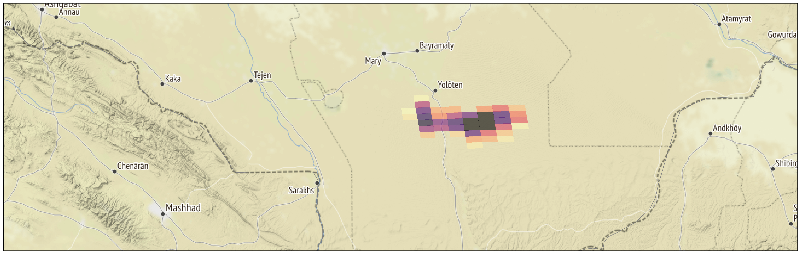

---
jupyter:
  jupytext:
    formats: md,ipynb
    text_representation:
      extension: .md
      format_name: markdown
      format_version: '1.3'
      jupytext_version: 1.15.2
  kernelspec:
    display_name: Python 3 (ipykernel)
    language: python
    name: python3
---



## Methane plumes observed by TROPOMI 

This example case focuses on detecting methane (CH4) plumes from oil/gas production in Turkmenistan using TROPOMI data. Turkmenistan has one of the largest natural gas reserves in the world and it is one of main oil and gas production basins. Turkmenistan ranks also as the highest methane "ultra-emitter" with 1.3 Mt emissions of CH4 per year [(Lauvaux et al., Science, 2022)](https://www.science.org/doi/epdf/10.1126/science.abj4351). The methane plumes over Turkmenistan are frequently visible in TROPOMI data. This notebook focus on single overpass TROPOMI CH4 data from March 2023. 


### Table of contents

1. [TROPOMI Level 2 methane data](#paragraph1)
2. [Python packages for the notebook](#paragraph2)
3. [Plotting XCH4 data on a map using AVL](#paragraph4)
4. [AVL scatter and histogram plots](#paragraph5)
5. [References](#harp_references)


### 1. TROPOMI Level 2 methane data <a name="paragraph1"></a>

The TROPOMI methane product data file provides the **column average dry air mixing ratio** of methane, **XCH4**.  This notebook uses TROPOMI methane data  from **12th March 2023** (orbit number 28034):

`S5P_OFFL_L2__CH4____20230312T082359_20230312T100529_28034_03_020500_20230315T154121.nc`

The TROPOMI level 2 data used in this notebook can be downloaded 
- from [Sentinel-5P Pre-Operations Data Hub](https://s5phub.copernicus.eu/dhus/#/home),
- from [new Copernicus dataspace browser](https://dataspace.copernicus.eu/browser/),
- using the eofetch package, eg. as in [Use case 2](https://atmospherictoolbox.org/media//usecases/Usecase_2_S5P_AAI_Siberia_Smoke.html#paragraph3).
 
In addition to the offline timeliness (_OFFL_) the TROPOMI methane files may have reprocessed version available (_RPRO_) that should be used if available. More information about the data product and e.g. reprocerssing can be found from the following documents:

- [CH4 Product Readme File](https://sentinels.copernicus.eu/documents/247904/3541451/Sentinel-5P-Methane-Product-Readme-File).
- [CH4 Algorithm Thoretical Basis Document](https://sentinels.copernicus.eu/documents/247904/2476257/Sentinel-5P-TROPOMI-ATBD-Methane-retrieval.pdf)
- [CH4 Product User Manual](https://sentinels.copernicus.eu/documents/247904/2474726/Sentinel-5P-Level-2-Product-User-Manual-Methane.pdf)


## 2. Python packages for the notebook <a name="paragraph2"></a>

The preparations needed to set up avl is shown in [Use case 6](https://atmospherictoolbox.org/media/usecases/Usecase_6_CO_European_wildfires_2022.html#paragraph1). Following packages are needed to run this notebook:

```python
import harp
import avl
import eofetch
```

## 3. Plotting single overpass XCH4 data on a map using AVL <a name="paragraph4"></a>

When when importing the methane data the following operations are done: 

**1)**`CH4_column_volume_mixing_ratio_dry_air_validity>50`: for using only those pixels that are of high quality. More about the quality criteria recommended for CH4 product can be found from [Product Readme File for methane](https://sentinels.copernicus.eu/documents/247904/3541451/Sentinel-5P-Methane-Product-Readme-File).

**2)** `latitude>34;latitude<43,longitude>5;latitude<67`: to cut the data over Turkmenistan.

```python
filename_tropomi = "S5P_OFFL_L2__CH4____20230312T082359_20230312T100529_28034_03_020500_20230315T154121.nc"
eofetch.download(filename_tropomi)
operations_avl = ";".join([
    "CH4_column_volume_mixing_ratio_dry_air_validity>50", 
    "latitude>34;latitude<43","longitude>5;latitude<67"])
```

The parameter to be viewed is the **bias corrected XCH4**, i.e., the column volume mixing ratio that is corrected for the dependence on surface albedo. To change the default XCH4 to the bias correceted XCH4, ingestion option `"ch4=bias_corrected"` needs to be applied when importing the data: 

```python
ch4product=harp.import_product(filename_tropomi, operations_avl, options="ch4=bias_corrected")
```

To plot the methane observations on the map,  the `avl.Geo` is used as in [Use case 6](https://atmospherictoolbox.org/media/usecases/Usecase_6_CO_European_wildfires_2022.html#paragraph3). The variable name to be plotted is `"CH4_column_volume_mixing_ratio_dry_air"` :

```python
varname = 'CH4_column_volume_mixing_ratio_dry_air'

avl.Geo(ch4product, varname, colormap='magma_r', colorrange=(1910, 1940), opacity=0.5, showcolorbar=True, centerlat=38, centerlon=59.5, zoom=8)
```

On 12th March 2023 a methane plume east from Asgabat is visible in TROPOMI observations, as the emissions stand out clearly from the background. 


## 4. AVL scatter and histogram plots <a name="paragraph5"></a>

AVL offers also functions for scatter and histogram plots. A scatter plot of the methane data imported above can be done with the following command, representing the XCH4 values along the observation time:

```python
avl.Scatter(ch4product, varname)
```

The imported methane data over Turkmenistan can be also represented as an histogram with the following command:

```python
avl.Histogram(ch4product, varname, bins=50)
```

## 6. References <a name="harp_references"></a>

- [HARP S5P\_L2\_CH4](http://stcorp.github.io/harp/doc/html/ingestions/S5P_L2_CH4.html)
- [HARP operations documentation](http://stcorp.github.io/harp/doc/html/operations.html)
- [Github demos of AVL plotting](https://github.com/stcorp/avl-demo-lps2022)
- [CH4 Product Readme File](https://sentinels.copernicus.eu/documents/247904/3541451/Sentinel-5P-Methane-Product-Readme-File).
- [CH4 Algorithm Thoretical Basis Document](https://sentinels.copernicus.eu/documents/247904/2476257/Sentinel-5P-TROPOMI-ATBD-Methane-retrieval.pdf)
- [CH4 Product User Manual](https://sentinels.copernicus.eu/documents/247904/2474726/Sentinel-5P-Level-2-Product-User-Manual-Methane.pdf)
